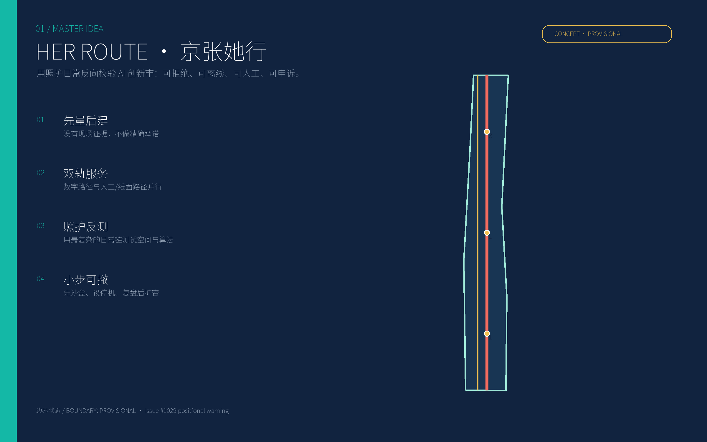
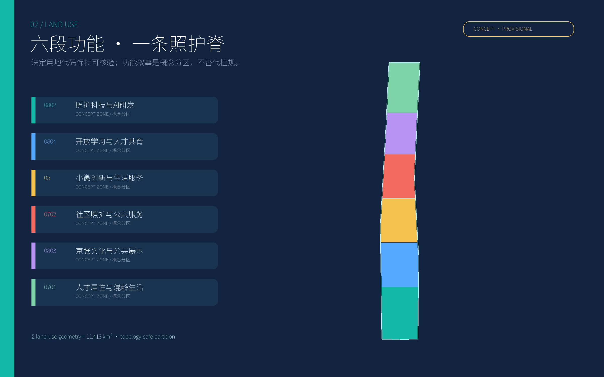
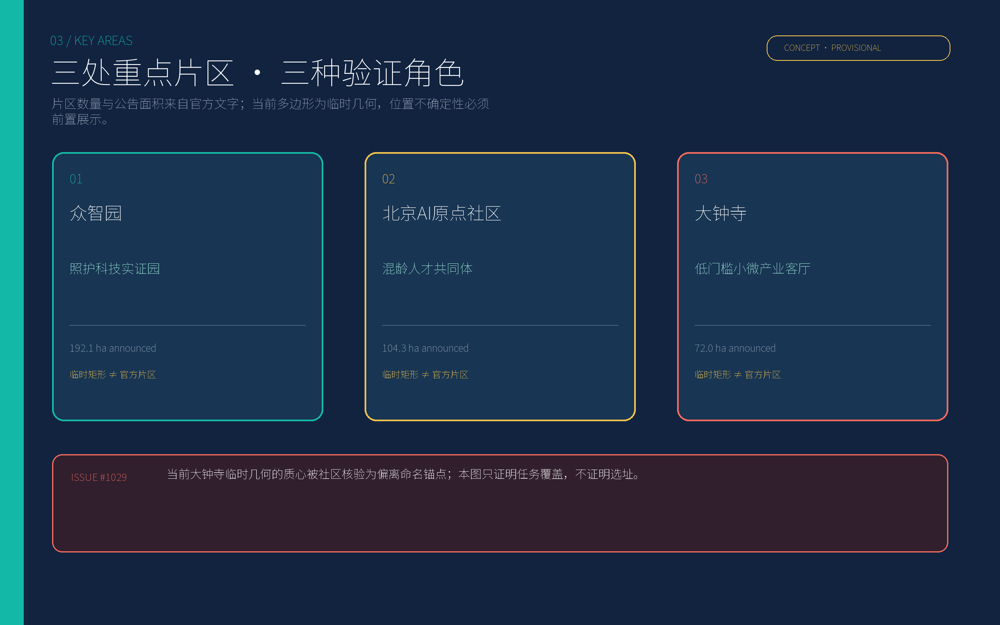
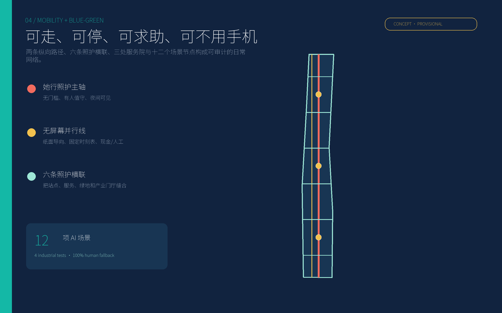
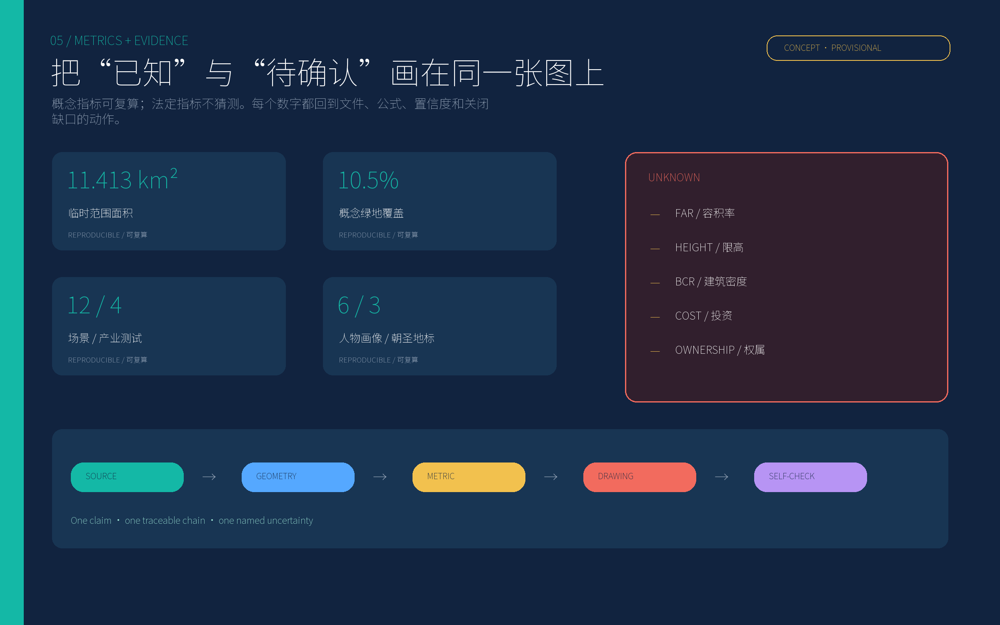

# 京张她行 HER ROUTE：由照护日常反向校验的 AI 创新带

本方案不再向城市叠加一个无所不能的“AI 大脑”。它先问一件具体的小事：一个带着孩子、提着物品、行动不便、夜间下班或不愿被识别的人，能否在不用智能手机、不交出多余数据、需要临时帮助时，仍然安全、体面地完成一段日常行程？如果答案是否定的，算法再先进、建筑再新，也不算创新。

“HER”同时指向她，也代表 **Human fallback（人工兜底）—Evidence before expansion（有证据再扩张）—Refusable technology（可拒绝的技术）**。空间上形成“一条照护主轴、一条无屏幕并行线、六条横联、三座照护院”；治理上形成“先量后建—小规模沙盒—公开复盘—达标扩容—随时停机”的闭环。[source:REPO-ISSUE-1061] [standard:PROJECT-AGENT-OPEN-CALL-TASKBOOK]

## 设计依据与资料清单

方案以官方公告和仓库 site package 为主控，任务书摘要补充智能体任务、场景、品牌与运营要求；source registry 决定哪些资料可以进入正式判断。[source:OFFICIAL-ANNOUNCEMENT] [source:SITE-PACKAGE] [source:SOURCE-REGISTRY]

资料分四级使用：①官方公开：三层范围、三处重点片区名称与公告面积、任务与成果语境；②用户清权：智能体任务书结构；③仓库处理资料：仅作导航；④临时几何：只用于概念生成、图示和自检。总体范围及三处重点区域均不是官方红线，且 Issue #1029 指出当前临时几何与命名锚点存在显著位置不一致。因此本方案不计算精确站点步行时距、不判断地块权属、不把临时矩形写成片区边界。[source:PROCESSED-FACT-PACK] [source:BOUNDARY-SOURCE] [source:REPO-ISSUE-1029]

法定容积率、限高、建筑密度、绿地率、道路红线、退线、市政容量、权属和拆改条件缺失，全部保持 `unknown` 或 `pending_field_survey`。概念分区面积可复算，但只是设计几何，不是法定指标。[metric:floor_area_ratio] [assumption:A-CONTROLS-003] [depth:development_intensity_controls]

国际案例只提炼方法，不做形式复制：

| 案例 | 可转译的机制 | 京张落点 |
|---|---|---|
| 维也纳性别主流化规划 | 在规划全过程检查不同生活阶段与使用者受到的影响 | 每个空间/算法都做“照护链影响检查”，不是增设一个“女性专区” [source:VIENNA-GENDER-PLANNING] |
| 巴塞罗那公共空间游戏计划 | 把儿童、年龄、性别与功能多样性作为公共空间系统层 | 横联节点同时服务游戏、等候、休息和照护 [source:BARCELONA-PLAY-PLAN] |
| 赫尔辛基 Kalasatama | 用生活实验室和小规模试验验证真实使用 | 一期先开三条街段、三座院和四项产业测试 [source:HELSINKI-KALASATAMA] |
| 新加坡榜鹅数字园区 | 教育、研发、企业与开放数字平台共置 | 产业测试与高校课程、社区服务共同立项 [source:PUNGGOL-DIGITAL-DISTRICT] |
| 多伦多滨水数字治理 | 数字创新接受独立审查、隐私和民主问责 | 设公众可读影响评估、申诉与停机记录 [source:TORONTO-DIGITAL-GOVERNANCE] |
| 首尔 S-Map | 在数字孪生中先试验再进入真实城市 | 站点拥挤、热环境与机器人路线先在沙盒模拟 [source:SEOUL-SMAP] |
| 蒙特利尔 Mila / Mile-Ex | 科研、人才、初创、企业实验室与公共交流共置 | 三片区分别承担实证、共同体和转化角色 [source:MILA-MILEEX] |
| UN Women 安全城市 | 本地数据、共同治理与女性自主出行同等重要 | 安全不等于加摄像头，先做匿名化伴随审计和共同决策 [source:UNWOMEN-SAFE-CITIES] |

## 三层范围工作框架

**统筹研究范围（约43.6平方公里）**负责产业网络、人才服务、轨道与创新资源协同。成果不是画满总图，而是形成伙伴地图、年度活动历和可复制的照护链审计协议。

**总体设计范围（公告约11.4平方公里）**负责空间骨架与更新机制：沿京张遗址公园组织纵向照护主轴和无屏幕并行线，以六条横联连接轨道、产业门厅、公共服务和绿地；六段概念功能带覆盖全部临时范围。[data:geometry/site_boundary.geojson#SITE-001] [data:geometry/land_use.geojson#LU-001] [depth:three_level_scope_framework]

**重点区域（公告合计约368.4公顷）**负责把概念落为可验证的场景、门厅、院落和运营合同。众智园约192.1公顷、北京AI原点社区约104.3公顷、大钟寺约72.0公顷的数字来自公告文字；当前 polygon 仅证明任务覆盖。[source:KEY-AREA-SOURCE] [metric:key_area_count] [assumption:A-LOCATION-002]

官方矢量到来后的替换协议是：锁定 CRS 和版本 → 替换 site/key-area polygon → 拓扑裁剪所有设计图层 → 复算面积和比率 → 重绘五张图与两套 PDF → 再跑 self-check。任何替换不得只改图、不改指标。

## 统筹研究范围产业与未来城市研究

产业定位为“**照护复杂性驱动的可信 AI 实证带**”：不是泛化的机器人展厅，而是让 AI 企业面对最难服务的日常条件——多任务、低注意力、弱网络、语言差异、行动不便、临时求助和拒绝识别。通过真实但受控的公共问题，把模型能力转化为可审计产品。

产业链分五层：基础研究与安全评测；无障碍人机交互与端侧模型；照护、出行、健康、能源等场景产品；街区沙盒与第三方评估；政府采购、企业首用与国际传播。三片区分别承担“实证—共同体—转化”，高校、医院、社区、运营商和无障碍组织进入同一项目委员会。[standard:MOHURD-URBAN-DESIGN-MEASURES] [depth:overall_spatial_structure]

品牌识别采用“**两条并行轨**”：珊瑚色轨道代表被看见的照护劳动，青绿色轨道代表开放技术；二者不合并，表达数字服务和人工/非数字服务长期并行。Logo 是两条轨在三个圆形节点间穿行形成的 `H`，不使用真实铁路标识，不冒充官方品牌。

年度运营不是一次性节庆，而是四季验证循环：春季“她行踏勘周”收集匿名问题；夏季“夜路与热浪测试季”做极端工况；秋季“照护科技实证会”公开通过/失败；冬季“停机与申诉复盘月”决定哪些项目退出。国际论坛只展示有前后对照、有失败记录、有人工兜底的项目。

## 总体设计范围城市更新与控规深度城市设计

总体结构为“**一脊一副、六横三院、六段混合**”。一脊是有人值守、连续遮荫、夜间可读的她行照护主轴；一副是完全不依赖手机的并行慢行线；六横是短距离连接轨道、公共服务、产业门厅与公园的照护横联；三院是可休息、饮水、如厕、哺乳、充电、问路和短时托护的公共客厅。[data:geometry/roads.geojson#ROAD-CARE-SPINE] [data:geometry/public_space.geojson#PUBLIC-CARE-01]

六段概念分区自南向北包括科研0802、教育0804、商业服务05、社区服务0702、文化0803和居住0701。代码遵守仓库提供的国土空间用途分类子集，分区表达跨地块的功能倾向，不替代法定用地边界。[standard:MNR-LAND-USE-CLASSIFICATION-GUIDE] [data:geometry/land_use.geojson#LU-004]

更新采用“先软后硬、可逆优先”：一期先做照明修补、树荫、座椅、无障碍连续性、纸面导向、共享门厅和运营协议；二期根据实测补充空间；三期才讨论结构性改造。没有现状调查，不判断哪栋拆、改、留；图中的12个建筑基底均为设计示意。[data:geometry/buildings.geojson#BLDG-001] [assumption:A-OWNERSHIP-005] [depth:retain_renovate_demolish]

城市风貌不制造统一“AI 皮肤”。沿京张遗址保留材料的时间感，新增部分采用可识别、可拆卸的轻型构件；首层透明度、雨棚、坐凳与入口高差以现场审计为依据。限高、天际线和色彩分区留待官方控制与现状测绘，不编造数值。[metric:building_height_limit_m] [depth:height_massing_character]

## 重点区域详细设计

### 1. 众智园：照护科技实证园

定位为研发到实证的“证据工厂”。空间结构为共享实验门厅—可逆试验街段—照护共创院—京张公园接口。首批项目包括轮椅/婴儿车混合通行测试、弱网导向、陪护机器人安全停靠和热环境个体差异模型。企业只有在第三方测试、公众可读说明和人工接管均达标后，才进入真实运营。片区 polygon 为临时范围，项目落点必须待官方边界和现状权属后确定。[data:geometry/key_areas.geojson#PROV-KEY-001] [assumption:A-BOUNDARY-001]

### 2. 北京AI原点社区：混龄人才共同体

定位为“创新者也需要被照护”的生活样板。空间结构为原点互助厅—混龄居住—共享厨房与学习室—15分钟照护横联。住房不只服务单身青年，也支持带子女研究者、双职工家庭、老年照护者和短期访问学者；租赁、托护和夜间服务由运营协议而非豪华硬件定义。AI 只用于自愿的排班、空间预约和能耗建议，不推断个人健康或家庭关系。[data:geometry/key_areas.geojson#PROV-KEY-002] [standard:BARRIER-FREE-ENVIRONMENT-LAW]

### 3. 大钟寺：低门槛小微产业客厅

定位为技术转化、公共展示与城市服务的交界。空间结构为京张她行客厅—小微工作间—文化展廊—夜间安全横联。重点降低小团队进入门槛：共享评测设备、短租工位、公开路演、法律与采购咨询；每项展示必须同时说明“谁受益、谁承担风险、失败如何退出”。当前临时几何被 Issue #1029 指出与大钟寺命名锚点不一致，本章节只给出功能模型，不给出精确总平面结论。[data:geometry/key_areas.geojson#PROV-KEY-003] [source:REPO-ISSUE-1029]

三片区共同采用七段实施表：定位、空间结构、项目清单、通行与服务、AI 场景、运营主体、触发/停机条件。官方边界发布后，任何项目只有同时通过位置、权属、无障碍、数据治理和运营资金五项门槛才可落位。

## AI 创新生态、人才画像与 AI+ 场景

六类人物画像是**现场审计脚本**，不是已完成的本地访谈结论：①带幼儿通勤的研发人员；②照护老人的中年职工；③使用轮椅的访问学者；④不熟悉智能手机的老年居民；⑤夜间保洁/安保/餐饮工作者；⑥短期来访、语言不熟的国际创业者。每类都要在昼夜、工作日/周末完成伴随式步行与任务测试。[assumption:A-FIELD-004] [metric:persona_count]

以下12张场景卡都包含空间、对象、最低数据、人工兜底、运营主体和停机条件，其中 **T1—T4 为产业测试/验证场景**：

| ID | 场景与位置 | 使用者/时刻 | AI 与最低数据 | 人工/非数字兜底 | 运营与验证/停机 |
|---|---|---|---|---|---|
| T1 产业验证 | 弱网无障碍导航；众智园试验街 | 轮椅、婴儿车、访客；昼/夜 | 端侧路径模型，只读匿名障碍点 | 纸面触觉图、固定标识、值守引导 | 园区+无障碍组织；误导或绕行增加即停 |
| T2 产业验证 | 陪护机器人交接湾；照护院门厅 | 照护者、儿童、老人 | 设备状态和自愿任务码，不做人脸识别 | 有人柜台、普通手推车 | 企业+物业；失联、碰撞或无法接管即停 |
| T3 产业验证 | 个体差异热舒适；绿环 | 户外工作者、老人、孕妇 | 微气候传感器和匿名主观投票 | 饮水、遮荫、开放室内休息点 | 公园运营+高校；建议与实感持续冲突即停 |
| T4 产业验证 | 多语言公共服务助手；大钟寺客厅 | 国际访客、听障使用者 | 当次语音/文本，本地处理后删除 | 人工翻译预约、图形卡、纸面表格 | 公共服务台；高风险事项误译即退出该事项 |
| S5 | 照护链换乘建议；横联节点 | 带孩通勤者、照护老人职工 | 自愿输入的时间与无障碍偏好 | 固定时刻表、人工问路 | 交通运营；不得涨价或差别待遇 |
| S6 | 可申诉的夜路照明；主轴 | 夜班人员、独行者 | 照度/故障，不采集身份与轨迹 | 固定照明、巡查电话、有人值守点 | 市政+物业；黑区或投诉积压触发人工巡检 |
| S7 | 安静空间预约；原点社区 | 神经多样性使用者、照护家庭 | 时段与人数，不记录诊断 | 现场排队、电话预约 | 社区运营；高峰排斥无手机者即调配配额 |
| S8 | 托护资源匹配；三座照护院 | 职工、居民、临时访客 | 自愿时段、年龄段、服务需求 | 人工登记、纸质凭证 | 持证服务机构；资质/容量不透明即停 |
| S9 | 共享设备排队；众智园 | 初创、小团队、学生 | 项目账号和设备时段 | 柜台排队、电话登记 | 园区平台；大企业挤占触发公平配额 |
| S10 | 能源建议而非自动控制；人才居住 | 家庭、访问学者 | 户级汇总能耗 | 手动开关、纸质账单 | 能源服务商；不因拒绝数据降低基础服务 |
| S11 | 京张口述史检索；文化展廊 | 老人、学生、游客 | 公共档案索引，不合成未标注史实 | 馆员讲解、实体档案目录 | 文化机构；来源不明内容下架复核 |
| S12 | 公众项目账本；所有试点 | 所有人 | 预算级别、测试结果、投诉与停机日志 | 线下公告栏、定期说明会 | 独立委员会；不公开关键记录不得扩容 |

所有场景默认不以“提高安全”为由扩张身份识别。安全首先来自连续可见、照明、开放门厅、有人服务、可达厕所、可停留座椅和及时维修；AI 只在这些基础条件上做辅助。[source:UNWOMEN-SAFE-CITIES] [assumption:A-DATA-006] [standard:GENERATIVE-AI-INTERIM-MEASURES]

## 用地、建筑规模与拆改留方案

概念用地六段完整覆盖临时总体范围，面积和拓扑由 `land_use.geojson` 复算；绿环、三座公共院和12个示意建筑基底位于临时范围内。[metric:land_use_area_sqm] [metric:building_footprint_area_sqm] [depth:land_use_layout]

建筑策略分四类但不预判具体对象：保留修缮适用于价值明确且结构可用的建筑；低扰动改造适用于首层开放、无障碍和能效修补；可逆插入适用于共享门厅与轻型试验空间；拆除重建只有在结构、权属、遗产、租户安置和碳排核算完成后才能讨论。当前所有 feature 的 `retain_renovate_demolish=pending_field_survey`。[assumption:A-OWNERSHIP-005] [depth:retain_renovate_demolish]

建筑规模采用“容量—服务—影响”三联校核，而不是先给总量：每新增一处研发或居住空间，须同时说明照护服务容量、公共空间负荷、交通与市政影响。容积率、建筑高度、建筑密度和总建筑规模因缺少法定控制保持未知；本方案不以示意建筑基底面积反推总建面。[metric:floor_area_ratio] [metric:building_height_limit_m] [metric:building_coverage_ratio]

## 交通、轨道、市政与公共服务设施

交通优先级为步行/轮椅/婴儿车连续性，其次是自行车与接驳，再次是必要机动车。她行主轴承担照护与服务可见性；无屏幕并行线用永久标识、纸面地图和固定信息保证在断网、没电或拒绝授权时仍可使用；六条横联把轨道入口、产业门厅、公共服务和绿地缝合。[data:geometry/roads.geojson#ROAD-ANALOG] [metric:concept_road_centerline_length_m] [depth:traffic_rail_slow_parking]

轨道站城一体化目前只提出接口规则，不画精确站口：站前必须有清晰视线、无障碍连续面、有人问询、遮雨等候和夜间照明；站口至照护院的具体距离必须在官方边界和现状测绘后复核。停车与上下客采用“照护优先时段”试点，但不得把性别作为准入条件。

市政与新基建遵循低技术先行：基础照明、排水、饮水、厕所、树荫和维护台账先于传感器；传感器采用边缘计算、最小采样和明确保存期限；数字孪生用于模拟而不是替代现场检验。[source:SEOUL-SMAP] [depth:municipal_new_infrastructure]

公共服务形成三级网：每个横联有座椅、饮水和求助；三座照护院有厕所、哺乳、安静空间、人工服务和短时照护；重点片区有持证托护、健康咨询、法律与就业服务。人工办理严格按适用法律与具体事项落实，同时将非数字路径作为更广的设计承诺。[standard:BARRIER-FREE-ENVIRONMENT-LAW] [standard:ELDERLY-SMART-TECH-PLAN-2020-45]

## 蓝绿空间、公共空间与城市风貌

蓝绿系统由连续遮荫的照护绿环与三处休息花园组成，概念面积和比率可复算，但不等同于法定绿地率。[data:geometry/green_space.geojson#GREEN-CARE-LOOP] [metric:green_ratio] [depth:blue_green_public_space]

每处公共空间执行“七件套”：可见入口、连续无障碍面、不同高度座椅、饮水、厕所导向、夜间照明、人工求助。儿童游戏不被围进孤立设施，而与等候、社交、慢行和自然体验复合；照护者能坐、能看见、能短暂停留。[source:BARCELONA-PLAY-PLAN]

三处 AI 朝圣地标不做巨型雕塑：①**照护算法试验桥**——把通过与失败的测试公开在步行界面；②**原点互助厅**——任何人可在不用手机的情况下获得服务；③**失败博物馆与停机钟**——长期展示被停用的算法、原因与改进。它们把京张工程史的“可检验、可维护”精神转译为 AI 文化。[metric:pilgrimage_landmark_count] [standard:PROJECT-AGENT-OPEN-CALL-TASKBOOK]

风貌采用铁路工业遗存的深色基底、青绿开放技术、珊瑚照护路径和金色警示/待确认。临时边界只画虚线，不用大色块塑造成确定地块。广告、屏幕和互动装置设置静默模式，确保夜间居住与神经多样性友好。

## 更新项目清单、实施政策与分期计划

| 阶段 | 项目 | 责任与政策 | 验收/退出 |
|---|---|---|---|
| 2026—2027 先量后建 | 六类人物伴随审计、三条试验街段、三座临时照护院、纸面导向、T1—T4产业测试 | 区级协调、运营单位、高校、无障碍/妇女与社区组织；低—中投资量级 | 公布基线、投诉和失败；无法人工接管的AI不进入二期 |
| 2028—2030 节点成网 | 六横联、连续遮荫绿环、共享门厅、原点互助厅、公共项目账本 | 把照护服务与空间维护写入采购和租赁条款 | 使用差异缩小、非数字路径可用、维护资金明确后扩容 |
| 2031+ 复盘扩展 | 结构性改造、站城接口、国际实证网络 | 以官方控规、权属、工程和长期运营协议为前提 | 五年一次归零评估；不达标项目退场而非永久续建 |

分期几何只表示工作次序，不表示行政实施边界。[data:geometry/phasing.geojson#PHASE-001] [depth:phasing_implementation] [assumption:A-COST-007]

政策工具包括：小额可逆试点采购；照护影响评估；数据与算法影响评估；人工服务最低条款；失败免责但隐瞒不免责；第三方无障碍与性别审计；公开停机日志；小微企业设备共享配额。年度运营收入可来自研究合作、企业测试、场地与培训，但基础公共服务不得依赖活动门票。

## 指标体系、面积复算与合规矩阵

指标分四组。**空间**：临时范围面积、概念绿地/公共空间面积与比率、横联连续性；**使用**：六类人物完成任务的时间、绕行、求助成功率和主观负担；**AI治理**：可拒绝率、人工接管成功率、投诉关闭、停机与数据删除；**产业**：测试数量、失败公开率、小微企业使用配额、从沙盒到采购的证据完整度。

当前可复算但仅属概念的数值包括临时范围约11.413平方公里、概念绿地面积/比率、公共空间面积/比率、道路中心线长度、场景12项、产业验证4项、人物画像6类、朝圣地标3处。[metric:site_area_sqm] [metric:green_space_area_sqm] [metric:ai_scenario_count]

验收不只看平均值，至少按人物、昼夜、是否使用智能手机和行动能力分组；任何组因新系统而显著恶化，都触发复盘。尚未完成本地田野调查，因此不设虚假的改善百分比；一期只定义基线采集方法和决策阈值的制定程序。[assumption:A-FIELD-004] [depth:metrics_recalculation]

合规证据链为：来源 → 几何/场景 → 指标 → 图纸/正文 → 自检。`compliance_matrix.json` 对应公告23项以上要求，`standard_matrix.json` 对应项目与专业标准，`design_depth_matrix.json` 明确完整、缺口和待深化项。法定控制未知不会被“通过”掩盖。[standard:MOHURD-CONTROL-DETAILED-PLANNING] [depth:risk_missing_data]

## 风险、版权与合规说明

首要风险不是技术失败，而是把临时边界、概念指标和人物假设写成现实。对策是显著标注 provisional、Issue #1029 警告、所有法定指标 unknown、官方矢量替换后全量重算。[source:REPO-ISSUE-1029] [assumption:A-BOUNDARY-001]

第二风险是“安全”成为监控扩张的理由。对策是环境设计优先、身份识别默认禁止、数据最小化、人工路径等价、公众影响评估、独立申诉与可执行停机。场景不承诺自动执法、医疗诊断或差别定价。[standard:GENERATIVE-AI-INTERIM-MEASURES] [assumption:A-DATA-006]

第三风险是表演赛：术语很多，没人负责维护。每个项目必须回答谁使用、何时使用、最低服务、运营主体、成本量级、如何验收、何时退出；项目账本公开失败与维护，不以活动人次替代日常可用性。[source:REPO-ISSUE-1061]

第四风险是排斥。人工、纸面、电话与现场路径不是临时过渡，而是长期系统；不得因拒绝授权而降低基础服务。对本地群体的任何判断须由匿名化、知情同意、可撤回的现场研究产生。[standard:ELDERLY-SMART-TECH-PLAN-2020-45] [source:UNWOMEN-SAFE-CITIES]

文字、图表、空间示意与排版由 OpenAI Codex 为本次任务原创生成；未使用外部摄影、遥感底图或未授权图标。仓库资料和国际案例仅作事实与方法引用，详细声明见 `report/copyright_statement.md`。本包不能替代法定规划、建筑/市政工程设计、法律意见或公众协商。

## 参考资料

1. 北京市规划和自然资源委员会海淀分局，征集资格预审公告。[source:OFFICIAL-ANNOUNCEMENT]
2. open-city-ai/haidian，site package、source registry、processed fact pack、任务书摘要与 provisional geometry。[source:SITE-PACKAGE] [source:SOURCE-REGISTRY]
3. 仓库 Issues #1029、#1061：位置不一致与反表演赛的社区审查意见。[source:REPO-ISSUE-1029] [source:REPO-ISSUE-1061]
4. City of Vienna，Gender Mainstreaming in Urban Planning and Urban Development。[source:VIENNA-GENDER-PLANNING]
5. Ajuntament de Barcelona，Public Space Play Plan Horizon 2030。[source:BARCELONA-PLAY-PLAN]
6. Forum Virium Helsinki，Smart Kalasatama living-lab tools。[source:HELSINKI-KALASATAMA]
7. JTC Singapore，Punggol Digital District。[source:PUNGGOL-DIGITAL-DISTRICT]
8. Waterfront Toronto，Digital Strategy Advisory Panel and governance review。[source:TORONTO-DIGITAL-GOVERNANCE]
9. Seoul Metropolitan Government，S-Map Open Lab。[source:SEOUL-SMAP]
10. Mila，Mile-Ex AI ecosystem premises。[source:MILA-MILEEX]
11. UN Women，Safe Cities and Safe Public Spaces compendium。[source:UNWOMEN-SAFE-CITIES]

机器可读的完整来源、用途、发布者与访问日期以 `sources.json` 为准。
