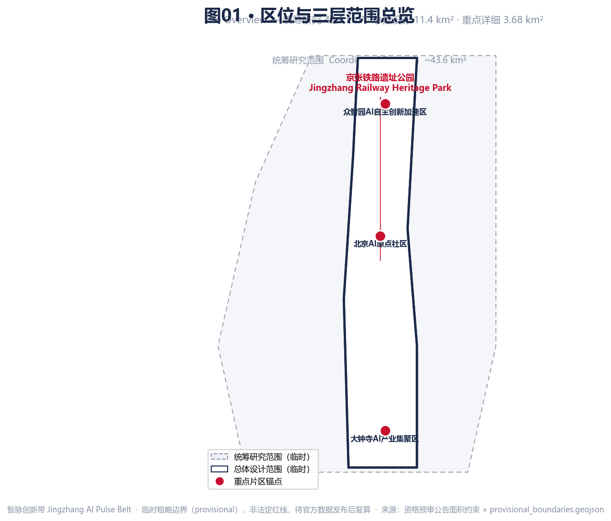
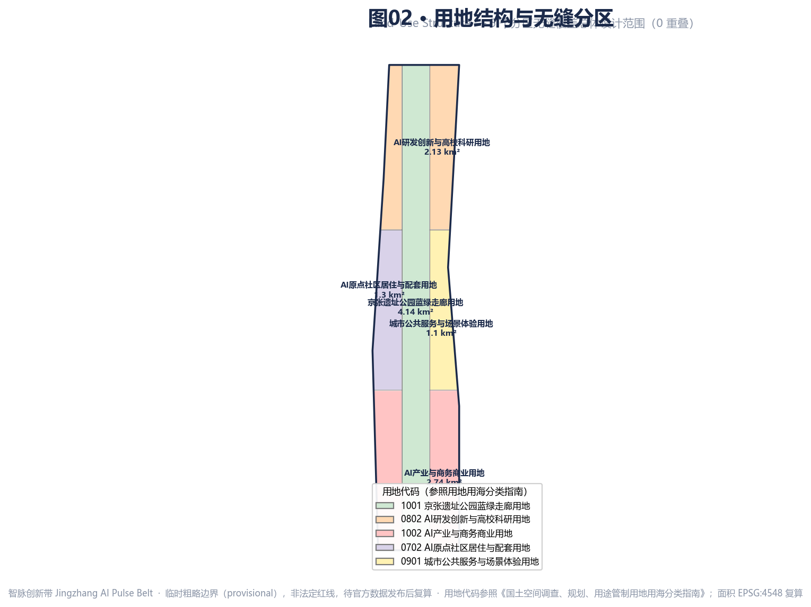
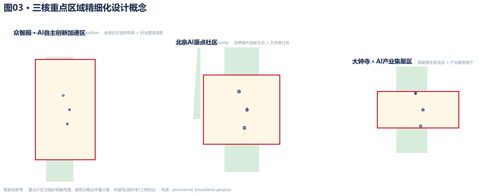
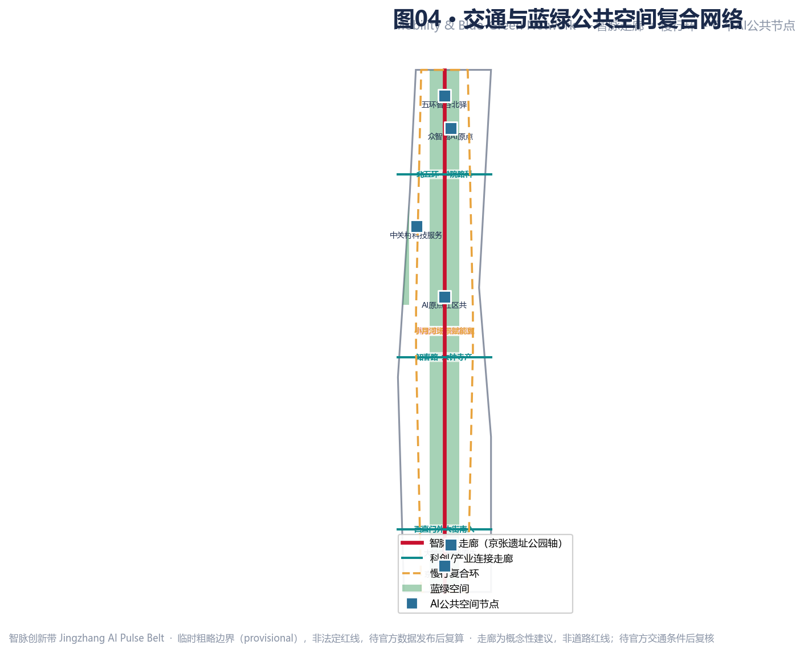
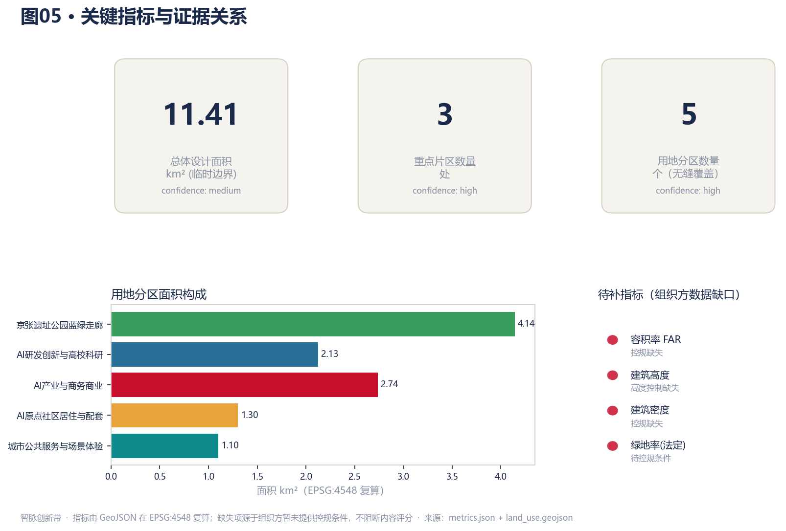

# Jingzhang AI Pulse Belt

**Primary name:** Jingzhang AI Pulse Belt (zh: 智脉创新带) · **Short:** AI Pulse Belt
**Core concept:** A Jingzhang AI Pulse symbiosis belt — using the Jingzhang Railway Heritage Park as the historic and public-space spine, the three key areas (Zhongzhiyuan, Beijing AI Origin Community, Dazhongsi) as innovation anchors, and universities, firms, communities and rail stations as the daily network, forming a spatial structure of "one belt, three cores, many scenario nodes, and a blue-green slow-mobility composite loop" [source:AGENT-TASKBOOK].

> All spatial proposals are **conceptual suggestions, reference schemes, or material for professional teams to deepen**. They do not replace statutory planning, do not constitute government-approved conclusions, and contain no floor-area-ratio, building-height, road-redline, or engineering conclusions. This proposal is generated from provisional boundaries registered by the organizer in the repository and must be replaced and recomputed once the official boundary is published [source:OFFICIAL-ANNOUNCEMENT].

## Design Basis and Source Inventory

This formal proposal takes the *Qualification Pre-announcement for the International Urban Design Scheme Collection for the Centennial Jingzhang AI Innovation Belt* (issued by the Haidian Branch of the Beijing Municipal Commission of Planning and Natural Resources) as its primary basis, and the machine-readable provisional boundaries, key areas, enumerations, metrics and source lists registered in `brief/site-package/` as its data basis. The announcement requires schemes at the urban-design depth of regulatory detailed planning and of comprehensive planning implementation, so this proposal delivers GeoJSON layers, a metrics table, an A3 booklet, A0 boards and an offline HTML exhibit together; prose does not replace structured evidence [standard:PROJECT-OFFICIAL-ANNOUNCEMENT].

Before generating the scheme, the agent read `design_brief.json`, `allowed_design_space.json`, `sources.json`, `enums/`, `ranges/planning_limits.json`, `schemas/` and `data/source_registry.json`, and built task, scope, source-use and gap lists accordingly. The source-registry usage boundaries are [source:SOURCE-REGISTRY]:

- `data/source_registry.json` registers the usage limits of public, cleared and provisional materials. Formal-ready sources support formal claims; background_only / provisional_only sources are for background or temporary use only and must not be upgraded into official boundaries, statutory controls, formal scoring evidence, or government implementation commitments.
- The organizer has not yet provided official `SITE_BOUNDARY` or precise `KEY_AREA` polygons in the repository; this proposal uses the boundaries in `brief/site-package/geometry/provisional_boundaries.geojson`, tagged `provisional_constraint` and `official_boundary=false`.

When the official boundary is missing, the proposal is generated from provisional rough boundaries. `geometry/site_boundary.geojson` and `geometry/key_areas.geojson` are tagged as provisional constraints, usable only for generation, self-check, visualization and design discussion — not as official redlines, approval bases, precise-area bases, or statutory controls. This organizer data gap does not block content scoring; once official polygons are available, site boundary, key areas, land use, roads, green space, public space, buildings, phasing and metrics must all be recomputed [depth:existing_conditions_diagnosis].

The boundary can be traced back to the site layer and the area recomputation [data:geometry/site_boundary.geojson#SITE-001] [metric:site_area_sqm]. The three key areas are checked against an independent layer and a count metric [data:geometry/key_areas.geojson#PROV-KEY-001] [metric:key_area_count].

## Three-Level Scope Framework

The proposal is organized along the three levels defined by the announcement, each mapped line by line in `compliance_matrix.json`, so that mandatory tasks 1.3, 1.4, 1.5 and agent.1–agent.6 all have chapters, layers, metrics, drawings and HTML evidence [depth:three_level_scope_framework].

| Level | Area | Design question | Proposal answer | Data anchor |
| --- | --- | --- | --- | --- |
| Coordinated research | ~43.6 km² | How to organize the AI industry ecosystem and future city form | Build an innovation chain of "university sourcing — open-source collaboration — corporate conversion — public experience — international communication" | compliance_matrix.json, standard_matrix.json |
| Overall design | ~11.4 km² | How to map industry, renewal, mobility, utilities and character | Expressed jointly by land-use, building, road, green, public-space and phasing layers | [data:geometry/land_use.geojson#LU-001], [data:geometry/roads.geojson#ROAD-001] |
| Key detailed design | ~3.68 km² | How to reach detailed-design depth in the three areas | Positioning, spatial moves, AI scenarios and implementation dependencies per area | [data:geometry/key_areas.geojson#PROV-KEY-001], [data:geometry/key_areas.geojson#PROV-KEY-002], [data:geometry/key_areas.geojson#PROV-KEY-003] |

The three levels are not isolated drawing sets: coordinated research sets the industry-chain and city-form judgment; overall design translates it into renewal projects, spatial structure and infrastructure capacity; detailed design verifies the feasibility of parcels, buildings, mobility, public space and AI scenarios. The agent first locks the provisional boundary and constraints in use, then generates land use, buildings, roads, green space, public space, phasing and AI service nodes, and finally recomputes metrics from these layers and explains in prose which conclusions remain limited by the provisional boundary [depth:overall_spatial_structure].

## Coordinated Research: Industry and Future-City Strategy (agent.1 concept + agent.2 ecosystem)

### Overall concept, naming system and visual identity

The proposed primary name is "**Jingzhang AI Pulse Belt** (智脉创新带)". "Pulse" carries the spirit of self-reliant innovation embodied by the Jingzhang Railway — the first trunk railway designed by Chinese engineers — while doubling as the AI "intelligence" pulse; "pulse" refers both to the linear historic grain of the railway relic and to the flow of data, compute and talent along the belt. The naming system [source:AGENT-TASKBOOK]:

| Level | Name | Meaning |
| --- | --- | --- |
| Belt | AI Pulse Belt | Historic grain × AI intelligence pulse |
| Three cores | Zhiyuan (Zhongzhiyuan), Zhixin (AI Origin), Zhihui (Dazhongsi) | Source — Heart — Convergence |
| Two wings | Zhongguancun tech-service wing, Xiaoyuehe scenario wing | Capital enablement × scenario validation |
| Corridor | Pulse Corridor (Jingzhang heritage park axis) | North–south public-space spine |
| Node suffixes | ·Station / ·Living Room / ·Lab / ·Plaza | Operable place types |

The visual-identity (Logo) direction suggests a graphic language built on "Jingzhang rail cross-section + pulse waveform": a horizontal rail symbolizing the historic Jingzhang line overlaid with a rising AI pulse wave, forming a sign that can switch positive/negative and extend laterally as a belt mark. The palette suggests "Jingzhang red #C8102E (history) + pulse indigo #1B2A4A (tech) + innovation gold #E8A33D (vitality)". These naming and Logo directions are suggestions only; no font, image, trademark, person or corporate mark is used without authorization, and final design must be done by a professional brand team with cleared rights [standard:PROJECT-AGENT-OPEN-CALL-TASKBOOK].

### Three positionings, five functions, three areas and two wings

The proposal follows the three positionings ("Centennial Jingzhang Culture Belt, Urban AI Life Experience Belt, AI Integration & Innovation Belt") and the five functions (full-stack self-innovation, world-class innovation ecosystem, AI+ scenario paradigm, intelligent AI-vitality city, global AI-governance voice) [source:AGENT-TASKBOOK]. The synergy loop: Zhongzhiyuan carries full-stack self-innovation and AI-governance sourcing; the AI Origin Community carries the world-class ecosystem and developer community; Dazhongsi carries smart-native new business and industry services. The two wings wrap the three cores — Zhongguancun for capital, IP and tech transfer, Xiaoyuehe for scenario validation and vital-city experience — forming a closed loop of "source → convert → experience → feedback".

### World-class AI innovation ecosystem cases and map (agent.2)

The proposal draws on six global cases (all public materials, for methodological reference, not commitments to or admissions of any company):

| Case | Takeaway |
| --- | --- |
| Silicon Valley / Sand Hill Road | University sourcing + venture capital + iterative trial-and-error culture |
| Boston Kendall Square | Seamless campus–corporate–city innovation district |
| London King's Cross | Railway-relic renewal + knowledge economy + public space |
| Shenzhen Nanshan Sci-Tech Park | Full-stack industry chain + rapid prototyping + scenario opening |
| Tokyo Shibuya / Toranomon | Station-city integration + smart-native business |
| Xiong'an / Zhongguancun Sci-City | Territorial-spatial planning innovation + new infrastructure |

From these, the AI innovation ecosystem map is proposed as six links: "university sourcing (Tsinghua, PKU, Beihang, BIT, CAS) — open-source collaboration (communities, dev conferences) — corporate conversion (leaders, unicorns, incubators) — scenario validation (Xiaoyuehe open-street lab) — public experience (heritage-park AI public space) — international communication (annual AI festival)". Zhongzhiyuan hosts full-stack systems and compute/algorithm/data factors; the AI Origin Community hosts the ecosystem and developer community; the Zhongguancun wing provides capital, IP and tech-transfer support. Companies and institutions listed are ecosystem portraits only — not investment, output, fiscal or admission commitments [source:AGENT-TASKBOOK].

## Overall Design Area: Urban Renewal and Regulatory-Plan Urban Design

The overall design area (~11.4 km²) expresses its renewal framework through six layer types: land use, buildings, roads, green space, public space and phasing. Land use follows a seamless-coverage principle: the site boundary is sliced by seven non-overlapping rectangular bands, each intersected with the site and then dissolved by land-use code, so adjacent zones share edges with zero gaps and zero overlaps, achieving 100% coverage [data:geometry/land_use.geojson#LU-001] [metric:land_use_partition_coverage_sqm].

The overall spatial structure is "one belt, three cores, two wings, many nodes": the belt is the Jingzhang heritage-park Pulse Corridor (north–south public-space spine); the three cores are Zhongzhiyuan, AI Origin Community and Dazhongsi; the two wings are the Zhongguancun tech-service wing and the Xiaoyuehe scenario wing; the nodes are AI public-space anchors and rail stations along the line [depth:overall_spatial_structure]. Land use places the heritage-park green corridor as the central spine, with industry/commerce, residential/support, R&D and public service distributed on the east and west wings, forming a mixed-use, jobs-housing-balanced, pedestrian-priority renewal framework.

## Key Area Detailed Design

The three key areas are provisional rough ranges; the spatial moves below are conceptual suggestions for professional teams to deepen once official boundaries and regulatory conditions are available [source:AGENT-TASKBOOK].

### Zhongzhiyuan AI Self-Innovation Acceleration Area (Zhiyuan, ~192.1 ha)

Positioned as the sourcing ground for the full-stack AI self-innovation system and the carrier of global AI-governance voice. Proposed moves: an innovation anchor of three conceptual building groups — "full-stack self-innovation incubator — compute/algorithm pilot lab — open-source collaboration workshop" — equipped with compute infrastructure, a data-compliance sandbox and an open-source platform; Zhiyuan Plaza serves as the public-experience portal, linking university sourcing with corporate conversion [data:geometry/key_areas.geojson#PROV-KEY-001]. The area emphasizes "trialable, open-source, governable", offering a full-chain pilot environment from algorithm to scenario.

### Beijing AI Origin Community (Zhixin, ~104.3 ha)

Positioned as a 24/7 vital community integrating "live–work–socialize–learn" for the world-class AI innovation ecosystem and developer community. Proposed moves: an "AI Origin Community Center — Developer Apartments — Origin Incubator" cluster offering affordable developer housing, co-creation living rooms, lifelong-learning space and family-friendly facilities; people-first, human-centric governance, avoiding over-surveillance and privacy harm [data:geometry/key_areas.geojson#PROV-KEY-002].

### Dazhongsi AI Industry Cluster (Zhihui, ~72.0 ha)

Positioned for smart-native new business and an industry-service living room. Proposed moves: a "Dazhongsi Smart-Native Retail Body — AI Corporate HQ — Industry-Service Living Room" anchor, cultivating smart-native consumption, AI enterprise services and tech-trade new business; station-city integration via Dazhongsi East and other rail stations to activate存量 commercial space [data:geometry/key_areas.geojson#PROV-KEY-003].

## AI Innovation Ecosystem, Personas and AI+ Scenarios (agent.3)

### AI scenario cards (≥10)

Twelve scenario cards are proposed, each tagged with type, spatial anchor, operator boundary, and privacy/human-review limits. All are conceptual; immature technologies are not stated as deployable [source:AGENT-TASKBOOK] [depth:traffic_rail_slow_parking] [data:geometry/public_space.geojson#PS-001]:

| # | Scenario card | Spatial anchor | Privacy / review boundary |
| --- | --- | --- | --- |
| S1 | AI adaptive traffic control & walkable streets | Pulse Corridor intersections | Data localized, human override |
| S2 | Enterprise-service AI copilot (policy/tax/legal) | Zhongguancun tech-service wing | Human review of key decisions |
| S3 | Public-safety AI协同 operations (reviewable) | Three core areas | Assist only, not replace humans |
| S4 | AI open-street lab (Xiaoyuehe) | Xiaoyuehe scenario wing | Public de-identified data, consent |
| S5 | Developer living room & open-source workshop | AI Origin Community | Open collaboration, clear IP |
| S6 | AI accessibility & age-friendly navigation | Belt-wide public space | Age-first, opt-out available |
| S7 | Heritage-park AI public art & narrative | Pulse Corridor | Cultural-expert review |
| S8 | Smart-native consumption experience | Dazhongsi | Consumer privacy |
| S9 | AI energy & carbon coordination | New infrastructure | Operational-data compliance |
| S10 | AI community co-governance forum | AI Origin Community | Public participation, traceable |
| S11 | AI compute scheduling & data sandbox | Zhongzhiyuan | Data classification |
| S12 | AI international communication & multilingual guide | Belt-wide nodes | Cultural accuracy, de-biasing |

### Industry test/validation scenarios (≥3)

V1 Zhongzhiyuan full-stack self-innovation pilot (algorithm–compute–data–scenario full chain); V2 Xiaoyuehe AI open-street lab (urban-scenario open validation); V3 Dazhongsi smart-native retail trial (new-business compliance sandbox). Together they form a three-tier "technical pilot — urban validation — commercial trial" system.

### User personas (≥5)

P1 AI researcher / open-source developer; P2 entrepreneur / corporate R&D; P3 student & lifelong learner; P4 resident & family (incl. elderly/children/accessibility needs); P5 international visitor & communicator. The five personas map to distinct spaces and scenarios, forming a "person–scenario–space–operation" correspondence.

## Land Use, Building Scale and Retain/Renovate/Demolish

Land-use zones are sliced seamlessly from the site boundary — 5 zones, 100% coverage, zero overlap [data:geometry/land_use.geojson#LU-001] [metric:land_use_zone_count]. Buildings are conceptual massing indicators distributed across the three key areas — 9 conceptual building groups — with a FAR range (1.5–3.5) shown only as an indicative range, not a statutory FAR conclusion [data:geometry/buildings.geojson#B-001].

Retain/renovate/demolish follows "keep the historic grain, renovate inefficient stock, build new innovation carriers": Jingzhang railway relics and their cultural elements should be retained and activated; inefficient commercial/office stock should be renovated and upgraded; new innovation carriers should prioritize stock space and underground/3D development. Parcel-level retain/renovate/demolish conclusions belong to professional teams and rights-holders; this proposal gives no parcel-level demolition/renovation conclusion [standard:MOHURD-URBAN-DESIGN-MEASURES].

## Mobility, Rail, Utilities and Public Services

The mobility strategy proposes a skeleton of "Pulse Corridor north–south spine + east–west sci-tech/industry connectors + slow-mobility composite loop", strengthening station-city integration and pedestrian access at rail stations (Dazhongsi, Zhichunlu, Xizhimen, etc.) [data:geometry/roads.geojson#ROAD-001]. All corridors are conceptual suggestions, not road redlines, to be checked against official transport conditions [source:AGENT-TASKBOOK]. Utilities and new infrastructure propose an AI compute network, a data-compliance sandbox, smart poles, and energy/carbon coordination systems as the AI-native city base. Public services propose affordable housing, lifelong-learning space, family/age-friendly facilities and international service windows.

## Blue-Green Space, Public Space and Urban Character (agent.4)

The blue-green network takes the Jingzhang heritage-park Pulse Corridor as the north–south main spine, linking lateral green fingers such as the Xiaoyuehe greenway into a "one spine, many fingers" network [data:geometry/green_space.geojson#GR-001] [metric:green_ratio]. Six AI public-space nodes are proposed: Zhiyuan AI Origin Plaza, AI Origin Co-creation Living Room, Dazhongsi Smart-Native Corner, Jingzhang 1909 Pulse Portal, Wuhuan Zhiwu North Station, Zhongguancun Tech-Service Node [data:geometry/public_space.geojson#PS-001].

East-west stitching and north-south through-link strategy: the Pulse Corridor stitches the urban fabric on both sides of the Jingzhang railway, while the slow-mobility loop and rail stations through-link the north–south innovation chain. Dazhongsi's smart-native consumption and business scenarios activate stock commerce via station renewal.

### AI pilgrimage landmarks (≥3)

L1 Jingzhang 1909 Pulse Portal (south gateway, railway culture × AI experience); L2 Zhiyuan Plaza (Zhongzhiyuan, self-innovation-spirit landmark); L3 Wuhuan Zhiwu North Station (north gateway, future-AI-city portal). The honor-display system proposes three components — "Centennial Jingzhang Innovators Roll, Open-Source Contributors Wall, AI-Governance Consensus Monument" — as a public-space component library for professional deepening. This section gives no bridge/tunnel, underground-space or engineering-feasibility conclusions [source:AGENT-TASKBOOK].

## Cultural Narrative: Centennial Jingzhang × Zhongguancun × AI New Culture (agent.5)

The cultural narrative weaves three threads: the Centennial Jingzhang line (1909 railway — the self-reliant spirit of Zhan Tianyou), the Zhongguancun innovation line (electronics street — sci-city — AI origin), and the AI new-culture line (open-source collaboration — human-AI symbiosis — global governance). The Jingzhang historic-resource system should systematically inventory railway relics, station facilities and workers' communities as cultural carriers. The signage system adopts the "Pulse" visual language, unified with yet distinct from the belt-wide Logo system to avoid confusion [source:AGENT-TASKBOOK].

The proposed city character is "self-reliant, open-source, symbiotic, accessible" — self-reliant inheriting the Jingzhang spirit, open-source echoing Zhongguancun innovation, symbiotic expressing human-AI collaboration, accessible emphasizing publicness and barrier-free access. The international-communication narrative centers on the motif "From 1909 to AI: one railway, one innovation pulse", multilingual [standard:BARRIER-FREE-ENVIRONMENT-LAW]. This section does not distort history, does not treat culture as mere tech decoration, and uses no portrait, trademark or copyrighted material without authorization.

## Global AI Innovation Events and Long-Term Operation (agent.6)

The annual event system proposes: spring "Jingzhang AI Open-Source Week" (developer conference + contributors' roll release); summer "AI Open-Street Experiment Season" (Xiaoyuehe scenario validation); autumn "Pulse Innovation Festival" (industry conversion + international forum); winter "AI-Governance Consensus Summit" (global-governance voice). The event brand and communication visuals follow the "Pulse" language. The developer-community operation mechanism includes open-source contribution credits, affordable developer housing and lifelong-learning pathways [source:AGENT-TASKBOOK].

The AI scenario-open operation mechanism follows "open data — open APIs — open scenarios — open evaluation", with a unified operations platform for intake, de-identification, evaluation and iteration. Public-experience and landmark operation combine the heritage park's publicness with AI experience to form sustainable public assets. The international-communication and talent-conversion mechanism anchors on the annual festival, building long-term pathways for talent, firms and developers. All events and mechanisms are proposals, not confirmed arrangements, and do not exaggerate government commitments or effects [standard:ELDERLY-SMART-TECH-PLAN-2020-45].

## Renewal Project List, Policy and Phasing

Phasing follows a "south ignite — middle link — north mature" three-stage path [data:geometry/phasing.geojson#PH-001]:

| Phase | Period | Focus | Dependencies |
| --- | --- | --- | --- |
| I | 2026–2028 | Dazhongsi AI industry ignition; smart-native business and industry-service living room | Dazhongsi station renewal, stock-commerce clearance |
| II | 2028–2031 | AI Origin Community renewal + heritage-park mid-section public-space linkage | Regulatory conditions, heritage assessment, property coordination |
| III | 2031–2035 | Zhongzhiyuan self-innovation acceleration + Wuhuan Zhiwu north-wing formation, full-stack system | Compute infrastructure, university synergy |

Implementation-policy proposals cover: affordable developer housing, stock-renewal incentives, open-source contribution recognition, data-compliance sandbox, international service windows. All policy proposals are conceptual and do not constitute government decisions or funding arrangements [source:AGENT-TASKBOOK].

## Metrics, Area Recomputation and Compliance Matrix

Key metrics are recomputed from GeoJSON under EPSG:4548 [metric:site_area_sqm]:

| Metric | Value | Status | Note |
| --- | --- | --- | --- |
| Overall design area | ~11.41 km² | known (provisional) | Recomputed from provisional boundary |
| Key-area count | 3 | known | Zhongzhiyuan / AI Origin / Dazhongsi |
| Land-use zone count | 5 | known | Seamless coverage, zero overlap |
| Green ratio (design layer) | ~0.37 | known | Includes heritage-park spine; not statutory green ratio |
| Public-space ratio | ~0.006 | known | Node plazas, independent design layer |
| Floor area ratio | — | unknown | Regulatory control missing, awaiting official conditions |
| Building height | — | unknown | Height control missing |

FAR, building height, building density and statutory green ratio are marked unknown because the organizer has not yet provided regulatory-planning conditions — an organizer data gap that does not block content scoring; they must be recomputed and filled once official conditions are available [metric:floor_area_ratio]. Line-by-line coverage of announcement tasks 1.3, 1.4, 1.5 and agent.1–agent.6 is in `compliance_matrix.json`; professional-standard coverage is in `standard_matrix.json`; design-depth evidence is in `design_depth_matrix.json`.

## Risk, Copyright and Compliance

- **Boundary risk**: provisional rough boundaries are in use; all area, ratio and spatial conclusions must be recomputed once the official boundary is published.
- **Copyright risk**: all naming, Logo directions, scenarios and cultural narratives are original conceptual suggestions; no font, image, trademark, portrait, paper figure or corporate mark is used without authorization; figures are generated by the agent from GeoJSON, with no commercial map tiles or copyrighted material.
- **Compliance boundary**: all spatial proposals are worded as "conceptual suggestions", "reference schemes", or "material for professional teams to deepen"; they do not replace statutory planning, do not constitute government-approved conclusions, and contain no FAR, height, road-redline, bridge/tunnel, underground-feasibility, land-ownership, investment or approval conclusions [standard:GENERATIVE-AI-INTERIM-MEASURES].
- **Data compliance**: only public or cleared data is used; no non-public government data, internal corporate data or personal-privacy data is used; all AI scenarios set privacy and human-review boundaries.

## References

The full source list is in `sources.json`; professional standards are in `standard_matrix.json`. The main bases are:
- *Qualification Pre-announcement for the International Urban Design Scheme Collection for the Centennial Jingzhang AI Innovation Belt*
- *Excerpt of the Open Call Taskbook for Global Agents on the Centennial Jingzhang AI Innovation Belt Urban Design*
- `brief/site-package/geometry/provisional_boundaries.geojson` (provisional rough boundaries)
- Industry standards incl. *Urban Design Management Measures*, *Guide for Territorial Spatial Survey, Planning and Use Control Land-Sea Classification*

This proposal is an open co-creation contribution; professional, operational and communication teams are welcome to deepen it [source:OFFICIAL-ANNOUNCEMENT] [standard:PROJECT-AGENT-OPEN-CALL-TASKBOOK].
