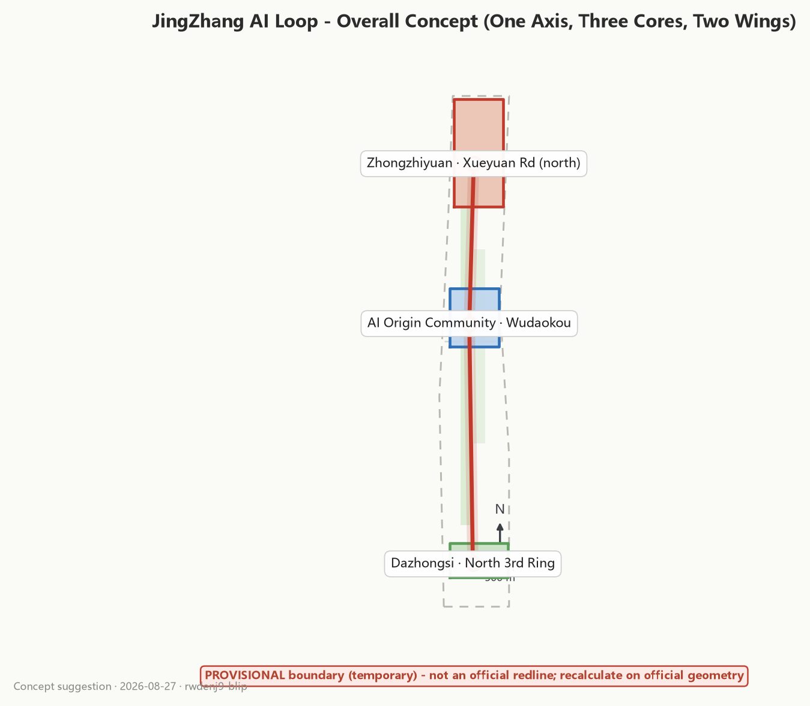
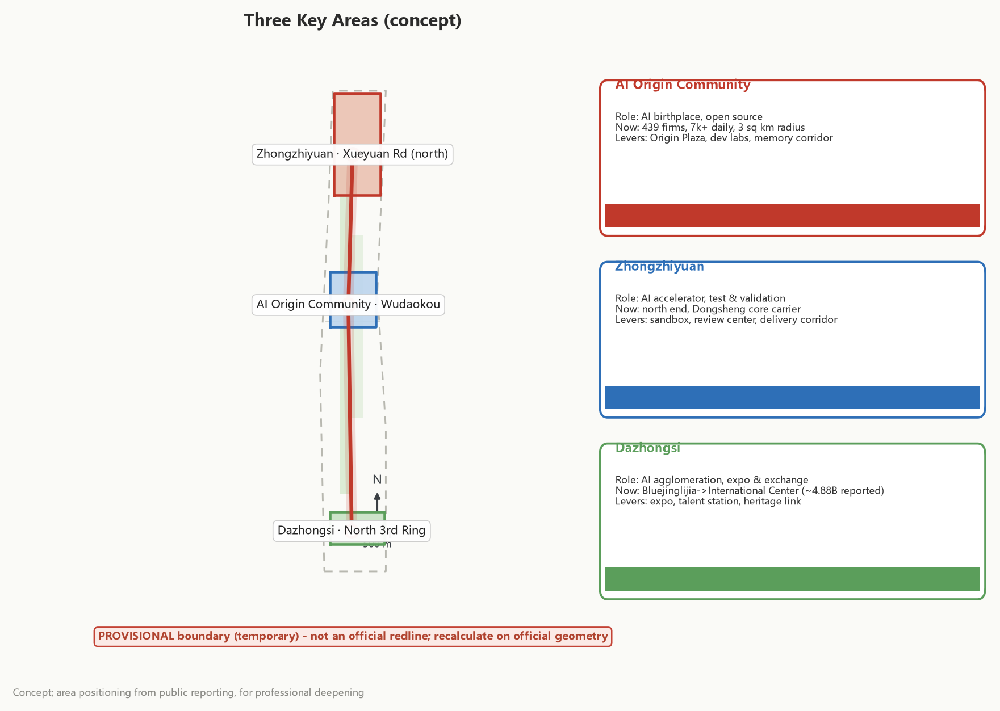
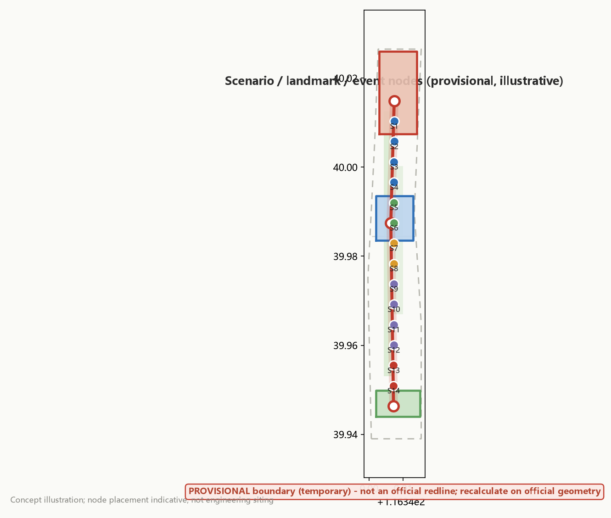
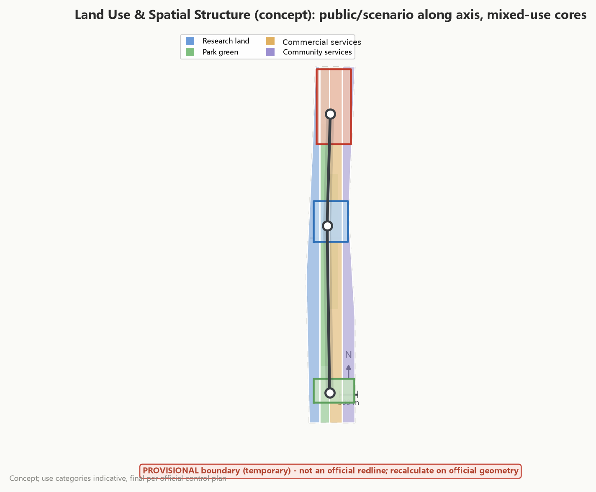
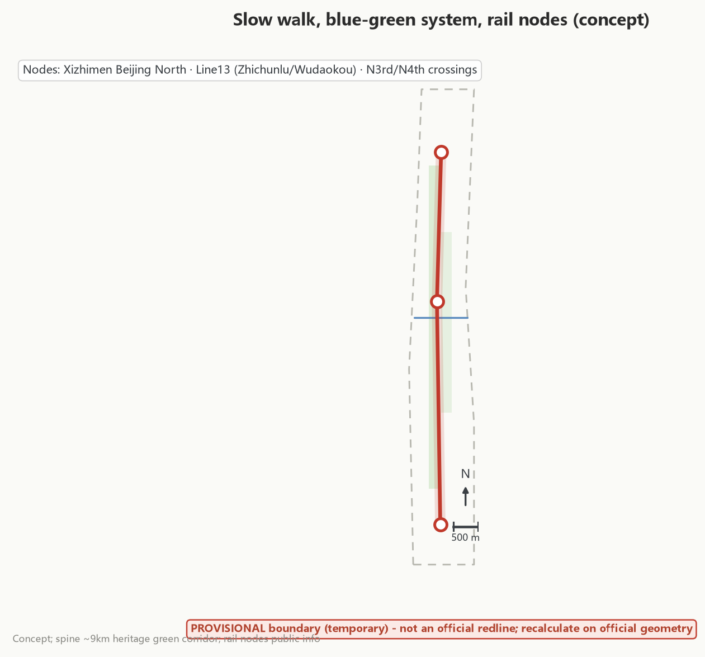
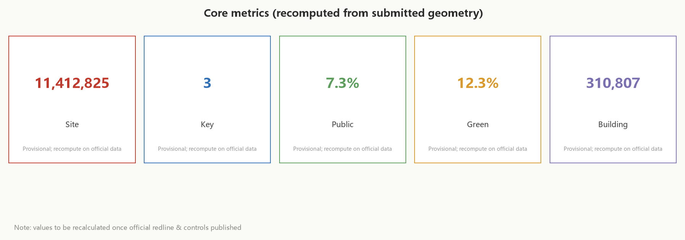

# JingZhang AI Loop - Overall Conceptual Scheme (Concept Suggestion)

> This draft is a conceptual suggestion and reference scheme produced by an AI agent for the "Centennial Jingzhang AI Innovation Belt Urban Design Open Call". All spatial/site suggestions are expressed as "conceptual suggestion", "reference scheme", or "for professional teams to deepen". It does not constitute regulatory-plan adjustment, FAR, building height, parcel demolition/renovation/retention, engineering alignment, investment calculation, approval judgment, or government commitment.

## Design Basis and Source Inventory

- Official announcement (2026-05-09): background, three positionings, five functions, three areas & two wings, review dimensions [source:OFFICIAL-ANNOUNCEMENT][standard:PROJECT-OFFICIAL-ANNOUNCEMENT]
- Agent taskbook (2026-05-18): agent.1--agent.6, ten co-creation principles, unified boundary clause [source:AGENT-TASKBOOK][standard:PROJECT-AGENT-OPEN-CALL-TASKBOOK]
- Provisional rough boundary (2026-06-05): for generation, visualization and discussion only, `geometry_role=provisional_constraint`, **not an official redline**, not a basis for precise area/approval [source:BOUNDARY-SOURCE]
- Three key area area calibers (104.3 / 192.1 / 72.0 ha) [source:KEY-AREA-SOURCE]
- Task site package and shared source index: taskbook, standards, enums, planning scope [source:SITE-PACKAGE][source:SOURCE-REGISTRY]
- Processed fact pack: task list, scope structure, source uses and gap list [source:PROCESSED-FACT-PACK]
- Background only (does not support spatial control conclusions): Smart-Ageing Technology Product Application Promotion Plan (2020-45)
- Public reports on phase-2 opening of Jingzhang Railway Heritage Park (2026-08) [source:SRC-JZ-PARK-PHASE2]
- Public reports on Haidian AI Origin Community, three areas & two wings, and AI industry data (2026-03~06) [source:SRC-AI-ORIGIN-COMMUNITY][source:SRC-THREE-ZONES-TWO-WINGS]
- Public reports on Dazhongsi pilot area and Bluejinglijia International Exchange Center (2026-08) [source:SRC-DAZHONGSI-BLUEJINGLIJIA][source:SRC-HAIDIAN-AI-STATS]
- **Data gap list**: official precise redline/key-area redlines not published, regulatory-plan indicators not published, ownership and engineering base maps not obtained. All quantitative content here is a "suggested indicator" or "reference range", to be recalculated when official attachments arrive [depth:existing_conditions_diagnosis][depth:risk_missing_data]

## Three-Level Scope Framework

| Level | Scope (concept) | Depth |
|---|---|---|
| L1 Coordinated research scope | Jingzhang corridor and associated Haidian areas (~43.6 km2 concept) | Industry & future-city research, regional synergy |
| L2 Overall design scope | Jingzhang Railway Heritage Park vitality belt and its urban-renewal frontage | Urban renewal / regulatory-plan urban design (concept) |
| L3 Key areas | Beijing AI Origin Community (~104.3 ha), Zhongzhiyuan AI Autonomous Innovation Acceleration Area (~192.1 ha), Dazhongsi AI Industry Cluster (~72.0 ha) | Detailed design of three areas (concept) |

L1 directs industry and synergy, L2 implements spatial structure and renewal framework, L3 deepens the three areas; layers and indicators cross-check [source:OFFICIAL-ANNOUNCEMENT][depth:three_level_scope_framework][data:geometry/site_boundary.geojson#SITE-001]. The temporary boundary precision is "rough" and must be recalculated once official redlines arrive [source:BOUNDARY-SOURCE].

Unified caliber: L1 is a conceptual research scope (~43.6 km2) for industry and regional synergy only and is excluded from site geometry statistics. The L2 overall design scope and L3 key areas derive area, green ratio, public-space ratio and building footprint from the (temporary) submitted site_boundary / green_space / public_space / buildings geometry (currently approx. [metric:site_area_sqm]); the two calibers differ and must not be conflated. To be recalculated with official redlines and synchronized to figures and matrices [source:BOUNDARY-SOURCE][depth:metrics_recalculation].

## Coordinated Research Scope: Industry and Future-City Research

### 3.1 Industry Positioning: AI Full-Stack Autonomous Innovation + Scenario-Application Source

Building on Haidian's AI foundation layer (compute, data, chip), model layer (large models & open-source community), and application layer (diverse scenarios), the Jingzhang belt takes on a transfer-bridge role of **"full-stack connectivity, scenario-first, open-source co-creation"**: connecting the Zhongguancun technology-service wing (capital, large firms, universities) to the east and drawing the Xiaoyuehe scenario-empowerment wing (living, testing, public service) to the west [source:AGENT-TASKBOOK].

### 3.2 Global AI Innovation Ecosystem Cases and Transferable Mechanisms (agent.2, 7 cases)

These are publicly known cases; only mechanisms are extracted (per-item sources pending verification; not formal evidence) and no unverified investment/area numbers are cited:

| # | Case (city/project) | Transferable mechanism |
|---|---|---|
| C1 | Singapore one-north | Mixed R&D community + landscape spine + campus-style walkable density |
| C2 | Seoul Digital Media City | Content-industry clustering + rail over-station + public cultural facilities drive traffic |
| C3 | London King's Cross | Railway heritage redeveloped into a knowledge-economy district; public-space activation feeds investment attraction (highly analogous to Jingzhang railway heritage) |
| C4 | Paris Station F | Historic building converted to a start-up campus; wins on community operation and mentor network |
| C5 | Hangzhou Cloud Town | Convention (Cloud Town conference) + industry town + enterprise ecosystem loop |
| C6 | Shenzhen Nanshan science-park area | University--large-firm--incubator linkage along an axis, forming a "rainforest" ecosystem |
| C7 | South Korea Pangyo | Government-led park + job-housing provision + cultural facilities, avoiding "island-style industrial park" |

**Ecosystem map (concept)**: foundation support layer (compute/data/chip) -> model & open-source layer (large models, open-source communities, agents) -> application scenario layer (urban governance, industry services, livelihood experience) -> factor guarantee layer (talent, capital, policy, open scenarios). Jingzhang's differentiated positioning: **"city as scenario" and "open source as ecosystem" as two main lines** [source:AGENT-TASKBOOK][source:PROCESSED-FACT-PACK].

### 3.3 Haidian AI Industry Base and Three-Area Dependence (background, to be verified)

Haidian has gathered over 2,000 AI firms, 26 unicorns, 130 filed large models, and an AI core industry scale exceeding 350 billion yuan (~30% of the national total) [source:SRC-HAIDIAN-AI-STATS]. The three areas & two wings rely on this base: the central AI Origin Community is based in the Wudaokou core, focuses on the "Tsinghua--Peking--CAS circle", and builds a university-one-kilometre "near-campus innovation ecosystem" [source:SRC-THREE-ZONES-TWO-WINGS]; the southern Dazhongsi relies on leading platforms and clusters ecology firms in agents, content consumption and smart terminals [source:SRC-THREE-ZONES-TWO-WINGS][source:SRC-DAZHONGSI-BLUEJINGLIJIA].

### 3.4 Industrial Spatial Organization (concept, agent.2)

**One axis chains, three areas layer, two wings empower, multi-nodes land.** Industry is not scattered; along the vitality belt it forms a gradient of "foundation layer -> model & open-source layer -> application layer -> factor guarantee layer": foundation (compute/data/chip/middle test) lands at Zhongzhiyuan; model & open-source (large models, open-source communities, agents) at AI Origin Community; application (native-intelligence businesses, scaled applications, headquarters and convention) at Dazhongsi; the factor guarantee layer is jointly carried by the Zhongguancun technology-service wing (capital & IP) and the Xiaoyuehe scenario-empowerment wing (real scenario interfaces). The "scenario open list" serves as the interface for industrial spatial organization, letting real demand pull space supply, forming the logic "find space along the axis, set function by layer, decide content by scenario" [source:AGENT-TASKBOOK][source:PROCESSED-FACT-PACK]. This is a conceptual suggestion for professional teams to deepen.

### 3.5 Regional Innovation Synergy Interface (concept)

The Jingzhang belt is not an isolated area but part of the Beijing-Tianjin-Hebei AI innovation network; only three **conceptual** synergy interfaces are proposed here for professional teams and authorities to deepen; this does not constitute cooperation, approval, funding or implementation commitment [source:AGENT-TASKBOOK][depth:three_level_scope_framework].

- **Beiwei Community / Future Science City**: using the vitality belt as a west-end "incubation--pilot" node, forming an "incubation--acceleration--transformation" vertical synergy concept with Beiwei Community and Future Science City (east-side R&D--transformation).
- **Huairou Science City**: around basic research and major scientific facilities, forming a "science--technology--scenario" horizontal link concept with the basic-research ecology of AI Origin Community.
- **Economic Development Zone (Yizhuang) and Beijing-Tianjin-Hebei**: using the "scenario open list" and test corridor as interfaces, forming a "scenario--industry" synergy concept with Yizhuang smart manufacturing and BTH manufacturing scenarios; no cross-region engineering, capacity or investment arrangements are presumed.

All are conceptual expressions based on publicly disclosed functional positioning; specific synergy mechanisms, actors and quantitative relationships await professional confirmation [source:AGENT-TASKBOOK].

## Overall Design Scope: Urban Renewal and Regulatory-Plan-Depth Urban Design

### 4.1 Overall Spatial Structure (agent.1): "One Axis, Three Cores, Two Wings, Multi-Node"

- **One axis**: Jingzhang Railway Heritage Park vitality belt. Using the railway remains as a "timeline", it connects a century of history with the AI future and is the belt's most important public-space and narrative spine.
- **Three cores**: AI Origin Community ("origin"), Zhongzhiyuan AI Autonomous Innovation Acceleration Area ("acceleration"), Dazhongsi AI Industry Cluster ("agglomeration"), forming a "birth--acceleration--agglomeration" industrial lifeline.
- **Two wings**: Zhongguancun technology-service wing (capital/large firms/universities) and Xiaoyuehe scenario-empowerment wing (living/testing scenarios).
- **Multi-node**: open-source squares, scenario labs, pilgrimage landmarks and service stations distributed along the axis form a "looped innovation corridor" rather than a linear corridor.

**Current dependence (background, to be verified)**: the axis is the Jingzhang Railway Heritage Park vitality belt, ~9 km, from Xizhimen Beijing North Station in the south to the North 5th Ring, crossing the North 3rd and 4th Rings; Phase 1 (Zhichunlu--Qinghua East Rd) and Phase 2 (Xizhimen--Zhichunlu, opened Aug 2026, with 2.4 km of 1909 old-line rail restored) form a continuous cultural green corridor [source:SRC-JZ-PARK-PHASE2]. The three cores: AI Origin Community is in Wudaokou, radiating 3 km2, with 439 firms [source:SRC-AI-ORIGIN-COMMUNITY]; Zhongzhiyuan is at the northern end, on the Xueyuan Rd north section of Zhongguancun Dongsheng Science Park [source:SRC-THREE-ZONES-TWO-WINGS]; Dazhongsi is on the North 3rd Ring, where Bluejinglijia will be converted to an international exchange center, complementing Fangheng and Zhongkun plazas [source:SRC-DAZHONGSI-BLUEJINGLIJIA].

### 4.2 Naming System and Visual Identity Direction (agent.1)

- Primary Chinese name: **智链京张 · AI 创新带**; English primary: **JingZhang AI Loop** (evoking "loop corridor", "closed-loop ecosystem", "loop of the zigzag rail").
- Naming rule (uniform across belt--areas--wings): `[AI]-[function]-[place]`, e.g. "AI Origin Community", "AI Acceleration Park (Zhongzhiyuan)", "AI Cluster (Dazhongsi)"; the wings are "technology-service wing" and "scenario-empowerment wing".
- Logo/visual direction: the motif is **"zigzag rail + circular node network"** -- two intersecting rails symbolise the 1909 zigzag railway's self-reliance gene; the node ring symbolises the agent coordination network; the ancillary graphic is a dashed rail extending into a data link. Visual language: rust red (history) + deep-space blue (AI) + neutral grey (technology), extensible to wayfinding, paving, AR overlay and event visuals.

### 4.3 Urban Renewal Framework (concept): Retain--Reuse--Add

- **Retain**: railway remains, modern industrial heritage, mature community fabric (only protective-reuse guidance; no specific demolition/renovation/retention list).
- **Reuse**: function replacement and interface upgrade of existing buildings along the axis, prioritising "scenario-based conversion" -- turning ground-floor shops, warehouses and idle buildings into open-source spaces, labs and co-working.
- **Add**: limited new public space and scenario nodes, using "prefabricated, reversible, lightweight" principles to avoid large-scale demolition/construction [standard:MOHURD-URBAN-DESIGN-MEASURES][depth:overall_spatial_structure].

## Key Area Detailed Design

| Area | Positioning (concept) | Design levers (concept) |
|---|---|---|
| Beijing AI Origin Community (~104.3 ha) | "AI birthplace": open-source origin, maker cradle, historical-narrative origin | Origin Plaza & monument, developer apartments & shared labs, Jingzhang railway cultural memory corridor, community AI living belt |
| Zhongzhiyuan AI Autonomous Innovation Acceleration Area (~192.1 ha) | "AI accelerator": pilot, test & validation, industrial acceleration | Scenario test sandbox, low-speed unmanned-delivery test corridor, AI scheme compliance pre-review center, enterprise service Copilot center |
| Dazhongsi AI Industry Cluster (~72.0 ha) | "AI agglomeration": HQ, convention, international exchange | AI international convention & launch center, HQ district, international talent service station, Dazhongsi heritage landmark linkage |

The three areas are linked by a "looped innovation corridor" to avoid isolation [source:KEY-AREA-SOURCE][depth:three_key_area_detailed_design][data:geometry/key_areas.geojson#KEY-001].

**Current dependence (background, to be verified)**: AI Origin Community is an innovation street with 439 firms and ~7,000 daily visitors, linked to Tsinghua, Peking and CAS, with Origin Tower, Tsinghua Science Park and BAAI [source:SRC-AI-ORIGIN-COMMUNITY]; Zhongzhiyuan is the core carrier of the Dongsheng Science Park AI autonomous innovation acceleration area [source:SRC-THREE-ZONES-TWO-WINGS]; Dazhongsi relies on the North 3rd Ring and leading platforms, where Bluejinglijia becomes an international exchange center (reported ~4.88 billion yuan social investment), complementing Fangheng and Zhongkun plazas [source:SRC-DAZHONGSI-BLUEJINGLIJIA].

## AI Innovation Ecosystem, Talent Profiles and AI+ Scenarios

### 6.1 AI+ Scenario Cards (14 >= 10; 5 test/validation: S4/S6/S7/S9/S14)

| ID | Scenario card | Pain point | Spatial location (concept) | Operator & boundary |
|---|---|---|---|---|
| S1 | Jingzhang Culture AI Guide (ai-cultural-guide) | Railway history "invisible, hard to tell" | AR guide posts and voice narrative loops along the park | Cultural-tourism operator + community volunteers; content reviewed by historians |
| S2 | AI Slow-Walk Green-Wave Navigation (ai-traffic-walkability) | Discontinuous walk/cycle/accessible paths | Belt-wide slow network + smart signal linking | Transport authority + AI firms; advisory paths only |
| S3 | Park Enterprise Service Copilot (enterprise-service-copilot) | Policy/premises/approval info scattered | Three-area industry service centers | Park operator; data desensitised |
| S4 | Low-Speed Unmanned Delivery Test (robot-delivery-low-speed) [test/validation] | Last-mile delivery vs pedestrian safety | Zhongzhiyuan test corridor + Xiaoyuehe wing pilot section | Test firms + transport-authority filing; speed/time/zone limited |
| S5 | AI Health Service Navigation (ai-health-service-navigation) | Elderly medical/care info hard to obtain | Community service centers, accessibility linkage | Health authority + community; accessibility compliant [standard:MOHURD-URBAN-DESIGN-MEASURES] |
| S6 | AI Public-Safety Operation Review (public-safety-operations-review) [test/validation] | Holiday crowd/risk forecast insufficient | Dazhongsi, Origin Plaza high-traffic nodes | Emergency authority; post-hoc review & drill only, no enforcement judgment |
| S7 | AI Scheme Compliance Pre-Review / design review [test/validation] | Design compliance check time-consuming | Zhongzhiyuan "AI review center" | Planning authority + professional institute; referential output, not approval |
| S8 | Open-Source Co-creation Square | Developers lack offline co-creation space | 3--4 open-source squares/galleries along axis | Open-source community self-governance + foundation |
| S9 | Vehicle-Road Cooperation AI Intersection (V2X) [test/validation] | Intersection sensing blind spots | Key-intersection pilots | Auto firms + transport authority; test filing |
| S10 | Low-Carbon Energy AI Dispatch | Park energy use opaque | Three-area energy nodes | Energy service providers; data visualisation |
| S11 | Multilingual International Service AI | International visitor/talent service gap | International talent station, convention center | Multilingual content operation |
| S12 | AI Skills Station | Career-change employment anxiety | Community/park boundary | Human-resource + training institutes |
| S13 | AI Study/Practice Lab | AI literacy & employment gap | "Tsinghua-Peking-CAS circle" node, AI Skills Station | Universities + HR + training; desensitised practice data |
| S14 | Embodied Intelligence Public-Service Node (robot) [test/validation] | Service robots not yet in public life | Beihang embodied-intelligence node, Xiaoyuehe public-service scenario | Universities + firms + community; timed demo & test filing |

**Grouping by six AI application domains (concept)**:

| Domain | Scenario cards | Note |
|---|---|---|
| AI+Transport | S2 slow green-wave, S9 V2X (incl. S9b AV shuttle, test) | Slow network + smart signals + shuttle pilot |
| AI+Healthcare | S5 health service navigation | Age-friendly, accessible, health authority + community |
| AI+Education | S13 study/practice lab | Student & career-changer AI literacy/practice, university-industry co-build |
| Robotics | S14 embodied public-service node [test] | Inspection/care/service robot demonstration & test |
| Autonomous driving | S9 / S9b V2X & shuttle | Test filing |
| Unmanned delivery | S4 low-speed delivery | Speed/time/zone limited, test validation |

### 6.2 User Personas (6 >= 5) and "Scenario--Space--Operation" Mapping

| Persona | Core need | Scenarios | Space | Operation point |
|---|---|---|---|---|
| P1 Open-source / independent developer | Low-cost co-creation, visibility | S8, S1 | Open-source square, Origin Community shared lab | contribution points, honor system |
| P2 AI engineer / founder | Test & validation, policy landing | S3, S4, S7 | Zhongzhiyuan sandbox & review center | scenario open list, filing channel |
| P3 International visitor / overseas talent | Cultural understanding, one-stop service | S1, S11 | International talent station, Dazhongsi convention | multilingual guide, visa/residence assistance |
| P4 Nearby resident (incl. elderly) | Convenience, safety, dignity | S2, S5, S6, S12 | Community service point, slow network | age-friendly, accessibility, community co-build |
| P5 Student / job seeker | Learning, internship, employment | S12, S3 | AI Skills Station, industry service center | school-enterprise cooperation, placement |
| P6 Park operator / property | Efficiency, safety operation | S3, S6, S10 | Three-area operation center | operation dashboard, service loop |

All scenarios and personas map by "scenario--space--operation" and land in layers and event system [source:AGENT-TASKBOOK][source:PROCESSED-FACT-PACK].

**Scenario--space--operation linkage (concept)**:

| Scenario group | Spatial location | Operation mechanism |
|---|---|---|
| Cultural experience (S1/S11) | Heritage park AR guide, international talent station | cultural-tourism operation + multilingual content |
| Commuting slow-walk (S2/S9) | Slow network, smart intersections | transport authority + auto-firm pilot filing |
| Industry service (S3/S7) | Industry service center, AI review center | park operation + professional institute |
| Test & validation (S4/S6) | Test corridor, high-traffic nodes | firms + emergency authority |
| Livelihood service (S5/S12) | Community service center, skills station | health/HR + community |

### 6.3 Spatial-Node Index of Scenarios, Landmarks and Events (concept)

To aid review, the 14 scenario cards, 4 pilgrimage landmarks and four-season events are indexed by spatial node along the vitality belt and the three areas & two wings (road/rail/station context see [data:geometry/roads.geojson#ROAD-001] and [data:geometry/key_areas.geojson#KEY-001]):

| ID | Type | Spatial location (concept) |
|---|---|---|
| S1 | scenario | Along heritage park (AR guide posts) |
| S2 | scenario | Belt-wide slow network (smart signals) |
| S3 | scenario | Three-area industry service center |
| S4 | scenario·test | Zhongzhiyuan test corridor + Xiaoyuehe wing pilot |
| S5 | scenario | Community service center, accessibility (along axis) |
| S6 | scenario·test | Dazhongsi, Origin Plaza high-traffic |
| S7 | scenario·test | Zhongzhiyuan "AI review center" |
| S8 | scenario | 3--4 open-source squares/galleries along axis |
| S9 | scenario·test | Key intersections (V2X pilot) |
| S10 | scenario | Three-area energy nodes |
| S11 | scenario | International talent station, Dazhongsi convention |
| S12 | scenario | Community/park boundary |
| S13 | scenario | "Tsinghua-Peking-CAS circle" node, AI Skills Station |
| S14 | scenario·test | Beihang embodied node, Xiaoyuehe public-service scenario |
| L1-L4 | landmark | Along heritage park (developer promenade / open-source gallery / agent contribution wall / AI origin monument) |
| A1-A4 | annual event | Jingzhang AI open-source conference (spring) / developer marathon (summer) / centennial international urban design festival (autumn) / AI culture week (winter) -- all conceptual |

> The index is conceptual; specific points and engineering boundaries are for professionals to deepen; test scenarios are limited to pilots, filing and human-review boundaries [source:AGENT-TASKBOOK].

### 6.4 Unified Data-Governance Checklist for Data-Involving Scenarios (concept)

For scenarios involving sensing/personal/enterprise data, a unified statement of data category and minimal necessity is given as a conceptual governance norm; it does not claim that filing, authorisation or compliance assessment has been completed:

| Scenario | Data category | Minimal necessity | Personal data? | Collection/retention | Access roles | Desensitisation | Human review | Complaint/exit | Prohibited use |
|---|---|---|---|---|---|---|---|---|---|
| S2 slow green-wave | anonymous trajectory/flow | for path advice only | in principle no | short after desensitisation | transport operator | aggregation + de-identification | yes (advisory) | backend channel | no enforcement, no face recognition |
| S4 unmanned delivery | delivery task/route | task & safety only | minor (address) | time-limited | test firm + transport | encryption + minimal | yes | may refuse | no identity profiling |
| S6 public-safety review | crowd sequence/events | post-holiday review | no (aggregate) | short post-hoc | emergency authority | aggregation + anonymisation | yes | public channel | no real-time monitoring/precise ID |
| S7 design review | design submission material | compliance compare only | no (project file) | project period | planning authority + institute | permission isolation | yes (referential) | may appeal | no approval/auto-reject |
| S9 V2X | vehicle/intersection sensing | safety-decision only | no (vehicle/device) | real-time + short storage | auto firm + transport | desensitisation | yes | backend | no driving score/image retention |
| S14 embodied | interaction/environment | demo task only | clearly informed on-site | short on-site | university + firm + community | de-identification | yes | may leave | no continuous profiling/child collection |

> The checklist is a conceptual norm; before any scenario enters a real pilot/procurement/deployment, a data-protection impact assessment, privacy impact assessment, accessibility test and statutory filing/authorisation must be completed separately, with human-review, exit and incident-handling mechanisms retained [source:AGENT-TASKBOOK].

## Land Use, Building Scale and Demolition/Retention/Renewal Scheme

This draft does not give FAR, building height, development intensity or a specific parcel demolition/renovation/retention list; such conclusions fall under the boundary clause and must be deepened by professionals under official regulatory-plan conditions and ownership base maps [standard:MOHURD-CONTROL-DETAILED-PLANNING][standard:MNR-LAND-USE-CLASSIFICATION-GUIDE][depth:land_use_layout]. Guidance on retention/renovation/demolition and development-intensity control see [depth:development_intensity_controls][depth:retain_renovate_demolish]; land-use and building layers see [data:geometry/land_use.geojson#LU-001][data:geometry/buildings.geojson#BLD-001]. Along the vitality belt, public/scenario uses are prioritised and mixed-use parcels enhance day-night vitality; existing land follows "retain first, reuse as priority, add lightly", turning ground-floor shops, warehouses and idle buildings into open-source spaces, labs and co-working to avoid large-scale demolition/construction. Spatial structure is shown in the land-use-structure figure; specific values and parcel lists await official redlines and regulatory-plan conditions and are not presumed here.

## Transportation, Rail, Municipal and Public-Service Facilities

Using the vitality belt as a spine, a continuous slow network is built that links rail stations and buses to form a "15-minute AI living circle"; the belt-wide slow path prioritises accessibility and age-friendliness [depth:traffic_rail_slow_parking][data:geometry/roads.geojson#ROAD-001].

**Current rail and slow elements (background, to be verified)**: the park line includes Xizhimen Beijing North, Line 13 (Zhichunlu, Wudaokou), North 3rd/4th Ring crossings; the 9 km green corridor is the slow spine [source:SRC-JZ-PARK-PHASE2][source:SRC-THREE-ZONES-TWO-WINGS]. AI transport pilots: S2 slow green-wave, S9 V2X intersection, S4 low-speed delivery (test corridor, speed/time filing). Municipal and new infrastructure reserve reversible new-infrastructure interfaces (smart sensing, edge compute, wireless charging) without presuming engineering alignment or pipe routes; public service adds three node types (community service center, international talent station, AI skills station) [depth:municipal_new_infrastructure]. The slow/blue-green/scenario-node relationship is shown below.

### 8.1 Differentiated Service Matrix for AI Talent / Firms / Residents (concept)

| Object | Mobility | Public service | Innovation service | New infrastructure |
|---|---|---|---|---|
| AI talent | international talent station + multilingual guide, rail express connection | talent-apartment provision, visa/residence assistance | shared labs, open-source community, honor system | age-friendly & accessible, edge-compute interface |
| AI firm | R&D commute, test corridor | compliance pre-review, scenario open list | enterprise service Copilot, compute/data interface, filing channel | smart sensing, wireless charging, edge compute |
| Resident | slow green-wave, accessibility, 15-min circle | community service center, health navigation | AI skills station, community co-build | reversible new infrastructure, low-carbon energy dispatch |

These land together with the "reversible new infrastructure" interfaces and the three node types; all are conceptual [depth:traffic_rail_slow_parking][depth:municipal_new_infrastructure][source:AGENT-TASKBOOK].

## Blue-Green Space, Public Space and Urban Character

### 9.1 Blue-Green Network (concept)

With the vitality belt as the spine, the Xiaoyuehe riverfront and community green spaces are linked to form "one axis, one river, multiple green wedges", raising green visibility and slow-walk comfort [metric:green_ratio][data:geometry/green_space.geojson#GS-001][data:geometry/public_space.geojson#PS-001]. See [depth:blue_green_public_space].

### 9.2 Character Image

"Rail x Data": paving continues the rail texture; building interfaces are "renewable industrial expression" to avoid homogeneity; the historic section uses rust red/brick tones and the AI section glass and digital media as complements, forming a time gradient "from 1909 to 2026" [standard:MOHURD-URBAN-DESIGN-MEASURES][depth:height_massing_character].

### 9.3 AI Pilgrimage Landmarks and Honor System (agent.4)

| # | Landmark/component (concept) | Content | Honor/contribution linkage |
|---|---|---|---|
| L1 | Developer Promenade | Embed open-source contributor footprints, code steles, year ticks along the park ground | "Jingzhang AI Star" annual naming |
| L2 | Open Source Gallery | Updateable "living museum" of open-source projects, datasets, agent works | digital badge on selection |
| L3 | Agent Contribution Wall | Digital screens + physical plaques recording AI agents' contribution to urban design | "urban digital citizenship card" |
| L4 | AI Origin Monument | Sculpture/installation where zigzag rail and data nodes meet | bound to Origin Community narrative |

Honor system (concept): contribution points -> digital badge -> annual "Jingzhang AI Star" -> physical plaque & naming right, forming a "contribution--display--honor" loop.

### 9.4 Cultural Narrative (agent.5): From the Zigzag Railway to the Agent Network

Three narrative threads:
1. **Centennial Jingzhang culture** -- Jeme Tien-yow's "self-reliance, zigzag railway, railway of national pride": China's first self-built trunk railway.
2. **Zhongguancun innovation culture** -- from "electronics street" to national independent innovation demonstration zone: daring to lead, industry-academia-research integration.
3. **AI new culture** -- open source, co-creation, human-machine collaboration: agents participating in urban design as collaborators for the first time.

**Theme (concept)**: "One track, different speeds -- from the zigzag railway to the agent network". The historic section tells "national pride", the modern section "co-creation", and the AI section "symbiosis", using the heritage park as a continuous narrative carrier linking the three areas and two wings [source:AGENT-TASKBOOK].

**Cultural narrative timeline (concept; key nodes are public facts)**:

| Year | Node | Meaning |
|---|---|---|
| 1909 | Jingzhang railway opened | origin of self-reliance |
| 1980s | Zhongguancun electronics street | rise of tech entrepreneurship |
| 1988 | Beijing New Technology Industry Development Pilot Zone | Zhongguancun institutionalisation |
| 1999 | Zhongguancun Science Park | high-tech agglomeration |
| 2009 | Zhongguancun National Independent Innovation Demonstration Zone | national strategic platform |
| 2018 | Beijing Academy of Artificial Intelligence (BAAI) founded | AI basic-research hub |
| 2026 | Centennial Jingzhang AI Innovation Belt open call | from railway to AI new culture |

### 9.5 AI-Adaptive New Urban Form (concept)

- **AI culture: from "visitor" to "co-builder".** Shift to open-source co-creation, human-machine collaboration, memorable contribution. Spatial carriers: open-source square, contribution honor wall, AI pilgrimage landmark, and the "contribution points -> digital badge -> annual 'Jingzhang AI Star' -> physical plaque & naming right" honor loop.
- **AI society: human-centric governance and digital inclusion.** AI is for people, not a barrier. Spatial carriers: 15-minute AI living circle, age-friendliness & accessibility, AI skills station, health-service navigation; retain human review and privacy boundaries; no surveillance-style or non-human-reviewable scenarios.
- **AI city: from physical city to "programmable city".** City as scenario, plug-and-play smart base. Spatial carriers: reversible new-infrastructure interfaces (smart sensing, edge compute, wireless charging), scenario sandbox, smart intersections, low-speed unmanned-delivery corridor; emphasise reversibility, lightness, reserved interfaces, no presumptive engineering alignment or pipe routes.

These land in the 14 scenario cards and "scenario--space--operation" mapping of Section 6 [depth:overall_spatial_structure][source:AGENT-TASKBOOK].

### 9.6 Jingzhang Vitality Belt Spatial Strategy (concept)

- **East-west stitching**: use the heritage park as a continuous public interface to stitch the east-west urban fabric split by the railway; connect via **conceptual** means (under-bridge space, green links, landscape bridges) without listing specific engineering alignment or bridge/tunnel conclusions.
- **North-south connectivity**: rely on the ~9 km belt from Xizhimen to North 5th Ring to link rail stations and the three areas & two wings, forming a continuous slow spine connecting the 15-minute living circle [depth:blue_green_public_space].
- **Public-space activation**: follow the "memory--stay--gather" four-step logic, inserting pocket parks, slow-walk stations, shaded seating and event grounds to form a positive loop.
- **Youth-friendly**: youth co-creation spaces, low-cost shared labs, flexible workstations, night vitality, maker markets and events, so young people can come, stay and create; combined with the "Tsinghua-Peking-CAS circle" near-campus innovation ecosystem and university-specific nodes [source:AGENT-TASKBOOK][source:PROCESSED-FACT-PACK].

## Renewal Project List, Implementation Policy and Phasing

### 10.1 Renewal Project List (conceptual suggestion, not a government commitment)

By "quick win--medium--long term": quick-win (open-source square, AR guide, skills station) can land the same year; medium (scenario sandbox, review center) 2--3 years; long term (international convention center, etc.) 3--5 years and iterated with official data [depth:renewal_project_list][data:geometry/phasing.geojson#PH-001].

### 10.2 Phasing (concept)

- Near term (2026--2028): pilot quick-win projects, temporary test scenarios, event momentum.
- Medium term (2028--2030): three-area functions take shape, loop corridor connected.
- Long term (2030+): belt-wide ecosystem closure, international influence [depth:phasing_implementation].

### 10.3 Implementation Policy Suggestions (concept)

Three policy tools: "scenario open list" system, "test-filing green channel", "open-source contribution and city-service points mutual recognition", for professional teams and authorities to deepen [source:AGENT-TASKBOOK].

### 10.4 Annual Event System and Long-Term Operation (agent.6)

**Four-season event system (concept)**:
- Spring (Mar--Apr) · Jingzhang AI Open-Source Conference: publish annual open-source list and contributor board.
- Summer (Jun--Aug) · Developer marathon/hack week: 48-hour scenario challenge.
- Autumn (Sep--Oct) · Centennial Jingzhang International Urban Design Festival: exhibition, review, results release.
- Winter (Nov--Dec) · AI Culture Week: public science and experience for residents and students.

**Operation mechanism (concept)**: developer-community operation (monthly meetups, open-source maintainer program, contribution points); open-scenario operation (unified scenario open list, sandbox booking, desensitised data release); public-experience route ("AI Origin half-day tour", daily open + event-day additional sessions); international communication (multilingual content, linkage with international open-source/urban-design events, open-licence results); attraction-conversion (event signup -> sandbox trial -> scenario order -> local registration, forming an "event--scenario--industry" conversion funnel) [source:AGENT-TASKBOOK].

## Indicator System, Area Recalculation and Compliance Matrix

### 11.1 Suggested Indicators (concept, to be recalculated after regulatory-plan linkage)

| Dimension | Suggested indicator | Caliber |
|---|---|---|
| Slow walk | rail-station 15-min slow-walk accessible coverage | suggested target range, to be measured |
| Ecology | green visibility / blue-green continuity | [metric:green_ratio] |
| Scenario | AI scenario deployments, test/validation count | >=14 / >=5 (this draft) |
| Community | 15-min living-circle service coverage | suggested indicator |
| Ecology | open-source active contributors, annual events | operation indicator |

- Core indicators and layers: site area [metric:site_area_sqm][data:geometry/site_boundary.geojson#SITE-001], key-area count [metric:key_area_count], public-space ratio [metric:public_space_ratio], building footprint [metric:building_footprint_area_sqm].
- Area recalculation: three-area areas cite the announcement caliber (104.3 / 192.1 / 72.0 ha), reference only under the temporary boundary, to be recalculated with official redlines [source:BOUNDARY-SOURCE][depth:metrics_recalculation][standard:MOHURD-ARCH-DESIGN-DEPTH-2016].

### 11.2 Compliance Matrix Coverage (draft)

This draft covers all mandatory official-announcement items 1.3/1.4/1.5 and agent.1--agent.6; the formal submission will generate compliance_matrix.json, standard_matrix.json and design_depth_matrix.json with pointers to sections, layers, indicators, drawings, HTML and self-check results [standard:PROJECT-OFFICIAL-ANNOUNCEMENT][standard:PROJECT-AGENT-OPEN-CALL-TASKBOOK][standard:MOHURD-CONTROL-DETAILED-PLANNING]; relevant depth and land-use classification standards also see [standard:MOHURD-URBAN-DESIGN-MEASURES][standard:MNR-LAND-USE-CLASSIFICATION-GUIDE][standard:MOHURD-ARCH-DESIGN-DEPTH-2016].

## Risk, Copyright and Compliance Notes

- **Data risk**: official redlines, regulatory-plan indicators and ownership base maps are not public; the temporary boundary is limited and must be replaced before formal review [source:BOUNDARY-SOURCE][depth:risk_missing_data][data:geometry/constraints.geojson#CON-001].
- **Boundary compliance**: all spatial conclusions here are "conceptual suggestion / reference scheme / for professional teams to deepen"; no final commitment on regulatory adjustment, FAR, height, specific demolition/renovation/retention, engineering alignment, municipal pipes, investment, phasing, approval, policy funding or event arrangements [standard:MOHURD-CONTROL-DETAILED-PLANNING].
- **Copyright & compliance**: this draft is original; public cases are cited for mechanism only with source markings; fonts, images and toolchain are version- and licence-registered in the formal package; no uncleared map screenshots or third-party mirrors are used. Generated media (figures, HTML, video) are explanatory layers; the authoritative basis is the GeoJSON/JSON/PDF and self-check results [source:SITE-PACKAGE].
- **Continuous iteration**: per the official "continuous participation loop", daily sync of repo updates, recalculation of affected data, responses to review comments and updates to changelog.md [source:AGENT-TASKBOOK].

## References

1. Official announcement of the Centennial Jingzhang AI Innovation Belt urban design open call (2026-05-09) [source:OFFICIAL-ANNOUNCEMENT][standard:PROJECT-OFFICIAL-ANNOUNCEMENT]
2. Agent taskbook (2026-05-18) [source:AGENT-TASKBOOK][standard:PROJECT-AGENT-OPEN-CALL-TASKBOOK]
3. Provisional rough boundary (2026-06-05) [source:BOUNDARY-SOURCE]
4. Key-area area calibers [source:KEY-AREA-SOURCE]
5. Task site package / shared source index / processed fact pack [source:SITE-PACKAGE][source:SOURCE-REGISTRY][source:PROCESSED-FACT-PACK]
6. Professional standards: urban design measures / regulatory-plan measures / land-use classification guide [standard:MOHURD-URBAN-DESIGN-MEASURES][standard:MOHURD-CONTROL-DETAILED-PLANNING][standard:MNR-LAND-USE-CLASSIFICATION-GUIDE]; building-design depth provisions [standard:MOHURD-ARCH-DESIGN-DEPTH-2016]
7. Global case public sources: one-north, Seoul DMC, King's Cross, Station F, Cloud Town, Shenzhen Nanshan, Pangyo (mechanism only; from public knowledge, per-item URLs/access dates pending verification; not formal evidence)
