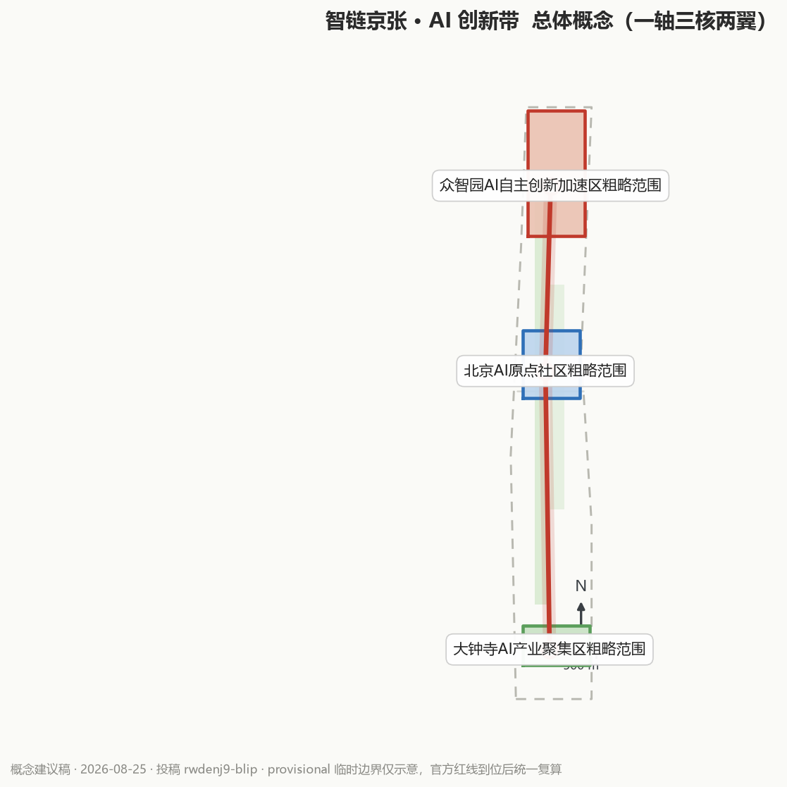
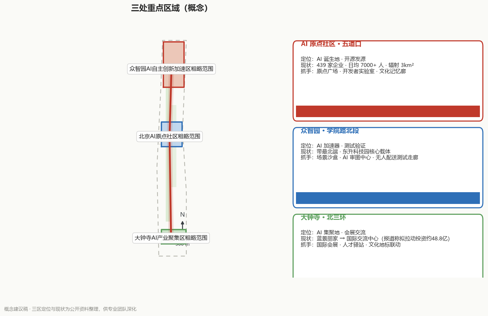
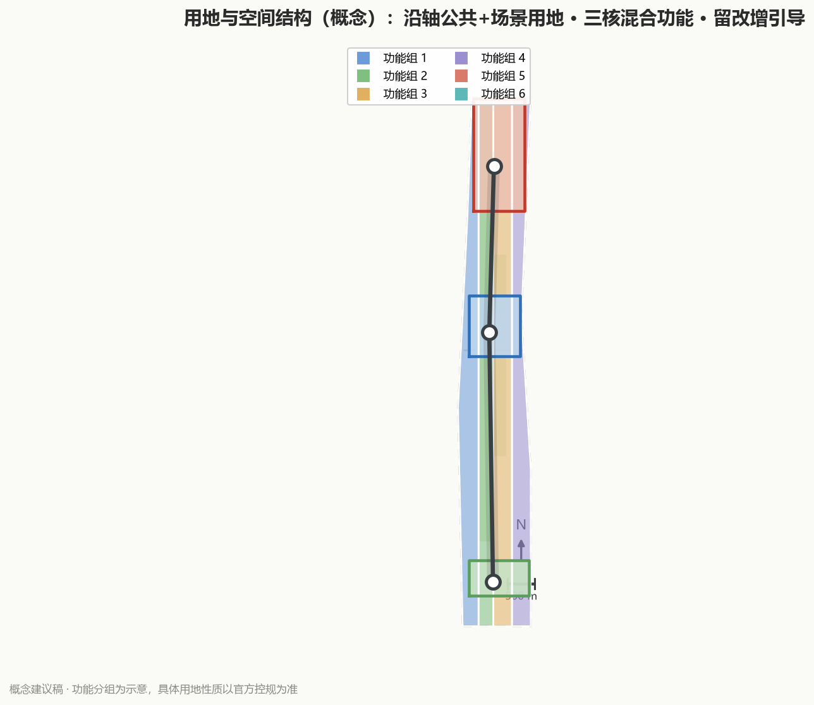
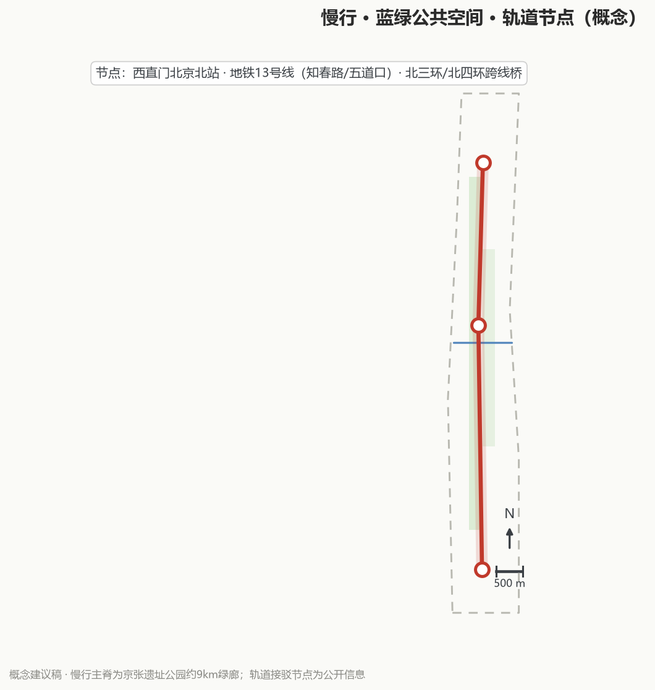
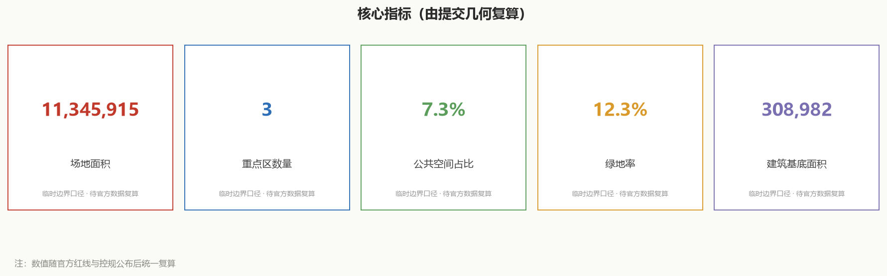

# 智链京张 · AI 创新带（JingZhang AI Loop）——总体概念方案（概念建议稿）

> 本稿为 AI 智能体参与「百年京张 AI 创新带城市设计开源征集」的概念建议与参考方案，所有空间落地建议均表述为「概念建议」「参考方案」「可供专业团队深化研究」，不构成控规调整、容积率、建筑高度、地块拆改留、工程线位、投资测算、审批判断或政府承诺。

## 设计依据与资料清单

- 官方公告（2026-05-09）：征集背景、三大定位、五大功能、三区两翼、评审维度 [source:OFFICIAL-ANNOUNCEMENT][standard:PROJECT-OFFICIAL-ANNOUNCEMENT]
- 面向智能体任务书（2026-05-18）：agent.1–agent.6 六项任务、十条共创原则、统一边界条款 [source:AGENT-TASKBOOK][standard:PROJECT-AGENT-OPEN-CALL-TASKBOOK]
- 临时粗略边界（2026-06-05）：仅用于生成、可视化与讨论，`geometry_role=provisional_constraint`，**非官方红线**，不得作为精确面积/审批依据 [source:BOUNDARY-SOURCE]
- 三处重点区域面积口径（104.3 / 192.1 / 72.0 公顷）[source:KEY-AREA-SOURCE]
- 任务资料包与共享资料索引：任务书、标准、枚举、规划范围 [source:SITE-PACKAGE][source:SOURCE-REGISTRY]
- 已处理事实包：任务清单、范围结构、资料用途与缺口清单 [source:PROCESSED-FACT-PACK]
- 背景资料（仅背景，不支撑空间控制结论）：智慧助老技术产品应用推广方案（2020-45）
- 京张铁路遗址公园二期开放公开报道（2026-08）[source:SRC-JZ-PARK-PHASE2]
- 海淀AI原点社区、三区两翼与AI产业数据公开报道（2026-03~06）[source:SRC-AI-ORIGIN-COMMUNITY][source:SRC-THREE-ZONES-TWO-WINGS]
- 大钟寺先导区与蓝景丽家国际交流中心公开报道（2026-08）[source:SRC-DAZHONGSI-BLUEJINGLIJIA][source:SRC-HAIDIAN-AI-STATS]
- **数据缺口清单**：官方精确红线/重点区红线未公开、控规指标未公开、产权与工程底图未取得 → 本稿所有量化内容均为「建议指标」或「参考区间」，待官方附件补齐后统一复算 [depth:existing_conditions_diagnosis][depth:risk_missing_data]

## 三层范围工作框架

| 层级 | 范围（概念） | 工作深度 |
|---|---|---|
| L1 统筹研究范围 | 京张走廊及海淀关联片区（约 43.6km² 概念范围） | 产业与未来城市研究、区域协同 |
| L2 总体设计范围 | 京张铁路遗址公园活力带及其两侧城市更新界面 | 城市更新与控规深度城市设计（概念） |
| L3 重点区域 | 北京AI原点社区（约 104.3ha）、众智园AI自主创新加速区（约 192.1ha）、大钟寺AI产业聚集区（约 72.0ha） | 三区详细设计（概念） |

三层范围逐级传导：L1 确定产业与协同方向，L2 落实空间结构与更新框架，L3 深化三区设计，各层指标与图层相互校核 [source:OFFICIAL-ANNOUNCEMENT][depth:three_level_scope_framework][data:geometry/site_boundary.geojson#SITE-001]。临时边界精度为「粗略」，官方红线到位后须重算 [source:BOUNDARY-SOURCE]。

## 统筹研究范围产业与未来城市研究

### 3.1 产业定位：AI 全栈自主创新 + 场景应用策源地

依托海淀 AI 基础层（算力、数据、芯片）、模型层（大模型与开源社区）、应用层（千行百业场景）的完整链条，京张带承担**「全栈贯通、场景先导、开源共创」**的承转功能：东接中关村科技服务翼（资本、大厂、高校），西引小月河场景赋能翼（生活、测试、公共服务）[source:AGENT-TASKBOOK]。

### 3.2 全球 AI 创新生态案例与可转化机制（agent.2，7 个）

以下均为可核实的公开案例，仅提取机制、不引用未经验证的投资/面积数字：

| # | 案例（城市/项目） | 可转化机制 |
|---|---|---|
| C1 | 新加坡 one-north（纬壹科技城） | 混合研发社区 + 景观主轴贯通 + 步行可达的校园式密度 |
| C2 | 首尔 Digital Media City | 内容产业集聚 + 轨道上盖 + 公共文化设施带动人气 |
| C3 | 伦敦 King's Cross | 铁路遗产更新为知识经济区，公共空间活化反哺招商（与京张铁路遗产高度同构） |
| C4 | 巴黎 Station F | 历史建筑改造为创业园区，以社区运营和导师网络取胜 |
| C5 | 杭州云栖小镇 | 会展（云栖大会）+ 产业小镇 + 企业生态闭环 |
| C6 | 深圳南山区科技园片区 | 高校—大厂—孵化器沿轴线联动，形成「热带雨林」生态 |
| C7 | 韩国板桥科技谷（Pangyo） | 政府主导园区 + 职住配套 + 文化设施，避免「孤岛式产业园」 |

**生态图谱（概念）**：基础支撑层（算力/数据/芯片）→ 模型与开源层（大模型、开源社区、智能体）→ 应用场景层（城市治理、产业服务、民生体验）→ 要素保障层（人才、资本、政策、场景开放）。京张带图谱的差异化定位：**以「城市即场景」和「开源即生态」作为两条主线** [source:AGENT-TASKBOOK][source:PROCESSED-FACT-PACK]。

### 3.3 海淀AI产业基础与三区依托（真实资料）

海淀区已集聚 AI 企业超 2000 家、独角兽企业 26 家，备案大模型 130 款，AI 核心产业规模超 3500 亿元、约占全国 30% [source:SRC-HAIDIAN-AI-STATS]。京张带三区两翼即依托这一基础：中部 AI 原点社区立足五道口核心区、聚焦环「清北科」，打造高校一公里「近校创新生态圈」[source:SRC-THREE-ZONES-TWO-WINGS]；南部大钟寺依托龙头平台，集聚智能体、内容消费、智能终端等生态企业 [source:SRC-THREE-ZONES-TWO-WINGS][source:SRC-DAZHONGSI-BLUEJINGLIJIA]。

### 3.4 产业空间组织方式（概念，agent.2）

**一轴串链、三区分层、两翼赋能、多节点落子。** 京张带的产业不是散点布局，而是沿京张铁路遗址公园活力带形成「基础层 → 模型与开源层 → 应用层 → 要素保障层」的梯度组织：基础层（算力/数据/芯片/中试）落在众智园 AI 自主创新加速区，模型与开源层（大模型、开源社区、智能体）落在北京 AI 原点社区，应用层（智能原生业态、规模应用、总部与会展）落在大钟寺 AI 产业集聚区，要素保障层由中关村科技服务翼（资本与 IP）与小月河场景赋能翼（真实场景接口）共同承担。以「场景开放清单」作为产业空间组织的接口，让真实需求反向牵引空间供给，形成「沿轴找空间、按层定功能、靠场景定内容」的组织逻辑 [source:AGENT-TASKBOOK][source:PROCESSED-FACT-PACK]。以上为概念建议，供专业团队深化研究。

## 总体设计范围城市更新与控规深度城市设计

### 4.1 总体空间结构（agent.1）：「一轴三核两翼 · 多节点」

- **一轴**：京张铁路遗址公园活力带——以铁路遗址为「时间线」，串联百年历史与 AI 未来，是全带最重要的公共空间与叙事主轴。
- **三核**：北京AI原点社区（「原点」）、众智园AI自主创新加速区（「加速」）、大钟寺AI产业聚集区（「集聚」），形成「诞生—加速—集聚」的产业生命线。
- **两翼**：中关村科技服务翼（资本/大厂/高校协同）、小月河场景赋能翼（生活场景/测试场景）。
- **多节点**：沿轴分布的开源广场、场景实验室、朝圣地标、服务驿站等 12 类 AI 场景节点，形成「环形创新廊道」而非线性过道。

**现状依托（真实资料）**：一轴即京张铁路遗址公园活力带，全长约 9 公里，南起西直门北京北站、北至北五环，横跨北三环、北四环；一期（知春路—清华东路）与二期（西直门—知春路，2026 年 8 月开放，含 2.4 公里 1909 年旧线铁轨复原）已贯通为带状文化绿廊 [source:SRC-JZ-PARK-PHASE2]。三核具体依托：AI 原点社区位于五道口、辐射 3 平方公里（东至王庄路及展春园西路、西至中关村大街、北临清华、南抵北四环西路），已集聚 439 家企业 [source:SRC-AI-ORIGIN-COMMUNITY]；众智园位于带最北端、中关村东升科技园学院路北段 [source:SRC-THREE-ZONES-TWO-WINGS]；大钟寺位于北三环，蓝景丽家将改造为国际交流中心，与方恒广场、中坤广场功能互补 [source:SRC-DAZHONGSI-BLUEJINGLIJIA]。

### 4.2 命名体系与视觉识别方向（agent.1）

- 中文主名：**智链京张 · AI 创新带**；英文主名：**JingZhang AI Loop**（取「环廊」「闭环生态」「人字形轨道之环」三重含义）。
- 命名规则（一带-三区-两翼统一规则）：`[AI]-[功能]-[地名]`，如「AI 原点社区」「AI 加速园（众智园）」「AI 集聚区（大钟寺）」；两翼为「科技服务翼」「场景赋能翼」。
- Logo/视觉方向：以**「人字形轨道 + 环形节点网络」**为母题——两条交汇轨道象征 1909 年人字形铁路的自主创新基因，节点环象征智能体协同网络；辅助图形为虚线轨道延伸为数据链路。整体视觉语言：铁锈红（历史）+ 深空蓝（AI）+ 中性灰（科技），可延展为导视、地面铺装、AR 叠加层与活动视觉系统。

### 4.3 城市更新框架（概念）：留—改—增

- **留**：铁路遗址、近现代工业遗存、成熟社区肌理（只做保护性再利用的指引，不列具体拆改留清单）。
- **改**：沿轴存量建筑的功能置换与界面提升，优先「场景化改造」——把底商、仓储、闲置楼宇转为开源空间、实验室、共享办公。
- **增**：少量新增公共空间与场景节点，以「装配式、可逆、轻量」为原则，避免大拆大建 [standard:MOHURD-URBAN-DESIGN-MEASURES][depth:overall_spatial_structure]。

## 重点区域详细设计

| 区域 | 定位（概念） | 设计抓手（概念） |
|---|---|---|
| 北京AI原点社区（约 104.3ha） | 「AI 诞生地」：开源发源、创客摇篮、历史叙事原点 | 原点广场与纪念碑、开发者公寓与共享实验室、京张铁路文化记忆廊、社区级 AI 生活体验带 |
| 众智园AI自主创新加速区（约 192.1ha） | 「AI 加速器」：中试、测试验证、产业加速 | 场景测试沙盒区、低速无人配送测试走廊、AI 方案合规预审中心、企业服务 Copilot 中心 |
| 大钟寺AI产业聚集区（约 72.0ha） | 「AI 集聚地」：总部、会展、国际交流 | AI 国际会展与发布中心、总部街区、国际人才服务驿站、大钟寺文化地标联动 |

三区之间以「环形创新廊道」串联，避免各自孤立 [source:KEY-AREA-SOURCE][depth:three_key_area_detailed_design][data:geometry/key_areas.geojson#KEY-001]。

**现状依托（真实资料）**：AI 原点社区现状为 439 家企业、日均往来 7000 余人的 AI 创新街区，联动清华大学、北京大学、中国科学院，原点大厦、清华科技园、智源研究院等载体 [source:SRC-AI-ORIGIN-COMMUNITY]；众智园位于京张带最北端，是中关村东升科技园 AI 自主创新加速区的核心载体（学院路北段、学清路—月泉路）[source:SRC-THREE-ZONES-TWO-WINGS]；大钟寺依托北三环区位与龙头平台，蓝景丽家将变身国际交流中心（公开报道称拟拉动社会投资约 48.8 亿元），与方恒广场、中坤广场形成互补 [source:SRC-DAZHONGSI-BLUEJINGLIJIA]。

## AI 创新生态、人才画像与 AI+ 场景

### 6.1 AI+ 场景卡（14 张 ≥ 10；其中 5 个为测试验证场景：S4/S6/S7/S9/S14）

| ID | 场景卡 | 痛点 | 空间落点（概念） | 运营主体与边界 |
|---|---|---|---|---|
| S1 | 京张文化 AI 导览（ai-cultural-guide） | 铁路历史「看不见、讲不透」 | 沿遗址公园设 AR 导览桩、语音叙事带 | 文旅运营公司 + 社区志愿者；内容由历史学者审校 |
| S2 | AI 慢行绿波导航（ai-traffic-walkability） | 步行/骑行/无障碍路径不连续 | 全带慢行网络 + 智能信号联动 | 交通管理部门 + AI 企业；仅提供建议路径 |
| S3 | 园区企业服务 Copilot（enterprise-service-copilot） | 政策/场地/审批信息分散 | 三区产业服务中心 | 园区运营方；数据脱敏 |
| S4 | 低速无人配送测试（robot-delivery-low-speed）【测试验证】 | 末端配送与行人安全矛盾 | 众智园测试走廊 + 小月河翼试点段 | 测试企业 + 交管备案；限速、限时、限区 |
| S5 | AI 健康服务导航（ai-health-service-navigation） | 老人就医/康养信息难获取 | 社区服务中心、无障碍设施联动 | 卫健部门 + 社区；符合无障碍要求 [standard:MOHURD-URBAN-DESIGN-MEASURES] |
| S6 | AI 公共安全运营复盘（public-safety-operations-review）【测试验证】 | 节假日人流/风险预判不足 | 大钟寺、原点广场等大客流节点 | 应急部门；仅事后复盘与演练，不作执法判断 |
| S7 | AI 方案合规预审（城市设计 AI 审图）【测试验证】 | 设计成果合规检查耗时 | 众智园「AI 审图中心」 | 规划部门 + 专业院；输出参考意见，不作审批 |
| S8 | 开源协作广场 | 开发者缺线下共创空间 | 沿轴 3–4 处开源广场/展厅 | 开源社区自治 + 基金会 |
| S9 | 车路协同 AI 路口（V2X）【测试验证】 | 路口感知盲区 | 关键路口试点 | 车企 + 交管；测试备案 |
| S10 | 低碳能源 AI 调度 | 园区能耗不透明 | 三区能源节点 | 能源服务商；数据可视化 |
| S11 | 多语种国际服务 AI | 国际访客/人才服务缺口 | 国际人才驿站、会展中心 | 多语种内容运营 |
| S12 | AI 技能驿站 | 转岗就业焦虑 | 社区与园区交界处 | 人社部门 + 培训机构 |
| S13 | AI 研学实验室 | AI 素养与就业能力断层 | 环「清北科」近校节点、AI 技能驿站 | 高校 + 人社 + 培训机构；实训数据脱敏 |
| S14 | 具身智能公共服务节点（机器人）【测试验证】 | 服务机器人尚未进入公共生活 | 北航具身智能测试节点、小月河公共服务场景 | 高校 + 企业 + 社区；限时演示与测试备案 |

**按 6 类 AI 应用域归组（概念）**：

| 应用域 | 场景卡 | 说明 |
|---|---|---|
| AI+交通 | S2 慢行绿波导航、S9 车路协同路口（含 S9b 自动驾驶接驳小巴，测试验证） | 慢行网络 + 智能信号联动 + 接驳试点 |
| AI+医疗 | S5 健康服务导航 | 适老、无障碍，卫健 + 社区 |
| AI+教育 | S13 研学实验室 | 学生与转岗人群 AI 素养/实训/职业体验，校企共建 |
| 机器人 | S14 具身智能公共服务节点【测试验证】 | 巡检 / 康养陪伴 / 服务机器人展示与测试 |
| 自动驾驶 | S9 / S9b 车路协同与接驳 | 测试备案 |
| 无人配送 | S4 低速无人配送 | 限速、限时、限区，测试验证 |

### 6.2 用户画像（6 类 ≥ 5）与「场景—空间—运营」映射

| 画像 | 核心诉求 | 对应场景 | 对应空间 | 运营要点 |
|---|---|---|---|---|
| P1 开源开发者/独立开发者 | 低成本共创、被看见 | S8、S1 | 开源广场、原点社区共享实验室 | 贡献积分、荣誉体系 |
| P2 AI 工程师/创业者 | 测试验证、政策落地 | S3、S4、S7 | 众智园沙盒与审图中心 | 场景开放清单、备案通道 |
| P3 国际访客/海外人才 | 文化理解、一站式服务 | S1、S11 | 国际人才驿站、大钟寺会展 | 多语种导览、签证/居住协助 |
| P4 周边居民（含老年人） | 便利、安全、有尊严 | S2、S5、S6、S12 | 社区服务点、慢行网络 | 适老化、无障碍、社区共建 |
| P5 学生/求职者 | 学习、实习、就业 | S12、S3 | AI 技能驿站、产业服务中心 | 校企合作、实训岗位 |
| P6 园区运营者/物业 | 降本增效、安全运营 | S3、S6、S10 | 三区运营中心 | 运营数据看板、服务闭环 |

以上场景与画像均按「场景—空间—运营」三要素映射，落实于各图层与活动体系 [source:AGENT-TASKBOOK][source:PROCESSED-FACT-PACK]。

**场景—空间—运营联动（概念）**：

| 场景组 | 空间落点 | 运营机制 |
|---|---|---|
| 文化体验（S1/S11） | 遗址公园AR导览、国际人才驿站 | 文旅运营+多语种内容 |
| 通勤慢行（S2/S9） | 慢行网络、智能路口 | 交管+车企试点备案 |
| 产业服务（S3/S7） | 产业服务中心、AI审图中心 | 园区运营+专业院 |
| 测试验证（S4/S6） | 测试走廊、大客流节点 | 企业+应急部门 |
| 民生服务（S5/S12） | 社区服务中心、技能驿站 | 卫健/人社+社区 |

## 用地、建筑规模与拆改留方案

本稿不给出容积率、建筑高度、建筑强度或具体地块拆改留清单，该类结论属边界条款，须由专业团队在官方控规条件与产权底图支持下深化 [standard:MOHURD-CONTROL-DETAILED-PLANNING][standard:MNR-LAND-USE-CLASSIFICATION-GUIDE][depth:land_use_layout]。拆改留引导与开发强度控制见 [depth:development_intensity_controls][depth:retain_renovate_demolish]，用地与建筑图层见 [data:geometry/land_use.geojson#LU-001][data:geometry/buildings.geojson#BLD-001]。建议沿京张铁路遗址公园活力带优先安排公共性与场景性用地，混合功能地块增强昼夜活力；存量用地以「留为先、改为重、增为轻」为引导原则，把底商、仓储、闲置楼宇转为开源空间、实验室与共享办公，避免大拆大建。空间结构表达见 land-use-structure 图；具体数值与地块拆改留清单待官方红线与控规条件到位后统一复算，本稿不预设结论。

## 交通、轨道、市政与公共服务设施

以京张铁路遗址公园活力带为脊柱构建连续慢行网络，衔接轨道站点与公交，打造「15 分钟 AI 生活圈」；全带慢行路径优先考虑无障碍与适老化设计 [depth:traffic_rail_slow_parking][data:geometry/roads.geojson#ROAD-001]。

**现状轨道与慢行要素（真实资料）**：遗址公园沿线包含西直门北京北站、地铁 13 号线（知春路、五道口等站）及北三环、北四环跨线桥等节点，9 公里带状绿廊为慢行主脊 [source:SRC-JZ-PARK-PHASE2][source:SRC-THREE-ZONES-TWO-WINGS]。AI 交通先行试点：S2 慢行绿波导航、S9 车路协同路口、S4 低速无人配送（限测试走廊、限速限时备案）。市政与新基建建议预留智能感知、边缘算力、无线充电等「可逆新基建」接口，不预设工程线位与管线走向；公共服务补齐社区服务中心、国际人才驿站、AI 技能驿站三类节点 [depth:municipal_new_infrastructure]。慢行·蓝绿·场景节点关系见下图。

### 8.1 面向 AI 人才 / 企业 / 居民的差异化服务矩阵（概念）

| 服务对象 | 交通出行 | 公共服务 | 创新服务 | 新型基础设施 |
|---|---|---|---|---|
| AI 人才 | 国际人才驿站 + 多语种导览、轨道快线接驳 | 人才公寓配套、签证/居住协助 | 共享实验室、开源社区、荣誉体系 | 适老与无障碍、边缘算力接口 |
| AI 企业 | 研发通勤、测试走廊 | 合规预审、场景开放清单 | 企业服务 Copilot、算力/数据接口、备案通道 | 智能感知、无线充电、边缘算力 |
| 居民 | 慢行绿波、无障碍、15 分钟生活圈 | 社区服务中心、健康服务导航 | AI 技能驿站、社区共建 | 可逆新基建、低碳能源调度 |

结合上文「可逆新基建」接口与社区服务中心、国际人才驿站、AI 技能驿站三类节点共同落地，均为概念建议 [depth:traffic_rail_slow_parking][depth:municipal_new_infrastructure][source:AGENT-TASKBOOK]。

## 蓝绿空间、公共空间与城市风貌

### 9.1 蓝绿网络（概念）

以京张铁路遗址公园活力带为主轴，联通小月河滨水空间与沿线社区绿地，形成「一轴一河多绿楔」，提高绿视率与慢行舒适度 [metric:green_ratio][data:geometry/green_space.geojson#GS-001][data:geometry/public_space.geojson#PS-001]。蓝绿公共空间设计深度见 [depth:blue_green_public_space]。

### 9.2 风貌意象

「轨道 × 数据」：地面铺装延续铁轨肌理，建筑界面以「可更新的产业表情」为主，避免同质化；历史段以锈红/砖色为主，AI 段以玻璃与数字媒体为辅，形成「从 1909 到 2026」的时间渐变 [standard:MOHURD-URBAN-DESIGN-MEASURES][depth:height_massing_character]。

### 9.3 AI 朝圣地标与荣誉体系（agent.4）

| # | 地标/组件（概念） | 内容 | 荣誉/贡献联动 |
|---|---|---|---|
| L1 | 开发者散步道（Developer Promenade） | 沿遗址公园地面嵌入开源贡献者足迹、代码碑、年份刻度 | 「京张 AI 之星」年度命名 |
| L2 | 开源成果展示廊（Open Source Gallery） | 展示开源项目、数据集、智能体作品的可更新「活博物馆」 | 入选即获数字徽章 |
| L3 | 智能体贡献荣誉墙（Agent Contribution Wall） | 数字屏 + 实体铭牌，记录 AI 智能体对城市设计的贡献 | 「城市数字公民证」 |
| L4 | AI 原点纪念碑 | 人字形轨道与数据节点交汇的雕塑/装置，供打卡与仪式 | 与原点社区叙事绑定 |

荣誉体系（概念）：贡献积分 → 数字徽章 → 年度「京张 AI 之星」→ 实体铭牌与命名权，形成「贡献—展示—荣誉」闭环。

### 9.4 文化叙事（agent.5）：从人字形铁路到智能体网络

三层叙事主线：
1. **百年京张文化**——詹天佑「自主创新、人字形铁路、争气路」精神：中国人自己修的第一条干线铁路；
2. **中关村创新文化**——从电子一条街到国家自主创新示范区：敢为人先、产学研贯通；
3. **AI 新文化**——开源、共创、人机协作：智能体第一次以协作者身份参与城市设计。

**叙事主题句（概念）**：「同一条轨道，不同的速度——从人字形铁路到智能体网络」。历史段讲述「争气」，现代段讲述「共创」，AI 段讲述「共生」，以遗址公园为连续叙事载体，衔接三区两翼 [source:AGENT-TASKBOOK]。

**文化叙事时间轴（概念示意，关键节点为公开史实）**：

| 年代 | 节点 | 意义 |
|---|---|---|
| 1909 | 京张铁路全线通车 | 自主创新原点 |
| 1980s | 中关村电子一条街 | 科技创业萌芽 |
| 1988 | 北京市新技术产业开发试验区 | 中关村建制化 |
| 1999 | 中关村科技园区 | 高新产业集聚 |
| 2009 | 中关村国家自主创新示范区 | 国家战略平台 |
| 2018 | 北京智源人工智能研究院成立 | AI基础研究枢纽 |
| 2026 | 百年京张AI创新带公开征集 | 从铁路到AI新文化 |

### 9.5 适配 AI 的新型城市形态（概念）

- **AI 文化：从「参观者」到「共建者」。** 转向开源共创、人机协作、贡献可记忆。空间载体：开源广场、贡献荣誉墙、AI 朝圣地标，以及「贡献积分 → 数字徽章 → 年度「京张 AI 之星」→ 实体铭牌与命名权」的荣誉闭环。
- **AI 社会：人本治理与数字包容。** AI 为人而设、不为人设障。空间载体：15 分钟 AI 生活圈、适老化与无障碍、AI 技能驿站、健康服务导航，保留人工复核与隐私边界，不作监控式或无法人工复核的场景。
- **AI 城市：从物理城市到「可编程城市」。** 城市即场景、即插即用的智能底座。空间载体：可逆新基建接口（智能感知、边缘算力、无线充电）、场景沙盒、智能路口、低速无人配送走廊；强调可逆、轻量、预留接口，不预设工程线位与管网走向。

以上空间载体落实到 §6 的 14 张场景卡与「场景—空间—运营」映射 [depth:overall_spatial_structure][source:AGENT-TASKBOOK]。

### 9.6 京张活力带专项空间策略（概念）

- **东西缝合**：以京张铁路遗址公园为连续公共界面，缝合被铁路割裂的东西城市肌理；用跨线桥下空间、绿廊联通道、景观连桥等**概念**手段衔接，不列具体工程线位或桥隧结论。
- **南北连通**：依托约 9 公里带状绿廊贯通西直门—北五环，串联轨道站点与三区两翼，形成连续慢行主脊，衔接 15 分钟生活圈 [depth:blue_green_public_space]。
- **公共空间活化**：沿用「记忆—停留—聚集」四步逻辑，植入口袋公园、慢行驿站、林荫座椅、活动场地，形成正向循环。
- **青年友好**：青年共创空间、低成本共享实验室、灵活工位、夜间活力、创客市集与赛事，让年轻人可来、可留、可创；结合环「清北科」近校创新生态圈与高校特色节点 [source:AGENT-TASKBOOK][source:PROCESSED-FACT-PACK]。

## 更新项目清单、实施政策与分期计划

### 10.1 更新项目清单（概念建议，非政府承诺）

按「快赢—中期—长期」三档：快赢项目（开源广场、AR 导览、技能驿站）当年可落地；中期项目（场景沙盒、审图中心）2–3 年；长期项目（国际会展中心等）3–5 年并随官方数据迭代 [depth:renewal_project_list][data:geometry/phasing.geojson#PH-001]。

### 10.2 分期计划（概念）

- 近期（2026–2028）：试点快赢项目、临时测试场景、活动造势；
- 中期（2028–2030）：三区功能成型、环形廊道贯通；
- 远期（2030–）：全带生态闭环、国际影响力形成 [depth:phasing_implementation]。

### 10.3 实施政策建议（概念）

「场景开放清单」制度、「测试备案绿色通道」、「开源贡献与城市服务积分互认」三项政策工具，供专业团队与政府部门深化研究 [source:AGENT-TASKBOOK]。

### 10.4 年度活动体系与长期运营（agent.6）

**四季活动体系（概念）**：
- 春季（3–4 月）· 京张 AI 开源大会：发布年度开源清单与贡献榜；
- 夏季（6–8 月）· 开发者马拉松/黑客周：48 小时场景攻关赛；
- 秋季（9–10 月）· 百年京张国际城市设计节：展览、评审、成果发布；
- 冬季（11–12 月）· AI 文化周：面向居民与学生的科普与体验。

**运营机制（概念）**：开发者社区运营（月度 meetup、开源维护者计划、贡献积分）；场景开放运营（统一场景开放清单、沙盒预约、数据脱敏开放）；公共体验路线（「AI 原点半日游」主题线，日常开放 + 活动日加场）；国际传播（多语种内容、与国际开源/城市设计活动联动、成果开放许可）；招引转化（活动报名 → 沙盒试用 → 场景订单 → 落地注册，形成「活动—场景—产业」转化漏斗）[source:AGENT-TASKBOOK]。

## 指标体系、面积复算与合规矩阵

### 11.1 建议指标（概念，待控规衔接后复算）

| 维度 | 建议指标 | 口径 |
|---|---|---|
| 慢行 | 轨道站点 15 分钟慢行可达覆盖率 | 建议目标区间，待实测 |
| 生态 | 绿视率 / 蓝绿空间连续性 | [metric:green_ratio] |
| 场景 | AI 场景落地数、测试验证场景数 | ≥14 / ≥5（本稿） |
| 社区 | 15 分钟生活圈服务覆盖率 | 建议指标 |
| 生态 | 开源社区活跃贡献者数、年度活动场次 | 运营指标 |

- 核心指标与图层：场地面积 [metric:site_area_sqm][data:geometry/site_boundary.geojson#SITE-001]、重点区数量 [metric:key_area_count]、公共空间占比 [metric:public_space_ratio]、建筑基底面积 [metric:building_footprint_area_sqm]。
- 面积复算：三区面积引用公告口径（104.3 / 192.1 / 72.0 ha），临时边界下仅作参考，官方红线到位后统一重算 [source:BOUNDARY-SOURCE][depth:metrics_recalculation][standard:MOHURD-ARCH-DESIGN-DEPTH-2016]。

### 11.2 合规矩阵覆盖（草案）

本稿正文已覆盖官方公告 1.3/1.4/1.5 全部必选条目及 agent.1–agent.6；正式提交时同步生成 `compliance_matrix.json`、`standard_matrix.json`、`design_depth_matrix.json`，并逐项指向章节、图层、指标、图纸、HTML 与自检结果 [standard:PROJECT-OFFICIAL-ANNOUNCEMENT][standard:PROJECT-AGENT-OPEN-CALL-TASKBOOK][standard:MOHURD-CONTROL-DETAILED-PLANNING]，相关深度与用地分类标准另见 [standard:MOHURD-URBAN-DESIGN-MEASURES][standard:MNR-LAND-USE-CLASSIFICATION-GUIDE][standard:MOHURD-ARCH-DESIGN-DEPTH-2016]。

## 风险、版权与合规说明

- **数据风险**：官方红线、控规指标、产权底图未公开；临时边界精度有限，正式评审前须替换 [source:BOUNDARY-SOURCE][depth:risk_missing_data][data:geometry/constraints.geojson#CON-001]。
- **边界合规**：本稿所有空间结论为「概念建议/参考方案/可供专业团队深化研究」；未涉及控规调整、容积率、建筑高度、具体拆改留、工程线位、市政管线、投资测算、开发时序、审批判断、政策资金或活动安排的最终承诺 [standard:MOHURD-CONTROL-DETAILED-PLANNING]。
- **版权与合规**：本稿为原创内容；引用公开案例仅作机制借鉴并标注来源；所用字体、图像、工具链在正式包中登记版本与许可证；不采用未清权地图截图或第三方镜像。生成媒体（图、HTML、视频）仅为解释层，权威依据为 GeoJSON/JSON/PDF 与自检结果 [source:SITE-PACKAGE]。
- **持续迭代**：按官方「持续参与循环」，每日同步仓库更新、重算受影响数据、回复评审意见并更新 `changelog.md` [source:AGENT-TASKBOOK]。

## 参考资料

1. 百年京张 AI 创新带城市设计开源征集官方公告（2026-05-09）[source:OFFICIAL-ANNOUNCEMENT][standard:PROJECT-OFFICIAL-ANNOUNCEMENT]
2. 面向智能体任务书（2026-05-18）[source:AGENT-TASKBOOK][standard:PROJECT-AGENT-OPEN-CALL-TASKBOOK]
3. 临时粗略边界（2026-06-05）[source:BOUNDARY-SOURCE]
4. 重点区域面积口径 [source:KEY-AREA-SOURCE]
5. 任务资料包 / 共享来源索引 / 已处理事实包 [source:SITE-PACKAGE][source:SOURCE-REGISTRY][source:PROCESSED-FACT-PACK]
6. 专业标准：城市设计管理办法 / 控规编制办法 / 用地分类指南 [standard:MOHURD-URBAN-DESIGN-MEASURES][standard:MOHURD-CONTROL-DETAILED-PLANNING][standard:MNR-LAND-USE-CLASSIFICATION-GUIDE]；建筑设计深度规定 [standard:MOHURD-ARCH-DESIGN-DEPTH-2016]
7. 全球案例公开资料：one-north、首尔 DMC、伦敦 King's Cross、巴黎 Station F、杭州云栖小镇、深圳南山、韩国 Pangyo（仅作机制借鉴，URL 与访问日期在正式包 sources.json 中登记）

## 参与者迭代想法（持续补充）

1. # 我的想法（在这里写，白话就行；不要写 （source:...） 这类符号）
2. ## 想法 1：成果图以可核实底图/影像衬底
建议所有成果图件以可核实的底图或影像为衬底，突出设计图层与现状的咬合关系。受当前网络与版权限制，现阶段先以临时边界与公开道路数据绘制示意底图；后续接入具有清权来源的卫星影像（如天地图等官方/授权影像）作为展示衬底，并同步完成来源登记与版权声明，确保图面表达合规可追溯。
3. ## 想法 2：结合周边高校与科研单位，形成差异化局部方案
结合周边高校与科研单位的不同学科特色，形成「一校一特色、一节点一场景」的差异化局部方案：清华大学侧重 AI 基础研究与开源生态，打造开源发源节点；北京大学侧重交叉学科与人文科技融合，打造思想策源节点；北京航空航天大学侧重具身智能与机器人，打造具身智能测试节点；北京邮电大学侧重通信与智能网络，打造智能网络节点；北京林业大学侧重绿色低碳与景观营造，打造生态景观节点；中国科学院侧重基础研究与公共科研平台，打造基础研究协同节点。各节点沿京张活力带形成主题连续的特色序列，强化环「清北科」的近校创新生态圈。
4. ## 想法 3：确立「文化触媒驱动」的更新逻辑
更新应以公共基础设施为底线，遵循「记忆—停留—聚集」四步逻辑：第一步，保障安全、通行与市政服务等公共基础设施底线；第二步，优先植入具有历史特色、能传承时代精神的艺术构筑物与记忆空间（如京张铁路记忆装置、人字形轨道雕塑、百年枕木展廊），唤醒人们对京张铁路的历史印象；第三步，营造高品质的停留环境（口袋公园、慢行驿站、林荫座椅），让人愿意驻足；第四步，以活动与业态促成聚集效应，形成正向循环。该逻辑与朝圣地标体系（L1–L4）及快赢项目清单相互衔接，作为分期实施的优先原则。

