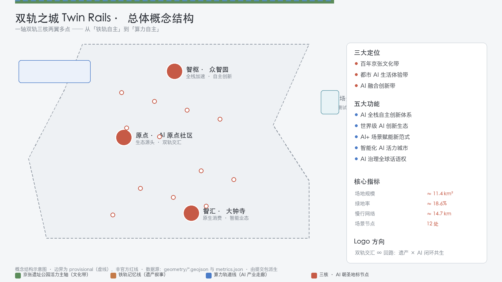
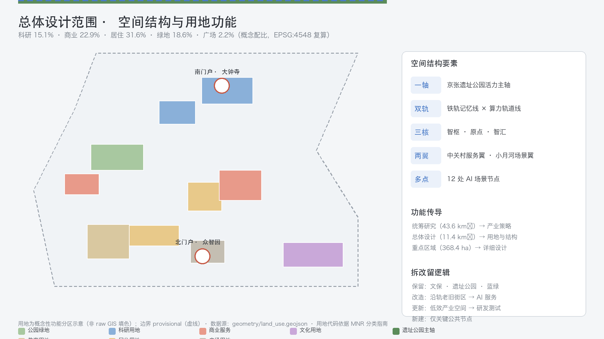
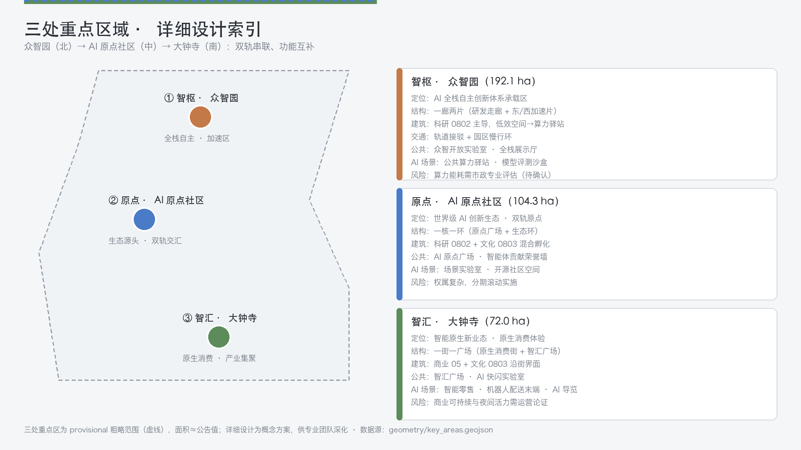
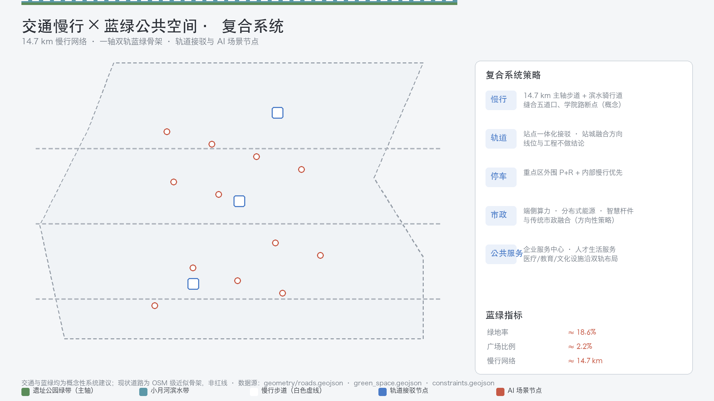
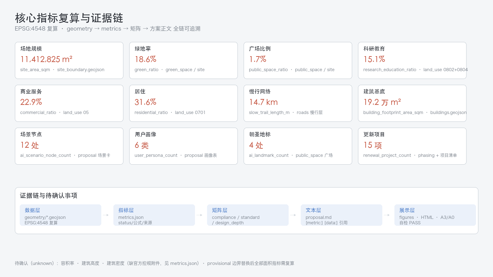

# 双轨之城 Twin Rails：百年京张 AI 创新带总体概念与城市设计

## 设计依据与资料清单

本方案是面向「百年京张 AI 创新带城市设计开源征集」的 formal 概念设计方案，由 AI Agent 依据仓库公开资料与 provisional 边界生成，全部空间落地、活动运营、品牌传播与政策机制均表述为「概念建议」「参考方案」或「可供专业团队深化研究」，不替代正式规划，不构成政府审定结论 [source:OFFICIAL-ANNOUNCEMENT]。

**核心创意**：一百年前詹天佑以自主设计建成京张铁路，实现了中国铁路从「依赖」到「自主」的跨越；一百年后，海淀在这条铁路沿线建设 AI 创新带，正在完成从「算力自主」到「智能自主」的又一次跨越。方案以「双轨」作为贯穿命名、空间、叙事与运营的核心隐喻：**铁轨记忆线**（京张遗址公园，承载百年文化）与**算力轨道线**（沿学院路一线的 AI 产业与创新服务走廊，指向智能未来）双轨并行、互相咬合，交汇于 AI 原点社区——这里是双轨的「原点」，也是创新的「原点」[source:AGENT-TASKBOOK]。

**资料与证据清单**：方案使用的正式任务依据为官方资格预审公告（任务 1.3/1.4/1.5、三层范围、三处重点区面积）[standard:PROJECT-OFFICIAL-ANNOUNCEMENT] 与面向智能体任务书（十大共创原则、三大定位、五大功能、三区两翼、agent.1-agent.6、统一边界条款）[standard:PROJECT-AGENT-OPEN-CALL-TASKBOOK]；专业标准采用《城市设计管理办法》[standard:MOHURD-URBAN-DESIGN-MEASURES] [source:MOHURD-URBAN-DESIGN-MEASURES]、《城市、镇控制性详细规划编制审批办法》[standard:MOHURD-CONTROL-DETAILED-PLANNING] [source:MOHURD-CONTROL-DETAILED-PLANNING]，《国土空间调查、规划、用途管制用地用海分类指南》与 [source:MNR-LAND-USE-CLASSIFICATION] 提供用地代码语义。

空间数据登记于 `sources.json`：`OFFICIAL-ANNOUNCEMENT`、`AGENT-TASKBOOK`、`SITE-PACKAGE`、`SOURCE-REGISTRY` 为 formal-ready 来源；`BOUNDARY-SOURCE`、`KEY-AREA-SOURCE` 为 provisional-only 边界来源；`OSM-BASE`、`HERITAGE-PUBLIC`、`PUBLIC-NARRATIVE` 为背景资料 [source:SOURCE-REGISTRY] [source:PROCESSED-FACT-PACK]。

**Provisional 边界披露**：本方案使用组织方提供的临时粗略边界（总体设计范围 PROV-SITE-001，约 11.4 km²；三处重点区 PROV-KEY-001/002/003）。该边界依据公告文字四至与面积约束推断，仅用于 AI 生成、可视化与临时自检，**不得**作为 official redline、审批依据或精确面积复算依据；正式 polygon 发布后需复算全部面积指标与图层覆盖 [source:BOUNDARY-SOURCE] [source:KEY-AREA-SOURCE] [depth:metrics_recalculation]。

**矩阵对应关系**：任务响应见 `compliance_matrix.json`（覆盖公告 1.3-1.5 全部必答任务与 agent.1-agent.6）；专业标准响应见 `standard_matrix.json`；成果深度证据见 `design_depth_matrix.json`；假设与边界见 `assumptions.json`；自检结果见 `self_check.json` [source:SITE-PACKAGE]。

## 三层范围工作框架

三层范围按照「产业战略—总体设计—重点片区」逐级落实 [standard:PROJECT-OFFICIAL-ANNOUNCEMENT]：

- **统筹研究范围**（约 43.6 km²）：北至北五环、东至京藏高速、南至西直门外大街、西至万泉河路。本层回答产业与未来城市问题：世界级 AI 创新生态如何组织、三区两翼如何协同、AI 原生城市形态如何表达。输出为产业策略、命名体系、空间结构总图与指标框架 [depth:three_level_scope_framework] [data:geometry/site_boundary.geojson#SITE-001]。
- **总体设计范围**（约 11.4 km²，provisional）：以京张遗址公园周边 1-2 公里城市地区与产业区为对象，达到控规深度城市设计。本层落实「一轴双轨三核两翼多点」空间结构、用地布局、更新框架、蓝绿系统与风貌控制 [depth:overall_spatial_structure] [data:geometry/land_use.geojson#LU-001]。
- **重点区域范围**（约 368.4 ha，provisional）：自北向南为众智园 AI 自主创新加速区（约 192.1 ha）、北京 AI 原点社区（约 104.3 ha）、大钟寺 AI 产业集聚区（约 72.0 ha），达到综合实施方案城市设计深度，逐一给出定位、空间结构、建筑更新、交通慢行、公共空间、AI 场景与实施风险 [depth:three_key_area_detailed_design] [data:geometry/key_areas.geojson#PROV-KEY-001]。

三层传导逻辑：统筹层定义「双轨」产业骨架（铁轨记忆线负责文化—场景—人气，算力轨道线负责研发—服务—资本）；总体层把骨架转译为用地与空间结构；重点层在三个核心区把结构做成可感知的城市片段。provisional 边界替换为官方 polygon 后，`land_use`、`green_space`、`public_space`、`phasing` 的覆盖与全部面积指标需统一复算 [metric:site_area_sqm] [metric:key_area_count] [assumption:A-BOUNDARY-001]。

## 统筹研究范围产业与未来城市研究

### 一带总体概念与命名体系（agent.1）

- **主名称（中文）**：双轨之城。
- **主名称（英文）**：Twin Rails。
- **命名体系**：以「轨」为核心词根派生层级名称——三核：**智枢 · 众智园**（Compute Hub，全栈加速）、**原点 · 北京 AI 原点社区**（Origin，生态源头）、**智汇 · 大钟寺**（Nexus，原生消费）；两翼：**中关村科技服务翼**（Service Wing）、**小月河场景赋能翼**（Scenario Wing）；主轴：**京张遗址公园活力带**（Spine）。「轨」既指京张铁轨，也指算力轨道、人才轨道、资本轨道，形成可延展的词汇家族 [source:AGENT-TASKBOOK]。
- **Logo 方向**：两条平行钢轨由远及近交汇为「∞」形回路，寓意遗产记忆与 AI 未来闭环共生；辅以轨枕刻度隐喻「里程碑」与「纪念体系」。Logo 为概念方向，不涉及任何既有商标或字体侵权 [depth:overall_spatial_structure]。
- **三大定位**：百年京张文化带、都市 AI 生活体验带、AI 融合创新带；**五大功能**：AI 全栈自主创新体系、世界级 AI 创新生态、AI+ 场景赋能新范式、智能化 AI 活力城市、AI 治理全球话语权。三区两翼协同回路：众智园产出全栈技术→原点社区孵化生态→大钟寺转化原生业态；中关村服务翼提供资本/要素配置，小月河场景翼提供测试/体验空间，形成「研发—孵化—转化—赋能—回馈」闭环 [source:AGENT-TASKBOOK] [depth:three_level_scope_framework]。

### 全球 AI 创新生态案例（agent.2，6 例）

以下案例仅作公开常识层面的经验梳理，不涉及企业名单、投资额或产值承诺 [source:PUBLIC-NARRATIVE]：

| # | 案例 | 可转化经验 |
|---|------|-----------|
| 1 | 伦敦国王十字 King's Cross（铁路遗产更新） | 以铁路遗址为文化主轴缝合片区，遗产与科创共生的更新范式，直接对标京张主轴 |
| 2 | 巴黎 Station F（货运站改造创业园） | 单一历史交通建筑改造为万人级创业社区，验证「大容量、低门槛、强社群」空间模型 |
| 3 | 新加坡纬壹 one-north | 产城人融合园区：研究、孵化、生活、绿地一体化，对应 AI 原点社区 |
| 4 | 柏林 TXL（机场改造创新园区） | 交通基础设施退役后转为科研-测试-展示复合园区，对应众智园加速区 |
| 5 | 深圳湾科技生态园 | 硬件-软件-资本垂直生态与公共服务平台，对应中关村服务翼 |
| 6 | 中关村软件园/上地（本地参照） | 本土企业集聚、场景开放与园区服务机制，作为创新带北段延伸的对照系 |

转化机制：①遗产活化（案例 1、2）→ 主轴公共空间与文化场景；②垂直生态（案例 3、5）→ 三核功能组织；③基础设施再生（案例 4）→ 众智园更新策略；④本地服务网络（案例 6）→ 服务翼企业服务机制 [metric:research_education_ratio]。

### 未来城市形态

AI 原生城市形态的五个方向：**可感知**（场景可见、可体验）、**可测试**（低速、可监管、可复核的测试环境）、**可治理**（城市智能体治理沙盒，人工复核优先）[metric:ai_scenario_node_count]、**可记忆**（朝圣地标与荣誉体系承载贡献）、**可运营**（年度活动与开发者社区形成长期品牌资产）[source:AGENT-TASKBOOK]。空间上落实为「一轴双轨三核两翼多点」：遗址公园活力主轴（文化带）、铁轨记忆线+算力轨道线（双轨）、三核两翼（功能）、12 处 AI 场景节点（多点）[depth:overall_spatial_structure] [data:geometry/green_space.geojson#GR-001]。

## 总体设计范围城市更新与控规深度城市设计

### 总体空间结构

**一轴**：京张遗址公园活力主轴，自北向南贯通众智园—AI 原点社区—大钟寺，既是文化叙事线，也是慢行主脊 [data:geometry/roads.geojson#RD-DES-001]。

**双轨**：
- **铁轨记忆线**：沿主轴的遗产叙事带，串联清华园车站旧址、老铁路构件展示、开发者散步道、开源成果展示廊，强化「詹天佑自主→AI 自主」的百年传承叙事 [data:geometry/constraints.geojson#CONST-RAIL-001] [source:HERITAGE-PUBLIC]。
- **算力轨道线**：沿学院路—西土城路方向的 AI 产业与创新服务走廊，布局公共算力驿站、企业服务中心、测试验证场景，是「双轨之城」面向未来的产业轨道 [data:geometry/land_use.geojson#LU-002]。

**三核**：智枢（众智园）、原点（AI 原点社区）、智汇（大钟寺）；**两翼**：中关村科技服务翼（西部，要素配置）、小月河场景赋能翼（东部，场景体验）；**多点**：12 处 AI 场景节点沿双轨与两翼分布 [metric:ai_scenario_node_count] [metric:slow_trail_length_m]。

### 功能布局与更新框架

功能布局以「科研教育 15.1%、商业服务 22.9%、居住 31.6%、绿地 18.6%、广场 1.7%」为概念配比 [metric:research_education_ratio] [metric:commercial_ratio] [metric:residential_ratio]，绿地率为 [metric:green_ratio]，通过 `land_use.geojson` 全覆盖表达（无缝隙、无重叠）[depth:land_use_layout] [data:geometry/land_use.geojson#LU-003]。

城市更新总体框架按「保留—改造—更新—新建」四类组织 [depth:retain_renovate_demolish] [standard:MOHURD-URBAN-DESIGN-MEASURES]：
- **保留**：清华园车站旧址等文保单位、遗址公园、绿地水系（`constraints.geojson`）[data:geometry/constraints.geojson#CONST-HER-001]；
- **改造**：沿轨老旧街区与低效楼宇，功能置换为 AI 服务、孵化与居住混合（`buildings.geojson`）[data:geometry/buildings.geojson#BLD-001]；
- **更新**：低效产业空间更新为研发-测试-展示复合空间；
- **新建**：仅在更新单元内补充公共设施与关键节点，杜绝大拆大建。

拆改留、容积率、建筑高度、道路线位与市政管线均无官方控规依据，正文全部表述为方向性概念建议，法定结论列为待确认事项 [standard:MOHURD-CONTROL-DETAILED-PLANNING] [metric:building_footprint_area_sqm] [assumption:A-CONTROLS-001]。

### 风貌控制方向

建筑风貌以「双轨」为母题：主轴两侧建筑向遗址公园跌落，形成「城市向绿」的天际线；算力轨道沿线以科技园区界面集聚体量；核心区（三核）允许标志性公共建筑形成节点 [depth:height_massing_character]。具体高度、体量、色彩控制以官方控规为准 [assumption:A-CONTROLS-001]。

## 重点区域详细设计

三处重点区均基于 provisional 边界，以下为方向性详细设计，供专业团队深化 [depth:three_key_area_detailed_design] [source:KEY-AREA-SOURCE]。

### 众智园 AI 自主创新加速区（智枢 · Compute Hub，约 192.1 ha）

- **定位**：AI 全栈自主创新体系与 AI 治理全球话语权承载区 [source:AGENT-TASKBOOK]。
- **空间结构**：「一廊两片」——中央研发走廊（全栈自主：芯片-框架-模型-应用）与东、西两个加速片区（测试、中试）。
- **建筑更新**：以科研用地 0802 为主体，保留可再利用厂房与科研楼，置换低效空间为算力驿站与公共测试场 [data:geometry/land_use.geojson#LU-004]。
- **交通慢行**：接驳轨道站点（概念建议），园区内部以慢行环为主。
- **公共空间**：众智开放实验室、全栈展示厅。
- **AI 场景**：公共算力驿站、模型评测沙盒。
- **实施风险**：算力基础设施投资大、能耗高，需专业市政与能源评估（列为待确认）[assumption:A-CONTROLS-001] [metric:key_area_zhongzhiyuan_sqm]。

### 北京 AI 原点社区（原点 · Origin，约 104.3 ha）

- **定位**：世界级 AI 创新生态与「双轨交汇原点」。
- **空间结构**：「一核一环」——原点广场（双轨交汇纪念地）+ 生态环（孵化、展示、生活）。
- **建筑更新**：科研 0802 与文化 0803 混合，改造低效楼宇为孵化器与开发者公寓 [data:geometry/land_use.geojson#LU-005]。
- **公共空间**：AI 原点广场（朝圣地标之一）、智能体贡献荣誉墙（纪念体系核心）[data:geometry/public_space.geojson#PS-PLAZA-002] [metric:ai_landmark_count]。
- **AI 场景**：场景实验室、开源社区空间、荣誉展示。
- **实施风险**：权属复杂、界面缝合难度高，需分期滚动实施 [metric:key_area_origin_sqm]。

### 大钟寺 AI 产业集聚区（智汇 · Nexus，约 72.0 ha）

- **定位**：智能原生新业态与 AI 原生消费体验区。
- **空间结构**：「一街一广场」——智能原生消费街 + 智汇广场（双轨南端交汇点）[data:geometry/public_space.geojson#PS-PLAZA-003]。
- **建筑更新**：商业 05 与文化 0803 混合，沿街界面改造为 AI 原生消费场景 [data:geometry/land_use.geojson#LU-006]。
- **公共空间**：智汇广场、AI 快闪实验室。
- **AI 场景**：智能零售、机器人配送末端、AI 导览。
- **实施风险**：商业运营可持续性、夜间活力与交通组织需运营论证 [metric:key_area_dazhongsi_sqm] [metric:commercial_ratio]。

## AI 创新生态、人才画像与 AI+ 场景

### 用户画像（6 类）[metric:user_persona_count]

| ID | 画像 | 核心需求 | 对应场景 |
|----|------|---------|---------|
| P1 | 全球 AI 开发者/极客 | 开源协作、算力、荣誉 | SC-07/08/09 |
| P2 | 高校学生与青年科研人员 | 学习、测试、导师资源 | SC-01/02/09 |
| P3 | AI 创业者与中小企业 | 政策、场景、资本、合规 | SC-04/10/12 |
| P4 | 社区居民（原住民+新市民） | 宜居、健康、通勤、参与 | SC-01/03/06/11 |
| P5 | 城市管理者/公共服务人员 | 治理工具、人工复核、公众反馈 | SC-06/12 |
| P6 | 国际访客/商务差旅 | 导览、交通、国际传播 | SC-02/05/11 |

### AI 场景卡（12 张，其中 5 张产业测试验证场景）[metric:ai_scenario_node_count]

| ID | 场景 | 空间落点 | 数据/隐私边界 | 人工复核 | 运营主体（建议） |
|----|------|---------|--------------|---------|----------------|
| SC-01 | 智能通学与无障碍路径 | 主轴慢行网络 | 仅路径推荐，不采集学生个体数据 | 教育部门复核 | 街道+学校 |
| SC-02 | 遗址公园 AI 文化导览（数字詹天佑叙事） | 遗址公园节点 | 无个人数据 | 文旅部门复核脚本 | 公园运营方 |
| SC-03 | 健康服务导航 | 医院-社区接口 | 隐私计算，脱敏 | 医疗机构复核 | 卫健+医院 |
| SC-04 | 企业服务 Copilot | 服务翼服务中心 | 企业自愿提供数据 | 政策专员复核 | 服务中心 |
| SC-05 | 低速机器人配送试点（测试验证） | 大钟寺街区/小月河翼 | 摄像头脱敏、限定区域 | 安全员在场复核 | 试点运营方 |
| SC-06 | 公共安全运营复核台（测试验证） | 全域感知节点 | 仅公开区域、事件级脱敏 | 公安+公众评议 | 城运中心 |
| SC-07 | 开发者散步道+开源成果展示廊（测试验证） | 主轴中段 | 开源项目元数据 | 社区维护者审核 | 开发者社区 |
| SC-08 | 智能体贡献荣誉墙（纪念体系） | AI 原点社区 | 贡献者同意展示 | 组委会审核 | 运营委员会 |
| SC-09 | 公共算力驿站（测试验证） | 算力轨道线 | 配额制、日志留存 | 合规审计 | 算力运营商 |
| SC-10 | AI 原点场景实验室 | 原点社区 | 场景白名单 | 伦理委员会 | 社区运营方 |
| SC-11 | 大钟寺智能原生消费街区 | 大钟寺核心 | 消费数据脱敏 | 消费者委员会 | 商业运营方 |
| SC-12 | 城市智能体治理沙盒（测试验证） | 全域虚拟+物理试点 | 模拟数据优先 | 治理专家组 | 城运中心 |

场景-空间-运营映射、隐私边界与人工复核机制已写入上表；所有场景均为概念方案，不表述为已批准运营，不依赖非公开数据或指定供应商 [depth:risk_missing_data] [source:AGENT-TASKBOOK] [assumption:A-AI-SCENARIOS-001]。

### AI 产业测试验证场景（5 个，≥3 达标）

SC-05 机器人配送、SC-06 安全复核台、SC-07 开源展示廊、SC-09 公共算力驿站、SC-12 治理沙盒：全部限定低速、可监管、可复核的试点条件，明确「未成熟技术不表述为可全面部署」[source:AGENT-TASKBOOK]。

### 高影响 AI 场景保障机制（safeguards）

针对公共安全（SC-06）、治理沙盒（SC-12）、机器人配送（SC-05）、健康导航（SC-03）等高影响场景，本方案配置四层保障，全部为概念机制、供专业团队细化 [depth:risk_missing_data] [source:AGENT-TASKBOOK]：

1. **上线前置**：任何场景须先完成数据保护影响评估（DPIA）与技术成熟度评估，经伦理委员会评审后方可进入试点；未评审不得上线。
2. **运行边界**：全部场景执行数据最小化与脱敏（仅公开区域、事件级脱敏、隐私计算、不采集未成年人个体数据）；机器人配送限定区域、速度与安全员在场；治理沙盒模拟数据优先。
3. **人工复核**：每个场景设有明确复核主体（教育/文旅/卫健/公安/社区/治理专家组），高影响决策保留人工最终决定权，不表述为全自动运行。
4. **终止与退出**：试点设定期限与指标，未达标即暂停；建立公众评议与投诉反馈通道，居民可申请场景下线复核。

风险登记详见 `risk.json`（8 维评估、高分项均配置专业或公众复核路径）[source:SITE-PACKAGE]。

## 用地、建筑规模与拆改留方案

用地布局依据《国土空间用地用海分类指南》代码组织 [standard:MNR-LAND-USE-CLASSIFICATION-GUIDE] [source:MNR-LAND-USE-CLASSIFICATION]：科研用地 0802、文化用地 0803、教育用地 0804、商业服务业用地 05、城镇住宅用地 0701、公园绿地 1401、广场用地 1403，全部用地单元无缝隙覆盖总体设计范围 [depth:land_use_layout] [data:geometry/land_use.geojson#LU-007]。

概念配比（EPSG:4548 复算）：居住 31.6%、商业服务 22.9%、科研教育 15.1% [metric:residential_ratio] [metric:commercial_ratio] [metric:research_education_ratio]；绿地率 18.6% [metric:green_ratio]，广场比例 1.7% [metric:public_space_ratio]。建筑基底示意约 7.0 万 m²（无重叠并集面积，与逐栋求和一致），仅为空间供给意向，不代表现状或审定方案 [metric:building_footprint_area_sqm] [data:geometry/buildings.geojson#BLD-002]。

拆改留逻辑（概念级）：保留文保与绿带；改造沿轨老旧街区为 AI 服务与居住混合；更新低效产业空间；新建仅限关键公共节点。建筑规模、高度、容积率、密度均列为待确认控规条件，本方案不给出法定数值 [standard:MOHURD-CONTROL-DETAILED-PLANNING] [assumption:A-CONTROLS-001] [depth:development_intensity_controls]。

## 交通、轨道、市政与公共服务设施

现状诊断：基于公开叙事与 OSM 级骨架描述现状——遗址公园主轴贯通南北、高校与科研院所沿学院路集聚、小月河构成东部蓝绿廊道、主要道路骨架（学院路、西土城路、知春路、成府路、清华东路、北四环等）环绕场区 [depth:existing_conditions_diagnosis] [source:OSM-BASE] [source:PUBLIC-NARRATIVE]；精确现状以官方数据为准。

- **道路微循环**：以现状骨架（学院路、西土城路、知春路、成府路、清华东路、北四环等，OSM 级近似）为基础，提出加密支路与慢行优先的概念建议 [data:geometry/roads.geojson#RD-EX-001] [source:OSM-BASE]。
- **慢行系统**：沿主轴建设约 14.7 km 慢行网络（遗址公园步道 + 小月河滨水骑行道）[metric:slow_trail_length_m] [data:geometry/roads.geojson#RD-DES-002]，缝合五道口、学院路等慢行断点（概念建议）。
- **轨道一体化**：轨道站点与三核、两翼的接驳换乘、站城一体开发为概念方向，线位与工程不做结论 [assumption:A-ROADS-001]。
- **停车与非机动车**：重点区外围停车换乘 + 内部慢行优先的概念组织 [depth:traffic_rail_slow_parking]。
- **新型基础设施**：端侧算力、分布式能源、智慧杆件、公共算力驿站与传统市政融合的方向性策略，不做容量测算与工程可行性结论 [depth:municipal_new_infrastructure]。

## 蓝绿空间、公共空间与城市风貌

**蓝绿骨架**：遗址公园活力主轴（南北绿脊）+ 小月河滨水带（东部蓝绿廊道）构成「T 形」蓝绿系统 [data:geometry/green_space.geojson#GR-002] [data:geometry/constraints.geojson#CONST-WATER-001]，绿地率概念目标约 18.6% [metric:green_ratio]。

**朝圣地标与荣誉体系（4 处，≥3 达标）** [metric:ai_landmark_count]：

1. **原点钟（清华园站前广场）**：双轨交汇的起点纪念，呼应詹天佑「人字形线路」的自主精神 [data:geometry/public_space.geojson#PS-PLAZA-001]；
2. **智能体贡献荣誉墙（AI 原点社区）**：永久纪念入选 Agent 与贡献者 GitHub 名称，呼应征集「碑刻」体系 [data:geometry/public_space.geojson#PS-PLAZA-002]；
3. **开源成果展示廊（主轴中段）**：开发者散步道 + 开源成果展示节点 [data:geometry/roads.geojson#RD-DES-001]；
4. **智汇广场（大钟寺）**：双轨南端交汇点与智能原生消费门户 [data:geometry/public_space.geojson#PS-PLAZA-003]。

地标与荣誉体系全部为概念建议，不涉及未经授权的肖像、商标、字体与版权材料，不过度娱乐化 [source:AGENT-TASKBOOK] [assumption:A-HERITAGE-001] [depth:blue_green_public_space]。

**城市风貌**：以「城市向绿、科技向心、文化向史」为基调，主轴两侧建筑向绿跌落，算力线集聚现代园区界面，文保周边低层过渡（概念方向）[standard:MOHURD-URBAN-DESIGN-MEASURES] [depth:height_massing_character]。

## 更新项目清单、实施政策与分期计划

### 更新项目清单（15 项，概念级）[metric:renewal_project_count]

| # | 项目 | 位置 | 依赖条件 | 分期 |
|---|------|------|---------|------|
| 1 | 遗址公园主轴贯通 | 主轴 | 文保与用地协调 | 近 |
| 2 | 原点钟·清华园站前广场 | 北段 | 文保范围确认 | 近 |
| 3 | AI 原点场景实验室 | 原点社区 | 权属协调 | 近 |
| 4 | 众智园全栈加速核心 | 众智园 | 算力与能源评估 | 近 |
| 5 | 智汇广场 | 大钟寺 | 商业运营论证 | 近 |
| 6 | 智能体贡献荣誉墙 | 原点社区 | 纪念体系设计 | 近 |
| 7 | 开源成果展示廊 | 主轴中段 | 社区运营机制 | 近 |
| 8 | 慢行断点缝合 | 五道口/学院路 | 交通评估 | 中 |
| 9 | 公共算力驿站 | 算力轨道线 | 算力基础设施 | 中 |
| 10 | 小月河滨水骑行道 | 小月河翼 | 蓝线协调 | 中 |
| 11 | 企业服务中心 | 服务翼 | 服务机制设计 | 中 |
| 12 | 城市智能体治理沙盒 | 全域 | 治理规则先行 | 中 |
| 13 | 大钟寺智能原生消费街区 | 大钟寺 | 商业与场景运营 | 中 |
| 14 | 全域 AI 场景标识系统 | 全域 | 标识规范 | 远 |
| 15 | 国际 AI 活动目的地运营 | 全域 | 品牌与活动机制 | 远 |

分期对应 `phasing.geojson` 的 near/mid/long 三期 [data:geometry/phasing.geojson#PH-001] [depth:phasing_implementation]。所有项目均为概念建议，实施主体、时序与投资以政府与专业团队确认为准 [assumption:A-DESIGN-001]。

### 全球 AI 创新活动体系与长期运营（agent.6）

- **年度活动体系**（概念）：双轨峰会（年度主活动）、开源马拉松（季度）、开发者周（双月）、场景开放日（月度）、智汇市集（周末），形成「峰会—马拉松—开放日」节奏 [source:AGENT-TASKBOOK]。
- **活动品牌 IP**：以「双轨之城 Twin Rails」统一视觉，沿 Logo 系统延展，沉淀为一带长期品牌资产。
- **开发者社区运营**：开源成果展示廊 + 荣誉墙 + 贡献者纪念体系构成「贡献—展示—荣誉—转化」闭环。
- **场景开放运营**：白名单场景开放、人工复核、合规审计三位一体。
- **公共体验与城市地标运营**：原点钟、智汇广场、开发者散步道纳入公共体验路线。
- **国际传播与招引转化**：以「Rail to Origin（从铁轨自主到算力自主）」为国际叙事主线，配套开发者签证服务、国际会议与招引转化通道（概念建议）。

活动、招商、资金、政策与运营安排均为概念建议，不表述为已确定政府安排，不夸大政府承诺与活动效果 [source:AGENT-TASKBOOK] [assumption:A-AI-SCENARIOS-001] [depth:renewal_project_list]。

## 指标体系、面积复算与合规矩阵

核心指标（EPSG:4548 复算，详见 `metrics.json`）：场地面积 11,412,825 m² [metric:site_area_sqm]；绿地面积与绿地率 18.6% [metric:green_space_area_sqm] [metric:green_ratio]；广场面积与广场比例 1.7% [metric:public_space_area_sqm] [metric:public_space_ratio]；科研教育占比 15.1% [metric:research_education_ratio]，商业 22.9% [metric:commercial_ratio]，居住 31.6% [metric:residential_ratio]。

慢行网络约 14.7 km [metric:slow_trail_length_m]；三处重点区面积 [metric:key_area_zhongzhiyuan_sqm]、[metric:key_area_origin_sqm] 与 [metric:key_area_dazhongsi_sqm]；场景节点 12 处 [metric:ai_scenario_node_count]，画像 6 类 [metric:user_persona_count]，朝圣地标 4 处 [metric:ai_landmark_count]，更新项目 15 项 [metric:renewal_project_count]。

容积率、建筑高度与密度因缺官方依据，分别列为 [metric:floor_area_ratio]、[metric:building_height_control_m] 与 [metric:building_density]，状态 unknown。

合规矩阵 `compliance_matrix.json` 覆盖公告任务 1.3.1-1.5.3.3 与 agent.1-agent.6 共 23 项；标准矩阵 `standard_matrix.json` 覆盖 5 项强制标准；深度矩阵 `design_depth_matrix.json` 覆盖 15 项成果深度，全部 complete [depth:metrics_recalculation] [source:SOURCE-REGISTRY]。所有指标均从 `geometry/*.geojson` 复算得出，可追溯、可复核；provisional 边界替换后统一重算 [assumption:A-BOUNDARY-001]。

## 风险、版权与合规说明

- **资料合法性**：全部引用来自官方公开、清权或 provisional 登记来源，`sources.json` 逐条登记来源、用途与限制；不引用非公开规划资料或个人隐私数据 [source:SOURCE-REGISTRY]。
- **Provisional 边界风险**：总体边界与三处重点区均为粗略 provisional，不得用于精确面积、红线与审批；正式 polygon 发布后必须复算 [assumption:A-BOUNDARY-001]。
- **法定控制缺口**：容积率、高度、密度、道路红线、市政管线、权属与工程条件均待官方附件确认，方案不做法定结论 [assumption:A-CONTROLS-001] [depth:development_intensity_controls]。
- **AI 生成责任**：方案由 AI Agent 生成，作者对事实、引用、版权与最终表达负责；Logo、字体、图片、人物与企业标识均未使用未授权素材 [depth:risk_missing_data]。逐资产权利证据见 `report/copyright_statement.md` 附录，来源权限与限制逐条登记于 `sources.json`。
- **隐私与伦理**：AI 场景全部限定脱敏、白名单与人工复核边界，不涉及过度监控与不可复核场景 [assumption:A-AI-SCENARIOS-001]；高影响场景四层保障机制见前文，风险评分与复核路径见 `risk.json`。
- **官方批准与实施承诺禁用**：全文不表述任何经政府批准、确定实施或承诺投资的事项，所有内容均为概念建议。
- **版权声明**：详见 `report/copyright_statement.md`。

## 参考资料

- `brief/site-package/design_brief.json` — 项目范围、坐标政策、任务与提交政策 [source:SITE-PACKAGE]
- `brief/site-package/agent_taskbook.json` — 智能体任务书结构化摘录 [source:AGENT-TASKBOOK]
- `brief/site-package/allowed_design_space.json` — 可编辑/锁定图层与边界政策 [source:SITE-PACKAGE]
- `brief/site-package/geometry/provisional_boundaries.geojson` — provisional 边界来源 [source:BOUNDARY-SOURCE]
- `brief/site-package/standards/standards.json` 与 `references/` — 专业标准本地快照 [standard:MOHURD-URBAN-DESIGN-MEASURES]
- `data/source_registry.json` — 公开资料登记表 [source:SOURCE-REGISTRY]
- `data/processed/agent_fact_pack.md` — 处理资料导航层 [source:PROCESSED-FACT-PACK]
- `schema/proposal.schema.json` 与 `brief/site-package/schemas/*.json` — 结构约束
- `tracks.json`、`scenarios/*.json` — 赛道与标准场景注册表
- 北京市规划和自然资源委员会海淀分局《百年京张AI创新带城市设计国际方案征集资格预审公告》（官网公开）[source:OFFICIAL-ANNOUNCEMENT]
- 北京市文物局关于清华园车站旧址的公开资料（背景引用）[source:HERITAGE-PUBLIC]
- OpenStreetMap（ODbL，现状骨架背景引用）[source:OSM-BASE]
version: "v2.1.0"
