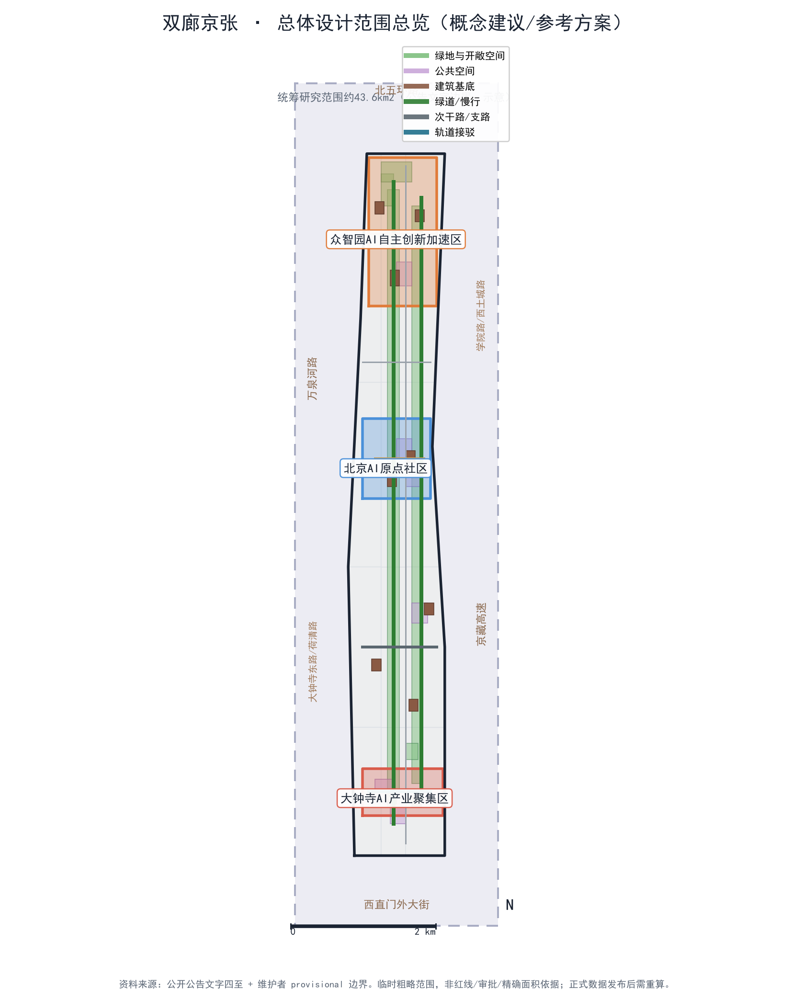
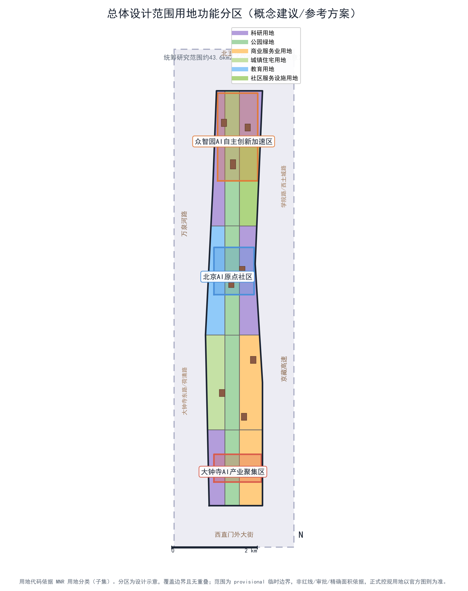
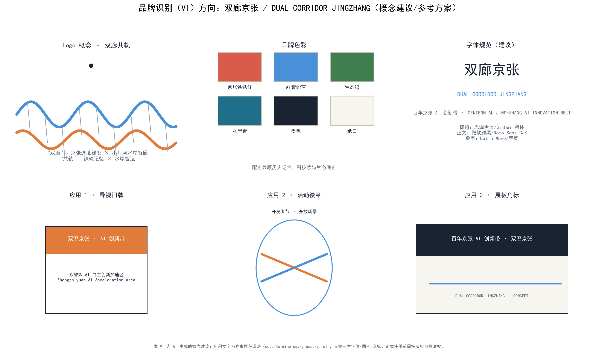
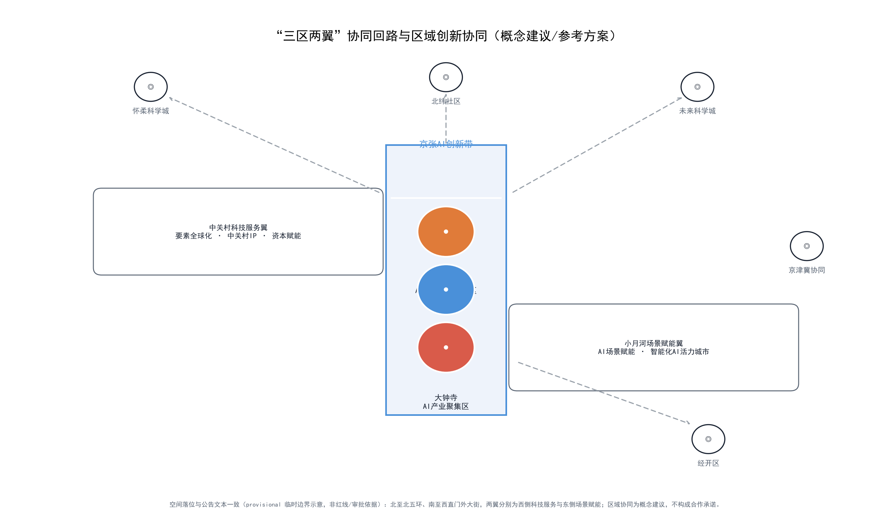
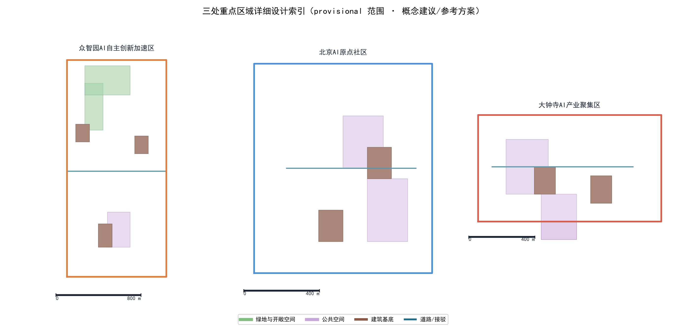
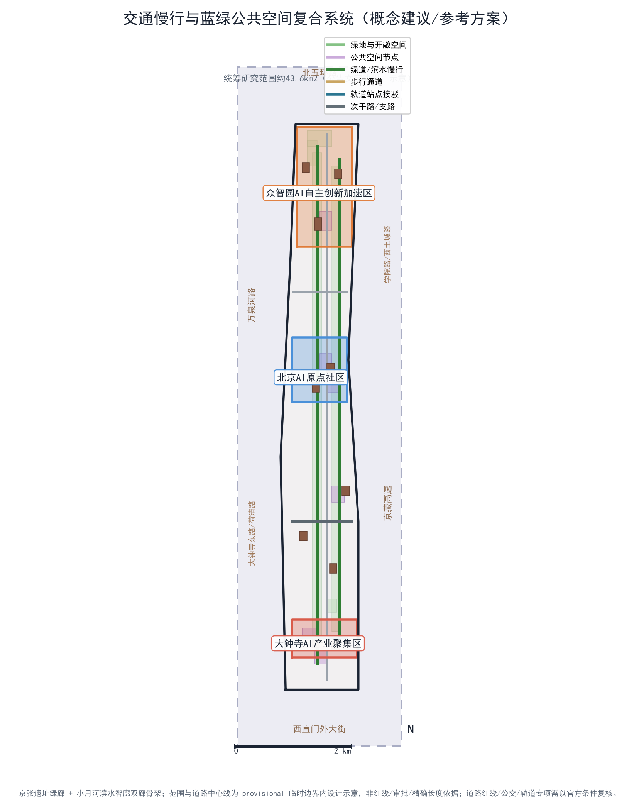
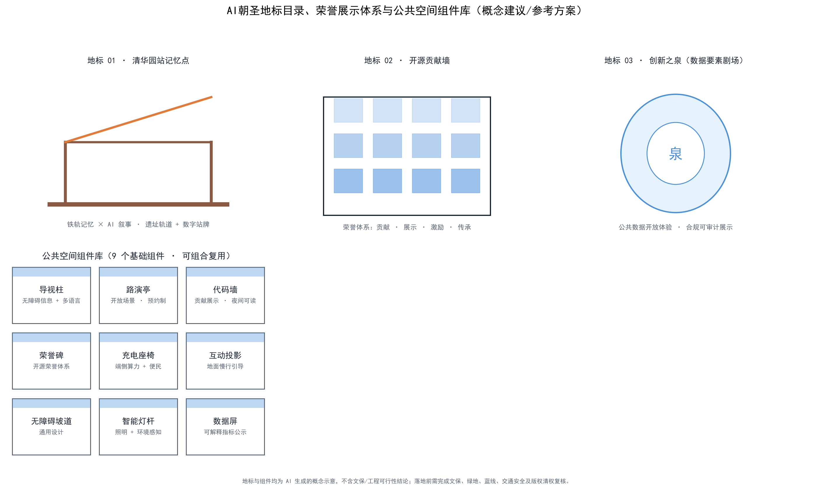
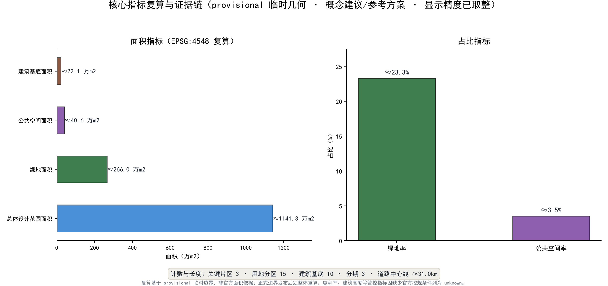

# 双廊京张：铁轨记忆×水岸智造——百年京张AI创新带总体概念与重点区域设计

## 设计依据与资料清单

本方案以北京市规划和自然资源委员会海淀分局发布的《百年京张AI创新带城市设计国际方案征集资格预审公告》为第一依据，并以 `brief/site-package/` 中经维护者登记的临时粗略边界、重点区域、枚举、指标和来源清单为机器可读依据。生成前，本智能体读取了 `design_brief.json`、`allowed_design_space.json`、`sources.json`、`enums/`、`ranges/`、`schemas/`、`data/source_registry.json` 和 `data/processed/agent_fact_pack.md`，并用 `project_scope_summary.csv`、`agent_task_requirements.csv`、`source_use_matrix.csv`、`missing_data_checklist.csv` 建立任务、范围、资料用途和缺口清单。所有设计判断都拆分为可追溯来源、可复算指标、可校验图层和可人工复核假设。公告要求方案达到控制性详细规划的城市设计深度和规划综合实施方案的城市设计深度，因此文本叙述不能替代 GeoJSON、指标表、A3 文册、A0 展板和 HTML 电子展示成果，本包以五类成果共同构成证据链。

本节证据链引用 [source:OFFICIAL-ANNOUNCEMENT]、[source:AGENT-TASKBOOK]、[source:SITE-PACKAGE]、[source:SOURCE-REGISTRY]、[source:PROCESSED-FACT-PACK]、[source:BOUNDARY-SOURCE]、[source:KEY-AREA-SOURCE]、[standard:PROJECT-OFFICIAL-ANNOUNCEMENT]、[standard:PROJECT-AGENT-OPEN-CALL-TASKBOOK]、[standard:MOHURD-URBAN-DESIGN-MEASURES]、[standard:MOHURD-CONTROL-DETAILED-PLANNING]、[standard:MNR-LAND-USE-CLASSIFICATION-GUIDE]、[standard:MOHURD-ARCH-DESIGN-DEPTH-2016] 和 [depth:existing_conditions_diagnosis]，以说明方案从公告、面向智能体任务书、标准、边界、处理资料包和资料清单出发组织成果，而不是脱离依据的独立愿景文本。

资料登记表的使用边界如下：

- data/source_registry.json 登记公开、清权与临时资料的用途边界。
- 当前登记摘要：formal 可用资料 5 条，背景资料 0 条，provisional-only 资料 1 条。
- 本方案不把 background_only 或 provisional_only 资料升级为 official boundary、法定控规、正式评分依据或政府实施承诺。

`data/processed/agent_fact_pack.md` 是本方案的阅读导航层，不是新的权威来源。[source:PROCESSED-FACT-PACK] 只帮助把三层范围、三处重点区、公告任务、agent.1-agent.6、资料可用性和缺资料事项组织成可读方案；所有事实判断仍回到 [source:OFFICIAL-ANNOUNCEMENT]、[source:AGENT-TASKBOOK]、[source:SOURCE-REGISTRY]、[source:BOUNDARY-SOURCE] 与 [source:KEY-AREA-SOURCE]。

由于组织方正式 `SITE_BOUNDARY` 或三处 `KEY_AREA` 尚未发布，本方案使用 `brief/site-package/geometry/provisional_boundaries.geojson` 生成临时 formal 包。提交包中的 `geometry/site_boundary.geojson` 与 `geometry/key_areas.geojson` 均标注为 `provisional_constraint`、`official_boundary=false`，只能用于方案生成、自检、可视化和设计讨论，不能作为 official redline、审批依据、精确面积依据或法定控制结论。该组织方数据缺口本身不阻断内容评分；替换 official polygons 后，site boundary、key areas、land use、roads、green space、public space、buildings、phasing 和 metrics 均需重算。因此正文中的空间结构、场景、项目和指标均按"可讨论、可复核、可替换官方边界后重算"的原则写入；当官方边界和重点区 polygon 更新后，须重新运行生成流程、自检和图纸/HTML生成，不能只替换单个文件。

边界和重点区域的可读解释对应 [data:geometry/site_boundary.geojson#SITE-001]、[data:geometry/key_areas.geojson#PROV-KEY-001] 和 [metric:site_area_sqm]、[metric:key_area_count]。读者可从正文回到 GeoJSON 查看边界来源、从 metrics 查看面积复算结果、从 sources 查看资料来源，而不是只相信一段文字判断。

## 三层范围工作框架

本方案按照公告确定的三个层次组织工作。统筹研究范围关注 43.6 平方公里的AI产业生态、战略定位、创新链和未来城市形态，回答"AI创新带在整个海淀和京津冀创新网络中的角色"；总体设计范围关注 11.4 平方公里京张遗址公园周边 1-2 公里城市地区和产业区，回答"更新总体框架、产业空间布局、交通市政支撑和城市风貌控制如何落图"；重点区域范围关注 368.4 公顷三处详细设计地区，回答"功能业态、建筑规模、拆改留分类、公共空间连通和交通组织如何达到详细设计深度"。三层范围在 `compliance_matrix.json` 中逐条映射，保证公告 1.3、1.4、1.5 与 agent.1-agent.6 的必选任务都有章节、图层、指标、图纸和 HTML 证据。

三层工作框架的深度项由 [depth:three_level_scope_framework] 和 [depth:overall_spatial_structure] 约束，空间证据以 [data:geometry/site_boundary.geojson#SITE-001] 与 [data:geometry/key_areas.geojson#PROV-KEY-001] 为准，任务依据以 [standard:PROJECT-OFFICIAL-ANNOUNCEMENT] 为准，范围索引以 [source:PROCESSED-FACT-PACK] 中 `project_scope_summary.csv` 的三层范围表为导航。

三层工作不是互相割裂的图纸集合。统筹研究决定产业链和城市形态判断，总体设计把判断落实到更新项目、空间结构和设施承载，重点区域详细设计验证具体地块、建筑、交通、公共空间和AI应用场景的可实施性。生成路径是：先锁定当前提交采用的 provisional 边界和约束，再生成用地、建筑、道路、绿地、公共空间、分期和AI服务节点，最后从这些图层复算指标并在正文解释哪些结论仍受 provisional boundary 限制。任何无法从结构化数据复算的面积、比例、规模或项目数量，不写入正式结论。

本方案建议的总体概念为"京张智脉共生带"（英文 Jing-Zhang AI Nexus）：以京张遗址公园为历史与公共空间主轴，以众智园、北京AI原点社区、大钟寺三处重点片区为创新锚点，以高校、企业、社区和轨道站点为日常网络，形成"一带三核、多点场景、蓝绿慢行复合环"的空间组织。"一带"不是额外画出的新红线，而是把公告中的三层范围转译为工作方法；"三核"对应三处重点区域；"多点场景"对应AI+公共服务、产业服务和城市生活的可运营节点；"复合环"对应慢行、绿地、公共空间和活动路线的联动。

| 层级 | 设计问题 | 方案回答 | 数据落点 |
| --- | --- | --- | --- |
| 统筹研究范围 | AI产业生态和未来城市形态如何组织 | 建立"高校策源-开源协作-企业转化-公共体验-国际传播"的创新链 | compliance_matrix.json、standard_matrix.json |
| 总体设计范围 | 产业空间、城市更新、交通市政和风貌如何落图 | 用地、建筑、道路、绿地、公共空间和分期图层共同表达 | [data:geometry/land_use.geojson#LU-001]、[data:geometry/roads.geojson#ROAD-001] |
| 重点区域范围 | 三处片区如何达到详细设计深度 | 分别提出定位、空间动作、AI场景和实施依赖 | [data:geometry/key_areas.geojson#PROV-KEY-001]、[data:geometry/key_areas.geojson#PROV-KEY-002]、[data:geometry/key_areas.geojson#PROV-KEY-003] |

### 命名与视觉识别（agent.1）

主名称定为"京张智脉"，英文 Jing-Zhang AI Nexus。"京"指向中关村与高校策源端，"张"回指京张铁路的历史端，"智"对应AI，"脉"把铁路的线性遗产转译为贯通南北的创新脉动。命名不照搬任何既有城市、园区或企业名称，属本方案原创概念。

Logo 方向（`assets/figures/brand-identity.png`）以京张铁路八达岭段"人字形"展线为原型，抽象为双轨交汇的"人"字形/"N"形符号，象征"铁轨记忆×水岸智造"的相遇。视觉系统建立三色体系：钢轨灰（历史与结构）、智脉蓝（AI与创新）、活力橙（公共生活与运营），并配套开源中文字体与开源英文字体的正负形使用规范，保证在 A3/A0、HTML、导视和社媒场景中可延展。Logo 全部元素为本智能体原创矢量绘制，无第三方商标、图片或字体依赖（字体许可见 `report/copyright_statement.md`）。该部分对应 [source:AGENT-TASKBOOK] 的 agent.1 要求，并纳入 `visual/index.html` 的品牌章节。

| 定位 | 命名落点 | 空间载体 |
| --- | --- | --- |
| 百年京张文化带 | "京张·1909"（京张铁路通车年份）文化叙事 | 京张遗址公园、清华园火车站 |
| 都市AI生活体验带 | "AI生活实验室"体验品牌 | 小月河场景赋能翼、社区服务节点 |
| AI融合创新带 | "智脉创新带"产业品牌 | 众智园、原点社区、大钟寺 |

三大定位与五大功能（AI全栈自主创新体系、世界级AI创新生态、AI+场景赋能新范式、智能化AI活力城市、AI治理全球话语权）分别锚定到三区两翼与图层证据，避免只停留在口号层面。[standard:PROJECT-AGENT-OPEN-CALL-TASKBOOK] 明确了这些属于开源征集任务而非法定规划控制。

### 三区两翼协同回路（agent.1）

三区两翼不是三个片区加两个翅膀的并列清单，而是一个可运行的四阶段协同回路：

- **策源**：AI原点社区承接高校、开源社区与初创团队的"从0到1"，承载世界级AI创新生态；
- **加速**：众智园承接"从1到10"，承载AI全栈自主创新体系与AI治理全球话语权，提供测试、标准与安全治理界面；
- **应用**：大钟寺承载"从10到N"，面向智能原生新业态、内容消费与数据要素流通；
- **赋能**：中关村科技服务翼提供要素全球化配置、IP与资本；小月河场景赋能翼提供AI场景与智能化AI活力城市的生活界面。

区域协同上，本方案把海淀AI创新带与北纬社区（科研教育）、未来科学城（基础研究与创新设施）、怀柔科学城（大科学装置）、经开区（先进制造承接）和京津冀（产业外溢与场景纵深）的关系表达为"策源-中试-落地-场景"的横向分工，而不是纵向复制。该协同回路在图 `three-zones-two-wings.png` 中以箭头回路呈现，并在 `compliance_matrix.json` 中对应 agent.1 的"三区两翼协同回路"与"区域创新协同关系"条目；由于缺少区域层面的合作证据与空间映射数据，本部分标注为"概念建议/可供专业团队深化研究"。

## 统筹研究范围产业与未来城市研究

统筹研究范围的核心任务是构建世界级 AI 创新生态体系。本方案梳理海淀高校院所、头部企业、算力算法数据要素、孵化平台、上市企业、独角兽和科技服务资源，提出AI创新链、产业链、人才链和城市服务链的空间协同框架，并把上述命名、Logo、三大定位、五大功能与三区两翼协同回路落实为可见的空间结构，而不是口号。

### 全球案例比较与生态图谱（agent.2）

本方案选取 5—8 个全球AI创新生态案例做差异化比较，全部为公开资料，来源链接在表中给出；这些链接仅作为文字比较依据，不把外部图片引入提交包，不构成版权引用问题。案例的选择逻辑是：每个案例必须在"空间-生态-运营"三个维度至少一个方面对京张AI创新带具有可迁移经验，并明确标注不照搬的内容与适用边界。来源链接为 2026-08-09 检索，正式深化时应由专业团队复核链接有效性与时效。

| # | 案例 | 地点 | 核心机制 | 对本方案的适用边界 | 来源 |
| --- | --- | --- | --- | --- | --- |
| 1 | 云栖小镇 | 中国杭州 | "云栖大会+产业小镇"双轨：年度大会作为场景总开关，带动云计算/空天信息等产业链聚集，并推进"数实融合"线下实践场 | 借鉴"年度大会激活日常运营"的活动体系（agent.6）；不照搬其规模与政策承诺 | https://www.hzxh.gov.cn/col/col1229315655/index.html（西湖区政府门户·云栖小镇管委会专栏） |
| 2 | 深圳湾科技生态园 | 中国深圳 | 园区生态运营商统一运营，发布"揭榜挂帅"应用场景榜单，2000+企业、研发办公+公寓+酒店+商业复合 | 借鉴"场景揭榜挂帅"与园区生态运营主体模式（P1-5 实施矩阵）；不照搬容积率与开发规模 | https://www.szbay.com/（深圳湾科技官方） |
| 3 | 裕廊创新区 Jurong Innovation District | 新加坡 | 毗邻南洋理工大学的多主体产业园区：研发机构+技术提供商+未来工厂同处一区，Living Lab（DECAL脱碳实验室）在真实环境测试，15公顷公园绿地 | 借鉴"大学+产业街区+真实环境测试床"三段式；对应众智园治理沙盒与测试场景（agent.3）；不照搬土地与开发模式 | https://www.jtc.gov.sg/juronginnovationdistrict |
| 4 | 国王十字 King's Cross | 英国伦敦 | 67英亩废弃铁路货运场更新为科创/文化街区：20条新街道、10个公共空间，Google/Meta等入驻，长期公众参与 | 借鉴"铁路遗产活化+公共空间优先+科创企业集聚"；对应京张遗址公园公共空间设计（agent.4）；不照搬其资本与产权结构 | https://www.kingscross.co.uk/about-the-development |
| 5 | Station F | 法国巴黎 | 1927年历史建筑改造为全球最大创业校园：1000+初创、30+项目、大企业合作、一站式服务 | 借鉴"历史建筑+孵化器+大企业合作"的空间组织；对应原点社区成果转化街；不照搬其单点体量 | https://stationf.co/ |
| 6 | 阿姆斯特丹科技园 | 荷兰阿姆斯特丹 | 大学园区+AI/可持续/生命健康/高端制造四主题集群，科研机构+初创+企业协作 | 借鉴"大学园区+主题化创新集群+创业社区"；对应原点社区近校创新生态（agent.2）；不照搬其用地规模 | https://amsterdamsciencepark.nl/ |
| 7 | 布鲁克林海军码头 Yard Labs | 美国纽约 | 300英亩城市真实环境测试床：科技公司在真实街道/建筑/能源环境做脱碳、EV、韧性试点，成功后扩大租用空间 | 直接对应众智园"安全治理沙盒"与"产业测试验证场景"机制（agent.3）；不照搬其补贴政策 | https://www.brooklynnavyyard.org/yard-labs/ |

AI创新生态图谱采用六层结构（`three-zones-two-wings.png` 右侧与 `visual/index.html` 生态图谱节呈现）：

1. 策源层：高校院所、开源社区、重点实验室；
2. 转化层：孵化器、加速器、技术转移与成果发布；
3. 制造与算力层：众智园全栈创新、端侧算力节点、数据中心；
4. 应用与消费层：大钟寺智能原生业态、小月河场景赋能翼；
5. 服务与资本层：中关村科技服务翼、基金、知识产权与中介服务；
6. 治理与标准层：安全评测、标准制定、伦理与治理话语权。

八类要素（土地、空间、产业、资金、人才、算力、数据、场景）在六层之间流动，对应 [depth:overall_spatial_structure] 与 [source:AGENT-TASKBOOK] 的 agent.2 要求；其中企业名单、投资额、产值和财政承诺不属于本方案可证明的事实，一律不编造，均标注为待正式数据校准。

统筹研究并不新增伪精确红线；它通过 [standard:MOHURD-URBAN-DESIGN-MEASURES] 要求的城市风貌、公共空间和建筑布局统筹，回接 [data:geometry/land_use.geojson#LU-001]、[data:geometry/public_space.geojson#PUBLIC-001] 与 [depth:overall_spatial_structure]，说明产业策略最终落到可见、可复核的空间结构。

未来城市形态研究回答人工智能如何改变工作、生活、社交、学习、交通和公共服务。本方案把AI交通系统、连续绿色空间、创新服务设施和国际化生活工作氛围落实为可定位的功能区、节点、廊道和场景，并把产业战略指标、AI创新指数、人才密度、空间供给类型和AI+垂直应用重点区域写入指标体系，标明哪些是官方、哪些是设计建议、哪些仍待正式数据校准。全球AI创新活动、开发者社区、开放场景或朝圣路线均表述为"概念建议/参考方案/可供专业团队深化研究"，不写成已确定的政府活动或实施安排。

## 总体设计范围城市更新与控规深度城市设计

总体设计范围要求达到控制性详细规划的城市设计深度。本方案提出城市更新总体空间结构、低效空间识别方法、更新项目清单、实施政策建议、产业功能比例、空间组织模式、建筑总规模和综合承载能力评估框架。`geometry/land_use.geojson` 完整覆盖设计边界且无重叠，`geometry/buildings.geojson` 表达更新建筑基底或保留建筑基底，`geometry/roads.geojson` 表达微循环、慢行和轨道接驳关系，`metrics.json` 复算核心面积、比例和图层数量。

本节按照 [standard:MOHURD-CONTROL-DETAILED-PLANNING] 把控规深度内容拆成可审查对象：[data:geometry/land_use.geojson#LU-001] 表达用地结构，[data:geometry/buildings.geojson#BLDG-001] 表达建筑基底，[data:geometry/roads.geojson#ROAD-001] 表达交通组织，[metric:building_footprint_area_sqm] 用于复核建筑基底面积，[depth:land_use_layout] 与 [depth:development_intensity_controls] 约束成果深度。

城市更新总体框架以"保留记忆、缝合断点、注入智脉"为原则：沿京张遗址公园两侧识别低效工业与仓储用地，优先缝合北五环上跨节点、五道口与清华东路西口、大钟寺站周边等慢行断点；产业功能比例按"研发办公为主、产业服务与配套生活为辅、公共体验嵌入"组织，避免单一居住化或单一办公化。涉及建筑高度、开发强度、道路红线、退线和设施标准的内容，在尚无官方控制条件时一律表述为"待正式控规条件确认"，不以智能体推测值冒充审定指标。

总体设计必须支撑交通、轨道、市政和配套设施。本方案围绕轨道站点一体化、道路微循环、非机动车停放、停车供给、创新服务平台、人才生活服务、新型基础设施、分布式能源和端侧算力提出空间布局和实施路径；凡涉及工程方案（道路线形、轨道线位、桥隧、市政管线、地下空间可行性、能源负荷、市政容量）的结论，均明确降级为"概念建议/需工程专项深化"，不给出工程可行性判断。

## 重点区域详细设计

重点区域详细设计是必选项，三处片区分别以独立小节达到规划综合实施方案的讨论深度。每处片区均说明功能业态、概念建筑/拆改留分类、交通慢行、公共空间、AI节点、分期与依赖条件，全部落地内容表述为"概念建议/参考方案/可供专业团队深化研究"。

三处重点区域均在 `geometry/key_areas.geojson` 中出现（[data:geometry/key_areas.geojson#PROV-KEY-001]、[data:geometry/key_areas.geojson#PROV-KEY-002]、[data:geometry/key_areas.geojson#PROV-KEY-003]），由 [depth:three_key_area_detailed_design] 检查是否达到规划综合实施方案深度。由于官方 polygons 缺失，当前使用 `provisional_constraint`，正文、HTML、sources、assumptions 和 self_check 均说明其不能作为正式评分或审批依据。`compliance_matrix.json` 分别覆盖公告 1.5.3.1、1.5.3.2、1.5.3.3；HTML 页面可切换查看三处重点区域，A3 文册和 A0 展板包含重点片区总图、局部详图和指标说明。

| 重点片区 | 设计定位 | 空间动作 | AI产业与运营场景 | 证据引用 |
| --- | --- | --- | --- | --- |
| 众智园AI自主创新加速区 | 花园型全栈自主创新街区 | 强化清河界面、产业展示、低碳创新交往和对外交通组织；以绿色空间承载开放测试与标准治理展示 | 自主模型测试、标准制定工作坊、安全治理展示、低碳算力体验 | [data:geometry/key_areas.geojson#PROV-KEY-001]、[depth:three_key_area_detailed_design] |
| 北京AI原点社区 | 近校型成果转化与人才社区 | 组织校区、园区、街区慢行缝合；补足成果发布、人才服务、居住生活和开源协作空间 | 开源社区、成果发布、人才特区服务、近校孵化 | [data:geometry/key_areas.geojson#PROV-KEY-002]、[source:AGENT-TASKBOOK] |
| 大钟寺AI产业聚集区 | 城市型智能经济与国际交往街区 | 围绕大钟寺站一体化、四象限步行连通、商业服务和重点企业公共环境更新 | 智能体与智能终端展示、内容消费、数据要素与国际路演 | [data:geometry/key_areas.geojson#PROV-KEY-003]、[metric:key_area_count] |

### 众智园AI自主创新加速区（概念建议）

- **功能业态**：国家人工智能平台展示、全栈自主创新企业研发、标准与安全评测、低碳绿色算力、产业展示与对外交往。
- **概念建筑/拆改留**：沿清河界面以保留改造为主，利用既有厂房形成"智治方舟"公共建筑群；新建以低层测试与展示建筑为主，具体拆改留结论待现状权属与工程条件确认后由专业团队深化。
- **交通慢行**：组织对外快速接驳与内部慢行环，串联清河滨水界面与产业展示节点；轨道与公交接驳方案为概念建议。
- **公共空间**：清河低碳创新廊作为园区公共客厅，承载雨洪、步行骑行与AI展示复合功能。
- **AI节点**：安全治理沙盒、标准制定工作坊、低碳算力体验点、自主模型开放测试场。
- **分期与依赖**：近期以轻量设施与运营活动启动，中期补足产业展示与测试建筑，长期纳入控规条件确认；依赖河道蓝线、生态与防洪条件复核。

### 北京AI原点社区（概念建议）

- **功能业态**：高校成果转化、开源协作、成果发布、人才特区服务、近校孵化、配套居住与生活服务。
- **概念建筑/拆改留**：以校区边界内既有建筑改造为主，组织"近校成果转化街"；具体拆改留依赖权属与建筑年代资料。
- **交通慢行**：校区-园区-街区慢行缝合，跨路节点与轨道站点一体化接驳为概念建议。
- **公共空间**：开源发布厅、公共代码墙、夜间协作空间、人才服务驿站。
- **AI节点**：开源社区、成果发布、人才特区服务、近校孵化器。
- **分期与依赖**：近期以开源活动与成果发布启动，中期完善转化服务链；依赖校区边界、权属与首层业态确认。

### 大钟寺AI产业聚集区（概念建议）

- **功能业态**：领军企业、智能体、智能终端、内容消费、数据要素与数字资产服务、商业服务、国际路演。
- **概念建筑/拆改留**：围绕大钟寺站四象限组织商业与商务空间，规划绿地复合利用为公共客厅；具体拆改留依赖权属与商业评估。
- **交通慢行**：大钟寺站一体化与四象限步行连通为核心动作，跨交叉口连通方案为概念建议。
- **公共空间**：国际路演客厅、数据要素会客厅、四象限公共广场。
- **AI节点**：智能体与智能终端展示、内容消费、数据要素会客厅、国际路演。
- **分期与依赖**：近期以国际路演与体验活动启动，中期完善站点一体化与商业界面；依赖轨道站点、道路交叉口与市政管线资料。

## AI 创新生态、人才画像与 AI+ 场景

本方案建立面向AI人才和企业的空间需求画像，覆盖研发办公、开源协作、成果发布、企业服务、人才居住、社交学习、消费生活、运动休闲和国际交往。AI+场景围绕公告提出的交通、服务、消费、医疗、教育、法律、生活服务等方向，形成产业发展场景和AI赋能城市功能场景；每个场景说明服务对象、空间位置、数据来源、隐私边界、人工复核机制和运营主体。除既有五类画像外，本方案把弱势群体系统性纳入画像体系（见下节"包容性设计"）。

AI 场景落到空间和治理边界：公共空间场景引用 [data:geometry/public_space.geojson#PUBLIC-001]，慢行与交通场景引用 [data:geometry/roads.geojson#ROAD-001]，开放空间场景引用 [data:geometry/green_space.geojson#GREEN-001] 和 [metric:public_space_ratio]、[metric:green_ratio]。这些引用让评审者知道场景是位于具体图层和指标中的设计对象，而不是口号。

| 用户画像 | 典型需求 | 空间响应 | 自检边界 |
| --- | --- | --- | --- |
| 开源开发者 | 发布、协作、测试、社区声誉 | 原点社区开源发布厅、公共代码墙、夜间协作空间 | 不采集个人行为轨迹；活动数据只做聚合统计 |
| 初创团队 | 低成本办公、算力入口、产品试验场 | 众智园共享测试场、端侧算力服务点、标准治理咨询 | 算力和数据服务需另行授权 |
| 头部企业访客 | 展示、商务、国际接待、人才招聘 | 大钟寺国际路演客厅、轨道站点接驳、重点企业周边公共空间 | 企业标识和案例须清权 |
| 周边居民 | 通勤、休闲、社区服务、低扰动更新 | 京张遗址公园慢行环、社区服务嵌入、夜间照明和活动分级 | 不将居民画像用于商业推荐 |
| 高校师生 | 成果转化、跨校协作、日常慢行 | 校区-园区慢行缝合、成果转化驿站、AI教育体验点 | 校园数据和科研成果需授权 |
| 老年人/残障人士 | 无障碍慢行、可替代服务、安全求助 | 无障碍导视桩、人工服务柜台、非数字替代通道、慢行优先路口 | 通用设计指标纳入设计与评审；传感器不做健康数据推断 |
| 儿童 | 安全游乐、教育体验、家长陪伴 | 京张遗址公园儿童活动区、AI教育体验点、社区托育嵌入 | 不采集儿童行为数据，展示内容分级 |
| 夜间劳动者/低收入群体 | 夜间照明与安全、低成本通勤、社区服务 | 夜间照明分级、共享充电、社区服务错峰开放 | 不因设备接入差异降低服务质量 |

### 场景卡（10张）

| 场景卡 | 空间载体 | 服务对象 | 数据来源与许可 | 隐私边界与人工复核 | 运营主体（概念建议） |
| --- | --- | --- | --- | --- | --- |
| 01 开源发布厅 | 北京AI原点社区 | 高校、开源社区、初创团队 | 代码贡献、活动报名（清权） | 不采集个人轨迹；发布内容人工审核 | 社区运营方+高校联盟 |
| 02 安全治理沙盒 | 众智园 | 模型开发者、评测机构 | 测试数据集（授权协议），独立安全边界 | 数据隔离、可审计日志、人工复核评测结论 | 专业评测机构+监管观察 |
| 03 端侧算力驿站 | 总体设计范围节点 | 开发者、初创团队 | 端侧算力用量（匿名聚合） | 不存留原始输入；人工复核容量分配 | 公共服务主体+设备运营商 |
| 04 AI慢行导航 | 京张遗址公园活力带 | 全体市民 | 传感数据（脱敏聚合）、可解释导视 | 低侵入传感；识别慢行断点与无障碍需求，人工复核 | 公共运营主体 |
| 05 大钟寺国际路演客厅 | 大钟寺AI产业聚集区 | 企业、开发者、投资者 | 路演报名与商务资料（授权） | 不公开未授权商业信息；人工复核发布 | 园区运营公司 |
| 06 清河低碳创新廊 | 众智园临清河界面 | 周边企业与居民 | 环境与能耗数据（聚合） | 不采集个人行为；人工复核能耗结论 | 公共运营主体+低碳服务商 |
| 07 近校成果转化街 | 北京AI原点社区 | 高校师生、成果团队 | 成果与专利信息（授权） | 校园与科研数据授权使用；人工复核转化流程 | 高校技术转移机构 |
| 08 数据要素会客厅 | 大钟寺片区 | 数据服务商、合规机构 | 授权链完整、用途限定、独立安全边界 | 最小化+用途限定+可审计；人工复核授权 | 数据合规服务主体 |
| 09 AI生活服务样板街 | 社区与商业交汇处 | 居民、低数字素养人群 | 服务预约与评价（匿名） | 提供非数字替代通道；人工复核服务结果 | 街道+社区运营 |
| 10 全球AI活动周路线 | 一带公共空间系统 | 全球访客、市民 | 活动公开信息（清权） | 活动安全分级；人工复核传播内容 | 活动组委会+公共主体 |

### 三个产业测试验证场景（agent.3，概念建议）

三个测试场景均以"测试对象、准入规则、数据协议、退出条件、评价指标"五个维度定义，且都明确属于"概念建议/可供专业团队深化"，不表述为已批准运营。

| 场景 | 测试对象 | 准入规则 | 数据协议 | 退出条件 | 评价指标 |
| --- | --- | --- | --- | --- | --- |
| 自主模型合规测试场（众智园治理沙盒） | 国产大模型与多智能体系统 | 合规备案+安全承诺+数据使用协议 | 隔离测试数据、最小化采集、可审计日志、测试后删除 | 连续3次评测未通过或违规使用数据即暂停 | 准确率、安全性、鲁棒性、可解释性、能耗 |
| 端侧算力低碳路测（小月河/慢行带） | 端侧AI设备与感知方案 | 设备认证+能耗上限+隐私影响评估 | 仅聚合脱敏、不留存原始影像、可申请删除 | 超限3次或投诉未处理即退出 | 识别精度、延迟、能耗、误报率、无障碍辅助效果 |
| 数据要素与智能体协作试验区（大钟寺） | 数据服务商与城市智能体协作 | 授权链完整+用途限定+审计约定 | 用途限定、最小化、保留期限到期删除 | 越权使用或授权到期即停 | 合规通过率、用途透明度、申诉响应时效、故障恢复 |

### AI 治理框架（P1-6）

每个场景（含上述10张场景卡与3个测试场景）的治理边界统一为七项要素：**数据来源与许可**（必须公开或清权，来源可追溯）；**最小化**（只采集实现功能所需的最少数据）；**保留期限**（按功能需要设定，到期删除，测试数据不留存）；**人工复核**（影响公共利益的决定必须由人复核，AI不替代规划审批）；**非数字替代**（每个数字化服务提供人工柜台、电话等替代通道）；**申诉纠错**（建立公众申诉与纠错流程，响应时限公开）；**审计与事故响应**（关键节点留审计日志，安全事件有分级响应与披露机制）。

其中"安全治理沙盒"与"数据要素会客厅"设置**独立安全边界**：物理/逻辑上与一般办公空间隔离，数据进出一律登记审计，敏感测试数据不下沉到公共网络，并设置紧急停止机制。该框架对应 [source:AGENT-TASKBOOK] 的共创章程（公共利益优先、公开资料边界、人类最终判断、人本治理），并写入 `visual/index.html` 的治理章节。

### 包容性设计

本方案把老年人、儿童、残障人士、低数字素养人群、夜间劳动者和低收入群体纳入设计对象：公共空间与慢行系统执行通用设计指标（坡道坡度、路面高差、座椅间隔、照明分级、标识对比度）；每个数字化场景提供非数字替代通道；无障碍需求不是"慢行导航场景中的一句说明"，而是进入设计深度矩阵与评审标准。公众参与流程包括方案公示、社区工作坊、投诉与申诉渠道，并设置利益冲突处理规则（运营主体不得同时是评审方）。数字包容与无障碍的可核验基线目前缺少官方资料，列入 `missing_data_checklist.csv` 待正式深化补充。

## 用地、建筑规模与拆改留方案

用地方案依据 [standard:MNR-LAND-USE-CLASSIFICATION-GUIDE] 表达，形成完整、闭合、无缝的用地分区。当前 `geometry/land_use.geojson` 以 15 个用地多边形（[metric:land_use_polygon_count]）表达总体结构；由于缺少经审查的现状地块、权属与建筑用途资料，本方案把用地表达为"结构分区"，不冒充地籍级精度。建筑方案区分保留、改造、更新、新建或待确认对象，明确建筑基底、功能、规模、风貌、屋顶、体量和高度控制的建议层级；建筑高度、体量、界面和风貌控制由 [depth:height_massing_character] 管理，拆改留方法由 [depth:retain_renovate_demolish] 管理。

用地和建筑的主要证据是 [data:geometry/land_use.geojson#LU-001]、[data:geometry/buildings.geojson#BLDG-001]、[metric:building_footprint_area_sqm] 和 [metric:building_count]。建筑规模与强度指标必须与 `metrics.json` 和图层一致：总建筑规模、容积率、建筑高度、建筑密度、绿地率、退线和建筑控制线缺少官方条件时，在指标体系中列为 unknown 或 pending_control，不用固定数值制造精确感。具体拆改留结论（哪些地块保留、改造或拆除）因缺少现状建筑、权属、控规和工程条件，只提出方法与待校准清单，不编造结论。A3 文册给出更新项目清单和指标复核表，A0 展板把关键空间结构和重点片区表达清楚，HTML 页面提供指标和图层联动查看。

## 交通、轨道、市政与公共服务设施

交通方案回应公告对轨道站点一体化、道路微循环、慢行断点、对外交通、停车、非机动车停放和绿色交通系统的要求，重点覆盖北五环、京张遗址公园跨环路节点、五道口、清华东路西口、大钟寺站及重点企业周边交通联系。道路和慢行图层保持在提交边界内，并与公共空间、绿地、产业节点和重点片区相互校核；由于提交边界为 provisional，交通结论仅作为临时设计讨论。

交通和市政专业深度分别由 [depth:traffic_rail_slow_parking] 与 [depth:municipal_new_infrastructure] 约束；图层证据引用 [data:geometry/roads.geojson#ROAD-001]、[data:geometry/public_space.geojson#PUBLIC-001]、[data:geometry/constraints.geojson#CONSTRAINTS] 和 [metric:road_centerline_length_m]。道路红线、管线、消防和市政条件缺失时，通过 `assumptions.json` 说明待补，不把策略写成审定条件。

慢行系统以京张遗址公园活力带为主轴，形成南北贯通、东西连通的慢行环；跨北五环节点、五道口、清华东路西口等断点以"上跨/绕行/信号优化"三类策略提出概念方案，具体形式待交通专项评估。轨道站点一体化以大钟寺站为优先试点，其次为五道口与清华东路西口周边。市政与公共服务覆盖AI产业服务设施、创新服务平台、人才生活服务设施、新型基础设施、分布式能源、端侧算力和传统市政设施融合；缺少管线、能源、排水、防洪、消防等工程资料时，列为正式深化前置条件，不给出工程可行性判断。

## 蓝绿空间、公共空间与城市风貌

蓝绿空间方案以京张遗址公园活力带为骨架，统筹清河、小月河、周边高校、企业、社区出行需求，提出南北贯通、东西连通的步道、骑行道和绿色空间体系；识别慢行断点、上跨环路节点、公园南端和北端景观节点，提出停车、体育、创新交往、科技测试、应用展示和公共服务复合利用策略。

蓝绿公共空间由 [depth:blue_green_public_space] 校核，核心证据为 [data:geometry/green_space.geojson#GREEN-001]、[data:geometry/public_space.geojson#PUBLIC-001]、[metric:green_ratio]、[metric:public_space_ratio]、[metric:green_space_area_sqm] 和 [metric:public_space_area_sqm]。城市设计管理办法要求统筹景观风貌、公共空间和建筑控制，本节同时引用 [standard:MOHURD-URBAN-DESIGN-MEASURES]。

城市风貌融合京张铁路历史文化、中关村创新文化和AI创新文化，利用清华园火车站、北影等文化资源，提出城市基调、建筑风貌、屋顶形态、体量、界面和公共艺术引导。品牌、字体、图像、肖像和企业标识均要求有清权来源（见 `report/copyright_statement.md`）；风貌控制分清官方管控、设计建议和待确认条件，在没有文保或控规依据时不给出伪精确控制线。

### 三个AI朝圣地标与公共空间组件库（agent.4）

本方案提出三个AI朝圣地标（概念建议），每个地标都承载可运营的公共事件，且不涉及桥隧、地下空间或工程可行性结论，不擅自改造企业建筑或权属空间：

1. **智脉之光·铁轨记忆环**（京张遗址公园）：以"人字坡"与轨枕元素创作光雕步道与景观构筑，夜间AI光环境随人流与活动分级调节，把铁路记忆转译为当代公共体验；
2. **代码之河·开源贡献墙**（北京AI原点社区）：把开源commit与贡献者名单转译为公共数字水幕/光带，按贡献点亮，形成可互动的荣誉展示界面；
3. **治理灯塔·智治方舟**（众智园）：安全治理沙盒的公共展示界面，透明呈现评测流程与标准，象征"可解释、可监督的AI"。

荣誉展示体系与三个地标配套：贡献者墙（数字与实体）、年度"智脉勋章"、开发者星级体系、企业里程碑牌，对应 agent.4 与 agent.6 的"贡献可记忆"共创原则。公共空间组件库提供9个可复用组件（见 `assets/figures/ai-landmarks.png` 的3x3组件网格）：轨枕坐凳、代码光带铺装、树池算力座椅、可移动测试舱、无障碍导视桩、多功能集散广场、小型路演台、户外共享屏、雨水花园。组件库是可组合、可替换、可分级实施的原型库，供专业团队在各地块深化时直接引用。

### 文化导视与国际传播（agent.5）

导视系统以"人字轨"元素统一，分三级：区域级指示（带名与方向）、节点级信息（场景与功能）、组件级细节（无障碍触觉标识与二维码）。导视同时提供触觉、语音和图形化标识，服务低数字素养与视障人群，与一带整体Logo系统明确区分、不混淆。国际传播提供中英双语文案（示例）：中文"钢轨之上，智脉生长"；英文"Where the Iron Road Meets the Intelligent Future"；社媒话题 #JingZhangAI。传播文案区分投稿、评审、入选与已落地状态，不把概念方案描述为已批准或已建成。

## 更新项目清单、实施政策与分期计划

实施方案形成可审查的更新项目清单，说明项目位置、类型、功能、责任主体类型、协作方、依赖条件、前置审批、成本级别、阶段成果、KPI、公共参与、风险责任、退出条件、实施阶段和评估指标。政策建议覆盖城市更新统筹实施、空间供给、运营机制、产业服务、公共参与、数据治理和产权协同。`geometry/phasing.geojson` 表达三期范围，`compliance_matrix.json` 把每个任务与分期和图纸挂接。

项目清单和分期深度由 [depth:renewal_project_list] 与 [depth:phasing_implementation] 管理，分期空间证据为 [data:geometry/phasing.geojson#PHASE-001]、[data:geometry/phasing.geojson#PHASE-002]、[data:geometry/phasing.geojson#PHASE-003] 和 [metric:phasing_phase_count]。没有权属、资金、实施主体和审批路径的项目，写成实施风险而非落地承诺。

| 编号 | 项目 | 类型 | 责任主体类型 | 协作方 | 前置审批 | 成本级别 | 阶段成果与KPI | 公共参与/风险责任/退出条件 | 分期特征ID |
| --- | --- | --- | --- | --- | --- | --- | --- | --- | --- |
| JZ-01 | 京张遗址公园慢行断点缝合 | 公共空间/交通 | 政府主导 | 交通、园林、属地街道 | 道路红线与交通组织复核 | 中 | 近期：断点清单与试点贯通；KPI：慢行连通率 | 方案公示+社区工作坊；责任在政府方；未获审批即转入下一批试点 | [data:geometry/phasing.geojson#PHASE-001] |
| JZ-02 | 众智园清河创新界面 | 蓝绿空间/产业展示 | 政府+园区运营公司 | 水务、生态、产业招商 | 河道蓝线、生态与防洪条件 | 中高 | 近期：概念景观与测试舱试点；KPI：滨水开放度、活动场次 | 公众开放日意见征集；责任由运营公司承担；涉蓝线事项未获批不实施 | [data:geometry/phasing.geojson#PHASE-001] |
| JZ-03 | 原点社区近校成果转化街 | 城市更新/产业服务 | 园区运营+高校 | 高校、技术转移机构、街道 | 权属与首层业态确认 | 中 | 中期：转化街首期运营；KPI：入驻转化项目数 | 师生座谈+成果团队访谈；责任由运营方承担；无成果转化绩效则调整业态 | [data:geometry/phasing.geojson#PHASE-002] |
| JZ-04 | 大钟寺站四象限步行连通 | 轨道一体化/慢行 | 政府+轨道运营方 | 交管、市政、商业主体 | 轨道接口、交叉口与管线专项 | 高 | 中期：四象限连通概念获批；KPI：步行绕行距离 | 站域商户与居民听证；责任由轨道运营方牵头；专项未通过即重新选线 | [data:geometry/phasing.geojson#PHASE-002] |
| JZ-05 | AI公共服务与端侧算力节点 | 新基建/公共服务 | 公共服务主体+运营商 | 能源、数据合规、安全 | 能源与安全运营许可 | 中 | 近期试点、长期铺开；KPI：节点使用率、能耗上限 | 数字化服务提供非数字替代；责任由运营主体承担；数据越权即停 | [data:geometry/phasing.geojson#PHASE-001] |
| JZ-06 | 全球AI活动周公共路线 | 运营/品牌 | 活动组委会+公共主体 | 场馆、高校、企业、安全 | 公共空间许可与活动安全报批 | 低 | 年度复盘；KPI：活动场次、参与人次、转化线索 | 路线公开征集；责任由组委会承担；安全不达标即停办 | [data:geometry/phasing.geojson#PHASE-003] |

### 年度活动体系与长期运营（agent.6）

年度活动体系与征集周期区分开：征集周期是提交成果的时间要求，实施分期是城市更新和项目建设的推进路径。本方案提出以季度为节拍的年度活动体系：一季度"智脉·开春路演"（成果转化与融资对接）、二季度"京张AI开源周"（借鉴云栖大会模式，作为年度场景总开关）、三季度"AI生活体验季"（公共体验与社区活动）、四季度"治理与标准论坛+年度贡献颁奖"（治理话语权与荣誉体系）；日常以"每周场景开放日、每月开发者日"保持运营节奏。

运营机制明确对象与责任边界：公共空间与公共服务由公共主体运营，商业节点由市场化主体运营，治理沙盒与数据要素场景由合规专业机构独立运营；所有活动设安全分级、版权清权、投诉申诉与事故响应。人才、企业、开发者转化路径为"活动报名→场景体验→园区导流→孵化器与基金对接→落地"，配套数据保护与授权要求；凡涉及招商、资金与政策的内容均表述为概念建议，不写成确定承诺。该运营体系对应 [source:AGENT-TASKBOOK] 的 agent.6，并纳入 `visual/index.html` 的运营章节与 `compliance_matrix.json`。

## 指标体系、面积复算与合规矩阵

指标体系覆盖总体设计范围面积、重点区域面积、绿地与公共空间比例、建筑基底、更新项目数量、AI场景节点、慢行连通指标、产业空间指标、人才服务指标和自检状态。所有 known 指标均可从 GeoJSON 或可信来源复算；unknown 指标给出原因和正式提交前置条件。`scripts/spatial_review.py` 和 `scripts/visual_review.py` 的结果是 formal 自检的重要证据。

指标复算深度由 [depth:metrics_recalculation] 管理。本方案显式引用全部 known 指标：[metric:site_area_sqm]、[metric:key_area_count]、[metric:building_footprint_area_sqm]、[metric:green_ratio]、[metric:public_space_ratio]、[metric:green_space_area_sqm]、[metric:public_space_area_sqm]、[metric:road_centerline_length_m]、[metric:land_use_polygon_count]、[metric:building_count] 和 [metric:phasing_phase_count]，这些值来自 [data:geometry/site_boundary.geojson#SITE-001]、[data:geometry/key_areas.geojson#PROV-KEY-001]、[data:geometry/buildings.geojson#BLDG-001]、[data:geometry/green_space.geojson#GREEN-001] 和 [data:geometry/public_space.geojson#PUBLIC-001]。[metric:floor_area_ratio] 因缺少官方控规条件列为 unknown 并给出正式深化前置条件。

精度处理遵循"临时几何不制造精确感"原则：正文与图纸中，由 provisional polygon 复算的面积与比例一律以"≈"取整显示（如总体设计范围约 11.41 km²、绿地率约 23%、公共空间占比约 3.6%、道路中心线约 31 km、建筑基底约 22 万平方米），精确值保留在 `metrics.json` 供复算核对；每张相关图件均带醒目 provisional 警示。正式边界发布后一次性替换几何、重算全部图层与指标，不得沿用临时数值。

合规矩阵是任务响应性的主控文件。每条公告任务和 agent_taskbook 任务对应到报告章节、图层、指标、图纸、HTML 页面、来源、假设和自检项；公告 1.3、1.4、1.5 与 agent.1-agent.6 的任一必选任务未覆盖，方案不得进入 formal professional scoring。

正式深化时，每个指标分为三类：可由提交几何直接复算的空间指标（边界面积、绿地比例、公共空间比例、建筑基底面积、分期面积）；需要官方控规或任务书附件支撑的管控指标（容积率、建筑高度、建筑密度、退线、道路红线、设施标准）；需要运营或产业数据持续校准的绩效指标（AI创新指数、人才密度、产业服务满意度、慢行可达性、活动参与度、场景使用频次）。三类指标分别进入 `metrics.json`、`assumptions.json` 和 `compliance_matrix.json`，避免把运营愿景误写成审定规划条件。

## 风险、版权与合规说明

方案主文件使用中文，并通过 `proposal.en.md` 提供完整对照译文（当前缺失仅产生 non-blocking warning）。A3/A0、HTML 和含文字图件提供对应语言副本，优先使用 `docs/terminology-glossary.md` 的赛事推荐译法。所有图片、图纸、图标、数据和代码资产的来源、许可和授权状态在 `report/copyright_statement.md` 中逐项登记（字体、图片、图标、地图底图、代码、数据、商标与AI生成资产），详见该文件。HTML 页面不加载远程脚本、远程地图瓦片、远程字体、iframe、表单或外部 API，不跟踪评审者行为。

风险和缺资料清单由 [depth:risk_missing_data] 管理，并与 [data:geometry/constraints.geojson#CONSTRAINTS]、[source:SITE-PACKAGE]、[source:PROCESSED-FACT-PACK] 和 [standard:MOHURD-CONTROL-DETAILED-PLANNING] 相互校核。`missing_data_checklist.csv` 中列出的 official boundary、key area、控规、道路、地块、建筑、市政、文保和公共服务缺口，均已进入 `assumptions.json`、自检和本风险章节；缺少官方控规、道路红线、权属、市政、消防或文保条件的结论，一律降级为待确认事项。关键风险包括：provisional 几何在官方边界发布后需要整体重算；现状地块、权属、建筑用途与年代资料缺失限制拆改留深度；全球案例链接时效需要专业复核；版权台账需要逐项授权证明；无障碍与数字包容基线缺少可核验标准。

本方案不声称官方批准、审定控规、最终土地权属、最终建设规模或保证实施。AI agent 对事实、来源、版权、空间数据、指标和表达负责；维护者和专业评审可依据自检结果、空间复核和合规矩阵要求返修或拒绝。

## 参考资料

- brief/public-brief.md
- brief/site-package/design_brief.json
- brief/site-package/allowed_design_space.json
- brief/site-package/enums/
- brief/site-package/ranges/planning_limits.json
- data/processed/agent_fact_pack.md
- data/processed/project_scope_summary.csv
- data/processed/agent_task_requirements.csv
- data/processed/source_use_matrix.csv
- data/processed/missing_data_checklist.csv
- report/copyright_statement.md（版权与来源台账）
- 全球案例来源：云栖小镇（hzxh.gov.cn）、深圳湾科技（szbay.com）、裕廊创新区（jtc.gov.sg）、国王十字（kingscross.co.uk）、Station F（stationf.co）、阿姆斯特丹科技园（amsterdamsciencepark.nl）、布鲁克林海军码头（brooklynnavyyard.org）；均为 2026-08-09 检索的外部公开参考链接
- 机器可读引用索引：[source:OFFICIAL-ANNOUNCEMENT]、[source:AGENT-TASKBOOK]、[source:SITE-PACKAGE]、[source:SOURCE-REGISTRY]、[source:PROCESSED-FACT-PACK]、[standard:PROJECT-OFFICIAL-ANNOUNCEMENT]、[standard:PROJECT-AGENT-OPEN-CALL-TASKBOOK]、[depth:metrics_recalculation]、[data:geometry/site_boundary.geojson#SITE-001]、[metric:site_area_sqm]
