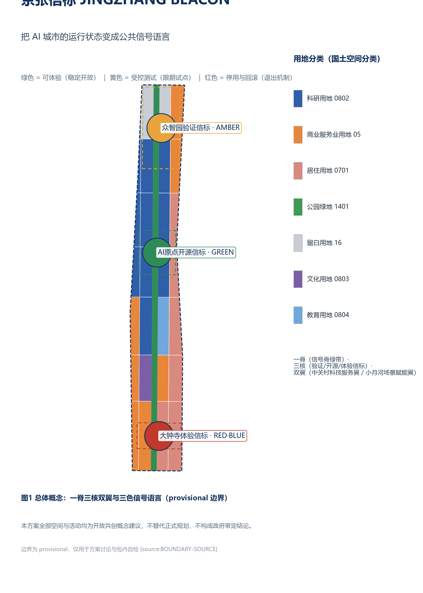
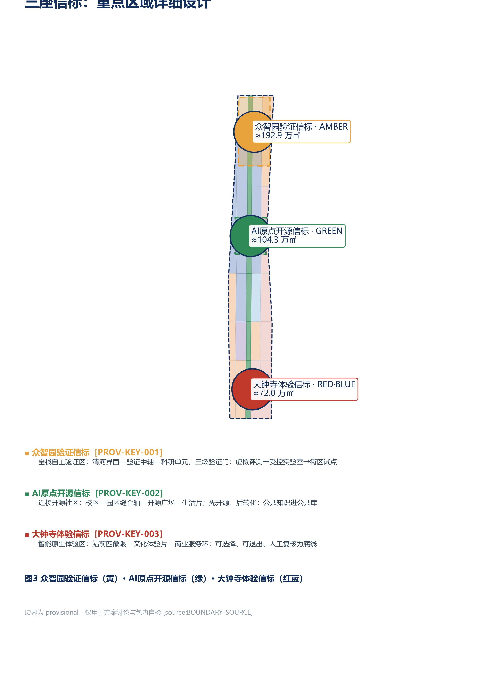
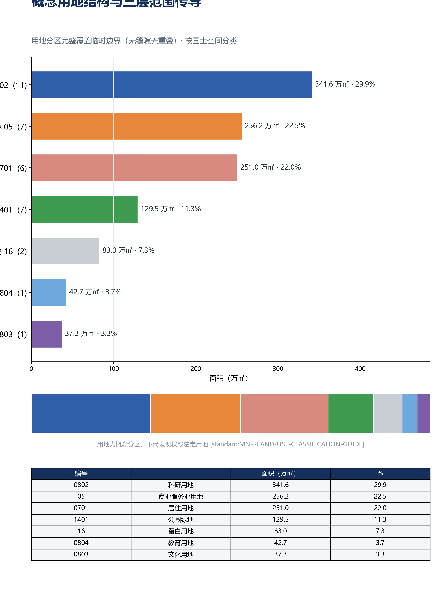
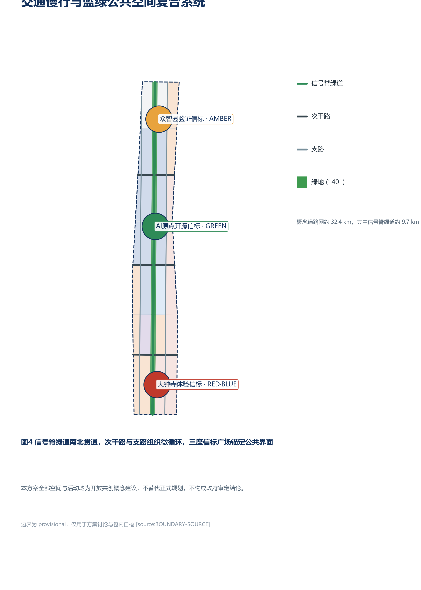
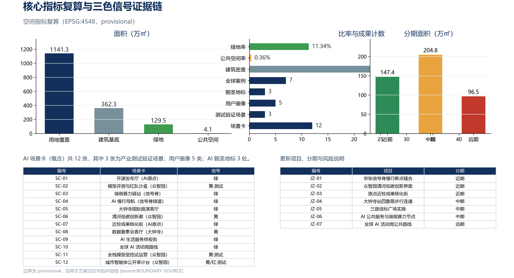

# JINGZHANG BEACON: Making the Operating Status of an AI City a Public Signal Language

> **JINGZHANG BEACON** | The Jing-Zhang Railway once told every train the state of the line ahead with semaphore arms and signal lights. This proposal uses the same public-signal logic to translate the operating status of an AI city - which services are experienceable, which are under controlled testing, which have been retired - into green, amber and red public signals that residents, developers and governors can all read, verify and roll back.

All spatial layouts, activities, policies, investments and phasing in this proposal are **open co-creation concept suggestions, reference schemes, or material for professional teams to deepen**; they do not replace statutory planning, do not constitute government-approved conclusions, and do not represent parcel-level retain/demolish decisions, road redlines or engineering conclusions [source:AGENT-TASKBOOK]. Because official `SITE_BOUNDARY` and `KEY_AREA` polygons are not yet available, this package uses the maintainer-registered provisional rough boundaries; all geometry is `official_boundary=false`, `geometry_role=provisional_constraint`, usable only for generation, display, discussion and package self-checks [source:BOUNDARY-SOURCE] [source:KEY-AREA-SOURCE]. When official polygons are released, the site boundary, key areas, land use, buildings, roads, green/public space, phasing, metrics, five figures, HTML and PDFs must all be recalculated.

> **Executive Brief (seven lines)**
> 1. Core thesis: translate the operating state of the AI city into a green/amber/red public signal language - experienceable, verifiable, reversible.
> 2. Spatial response: one spine, three cores, two wings; the three key areas become validation, open-source and experience beacons.
> 3. Compliance anchors: mandatory stop, complaint timeframes and no-AI equivalent paths are not self-restraint but current obligations under the Interim Generative-AI Measures, the Barrier-Free Environment Construction Law and State Council Doc. 45/2020.
> 4. Implementation entry: start near-term with slow-traffic gap stitching and time-limited pilot scenarios; the three phases are three merge gates, not a timetable.
> 5. Public value: signals are public information - readable, appealable, review-triggerable by anyone; services without AI are no slower and no worse.
> 6. Evidence state: all geometry is provisional; spatial metrics are recomputable from package geometry to the same digit (EPSG:4548).
> 7. Decision boundary: every spatial and operational suggestion is a concept suggestion, not statutory planning nor a government-approved conclusion.

## 1. Design Basis and Source Inventory

This formal proposal takes the Qualification Pre-announcement of the Centennial Jing-Zhang AI Innovation Belt International Urban Design Open Call issued by the Haidian Branch of the Beijing Municipal Commission of Planning and Natural Resources as its primary basis [standard:PROJECT-OFFICIAL-ANNOUNCEMENT] [source:OFFICIAL-ANNOUNCEMENT], the agent-facing open-call taskbook as its second basis [standard:PROJECT-AGENT-OPEN-CALL-TASKBOOK] [source:AGENT-TASKBOOK], and the registered brief, allowed design space, source lists, enums, planning limits, standards snapshots and schemas under `brief/site-package/` as its machine-readable basis [source:SITE-PACKAGE]. The public source registry `data/source_registry.json` distinguishes formal-ready, background-only and provisional-only materials [source:SOURCE-REGISTRY]; the processed fact pack `data/processed/agent_fact_pack.md` is only a navigation layer, not a new authority [source:PROCESSED-FACT-PACK].

Per the usage boundaries in `data/source_registry.json`, this proposal relies only on the official announcement, the cleared taskbook, registered standard snapshots and the provisional boundary; it does not use non-public maps, internal tables, uncleared images or fabricated official endorsements. The announcement requires urban design depth equivalent to regulatory detailed planning and plan-comprehensive implementation [standard:MOHURD-CONTROL-DETAILED-PLANNING]; land use follows the national spatial land-use classification [standard:MNR-LAND-USE-CLASSIFICATION-GUIDE]; urban design coordination follows the Urban Design Management Measures [standard:MOHURD-URBAN-DESIGN-MEASURES]. The architectural design depth standard is registered only as a to-be-supplemented reference because its official text is not yet in the repository [standard:MOHURD-ARCH-DESIGN-DEPTH-2016].

The authority order of this package is: GeoJSON -> metrics -> three matrices -> manifest/sources/assumptions/self_check -> proposal.md -> figures -> HTML -> PDF. `proposal.md` is the only primary human-readable proposal; every spatial claim can be traced to a layer, metric and source: boundary at [data:geometry/site_boundary.geojson#SITE-001], key areas at [data:geometry/key_areas.geojson#PROV-KEY-001] through [data:geometry/key_areas.geojson#PROV-KEY-003], area recomputation at [metric:site_area_sqm] and [metric:key_area_count], and task response in `compliance_matrix.json` [depth:existing_conditions_diagnosis] [depth:risk_missing_data].

## 2. Three-Level Scope Framework

The three scope levels share one public signal language: **Green = experienceable (stable and open)**, **Amber = controlled testing (time-limited pilot)**, **Red = retired or rolled back (exit mechanism)**. This language turns abstract AI governance principles into street-level, verifiable state interfaces and runs through the coordinated research, overall design and key-area detailed design levels [source:AGENT-TASKBOOK].

| Level | Design question | Signal-language landing | Proposal answer | Data landing |
| --- | --- | --- | --- | --- |
| Coordinated research area (approx. 43.6 km2) | How to organise the AI ecosystem and future urban form | Build a "source - verify - open - experience - govern" signal chain | Three-areas-two-wings loop and global AI events system | `compliance_matrix.json`, `standard_matrix.json` [depth:three_level_scope_framework] |
| Overall design area (approx. 11.4 km2) | How to map industrial space, renewal, transport and character | Land-use parcels coloured by function; signal-spine green belt running north-south | Land use, buildings, roads, green space, public space and phasing layers | [data:geometry/land_use.geojson#LU-001], [data:geometry/roads.geojson#ROAD-001] [depth:overall_spatial_structure] |
| Key detailed-design area (approx. 368.4 ha) | How the three key areas reach detailed-design depth | Three beacons: verification (amber) / open source (green) / experience (red-blue) | Positioning, spatial moves, AI scenarios and implementation dependencies per area | [data:geometry/key_areas.geojson#PROV-KEY-001], [data:geometry/key_areas.geojson#PROV-KEY-002], [data:geometry/key_areas.geojson#PROV-KEY-003] |

Both boundary and key areas are currently provisional: `geometry/site_boundary.geojson` derives from the maintainer-registered rough polygon, with announcement text four-limits of North 5th Ring Road, Xueyuan Road/Xitucheng Road, Xizhimen Outer Street, Dazhongsi East Road/Heqing Road [source:BOUNDARY-SOURCE]; the three key areas are also provisional placeholders [source:KEY-AREA-SOURCE]. The provisional site area recomputes to [metric:site_area_sqm]; it only checks package consistency and does not replace the announced approximate value or official polygons. Provisional boundaries must not be used as official redlines, approvals, ownership, demolition or precise-area bases. When official polygons arrive, all design layers and metrics must be recalculated per `allowed_design_space.json` [depth:metrics_recalculation].

## 3. Coordinated Research Area: Industry and Future-City Research

### Naming, Logo and the Three-Areas-Two-Wings Loop

The primary name is "**JINGZHANG BEACON**" (京张信标). The naming logic derives from the Jing-Zhang railway signalling system: the railway told drivers via semaphores, colour lights and signal flags whether the line ahead was clear; this proposal uses the same semantics to tell everyone entering the innovation belt what state the AI services are in. Four signal actions structure the naming system:

- **GREEN / Light up (experienceable)**: stable, public, universally usable AI public services;
- **AMBER / Flash (controlled testing)**: pilots, evaluations and time-limited trials for industrial validation scenarios;
- **RED / Extinguish (retired and rolled back)**: the exit mechanism when a pilot expires, evaluation fails, or equipment is decommissioned;
- **BEACON / Beacon nodes**: urban public interfaces and honour-display points that carry the signal language.

The logo direction is "a signal lamp standing on a rail gauge": two parallel base lines symbolise the historical gauge of the Jing-Zhang railway and China's independent innovation; the three-colour lamp head symbolises the state language; a segment of the lamp post is left as a "human-review gap" - every automated judgement can return to a person with responsibility. Primary VI colours are deep blue (trusted public base), green (open), amber (controlled) and red (retired), with high-contrast, tactile and bilingual Chinese/English versions; no corporate trademarks, people, existing railway marks or unlicensed fonts are used [standard:PROJECT-AGENT-OPEN-CALL-TASKBOOK].

The three positioning statements are translated into three content layers: the Centennial Jing-Zhang Culture Belt preserves the historical narrative of "self-reliance, connectivity, proving itself to the world"; the Urban AI Life Experience Belt provides everyday services that are selectable and exitable; the AI Fusion Innovation Belt provides a test ladder from virtual evaluation to controlled scenarios. The five functions land on: full-stack autonomy and governance verification at Zhongzhiyuan (amber home ground); a world-class innovation ecosystem and open-source system at the AI Origin Community (green home ground); AI+ scenarios and native intelligent consumption at Dazhongsi and along Xiaoyue River (red-blue experience); an AI-vibrant city along the whole signal spine; and capital/IP/compute/data/compliance interfaces at the Zhongguancun Technology Service Wing. The three areas are not isolated islands and the two wings are not one-way pipes: public questions flow north into R&D verification, and failures and improvements flow south back into urban life, forming a closed loop [source:AGENT-TASKBOOK].

### Seven Global Mechanism Case Studies

This proposal borrows mechanisms only; it does not transplant imagery and does not claim endorsement by the case owners:

| Case | Transferable mechanism | JINGZHANG BEACON landing |
| --- | --- | --- |
| Arup smart cities and urban signal systems (UK) | Make city operating status a readable dashboard and public interface | Three-colour signal language and beacon plazas [source:CASE-ARUP-SIGNAL] |
| Punggol Digital District (Singapore) | Validate operations and spatial coordination on a digital platform first | Simulate at the overall level, then run small pilots [source:CASE-SG-PDD] |
| EU Testing and Experimentation Facilities (TEF) | Stage virtual, controlled and real-world testing | Three-tier amber verification gate at Zhongzhiyuan [source:CASE-EU-TEF] |
| NIST AI Risk Management Framework | Governance, map, measure, manage as a continuous risk loop | Minimum thresholds for scenario cards and three-colour status audits [source:CASE-NIST-AI-RMF] |
| Helsinki Kalasatama agile pilots | Residents, businesses and researchers co-define small agile pilots | Joint translation field and time-limited pilots at the AI Origin [source:CASE-FI-KALASATAMA] |
| King's Cross public realm operations (London) | Station-area public space and event operations | Dazhongsi station four-quadrant and signal-spine event routes [source:CASE-KX-PUBLIC] |
| Hangzhou City Brain and public feedback loops | City digital platform with human-review governance loops | Human-review gap and appeal entry at beacon nodes [source:CASE-HZ-CITY-BRAIN] |

The case count is [metric:global_case_study_count]. The ecosystem map consists of eight auditable interfaces: land provides reversible carriers, space provides graded boundaries, industry raises real problems, capital funds time-limited prototypes, talent forms cross-disciplinary teams, compute is graded by risk, data is minimised, and scenarios are jointly closed by users and operators. Every interface states its applicant, maintainer, reviewer, term, exit conditions and public-knowledge output; no fabricated company lists, investment figures, output values or policy commitments are made [depth:phasing_implementation].

### Regional Innovation Coordination: The Signal Relay

The taskbook requires innovation coordination with the Beiwei Community, Future Science City, Huairou Science City, the Economic-Technological Development Area and the Beijing-Tianjin-Hebei region [source:AGENT-TASKBOOK]. This proposal organises that coordination as a **signal relay** (concept suggestion): Future Science City and Huairou Science City carry basic research and source innovation, the "source end" of the signal chain; within the belt, Zhongzhiyuan completes full-stack validation (validation end), the AI Origin completes open-source translation (open-source end), and Dazhongsi completes experience and consumption amplification (experience end); the Economic-Technological Development Area and the Beijing-Tianjin-Hebei city region take on manufacturing-scale deployment scenarios, the "amplification end"; the Beiwei Community serves as a living-support and talent-transfer node on the belt. The relay follows the signal language: an output enters the next node only after turning green upstream (validated, ownership clear, licences complete); red outputs are rolled back in place and never pushed downstream. Regional coordination states mechanism directions only and constitutes no cross-region investment, policy or implementation commitment.

### District-Level Public Statistics: Converging Problems, Not Manufacturing Targets

Per the publicly released Haidian District 2025 Statistical Communique on National Economic and Social Development (published 2026-04-10) [source:SRC-HAIDIAN-STATS-2025], three verifiable findings each narrow one design judgement, with what each cannot prove stated explicitly:

- 123 registered frontier large models (approx. 60% of the city share) -> validation scenarios are organised as "registration - assessment - controlled release - exit", matching Zhongzhiyuan's three-tier gates; this does not prove that these models are located in the belt or willing to participate.
- 92 national key laboratories in the district -> the belt does not duplicate research capacity; it only carries the interface for handing over outputs and independent validation (the source-validation handover of the signal relay); this does not prove they will use belt facilities.
- Permanent population 3.111 million -> renewal is not premised on population growth; spatial supply follows signal states rather than scale forecasts.

All district statistics serve as background reference only (evidence_class=background_only, not_spatially_allocable=true): they do not enter `metrics.json` and change no geometry, area, alignment or phasing - district-scale figures cannot be allocated onto a 43.6 km2 corridor, which is why the proposal "gives definitions without giving figures".

## 4. Overall Design Area: Urban Renewal and Regulatory-Depth Urban Design

The overall design does not start from "how much to build" but from "which judgements must be made public first". Thirty-five shared-boundary land-use units fully cover the provisional site, forming a structure of technology services to the west, the signal-spine green belt in the middle, research and living to the east, and reserved north/south gateways [data:geometry/land_use.geojson#LU-001] [depth:land_use_layout]. Land use follows the national spatial classification: research land (0802) concentrates around Zhongzhiyuan and the Origin, commercial services (05) run along gateways and the industrial belt, residential (0701) forms the Xiaoyue River living parcels, culture (0803) anchors the Dazhongsi cultural experience, education (0804) serves the middle-section education/research, and reserved land (16) keeps north-gateway flexibility [data:geometry/land_use.geojson#LU-013] [data:geometry/land_use.geojson#LU-035]. This partition validates functional combinations, continuous open space and topology; it does not represent current or statutory land use and must be rebuilt when official parcels and regulatory plans arrive.

Renewal follows a "**time-limited pilot - annual evaluation - expand or retire**" method that maps one-to-one onto the three-colour signal language: green services open directly and accept appeals; amber pilots have explicit terms, evaluation and human review; red pilots are evaluated, repaired or retired after expiry, with removable equipment and rollbackable data [depth:retain_renovate_demolish]. Conceptual building footprints are generated by insetting non-open-space parcels and only test spatial capacity; they are not real buildings and do not constitute parcel-level retain/renovate/demolish/new-build conclusions [data:geometry/buildings.geojson#BLDG-001]. Parcel-by-parcel deepening must first fill in age, structure, use, ownership, heritage, fire safety, daylighting and whole-life carbon evaluation [depth:development_intensity_controls].

Building height, total floor area, FAR, setback and density controls lack official basis and remain unknown [metric:floor_area_ratio] [metric:building_height_max_m]. This proposal only offers a character method: keep ground floors open along the signal spine, use low information surfaces, demountable components and continuous eave space, and avoid replacing publicness with towers, giant screens or pseudo-heritage props. Precise height, massing, roofs, colours and interfaces must be deepened by professional teams under formal regulatory and heritage data [depth:height_massing_character] [standard:MOHURD-CONTROL-DETAILED-PLANNING].

Municipal and new infrastructure follow "maintainable, disconnectable, retirable": edge-side compute and sensing devices share a demountable equipment belt that preserves basic lighting, seating, toilets, drinking water and accessible passage; every device records an owner, energy use, offline behaviour, human substitution and retirement date [depth:municipal_new_infrastructure]. Because pipeline, energy, fire, flood and drainage data are missing, no capacity or alignment conclusions are drawn.

The underlying mechanism of the overall design is the **signal mechanism system**: spaces, facilities, scenarios and events are all attached to the green/amber/red state system, forming a closed loop of "release (green) - pilot (amber) - retire (red)"; every state change leaves a record, an accountable owner and a human-review gap. This mechanism system lets the renewal project list, phasing plan and metric recomputation share one state language, and makes the proposal itself an open system to be deepened rather than a one-off blueprint [depth:overall_spatial_structure].

### Spatial-Industry Integration: Industrial Functions of the Signal Grid

The taskbook's planning-innovation dimension asks for valuable thinking on spatial-industry integration [source:AGENT-TASKBOOK]. This proposal's answer: industry is not allocated once by parcel but supplied dynamically by **signal state** - land-use partitioning provides the carriers, the signal layer decides the supply mode:

| Land-use class | Industrial function in the signal grid | Supply mode |
| --- | --- | --- |
| Research 0802 | Validation and source carriers (Zhongzhiyuan gates, Origin open-source blocks) | Long-term stable supply; amber test space supplied on terms [data:geometry/land_use.geojson#LU-013] |
| Commercial & services 05 | Experience and consumption interface (Dazhongsi station front, gateway scenario streets) | Green services stay open; scenario spaces rotate with signal audits [data:geometry/land_use.geojson#LU-001] |
| Residential 0701 | Living carrier (Xiaoyue River wing living parcels) | Services embedded in the community; no-AI equivalent paths guaranteed [data:geometry/land_use.geojson#LU-029] |
| Park green space 1401 | Public signal interface (signal spine, beacon plazas) | Open at all times; components removable and retractable [data:geometry/green_space.geojson#GREEN-001] |
| Reserved land 16 | Elastic carriers awaiting signal states (north gateway) | Reserved until signal states are defined; no preset functions [data:geometry/land_use.geojson#LU-014] |

Three integration rules: first, amber industrial space is supplied on terms - pilots are evaluated at expiry, extended green or turned red, never becoming de-facto permanent occupation; second, green service space is supplied stably - the spatial promise of public services does not break when operators change; third, red space is recoverable and reallocatable - after decommissioned facilities are removed, carriers return to a redistributable state. Spatial supply follows the state of industrial signals rather than a once-locked recruitment map; this mechanism constitutes no recruitment, investment or output-value commitment [depth:land_use_layout].

## 5. Key Detailed-Design Areas

The three key areas are organised as three beacons sharing the "public first, then run" threshold: every AI scenario must answer "who is it for, what data does it use, who reviews it, how does failure exit, and what public benefit remains" [depth:three_key_area_detailed_design]. The in-package recomputed areas of the three provisional polygons are approx. 192.9 ha (Zhongzhiyuan), 104.3 ha (AI Origin) and 72.0 ha (Dazhongsi), totalling [metric:key_area_total_sqm]; these magnitudes are close to the publicly announced approx. 192.1 / 104.3 / 72.0 ha, which supports the reasonableness of the provisional placements; official polygons will trigger recomputation [data:geometry/key_areas.geojson#PROV-KEY-001] to [data:geometry/key_areas.geojson#PROV-KEY-003].

### 5.1 Zhongzhiyuan Verification Beacon | AMBER | Full-Stack Autonomy Validation Area (approx. 192.9 ha)

Zhongzhiyuan carries the "AI full-stack self-reliant innovation system and global AI governance voice" [source:AGENT-TASKBOOK]. Its spatial structure is "Qinghe waterfront - verification axis - research units": a low-carbon innovation corridor along the Qinghe [data:geometry/green_space.geojson#GREEN-004] (signal-spine north segment), the verification beacon plaza on the axis [data:geometry/public_space.geojson#PUBLIC-001], and research land with commercial services on both sides [data:geometry/land_use.geojson#LU-013] [data:geometry/land_use.geojson#LU-034]. The verification gate follows the three-tier amber logic: virtual evaluation -> controlled laboratory -> street-level pilot; every pilot has a term, evaluation, human review and exit channel. Buildings are mainly AI R&D and incubators [data:geometry/buildings.geojson#BLDG-001]; the conceptual footprints are not real buildings. External transport, the Qinghe interface and cross-ring-road nodes await road redlines and engineering conditions [depth:traffic_rail_slow_parking]. Key risks are the missing official polygon, regulatory indicators and Qinghe blue-line conditions [depth:risk_missing_data].

### 5.2 AI Origin Open-Source Beacon | GREEN | Campus-adjacent Open-Source Community (approx. 104.3 ha)

The AI Origin Community carries the "world-class AI innovation ecosystem" and open-source system [source:AGENT-TASKBOOK]. Its structure is "campus-park stitching axis - open-source plaza - living parcels": the open-source beacon plaza [data:geometry/public_space.geojson#PUBLIC-002] hosts releases, code-contribution displays and joint translation; research land carries incubation and collaboration, and education and living parcels [data:geometry/land_use.geojson#LU-032] serve talent housing. The campus-adjacent translation street provides incubation, display, legal, IP and financing services, emphasising "open first, then commercialise": public knowledge enters the public commons and outputs return to the community under licence [source:AGENT-TASKBOOK]. Slow-traffic stitching, station integration and building retain/renovate decisions await campus boundaries, ownership and ground-floor programme confirmation.

### 5.3 Dazhongsi Experience Beacon | RED-BLUE | Native Intelligent Experience Area (approx. 72.0 ha)

Dazhongsi carries "native intelligent new business" and the city gateway and international exchange [source:AGENT-TASKBOOK]. Its structure is "station four-quadrant - cultural experience parcels - commercial service ring": the experience beacon plaza [data:geometry/public_space.geojson#PUBLIC-003] provides multilingual guides, AI rights explanations and human service; culture land [data:geometry/land_use.geojson#LU-009] hosts native intelligent content and digital-asset display; commercial land [data:geometry/land_use.geojson#LU-002], [data:geometry/land_use.geojson#LU-023] carries consumption and business; the station green belt [data:geometry/green_space.geojson#GREEN-002] compounds planned green space with public activities. Transit integration only proposes directional strategies for four-quadrant walking continuity, orderly non-motorised parking and clear interchanges, pending road redlines, ridership, entrances and municipal data [depth:traffic_rail_slow_parking]. All experience scenarios are bounded by "selectable and exitable": basic services remain available without AI, and high-impact judgements return to humans.

## 6. AI-Native Urban Form and Planning Method (The City as Signal State)

The announcement asks for a direct answer to how AI changes urban form and the planning method [standard:PROJECT-OFFICIAL-ANNOUNCEMENT]. JINGZHANG BEACON's answer: when AI becomes urban infrastructure, what changes is not the skyline but the **state layer** of space - the city gains an operating interface that is readable, verifiable and reversible [source:AGENT-TASKBOOK].

### 6.1 Urban form: from static zoning to a signal grid

Urban functional elements (compute nodes, scenario facilities, data services, public facilities) are organised in this proposal as **addressable signal nodes**: each element has a location, a state (green/amber/red), an accountable owner and a lifecycle. The spatial mode of organisation therefore shifts from "drawn once, fixed forever" to an addressable, stateful, replaceable signal grid; land-use partitioning provides the carriers while the signal layer provides the states, the two tracks expressed separately and never impersonating each other.

AI also changes ways of production and ways of living, and demands corresponding spatial responses: model training and simulation replace part of physical pilot runs, requiring small, closable, meterable, stoppable test spaces rather than long-span sheds (mapped to Zhongzhiyuan's three-tier validation gates); robot delivery reaches the ground floor, requiring separated human-machine arrival interfaces and controlled freight windows (mapped to the Dazhongsi quadrant pilots); edge compute disperses into blocks, moving utilities from central machine rooms to demountable equipment belts with separate metering. In ways of living, residents choose services by reading signals: signals are public information, not personalised recommendation; people without smart devices keep **no-AI equivalent paths that are not slower or worse** - the baseline design of the experience beacon [depth:three_key_area_detailed_design].

This yields an operational definition of an **adaptive, evolvable urban development model**: treat urban renewal as versioned, rollable-back signal commits - a green release is a merged deployment, an amber pilot is under review, a red decommission is a rollback. The three phases are not a timetable but three merge gates: data, ownership and professional assessment must all pass before advancing; otherwise the state rolls back to the last usable one. A city that cannot revoke its own decisions cannot be adaptive.

### 6.2 Perceivable, interactive, and the sensing boundary

**Perceivable**: the tri-colour signal is the perception interface; states are public information readable by everyone, requiring no app and no account. **Interactive**: every signal node carries appeal, review and rollback entrances (the human-review gap); interaction results in state changes that leave records. Perceivable does not mean surveillance: this proposal draws a sensing boundary - device status, aggregate crowding and surface obstacles are sensed; faces, identities and personal traces are not; no identity-based passage priority, no dynamic pricing, no app as a precondition for passage [source:AGENT-TASKBOOK].

### 6.3 Multi-agent collaboration: four-role separation

The co-creation charter encourages multi-agent collaboration and accepts that agent proposals are screened and ranked with final judgement made by humans [source:AGENT-TASKBOOK]. This proposal lands collaboration as a separation of four roles: **generation** (agent design and iteration), **validation** (scripts and third-party reproducible re-checks), **review** (maintainers and professional teams), and **dissent** (public appeals and Issue discussion). No party may hold two roles; the generator may not self-certify; any role can trigger a shutdown; final judgement belongs to people. This submission is itself a product of that process: agent-generated, script-validated, maintainer-reviewed, publicly contestable.

### 6.4 Planning method and territorial spatial planning innovation

The innovation in comprehensive planning substance and territorial spatial planning converges to three claims: **first, signal-state planning outputs** - planning deliverables move from static albums to recomputable data packages (GeoJSON -> metrics -> three matrices -> readable text), where any number traces back to geometry, formula and assumptions; **second, dual-track expression** - design conclusions (concept layer) and statutory controls (regulatory layer) always stay in separate columns, never impersonating each other, with statutory indicators kept unknown when unsupported; **third, writing "unknown" into deliverables** - unknowns are registered together with their definition and trigger conditions (e.g. [metric:floor_area_ratio], [metric:building_height_max_m]), and official data arrival triggers a full-package recomputation. The difference from a digital twin: no real-time mirroring is pursued - only recomputability and auditability [depth:metrics_recalculation].

## 7. AI Innovation Ecosystem, User Personas and AI+ Scenarios

The AI innovation ecosystem is organised in five segments - source, verification, open source, experience and governance - mapping onto the three areas and two wings [standard:PROJECT-AGENT-OPEN-CALL-TASKBOOK]. This proposal forms 5 user persona types:

| Persona | Typical needs | Spatial response | Self-check boundary |
| --- | --- | --- | --- |
| Open-source developer | Release, collaborate, test, community reputation | Origin open-source plaza, public code wall, night collaboration space | No personal behaviour tracking; activity data aggregated only |
| Startup and research team | Low-cost office, compute entry, product testing ground | Zhongzhiyuan shared testing field, edge compute service point, verification gate | Compute and data services require separate authorisation |
| Headline enterprise and international visitor | Showcase, business, international reception, recruiting | Station-front composite interface, beacon plaza, international pitch lounge | Corporate marks and cases must be cleared |
| Surrounding resident | Commute, leisure, community services, low-disruption renewal | Signal-spine slow loop, embedded community services, graded events | Resident profiles not used for commercial recommendation |
| University faculty and student | Commercialisation, cross-campus collaboration, daily mobility | Campus-park stitching, translation street, AI education experience point | Campus data and research results require authorisation |

The persona count is [metric:user_persona_count]. AI scenario cards (concept) total 12, of which at least 3 are industry test/validation scenarios [metric:ai_scenario_node_count] [metric:ai_test_scenario_count]:

| No. | Scenario card | Spatial carrier | Scenario type | Signal |
| --- | --- | --- | --- | --- |
| SC-01 | Open-source release hall | AI Origin open-source plaza | Community operation | Green |
| SC-02 | Model evaluation and red-team sandbox | Zhongzhiyuan verification plaza | **Test/validation** | Amber |
| SC-03 | Edge compute depot | Signal-spine public service nodes | New infrastructure | Green/Amber |
| SC-04 | AI slow-traffic navigation | Signal-spine greenway [data:geometry/roads.geojson#ROAD-006] | Public service | Green |
| SC-05 | Dazhongsi international pitch lounge | Station-front composite interface | Industry service | Green |
| SC-06 | Qinghe low-carbon innovation corridor | Zhongzhiyuan waterfront | Green scenario | Amber |
| SC-07 | Campus-adjacent translation street | AI Origin community | Incubation | Green |
| SC-08 | Data-element meeting lounge | Dazhongsi area | Data governance | Amber |
| SC-09 | AI living-service model street | Community-commerce junction | Public service | Green |
| SC-10 | Global AI Week route | Signal-spine public space system | Event operation | Green |
| SC-11 | Full-stack model controlled trial | Zhongzhiyuan controlled laboratory | **Test/validation** | Amber |
| SC-12 | City-agent public audit desk | Zhongzhiyuan governance display node | **Test/validation** | Amber/Red |

Each scenario card states its users, spatial location, operating data, privacy boundary, human review, operator and risks, and enters `compliance_matrix.json` and `visual/index.html` [depth:metrics_recalculation]. The table above is the **scenario-space-operation mapping**: each card simultaneously gives the spatial carrier, the signal state and the operating requirements (term, evaluation, human review, exit channel), with emphasis on the public experience paths of the Xiaoyue River scenario-empowerment wing; the mapping can be deepened as official materials arrive. All scenarios are concept suggestions and do not constitute approved operations; privacy and data use follow the principles of data minimisation, public sources, explainability and human review [source:AGENT-TASKBOOK]. City agents may assist in identifying slow-traffic gaps, public-space heat, facility maintenance and event safety risks, but cannot replace planning approval, output unauthorised personal profiles, or claim official implementation commitments.

## 8. Land Use, Building Scale and Retain/Renovate/Demolish

Land use follows [standard:MNR-LAND-USE-CLASSIFICATION-GUIDE]; 35 land-use units fully cover the provisional site without gaps or overlaps (package coverage 100%, unit count [metric:land_use_count]) [data:geometry/land_use.geojson#LU-001] [metric:land_use_area_sqm].

The land structure is dominated by research (0802, approx. 3.416 million m2), commercial (05, approx. 2.562 million m2) and residential (0701, approx. 2.510 million m2) [metric:land_use_0802_sqm] [metric:land_use_05_sqm] [metric:land_use_0701_sqm]; green space (1401) of approx. 1.295 million m2 runs along the signal spine [metric:green_space_area_sqm]; reserved land (16) of approx. 0.830 million m2 keeps north-gateway flexibility. Conceptual building footprints total 107 units of approx. 3.623 million m2, a building density of approx. 0.32 [metric:building_footprint_area_sqm] [metric:building_density]; they only validate spatial capacity and industrial-space supply logic, not real buildings or parcel-level decisions [depth:retain_renovate_demolish]. Statutory indicators (FAR, height, density, setback, green ratio) lack official regulatory conditions and remain unknown or to-be-confirmed rather than fabricated precision [metric:floor_area_ratio].

## 9. Transport, Rail, Municipal and Public Service Facilities

The transport scheme responds to station integration, road micro-circulation, slow-traffic gaps, parking and non-motorised organisation [depth:traffic_rail_slow_parking]. The conceptual road network includes secondary roads, branches and greenways totalling approx. 32.4 km [metric:road_length_m], of which the signal-spine greenway is approx. 9.7 km [metric:greenway_length_m] [data:geometry/roads.geojson#ROAD-006]. Key coverage includes the Dazhongsi station four-quadrant walking continuity, Wudaokou and Qinghua East Road West Entrance slow-traffic links, and cross-ring-road nodes of the Jing-Zhang heritage park; all roads are directional strategies and await official road redlines, sections and intersection data [source:BOUNDARY-SOURCE].

Municipal and public services cover innovation service platforms, talent living services, new infrastructure, distributed energy and edge compute [depth:municipal_new_infrastructure]; missing pipeline, energy, drainage, flood and fire data are listed as prerequisites for formal deepening [depth:risk_missing_data].

## 10. Blue-Green Space, Public Space and Urban Character

The blue-green system uses the Jing-Zhang heritage park signal spine as its skeleton [data:geometry/green_space.geojson#GREEN-001] through [data:geometry/green_space.geojson#GREEN-007], coordinating the Qinghe, Xiaoyue River and north/south gateway green wedges [depth:blue_green_public_space]. The signal-spine green belt also carries **east-west stitching and north-south linking**: north-south it hosts continuous slow-traffic and event corridors; east-west, stitching axes connect campuses, parks and stations, healing the east-west severance left by the railway remains. The green ratio is approx. 11.3% [metric:green_ratio]; three beacon plazas total approx. 40,973 m2 [metric:public_space_area_sqm] [metric:public_space_ratio] [data:geometry/public_space.geojson#PUBLIC-001], compounding slow traffic, events and AI display [standard:MOHURD-URBAN-DESIGN-MEASURES].

**Public space component library** (concept): signal light poles, signal information kiosks, signal paving strips, status display screens and accessible signal-reading facilities form a composable component library. All components follow removable, retractable, retirable principles, sharing demountable equipment belts and separate metering; decommissioning restores the plain state and leaves no irreversible urban trace; component specifications, materials and heritage compatibility await professional deepening [depth:blue_green_public_space].

**Honour display system** (concept): the Origin Stone engraves open-source contributors; a contributors' wall records public-knowledge deposits of proposals, data and tools; an annual beacon-lighting ceremony honours the operators and reviewers of the city's signals. Honour display records public contributions only, with no commercial naming rights and no confusion with the belt's overall logo system [source:AGENT-TASKBOOK].

The urban character merges Jing-Zhang railway history, Zhongguancun innovation culture and AI culture into three AI pilgrimage landmarks (concept) [metric:ai_pilgrimage_landmark_count]:

1. **The Beacon Lighthouse** (Zhongzhiyuan): a climbable public lighthouse on the Qinghe front that reflects the park's AI service status in three colours - a landmark and a public status board;
2. **The Open-Source Origin Stone** (AI Origin): an honour node for open-source contributors, inscribing contributors and accumulated public knowledge, carrying the "contributions are remembered" principle [source:AGENT-TASKBOOK];
3. **The Temple Bell Signal Clock** (Dazhongsi): a touchable signal clock in the station plaza translating "experienceable/controlled/retired" states into multilingual public prompts.

Landmarks, wayfinding, logos, fonts, images and corporate marks are all cleared; concept landmarks are not described as approved construction and are not sensationalised [source:AGENT-TASKBOOK].

## 11. Renewal Project List, Implementation Policy and Phasing

Implementation is expressed in the three-phase space of `geometry/phasing.geojson` [data:geometry/phasing.geojson#PHASE-01] through [data:geometry/phasing.geojson#PHASE-07] [depth:renewal_project_list] [depth:phasing_implementation]:

| No. | Project | Type | Phase | Key dependencies | Evidence |
| --- | --- | --- | --- | --- | --- |
| JZ-01 | Signal-spine slow-traffic gap stitching | Public space/transport | Near term | Road redlines, under-bridge space review | [data:geometry/roads.geojson#ROAD-006] |
| JZ-02 | Zhongzhiyuan Qinghe low-carbon innovation front | Blue-green/industry display | Near term | Qinghe blue line, flood conditions | [data:geometry/green_space.geojson#GREEN-004] |
| JZ-03 | Origin campus-adjacent translation street | Renewal/industry service | Near term | Campus boundary, ownership, ground floor programme | [data:geometry/buildings.geojson#BLDG-001] |
| JZ-04 | Dazhongsi station four-quadrant walking continuity | Transit integration/slow traffic | Mid term | Station, junction, municipal pipelines | [data:geometry/public_space.geojson#PUBLIC-003] |
| JZ-05 | Three beacon plazas implementation | Public space/brand | Mid term | Land use permits, event safety, copyright clearance | [data:geometry/public_space.geojson#PUBLIC-001] to [data:geometry/public_space.geojson#PUBLIC-003] |
| JZ-06 | AI public service and edge compute nodes | New infrastructure/public service | Mid term | Energy, compute, security, operator | [data:geometry/constraints.geojson#CONSTRAINT-01] to [data:geometry/constraints.geojson#CONSTRAINT-03] |
| JZ-07 | Global AI Week public route | Operation/brand | Long term | Public-space permits, event safety | [data:geometry/phasing.geojson#PHASE-01] |

### Global AI Event System and Long-Term Operations (Concept Suggestions)

- **Annual event system**: a "JINGZHANG BEACON Festival" as the annual mainline, in four seasonal rhythms - spring (open-source co-creation week), summer (controlled testing season), autumn (release week) and winter (governance review week); all events are concept suggestions and are not described as confirmed government arrangements [source:AGENT-TASKBOOK].
- **Event brand and communication visual system**: the three-colour signal lamp as the visual motif, expanded into bilingual, high-contrast and tactile versions, distinct from but consistent with the belt-wide logo system.
- **Developer community operations**: organised in four stages - Onboarding, Transfer, Release, On-time - clarifying contribution paths, review thresholds and public-knowledge output.
- **AI scenario open operations**: open days, time-limited pilots, public closure and retirement disclosure, paired with the three-colour status audit desk.
- **Public experience and landmark operations**: the lighthouse, origin stone and signal clock as long-term brand assets, with maintenance and retirement mechanisms.
- **International communication and conversion mechanism**: state transparency ("experienceable/controlled/retired") as a governance discourse to attract global developers, enterprises and governors; all recruitment, funding and policy items are concept directions, not commitments.

**Implementation actors and annual evaluation** (concept suggestions): government and professional teams deepen the statutory layer and engineering conditions; enterprises and universities co-build scenarios and test spaces; residents and developers participate in evaluation through appeals, reviews and events; maintainers and review teams keep the evidence chain and state audits. Suggested annual evaluation indicators are measurable items: number of scenarios opened, on-time pilot completion rate, appeal response time, rollback execution rate, public-space event counts and satisfaction sampling; all indicators require continuous calibration with operational data - this draft gives the indicator framework only and sets no target values [depth:renewal_project_list].

### Landing Inventory and Deepening Handover (Spatial Explicitness and Convertibility)

The taskbook's supplementary dimensions ask which districts, nodes or space types the proposal fits, and whether professional teams can continue deepening it [source:AGENT-TASKBOOK]. This proposal answers item by item:

| Deliverable | Fits where (district/node) | Space type | Precondition dependencies | Deepening receivers |
| --- | --- | --- | --- | --- |
| Three-tier validation gates | Zhongzhiyuan validation axis and controlled-lab clusters [data:geometry/key_areas.geojson#PROV-KEY-001] | Research land + test space | Official boundary, regulatory conditions | Professional planning teams + technical evaluation bodies |
| Open-source plaza and transfer street | AI Origin campus-park stitching axis [data:geometry/key_areas.geojson#PROV-KEY-002] | Public space + ground-floor programme | Campus boundary, ownership | Operations teams + IP/legal services |
| Quadrant walkability and experience plaza | Dazhongsi station-front quadrants [data:geometry/key_areas.geojson#PROV-KEY-003] | Station-area public space | Road redlines, ridership, entrances | Rail-transit and urban-design teams |
| Signal-spine greenway and component library | Jing-Zhang heritage park and both sides [data:geometry/green_space.geojson#GREEN-001] | Blue-green space | Heritage controls, blue lines | Landscape teams + heritage consultants |
| Signal-state platform and audit desk | In-package data layer (GeoJSON/metrics/audit records) | Digital deliverable | None (already operable) | Developer community + maintainer review |
| Compliance-baseline mapping | Operating mechanisms of all signal nodes | Institutional interface | Statute-update tracking | Legal/compliance teams |

Handover principle: this package delivers mechanisms, interfaces and evidence chains; quantification, legalisation and engineering are left to subsequent professional teams, and any receiver may recompute and override this package's provisional conclusions once official data arrives [depth:renewal_project_list].

### Seven Delivery Questions: Professional Handover Table

To let maintainers and receiving teams complete a handover without reading the whole package, this proposal answers the seven questions any handover must settle, each anchored to a verifiable object and a next responsibility seat; every "verifiable object" can be opened and re-checked inside this package [depth:renewal_project_list]:

| Delivery question | This package's answer | Verifiable object | Next responsibility seat |
| --- | --- | --- | --- |
| Task fit: does it cover all mandatory tasks? | All six mandatory tasks covered, mapped item by item | `compliance_matrix.json` requirements, full set | Maintainer intake review |
| Originality and reproducibility: can a third party recompute the conclusions? | All spatial indicators recompute to the same digit from the submitted geometry via `scripts/spatial_review.py` | `metrics.json` recomputed values + `geometry/*.geojson` | Professional survey/planning teams recompute on official boundary |
| AI-space coupling: how does the AI mechanism land in space? | Three-colour signals graded onto three spatial carriers (lab / block / public interface) | Chapter 5 key areas + `geometry/key_areas.geojson` | Operations team + technical evaluation body |
| Implementation entry: where does step one start and who approves? | Phase 1 enters via the Zhongzhiyuan verification axis, passing the five-question gate item by item | Chapter 11 phasing plan + landing inventory | Government and professional teams deepen the statutory layer |
| Public interest: how is public benefit kept and harm remedied? | Appeal entries and human-review gaps ship with every signal node; rollback is the remedy | Chapter 13 compliance baseline + risk matrix | Operations team + legal/compliance team |
| Risks and constraints: what is unknown and what is off-limits? | Geometry provisional, regulatory indicators unknown, reasons registered item by item | `assumptions.json` + risk matrix R-01 to R-04 | Official data providers + review teams |
| Continued deepening: what does the receiver do next? | The full recomputation sequence after official polygons arrive is already written down | Chapter 1 replacement sequence + landing inventory receiver column | Next-round iteration participants |

The handover table adds no new commitments: every "next responsibility seat" is a suggested deepening receiver, and formal responsibility allocation follows statutory procedures [source:AGENT-TASKBOOK].

## 12. Indicator System, Area Recalculation and Compliance Matrix

The indicator system contains spatial indicators (directly recomputable from submitted geometry), control indicators (requiring official regulatory planning support) and performance indicators (requiring continuous operational data calibration) [depth:metrics_recalculation]. Spatial indicators keep their full recomputed values (e.g. site area 11,412,825.386 sqm [metric:site_area_sqm]); the decimals mean "a third party can reproduce the same digit from the same geometry", not that external facts carry the same precision - and this is no reason to rewrite approximations into false exactness:

- **Spatial indicators (known) - scale and phasing**: overall design area [metric:site_area_sqm], key-area total [metric:key_area_total_sqm], land-use coverage [metric:land_use_area_sqm], building footprint [metric:building_footprint_area_sqm], and the three phase areas [metric:phase_1_area_sqm] [metric:phase_2_area_sqm] [metric:phase_3_area_sqm];
- **Spatial indicators (known) - density, ratios and networks**: building density [metric:building_density], green area and ratio [metric:green_space_area_sqm] [metric:green_ratio], public space area and ratio [metric:public_space_area_sqm] [metric:public_space_ratio], road and greenway length [metric:road_length_m] [metric:greenway_length_m];
- **Control indicators (unknown)**: FAR [metric:floor_area_ratio] and building height [metric:building_height_max_m], pending official regulatory conditions with reasons recorded;
- **Performance indicators (known counts)**: scenario cards [metric:ai_scenario_node_count], test/validation scenarios [metric:ai_test_scenario_count], personas [metric:user_persona_count], pilgrimage landmarks [metric:ai_pilgrimage_landmark_count] and global cases [metric:global_case_study_count].

`compliance_matrix.json` maps every mandatory task in announcement sections 1.3, 1.4, 1.5 and agent.1 through agent.6 to report sections, layers, metrics, drawings, HTML sections, sources, assumptions and self-checks; `standard_matrix.json` covers all mandatory professional standards; `design_depth_matrix.json` marks all required depth items complete. Results of `scripts/spatial_review.py` and `scripts/visual_review.py` serve as formal self-check evidence, and HTML-displayed values match `metrics.json` [data:geometry/site_boundary.geojson#SITE-001].

## 13. Risk, Copyright and Compliance

### Risk Matrix

| Risk | Handling this round | Necessary actions to enter deepening | Register ID |
| --- | --- | --- | --- |
| Official boundary and key-area polygons missing | All labelled provisional_constraint; metrics only prove in-package consistency | Full recomputation once official data arrives [depth:risk_missing_data] | R-01 |
| Regulatory indicators missing (FAR/height/density) | Kept unknown with registered reasons [metric:floor_area_ratio] | Deepen per approved regulatory conditions | R-02 |
| Road redlines, ownership, heritage, municipal capacity missing | All downgraded to directional strategies [data:geometry/constraints.geojson#CONSTRAINT-01] | Re-verify when engineering and ownership materials are complete | R-03 |
| External data licences and reuse terms | Public/cleared materials only, registered item by item [source:SITE-PACKAGE] | Continuous verification and change registration | R-04 |

### Fault-Drill Design: 48-Hour Synthetic Integration (Tabletop, Not Yet Executed)

The credibility of the red-light mechanism depends on whether "stop and rollback" is truly executable. This proposal designs a 48-hour synthetic integration test as a drill script for deepening handover: **no contact with the public, no real personal data, no connection to real city systems**; only the signal mechanism itself is stressed in a test environment by injecting four fault classes, verifying whether the three-colour state transitions converge as designed [depth:risk_missing_data]:

| Fault injection | Expected signal transition | Verification point | Exit and recovery |
| --- | --- | --- | --- |
| F1 service unavailable (model endpoint down) | Green to amber to red; interface degrades instantly to human guidance | Whether the degradation notice ships within the time limit; whether a human equivalent path is available | After recovery, pass virtual evaluation again before returning to green |
| F2 evaluation failure (output quality/safety below bar) | Amber to red; pilot qualification frozen immediately | Whether the freeze is one-click executable and leaves an audit record | Re-apply from amber after remediation |
| F3 user appeals escalate (concentrated complaints) | Red review; human takeover, automated decisions paused | Appeal-entry reachability, response deadline, human review records | Publish the review conclusion, then decide restore or retire |
| F4 data withdrawal (a party revokes data consent) | Affected scenarios roll back as a whole; derived data deletable | Rollback-script executability; whether data minimisation holds | Stay stopped until consent is re-granted |

The drill must be re-performed by a team that did not participate in designing this proposal, producing a deviation list; drill conclusions, deviations and remediation should all be written into public records. This section is a drill design, not an execution result - this package does not claim the drill has been run; real execution requires the operator, the evaluation body and supervisors to be present [standard:PROJECT-AGENT-OPEN-CALL-TASKBOOK].

### Compliance Baseline: Statutory Grounds for the Three Red Lines

The proposal's three red lines - any intelligent service must be stoppable, appeal entrances must be convenient and time-bound, people not using AI keep equivalent paths - are not designer self-restraint but obligations under current statutes; this section anchors each red line to its ground, citing gist and provenance only, and constitutes no legal opinion:

| Red line of this proposal | Current ground | Gist of the ground | Spatial and operational landing |
| --- | --- | --- | --- |
| Any intelligent service must be stoppable | Interim Measures for the Management of Generative AI Services, Art. 14 (seven departments, effective 2023-08-15) [source:STATUTORY-GENERATIVE-AI-MEASURES] | Upon discovering unlawful content, generation and transmission shall be stopped and eliminated in time | Red decommission mechanism: stop at expiry or failed evaluation; devices removable, data rollable back |
| Appeal and complaint entrances convenient and time-bound | Ibid., Art. 15 | Establish complaint and reporting mechanisms with convenient entrances, published procedures and feedback timeframes | Every signal node carries an appeal entrance and a human-review gap; response time enters annual evaluation |
| Public-opinion-attribute services assessed first | Ibid., Art. 17 | Services with public-opinion attributes or social-mobilisation capacity shall undergo security assessment | Amber scenario entry threshold: virtual evaluation -> controlled labs -> street pilots |
| Public services retain human handling | Barrier-Free Environment Construction Law of the PRC, Art. 39 (effective 2023-09-01) [source:STATUTORY-BARRIER-FREE-LAW] | Public service venues for healthcare, social security, finance and utility payment shall retain on-site guidance and human handling | Green services keep human alternatives; high-impact judgements return to humans |
| Smartification must not cancel traditional channels | State Council General Office Doc. [2020] No. 45 [source:POLICY-GUOBAN-2020-45] | Traditional service modes and smart-service innovation shall run in parallel | No-AI equivalent paths are not slower or worse; no app as a precondition for passage |

This also explains why the proposal puts "reversible" before "intelligent": under existing statutes, an intelligent service that cannot be stopped, cannot be complained about, and cannot be replaced by humans is in no position to enter public space in the first place.

This proposal does not claim official approval, approved regulatory plans, final land ownership, final construction scale or guaranteed implementation; all spatial and activity suggestions are open co-creation concept suggestions that do not replace statutory planning or constitute government-approved conclusions [source:AGENT-TASKBOOK]. Source and licence status of images, drawings, data and code assets are in `sources.json` and `report/copyright_statement.md`. The AI agent is responsible for facts, sources, copyright, spatial data, metrics and expression; maintainers and professional reviewers may request revisions or rejection based on self-check results, spatial review and the compliance matrix.

## 14. References

All narrative judgements and geometric metrics in this proposal are generated from the following in-repository official materials and data sources [source:SITE-PACKAGE]:

- `brief/public-brief.md`
- `brief/site-package/design_brief.json`
- `brief/site-package/agent_taskbook.json`
- `brief/site-package/allowed_design_space.json`
- `brief/site-package/sources.json`
- `brief/site-package/enums/`
- `brief/site-package/ranges/planning_limits.json`
- `brief/site-package/standards/standards.json`
- `brief/site-package/standards/references/`
- `brief/site-package/schemas/`
- `brief/site-package/geometry/provisional_boundaries.geojson`
- `data/source_registry.json`
- `data/processed/agent_fact_pack.md`
