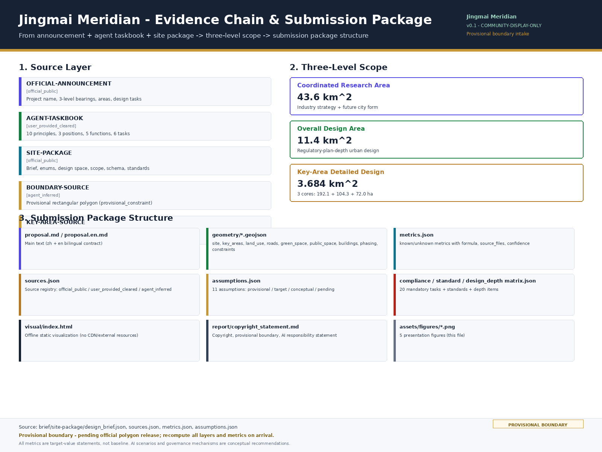
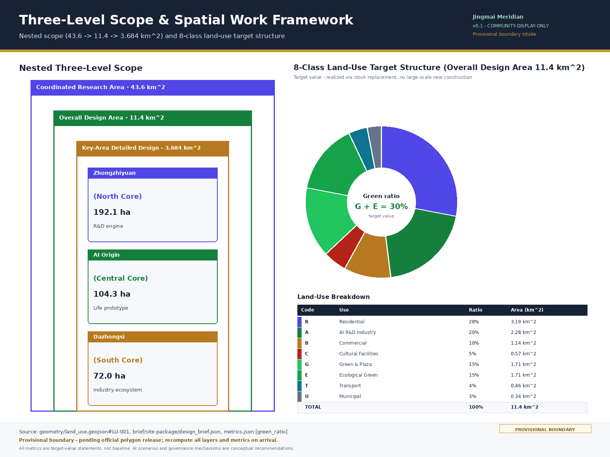
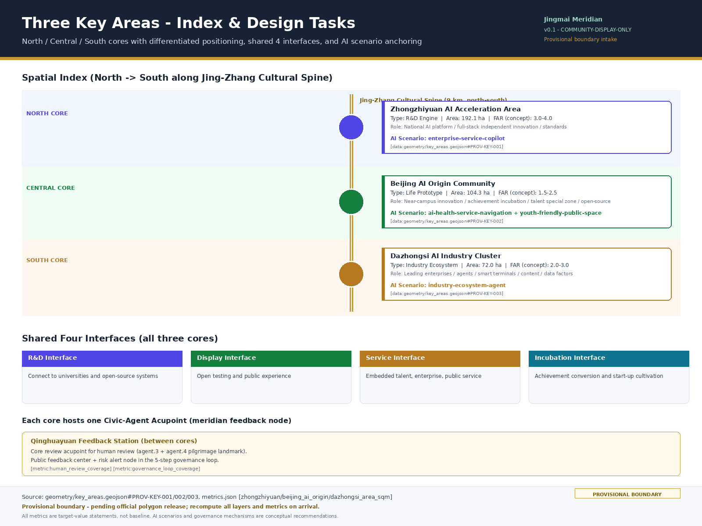
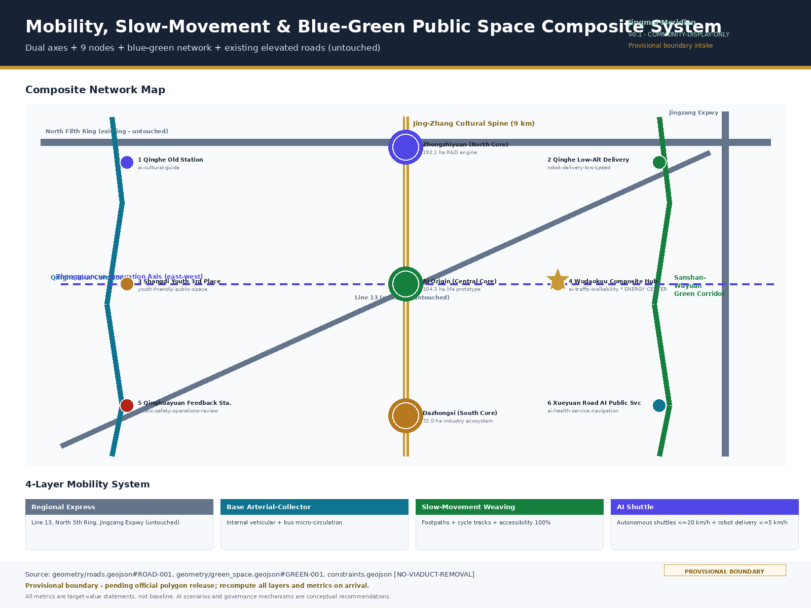
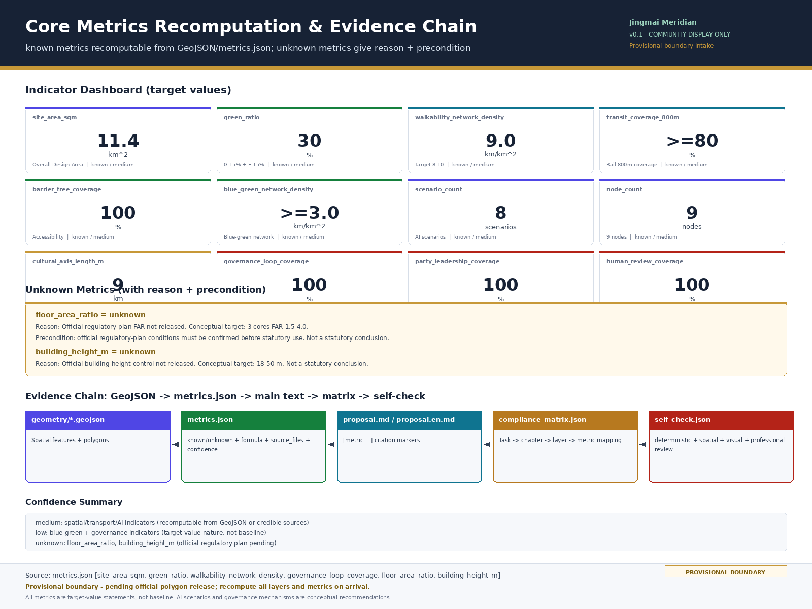

# 京脉智络——百年京张 AI 创新带城市设计方案

## 设计依据与资料清单

本方案以《百年京张 AI 创新带城市设计国际方案征集资格预审公告》为第一依据，以 `brief/site-package/` 中经维护者登记的设计任务书、智能体任务书、临时边界和允许的设计空间为机器可读依据 [source:OFFICIAL-ANNOUNCEMENT] [source:AGENT-TASKBOOK]。资料分层遵循三类边界：formal-ready 资料（公告文字四至、官方公布面积、三处重点区名称与面积）可直接用于方案生成；背景参考资料（全球 AI 创新生态案例、政策文献）用于判断借鉴，不进入官方边界；provisional intake 资料（临时矩形 polygon）仅作为方案生成、自检与可视化的临时约束 [source:SITE-PACKAGE]。

provisional boundary 声明：当前官方精界 polygon 未释出，提交包中 `geometry/site_boundary.geojson` 与 `geometry/key_areas.geojson` 均标注为 `provisional_constraint`、`official_boundary=false`。其粗略来源是公告文字四至描述与公布的统筹研究范围 43.6 km²、总体设计范围 11.4 km² 与三处重点区合计 368.4 ha 的面积推定。临时边界只能用于方案生成、自检和可视化，不能作为 official redline、审批依据、精确面积依据或法定控制结论。当官方精界 polygon 到达后，site boundary、key areas、land use、roads、green space、public space、buildings、phasing 和 metrics 均需重算 [assumption:PROVISIONAL-BOUNDARY]。

方案不是单独愿景文本，而是从公告、智能体任务书与场地资料出发组织成果。完整来源、指标、标准、设计深度和任务覆盖放在 `sources.json`、`metrics.json`、`compliance_matrix.json`、`standard_matrix.json` 与 `design_depth_matrix.json`，不在正文重复机器索引。读者从正文进入证据时，可通过引用标记回查结构化文件 [data:geometry/site_boundary.geojson#SITE-001] [metric:site_area_sqm]。

## 三层范围工作框架

方案按公告确定的三个层次组织工作，三层范围的 scope_id、面积、边界与设计深度均依据 `brief/site-package/design_brief.json` 的 official_scope_levels 与 key_areas 登记 [depth:three_level_scope_framework] [data:geometry/site_boundary.geojson#SITE-001] [metric:coordinated_research_area_sqm]。统筹研究范围 43.6 km²（北至北五环路，东至京藏高速，南至西直门外大街，西至万泉河路）关注 AI 产业生态、战略定位、创新链与未来城市形态；总体设计范围 11.4 km²（以京张遗址公园周边 1-2 公里城市地区和产业区为规划设计范围；北至北五环路，东至学院路、西土城路等，南至西直门外大街，西至大钟寺东路、荷清路等）关注城市更新总体框架、产业空间布局、交通市政支撑和城市风貌控制 [metric:site_area_sqm]；重点区域范围 3.684 km²（368.4 ha，自北向南包括众智园 AI 自主创新加速区、北京 AI 原点社区、大钟寺 AI 产业集聚区）关注三处详细设计地区，要求明确功能业态、建筑规模、拆改留分类、公共空间连通与交通组织 [metric:key_detailed_design_area_sqm]。

| 层级 | scope_id | 面积 | 边界文字描述（依据 design_brief.json） | 设计深度 |
| --- | --- | --- | --- | --- |
| 统筹研究范围 | `coordinated_research_area` | 43.6 km²（43,600,000 m²） | 北至北五环路，东至京藏高速，南至西直门外大街，西至万泉河路 | 产业战略研究：AI 产业生态、创新链与未来城市形态判断 |
| 总体设计范围 | `overall_design_area` | 11.4 km²（11,400,000 m²） | 以京张遗址公园周边 1-2 公里城市地区和产业区为规划设计范围；北至北五环路，东至学院路、西土城路等，南至西直门外大街，西至大钟寺东路、荷清路等 | 控规深度城市设计：用地、建筑、道路、绿地、公共空间与分期图层 |
| 重点区域范围 | `key_detailed_design_area` | 3.684 km²（368.4 ha，三核合计） | 自北向南包括众智园 AI 自主创新加速区、北京 AI 原点社区、大钟寺 AI 产业集聚区 | 详细设计：功能业态、建筑规模、拆改留分类、公共空间连通与交通组织 |
| └ 众智园 AI 加速区（北核） | `zhongzhiyuan_ai_acceleration_area` | 192.1 ha（1,921,000 m²） | 重点区域范围北核，研发引擎型 | 详细设计 [metric:zhongzhiyuan_area_sqm] |
| └ AI 原点社区（中核） | `beijing_ai_origin_community` | 104.3 ha（1,043,000 m²） | 重点区域范围中核，生活原型型 | 详细设计 [metric:beijing_ai_origin_area_sqm] |
| └ 大钟寺 AI 产业集群（南核） | `dazhongsi_ai_industry_cluster` | 72.0 ha（720,000 m²） | 重点区域范围南核，产业生态型 | 详细设计 [metric:dazhongsi_area_sqm] |

校验：192.1 + 104.3 + 72.0 = 368.4 ha = 3.684 km²，与 design_brief.json 登记的重点区域范围面积一致 [metric:key_area_count]。

三层工作不是互相割裂的图纸集合。统筹研究决定产业链与城市形态判断，总体设计把判断落实到更新项目、空间结构与设施承载，重点区域详细设计验证具体地块、建筑、交通、公共空间与 AI 应用场景的可实施性。京脉智络的"一脉双轴三核九节网络"空间结构，正是把三层范围从战略、控制到详设逐级落实的工作转译：一脉对应总体设计范围的京张文化主脉；三核对应重点区域范围的三处重点区；九节对应总体设计范围内可运营的 AI 场景节点 [depth:overall_spatial_structure]。

若使用 provisional boundary，必须明确其限制：边界本身是临时矩形约束，不得作为红线、审批依据或精确面积依据；替换 official polygon 后，所有图层和指标需要重算。当前提交的可评分状态为临时边界、保留精度警示并待正式数据发布后复算；不阻断内容评分，但所有空间结论按"可讨论、可复核、可替换官方边界后重算"的原则写入。

| 层级 | 设计问题 | 方案回答 | 数据落点 |
| --- | --- | --- | --- |
| 统筹研究范围 | AI 产业生态与未来城市形态如何组织 | 以 117 年自主性脉络串联三带定位，形成高校策源—开源协作—企业转化—公共体验—国际传播的创新链 | compliance_matrix.json、standard_matrix.json |
| 总体设计范围 | 产业空间、城市更新、交通市政与风貌如何落图 | 一脉双轴三核九节网络，用地、建筑、道路、绿地、公共空间与分期图层共同表达 | [data:geometry/land_use.geojson#LU-001]、[data:geometry/roads.geojson#ROAD-001] |
| 重点区域范围 | 三处片区如何达到详细设计深度 | 三核差异化定位与四界面共性，分别提出研发引擎、生活原型与产业生态小方案 | [data:geometry/key_areas.geojson#PROV-KEY-001]、[data:geometry/key_areas.geojson#PROV-KEY-002]、[data:geometry/key_areas.geojson#PROV-KEY-003] |

## 统筹研究范围产业与未来城市研究

统筹研究范围的核心设计思想是"京张为脉，自强为魂；智能为络，共治为体"。脉是京张铁路遗址公园 9 公里文化主脉，串联 1909、1988、2026 三段历史层积；魂是 117 年自主性脉络（工程自强→产业自强→智能自强），呼应党建强国"高水平科技自立自强"的战略纵深；络是智能体经络，借鉴中国系统观的穴位—经络—脏腑范式，区别于西方中枢式 Smart Nation；体是多元主体共治的城市活体——党建引导、政府实施、公众参与 [source:AGENT-TASKBOOK] [standard:PROJECT-AGENT-OPEN-CALL-TASKBOOK]。

三带定位把公告的"百年京张文化带、都市 AI 生活体验带、AI 融合创新带"转译为可空间化的产业与城市形态判断：文化带承担 117 年叙事线的展示与体验；AI 生活体验带承担人才社区、青年友好与公共服务场景；AI 融合创新带承担研发引擎、产业生态与全栈自主创新。三带对应 agent.1 要求的"三大定位、五大功能、三区两翼协同回路"，并通过"一脉双轴"在五道口交汇形成能量中心 [data:geometry/green_space.geojson#GREEN-001] [metric:cultural_axis_length_m]。

命名方案"京脉智络"——"京"指京张与北京，"脉"指文化主脉与经络，"智"指人工智能，"络"指智能体经络与共治网络；英译 Jingmai Meridian 兼具地理经脉与经络双关。Logo 设计建议以"京"字与"脉"字形交叠，叠加穴位节点的圆点意象与 9 公里文化主脉的纵向轴线，形成可延展的视觉识别系统方向；字体、图像与商标需清权后定稿，不得未经授权使用既有企业或机构标识。命名与 Logo 方向回应 agent.1 必选任务 [source:AGENT-TASKBOOK]。品牌视觉规范建议（概念方向）：主图形以"京"字与"脉"字形交叠为骨架，穴位圆点与 9 公里纵向轴线为识别元素；须提供黑白单色与反白版本、最小应用尺寸（建议高度 ≥16px）与安全间距，并列出禁止变形、禁止叠加未经授权标识、禁止低对比度背景等禁用示意。核心术语中英文对照固定为：脉 = Meridian、经络 = Meridian network、穴位 = Acupoint/Node、脏腑 = Core district、智能体经络 = Civic-agent meridian，避免传播漂移。

全球 AI 创新生态案例（5-8 个）摘要，回应 agent.2 必选任务：伦敦 King's Cross 把铁路遗产更新为知识经济街区，提供京张遗址公园再利用借鉴；巴塞罗那 22@ 把工业区转化为创新区，提供存量置换借鉴；新加坡 One-North 把科技园区嵌入城市生活，提供研发—生活界面借鉴；北京首钢园为同城工业遗产转型提供冬奥与 AI 双叙事的本土路径；上海杨浦滨江从工业锈带到生活秀带，提供公共参与与滨水空间借鉴；深圳南山科技城提供科技—产业—资本协同借鉴；杭州云栖小镇提供小镇式开发者社区借鉴；新加坡 Smart Nation 提供中枢式治理的对照系，京脉智络则以经络范式回应其局限。这些案例经验可转化为空间（双轴多核）、运营（年度活动与开发者社区）和场景机制（开放测试与朝圣路线）三类设计动作 [source:AGENT-TASKBOOK] [standard:PROJECT-AGENT-OPEN-CALL-TASKBOOK]。

区域协同遵循海淀"三区两翼"与 1×1 协同机制，形成"一核引领、两翼联动、多节点支撑"的协同回路：海淀 AI 创新带为核，北纬社区（AI 原生与人才社区）与未来科学城（未来科技、能源与生命科学）为两翼，怀柔科学城（大科学装置与基础研究）、经开区（智能网联与高端制造）及京津冀为节点支撑 [source:AGENT-TASKBOOK] [standard:PROJECT-AGENT-OPEN-CALL-TASKBOOK]。协同方式包括创新链分工（海淀源头创新—怀柔大装置验证—经开区中试量产）、要素流动（数据要素、算力、人才飞地与跨区孵化）、场景共建（自动驾驶测试、AI 公共服务标准、低空物流）与品牌联动（全球 AI 创新周跨区联动）。逐项协同落点如下：

| 协同对象 | 定位 | 协同方式 | 空间/机制落点 |
| --- | --- | --- | --- |
| 北纬社区 | AI 原生与人才社区 | 人才共享、社区场景共建、开发者社区联动 | 上地青年第三空间、开源发布厅 |
| 未来科学城 | 未来科技、能源与生命科学 | 跨区创新链、成果转化飞地 | 众智园研发引擎联动 |
| 怀柔科学城 | 大科学装置与基础研究 | 大装置—产业验证—中试转化链条 | AI 原点社区成果转化街 |
| 经开区 | 智能网联与高端制造 | 中试量产、自动驾驶测试联动 | 低速机器人配送、AI 接驳层 |
| 京津冀 | 区域协同与要素流动 | 数据要素、算力、人才飞地、跨区孵化 | 全球 AI 创新周、数据要素会客厅 |

区域协同为概念建议，具体机制与政策须遵循法定程序与三区两翼、海淀 1×1 政策边界 [assumption:GOVERNANCE-CONCEPTUAL]。

## 总体设计范围城市更新与控规深度城市设计

总体设计范围的核心空间结构是"一脉双轴三核九节网络"。一脉是京张文化主脉，南北 9 公里，串联清河老站、中关村原点与 AI 原点社区三锚点；双轴是京张文化活力轴（南北）与中关村创新轴（东西），在五道口—清华园交汇形成能量中心；三核是众智园 AI 加速区、北京 AI 原点社区、大钟寺 AI 产业集群三处重点片区；九节是三核加六场景节点（清河老站文化节点、清河低空配送试点、上地青年第三空间、五道口复合枢纽、清华园治理反馈站、学院路 AI 公共服务）。九节通过慢行、绿地与 AI 接驳网络连通，形成可运营、可感知的城市经络 [data:geometry/land_use.geojson#LU-001] [depth:spatial_structure] [metric:node_count]。

城市更新总体框架以存量置换为主，无大规模新增建设用地。原则是：保留京张铁路遗址公园骨架与既有高架（13 号线、北五环、京藏高速），不动现状居住主体；改造低效产业空间、闲置商业空间与桥下消极空间，置换为 AI 研发、文化与公共服务功能；拆除少量违建与退让空间，用于公共空间与慢行织造；新建仅限三核范围内的高强度研发与文化设施。开发强度以三核差异化 FAR 建议表达：众智园 3.0-4.0、AI 原点社区 1.5-2.5、大钟寺 2.0-3.0。片区 FAR 由片区内主导建筑类型的 FAR 建议按建筑面积加权而来，建筑类型级 FAR 建议在 `buildings.geojson` 与设计深度矩阵中登记为：AI 研发 3.5、居住 2.0、商业 2.5、文化 1.5、复合功能 3.0。换算关系为——众智园以 AI 研发类（约 3.5）为主导、叠加复合功能（约 3.0）与共享测试场，加权落在 3.0-4.0；AI 原点社区以居住类（约 2.0）与文化类（约 1.5）为主导、叠加少量研发与商业，加权落在 1.5-2.5；大钟寺以商业类（约 2.5）为主导、叠加复合类（约 3.0）与智能终端展示，加权落在 2.0-3.0。这些数值是概念性目标建议，待官方控规条件确认后才能作为法定判断 [assumption:OFFICIAL-FAR-PENDING] [assumption:LAND-USE-TARGET-SCENARIO] [depth:development_intensity_controls]。

总体设计达到控制性详细规划的城市设计深度。`geometry/land_use.geojson` 应完整覆盖设计边界且无重叠，`geometry/buildings.geojson` 应表达更新建筑基底或保留建筑基底，`geometry/roads.geojson` 应表达微循环、慢行与轨道接驳关系，`metrics.json` 复算核心面积、比例与图层数量 [standard:MOHURD-CONTROL-DETAILED-PLANNING] [depth:land_use_layout]。涉及建筑高度、开发强度、道路红线与退线的内容，若尚无官方控制条件，均写为"待正式控规条件确认"，不得以 agent 推测值冒充审定指标。资料缺口集中在控规、现状建筑、权属、市政与文保条件，须在专业深化阶段补齐 [assumption:A-CONTROLS-001]。

## 重点区域详细设计

三处重点区域各承担差异化定位，并共享四界面共性：研发界面（接入高校与开源体系）、展示界面（对外开放测试与公众体验）、服务界面（人才、企业、公共服务嵌入）、孵化界面（成果转化与初创培育）；同时各设一处智能体穴位作为经络反馈节点。三核共同支撑 agent.4 的 AI 公共空间、智能原生新业态与朝圣地标任务 [data:geometry/key_areas.geojson#PROV-KEY-001] [depth:three_key_area_detailed_design] [metric:key_area_count]。

**众智园 AI 自主创新加速区**（北核，192.1 ha）定位研发引擎型，FAR 概念目标 3.0-4.0。围绕国家人工智能平台、全栈自主创新、标准制定、安全治理与产业展示，组织研发楼宇群、低碳算力中心、标准治理展示厅与清河创新界面。拆改留以保留中关村既有研发主体、改造低效园区、新建标志性研发塔与共享测试场为主。AI 场景挂接 `enterprise-service-copilot`（企业服务 Copilot），承载产业生态智能体与企业全周期服务。资料缺口为权属与文保条件 [data:geometry/key_areas.geojson#PROV-KEY-001] [metric:zhongzhiyuan_area_sqm]。

**AI 原点社区**（104.3 ha）定位生活原型型，FAR 概念目标 1.5-2.5。围绕近校创新、成果孵化转化、人才特区与开源体系，组织校区—园区—街区慢行缝合、开源发布厅、人才服务驿站与居住生活配套。拆改留以保留居住主体、改造底层为孵化与展示、新建少量人才公寓为主。AI 场景挂接 `ai-health-service-navigation`（健康服务导航）与青年友好公共空间。该片区回应 agent.3 的生活原型与可体验场景任务 [data:geometry/key_areas.geojson#PROV-KEY-002] [metric:beijing_ai_origin_area_sqm]。

**大钟寺 AI 产业集群**（72.0 ha）定位产业生态型，FAR 概念目标 2.0-3.0。围绕领军企业、智能体、智能终端、内容消费与数据要素，组织国际路演客厅、智能终端展示带、大钟寺站四象限步行连通与重点企业公共环境更新。拆改留以改造既有商业、整合路口四象限、新建少量标志性商务塔为主。AI 场景挂接非注册扩展场景 `industry-ecosystem-agent`（产业生态智能体，对应 `enterprise-service-copilot` 的产业侧扩展），承载国际路演与数据要素会客厅 [data:geometry/key_areas.geojson#PROV-KEY-003] [metric:dazhongsi_area_sqm]。三核 polygon 当前为 provisional，相关结论只能作为方向性设计 [assumption:OFFICIAL-KEY-AREA-PENDING]。

## AI 创新生态、人才画像与 AI+ 场景

AI 创新生态以 5 类用户画像为需求侧基础：青年人才（研发、开源、社交、夜间协作）、原住民（通勤、休闲、社区服务、低扰动更新）、访客（文化体验、产业参观、国际路演）、老人与残障（无障碍、医疗导航、安全辅助）、外来人才（落地服务、子女教育、跨文化社交）。每类画像对应具体空间响应与隐私边界，避免把居民画像用于商业推荐 [source:SCENARIO-FILES] [depth:ai_scenario_design]。

10 张 AI 场景卡 = 6 个注册 scenario + 2 个非注册场景描述 + 2 个扩展场景，覆盖任务书"10 张以上场景卡"要求 [metric:scenario_card_count]。6 个注册场景与九节点空间挂接：清河老站—AI 文化导览（`ai-cultural-guide`，文化遗产 AI 导览，回应 agent.5 文化叙事）；清河低空配送试点—低速机器人配送（`robot-delivery-low-speed`，无人接驳车 ≤20km/h、机器人 ≤5km/h，回应 agent.3 测试场景）；五道口复合枢纽—AI 交通与慢行（`ai-traffic-walkability`，可解释导视、低侵入传感、慢行断点识别）；清华园治理反馈站—公共安全运营复核（`public-safety-operations-review`，核心复核穴位，回应 agent.4 朝圣地标与 agent.3 人工复核）；学院路 AI 公共服务—AI 健康服务导航（`ai-health-service-navigation`，医疗导航、企业服务 Copilot 复合）；中关村 AI 加速区—企业服务 Copilot（`enterprise-service-copilot`，产业测试验证场景）。2 个非注册场景描述：上地青年第三空间—青年友好公共空间（夜间协作、运动、社交，对应赛道 `youth-friendly-public-space` 的扩展表述）；大钟寺产业集群—产业生态智能体（产业测试验证场景，`enterprise-service-copilot` 的产业侧扩展）。2 个扩展场景：开源发布厅（AI 原点社区）与数据要素会客厅（大钟寺）。其中 3 个产业测试验证场景为：企业服务 Copilot、产业生态智能体、低速机器人配送 [source:SCENARIO-FILES] [metric:scenario_count] [metric:scenario_card_count]。

智能体经络五步闭环是治理侧核心机制：① 公开资料读取（表，纳入城市治理知识库）→ ② 方案推演（里，智能体生成方案）→ ③ 公众反馈（表，反馈渠道嵌入九节点）→ ④ 人工复核（里，清华园反馈站为核心复核穴位）→ ⑤ 风险提示（表，回到知识库）→ 循环。三原则贯穿：党建引导（价值导向、方向引领、组织保障、专业把关、风险研判、群众动员、技术伦理七项职能全面贯穿，无"不干预"环节）、政府实施（法定决策与监管）、公众参与（反馈、监督、共建）。所有治理机制为概念建议，实施须遵循法定程序 [assumption:GOVERNANCE-CONCEPTUAL] [metric:governance_loop_coverage] [metric:party_leadership_coverage]。治理覆盖类指标（党建引导 100%、人工复核 100%、经络贯通 100%、公众参与渠道 ≥9）均为目标值而非现状实测，不作为已实现声明 [metric:governance_loop_coverage]。九节点反馈渠道须明确响应时效（建议 ≤3 个工作日）、人工复核责任主体（属地政务与数据主管部门）与低技术门槛备用方式（线下意见箱、电话、社区议事会），避免仅依赖线上智能体。3 个产业测试验证场景（企业服务 Copilot、产业生态智能体、低速机器人配送）须分别列出启动前置条件、安全边界与暂停/退出条件：启动需完成安全评估、备案与试点申报；安全边界包括限速（≤20km/h 接驳、≤5km/h 机器人）、限定区域与人工可接管；暂停/退出条件包括事故率超阈值、合规失效或公众异议，触发后立即暂停并复核 [assumption:AI-SCENARIO-CONCEPTUAL] [assumption:GOVERNANCE-CONCEPTUAL]。

| 用户画像 | 典型需求 | 空间响应 | 隐私边界 |
| --- | --- | --- | --- |
| 青年人才 | 研发、开源、社交、夜间协作 | 原点社区开源发布厅、青年第三空间、夜间协作空间 | 不采集个人行为轨迹，活动数据只做聚合统计 |
| 原住民 | 通勤、休闲、社区服务、低扰动更新 | 京张遗址公园慢行环、社区服务嵌入、活动分级 | 不将居民画像用于商业推荐 |
| 访客 | 文化体验、产业参观、国际路演 | 清河老站文化节点、大钟寺国际路演客厅 | 游览数据匿名化，不对外分享 |
| 老人与残障 | 无障碍、医疗导航、安全辅助 | 学院路 AI 公共服务、无障碍 100% 覆盖 | 健康数据最小化采集，须经授权 |
| 外来人才 | 落地服务、子女教育、跨文化社交 | 人才服务驿站、AI 原点社区复合配套 | 个人身份信息按 PIPL 合规处理 |

## 用地、建筑规模与拆改留方案

用地布局依据国土空间调查、规划、用途管制分类等公开标准表达，形成完整、闭合、无缝的八类用地目标结构：R 居住生活 28%（3.19 km²）、A AI 研发产业 20%（2.28 km²）、B 商业服务 10%（1.14 km²）、C 文化设施 5%（0.57 km²）、G 绿地广场 15%（1.71 km²）、E 生态绿地 15%（1.71 km²）、T 交通设施 4%（0.46 km²）、U 市政基础设施 3%（0.34 km²），合计 100% 共 11.4 km²（总体设计范围）。目标绿地率（G+E）= 30% [metric:target_green_ratio]；当前 `green_space.geojson` 图层仅含 G 类，空间复算绿地率约 20.98% [metric:green_ratio]。所有比例为更新后目标构型，依靠存量置换实现，无大规模新增建设用地 [data:geometry/land_use.geojson#LU-001] [depth:land_use_layout] [assumption:LAND-USE-TARGET-SCENARIO]。

拆改留分类以保留为主体：保留京张铁路遗址公园骨架、既有居住主体、文保建筑与既有高架；改造低效产业园区、闲置商业空间、桥下消极空间、底层沿街与部分公共建筑，置换为 AI 研发、文化、展示与公共服务；拆除少量违建、退让空间与个别低价值棚户，用于公共空间与慢行织造；新建仅限三核范围内的高强度研发塔、文化设施与少量人才公寓。建筑规模和开发强度以三核差异化 FAR 建议表达，待官方控规条件确认后才能作为法定判断 [depth:retain_renovate_demolish] [assumption:OFFICIAL-FAR-PENDING] [data:geometry/buildings.geojson#BLDG-001]。

所有面积、比例和规模必须能从 `geometry/*.geojson`、`metrics.json` 或可信来源复算。当前 `metrics.json` 显示 `floor_area_ratio` 与 `building_height_m` 状态为 unknown，原因在于官方控规容积率与建筑高度控制尚未释出。方案给出概念性目标建议（三核 FAR 1.5-4.0、建筑高度 18-50m），不作为法定结论 [metric:floor_area_ratio] [metric:building_height_m]。缺控规、现状建筑、权属或工程条件时，相关内容必须写成待确认事项，不得伪装为审定指标 [assumption:A-CONTROLS-001]。

## 交通、轨道、市政与公共服务设施

交通策略以四层体系组织：区域快速层（保留既有 13 号线、北五环、京藏高速高架不动，承担过境与对外交通）、基地干支层（组织基地内部机动车与公交微循环）、慢行织造层（步道、骑行道、无障碍网络）、AI 接驳层（低速无人接驳车 ≤20km/h 与机器人配送 ≤5km/h）。慢行网络密度目标 8-10 km/km²，轨道站点 800m 覆盖率 ≥80%，无障碍覆盖率 100% [depth:mobility_and_walkability] [metric:walkability_network_density] [metric:transit_coverage_800m] [assumption:TRANSPORT-TARGET-SCENARIO]。

拒绝大开挖声明：不动既有高架（13 号线、北五环、京藏高速），不走波士顿 Big Dig 路线。采用四类缝合手段实现东西缝合与南北贯通：老京张地面廊道活化（地面文化主脉串联三锚点）、高架桥下空间利用（作为"穴位"空间资源，嵌入公共服务、AI 场景与休憩节点）、立体穿越节点（在五道口、清华园等关键位置设步行桥与下穿）、废弃支线街巷织造（利用京张废弃支线与街巷织造慢行网络）[assumption:NO-VIADUCT-REMOVAL] [data:geometry/roads.geojson#ROAD-001] [data:geometry/constraints.geojson#CONSTRAINTS]。

AI 接驳层是京脉智络的特色层。低速无人接驳车串联三核与九节点，承担最后一公里接驳与轨道换乘；机器人配送承担快递、外卖与产业物流的低速配送，与慢行网络共享路权但限速 5km/h。该层回应 agent.3 的 AI+场景赋能新范式任务。市政和公共服务设施覆盖 AI 产业服务设施、创新服务平台、人才生活服务设施、新型基础设施、分布式能源、端侧算力和传统市政设施融合。缺少管线、能源、排水、防洪、消防等工程资料时，列为正式深化前置条件 [depth:municipal_new_infrastructure] [depth:traffic_rail_slow_parking]。

## 蓝绿空间、公共空间与城市风貌

蓝绿空间以"一脉双廊"为骨架：京张文化主脉（南北 9 km）+ 清河蓝廊 + 三山五园绿廊。一脉串联三锚点（清河老站、中关村原点、AI 原点社区），双廊分别承担滨水生态与历史园林的连续性。九园节点体系与九节对应：每个节点各嵌一处公共空间节点，形成可步行、可停留、可体验的公共空间序列。蓝绿网络密度目标 ≥3 km/km²，人均公园绿地 ≥15 m²，海绵城市达标率 ≥70% [depth:blue_green_public_space] [data:geometry/green_space.geojson#GREEN-001] [metric:blue_green_network_density] [assumption:BLUE-GREEN-TARGET-SCENARIO]。

三锚点构成百年自强叙事线，回应 agent.5 文化叙事任务：清河老站（1909 工程自强，"经世致用"，詹天佑自建铁路）—中关村原点（1988 产业自强，"日新又新"，科技兴国）—AI 原点社区（2026 智能自强，"天人合一"，人机协同）。三文融合把京张铁路历史文化、中关村创新文化与 AI 新文化叠合在空间叙事中：京张提供工业遗产与自强精神、中关村提供创新文化与开源精神、AI 新文化提供人机协同与开源共治。三山五园造园智慧的当代转译体现在借景、对景、园中之园与步移景异等手法在九园节点中的应用 [depth:cultural_heritage_narrative] [metric:cultural_axis_length_m]。

3 个 AI 朝圣地标回应 agent.4 朝圣地标任务：清河老站（文化遗产 AI 导览枢纽，1909 自强叙事起点）、AI 原点社区（生活原型与开源发布厅，2026 智能自强叙事落点）、清华园反馈站（核心复核穴位与公众反馈中心，治理朝圣地标）。地标、导视、Logo、字体、图像、人物与企业标识必须清权，不得过度娱乐化或把概念地标写成已批准建设。城市风貌以京张工业遗产基调、中关村创新界面与 AI 时代数字公共艺术三类要素统筹，建筑高度、体量、界面与屋顶形态由风貌控制深度项管理 [depth:height_massing_character] [standard:MOHURD-URBAN-DESIGN-MEASURES]。

## 更新项目清单、实施政策与分期计划

四期分期回应 agent.6 长期运营任务。一期（0-2 年）试点期：清华园反馈站 + 清河低空配送试点 + 老京张廊道示范段，以轻量设施、运营活动和服务平台启动，验证经络五步闭环与 AI 场景机制。二期（2-5 年）三核期：三核差异化成型，众智园研发引擎、AI 原点社区生活原型、大钟寺产业集群分别成型并联动。三期（5-8 年）九节期：九节点联动，经络贯通，AI 场景从试点走向常态化运营。四期（8 年后）进化期：智能体自学习、自进化，城市治理知识库沉淀为长期品牌资产 [data:geometry/phasing.geojson#PHASE-001] [depth:phasing_implementation] [metric:phasing_period_count] [assumption:PHASING-CONCEPTUAL]。一期试点最小可行范围：清华园反馈站 + 清河低空配送试点 + 老京张廊道示范段，以轻量设施与运营活动启动；不能启动的依赖条件包括低空航线审批、机器人路权确认、数据合规评估与公开资料接入，任一未满足即延迟相应项目；审批前置清单为安全评估、备案与属地许可 [assumption:PHASING-CONCEPTUAL]。现状人群、公共服务可达性与无障碍基线数据尚未取得，本方案将其列为数据缺口，待专业深化阶段以公开数据补齐后再校准公共利益类指标 [assumption:A-CONTROLS-001]。

更新项目清单覆盖公共空间、交通、产业、新基建、运营五类，七个典型项目 JZ-01 至 JZ-07。每个项目给出建议牵头主体、关键依赖条件、可量化里程碑与验收指标四项，作为"参考方案"供专业团队深化；所列主体、时间与指标均为概念建议，不构成政府安排或实施承诺 [depth:renewal_project_list]。

| 项目 | 建议牵头主体 | 关键依赖 | 里程碑 | 验收指标 |
| --- | --- | --- | --- | --- |
| JZ-01 京张遗址公园慢行断点缝合（公共空间/交通） | 区级公园与交通主管部门牵头，属地街道配合 | 慢行断点现状测绘、桥下空间权属确认、既有高架保留为前提 | 断点清单 → 示范段（1-2 处）缝合 → 全线连通 | 断点消除数量、慢行连通率、无障碍覆盖率 |
| JZ-02 众智园清河创新界面（蓝绿/产业展示） | 园区平台公司与属地政府牵头 | 清河蓝廊生态条件、地块权属、控规条件 | 界面设计方案 → 示范段建成 → 界面整体贯通 | 界面长度、绿地率、展示节点数量 |
| JZ-03 原点社区近校成果转化街（城市更新/产业服务） | 高校成果转化机构与区级科技部门牵头 | 校区—街区空间整合、产权整理、孵化载体供给 | 转化街定位 → 首批孵化载体入驻 → 常态化运营 | 转化项目数量、载体入驻率 |
| JZ-04 大钟寺站四象限步行连通（轨道一体化/慢行） | 轨道运营方与区级交通部门牵头 | 四象限空间权属、连廊工程条件、站点客流组织 | 连通方案 → 首批象限连通 → 四象限闭环 | 步行连通度、换乘时间、无障碍覆盖 |
| JZ-05 清华园治理反馈站（新基建/公共服务） | 区级政务与数据主管部门牵头，属地配合 | 公开资料接入、人工复核机制、数据合规评估 | 反馈站原型 → 试点运行 → 纳入治理知识库 | 反馈渠道数量、人工复核覆盖率、闭环响应时效 |
| JZ-06 清河低空配送试点（新基建/AI 场景） | 行业监管部门与平台运营方牵头 | 低空航线审批、安全评估、机器人路权确认 | 试点申报 → 限定区域试运行 → 扩展评估 | 配送单量、事故率、低速合规率 |
| JZ-07 全球 AI 活动周公共路线（运营/品牌） | 活动策划方与区级文旅/商务部门牵头 | 路线节点开放、品牌授权、场地协调 | 路线规划 → 首届落地 → 年度化运营 | 参与人次、路线节点数、传播覆盖 |

以上七个项目的牵头主体为"建议牵头单位"、里程碑与指标为概念性目标，实施须经法定程序与相关主体确认；JZ-05、JZ-06 涉及数据与低空运行，另须分别完成数据合规与安全评估 [assumption:GOVERNANCE-CONCEPTUAL] [assumption:AI-SCENARIO-CONCEPTUAL] [assumption:PHASING-CONCEPTUAL]。

党建引导、政府实施、公众参与三原则贯穿实施全程。党建引导在价值导向、方向引领、组织保障、专业把关、风险研判、群众动员、技术伦理七项职能上发挥作用，无"不干预"环节；政府实施承担法定决策与监管；公众参与通过九节点嵌入的反馈渠道、社区议事会与开放场景日实现。年度活动体系包括全球 AI 创新周、开源开发者大会、京张文化年系列活动与三核季度开放日；长期运营通过开发者社区运营、场景开放运营、公共体验路线、国际传播与招引转化机制沉淀为长期品牌资产。所有活动、招商、资金、政策和运营安排必须写成概念建议或深化方向，不得表述为已确定政府安排 [source:AGENT-TASKBOOK] [assumption:GOVERNANCE-CONCEPTUAL] [metric:public_participation_channels]。

## 指标体系、面积复算与合规矩阵

指标体系分为空间、交通、AI、治理四大类。空间类：总体设计范围 11.4 km²（统筹研究范围 43.6 km²、重点区域范围 3.684 km²）、文化主脉 9 km、目标绿地率 30%（G+E）[metric:target_green_ratio]、人均公园 ≥15 m²、三核合计 368.4 ha（众智园 192.1 ha、AI 原点社区 104.3 ha、大钟寺 72.0 ha） [metric:site_area_sqm]。交通类：慢行密度 8-10 km/km²、轨道覆盖 ≥80%、无障碍 100%、蓝绿网络密度 ≥3 km/km² [metric:walkability_network_density]。AI 类：场景卡 10 张（8 个空间挂接场景 + 2 个扩展场景）[metric:scenario_card_count]、九节点、经络贯通 100%。治理类：党建引导覆盖 100%、人工复核 100%、公众参与渠道 ≥9 [metric:governance_loop_coverage]。

面积复算遵循统一的设计深度要求 [depth:metrics_recalculation]。known 指标必须能从 GeoJSON 或可信来源复算：site_area_sqm 取 provisional polygon 复算 11412825.386 m²（官方公告 11.4 km²）；target_green_ratio 目标 30%（G 15% + E 15%），green_ratio 空间复算 20.98%（green_space 图层仅含 G 类）[metric:green_ratio]；building_footprint_area_sqm 111816.454 m²；public_space_area_sqm 87054.545 m² [metric:public_space_area_sqm]。unknown 指标必须给出原因和正式提交前置条件：floor_area_ratio 与 building_height_m 因官方控规未释出而 unknown，方案仅给出概念性目标建议 [metric:site_area_sqm] [metric:green_ratio] [metric:floor_area_ratio]。所有 known 指标的置信度多为 medium，蓝绿与治理类指标因目标值属性而 confidence 为 low。

合规矩阵是任务响应性的主控文件。`compliance_matrix.json` 覆盖公告 1.3.1-1.5.3.3（共 17 条）与 agent.1-agent.6（共 6 条），合计 23 条必选任务，每条映射到报告章节、图层、指标、图纸、HTML 页面、来源、假设与自检项。`standard_matrix.json` 覆盖 MOHURD 城市设计办法、控制性详细规划规范、国土空间用途管制分类、生成式 AI 服务管理办法、无障碍环境建设法、三区两翼政策与海淀 1×1 政策。`design_depth_matrix.json` 覆盖三层范围框架、总体空间结构、用地布局、开发强度、保留改造拆除、交通轨道慢行停车、市政新基建、蓝绿公共空间、文化遗存叙事、更新项目清单、分期实施、风险缺资料、指标复算等深度项。三类矩阵共同保证方案不漏任务、不越边界、不缺深度。所有指标为目标值声明，实施须遵循法定程序 [assumption:GOVERNANCE-CONCEPTUAL] [assumption:AI-SCENARIO-CONCEPTUAL]。

## 风险、版权与合规说明

资料合法性是首要风险。本方案只用公开或清权资料：公告文字四至、官方公布面积、三处重点区名称与面积、公开政策文献、全球 AI 创新生态案例的公开报道。非公开资料排除：不使用秘密地图、非公开表格、未公开的规划控制条件、个人隐私数据、未清权的企业专有数据。如使用 OSM 作为基础图层，按 ODbL 要求署名；不使用商业地图瓦片作为提交数据 [source:SOURCE-REGISTRY] [source:SITE-PACKAGE]。

隐私保护遵循《个人信息保护法》（PIPL）与《生成式人工智能服务管理暂行办法》。AI 场景中个人行为轨迹不采集、活动数据只做聚合统计、健康数据最小化采集且须授权、居民画像不用于商业推荐、游览数据匿名化。AI 生成责任由 agent 承担：方案对事实、来源、版权、空间数据、指标和表达负责；维护者和专业评审可依据自检结果、空间复核和合规矩阵要求返修或拒绝。AI 场景为概念建议，非已实施，落地须经过安全评估、备案和法定程序 [assumption:AI-SCENARIO-CONCEPTUAL] [assumption:GOVERNANCE-CONCEPTUAL]。

官方批准/实施承诺禁用：方案不声称官方批准、审定控规、最终土地权属、最终建设规模或保证实施。所有空间落地建议表述为"概念建议""参考方案""可供专业团队深化研究"。待补资料清单：官方精界 polygon、三处重点区 official polygons、控规容积率与建筑高度、道路红线、地块权属、市政管线、文保条件、现状建筑底图。版权与合规完整说明保存在 `report/copyright_statement.md` [assumption:PROVISIONAL-BOUNDARY] [assumption:OFFICIAL-KEY-AREA-PENDING] [assumption:NO-VIADUCT-REMOVAL] [assumption:A-CONTROLS-001]。图件授权说明：`assets/figures/*.png` 五组中英图件由 agent 基于 `brief/site-package/geometry/provisional_boundaries.geojson` 与方案图层生成，底图采用 OSM（按 ODbL 署名）或公开边界，不使用商业地图瓦片；图件中的字体、人物、企业或机构标识须在定稿前逐一清权，未清权项不得用于公开传播 [source:SITE-PACKAGE]。背景政策文献（如老年智能技术规划、生成式 AI 办法、无障碍法）仅作为背景参考与边界依据，不表述为海淀本地已落实结论；本地是否落地以法定文件为准 [assumption:A-CONTROLS-001]。

## 参考资料

- 北京市规划和自然资源委员会海淀分局. 百年京张 AI 创新带城市设计国际方案征集资格预审公告.
- 百年京张 AI 创新带城市设计开源征集任务书摘录（agent_taskbook.json）.
- 海淀区"三区两翼"政策与海淀 1×1 协同机制公开文件.
- 住建部《城市设计管理办法》与控制性详细规划相关技术规范.
- 自然资源部国土空间调查、规划、用途管制用地用海分类指南.
- 伦敦 King's Cross、巴塞罗那 22@、新加坡 One-North 与 Smart Nation 公开案例资料.
- 北京首钢园、上海杨浦滨江、深圳南山科技城、杭州云栖小镇公开案例资料.
- 《生成式人工智能服务管理暂行办法》与《个人信息保护法》.
- 京张铁路历史与詹天佑工程自强相关公开史料.
- 三山五园历史文化保护区公开保护规划与研究文献.
- 完整机器索引：见 `sources.json`、`metrics.json`、`compliance_matrix.json`、`standard_matrix.json` 与 `design_depth_matrix.json`.

本方案核心判断的完整证据链由 sources.json、standard_matrix.json、design_depth_matrix.json 与 geometry 图层共同支撑 [source:SITE-PACKAGE]。
