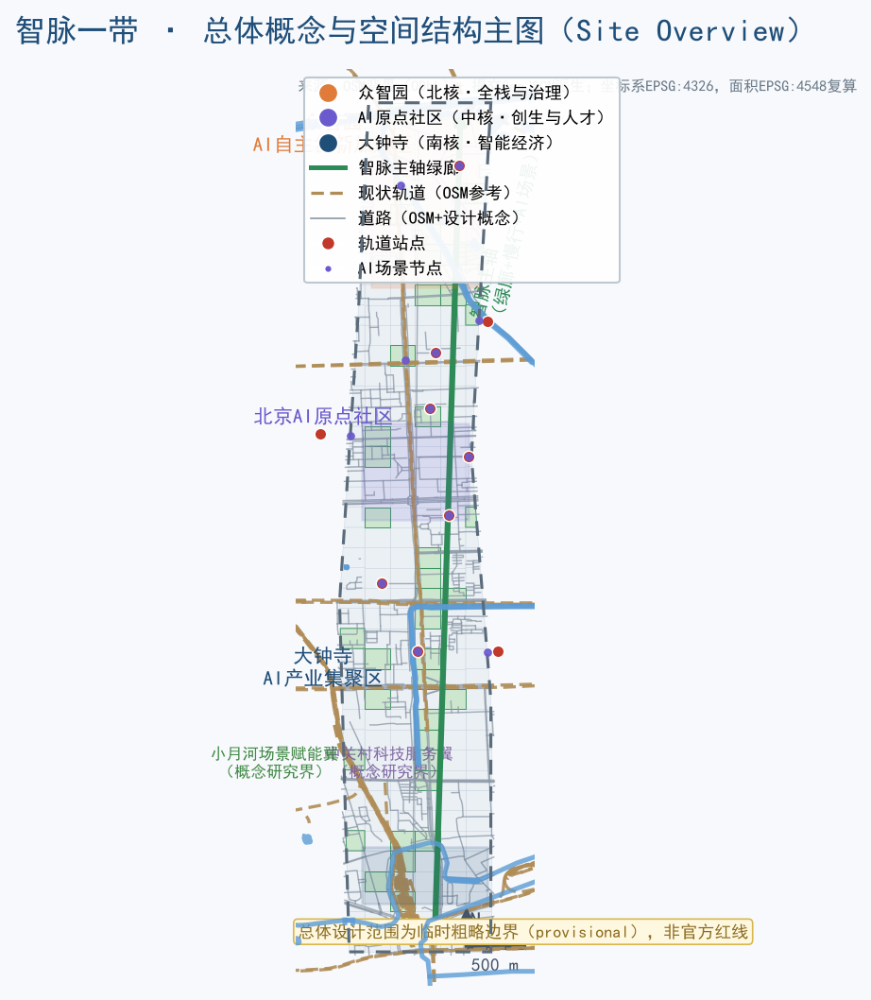
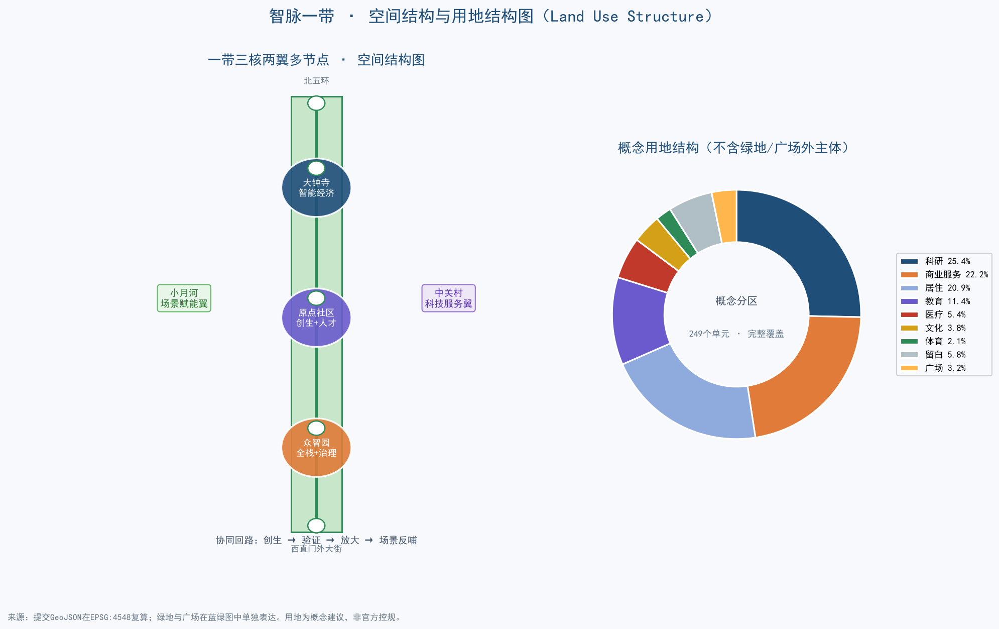
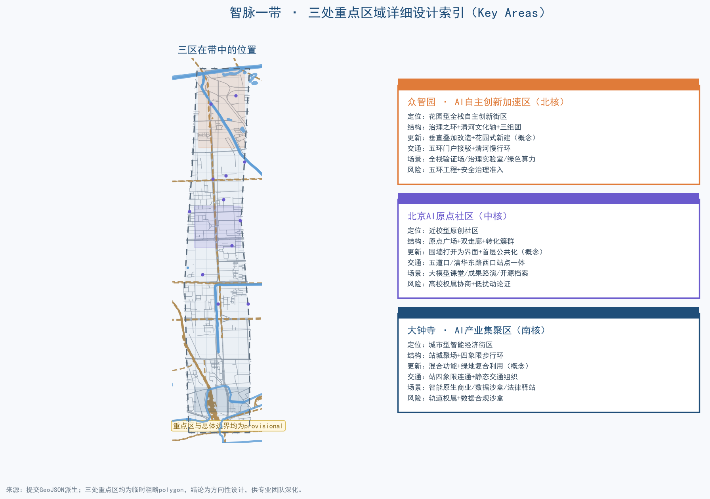
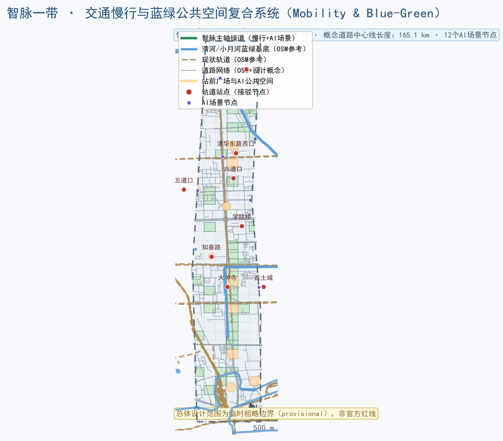

# 智脉一带：从百年京张铁路到全球AI创新带

## 1. 设计依据与资料清单

本方案依据四类资料展开：[source:SITE-PACKAGE] 提供的项目任务书、枚举、允许设计空间、规划限值与数据模式；[source:SOURCE-REGISTRY] 区分 formal 可用、背景与 provisional 资料；[source:PROCESSED-FACT-PACK] 提供任务索引、来源边界与缺资料清单；[source:OFFICIAL-ANNOUNCEMENT] 与 [source:DATA-SRC-OFFICIAL-ANNOUNCEMENT-20260509] 提供官方项目名称、主办承办、三层范围、面积约值与设计任务。[source:AGENT-TASKBOOK] 与 [source:DATA-SRC-AGENT-TASKBOOK-20260518] 提供面向智能体的六项任务、共创原则、评审维度与统一边界条款。

空间底图方面，[source:BOUNDARY-SOURCE] 与 [source:KEY-AREA-SOURCE]（即 [source:DATA-SRC-PROVISIONAL-BOUNDARIES-20260605]）提供总体设计范围与三处重点区域的临时粗略 polygon，仅用于生成、可视化与 intake 自检，不得作为官方红线或精确面积依据。[source:SRC-OSM-2026] 的 OSM 数据（ODbL）用于现状道路、轨道、水系、绿地、教育设施与建筑底图背景；[source:SRC-HAIDIAN-PROFILE-2025]、[source:SRC-ZGC-AI-2025]、[source:SRC-HAIDIAN-EDU-2025]、[source:SRC-BJ-TRAFFIC-2025] 与 [source:SRC-JINGZHANG-HISTORY] 提供海淀产业、教育、交通与京张历史公开背景。专业标准方面，[standard:PROJECT-OFFICIAL-ANNOUNCEMENT] 是项目任务主控依据，[standard:PROJECT-AGENT-OPEN-CALL-TASKBOOK] 是智能体任务主控依据，[standard:MOHURD-URBAN-DESIGN-MEASURES] 指导城市设计与风貌，[standard:MOHURD-CONTROL-DETAILED-PLANNING] 界定控规深度与实施边界，[standard:MNR-LAND-USE-CLASSIFICATION-GUIDE] 统一用地分类语义。[depth:existing_conditions_diagnosis] 与 [depth:risk_missing_data] 明确现状与缺口清单。

边界状态说明：总体设计范围约 [metric:site_area_sqm] 平方米（约 1141.3 公顷），为公告约 11.4 平方公里、临时 polygon 复算的 provisional 边界；三处重点区域合计约 369 公顷，同样为 provisional。[data:geometry/site_boundary.geojson#SITE-001] 与 [data:geometry/key_areas.geojson#KEY-001] 均标记 `provisional_constraint`。本方案引用的一切面积、比例与图层均基于该边界复算；取得官方 CAD/GIS 后必须整包重算，[assumption:A-BOUNDARY-001] 与 [assumption:A-CONTROLS-001] 记录该限制。

## 2. 三层范围工作框架

三层范围分别承担不同设计任务：[depth:three_level_scope_framework]。

**统筹研究范围（约43.6平方公里）**：以海淀“三区两翼”为系统研究范围，回答世界级 AI 创新生态体系、未来城市形态、AI 文化与 AI 社会议题。本层不生成精确红线，只做产业-空间-创新网络研究，并以 [data:geometry/constraints.geojson#CZ-004]（小月河场景赋能翼概念研究界）与 [data:geometry/constraints.geojson#CZ-005]（中关村科技服务翼概念研究界）表达两翼协同关系。

**总体设计范围（约11.4平方公里）**：以京张遗址公园周边1—2公里城市地区和产业区为对象，达到控规深度的城市设计研究框架。本层生成 [data:geometry/land_use.geojson#LU-00-20] 等用地分区、[data:geometry/buildings.geojson#BD-001] 等建筑概念基底、[data:geometry/roads.geojson#RD-001] 等道路组织、[data:geometry/green_space.geojson#GR-LU-02-20] 等蓝绿空间与 [data:geometry/phasing.geojson#PH-001] 等分期范围。

**重点区域范围（约368.4公顷）**：对众智园 AI 自主创新加速区、北京 AI 原点社区、大钟寺 AI 产业集聚区开展精细化设计，对应 [data:geometry/key_areas.geojson#KEY-001]、[data:geometry/key_areas.geojson#KEY-002]、[data:geometry/key_areas.geojson#KEY-003]。三处重点区当前均为 provisional 粗略 polygon，正文结论只作为方向性设计，供专业团队在取得官方片区边界后深化。

三层的传导逻辑是“产业战略定功能、总体结构定框架、重点片区定形态”：统筹层给出产业重点与协同回路，总体层落到用地、交通、蓝绿与更新结构，重点层细化到建筑更新、站点接驳与公共空间。每层面积复算均来自提交的 GeoJSON，而非公告文字（[metric:site_area_sqm]、[metric:key_area_count]、[metric:key_area_zhongzhiyuan_sqm]、[metric:key_area_origin_sqm]、[metric:key_area_dazhongsi_sqm]）。边界精度限制由 [assumption:A-BOUNDARY-001] 统一登记。

## 3. 统筹研究范围产业与未来城市研究

### 3.1 现状基础与产业判断

海淀已形成中国最密集的 AI 产业与智力资源之一：公开口径显示，2025 年上半年中关村科学城 AI 企业达 1900 家、AI 独角兽 26 家（占北京全市约七成）[metric:ai_company_count_haidian][metric:ai_unicorn_count_haidian]；海淀区 2025 年新增科技型企业超 2.4 万家、科技型企业总数 14.54 万家，上市公司 265 家、独角兽企业 49 家、国家高新技术企业近万家 [source:SRC-HAIDIAN-PROFILE-2025]；海淀区驻区高校 30 多所、科研机构 100 多家，2024—2025 学年度普通中小学 181 所、在校生 34.4 万人 [metric:school_count_haidian][metric:university_count_haidian][metric:student_count_haidian][source:SRC-HAIDIAN-EDU-2025]。这些数据表明，一带具备“源头创新—工程转化—产业放大—场景反哺”全链条的要素基础，但空间上仍存在大院围墙、园区封闭、站点与街区割裂、慢行断点等结构性障碍。[depth:existing_conditions_diagnosis]

### 3.2 三区两翼协同回路

本方案把“三区两翼”组织为一条 **“智脉协同回路”**（概念建议）：

- **AI 原点社区**（中核）：依托清华、北大、中科院等原始创新策源，承担人才与成果转化，是回路的“创生端”；
- **众智园 AI 自主创新加速区**（北核）：承担 AI 全栈自主创新与 AI 治理，是回路的“验证端”；
- **大钟寺 AI 产业集聚区**（南核）：承载智能体、智能终端、内容消费等智能原生业态，是回路的“放大与体验端”；
- **中关村科技服务翼**：提供资本、IP、合规、数据与全球化要素配置，是回路的“服务端”；
- **小月河场景赋能翼**：提供 AI+ 生活、交通、教育、医疗等场景实验，是回路的“场景端”。

回路机制为：原创成果从原点社区出发，经众智园完成全栈验证与治理评估，在大钟寺形成产品和体验，再由小月河翼回到市民日常场景，最终由中关村翼完成服务与资本闭环。这一回路对应 [data:geometry/constraints.geojson#CZ-001]、[data:geometry/constraints.geojson#CZ-002]、[data:geometry/constraints.geojson#CZ-003] 三个核心服务分区与两个翼区概念研究界。

### 3.3 全球 AI 创新生态案例（5—8个）

本方案选取 6 个公开可查的全球 AI 创新生态案例，提炼可转化机制（均为背景参考，[source:AGENT-TASKBOOK] 要求 5—8 个案例）：

1. **硅谷（斯坦福—帕洛阿尔托）**：大学周边步行可达的创业街坊、风险资本集聚与校友网络。可转化机制：在原点社区强化“教授+创业者+资本”步行交往界面，设置 24 小时开放的开源会客厅。
2. **波士顿肯德尔广场**：MIT 周边的生命科学与 AI 集聚区，通过“研究机构—孵化器—企业”垂直叠加与公共空间串联实现转化。可转化机制：在众智园采用垂直叠加的“全栈塔楼”概念，底层公共测试层、中层研发、上层治理实验室。
3. **新加坡纬壹科技城（one-north）**：以“工作—生活—学习—玩乐”一体化为目标，建设连续绿地与多模式交通。可转化机制：强化京张遗址公园作为贯穿南北的“创新共享绿脊”。
4. **伦敦国王十字知识区**：以铁路遗产更新为平台，引入高校与科技企业，通过站城一体激活街区。可转化机制：以大钟寺站四象限与京张遗址公园南端实践“铁路遗产+知识经济”的更新路径。
5. **深圳南山科技园与后海片区**：以龙头企业牵引、市场化园区运营和快速迭代为特征。可转化机制：大钟寺依托领军企业带动智能终端与内容生态，园区运营采取“平台公司+场景公司”模式（概念建议）。
6. **杭州未来科技城**：以政策试验、场景开放与人才政策吸引 AI 企业集聚。可转化机制：小月河翼作为“场景沙盒”，以真实城市环境验证 AI+ 生活服务（概念建议）。

以上案例只用于空间机制与运营机制借鉴，不引用未经核实的投资额、产值或企业名单。

### 3.4 未来城市形态：自适应街区

本方案提出 **“自适应街区”** 概念（概念建议）：把街区当作可学习、可进化的城市系统，包括四个子系统：

- **智脉骨架**：以京张遗址公园绿脊为南北主轴，串联轨道站点与公共空间，形成可感知、可交互的“AI+交通”骨架（[data:geometry/roads.geojson#RD-404] 等绿道概念线）；
- **弹性细胞**：以留白用地（[metric:land_use_area_16_sqm]，占总体设计范围约 4.8%）作为进化预留地，允许功能在“AI研发—居住—商业”之间随需求迭代（概念建议，不预设地块结论）；
- **场景皮层**：把 AI 服务分区与场景节点（[metric:scenario_node_count] 个）嵌入街区，形成可感知的 AI 公共服务界面；
- **能源与算力底网**：探索分布式能源、端侧算力与传统市政设施融合的体系建议，工程可行性待专业测算。

该形态回应公告“自适应、可进化的城市发展模式”要求，并以 [data:geometry/land_use.geojson#LU-03-38]（留白单元示例）等图层落位表达。

## 4. 总体设计范围城市更新与控规深度城市设计

### 4.1 总体空间结构：一带三核两翼多节点

总体结构为 **“一带三核两翼多节点”**（概念建议）：

- **一带**：沿京张遗址公园形成南北贯通、东西连通的智脉主轴，同时承载慢行绿廊、文化叙事与 AI 场景；
- **三核**：众智园（北核·全栈与治理）、原点社区（中核·创生与人才）、大钟寺（南核·智能经济）；
- **两翼**：中关村科技服务翼（东翼）与小月河场景赋能翼（西翼）；
- **多节点**：五道口、清华东路西口、知春路、大钟寺、西土城、学院桥、学知园、清河小营桥等轨道站一体化节点，以及清华园时光站、治理之环等文化场景节点（[data:geometry/constraints.geojson#SN-001] 至 [data:geometry/constraints.geojson#SN-012]）。

空间结构落位到 [data:geometry/land_use.geojson] 的 249 个概念用地单元（[metric:land_use_polygon_count]），结构图层与指标一一对应。[depth:overall_spatial_structure]

### 4.2 用地功能布局

用地布局以“沿轴集聚、两翼混合、外围居住与配套”为原则（概念建议）：

- **智脉主轴两侧**：科研用地（[metric:land_use_area_0802_sqm]，约 21.2%）与商业服务业用地（[metric:land_use_area_05_sqm]，约 18.6%）形成创新产业界面；
- **中部原点社区**：教育用地（[metric:land_use_area_0804_sqm]，约 9.5%）与文化用地（[metric:land_use_area_0803_sqm]）围绕高校与站点布置，支持“校区—园区—街区”融合；
- **东部与外围**：居住用地（[metric:land_use_area_0701_sqm]，约 17.5%）与医疗卫生（[metric:land_use_area_0806_sqm]）、体育（[metric:land_use_area_0805_sqm]）等公共服务配套；
- **蓝绿开敞**：公园绿地（[metric:land_use_area_1401_sqm]，约 16.2%）沿主轴连续布局，广场用地（[metric:land_use_area_1403_sqm]）布置于站前与地标节点，留白用地（[metric:land_use_area_16_sqm]）作为进化预留。

用地代码全部来自 [standard:MNR-LAND-USE-CLASSIFICATION-GUIDE] 的枚举子集（[depth:land_use_layout]），由 [data:geometry/land_use.geojson] 完整覆盖提交边界，无重叠无缺口，[self_check:LAND_USE_TOPOLOGY] 通过。

### 4.3 城市更新总体框架与开发强度

更新框架采用 **“保留优先、渐进改造、留白进化”** 三条策略（概念建议）：

- **保留优先**：高校大院、历史文化节点、成熟居住区与轨道设施原则上保留，不列入改造范围；
- **渐进改造**：对低效园区、老旧市场、闲置楼宇等潜力空间，提出“功能置换+公共界面更新+绿色改造”三类改造路径（概念建议，不指向具体地块）；
- **留白进化**：留白用地作为功能弹性储备，在产业需求与公共价值确认后逐步释放。

开发强度方面，由于官方控规条件缺失（容积率、建筑密度、建筑高度、绿地率、退线等），本方案不给出法定指标，[metric:floor_area_ratio]、[metric:building_density]、[metric:building_height_m]、[metric:total_gfa_sqm] 均标记为 unknown。[depth:development_intensity_controls] 只提供概念区间供专业团队深化：建议核心产业区以中高强度簇群+裙房界面、居住区维持现状强度、沿遗址公园绿带控制界面高度与退距（均为待确认概念，[assumption:A-CONTROLS-001]）。建筑规模总量（[metric:total_gfa_sqm]）待官方条件与现状建筑普查数据确认。

## 5. 重点区域详细设计

三处重点区域的 polygon 均为 provisional（[data:geometry/key_areas.geojson#KEY-001] 等），以下为方向性设计，供专业团队在官方边界确认后深化。[depth:three_key_area_detailed_design]

### 5.1 众智园 AI 自主创新加速区（约 192.9 公顷）

**定位**：花园型 AI 全栈自主创新街区，承担“全栈验证+AI治理+国家平台配套”的北核功能。

**空间结构**：以“一环一轴三组团”为概念——治理之环（中心公共环）、清河文化轴、全栈验证组团/算力服务组团/国际会议组团。对应 [data:geometry/land_use.geojson#LU-00-39]、[data:geometry/constraints.geojson#CZ-001] 与 [data:geometry/public_space.geojson#LM-004]。

**建筑更新**：保留成熟园区与生态绿地；对低效楼宇提出“底层测试、中层研发、顶层治理实验室”的垂直叠加改造方向；新建组团以低层高密花园式布局为概念方向（均不构成拆改留结论，[assumption:A-BUILDING-001]）。

**交通慢行**：结合五环区域一体化提出对外交通优化方向（概念建议），设置五环门户接驳节点（[data:geometry/roads.geojson#RD-702] 等概念线）；沿清河打造蓝绿步行环。

**公共空间与 AI 场景**：治理之环承载可信 AI 测试验证、荣誉展示与市民观察窗；场景包括全栈验证场、AI 安全治理实验室、绿色算力示范（见第 6 章场景卡 S1—S3）。

**实施风险**：五环交通一体化涉及重大工程，需官方交通专项；治理与安全测试场景需准入与伦理审查机制。

### 5.2 北京 AI 原点社区（约 104.3 公顷）

**定位**：近校型 AI 原创社区，承担“创生+转化+人才”的中核功能。

**空间结构**：以“原点广场+双走廊+转化簇群”为概念——原点广场作为开源与发布中心，双走廊连接清华/北大方向与五道口、清华东路西口站点，转化簇群承接高校成果孵化。对应 [data:geometry/constraints.geojson#CZ-002]、[data:geometry/public_space.geojson#LM-002] 与 [data:geometry/roads.geojson#RD-403]。

**建筑更新**：提出低扰动、有机更新模式：校园边界“围墙打开为界面”（概念建议），存量建筑首层公共化，沿街增设展示、路演与青年服务空间；不改变高校权属与功能（[assumption:A-BUILDING-001]）。

**交通慢行**：围绕五道口、清华东路西口站点开展一体化接驳概念设计，加密校区—园区—街区慢行联系，设置无障碍与共享单车接驳环。

**公共空间与 AI 场景**：原点广场兼作开源发布会场与开发者荣誉墙；场景包括大模型课堂、成果发布路演、人才驿站与开源贡献者档案馆（场景卡 S4、S6、S10）。

**实施风险**：涉及高校边界与老旧社区，需权属协商与低扰动施工论证；成果转化空间需与高校技术转移机构衔接。

### 5.3 大钟寺 AI 产业集聚区（约 72.0 公顷）

**定位**：城市型智能经济街区，承担“智能体+终端+内容消费”的南核功能。

**空间结构**：以“站城聚场+四象限步行环+智能消费街”为概念——大钟寺站四象限设置步行连通与街角广场，南侧规划绿地复合利用为“公园里的智能体验场”。对应 [data:geometry/constraints.geojson#CZ-003]、[data:geometry/public_space.geojson#LM-003] 与 [data:geometry/roads.geojson#RD-405]。

**建筑更新**：对周边潜力地块与高校更新改造提出概念方向，鼓励“产业+商业+会展”混合功能；建筑风貌以城市型、通透、可识别为方向（概念建议）。

**交通慢行**：完成大钟寺站四象限步行连通设计方向（非工程结论），优化非机动车停放与静态交通组织，设置无人配送末端节点（[data:geometry/constraints.geojson#SN-007]）。

**公共空间与 AI 场景**：智能聚场承载数字艺术、智能终端体验与内容发布；场景包括智能原生商业、数据要素沙盒与 AI+法律驿站（场景卡 S7—S9）。

**实施风险**：站点一体化涉及轨道权属与施工安全，需专项研究；数据要素流通机制需合规沙盒设计。

## 6. AI 创新生态、人才画像与 AI+ 场景

### 6.1 AI 创新生态图谱

生态图谱由八类要素构成：**算力、数据、模型与开源、人才、资本、场景、服务、治理**。空间上分别对应：算力与全栈验证（众智园）、数据与模型（原点社区+高校）、开源与开发者（原点广场）、资本与 IP（中关村翼）、场景（小月河翼+三核）、治理（众智园治理之环）。[depth:overall_spatial_structure] 与 [data:geometry/constraints.geojson] 的五个服务分区把图谱落到空间。[source:AGENT-TASKBOOK] 要求的土地、空间、产业、资金、人才、算力、数据、场景机制，在方案中以“要素—空间—机制”对照表表达（概念建议，不构成招商或资金承诺）。

### 6.2 用户画像（5类）

1. **高校研究者与青年创业者**：需要实验室周边低成本启动空间、24小时公共会客厅、成果发布与融资对接；对应原点社区与开源广场。
2. **AI 工程师与开发者**：需要开源协作站、算力接入、测试沙盒与社区活动；对应众智园全栈验证组团与开发者之家。
3. **独角兽与上市企业管理者**：需要国际化办公、会展、法务合规与资本服务；对应大钟寺与中关村服务翼。
4. **园区居民与家庭**：需要托育、教育、医疗、菜场与安全可达的公共空间；对应两翼与东侧居住配套。
5. **学生、访客与国际人士**：需要文化导览、多语言信息服务、无障碍慢行与可感知的 AI 体验；对应京张遗址公园与朝圣地标。

每类画像都映射到场景卡与空间节点，并在隐私边界内使用匿名聚合数据（[assumption:A-SCENARIO-001]）。

### 6.3 AI 场景卡（12张，含4个产业测试验证场景）

| 编号 | 场景卡 | 空间锚点 | 服务对象 | 运营主体（概念） | 数据/隐私边界 |
| --- | --- | --- | --- | --- | --- |
| S1 | AI 全栈验证场（产业测试验证） | 众智园·治理之环 [data:geometry/constraints.geojson#SN-011] | 芯片/框架/模型企业 | 平台公司+第三方评测 | 脱敏、沙盒、人工复核 |
| S2 | 可信 AI 安全治理实验室（产业测试验证） | 众智园·CZ-001 | 治理与安全机构 | 科研机构+监管观察员 | 分级准入、留痕可审计 |
| S3 | 绿色算力与端侧示范（产业测试验证） | 众智园·算力组团 | 算力服务商 | 能源+算力联合体 | 能耗数据聚合发布 |
| S4 | 大模型课堂与 AI 素养营地 | 原点社区·学院桥 [data:geometry/constraints.geojson#SN-006] | 学生、教师、家庭 | 高校+开放课程平台 | 未成年人数据最小化 |
| S5 | 智脉慢行导航与信号优先（产业测试验证） | 遗址公园+五道口 [data:geometry/constraints.geojson#SN-001] | 通勤者、游客 | 交通部门+平台企业 | 匿名轨迹、可退出 |
| S6 | 成果发布路演与开源大会场 | 原点广场 [data:geometry/public_space.geojson#LM-002] | 创业者、开发者 | 社区运营机构 | 公开内容合规审查 |
| S7 | 智能原生商业与终端体验 | 大钟寺·智能聚场 [data:geometry/public_space.geojson#LM-003] | 消费者、企业 | 商业运营方 | 无强制人脸识别 |
| S8 | 数据要素沙盒与数字资产驿站 | 大钟寺·CZ-003 | 数据与内容企业 | 合规沙盒机构 | 授权数据、可审计 |
| S9 | AI+法律与开源合规驿站 | 西土城 [data:geometry/constraints.geojson#SN-005] | 创业者、法务 | 法律服务机构 | 咨询记录分级保密 |
| S10 | 清华园·时光站文化导览 | 清华园车站旧址 [data:geometry/constraints.geojson#SN-010] | 市民、游客 | 文化运营机构 | 位置数据匿名化 |
| S11 | 健康服务 AI 导航站 | 北沙滩 [data:geometry/constraints.geojson#SN-012] | 居民、老年群体 | 医疗机构+社区 | 医疗隐私最小化 |
| S12 | 低速机器人配送与接驳试点 | 学知园-小月河翼 [data:geometry/constraints.geojson#SN-007] | 居民、园区 | 配送平台+物业 | 摄像头仅限安全用途 |

场景卡满足任务书“不少于10张、其中不少于3个产业测试验证场景”的要求：[metric:scenario_node_count] 个空间锚点落图，[data:geometry/constraints.geojson#SN-001] 至 [data:geometry/constraints.geojson#SN-012] 与卡片一一对应。所有场景均为概念建议，未获批准运营；隐私边界遵循数据最小化、匿名聚合、opt-in 与人工复核原则（[assumption:A-SCENARIO-001]）。

## 7. 用地、建筑规模与拆改留方案

### 7.1 用地结构

总体设计范围用地复算如下（EPSG:4548，provisional 边界）：

| 用地代码 | 用地名称 | 面积（公顷） | 占比 |
| --- | --- | ---: | ---: |
| 0701 | 城镇住宅用地 | 199.6 | 17.5% |
| 0802 | 科研用地 | 242.5 | 21.2% |
| 0803 | 文化用地 | 36.0 | 3.2% |
| 0804 | 教育用地 | 108.8 | 9.5% |
| 0805 | 体育用地 | 19.7 | 1.7% |
| 0806 | 医疗卫生用地 | 51.6 | 4.5% |
| 05 | 商业服务业用地 | 212.6 | 18.6% |
| 1401 | 公园绿地 | 184.7 | 16.2% |
| 1402 | 防护绿地 | 0.0 | 0.0% |
| 1403 | 广场用地 | 30.8 | 2.7% |
| 16 | 留白用地 | 55.0 | 4.8% |

用地代码对应 [data:geometry/land_use.geojson] 中 [metric:land_use_polygon_count] 个概念单元，[metric:land_use_area_0701_sqm] 至 [metric:land_use_area_16_sqm]（含 [metric:land_use_area_1402_sqm] 防护绿地）等指标由几何复算。各代码均来自 [standard:MNR-LAND-USE-CLASSIFICATION-GUIDE] 枚举，[depth:land_use_layout] 完成。[self_check:LAND_USE_TOPOLOGY] 复核覆盖与重叠。

### 7.2 建筑规模与拆改留逻辑

建筑基底总面积为约 751,700 平方米（[metric:building_footprint_area_sqm]），为示意性概念值，不代表现状或批准建筑规模（[assumption:A-BUILDING-001]）。拆改留按策略分类表达：

- **保留类**（[data:geometry/buildings.geojson#BD-001] 等 `existing_retained`）：高校院所、历史节点、成熟社区与轨道设施；
- **改造类**（`renovation_proposal`）：低效园区与老旧楼宇，方向为首层公共化、绿色改造与功能置换；
- **更新新建类**（`new_proposal`）：留白与潜力地块上的产业与配套新建筑（概念建议）。

建筑高度、体量与屋顶形态以风貌引导表达（见第 9 章），具体管控条件（[metric:building_height_m]）待官方确认；[depth:retain_renovate_demolish] 与 [depth:height_massing_character] 完成。

## 8. 交通、轨道、市政与公共服务设施

### 8.1 现状与问题

OSM 背景数据显示，一带沿线现状轨道资源密集：五道口、清华东路西口、知春路、大钟寺、西土城、学院桥、学知园、清河小营桥、六道口、北沙滩等站点均在研究范围内（[source:SRC-OSM-2026]）；现状主次干路与支路网形成 [metric:road_centerline_length_m] 米的概念道路中心线（含 OSM 现状与设计线，[data:geometry/roads.geojson]）。主要问题是：遗址公园南北贯通存在断点、东西向过街联系不足、站点周边慢行与接驳不连续、非机动车停放不足。[depth:traffic_rail_slow_parking]

北京市公开口径显示慢行出行占比已提升至 22.7%（[metric:slow_traffic_share_beijing_2025]，2025 年交通发展年度报告），为一带强化慢行优先提供背景支撑（[source:SRC-BJ-TRAFFIC-2025]）。

### 8.2 交通与慢行设计方向（概念建议）

- **南北贯通**：沿京张遗址公园形成连续绿道与步行道（[data:geometry/roads.geojson#RD-404]），跨越环路与主干路节点采用“平面安全过街+慢行优先信号”方向（工程可行性待专项）；
- **东西缝合**：在五道口、大钟寺、知春路等站点设置东西向慢行联系，加密支路微循环（[data:geometry/roads.geojson#RD-001] 等概念线）；
- **站城一体**：围绕轨道站点布置公交接驳、共享单车与无人接驳末端（[data:geometry/constraints.geojson#SN-001] 至 [data:geometry/constraints.geojson#SN-012]）；
- **静态交通**：站点周边设置非机动车集中停放与“P+R+慢行”换乘方向（概念建议）。

### 8.3 市政与新型基础设施

提出“传统市政+AI 新型基础设施”融合体系方向（[depth:municipal_new_infrastructure]）：分布式能源节点、端侧算力箱、智能灯杆与市政管网数字化感知（[data:geometry/constraints.geojson#CZ-001] 等分区内）；公共服务设施按“社区级—片区级—一带级”三级配置，补充人才公寓、托育、社区中心、体育与文化设施。所有容量、管线与工程可行性均待官方市政资料与专业测算（[assumption:A-CONTROLS-001]）。

## 9. 蓝绿空间、公共空间与城市风貌

### 9.1 蓝绿空间体系

蓝绿体系以“两河一脊多园”为概念：清河、小月河为蓝绿基底，京张遗址公园为贯穿南北的绿脊，沿线公园绿地与防护绿地构成连续无界系统。绿地概念分区面积约 184.7 公顷（[metric:green_space_area_sqm]），绿地率约 [metric:green_ratio]（[data:geometry/green_space.geojson]），其中公园绿地 184.7 公顷、防护绿地 0.0 公顷。[depth:blue_green_public_space] 完成。[standard:MOHURD-URBAN-DESIGN-MEASURES] 的公共空间与风貌原则落实到 [data:geometry/public_space.geojson]。

### 9.2 AI 公共空间与朝圣地标

公共空间体系由“站前广场、社区广场、AI 朝圣地标”三层构成，总面积约 45.6 公顷（[metric:public_space_area_sqm]，占比 [metric:public_space_ratio]）。方案提出 [metric:landmark_count] 个 AI 朝圣地标候选节点：

1. **清华园·时光站**（[data:geometry/public_space.geojson#LM-001]）：依托清华园车站旧址文化资源，设 AI 文化导览与百年铁路叙事装置；
2. **智脉原点开源广场**（[data:geometry/public_space.geojson#LM-002]）：原点社区开源发布、开发者荣誉墙与“贡献者碑刻”展示；
3. **大钟寺·智能聚场**（[data:geometry/public_space.geojson#LM-003]）：站城一体公共空间，数字艺术与智能终端体验；
4. **众智园·治理之环**（[data:geometry/public_space.geojson#LM-004]）：可信 AI 测试观察窗与治理荣誉展示；
5. **五道口·智脉接驳广场**（[data:geometry/public_space.geojson#LM-005]）、**清华东路西口·原点门户广场**（[data:geometry/public_space.geojson#LM-006]）、**知春路·服务翼驿站广场**（[data:geometry/public_space.geojson#LM-007]）作为站点门户节点。

地标均为概念建议，不涉及文保工程结论；文保控制范围（清华园车站旧址等）待官方图件确认（[assumption:A-BOUNDARY-001]）。

### 9.3 城市风貌与文化叙事

**文化叙事**：从 1909 年詹天佑主持京张铁路通车，到 1950 年代学院路高校聚集，再到 1980 年代中关村电子一条街与今日 AI 产业高地，一条铁路线串起“国家自强—科教兴国—创新驱动—智能时代”的百年叙事（[source:SRC-JINGZHANG-HISTORY]）。本方案以“钢轨与脉冲”为核心符号：折线代表历史轨道，波形代表 AI 数据流，两者交汇于站点，形成“每座车站都是一次历史与未来的握手”。

**命名与视觉识别方向**：主名称“智脉一带”（英文建议 AI Pulse Line，缩写 APL）；分区子名建议“众智园·脉动芯谷”“原点社区·创生原点”“大钟寺·智能聚场”；两翼为“中关村·服务枢翼”“小月河·场景实验翼”。Logo 方向为“双轨脉冲”图形：两条钢轨折线演化为一组上升波形，配以方形印章式字标；色彩方向为钢轨灰、科技蓝与清华紫；不绑定任何商业字体或注册商标（[source:AGENT-TASKBOOK] 要求命名、Logo 与视觉识别方向）。

**导视系统方向**：以“轨—站—脉冲”为母题，历史区段用钢轨元素、创新区段用波形元素、场景节点用发光脉冲元素；导视与整体 Logo 系统分开管理，避免混淆（[source:AGENT-TASKBOOK]）。

## 10. 更新项目清单、实施政策与分期计划

### 10.1 更新项目清单（14项，概念建议）

| 编号 | 项目（概念） | 类型 | 空间位置 | 依赖条件 | 实施主体（概念） | 分期 |
| --- | --- | --- | --- | --- | --- | --- |
| R1 | 遗址公园南段贯通慢行带 | 公共空间 | 大钟寺—西直门外方向 | 公园实施边界、文保控制线 | 区政府+专业团队 | P1 |
| R2 | 大钟寺站四象限步行环 | 交通/公共空间 | 大钟寺站 | 轨道权属、交通专项 | 轨道+区级部门 | P1 |
| R3 | 五道口站前广场更新 | 公共空间 | 五道口 | 站点红线、商业界面 | 区级部门+物业 | P1 |
| R4 | 智脉原点开源广场 | 公共空间 | 原点社区 | 高校协商、用地条件 | 社区运营机构 | P1 |
| R5 | 小月河场景沙盒 | 场景运营 | 小月河翼 | 合规准入、安全评估 | 平台+社区 | P1 |
| R6 | 无人配送低速试点 | 场景运营 | 学知园—小月河翼 | 交通与安全许可 | 配送平台+物业 | P1 |
| R7 | 众智园全栈验证场 | 产业空间 | 众智园 | 平台建设、测试规范 | 平台公司+科研机构 | P2 |
| R8 | 可信 AI 治理实验室 | 产业空间 | 众智园·治理之环 | 伦理与安全审查 | 科研+监管观察员 | P2 |
| R9 | 清华园·时光站 | 文化公共空间 | 清华园车站旧址 | 文保审批、展陈设计 | 文化运营机构 | P2 |
| R10 | 学院桥 AI 教育实验站 | 公共服务 | 学院桥 | 教育部门合作 | 高校+教育平台 | P2 |
| R11 | 西土城 AI+法律驿站 | 公共服务 | 西土城 | 法律服务准入 | 法律机构+园区 | P2 |
| R12 | 原点人才公寓与青年社区 | 居住配套 | 原点社区周边 | 权属与更新条件 | 专业运营方 | P3 |
| R13 | 大钟寺智能经济体验中心 | 产业空间 | 大钟寺 | 产业招商、商业运营 | 平台公司+商业运营 | P3 |
| R14 | 留白用地弹性开发示范 | 产业/城市形态 | 各留白单元 | 控规条件、需求评估 | 区级部门+市场 | P3 |

项目清单对应 [data:geometry/phasing.geojson] 的三期范围（P1 约 410.7 公顷、P2 约 377.1 公顷、P3 约 353.5 公顷，[metric:phase1_area_sqm]、[metric:phase2_area_sqm]、[metric:phase3_area_sqm]），[depth:renewal_project_list] 与 [depth:phasing_implementation] 完成。

### 10.2 实施政策方向（概念建议）

- **场景开放政策**：建立“场景申报—沙盒测试—评估退出”的开放运营机制，不预设供应商；
- **数据治理**：匿名聚合、分级授权、人工复核与审计留痕；
- **更新导则**：编制低扰动更新与“首层公共化”导则方向；
- **弹性容积机制**：在官方控规框架内研究容积率转移与留白释放规则（需法定程序，[assumption:A-CONTROLS-001]）。

### 10.3 全球 AI 创新活动体系与长期运营

- **年度活动体系**：建议形成“京张 AI 周”（含开源大会、开发者马拉松、场景开放日、文化行走）与季度“智脉发布”系列（概念建议，[source:AGENT-TASKBOOK]）；
- **品牌与传播**：以“智脉一带”为统一活动品牌方向，中英文双语文案“From Railway Pulse to AI Pulse”；
- **开发者社区运营**：GitHub 开源协作+线下开发者之家，贡献者进入荣誉展示体系（碑刻与电子档案）；
- **场景开放运营**：准入、安全、隐私、数据与退出机制五步闭环；
- **公共体验与地标运营**：朝圣地标节点实行“文化运营+社区共建”，定期轮换展陈；
- **国际传播与招引转化**：以活动吸引国际开发者与团队，通过中关村服务翼完成“活动→社区→企业服务→空间落地”的转化路径（概念建议，不构成招商承诺）。

## 11. 指标体系、面积复算与合规矩阵

### 11.1 核心指标

全部空间指标由提交的 GeoJSON 在 EPSG:4548 下复算（[depth:metrics_recalculation]，[self_check:METRICS_RECALC]）：

- 总体设计范围面积：[metric:site_area_sqm] 平方米（约 1141.3 公顷）；
- 绿地面积：[metric:green_space_area_sqm] 平方米，绿地率 [metric:green_ratio]；
- 公共空间面积：[metric:public_space_area_sqm] 平方米，占比 [metric:public_space_ratio]；
- 建筑概念基底：[metric:building_footprint_area_sqm] 平方米；
- 道路中心线长度：[metric:road_centerline_length_m] 米；
- 用地单元：[metric:land_use_polygon_count] 个；
- 重点区域：众智园 [metric:key_area_zhongzhiyuan_sqm] 平方米、原点社区 [metric:key_area_origin_sqm] 平方米、大钟寺 [metric:key_area_dazhongsi_sqm] 平方米；
- AI 服务分区面积：[metric:ai_service_zone_area_sqm] 平方米；
- 场景节点：[metric:scenario_node_count] 个；朝圣地标：[metric:landmark_count] 个；更新项目：[metric:renewal_project_count] 项；
- 三期研究范围：[metric:phase1_area_sqm]、[metric:phase2_area_sqm]、[metric:phase3_area_sqm] 平方米；
- 背景数据：海淀 AI 企业 [metric:ai_company_count_haidian] 家、AI 独角兽 [metric:ai_unicorn_count_haidian] 家、普通中小学 [metric:school_count_haidian] 所、高校 [metric:university_count_haidian] 所（公开口径下限）、在校生 [metric:student_count_haidian] 人、北京市慢行出行占比 [metric:slow_traffic_share_beijing_2025]。

法定控制指标（[metric:floor_area_ratio]、[metric:building_density]、[metric:building_height_m]、[metric:total_gfa_sqm]）因官方条件缺失均为 unknown，详见 [data:geometry/site_boundary.geojson#SITE-001] 的 usage_note 与 [assumption:A-CONTROLS-001]。

### 11.2 合规矩阵

compliance_matrix.json 覆盖官方公告 1.3、1.4、1.5 全部 17 条任务与 agent_taskbook 六项任务（agent.1—agent.6），每条均有章节、图层、指标、图纸、HTML 页面、来源、假设与自检证据；standard_matrix.json 覆盖 5 条强制专业标准；design_depth_matrix.json 覆盖 15 个必答深度项且全部 complete。[self_check:PROFESSIONAL_EVIDENCE] 通过，[self_check:DATA_GAPS] 记录剩余缺口。

## 12. 风险、版权与合规说明

### 12.1 资料与数据风险

- 官方边界缺失：三层范围与三处重点区均使用 provisional 粗略 polygon，正式评分前必须替换官方 CAD/GIS（[assumption:A-BOUNDARY-001]）；
- 控规条件缺失：容积率、高度、密度、绿地率与退线均为 unknown，本方案不作出法定指标结论（[assumption:A-CONTROLS-001]）；
- 现状建筑底数缺失：buildings.geojson 为概念示意，不代表现状或拆改留结论（[assumption:A-BUILDING-001]）；
- OSM 数据仅作背景：不用于边界、红线或面积依据（[assumption:A-OSM-001]）。

### 12.2 场景与运营风险

所有 AI 场景与运营机制均为概念建议，未获批准部署或运营（[assumption:A-SCENARIO-001]、[assumption:A-OPERATION-001]）。隐私边界包括：数据最小化、匿名聚合、opt-in、人工复核、无过度监控、未成年人保护、可退出机制。场景不得使用非公开数据、个人隐私或指定供应商作为必要条件。

### 12.3 版权与合规

- 方案为原创概念建议，命名、Logo 方向、图表与文字由智能体原创生成，不包含未授权商标、字体、人物肖像或受版权保护图件；
- OSM 数据按 ODbL 协议注明来源（[source:SRC-OSM-2026]）；
- 官方公告与任务书仅作任务依据引用；未使用任何未获授权或非公开的资料；
- 本方案不声称获得政府批准或背书，不表达为已确定的政府安排、投资、资金或招商承诺；
- 详细版权与生成方法见 [report/copyright_statement.md](report/copyright_statement.md)。

### 12.4 待补资料清单

官方三层与重点区 polygon、控规条件、道路红线与断面、现状地块与权属、现状建筑底数、文保控制范围、市政管线与消防、公共服务设施底数（对应 data/processed/missing_data_checklist.csv 的 GAP-BOUNDARY-001 至 GAP-SERVICE-001）。补齐后需整包重算并更新 sources.json、assumptions.json 与 self_check.json。

## 13. 参考资料

- [source:SITE-PACKAGE]：`brief/site-package/`（任务书、枚举、允许设计空间、限值、schema）
- [source:SOURCE-REGISTRY]：`data/source_registry.json`
- [source:PROCESSED-FACT-PACK]：`data/processed/agent_fact_pack.md`
- [source:BOUNDARY-SOURCE] / [source:KEY-AREA-SOURCE] / [source:DATA-SRC-PROVISIONAL-BOUNDARIES-20260605]：`brief/site-package/geometry/provisional_boundaries.geojson`
- [source:OFFICIAL-ANNOUNCEMENT] / [source:DATA-SRC-OFFICIAL-ANNOUNCEMENT-20260509]：百年京张AI创新带城市设计国际方案征集资格预审公告，北京市规划和自然资源委员会海淀分局，2026-05-09，https://ghzrzyw.beijing.gov.cn/zhengwuxinxi/tzgg/hd/202605/t20260509_4643047.html
- [source:AGENT-TASKBOOK] / [source:DATA-SRC-AGENT-TASKBOOK-20260518]：面向全球智能体开展百年京张AI创新带城市设计开源征集任务书摘录（用户清权文件）
- [source:DATA-SRC-MOHURD-URBAN-DESIGN-MEASURES]：《城市设计管理办法》，住建部令第35号，2017
- [source:DATA-SRC-MOHURD-CONTROL-DETAILED-PLANNING]：《城市、镇控制性详细规划编制审批办法》，住建部令第7号，2011
- [source:DATA-SRC-MNR-LAND-USE-CLASSIFICATION-202311]：《国土空间调查、规划、用途管制用地用海分类指南》，自然资源部，自然资发〔2023〕234号
- [source:SRC-OSM-2026]：OpenStreetMap 数据与版权说明，https://www.openstreetmap.org/copyright （ODbL）
- [source:SRC-HAIDIAN-PROFILE-2025]：海淀概况，北京市人民政府门户网站，https://www.beijing.gov.cn/renwen/bjgk/hdgk/index.html
- [source:SRC-ZGC-AI-2025]：中关村科学城 2025 年上半年成绩单（AI 企业 1900 家、AI 独角兽 26 家），北京日报客户端，https://xinwen.bjd.com.cn/content/s688cbe8ee4b0aabe0a047083.html
- [source:SRC-HAIDIAN-EDU-2025]：2024-2025学年度海淀区教育事业发展主要情况及统计数据，https://zyk.bjhd.gov.cn/jbdt/auto4489_51785/zdly/202504/t20250409_4764168.shtml
- [source:SRC-BJ-TRAFFIC-2025]：2025北京市交通发展年度报告公开摘要（慢行占比22.7%、高峰拥堵指数5.2），https://www.sohu.com/a/921098494_122120704
- [source:SRC-JINGZHANG-HISTORY]：百年京张AI创新带城市设计开源征集官方页面（历史叙事与征集说明），https://haidian.open-city.ai/

> 本方案为 AI 智能体开放共创概念建议，不替代正式规划，不构成政府审定结论；所有空间落地建议均为概念建议、参考方案或可供专业团队深化研究的内容。
