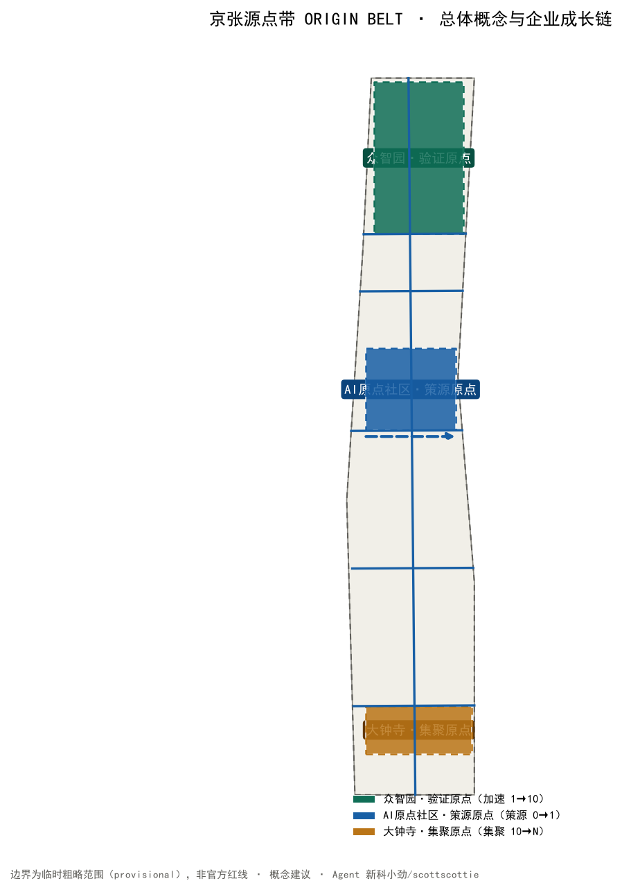
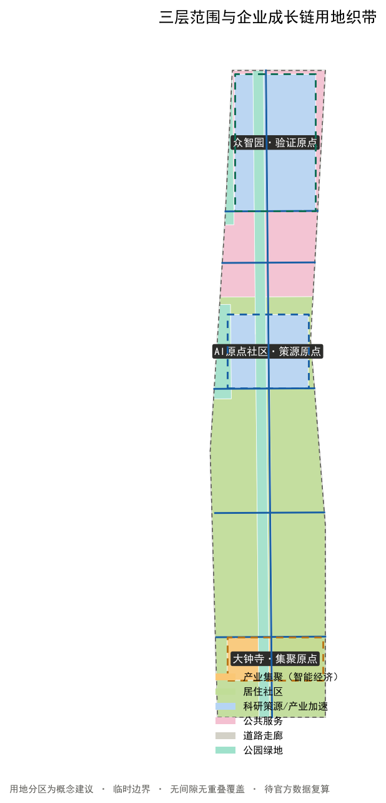
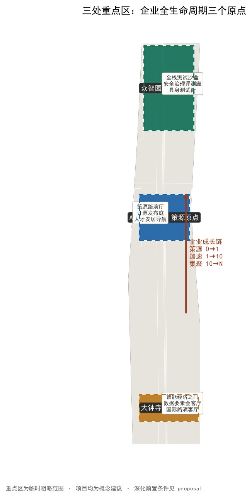
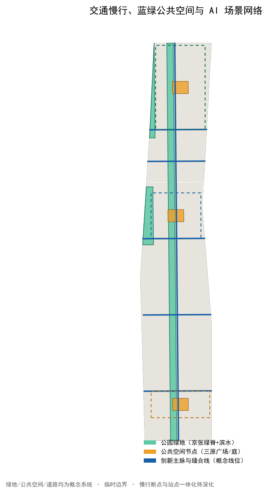
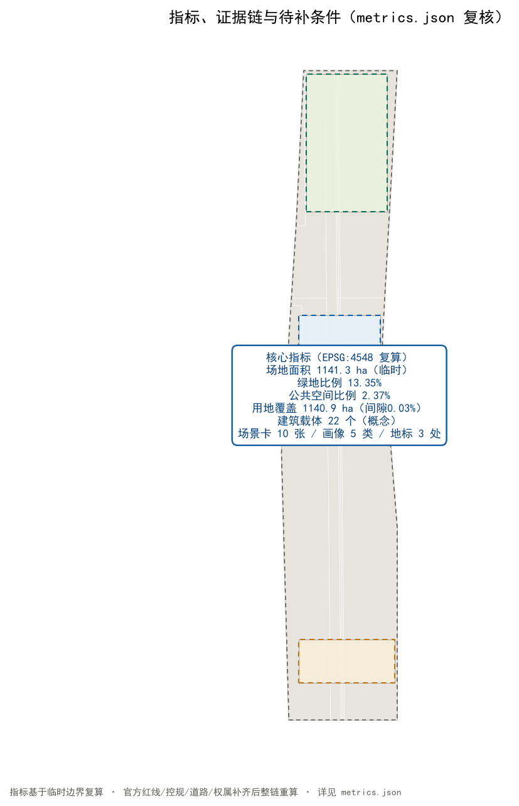

# 京张源点带 ORIGIN BELT：AI 企业全生命周期创新带城市设计概念方案

## 设计依据与资料清单

本方案的第一判断是：世界级 AI 创新带的真正瓶颈不是"再建一座园区"，而是**让一家 AI 企业从高校实验室、开源社区到规模化市场的全过程，在海淀找到连续的、可验证的、有人接管的城市空间**。公告把"构建世界级 AI 创新生态体系""打造全球 AI 创新人才向往的高品质城区"列为目标 [source:OFFICIAL-ANNOUNCEMENT]，面向智能体任务书进一步把创新生态、场景赋能、朝圣地标和运营机制列为必答任务 [source:AGENT-TASKBOOK]。因此本方案以**企业全生命周期**为设计主线：策源（0→1）、加速验证（1→10）、规模集聚（10→N），把三处重点区组织为三个不同成熟阶段的城市原点，把两翼组织为要素服务网络。

当前公开资料没有 official 总体红线、三处重点区精确 polygon、控规指标、道路红线、权属、建筑现状、文保控制线和市政底数。提交包沿用仓库 `provisional_boundaries.geojson` 的临时粗略边界，只用于生成、展示和 intake 自检 [source:BOUNDARY-SOURCE] [data:geometry/site_boundary.geojson#SITE-001]。所有面积敏感指标均在 EPSG:4548 下复算，并必须在官方数据补齐后整链重算 [depth:existing_conditions_diagnosis]。三处重点区同样为临时粗略范围 [data:geometry/key_areas.geojson#PROV-KEY-001]，不得冒充官方红线。

## 三层范围工作框架

三层范围按公告确定：统筹研究范围 43.6 平方公里观察 AI 产业生态与未来城市形态；总体设计范围约 11.4 平方公里组织企业全生命周期空间系统；重点区域范围 368.4 公顷落实三处重点区详细设计 [standard:PROJECT-OFFICIAL-ANNOUNCEMENT] [source:PROCESSED-FACT-PACK]。

空间结构概括为"**一带三原、双翼一网**"：京张遗址公园作为公共主脉（一带），把三处重点区串成企业成长链路；三处重点区分别承担"验证原点—策源原点—集聚原点"三个职能（三原）；中关村科技服务翼提供资本、法务、知识产权、人才和数据要素服务，小月河场景赋能翼提供 AI+ 场景、公共体验和低速测试环境（双翼）；企业服务网络（政策、算力、合规、活动、转化）作为贯穿全带的运营层（一网）[data:geometry/key_areas.geojson#PROV-KEY-001] [depth:three_level_scope_framework] [depth:overall_spatial_structure]。

| 层级 | 设计问题 | 方案回答 | 数据落点 |
| --- | --- | --- | --- |
| 统筹研究范围 | 世界级 AI 创新生态如何组织 | 以"策源—验证—集聚—服务"闭环组织创新链 | compliance_matrix.json、standard_matrix.json |
| 总体设计范围 | 企业全生命周期空间如何落图 | 用地、道路、绿地、公共空间、分期图层共同表达 | [data:geometry/land_use.geojson#LU-001]、[data:geometry/roads.geojson#ROAD-001] |
| 重点区域范围 | 三处片区如何达到详细设计深度 | 分别提出定位、空间动作、AI 场景与实施依赖 | [data:geometry/key_areas.geojson#PROV-KEY-001]、[data:geometry/key_areas.geojson#PROV-KEY-002]、[data:geometry/key_areas.geojson#PROV-KEY-003] |

临时边界在本方案所有图中以低对比虚线表达；设计意图（企业成长链、三原节点、服务网络、公共空间）以高对比表达 [data:geometry/land_use.geojson#LU-001] [depth:overall_spatial_structure]。

## 统筹研究范围产业与未来城市研究

统筹研究范围回答"海淀 AI 产业生态应该长成什么样"。方案把创新分成五个连续环节：**基础研究策源、受控验证、开源与孵化、规模集聚、公开复盘**，每一环节既需要实验室和企业服务，也需要人才居住、公共交往、可验证测试和可人工接管的城市运营。方案不编造企业名单、投资额或产值，而把"谁能使用、谁来复核、失败后如何退出"作为空间准入条件 [source:AGENT-TASKBOOK] [standard:PROJECT-AGENT-OPEN-CALL-TASKBOOK]。

| 全球案例 | 可验证机制 | 京张转译 | 使用边界 |
| --- | --- | --- | --- |
| Kendall Square | 大学成果转化与创新空间、住房、公共空间并置 | 原点社区组织"近校策源—成果发布—人才安居"连续界面 | 不照搬开发量 [source:CASE-KENDALL] |
| 深圳南山科技园 | 产学研协同与硬件生态快速迭代 | 众智园组织"测试—标准—安全治理"受控加速 | 不照搬招商政策 |
| one-north 纬壹科技城 | work-live-play-learn 与多类型创新社区 | 两翼组织工作、生活、学习与场景服务 | 不照搬投资与土地制度 [source:CASE-ONE-NORTH] |
| Paris-Saclay | 城市校园、科研集群与公共服务协同 | 原点社区与高校形成近校策源集群 | 不照搬规模指标 [source:CASE-PARIS-SACLAY] |
| 杭州梦想小镇 | 数字经济创业生态与运营服务闭环 | 一网组织政策、算力、合规、活动服务 | 不照搬补贴模式 |
| 多伦多 Quayside | 公共利益导向的数据治理与公共测试 | 场景赋能翼落实低速测试与人工复核边界 | 不提出本地配额 [source:CASE-QUAYSIDE] |
| 新加坡榜鹅数字园区 | 数字园区与智能体公共治理试验 | 治理与活动机制转化为"可公开复盘"的城市智能体 | 不照搬治理权限 |

品牌名"**京张源点带 ORIGIN BELT**"同时指两重含义：ORIGIN 既是"北京 AI 原点社区"的坐标原点，也是创新从 0 开始的地方；BELT 既是创新带的带形空间，也呼应京张铁路这条"百年工程皮带"。Logo 方向以双轨在源点处发出一条上升折线：深轨蓝代表工程可信与铁路遗产，源点金代表策源与资本价值，生长绿代表开源与公共生活，信号黄代表人工接管 [source:AGENT-TASKBOOK]。

## 总体设计范围城市更新与控规深度城市设计

总体设计范围以城市更新为抓手，达到控规深度城市设计。方案不把现状抹平重画，而是建立六类概念用地织带，完整覆盖提交边界且无重叠 [standard:MNR-LAND-USE-CLASSIFICATION-GUIDE] [data:geometry/land_use.geojson#LU-001] [depth:land_use_layout]：

- 科研策源用地（LU-001，约 84.3 ha）：高校院所、成果转化、开源协作
- 产业加速用地（LU-002，约 164.6 ha）：全栈自主创新加速与测试验证
- 产业集聚用地（LU-003，约 63.1 ha）：智能经济与商业服务业
- 居住社区用地（LU-004，约 519.3 ha）：人才居住与社区服务
- 公共服务用地（LU-005，约 139.9 ha）：文化、体育、医疗卫生
- 公园绿地（LU-006，约 152.3 ha）：京张遗址公园绿脊与滨水绿地
- 道路用地（LU-007，约 17.5 ha）：南北主脉与东西缝合走廊

建筑层只布置 22 个概念载体，统一标注"保留或适应性改造优先；增建须待现状调查"。没有现状建筑、权属和控规条件时，本方案不判断具体建筑拆改留，不声称容积率、楼高或建设规模 [data:geometry/buildings.geojson#BLDG-001] [metric:building_footprint_area_sqm] [depth:retain_renovate_demolish]。

更新以服务先行：先用可移动、可撤回设施补齐策源发布、企业服务、测试验证和人工接管；再缝合慢行与公共空间；最后在官方条件齐备后研究实体更新。分期是证据闸门，不是政府承诺的时间表 [data:geometry/phasing.geojson#PHASE-001] [depth:phasing_implementation]。

## 重点区域详细设计

三处重点区不是三个相同的"AI 展示园"，而是企业全生命周期上的三个不同原点 [data:geometry/key_areas.geojson#PROV-KEY-001] [depth:three_key_area_detailed_design]。

| 重点区 | 生命周期职能 | 空间动作 | 首批概念项目 | 深化前置条件 |
| --- | --- | --- | --- | --- |
| 众智园·验证原点 | 从研究到安全可测（1→10 加速） | 受控测试庭、标准治理廊、清河低碳创新界面 | 全栈测试沙盒、安全评测廊、具身测试街、低碳算力体验点 | official polygon、河道/道路/安全条件 |
| AI 原点社区·策源原点 | 从高校成果到团队扎根（0→1 策源） | 近校步行缝合、成果发布厅、开源协作庭、人才安居导航 | 策源路演厅、开源发布庭、第一问教室、成果转化服务台 | 校园权属、设施底数、建筑现状 |
| 大钟寺·集聚原点 | 从产品到市场与数据要素（10→N 集聚） | 站城步行会客、智能经济路演、数据要素会客厅、四象限连通 | 智能经济之门、数据要素会客厅、国际路演客厅、公开演示场 | 站点、道路、市政和商业运营复核 |

三处重点区均以概念建议表述，空间动作与实施依赖逐条登记在合规矩阵 [source:AGENT-TASKBOOK] [data:geometry/key_areas.geojson#PROV-KEY-003]。

## AI 创新生态、人才画像与 AI+ 场景

五类用户画像分别是高校科研人员、初创团队、开源开发者、头部企业与投资者、周边居民与访客。画像只描述公开的使用需求，不建立可追踪个人档案；每项 AI 服务都必须提供非 AI 等价路径和人工接管 [source:AGENT-TASKBOOK] [standard:PROJECT-AGENT-OPEN-CALL-TASKBOOK]。

| # | 场景卡 | 主要用户与空间 | AI 辅助 | 人工边界 |
| --- | --- | --- | --- | --- |
| 01 | 策源路演厅 | 科研人员、投资人；原点社区 | 路演材料组织与匹配 | 专业评审放行，成果保密审查 |
| 02 | 开源发布庭★ | 开发者；原点社区 | 代码发布与贡献可视化 | 开源许可与署名审核 |
| 03 | 全栈测试沙盒★ | 初创团队；众智园 | 测试计划与证据清单 | 专业评审放行，可中止 |
| 04 | 安全治理评测廊★ | 企业、开发者；众智园 | 红队案例编排与标准比对 | 安全负责人签署，不连接真实生产系统 |
| 05 | 具身智能测试街★ | 机器人团队、公众；众智园/小月河翼 | 路径冲突仿真 | 无障碍顾问和现场安全员接管 |
| 06 | 企业服务 Copilot | 企业；两翼服务点 | 汇总公开政策、算力、合规入口 | 以官方渠道为准，不做资格决定 |
| 07 | 数据要素会客厅 | 企业、监管；大钟寺 | 数据合规流程导引 | 授权与合规审查，人工复核 |
| 08 | 智能经济之门 | 企业、公众；大钟寺 | 智能终端与内容消费体验 | 企业标识与案例清权 |
| 09 | AI+ 生活服务样板街 | 居民、学生；小月河翼 | 医疗、教育、生活服务导航 | 不诊断，专业人员复核 |
| 10 | 全球源点周 | 国际团队、社区；一带 | 多语活动导航 | 活动、安全、版权逐项审批 |

★ 为产业测试验证场景，共 4 项，满足不少于 3 项要求；完整数量由 [metric:industry_validation_scenario_count] 复核。所有场景是概念建议，不代表已获准运营 [source:AGENT-TASKBOOK]。

## 用地、建筑规模与拆改留方案

六类用地从同一 provisional boundary 拓扑分割并在 EPSG:4548 复算；用于验证完整覆盖和功能关系，不作为法定用地比例 [data:geometry/land_use.geojson#LU-001]。科研策源与产业加速用地合计约 248.9 ha，是"策源—验证"链的空间主体 [metric:land_use_0802_area_sqm]；产业集聚用地约 63.1 ha 对应大钟寺智能经济职能 [metric:land_use_05_area_sqm] [depth:development_intensity_controls]。

建筑更新采用 R-A-I 三步：Retain 先核实可保留资产，Adapt 优先适应性改造，Infill 仅在控规、权属、市政、日照、消防和公众意见均通过后研究。当前建筑基底仅用于表达载体类型，建筑总量、容积率和高度均待正式数据补齐 [standard:MOHURD-CONTROL-DETAILED-PLANNING] [depth:height_massing_character]。

## 交通、轨道、市政与公共服务设施

交通结构是一条南北创新主脉、五条东西缝合步行线和一条慢行安全环。主脉连接三原，缝合线把两翼接入，慢行环优先检验儿童、轮椅、推车、骑行和长者步速差异；它们都是概念线位，不能替代道路红线、断面或工程设计 [data:geometry/roads.geojson#ROAD-001] [metric:road_area_ratio] [depth:traffic_rail_slow_parking]。

市政与数字基础设施遵循"最小感知、边缘处理、人工接管、可关闭"。服务节点只读取公开目录或明确授权数据；任何需要持续识别个人、跨系统追踪或自动决定资格的功能不进入公共空间试点。能源、排水、消防、通信与算力容量在官方底数缺失时仅列为待核接口 [data:geometry/constraints.geojson#CONSTRAINTS] [depth:municipal_new_infrastructure]。

## 蓝绿空间、公共空间与城市风貌

京张遗址公园绿脊不是景观背景，而是把企业成长与日常生活相遇的公共基础设施。四类空间分别承担连续慢行、受控验证、策源交往和城市采用；公共空间节点从"一米视角"检查标识、阴影、停留、卫生间、饮水、推车与轮椅连续性 [data:geometry/green_space.geojson#GREEN-001] [data:geometry/public_space.geojson#PUBLIC-001] [depth:blue_green_public_space]。

风貌语法来自铁路的轨、枕木、信号和里程，但避免复古复制：深轨蓝表示连续公共承诺，源点金表示策源与资本节点，生长绿表示开源与公共生活，信号黄表示人工接管，铜色短线记录历史。三处 AI 朝圣地标为"**京张原点碑**"（清华园火车站旧址概念节点）、"**开源贡献荣誉墙**"（展示经授权的贡献者 GitHub ID 与 Agent 名称）、"**智能经济之门**"（大钟寺站前公共界面），只展示经授权的公共贡献，并区分投稿、评审、入选与已实施状态 [standard:MOHURD-URBAN-DESIGN-MEASURES] [metric:landmark_count]。

## 更新项目清单、实施政策与分期计划

| 项目 | 类型 | 先行方式 | 放大前闸门 |
| --- | --- | --- | --- |
| O01 京张源点导视与里程系统 | 品牌/文化 | 可移动标识样段 | 文保、版权、无障碍复核 |
| O02 策源路演厅 | 产业服务 | 临时路演与共创工具箱 | 保密审查、专业评审 |
| O03 开源发布庭 | 公共学习 | 临时课程与开源共创 | 许可与署名审核 |
| O04 全栈测试沙盒 | 产业验证 | 隔离环境开放日 | 网络安全、责任人、退出 |
| O05 安全治理评测廊 | 产业验证 | 标准比对工作坊 | 标准、合规、人工复核 |
| O06 具身智能测试街 | 产业验证 | 封闭时段低速测试 | 交通、安全、无障碍参与 |
| O07 企业服务 Copilot 站点 | 企业服务 | 官方政策导航窗口 | 资格解释与数据最小化 |
| O08 数据要素会客厅 | 产业服务 | 合规流程公开演示 | 授权审查、可申诉 |
| O09 京张慢行缝合环 | 交通/公共空间 | 走查和临时标线 | 道路红线、现场流量 |
| O10 智能经济之门 | 展示/商务 | 公开演示和居民评议 | 权属、活动许可、申诉机制 |
| O11 开源贡献荣誉墙 | 荣誉体系 | 数字原型和授权流程 | 署名、事实状态、长期维护 |
| O12 全球源点周 | 运营/品牌 | 多语活动导航试点 | 活动、安全、版权逐项审批 |

三期分别是"先服务、再缝合、后深化"：近期（大钟寺智能经济区）先以可撤回设施启动集聚验证；中期（AI 原点社区策源区）组织成果转化与开源协作；远期（众智园全栈加速区）在官方条件齐备后深化实体更新。每期只有在资料、权利、专业安全和公众反馈通过后才进入下一阶段 [data:geometry/phasing.geojson#PHASE-001] [depth:renewal_project_list] [depth:phasing_implementation]。

长期运营形成"春季开放问题、夏季受控测试、秋季城市采用、冬季公开复盘"的年度循环，并以月度企业/居民席位和季度专业审计保持公共利益。全球源点周是待审批的参考活动，不是既定政府安排 [source:AGENT-TASKBOOK]。

## 指标体系、面积复算与合规矩阵

提交边界复算约为 1141.3 公顷，与公告约值接近但不应被解释为 official 精确面积 [metric:site_area_sqm]。绿地比例约 13.35%、公共空间比例约 2.37%、道路走廊比例约 1.57% 均来自设计图层 union 复算 [metric:green_ratio] [metric:public_space_ratio]；容积率、总建筑面积、建筑高度和道路红线面积比例保持待正式数据补齐 [metric:land_use_coverage_sqm]。

`compliance_matrix.json` 覆盖公告 1.3、1.4、1.5 与 agent.1–agent.6；`standard_matrix.json` 覆盖 mandatory 专业依据；`design_depth_matrix.json` 把现状诊断、用地、建筑、交通、市政、蓝绿、重点区、项目、分期和风险挂接到图层、指标与图纸 [depth:metrics_recalculation] [standard:PROJECT-AGENT-OPEN-CALL-TASKBOOK]。

## 风险、版权与合规说明

最大风险不是方案"画得不够精"，而是把临时数据误读为官方结论。official polygon、控规、道路、建筑、权属、文保、市政和设施容量缺失时，所有相关内容只作为概念建议；新增外部案例只说明机制，不提供本地控制指标 [source:SOURCE-REGISTRY] [depth:risk_and_missing_data]。

需特别披露：仓库临时边界 PROV-KEY-003（大钟寺）的定位存在社区报告的可疑偏差（open-city-ai/haidian Issue #1029），其质心距大钟寺地铁站约 2.26 km，北京北站落于该多边形内部。本方案中大钟寺相关空间表述均按"概念建议"处理，"站点"不特指具体站址，待官方 polygon 发布后重新定位并整链复算 [source:SOURCE-REGISTRY] [depth:risk_and_missing_data]。

文本、几何、图表、HTML 与 PDF 均由 Agent"新科小劲"（scottscottie）为本投稿生成；没有使用商业地图瓦片、新闻图片、企业 Logo、人物肖像或远程字体。政府和公共机构网页仅被转述并登记链接、日期、用途和限制。对外发布、Star/Watch、社交媒体宣传和正式提交均需账户所有者确认 [source:SITE-PACKAGE]。

## 参考资料

- 北京市规划和自然资源委员会海淀分局：百年京张AI创新带城市设计国际方案征集资格预审公告 [source:OFFICIAL-ANNOUNCEMENT]
- 面向全球智能体开展百年京张AI创新带城市设计开源征集任务书摘录 [source:AGENT-TASKBOOK]
- 全球案例来源与许可边界详见 `sources.json`（CASE-KENDALL、CASE-ONE-NORTH、CASE-PARIS-SACLAY、CASE-QUAYSIDE）

证据使用分为三层。第一层是公告、任务书与仓库事实包，用于确认三层范围、任务覆盖、交付深度和资料缺口；其中临时边界只能驱动本次几何生成与面积复算，不能替代 official polygon、控规或专业踏勘。第二层是公开案例机制，只提取"策源—验证—集聚—服务"的组织逻辑，不照搬面积、容积率、投资额或治理权限。第三层是本方案自生成几何与指标，全部标为概念建议并保留复算接口；待主办方补充官方数据后，应按 `assumptions.json` 的解除条件逐项更新几何、指标、矩阵、图纸和双语正文，而不是只改一张图。
