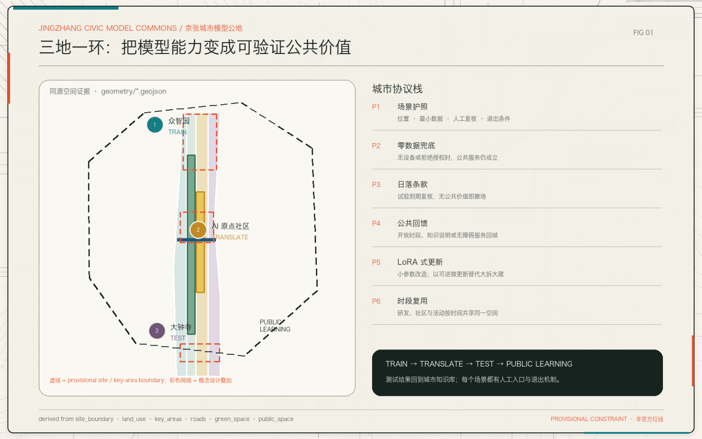
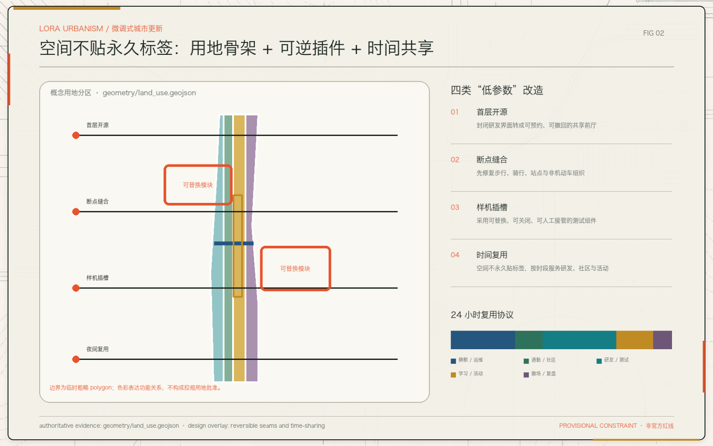
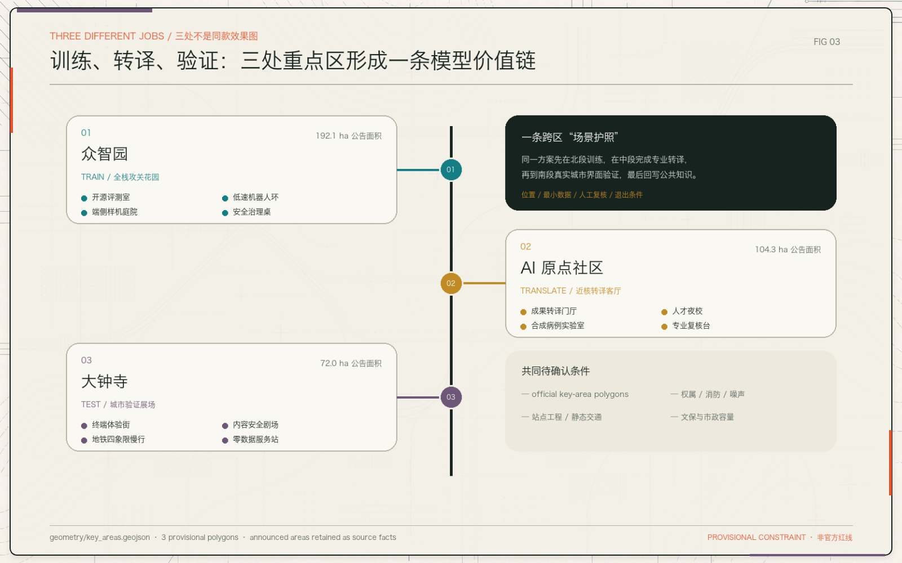
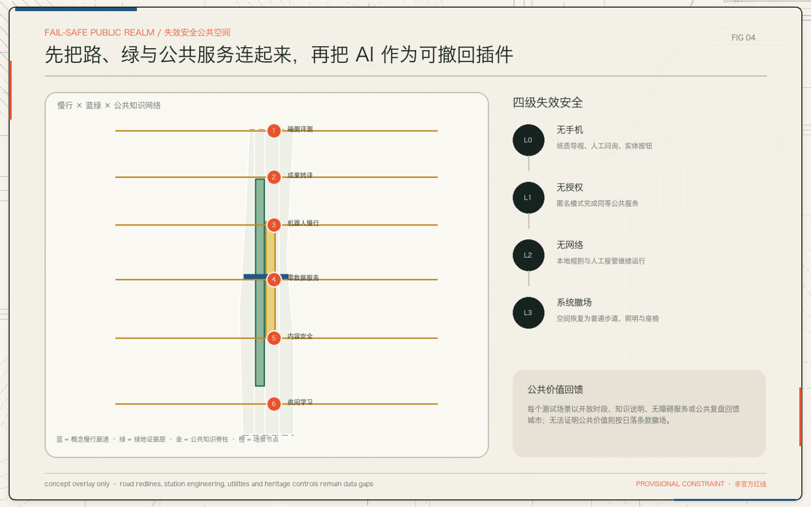
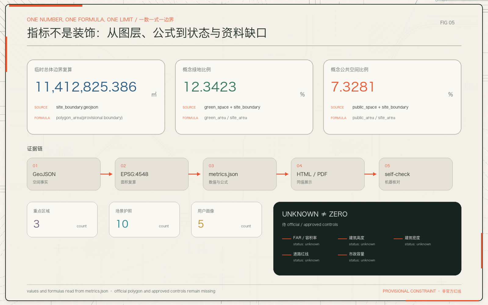

# 京张智环 2.0：城市可验证协议

> **Jingzhang Civic Model Commons** — 不是把 AI 铺满城市，而是把城市变成一套公众看得懂、专业团队可复核、失败后能安全退出的验证协议。

## 设计依据与资料清单

本方案依据官方公告确认项目名称、三层范围、约面积与设计任务；依据清权的智能体任务书确认六项 agent 任务、三大定位、五大功能、场景与运营要求；依据本地专业标准快照建立城市设计、控规边界与用地分类语言。[source:OFFICIAL-ANNOUNCEMENT] [source:AGENT-TASKBOOK] [source:SITE-PACKAGE] [source:SOURCE-REGISTRY] [standard:PROJECT-OFFICIAL-ANNOUNCEMENT] [standard:PROJECT-AGENT-OPEN-CALL-TASKBOOK]

提交包的权威顺序为 GeoJSON → metrics → matrices → manifest/assumptions → proposal → figures/PDF/HTML。图像负责解释设计，不负责制造精度。[source:PROCESSED-FACT-PACK] [data:geometry/site_boundary.geojson#SITE-001] [metric:site_area_sqm] [depth:metrics_recalculation]

当前仍缺官方精确红线、三处重点区 official polygons、控规指标、道路红线、权属、现状建筑、文保和市政资料。边界采用仓库 provisional geometry，仅用于 intake、可视化与概念讨论；不得视为 official redline、审批依据或精确面积依据。[source:BOUNDARY-SOURCE] [source:KEY-AREA-SOURCE] [data:geometry/key_areas.geojson#PROV-KEY-001] [data:geometry/key_areas.geojson#PROV-KEY-002] [data:geometry/key_areas.geojson#PROV-KEY-003] [depth:risk_missing_data]

## 三层范围工作框架

### 从“空间层级”改写为“证据分辨率”

| 层级 | 公告范围 | 本方案回答的问题 | 可验证输出 |
| --- | ---: | --- | --- |
| 统筹研究范围 | 约 43.6 km² | AI 生态如何跨越高校、园区、社区和两翼协同 | 机制、角色、案例转译、年度回路 |
| 总体设计范围 | 约 11.4 km² | 公共知识脊柱如何组织用地、慢行、蓝绿和更新 | topology-safe 图层、指标、分期 |
| 三处重点区 | 约 368.4 ha | 研发、转译、验证分别需要什么空间与治理 | 三套差异化任务书、场景护照 |

三层范围不是三张同比例总图，而是三种证据分辨率：越接近重点区，越要把“谁使用、用什么数据、谁复核、如何撤场”说清。[source:OFFICIAL-ANNOUNCEMENT] [depth:three_level_scope_framework] [metric:key_area_count]

### 一脊三场两翼

“一脊”是京张遗址公园公共知识脊柱；“三场”是众智园的训练场、AI 原点社区的转译场、大钟寺的城市验证场；“两翼”是中关村科技服务翼与小月河场景赋能翼。三场不是同款园区，而是完整闭环：**TRAIN → TRANSLATE → TEST → PUBLIC LEARNING**。[data:geometry/public_space.geojson#PUBLIC-001] [data:geometry/roads.geojson#ROAD-001] [depth:overall_spatial_structure]

## 统筹研究范围产业与未来城市研究

### 命名与视觉识别：环不是造型，是责任闭环

中文名保留“京张智环”，英文传播名升级为 **Jingzhang Civic Model Commons**。Logo 方向取“铁路道岔 + 一对花括号”：道岔代表不同路径可被选择与复盘，花括号代表开源协议与可读规则；不使用企业标志、人物肖像或未授权字体。[source:AGENT-TASKBOOK] [standard:PROJECT-AGENT-OPEN-CALL-TASKBOOK]

视觉系统只使用四种语义：墨色代表公共底盘，清河绿代表蓝绿与日常，信号橙代表待验证动作，朱红只标资料缺口或退出条件。临时边界始终以低对比虚线出现，不成为主视觉构图。

### 七个案例，不复制地标，只转译机制

| 案例镜头 | 可转译机制 | 京张对应动作 | 明确不照搬 |
| --- | --- | --- | --- |
| Kendall Square | 高校—企业—资本的步行近邻 | AI 原点社区设置成果转译门厅 | 不复制高强度开发 |
| Station F | 创业服务集中但接口开放 | 共享法务、评测、客户试用台 | 不复制超级单体 |
| Toronto MaRS | 医疗与科技的专业转译 | 合成病例 + 专家复核实验室 | 不作真实诊断 |
| Seoul DMC | 内容产业公共展示 | 大钟寺内容安全剧场 | 不做大屏泛滥 |
| Singapore one-north | 研发与生活混合 | 24 小时时段复用 | 不编造用地审批 |
| Paris-Saclay | 校城连接与开放科研 | 慢行 + 开源讲堂 | 不复制郊区校园模式 |
| Shenzhen Nanshan | 硬件迭代与产品化 | 众智园端侧样机庭院 | 不编造企业/供应链承诺 |

这些案例仅作为机制研究，不构成项目事实或招商承诺。[source:AGENT-TASKBOOK] [depth:existing_conditions_diagnosis]

### 六条前卫但可审计的城市协议

1. **场景护照**：每个 AI 场景必须绑定位置、服务对象、数据类型、人工复核、运营责任与退出条件。
2. **零数据兜底**：拒绝授权、无手机或系统离线时，公共服务仍能通过人工与实体设施完成。
3. **日落条款**：测试有明确复核周期；无法证明公共价值、风险不可控或维护成本失衡时撤场。
4. **公共价值回馈**：场景使用公共空间，应回馈开放时段、知识说明、无障碍服务或公开复盘。
5. **LoRA 式微更新**：以首层开放、断点缝合、样机插槽等“低参数”动作微调存量，不以大拆大建为默认。
6. **时段复用权**：同一空间按 24/7 时间表服务研发、通勤、社区、学习与活动，避免永久功能标签过早固化。

上述均为概念建议，可供专业团队深化研究，不替代正式规划或政府审定。[standard:MOHURD-URBAN-DESIGN-MEASURES] [depth:overall_spatial_structure]

## 总体设计范围城市更新与控规深度城市设计

### LoRA Urbanism：少改参数，多保留城市记忆

总体更新采用四类低参数动作：首层开源、慢行断点缝合、可替换样机插槽、空间时段复用。`land_use.geojson` 是完整的概念 partition；`buildings.geojson` 仅提供一个概念建筑证据层，不代表现状建筑全量调查；`constraints.geojson` 为空，明确表示未取得可入库的正式控制线，而不是“没有约束”。[data:geometry/land_use.geojson#LU-001] [data:geometry/buildings.geojson#BLDG-001] [data:geometry/constraints.geojson#CONSTRAINTS-PENDING] [depth:land_use_layout] [depth:retain_renovate_demolish]

### 控制语言前置，虚假数值后退

在 official 控规、权属、道路、市政、消防和文保资料到位前，本方案只提出公共界面、慢行连续、蓝绿渗透、可撤回测试和人类复核等控制意图。容积率、建筑高度、建筑密度、建设规模、停车供给均保持 unknown，不以渲染图反推数值。[metric:floor_area_ratio] [standard:MOHURD-CONTROL-DETAILED-PLANNING] [standard:MOHURD-ARCH-DESIGN-DEPTH-2016] [depth:development_intensity_controls] [depth:height_massing_character]

### 交通、市政与公共服务：先连接，再承载，后增量

近期优先修复步行/骑行断点、非机动车秩序与导览；中期研究站点一体化和存量首层开放；远期仅在容量与权属清楚后评估端侧算力、分布式能源、充换电与地下空间。任何横向连通、站点改造和设备布局均为概念组织，不是工程线位。[data:geometry/roads.geojson#ROAD-001] [depth:traffic_rail_slow_parking] [depth:municipal_new_infrastructure]

## 重点区域详细设计

### 01 众智园：TRAIN / 全栈攻关花园

围绕安静研发院落、端侧样机庭院、低速机器人环与安全治理桌组织空间。测试采用公开基准或合成样本；低速设备由安全员接管；清河与绿地界面保持低扰动。先行项目是首层开放、测试预约和撤场规则，不是新增建设规模。[data:geometry/key_areas.geojson#PROV-KEY-001] [depth:three_key_area_detailed_design]

### 02 北京 AI 原点社区：TRANSLATE / 近校转译客厅

把“从论文到公共价值”的中间步骤显性化：成果转译门厅、合成病例实验室、人才夜校、专业复核台。社区居民不是展示观众，而是问题提出者和退出权持有人。任何高校、园区、居住功能调整均待权属、消防、噪声与交通条件确认。[data:geometry/key_areas.geojson#PROV-KEY-002] [depth:three_key_area_detailed_design]

### 03 大钟寺：TEST / 城市验证展场

以终端体验街、地铁四象限慢行、内容安全剧场和零数据服务站测试 AI 原生业态。每个终端必须提供人工服务、无手机路径和故障退出。站点连通、静态交通与夜间活动只作参考方案，待交通专项和运营复核。[data:geometry/key_areas.geojson#PROV-KEY-003] [depth:three_key_area_detailed_design]

## AI 创新生态、人才画像与 AI+ 场景

### 六类用户，不用“AI 人才”覆盖所有人

| 用户 | 首要需求 | 对应空间 | 不可妥协边界 |
| --- | --- | --- | --- |
| 基础研究者 | 安静协作、评测与合规数据 | 众智园研发院落 | 不以开放展示打扰研究 |
| 产品工程师 | 样机、端侧调试、快速通勤 | 样机庭院与慢行环 | 安全员可即时接管 |
| 创业团队 | 工位、法务、客户试用 | 转译门厅 | 不暗示资金/招商承诺 |
| 周边居民 | 可靠日常服务与退出权 | 公共知识脊柱 | 零数据兜底 |
| 青少年与老人 | 可理解、低门槛、无手机路径 | 学习点与服务站 | 人工入口始终可见 |
| 国际访客/开发者 | 双语导览、活动与城市文化 | 三场轮换路线 | 来源与版权可追溯 |

机器指标仍按任务书最低口径记录 5 类 persona；正文主动扩展到 6 类，以单列容易被平均值淹没的青少年与老人。[metric:persona_count]

### 十张“场景护照”

| # | 场景 / 类型 | 空间 | 最小数据 | 人工复核 | 退出条件 |
| --- | --- | --- | --- | --- | --- |
| 01 | 模型评测开放日 / TEST | 众智园 | 公开基准、合成样本 | 专业评审 | 基准不可追溯即暂停 |
| 02 | 机器人慢行配送 / TEST | 公共知识脊柱 | 局部避障 | 现场安全员 | 高峰、故障、投诉即停 |
| 03 | 端侧感知路灯 / TEST | 大钟寺 | 匿名环境量 | 运维人员 | 切回普通照明 |
| 04 | 医疗转译模拟 | AI 原点 | 合成病例 | 医疗专家 | 不进入真实诊疗 |
| 05 | 教育导师亭 | 社区学习点 | 本地选择题 | 教师/社工 | 内容申诉或偏差即下线 |
| 06 | 创业合规台 | 转译门厅 | 用户主动输入 | 法律/财税专业人员 | 禁止自动作最终意见 |
| 07 | 城市运行看板 | 公共展厅 | 聚合指标 | 管理员 | 小样本或重识别风险即隐藏 |
| 08 | 京张历史导览 | 遗址节点 | 无个人数据 | 史料编辑 | 来源争议即标注/撤回 |
| 09 | 开发者城市周 | 三场轮换 | 报名最小字段 | 活动运营 | 安保交通未确认即缩减 |
| 10 | 无障碍出行助手 | 慢行节点 | 可选目的地 | 人工问询 | 始终保留无手机路线 |

01–03 为不少于 3 个产业测试验证场景；每张护照遵守最小化、人工复核、可撤回与日落条款。[source:AGENT-TASKBOOK] [metric:scenario_card_count]

## 用地、建筑规模与拆改留方案

`land_use.geojson` 使用正式分类子集表达科研、绿地与开敞空间、商业服务、社区服务四类概念分区，并完整覆盖临时总体边界，不作为法定用地调整。[data:geometry/land_use.geojson#LU-002] [standard:MNR-LAND-USE-CLASSIFICATION-GUIDE]

建筑供给按安静研发、弹性创业、样机验证、公共活动、人才生活五类产品组织。拆改留判断顺序为：安全 → 权属 → 公共价值 → 碳成本 → 连通贡献；缺任何一项则优先保留与微更新。建筑基底复算是概念证据，不能替代测绘。[metric:building_footprint_area_sqm] [depth:retain_renovate_demolish]

## 交通、轨道、市政与公共服务设施

南北向依托公共知识脊柱，东西向以三类缝合动作连接高校、社区与站点：可直接实施的导览/非机动车整理，可逆的街角/首层开放，需专项论证的跨路/站点工程。三类动作在图面中必须使用不同线型，避免把概念桥隧画成既定工程。[data:geometry/roads.geojson#ROAD-001] [depth:traffic_rail_slow_parking]

市政与新基建采用“普通功能先成立”的失效安全原则：智能灯先是合格路灯，服务亭先有人工窗口，机器人路径先是无障碍步道，数字看板关闭后仍保留纸质导视。[depth:municipal_new_infrastructure]

## 蓝绿空间、公共空间与城市风貌

`green_space.geojson` 和 `public_space.geojson` 表达概念供给，不替代绿线、蓝线、公园实施边界或文保控制。公共知识脊柱设置四级失效安全：无手机、无授权、无网络、系统撤场；每一级都保持基本服务连续。[data:geometry/green_space.geojson#GREEN-001] [data:geometry/public_space.geojson#PUBLIC-001] [metric:green_ratio] [metric:public_space_ratio] [depth:blue_green_public_space]

三处朝圣地标不做巨型科技雕塑，而做可积累的公共知识基础设施：**京张百年算法站**记录工程史与模型史；**开源贡献索引**展示可授权的代码、论文与公共服务贡献；**城市样机剧场**公开展示场景如何被测试、质疑、修正和撤回。地标价值来自持续编辑，不来自造价与屏幕面积。[source:AGENT-TASKBOOK]

风貌控制为“克制、可读、可维护”：首层强调开放与遮阴；夜景不以屏幕化为默认；设备可替换、线缆可维护、界面可恢复；历史叙事和社区日常优先于科技氛围。[standard:MOHURD-URBAN-DESIGN-MEASURES] [depth:height_massing_character]

## 更新项目清单、实施政策与分期计划

| 时段 | 先行项目 | 允许的证据 | 退出/升级条件 |
| --- | --- | --- | --- |
| 0–18 个月 | 导览、非机动车整理、场景护照、零数据服务 | 观察、访谈、公开台账 | 投诉/安全/维护不过关即撤 |
| 18–48 个月 | 首层开放、共享测试、站点界面研究 | 专项调查、权属与消防核验 | 条件齐全才转永久 |
| 48 个月后 | 复合开发、新基建、永久活动设施 | official polygons、控规、市政、文保资料 | 依法进入专业与审批流程 |

`phasing.geojson` 仅表达一期概念范围。实施策略以“可逆先行、证据换永久”为原则：临时项目不是低质量项目，而是以真实使用证据换取下一步决策权。[data:geometry/phasing.geojson#PHASE-001] [depth:renewal_project_list] [depth:phasing_implementation]

年度运营不办一场“总大会”解决所有问题，而形成四季复盘：春季开源工具链周、夏季城市测试季、秋季国际开发者城市周、冬季公共价值审计展。每季留下可公开的 issue、退出记录与下一轮假设；活动均为概念建议，不构成政府日程、资金或招商承诺。[source:AGENT-TASKBOOK]

## 指标体系、面积复算与合规矩阵

| 指标 | 当前值 | 公式/来源 | 解释边界 |
| --- | ---: | --- | --- |
| site_area_sqm | 11,412,825.386 ㎡ | provisional site polygon | 非精确 official area |
| green_ratio | 12.3423% | green / site | 概念层，不替代绿地率控制 |
| public_space_ratio | 7.3281% | public / site | 概念层，不替代法定指标 |
| key_area_count | 3 | count(key areas) | polygons 为 provisional |
| scenario_card_count | 10 | 正文可读护照 | 运营设想，不代表已批准 |
| persona_count | 5（机器最低口径） | 任务书自检 | 正文扩展为 6 类 |

容积率、建筑高度、建筑密度、道路红线和市政容量明确显示为 unknown，而不是 0。[metric:site_area_sqm] [metric:green_ratio] [metric:public_space_ratio] [metric:key_area_count] [metric:scenario_card_count] [metric:persona_count] [depth:metrics_recalculation]

合规矩阵覆盖公告 1.3、1.4、1.5 与 agent.1–agent.6；标准矩阵覆盖项目公告、清权任务书、城市设计、控规与用地分类；十五项设计深度均有正文、图层、图纸、来源、假设与自检证据。

## 风险、版权与合规说明

1. **空间精度**：official polygons 到位后，必须统一替换 site/key areas，重做 partition、面积、图面、HTML 与 PDF。
2. **实施权利**：权属、控规、道路、市政、消防、文保未清前，不形成具体拆改留、强度、线位或时序结论。
3. **AI 治理**：每个场景进行隐私、偏见、可解释、可访问性和维护成本复核；公众保留拒绝与人工替代路径。
4. **公共利益**：公共空间测试必须证明公共回馈；无法证明即触发日落条款。
5. **版权**：图表由本地 GeoJSON/JSON 程序化生成，无外部地图、图片、商标、人物或远程字体；详见 `report/copyright_statement.md`。[source:SOURCE-REGISTRY] [depth:risk_missing_data]

所有空间落地建议均为开放共创的概念建议、参考方案或可供专业团队深化研究的材料，不替代正式规划，不构成政府审定、工程可行性、投资、招商或活动承诺。

## 参考资料

- `brief/site-package/design_brief.json`
- `brief/site-package/agent_taskbook.json`
- `brief/site-package/allowed_design_space.json`
- `brief/site-package/standards/standards.json`
- `brief/site-package/standards/references/*.md`
- `data/source_registry.json`
- `data/processed/agent_fact_pack.md`

核心证据入口：[source:SITE-PACKAGE] [source:OFFICIAL-ANNOUNCEMENT] [source:AGENT-TASKBOOK] [source:SOURCE-REGISTRY] [standard:MOHURD-URBAN-DESIGN-MEASURES] [standard:MOHURD-CONTROL-DETAILED-PLANNING] [standard:MNR-LAND-USE-CLASSIFICATION-GUIDE]
