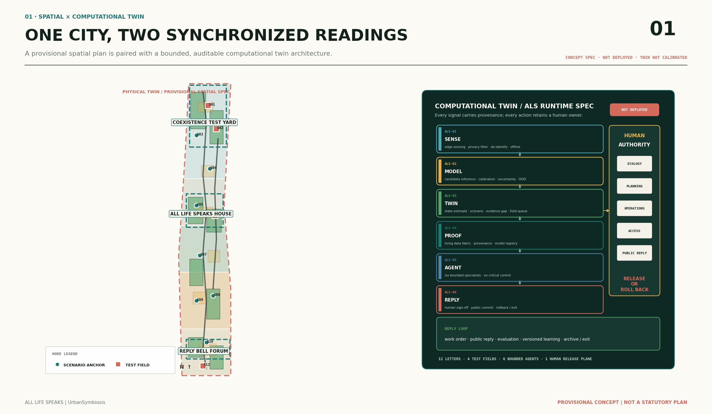
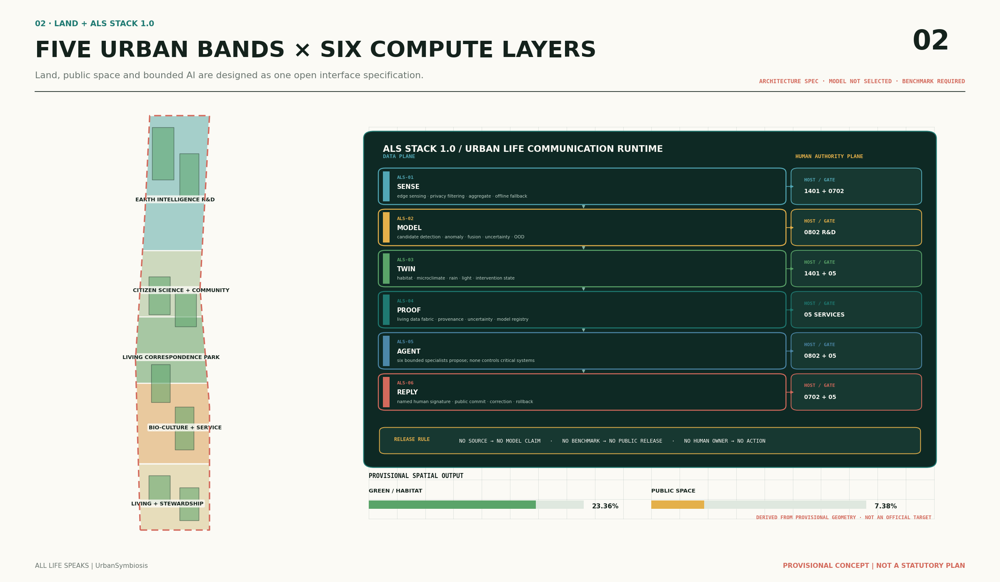
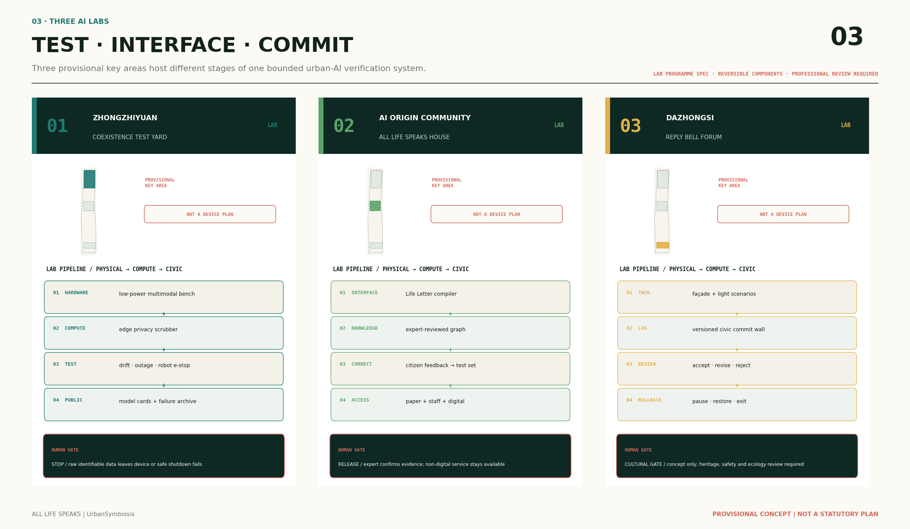
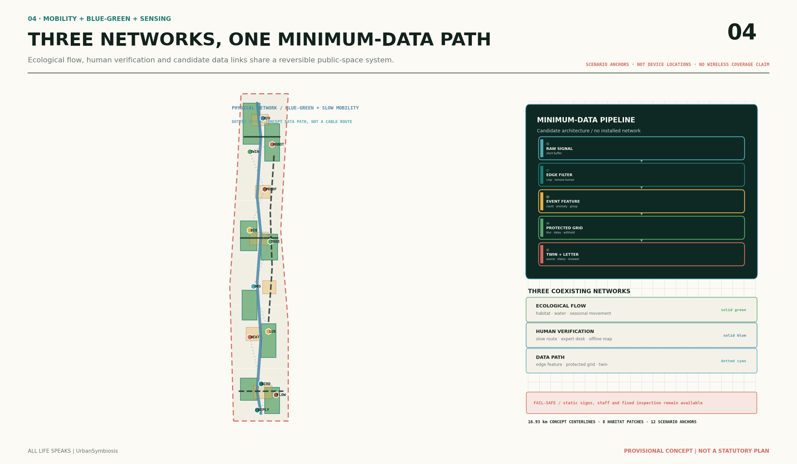
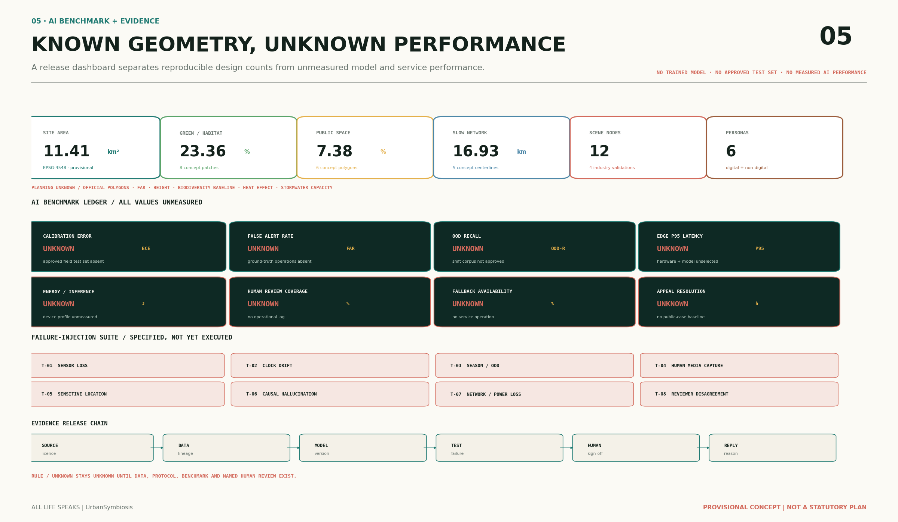

# ALL LIFE SPEAKS / 万物来信

**A multispecies urban-governance belt that senses, abstains, simulates, proceeds only with human authorization, and learns through continuous rollback**

“All Life Speaks” does not ask AI to impersonate nature or claim to speak for any species. It translates signals from water bodies, soils, trees, birds, insects, microclimates, and civic observations—signals that are normally fragmented and difficult to bring into governance—into “public letters” carrying provenance, version, spatial precision, uncertainty, abstention status, human signatures, and response records. Each letter passes through **edge sensing—evidence weaving—model assessment or abstention—twin simulation—agent deliberation—human authorization—public reply—evaluation and rollback**. AI is limited to recognition, synthesis, scenario comparison, and assistance with work-order drafting. It makes no statutory planning determination, engineering decision, medical diagnosis, public-security prediction, approval, or automated enforcement action. Every technical module, scenario, and spatial intervention is a future-oriented open-source conceptual architecture and a recommendation requiring validation. Nothing in this proposal means that the system has been deployed, achieved real-world performance, secured computing capacity, or been adopted by government, and nothing replaces formal planning or professional judgement.

## Design Basis and Source Inventory

The proposal first follows the development objectives, three levels of spatial scope, three key areas, and design tasks established by the official announcement. Its content framework also follows the agent-oriented taskbook’s three strategic positions, five core functions, Three Zones and Two Wings, and six mandatory tasks. [source:OFFICIAL-ANNOUNCEMENT] [source:AGENT-TASKBOOK] [standard:PROJECT-OFFICIAL-ANNOUNCEMENT] [standard:PROJECT-AGENT-OPEN-CALL-TASKBOOK] It also reads the site package, public Source Registry, and fact pack, distinguishing sources approved for formal use from background materials and provisional-only spatial materials. Processed tables serve only as navigation and are not elevated into new authoritative sources. [source:SITE-PACKAGE] [source:SOURCE-REGISTRY] [source:PROCESSED-FACT-PACK]

The repository currently contains no official polygons with a verifiable coordinate reference system for either the three levels of scope or the three key areas. This package therefore inherits, without modification, the maintainers’ approximate Provisional Boundary for the Overall Design Area and the three provisional key-area polygons. Their attributes remain `official_boundary=false` and `geometry_role=provisional_constraint`. Drawings show them as pale dashed constraints and do not present fitted areas or rectangular key-area placeholders as an Official Planning Boundary. [source:BOUNDARY-SOURCE] [data:geometry/site_boundary.geojson#PROV-SITE-001] [data:geometry/key_areas.geojson#PROV-KEY-001] `geometry/constraints.geojson` is an empty register of missing information. Its metadata records the outstanding Regulatory Detailed Planning, road, heritage, municipal, and property-rights data; it contains no control-line features. [data:geometry/constraints.geojson] This produces the first existing-conditions diagnosis: conceptual design may proceed for industry, scenarios, governance, and spatial structure, but the available evidence cannot support precise boundaries, statutory land use, development intensity, Demolish–Renovate–Retain decisions, engineering alignments, or investment sequencing. [depth:existing_conditions_diagnosis]

Professional expression follows the principles in the *Urban Design Management Measures* for coordinating the natural environment, history and culture, Public Space, and Urban Character. The Regulatory Detailed Planning compilation measures define the boundary between statutory controls, design recommendations, and information awaiting confirmation. Land-use codes use only the territorial spatial-planning classification subset registered in the repository. [source:STD-URBAN-DESIGN] [source:STD-CONTROL-PLANNING] [source:STD-LAND-USE] [standard:MOHURD-URBAN-DESIGN-MEASURES] [standard:MOHURD-CONTROL-DETAILED-PLANNING] [standard:MNR-LAND-USE-CLASSIFICATION-GUIDE] The narrative, nine GeoJSON layer types, metrics, three matrices, five core figures, A3/A0 documents, and offline HTML use the same feature IDs and indicators. External cases provide transferable mechanisms only; their data do not substitute for local Jing-Zhang surveys.



Figure 1. From living signals to public replies: one source for the spatial, data, and accountability chains. The Provisional Boundary is only a base for Content Review.

## Three-Level Scope Framework

The Coordinated Research Area is understood from the announcement as approximately 43.6 km². Its tasks are to frame the environmental-intelligence industrial chain, collaboration among Three Zones and Two Wings, the regional innovation network, and a long-term brand. The Overall Design Area is understood as approximately 11.4 km²; around the Jing-Zhang Railway Heritage Park it coordinates industry and space, Urban Renewal, transport and municipal systems, Blue-Green Space, Public Space, and Urban Character. The Key-Area Detailed Design Area is understood as approximately 368.4 ha, with a design proposition capable of further development for each of the three areas. The three levels correspond respectively to “ecological and industrial strategy—Urban Design structure—key-area scenarios and components”; they are not enlargements of the same master plan at different scales. [source:OFFICIAL-ANNOUNCEMENT] [depth:three_level_scope_framework]

Recalculation of the submitted boundary in EPSG:4548 gives 11,412,825.386 m². This value describes only the repository’s provisional polygon and is not a more precise version of the official approximate figure of 11.4 km². [metric:site_area_sqm] [data:geometry/site_boundary.geojson#PROV-SITE-001] The number of key areas is three; approximate areas in the announcement and calculated areas of the provisional polygons remain side by side and do not replace one another. [metric:key_area_count] [data:geometry/key_areas.geojson#PROV-KEY-002] Once the organizer releases official polygons, replacement must proceed as follows: register source, version, coordinate system, and transformation method; re-clip land use, buildings, roads, green space, public space, constraints, and phasing; then recalculate metrics and update all five figures, HTML, A3/A0 documents, and the manifest. Replacing only the boundary file is not sufficient.

The spatial transmission structure is “One Spine, Three Courtyards, Four-Season Archipelago, and Two-Wing Loop.” The spine is the Living Correspondence Spine along the Jing-Zhang Railway Heritage Park. The three courtyards are the Coexistence Test Yard in Zhongzhiyuan, the All Life Speaks House in the AI Origin Community, and the Reply Bell Forum in Dazhongsi. The Four-Season Archipelago consists of eight conceptual habitat patches on roofs, in courtyards, along water, and in parks. The Zhongguancun Technology Services Wing feeds standards, intellectual property, finance, talent, and data governance into the testing chain. The Xiaoyue River Scenario Enablement Wing returns environmental problems, field verification, and maintenance feedback to the R&D chain. [depth:overall_spatial_structure] This structure expresses collaborative relationships only; it does not infer existing river blue lines, heritage controls, road boundaries, or specific engineering interfaces.



Figure 2. Transmission from the three-level scope to the overall structure. The colored bands are a conceptual, complete Land-Use Layout and must not be read as approved Regulatory Detailed Planning.

## Industry and Future-City Research for the Coordinated Research Area

### Overall Concept, Naming, and Visual Identity

The primary name “All Life Speaks” establishes three naming levels: the overall brand is **ALL LIFE SPEAKS**; the spatial system is the **Living Correspondence Spine / 生命通信主脊**; and the governance protocol is the **Letter—Reply Protocol / 来信—回信协议**. The logo concept combines two railway lines, a water ripple, a branching leaf vein, and an open envelope. The twin lines represent the Centennial Jing-Zhang connection; the wave represents environmental signals; the branch represents multispecies life; and the opening represents public correction. The visual identity uses five colors—Night Ink, River Cyan, Pollen Yellow, Soil Ochre, and Verification White. Every public-facing item also displays three small labels—provenance, confidence, and human status—and never substitutes anthropomorphic expressions or species cartoons for evidence. System fonts are used. The logo, icons, and drawings are original geometric compositions and use no corporate mark or unauthorized image. The main belt logo remains fixed; wayfinding and event sub-identities may use its colors, postmarks, and status labels but may neither replace nor distort it or be confused with it. [source:AGENT-TASKBOOK]

The proposal reconnects the three strategic positions into one logical chain. The Centennial Jing-Zhang Cultural Belt tells how infrastructure evolves from transporting people and goods to conveying public knowledge. The metropolitan AI life-experience belt lets residents see and correct environmental intelligence. The AI convergence and innovation belt turns edge sensing, ecological robotics, digital twins, operation of nature-based infrastructure, and accountability-chain evaluation into an industry. The five core functions become a full stack for multimodal environmental AI; a global ecological-intelligence cooperation network; twelve Life Letter scenarios; perceptible four-season Public Space; and an AI-governance discourse with “provenance, review, appeal, and exit.” [source:AGENT-TASKBOOK]

### ALS Stack 1.0: Urban Living-Communication Technology Stack

**ALS Stack 1.0 / An Open Multispecies Urban Intelligence Stack** is the six-layer technical foundation of All Life Speaks. Its rule is: **Every signal has provenance. Every model has limits. Every action has a human owner.** The six modules are replaceable, offline-capable, versioned open interfaces, not a completed system. [metric:als_stack_module_count] They correspond one-to-one with `ALS-SENSE`, `ALS-MODEL`, `ALS-TWIN`, `ALS-PROOF`, `ALS-AGENT`, and `ALS-REPLY` in `visual/assets/als-stack.json`. The present machine-readable core also includes `visual/assets/life-letter.schema.json` and the synthetic example `visual/assets/example-water-letter.json`. Future interface contracts may be separated into objects such as `SignalPacket`, `ModelObservation`, `TwinScenario`, `ProofBundle`, `ActionProposal`, and `LifeLetter`; this version does not invent paths for files that do not yet exist.

| Layer | Module | Bounded technical responsibility | Machine-readable output |
| --- | --- | --- | --- |
| L1 | **ALS-SENSE / Edge sensing layer** | Multimodal collection of water, soil, canopy, bioacoustic, thermal, microclimate, and facility-state data; device-side range, clock, and quality checks, removal of faces and human speech, sensitive-location blurring, and offline caching | `SignalPacket` |
| L2 | **ALS-MODEL / Multimodal model layer** | Candidate time-series anomaly detection, visual segmentation, bioacoustics, open-set classification, and multimodal fusion; simultaneous output of calibration state, OOD status, missingness, and abstention | `ModelObservation` |
| L3 | **ALS-TWIN / Urban ecological digital-twin layer** | Organizes habitats, hydrological facilities, canopy, shade, lighting, walking/cycling, and operational status as a spatiotemporal scenario graph used only for versioned scenario comparison | `TwinScenario` |
| L4 | **ALS-PROOF / Living-evidence layer** | Registers event streams, sample chains, permissions, retention periods, source hashes, model registry entries, and an ecological knowledge graph within a living-data fabric, making every inference traceable and revocable | `ProofBundle` |
| L5 | **ALS-AGENT / Specialist multi-agent layer** | Six bounded specialist agents propose recommendations or assemble review packets within a tool allowlist; a rules engine checks overreach and evidence gaps | `ActionProposal` |
| L6 | **ALS-REPLY / Human authorization and reply layer** | Manages human signatures, appeals, withdrawal, rollback, the public Commit Log, and post-evaluation; unsigned recommendations cannot become governance actions | `LifeLetter`, `ReplyCommit` |

The six agents are divided by public responsibility, not by model spectacle. [metric:specialist_agent_count] `WATER-AGENT` handles water and microclimate time series; `HABITAT-AGENT` handles trees, birds, insects, soil, and small animals; `NBS-OPS-AGENT` generates only inspection priorities and work-order drafts for nature-based infrastructure; `EVIDENCE-GUARD` checks provenance, version, OOD status, and expiry dates; `CIVIC-RAG-AGENT` retrieves only from rights-cleared local materials and public rules; and `REPLY-ORCHESTRATOR` assembles verified materials, dissenting views, and human review packets. Accessibility, safety, ecology, planning, and frontline operations remain professional roles that must enter the human gate; they are not fictional autonomous agents. No agents may turn mutual voting into an automated decision, expand their own purposes, invoke unauthorized tools, control critical facilities, close work orders, allocate budgets, or rank individuals and businesses.

### Life Letter Protocol: Machine-Readable Correspondence Protocol

The Life Letter Protocol is currently represented by the `0.1.0` draft in `visual/assets/life-letter.schema.json`. It is a proposed open protocol, not a literary label. [metric:machine_readable_protocol_count] Each letter must include `schema_version`, `letter_id`, `letter_type`, `status`, `signal`, `model`, `runtime`, `evidence`, `governance`, `public_interpretation`, and `disclaimer`. The signal block registers its time window, spatial precision, fields, personal-data status, and quality flags. The model block registers ID, version, hash, input contract, confidence, calibration, OOD status, and abstention. The runtime block registers edge processing, isolation from critical controls, and deployment status. The evidence block registers provenance, hashes, missing evidence, and sensitive-location protection. The governance block registers the human role, signature, decision Diff, appeal, non-AI fallback, expiry, and rollback status. Status may move only according to rules among `received`, `model_abstained`, `verification_required`, `awaiting_review`, `verified`, `responded`, `monitored`, `not_adopted`, `trial_stopped`, `rolled_back`, `revoked`, and `archived`. Insufficient evidence or OOD input leads to `model_abstained` or `verification_required`, with confidence allowed to be `null`; a responsible role may then move it to `awaiting_review`. A responded matter may close, roll back, or be revoked after `monitored`. “Unknown” is preferable to fluent prose that conceals an evidence gap.

```json
{
  "schema_version": "0.1.0",
  "letter_id": "SYNTHETIC-WATER-001",
  "letter_type": "water",
  "status": "verification_required",
  "signal": {
    "signal_type": "multivariate_environmental_timeseries",
    "time_window": null,
    "spatial_resolution": "provisional_field_test_point",
    "feature_names": ["water_temperature", "turbidity", "conductivity", "dissolved_oxygen", "rainfall"],
    "contains_personal_data": false,
    "synthetic": true,
    "quality_flags": ["no_local_observation", "sensor_calibration_required"]
  },
  "model": {
    "model_id": "ALS-WATER-ANOMALY-CONCEPT",
    "model_version": "0.1-concept",
    "model_hash": null,
    "input_contract_version": "0.1.0",
    "model_family": "multivariate_time_series_anomaly_detection",
    "confidence": null,
    "calibration_status": "pending_benchmark",
    "out_of_distribution_status": "unknown",
    "abstained": true
  },
  "runtime": {
    "compute_mode": "edge_first_local_federation_concept",
    "edge_processed": true,
    "critical_control_connected": false,
    "deployment_status": "concept_only_unvalidated"
  },
  "evidence": {
    "source_ids": [],
    "source_hashes": [],
    "provenance_hash": null,
    "missing_evidence": ["authorized_sensor_data", "field_calibration", "professional_sampling", "local_baseline"],
    "sensitive_location_protected": true
  },
  "governance": {
    "human_reviewer_role": "water_environment_professional",
    "human_decision": "pending",
    "human_signature_status": "not_signed",
    "reason": null,
    "decision_diff_available": false,
    "correction_route": "offline_service_desk_or_public_correction_queue",
    "appeal_status": "available",
    "non_ai_fallback": "fixed_frequency_manual_sampling_and_inspection",
    "expires_at": null,
    "rollback_state": "no_AI_output_manual_baseline"
  },
  "public_interpretation": "Synthetic protocol example; no local observation.",
  "disclaimer": "Conceptual example only; benchmark and human authorization required."
}
```

### Spatial–Computational Twin

The spatial twin and computational twin share object IDs but carry different responsibilities. The spatial twin describes habitat patches, Public Space, walking/cycling intentions, facility relationships, and the three key areas inside the Provisional Boundary. The computational twin describes devices, data contracts, model versions, agent permissions, assumptions, scenarios, signatures, and rollbacks. A simulation must save its spatial version, data time window, model hash, parameters, missing fields, and human-edit Diff before it can enter comparison. In the absence of an Official Boundary, existing-condition survey, or professional model, it may run only candidate “if–then” scenarios and cannot output quantities, ecological performance, or control conclusions. [depth:overall_spatial_structure] The coupled twin turns One Spine and Three Courtyards from a display route into a traceable open experimental topology of “sense—simulate—human authorization—field validation—feedback.”

### Eight Global Cases: Six Primary and Two Technical References

| Case | Verifiable mechanism | Translation to Jing-Zhang | Limits of use |
| --- | --- | --- | --- |
| Singapore TreesSG + ENTS | A digital inventory of urban trees connects public interaction; a research forest uses IoT, LiDAR, multispectral sensing, drones, and weather equipment to study tree growth, climate, and health | Create a “public living map—professional maintenance register—research habitat island” | Do not scrape the complete database or copy interfaces or images; the local tree baseline awaits survey [source:CASE-TREESSG] |
| Tallinn–Helsinki GreenTwins | A dynamic vegetation digital twin represents growth and seasonality, while the Virtual Green Planner supports co-design | Establish a small dynamic-vegetation test site in each key area to compare seasonal change, shade, and maintenance options | The project ended in 2023; verify licenses asset by asset [source:CASE-GREENTWINS] |
| Urban ReLeaf | Six pilot cities conduct citizen-science activities around heat, air, trees, and green-space sensing, aiming to incorporate civic observations into official data flows and policy processes | Use “public observation—expert quality control—governance reply,” not direct crowdsourced decision-making | It is not an AI project; participation and environmental data require informed consent and quality review [source:CASE-URBAN-RELEAF] |
| Chicago Array of Things | Public environmental-sensing and edge-computing nodes support selected local image analysis and transmit only counts rather than raw images; specific processing remains governed by project privacy policies | Create edge listening posts that do not identify people, with public device notices and an oversight structure | Do not describe a phased experiment as permanent citywide operation; strictly minimize audio and images [source:CASE-AOT] |
| Amsterdam RESILIO | Approximately 10,000 m² of intelligent blue-green roofs manage stormwater through sensors, a DSS, and connected operations | Conceptually explore an operational interface linking “rooftop reservoir—insect garden—public observation deck” | A DSS is not necessarily machine learning; loading, waterproofing, ownership, and water-management conditions all await review [source:CASE-RESILIO] |
| Germany AMMOD | Multimodal stations combine animal images, bioacoustics, odors, pollen/spores, and DNA barcoding, with AI-assisted identification | Validate multimodal environmental intelligence in Zhongzhiyuan, deploying only low-disturbance, clearly permitted subsets in Public Space | Nationwide coverage is an R&D objective, not an existing network; eDNA and insect trapping require specific permits [source:CASE-AMMOD] |
| BirdNET (supporting) | Large-scale bioacoustics, geographic and temporal priors, edge deployment, and human-review tools | A “bird letter” uses a candidate taxon group, confidence, and expert confirmation | Human speech must be removed on-device; verify the licenses of models, code, and recordings separately [source:CASE-BIRDNET] |
| SlothBot (supporting) | A solar-powered, slow-moving, long-duration cable robot is an ecological research prototype | Translate it into principles for a low-energy ecological-robot trial without copying its form | A research prototype is not a mature product and has not proved conservation impact [source:CASE-SLOTHBOT] |

The eight cases become eight design elements rather than eight promotional images. Land uses reversible test plots and attachments to existing public facilities. Space uses research yards, a community post office, habitat islands, and public verification desks. Industry links sensors—edge chips—models—robots—digital twins—operations platforms—governance evaluation. Finance is limited to the recommendation that “research topics, renewal budgets, corporate public-benefit or co-benefit contributions, and operational procurement be separately accounted”; no public funding or investment attraction is promised. Talent combines ecology, landscaping, water, planning, AI, ethics, accessibility, and frontline maintenance. Computing prioritizes device-side de-identification and offline operation. Data produce field dictionaries, Model Cards, location protection, and failure records. Each scenario must generate a public reply in the field. This ecosystem map gives environmental intelligence a sufficiently explicit industrial core and prevents the proposal from collapsing into generic landscape greening. [depth:overall_spatial_structure]

Regional collaboration is organized around problems and interfaces rather than lists of companies. Universities and research institutes contribute methods, labels, and professional review. The Future Science City, Huairou Science City, and the Beijing Economic-Technological Development Area could establish open challenges around environmental-sensing hardware, robotics, and validation methods. Cities across Beijing–Tianjin–Hebei could exchange de-located Model Cards, Data Sheets, and failure cases. Every collaboration requires separate confirmation of participants, licenses, and resources and is not presented as an arrangement already reached.

## Urban Renewal and Regulatory Detailed Planning-Depth Urban Design for the Overall Design Area

Five shared cut lines completely divide the provisional boundary into conceptual land-use bands: 0802 environmental-intelligence R&D and validation in the north; 0702 citizen science and community services around the AI Origin; 1401 Jing-Zhang Living Correspondence Park in the middle; 05 biocultural and intelligent services in the south-central section; and 0701 coexistence living and talent housing in the south. Their union covers the submission boundary without overlap and tests the relationships among industry, everyday life, and Public Space. The codes follow unified classification semantics but do not describe current or approved land use. [data:geometry/land_use.geojson#LU-001] [depth:land_use_layout]

Urban Renewal is driven not by demolition and construction counts but by “inventory first, reuse second, experiment last.” The first layer inventories existing buildings, property rights, vacancy, ground-floor interfaces, roof conditions, and historical value. The second gives safely usable space priority for time-sharing, ground-floor opening, add-on equipment, and reversible components. Only the third considers renovation or supplementary construction after professional assessment. The current building layer places only nine conceptual functional prototypes to test the spatial relationships among R&D, community, culture, and operations. They represent no existing building and no decision to retain, renovate, demolish, or construct on a specific parcel. [data:geometry/buildings.geojson#BLDG-001] [depth:retain_renovate_demolish]

Development Intensity, total floor area, Building Height, Building Coverage Ratio, green-space ratio, and setbacks remain unknown because official Regulatory Detailed Planning, existing-building, and property-rights data are absent. [depth:development_intensity_controls] Building form follows principles open to further design: volumes near the heritage corridor and habitat interface should be continuous without becoming over-monumental; roofs should prioritize reversible blue-green facilities, low-glare equipment, and public observation; ground floors should strengthen transparent human services and equipment notices; and all sound, lighting, glazing, materials, and heights require heritage, bird-friendly, thermal-environment, fire, and accessibility review. [depth:height_massing_character]

For transport, the Living Correspondence Spine connects the Three Zones; three east–west conceptual links address stitching in Zhongzhiyuan, the AI Origin Community, and Dazhongsi; and a Xiaoyue River scenario branch connects field validation with R&D. Alignments show only “what should be connected” and do not replace road boundaries, station engineering, bridge/tunnel design, or traffic organization. [data:geometry/roads.geojson#ROAD-001] New Infrastructure follows a minimum-device rule: edge listening posts, field verification desks, device-side computing cabinets, environmental sensors, and manual work-order signs share reversible interfaces. AI does not automatically control critical municipal facilities; failure returns the system to fixed rules and manual inspection. [depth:municipal_new_infrastructure]

The overall Urban Character is not a “green high-tech skin”; it makes verification status a visible urban language. Unverified letters use dashed grey-white; expert-confirmed letters become River Cyan; a public reply adds a Pollen Yellow timestamp; and a stopped trial is archived in Soil Ochre. Components of the century-old railway inform narrative scale and linear order but are not copied as heritage objects. Specific heritage relationships remain subject to official conservation materials and professional opinion. [standard:MOHURD-URBAN-DESIGN-MEASURES]

## Key-Area Detailed Design

### Three Laboratories and Their Coupled-Twin Roles

The three key areas do not repeat screens and sensors. They are three complementary laboratories for ALS Stack. Zhongzhiyuan asks whether a model can operate credibly. The AI Origin Community asks whether ordinary people can understand, correct, and leave the system. Dazhongsi asks whether the city can explain why it adopts, rejects, or rolls back a recommendation. A shared Life Letter ID, model version, and Reply Commit connect them, while their data permissions, degree of spatial openness, and human gates differ. [depth:three_key_area_detailed_design]

| Key area | Laboratory role | Main technical objects | Human authorization gate | Public outputs |
| --- | --- | --- | --- | --- |
| Zhongzhiyuan | **Multispecies AI Test Yard / 多物种 AI 测试场** | Edge devices, low-energy models, ecological robots, ALS-TWIN, model registry, fault injection, and red teaming | Joint confirmation by data, ecology, safety, and frontline operations before anything leaves the controlled area | Model Card, Device Passport, Failure Manifest |
| AI Origin Community | **Living AI Interface Lab / 生活智能界面实验室** | Life Letter compiler, physical mailboxes, civic observation, expert labeling, accessible interfaces, and deletion interfaces | Participant consent, expert confirmation, and location protection by a data steward | Verified letters, human-edit Diffs, and deletion/correction records |
| Dazhongsi | **Civic AI Commit Forum / 城市智能提交论坛** | Bird/insect-friendly façades, an ecologically sensitive lighting twin, governance RAG, Reply Commit, and appeal replay | Signatures from building, heritage, ecology, lighting, safety, and accountable roles | Public logs of receipt, adoption, non-adoption, pause, rollback, and reasons |

### Zhongzhiyuan: Earth Intelligence and Coexistence Validation Yard

Zhongzhiyuan validates the complete ALS Stack. Two northern habitat islands combine with the Coexistence Test Yard as a reversible testing ground containing, in sequence, equipment rigs; zones for offline and drift faults; multimodal blind tests; an ecological-robot safe-stop segment; a nature-based-infrastructure agent sandbox; and a gallery of public failures. Space is graded into controlled R&D, shadow operation, semi-open demonstration, and public explanation. Before any device reaches the public level, it must display input fields, model version, data retention, the method for measuring energy per inference, who can switch it off, how it works offline, abstention conditions, and human takeover. All performance requires independent testing and remains `benchmark_required`. Qinghe-related narratives cite only tasks in the announcement and infer no river boundary, flood-control condition, computing supply, or specific interface. [data:geometry/key_areas.geojson#PROV-KEY-001] [data:geometry/public_space.geojson#PUBLIC-001]

Building recommendations first reactivate verifiable R&D, laboratory, and display spaces. The environmental-intelligence laboratory, ecological-robot workshop, and living-data governance studio among the nine conceptual footprints are functional prototypes only. External access is expressed as demand for a “northern east–west coexistence link” and walking/cycling access; its alignment and section await official road data and a transport study. Public Space takes low energy, low disturbance, and removability as design baselines. Test failure, data drift, and human veto become display content rather than hidden information. [depth:three_key_area_detailed_design]

### AI Origin Community: All Life Speaks House and Citizen-Science Living District

The AI Origin Community hosts the initial interaction, expert labeling, and translation of Life Letters into usable outputs. The central All Life Speaks House is a public living room with digital, paper, and staffed channels. Residents, schools, and visitors may submit coarse-grained observations of nature. On-device processing first removes faces and speech and blurs locations; a model may return only candidate taxa and uncertainty, and an expert decides whether an observation enters the public archive. Every human revision, withdrawal, and deletion creates a traceable Diff. Operators publish the states `received`, `verification_required`, `verified`, `responded`, `not_adopted`, `trial_stopped`, or `archived`. The community does not require a smartphone, use participation records for commercial recommendation, or disclose nests, breeding sites, or rare-species locations. [data:geometry/key_areas.geojson#PROV-KEY-002] [data:geometry/public_space.geojson#PUBLIC-002]

Its space comprises two community habitat islands, a citizen-science community living room, a nature-and-health learning center, and the Origin east–west walking/cycling line. “Health” here concerns shade, seating, drinking water, accessibility, heat-comfort routes, and service access; it does not generate individual health-risk scores or diagnoses. Nearby educational translation uses open challenges, Model Cards, Data Sheets, and failure-case libraries; it does not describe university results, campuses, or specific projects as authorized for renewal. Renewal remains low-disturbance and reversible. Surveys of existing buildings, ground-floor businesses, ownership, and fire conditions are gates to any next step.

### Dazhongsi: Biocultural Interface and Reply Bell Forum

Dazhongsi hosts the public commit of urban intelligence, international exchange, and a public entrance to bioculture. The Reply Bell Forum is an embodied Commit Log for city AI. Each season it displays what signal was received, which model version processed it, where the model abstained, who verified it, how humans modified it, what the city did or did not do and why, and when a trial was paused or rolled back. At a physical replay desk the public can compare the AI draft with the human-signed version and submit an appeal. The Forum neither imitates nor alters heritage; its form, sound, lighting, servers, and location require further design by heritage, architectural, ecological, acoustic, cybersecurity, and operations teams. [data:geometry/key_areas.geojson#PROV-KEY-003] [data:geometry/public_space.geojson#PUBLIC-003]

This area prioritizes validation of bird-friendly façades, ecologically sensitive lighting, community organic-resource cycles, and public environmental-information services. The four quadrants around the metro station state only goals for walking and cycling—continuity, legibility, accessibility, and parking—and provide no engineering alignment. Businesses, night-shift workers, women walking alone, and ecological professionals jointly review night lighting. A single action restores the professionally confirmed fixed safety baseline. Face, trajectory, and gender inference are prohibited. Specific building or commercial changes await clarity on property rights, current operations, and safety conditions.



Figure 3. Three key areas: R&D validation, public co-creation, and biocultural reply. Rectangular key areas are provisional placeholders.

## AI Innovation Ecosystem, Talent Personas, and AI-Enabled Scenarios

### Six User Personas

| User | Core need | Design response and rights |
| --- | --- | --- |
| Residents who do not rely on smartphones, older people, people with disabilities, and caregivers | Large type, tactile information, seating, staffed service, and freedom from compulsory digitization | Paper mailbox, telephone, fixed wayfinding, staffed service, and voluntarily submitted content that can be deleted |
| Children, families, and school groups | Safe nature education and participation | Guardian consent, sensitive-location protection, and no competition-based capture or disturbance |
| Frontline landscape, river, cleaning, and property workers | Glove-compatible, offline operation with minimal input and one-action veto | Their field experience enters correction; AI neither closes work orders nor evaluates workers automatically |
| Ecological professionals, civil-society organizations, and community-science volunteers | Review of methods, sample chains, species, and interventions | Confirm only within their professional remit and do not endorse unverified AI results |
| AI developers, start-ups, and researchers | Controlled test grounds, interfaces, compliant data, and failure feedback | Testing eligibility does not imply government procurement, investment attraction, funding, or implementation |
| Businesses, night-shift workers, and Public Space operators | Business continuity, safety, lighting, noise, and waste governance | Channels for appeal, human takeover, and withdrawal from non-mandatory pilots |

The six personas cover everyday users, frontline workers, professional reviewers, and technology developers, preventing “AI talent” from being reduced to highly educated programmers. [metric:persona_count] Every user is both a beneficiary or an overseer of a scenario. Personas guide service design only and are not used for prediction about individuals, advertising, or punitive resource ranking.

### Twelve “Life Letter” Scenario Cards

The twelve scenarios use one protocol but different models, data, abstention rules, and human gates. Algorithm families in the table are candidate routes to be compared. Every performance indicator remains `benchmark_required` or `unknown`; none is an achieved result, target commitment, or government performance value.

| Card | Candidate model | Minimum rights-cleared data | Edge–cloud division | Uncertainty and abstention | Human authorization gate | Candidate AI indicators (all untested) |
| --- | --- | --- | --- | --- | --- | --- |
| **S01 Letter from Water** | Multivariate change-point and robust time-series anomaly models; no pollution classification | Water temperature, turbidity, conductivity, dissolved oxygen, rainfall, and calibration logs | Edge range, clock, jump checks, and offline cache; private environment compares seasonal baselines | Abstain when sensors disagree, drift, data are missing, or a new hydrological state appears | Water-environment professional samples, with laboratory review where needed; fallback to fixed-frequency sampling | Event Precision/Recall, false-alert burden, drift-detection rate, confirmation time, interval coverage |
| **S02 Letter from Rain** | Facility-state anomaly model and stormwater-facility twin surrogate; no flood forecast | Rainfall, water level, soil moisture, facility ID, inspection, and clearance records | Edge thresholds, quality flags, and caching; private environment creates only a blockage-review priority | Extreme rain, missing pipe-network data, or sensor saturation returns the task to post-rain inspection | Maintainer confirms on site before a work order; no automatic valve control | Precision@k, miss rate, missing-data coverage, human-veto rate, unauthorized-control count |
| **S03 Letter from Trees** | Canopy segmentation, change detection, and multimodal care priority; no disease diagnosis | De-identified canopy images, soil moisture, thermal environment, tree ID, and maintenance records | Edge de-identification and image-quality filtering; private environment compares phenological trends | Occlusion, phenology, species-domain shift, or missing records yields only “observation required” | Landscape professional decides pruning, treatment, or removal | Crown IoU, tiered Precision/Recall, ECE, OOD Recall, privacy-leak events |
| **S04 Letter from Soil** | Self-supervised microscopic-image representation, clustering, and anomaly screening; no pollution certification | Rights-cleared samples, pH, organic matter, compaction, micrographs, and sample chain | Field records sample chain and equipment calibration; private environment clusters and proposes a retest queue | Abstain when samples are unrepresentative, batches drift, or laboratory conditions change | Soil or environmental professional reviews sampling and testing; no unauthorized eDNA collection | Replicate consistency, Cluster Stability, retest hit rate, sample-chain completeness |
| **S05 Letter from Bees and Butterflies** | Open-set fine-grained visual/acoustic model and observation-effort-standardized activity model | Restricted-view macro images, non-human acoustics, flowering period, weather, and observation duration | Edge crops non-target areas and deletes raw human material; private environment resolves only to candidate group | Open-set species, larvae, blurred imagery, or seasonal bias leads to abstention or group-level output | Insect expert samples results; data steward protects sensitive locations; fallback to fixed transects | Macro-F1, Top-k Recall, OOD AUROC, detection-probability calibration, location-protection rate |
| **S06 Letter from Birds** | Bioacoustic model, restricted-sky event detection, and collision-time screening | Human-speech-removed features, restricted-sky images, weather, and verified collision observations | Edge removes speech and uploads only features; private environment compares candidate groups and time periods | Human-speech interference, rain/wind noise, or migration-season domain shift remains pending verification | Joint review by bird, building, and lighting professionals; no nest disclosure or automatic light switching | Macro-F1, human-speech leak rate, OOD Recall, collision-event Precision, location-protection rate |
| **S07 Letter from Night** | Constrained multi-objective optimization and lighting twin; no online reinforcement-learning control | Color temperature, illuminance, energy, anonymous area counts, ecological activity, and fixed safety baseline | Edge produces area counts only; private environment compares the Pareto frontier | Sparse samples or conflict between safety and ecological goals yields display without recommendation | Joint approval by safety, lighting, ecology, and operations; one action restores the fixed baseline | Baseline compliance, estimation error, solution feasibility, rollback latency, unauthorized-control count |
| **S08 Letter from Small Animals** | Low-position thermal-event classification; no individual Re-ID or trajectory model | Instantaneous thermal frames, irreversible event counts, time, weather, and walking/cycling flows | Edge completes detection and deletes raw frames; private environment handles coarse-grid counts only | Heat-source confusion, occlusion, or altered device height transfers the task to human observation | Ecology and traffic-safety professionals review; no tracking, automatic vehicle control, or engineering conclusion | Event F1, raw-frame retention time, location-coarsening compliance, Re-ID risk test |
| **S09 Letter from Heat** | Microclimate spatiotemporal interpolation/nowcasting and uncertainty-aware route advice | Temperature/humidity, candidate radiation or WBGT, shade, water, seating, and facility status | Edge checks sensors and facilities; private environment creates optional coarse-grid routes | Sensor drift, local discontinuity, expired facility state, and individual variation must be explicit | Field-service staff verify facilities; paper maps and staffed service remain available | MAE/RMSE, prediction-interval coverage, unavailable-facility miss rate, service availability |
| **S10 Letter from Food** | Bin-restricted contamination classification, weighing, and compost-state anomaly model | Site weights, restricted-ROI images, compost temperature/humidity, and collection records | Edge crops background and deletes images by rule; private environment provides inspection or collection advice only | New packaging, lighting, occlusion, or seasonal material-domain shift leads to abstention | Cleaning, horticulture, or operations staff confirm; no punitive profile of a person or business | Macro-F1, human-confirmation Precision, erroneous punitive suggestions, human-rewrite rate |
| **S11 Civic Letter** | Multimodal Top-k candidate identification, quality/duplicate detection, and geographic blurring | Consented photos or short audio, observation time, coarse location, and optional contact details | User device or post office removes faces, plates, speech, and precise location before candidate generation in a private environment | Abstain on OOD, low quality, duplicate, synthetic, or suspected manipulated material | Expert confirms before archiving; user may correct, delete, or withdraw; paper mailbox remains available | Top-k Recall, Abstention Accuracy, deletion SLA, geographic-privacy failure rate |
| **S12 Governance Reply** | RAG and structured summary using only verified Life Letters and rule repositories; unconstrained generation prohibited | Verified Life Letters, rule versions, role directory, decisions, dissent, and appeals | Private environment retrieves and drafts; public side reads only signed versions | Insufficient citations, conflicting or expired rules, or possible loss of dissent blocks output | Named accountable role signs each item; no automated enforcement, approval, ranking, or closure | Supported-claim Rate, Citation Precision/Recall, Hallucination Rate, dissent-retention rate |

The twelve scenario nodes use the same Life Letter semantics in the public-space layer and are located in the drawings. [data:geometry/public_space.geojson#SCENE-001] [metric:scenario_node_count] Each card forms an auditable `SignalPacket—ModelObservation—TwinScenario—ProofBundle—ActionProposal—LifeLetter` chain. High-impact outputs pass a human authorization gate. Failure returns the scenario to fixed sampling, manual inspection, paper records, or a professionally confirmed safety baseline.

### ALS Benchmark: Four Technical Specifications for Industrial Validation

Four benchmarks form one validation suite. [metric:benchmark_suite_count] [metric:industry_validation_scenario_count] Their shared release path is **Bench → controlled Sandbox → Shadow mode → Bounded Pilot → continue, modify, roll back, or exit**. Passing any stage means only that the object may enter another round of evaluation. It does not mean that the system is deployed, adopted by government, tied to procurement, or at a stated technology-readiness level.

**T01 Edge Multispecies AI & Privacy Compute.** Test objects include acoustic, macro-vision, sky-vision, low-position thermal, and environmental time-series devices; edge computing; signed firmware; model packages; and local deletion. Tests use explicitly licensed local baselines, staged events, open-license samples, synthetic faults, and isolated blind sets. Fault injection covers accidental capture of human speech or images, audio replay, GPS spoofing, clock drift, device replacement, disconnection, packet disorder, rain/wind, occlusion, and sensitive-location disclosure. It records edge latency, energy per inference, offline capability, signature validation, privacy leakage, OOD Recall, verifiable deletion, and raw-data egress. A hard stop is triggered if identifiable speech or images leave a device, a sensitive location is disclosed, an unsigned model runs, or local deletion is impossible. Deliverables are a Device Passport, Data Sheet, Model Card, privacy-attack report, and Failure Manifest.

**T02 NbS Operations Agent Sandbox.** Test objects are `WATER-AGENT`, `HABITAT-AGENT`, `NBS-OPS-AGENT`, `EVIDENCE-GUARD`, the digital twin, permission allowlists, and the work-order drafting system. Tests inject missing data, drift, spikes, expired asset status, conflicting goals, wrong locations, malicious metadata, work-order Prompt Injection, withdrawn evidence, and temporary operator unavailability. They record tool overreach, evidence coverage, abstention, task completion under faults, unsafe suggestions, human vetoes, rollback time, and availability of a non-AI alternative. The system remains read-only for environmental status and isolated from valves and official lighting, transport, and drainage-control networks. Invoking an unauthorized tool, writing to critical infrastructure, closing a work order without a signature, or failing to restore fixed rules triggers a hard stop. Deliverables are an Agent Card, tool-permission inventory, complete Trace, red-team samples, and Rollback Report.

**T03 Bio-friendly Façade & Ecological Lighting Twin.** Test objects are reversible glazing patterns or screening samples, spectrum, color temperature, illuminance, temporal schedules, and a fixed safety-lighting baseline. Several versions are compared under matched night, season, and weather conditions. Professionally approved repeated measurement or BACI is considered only when conditions permit. Stress cases cover rain and fog, reflection, migration periods, sensor failure, temporary crowd surges, and data sparsity. Tests record illuminance and safety-baseline compliance, energy use, collision or activity observations standardized by observation effort, model calibration, human override, and rollback time. AI compares scenarios only and does not directly adjust official lighting. An unauthorized lighting change, impaired safety baseline, or unacceptable ecological disturbance triggers a hard stop. Deliverables include prototype parameters, scenario versions, an ecological-monitoring protocol, and joint-signature records.

**T04 Life Letter Chain Benchmark.** Test objects are the `visual/assets/life-letter.schema.json` validator, ALS-PROOF provenance and model registries, `CIVIC-RAG-AGENT`, `REPLY-ORCHESTRATOR`, human signature, appeals, and the public Commit Log. The benchmark uses de-identified simulated work orders and gold-standard cases written by professionals. It deliberately embeds forged sources, version conflicts, model-hash mismatch, Prompt Injection, confidently wrong answers, deleted dissent, incorrectly merged duplicate events, expired rules, and withdrawn consent. It records Schema Validity, Provenance Completeness, Citation Precision/Recall, Supported-claim Rate, Hallucination Rate, Dissent Retention, Appeal Recovery, and Time-to-Rollback. A deterministic conclusion without evidence, publication without signature, continued disclosure of withdrawn data, or an attack string changing permissions triggers a hard stop. Deliverables are a Benchmark Card, Incident Report, failure set, decision Diff, and Reply Commit.

### All Life Speaks Governance Charter

The Charter contains twelve provisions: minimization by default; purpose limitation; protection of sensitive species locations; humility in translation; professional Human Review; explainable records; appeal and correction; exit from participation and trials; failure degradation; non-AI alternatives; no automated punishment; and equitable coverage. If a device can work without a camera, it does not use one; if data can become an irreversible count at the edge, raw material is not retained. Environmental data cannot be repurposed for advertising, attendance monitoring, public-security prediction, or enforcement. “Unknown” and “abstain” are preferable to guessing. Every letter displays source type, time window, spatial precision, model version, calibration state, OOD status, human status, responsible role, expiry date, and next-review date. [depth:risk_missing_data]

The human gate is not a single click on “agree”; all four release protocols must pass. The evidence gate checks source, permission, sample chain, and model hash. The professional gate asks the appropriate water, ecology, landscape, building, lighting, or other specialist to confirm only within their remit. The public-interest gate checks safety, accessibility, digital exclusion, sensitive locations, and potentially harmed groups. The operations gate confirms an accountable person, non-AI backup, stop conditions, and rollback resources. If any gate fails, ALS-REPLY may publish only “under verification,” “not adopted,” or “trial stopped”; it cannot turn an agent recommendation into a work order or public conclusion. Every consequential reply retains the AI draft, human-edit Diff, signing role, reasons, correction route, and rollback status so that responsibility cannot be diluted into “the system recommended it.”

## Land Use, Building Scale, and Demolish–Renovate–Retain Strategy

The complete Land-Use Layout tests relationships across the system. The 0802 R&D band supports environmental AI, robotics, models, and standards. The 0702 community-service band supports the All Life Speaks House, nature education, staffed services, and everyday life for talent. The 1401 open-space band carries the Living Correspondence Spine, habitat islands, and public verification. The 05 service band supports bioculture, international exchange, circular services, and compliance professions. The 0701 living band emphasizes care, night work, accessibility, and non-digital services. Every band’s proportion is only a conceptual allocation derived from provisional geometry and must be redetermined when official polygons, existing land use, and Regulatory Detailed Planning are available. [data:geometry/land_use.geojson#LU-005] [standard:MNR-LAND-USE-CLASSIFICATION-GUIDE]

The nine prototype building footprints total approximately 256,089.502 m². They review only how prototype functions relate to the boundary; they are neither an inventory of existing building footprints, nor planned floor area, nor a construction commitment. [metric:building_footprint_area_sqm] [data:geometry/buildings.geojson#BLDG-009] Every prototype carries `existing_condition=unknown` and an attribute stating that property, survey, safety, and heritage review must precede a decision. The Demolish–Renovate–Retain Strategy is gate-based: a building with heritage or historical value first enters conservation study; one with confirmed structure, fire safety, and ownership and an adaptable function is prioritized for retention; one improvable through add-on equipment, ground-floor sharing, or reversible rooftop components enters renovation study; demolition is considered only if professional assessment shows that safe reuse is impossible and statutory procedure is complete; and new construction is considered only when public benefit, capacity, ecological impact, and operational responsibility are evidenced. [depth:retain_renovate_demolish]

Total floor area, Floor Area Ratio, and Building Height are not inferred from conceptual footprints. [metric:floor_area_ratio] [metric:building_height_control_m] Building-height and massing recommendations therefore provide only assessment dimensions: heritage view corridors, bird-collision risk, rooftop habitat continuity, street sunlight and thermal comfort, public ground floors, sound/light disturbance, and fire rescue. Final values follow formal Regulatory Detailed Planning, heritage, road, municipal, and professional plans. “Low-disturbance renewal” does not mean unconditional retention; it means verification first, reversibility, and a record of why something was changed or left unchanged.

## Transport, Rail, Municipal Systems, and Public-Service Facilities

The road layer contains one north–south Living Correspondence Spine, three conceptual cross-links for the key areas, and one Xiaoyue River scenario branch, totaling approximately 16,930.125 m. This indicator is the length of draft centerlines and expresses connection intent only; it is not road mileage, an engineering alignment, or a construction quantity. [metric:conceptual_slow_network_length_m] [data:geometry/roads.geojson#ROAD-004] [depth:traffic_rail_slow_parking] Transport development proceeds by first obtaining road boundaries and sections, rail entrances, bus, parking, and pedestrian-flow surveys; then reviewing breaks in the Walking and Cycling Network, accessibility continuity, and bicycle parking; and finally comparing surface optimization, time-based management, and possible engineering measures. Dazhongsi’s four quadrants, the North Fifth Ring interface, and park crossings remain on the questions list.

The conceptual action around rail stations is “understand on arrival.” Without an app, a person leaving a station should see the spine’s direction, the nearest staffed service, an accessible route, a static heat-comfort route, and equipment notices. The parking strategy invents no space count; it prioritizes orderly bicycle parking, temporary maintenance parking, staff management during events, and demand staggering. Robots operate only in low-speed, bounded, stoppable test sections. Pedestrians have priority. Failure to recognize or communicate triggers a safe stop and takeover by field staff.

New Infrastructure has three levels. The field level provides environmental sensing, edge computing, human-readable scales, and equipment notices. The area level provides work orders, Model Cards, coarse-grained locations, and permission management. The belt level aggregates only verified letters, public states, and failure archives. Energy, network, water, and equipment mounting first reuse existing facilities. Any connection to power, loading, communication, valves, or pipelines requires separate professional review. AI does not directly control drainage, firefighting, traffic signals, or any other critical system. [depth:municipal_new_infrastructure]

Public services include the staffed desk at the All Life Speaks House, Coexistence Climate Stations, nature education, scheduled ecological-expert service, field verification desks, and telephone/paper work orders. No claim is made about quantity or service radius while the baseline inventory is missing. Evaluation concerns hours of accessible availability, the proportion of staffed channels, reply timeliness, and equitable coverage across areas—not app use alone.



Figure 4. Conceptual joint review of walking/cycling, rail connection, Blue-Green Space, Public Space, and scenario nodes.

## Blue-Green Space, Public Space, and Urban Character

The submitted eight four-season habitat patches cover approximately 2,666,151.185 m², or about 23.3613% of the provisional site. Six conceptual Public Space polygons cover approximately 841,797.534 m², or about 7.3763%. [metric:green_space_area_sqm] [metric:green_ratio] [metric:public_space_area_sqm] [metric:public_space_ratio] [metric:habitat_patch_count] These are design-layer proportions, not existing green quantity, statutory green-space ratio, or a delivery commitment. Patch shapes must be reconstructed after Official Boundary, existing vegetation, hydrology, soil, heritage, and operations surveys. [data:geometry/green_space.geojson#GREEN-001] [data:geometry/public_space.geojson#PUBLIC-004] [depth:blue_green_public_space]

The blue-green system treats NbS as public infrastructure that requires continuing maintenance and validation. Each patch states its target habitat, observation method, maintenance responsibility, seasonal risk, accessibility relationship, and exit condition. Without a local baseline, biodiversity, heat exposure, and stormwater performance remain unknown and are not replaced by parameters from other places. [metric:biodiversity_baseline_index] [metric:heat_exposure_reduction] [metric:stormwater_retention_sqm_equivalent] Public observations may raise a question, but species identification, tree treatment, soil remediation, lighting, and water decisions remain with the relevant professionals.

The three AI pilgrimage landmarks are the **ALL LIFE SPEAKS HOUSE / 万物邮局** at the AI Origin, displaying verified letters and providing paper, digital, and staffed channels; the **COEXISTENCE TEST YARD / 共生试验庭** at Zhongzhiyuan, disclosing model failures, disconnection, stopping, and human takeover; and the **REPLY BELL FORUM / 万物回信钟庭** at Dazhongsi, connecting governance to international communication through seasonal public reply assemblies. [metric:landmark_count] All use reversible components, copy no heritage object or corporate image, and do not elevate technology installations above ordinary Public Space.

The three landmarks share a “Contribution Postmark” recognition display. It records a name only with individual or team authorization, along with contribution type, version, review status, and withdrawal route. It ranks neither traffic, capital, nor model performance and does not present display as official commendation or procurement endorsement. [source:AGENT-TASKBOOK]

The Public Space component library contains ten items: dual-channel Life Letter mailbox, edge listening post, habitat work-order sign, professionally maintained microhabitat pocket, rain-garden inspection window, bird-friendly interface and light-shielding sample, Coexistence Climate Station, field verification desk, reversible test deck, and multisensory wayfinding. Each component has an analog or mechanical backup. Its physical plaque states purpose, scope, retention, human responsibility, and shutdown method. Electrical, water, structural, fire, and heritage conditions await determination by later professional teams.

The cultural narrative has three passages. In the railway era, tracks connect flows of people and goods. In the Zhongguancun era, open experimentation and knowledge networks connect innovation. In the environmental-intelligence era, verifiable letters connect people, city, and multispecies life. Wayfinding uses postmark time, railway-mileage styling, and habitat-signal textures but invents no Jing-Zhang historical fact. Specific cultural/spatial relationships involving Qinghuayuan Station, Qinghe, or Xiaoyue River are located only after official and professional evidence. Wayfinding and event sub-identities neither replace nor distort the fixed main belt logo nor become confused with it. The international line is **All life speaks. The city verifies, replies, and learns.** The desired Urban Character is not a screen everywhere but humble, explainable, correctable public intelligence. [source:AGENT-TASKBOOK]

## Renewal Project List, Implementation Policy, and Phased Plan

The conceptual renewal list has nine entries: JZ-01 Living Correspondence Spine and walking/cycling break survey; JZ-02 Zhongzhiyuan Coexistence Test Yard; JZ-03 AI Origin All Life Speaks House; JZ-04 Dazhongsi Reply Bell Forum; JZ-05 Xiaoyue River environmental-letter sample segment; JZ-06 Four-Season Habitat Archipelago and maintenance register; JZ-07 multispecies-data and location-protection rules; JZ-08 non-AI service and accessible wayfinding; and JZ-09 annual public replies and failure archive. Each item must register location precision, property rights, professional conditions, trial duration, operational responsibility, Human Review, public appeal, exit, and knowledge return. A list of construction nouns alone is insufficient. [depth:renewal_project_list]

The phasing layer divides the provisional site into three conceptual sequences, not an administrative or investment schedule. [data:geometry/phasing.geojson#PHASE-001] Phase 1 establishes local baselines, field dictionaries, ethics review, non-AI alternatives, and controlled validation. In Phase 2, only scenarios passing technical, ecological, safety, accessibility, and public review enter small-scale public experience. Phase 3 uses public evidence to recommend expansion, modification, pause, or exit. [depth:phasing_implementation] Each phase has gates: no precise spatial decision without official data; no performance claim without a professional baseline; no governance reply without accountable humans; and no public trial without an exit plan.

The phase-responsibility table is expressed by roles rather than assumed institutions. Ecology and planning teams establish baselines and spatial judgements. Landscape, river, property, business, and other operators verify conditions on site. Residents and community organizations have correction and appeal channels. AI developers provide Model Cards, failure records, and human-takeover capability. Phase indicators include sample-chain completeness, Human Review coverage, work-order closure time, non-AI channel availability, location-protection rate, appeal-correction rate, completeness of trial-exit records, and service distribution among areas. Every indicator requires a baseline before comparison. Unverified ecological effects or app use cannot substitute for it. [metric:scenario_node_count] [metric:industry_validation_scenario_count]

The annual brand is **ALL LIFE SPEAKS WEEK / 万物来信周**, but its loop runs throughout the year rather than as a one-off festival. In spring, “Open the Letters” has professionals and the public jointly review baselines and data gaps. In summer, “Test the Letters” runs controlled industrial challenges around heat, rain, trees, and facility care, publishing Model Cards and failures. In autumn, “Read the Letters” holds an international forum on city AI and multispecies governance, scenario walks, and developer demonstrations. In winter, “Reply to the Letters” publishes an annual volume recording “received—verified—responded—not adopted and why—trial stopped” and accepts corrections. Event graphics use four seasonal postmarks and always display provenance, confidence, and human status. This variable sub-identity does not constitute a new area logo. All events are conceptual operational mechanisms and are not commitments to hold, fund, or approve them. [source:AGENT-TASKBOOK]

The translation loop is: a public participant or operator raises a problem—ecology and data stewards review necessity—Zhongzhiyuan and the Zhongguancun Wing formulate an open challenge—the controlled Test Yard validates it—the Origin or Xiaoyue River hosts a small experience—independent ecology, safety, and accessibility review and appeal occur—a human team recommends expansion, modification, pause, or exit—Model Cards, Data Sheets, components, failures, and operational manuals return to a public knowledge base. Enterprise value comes from interfaces, evaluation, low-energy hardware, operations tools, and accountability-chain methods, not monopoly over public data. Entering a challenge, passing a test, or appearing in a public display implies no procurement, investment attraction, funding, or implementation commitment. [source:CASE-URBAN-RELEAF] [source:CASE-AOT]

## Indicator System, Area Recalculation, and Compliance Matrix

This package separates “known layer or structural counts” from “performance values awaiting professional validation.” Every known item can be checked in GeoJSON, the narrative, or `visual/assets/als-stack.json`: provisional submission area [metric:site_area_sqm]; conceptual green-space area [metric:green_space_area_sqm] and ratio [metric:green_ratio]; Public Space area [metric:public_space_area_sqm] and ratio [metric:public_space_ratio]; conceptual prototype building footprint [metric:building_footprint_area_sqm]; conceptual Walking and Cycling Network length [metric:conceptual_slow_network_length_m]; three key areas [metric:key_area_count]; eight habitat patches [metric:habitat_patch_count]; twelve scenario nodes [metric:scenario_node_count]; four industrial validation tests [metric:industry_validation_scenario_count]; three landmarks [metric:landmark_count]; and six personas [metric:persona_count]. [depth:metrics_recalculation] Version 2 adds four known counts that describe architectural completeness only: six ALS Stack modules [metric:als_stack_module_count], six bounded specialist agents [metric:specialist_agent_count], four benchmarks [metric:benchmark_suite_count], and one machine-readable Life Letter Protocol [metric:machine_readable_protocol_count]. These counts imply no model quality, industrial scale, or technical maturity.

Unknown items include Floor Area Ratio, Building Height, total floor area, statutory green-space requirements, species baseline, heat-exposure reduction, stormwater performance, pollution compliance, health outcomes, and investment. They are not zero and do not become targets because a scenario is proposed. Once official or rights-cleared data are obtained, the definition, sampling, time, spatial resolution, comparison or baseline, error, and responsible profession must be specified before any item can become known. In particular, ecological effects must be standardized by observation effort; sensor counts or recognition events cannot be treated directly as an increase in species.

AI performance likewise remains `unknown` or `benchmark_required`. Candidate measures include Macro-F1, Top-k Recall, prediction-interval coverage, Expected Calibration Error, OOD Recall, Supported-claim Rate, Citation Precision/Recall, Hallucination Rate, dissent retention, human-veto rate, Human Review coverage, non-AI fallback availability, appeal-processing time, rollback and human-takeover time, privacy-leak events, raw-data egress, edge latency, and energy per inference. Each scenario selects measures suited to its task; a generic “accuracy” cannot replace ecological or governance judgement. Thresholds can be discussed only after local rights-cleared data, a frozen blind set, a human gold standard, device energy measurement, and independent professional review exist. There is currently no trained local model, real-world performance, online service capacity, or computing capacity to claim. Simulations, recognition counts, sensor numbers, and internal test passes cannot be elevated into ecological improvement or governance performance.

`compliance_matrix.json` covers 17 requirements in Sections 1.3, 1.4, and 1.5 of the announcement and all 23 items across agent.1—agent.6. Each is located in the narrative, layers, metrics, A3/A0, HTML, sources, assumptions, and self-check. `standard_matrix.json` covers the five mandatory local standards. `design_depth_matrix.json` covers 15 core depth items. Here “complete” means that the conceptual package provides a readable judgement, machine evidence, and clear information limits. It does not mean completion of statutory Regulatory Detailed Planning, engineering design, or government approval. [depth:overall_spatial_structure] [depth:land_use_layout] [depth:development_intensity_controls] [depth:height_massing_character] [depth:traffic_rail_slow_parking] [depth:municipal_new_infrastructure] [depth:blue_green_public_space] [depth:three_key_area_detailed_design]



Figure 5. Indicator Evidence Chain. Green denotes values recalculable from layers; Soil Ochre denotes professional conclusions that must remain unknown.

## Risk, Copyright, and Compliance Statement

The first risk is spatial-data precision. Provisional Boundaries support Content Review but not an Official Planning Boundary, precise area, or engineering judgement; the entire package must be recalculated when official data arrive. The second risk is the missing local environmental baseline. “Life Letters” therefore describe signals requiring verification and make no claim about pollution, species change, climate adaptation, or health causality. The third risk is accidental capture of human speech, human images, or sensitive species locations by multimodal devices. The default response is not to collect what is unnecessary, de-identify on-device, publish only coarse and delayed locations, retain briefly, restrict professional access, and provide deletion. The fourth risk is model false alarms, drift, hallucination, and loss of minority views. Every high-impact recommendation requires Human Review, retains edits, and provides a “disagree with AI” option.

### AI Risk, Red Teaming, and Rollback Protocol

ALS Stack adopts “design for failure” and divides risk into five groups: calibration drift, clock error, occlusion, and accidental human capture at the sensing layer; domain shift, open-set misidentification, miscalibration, and missed OOD at the model layer; missing assets, wrong parameters, treating scenarios as forecasts, and extrapolating beyond simulation bounds at the twin layer; Prompt Injection, tool overreach, goal conflict, source mismatch, and automation bias at the agent layer; and unsigned publication, compressed dissent, residual withdrawn data, and unclear responsibility at the reply layer. Red teaming attacks not only models but the full chain of sensors, data contracts, knowledge bases, model registry, tool permissions, human handoff, appeal, and deletion. Test material must be rights-cleared or synthetic and cannot expose people or sensitive species locations for an attack demonstration.

Four responses escalate by impact. `DEGRADE` stops model interpretation, retains local quality flags, and transfers the task to people. `FREEZE` freezes the relevant model, agent, and public state and prevents new work orders. `ROLLBACK` restores the previous signed model, fixed rule, manual inspection, paper register, or professionally confirmed lighting baseline. `EXIT` removes trial equipment, archives reasons, deletes data lacking a continuing retention basis, and publishes a stop notice. Failure to de-identify at the device, sensitive-location leakage, model-hash mismatch, invocation of an unauthorized tool, an AI write to critical infrastructure, publication of a consequential reply without a human signature, inability to process appeals, or damage to ecological or safety baselines triggers `FREEZE` or higher. Recovery must pass the evidence, professional, public-interest, and operations gates again; service restart alone never produces automatic recovery.

Operational risks include frontline workload, equipment-maintenance cost, continuity for businesses, night safety, digital exclusion, and prioritizing display nodes over ordinary areas. The annual audit compares whether areas, times, and accessibility groups receive equivalent staffed service and does not treat app use as fairness. Every pilot has predefined stop conditions. If a device cannot de-identify, a sensitive location leaks, provenance cannot be explained, professionals cannot take over, public complaints cannot be processed, ecological disturbance remains uncertain, or a safety baseline is impaired, AI output stops immediately and fixed rules, paper records, and manual inspection resume.

Generation and third-party-use boundaries for all text, structured data, figures, HTML, and PDFs appear in `report/copyright_statement.md`. Core figures use only the submission’s GeoJSON, metrics, and original geometry; they use no external photograph, map screenshot, logo, paper figure, or remote resource. Case-organization names are factual text references and imply no partnership or endorsement. Personal, uncleared, access-restricted, secret-map, and restricted corporate data do not enter the package. The proposal makes no commitment concerning investment, business attraction, procurement, events, approval, construction, or implementation. Final judgement remains with people and professional teams. [source:SOURCE-REGISTRY] [depth:risk_missing_data]

The pre-submission responsibility list is to confirm that each proposal section explains “judgement—reason—evidence—gap”; that known indicators match the drawings; that land-use topology and features remain inside the boundary with provisional labels; that HTML contains no CDN, remote font, script, iframe, form, API, or tracking; and that A3/A0 files are non-empty and visually reviewed page by page. Then run render, finalize, and the four-gate self-check. After every final edit, refresh manifest hashes so that displayed and structured data do not conflict.

## References

Project and standards materials comprise `brief/site-package/design_brief.json`, `agent_taskbook.json`, `allowed_design_space.json`, `data/source_registry.json`, local snapshots of the official announcement, Urban Design Management Measures, Regulatory Detailed Planning compilation and approval measures, the territorial spatial land-use classification guide, and the repository’s Provisional Boundary and inference note. [source:SITE-PACKAGE] [source:OFFICIAL-ANNOUNCEMENT] [source:AGENT-TASKBOOK] [source:BOUNDARY-SOURCE] [source:STD-URBAN-DESIGN] [source:STD-CONTROL-PLANNING] [source:STD-LAND-USE]

Global-case sources are registered in `sources.json`, all with access date 2026-08-07: NParks TreesSG/ENTS, FinEst GreenTwins, Urban ReLeaf, Chicago Array of Things, Amsterdam RESILIO, Germany AMMOD, BirdNET, and Georgia Tech SlothBot. They support case facts and mechanism transfer only. They do not support a Jing-Zhang boundary, statutory control, engineering feasibility, or local outcome. [source:CASE-TREESSG] [source:CASE-GREENTWINS] [source:CASE-URBAN-RELEAF] [source:CASE-AOT] [source:CASE-RESILIO] [source:CASE-AMMOD] [source:CASE-BIRDNET] [source:CASE-SLOTHBOT]

Structured deliverables are indexed at `geometry/site_boundary.geojson`, `key_areas.geojson`, `land_use.geojson`, `buildings.geojson`, `roads.geojson`, `green_space.geojson`, `public_space.geojson`, `constraints.geojson`, and `phasing.geojson`, together with `metrics.json`, `assumptions.json`, `sources.json`, the three matrices, A3/A0 documents, and offline HTML. [data:geometry/site_boundary.geojson#PROV-SITE-001] [data:geometry/key_areas.geojson#PROV-KEY-003] [data:geometry/land_use.geojson#LU-003] [data:geometry/buildings.geojson#BLDG-004] [data:geometry/roads.geojson#ROAD-005] [data:geometry/green_space.geojson#GREEN-008] [data:geometry/public_space.geojson#SCENE-012] [data:geometry/constraints.geojson] [data:geometry/phasing.geojson#PHASE-003]
