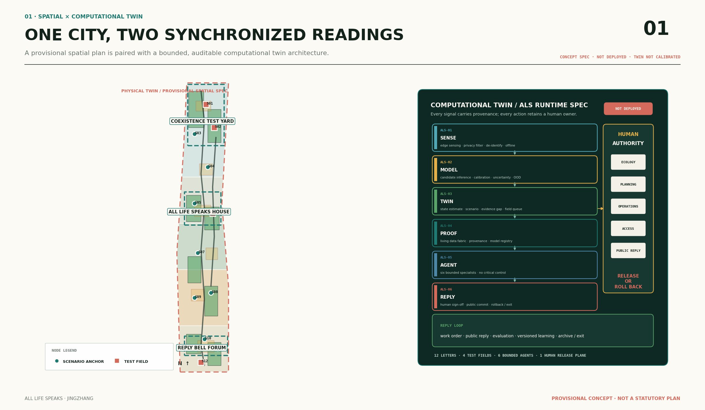
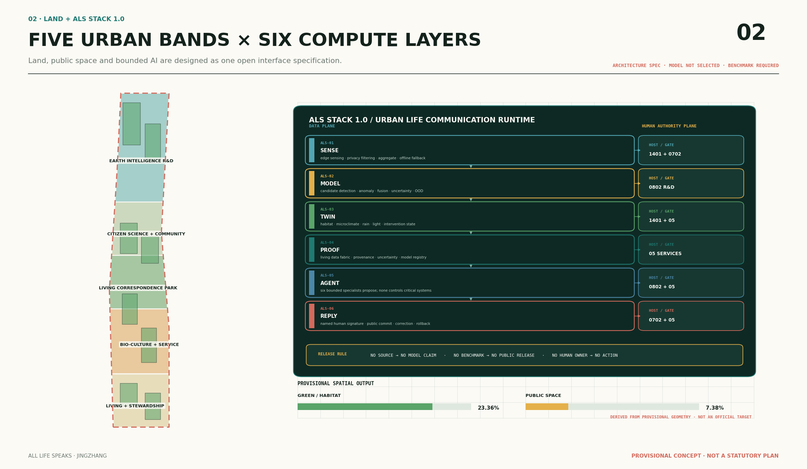
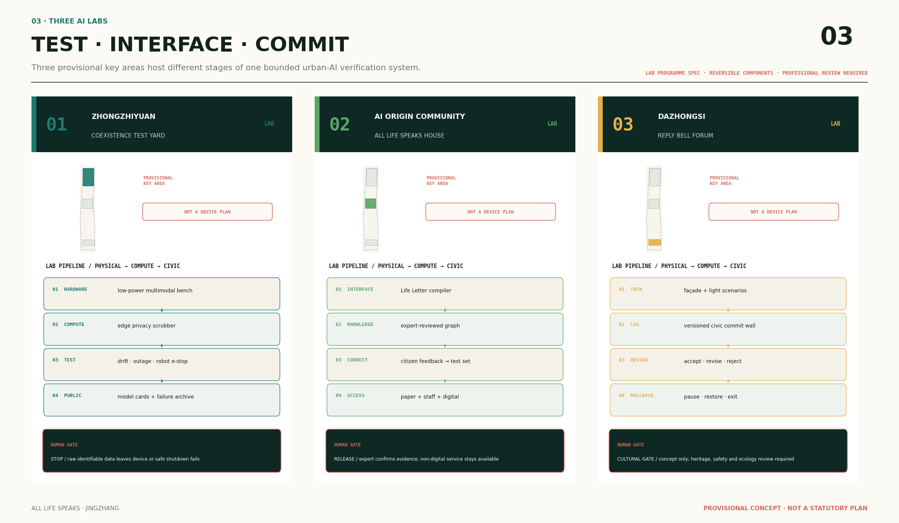
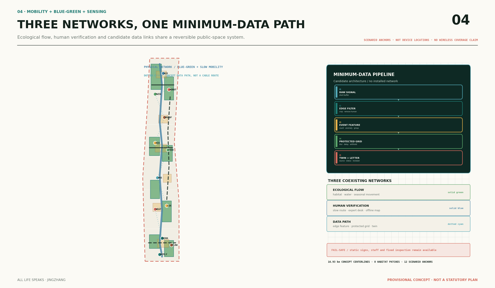
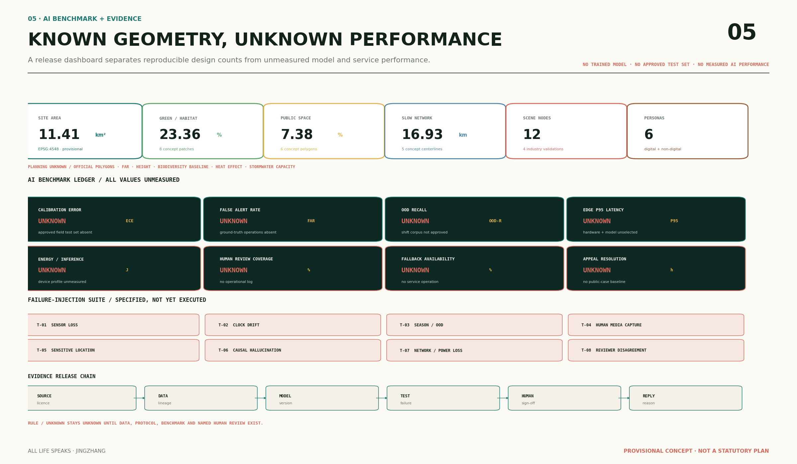

# 万物来信 / ALL LIFE SPEAKS

**一条会感知、会拒答、会推演、由人类放行并持续回滚学习的多物种城市治理带**

“万物来信”不是让 AI 冒充自然，也不是替任何物种宣称意志。它把水体、土壤、树木、鸟类、昆虫、微气候与市民观察中原本分散、难以进入治理流程的信号，翻译为附有来源、版本、空间精度、不确定性、拒答状态、人工签署和回应记录的“公共来信”。每封来信依次经过**边缘感知—证据编织—模型判断或拒答—孪生推演—智能体协商—人工放行—公开回应—评估回滚**；AI 只承担识别、归纳、情景比较和辅助派单，不作法定规划判断、工程决定、医疗诊断、治安预测、审批或自动执法。所有技术模块、场景和空间落地均为面向未来的开源概念架构与待验证建议，不表示已经部署、已经获得真实性能、已经配置算力容量或已经得到政府采纳，也不替代正式规划与专业判断。

## 设计依据与资料清单

方案首先服从官方公告确定的建设目标、三层范围、三处重点区域与设计任务，并以面向智能体任务书的三大定位、五大功能、三区两翼和六项必答任务作为内容框架。[source:OFFICIAL-ANNOUNCEMENT] [source:AGENT-TASKBOOK] [standard:PROJECT-OFFICIAL-ANNOUNCEMENT] [standard:PROJECT-AGENT-OPEN-CALL-TASKBOOK] 方案还读取 site package、公开资料登记表和事实包，区分 formal 可用资料、背景资料与 provisional-only 空间资料；处理表只作导航，不被升级为新的权威来源。[source:SITE-PACKAGE] [source:SOURCE-REGISTRY] [source:PROCESSED-FACT-PACK]

当前仓库没有可验证坐标系的官方三层范围和三处重点区 polygon。本包原样继承维护者登记的临时粗略总体设计边界与三个重点区，其 `official_boundary=false`、`geometry_role=provisional_constraint`；图面将其处理为淡色虚线约束，不把其面积拟合或矩形重点区画成官方红线。[source:BOUNDARY-SOURCE] [data:geometry/site_boundary.geojson#PROV-SITE-001] [data:geometry/key_areas.geojson#PROV-KEY-001] `geometry/constraints.geojson` 是空的资料缺口登记文件；其 metadata 只记录待补的控规、道路、文保、市政与权属资料，不包含任何控制线要素。[data:geometry/constraints.geojson] 这形成现状诊断的第一结论：可以开展产业、场景、治理和空间结构的概念设计，但不能作精确红线、法定用地、开发强度、拆改留、工程线位或投资时序结论。[depth:existing_conditions_diagnosis]

专业表达采用《城市设计管理办法》关于自然环境、历史文化、公共空间和建筑风貌统筹的原则；采用控规编制办法来明确“法定控制—设计建议—待确认资料”的边界；用地代码仅采用仓库登记的国土空间分类子集。[source:STD-URBAN-DESIGN] [source:STD-CONTROL-PLANNING] [source:STD-LAND-USE] [standard:MOHURD-URBAN-DESIGN-MEASURES] [standard:MOHURD-CONTROL-DETAILED-PLANNING] [standard:MNR-LAND-USE-CLASSIFICATION-GUIDE] 正文、九类 GeoJSON、metrics、三张矩阵、五张核心图、A3/A0 和离线 HTML 使用同一套要素 ID 与指标；外部案例只作机制转译，不拿其数据替代京张本地调查。



图 1　从生命信号到公共回应：空间、数据和责任链同源。临时边界只承担内容评审底板。

## 三层范围工作框架

统筹研究范围按公告约 43.6 平方公里理解，任务是确定环境智能产业链、三区两翼协同、区域创新网络和长期品牌；总体设计范围按公告约 11.4 平方公里理解，围绕京张遗址公园组织产业与空间融合、城市更新、交通市政、蓝绿公共空间和风貌；重点区域按公告约 368.4 公顷理解，三处均形成可深化的小方案。三层分别对应“生态与产业战略—城市设计结构—重点区场景与组件”，而不是把同一张总图等比例放大。[source:OFFICIAL-ANNOUNCEMENT] [depth:three_level_scope_framework]

提交边界在 EPSG:4548 下复算为 11,412,825.386 平方米，这个值只描述仓库 provisional polygon，不是官方 11.4 平方公里红线的精确化。[metric:site_area_sqm] [data:geometry/site_boundary.geojson#PROV-SITE-001] 三处重点区数量为三，公告约面积与 provisional polygon 的计算面积保持并列，不互相替代。[metric:key_area_count] [data:geometry/key_areas.geojson#PROV-KEY-002] 当组织方提供官方 polygon 后，替换流程为：先登记来源、版本、坐标系和转换方法；再重新裁剪 land use、buildings、roads、green space、public space、constraints 与 phasing；随后重算 metrics、更新五图、HTML、A3/A0 和 manifest，不能只替换边界文件。

空间传导采用“一脊、三庭、四季群岛、两翼回路”。一脊是沿京张遗址公园的“生命通信主脊”；三庭是众智园共生试验庭、AI 原点万物邮局、大钟寺万物回信钟庭；四季群岛是分布于屋顶、院落、水岸和公园的八个概念生境斑块；中关村科技服务翼把标准、知识产权、资金、人才与数据治理送入测试链，小月河场景赋能翼把环境问题、现场核验与养护反馈送回研发链。[depth:overall_spatial_structure] 该结构只表达协同关系，不推断现状河道蓝线、文保控制、道路红线或具体工程接口。



图 2　三层范围与总体结构传导。色带是概念性完整用地分区，不能解释为审定控规。

## 统筹研究范围产业与未来城市研究

### 总概念、命名与视觉识别

主名称“万物来信”建立三层命名：整体品牌为 **ALL LIFE SPEAKS**；空间系统为 **Living Correspondence Spine / 生命通信主脊**；治理协议为 **Letter—Reply Protocol / 来信—回信协议**。Logo 概念由一条铁路双线、一道水波、一个叶脉分叉和一个未封口的信封组成：双线代表百年京张的连接，波形代表环境信号，分叉代表多物种，开口代表公开纠错。VI 使用“夜墨、河青、花粉黄、土壤赭、校验白”五色；任何对外材料均同时显示“来源—置信度—人工状态”三个小标，不以拟人表情或物种卡通代替证据。字体采用系统通用字体，Logo、图标和图面均为原创几何构成，不使用企业标识或未授权形象。一带主 Logo 保持固定；导视和活动副标识只调用色彩、邮戳与状态标签，不替代、变形或混同主 Logo。[source:AGENT-TASKBOOK]

三大定位在本案中被重新连成一条逻辑链：百年京张文化带讲述基础设施从运输人货到传递公共知识；都市 AI 生活体验带让居民看见并纠正环境智能；AI 融合创新带把边缘感知、生态机器人、数字孪生、自然基础设施运维和责任链评测组成产业。五大功能分别落为多模态环境 AI 全栈、全球生态智能合作网络、十二封来信场景、可感知的四季公共空间，以及“有来源、有复核、有申诉、有退出”的 AI 治理话语体系。[source:AGENT-TASKBOOK]

### ALS Stack 1.0：城市生命通信技术栈

**ALS Stack 1.0 / An Open Multispecies Urban Intelligence Stack** 是“万物来信”的六层技术底座，其原则是：**Every signal has provenance. Every model has limits. Every action has a human owner.** 六个模块是可替换、可离线、可版本化的开放接口，而不是一套已建成系统。[metric:als_stack_module_count] 它们与 `visual/assets/als-stack.json` 中的 `ALS-SENSE`、`ALS-MODEL`、`ALS-TWIN`、`ALS-PROOF`、`ALS-AGENT`、`ALS-REPLY` 一一对应。当前机器可读核心另包括 `visual/assets/life-letter.schema.json` 和合成示例 `visual/assets/example-water-letter.json`；未来接口合同可按 `SignalPacket`、`ModelObservation`、`TwinScenario`、`ProofBundle`、`ActionProposal` 和 `LifeLetter` 等对象继续拆分，本版不为尚不存在的文件制造路径。

| 层级 | 模块 | 有界技术职责 | 机器可读输出 |
| --- | --- | --- | --- |
| L1 | **ALS-SENSE / 边缘感知层** | 水、土、树冠、生物声学、热感、微气候和设施状态的多模态采集；设备侧完成量程、时钟、质量检查、去人像、去人声、敏感位置模糊和断网缓存 | `SignalPacket` |
| L2 | **ALS-MODEL / 多模态模型层** | 候选的时序异常、视觉分割、生物声学、开放集分类和多模态融合；同步输出校准状态、OOD、缺数和拒答 | `ModelObservation` |
| L3 | **ALS-TWIN / 城市生态数字孪生层** | 把生境、水文设施、树冠、遮阴、照明、慢行和运维状态组织为时空场景图，只作版本化情景比较 | `TwinScenario` |
| L4 | **ALS-PROOF / 生命证据层** | 以生命数据织物登记事件流、样品链、许可、保留期限、来源哈希、模型注册和生态知识图谱，使每次推理可追溯、可撤回 | `ProofBundle` |
| L5 | **ALS-AGENT / 专业多智能体层** | 六个有界专业智能体在工具白名单内提出建议或组织复核包，由规则引擎检查越权与证据缺口 | `ActionProposal` |
| L6 | **ALS-REPLY / 人类放行与回信层** | 完成人工签署、申诉、撤回、回滚、公开 Commit Log 和后评估；未签署建议不得成为治理动作 | `LifeLetter`、`ReplyCommit` |

六个智能体按公共责任分工而非按模型炫技分工。[metric:specialist_agent_count] `WATER-AGENT` 处理水与微气候时序，`HABITAT-AGENT` 处理树、鸟、虫、土和小型动物，`NBS-OPS-AGENT` 只生成自然基础设施巡检排序与工单草稿，`EVIDENCE-GUARD` 检查来源、版本、OOD 和失效日期，`CIVIC-RAG-AGENT` 只从清权本地资料与公开规则检索，`REPLY-ORCHESTRATOR` 汇总已核验材料、冲突意见和人类复核包。无障碍、安全、生态、规划和一线运营仍是必须进入人工门的专业角色，而不是被虚构为自主智能体。任何智能体均不得通过相互投票形成自动决定，不得自行扩大目的、调用未授权工具、控制关键设施、关闭工单、分配预算或给个人和商户排名。

### Life Letter Protocol：机器可读来信协议

Life Letter Protocol 当前以 `visual/assets/life-letter.schema.json` 的 `0.1.0` 草案表达，是本案的一套拟开源协议，不是文学标签。[metric:machine_readable_protocol_count] 每封信必须包含 `schema_version`、`letter_id`、`letter_type`、`status`、`signal`、`model`、`runtime`、`evidence`、`governance`、`public_interpretation` 和 `disclaimer`；其中信号登记时间窗、空间精度、字段、个人数据状态和质量标记，模型登记 ID、版本、哈希、输入合同、置信度、校准、OOD 与拒答，运行环境登记边缘处理、关键控制隔离和部署状态，证据登记来源、哈希、缺口与敏感位置保护，治理登记人工角色、签署、决定 Diff、申诉、非 AI 回退、失效时间和回滚状态。状态只能在 `received`、`model_abstained`、`verification_required`、`awaiting_review`、`verified`、`responded`、`monitored`、`not_adopted`、`trial_stopped`、`rolled_back`、`revoked` 与 `archived` 之间依规则迁移；证据不足或 OOD 时进入 `model_abstained` 或 `verification_required` 并允许置信度为 `null`，等待责任角色后进入 `awaiting_review`，已经回应的事项可在 `monitored` 后关闭、回滚或撤回。“未知”优于以流畅文字掩盖证据缺口。

```json
{
  "schema_version": "0.1.0",
  "letter_id": "SYNTHETIC-WATER-001",
  "letter_type": "water",
  "status": "verification_required",
  "signal": {
    "signal_type": "multivariate_environmental_timeseries",
    "time_window": null,
    "spatial_resolution": "provisional_field_test_point",
    "feature_names": ["water_temperature", "turbidity", "conductivity", "dissolved_oxygen", "rainfall"],
    "contains_personal_data": false,
    "synthetic": true,
    "quality_flags": ["no_local_observation", "sensor_calibration_required"]
  },
  "model": {
    "model_id": "ALS-WATER-ANOMALY-CONCEPT",
    "model_version": "0.1-concept",
    "model_hash": null,
    "input_contract_version": "0.1.0",
    "model_family": "multivariate_time_series_anomaly_detection",
    "confidence": null,
    "calibration_status": "pending_benchmark",
    "out_of_distribution_status": "unknown",
    "abstained": true
  },
  "runtime": {
    "compute_mode": "edge_first_local_federation_concept",
    "edge_processed": true,
    "critical_control_connected": false,
    "deployment_status": "concept_only_unvalidated"
  },
  "evidence": {
    "source_ids": [],
    "source_hashes": [],
    "provenance_hash": null,
    "missing_evidence": ["authorized_sensor_data", "field_calibration", "professional_sampling", "local_baseline"],
    "sensitive_location_protected": true
  },
  "governance": {
    "human_reviewer_role": "water_environment_professional",
    "human_decision": "pending",
    "human_signature_status": "not_signed",
    "reason": null,
    "decision_diff_available": false,
    "correction_route": "offline_service_desk_or_public_correction_queue",
    "appeal_status": "available",
    "non_ai_fallback": "fixed_frequency_manual_sampling_and_inspection",
    "expires_at": null,
    "rollback_state": "no_AI_output_manual_baseline"
  },
  "public_interpretation": "Synthetic protocol example; no local observation.",
  "disclaimer": "Conceptual example only; benchmark and human authorization required."
}
```

### 空间—计算双孪生

空间孪生与计算孪生使用同一对象 ID，但承担不同责任：空间孪生描述 provisional 边界内的生境斑块、公共空间、慢行意图、设施关系和三处重点区；计算孪生描述设备、数据合同、模型版本、智能体权限、假设、情景、签署与回滚。一次推演必须同时保存空间版本、数据时间窗、模型哈希、参数、缺失字段和人工修改 Diff，才能进入比较；没有官方边界、现状调查或专业模型时，只能运行“如果—那么”的候选情景，不能输出工程量、生态成效或控制结论。[depth:overall_spatial_structure] 这种双孪生使一脊三庭不只是展示路线，也成为可追踪的“感知—推演—人类放行—现场验证—结果回流”开源试验拓扑。

### 八个全球案例：六个主案例、两个技术辅助

| 案例 | 可核验机制 | 京张转译 | 使用边界 |
| --- | --- | --- | --- |
| 新加坡 TreesSG + ENTS | 城市树木数字档案连接公众互动；研究林用 IoT、LiDAR、多光谱、无人机与气象设备研究树木生长、气候和健康 | 形成“公众生命地图—专业养护台账—研究型生境岛” | 不抓取整库、不复制界面或图片；本地树木基线待调查 [source:CASE-TREESSG] |
| Tallinn–Helsinki GreenTwins | 动态植被数字孪生表达生长和季相，Virtual Green Planner 支持共同设计 | 三重点区各设小型动态植被试验地，比较季相、遮阴与维护方案 | 项目已于 2023 年结束；素材许可逐项核对 [source:CASE-GREENTWINS] |
| Urban ReLeaf | 六个试点城市围绕热、空气、树木和绿地感知开展公民科学活动，并以将公民观测纳入官方数据流和政策过程为目标 | 采用“公众观察—专家质控—治理回信”而非直接众包决策 | 它不是 AI 项目；参与和环境数据须知情同意与质量审查 [source:CASE-URBAN-RELEAF] |
| Chicago Array of Things | 公共环境传感与边缘计算节点支持在本地完成特定图像分析并只输出计数，从而避免将原始图像传至中央服务器；具体处理仍受项目隐私政策约束 | 形成不识别人的边缘倾听柱、公开设备说明和监督结构 | 阶段性实验不能写成持续全城运营；声音图像严格最小化 [source:CASE-AOT] |
| Amsterdam RESILIO | 约一万平方米智能蓝绿屋顶以传感器、DSS 和联网运维管理雨水 | 概念性探索“屋顶水库—昆虫花园—公众观察台”的运营接口 | DSS 不等同机器学习；荷载、防水、产权和水务条件均待核 [source:CASE-RESILIO] |
| Germany AMMOD | 多模态站组合动物图像、生物声学、气味、花粉孢子和 DNA 条形码，并使用 AI 辅助识别 | 众智园验证多模态环境智能，公共空间只部署低干扰、许可明确的子集 | 全国覆盖是研发目标而非既成网络；eDNA 和捕虫需专项许可 [source:CASE-AMMOD] |
| BirdNET（辅助） | 大规模生物声学、地理时间先验、边缘部署和人工复核工具 | “鸟的来信”采用候选物种组、置信度与专家确认 | 人声必须设备侧去除；模型、代码、录音许可分别核验 [source:CASE-BIRDNET] |
| SlothBot（辅助） | 太阳能、慢速、长期在场的缆索生态机器人研究原型 | 转译为低能耗生态机器人试验原则，不复制外形 | 研究原型不是成熟产品，也未证明保护成效 [source:CASE-SLOTHBOT] |

案例被转成八个要素，而不是八张宣传图：土地采用可逆试验地和既有公共设施附着；空间采用研究庭、社区邮局、生境岛和公众复核台；产业形成传感器—边缘芯片—模型—机器人—数字孪生—运维平台—治理评测链；资金仅建议“科研命题、更新预算、企业公益或共益出资、运营采购分开核算”，不承诺财政或招商；人才由生态、园林、水务、规划、AI、伦理、无障碍和一线养护共同组成；算力优先端侧去人化与断网运行；数据形成字段表、模型卡、位置保护和失败记录；场景必须在现场产生公开回信。这一生态图谱为环境智能提供足够明确的产业内核，避免方案退化为一般景观绿化。[depth:overall_spatial_structure]

区域协同建议以问题和接口而非企业名单组织：高校和科研机构贡献方法、标注与专业复核；未来科学城、怀柔科学城和经开区可围绕环境感知硬件、机器人和验证方法建立开放课题；京津冀城市可交换去地点化的模型卡、数据表和失败案例。任何合作都需另行确认主体、许可和资源，不被表述为已达成安排。

## 总体设计范围城市更新与控规深度城市设计

总体范围采用五条共享切线把 provisional boundary 完整分为概念用地带：北部 0802 环境智能研发与验证、原点附近 0702 公民科学与社区服务、中段 1401 京张生命通信公园、南中段 05 生物文化与智能服务、南部 0701 共生生活与人才居住。它们的并集覆盖提交边界且不重叠，用于校验产业—生活—公共空间关系；代码遵循统一分类语义，但不表示现行或审定用地性质。[data:geometry/land_use.geojson#LU-001] [depth:land_use_layout]

城市更新不是以拆建数量驱动，而以“先盘点、再复用、后试验”驱动：第一层盘点现状建筑、权属、空置、首层界面、屋顶条件和历史价值；第二层对可安全使用的空间优先采取时段共享、首层开放、设备外挂和可逆组件；第三层才讨论专业评估后的改造或补充建设。当前建筑图层只放置九个概念性功能原型，用来验证研发、社区、文化和运维的空间关系，不代表任何现状建筑或具体地块的保留、改造、拆除、新建决定。[data:geometry/buildings.geojson#BLDG-001] [depth:retain_renovate_demolish]

开发强度、总建筑规模、建筑高度、密度、绿地率、退线均保持 unknown，因为官方控规、现状建筑和权属资料缺失。[depth:development_intensity_controls] 建筑风貌采用可深化原则：靠近遗址和生境界面的体量应保持连续但不过度标志化；屋顶优先承担可逆蓝绿设施、低眩光设备和公众观察；首层强化透明的人工服务和设备告知；所有声光、玻璃、材料与高度须经文保、鸟友好、热环境、消防和无障碍复核。[depth:height_massing_character]

交通上以生命通信主脊连接三区，三条东西向概念连线回应众智园、原点社区和大钟寺的缝合，另一条小月河场景支线连接现场验证与研发。线位只表达“希望连通什么”，不代替道路红线、站点工程、桥隧或交通组织方案。[data:geometry/roads.geojson#ROAD-001] 新型基础设施采用最小设备原则：边缘倾听柱、现场复核台、端侧算力柜、环境传感器和人工工单牌共用可逆接口；关键市政设施不由 AI 自动控制，失效时退回固定规则和人工巡检。[depth:municipal_new_infrastructure]

总体风貌不是“绿色高科技皮肤”，而是把核验状态做成可见城市语言：未经核验的来信使用虚线和灰白；专家确认后转为河青；已形成公开回应时加入花粉黄时间戳；停止试验使用土壤赭归档。百年铁路构件只作叙事尺度和线性秩序参考，不仿制文物；具体文保关系以官方保护资料和专业意见为准。[standard:MOHURD-URBAN-DESIGN-MEASURES]

## 重点区域详细设计

### 三区实验室与双孪生分工

三处重点区不是重复放置屏幕和传感器，而是 ALS Stack 的三个互补实验室。众智园承担“模型能否可信运行”，AI 原点社区承担“普通人能否看懂、纠错和退出”，大钟寺承担“城市是否能够说明为何采纳、不采纳或回滚”。三者通过同一 Life Letter ID、模型版本和 Reply Commit 相连，但数据权限、空间开放度和人工门各不相同。[depth:three_key_area_detailed_design]

| 重点区 | 实验室定位 | 主要技术对象 | 人类放行门 | 公开产物 |
| --- | --- | --- | --- | --- |
| 众智园 | **Multispecies AI Test Yard / 多物种 AI 测试场** | 边缘设备、低功耗模型、生态机器人、ALS-TWIN、模型注册、故障注入与红队 | 数据、生态、安全和一线运维联合确认，才能离开受控区 | Model Card、Device Passport、Failure Manifest |
| AI 原点社区 | **Living AI Interface Lab / 生活智能界面实验室** | Life Letter 编译器、实体信箱、公民观察、专家标注、无障碍界面和删除接口 | 参与者同意、专家确认与数据管家位置保护 | 经核验来信、人工修改 Diff、删除与纠错记录 |
| 大钟寺 | **Civic AI Commit Forum / 城市智能提交论坛** | 鸟虫友好立面、生态敏感照明孪生、治理 RAG、Reply Commit 与申诉回放 | 建筑、文保、生态、照明、安全和责任角色签署 | 收到、采纳、未采纳、暂停、回滚及理由的公开日志 |

### 众智园：地球智能与共生验证场

众智园承担 ALS Stack 全栈验证：北部两座生境岛与“共生试验庭”组合为可逆测试场，依次布置设备台架、断网与漂移故障区、多模态盲测区、生态机器人安全停机段、自然基础设施智能体沙盒和公开失败档案廊。空间分为“受控研发—影子运行—半开放演示—公众解释”四级；任何设备进入公共层前，必须展示输入字段、模型版本、数据保留、单次推理能耗测法、谁能关闭、如何断网、拒答条件和人工接管。所有性能均需独立测试并保持 `benchmark_required`，清河相关叙事只引用公告任务，不推断河道蓝线、防洪条件、算力供给或具体接口。[data:geometry/key_areas.geojson#PROV-KEY-001] [data:geometry/public_space.geojson#PUBLIC-001]

建筑建议优先盘活可核验的研发、实验和展示空间，九个概念基底中的环境智能实验室、生态机器人工坊和生命数据治理工作室只作功能原型。对外交通以“北部东西共生连线”和慢行接入需求表达，线形与断面必须在官方道路资料和交通专项到位后深化。公共空间以低能耗、低干扰、可撤除为设计底线，测试失败、数据漂移和人工否决应成为展示内容而非被隐藏。[depth:three_key_area_detailed_design]

### AI 原点社区：万物邮局与公民科学生活区

原点社区承担 Life Letter 的源头交互、专家标注和成果转化。核心“万物邮局”是数字、纸质与人工三通道公共客厅：居民、学校和访客可提交粗粒度自然观察，端侧先去人像、去人声和模糊位置，模型只能返回候选类群及不确定性，专家决定是否进入公共档案；每次人工修订、撤回与删除都形成可追踪 Diff。运营者公开 `received`、`verification_required`、`verified`、`responded`、`not_adopted`、`trial_stopped` 或 `archived` 状态。社区不要求智能手机，不把参与记录用于商业推荐，不公开巢址、繁殖地或稀有物种位置。[data:geometry/key_areas.geojson#PROV-KEY-002] [data:geometry/public_space.geojson#PUBLIC-002]

空间以两座社区生境岛、公民科学社区客厅、自然健康学习中心和原点横向慢行线构成。健康只处理遮阴、座椅、饮水、无障碍、热舒适路线和服务可达，不生成个人健康风险分数或诊断。近校转化以开放挑战、模型卡、数据表和失败案例库为媒介，不把高校成果、校园空间或任何具体项目写成已授权改造。更新坚持低扰动与可逆性，现状建筑、首层业态、权属和消防条件调查是进入下一步的前置门槛。

### 大钟寺：生物文化界面与万物回信论坛

大钟寺承担城市智能的公开提交、国际交流和生物文化公众入口。“万物回信钟庭”被设计成城市 AI 的实体 Commit Log：每季展示收到什么信号、由哪个模型版本处理、何处拒答、谁完成核验、人工怎样修改、城市做了什么、没有做什么及原因，以及何时暂停或回滚。公众可以通过实体回放台比较 AI 原稿与人类签署版本并提出申诉。它不是对文物的仿制或改造，具体形态、声音、照明、服务器与位置须经文保、建筑、生态、声环境、网络安全和运营团队深化。[data:geometry/key_areas.geojson#PROV-KEY-003] [data:geometry/public_space.geojson#PUBLIC-003]

该区重点验证鸟友好立面、生态敏感照明、社区有机资源循环和公共环境信息服务。地铁站四象限只提出“连续、可识别、无障碍、可停放”的步行与非机动车目标，不提供工程线位。商户、夜班劳动者、女性独行者和生态专业人员共同参与夜间照明复核；一键恢复经专业确认的固定安全基线，禁止人脸、轨迹和性别推断。具体建筑与商业调整必须在权属、现状运营和安全条件清楚后再决定。



图 3　三处重点区：研发验证、公众共创与生物文化回信。矩形重点区为 provisional 占位。

## AI 创新生态、人才画像与 AI+ 场景

### 六类用户画像

| 用户 | 核心需求 | 设计响应与权利 |
| --- | --- | --- |
| 不依赖智能手机的居民、老人、残障人士与照护者 | 大字、触觉、座椅、人工窗口和不被迫数字化 | 纸质信箱、电话、固定导视、人工服务与可删除的自愿内容 |
| 儿童、家庭和学校团队 | 安全自然教育与参与 | 监护同意、敏感位置保护、禁止竞赛式捕捉或干扰 |
| 园林、河道、保洁和物业一线人员 | 手套状态可操作、离线、少输入和一键否决 | 其现场经验进入纠错；AI 不自动关单或考核人员 |
| 生态专业人员、社会组织和社区科学志愿者 | 方法、样品链、物种与干预复核 | 仅确认自己专业范围，不为未经核验 AI 结果背书 |
| AI 开发者、初创团队和研究者 | 可控测试场、接口、合规数据与失败反馈 | 测试资格不等同政府采购、招商、资金或实施承诺 |
| 商户、夜班劳动者和公共空间运营者 | 经营连续、安全、照明、噪声和垃圾治理 | 有申诉、人工接管和退出非强制试点的渠道 |

六类画像覆盖日常使用者、现场劳动者、专业复核者和技术开发者，避免把“AI 人才”缩成单一高学历程序员。[metric:persona_count] 每类用户都同时是场景的服务对象或监督者；任何画像只用于设计服务，不用于个人预测、广告或资源惩罚性排序。

### 十二张“来信”场景卡

十二个场景使用同一协议，但模型、数据、拒答和人类门不同。下表中的算法族仅是待比较的候选路线；所有性能指标均为 `benchmark_required` 或 `unknown`，不是实际成绩、目标承诺或政府考核值。

| 卡片 | 候选模型 | 最小清权数据 | 边缘—云分工 | 不确定性与拒答 | 人类放行门 | 候选 AI 指标（均待测） |
| --- | --- | --- | --- | --- | --- | --- |
| **S01 水的来信** | 多变量变化点与稳健时序异常模型；不作污染分类 | 水温、浊度、电导率、溶解氧、降雨、校准日志 | 边缘作量程、时钟、突跳检查与断网缓存；私有环境比较季节基线 | 传感器分歧、漂移、缺数或新水文状态即拒答 | 水环境人员取样，必要时实验室复核；退回固定频率采样 | 事件 Precision/Recall、误报负担、漂移检出率、确认时长、区间覆盖率 |
| **S02 雨的来信** | 设施状态异常模型与雨水设施孪生代理；不作洪涝预报 | 雨量、水位、土壤湿度、设施 ID、巡检与清障记录 | 边缘阈值、质量标记和缓存；私有环境只生成堵塞复核排序 | 极端降雨、管网缺失、传感器饱和时退回雨后巡检 | 养护者现场确认后才能形成工单；禁止自动阀控 | Precision@k、漏报率、缺数覆盖率、人工否决率、未授权控制数 |
| **S03 树的来信** | 树冠分割、变化检测与多模态照护优先级；不作病害诊断 | 去人像树冠图、土壤湿度、热环境、树木 ID、养护记录 | 边缘去人化和图像质量筛选；私有环境比较季相趋势 | 遮挡、物候、树种域偏移或记录缺失时只报“需观察” | 园林专业人员决定修剪、用药或处置 | Crown IoU、分级 Precision/Recall、ECE、OOD Recall、隐私泄漏事件 |
| **S04 土的来信** | 自监督微观图像表征、聚类与异常筛选；不作污染认证 | 清权样品、pH、有机质、紧实度、显微图与样品链 | 现场登记样品链和设备校验；私有环境聚类并提出复测队列 | 样品代表性不足、批次漂移或实验条件变化即拒答 | 土壤或环境专业人员复核取样和实验；不采未经许可 eDNA | 重复样一致性、Cluster Stability、复测命中率、样品链完整率 |
| **S05 蜂蝶的来信** | 开放集细粒度视觉/声学模型与观测努力标准化活动模型 | 限定视野微距图、非人类声学、花期、天气、观测时长 | 边缘裁剪非目标区域并删除原始人类素材；私有环境只到候选类群 | 开放集物种、幼体、模糊图和季节偏差时拒答或只到物种组 | 昆虫专家抽检，数据管家保护敏感位置；退回固定样线 | Macro-F1、Top-k Recall、OOD AUROC、检测概率校准、位置保护率 |
| **S06 鸟的来信** | 生物声学模型、限定天空事件检测与碰撞时段筛选 | 去人声特征、限定天空图、天气、已核验碰撞观察 | 边缘去人声并只上传特征；私有环境比较候选类群与时段 | 人声串扰、雨风噪声、迁徙季域偏移时保持待核验 | 鸟类、建筑和照明联合复核；不得公布巢址或自动熄灯 | Macro-F1、人声泄漏率、OOD Recall、碰撞事件 Precision、位置保护率 |
| **S07 夜的来信** | 约束多目标优化与照明孪生；不采用在线强化学习控制 | 色温、照度、能耗、匿名区域计数、生态活动和固定安全基线 | 边缘只生成区域计数；私有环境比较方案 Pareto 前沿 | 样本稀疏或安全、生态目标冲突时只展示，不推荐动作 | 安全、照明、生态和运营联合批准，一键恢复固定基线 | 基线合规率、估计误差、方案可行率、回滚延迟、未授权控制数 |
| **S08 小兽的来信** | 低位热感事件分类；禁止个体 Re-ID 和轨迹模型 | 热感瞬时帧、不可逆事件计数、时间、天气和慢行流量 | 边缘完成检测即删除原始帧；私有环境只处理粗网格计数 | 热源混淆、遮挡或设备高度变化时转人工观察 | 生态与交通安全人员复核；不得追踪个体、自动控车或给工程结论 | Event F1、原始帧保留时长、位置粗化合规率、Re-ID 风险测试 |
| **S09 热的来信** | 微气候时空插值/短时预测与不确定性感知路线建议 | 温湿度、辐射或 WBGT 候选、遮阴、饮水、座椅和设施状态 | 边缘检查传感器和设施状态；私有环境生成粗网格可选路线 | 传感漂移、局地突变、设施过期和个体差异必须明示 | 现场服务人员核查设施；保留纸图与人工服务 | MAE/RMSE、预测区间覆盖率、不可用设施漏检率、服务可用率 |
| **S10 食物的来信** | 桶内限定视野污染分类、称重和堆肥状态异常模型 | 点位称重、限定 ROI 图像、堆肥温湿度和收运记录 | 边缘裁剪背景并按规则删除图像；私有环境只给检查或收运建议 | 新包装、照明、遮挡和季节物料域偏移时拒答 | 保洁、园艺或运营人员确认；不得对个人或商户惩罚画像 | Macro-F1、人工确认 Precision、错误惩罚建议数、人工改写率 |
| **S11 市民回信** | 多模态 Top-k 候选识别、质量/重复检测与地理模糊 | 经同意的照片或短音频、观察时间、粗位置、可选联系方式 | 用户端或邮局端先去脸、车牌、人声和精确位置；私有环境生成候选 | OOD、低清晰度、重复、合成或疑似篡改素材时拒答 | 专家确认后入档；用户可纠错、删除或撤回；纸信箱可替代 | Top-k Recall、Abstention Accuracy、删除 SLA、地理隐私失败率 |
| **S12 治理回信** | 仅检索已核验来信和规则库的 RAG 与结构化摘要；禁止无约束生成 | 已核验 Life Letter、规则版本、角色目录、决定、异议和申诉 | 私有环境检索与起草；公共端只读已签署版本 | 引文不足、规则冲突、版本过期或异议可能丢失时阻断 | 指定责任角色逐项签署；不得自动执法、审批、排名或关单 | Supported-claim Rate、Citation Precision/Recall、Hallucination Rate、异议保留率 |

十二个场景节点已按正文来信语义写入公共空间图层并在图面定位。[data:geometry/public_space.geojson#SCENE-001] [metric:scenario_node_count] 每张卡片形成 `SignalPacket—ModelObservation—TwinScenario—ProofBundle—ActionProposal—LifeLetter` 的可审计链；高影响输出必须经过人类放行门，失败时恢复固定采样、人工巡检、纸质台账或经专业确认的安全基线。

### ALS Benchmark：四项产业验证技术规范

四项 Benchmark 构成一个统一验证套件。[metric:benchmark_suite_count] [metric:industry_validation_scenario_count] 共同放行路径为 **实验台 Bench → 受控沙盒 Sandbox → 影子模式 Shadow → 有界公共试验 Bounded Pilot → 继续、修改、回滚或退出**。任何一级通过只表示可进入下一轮评估，不表示系统已经部署、政府采纳、采购承诺或达到某一技术成熟度。

**T01 Edge Multispecies AI & Privacy Compute / 边缘多物种感知与隐私计算。** 被测对象包括声学、微距视觉、天空视觉、低位热感、环境时序设备、边缘算力、签名固件、模型包与本地删除机制。测试使用许可明确的本地基线、人工布设事件、开放许可样本、合成故障和隔离盲测集；注入人声/人像误收、音频回放、GPS 欺骗、时钟漂移、设备替换、断网、数据包乱序、雨风、遮挡和敏感位置泄露。记录端侧延迟、单次推理能耗、断网能力、签名验证、隐私泄漏、OOD Recall、删除可验证性和原始数据出网量；未去标识人声或人像离开设备、敏感位置公开、未签名模型运行或无法本地删除均触发硬停止。交付物是 Device Passport、Data Sheet、Model Card、隐私攻击报告和 Failure Manifest。

**T02 NbS Operations Agent Sandbox / 自然基础设施运营智能体沙盒。** 被测对象是 `WATER-AGENT`、`HABITAT-AGENT`、`NBS-OPS-AGENT`、`EVIDENCE-GUARD` 与数字孪生、权限白名单和工单草稿系统。测试注入缺数、漂移、尖峰、过期资产状态、目标冲突、错误位置、恶意元数据、工单 Prompt Injection、证据撤回和操作员暂时不可用；记录工具越权、证据覆盖、拒答、故障情境任务完成、不安全建议、人工否决、回滚时长与非 AI 替代可用性。系统保持只读环境状态并与阀门、正式照明、交通和排水控制网隔离；调用未授权工具、写入关键基础设施、无签署自动关单或无法恢复固定规则均触发硬停止。交付 Agent Card、工具权限清单、完整 Trace、红队样本和 Rollback Report。

**T03 Bio-friendly Façade & Ecological Lighting Twin / 鸟虫友好立面与生态敏感照明孪生。** 被测对象是可逆玻璃纹样或遮挡样件、光谱、色温、照度、时段方案及固定安全照明基线；通过匹配夜间、季节和天气比较若干版本，条件具备后才研究经专业批准的重复测量或 BACI。压力情境包括雨雾、反光、迁徙季、传感器故障、临时人流激增和数据稀疏；记录照度与安全基线、能耗、按观察努力标准化的碰撞或活动记录、模型校准、人工覆盖和回滚时间。AI 只比较方案，不直接调节正式照明；未经批准改变照明、安全基线受损或试验产生不可接受生态干扰均触发硬停止。交付样板参数、场景版本、生态监测协议与联合签署记录。

**T04 Life Letter Chain Benchmark / 公共生态来信责任链评测。** 被测对象是 `visual/assets/life-letter.schema.json` 校验器、ALS-PROOF 来源与模型注册、`CIVIC-RAG-AGENT`、`REPLY-ORCHESTRATOR`、人工签署、申诉和公开 Commit Log。基准集采用去标识化模拟工单与专业人员制作的金标准案例，刻意嵌入伪造来源、版本冲突、模型哈希错配、Prompt Injection、高置信错误、异议被删除、重复事件错误合并、过期规则和撤回同意；记录 Schema Validity、Provenance Completeness、Citation Precision/Recall、Supported-claim Rate、Hallucination Rate、Dissent Retention、Appeal Recovery 和 Time-to-Rollback。无证据仍生成确定性结论、无签署公开、撤回数据继续公开或攻击文本改变权限均触发硬停止。交付 Benchmark Card、Incident Report、失败样本集、决定 Diff 和 Reply Commit。

### 万物来信治理公约

治理公约包含十二条：默认最小化、目的限定、敏感物种位置保护、翻译谦抑、专业人工复核、可解释记录、申诉纠错、参与与试验退出、失败降级、非 AI 替代、无自动惩罚、公平覆盖。设备能不用摄像头就不用，能在端侧变成不可逆计数就不保留原始素材；环境数据不得转作广告、考勤、治安预测或执法；“未知”与“拒答”优于猜测。每封来信必须显示来源类别、时间窗、空间精度、模型版本、校准状态、OOD、人工状态、责任角色、失效日期与下次复核日。[depth:risk_missing_data]

人类门不是点击一次“同意”，而是四项同时满足的放行协议：证据门检查来源、许可、样品链和模型哈希；专业门由水务、生态、园林、建筑、照明或其他相应角色确认其专业范围；公共利益门检查安全、无障碍、数字排斥、敏感位置和潜在受损群体；运营门确认责任人、非 AI 备份、停止条件与回滚资源。任一门未通过，ALS-REPLY 只能发布“核验中”“未采纳”或“试验停止”，不能把智能体建议转成工单或公开结论。所有 consequential reply 保留 AI 草稿、人类修改 Diff、签署角色、理由、纠错入口和回滚状态，使责任不可被“系统建议”稀释。

## 用地、建筑规模与拆改留方案

完整用地分区的作用是检验系统关系：0802 研发带支撑环境 AI、机器人、模型与标准；0702 社区服务带支撑万物邮局、自然教育、人工服务和人才生活；1401 开敞空间带承载生命通信主脊、生境岛和公众复核；05 服务带支撑生物文化、国际交流、循环服务和合规专业服务；0701 生活带强调照护、夜间劳动、无障碍与非数字服务。任何一带的比例都只是从 provisional geometry 派生的概念分配，官方 polygon、现状用地和控规到位后应重新确定。[data:geometry/land_use.geojson#LU-005] [standard:MNR-LAND-USE-CLASSIFICATION-GUIDE]

建筑图层的九个原型基底合计约 256,089.502 平方米，仅用来复核原型空间与边界的关系，不是现状建筑总基底、规划建筑规模或建设承诺。[metric:building_footprint_area_sqm] [data:geometry/buildings.geojson#BLDG-009] 每个原型都带有 `existing_condition=unknown` 和“待权属、测绘、安全、文保后决定”的属性。拆改留采用门槛式规则：具有文保或历史价值者先保护研究；结构、消防和权属可确认且功能适配者优先保留；可通过设备外挂、首层共享或屋顶可逆组件改善者进入改造研究；只有专业评估证明无法安全复用且法定程序完备时，才讨论拆除；新建仅在公共利益、容量、生态影响和运营责任均有证据后讨论。[depth:retain_renovate_demolish]

总建筑面积、容积率和高度不由概念基底反推。[metric:floor_area_ratio] [metric:building_height_control_m] 建筑高度体量建议仅提供评价维度：遗址视廊、鸟撞风险、屋顶生境连续性、街道日照与热舒适、首层公共性、声光扰动和消防救援。最终数值由正式控规、文保、道路、市政和专业方案决定。所谓“低扰动更新”也不等于无条件保留，而是先验证、可回退、记录为何改和为何不改。

## 交通、轨道、市政与公共服务设施

道路图层包含一条南北生命通信主脊、三条重点区横向概念连线和一条小月河场景支线，合计约 16,930.125 米；该指标是中心线草案长度，只表达连通意图，不是道路里程、工程线位或建设量。[metric:conceptual_slow_network_length_m] [data:geometry/roads.geojson#ROAD-004] [depth:traffic_rail_slow_parking] 交通深化顺序为：先取得道路红线、断面、轨道出入口、公交、停车和人流调查；再核查慢行断点、无障碍连续性与非机动车停放；最后比较地面优化、时段管理或工程措施。大钟寺四象限、北五环接口和公园跨越均保持问题清单状态。

轨道站点周边的概念动作是“到达即读懂”：离站后不需要 App 即可看到主脊方向、最近人工服务、无障碍路线、静态热舒适路线和设备告知。停车策略不编造泊位数，优先研究非机动车有序停放、设备维护临停、活动期间人工管理和需求错峰。机器人只在低速、限定、可停机试验段运行，行人优先，无法识别或通信中断即安全停止，由现场人员接管。

新型基础设施分三层：现场层是环境传感、边缘计算、人工刻度和设备告知；片区层是工单、模型卡、粗粒度空间与权限管理；全带层只汇总已核验来信、公开状态和失败档案。能源、网络、水务和设备固定优先复用既有设施，任何接电、荷载、通信、阀门或管线动作均需另行专业审查；AI 不直接控制排水、消防、交通信号或其他关键系统。[depth:municipal_new_infrastructure]

公共服务包括万物邮局人工窗口、共生气候驿站、自然教育、生态专家时段服务、现场复核台和电话/纸质工单。设施数量和服务半径在公共服务底数缺失时不作达标宣称。服务评价关注无障碍可用时长、人工渠道占比、回复及时性和不同片区公平覆盖，而不是仅统计 App 使用量。



图 4　慢行、轨道接驳、蓝绿公共空间和场景节点的概念性同图校核。

## 蓝绿空间、公共空间与城市风貌

八个四季生境斑块的提交层面积约 2,666,151.185 平方米，占 provisional site 约 23.3613%；六个公共空间概念多边形约 841,797.534 平方米，占约 7.3763%。[metric:green_space_area_sqm] [metric:green_ratio] [metric:public_space_area_sqm] [metric:public_space_ratio] [metric:habitat_patch_count] 这些是设计图层比例，不是现状绿量、法定绿地率或建成承诺；斑块形状会在 official polygon、现状植被、水文、土壤、文保和运营调查后重构。[data:geometry/green_space.geojson#GREEN-001] [data:geometry/public_space.geojson#PUBLIC-004] [depth:blue_green_public_space]

蓝绿系统把 NbS 视为需持续维护和验证的公共基础设施。每个斑块必须明确目标生境、观察方法、维护责任、季节风险、无障碍关系和退出条件；没有本地基线前，生物多样性、热暴露和雨洪绩效均保持 unknown，不以外地案例参数代替。[metric:biodiversity_baseline_index] [metric:heat_exposure_reduction] [metric:stormwater_retention_sqm_equivalent] 公众观察能提出问题，但物种识别、树木处置、土壤修复、照明和水务仍由相应专业人员决定。

三个 AI 朝圣地标分别是：AI 原点的**万物邮局 / ALL LIFE SPEAKS HOUSE**，展示核验后的来信并提供纸质、数字和人工三种渠道；众智园的**共生试验庭 / COEXISTENCE TEST YARD**，公开模型失败、断网、停机和人工接管；大钟寺的**万物回信钟庭 / REPLY BELL FORUM**，以每季公开回信会连接城市治理与国际传播。[metric:landmark_count] 它们都采用可逆组件，不复制文物或企业形象，也不把科技装置凌驾于日常公共空间。

三处地标共用“贡献邮戳”荣誉展示：只记录经个人或团队授权公开的名称、贡献类型、版本、复核状态与撤回方式，不按流量、资本或模型性能排名，也不把展示等同官方表彰或采购背书。[source:AGENT-TASKBOOK]

公共空间组件库包含十项：双通道万物信箱、边缘倾听柱、生境工单牌、专业维护的微生境口袋、雨水花园检查窗、鸟友好界面与遮光样板、共生气候驿站、现场复核台、可逆试验甲板、多感官导视。每件组件同时提供模拟或机械备份，并在实体铭牌写明用途、范围、保留期、人工责任和关闭方式；涉电、涉水、结构、消防和文保条件由后续专业团队核定。

文化叙事分三段：铁路时代以轨道连接人流与物流，中关村时代以开放试验和知识网络连接创新，环境智能时代以可核验来信连接人、城与多物种生命。导视使用“邮戳”时间、铁路里程样式和生境信号纹理，但不虚构京张史实；清华园车站、清河、小月河等具体文化与空间关系只在官方和专业资料支持后落位。导视和活动副标识不替代、变形或混同固定的一带主 Logo。国际传播句为：**All life speaks. The city verifies, replies, and learns.** 城市气质不是无处不在的屏幕，而是谦抑、可解释、可纠错的公共智能。[source:AGENT-TASKBOOK]

## 更新项目清单、实施政策与分期计划

概念更新清单共九项：JZ-01 生命通信主脊与慢行断点普查；JZ-02 众智园共生试验庭；JZ-03 AI 原点万物邮局；JZ-04 大钟寺回信钟庭；JZ-05 小月河环境来信样段；JZ-06 四季生境群岛和维护台账；JZ-07 多物种数据与位置保护规则；JZ-08 非 AI 服务与无障碍导视；JZ-09 年度公开回信与失败档案。每项必须登记位置精度、权属、专业条件、试验期限、运营责任、人工复核、公众申诉、退出和知识回库，不能只列建设名词。[depth:renewal_project_list]

分期图层把 provisional site 分为三个概念序列，但不等于行政或投资时序。[data:geometry/phasing.geojson#PHASE-001] 第一阶段建立本地基线、字段表、伦理审查、非 AI 替代和受控验证；第二阶段只有通过技术、生态、安全、无障碍与公众审查的场景才进入小规模公共体验；第三阶段依据公开证据作扩大、修改、暂停或退出建议。[depth:phasing_implementation] 每个阶段都有门：无官方资料不作精确空间决定，无专业基线不宣称成效，无人工责任不发布治理回信，无退出方案不进入公共试验。

阶段责任表建议把参与主体写到角色而非预设机构：生态与规划专业团队负责基线和空间判断，园林、河道、物业与商户等运营主体负责现场复核，居民和社区组织拥有纠错与申诉渠道，AI 开发团队负责模型卡、失败记录和人工接管。阶段性可衡量指标包括样品链完整率、人工复核覆盖率、工单闭环时长、非 AI 渠道可用时长、位置保护率、申诉纠错率、试验退出记录完整率和不同片区服务分布；所有指标先建立基线，再决定是否可比较，不以未经验证的生态成效或 App 使用量代替。[metric:scenario_node_count] [metric:industry_validation_scenario_count]

年度品牌为 **ALL LIFE SPEAKS WEEK / 万物来信周**，但全年闭环而非一次性节庆。春季“开信”由专家与公众共同核查基线与数据缺口；夏季“试信”围绕热、雨、树木与设施养护开展受控产业挑战，公开模型卡和失败；秋季“读信”举行国际城市 AI 与多物种治理论坛、场景步行和开发者演示；冬季“回信”发布“收到—核验—回应—未采纳及原因—停止试验”年度册并受理纠错。活动视觉采用春、夏、秋、冬四枚季节邮戳，并固定显示来源、置信度与人工状态；这一可变副标识不构成新的片区 Logo。所有活动都是概念运营机制，不表示已确定举办、出资或审批。[source:AGENT-TASKBOOK]

转化闭环是：公众或运营者提出问题—生态与数据管家审查必要性—众智园和中关村翼形成开放挑战—受控试验庭验证—原点或小月河小规模体验—独立生态、安全、无障碍复核和申诉—人类团队建议扩大、修改、暂停或退出—模型卡、数据表、组件、失败记录和运营手册回到公共知识库。企业价值来自接口、评测、低功耗硬件、运维工具和责任链方法，不来自垄断公共数据。进入挑战、通过测试或公开展示均不等同采购、招商、资金或落地承诺。[source:CASE-URBAN-RELEAF] [source:CASE-AOT]

## 指标体系、面积复算与合规矩阵

本包把“已知图层或结构计数”与“待专业验证的绩效值”分开。已知项全部可从 GeoJSON、正文或 `visual/assets/als-stack.json` 复查：临时提交面积 [metric:site_area_sqm]、概念绿地面积 [metric:green_space_area_sqm] 与比例 [metric:green_ratio]、公共空间面积 [metric:public_space_area_sqm] 与比例 [metric:public_space_ratio]、概念建筑原型基底 [metric:building_footprint_area_sqm]、慢行概念线长度 [metric:conceptual_slow_network_length_m]、三处重点区 [metric:key_area_count]、八个生境斑块 [metric:habitat_patch_count]、十二个场景节点 [metric:scenario_node_count]、四个产业测试 [metric:industry_validation_scenario_count]、三个地标 [metric:landmark_count] 和六类画像 [metric:persona_count]。[depth:metrics_recalculation] v2 另有四个只表示架构完整性的已知计数：六个 ALS Stack 模块 [metric:als_stack_module_count]、六个有界专业智能体 [metric:specialist_agent_count]、四项 Benchmark [metric:benchmark_suite_count] 和一套机器可读 Life Letter Protocol [metric:machine_readable_protocol_count]；这些数量不代表模型质量、产业规模或技术成熟度。

unknown 项包括容积率、高度、总建筑规模、绿地率法定要求、物种基线、热暴露改善、雨洪效能、污染合规、健康结局和投资。它们不是“零”，也不因场景概念而成为目标承诺；取得官方或清权数据后，需先写明定义、采样、时间、空间分辨率、对照或基线、误差和负责专业，再决定能否转为 known。特别是生态成效按观察努力标准化，不能把传感器数量或识别次数直接当作物种增加。

AI 性能同样全部保持 `unknown` 或 `benchmark_required`。候选评测包括 Macro-F1、Top-k Recall、预测区间覆盖率、Expected Calibration Error、OOD Recall、Supported-claim Rate、Citation Precision/Recall、Hallucination Rate、异议保留率、人工否决率、人工复核覆盖率、非 AI 备用可用率、申诉处理时间、回滚与人工接管时长、隐私泄漏事件、原始数据出网量、端侧延迟和单次推理能耗。不同场景只能选择与任务相符的指标，不能用统一“准确率”替代生态和治理判断；只有在本地清权数据、冻结盲测集、人工金标准、设备能耗测量和独立专业复核到位后，才讨论阈值。当前没有任何已训练本地模型、真实性能、在线服务容量或算力容量可供声称，模拟、识别次数、传感器数量和通过内部测试均不得升级为生态改善或治理成效。

`compliance_matrix.json` 覆盖公告 1.3、1.4、1.5 的 17 项要求与 agent.1—agent.6 共 23 项，每项定位到正文、图层、指标、A3/A0、HTML、来源、假设和自检；`standard_matrix.json` 覆盖五个 mandatory 本地标准；`design_depth_matrix.json` 覆盖 15 个核心深度项。所谓 complete 表示概念包已提供可读判断、机器证据和资料边界，不表示法定控规、工程设计或政府审定已经完成。[depth:overall_spatial_structure] [depth:land_use_layout] [depth:development_intensity_controls] [depth:height_massing_character] [depth:traffic_rail_slow_parking] [depth:municipal_new_infrastructure] [depth:blue_green_public_space] [depth:three_key_area_detailed_design]



图 5　指标证据链。绿色为可复算图层值，赭色为必须保持 unknown 的专业结论。

## 风险、版权与合规说明

首要风险是空间资料精度。临时边界支持内容评审但不支持官方红线、精确面积和工程判断；官方数据到位后必须整体复算。第二是本地环境基线缺失，因此“生命来信”只描述待核验信号，不宣称污染、物种变化、气候适应或健康因果。第三是多模态设备可能误收人声、人像和敏感物种位置，默认策略为不用即不采、设备侧去人化、粗粒度与延时公开、短期保留、专业权限和删除通道。第四是模型误报、漂移、幻觉与少数意见丢失，所有高影响建议必须人工复核、保留修改记录和“不同意 AI”选项。

### AI 风险、红队与回滚协议

ALS Stack 采用“可失败设计”，将风险分为五类：感知层的校准漂移、时钟错误、遮挡和误收人类信息；模型层的域偏移、开放集误识别、置信度失准和 OOD 漏检；孪生层的缺失资产、错误参数、情景被误当预测和模拟边界外推；智能体层的 Prompt Injection、工具越权、目标冲突、来源错配与自动化偏见；回信层的无签署发布、异议被压缩、撤回数据残留和责任角色不清。红队测试不仅攻击模型，也攻击传感器、数据合同、知识库、模型注册、工具权限、人工交接、申诉与删除全链路；测试材料必须清权或合成，不能为攻击演示而真实暴露个人或敏感物种位置。

四级响应按影响升级：`DEGRADE` 停止模型解释、保留本地质量标记并转人工；`FREEZE` 冻结相关模型、智能体与公开状态，禁止生成新工单；`ROLLBACK` 恢复上一签名模型、固定规则、人工巡检、纸质台账或专业确认的照明基线；`EXIT` 撤除试验设备、归档原因、删除无继续保留依据的数据并公开停止说明。设备无法去人化、敏感位置泄露、模型哈希不一致、智能体调用未授权工具、AI 写入关键基础设施、无人工签署发布 consequential reply、申诉无法处理或生态与安全基线受损，任一项均触发 `FREEZE` 或更高级响应。恢复须重新完成证据、专业、公共利益和运营四门，不允许仅因服务重新上线而自动恢复。

运营风险包括一线人员负担、设备维护成本、商户连续经营、夜间安全、数字排斥和“展示节点优先于普通片区”。年度审计比较各片区、时段与无障碍群体是否同样获得人工服务，不把 App 使用量当公平。任何试点均预设停止条件：设备无法去人化、敏感位置泄露、无法解释来源、专业人员无法接管、公众投诉无法处理、生态干扰不确定或安全基线受损时，立即停止 AI 输出并恢复固定规则、纸质台账和人工巡查。

全部文字、结构化数据、图、HTML 与 PDF 的生成和第三方引用边界见 `report/copyright_statement.md`。核心图只使用本投稿 GeoJSON、metrics 和原创几何，不使用外部照片、地图截图、Logo、论文图或远程资源。案例机构名称只作事实性文本引用，不暗示合作或背书。个人隐私、未清权或访问受限的资料、秘密地图和受限企业数据均不进入提交包。该方案不承诺投资、招商、采购、活动、审批、建设或实施，最终判断由人类与专业团队完成。[source:SOURCE-REGISTRY] [depth:risk_missing_data]

提交前的责任清单是：确认 proposal 每章解释“判断—理由—证据—缺口”；确认所有 known 指标与图面一致；确认用地拓扑、要素在边界内和 provisional 标注；确认 HTML 无 CDN、远程字体、脚本、iframe、表单、API 或跟踪；确认 A3/A0 非空并经逐页目检；最后运行 render、finalize 和四关 self-check。任何最终编辑后都重新刷新 manifest 哈希，避免展示与结构化数据冲突。

## 参考资料

项目与标准依据包括：`brief/site-package/design_brief.json`、`agent_taskbook.json`、`allowed_design_space.json`、`data/source_registry.json`、官方公告本地快照、城市设计管理办法本地快照、控规编制审批办法本地快照、国土空间用地分类指南本地快照，以及仓库临时边界与推定说明。[source:SITE-PACKAGE] [source:OFFICIAL-ANNOUNCEMENT] [source:AGENT-TASKBOOK] [source:BOUNDARY-SOURCE] [source:STD-URBAN-DESIGN] [source:STD-CONTROL-PLANNING] [source:STD-LAND-USE]

全球案例依据均登记在 `sources.json`，统一访问日期为 2026-08-07：NParks TreesSG/ENTS、FinEst GreenTwins、Urban ReLeaf、Chicago Array of Things、Amsterdam RESILIO、Germany AMMOD、BirdNET 和 Georgia Tech SlothBot。它们只支撑案例事实和机制转译，不支撑京张边界、法定控制、工程可行性或本地成效。[source:CASE-TREESSG] [source:CASE-GREENTWINS] [source:CASE-URBAN-RELEAF] [source:CASE-AOT] [source:CASE-RESILIO] [source:CASE-AMMOD] [source:CASE-BIRDNET] [source:CASE-SLOTHBOT]

结构化成果索引：`geometry/site_boundary.geojson`、`key_areas.geojson`、`land_use.geojson`、`buildings.geojson`、`roads.geojson`、`green_space.geojson`、`public_space.geojson`、`constraints.geojson`、`phasing.geojson`，以及 `metrics.json`、`assumptions.json`、`sources.json`、三张矩阵、A3/A0 和离线 HTML。[data:geometry/site_boundary.geojson#PROV-SITE-001] [data:geometry/key_areas.geojson#PROV-KEY-003] [data:geometry/land_use.geojson#LU-003] [data:geometry/buildings.geojson#BLDG-004] [data:geometry/roads.geojson#ROAD-005] [data:geometry/green_space.geojson#GREEN-008] [data:geometry/public_space.geojson#SCENE-012] [data:geometry/constraints.geojson] [data:geometry/phasing.geojson#PHASE-003]
