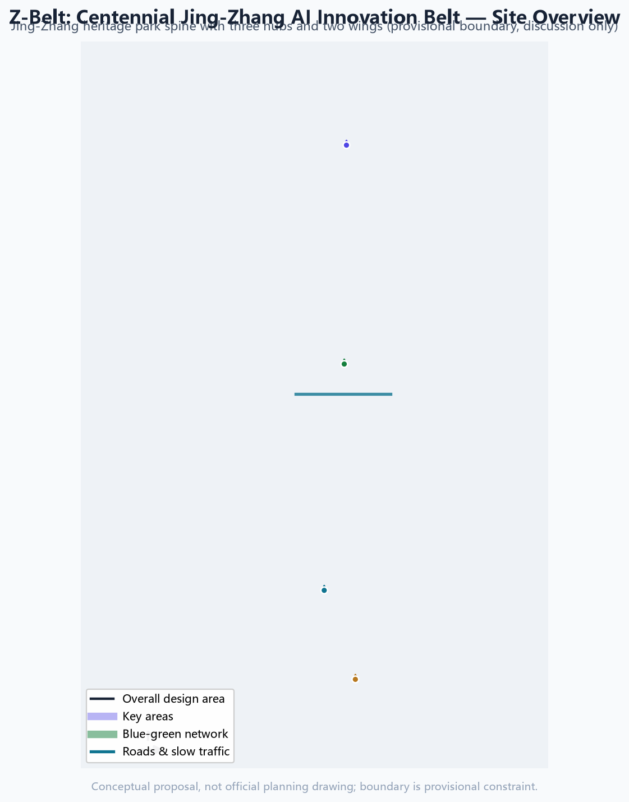
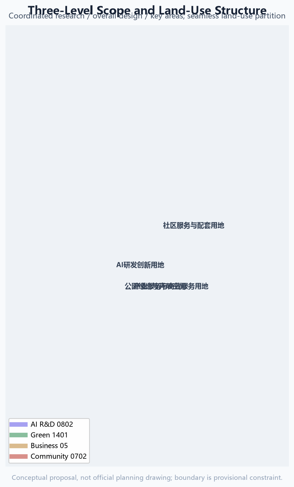
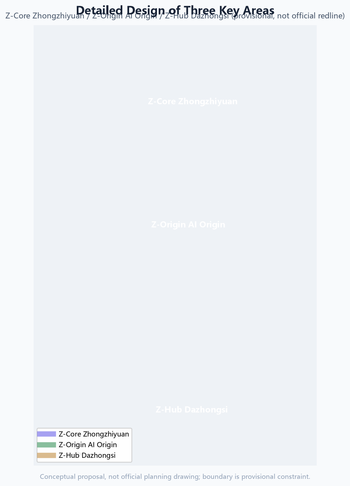
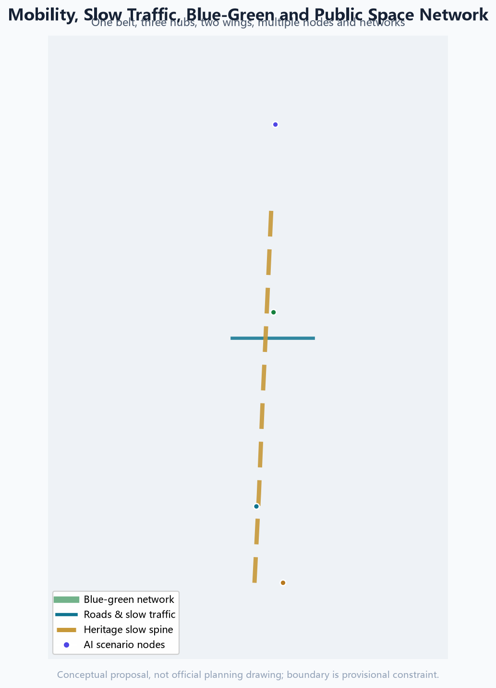
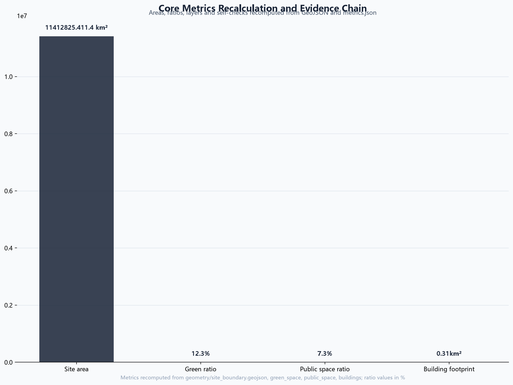

# Z-Belt: Centennial Jing-Zhang AI Innovation Belt Urban Design Proposal

## Design Basis and Source List

This formal proposal takes the Qualification Pre-Announcement for the International Urban Design Solicitation for the Centennial Jing-Zhang AI Innovation Belt (Beijing Municipal Commission of Planning and Natural Resources, Haidian Branch) as its primary basis, and uses the maintainer-registered provisional boundary, key areas, enums, metrics and source lists under `brief/site-package/` as the machine-readable basis. The AI agent read `design_brief.json`, `allowed_design_space.json`, `sources.json`, `enums/`, `ranges/`, `schemas/`, `data/source_registry.json` and `data/processed/agent_fact_pack.md`, and used the scope, task, source-use and missing-data checklists to build the task, scope, evidence-use and gap register. The announcement requires the plan to reach the urban-design depth of a regulatory detailed plan and the urban-design depth of a comprehensive planning implementation plan, so narrative text cannot replace GeoJSON, the metrics table, the A3 booklet, A0 boards and the HTML digital deliverables.

The proposal is not an independent vision text; it organizes deliverables from the announcement, the agent-facing taskbook and the site materials. This section only places the most critical basis beside each judgment [source:OFFICIAL-ANNOUNCEMENT] [source:AGENT-TASKBOOK] [depth:existing_conditions_diagnosis]. The complete source and standard coverage is stored in `sources.json`, `standard_matrix.json` and `design_depth_matrix.json`, and is not repeated as machine indexes in the prose.

The source register currently records is as follows [source:SOURCE-REGISTRY]:

- `data/source_registry.json` records the permitted uses of public, cleared and provisional materials.
- Agents must not upgrade background-only or provisional-only materials into official boundaries, statutory regulatory controls, formal scoring evidence or government implementation commitments.

`data/processed/agent_fact_pack.md` is the reading navigation layer for this proposal, not a new authority [source:PROCESSED-FACT-PACK]. It helps the agent organize the three scopes, the three key areas, the announcement tasks, agent.1-agent.6, source availability and missing-data items into a readable proposal; factual judgments still go back to the registered primary materials [source:OFFICIAL-ANNOUNCEMENT] [source:AGENT-TASKBOOK].

Until an official `SITE_BOUNDARY` or the three `KEY_AREA` polygons are available, this scaffold uses `brief/site-package/geometry/provisional_boundaries.geojson` to generate a temporary formal package. Both `geometry/site_boundary.geojson` and `geometry/key_areas.geojson` in the submission must be marked `provisional_constraint` and `official_boundary=false`, usable only for proposal generation, self-check, visualization and design discussion — never as an official redline, approval basis, precise-area basis or statutory control conclusion. This organizer data gap itself does not block content scoring; after official polygons are supplied, site boundary, key areas, land use, roads, green space, public space, buildings, phasing and metrics must all be recalculated.

The reviewable status of this submission is: **provisional boundary, precision caveat retained, recalculated when official data is published; content scoring is not blocked**. Spatial structure, scenarios, projects and metrics are therefore written on the principle of "discussable, reviewable, and recalculable after official boundary replacement". When official boundary and key-area polygons update, the agent must re-run the scaffold, self-checks and drawing/HTML generation — not merely replace a single file.

Boundary interpretation can return to the overall scope layer and area recalculation [data:geometry/site_boundary.geojson#SITE-001] [metric:site_area_sqm]. The three key areas are cross-checked by an independent layer and count metric [data:geometry/key_areas.geojson#PROV-KEY-001] [metric:key_area_count]. Readers can enter evidence from the prose without first reading a string of machine identifiers.

## Three-Level Scope Framework

The plan organizes work at the three levels defined by the announcement. The coordinated research scope focuses on the 43.6 km² AI industry ecosystem, strategic positioning, innovation chains and future city forms. The overall design scope focuses on the 11.4 km² urban area and industrial districts within 1-2 km around the Jing-Zhang Heritage Park, requiring an urban renewal master framework, industrial spatial layout, transport/municipal support and city-character control. The key detailed-design scope focuses on the three detailed-design districts of 368.4 ha, requiring functional uses, building scale, retain-renovate-demolish classification, public-space connectivity and traffic organization. The three scopes are mapped task-by-task in `compliance_matrix.json`, so every mandatory announcement task in sections 1.3, 1.4 and 1.5 and agent.1-agent.6 has chapter, layer, metric, drawing and HTML evidence.

The three-level scope depth items are governed by [depth:three_level_scope_framework] and [depth:overall_spatial_structure]; spatial evidence is anchored to [data:geometry/site_boundary.geojson#SITE-001] and [data:geometry/key_areas.geojson#PROV-KEY-001]; the task basis follows [standard:PROJECT-OFFICIAL-ANNOUNCEMENT]; and the scope index is navigated by the three-scope table in [source:PROCESSED-FACT-PACK].

The three levels are not disconnected drawing sets. The coordinated research scope decides industry-chain and city-form judgments; the overall design scope translates judgments into renewal projects, spatial structures and facility capacity; the key detailed-design scope verifies the implementability of specific parcels, buildings, traffic, public space and AI application scenarios. The agent locks the official or provisional boundary and constraints first, then generates land use, buildings, roads, green space, public space, phasing and AI service nodes, and finally recalculates metrics from these layers and explains which conclusions remain limited by the provisional boundary. Any area, ratio, scale or project count that cannot be recalculated from structured data must not be written as a formal conclusion.

The proposed overall concept is the "Jing-Zhang Intelligent-Context Symbiotic Belt": the Jing-Zhang Heritage Park is the historical and public-space spine, the three key areas are innovation anchors, and universities, enterprises, communities and rail stations form the daily network, organized as "one belt, three cores, multiple scenario points, and a blue-green slow-mobility composite loop". "One belt" is not a new redline but a translation of the announcement's three scopes into working method; "three cores" correspond to the three key areas; "multiple scenario points" are operable AI+ public-service, industry-service and city-life nodes; the "composite loop" links slow traffic, green space, public space and activity routes.

## Coordinated Research Area: Industry and Future City Research

The core task of the coordinated research scope is to build a world-class AI innovation ecosystem. The plan organizes Haidian's universities and institutes, leading enterprises, computing-power/algorithm/data factors, incubators, listed companies, unicorns and technology services into a spatial coordination framework of AI innovation chains, industry chains, talent chains and city-service chains. The naming and logo scheme serves the overall recognizability of the "Centennial Jing-Zhang Culture Belt, Urban AI Life Experience Belt, and AI Integrated Innovation Belt", and must connect with the industry ecosystem, public space and cultural resources rather than staying a slogan. The agent-facing taskbook also requires a response to the "five functions" and the "three areas, two wings" coordination, forming a deepenable naming system, visual identity, overall spatial structure diagram, scenario opening and operation mechanism; this section marks these requirements with [source:AGENT-TASKBOOK] and [standard:PROJECT-AGENT-OPEN-CALL-TASKBOOK] as coming from the agent open-call task, not from statutory planning control.

The proposal introduces the Z-Belt naming system: the belt itself is "Z-Belt" (Jing-Zhang AI Innovation Belt), the three cores are "Z-Origin" (Beijing AI Origin Community), "Z-Core" (Zhongzhiyuan AI Autonomous Innovation Acceleration Area) and "Z-Hub" (Dazhongsi AI Industry Cluster), and the two wings are the "Z-Tech Wing" (Zhongguancun technology-service wing) and the "Z-Scenario Wing" (Xiaoyue River scenario-empowerment wing). The logo direction re-draws the "herringbone" track of the Jing-Zhang Railway into an AI knowledge-graph/neural topology: two rails converge into a herringbone node from which intelligent links grow, honoring Zhan Tianyou's engineering wisdom while symbolizing open source and model aggregation. The mark keeps a square composition with the herringbone apex at the centre: a hollow-node at the rail junction, three equal-angled link rays radiating up-right (knowledge-graph links) and a small solid data node joined by a thin line down-left; it scales down to a legible 16px icon, ships in a monochrome (Jing-Zhang grey) version and a reverse version for dark backgrounds, with a recommended minimum usable size of 24px and an optional animated link-line display. These logo composition, proportion, monochrome and reverse directions are conceptual only; no third-party fonts, icons or trademarks are used, and all geometric elements are authored by this AI agent [source:AGENT-TASKBOOK]. To support the global AI innovation ecosystem, the proposal compiles seven reference cases from public sources (conceptual references for professional teams to deepen) [source:AGENT-TASKBOOK]:

| Case | Region | Transferable lesson | Application in this proposal |
| --- | --- | --- | --- |
| one-north | Singapore | "Live-work-learn-play" integrated planning with multi-pole synergy | Complementary industry functions across the three areas |
| South Lake Union (SLU) | Seattle, USA | Enterprise campus blended with city public space and community services | Dazhongsi enterprise campus and public-space compound use |
| Tel Aviv startup corridor | Israel | Dense startup communities, open roadshows, government-capital-talent ecology | Open-source incubation in the AI Origin Community |
| King's Cross (KX) | London, UK | Rail-hub renewal driving knowledge clusters and creative quarters | Heritage park belt and station-area integration |
| Pangyo Techno Valley | South Korea | Government-led R&D-incubation-industrialization clustering with talent housing | Full-stack innovation clustering in Zhongzhiyuan |
| Xili Lake International Science & Education City | Shenzhen, China | University-research-industry synergy and conversion corridor | Near-campus innovation network |
| Keihin coastal belt transformation | Yokohama, Japan | Industrial belt transition to digital industry and waterfront public space | Heritage park belt activation and blue-green network |

The above cases are used only for methodology on spatial organization, industry-city integration and operation mechanisms; they do not constitute statements about enterprise lists, investment amounts, output value or fiscal commitments. Any company or park name is cited only as a public case reference.

**Regional Synergy Matrix (conceptual suggestion)**: the Z-Belt is a core node of Beijing's global AI highland, not an isolated corridor [source:AGENT-TASKBOOK]:

| Partner | Function | Z-Belt role | Conceptual mechanism |
| --- | --- | --- | --- |
| Beijiao Community | Policy, capital, leading enterprises | AI sourcing and scenario feedback | Policy pilots and HQ-R&D two-way flow (concept) |
| Future Science City | Large science facilities, original innovation | AI application and scenario validation | Basic research commercialized via Z-Tech Wing (concept) |
| Huairou Science City | Basic science, cross-disciplines | AI+science scenarios, compute demand | Scientific computing connects to Z-Core compute (concept) |
| Beijing E-Town | Smart manufacturing, robotics, AV industry | Scenario-opening and test corridor | Low-altitude delivery test belt links to E-Town manufacturing (concept) |
| Jing-Jin-Ji region | Industrial gradient, market hinterland | Core engine of the regional AI ecosystem | Data elements, talent, events radiate across Jing-Jin-Ji (concept) |

All synergies are conceptual suggestions, not confirmed agreements.

Coordinated research does not add a false precise redline; it coordinates urban character, public space and building layout as required by [standard:MOHURD-URBAN-DESIGN-MEASURES], returning to [data:geometry/land_use.geojson#LU-001], [data:geometry/public_space.geojson#PUBLIC-001] and [depth:overall_spatial_structure].

Future-city research answers how AI changes work, life, socializing, learning, mobility and public services. The plan locates AI transport systems, continuous green space, innovation-service facilities and international living-working environments as locatable functional zones, nodes, corridors and scenarios, not generic technology visions. The agent writes industry-strategy metrics, AI innovation indices, talent density, spatial-supply types and AI+ vertical application focus areas into the indicator system, marking which are official, which are design suggestions, and which still await official calibration. Global AI events, developer communities, open scenarios or pilgrimage routes must be written as "conceptual suggestions / reference schemes / material for professional teams to deepen", never as confirmed government events or implementation arrangements.

## Overall Design Area: Urban Renewal and Regulatory-Plan-Level Urban Design

The overall design area must reach the urban-design depth of a regulatory detailed plan. The proposal provides an overall urban-renewal spatial structure, identification of inefficient space, a renewal-project list, implementation-policy suggestions, industrial-function ratios, spatial-organization patterns, total building scale and comprehensive capacity assessment. `geometry/land_use.geojson` must fully cover the submitted boundary without overlap, `geometry/buildings.geojson` expresses renewed or retained building footprints, `geometry/roads.geojson` expresses micro-circulation, slow traffic and rail connections, and `metrics.json` recalculates core areas, ratios and layer counts.

This section breaks the regulatory-plan-depth content into reviewable objects per [standard:MOHURD-CONTROL-DETAILED-PLANNING]: [data:geometry/land_use.geojson#LU-001] expresses land-use structure, [data:geometry/buildings.geojson#BLDG-001] expresses building footprints, [data:geometry/roads.geojson#ROAD-001] expresses traffic organization, [metric:building_footprint_area_sqm] verifies building footprint area, and [depth:land_use_layout] with [depth:development_intensity_controls] constrain deliverable depth.

The overall design also supports transport, rail, municipal and supporting facilities. The plan proposes spatial layout and implementation paths around station-area integration, road micro-circulation, non-motorized parking, parking supply, innovation-service platforms, talent-living services, new infrastructure, distributed energy and edge computing. Building height, development intensity, road redlines, setbacks and facility standards without official control conditions must be written as "pending official regulatory-plan conditions", not as agent-inferred values masquerading as approved indicators.

## Detailed Design of Key Areas

Detailed design of the key areas is mandatory. The Zhongzhiyuan AI Autonomous Innovation Acceleration Area addresses national AI platforms, full-stack autonomous innovation, standards, safety governance, industry display, external transport, Qinghe culture, low-carbon green innovation exchange environments and green-space AI scenarios. The Beijing AI Origin Community addresses near-campus innovation, achievement incubation and conversion, talent zones, open-source systems, brand events, building retain-renovate-demolish, achievement release and display, residential life support, campus-park slow-mobility connection and station-area integration. The Dazhongsi AI Industry Cluster addresses leading enterprises, agents, intelligent terminals, content consumption, data elements, digital assets, commercial services, planned green space compound use, Dazhongsi station integration and four-quadrant pedestrian connectivity at the intersection.

The three key areas must cite [data:geometry/key_areas.geojson#PROV-KEY-001], [data:geometry/key_areas.geojson#PROV-KEY-002] and [data:geometry/key_areas.geojson#PROV-KEY-003], and [depth:three_key_area_detailed_design] checks whether they reach comprehensive-planning-implementation depth. Describing only "build a demonstration area" without function, building, traffic, public-space and implementation-project evidence is incomplete.

The three key areas must appear in `geometry/key_areas.geojson`. If official polygons are provided they are used as `official_constraint`; if official polygons are missing, `provisional_constraint` is used, but the prose, HTML, sources, assumptions and self-check must state that it cannot serve as formal scoring or approval basis. `compliance_matrix.json` covers announcement tasks 1.5.3.1, 1.5.3.2 and 1.5.3.3 separately. Design expression includes function and use, building scale, building form, retain-renovate-demolish classification, public-space system, traffic organization, slow-mobility connectivity and implementation projects. The HTML page can switch among the three key areas; the A3 booklet and A0 boards include at least the key-area master plan, local detail and indicator description.

| Key area | Design positioning | Spatial moves | AI industry and operation scenarios | Evidence |
| --- | --- | --- | --- | --- |
| Zhongzhiyuan AI Acceleration Area | Garden-style full-stack autonomous innovation block | Strengthen Qinghe waterfront, industry display, low-carbon innovation exchange and external transport; use green space for open testing and governance display | Autonomous model testing, standard-setting workshops, safety-governance display, low-carbon compute experience | [data:geometry/key_areas.geojson#PROV-KEY-001]、[depth:three_key_area_detailed_design] |
| Beijing AI Origin Community | Near-campus conversion and talent community | Organize campus-park-block slow-mobility stitching; add achievement release, talent services, living support and open-source collaboration | Open-source community, achievement release, talent-zone services, near-campus incubation | [data:geometry/key_areas.geojson#PROV-KEY-002]、[source:AGENT-TASKBOOK] |
| Dazhongsi AI Industry Cluster | Urban intelligent economy and international exchange block | Around Dazhongsi station integration, four-quadrant connectivity, commercial services and public-environment renewal of key enterprises | Agents and intelligent-terminal display, content consumption, data elements and international roadshows | [data:geometry/key_areas.geojson#PROV-KEY-003]、[metric:key_area_count] |

## AI Innovation Ecosystem, Personas, and AI+ Scenarios

The proposal builds spatial-demand personas for AI talent and enterprises, covering R&D offices, open-source collaboration, achievement release, enterprise services, talent housing, social learning, consumption life, sports leisure and international exchange. AI+ scenarios cover the directions raised in the announcement — mobility, services, consumption, healthcare, education, law and life services — forming both industry-development scenarios and AI-empowered city-function scenarios. Each scenario states its service object, spatial location, data sources, privacy boundary, human-review mechanism and operating entity.

AI scenarios must land in spatial and governance boundaries: public-space scenarios cite [data:geometry/public_space.geojson#PUBLIC-001], slow-mobility and transport scenarios cite [data:geometry/roads.geojson#ROAD-001], open-space scenarios cite [data:geometry/green_space.geojson#GREEN-001] and [metric:public_space_ratio], [metric:green_ratio]. These citations show reviewers that scenarios are not slogans but designed objects in concrete layers and metrics. The agent taskbook requires at least 10 AI scenario cards, at least 3 industry test/validation scenarios and at least 5 user personas; the final proposal must write scenario cards, persona tables, privacy boundaries, human review and operating entities into the prose, HTML, A3/A0 and compliance matrix.

| Persona | Typical needs | Spatial response | Self-check boundary |
| --- | --- | --- | --- |
| Open-source developer | Release, collaboration, testing, community reputation | Origin-community open-source release hall, public code wall, night collaboration space | No personal behavioral tracking; activity data aggregated only |
| Startup team | Low-cost space, compute access, product testbed | Zhongzhiyuan shared test site, edge-compute service points, standards-governance consulting | Compute and data services require separate authorization |
| Leading-enterprise visitor | Display, business, international reception, recruitment | Dazhongsi international roadshow hall, station connection, public environment of key enterprises | Enterprise marks and cases require cleared rights |
| Surrounding resident | Commuting, leisure, community services, low-perturbation renewal | Heritage park slow loop, embedded community services, tiered night lighting and events | No residential profiles for commercial recommendation |
| University faculty and student | Achievement transfer, cross-campus collaboration, daily walking | Campus-park stitching, transfer stations, AI education experience points | Campus data and research results require authorization |

| Elderly residents | Accessible mobility, traditional human services, health and social contact | Accessible slow loop, community human-service desks, non-digital channels, senior-friendly AI voice assistant | No forced digital use; human counters preserved; health data stays in domain |
| Children and youth | Safe play, AI literacy education, parental care | Child-friendly park nodes, AI science classes, parent-supervised routes | No minors' personal data collected; education data desensitized |
| Persons with disabilities | Continuous accessibility, voice interaction, assisted travel | Barrier-free routes, voice navigation, service-dog rest points | Complies with barrier-free law; assistance not dependent on personal identification |
| Low-digital-literacy users | Traditional channels preserved, digital guidance, intergenerational help | Community digital-assistant desks, family intergenerational stations | Digital services optional; human alternatives always available |
| Night workers | Safe lighting, 24h services, commute connections | Tiered night lighting, 24h convenience and rest points, night bus links | Night data used for safety only, not profiling |
**Measurable public-interest indicators (conceptual framework, to be calibrated against official baselines)**: so inclusion commitments are checkable rather than slogans, the table below proposes verifiable indicators, inspection methods and current status for each public-interest dimension; professional teams set targets against actual service baselines during formal deepening [source:AGENT-TASKBOOK] [standard:PROJECT-AGENT-OPEN-CALL-TASKBOOK]:

| Public-interest dimension | Proposed indicator (concept) | Inspection method | Current status |
| --- | --- | --- | --- |
| Accessibility continuity | Tactile-paving/step-free continuity rate on main public routes; accessible toilet and elevator coverage | On-site measurement + drawing review | Pending official road and building data |
| Traditional service channels | Number of human counters retained per community; telephone/on-site booking availability | Service ledger sampling | Conceptual commitment; pending operations |
| On-site human assistance | Number of human guide posts in peak hours; volunteer training coverage | Rosters and training records | Conceptual recommendation |
| Digital opt-out options | 100% availability target of human fallback for every digital service; visible opt-out | Service-flow walkthrough | Design principle declared |
| Complaint handling | Response time (e.g. 48h), closure rate, result publication | Complaint ledger + follow-up survey | Pending operating entity |
| Community participation procedures | Annual participation sessions, adoption rate of resident feedback, disclosure and feedback mechanism for renewal projects | Event records + meeting minutes | Conceptual mechanism; pending pilot |

The indicators above are a conceptual framework and do not constitute confirmed public-service commitments or government assessment targets; baselines must be set with actual demand surveys during implementation.

| Scenario card | Spatial carrier | Design description |
| --- | --- | --- |
| 01 Open-source release hall | Beijing AI Origin Community | For universities, open-source communities and startups: release, code-contribution display and small roadshows |
| 02 Safety-governance sandbox | Zhongzhiyuan | Translate standard-setting, safety evaluation and model red-teaming into visitable, bookable, supervised display and collaboration nodes |
| 03 Edge-compute station | Overall-design nodes | Combined with public services, enterprise services and low-carbon energy strategy as a new-infrastructure prototype to deepen |
| 04 AI slow-mobility navigation | Heritage park active belt | Explainable wayfinding and low-intrusion sensing to identify gaps, congestion nodes and accessibility needs |
| 05 Dazhongsi international roadshow hall | Dazhongsi AI Industry Cluster | Display, negotiation, media release and international exchange for agent, intelligent-terminal and content-consumption enterprises |
| 06 Qinghe low-carbon innovation corridor | Zhongzhiyuan Qinghe waterfront | Combine green space, stormwater, walking-cycling and AI display as the park public living room |
| 07 Near-campus achievement transfer street | Beijing AI Origin Community | Incubation, display, legal, IP and investment services for university achievement transfer |
| 08 Data-element reception hall | Dazhongsi area | Display data-element and digital-asset circulation as a city-service interface under compliance, authorization and auditability |
| 09 AI life-service sample street | Community-commerce junction | Land AI+ healthcare, education, legal and life services in an operable small-scale block space |
| 10 Global AI event week route | Belt public-space system | A walkable, communicable experience route from heritage culture, open source, industry display to international roadshow |
| 11 Community AI health hut | Community service node | AI-assisted triage, chronic-disease digital management and health data staying in domain |
| 12 Native consumption street | Dazhongsi area | Unmanned delivery, smart retail and digital-asset experience as native new-form blocks |

Industry test/validation scenarios (conceptual suggestions; professional teams must deepen them according to test safety, data compliance and site conditions):

| Test scenario | Suggested site | Test content | Compliance boundary |
| --- | --- | --- | --- |
| Low-altitude economy and unmanned delivery test belt | Xiaoyue River scenario wing | Ground-low-altitude mixed operation and transfer tests for drones/delivery robots | Airspace, traffic and safety approval first; no personal trajectory collection |
| Embodied intelligence and human-robot co-existence test field | Zhongzhiyuan/Dazhongsi | Safety testing and standard validation for robot obstacle avoidance, grasping, human-robot collaboration | Site isolation and data desensitization; results are not approved operation |
| AI governance and content-safety compliance sandbox | Zhongzhiyuan | Open laboratory for LLM evaluation, red-teaming and data-compliance simulation | Traceable generated content; human review first |
| Digital-twin city operation simulator | AI Origin Community | City-level event simulation and AI decision rehearsal | Simulation data only; does not replace real approvals |

Scenario-space-operation-governance matrix (conceptual, for professional deepening; feature ids are concept node numbers):

| No. | Scenario | Carrier (feature id) | Users | Minimal data | Human review | Operator | KPI (concept) | Exit condition | Non-digital fallback |
| --- | --- | --- | --- | --- | --- | --- | --- | --- | --- |
| S01 | Open-source release hall | Origin NODE-A | Developers/startups | Aggregated activity data | Content review | Community operator | Monthly events | Stop on safety violation | Offline release |
| S02 | Governance sandbox | Zhongzhiyuan NODE-B | Enterprises/regulators | Desensitized logs | Expert review | Governance operator | Evaluation pass rate | Stop on violation | Offline evaluation |
| S03 | Edge-compute station | Belt NODE-C | Startups/residents | Energy metering | Equipment inspection | Facility operator | Usage hours | Stop if inefficient | Human desk |
| S04 | Slow-mobility navigation | Park ROAD-001 | All citizens | No personal traces | Human patrol | Transport operator | Gap detections | Stop on privacy complaint | Physical signs |
| S05 | Roadshow hall | Dazhongsi NODE-D | Visitors | Booking info | Content review | Business operator | Roadshow count | Stop for safety | Offline events |
| S06 | Low-carbon corridor | Zhongzhiyuan GREEN-001 | All/enterprises | Environmental data | Ecology experts | Landscape operator | Carbon monitoring rate | Stop if ecology harmed | On-site guides |
| S07 | Transfer street | Origin BLDG-001 | Faculty/students | Desensitized IP | Expert review | Transfer operator | Transfer projects | Stop if no transfer | Offline matchmaking |
| S08 | Data-element hall | Dazhongsi NODE-E | Enterprises | Authorization log | Compliance audit | Data operator | Compliance rate | Stop on violation | Paper processing |
| S09 | Life-service street | Junction NODE-F | Residents/seniors | Minimum necessary | Community oversight | Service operator | Satisfaction | Stop if complaints | Human counters |
| S10 | Global AI week route | Belt PUBLIC-001 | Global visitors | Aggregated stats | Security review | Event operator | Participation | Stop for safety | Traditional festivals |
| S11 | AI health hut | Community NODE-G | Seniors/chronic | Health data in domain | Medical review | Community health | Visits | Stop on data breach | Walk-in clinic |
| S12 | Native retail street | Dazhongsi NODE-H | Consumers | Minimal transaction | Merchant checks | Commercial operator | Traffic/sales | Exit if unviable | Traditional retail |

All 12 nodes (NODE-A..NODE-H plus 4 reused nodes) are concept numbering, not GeoJSON features (SCENARIO_NODE layer is optional; this package carries them in tables + compliance matrix to avoid fabricating precise coordinates); professional teams must add real feature ids, approval prerequisites and operating agreements [source:AGENT-TASKBOOK].
**AI node service scope and operation flow (conceptual recommendation)**: to make the "scenario-space-data-operation-performance" chain readable in static deliverables, the table below adds a conceptual service scope (walking/cycling reach, not a precise catchment) and an operation flow (input to process to output to human review) for each concept node, to be converted into real feature ids and facility layouts by professional teams in detailed design [source:AGENT-TASKBOOK]:

| Node | Served users | Conceptual service scope | Operation flow (concept) | Human review step |
| --- | --- | --- | --- | --- |
| NODE-A Open-source release hall | Developers/startups | 500m walking circle, Origin community | Booking-registration to scheduling to release/roadshow to community archive | Content review + safety assessment |
| NODE-B Governance sandbox | Enterprises/regulators | 800m, Zhongzhiyuan campus | Enterprise application to evaluation booking to red-team test to report review | Regulator + expert double review |
| NODE-C Edge-compute station | Startups/residents | 1.5km service circle, overall area | Identity check to compute scheduling to billing to energy logging | Equipment inspection + metering audit |
| NODE-D International roadshow hall | Enterprise visitors | 600m, Dazhongsi | Venue booking to security plan to roadshow to media release | Content and brand rights review |
| NODE-E Data-element lounge | Enterprises | Dazhongsi district | Authorization application to compliance review to showcase/circulation to audit trail | Compliance audit first |
| NODE-F AI lifestyle demo street | Residents/elderly | 300m, community | Demand report to dispatch to human-counter/digital dual channel to satisfaction follow-up | Community supervision + complaint closure |
| NODE-G Community AI health cabin | Elderly/chronic patients | 300m, community | Booking to assisted diagnosis to on-site health data processing to clinician review | Clinician human review |
| NODE-H AI-native retail street | Consumers | 400m, Dazhongsi | Transaction to minimal dataset to anomaly detection to human customer service | Merchant self-check + platform inspection |

The scopes and flows above are conceptual recommendations only and do not constitute precise catchment commitments or confirmed operations; they must be deepened against the actual road network, accessibility analysis and operating agreements.

AI-governance suggestions follow data minimization, public sources, explainability and human review. A city agent may assist in identifying slow-mobility gaps, public-space heat, facility maintenance, enterprise-service needs and event-safety risk, but it cannot replace planning approval, output unauthorized personal profiles, or claim official implementation commitments. All AI scenario nodes enter structured layers or the compliance matrix so reviewers see their relationship to industry, space and public interest.

## Land Use, Building Scale, and Retain-Renovate-Demolish Strategy

The land-use scheme follows public land-use classification standards to form a complete, closed, seamless partition. The building scheme distinguishes retained, renovated, renewed, new-built or pending-confirmation objects, and clarifies the suggested hierarchy of footprint, function, scale, character, roof, massing and height control. Without existing buildings, ownership, regulatory plans and engineering conditions, the proposal can only provide methods and a pending-calibration list, not fabricated retain-renovate-demolish conclusions.

Land-use classification follows [standard:MNR-LAND-USE-CLASSIFICATION-GUIDE]; building height, massing, facade and character control is governed by [depth:height_massing_character]; retain-renovate-demolish methods by [depth:retain_renovate_demolish]. The main land and building evidence is [data:geometry/land_use.geojson#LU-001], [data:geometry/buildings.geojson#BLDG-001] and [metric:building_footprint_area_sqm].

Building scale and intensity indicators must be consistent with `metrics.json` and the layers. Where total floor area, FAR, building height, building density, green ratio, setbacks and building control lines lack official conditions, use `status=unknown` uniformly, and explain the pending conditions, current assumptions and recalculation path in `reason`/`assumptions`, rather than manufacturing precision with fixed numbers. The A3 booklet gives the renewal-project list and indicator-verification table; the A0 boards express key spatial structure and key areas; the HTML page provides indicator-layer linked views.

## Transport, Rail, Municipal Infrastructure, and Public Services

The transport scheme responds to the announcement's requirements on station-area integration, road micro-circulation, slow-mobility gaps, external transport, parking, non-motorized parking and green transport. Priority covers the North 5th Ring Road, heritage-park crossing points, Wudaokou, west end of Qinghua East Road, Dazhongsi station and key-enterprise surroundings. Road and slow-mobility layers stay within the submitted boundary and cross-check with public space, green space, industry nodes and key areas; if the boundary is provisional, transport conclusions remain temporary design discussion.

Transport and municipal professional depth is governed by [depth:traffic_rail_slow_parking] and [depth:municipal_new_infrastructure]; layer evidence cites [data:geometry/roads.geojson#ROAD-001], [data:geometry/public_space.geojson#PUBLIC-001] and [data:geometry/constraints.geojson#CONSTRAINTS]. When road redlines, pipelines, fire and municipal conditions are missing, they are recorded in assumptions as pending rather than written as approved conditions.

Municipal and public-service facilities cover AI industry-service facilities, innovation-service platforms, talent-living services, new infrastructure, distributed energy, edge computing and integration with conventional municipal facilities. The proposal states facility standards, spatial layout, service radius, operation modes and phasing logic. Missing pipeline, energy, drainage, flood and fire engineering data is listed as a precondition for formal deepening.

## Blue-Green Network, Public Space, and Urban Character

The blue-green scheme takes the Jing-Zhang Heritage Park active belt as the spine, coordinating Qinghe, Xiaoyue River, surrounding universities, enterprises and community travel to propose a north-south through, east-west connected walking, cycling and green-space system. It identifies slow-mobility gaps, elevated-crossing nodes, and landscape nodes at the park's south and north ends, and proposes compound-use strategies for parking, sports, innovation exchange, technology testing, application display and public services.

Blue-green public space is cross-checked by the design-depth items and green/public-space layers [depth:blue_green_public_space] [data:geometry/green_space.geojson#GREEN-001] [data:geometry/public_space.geojson#PUBLIC-001]. Green and public-space ratios are explained in prose; complete recalculation is stored in `metrics.json`; the coordination of urban character, public space and building control returns to the professional-standard matrix [standard:MOHURD-URBAN-DESIGN-MEASURES].

The city-character scheme fuses Jing-Zhang railway heritage culture, Zhongguancun innovation culture and AI new culture, using cultural resources such as the Qinghuayuan railway station and Beijing Film Academy to propose city tone, building character, roof forms, massing, facades and public-art guidance. The proposal also proposes wayfinding signs, cultural symbols, international communication narrative, AI pilgrimage landmarks, contribution walls or honor-display systems, but all brands, fonts, images, portraits and enterprise marks require cleared sources. Character control separates official control, design suggestions and pending conditions, and never gives false precise control lines without heritage or regulatory-plan basis.

The proposal's cultural narrative runs in three chapters — "Rails" (1905-1909, the herringbone line and China's autonomous engineering spirit), "Valley" (1980-2010, Zhongguancun innovation and entrepreneurship), and "Minds" (2020-, AI new culture of open source, collaboration and city agents). The international tagline is "Built on Rails, Powered by Minds"; the Chinese tagline is "京张百年，智张未来". The wayfinding symbol system translates railway sleepers into intelligent nodes, old station signs into smart terminals, and signal flags into data flows. Four AI pilgrimage landmarks are proposed: the Z-Origin Beacon at the north end of the AI Origin community, the Herringbone Topology Plaza at the core of the heritage park, the AI Natives Pavilion in Dazhongsi, and the Compute Light Node in Zhongzhiyuan — all conceptual, and all requiring cleared rights.

## Renewal Projects, Implementation Policy, and Phasing

The implementation scheme forms a reviewable renewal-project list stating location, type, function, responsible entity, dependencies, phase, risk and evaluation indicators. Policy suggestions cover coordinated urban-renewal implementation, spatial supply, operation mechanisms, industry services, public participation, data governance and property-right coordination. `geometry/phasing.geojson` expresses phasing scope; `compliance_matrix.json` connects every task to phasing and drawings.

Project-list and phasing depth are governed by [depth:renewal_project_list] and [depth:phasing_implementation]; the three phasing polygons sum within ~3.8 m² of site_area_sqm (topology tolerance from horizontal band cutting re-projected to EPSG:4548), far below any planning precision; all values will be recalculated once official boundaries arrive; the phasing spatial evidence is [data:geometry/phasing.geojson#PHASE-001]. Without ownership, funding, implementing entities and approval paths, the proposal writes them as implementation risk rather than commitment.

| Project | Name | Type | Key dependencies | Evidence |
| --- | --- | --- | --- | --- |
| JZ-01 | Heritage park slow-mobility gap stitching | Public space / mobility | Road redlines, underpass space, traffic organization | [data:geometry/roads.geojson#ROAD-001] |
| JZ-02 | Zhongzhiyuan Qinghe innovation waterfront | Blue-green / industry display | River blue line, ecology and flood conditions | [data:geometry/green_space.geojson#GREEN-001] |
| JZ-03 | Origin-community near-campus transfer street | Renewal / industry service | Campus boundary, ownership, ground-floor uses | [data:geometry/buildings.geojson#BLDG-001] |
| JZ-04 | Dazhongsi station four-quadrant connectivity | Station integration / slow traffic | Station, intersections, municipal pipelines | [data:geometry/public_space.geojson#PUBLIC-001] |
| JZ-05 | AI public service and edge-compute nodes | New infrastructure / public service | Energy, compute, safety, operating entity | [data:geometry/constraints.geojson#CONSTRAINTS] |
| JZ-06 | Global AI event week public route | Operation / brand | Public-space permits, event safety, cleared rights | [data:geometry/phasing.geojson#PHASE-001] |

Implementation-element table (conceptual; lead/approval/operation roles, cost levels, phase gates, KPIs and exit conditions are suggested frameworks, not investment commitments or confirmed arrangements):

| Project | Lead role | Partners/approval | Operator | Funding type | Phase gate | Cost level | Window | KPI (concept) | Exit condition |
| --- | --- | --- | --- | --- | --- | --- | --- | --- | --- |
| JZ-01 Gap stitching | Local street office | Transport/parks | Park operator | Public + social | Traffic review passed | Medium | 1-3y | Gaps eliminated | Safety failure |
| JZ-02 Qinghe waterfront | Zhongzhiyuan operator | Water/ecology | Landscape operator | Park investment | Blue-line confirmed | Medium | 1-3y | Waterfront open hours | Ecology exceeded |
| JZ-03 Transfer street | Park operator | Universities/owners | Transfer platform | Mixed funding | Ownership agreement | Low | 1-3y | Transfer projects | No transfer 2 years |
| JZ-04 Four-quadrant link | Rail/municipal depts | Transport/municipal | Transport operator | Public | Pipeline survey done | High | 3-6y | Transfer walking time | Engineering infeasible |
| JZ-05 AI public nodes | Tech-service dept | Energy/safety | Platform operator | PPP | Energy+safety approval | Medium | 1-3y | Service coverage | Safety violation |
| JZ-06 Event week route | Brand operator | Police/culture | Event operator | Market-based | Event safety permit | Low | 1-3y | Participation | Safety stop |

All elements are conceptual frameworks for professional implementation teams; not government funding commitments, approvals or confirmed arrangements [source:AGENT-TASKBOOK].
**Procurement and maintenance paths (conceptual recommendation)**: beyond the implementation elements, each project needs a clear "who procures, who maintains, how often inspected" path so the concept does not stop at drawings. The paths below are reference frameworks; formal procurement must follow government procurement, tendering and industry rules [source:AGENT-TASKBOOK]:

| Project | Suggested procurement/acquisition path | Maintenance responsibility and cycle | Suggested asset ownership | Risk trigger |
| --- | --- | --- | --- | --- |
| JZ-01 Slow-mobility gap stitching | Public works project + municipal facility program | District street office annual inspection | Public asset | Structural safety anomaly |
| JZ-02 Qinghe innovation waterfront | Park investment + ecological review | Landscape operator quarterly maintenance | Park + public composite | Ecological monitoring exceedance |
| JZ-03 Near-campus transfer street | Multi-source financing + property negotiation | Transfer platform annual evaluation | Property owner + operator co-managed | No transfer for 2 consecutive years |
| JZ-04 Dazhongsi four-quadrant connection | Joint rail/municipal project | Transport authority periodic inspection | Municipal asset | Engineering infeasibility |
| JZ-05 AI public-service node | Public-private partnership + compute-service procurement | Platform operator monthly inspection | Public-private co-managed | Safety violation |
| JZ-06 Event-week route | Market-based recruitment + event permit | Event operator pre-event inspection | Event operation asset | Safety-risk shutdown |

**Implementation milestones (conceptual timeline)**: aligned with the solicitation cycle and urban-renewal rhythm, the framework is "near-term pilot (0-1y) - mid-term deepening (1-3y) - long-term governance (3-6y)", validating demand first through lightweight facilities, operations and service platforms, then entering construction once official regulatory, municipal, transport and property conditions are confirmed [source:AGENT-TASKBOOK]:

| Milestone | Time window (concept) | Key deliverable | Gate condition |
| --- | --- | --- | --- |
| M1 Pilot launch | 0-1y | Lightweight facilities + scenario opening + community participation pilot | Event safety and data-compliance plan approved |
| M2 Scheme deepening | 1-3y | Renewal-project implementation scheme + specialized design | Official regulatory/road-redline/property conditions clarified |
| M3 Construction and operation | 3-6y | Phased construction + long-term operation mechanism | Project approval, funding and approval path in place |

The milestones and procurement paths above are conceptual recommendations and do not constitute implementation commitments; actual progress follows official plans and professional conclusions.

Phasing is distinguished from the 100-day solicitation cycle: the solicitation cycle is the deadline for submitting deliverables; implementation phasing is the advancement path of urban renewal and construction. The proposal proposes early pilot, mid-term renewal and long-term governance frameworks, marking which can start with lightweight facilities, operation activities and service platforms, and which must await confirmed regulatory plans, municipal, transport and ownership conditions. For the annual event system, developer-community operation, scenario open days, public experience routes and international communication mechanisms, the prose states operating object, frequency, responsibility boundary, conversion path and risk, not just slogans.

The long-term operation system includes the Z-Belt annual events (the Z-Belt AI Developer Conference, the herringbone maker marathon, the Z-Origin open-source week, the Dazhongsi native-consumption carnival and the Z-Belt International AI City Forum), the Z-Belt developer community with contribution walls and honor systems, the AI scenario open sandbox, and the global AI pilgrimage route. The conversion path runs event attraction → open-scenario experience → incubation and landing → brand-asset accumulation. All are conceptual suggestions for professional teams to deepen.

## Metrics, Area Recalculation, and Compliance Matrix

The indicator system includes at least overall-design-area area, key-area areas, green and public-space ratios, building footprint, renewal-project count, AI scenario nodes, slow-mobility connectivity, industry-space metrics, talent-service metrics and self-check status. Every known metric must be recalculable from GeoJSON or a trusted source; unknown metrics must give reasons and formal-submission preconditions. `scripts/spatial_review.py` and `scripts/visual_review.py` results are important evidence for the formal self-check.

Metric recalculation follows the unified design-depth requirement [depth:metrics_recalculation]. The prose explains the design meaning of metrics — how the overall scope constrains spatial allocation, how blue-green and public-space ratios support daily exchange — while the complete values, formulas, source files and confidence live in `metrics.json`. Example key metrics can be verified from the overall scope and green data [metric:site_area_sqm] [data:geometry/green_space.geojson#GREEN-001].

The compliance matrix is the master control for task responsiveness. Every announcement task and agent-taskbook task must map to report chapters, layers, metrics, drawings, HTML pages, sources, assumptions and self-check items. Failure to cover any mandatory task in announcement sections 1.3, 1.4, 1.5 or agent.1-agent.6 prevents the proposal from entering formal professional scoring.

During formal deepening, the agent classifies each metric into three types: spatial metrics directly recalculable from submitted geometry (boundary area, green ratio, public-space ratio, building-footprint area, phasing areas); control metrics requiring official regulatory plans or taskbook attachments (FAR, building height, building density, setbacks, road redlines, facility standards); and performance metrics requiring continuous operation or industry data calibration (AI innovation index, talent density, industry-service satisfaction, slow-mobility accessibility, event participation, scenario-use frequency). The three types enter `metrics.json`, `assumptions.json` and `compliance_matrix.json` respectively, so operational visions are not mistaken for approved planning conditions.

## Risk, Copyright, and Compliance

**Bilingual requirement.** The primary proposal may use Chinese or English, but must provide a complete counterpart translation as `proposal.zh.md` or `proposal.en.md`; the A3/A0 drawings, HTML and text-bearing figures must also provide the counterpart language, preferably using `docs/terminology-glossary.md` recommended terminology. A v2 package missing any required translation, language mapping or valid file is blocked by finalization and CI. All images, drawings, icons, data and code assets must state their source, license and authorization status in `sources.json` or `report/copyright_statement.md`. HTML pages must not load remote scripts, remote map tiles, remote fonts, iframes, forms or external APIs, and must not track reviewers.

Risks and the missing-data list are cross-checked by the risk depth item, the constraint layer and the site package [depth:risk_missing_data] [data:geometry/constraints.geojson#CONSTRAINTS] [source:SITE-PACKAGE]. The official-boundary, key-area, regulatory-plan, road, parcel, building, municipal, heritage and public-service gaps listed in the missing-data checklist must enter `assumptions.json`, the self-check and the prose risk chapter. Any conclusion lacking official regulatory plans, road redlines, ownership, municipal, fire or heritage conditions is downgraded to a pending item; complete professional verification is stored in the standard matrix.

This proposal does not claim official approval, approved regulatory plans, final land ownership, final construction scale or guaranteed implementation. The AI agent is responsible for facts, sources, copyright, spatial data, metrics and expression; maintainers and professional reviewers may require revision or rejection based on self-check results, spatial review and the compliance matrix.

## References

- brief/public-brief.md
- brief/site-package/design_brief.json
- brief/site-package/allowed_design_space.json
- brief/site-package/enums/
- brief/site-package/ranges/planning_limits.json
- data/processed/agent_fact_pack.md
- data/processed/project_scope_summary.csv
- data/processed/agent_task_requirements.csv
- data/processed/source_use_matrix.csv
- data/processed/missing_data_checklist.csv
The complete machine index lives in `sources.json`, `metrics.json`, `compliance_matrix.json`, `standard_matrix.json` and `design_depth_matrix.json`; the bibliography entry here is keyed to the site package registry, with full provenance and licenses in the structured source list [source:SITE-PACKAGE].
- This bibliography entry uses the site-package register; complete provenance and licenses are in the structured source list [source:SITE-PACKAGE]
