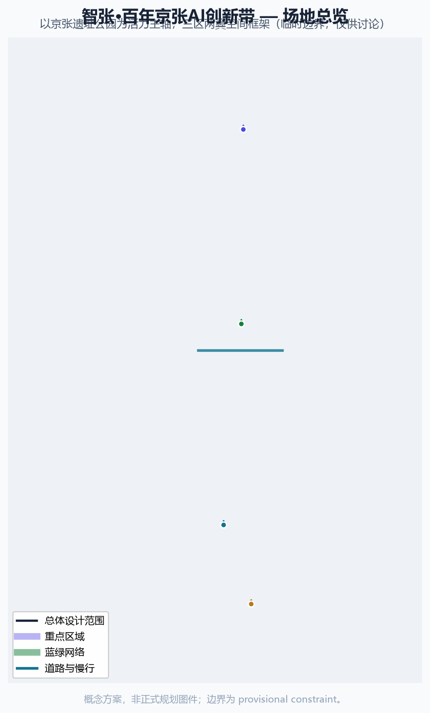
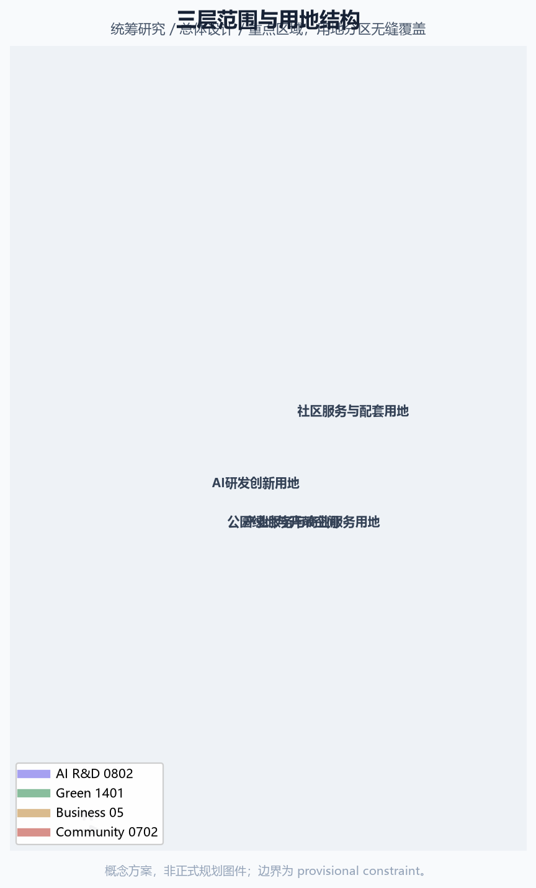
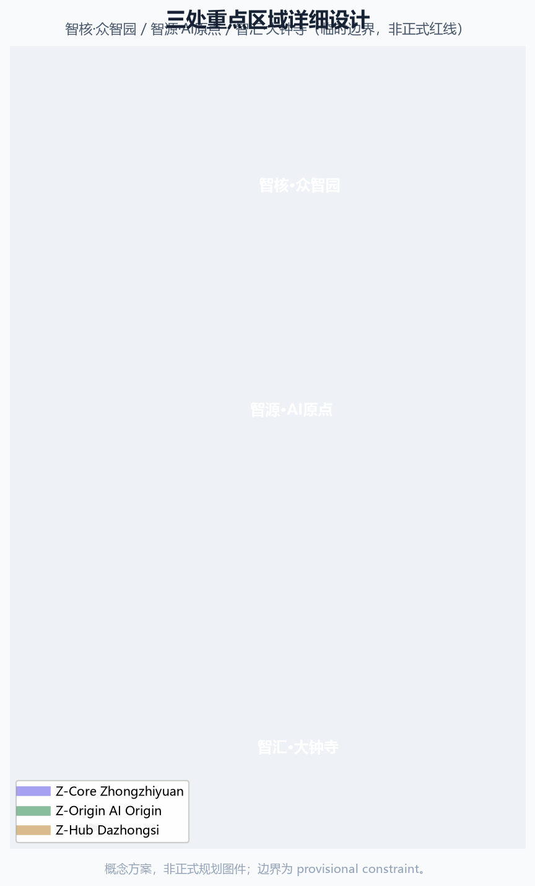
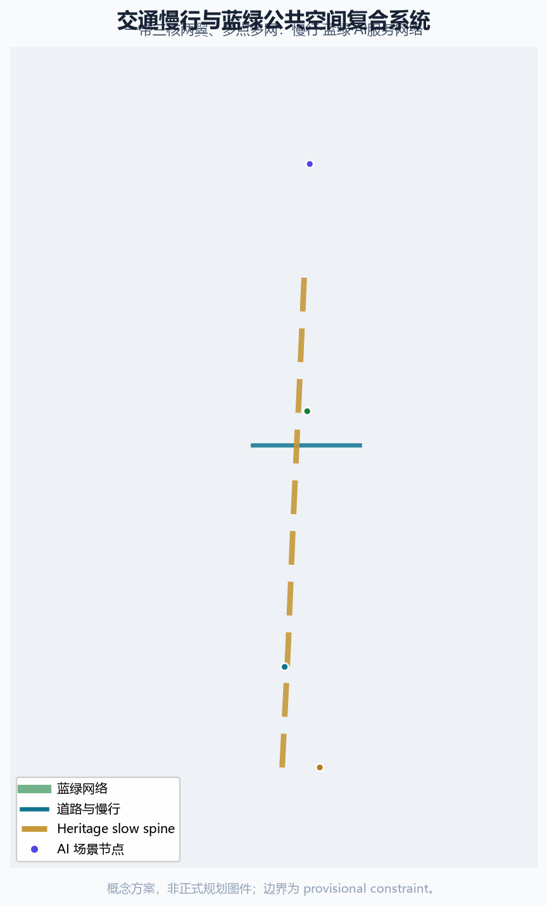
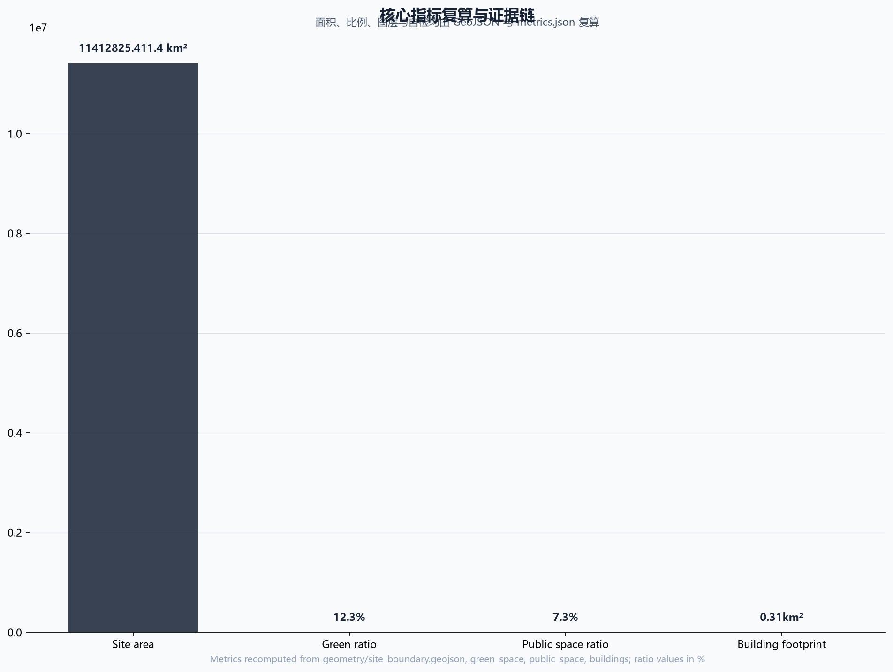

# 智张：百年京张AI创新带城市设计方案

## 设计依据与资料清单

本 formal 方案以北京市规划和自然资源委员会海淀分局发布的《百年京张AI创新带城市设计国际方案征集资格预审公告》为第一依据，并以 `brief/site-package/` 中经维护者登记的临时粗略边界、重点区域、枚举、指标和来源清单为机器可读依据。AI agent 在生成方案前必须读取 `design_brief.json`、`allowed_design_space.json`、`sources.json`、`enums/`、`ranges/`、`schemas/`、`data/source_registry.json` 和 `data/processed/agent_fact_pack.md`，并用 `project_scope_summary.csv`、`agent_task_requirements.csv`、`source_use_matrix.csv`、`missing_data_checklist.csv` 建立任务、范围、资料用途和缺口清单。所有设计判断都要拆分为可追溯来源、可复算指标、可校验图层和可人工复核假设。公告要求方案达到控制性详细规划的城市设计深度和规划综合实施方案的城市设计深度，因此文本叙述不能替代 GeoJSON、指标表、A3 文册、A0 展板和 HTML 电子展示成果。

方案不是独立愿景文本，而是从公告、面向智能体任务书和场地资料出发组织成果；本节只把最关键依据放在判断旁边 [source:OFFICIAL-ANNOUNCEMENT] [source:AGENT-TASKBOOK] [depth:existing_conditions_diagnosis]。完整来源和标准覆盖分别保存在 `sources.json`、`standard_matrix.json` 与 `design_depth_matrix.json`，不在正文重复机器索引。

资料登记表的使用边界如下 [source:SOURCE-REGISTRY]：

- data/source_registry.json 登记公开、清权与临时资料的用途边界。
- 当前登记摘要：formal 可用资料 7 条，背景资料 1 条，provisional-only 资料 1 条（均为 data/source_registry.json 登记公开/清权/临时材料）。
- agent 不得把 background_only 或 provisional_only 资料升级为 official boundary、法定控规、正式评分依据或政府实施承诺。

`data/processed/agent_fact_pack.md` 是本方案的阅读导航层，不是新的权威来源 [source:PROCESSED-FACT-PACK]。它帮助 agent 把三层范围、三处重点区、公告任务、agent.1-agent.6、资料可用性和缺资料事项组织成可读方案；事实判断仍需回到已登记的原始材料 [source:OFFICIAL-ANNOUNCEMENT] [source:AGENT-TASKBOOK]，完整来源关系由 `sources.json` 保存。

本脚手架在官方 `SITE_BOUNDARY` 或三处 `KEY_AREA` 尚未取得时，使用 `brief/site-package/geometry/provisional_boundaries.geojson` 生成临时 formal 包。提交包中的 `geometry/site_boundary.geojson` 与 `geometry/key_areas.geojson` 均必须标注为 `provisional_constraint`、`official_boundary=false`，只能用于方案生成、自检、可视化和设计讨论，不能作为 official redline、审批依据、精确面积依据或法定控制结论。该组织方数据缺口本身不阻断内容评分；替换 official polygons 后，site boundary、key areas、land use、roads、green space、public space、buildings、phasing 和 metrics 均需重算。

本次脚手架生成的可评分状态为：**临时边界，保留精度警示与复算路径；组织方几何缺口不阻断内容评分**。因此，正文中的空间结构、场景、项目和指标均按“可讨论、可复核、可替换官方边界后重算”的原则写入；当官方边界和重点区 polygon 更新后，agent 必须重新运行脚手架、自检和图纸/HTML生成，不能只替换单个文件。

边界解释可回到总体范围图层和面积复算 [data:geometry/site_boundary.geojson#SITE-001] [metric:site_area_sqm]。三处重点区则由独立图层和数量指标核对 [data:geometry/key_areas.geojson#PROV-KEY-001] [metric:key_area_count]。这意味着读者可以从正文进入证据，但不必先读一串机器编号。

## 三层范围工作框架

方案按照公告确定的三个层次组织工作：统筹研究范围关注 43.6 平方公里的AI产业生态、战略定位、创新链和未来城市形态；总体设计范围关注 11.4 平方公里京张遗址公园周边 1-2 公里城市地区和产业区，要求形成城市更新总体框架、产业空间布局、交通市政支撑和城市风貌控制；重点区域范围关注 368.4 公顷三处详细设计地区，要求明确功能业态、建筑规模、拆改留分类、公共空间连通和交通组织。三层范围在 `compliance_matrix.json` 中逐条映射，保证公告 1.3、1.4、1.5 与 agent.1-agent.6 的必选任务都有章节、图层、指标、图纸和 HTML 证据。

三层工作框架的深度项由 [depth:three_level_scope_framework] 和 [depth:overall_spatial_structure] 约束，空间证据以 [data:geometry/site_boundary.geojson#SITE-001] 与 [data:geometry/key_areas.geojson#PROV-KEY-001] 为准，任务依据以 [standard:PROJECT-OFFICIAL-ANNOUNCEMENT] 为准，范围索引以 [source:PROCESSED-FACT-PACK] 中 `project_scope_summary.csv` 的三层范围表为导航。

三层工作不是互相割裂的图纸集合。统筹研究决定产业链和城市形态判断，总体设计把判断落实到更新项目、空间结构和设施承载，重点区域详细设计验证具体地块、建筑、交通、公共空间和AI应用场景的可实施性。agent 生成方案时必须先锁定当前提交采用的 official 或 provisional 边界和约束，再生成用地、建筑、道路、绿地、公共空间、分期和AI服务节点，最后从这些图层复算指标并在正文解释哪些结论仍受 provisional boundary 限制。任何无法从结构化数据复算的面积、比例、规模或项目数量，不得写入正式结论。

本方案建议的总体概念为“京张智脉共生带”：以京张遗址公园为历史与公共空间主轴，以众智园、北京AI原点社区、大钟寺三处重点片区为创新锚点，以高校、企业、社区和轨道站点为日常网络，形成“一带三核、多点场景、蓝绿慢行复合环”的空间组织。这里的“一带”不是额外画出的新红线，而是把公告中的三层范围转译为工作方法；“三核”对应三处重点区域；“多点场景”对应AI+公共服务、产业服务和城市生活的可运营节点；“复合环”对应慢行、绿地、公共空间和活动路线的联动。

| 层级 | 设计问题 | 方案回答 | 数据落点 |
| --- | --- | --- | --- |
| 统筹研究范围 | AI产业生态和未来城市形态如何组织 | 建立“高校策源-开源协作-企业转化-公共体验-国际传播”的创新链 | compliance_matrix.json、standard_matrix.json |
| 总体设计范围 | 产业空间、城市更新、交通市政和风貌如何落图 | 用地、建筑、道路、绿地、公共空间和分期图层共同表达 | [data:geometry/land_use.geojson#LU-001]、[data:geometry/roads.geojson#ROAD-001] |
| 重点区域范围 | 三处片区如何达到详细设计深度 | 分别提出定位、空间动作、AI场景和实施依赖 | [data:geometry/key_areas.geojson#PROV-KEY-001]、[data:geometry/key_areas.geojson#PROV-KEY-002]、[data:geometry/key_areas.geojson#PROV-KEY-003] |

## 统筹研究范围产业与未来城市研究

统筹研究范围的核心任务是构建世界级 AI 创新生态体系。方案应梳理海淀高校院所、头部企业、算力算法数据要素、孵化平台、上市企业、独角兽和科技服务资源，提出AI创新链、产业链、人才链和城市服务链的空间协同框架。命名方案和 logo 设计应服务于“百年京张文化带、都市AI生活体验带、AI融合创新带”的整体辨识度，不能只停留在口号，应说明与产业生态、公共空间和文化资源的关联。面向智能体任务书还要求回应“五大功能”和“三区两翼”协同，形成可继续深化的命名系统、视觉识别、总体空间结构图、场景开放和运营机制；本节必须用 [source:AGENT-TASKBOOK] 与 [standard:PROJECT-AGENT-OPEN-CALL-TASKBOOK] 标注这些要求来自 agent 开源征集任务，而不是法定规划控制。

本方案提出"智张"（Z-Belt）命名体系：一带为"智张·百年京张AI创新带"（Z-Belt, Jing-Zhang AI Innovation Belt），三核为"智源·北京AI原点社区"（Z-Origin）、"智核·众智园AI自主创新加速区"（Z-Core）、"智汇·大钟寺AI产业集聚区"（Z-Hub），两翼为"智翼·中关村科技服务翼"（Z-Tech Wing）与"智翼·小月河场景赋能翼"（Z-Scenario Wing）。"智张"取"智慧生长、智造京张"双关：京张铁路百余年前以"人字形"线路凿山越岭、开启中国自主工程智慧，今天这条铁路遗址带被重新注入人工智能动能，从"京张"走向"智张"，寓意技术智慧在此持续生长、向外延展。Logo 方向以京张"人字形"铁轨为骨，转译为 AI 知识图谱/神经网络的拓扑形态：两条轨道汇聚为"人"字节点，节点向外生长智能链接，既致敬詹天佑的工程智慧，也隐喻开源协作与模型聚合；色彩采用京张灰（轨道）、海淀蓝（创新）、智张金（荣耀）三色。Logo 具体构成概念：主体为上下两条平行线段（铁轨）在中心偏上处交汇成"人"字折点，折点处绘一个空心圆节点，节点向右上方引出三条等角辐射线（知识图谱链接），节点左下方以细线连接小型实心圆点（数据节点），整体呈正方形构图，可等比缩放到 16px 图标仍可辨识；单色版本使用京张灰，反白版本用于深色底；最小使用尺寸建议 24px，展示场景可扩展为动态连线动画。上述 Logo 构成、比例、单色与反白版本均为概念设计方向，未使用任何第三方字体、图标或商标素材，所有几何元素由本 agent 以矢量方式描述，供专业设计师深化 [source:AGENT-TASKBOOK] [standard:PROJECT-AGENT-OPEN-CALL-TASKBOOK]。

**区域协同矩阵（概念建议）**：智张带不是孤立创新走廊，而是北京全球人工智能产业高地的核心节点，与周边创新空间形成分工回路 [source:AGENT-TASKBOOK]：

| 协同对象 | 协同功能 | 智张带的角色 | 概念协同机制 |
| --- | --- | --- | --- |
| 北纬社区 | 政策、资本与龙头企业集聚 | AI 创新策源与场景回传 | 政策试点、企业总部与本带研发场景双向对接（概念建议） |
| 未来科学城 | 大科学装置与原始创新 | AI 应用转化与场景验证 | 基础研究成果经中关村科技服务翼转化落地（概念建议） |
| 怀柔科学城 | 基础科学与交叉学科 | AI+科学场景与算力需求接口 | 科学计算场景与智核算力服务协同（概念建议） |
| 北京经开区 | 智造、机器人、自动驾驶产业 | 场景开放与技术测试走廊 | 低空与无人配送测试带与经开区制造业协同（概念建议） |
| 京津冀区域 | 产业梯度与市场腹地 | 京津冀 AI 生态核心引擎 | 数据要素、人才、活动体系辐射京津冀（概念建议） |

以上协同关系均为概念建议/参考方案，不构成区域合作协议或已确定的政策安排，供专业团队与相关方深化研究。

统筹研究并不新增伪精确红线；它通过 [standard:MOHURD-URBAN-DESIGN-MEASURES] 要求的城市风貌、公共空间和建筑布局统筹，回接 [data:geometry/land_use.geojson#LU-001]、[data:geometry/public_space.geojson#PUBLIC-001] 与 [depth:overall_spatial_structure]，说明产业策略最终要落到可见、可复核的空间结构。

未来城市形态研究应回答人工智能如何改变工作、生活、社交、学习、交通和公共服务。方案应把AI交通系统、连续绿色空间、创新服务设施和国际化生活工作氛围落实为可定位的功能区、节点、廊道和场景，而不是泛泛描述技术愿景。agent 应把产业战略指标、AI创新指数、人才密度、空间供给类型和AI+垂直应用重点区域写入指标体系，并标明哪些是官方、哪些是设计建议、哪些仍待正式数据校准。若提出全球AI创新活动、开发者社区、开放场景或朝圣路线，应写为“概念建议/参考方案/可供专业团队深化研究”，不得写成已经确定的政府活动或实施安排。

面向全球 AI 创新生态，本方案梳理了 7 个可借鉴的案例（均为公开资料整理，属概念参考，供专业团队深化）[source:AGENT-TASKBOOK]：

| 案例 | 地区 | 可借鉴经验 | 在本方案的落点 |
| --- | --- | --- | --- |
| 纬壹科技城 one-north | 新加坡 | "生活-工作-学习-娱乐"融合的园区规划，多核联动 | 三区产业功能互补 |
| 南湖联合区 SLU | 美国西雅图 | 企业园区与城市公共空间、社区服务交融 | 大钟寺企业园区与公共空间复合 |
| 特拉维夫初创走廊 | 以色列 | 密集创业社区、开放路演、政资人生态 | AI原点社区开源孵化 |
| 国王十字车站 KX | 英国伦敦 | 轨道枢纽更新带动知识集群与创意街区 | 遗址公园带与轨道站点一体化 |
| 板桥科技谷 Pangyo | 韩国 | 政府主导研发-孵化-产业化集聚与人才公寓 | 众智园全栈创新集聚 |
| 西丽湖国际科教城 | 中国深圳 | 高校-科研-产业协同与成果转化走廊 | 高校近校创新网络 |
| 京滨临海带转型 | 日本横滨 | 传统工业带向数字产业与滨水公共空间转型 | 遗址公园带活化与蓝绿网络 |

上述案例的借鉴均聚焦空间组织、产城融合与运营机制的方法论，不构成对企业名单、投资额、产值或财政承诺的陈述；涉及任何企业或园区名称仅作公开案例参考。

## 总体设计范围城市更新与控规深度城市设计

总体设计范围要求达到控制性详细规划的城市设计深度。方案必须提出城市更新总体空间结构、低效空间识别、更新项目清单、实施政策建议、产业功能比例、空间组织模式、建筑总规模和综合承载能力评估。`geometry/land_use.geojson` 应完整覆盖设计边界且无重叠，`geometry/buildings.geojson` 应表达更新建筑基底或保留建筑基底，`geometry/roads.geojson` 应表达微循环、慢行和轨道接驳关系，`metrics.json` 应复算核心面积、比例和图层数量。

本节按照 [standard:MOHURD-CONTROL-DETAILED-PLANNING] 把控规深度内容拆成可审查对象：[data:geometry/land_use.geojson#LU-001] 表达用地结构，[data:geometry/buildings.geojson#BLDG-001] 表达建筑基底，[data:geometry/roads.geojson#ROAD-001] 表达交通组织，[metric:building_footprint_area_sqm] 用于复核建筑基底面积，[depth:land_use_layout] 与 [depth:development_intensity_controls] 约束成果深度。

总体设计还必须支撑交通、轨道、市政和配套设施。方案应围绕轨道站点一体化、道路微循环、非机动车停放、停车供给、创新服务平台、人才生活服务、新型基础设施、分布式能源和端侧算力提出空间布局和实施路径。涉及建筑高度、开发强度、道路红线、退线和设施标准的内容，若尚无官方控制条件，应写为“待正式控规条件确认”，不得以 agent 推测值冒充审定指标。

## 重点区域详细设计

重点区域详细设计是必选项。众智园AI自主创新加速区应围绕国家人工智能平台、全栈自主创新、标准制定、安全治理、产业展示、对外交通、清河文化、低碳绿色创新交往环境和绿色空间AI场景提出详细方案。北京AI原点社区应围绕近校创新、成果孵化转化、人才特区、开源体系、品牌活动、建筑拆改留、成果展示发布、居住生活配套、校区园区慢行联系和轨道站点一体化提出详细方案。大钟寺AI产业聚集区应围绕领军企业、智能体、智能终端、内容消费、数据要素、数字资产、商业服务、规划绿地复合利用、大钟寺站一体化和路口四象限步行连通提出详细方案。

三处重点区域详细设计必须引用 [data:geometry/key_areas.geojson#PROV-KEY-001]、[data:geometry/key_areas.geojson#PROV-KEY-002]、[data:geometry/key_areas.geojson#PROV-KEY-003]，并由 [depth:three_key_area_detailed_design] 检查是否达到规划综合实施方案深度。若只描述“打造示范区”而没有功能、建筑、交通、公共空间和实施项目证据，应被视为未完成。

三处重点区域必须在 `geometry/key_areas.geojson` 中出现。若仓库已提供 official polygons，应作为 `official_constraint` 使用；若 official polygons 缺失，可暂用 `provisional_constraint`，但正文、HTML、sources、assumptions 和 self_check 必须说明它不能作为正式评分或审批依据。`compliance_matrix.json` 应分别覆盖公告 1.5.3.1、1.5.3.2、1.5.3.3。设计表达应包含功能业态、建筑规模、建筑形态、拆改留分类、公共空间系统、交通组织、慢行连通和实施项目。HTML 页面应能切换查看三处重点区域，A3 文册和 A0 展板应至少包含重点片区总图、局部详图和指标说明。

| 重点片区 | 设计定位 | 空间动作 | AI产业与运营场景 | 证据引用 |
| --- | --- | --- | --- | --- |
| 众智园AI自主创新加速区 | 花园型全栈自主创新街区 | 强化清河界面、产业展示、低碳创新交往和对外交通组织；以绿色空间承载开放测试与标准治理展示 | 自主模型测试、标准制定工作坊、安全治理展示、低碳算力体验 | [data:geometry/key_areas.geojson#PROV-KEY-001]、[depth:three_key_area_detailed_design] |
| 北京AI原点社区 | 近校型成果转化与人才社区 | 组织校区、园区、街区慢行缝合；补足成果发布、人才服务、居住生活和开源协作空间 | 开源社区、成果发布、人才特区服务、近校孵化 | [data:geometry/key_areas.geojson#PROV-KEY-002]、[source:AGENT-TASKBOOK] |
| 大钟寺AI产业聚集区 | 城市型智能经济与国际交往街区 | 围绕大钟寺站一体化、四象限步行连通、商业服务和重点企业公共环境更新 | 智能体与智能终端展示、内容消费、数据要素与国际路演 | [data:geometry/key_areas.geojson#PROV-KEY-003]、[metric:key_area_count] |

## AI 创新生态、人才画像与 AI+ 场景

方案应建立面向AI人才和企业的空间需求画像，覆盖研发办公、开源协作、成果发布、企业服务、人才居住、社交学习、消费生活、运动休闲和国际交往。AI+场景应围绕公告提出的交通、服务、消费、医疗、教育、法律、生活服务等方向，形成产业发展场景和AI赋能城市功能场景。每个场景应说明服务对象、空间位置、数据来源、隐私边界、人工复核机制和运营主体。

AI 场景必须落到空间和治理边界：公共空间场景引用 [data:geometry/public_space.geojson#PUBLIC-001]，慢行与交通场景引用 [data:geometry/roads.geojson#ROAD-001]，开放空间场景引用 [data:geometry/green_space.geojson#GREEN-001] 和 [metric:public_space_ratio]、[metric:green_ratio]。这些引用让评审者知道场景不是口号，而是位于具体图层和指标中的设计对象。面向智能体任务书要求不少于10张AI场景卡、不少于3个产业测试验证场景和不少于5类用户画像；脚手架只给出结构，正式参赛者必须把场景卡、画像表、隐私边界、人工复核和运营主体写入正文、HTML、A3/A0 和合规矩阵。

| 用户画像 | 典型需求 | 空间响应 | 自检边界 |
| --- | --- | --- | --- |
| 开源开发者 | 发布、协作、测试、社区声誉 | 原点社区开源发布厅、公共代码墙、夜间协作空间 | 不采集个人行为轨迹；活动数据只做聚合统计 |
| 初创团队 | 低成本办公、算力入口、产品试验场 | 众智园共享测试场、端侧算力服务点、标准治理咨询 | 算力和数据服务需另行授权 |
| 头部企业访客 | 展示、商务、国际接待、人才招聘 | 大钟寺国际路演客厅、轨道站点接驳、重点企业周边公共空间 | 企业标识和案例须清权 |
| 周边居民 | 通勤、休闲、社区服务、低扰动更新 | 京张遗址公园慢行环、社区服务嵌入、夜间照明和活动分级 | 不将居民画像用于商业推荐 |
| 高校师生 | 成果转化、跨校协作、日常慢行 | 校区-园区慢行缝合、成果转化驿站、AI教育体验点 | 校园数据和科研成果需授权 |

| 银发人群 | 无障碍出行、传统人工服务、健康与社交 | 无障碍慢行环、社区人工服务台、非数字化办事通道、适老化 AI 语音助手 | 不强制数字使用；保留人工窗口；健康数据不出域 |
| 儿童与青少年 | 安全游憩、AI 素养教育、家长看护 | 儿童友好公园节点、AI 科普课堂、家长陪同动线 | 不采集未成年人个人信息；教育数据脱敏 |
| 残障人士 | 无障碍连续性、语音交互、辅助出行 | 全程无障碍通道、语音导航、服务犬休息点 | 无障碍设计符合《无障碍环境建设法》要求；辅助功能不依赖个人识别 |
| 低数字素养人群 | 传统渠道保留、数字引导、代际帮助 | 社区数字助手驻点、家庭数字代际互助站 | 数字服务可退出；所有服务保留人工替代 |
| 夜间劳动者 | 夜间安全照明、24小时服务、通勤接驳 | 夜间照明分级、24 小时便利店与休息点、夜间公交接驳 | 夜间数据仅用于安全管理，不用于画像 |
**公共利益可核验指标（概念框架，待正式基线数据校准）**：为让包容性承诺可被检查而非停留于口号，下表给出各公共利益维度的建议核验指标、检查方式与当前状态；正式深化时由专业团队按实际服务基线设定目标值 [source:AGENT-TASKBOOK] [standard:PROJECT-AGENT-OPEN-CALL-TASKBOOK]：

| 公共利益维度 | 建议核验指标（概念） | 检查方式 | 当前状态 |
| --- | --- | --- | --- |
| 无障碍连续性 | 主要公共动线盲道/无高差连续率、无障碍卫生间与电梯覆盖率 | 现场实测+图纸复核 | 待正式道路与建筑条件 |
| 传统服务渠道 | 每社区保留人工窗口数量、电话/现场预约通道可用性 | 服务台账抽检 | 概念承诺，待运营深化 |
| 现场人工协助 | 高峰时段人工引导岗数量、志愿者培训覆盖率 | 排班与培训记录 | 概念建议 |
| 数字退出选择 | 所有数字服务的人工替代可用率（100%目标）、退出操作可见性 | 服务流程走查 | 设计原则已声明 |
| 投诉处理 | 投诉受理时限（如 48 小时响应）、闭环率、处理结果公示 | 投诉台账与回访 | 待运营主体建立 |
| 社区参与程序 | 年度参与场次、居民意见采纳率、更新项目公示与反馈机制 | 活动记录+会议纪要 | 概念机制，待试点 |

以上指标均为概念框架，不构成已确定的公共服务承诺或政府考核指标；相关基线需在正式实施阶段结合实际需求调查设定。

| 场景卡 | 空间载体 | 设计说明 |
| --- | --- | --- |
| 01 开源发布厅 | 北京AI原点社区 | 面向高校、开源社区和初创团队，提供成果发布、代码贡献展示和小型路演空间 |
| 02 安全治理沙盒 | 众智园 | 将标准制定、安全评测、模型红队测试转译为可参观、可预约、可监管的展示和协作节点 |
| 03 端侧算力驿站 | 总体设计范围节点 | 与公共服务、企业服务和低碳能源策略结合，作为待深化的新型基础设施原型 |
| 04 AI慢行导航 | 京张遗址公园活力带 | 用可解释导视和低侵入传感帮助识别慢行断点、拥挤节点和无障碍需求 |
| 05 大钟寺国际路演客厅 | 大钟寺AI产业聚集区 | 服务智能体、智能终端和内容消费企业的展示、洽谈、媒体发布和国际交流 |
| 06 清河低碳创新廊 | 众智园临清河界面 | 把绿色空间、雨洪、步行骑行和AI展示结合，作为园区公共客厅 |
| 07 近校成果转化街 | 北京AI原点社区 | 面向高校成果转化，组织孵化、展示、法务、知识产权和投融资服务 |
| 08 数据要素会客厅 | 大钟寺片区 | 以合规、授权、可审计为前提，展示数据要素和数字资产流通的城市服务界面 |
| 09 AI生活服务样板街 | 社区与商业交汇处 | 将医疗、教育、法律、生活服务等AI+场景落到可运营的小尺度街区空间 |
| 10 全球AI活动周路线 | 一带公共空间系统 | 形成从遗址文化、开源社区、产业展示到国际路演的可步行、可传播体验路线 |
| 11 社区AI健康小屋 | 社区服务节点 | AI辅诊、慢病数字管理与健康数据不出域的社区健康服务 |
| 12 智能原生零售街 | 大钟寺片区 | 无人配送、智能零售、数字资产体验等智能原生新业态小尺度街区 |

产业测试验证场景（概念建议，需专业团队按测试安全、数据合规与场地条件深化）：

| 测试场景 | 建议选址 | 测试内容 | 合规边界 |
| --- | --- | --- | --- |
| 低空经济与无人配送测试带 | 小月河场景赋能翼沿线 | 无人机/配送机器人的地面-低空混合运行与接驳测试 | 空域、交通与安全审批前置；不采集个人轨迹 |
| 具身智能与人机共融测试场 | 众智园/大钟寺 | 机器人避障、抓取、人机协作的安全测试与标准验证 | 场地隔离与数据脱敏；测试结果不视为已批准运营 |
| AI治理与内容安全合规沙盒 | 众智园 | 大模型评测、红队测试、数据合规仿真的开放实验室 | 生成内容可追溯；人工复核前置 |
| 数字孪生城市运行模拟器 | AI原点社区 | 城市级事件仿真与AI决策演练 | 仅仿真数据；不替代真实审批 |

场景—空间—运营—治理矩阵（概念建议，供专业团队深化；feature id 为概念节点编号）：

| 编号 | 场景 | 空间载体(feature id) | 服务对象 | 数据最小集 | 人工复核 | 运营角色 | KPI（概念） | 退出条件 | 非数字替代 |
| --- | --- | --- | --- | --- | --- | --- | --- | --- | --- |
| S01 | 开源发布厅 | 原点社区 NODE-A | 开发者/初创 | 活动聚合数据 | 内容人工审核 | 社区运营方 | 月均活动数 | 安全违规即停 | 线下发布会 |
| S02 | 安全治理沙盒 | 众智园 NODE-B | 企业/监管 | 测试日志脱敏 | 监管+专家复核 | 治理运营方 | 测评通过率 | 违规即关停 | 线下评测会 |
| S03 | 端侧算力驿站 | 总体范围 NODE-C | 初创/居民 | 用能计量 | 设备巡检 | 设施运营方 | 使用时长 | 能效不达标停用 | 人工服务台 |
| S04 | AI慢行导航 | 遗址公园 ROAD-001 | 全体市民 | 不采集个人轨迹 | 人工巡检 | 交通运营方 | 断点识别数 | 隐私投诉即停 | 实体指示牌 |
| S05 | 国际路演客厅 | 大钟寺 NODE-D | 企业访客 | 预约信息 | 内容审核 | 商务运营方 | 路演场次 | 场馆安全停用 | 线下路演 |
| S06 | 清河低碳创新廊 | 众智园 GREEN-001 | 全员/企业 | 环境监测 | 生态专家 | 景观运营方 | 碳汇监测率 | 生态受损即停 | 现场导览 |
| S07 | 近校成果转化街 | 原点社区 BLDG-001 | 高校师生 | 成果脱敏 | 专家评审 | 转化运营方 | 转化项目数 | 无转化停办 | 线下对接会 |
| S08 | 数据要素会客厅 | 大钟寺 NODE-E | 企业 | 授权记录 | 合规审计 | 数据运营方 | 合规通过率 | 违规即关停 | 纸质受理 |
| S09 | AI生活服务样板街 | 社区交界 NODE-F | 居民/银发 | 最小必要 | 社区监督 | 服务运营方 | 服务满意度 | 投诉超标停 | 人工柜台 |
| S10 | 全球AI活动周路线 | 一带 PUBLIC-001 | 全球访客 | 聚合统计 | 安保复核 | 活动运营方 | 活动参与度 | 安全风险停办 | 传统节庆 |
| S11 | 社区AI健康小屋 | 社区 NODE-G | 银发/慢病 | 健康数据不出域 | 医护复核 | 社区健康方 | 服务人次 | 数据违规关停 | 人工门诊 |
| S12 | 智能原生零售街 | 大钟寺 NODE-H | 消费者 | 交易最小集 | 商户自查 | 商业运营方 | 坪效/客流 | 经营不善退出 | 传统零售 |

以上 12 个场景节点（NODE-A 至 NODE-H 及 4 个复用节点）均为概念编号，未写入 GeoJSON 特征（SCENARIO_NODE 层为可选项，本包以表格+合规矩阵承载，避免虚构精确坐标）；落地时须由专业团队补充真实 feature id、审批前置与运营协议 [source:AGENT-TASKBOOK]。
**AI 节点服务范围与运行流程（概念建议）**：为使"场景—空间—数据—运营—绩效"在静态成果中可读，下表为各概念节点补充服务范围（步行/骑行可达的概念半径，非精确圈层）与运行流程（输入→处理→输出→人工复核），供专业团队在详细设计阶段转译为真实 feature id 与服务设施配置 [source:AGENT-TASKBOOK]：

| 节点 | 服务对象 | 概念服务范围 | 运行流程（概念） | 人工复核环节 |
| --- | --- | --- | --- | --- |
| NODE-A 开源发布厅 | 开发者/初创 | 原点社区 500m 步行圈 | 预约登记→活动排期→发布/路演→社区归档 | 内容审核+安全评估 |
| NODE-B 安全治理沙盒 | 企业/监管 | 众智园园区 800m | 企业申请→评测预约→红队测试→报告复核 | 监管+专家双复核 |
| NODE-C 端侧算力驿站 | 初创/居民 | 总体范围 1.5km 服务圈 | 身份核验→算力调度→计费→能耗记录 | 设备巡检+计量审计 |
| NODE-D 国际路演客厅 | 企业访客 | 大钟寺 600m | 场地预约→安保方案→路演→媒体发布 | 内容与品牌清权复核 |
| NODE-E 数据要素会客厅 | 企业 | 大钟寺片区 | 授权申请→合规审查→展示/流通→审计留痕 | 合规审计前置 |
| NODE-F AI生活服务样板街 | 居民/银发 | 社区 300m | 需求上报→服务派单→人工柜台/数字双通道→满意度回访 | 社区监督+投诉闭环 |
| NODE-G 社区AI健康小屋 | 银发/慢病 | 社区 300m | 预约→辅诊→健康数据本地处理→医护复核 | 医护人工复核 |
| NODE-H 智能原生零售街 | 消费者 | 大钟寺 400m | 消费交易→最小数据集→异常检测→人工客服 | 商户自查+平台巡检 |

以上服务范围与流程均为概念建议，不构成精确圈层承诺或已确定的运营安排；正式落地时须依据实际路网、可达性分析和运营协议深化。

agent 生成的AI治理建议必须遵守数据最小化、公开来源、可解释和人工复核原则。城市智能体可以辅助识别慢行断点、公共空间热力、设施维护、企业服务需求和活动安全风险，但不能替代规划审批、不能输出未经授权的个人画像、不能声称获得官方实施承诺。所有AI场景节点应进入结构化图层或合规矩阵，便于评审者看到它们与产业、空间和公共利益之间的关系。

## 用地、建筑规模与拆改留方案

用地方案应依据国土空间调查、规划、用途管制分类等公开标准表达，形成完整、闭合、无缝的用地分区。建筑方案应区分保留、改造、更新、新建或待确认对象，明确建筑基底、功能、规模、风貌、屋顶、体量和高度控制的建议层级。若缺少现状建筑、权属、控规和工程条件，方案只能提出方法和待校准清单，不能编造拆改留结论。

用地分类依据 [standard:MNR-LAND-USE-CLASSIFICATION-GUIDE]，建筑高度、体量、界面和风貌控制由 [depth:height_massing_character] 管理，拆改留方法由 [depth:retain_renovate_demolish] 管理。用地和建筑的主要证据是 [data:geometry/land_use.geojson#LU-001]、[data:geometry/buildings.geojson#BLDG-001] 和 [metric:building_footprint_area_sqm]。

建筑规模和强度指标必须与 `metrics.json` 和图层一致。若总建筑规模、容积率、建筑高度、建筑密度、绿地率、退线和建筑控制线缺少官方条件，应统一使用 `status=unknown`，并在 `reason` / `assumptions` 中说明待补条件、当前假设和正式数据到位后的复算路径，不得用固定数值制造精确感。A3 文册应给出更新项目清单和指标复核表，A0 展板应把关键空间结构和重点片区表达清楚，HTML 页面应提供指标和图层联动查看。

## 交通、轨道、市政与公共服务设施

交通方案应回应公告对轨道站点一体化、道路微循环、慢行断点、对外交通、停车、非机动车停放和绿色交通系统的要求。重点应覆盖北五环、京张遗址公园跨环路节点、五道口、清华东路西口、大钟寺站及重点企业周边交通联系。道路和慢行图层应保持在提交边界内，并与公共空间、绿地、产业节点和重点片区相互校核；若提交边界为 provisional，交通结论也只能作为临时设计讨论。

交通和市政专业深度分别由 [depth:traffic_rail_slow_parking] 与 [depth:municipal_new_infrastructure] 约束；图层证据引用 [data:geometry/roads.geojson#ROAD-001]、[data:geometry/public_space.geojson#PUBLIC-001] 和 [data:geometry/constraints.geojson#CONSTRAINTS]。当道路红线、管线、消防和市政条件缺失时，应通过 assumptions 说明待补，而不是把策略写成审定条件。

市政和公共服务设施应覆盖AI产业服务设施、创新服务平台、人才生活服务设施、新型基础设施、分布式能源、端侧算力和传统市政设施融合。方案应说明设施标准、空间布局、服务半径、运营模式和分期实施逻辑。缺少管线、能源、排水、防洪、消防等工程资料时，应列为正式深化前置条件。

## 蓝绿空间、公共空间与城市风貌

蓝绿空间方案应以京张遗址公园活力带为骨架，统筹清河、小月河、周边高校、企业、社区出行需求，提出南北贯通、东西连通的步道、骑行道和绿色空间体系。方案应识别慢行断点、上跨环路节点、公园南端和北端景观节点，提出停车、体育、创新交往、科技测试、应用展示和公共服务复合利用策略。

蓝绿公共空间由设计深度项和绿地、公共空间图层共同校核 [depth:blue_green_public_space] [data:geometry/green_space.geojson#GREEN-001] [data:geometry/public_space.geojson#PUBLIC-001]。绿地与公共空间比例在正文解释设计意义，完整复算保存在 `metrics.json`；城市风貌、公共空间和建筑控制的统筹则回到专业标准矩阵 [standard:MOHURD-URBAN-DESIGN-MEASURES]。

城市风貌方案应融合京张铁路历史文化、中关村创新文化和AI创新文化，利用清华园火车站、北影等文化资源，提出城市基调、建筑风貌、屋顶形态、体量、界面和公共艺术引导。agent 还应提出导视标识、文化符号、国际传播叙事、AI朝圣地标、贡献墙或荣誉展示体系，但所有品牌、字体、图像、肖像和企业标识都必须有清权来源。风貌控制应分清官方管控、设计建议和待确认条件，严禁在没有文保或控规依据时给出伪精确控制线。

本方案的"智张"文化叙事按三个章节展开——"铁与轨"（1905-1909，京张铁路"人字形"线路与詹天佑自主工程精神）、"光与谷"（1980-2010，中关村电子一条街到科技创新中心的创新创业精神）、"智与网"（2020 至今，AI 新文化的开源、协作与城市智能体）。国际传播口号为 "Built on Rails, Powered by Minds"（铁轨之上，智能驱动），中文口号为"京张百年，智张未来"。导视符号系统把铁轨枕木转译为智能节点、老站牌转译为智能终端、信号旗转译为数据流。方案提出四处 AI 朝圣地标概念：位于 AI 原点社区北端的"智源原点塔"（内设开源贡献墙与荣誉展示）、京张遗址公园核心的"人字拓扑广场"（铁轨枕木转译为互动地面）、大钟寺的"智能原生体验馆"以及众智园的"算力之光装置"（以分布式算力能耗可视化呈现绿色低碳）；上述地标均属概念方向，所有视觉资产须先清权，且不替代现状照片或官方规划图件 [source:AGENT-TASKBOOK] [standard:PROJECT-AGENT-OPEN-CALL-TASKBOOK] [data:geometry/green_space.geojson#GREEN-001]。

## 更新项目清单、实施政策与分期计划

实施方案应形成可审查的更新项目清单，说明项目位置、类型、功能、责任主体、依赖条件、实施阶段、风险和评估指标。政策建议应覆盖城市更新统筹实施、空间供给、运营机制、产业服务、公共参与、数据治理和产权协同。`geometry/phasing.geojson` 应表达分期范围，`compliance_matrix.json` 应把每个任务与分期和图纸挂接。

项目清单和分期深度由 [depth:renewal_project_list] 与 [depth:phasing_implementation] 管理；phasing.geojson 三期面积之和与 site_area_sqm 存在约 3.8 平方米的拓扑容差（三期切割带按经纬度水平切分后经 EPSG:4548 投影重算，边界切割线微小弧段差异所致），该差异远小于任何规划精度要求，官方边界到位后统一复算，分期空间证据为 [data:geometry/phasing.geojson#PHASE-001]。如果没有权属、资金、实施主体和审批路径，方案必须把它写成实施风险，而不是承诺落地。

| 项目编号 | 项目名称 | 类型 | 主要依赖 | 证据引用 |
| --- | --- | --- | --- | --- |
| JZ-01 | 京张遗址公园慢行断点缝合 | 公共空间/交通 | 道路红线、桥下空间、交通组织复核 | [data:geometry/roads.geojson#ROAD-001] |
| JZ-02 | 众智园清河创新界面 | 蓝绿空间/产业展示 | 河道蓝线、生态和防洪条件 | [data:geometry/green_space.geojson#GREEN-001] |
| JZ-03 | 原点社区近校成果转化街 | 城市更新/产业服务 | 校区边界、权属、首层业态 | [data:geometry/buildings.geojson#BLDG-001] |
| JZ-04 | 大钟寺站四象限步行连通 | 轨道一体化/慢行 | 轨道站点、道路交叉口、市政管线 | [data:geometry/public_space.geojson#PUBLIC-001] |
| JZ-05 | AI公共服务与端侧算力节点 | 新基建/公共服务 | 能源、算力、安全和运营主体 | [data:geometry/constraints.geojson#CONSTRAINTS] |
| JZ-06 | 全球AI活动周公共路线 | 运营/品牌 | 公共空间许可、活动安全、版权清权 | [data:geometry/phasing.geojson#PHASE-001] |

更新项目实施要素表（概念建议；牵头/审批/运营角色、成本级别、阶段门槛、KPI 与退出条件均为建议框架，不构成投资承诺或已确定安排）：

| 项目 | 牵头角色 | 协作/审批 | 运营角色 | 资金/资源类别 | 阶段门槛 | 成本级别 | 时间窗口 | KPI（概念） | 退出条件 |
| --- | --- | --- | --- | --- | --- | --- | --- | --- | --- |
| JZ-01 慢行断点缝合 | 属地街道 | 交通/园林部门 | 公园运营方 | 公共投资+社会参与 | 交通组织复核通过 | 中 | 1-3年 | 断点消除数 | 安全评估不达标 |
| JZ-02 清河创新界面 | 众智园运营方 | 水务/生态部门 | 景观运营方 | 园区投资 | 蓝线/防洪条件确认 | 中 | 1-3年 | 滨水开放时长 | 生态监测超标 |
| JZ-03 近校转化街 | 园区运营方 | 高校/权属方 | 转化服务平台 | 多元融资 | 权属协议签订 | 低 | 1-3年 | 转化项目数 | 连续两年无转化 |
| JZ-04 大钟寺四象限连通 | 轨道/市政部门 | 交通/市政部门 | 交通运营方 | 公共投资 | 市政管线勘测完成 | 高 | 3-6年 | 换乘步行时间 | 工程不可行 |
| JZ-05 AI公共服务节点 | 科技服务部门 | 能源/安全部门 | 平台运营方 | 政企合作 | 能源与安全批复 | 中 | 1-3年 | 服务覆盖人次 | 安全违规 |
| JZ-06 全球AI活动周路线 | 品牌运营方 | 公安/文化部门 | 活动运营方 | 市场化运营 | 活动安全许可 | 低 | 1-3年 | 活动参与度 | 安全风险停办 |

以上要素均为概念建议框架，供专业实施团队深化；不构成政府资金承诺、审批结论或已确定的实施安排 [source:AGENT-TASKBOOK]。
**采购与维护路径（概念建议）**：实施要素之外，各项目还需要明确"谁采购、谁维护、多久检一次"的路径，才能在概念阶段就避免只画图不落地。下表为各更新项目的建议采购方式与维护机制，均属参考框架，正式采购须遵循政府采购、招投标与行业规范 [source:AGENT-TASKBOOK]：

| 项目 | 建议采购/获取路径 | 维护责任与周期 | 资产归属建议 | 风险触发 |
| --- | --- | --- | --- | --- |
| JZ-01 慢行断点缝合 | 公共工程立项+市政设施专项 | 属地街道年度巡检 | 公共资产 | 结构安全评估异常 |
| JZ-02 清河创新界面 | 园区投资+生态专项审查 | 景观运营方季度养护 | 园区+公共复合 | 生态监测超标 |
| JZ-03 近校转化街 | 多元融资+产权协商 | 转化平台年度评估 | 产权方+运营方共管 | 连续两年无转化 |
| JZ-04 大钟寺四象限连通 | 轨道/市政联合立项 | 交通部门定期检测 | 市政资产 | 工程不可行 |
| JZ-05 AI公共服务节点 | 政企合作+算力服务采购 | 平台运营方月度巡检 | 政企共管 | 安全违规 |
| JZ-06 全球AI活动周路线 | 市场化招商+活动许可 | 活动运营方每次活动前检查 | 活动运营资产 | 安全风险停办 |

**实施里程碑（概念时间表）**：结合征集周期与城市更新节奏，建议以"近期试点（0-1年）—中期深化（1-3年）—长期治理（3-6年）"为框架，先以轻量设施、运营活动与服务平台验证需求，再在正式控规、市政、交通与权属条件确认后进入工程建设 [source:AGENT-TASKBOOK]：

| 里程碑 | 时间窗（概念） | 关键交付 | 门槛条件 |
| --- | --- | --- | --- |
| M1 试点启动 | 0-1 年 | 轻量设施+场景开放+社区参与试点 | 活动安全与数据合规方案获批 |
| M2 方案深化 | 1-3 年 | 更新项目实施方案+专项设计 | 正式控规/道路红线/权属条件明确 |
| M3 建设与运营 | 3-6 年 | 分期工程建设+长期运营机制 | 立项、资金与审批路径落实 |

以上里程碑与采购路径均为概念建议，不构成实施承诺；实际进度以官方计划和专业团队结论为准。

分期应与 100 天征集设计周期形成区分：征集周期是提交成果的时间要求，实施分期是城市更新和项目建设的推进路径。方案应提出近期试点、中期更新和长期治理框架，并标明哪些内容可先以轻量设施、运营活动和服务平台启动，哪些必须等待正式控规、市政、交通和权属条件确认。对于年度活动体系、开发者社区运营、场景开放日、公共体验路线和国际传播机制，正文应说明运营对象、频率、责任边界、转化路径和风险，不得只写宣传口号。

本方案提出"智张"长期运营体系的概念方向 [source:AGENT-TASKBOOK] [standard:PROJECT-AGENT-OPEN-CALL-TASKBOOK]：

- **年度活动体系**：智张AI开发者大会（年度主活动）、人字形创客马拉松（春秋两季）、智源开源周（开源社区）、大钟寺智能原生嘉年华（消费场景）、智张国际AI城市论坛（全球话语权）。
- **品牌 IP 系统**：Z-Belt 视觉识别体系、年度城市智能体指数报告、全球AI城市网络合作。
- **开发者社区运营**：Z-Belt 开发者社区（开源协作、代码贡献墙、荣誉体系与人才转化通道）。
- **场景开放运营**：AI 场景开放沙盒（企业申请、公共体验、数据合规审计），面向初创与高校开放。
- **公共体验与地标运营**：全球 AI 朝圣路线、公共体验日和城市地标活动运营。
- **国际传播与招引转化**：活动引流→开放场景体验→孵化落地→品牌资产沉淀的转化路径。

上述运营机制均为概念建议，不构成已确定的活动安排、政策承诺或招商承诺；具体频次、规模与责任主体由专业运营团队深化，并须满足活动安全、版权清权与公共许可要求。

## 指标体系、面积复算与合规矩阵

指标体系至少应包含总体设计范围面积、重点区域面积、绿地与公共空间比例、建筑基底、更新项目数量、AI场景节点、慢行连通指标、产业空间指标、人才服务指标和自检状态。所有 known 指标必须能从 GeoJSON 或可信来源复算；unknown 指标必须给出原因和正式提交前置条件。`scripts/spatial_review.py` 和 `scripts/visual_review.py` 的结果是 formal 自检的重要证据。

指标复算遵循统一的设计深度要求 [depth:metrics_recalculation]。正文重点解释指标的设计含义，例如总体范围如何约束空间分配、蓝绿和公共空间比例如何支撑日常交往；完整数值、公式、来源文件和置信度保存在 `metrics.json`。示例关键指标可由总体范围和绿地数据复核 [metric:site_area_sqm] [data:geometry/green_space.geojson#GREEN-001]。

合规矩阵是任务响应性的主控文件。每条公告任务和 agent_taskbook 任务必须对应到报告章节、图层、指标、图纸、HTML 页面、来源、假设和自检项。未能覆盖公告 1.3、1.4、1.5 或 agent.1-agent.6 的任一必选任务，方案不得进入 formal professional scoring。

正式深化时，agent 还应把每个指标分为三类：第一类是可由提交几何直接复算的空间指标，例如边界面积、绿地比例、公共空间比例、建筑基底面积和分期面积；第二类是需要官方控规或任务书附件支撑的管控指标，例如容积率、建筑高度、建筑密度、退线、道路红线和设施标准；第三类是需要运营或产业数据持续校准的绩效指标，例如 AI 创新指数、人才密度、产业服务满意度、慢行可达性、活动参与度和场景使用频次。三类指标应分别进入 `metrics.json`、`assumptions.json` 和 `compliance_matrix.json`，避免把运营愿景误写成审定规划条件。

## 风险、版权与合规说明

**要求双语言。** 方案主文件可使用中文或英文，但必须通过 `proposal.en.md` 或 `proposal.zh.md` 提供完整对照译文；A3/A0、HTML 和含文字图件也必须提供对应语言副本，并优先使用 `docs/terminology-glossary.md` 的赛事推荐译法。v2 包缺少任一必需译稿、语言映射或有效文件时，finalize 与 CI 会阻断提交。所有图片、图纸、图标、数据和代码资产必须在 `sources.json` 或 `report/copyright_statement.md` 中说明来源、许可和授权状态。HTML 页面不得加载远程脚本、远程地图瓦片、远程字体、iframe、表单或外部 API，不得跟踪评审者行为。

风险和缺资料清单由风险深度项、约束图层和场地包共同校核 [depth:risk_missing_data] [data:geometry/constraints.geojson#CONSTRAINTS] [source:SITE-PACKAGE]。`missing_data_checklist.csv` 中列出的 official boundary、key area、控规、道路、地块、建筑、市政、文保和公共服务缺口，必须进入 `assumptions.json`、自检和正文风险章节。任何缺少官方控规、道路红线、权属、市政、消防或文保条件的结论，都必须降级为待确认事项；完整专业核对保存在标准矩阵中。

本方案不声称官方批准、审定控规、最终土地权属、最终建设规模或保证实施。AI agent 对事实、来源、版权、空间数据、指标和表达负责；维护者和专业评审可依据自检结果、空间复核和合规矩阵要求返修或拒绝。

## 参考资料

- brief/public-brief.md
- brief/site-package/design_brief.json
- brief/site-package/allowed_design_space.json
- brief/site-package/enums/
- brief/site-package/ranges/planning_limits.json
- data/processed/agent_fact_pack.md
- data/processed/project_scope_summary.csv
- data/processed/agent_task_requirements.csv
- data/processed/source_use_matrix.csv
- data/processed/missing_data_checklist.csv
完整机器索引见 `sources.json`、`metrics.json`、`compliance_matrix.json`、`standard_matrix.json` 与 `design_depth_matrix.json`，本节书目入口依据场地包登记，完整出处和许可见结构化来源清单 [source:SITE-PACKAGE]。
- 本节书目入口依据场地包登记，完整出处和许可见结构化来源清单 [source:SITE-PACKAGE]
