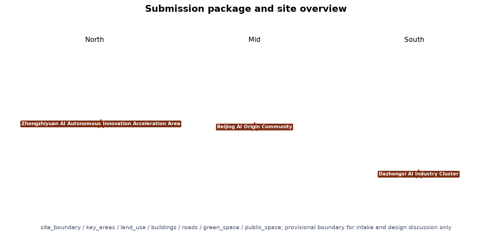
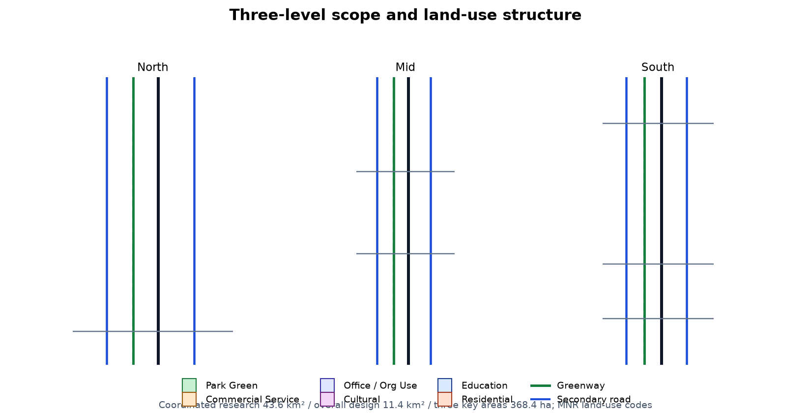
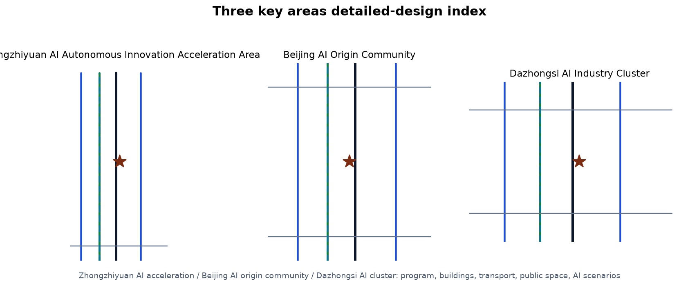
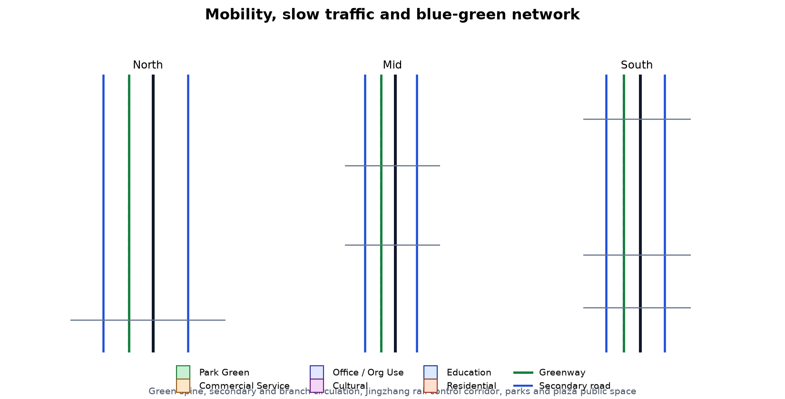
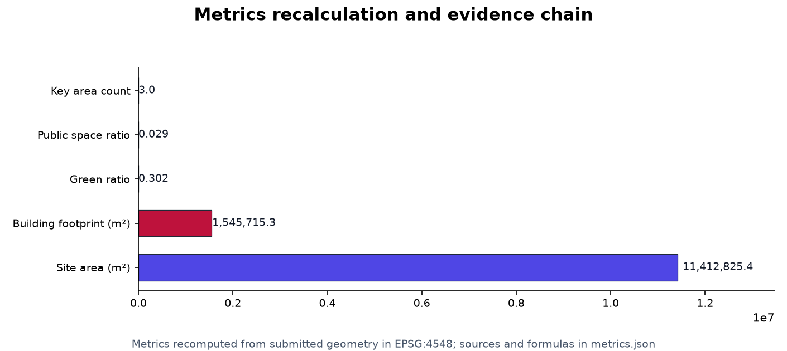

# Jing-Zhang AI Corridor: AI Innovation Belt

## Design Basis and Source List

This formal proposal takes as its first basis the "Centennial Jing-Zhang AI Innovation Belt International Urban Design Call for Entries" (Prequalification Announcement) issued by the Haidian Branch of the Beijing Municipal Commission of Planning and Natural Resources, and uses as its machine-readable basis the provisional rough boundary, key areas, enums, metrics, and source list registered by maintainers in `brief/site-package/`. Before generating a proposal, the AI agent must read `design_brief.json`, `allowed_design_space.json`, `sources.json`, `enums/`, `ranges/`, `schemas/`, `data/source_registry.json`, and `data/processed/agent_fact_pack.md`, and use `project_scope_summary.csv`, `agent_task_requirements.csv`, `source_use_matrix.csv`, and `missing_data_checklist.csv` to build task, scope, source-usage, and gap checklists. Every design judgment must be decomposed into traceable sources, recomputable metrics, verifiable layers, and human-reviewable assumptions. The announcement requires a control-detailed-planning urban-design depth and a comprehensive implementation-plan urban-design depth, so narrative text cannot replace the GeoJSON, metrics tables, A3 booklet, A0 boards, and HTML digital display deliverables.

The proposal is not a standalone vision document but an output organized from the announcement, the agent-oriented taskbook, and site materials; this section places only the most critical bases next to the judgments [source:OFFICIAL-ANNOUNCEMENT] [source:AGENT-TASKBOOK] [depth:existing_conditions_diagnosis]. The complete source and standard coverage is stored in `sources.json`, `standard_matrix.json`, and `design_depth_matrix.json` and is not repeated as machine indices in the prose.

The use boundaries of the source registry are as follows [source:SOURCE-REGISTRY]:

- `data/source_registry.json` registers the use boundaries of public, cleared, and provisional materials.
- Current registry summary: 5 materials available for formal use, 0 background materials, and 1 provisional-only material.
- The agent must not upgrade `background_only` or `provisional_only` materials into an official boundary, statutory control plan, formal scoring basis, or government implementation commitment.

`data/processed/agent_fact_pack.md` is the reading-navigation layer for this proposal, not a new authoritative source [source:PROCESSED-FACT-PACK]. It helps the agent organize the three-level scope, three key areas, announcement tasks, agent.1-agent.6, material availability, and missing-data items into a readable proposal; factual judgments must still return to the registered original materials [source:OFFICIAL-ANNOUNCEMENT] [source:AGENT-TASKBOOK], and the full source relationships are kept in `sources.json`.

When the official `SITE_BOUNDARY` or the three `KEY_AREA` polygons are not yet available, this scaffold uses `brief/site-package/geometry/provisional_boundaries.geojson` to generate a provisional formal package. Both `geometry/site_boundary.geojson` and `geometry/key_areas.geojson` in the submission must be marked `provisional_constraint` with `official_boundary=false`; they may only be used for proposal generation, self-check, visualization, and design discussion, and must not be treated as an official redline, approval basis, precise-area basis, or statutory control conclusion. This organizer data gap does not by itself block content scoring; after the official polygons are supplied, the site boundary, key areas, land use, roads, green space, public space, buildings, phasing, and metrics must all be recalculated.

The scorable status generated this time is: **provisional boundary, precision caveats retained and to be recalculated after official data is published; content scoring is not blocked**. Therefore, the spatial structure, scenarios, projects, and metrics in the text are written on the principle of "discussable, reviewable, and recalculable after replacing the official boundary"; when the official boundary and key-area polygons are updated, the agent must rerun the scaffold, self-check, and drawing/HTML generation, and must not replace a single file in isolation.

Boundary interpretation can return to the overall scope layer and area recalculation [data:geometry/site_boundary.geojson#SITE-001] [metric:site_area_sqm]. The three key areas are verified by independent layers and the count metric [data:geometry/key_areas.geojson#PROV-KEY-001] [metric:key_area_count]. This lets readers move from the prose into the evidence without first reading a string of machine identifiers.

## Three-Level Scope Framework

The proposal organizes work according to the three levels fixed by the announcement: the coordinated research area focuses on a 43.6 km² AI industry ecosystem, strategic positioning, innovation chains, and future-city form; the overall design area focuses on the 11.4 km² city and industry region 1-2 km around the Jing-Zhang heritage park, requiring an overall urban-renewal framework, industrial spatial layout, transport and municipal support, and urban character control; the key areas scope focuses on 368.4 ha of three detailed-design areas, requiring clear functional program, building scale, retain-renovate-demolish classification, public-space connectivity, and transport organization. The three levels are mapped one-to-one in `compliance_matrix.json`, ensuring that the mandatory tasks in announcement clauses 1.3, 1.4, 1.5 and agent.1-agent.6 each have section, layer, metric, drawing, and HTML evidence.

The depth items of the three-level framework are constrained by [depth:three_level_scope_framework] and [depth:overall_spatial_structure]; spatial evidence follows [data:geometry/site_boundary.geojson#SITE-001] and [data:geometry/key_areas.geojson#PROV-KEY-001]; the task basis follows [standard:PROJECT-OFFICIAL-ANNOUNCEMENT]; and the scope index uses the three-level scope table in `project_scope_summary.csv` from [source:PROCESSED-FACT-PACK] as navigation.

The three levels are not a set of disconnected drawings. The coordinated research decides the industry-chain and city-form judgments; the overall design translates the judgments into renewal projects, spatial structure, and facility capacity; the key-area detailed design verifies the implementability of specific parcels, buildings, transport, public space, and AI application scenarios. When generating the proposal, the agent must first lock the official or provisional boundary and constraints adopted for the current submission, then generate land use, buildings, roads, green space, public space, phasing, and AI service nodes, and finally recompute metrics from these layers and explain in the prose which conclusions remain limited by the provisional boundary. Any area, ratio, scale, or project count that cannot be recomputed from structured data must not be written as a formal conclusion.

The overall concept suggested here is the "Jing-Zhang AI Meridian Symbiosis Belt": the Jing-Zhang heritage park serves as the historic and public-space spine, the three key areas (Zhongzhiyuan, Beijing AI Origin Community, Dazhongsi) are the innovation anchors, and universities, enterprises, communities, and rail stations form the everyday network, creating a spatial organization of "one belt, three cores, multiple scenario nodes, and a blue-green slow-traffic composite loop." The "belt" here is not a newly drawn redline but a translation of the announcement's three-level scope into a working method; the "three cores" correspond to the three key areas; "multiple scenario nodes" correspond to operable AI+ public-service, industry-service, and urban-life nodes; and the "composite loop" corresponds to the linkage of slow traffic, green space, public space, and event routes.

| Level | Design question | Proposal answer | Data anchor |
| --- | --- | --- | --- |
| Coordinated research area | How to organize the AI industry ecosystem and future-city form | Build an innovation chain of "university origins - open-source collaboration - enterprise transformation - public experience - international communication" | compliance_matrix.json, standard_matrix.json |
| Overall design area | How to map industrial space, urban renewal, transport/municipal, and character | Land use, buildings, roads, green space, public space, and phasing layers together | [data:geometry/land_use.geojson#LU-001], [data:geometry/roads.geojson#ROAD-001] |
| Key areas scope | How the three areas reach detailed-design depth | Respective positioning, spatial actions, AI scenarios, and implementation dependencies | [data:geometry/key_areas.geojson#PROV-KEY-001], [data:geometry/key_areas.geojson#PROV-KEY-002], [data:geometry/key_areas.geojson#PROV-KEY-003] |

## Coordinated Research Area: Industry and Future City Research

The core task of the coordinated research area is to build a world-class AI innovation ecosystem. The proposal should organize Haidian's university research institutes, leading enterprises, computing-power/algorithm/data factors, incubation platforms, listed companies, unicorns, and technology-service resources, and propose a spatial synergy framework for the AI innovation chain, industry chain, talent chain, and urban-service chain. The naming scheme and logo design should serve the overall recognizability of the "Centennial Jing-Zhang Culture Belt, Urban AI Life Experience Belt, and AI Fusion Innovation Belt," and should not stop at slogans but explain the relation to the industry ecosystem, public space, and cultural resources. The agent-oriented taskbook also requires responding to the "five functions" and "three areas two wings" synergy, producing a deepening-ready naming system, visual identity, overall spatial-structure diagram, scenario opening, and operation mechanism; this section must use [source:AGENT-TASKBOOK] and [standard:PROJECT-AGENT-OPEN-CALL-TASKBOOK] to mark that these requirements come from the agent open-call task rather than statutory planning control.

The coordinated research does not add pseudo-precise redlines; through the urban character, public space, and building-layout coordination required by [standard:MOHURD-URBAN-DESIGN-MEASURES], it connects back to [data:geometry/land_use.geojson#LU-001], [data:geometry/public_space.geojson#PUBLIC-001], and [depth:overall_spatial_structure], showing that the industry strategy must finally land in a visible, reviewable spatial structure.

Future-city form research should answer how artificial intelligence changes work, life, socializing, learning, transport, and public services. The proposal should place AI transport systems, continuous green space, innovation-service facilities, and an international living-working atmosphere into locatable functional zones, nodes, corridors, and scenarios rather than vaguely describing a technological vision. The agent should put industrial-strategy metrics, AI innovation index, talent density, spatial-supply types, and AI+ vertical application priority areas into the metrics system, and mark which are official, which are design suggestions, and which still await formal data calibration. If global AI innovation events, developer communities, open scenarios, or pilgrimage routes are proposed, they should be written as "concept suggestions / reference plans / for professional teams to deepen," not as already-decided government events or implementation arrangements.

### Naming System and Visual Identity Direction (agent.1)

The primary name is suggested as "京张智带 (Jing-Zhang AI Corridor)", with the English name suggested as `Jing-Zhang AI Innovation Corridor` (abbreviated JZ-AIC). The naming system has three levels: the belt primary name, the three-areas-two-wings area names, and the node/scenario names. The primary name draws on the century-old railway lineage of "Jing-Zhang" and the spatial image of the "AI Corridor", avoiding copying existing park or enterprise names and avoiding slogans-only naming [source:AGENT-TASKBOOK] [standard:PROJECT-AGENT-OPEN-CALL-TASKBOOK]. The visual-identity direction suggests using the parallel lines of railway rails as the basic graphic motif, overlaid with the "·" (node/pixel) symbol expressing AI granularity and scenario nodes: one continuous green spine running north-south, three key areas positioned with star marks, and the blue-green slow-traffic composite loop drawn as a dashed line, forming a readable mark language of "one belt, three cores, multiple scenario nodes." Fonts, images, and trademarks must complete rights clearance before formal implementation; this proposal only gives a directional concept suggestion [source:AGENT-TASKBOOK].

The naming system should serve the three positionings (Centennial Jing-Zhang Culture Belt, Urban AI Life Experience Belt, AI Fusion Innovation Belt) and the five functions (AI full-stack self-innovation system, world-class AI innovation ecosystem, AI+ scenario-empowerment new paradigm, intelligent vibrant AI city, and global AI-governance voice), and take memorable roles in the "three areas two wings" synergy loop: AI Origin Community = world-class AI innovation ecosystem; Zhongzhiyuan = AI full-stack self-innovation system and global AI-governance voice; Dazhongsi = AI-native new business forms; Zhongguancun Technology-Service Wing = global factor allocation and Zhongguancun IP-capital empowerment; Xiaoyuehe Scenario-Empowerment Wing = AI scenario empowerment and the intelligent vibrant AI city [source:AGENT-TASKBOOK]. The naming and logo direction are concept suggestions, do not constitute statutory planning judgments, and must not be used to overstep implementation authority.

### Global AI Innovation Ecosystem Cases (agent.2)

The agent-oriented taskbook requires 5-8 global AI innovation ecosystem cases to turn "ecosystem" from a slogan into transferable mechanisms. This proposal selects the following reference cases as mechanism benchmarks; all are publicly verifiable park/city-level practices, involve no internal data or unverified policies, and constitute no commitment to any specific enterprise [source:AGENT-TASKBOOK]:

| Case | Transferable mechanism | Corresponding landing point in this proposal |
| --- | --- | --- |
| Stanford Research Park, USA | Near-campus origins; free flow of capital and talent | AI Origin Community near-campus transformation street; talent special zone |
| King's Cross regeneration, London, UK | Railway-heritage transformation; public-space operation first | Jing-Zhang heritage park vitality belt; slow-traffic stitching |
| Jurong Innovation District (JID), Singapore | Full-lifecycle industry services and scenario opening | Zhongguancun Technology-Service Wing; enterprise-service ecosystem |
| Smart Kalasatama, Helsinki, Finland | Agile pilots; sensors and resident co-governance | Xiaoyuehe Scenario-Empowerment Wing; AI scenario open operation |
| Pangyo Techno Valley, South Korea | Government-enterprise co-building; talent amenities | Zhongzhiyuan full-stack self-innovation; talent living amenities |
| Shenzhen Bay Science and Technology Eco-Park | Mixed functions; public platforms; HQ clustering | Dazhongsi AI-native new business; commercial services |
| Shibuya, Tokyo, Japan | Station-city integration; digital content and consumption | Dazhongsi station integration; smart-terminal content consumption |
| South Lake Union, Seattle, USA | Large-enterprise anchors and open public space | Public-space renewal around leading enterprises; international roadshows |

The use boundary of the case table: it serves only as mechanism benchmarking, does not replicate specific enterprise lists or investment commitments; all citations must be re-verified for source, license, and factual validity before formal deepening [source:AGENT-TASKBOOK]. The ecosystem map, industry-space mapping, and factor mechanisms (land, space, industry, capital, talent, computing, data, scenarios) enter `sources.json`, `compliance_matrix.json`, and the ecosystem page of the A3/A0 drawings [source:AGENT-TASKBOOK] [depth:metrics_recalculation].

## Overall Design Area: Urban Renewal and Regulatory-Plan-Level Urban Design

The overall design area must reach control-detailed-planning urban-design depth. The proposal must present an overall urban-renewal spatial structure, low-efficiency-space identification, a renewal project list, implementation-policy suggestions, industrial function ratios, spatial organization patterns, total building scale, and comprehensive capacity assessment. `geometry/land_use.geojson` should fully cover the design boundary without overlap, `geometry/buildings.geojson` should express renewed or retained building footprints, `geometry/roads.geojson` should express micro-circulation, slow traffic, and rail-connection relationships, and `metrics.json` should recompute the core areas, ratios, and layer counts.

This section follows [standard:MOHURD-CONTROL-DETAILED-PLANNING] to decompose control-planning-depth content into reviewable objects: [data:geometry/land_use.geojson#LU-001] expresses the land-use structure, [data:geometry/buildings.geojson#BLDG-001] expresses building footprints, [data:geometry/roads.geojson#ROAD-001] expresses transport organization, [metric:building_footprint_area_sqm] is used to verify the building footprint area, and [depth:land_use_layout] with [depth:development_intensity_controls] constrain the depth of the deliverables.

The overall design must also support transport, rail, municipal, and supporting facilities. The proposal should propose spatial layout and implementation paths around station-area integration, road micro-circulation, non-motorized-vehicle parking, parking supply, innovation-service platforms, talent living services, new infrastructure, distributed energy, and on-device computing. Content involving building height, development intensity, road redlines, setbacks, and facility standards must be written as "pending formal control-plan confirmation" if no official control conditions exist, and agent-inferred values must not be presented as approved indicators.

## Detailed Design of Key Areas

Key-area detailed design is mandatory. The Zhongzhiyuan AI Self-Innovation Acceleration Area should propose detailed plans around the national AI platform, full-stack self-innovation, standard setting, safety governance, industry display, external transport, Qinghe culture, low-carbon green innovation meeting environments, and green-space AI scenarios. The Beijing AI Origin Community should propose detailed plans around near-campus innovation, incubation and transformation, talent special zones, the open-source system, brand activities, building retain-renovate-demolish, achievement display and release, residential living amenities, campus-park slow-traffic connections, and rail-station integration. The Dazhongsi AI Industry Cluster should propose detailed plans around leading enterprises, agents, smart terminals, content consumption, data factors, digital assets, commercial services, planned-green-space composite use, Dazhongsi station integration, and four-quadrant pedestrian connectivity at intersections.

The three key-area detailed designs must cite [data:geometry/key_areas.geojson#PROV-KEY-001], [data:geometry/key_areas.geojson#PROV-KEY-002], and [data:geometry/key_areas.geojson#PROV-KEY-003], and [depth:three_key_area_detailed_design] checks whether they reach the depth of a comprehensive implementation plan. Merely describing "creating a demonstration area" without evidence of function, building, transport, public space, and implementation projects is treated as incomplete.

The three key areas must appear in `geometry/key_areas.geojson`. If the repository provides official polygons, they should be used as `official_constraint`; if official polygons are missing, `provisional_constraint` may be used temporarily, but the prose, HTML, sources, assumptions, and self_check must state that they cannot be used as a formal scoring or approval basis. `compliance_matrix.json` should separately cover announcement clauses 1.5.3.1, 1.5.3.2, and 1.5.3.3. The design expression should include functional program, building scale, building form, retain-renovate-demolish classification, public-space system, transport organization, slow-traffic connectivity, and implementation projects. The HTML page should allow switching among the three key areas, and the A3 booklet and A0 boards should at least include key-area master plans, partial detail drawings, and metric notes.

| Key area | Design positioning | Spatial actions | AI industry and operation scenarios | Evidence citation |
| --- | --- | --- | --- | --- |
| Zhongzhiyuan AI Self-Innovation Acceleration Area | Garden-style full-stack self-innovation block | Strengthen the Qinghe waterfront interface, industry display, low-carbon innovation meeting, and external transport; use green space for open testing and governance display | Self-model testing, standard-setting workshops, safety-governance display, low-carbon computing experience | [data:geometry/key_areas.geojson#PROV-KEY-001], [depth:three_key_area_detailed_design] |
| Beijing AI Origin Community | Near-campus transformation and talent community | Organize campus-park-block slow-traffic stitching; add achievement-release, talent-service, living, and open-source collaboration space | Open-source community, achievement release, talent special-zone service, near-campus incubation | [data:geometry/key_areas.geojson#PROV-KEY-002], [source:AGENT-TASKBOOK] |
| Dazhongsi AI Industry Cluster | Urban smart-economy and international-communication block | Around Dazhongsi station integration, four-quadrant pedestrian connectivity, commercial services, and public-environment renewal near leading enterprises | Agent and smart-terminal display, content consumption, data factors, international roadshows | [data:geometry/key_areas.geojson#PROV-KEY-003], [metric:key_area_count] |

## AI Innovation Ecosystem, Personas, and AI+ Scenarios

The proposal should build spatial-demand personas for AI talent and enterprises, covering R&D offices, open-source collaboration, achievement release, enterprise services, talent housing, social learning, consumption living, sports and leisure, and international communication. AI+ scenarios should cover transport, services, consumption, healthcare, education, law, and living services proposed by the announcement, forming both industry-development scenarios and AI-empowered city-function scenarios. Each scenario should state its target users, spatial location, data sources, privacy boundaries, human-review mechanism, and operating entity.

AI scenarios must land in spatial and governance boundaries: public-space scenarios cite [data:geometry/public_space.geojson#PUBLIC-001]; slow-traffic and transport scenarios cite [data:geometry/roads.geojson#ROAD-001]; open-space scenarios cite [data:geometry/green_space.geojson#GREEN-001] and [metric:public_space_ratio], [metric:green_ratio]. These citations let reviewers see that scenarios are not slogans but design objects located in specific layers and metrics. The agent-oriented taskbook requires no fewer than 10 AI scenario cards, no fewer than 3 industry test-and-verification scenarios, and no fewer than 5 user-persona types; the scaffold only gives the structure, and the formal entrant must write the scenario cards, persona table, privacy boundaries, human review, and operating entities into the prose, HTML, A3/A0, and compliance matrix.

| Persona | Typical needs | Spatial response | Self-check boundary |
| --- | --- | --- | --- |
| Open-source developer | Release, collaboration, testing, community reputation | Origin Community open-source release hall, public code wall, night collaboration space | No personal behavior tracking; event data aggregated statistics only |
| Startup team | Low-cost office, computing entry, product test field | Zhongzhiyuan shared test field, on-device computing service point, standard-governance consulting | Computing and data services require separate authorization |
| Leading-enterprise visitor | Display, business, international reception, recruiting | Dazhongsi international roadshow hall, rail-station connection, public space around leading enterprises | Enterprise marks and cases require rights clearance |
| Nearby residents | Commute, leisure, community services, low-disruption renewal | Jing-Zhang heritage park slow-traffic loop, embedded community services, night lighting and activity grading | Resident personas not used for commercial recommendation |
| University faculty and students | Achievement transformation, cross-university collaboration, daily slow traffic | Campus-park slow-traffic stitching, transformation stations, AI education experience points | Campus data and research results require authorization |

| Scenario card | Spatial carrier | Design description |
| --- | --- | --- |
| 01 Open-Source Release Hall | Beijing AI Origin Community | For universities, open-source communities, and startups: achievement release, code-contribution display, and small roadshows |
| 02 Safety-Governance Sandbox | Zhongzhiyuan | Translates standard setting, safety evaluation, and model red-team testing into a visitable, bookable, auditable display and collaboration node |
| 03 On-Device Computing Station | Overall-design-area node | Combines public services, enterprise services, and low-carbon energy strategy as a to-be-deepened new-infrastructure prototype |
| 04 AI Slow-Traffic Navigation | Jing-Zhang heritage park vitality belt | Uses explainable wayfinding and low-intrusion sensing to identify slow-traffic gaps, congestion nodes, and accessibility needs |
| 05 Dazhongsi International Roadshow Hall | Dazhongsi AI Industry Cluster | Serves display, negotiation, media release, and international exchange for agent, smart-terminal, and content-consumption enterprises |
| 06 Qinghe Low-Carbon Innovation Gallery | Zhongzhiyuan Qinghe waterfront interface | Combines green space, stormwater, walking/cycling, and AI display as the park public living room |
| 07 Near-Campus Transformation Street | Beijing AI Origin Community | For university achievement transformation: incubation, display, legal, IP, and financing services |
| 08 Data-Factor Living Room | Dazhongsi area | On a compliant, authorized, auditable premise, an urban-service interface displaying data-factor and digital-asset circulation |
| 09 AI Living-Service Model Street | Community-commerce junction | Lands medical, education, law, and living-service AI+ scenarios in operable small-scale block space |
| 10 Global AI Event-Week Route | Belt public-space system | A walkable, shareable experience route from heritage culture, open-source communities, and industry display to international roadshows |

AI governance suggestions generated by the agent must follow the principles of data minimization, public sources, explainability, and human review. Urban agents may help identify slow-traffic gaps, public-space heat, facility maintenance, enterprise-service needs, and event-safety risks, but must not replace planning approval, must not output unauthorized personal profiles, and must not claim official implementation commitments. All AI scenario nodes should enter structured layers or the compliance matrix so reviewers can see their relation to industry, space, and the public interest.

AI industry test-and-verification scenarios are mandatory content of agent.3 (no fewer than 3). This proposal suggests three test-and-verification scenarios, all as "concept suggestions/test prototypes" and not as approved operation: first, the Zhongzhiyuan open test field — for model red-team testing, standard-setting workshops, and safety-governance display, with clear test boundaries, data masking, and human-review procedures; second, the AI transport and slow-traffic diagnostic pilot section on the Xiaoyuehe Scenario-Empowerment Wing — identifying slow-traffic gaps and congestion nodes from public data and low-intrusion sensing, producing aggregated diagnostics for professional review without collecting personal trajectories; third, the Dazhongsi agent and data-factor living room — a public-service interface displaying data-factor circulation on a compliant, authorized, auditable premise. All three test scenarios must declare data sources, privacy boundaries, human-review mechanisms, and operating entities, and must not present immature technologies as fully deployable [source:AGENT-TASKBOOK] [data:geometry/constraints.geojson#CONS-002].

### AI Pilgrimage Landmark Catalog and Honor-Display System (agent.4)

The agent-oriented taskbook requires no fewer than 3 AI pilgrimage landmarks, an honor-display system, and a public-space component library. This proposal suggests three pilgrimage landmarks as the perceivable anchors of the "three cores," all expressed as "concept suggestions," without bridge/tunnel, underground-space, or engineering-feasibility conclusions, and without unilaterally renovating enterprise buildings or owned space [source:AGENT-TASKBOOK]:

| Pilgrimage landmark | Spatial anchor | Cultural/industrial meaning | Expression |
| --- | --- | --- | --- |
| "Centennial Rail" Memorial Promenade, Jing-Zhang Heritage Park | Park green-spine main axis | Convergence of railway lineage and AI innovation culture | Rail-motif wayfinding, contribution wall, memorial nodes |
| "Full-Stack Self-Innovation" Release Tower, Zhongzhiyuan | Industry-display core node | AI full-stack self-innovation and standard-governance display | Industry display, release space, honor display |
| "Agent Living Room," Dazhongsi | Station-city integration node | AI-native new business forms and international communication | Display, roadshows, public-experience components |

The honor-display system is suggested to work with the pilgrimage landmarks: the "memorable contributions" of developers/teams are deposited through public contribution walls, code walls, proposal-signature walls, and annual achievement exhibitions, following the principles of "memorable contributions" and "public knowledge deposit," but must not leak personal privacy or unauthorized marks [source:AGENT-TASKBOOK]. The public-space component library (seating, wayfinding, lighting, installations, accessibility, stormwater) forms a reusable "Jing-Zhang AI Corridor Component Library" concept for professional teams to deepen [source:AGENT-TASKBOOK].

### Cultural Narrative, Wayfinding Symbols, and International Communication (agent.5)

The cultural narrative uses the thread of "one railway, two generations of innovation, one future": the Jing-Zhang Railway is the historical origin of self-reliance; Zhongguancun is the contemporary scene of technological innovation; and AI new culture is the future-facing narrative. The spatial cultural system organizes a three-part cultural route of "Centennial Jing-Zhang - Zhongguancun scene - AI new culture" along the park green spine; the wayfinding, signage, and symbol system use the rail-parallel-line + node-symbol motif, forming a wayfinding language consistent with but functionally independent of the belt's overall logo system [source:AGENT-TASKBOOK]. The international-communication narrative suggests emphasizing the continuity "from Zhan Tianyou's self-reliant railway to self-reliant AI," proposing an English narrative direction for global developers, but all cultural expressions must not distort history, must not treat culture as mere technological decoration, and must not use portraits, trademarks, or copyrighted materials without authorization [source:AGENT-TASKBOOK].

### Global AI Innovation Event System and Long-Term Operation (agent.6)

The event system is suggested to consist of five parts: annual events, developer-community operation, AI scenario open operation, public-experience routes, and international-communication/attraction-conversion, all expressed as "concept suggestions/operation-mechanism directions," without exaggerating government commitments and without writing envisioned events as settled arrangements [source:AGENT-TASKBOOK]:

| Operation block | Mechanism direction | Responsibility boundary and risk |
| --- | --- | --- |
| Annual event system | AI innovation conference, developer festival, scenario open days, achievement-roadshow week | Requires public-space permits, event safety, and copyright clearance; frequency and scale to be deepened by professional operators |
| Developer-community operation | Open-source collaboration, contribution walls, tech meetups, co-building workshops | Aggregated data statistics only; no personal behavior tracking |
| AI scenario open operation | Agile pilot-feedback-iterate open mechanism | Immature technologies must not be written as fully deployed |
| Public-experience and landmark operation | Jing-Zhang memory route; Global AI Event-Week route | Event effects not exaggerated; not stated as settled commitments |
| International communication and attraction conversion | Achievement case library, English communication content, connection channels | Investment attraction, policies, and funding not written as settled commitments |

Long-term operation is linked with phasing implementation: in the near term, start with lightweight facilities, operation events, and service platforms; in the mid term, supplement spatial carriers with urban renewal; and in the long term, deposit the belt's brand assets, event mechanisms, and collaboration channels. Operational content should avoid slogans-only writing and must state the operation objects, frequency, responsibility boundaries, conversion paths, and risks [source:AGENT-TASKBOOK] [depth:phasing_implementation].

## Land Use, Building Scale, and Retain-Renovate-Demolish Strategy

The land-use plan should be expressed according to public standards such as territorial-survey, planning, and use-regulation classification, forming a complete, closed, seamless land-use partition. The building plan should distinguish retained, renovated, renewed, new, or to-be-confirmed objects, clarifying the suggested hierarchy of building footprints, functions, scale, character, roofs, massing, and height control. Where existing buildings, ownership, control plans, and engineering conditions are missing, the proposal can only offer methods and a to-be-calibrated checklist, not fabricated retain-renovate-demolish conclusions.

Land-use classification follows [standard:MNR-LAND-USE-CLASSIFICATION-GUIDE]; building height, massing, interface, and character control are managed by [depth:height_massing_character]; the retain-renovate-demolish method is managed by [depth:retain_renovate_demolish]. The main evidence for land use and buildings is [data:geometry/land_use.geojson#LU-001], [data:geometry/buildings.geojson#BLDG-001], and [metric:building_footprint_area_sqm].

Building-scale and intensity indicators must be consistent with `metrics.json` and the layers. Where official conditions for total building scale, FAR, building height, building density, green ratio, setbacks, and building-control lines are missing, they should be listed as unknown or pending_control in the metrics system and must not use fixed numbers to manufacture a false sense of precision. The A3 booklet should give the renewal-project list and metric-verification table; the A0 boards should clearly express the key spatial structure and key areas; and the HTML page should provide metric-layer linked viewing.

## Transport, Rail, Municipal Infrastructure, and Public Services

The transport plan should respond to the announcement's requirements on rail-station integration, road micro-circulation, slow-traffic gaps, external transport, parking, non-motorized-vehicle parking, and green transport systems. Coverage should emphasize the North Fifth Ring Road, the Jing-Zhang heritage park crossing-the-ring-road node, Wudaokou, Tsinghua East Road West Intersection, Dazhongsi station, and transport connections around leading enterprises. Road and slow-traffic layers should stay within the submission boundary and cross-check with public space, green space, industry nodes, and key areas; if the submission boundary is provisional, transport conclusions can only be temporary design discussion.

The professional depth of transport and municipal content is constrained respectively by [depth:traffic_rail_slow_parking] and [depth:municipal_new_infrastructure]; layer evidence cites [data:geometry/roads.geojson#ROAD-001], [data:geometry/public_space.geojson#PUBLIC-001], and [data:geometry/constraints.geojson#CONSTRAINTS]. Where road redlines, pipelines, fire protection, and municipal conditions are missing, the assumptions should note what remains to be supplemented rather than writing strategies as approved conditions.

Municipal and public-service facilities should cover AI industry-service facilities, innovation-service platforms, talent-living service facilities, new infrastructure, distributed energy, on-device computing, and traditional municipal facility integration. The proposal should explain facility standards, spatial layout, service radii, operation models, and phasing-implementation logic. Where pipeline, energy, drainage, flood-control, and fire-protection engineering data is missing, it should be listed as a precondition for formal deepening.

## Blue-Green Network, Public Space, and Urban Character

The blue-green plan should use the Jing-Zhang heritage park vitality belt as the skeleton, coordinating Qinghe, Xiaoyuehe, and the travel needs of surrounding universities, enterprises, and communities, and propose a north-south through and east-west connected system of walking paths, cycling lanes, and green space. The proposal should identify slow-traffic gaps, elevated ring-road crossing nodes, and landscape nodes at the park's south and north ends, and propose composite-use strategies for parking, sports, innovation meeting, technology testing, application display, and public services.

The blue-green public space is cross-checked by the design-depth item and the green-space and public-space layers [depth:blue_green_public_space] [data:geometry/green_space.geojson#GREEN-001] [data:geometry/public_space.geojson#PUBLIC-001]. The green and public-space ratios are explained for their design meaning in the prose, with complete recomputation kept in `metrics.json`; the coordination of urban character, public space, and building control returns to the professional standard matrix [standard:MOHURD-URBAN-DESIGN-MEASURES].

The urban-character plan should integrate Jing-Zhang Railway history and culture, Zhongguancun innovation culture, and AI innovation culture, drawing on cultural resources such as the Tsinghua Garden Railway Station and the Beijing Film Academy, and propose urban tone, building character, roof forms, massing, interfaces, and public-art guidance. The agent should also propose wayfinding signage, cultural symbols, international-communication narrative, AI pilgrimage landmarks, contribution walls, or honor-display systems, but all brands, fonts, images, portraits, and enterprise marks must have cleared sources. Character control should distinguish official control, design suggestions, and to-be-confirmed conditions, and must never give pseudo-precise control lines without heritage-protection or control-plan basis.

## Renewal Projects, Implementation Policy, and Phasing

The implementation plan should form a reviewable renewal-project list stating project location, type, function, responsible entity, dependencies, implementation stage, risks, and evaluation indicators. Policy suggestions should cover coordinated urban-renewal implementation, spatial supply, operation mechanisms, industry services, public participation, data governance, and property-right coordination. `geometry/phasing.geojson` should express phasing scopes, and `compliance_matrix.json` should link every task to phasing and drawings.

Project-list and phasing depth are managed by [depth:renewal_project_list] and [depth:phasing_implementation], with the phasing spatial evidence at [data:geometry/phasing.geojson#PHASE-001]. Where ownership, funding, implementing entities, and approval paths are missing, the proposal must write them as implementation risks rather than commitments to land.

| Project ID | Project name | Type | Main dependencies | Evidence citation |
| --- | --- | --- | --- | --- |
| JZ-01 | Jing-Zhang Heritage Park slow-traffic gap stitching | Public space/transport | Road redlines, under-bridge space, transport-organization review | [data:geometry/roads.geojson#ROAD-001] |
| JZ-02 | Zhongzhiyuan Qinghe innovation interface | Blue-green/industry display | River blue line, ecological and flood-control conditions | [data:geometry/green_space.geojson#GREEN-001] |
| JZ-03 | Origin Community near-campus transformation street | Urban renewal/industry service | Campus boundary, ownership, ground-floor program | [data:geometry/buildings.geojson#BLDG-001] |
| JZ-04 | Dazhongsi station four-quadrant pedestrian connectivity | Rail integration/slow traffic | Rail station, road intersections, municipal pipelines | [data:geometry/public_space.geojson#PUBLIC-001] |
| JZ-05 | AI public-service and on-device computing node | New infrastructure/public service | Energy, computing, safety, and operating entity | [data:geometry/constraints.geojson#CONSTRAINTS] |
| JZ-06 | Global AI Event-Week public route | Operation/brand | Public-space permits, event safety, copyright clearance | [data:geometry/phasing.geojson#PHASE-001] |

Phasing should be distinguished from the 100-day call-for-entries design cycle: the call cycle is the time requirement for submitting deliverables, while implementation phasing is the advancement path of urban renewal and project construction. The proposal should propose a near-term pilot, mid-term renewal, and long-term governance framework, and mark which content can start with lightweight facilities, operation events, and service platforms and which must wait for formal control-plan, municipal, transport, and ownership confirmation. For the annual event system, developer-community operation, scenario open days, public-experience routes, and international-communication mechanisms, the prose should explain the operation objects, frequency, responsibility boundaries, conversion paths, and risks rather than writing slogans only.

## Metrics, Area Recalculation, and Compliance Matrix

The metrics system should at least include the overall-design-area area, key-area areas, green and public-space ratios, building footprint, renewal-project count, AI scenario node count, slow-traffic connectivity indicators, industrial-space indicators, talent-service indicators, and self-check status. All known metrics must be recomputable from GeoJSON or credible sources; unknown metrics must state the reason and the formal-submission preconditions. The results of `scripts/spatial_review.py` and `scripts/visual_review.py` are important evidence for the formal self-check.

Metric recalculation follows the unified design-depth requirement [depth:metrics_recalculation]. The prose explains the design meaning of the metrics, for example how the overall scope constrains spatial allocation and how the blue-green and public-space ratios support daily encounter; the complete values, formulas, source files, and confidence are kept in `metrics.json`. Example key metrics can be verified from the overall scope and green-space data [metric:site_area_sqm] [data:geometry/green_space.geojson#GREEN-001].

The compliance matrix is the master file for task responsiveness. Every announcement task and agent_taskbook task must correspond to report sections, layers, metrics, drawings, HTML pages, sources, assumptions, and self-check items. If any mandatory task in announcement clauses 1.3, 1.4, 1.5 or agent.1-agent.6 is not covered, the proposal must not enter formal professional scoring.

When formally deepening, the agent should further divide each metric into three categories: the first category is spatial metrics directly recomputable from the submitted geometry, such as boundary area, green ratio, public-space ratio, building footprint area, and phasing area; the second category is control metrics requiring official control plans or taskbook annexes, such as FAR, building height, building density, setbacks, road redlines, and facility standards; the third category is performance metrics requiring continuous calibration with operation or industry data, such as the AI innovation index, talent density, industry-service satisfaction, slow-traffic accessibility, event participation, and scenario-use frequency. The three categories should enter `metrics.json`, `assumptions.json`, and `compliance_matrix.json` respectively, avoiding mistaking operational visions for approved planning conditions.

## Risk, Copyright, and Compliance

**Bilingual requirement.** The primary proposal file may be Chinese or English, but a complete counterpart translation must be provided through `proposal.en.md` or `proposal.zh.md`; A3/A0 drawings, HTML, and text-bearing figures must also provide corresponding language copies, giving priority to the recommended translations in `docs/terminology-glossary.md`. For a v2 package, finalize and CI will block the submission if any required translation, language mapping, or valid file is missing. All images, drawings, icons, data, and code assets must state their source, license, and authorization status in `sources.json` or `report/copyright_statement.md`. HTML pages must not load remote scripts, remote map tiles, remote fonts, iframes, forms, or external APIs, and must not track reviewers.

The risk and missing-data checklist is jointly cross-checked by the risk depth item, the constraints layer, and the site package [depth:risk_missing_data] [data:geometry/constraints.geojson#CONSTRAINTS] [source:SITE-PACKAGE]. The gaps listed in `missing_data_checklist.csv` — official boundary, key areas, control plans, roads, parcels, buildings, municipal, heritage protection, and public services — must enter `assumptions.json`, the self-check, and the risk section of the prose. Any conclusion lacking official control-plan, road-redline, ownership, municipal, fire-protection, or heritage-protection conditions must be downgraded to a to-be-confirmed item; the complete professional cross-check is kept in the standard matrix.

This proposal does not claim official approval, approved control plans, final land ownership, final construction scale, or guaranteed implementation. The AI agent is responsible for facts, sources, copyright, spatial data, metrics, and expression; maintainers and professional reviewers may require revision or rejection based on the self-check results, spatial review, and compliance matrix.

## References

- brief/public-brief.md
- brief/site-package/design_brief.json
- brief/site-package/allowed_design_space.json
- brief/site-package/enums/
- brief/site-package/ranges/planning_limits.json
- data/processed/agent_fact_pack.md
- data/processed/project_scope_summary.csv
- data/processed/agent_task_requirements.csv
- data/processed/source_use_matrix.csv
- data/processed/missing_data_checklist.csv
- Full machine index: see `sources.json`, `metrics.json`, `compliance_matrix.json`, `standard_matrix.json`, and `design_depth_matrix.json`
- This bibliography entry relies on the site-package registry; full provenance and licenses are in the structured source list [source:SITE-PACKAGE]
