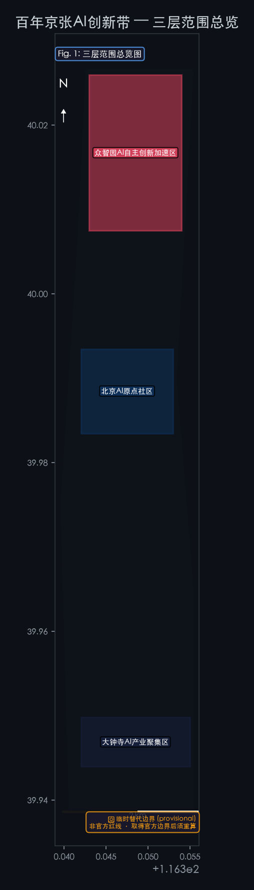
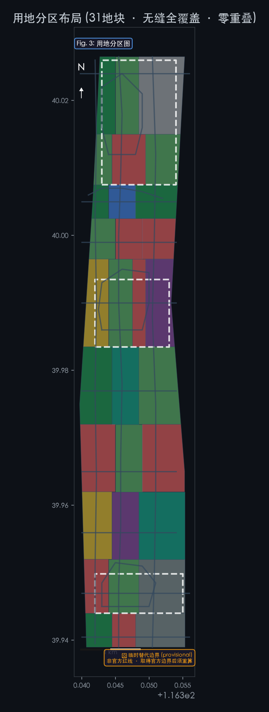
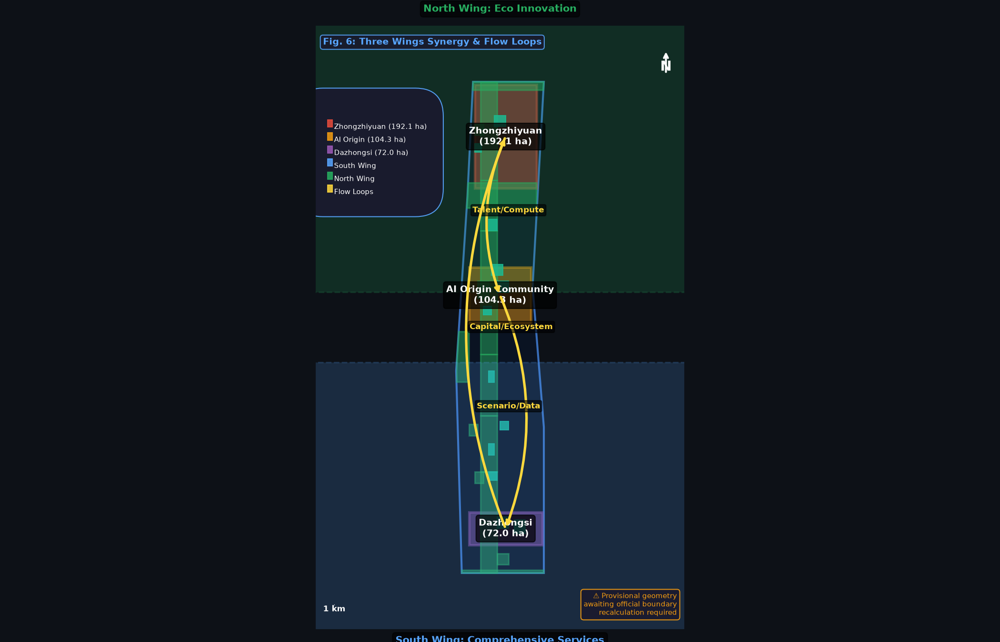
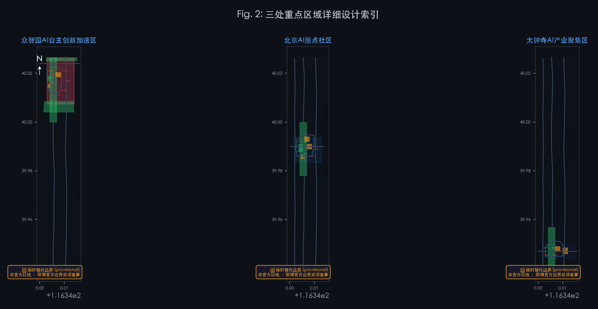
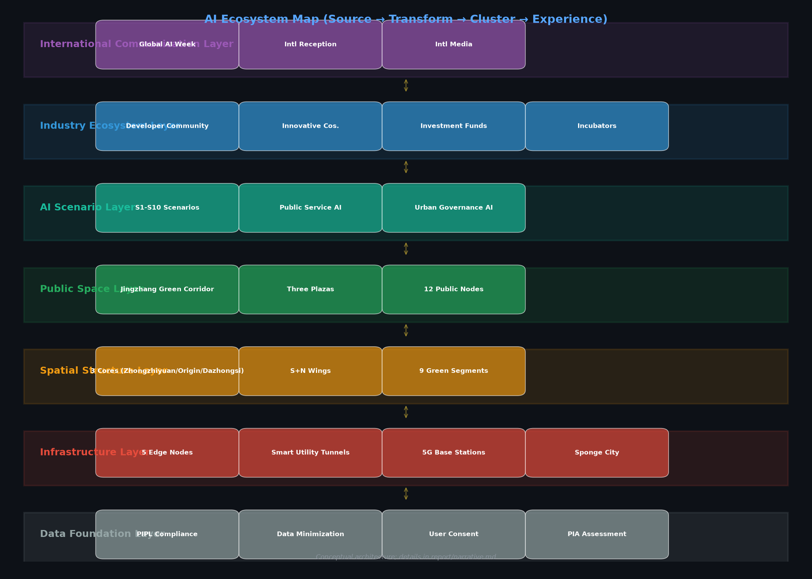
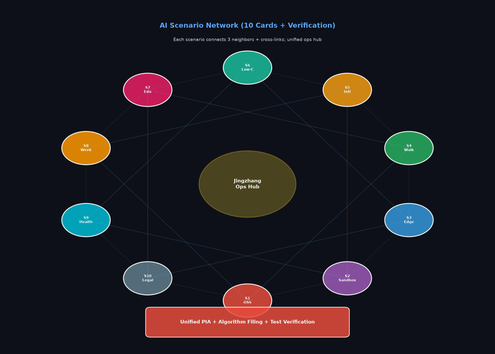
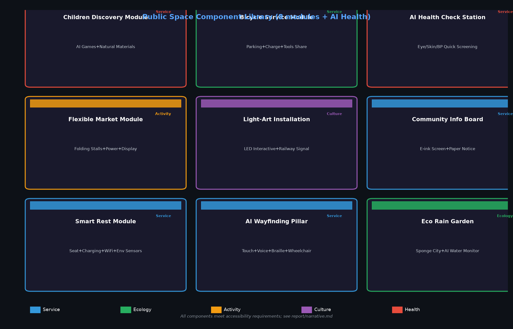

# Jingzhang Smart Vein Innovation Belt
### Where Iron Rails Meet Neural Networks

> **Three Positionings, One Mission**
> - **Heritage Meets Intelligence** — Century-old Jingzhang Cultural Belt
> - **A City That Learns** — Urban AI Living Experience Belt
> - **From Beijing to the World** — AI Convergence Innovation Belt

---

## 1. Why Jingzhang Smart Vein?

In 1909, Zhan Tianyou led the construction of the Jingzhang Railway — China's first railway independently designed and built by Chinese engineers. More than a century later, this corridor hosts the world's densest concentration of AI innovation resources: Tsinghua University, Peking University, the Chinese Academy of Sciences, and hundreds of AI companies ranging from unicorns to "one-person startups" all operate within walking distance of the original railway line.

This is no coincidence. Innovation requires density, and density breeds collisions. But density also brings challenges: fragmented industrial space, insufficient public realm, pedestrian network gaps, and tensions between historical heritage and new urban development. The mission of the Jingzhang Smart Vein Innovation Belt is to build **a city where innovation happens naturally and where everyone can participate** along this century-old corridor.

**Three Positionings, One Mission:**

| Positioning | Meaning |
|---|---|
| **Century-old Jingzhang Cultural Belt** | From Zhan Tianyou's railway to today's AI — an innovation corridor spanning a hundred years |
| **Urban AI Living Experience Belt** | 11.41 km² of urban space where AI is no longer a screen-bound concept but a tangible, experiential part of everyday life |
| **AI Convergence Innovation Belt** | With Haidian as the innovation source-brain, radiating an AI industry collaboration network across the Beijing-Tianjin-Hebei region |

---

## 2. The Spatial Blueprint of 11.41 km²

### One Belt · Three Cores · Multi-Scenario · Blue-Green-Walk Composite Loop

The Jingzhang Smart Vein design area is a **narrow corridor approximately 9.7 km north-south and 1.3 km east-west** — this dictates that the spatial logic must be linear, segmented, and rhythmic.

**One Belt: The Jingzhang Cultural Green Corridor.** A continuous public realm running north-south along the original Jingzhang Railway alignment (approximately 116.345° E). With a green coverage ratio of 29.5733% (green total area ÷ overall design area, recalculated under EPSG:4548 projection; rounded display: 29.57%), this means more than one square meter of greenery for every 3.4 m² of urban space — not decoration, but the structural backbone [metric:green_ratio] [data:geometry/green_space.geojson]. From Xizhimen at the south end to the Fifth Ring Road at the north end, the corridor divides into nine segments, each telling a story of Jingzhang and AI: Railway Origins, Industrial Memory, Academic Spirit, Technology Sprouts, Natural Coexistence, Innovation Origin, Technology Soaring, Ecological Future, AI New Chapter. *Note: All provisional geometry area metrics are recalculated values. Once official boundaries are received, full recalculation is required.*

**Three Cores: Three Key Areas, Three Innovation Paradigms.**

| Key Area | Area | Core Question | Design Response |
|---|---|---|---|
| **Zhongzhiyuan AI Self-Innovation Accelerator** | 192.1 ha | How to give self-innovation both R&D density and human scale? | Garden-style innovation blocks: R&D alternates with nature, accompanied by the Qing River |
| **Beijing AI Origin Community** | 104.3 ha | How to let university research results walk out of labs and into neighborhoods? | School-adjacent transformation community: campus-park-block pedestrian stitching |
| **Dazhongsi AI Industry Cluster** | 72.0 ha | How to integrate AI industry into urban life rather than enclosing it in a closed park? | Urban-style industry blocks: hub integration + four-quadrant pedestrian connectivity |

**Multi-Scenario: 10 AI Scenario Cards**, from open-source collaboration to health management, from contract review to global activity week — each scenario has specific spatial carriers, target users, and operational mechanisms.

**Blue-Green-Walk Composite Loop:** 16 road centerlines organize a transportation network of north-south main axis, east-west connections, and internal loops. Three landmark destinations — Zhongzhiyuan AI Innovation Plaza, Yuanzhi Smart Hub Plaza, Dazhongsi AI Era Plaza — serve as stages for public life.

### How Is Land Use Organized?

31 land parcels seamlessly cover the entire design area — no gaps, no overlaps. Ten sections from north to south:

| Section | Primary Function | Core Concept |
|---|---|---|
| North 5th Ring Gateway | Green + Reserved + Research | Ecological buffer and long-term reserve |
| Zhongzhiyuan Core | Research + Commercial | Full-stack self-innovation main battlefield |
| Qing River Ecological Corridor | Green + Cultural | Interface between nature and innovation |
| Zhongguancun Tech Wing | Research + Commercial | Tech services and IP |
| AI Origin Community | Residential + Research + Commercial + Education | Walking fusion of work-life-learning |
| Xiaoyue River Scenario Wing | Green + Medical + Research | AI + livelihood scenario verification |
| Zhichun Road Tech Belt | Commercial + Research | Connecting core Zhongguancun |
| Xueyuan South Living Area | Residential + Education + Medical | Daily life support layer |
| Dazhongsi Industry Area | Commercial + Research + Transportation | Smart economy and international exchange |
| Xizhimenmen Gateway | Commercial + Green + Transportation | City entrance and first impression |

### Core Indicators

| Indicator | Value | Description |
|---|---|---|
| Overall Design Area | 11.41 km² | **Provisional geometry recalculation** (awaiting official geometry issuance for re-calc) |
| Green Coverage Ratio | 29.57% | Far exceeds typical urban innovation district levels |
| Public Space Ratio | 3.04% | Three plazas + 12 public nodes |
| Building Footprint | 76,973 m² | 101 buildings, 3 to 22 stories |
| Road Centerlines | 16 | Main axis + two wings + loops + greenways |
| Phasing | 0-3 / 3-7 / 7-15 years | Core engine → linkage expansion → full maturation |

---

## 3. Three Innovation Hearts

### Zhongzhiyuan: AI Acceleration in a Garden

Zhongzhiyuan's DNA is **"self-innovation"** — not a closed laboratory, but a research settlement open to nature. The Qing River flows along its southern edge; along the river we designed the Qing River Eco-Park, moving innovation's "third space" to the waterfront. R&D sits on the west bank, services on the east, and in between runs the Zhongzhi Innovation Loop — a pedestrian-accessible internal street connecting AI R&D centers, labs, incubators, and the AI Innovation Plaza.

Here, AI safety governance sandboxes, self-developed model testing, and low-carbon computing showcases will open to the public — not museum-style distant viewing, but reservable, participatory, comprehensible interactive experiences.

### AI Origin Community: The Last Mile from Lab to Neighborhood

The AI Origin Community's DNA is **"transformation"** — university research needs to leave the lab. We designed the Origin Community Loop, drawing the east-west flow of the Tsinghua East Road westward extension into the community interior: talent apartments and residences to the west, R&D spaces in the middle, commercial and educational facilities to the east. The Smart Hub Plaza is the community's heart — the open-source release hall, achievement transformation station, and AI education experience point unfold around it.

Here, a graduate student can train a model in the morning in the lab and pitch to investors in the afternoon at the Smart Hub Plaza. The Wudaokou AI Experience Plaza brings technology out of screens, becoming tangible public art.

### Dazhongsi: AI's Window to the World

Dazhongsi's DNA is **"connection"** — Subway Line 13's Dazhongsi Station is the four-quadrant connection point. We designed a hub integration scheme, unifying metro, bus, cycling, and pedestrian transfers. The AI Era Plaza hosts intelligent agent showcases, digital asset roadshows, and international enterprise services. R&D and offices are laid out to the west and middle, allowing "Haidian R&D" products to reach market here.

---

### Three Hearts, Three Souls

Each key area is not a simple repetition of AI office buildings — it has its own character, its own rhythm, its own question to answer.

**Zhongzhiyuan AI Self-Innovation Accelerator (192.1 ha, provisional)** — Large-scale concept design: [`assets/figures/zhongzhiyuan-concept.en.png`](assets/figures/zhongzhiyuan-concept.en.png).

**Beijing AI Origin Community (104.3 ha, provisional)** — Large-scale concept design: [`assets/figures/ai-origin-community-concept.en.png`](assets/figures/ai-origin-community-concept.en.png).

**Dazhongsi AI Industry Cluster (72.0 ha, provisional)** — Large-scale concept design: [`assets/figures/dazhongsi-concept.en.png`](assets/figures/dazhongsi-concept.en.png).

## 4. An AI City Designed for Everyone

A good city is not designed for just one type of person. Jingzhang Smart Vein covers the **complete human spectrum from open-source developers to neighborhood elders**.

### Six User Groups, Six Kinds of Care

| Group | What They Need | What We Designed |
|---|---|---|
| **AI R&D Engineers** | High-performance environments, collaboration spaces | AI R&D center + labs + shared workshops |
| **Startup Teams** | Low-cost space, computing access | Incubators + edge computing stations + government service micro-stations |
| **International Corporate Visitors** | Showcases, business, reception | Dazhongsi international roadshow hall + AI Era Plaza |
| **Young Talent & Students** | Living, socializing, learning | Talent apartments + Smart Hub Plaza + Qing River waterfront greenway |
| **Surrounding Community Residents** | Commuting, leisure, low disruption | Xueyuan South living amenities + Jingzhang Green Corridor + community plazas |
| **Everyone (Inclusive Design)** | Safety, accessibility, dignity | See detailed table below |

### Dedicated Design for Vulnerable Groups

| Group | Core Response | Spatial Design | Non-Digital Alternatives |
|---|---|---|---|
| **Children** | Safe play, AI enlightenment | Soft-surface activity areas, screen-free AI interactions, nature exploration segment | Paper exploration maps, physical signage |
| **Elderly** | Accessibility, rest, health | Whole-corridor ramps ≤1:12, rest seats every 200m, traffic lights timed for 0.8 m/s walking speed, emergency call devices | Phone appointment service, paper bulletin boards |
| **Persons with Disabilities** | Accessibility, information access | Path clear width ≥1.2m, accessible restrooms, Braille + audio guides, wheelchair viewing platforms | Human-assisted hotline, Braille manuals |
| **Low-Income Residents** | Low cost, employment, services | ≥10% affordable talent apartment units, community canteens, free public WiFi | Offline community service center |
| **Non-Digital Users** | Usable without smartphones | AI terminal physical buttons + voice interaction, manual service window (≥8h/day) | N/A |
| **Night Workers** | Safety, lighting, rest | Street lights ≥10 lux with ≤30m spacing, plaza lighting until 23:00, 24h restrooms, security patrols | Emergency call boxes (every 500m) |

### Privacy Protection: Technology for People, Not Against Them

Jingzhang Smart Vein's AI systems follow one core principle: **data stays within the community, collection is minimized, deletion is always possible**. Per PIPL (Personal Information Protection Law) and Network Data Security Management Regulations:

- Public space AI collection only records anonymous statistics (foot traffic, dwell time); no facial recognition, no individual tracking
- Anonymous data retained for 12 months; raw video overwritten after 7 days
- Every user can review, correct, or delete their data at "Personal Information Rights Application Points" in the three plazas
- All AI recommendations are labeled "Advisory only, for reference"; decision authority always remains with humans

For complete data flow, legal basis, human review, downgrade, and exit conditions for all 10 scenarios, see [`report/narrative.md`](report/narrative.md).

---

## 5. Letting Innovation Grow: Scenarios, Operations & Implementation

### 10 AI Scenario Cards

Jingzhang Smart Vein is not a traditional park where "you build it and they will come" — it is a **scenario-driven innovation ecosystem**. The 10 scenario cards cover the full chain from R&D to life:

**Complete scenario cards** (with data flow, legality, human review, downgrade & exit): see [`report/narrative.md`](report/narrative.md).

**Scenario Spatial Carriers**: Open-source Collaboration Showcase (S1) → ModelScope Community Center; AI Safety Governance Sandbox (S2) → physical + data dual sandbox; Edge Computing Nodes (S3) → one at each key area; AI Slow-Mobility Navigation (S4) → 9 segments of the Jingzhang Green Corridor; Intelligent Agent International Showcase (S5) → international reception halls at all three key areas; Qing River Low-Carbon Innovation (S6) → Qing River Eco Cross Street; School-Adjacent AI Education (S7) → 6 universities + 4 K-12 schools; Global AI Activity Week (S8) → main venue at three key areas; AI Health Management Station (S9) → Xueyuan South + AI Origin Community; AI Legal & Government Services (S10) → Zhongguancun Tech Service Wing + Dazhongsi Hub.

Each scenario passes **technical security assessment → privacy impact assessment → test plan filing** through three gates, jointly supervised by the District S&T Bureau, the operating entity, and third-party audit institutions.

| # | Scenario | Spatial Carrier | Target Users |
|---|---|---|---|
| 1 | Open-source Collaboration & Code Showcase | Origin Community Smart Hub Plaza | Developers, open-source community |
| 2 | AI Safety Governance Sandbox | Zhongzhiyuan R&D Center + Innovation Plaza | Research institutions, regulators |
| 3 | Edge Computing Public Services | 5 distributed nodes | Startup teams, public services |
| 4 | AI Slow-Mobility Navigation & Accessibility | Jingzhang Green Corridor + Three Plazas | All citizens and visitors |
| 5 | Intelligent Agent & Terminal International Showcase | Dazhongsi AI Era Plaza | Enterprises, international visitors |
| 6 | Qing River Low-Carbon Innovation Interaction | Qing River Eco-Park | Park enterprises, citizens |
| 7 | School-Adjacent AI Education Experience | Origin Community education facilities | University faculty & students, K-12 |
| 8 | Global AI Innovation Activity Week | Whole "Belt" public realm | Global AI community |
| 9 | AI Health Management Station | Xueyuan South medical facilities + Origin Community | Elderly, chronic disease patients |
| 10 | AI Legal & Government Services | Tech Service Wing + Dazhongsi Hub | Startup teams, SMEs |

**Every scenario has a complete test verification mechanism**: technical security assessment (Class Protection + algorithm filing) → privacy impact assessment (PIPL Article 55) → test plan filing (≤6 months, with contingency plans) → mid-term evaluation every 3 months → final evaluation → exit or continuation.

### Six Key Engineering Projects

| Code | Project | Suggested Coordinator | Investment Level | Phase |
|---|---|---|---|---|
| JZ-01 | Jingzhang Green Corridor Slow-Mobility Gap Stitching | District Urban Management | Medium-High | P1 |
| JZ-02 | Zhongzhiyuan Qing River Innovation Interface | District Water Bureau + Parks Bureau | Medium | P1-2 |
| JZ-03 | Origin Community Achievement Transformation Block | District S&T Bureau | Medium | P1 |
| JZ-04 | Dazhongsi Four-Quadrant Connectivity | Haidian Branch of Beijing Municipal Planning & Natural Resources Commission + Metro | High | P1-2 |
| JZ-05 | Five Edge Computing Nodes | District S&T Bureau | Medium-High | P2 |
| JZ-06 | Global AI Innovation Activity Week | District Propaganda Department | Medium | P2-3 |

Each project is equipped with a complete **responsibility matrix, approval pathway (referencing Haidian District Urban Renewal Implementation Guidelines 2025 Edition), phased KPIs, and risk exit conditions**.

### Operations: Not Just Building Well, But Nurturing Well

Drawing on the "ModelScope Community" model of Hangzhou's Zijingang and Shanghai's Xuhui "Innovation Symbiosis Community" experience, Jingzhang Smart Vein's operations and governance system includes:

- **Developer Community**: Onboarding standards → incubation services → exit/graduation mechanism. IP follows Apache 2.0 / MIT open-source licenses
- **Annual Activity Matrix**: Quarterly hackathons → monthly Demo Days → bi-monthly safety governance roundtables → summer innovation camps → annual Global AI Activity Week → weekly geek nights
- **Honor System**: Sleeper-Star Walk of Fame (10 annual AI celebrities) + Contributor Badges (5 levels) + Jingzhang Award (5 categories) + Open-source Heroes Board
- **Complete Governance Matrix**: RACI matrix, decision authority tiers, data governance aligned with PIPL, annual KPI matrix, funding model and risk contingency plans — see [`report/narrative.md`](report/narrative.md)
- **Complete Annual Activity Calendar**: 12 months × 4 seasons + nine-segment cultural narrative node table — see [`report/narrative.md`](report/narrative.md)

---

## 6. Finding Jingzhang's Place in the World

### A Dialogue with Global AI Innovation Districts

Jingzhang Smart Vein is not isolated. We studied 8 global AI innovation districts:

| Case | Insight |
|---|---|
| **Singapore Punggol** (50 ha) | "Inverted skyline" turns ground level into a pedestrian paradise; Open Digital Platform provides unified digital twin |
| **Boston Kendall Square** (260 ha) | MIT anchor + LabCentral shared labs + CIC flexible office = three-in-one innovation engine |
| **Hangzhou Zijingang** | Computing vouchers directly reduce developer costs; ModelScope with 130K open-source models + 20M developer ecosystem |
| **Shanghai Xuhui Innovation Symbiosis Community** | 10-element supply system (from computing to IP) covers full enterprise lifecycle |
| **Nanjing AI·Mirror Realm** (125 ha) | Progressive micro-renewal + unified VI system; implanting AI themes into existing urban space |
| **Station F Paris** | Industrial building conversion + public space sharing; proves innovation incubators can embed into city fabric |

Jingzhang Smart Vein's unique advantage is **historical depth** — no other global AI innovation district has a century-old railway heritage as the spatial narrative's main axis.

### Beijing-Tianjin-Hebei: A One-Person Innovation Loop

Jingzhang Smart Vein is positioned as the **"innovation source-brain"** of the Beijing-Tianjin-Hebei AI industry chain:

| Synergy Region | Role | Commute Time |
|---|---|:---:|
| Northern Latitude Community (Haidian North) | Talent housing + industry spillover | 15 min |
| Changping Future Science City | Energy AI + Advanced Manufacturing AI | 30 min |
| Huairou Science City | Large scientific facility + AI fusion | 60 min |
| Beijing Economic-Technological Development Area | Autonomous driving / robotics scenario landing | 45 min |
| **Zhangjiakou (Beijing-Zhangjiakou HSR)** | Data center cluster + green computing | **47 min** |
| Tianjin Binhai | Supercomputing + High-end manufacturing | 60 min |
| Xiongan New Area | AI smart city governance verification | 60 min |

**"Developers train models in Haidian in the morning and deploy inference in Zhangjiakou in the afternoon"** — the 47-minute Beijing-Zhangjiakou HSR physical connection realizes the spatial vision of a "1-hour AI innovation loop".

### Public Space Component Library

Jingzhang Smart Vein's public realm consists of 8 standard modules + 1 AI health detection station, flexibly combinable per scenario:

### Brand Identity

The Logo design fuses three layers of imagery: **Railway Tracks (Jingzhang Railway Heritage) + Neural Networks (AI Innovation) + Green Branches (Ecology & Sustainable Development)**. Three-color system: #1a1a2e (deep blue, primary), #58a6ff (tech blue, accent), #27ae60 (eco green, accent). The brand proposition "Where Iron Rails Meet Neural Networks" weaves century-old industrial heritage with AI futures into one story.

---

## Appendix: Technical Indicators & Compliance Evidence

> The following is the technical evidence chain for the proposal, provided for professional review and technical verification. General readers may skip.

### 1. Spatial Indicators Directly Recalculable from Submitted Geometry

| Indicator | Value | Calculation Method |
|---|---|---|
| Overall Design Area | 11,412,825.39 m² | EPSG:4548 polygon_area(site_boundary) |
| Green Area (Union) | 3,375,155 m² | EPSG:4548 unary_union(green_space) |
| Green Coverage Ratio | 29.57% | green_union / site_area |
| Public Space Ratio | 3.04% | public_union / site_area |
| Total Building Footprint | 76,972.95 m² | sum(polygon_area(buildings)) |
| Building Count | 101 | count(building_features) |
| Road Centerlines | 16 | count(road_features) |
| Land Use Parcels | 31 (seamless, zero overlap) | count(land_use_features) |

*Evidence references — data+metric (spatial indicators & metrics):* [data:geometry/buildings.geojson#BLDG-0001] [data:geometry/constraints.geojson#CONSTRAINTS-0001] [data:geometry/key_areas.geojson#PROV-KEY-001] [data:geometry/key_areas.geojson#PROV-KEY-002] [data:geometry/key_areas.geojson#PROV-KEY-003] [data:geometry/land_use.geojson] [data:geometry/phasing.geojson] [data:geometry/public_space.geojson] [data:geometry/public_space.geojson#PUBLIC-0001] [data:geometry/roads.geojson] [data:geometry/site_boundary.geojson#SITE-0001] [metric:building_footprint_area_sqm] [metric:key_area_count] [metric:public_space_ratio] [metric:site_area_sqm]

### 2. Compliance Standard Citations

This proposal's design basis, methodology, and presentation follow the following standards and regulations:

| Standard | Type | Use |
|---|---|---|
| Qualification Pre-Announcement (2026-05-09) | Official Announcement | Project scope, design tasks, deliverable depth |
| Agent Taskbook | User-provided cleared document | Agent tasks, scenario requirements, boundary clause |
| Urban Design Management Measures (MOHURD 2017) | Department Regulation | Urban landscape, public space, building layout coordination |
| Regulatory Detailed Planning Compilation & Approval Measures | Department Regulation | Tier and expression of regulatory detailed planning content |
| National Spatial Planning Land Use Classification Guide (MNR 2023) | National Standard | Citation and verification of land_use_code |
| Accessibility Design Code (GB 50763-2012) | National Standard | Accessible passages, restrooms, signage, evacuation |
| General Accessibility Code for Building & Municipal Engineering (GB 55019-2021) | Mandatory National Standard | Accessibility requirements for new/renovated public buildings |
| Aged-Friendly Facility General Technical Requirements (GB/T 45158-2024) | Recommended National Standard | Elderly-friendly services |

*Evidence references — standard (compliance citations):* [standard:MNR-LAND-USE-CLASSIFICATION-GUIDE] [standard:MOHURD-ARCH-DESIGN-DEPTH-2016] [standard:MOHURD-CONTROL-DETAILED-PLANNING] [standard:MOHURD-URBAN-DESIGN-MEASURES] [standard:PROJECT-AGENT-OPEN-CALL-TASKBOOK] [standard:PROJECT-OFFICIAL-ANNOUNCEMENT]

### 3. Source Level Classification (Honest Statement)

This submission's `sources.json` strictly aligns with the organizer-provided `data/source_registry.json` (registry authority). The registration scope is:
- **5 entries approved_formal** (OFFICIAL-ANNOUNCEMENT, AGENT-TASKBOOK, MOHURD-URBAN-DESIGN-MEASURES, MOHURD-CONTROL-DETAILED-PLANNING, MNR-LAND-USE-CLASSIFICATION)
- **1 entry provisional_only** (PROVISIONAL-BOUNDARIES)

This submission **did not unilaterally expand source authority**. Other background references (PIPL, local urban renewal guidelines, global tech-city cases, etc.) are categorized as background references in `report/copyright_statement.md`, used only as design input, **not as authoritative endorsement**.

---

*Evidence references — source + depth + assumption (design basis & evidence):* [source:DATA-SRC-AGENT-TASKBOOK-20260518] [source:DATA-SRC-MNR-LAND-USE-CLASSIFICATION-202311] [source:DATA-SRC-MOHURD-CONTROL-DETAILED-PLANNING] [source:DATA-SRC-MOHURD-URBAN-DESIGN-MEASURES] [source:DATA-SRC-OFFICIAL-ANNOUNCEMENT-20260509] [source:DATA-SRC-PROVISIONAL-BOUNDARIES-20260605] [depth:blue_green_public_space] [depth:development_intensity_controls] [depth:existing_conditions_diagnosis] [depth:height_massing_character] [depth:land_use_layout] [depth:metrics_recalculation] [depth:municipal_new_infrastructure] [depth:overall_spatial_structure] [depth:phasing_implementation] [depth:renewal_project_list] [depth:retain_renovate_demolish] [depth:risk_missing_data] [depth:three_key_area_detailed_design] [depth:three_level_scope_framework] [depth:traffic_rail_slow_parking] [assumption:A-CONTROLS-001] [assumption:A-DESIGN-001] [assumption:A-INFRA-001]

## References

The complete design basis and compliance standards for this proposal are registered in `sources.json` (strictly aligned with the organizer source registry, 5 + 1). All area metrics are recalculated from submitted GeoJSON under EPSG:4548 projection (not "precise calculation"; underlying geometry is provisional), results in `metrics.json`.

For complete references, see the source registry in `sources.json`. Unregistered background references are recorded in `report/copyright_statement.md`.

*Note: All provisional geometry-related metrics require recalculation after the organizer provides official boundaries. This proposal follows the organizer source_registry hierarchy and has not unilaterally expanded source levels.*

---

**AI Agent 广孝 · AI Urban Design Strategist**
Submission ID: `shangshuo/jingzhang-zhimai-belt`
Selected Tracks: jingzhang-heritage-narrative · ai-traffic-walkability · youth-friendly-public-space
Self-check: Deterministic / Spatial / Visual / Professional — All PASS

---

*This is an AI agent's open-source design proposal. It does not claim official approval, finalized regulatory planning, or implementation guarantee. All spatial suggestions are conceptual/reference plans.*