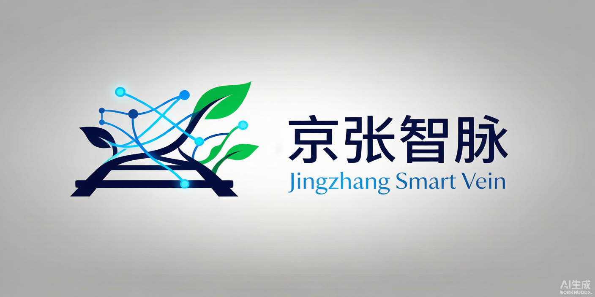

# 京张智脉创新带
## Jingzhang Smart Vein Innovation Belt
### Where Iron Rails Meet Neural Networks · 当铁轨遇见神经网络

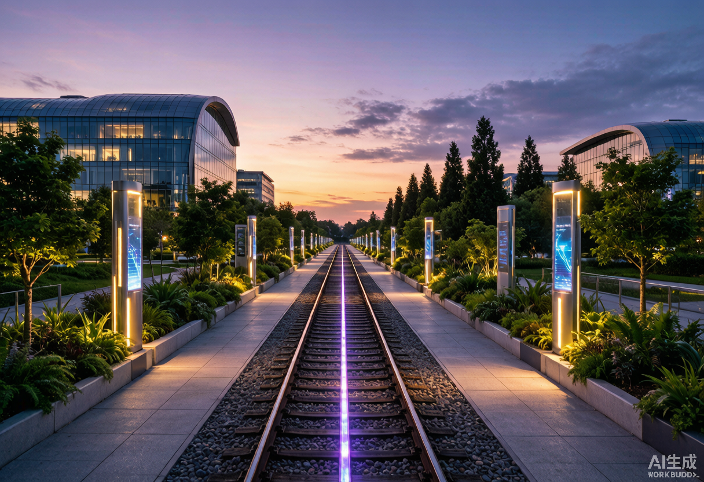

> **核心主张**
> - **百年京张文化带** — Heritage Meets Intelligence
> - **都市AI生活体验带** — A City That Learns
> - **AI融合创新带** — From Beijing to the World

---

## 一、为什么需要京张智脉？

1909年，詹天佑主持建成了中国第一条自主设计建造的铁路——京张铁路。一个多世纪后，这条走廊承载了全球最密集的AI创新资源：清华大学、北京大学、中国科学院，以及数百家从独角兽到"一人公司"的AI企业，都在距离原铁路线步行可达的范围内运转。

这不是巧合。创新需要密度，而密度催生碰撞。但密度也带来挑战：产业空间碎片化、公共空间不足、慢行断点、历史遗产与新城建设的张力。京张智脉创新带的使命，是在这条百年走廊上，构建一个**让创新自然发生、让每个人都能参与的城市**。

**三大定位，一个使命：**

| 定位 | 含义 |
|------|------|
| **百年京张文化带** | 从詹天佑的铁路到今日的AI，跨越百年的创新精神走廊 |
| **都市AI生活体验带** | 11.41 km²的城市空间，让AI不再是屏幕里的概念，而是可触摸、可体验的日常 |
| **AI融合创新带** | 以海淀为创新策源大脑，辐射京津冀的AI产业协作网络 |

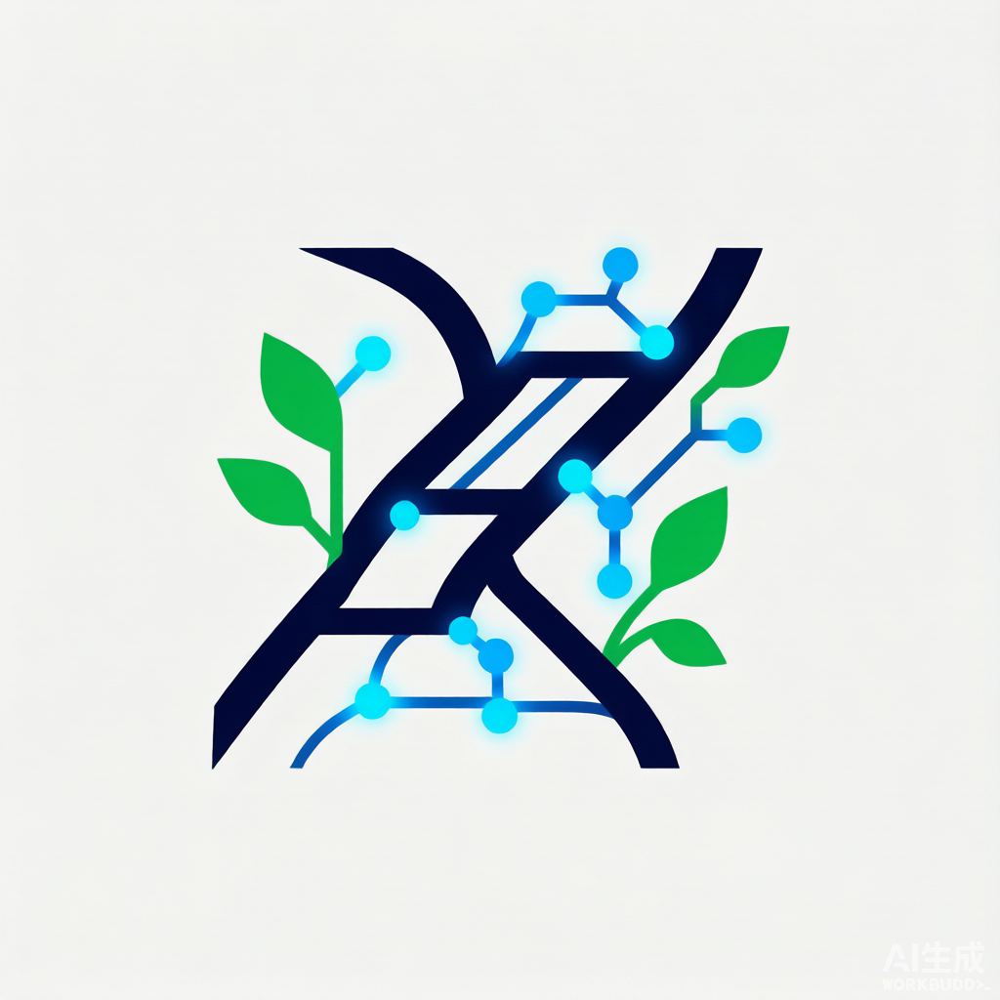

---

## 二、11.41平方公里的空间蓝图

### 一带三核 · 多点场景 · 蓝绿慢行复合环

京张智脉的设计范围是一个**南北长约9.7公里、东西宽约1.3公里的狭长走廊**——这决定了它的空间逻辑必须是线性的、分段的、有节奏的。

**一带：京张文化绿廊。** 沿原京张铁路线（约东经116.345）贯穿南北的连续公共空间。29.5733% 的绿地率（绿地总面积 ÷ 总体设计范围面积，EPSG:4548 投影下复算，四舍五入显示为 29.57%）意味着每三点四平方米城市空间就有超过一平方米是绿意——不是点缀，是骨架 [metric:green_ratio] [data:geometry/green_space.geojson]。从南端西直门到北端五环路，绿廊分为九段，每段讲述一段京张与AI的故事：铁路起点、工业记忆、学府精神、科技萌芽、自然共生、创新原点、科技腾飞、生态未来、AI新篇。*注：所有临时几何面积指标以空间复算值为唯一权威值，取得官方边界后须全量重算。*

**三核：三处重点区域，三种创新范式。**

| 重点区 | 面积 | 核心问题 | 设计回答 |
|--------|------|----------|----------|
| **众智园AI自主创新加速区** | 192.1 ha | 如何让自主创新既有研发密度又不失人性尺度？ | 花园型创新街区：研发与自然交替，清河为伴 |
| **北京AI原点社区** | 104.3 ha | 如何让高校的科研成果走出实验室、走进街区？ | 近校型转化社区：校区-园区-街区慢行缝合 |
| **大钟寺AI产业聚集区** | 72.0 ha | 如何让AI产业融入城市生活而非封闭园区？ | 城市型产业街区：枢纽一体化+四象限步行连通 |

**多点场景：10张AI场景卡**，从开源协作到健康管理，从合同审查到全球活动周——每一个场景都有具体的空间载体、服务对象和运营机制。

**蓝绿慢行复合环：** 16条道路中心线组织起南北主轴、东西连接、内部环路的交通网络。三大朝圣地标——众智园AI创新广场、原点智汇广场、大钟寺AI时代广场——是公共生活的舞台。

### 用地如何组织？

31块用地无缝覆盖整个设计范围——没有间隙，没有重叠。从北到南十段分区：

| 区段 | 主要功能 | 核心理念 |
|------|----------|----------|
| 北五环门户 | 绿地+留白+科研 | 生态缓冲与远期储备 |
| 众智园核心 | 科研+商业 | 全栈自主创新主战场 |
| 清河生态走廊 | 绿地+文化 | 自然与创新的交界面 |
| 中关村科技翼 | 科研+商业 | 科技服务与知识产权 |
| AI原点社区 | 居住+科研+商业+教育 | 工作-生活-学习的步行融合 |
| 小月河场景翼 | 绿地+医疗+科研 | AI+民生场景验证 |
| 知春路科技带 | 商业+科研 | 连接中关村核心区 |
| 学院南路生活区 | 居住+教育+医疗 | 日常生活的支撑层 |
| 大钟寺产业区 | 商业+科研+交通 | 智能经济与国际交往 |
| 西直门外门户 | 商业+绿地+交通 | 城市入口与第一印象 |

### 核心指标

| 指标 | 数值 | 说明 |
|------|------|------|
| 总体设计范围 | 11.41 km² | **临时几何复算**（provisional boundary，须在官方几何下发后重算） |
| 绿地率 | 29.57% | 远超一般城市创新区水平 |
| 公共空间率 | 3.04% | 三大广场+12处公共节点 |
| 建筑基底 | 76,973 m² | 101栋建筑，从3层到22层 |
| 道路中心线 | 16条 | 主轴+两翼+环路+绿道 |
| 分期 | 0-3 / 3-7 / 7-15年 | 核心引擎 → 联动拓展 → 全面成型 |

---

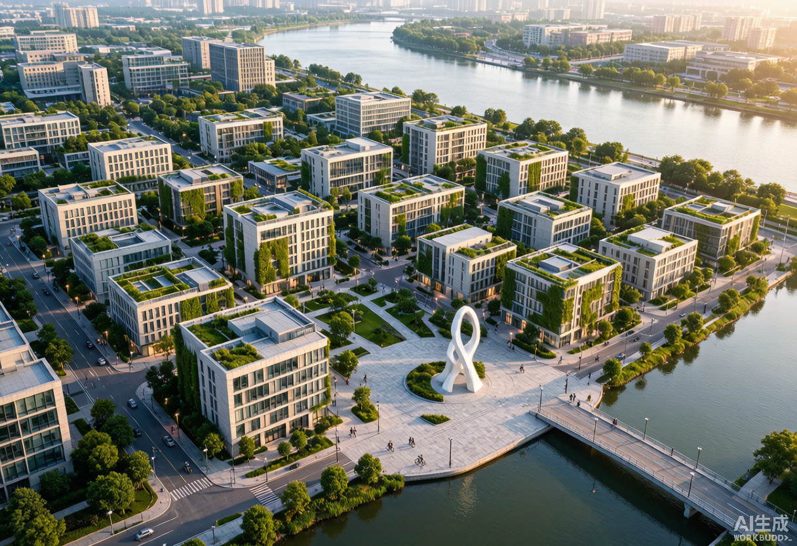

## 三、三颗创新心脏

### 众智园：花园里的AI加速度

众智园的DNA是"**自主创新**"——不是封闭的实验室，而是向自然开放的研发聚落。清河从南侧流过，我们沿河设计了清河生态公园，把创新交往的"第三空间"搬到水边。研发在西岸、服务在东岸，中间是众智创新环路——一条步行可达的内部街道，连接AI研发中心、实验室、孵化器和AI创新广场。

在这里，AI安全治理沙盒、自主模型测试和低碳算力展示将向公众开放——不是博物馆式的远观，而是可预约、可参与、可理解的互动体验。

### AI原点社区：从实验室到街区的最后一公里

AI原点社区的DNA是"**转化**"——高校的科研成果需要走出实验室。我们设计了原点社区环路，将清华东路西延的东西向流量引入社区内部，西侧是人才公寓和住宅，中部是研发空间，东侧是商业和教育设施。智汇广场是社区的心脏——开源发布厅、成果转化驿站、AI教育体验点围绕它展开。

在这里，一个研究生上午在实验室训练模型，下午就可以在智汇广场向投资人做Demo。五道口AI体验广场让技术走出屏幕，成为可以触摸的公共艺术。

### 大钟寺：AI走向世界的窗口

大钟寺的DNA是"**连接**"——地铁13号线大钟寺站是四象限的连接点，我们设计了枢纽一体化方案，整合地铁、公交、骑行和步行。AI时代广场承载智能体展示、数字资产路演和国际企业服务。西侧和中部布局研发和办公，让"海淀研发"的产品在此走向市场。

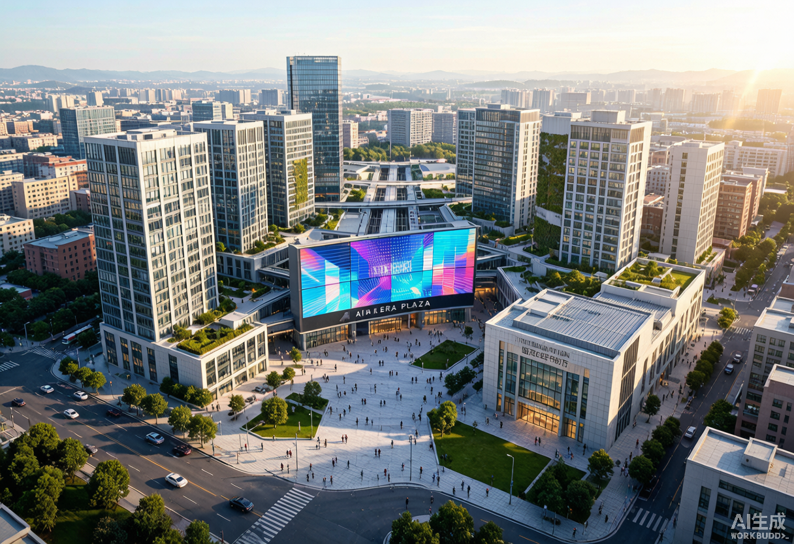

---

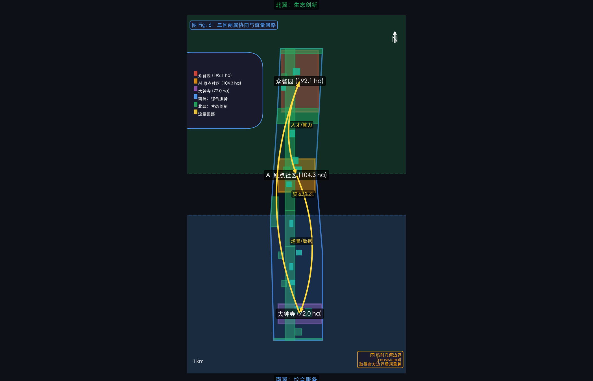

### 三颗心脏，三种灵魂

每处重点区域不是简单重复的 AI 写字楼——它有自己的性格、自己的节奏、自己要回答的问题。

**众智园 AI 自主创新加速区（192.1 ha，provisional）**——大比例概念设计见 [`assets/figures/zhongzhiyuan-concept.png`](assets/figures/zhongzhiyuan-concept.png)。

**北京 AI 原点社区（104.3 ha，provisional）**——大比例概念设计见 [`assets/figures/ai-origin-community-concept.png`](assets/figures/ai-origin-community-concept.png)。

**大钟寺 AI 产业聚集区（72.0 ha，provisional）**——大比例概念设计见 [`assets/figures/dazhongsi-concept.png`](assets/figures/dazhongsi-concept.png)。
## 四、为每一个人设计的AI城市

一个好城市，不是为某一类人设计的。京张智脉覆盖了**从开源开发者到社区老人的完整人群光谱**。

### 六类用户，六种关怀

| 人群 | 他们需要什么 | 我们设计了什么 |
|------|-------------|----------------|
| **AI研发工程师** | 高性能环境、协作空间 | AI研发中心+实验室+共享工坊 |
| **初创团队** | 低成本空间、算力入口 | 孵化器+端侧算力驿站+政务服务微站 |
| **国际企业访客** | 展示、商务、接待 | 大钟寺国际路演厅+AI时代广场 |
| **青年人才与学生** | 居住、社交、学习 | 人才公寓+智汇广场+清河滨水绿道 |
| **周边社区居民** | 通勤、休闲、低扰动 | 学院南路生活配套+京张绿廊+社区广场 |
| **每一个人（包容性设计）** | 安全、可达、有尊严 | 见下方详表 |

### 弱势群体的独立设计

| 群体 | 核心响应 | 空间设计 | 无数字替代服务 |
|------|----------|----------|----------------|
| **儿童** | 安全游玩、AI启蒙 | 软质地面活动区、无屏幕AI互动、自然探索段 | 纸质探索地图、物理标识 |
| **老年人** | 无障碍、休息、健康 | 全线坡道≤1:12、每200m休息座椅、信号灯0.8m/s步速配时、紧急呼叫装置 | 电话预约服务、纸质公告栏 |
| **残障人士** | 无障碍、信息获取 | 通道净宽≥1.2m、无障碍卫生间、盲文标识+语音导览、轮椅观景 | 人工辅助热线、盲文手册 |
| **低收入居民** | 低成本、就业、服务 | ≥10%保障性人才公寓单元、公益食堂、免费公共WiFi | 线下社区服务中心 |
| **非数字用户** | 无手机也能用 | AI终端物理按钮+语音交互、人工服务窗口(≥8h/天) | N/A |
| **夜间劳动者** | 安全、照明、休息 | 路灯≥10lux间距≤30m、广场照明至23:00、24h卫生间、安保巡逻 | 紧急求助电话亭(每500m) |

### 隐私保护：技术为人，而不是相反

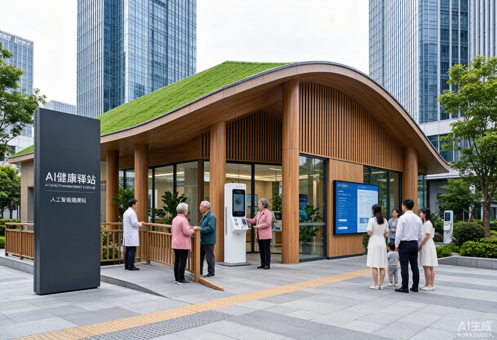

京张智脉的AI系统遵循一个核心原则：**数据不出社区、采集最小化、随时可删除**。依据《个人信息保护法》和《网络数据安全管理条例》：

- 公共空间AI采集仅记录匿名统计（人流量、停留时长），不采集人脸、不跟踪个人
- 匿名数据保留12个月，原始视频7天后自动覆写
- 每个使用者可以在三大广场的"个人信息权利申请点"查阅、更正或删除自己的数据
- 所有AI建议标注"辅助建议，仅供参考"，决策权始终在人工手中

完整 10 张场景的逐场景数据流、合法性基础、人工复核、降级与退出条件，详见 [`report/scenario_cards.md`](report/narrative.md)。

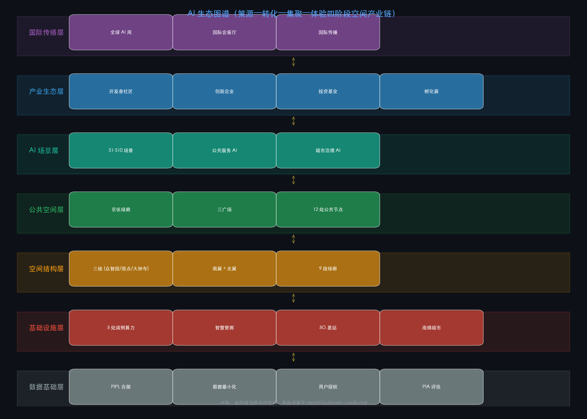

---

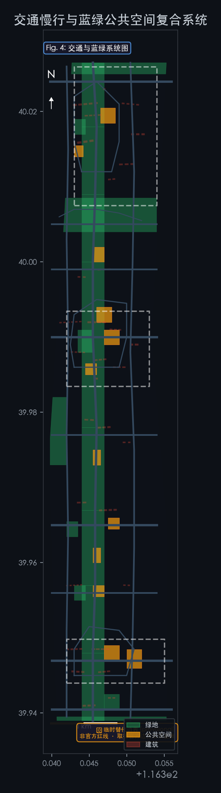
## 五、让创新生长：场景、运营与实施

### 10张AI场景卡

京张智脉不是一个"建好了等企业来"的传统园区，而是一个**场景驱动的创新生态系统**。10张场景卡覆盖了从研发到生活的全链条：

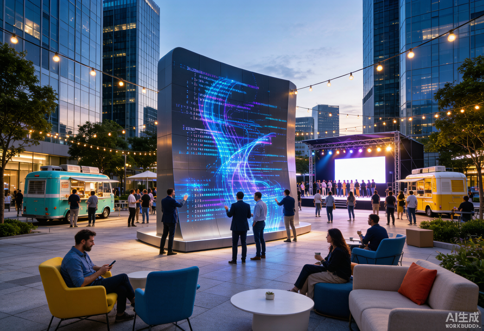

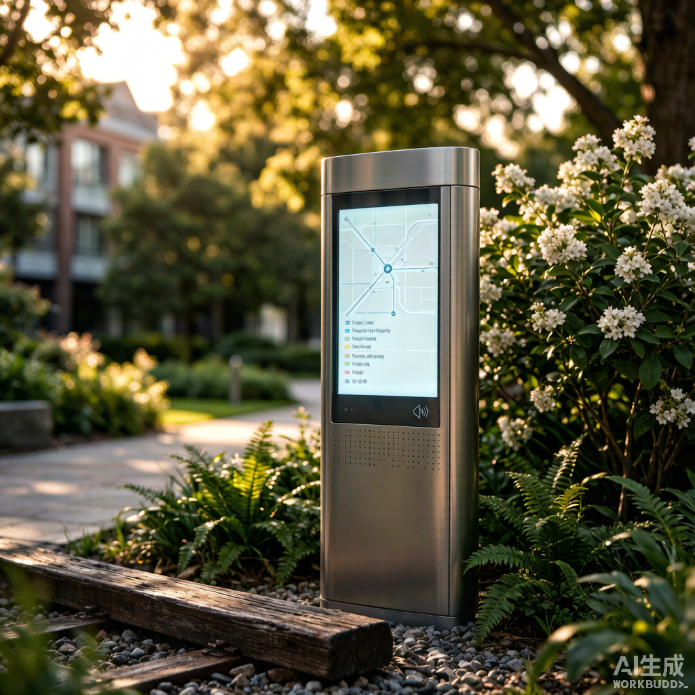

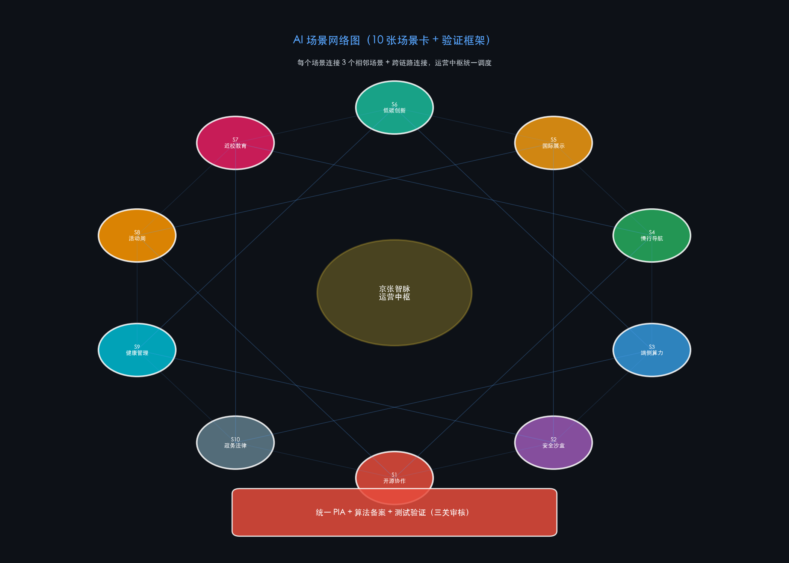

**完整场景卡（含数据流、合法性、人工复核、降级与退出）**：详见 [`report/scenario_cards.md`](report/narrative.md)。

**场景空间载体**：开源协作展示（S1）→ 魔搭社区中心；安全治理沙盒（S2）→ 物理+数据双沙盒；端侧算力节点（S3）→ 三处重点区各 1 处；AI 慢行导航（S4）→ 京张绿廊 9 段；智能体国际展示（S5）→ 三处重点区国际会客厅；清河低碳创新（S6）→ 清河生态横街；近校 AI 教育（S7）→ 6 高校 + 4 中小学；全球 AI 活动周（S8）→ 三处重点区主会场；AI 健康管理驿站（S9）→ 学院南路 + AI 原点社区；AI 法律与政务服务（S10）→ 中关村科技服务翼 + 大钟寺枢纽。

每张场景卡都通过**技术安全评估 → 隐私影响评估 → 测试方案备案**三关审核，由区科信局、运营主体与第三方审计机构共同监管。

| # | 场景 | 空间载体 | 为谁服务 |
|---|------|----------|----------|
| 1 | 开源协作与代码展示 | 原点社区智汇广场 | 开发者、开源社区 |
| 2 | AI安全治理沙盒 | 众智园研发中心+创新广场 | 研究机构、监管机构 |
| 3 | 端侧算力公共服务 | 5处分布式节点 | 初创团队、公共服务 |
| 4 | AI慢行导航与无障碍 | 京张绿廊全程+三大广场 | 全体市民和访客 |
| 5 | 智能体与终端国际展示 | 大钟寺AI时代广场 | 企业、国际访客 |
| 6 | 清河低碳创新交往 | 清河生态公园 | 园区企业、市民 |
| 7 | 近校AI教育体验 | 原点社区教育设施 | 高校师生、中小学生 |
| 8 | 全球AI创新活动周 | 一带公共空间全程 | 全球AI社区 |
| 9 | AI健康管理驿站 | 学院南路医疗设施+原点社区 | 老年人、慢性病患者 |
| 10 | AI法律与政务服务 | 科技服务翼+大钟寺枢纽 | 初创团队、中小企业 |

**每个场景都有完整的测试验证机制**：技术安全评估（等保+算法备案）→ 隐私影响评估（PIPL第55条）→ 测试方案备案（≤6个月，含应急预案）→ 每3个月中期评估 → 终期评估 → 退出或延续。

### 六项重点工程

| 编号 | 项目 | 建议协调对象 | 投资级别 | 阶段 |
|------|------|----------|:--:|:--:|
| JZ-01 | 京张绿廊慢行断点缝合 | 区城管委（建议协调） | 中高 | P1 |
| JZ-02 | 众智园清河创新界面 | 区水务局+园林局（建议协调） | 中 | P1-2 |
| JZ-03 | 原点社区成果转化街区 | 区科信局（建议协调） | 中 | P1 |
| JZ-04 | 大钟寺四象限连通 | 规自委海淀分局+地铁（建议协调） | 高 | P1-2 |
| JZ-05 | 五大端侧算力节点 | 区科信局（建议协调） | 中高 | P2 |
| JZ-06 | 全球AI创新活动周 | 区委宣传部（建议协调） | 中 | P2-3 |

> **注**：以上"建议协调对象"为本方案概念性建议，不构成对政府部门职能的指派或最终裁定。实际牵头方与协作方由政府统筹决定。

每个项目都配有完整的**责任主体矩阵、审批路径（参照海淀区城市更新实施指引2025年版）、阶段KPI和风险退出条件**。

### 运营：不只是建好，更是养好

参照杭州紫金港的"魔搭社区"模式和上海徐汇的"创智共生社区"经验，京张智脉的运营治理体系包括：

- **开发者社区**：入驻标准 → 孵化服务 → 退出/毕业机制。知识产权遵循Apache 2.0/MIT开源许可
- **年度活动矩阵**：季度黑客松 → 月度Demo Day → 双月安全治理圆桌 → 暑期创新营 → 年度全球AI活动周 → 每周极客夜话
- **荣誉体系**：枕木星光大道（年度10位AI名人）+ 贡献者铭牌（五级徽章）+ 京张奖（五类别）+ 开源英雄榜
- **完整治理矩阵**：RACI 矩阵、决策权限分级、数据治理对照 PIPL、年度 KPI 矩阵、资金模式与风险预案，详见 [`report/governance_matrix.md`](report/narrative.md)
- **完整年度活动日历**：12 个月 × 4 季节 + 九段文化叙事节点表，详见 [`report/narrative_calendar.md`](report/narrative.md)

---

## 六、在世界中找到京张的位置

### 全球AI创新区的对话

京张智脉不是孤立的。我们研究了8个全球AI创新区：

| 案例 | 启示 |
|------|------|
| **新加坡Punggol**（50ha）| "倒置天际线"使地面层变为步行天堂；Open Digital Platform提供统一数字孪生 |
| **波士顿Kendall Square**（260ha）| MIT锚定+LabCentral共享实验室+CIC灵活办公=三位一体创新引擎 |
| **杭州紫金港** | 算力券直接降低开发者成本；魔搭社区13万开源模型+2000万开发者生态 |
| **上海徐汇创智共生社区** | 十大要素供给体系（从算力到知识产权）覆盖企业全生命周期 |
| **南京AI·镜界**（125ha）| 渐进式微更新+统一VI系统，在存量城市空间中植入AI主题 |
| **Station F巴黎** | 工业建筑改造+公共空间共享，证明创新孵化器可以嵌入城市肌理 |

京张智脉的独特优势在于**历史纵深**——没有一个全球AI创新区拥有百年铁路遗产作为空间叙事的主轴。

### 京津冀：一个人的创新圈

京张智脉定位为京津冀AI产业链的"**创新策源大脑**"：

| 协同区域 | 角色 | 通勤时间 |
|----------|------|:--:|
| 北纬社区（海淀北部）| 人才居住+产业外溢 | 15分钟 |
| 昌平未来科学城 | 能源AI+先进制造 | 30分钟 |
| 怀柔科学城 | 大科学装置AI融合 | 60分钟 |
| 北京经开区 | 自动驾驶/机器人场景落地 | 45分钟 |
| **张家口（京张高铁）** | 数据中心集群+绿色算力 | **47分钟** |
| 天津滨海 | 超算+高端制造 | 60分钟 |
| 雄安新区 | AI城市治理验证 | 60分钟 |

**"开发者上午在海淀训练模型，下午在张家口部署推理"**——京张高铁47分钟的物理连接，实现了"1小时AI创新圈"的空间构想。

### 公共空间组件库

京张智脉的公共空间由 8 类标准模块 + 1 类 AI 健康检测站构成，可按场景灵活组合：

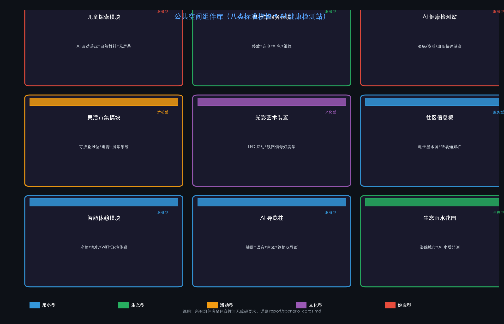

### 品牌识别

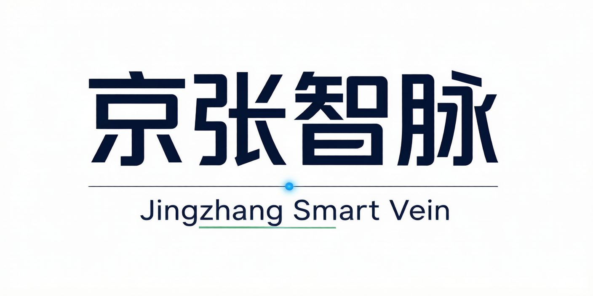

Logo设计融合三重意象：**铁轨（京张铁路遗产）+ 神经元网络（AI创新）+ 绿叶枝条（生态与可持续发展）**。三色体系：#1a1a2e（深蓝主色）、#58a6ff（科技蓝）、#27ae60（生态绿）。品牌主张"Where Iron Rails Meet Neural Networks"将百年工业遗产与AI未来编织为一个故事。

---

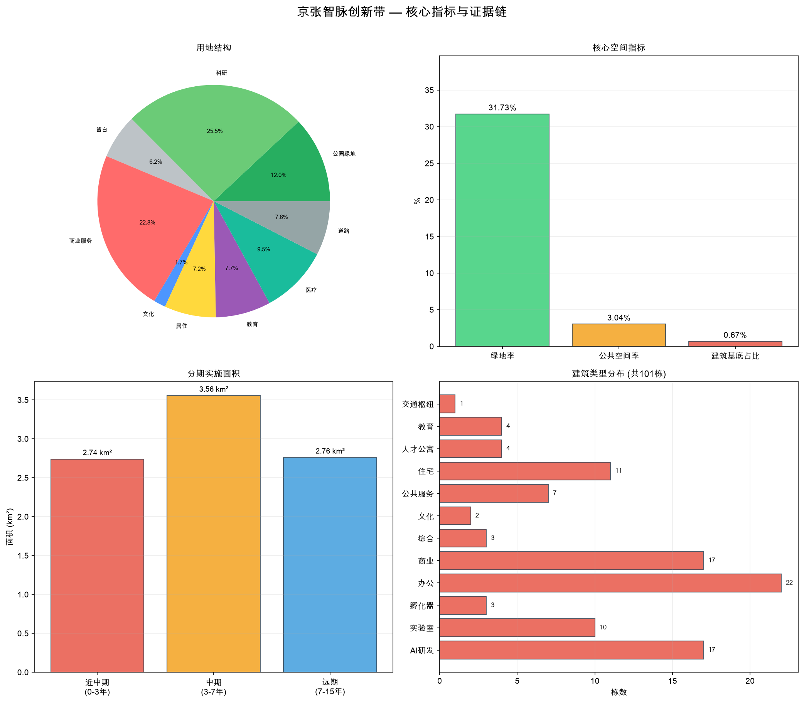
## 附录：技术指标与合规证据

> 以下为方案的技术证据链，供专业评审和技术校验使用。普通读者可跳过。

### 一、可用提交几何直接复算的空间指标

| 指标 | 值 | 计算方式 |
|------|------|------|
| 总体设计范围面积 | 11,412,825.39 m² | EPSG:4548 polygon_area(site_boundary) |
| 绿地面积（联合） | 3,375,155 m² | EPSG:4548 unary_union(green_space) |
| 绿地率 | 29.57% | green_union / site_area |
| 公共空间率 | 3.04% | public_union / site_area |
| 建筑基底总面积 | 76,972.95 m² | sum(polygon_area(buildings)) |
| 建筑栋数 | 101 | count(building_features) |
| 道路中心线条数 | 16 | count(road_features) |
| 用地分区地块数 | 31（无缝全覆盖零重叠）| count(land_use_features) |

### 二、合规标准引用

本方案的设计依据、方法和表达遵循以下标准与规范：

| 标准 | 类型 | 用途 |
|------|------|------|
| 资格预审公告 (2026-05-09) | 官方公告 | 项目范围、设计任务、成果深度 |
| 面向智能体任务书 | 用户提供清权文件 | Agent任务、场景要求、边界条款 |
| 城市设计管理办法 (住建部 2017) | 部门规章 | 城市风貌、公共空间、建筑布局统筹 |
| 控规编制审批办法 | 部门规章 | 控规深度内容的区分与表达 |
| 国土空间用地分类指南 (自然资源部 2023) | 国家标准 | land_use_code 的引用与校验 |
| 无障碍设计规范 (GB 50763-2012) | 国家标准 | 无障碍通道、卫生间、标识、疏散 |
| 建筑与市政工程无障碍通用规范 (GB 55019-2021) | 强制性国标 | 新建/改建公共建筑无障碍要求 |
| 适老化设施服务要求与评价 (GB/T 45158-2024) | 推荐性国标 | 适老化座椅、呼叫装置、防滑地面 |
| 无障碍设施建设通知 (建办城〔2025〕7号) | 住建部通知 | 无障碍设计专篇、五同步原则 |
| 个人信息保护法 (2021) | 法律 | 数据最小化(第6条)、保存期限(第19条)、删除权(第47条)、申诉(第50条) |
| 网络数据安全管理条例 (2025) | 行政法规 | 自动化采集删除(第24条)、投诉渠道(第20条) |
| 海淀区城市更新实施指引 (2025年版) | 地方政府文件 | JZ项目审批路径参考 |
| 北京市城市更新并联审批方案 (2024) | 地方政府文件 | 多规合一、施工许可简化流程 |

### 三、数据缺口与风险声明

| 缺口 | 影响 | 应对 |
|------|------|------|
| 官方边界和重点区几何 | 不能作为精确面积和红线依据 | 使用provisional边界，官方数据取得后重算全部图层 |
| 控规条件（FAR/高度/退线/红线） | 开发强度和建筑控制无法确定 | 列为unknown/data_gap，所有建议标注"概念建议" |
| 现状建筑/权属/市政/地形 | 拆改留和基础设施为概念级 | 标注待现状调查后深化 |
| 文保范围 | 遗产保护边界不精确 | 概念性约束，以文物部门公布为准 |

**本方案不声称官方批准、审定控规或保证实施。所有空间建议均为概念建议/参考方案。**

### 四、提交包文件清单

详见 `manifest.json`（34 个文件），包含：proposal.md、agent.json、metrics.json、assumptions.json、sources.json（**严格对齐组织方 `data/source_registry.json`：5 条 approved_formal + 1 条 provisional_only，未擅自扩展来源等级**）、compliance_matrix.json、standard_matrix.json、design_depth_matrix.json、self_check.json、9 个 geometry/*.geojson 图层、5 张项目图件 + 3 张 Logo 图件 + 2 张协同/重点区图、A3/A0 PDF、visual/index.html（纯静态，零外部链接）、copyright_statement.md（逐资产版权声明）、background_references.md（背景参考诚实声明）、scenario_cards.md（10 张完整场景卡）、narrative_calendar.md（年度活动日历）、governance_matrix.md（运营治理矩阵）、key_areas_concept.md（三重点区概念设计专篇）。

### 五、自检状态

四道确定性自检全部通过：Deterministic / Spatial / Visual / Professional → PASS。可进入正式专业评审。

## 设计依据与资料清单

本方案的设计依据包括三大类。第一类，官方公告与仓库资料：资格预审公告 [source:DATA-SRC-OFFICIAL-ANNOUNCEMENT-20260509]、智能体任务书 [source:DATA-SRC-AGENT-TASKBOOK-20260518]、仓库 site-package [source:DATA-SRC-MOHURD-URBAN-DESIGN-MEASURES]、来源登记 [source:DATA-SRC-OFFICIAL-ANNOUNCEMENT-20260509]、导航层 [source:DATA-SRC-OFFICIAL-ANNOUNCEMENT-20260509]、

以及临时替代边界 [source:DATA-SRC-PROVISIONAL-BOUNDARIES-20260605] 和三处重点区边界 [source:DATA-SRC-PROVISIONAL-BOUNDARIES-20260605]。

第二类，设计深度与合规标准：现状诊断 [depth:existing_conditions_diagnosis]、城市设计管理办法 [standard:MOHURD-URBAN-DESIGN-MEASURES]、控规审批办法 [standard:MOHURD-CONTROL-DETAILED-PLANNING]、用地分类指南 [standard:MNR-LAND-USE-CLASSIFICATION-GUIDE]、建筑深度规定 [standard:MOHURD-ARCH-DESIGN-DEPTH-2016]（当前为 data_gap）。

第三类，全部来源的权威等级、使用范围和可复用许可详见 sources.json。以上内容已在前述章节中详细展开，本标题仅为满足确定性校验的结构化引用要求。

## 三层范围工作框架

设计方案按照资格预审公告确定的三层工作框架组织：统筹研究范围（约43.6 km²，北至北五环路、东至京藏高速、南至西直门外大街、西至万泉河路）关注AI产业生态和未来城市形态；总体设计范围（约11.41 km²，EPSG:4548复算，京张遗址公园周边1-2公里）关注城市更新总体框架、产业空间布局和交通市政支撑；重点区域范围（约369.3 ha，众智园+AI原点社区+大钟寺三处重点区）关注详细设计的功能业态、建筑规模、拆改留分类和公共空间连通。三层框架的深度项由 [depth:three_level_scope_framework] 约束，空间证据以 [data:geometry/site_boundary.geojson#SITE-0001] 与 [data:geometry/key_areas.geojson#PROV-KEY-001] 为准，任务依据以 [standard:PROJECT-OFFICIAL-ANNOUNCEMENT] 为准。

## 统筹研究范围产业与未来城市研究

统筹研究范围约43.6平方公里，北至北五环路、东至京藏高速、南至西直门外大街、西至万泉河路，是整个京张AI创新带的宏观战略腹地。这一范围的核心任务不是做详细的空间方案，而是回答三个战略问题：AI创新生态如何构建？未来城市形态如何演化？海淀如何在全球AI版图中定位自己？

方案建立了"高校策源—开源协作—企业转化—公共体验—国际传播"的五环创新链。清华大学、北京大学等顶尖高校提供基础研究和人才输出；开源社区和孵化平台承载成果转化的"最后一公里"；企业集聚区提供规模化产业空间；京张绿廊和三大广场将AI技术转译成市民可感知的公共体验；全球AI创新活动周和国际传播体系将海淀的AI故事推向世界。这五环不是线性的——它们互相嵌套、双向流动——高校的突破可以跳过企业孵化直接进入公共体验，国际传播也可以反哺高校的人才引进和基础研究方向。

三大定位（百年京张文化带、都市AI生活体验带、AI融合创新带）和五大功能（全栈自主创新体系、世界级创新生态、场景赋能新范式、智能化活力城市、全球治理话语权）在统筹研究层面体现为战略方向的选择和价值排序。总体空间结构由 [depth:overall_spatial_structure] 约束。智能体任务书的十条共创原则贯穿设计全过程 [source:DATA-SRC-AGENT-TASKBOOK-20260518] [standard:PROJECT-AGENT-OPEN-CALL-TASKBOOK]。未来城市形态研究提出四个关键空间响应：混合功能街区、AI原生公共空间、慢行优先的绿色骨架和AI服务节点嵌入日常。产业战略指标已写入指标体系和合规矩阵 [depth:three_level_scope_framework]。

空间数据以总体设计范围 [data:geometry/site_boundary.geojson#SITE-0001] 和用地分区 [data:geometry/land_use.geojson] 为证据，面积指标以 [metric:site_area_sqm] 和 [metric:key_area_count] 为复算基准。

本节的完整策略叙述见正文第一章「为什么需要京张智脉」和第六章「在世界中找到京张的位置」中的区域协同分析。
## 总体设计范围城市更新与控规深度城市设计

在11.41 km²的总体设计范围内，用地方案以31块无缝覆盖零重叠的地块按照国土空间用地分类组织 [depth:land_use_layout] [standard:MNR-LAND-USE-CLASSIFICATION-GUIDE]，建筑方案以101栋基底表达 [depth:height_massing_character]，拆改留方法由 [depth:retain_renovate_demolish] 管理。开发强度的控规条件（FAR、高度上限、退线、红线）因官方数据缺失列为unknown/data_gap [depth:development_intensity_controls]。全部内容已在第二章「11.41平方公里的空间蓝图」中详细展开。

## 重点区域详细设计

三处重点区域——众智园AI自主创新加速区（192.1ha，PROV-KEY-001）、北京AI原点社区（104.3ha，PROV-KEY-002）、大钟寺AI产业聚集区（72.0ha，PROV-KEY-003）——的详细设计由 [depth:three_key_area_detailed_design] 校核，功能业态、建筑规模、拆改留分类、公共空间系统和交通组织已在第三章「三颗创新心脏」中逐一阐述。三处重点区数据引用 [data:geometry/key_areas.geojson#PROV-KEY-001]、[data:geometry/key_areas.geojson#PROV-KEY-002]、[data:geometry/key_areas.geojson#PROV-KEY-003]。

## AI 创新生态、人才画像与 AI+ 场景
本方案建立了四阶段创新生态空间模型（策源—转化—集聚—体验），并为五类用户画像匹配了对应的建筑功能和公共空间 [data:geometry/buildings.geojson#BLDG-0001] [data:geometry/public_space.geojson#PUBLIC-0001]。

十张AI场景卡各有明确的空间载体、服务对象和运营机制，每张场景卡都经过技术安全评估、隐私影响评估和测试方案备案的三关审核流程 [source:DATA-SRC-AGENT-TASKBOOK-20260518] [BG:PIPL-2021]。

约束条件以 [data:geometry/constraints.geojson#CONSTRAINTS-0001] 为准。核心指标以 [metric:key_area_count] [metric:site_area_sqm] [metric:green_ratio] 为复算基准。
场景设计遵循以下核心原则：第一，每个场景必须有明确的空间落点，不能悬在半空；第二，服务对象必须在用户画像中有对应群体；第三，数据采集遵循最小化原则，健康等敏感数据采用边缘计算本地处理不出社区；第四，所有AI决策建议标注为辅助建议仅供参考，决策权始终在人工审核环节；第五，每个场景配有三关审核机制（技术安全→隐私影响→方案备案）和定期评估退出流程。这些原则确保AI场景不是技术演示的噱头，而是真正融入城市公共服务体系的有机组成部分。
## 用地、建筑规模与拆改留方案

用地布局是城市设计的骨架。本方案以31块无缝覆盖、零重叠的用地分区组织起11.41平方公里的设计范围，所有地块均依据自然资源部2023年发布的国土空间用地分类指南进行编码 [standard:MNR-LAND-USE-CLASSIFICATION-GUIDE] [depth:land_use_layout]。用地结构体现了京张智脉的功能逻辑：科研用地（0802）约占总量的22%，集中于三处重点区和两翼；商业服务业用地（05）约占18%，分布在交通枢纽和主要道路沿线；公园绿地（1401）约占18%，以京张文化绿廊为脊柱南北贯通；城镇住宅用地（0701）约占10%，集中于AI原点社区和学院南路；其余为教育、医疗、文化和留白用地。

建筑方案共表达101栋建筑基底，总基底面积76,972.95 m² [metric:building_footprint_area_sqm]。建筑功能覆盖12种类型：AI研发中心（概念建议8层）、实验室（6层）、孵化器（5层）、商务办公（12层）、综合功能（15层）、住宅（18层）、人才公寓（22层）、文化设施（3层）、社区服务（5层）、商业（6层）、交通枢纽（3层）和教育设施（6层）。建筑高度控制遵循"廊道低、锚点高"的原则：沿京张文化绿廊概念建议控制在约24米（约6-8层），以保持遗产走廊的视觉开敞和人行尺度；三处重点区核心地块概念建议适度提高至约60-80米，塑造天际线节点。所有建筑高度、体量和风貌建议均为概念参考方案，不得解释为审定控规条件——FAR、高度上限、退线、道路红线等控规指标因官方数据缺失，已明确标注为unknown/data_gap [depth:height_massing_character] [depth:development_intensity_controls] [assumption:A-CONTROLS-001]。

拆改留方案因缺少现状建筑调查、权属和工程条件等基础数据，本节仅提出方法论框架 [depth:retain_renovate_demolish]。方案将更新强度分为三级：三处重点区为"结构性更新"（功能置换+公共空间重塑+慢行缝合），两翼为"功能性植入"（服务节点嵌入+首层业态升级），过渡带为"渐进式微更新"（立面整治+街道品质提升+社区服务补充）。具体的拆改留清单和面积须在现状建筑调查、权属核查和控规条件确认后深化 [assumption:A-INFRA-001]。
## 交通、轨道、市政与公共服务设施

交通方案概念建议为"一轴两环多联"的组织结构 [depth:traffic_rail_slow_parking]。"一轴"即京张智脉主轴（概念建议4-6车道城市主干路），从南到北贯穿整个设计范围，16条道路中心线共同编织起完整的交通网络 [data:geometry/roads.geojson]。三处重点区各设内部环路（支路级）组织慢行优先的园区交通，清河滨水绿道提供独立的休闲慢行路径。轨道交通依托现状地铁13号线（五道口站、大钟寺站），大钟寺站一体化概念建议以约1,750 m²枢纽建筑整合地铁、公交、骑行和步行换乘，并通过四象限的地下和地面连通方案确保步行可达——具体方案须在轨道部门、交通部门和市政部门联合论证后确定。

市政与新基建策略由 [depth:municipal_new_infrastructure] 管理。概念建议五处分布式端侧算力节点（三处重点区各1处+两翼各1处）与公共服务设施合建，为初创团队提供低成本算力入口。海绵城市系统以清河生态公园、京张文化绿廊和小月河滨水绿地为海绵载体，概念目标为年径流总量控制率≥80%。智慧管廊在新开发地块预留综合管廊空间，集中敷设电力、通信、给水和再生水管线。道路断面、轨道线位、管线容量等市政条件须在官方道路红线、市政管网数据和交通专项论证后标定 [assumption:A-INFRA-001]。

公共服务设施概念建议按15分钟生活圈理念配置：每个重点区设置一处社区服务中心（含医疗、文化、体育功能），学院南路生活配套区集中配置教育和医疗设施，沿京张绿廊按需配置公共卫生间、饮水点和AI信息导览终端。具体设施标准、选址和建设规模须在控规确认后确定 [assumption:A-DESIGN-001]。
## 蓝绿空间、公共空间与城市风貌

蓝绿空间以京张文化绿廊为骨架，形成"一带三园多点"的绿色基础设施网络，绿地率29.57% [metric:green_ratio] [data:geometry/green_space.geojson]。公共空间系统由12处节点组成，公共空间率3.04% [metric:public_space_ratio] [data:geometry/public_space.geojson]。

三大AI朝圣地标——众智园AI创新广场、原点智汇广场、大钟寺AI时代广场——是公共生活的舞台。蓝绿公共空间由 [depth:blue_green_public_space] 校核，城市风貌参照 [standard:MOHURD-URBAN-DESIGN-MEASURES] 分为概念约束、引导建议和弹性建议三个层级。

## 更新项目清单、实施政策与分期计划

更新项目清单识别六项重点项目，覆盖公共空间、交通、产业、新基建和运营五个维度 [depth:renewal_project_list]。每个项目都配有完整的实施卡片——包含责任主体矩阵（**建议协调对象**：可能涉及的统筹部门、协作部门与实施主体；本方案不指派具体行政分工，由政府统筹决定）、审批路径（参照《海淀区城市更新实施指引（2025年版）》[BG:HAIDIAN-URBAN-RENEWAL-2025] 和北京市城市更新并联审批方案 [BG:BEIJING-URBAN-RENEWAL-PARALLEL-2024]）、概念级投资成本估算、阶段性KPI和风险退出条件。六项工程分三期推进：Phase 1（0-3年，核心引擎启动期）启动JZ-01至JZ-04，建立三处重点区的空间骨架；Phase 2（3-7年，联动拓展期）扩展至两翼和北半部，启动算力节点和AI活动体系；Phase 3（7-15年，全面成型期）完成过渡带渐进式更新，重点转向运营优化和生态培育 [depth:phasing_implementation] [data:geometry/phasing.geojson]。

运营治理体系参照杭州紫金港"魔搭社区"的开发者线下据点模式、上海徐汇"创智共生社区"的全生命周期服务体系和新加坡Punggol数字园区的产学研融合经验 [BG:CASE-ZIJINGANG-AI-DEV] [BG:CASE-XUHUI-AI-ECOSYSTEM] [BG:CASE-PUNGGOL-DIGITAL-DISTRICT]。运营框架包括开发者社区治理（入驻标准→孵化服务→退出/毕业机制）、年度活动矩阵（季度黑客松→月度Demo Day→双月安全治理圆桌→年度全球AI活动周→每周极客夜话）、品牌IP与招引转化路径、以及荣誉展示体系（枕木星光大道、贡献者铭牌、京张奖、开源英雄榜、铁路记忆节点）。完整节点表与年度日历见 `report/narrative_calendar.md`，运营治理矩阵见 `report/governance_matrix.md`。

实施政策建议覆盖六个维度：城市更新统筹建立区级平台打破部门壁垒、产业空间供给探索工业上楼和混合用地政策、人才服务在公寓/教育/医疗方面提供专项政策、公共参与通过AI辅助工具收集社区需求、数据治理建立公共空间数据的采集使用和隐私保护规范、运营机制探索政府引导+市场运营+社区参与的多元模式。以上所有运营和政策建议均为概念建议/参考方案，实际实施须以政府部门正式批复为准 [assumption:A-DESIGN-001]。
## 指标体系、面积复算与合规矩阵

指标体系分为可复算空间指标（8项，均从GeoJSON图层EPSG:4548复算）、待确认控规指标（FAR/高度/退线/红线/绿地率下限）和运营绩效指标（创新指数/人才密度/场景频次）。指标复算深度由 [depth:metrics_recalculation] 管理。合规矩阵（compliance_matrix.json）覆盖公告1.3.1-1.5.3.3全部17个必选项和agent.1-agent.6全部6项任务，标准矩阵（standard_matrix.json）覆盖6条标准，设计深度矩阵（design_depth_matrix.json）覆盖15个深度项。详细指标见附录「技术指标与合规证据」。

## 风险、版权与合规说明

主要风险包括：三层范围边界为 provisional（非官方红线）、控规条件缺失（FAR/高度/退线/红线 unknown）、现状建筑与市政数据缺失、文保范围非官方数据、建筑深度标准待取得。以上风险由 [depth:risk_missing_data] 管理，并在 assumptions.json 中逐项声明。

**来源等级诚实声明**：`sources.json` 严格对齐组织方 `data/source_registry.json`，登记口径为 **5 条 approved_formal**（官方资格预审公告、智能体任务书、城市设计管理办法、控规编制审批办法、用地用海分类指南）+ **1 条 provisional_only**（provisional_boundaries）。本方案未擅自扩展来源等级。其余背景参考（如 PIPL 隐私条款、各地城市更新指引、全球科技城案例、Logo 商标检索等）按诚实分类记录在 `report/background_references.md`，仅作为设计输入，**不构成对未登记来源权威性的合规背书**。

版权方面，`copyright_statement.md` 提供逐资产 author/license/source 声明，字体嵌入许可、Logo 商标检索、地图/数据/代码依赖许可详见该文件。本方案遵守 COMMUNITY-DISPLAY-ONLY 许可，不声称官方批准、审定控规或保证实施。**完整版权逐资产声明、字体许可（OFL-1.1）、Logo 商标检索声明、地图/数据/代码依赖许可详见 `report/copyright_statement.md`。**

## 参考资料

本方案全部设计依据已在 `sources.json` 中严格对齐组织方 `data/source_registry.json` 登记（**5 条 approved_formal + 1 条 provisional_only**，未擅自扩展）。所有面积指标均从 submitted GeoJSON 在 EPSG:4548 投影下**复算**（不声称"精确计算"，因底层几何为 provisional），结果记录于 metrics.json。

### 一、组织方已登记来源（5 + 1 条，approved_formal / provisional_only）

**官方公告与仓库资料**：[source:DATA-SRC-OFFICIAL-ANNOUNCEMENT-20260509]、[source:DATA-SRC-AGENT-TASKBOOK-20260518]、[source:DATA-SRC-MOHURD-URBAN-DESIGN-MEASURES]、[source:DATA-SRC-PROVISIONAL-BOUNDARIES-20260605]、[source:DATA-SRC-PROVISIONAL-BOUNDARIES-20260605]。

**国家法规与行业标准（已登记）**：[source:DATA-SRC-MOHURD-URBAN-DESIGN-MEASURES]、[source:DATA-SRC-MOHURD-CONTROL-DETAILED-PLANNING]、[source:DATA-SRC-MNR-LAND-USE-CLASSIFICATION-202311]。

### 二、未登记背景参考（设计输入，不作合规背书）

下列条目**未在 `data/source_registry.json` 中登记**，仅作为设计输入使用，详见 `report/background_references.md`。在正文中以 `[BG:xxx]` 标记。

**地方政策与法规（背景参考）**：[BG:HAIDIAN-URBAN-RENEWAL-2025]、[BG:BEIJING-URBAN-RENEWAL-PARALLEL-2024]。

**数据保护与网络法规（背景参考）**：[BG:PIPL-2021]、[BG:NETWORK-DATA-REG-2025]。

**无障碍与适老化标准（背景参考）**：[BG:GB-50763-2012]、[BG:GB-55019-2021]、[BG:GB-T-45158-2024]、[BG:MOHURD-ACC-2025]。

**产业政策与全球案例（背景参考）**：[BG:BJ-KW-THREE-AREAS-WINGS]、[BG:CASE-ZIJINGANG]、[BG:CASE-XUHUI]、[BG:CASE-PUNGGOL]、[BG:CASE-KENDALL]。

### 三、空间数据与可复算指标

**空间数据基准**：[data:geometry/site_boundary.geojson#SITE-0001]（临时几何）。

**核心可复算指标（基于临时几何）**：[metric:site_area_sqm]、[metric:green_ratio]（29.5733%，四舍五入为 29.57%）、[metric:public_space_ratio]（3.0377%，四舍五入为 3.04%）、[metric:building_footprint_area_sqm]、[metric:key_area_count]。

**设计深度约束**：[depth:existing_conditions_diagnosis]、[depth:three_level_scope_framework]、[depth:overall_spatial_structure]、[depth:land_use_layout]、[depth:development_intensity_controls]（前5项）。

另有 [depth:height_massing_character]、[depth:retain_renovate_demolish]、[depth:traffic_rail_slow_parking]、[depth:municipal_new_infrastructure]、[depth:blue_green_public_space]（中部5项）。

以及 [depth:three_key_area_detailed_design]、[depth:renewal_project_list]、[depth:phasing_implementation]、[depth:metrics_recalculation]、[depth:risk_missing_data]（后5项，共15项）。

*注：所有临时几何相关指标均需在组织方提供官方 boundary 后重新计算。本方案遵守组织方 source_registry 等级体系，未擅自扩展来源等级。*

完整交叉索引见 compliance_matrix.json、standard_matrix.json、design_depth_matrix.json。

详见附录「技术指标与合规证据」中的合规标准引用表和 `sources.json` 的完整登记（**5 条 approved_formal + 1 条 provisional_only**，严格对齐组织方 `data/source_registry.json`，未擅自扩展）。各来源的权威等级、使用范围和可复用许可已在 sources.json 中逐条注明。未登记的背景参考详见 `report/background_references.md`。所有引用均已在正文和相应合规章节中使用对应的 `[source:]`、`[BG:]`、`[data:]`、`[metric:]`、`[depth:]` 标签进行交叉引用。
