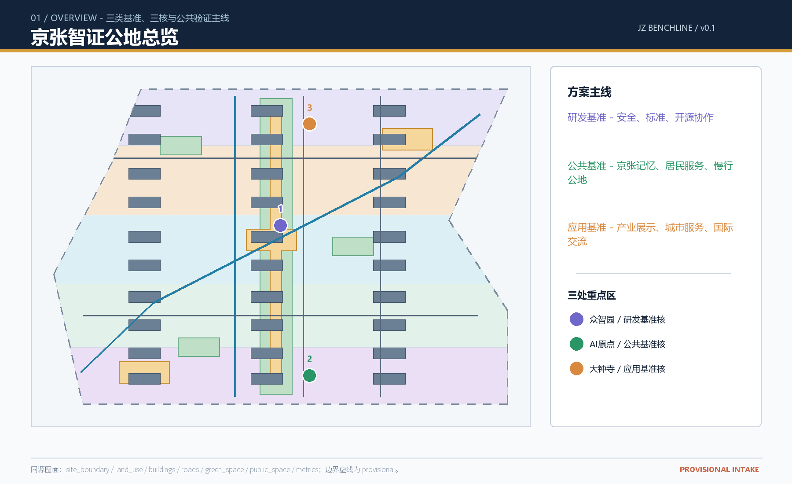
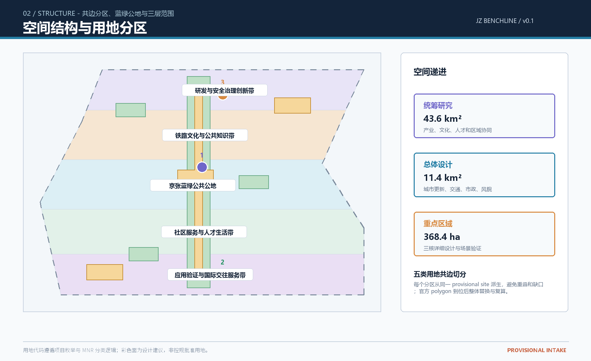
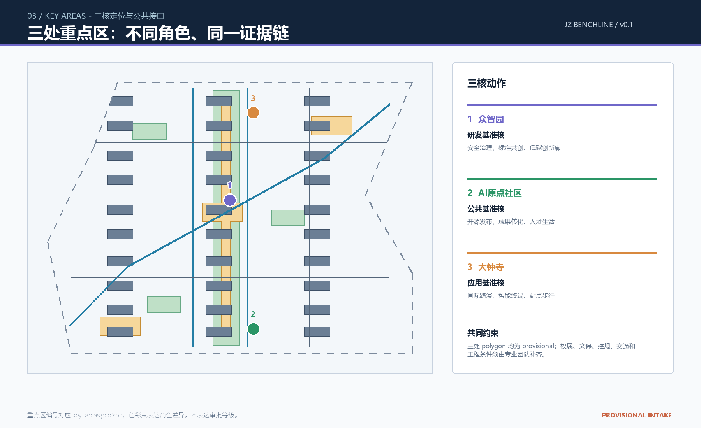
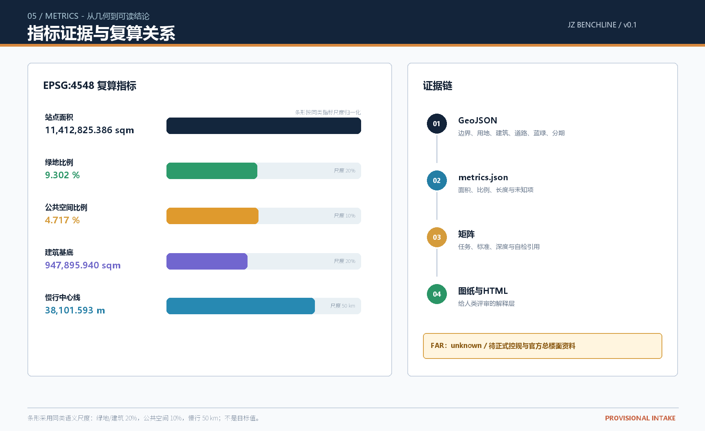
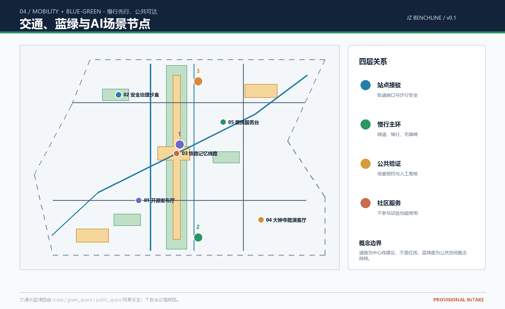

# Jing-Zhang Smart Witness Commons: AI Innovation Belt Driven by Reversible Update and Public Validation

## Design Basis and Source List

This proposal responds to the Centennial Jing-Zhang AI Innovation Belt Urban Design Open Call, adopting "Jing-Zhang Intelligent Witness Commons / JZ BENCHLINE" as the overall name. Benchmark is not a new legal boundary, but a set of verifiable urban interfaces: the research benchmark focuses on models, computing power, standards, and safety; the public benchmark focuses on railway memory, resident services, active transportation, and open spaces; the application benchmark focuses on industrial display, urban services, and international exchange. The [source:OFFICIAL-ANNOUNCEMENT] defined Coordinated Research Area, Overall Design Area, and Key-Area Detailed Design Area form the three layers of work foundations for this proposal; the [source:AGENT-TASKBOOK] adds six tasks for intelligent entities, ten scene cards, brand, and long-term operational requirements. (Centennial Jing-Zhang AI Innovation Belt Open Call for Urban Design)

Data processing follows the principles of transparency, clear rights, and traceability. Project briefs, enumerations, scope, and patterns are derived from [source:SITE-PACKAGE]; the availability of public data is based on [source:SOURCE-REGISTRY]; [source:PROCESSED-FACT-PACK] serves only as a reading navigation and cannot be upgraded to a new authoritative source. Current precise official boundaries and the three key area polygons have not yet entered the public site package, so this package uses the provisional geometry from [source:BOUNDARY-SOURCE] and [source:KEY-AREA-SOURCE]. Their official_boundary=false, geometry_role=provisional_constraint, and boundary_precision=provisional_rough must be retained and cannot be used as official redlines, approval references, legal control plans, or precise area references. (Official Boundary) [data:geometry/site_boundary.geojson#SITE-001] is a temporary reference for the Overall Design Area; [data:geometry/key_areas.geojson#PROV-KEY-001], [data:geometry/key_areas.geojson#PROV-KEY-002], and [data:geometry/key_areas.geojson#PROV-KEY-003] are temporary references for three key areas.

Professional expression follows [standard:PROJECT-OFFICIAL-ANNOUNCEMENT], [standard:PROJECT-AGENT-OPEN-CALL-TASKBOOK], [standard:MOHURD-URBAN-DESIGN-MEASURES], [standard:MOHURD-CONTROL-DETAILED-PLANNING], and [standard:MNR-LAND-USE-CLASSIFICATION-GUIDE]; architectural design depth registration items [standard:MOHURD-ARCH-DESIGN-DEPTH-2016] are only to be used as pending professional references until official documents are obtained. All spatial implementation suggestions are expressed as "Conceptual Recommendation," "Reference Scheme," or "Available for Professional Teams to Deepen Research," without replacing formal planning and human professional judgment.

## Three-Level Scope Framework

The Coordinated Research Area covers approximately 43.6 square kilometers, undertaking strategic research on industry, talent, culture, and regional coordination; the Overall Design Area covers about 11.4 square kilometers, undertaking Urban Renewal around the Jing-Zhang Heritage Park, land use structure, traffic and municipal facilities, and the framework of the area; the Key-Area Detailed Design Area covers approximately 368.4 hectares, undertaking the detailed design of the Zhongzhiyuan AI Independent Innovation Acceleration Area, Beijing AI Origin Community, and Dazhongsi AI Industry Cluster. The three levels of scope are not three isolated frames, but a continuous Evidence Chain of "mechanism for research proposal, overall organizational space, and validation interface for key areas" [depth:three_level_scope_framework].

The spatial structure adopts the Conceptual Recommendation of "one belt, three cores, two wings, and four types of interfaces." One belt is a public experience belt formed along the Jing-Zhang cultural thread and the blue-green slow travel system. Three cores are three key areas. The Zhongguancun Technology Services Wing is responsible for element configuration and global connections, while the Xiaoyue River Scenario Enablement Wing is responsible for living services and open testing. Four types of interfaces are station interfaces, campus and park interfaces, community interfaces, and enterprise public interfaces. The Coordinated Research Area's industrial judgment is based on [data:geometry/land_use.geojson#LU-001], [data:geometry/roads.geojson#ROAD-001], [data:geometry/green_space.geojson#GREEN-001], [data:geometry/public_space.geojson#PUBLIC-001], and [data:geometry/phasing.geojson#PH-01]. (Walking and Cycling Network)

The temporary area of the overall design scope is recomputed as [metric:site_area_sqm], and the number of key areas is recomputed as [metric:key_area_count]. Due to the provisional accuracy of the boundaries, the spatial proportions are only used for comparative structural relationships within the schemes and should not be interpreted as legal areas or planning indicators. Once the official boundaries are released, they should be replaced according to the same division rules, and the land use, green spaces, Public Spaces, buildings, roads, phased developments, and all indicators should be recalculated. [depth:existing_conditions_diagnosis] (Overall Design Area) (Official Boundary)

## Coordinated Research Area: Industry and Future City Research

"Jing-Zhang Smart Witness Commons" understands the AI Innovation Ecosystem as a complete chain from knowledge production to public validation: universities and research institutions generate knowledge that can be openly discussed, open-source communities collaborate on it, enterprises bring prototypes into controlled scenarios, professional teams deepen the spatial and safety boundaries, residents and visitors provide feedback through public experiences, and ultimately form memorable urban knowledge assets. The proposal outlines three layers of mutual verification: research benchmarks, public benchmarks, and application benchmarks, without fabricating lists of companies, investment amounts, output values, or fiscal commitments.

Global background cases are only for comparative methods and not as legal references for Haidian: Station F illustrates how shared entrepreneurial spaces and community operations can share the transformation interface; Singapore one-north illustrates the organizational approach of mixed research, entrepreneurship, and living spaces; Barcelona 22@ illustrates how industrial renewal can be parallel with district Public Spaces and innovative communities; Mila illustrates the spatial dissemination value of research institutions, talent, and open knowledge brands; AI Sweden illustrates cross-subject testing and trustworthy governance networks; Hong Kong Science Park illustrates the continuous space for R&D, business services, and international roadshows. All cases require re-verification on public pages, and the scheme does not copy their brands, trademarks, or architectural forms, nor does it write their governance mechanisms as already determined policies in Beijing. [source:AGENT-TASKBOOK]

The collaborative loop of the Three Zones and Two Wings is as follows: the AI Origin community provides "knowledge generation—talent aggregation," Zhongzhiyuan provides "research and development benchmarks—safety verification," and Dazhongsi provides "application display—international exchange"; the Zhongguancun Technology Services Wing offers legally reservable services such as legal, intellectual property, financing, and international communication, while the Xiaoyue River Scenario Enablement Wing provides resident services, slow travel experiences, and public testing. The eight categories of elements—land, space, industry, capital, talent, computing power, data, and scenarios—are described as mechanisms for professional teams to deepen their research. Scenarios involving data and computing power must undergo authorization, desensitization, and Human Review.

The visual identity direction adopts an open linear symbol composed of a "historical rail line, public grid points, and verification scale lines." The Chinese main name is "Jing-Zhang Zhizheng Gongdi," and the English sub-name is "JZ BENCHLINE"; the suggested colors are railway rust red, Qinghe green, verification blue, and paper gray. The fonts, icons, and corporate logos should all be designed by a subsequent professional team. The logo is not an official mark and does not replace the overall brand system of the solicitation organization. [depth:overall_spatial_structure]

## Overall Design Area: Urban Renewal and Regulatory-Plan-Level Urban Design

The spatial skeleton of the Overall Design Area is defined by "Central Blue-Green Commons + North-South Research and Development Application Belt + Horizontal Public Interfaces." [data:geometry/land_use.geojson#LU-003] and [data:geometry/land_use.geojson#LU-005] express the application and research and development ends, [data:geometry/green_space.geojson#GREEN-001] expresses the blue-green commons spanning north-south, [data:geometry/public_space.geojson#PUBLIC-001] expresses three types of public validation interfaces, and [data:geometry/roads.geojson#ROAD-001] and [data:geometry/roads.geojson#ROAD-002] express the main pedestrian loop and the railway memory pedestrian line. The land use zones are derived from a common site boundary, avoiding overlaps and gaps caused by independent hand-drawing. [depth:land_use_layout]

Update logic does not prioritize demolition but instead prioritizes a four-tiered judgment of "preserve—reversible renovation—small-scale supplementation—awaiting confirmation." The current preservation targets continue to carry community, research and development, and cultural functions; reversible renovation targets prioritize improving the openness, accessibility, and public services of the ground floor; reversible supplementation targets use lightweight, removable, and reusable public interfaces; any demolition, new construction, property rights adjustments, and engineering implementation must wait for confirmation of the current survey, property rights, cultural heritage, fire safety, control plan, and municipal data. geometry/buildings.geojson only expresses the conceptual Building Footprint and update actions, but not the Building Height, Floor Area Ratio, or approval conclusions. [data:geometry/buildings.geojson#BLDG-001]'s building footprint area is recalculated to [metric:building_footprint_area_sqm], and the FAR remains at [metric:floor_area_ratio] unknown. [depth:development_intensity_controls] [depth:height_massing_character] [depth:retain_renovate_demolish]

Overall Urban Renewal project suggestions should form six reversible project packages: the Jing-Zhang Heritage Public Living Room, the Three-Core Public Validation Courtyard, the Campus Park Conversion Results Street, the Qinghe Blue-Green Slow Travel Interface, the Dazhongsi Station Quadrant Pedestrian Improvements, and a Nighttime Knowledge Corridor co-operated by developers and residents. Each project package should first undergo small-scale, reversible Public Space experiments, followed by a decision by human professional teams based on formal documentation whether to deepen the project. The renewal area should only be used for structural comparison and should not be considered as a development commitment.

The core of the control plan depth is not to create false precision, but to distinguish between "known, suggested, and to be confirmed." Known content includes the description of the announced scope, task requirements, unified land codes, and temporary geometry; suggested content includes the benchmark interfaces, active transportation network, Public Space components, and operational mechanisms; to be confirmed content includes official boundaries, road right-of-way, cultural heritage areas, building ownership, engineering capacity, traffic organization, and statutory intensity. This boundary language follows [standard:MOHURD-CONTROL-DETAILED-PLANNING], and does not use concept drawings as a substitute for planning permit references. [depth:development_intensity_controls] (Official Boundary)

## Detailed Design of Key Areas

The Zhongzhiyuan AI Independent Innovation Acceleration Area is the "Research and Development Benchmark Core." The Conceptual Recommendation organizes the safety governance laboratory, co-creation workshop for standards, low-carbon innovation corridor, and external display interface within [data:geometry/key_areas.geojson#PROV-KEY-001], with a focus on transforming high-threshold research and development into public knowledge that is bookable, explainable, and subject to Human Review. The spatial actions adopt a reference scheme with minimal disturbance to the Qinghe boundary, open ground floor, and courtyards left between clusters for validation, without proposing Building Height, road red line, or engineering feasibility conclusions.

Beijing AI Origin Community is the "Public Benchmark Core." Within [data:geometry/key_areas.geojson#PROV-KEY-002], it organizes an open-source exhibition hall, a transformation and conversion living room, a talent service node, near-school pedestrian-friendly connections, and community life interfaces. Conceptual buildings focus on preservation and reversible renovations, while Public Spaces emphasize small-scale, low-threshold, and shareable characteristics; the actual boundaries between campuses, parks, communities, and rail transit connections await official documentation confirmation.

The Dazhongsi AI Industry Cluster is the "Applied Benchmark Core." Within [data:geometry/key_areas.geojson#PROV-KEY-003], organize the International Roadshow Living Room, smart terminal display, Data Element Living Room, content consumption, and station pedestrian interface. The proposal regards the four quadrants around Dazhongsi Station as the subject of pedestrian continuity research, rather than arbitrarily drawing road redlines; the ownership of commercial, industrial, and Public Spaces will be verified by subsequent professional teams.

Between the three cores, [data:geometry/roads.geojson#ROAD-003], [data:geometry/public_space.geojson#PUBLIC-001], and [data:geometry/green_space.geojson#GREEN-001] provide support. The focus areas do not pursue homogenization: Zhongzhiyuan emphasizes safety and research and development, Beijing AI Origin Community emphasizes knowledge sharing and talent living, and Dazhongsi emphasizes application demonstrations and international exchanges. The areas of the three places are still constrained by provisional geometry, with the number recalculated by [metric:key_area_count]. [depth:three_key_area_detailed_design]

## AI Innovation Ecosystem, Personas, and AI+ Scenarios

The proposal sets five user profiles: Open-source developers need platforms for publishing, collaboration, and visible contributions; startup teams require affordable office spaces, access to computational resources, and secure testing environments; enterprise visitors need showcases, business opportunities, and talent exchanges; nearby residents need commuting options, leisure activities, and community services that do not disturb them excessively; and university students and faculty need channels for research outcomes, cross-institutional collaboration, and daily slow mobility. These profiles are used only for co-creation discussions and do not form personal records or use personal privacy data.

Ten scene cards form a "From Knowledge to Life" public experience chain: 01 Open Source Release Hall; 02 Urban Agent Sandbox; 03 Slow Travel Discontinuity Diagnosis; 04 Talent Life Service Counter; 05 AI Safety Governance Corridor; 06 School-Enterprise Transformation Living Room; 07 Data Element Theater; 08 Low-Carbon Computing Station; 09 Jing-Zhang Memory Route; 10 Global AI Activity Week Route. Each card should be supplemented with data authorization, Human Review, operating entity, and exit mechanism during professional deepening. [data:geometry/public_space.geojson#PUBLIC-001], [data:geometry/roads.geojson#ROAD-001], [data:geometry/green_space.geojson#GREEN-001] are scene space carriers and should not be interpreted as approved operating facilities.

Three categories of Testing and Validation Scenarios are as follows:

1. Safety governance sandbox (Zhongzhiyuan, public rules, Human Review, and red team exercise records only retain aggregated results);
2. School-enterprise technology transfer experiments (AI Origin community, participants actively authorize, intellectual property and release scope confirmed by human institutions);
3. Low-speed mobility and public service experiments (ancient site park and Xiao Yuehe Wing, only identify facility and flow issues, do not identify personal identities). Each testing scenario is set with human review, revocable, and does not affect the basic public services. [depth:municipal_new_infrastructure]

Scene—Space—Operation Mapping uses three columns of evidence: scene cards that describe the issues and users, GeoJSON that describes the location and space type, and operation agreements that specify who can enter, who is responsible for verification, and when to stop. Known metrics include [metric:green_ratio], [metric:public_space_ratio], and [metric:road_centerline_length_m]; energy consumption, computational capacity, foot traffic, and operational costs that are not obtained are not fabricated but left as unknown matters similar to [metric:floor_area_ratio].

## Land Use, Building Scale, and Retain-Renovate-Demolish Strategy

Land use zones are formed into five complete and contiguous horizontal bands based on the code logic of the [standard:MNR-LAND-USE-CLASSIFICATION-GUIDE]: 05 Application Validation and International Exchange Service Zone, 0702 Community Services and Talent Living Zone, 1401 Jing-Zhang Blue-Green Public Ground, 0803 Railway Culture and Public Knowledge Zone, 0802 Research and Development and Safety Governance Innovation Zone. The five zones cover [data:geometry/land_use.geojson#LU-001] to [data:geometry/land_use.geojson#LU-005]; the area of each zone is directly recorded in the `area_sqm_declared` of the corresponding GeoJSON feature. [metric:land_use_area_by_code] is marked as not_applicable to avoid miswriting multi-value items as single scalar indicators.

Building layers only express the base, actions, and pending confirmation controls. Objects to be retained are to be maintained with their current use and public accessibility; renovation objects are to prioritize first-floor openness, barrier-free access, energy efficiency, and embedding public services; reversible supplementary objects are to use lightweight, removable, and recyclable components; demolition and new construction are not to be concluded specifically for individual parcels within this package. Building Coverage Ratio, total floor area, Floor Area Ratio, number of floors, and height are not to be subject to legal judgment, and the FAR is marked as unknown [metric:floor_area_ratio]. [depth:development_intensity_controls] [depth:height_massing_character] [depth:retain_renovate_demolish]

The stylistic suggestions are to be expressed in three categories: railway engineering rationality, Qinghe blue-green openness, and the visibility of Zhongguancun innovation. The public interface should remain continuous, the ground floor should be readable, and materials and colors should be refined by subsequent professional teams based on the Qinghe sample. Unauthorized fonts, portraits, corporate trademarks, or news images must not be used; only vector graphics and content derived from structured data within this package should be used in the drawings.

## Transport, Rail, Municipal Infrastructure, and Public Services

Conceptual Recommendation for transportation follows a four-layer relationship of station access, slow travel main loop, community branch roads, and service nodes. ROAD-001 is the Jing-Zhang Smart Witness Main Slow Travel Loop, ROAD-002 is the Railway Memory Pedestrian Line, ROAD-003 is the Xiao Yuehe Scene Empowerment Cycling Line, ROAD-004 is the Three-Core Track Access Concept Line, and ROAD-005 and ROAD-006 are community and validation site low-speed access lines. [data:geometry/roads.geojson#ROAD-001] has a total length recalculated by [metric:road_centerline_length_m]; these lines are conceptual centerlines and do not replace road redlines, track positions, or traffic engineering schemes. [depth:traffic_rail_slow_parking]

Municipal infrastructure and New Infrastructure adopt service interfaces rather than equipment lists: prototypical examples include edge-side computational waystations, low-carbon energy explanation points, maintainable lighting, rain and flood gardens, accessible navigation, and public information screens. Actual energy loads, pipeline capacities, fire safety, drainage, communication, and maintenance responsibilities await confirmation through formal municipal documentation. Public services prioritize the configuration of shareable nodes for publishing, learning, resting, sanitation, drinking water, and community services, without relying on high-tech equipment to replace basic services.

Transit-Station Integration suggests beginning with considerations of pedestrian continuity, wayfinding readability, transfer safety, and public interface. A conclusion on station-city integration will be deferred for now; parking and non-motorized facility provisions should be based on traffic studies and ownership records. Any content involving bridges, tunnels, underground spaces, track alignments, and municipal utility lines should be treated as research topics, without making any commitments regarding engineering feasibility. [data:geometry/constraints.geojson#CONSTRAINT-001]

## Blue-Green Network, Public Space, and Urban Character

[data:geometry/green_space.geojson#GREEN-001] Derives as a central blue-green public commons from the same provisional site, connecting three pocket spaces and a pedestrian and bicycle main loop; the green space area and proportion are recalculated by [metric:green_space_area_sqm] and [metric:green_ratio]. Public Space [data:geometry/public_space.geojson#PUBLIC-001] forms a network of tiered open spaces that include an applied benchmark square, a railway memory public living room, a research and development safety verification courtyard, and a linear public validation platform. The area and proportion are recalculated by [metric:public_space_area_sqm] and [metric:public_space_ratio]. [depth:blue_green_public_space]

The component library for Public Spaces is suggested to include movable seating with shade, low-intensity wayfinding, readable booking signs, accessible continuous boundaries, removable exhibition stands, rain gardens, public power outlets, and Human Review prompts. Components are not bound to specific suppliers, and unauthorized product images are not used. Nighttime lighting is prioritized for safety, with low disturbance and the option to turn off, allowing residents to use the space normally without participating in AI trials.

Urban Character is formed by a combination of historical threads and everyday life: railway heritage is not packaged as purely technological background, Qinghe and the park are not over-entertained, and Zhongguancun innovation is not simplified into corporate advertising. The recognizability of Public Spaces comes from linear scales, node numbering, open data descriptions, and records of real activities, rather than large-scale installations or trendy decorations. [standard:MOHURD-URBAN-DESIGN-MEASURES]

## Renewal Projects, Implementation Policy, and Phasing

The project list adopts a three-phase reversible order, not indicating the sequence of development determined by the government. Phase 01: Prioritize the public validation of the railway memory walking line, three public interfaces, barrier-free sign guidance, resident service pilot, and public data disclosure; Phase 02: Integrate the Zhongzhiyuan safe governance corridor, AI Origin community open-source release hall, and Dazhongsi international showcase living room when conditions are ripe; Phase 03: Expand the operational network: extend the scenario cards, developer community, and international event routes based on human assessment and public feedback. The spatial scope of the three phases is expressed by [data:geometry/phasing.geojson#PH-01], [data:geometry/phasing.geojson#PH-02], and [data:geometry/phasing.geojson#PH-03]; the area of each phase is directly recorded in the corresponding feature's `area_sqm_declared`. [metric:phase_area_by_label] is marked as not_applicable to prevent misinterpreting phased multi-value data as scalar values. [depth:renewal_project_list] [depth:phasing_implementation]

Policy recommendations should be written as reference mechanisms: Public Space Small Co-Creation, Scenario Access Registration, Data Authorization and Exit, Intellectual Property Clearance, Developer Contribution Records, Resident Human Review Seats, Annual Public Evaluation, and Low Performance Scenario Exit. Each mechanism should have a clear point of responsibility, public records, and termination conditions, but should not be written as fiscal, recruitment, or government commitments. A professional team should reassess the project list after official boundary, master plan, ownership, cultural heritage, traffic, and municipal data are in place.

## Metrics, Area Recalculation, and Compliance Matrix

All indicators with `status=known` in this package have been recalculated in EPSG:4548 after the design layers were generated: site area [metric:site_area_sqm] in [data:geometry/site_boundary.geojson#SITE-001]. Building Footprint [metric:building_footprint_area_sqm]; green space area [metric:green_space_area_sqm] and [metric:green_ratio]. Public Space Area [metric:public_space_area_sqm] and [metric:public_space_ratio]; Length of Pedestrian Centerline [metric:road_centerline_length_m]; Number of Land Use Bands [metric:land_use_band_count]; Number of Phases [metric:phase_count]; Key Area Count [metric:key_area_count]. Land Use Area by Code [metric:land_use_area_by_code] and Phase Area by Label [metric:phase_area_by_label] are carried by GeoJSON features and marked as not_applicable; FAR [metric:floor_area_ratio] remains unknown due to the absence of formal master plans and total floor area data.

Indicators are not target commitments but evidence for checking spatial relationships. land_use.geojson fully covers the Provisional Boundary with no overlap; buildings, green spaces, Public Spaces, and phased developments all derive from the same boundary; [data:geometry/constraints.geojson#CONSTRAINT-001] only records provisional constraints awaiting official review. Align the grid system to cover announcements 1.3, 1.4, 1.5, and agent.1-agent.6, with the standard matrix covering all mandatory professional standards, and the depth matrix having 15 core items marked as complete. However, this does not equate to government approval or professional certification. [depth:metrics_recalculation]

Depth Evidence Index: Current Conditions [depth:existing_conditions_diagnosis]; Three-Level Scope Framework [depth:three_level_scope_framework]; Overall Spatial Structure [depth:overall_spatial_structure]; Land-Use Layout [depth:land_use_layout]; Development Intensity Controls [depth:development_intensity_controls]; Height Massing Character [depth:height_massing_character]; Retain–Renovate–Demolish [depth:retain_renovate_demolish]; Traffic, Rail, Slow, and Parking [depth:traffic_rail_slow_parking]; Municipal New Infrastructure [depth:municipal_new_infrastructure]; Blue-Green Public Space [depth:blue_green_public_space];  (Demolish–Renovate–Retain Strategy) Three Key Areas [depth:three_key_area_detailed_design]; Update Projects [depth:renewal_project_list]; Phased Implementation [depth:phasing_implementation]; Metrics Recalculation [depth:metrics_recalculation]; Risk Missing Data [depth:risk_missing_data].

## Risk, Copyright, and Compliance

Main risks include: provisional boundaries leading to limitations in area accuracy; missing formal master plans, road right-of-way lines, cultural heritage, ownership, and municipal data; uncertainties in the technical maturity of AI scenarios and operational costs; potential privacy, accessibility, and equity risks from Public Space experiments; and the possibility of copyright infringement and misinterpretation of historical and cultural expressions. These risks should be managed through data substitution, Human Review, minimizing data collection, public authorization, tiered openness, and revocable mechanisms, rather than being concealed with deterministic language. [depth:risk_missing_data] (Provisional Boundary)

This package does not include personal privacy, internal documents, secret maps, or unauthorized corporate materials. Five images,HTML, A3/A0 PDF Derived from this package's GeoJSON, metrics, matrix, and quality assurance status;PDF Images are explanatory layers, not substitutes for structured data. Copyright notice see report/copyright_statement.md. This package is for community showcase purposes, with all spaces, operations, branding, and activities being Open Co-Creation proposals, with the final judgment belonging to humans and professional teams.

## References

- [source:OFFICIAL-ANNOUNCEMENT] Haidian Branch of Beijing Planning and Natural Resources Commission announcement and local snapshot of the warehouse.
- [source:AGENT-TASKBOOK] Excerpt from the Clearing Rights Task Book for Global Agents.
- [source:SITE-PACKAGE] brief/site-package Project Documentation Package.
- [source:SOURCE-REGISTRY] data/source_registry.json Public source registry.
- [source:PROCESSED-FACT-PACK] data/processed/agent_fact_pack.md Reading navigation.
- [source:BOUNDARY-SOURCE] brief/site-package/geometry/provisional_boundaries.geojson Provisional Geometry.
- [source:KEY-AREA-SOURCE] Three key areas within the same temporary geometry.
- [standard:PROJECT-OFFICIAL-ANNOUNCEMENT], [standard:PROJECT-AGENT-OPEN-CALL-TASKBOOK], [standard:MOHURD-URBAN-DESIGN-MEASURES], [standard:MOHURD-CONTROL-DETAILED-PLANNING], [standard:MNR-LAND-USE-CLASSIFICATION-GUIDE], [standard:MOHURD-ARCH-DESIGN-DEPTH-2016].
- Global case studies are provided for comparative reference and must be verified by a professional team during the refinement phase, and should not be used as the basis for Beijing's spatial boundaries or implementation.

## agent Task Response and Long-Term Operational Supplement

agent.1 Overall Concept and Functional Coordination: The main name is "Jing-Zhang Smart Witness Commons," in English as "JZ BENCHLINE." The Three Zones and Two Wings form a loop through the development of research, public, and application benchmarks. The logo consists of rail lines, public grid points, and verification scales, all representing pending conceptual directions.

agent.2 AI Full Stack and World-Class Ecosystem: Compare spatial mechanisms through six public background cases such as Station F, one-north, 22@, Mila, AI Sweden, and Hong Kong Science Park; Zhongzhiyuan, AI Origin community, and Zhongguancun Technology Services Wing each undertake safety governance, open-source transformation, and service linkage, without fabricating recruitment or investment promises.

agent.3 AI+Scenes and Vibrant Cities: Ten scene cards, three categories of industrial testing, five user profiles, and a scene-space-operation matrix have been incorporated into the main text and visual/index.html. Data minimization, Human Review, and revocability are prerequisites for entering Public Space.

agent.4 Public Space and Pilgrimage Spaces: Three concept landmarks, "Jing-Zhang Scale Gate," "Public Validation Platform," and "Global Open Source Lighthouse," respectively serve as cultural entrances, evidence displays, and annual event hubs; honor displays utilize contribution records, transparent methods, and traceable versions, without focusing on personal adoration or corporate advertising.

agent.5 Cultural Fusion Narrative: With "Engineering First—Knowledge Sharing—Public Validation—Mutual Maintenance" as the four-act narrative, integrate the Jing-Zhang Railway, Zhongguancun innovation culture, and AI new culture into a walkable spatial story. The signage system is composed of numbering, direction, open status, and source indication, without using unauthorized historical images.

agent.6 Global Activities and Long-term Operations: The conceptual annual rhythm includes a Spring Developer Week, Summer Scenario Access Days, an Autumn Jing-Zhang Smart Witness Forum, and a Winter Public Evaluation and Call for Topics for the Following Year; the community adopts mechanisms for contribution records, scenario reservations, Human Review, exit, and debriefing. International dissemination uses bilingual summaries in Chinese and English, along with open data descriptions, without treating the envisioned activities as confirmed arrangements.

## Align the grid array with design depth evidence

This section binds the call for proposals tasks to the layers, metrics, drawings, and pages one by one. The compliance_matrix.json provides a machine-readable mapping; the standard_matrix.json provides professional standard responses; and the design_depth_matrix.json provides comprehensive depth items. Reviewers may refer back to the evidence layers from [data:geometry/land_use.geojson#LU-001], [data:geometry/buildings.geojson#BLDG-001], [data:geometry/roads.geojson#ROAD-001], [data:geometry/green_space.geojson#GREEN-001], [data:geometry/public_space.geojson#PUBLIC-001], [data:geometry/constraints.geojson#CONSTRAINT-001], and [data:geometry/phasing.geojson#PH-01], and then compare with the drawings and offline web pages.

## Statement of Design Boundaries

This scheme is a conceptual, forward-looking, creative, scenario-based, brand-oriented, planning research, and operational outcome for the AI agent facing the Open Call. All spatial, architectural, transportation, facility, activity, and policy contents are Conceptual Recommendations, reference schemes, or materials for professional teams to deepen their research; they do not constitute government approval conclusions and do not replace formal planning, engineering design, ownership judgment, investment estimation, or approval procedures. After the official boundaries and formal control conditions are released, the design intent of this scheme should be retained, while recalculating the geometry, indicators, and drawings. (Official Boundary)
