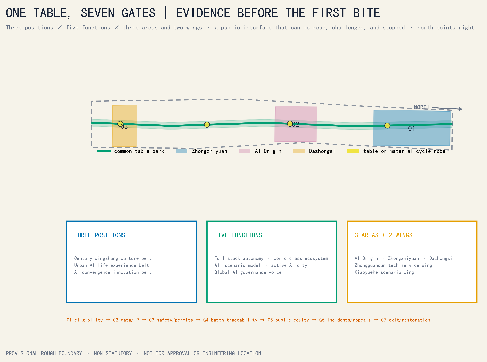
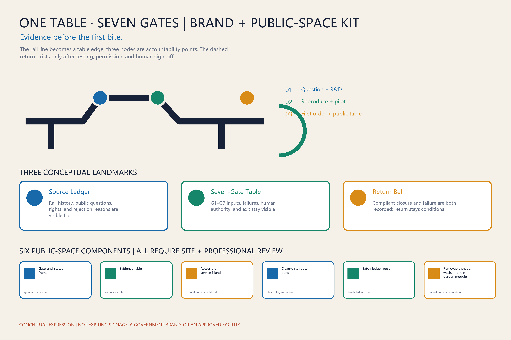
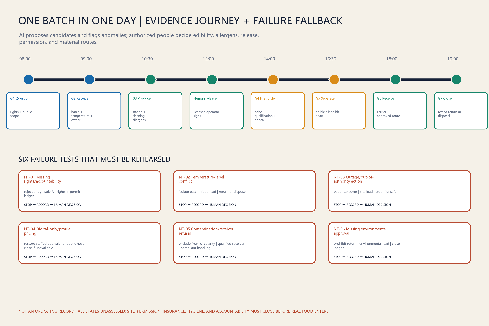
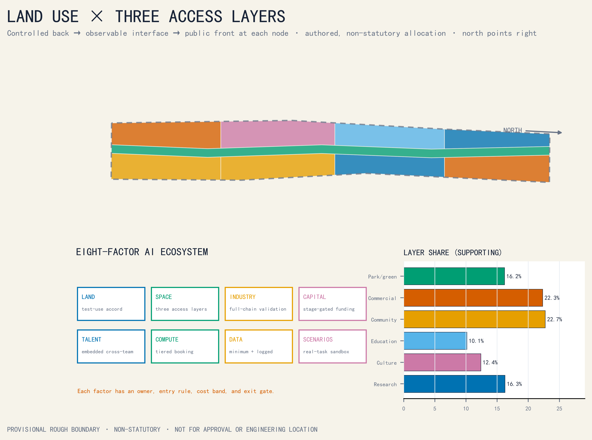
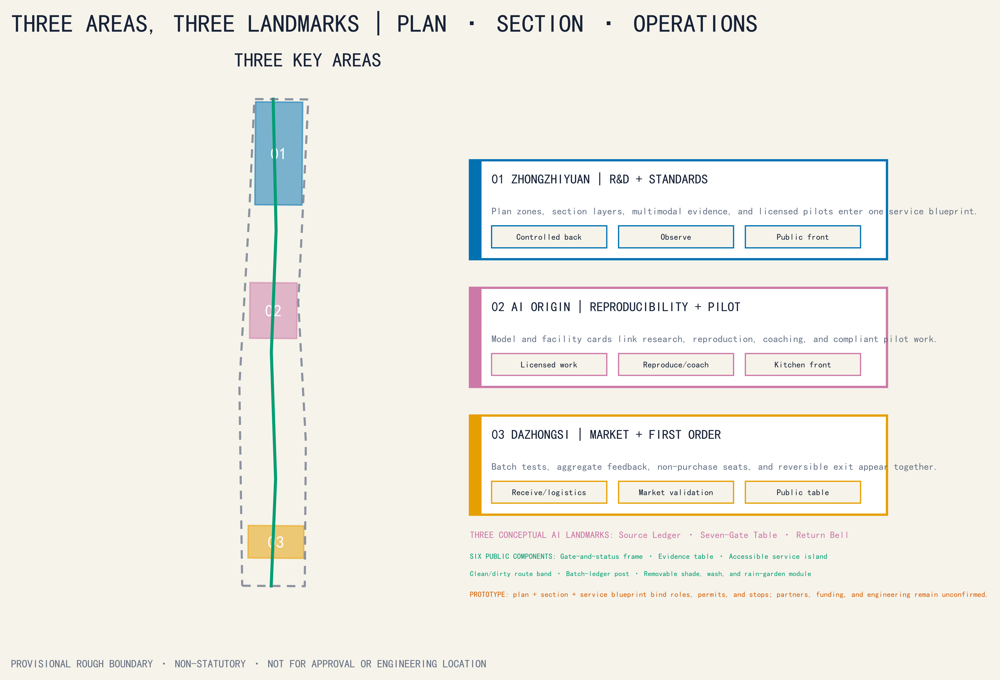
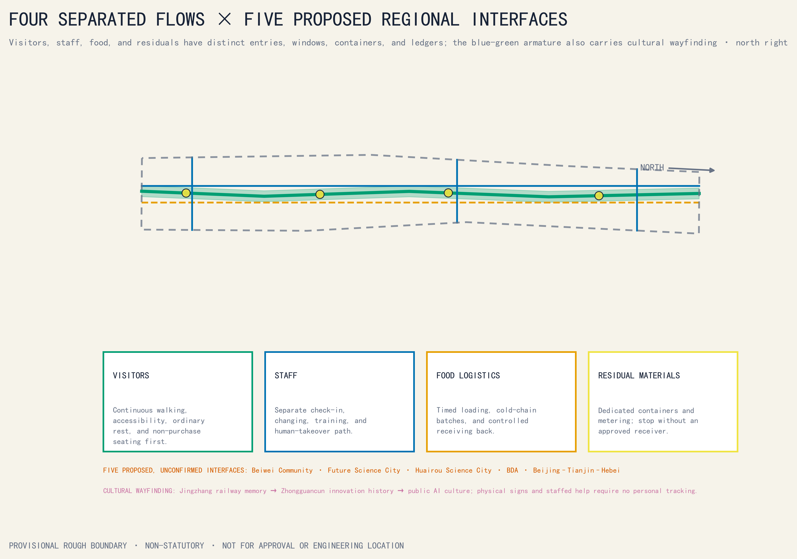
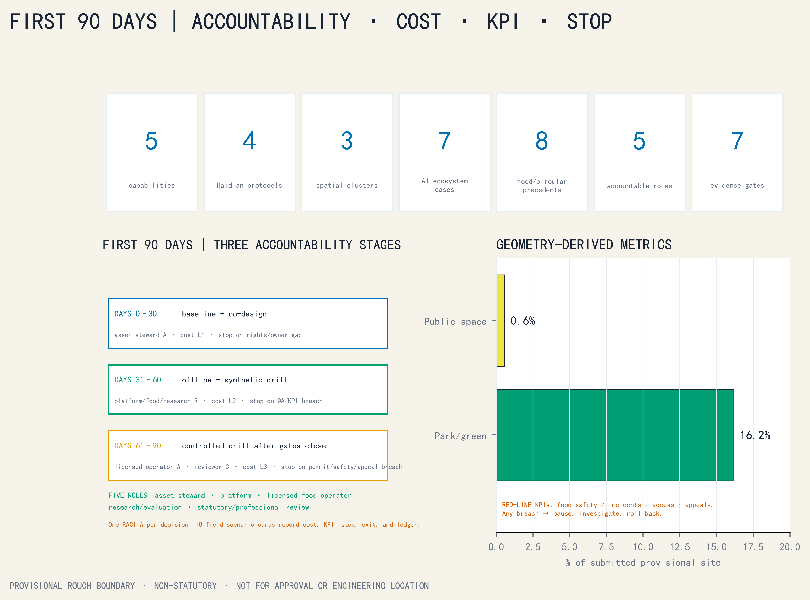

# JINGZHANG COMMON TABLE｜京张共食线

## From shared production to soil return: an auditable food operating loop

JINGZHANG COMMON TABLE is not a collage of “AI restaurants,” and it does not decide what anyone should eat. It links food-technology research, shared production, small-enterprise incubation, public markets, low-speed logistics, surplus separation, and productive landscapes through a **traceable, human-controlled, pausable, and withdrawable** operating system. Its canonical production-to-soil chain is:

`G1 Question intake → G2 Ingredient/object receipt → G3 Shared production → G4 Market exchange → G5 Surplus separation → G6 Material receipt → G7 Soil return`

`Source → Plan → Cook → Exchange → Cycle` is only the five-stage public shorthand for material flow; it does not replace G1–G7. Soil or productive-landscape return may follow a conditional arrow into the next sourcing or cultivation trial only after stabilization, soil/contamination tests, use review, and approval by landscape and environmental professionals. Unapproved material exits through compliant handling instead of being forced back into the diagram.

A separate seven-stage enterprise pathway runs alongside, but is not equivalent to, the material chain: `Source a question → Pair → Map → Make → Serve → Venture → Return`. It explains how teams and small-enterprise projects enter, prototype, operate, pause, or exit without presuming company formation, funding, or continued operation.

Every handoff creates a Common Table ledger page: object or batch, provenance and rights, time and place, accountable operator, necessary temperature/allergen/destination fields, human sign-off, exception, and exit status. The ledger follows food, serviceware, and material—not people by default. AI may propose schedules, matches, alerts, and translations; qualified or authorized humans retain every decision on food safety, allergens, edibility, recall, material destination, and public release.[source:NIST-AI-RMF] [depth:risk_missing_data]

## V3 review entry｜Evidence Before the First Bite

> **Flagship prototype: ONE TABLE, SEVEN GATES｜一桌七门**
>
> The existing G1–G7 handoffs converge at one publicly legible, professionally signable, and interruptible “evidence table.” Before real food reaches a public interface, source, rights, permits, allergens, accountable owner, batch status, and exit route must be checked. AI may propose candidates, flag missing fields, and assist translation; authorized people open or close a gate, recall a batch, and release an activity.

The image communicates only the relationship among a public table, transparent observation layer, controlled back of house, and separated logistics and material routes. Its people, buildings, equipment, and setting are synthetic concepts; they do not depict a real location, partner, baseline, or implementation commitment.[standard:GENERATIVE-AI-INTERIM-MEASURES] [depth:risk_missing_data]

### 1. Direct taskbook response: three positions, five functions, three areas and two wings

The food system remains the proposal’s tangible entry point, now explicitly situated within the taskbook framework. The three positions translate into auditable spatial and operating actions:[metric:taskbook_position_count]

1. **Century-old Jingzhang Cultural Belt**: railway engineering, public exchange, and verifiable contribution form the narrative base. Screens do not cover heritage, and conceptual nodes are not described as heritage works.
2. **Urban AI Life Experience Belt**: residents, operators, researchers, and visitors encounter AI boundaries, human takeover, and appeal routes through everyday tables, shared kitchens, logistics, and material return.
3. **AI Convergence Innovation Belt**: real questions, controlled validation, professional sign-off, and operating handoff connect research, industry, and public life; a tenant list is not treated as an ecosystem.

The following mapping preserves the taskbook’s five formal function labels; it does not confer a policy, funding, or implementation status on the proposal:[metric:taskbook_function_count]

| Taskbook function | Common Table response | Boundary that remains |
|---|---|---|
| **Full-stack independent AI innovation system** | Question, data-rights, model/equipment test, human sign-off, version, and exit ledgers create a replayable chain | No compute, model, laboratory, or autonomy certification is claimed |
| **World-class AI innovation ecosystem** | Seven global cases and eight ecosystem factors expose local gaps | A case is neither a partner nor a transferable ranking or performance result |
| **A new model of AI-plus scenario enablement** | Bind all 12 scenario cards to G1–G7, spatial carriers, operators, and stop conditions | Real food and public activity still require permits |
| **An intelligent, active AI city** | Provide phone-free public tables, accessible routes, staffed service, and removable components | No face recognition, behavioral profiling, or personalized pricing is used to manufacture “vitality” |
| **Global voice in AI governance** | Publish failures, human takeovers, batch destinations, versions, and appeal outcomes as a civic evidence culture | No standard-setting authority, international recognition, or governance mandate is claimed |

The three areas and two wings are five interfaces in one batch and accountability chain, not isolated destinations:[metric:area_wing_count]

| Spatial role | Primary task | Common Table handoff |
|---|---|---|
| **Zhongzhiyuan** | Full-stack AI innovation and governance validation | G1 question intake, controlled equipment/model tests, professional review |
| **Beijing AI Origin Community** | Global AI ecosystem and public co-creation | G2–G3 shared-kitchen prototyping, developer collaboration, resident review |
| **Dazhongsi** | AI-native businesses and international exchange | G4 market exchange, public explanation, microenterprise services |
| **Zhongguancun Technology Service Wing** | IP, capital, design, procurement, and global-resource interfaces | Close rights, contracting, and operating evidence for validated projects without presuming providers |
| **Xiaoyuehe Scenario Wing** | Urban context, logistics, and public-life tests | G5–G7 separation, material receipt, landscape return, and everyday walkthroughs |

### 2. Seven AI ecosystem cases: transfer mechanisms, not reputation

| Case | Narrow mechanism | Jingzhang translation question |
|---|---|---|
| Seoul AI Hub | Research, startup support, talent activity, and dedicated space are organized through one hub | Can question intake, controlled testing, public review, and operating handoff become one continuous path? [source:AI-ECO-SEOUL-HUB] |
| Hub71+ AI | An AI-focused program structures access to business, market, investment, and technical networks | Can every resource interface carry eligibility, rights, exit, and conflict-of-interest records? [source:AI-ECO-HUB71] |
| Mila | Research, education, industry connection, and responsible-AI discussion coexist within an institutional network | Can research pass professional and public review before entering a scenario? [source:AI-ECO-MILA] |
| Station F F/ai | A focused AI program sits within a large startup campus and connects mentors and partners | Can a common G1 card keep projects without a real question or accountable owner from occupying space? [source:AI-ECO-STATION-F] |
| Cyber Valley | A member network, research links, and recurring activity sustain a cross-institution community | Can public questions, versions, and retrospectives sustain continuity beyond a one-off event? [source:AI-ECO-CYBER-VALLEY] |
| Vector Institute | Research, talent, and applied exchange with industry members operate within a defined institutional boundary | Can research validation, commercial commissions, and public service retain separate responsibility and data-purpose rules? [source:AI-ECO-VECTOR] |
| JTC LaunchPad @ one-north | Shared space, incubation support, and proximity to industry reduce collaboration friction | Can removable space, public amenities, and graduation/exit rules be designed together? [source:AI-ECO-JTC-LAUNCHPAD] |

The seven cases provide mechanism references only. Their imagery, marks, plans, and promotional language are not embedded, and no support is implied.[metric:global_ai_ecosystem_case_count]

An ecosystem review must answer eight questions together. **Land:** are title and permissions clear? **Space:** is it reversible, accessible, and clean/dirty separated? **Industry:** does work begin with a real and lawfully shareable question? **Funding:** are stage gates, procurement accountability, and exit terms explicit? **Talent:** are research, food, operations, environment, and public-host roles present? **Compute:** are quotas, energy, versions, and human fallback documented? **Data:** is collection minimal, purpose-limited, appealable, and deletable? **Scenarios:** does each have a carrier, one accountable owner, professional sign-off, and stop condition? A missing factor keeps work behind the prior gate; event attention cannot substitute for closure.

### 3. Five regional interfaces: proposed exchanges, not existing partnerships

| Regional interface | Exchange that may be proposed | Gate before Common Table entry |
|---|---|---|
| **Beiwei Community** | Community questions, accessibility walkthroughs, and phone-free service feedback ↔ readable test results and appeal receipts | Community authorization, data minimization, and no claim to represent residents collectively |
| **Future Science City** | Research methods and validation capability ↔ public questions, operating feedback, and urban-context findings | Institutional confirmation, data/result rights, and cross-district responsibility |
| **Huairou Science City** | Leads on scientific instruments, materials, or testing methods ↔ urban-scale samples and problem lists | Applicability, qualification, chain of custody, and responsibility for interpretation |
| **Beijing Economic-Technological Development Area** | Manufacturing, robotics, and supply-chain test capability ↔ controlled kitchen/logistics requirements and failure records | Equipment safety, food separation, labor, and transport permission |
| **Beijing–Tianjin–Hebei** | Research on ingredients, logistics, redistribution, and material destinations ↔ batch rules and traceability interfaces | Cross-jurisdiction permits, cold chain, qualified receivers, and emergency accountability |

All five are interfaces that could be proposed later. No partner, agreement, site, budget, or data exchange currently exists.[metric:regional_synergy_interface_count]

### 4. The One Table, Seven Gates spatial prototype: three pilgrimage nodes and six public components

Three “pilgrimage landmarks” use reversible public structures and content systems to form a Source–Table–Soil walk:[metric:ai_pilgrimage_landmark_count]

1. **Source Ledger** at the conceptual Zhongzhiyuan interface displays G1 questions, rights, versions, and rejection reasons. Honors record only consented, verifiable contributions.
2. **Seven-Gate Table** at the conceptual AI Origin interface gives each gate one table edge; red ticks mark decisions that must remain human, and knee clearance accommodates wheelchair users.
3. **Return Bell** at the conceptual Dazhongsi interface records anonymous aggregates only when a batch closes or exits compliantly. “Not returned” and “failed” remain visible rather than being edited into a perfect loop.

Locations, dimensions, form, heritage impact, title, fire conditions, flood conditions, and operating rights remain `unknown`; names cannot establish construction. The six public-space components use one stable ID set: (1) `gate_status_frame` | **Gate-and-status frame**; (2) `evidence_table` | a cleanable **Evidence table** for sitting and sign-off; (3) `accessible_service_island` | an **Accessible service island** with dual-height counters, tactile/Braille cues, and staffed service; (4) `clean_dirty_route_band` | **Clean/dirty route band**; (5) `batch_ledger_post` | a **Batch-ledger post** with a paper notice slot; and (6) `reversible_service_module` | a **Removable shade, wash, and rain-garden module**. Each requires site-specific heritage, fire, accessibility, structural, and maintenance review; figures and GeoJSON may use only these six IDs and paired names.[metric:authored_component_type_count] [standard:BARRIER-FREE-ENVIRONMENT-LAW]

### 5. Scenario–space–operator matrix and equity controls

The 12 existing scenario cards remain in force. The table below exposes all 18 promised fields and supplies a minimum operating definition for every card through six grouped columns: `scenario ID | public/industry type | G1–G7 gate | spatial carrier | clean/dirty/public/emergency route | input and rights | AI candidate output | human decision | operator role | sole A | professional sign-off | permit and insurance | phone-free/offline equivalent | access and fee | KPI | redline | stop/exit | ledger and retention`. CT-01 through CT-04 remain controlled industry tests; every other card states whether it is public, cultural, or operational. All operators and A roles remain unconfirmed roles, not contracted institutions.[metric:scenario_count] [metric:controlled_industry_studio_count]

| ID / type (fields 1–2) | Gate / place / four flows (3–5) | Input-rights / AI candidate / human decision (6–8) | Operator / sole A / professional sign-off (9–11) | Permit-insurance / offline equivalent / access-fee (12–14) | KPI / redline / stop-exit / ledger-retention (15–18) |
|---|---|---|---|---|---|
| CT-01; controlled industry | G1–G3; Zhongzhiyuan controlled back of house; staff/equipment/emergency separated | synthetic workflow and cleared instructions; sequence/conflict candidate; kitchen lead decides | commons-kitchen test operator role; food-operator A; food/equipment/fire sign-off | site, equipment, and insurance closure pending; paper SOP; no public access or fee | complete rehearsal record; robot never judges edibility; stop, isolate, exit; versions retained to approved schedule |
| CT-02; controlled industry | G1–G3; Zhongzhiyuan cold-chain receiving bay; food/staff/emergency separated | authorized batch, temperature, route; schedule/anomaly candidate; cold-chain lead disposes | cold-chain test operator role; cold-chain-operator A; food/metrology/transport sign-off | transport, equipment, and insurance closure pending; paper temperature log; no public access or fee | all anomalies receive human disposition; no invented cold-chain performance; isolate, return, exit; retain calibration/disposition ledger |
| CT-03; controlled industry | G2–G3; Zhongzhiyuan isolated workstation; equipment/staff/public observation/emergency separated | cleared motion set and stop state; motion candidate; site lead starts/stops | equipment-test operator role; equipment-system A; mechanical/fire/labor sign-off | equipment, site, and insurance closure pending; physical controls and paper script; public cannot enter | emergency-stop script passes; machine cannot serve beyond authority; physical stop and exit; retain incident/reset version |
| CT-04; controlled industry | G1–G4; Dazhongsi controlled market desk; vendor/public/food/emergency separated | public catalogue, aggregate inventory, multilingual text; queue/translation candidate; operator reviews | market-test operator role; market-operator A; price/food/data sign-off | sale, event, and insurance closure pending; paper catalogue and staffed queue; basic information free | price/label traceable; no profile pricing; close digital route or market; retain price, appeal, and recall ledger |
| CT-05; public learning | G1–G4; AI Origin public kitchen front plus controlled back; public/staff/food/emergency separated | course, capacity, equipment rights; sequence/translation candidate; qualified lead releases | kitchen-class operator role; food-operator A; food/fire/child-safety sign-off | class, kitchen, and insurance closure pending; paper registration and staffed explanation; accessible seating and fees disclosed | accessible participation and sign-off complete; no default child-data collection; cancel or stop class; retain consent, batch, and incident ledger |
| CT-06; industry–public handoff | G1–G4; three-node sign-off table; operator/provider/public/emergency separated | public question, cost, delivery rights; scope/quote candidate; both parties sign | first-commission broker role; commissioning-party A; legal/IP/procurement sign-off | contract, site, and insurance checked per commission; paper scope sheet; basic advice not tied to purchase | scope, cost, and exit readable; no sales or funding promise; non-retaliatory exit; retain versions and two-party sign-off |
| CT-07; cultural public | G1 and G4; Dazhongsi source/story table; visitor/editor/emergency separated | cleared history, oral consent, bilingual text; index/translation candidate; editor decides | cultural-content operator role; editorial A; rights/heritage/access sign-off | display authorization and insurance closure pending; print and staffed storytelling; free basic content | rights and facts traceable; no invented person or history; withdraw, correct, exit; retain sources/versions to consent term |
| CT-08; public service | G1 and G4; Dazhongsi service island; public/staff/emergency separated | public stall, price, event, and access information; guide/translation candidate; staffed desk decides | guide-service operator role; public-host A; access/language/price sign-off | public-event and insurance closure pending; paper map and staff; basic guide free | critical information available through several modes; no tracking or dietary advice; degrade to staff or close; retain correction/appeal ledger |
| CT-09; public service | G1–G4; screen-free station at four nodes; public/staff/emergency separated | paper menu, physical queue, service state; aggregate only; operator decides | public-service operator role; public-host A; access/fire/service sign-off | event permit and insurance closure pending; service is its own offline equivalent; basic information and appeals free | full service without a phone; no mandatory QR; digital route closes while staffed route remains or service stops; retain service/appeal ledger |
| CT-10; operating support | G2–G6; Xiaoyuehe serviceware station; clean/dirty object/public/emergency separated | asset ID, loan, wash state; redistribution candidate; wash lead releases | serviceware-pool operator role; asset-operator A; hygiene/logistics/labor sign-off | washing, transport, and insurance closure pending; paper loan ledger; deposit/fee transparent with accessible service | object traceability without person tracking; unwashed object cannot return; isolate, retire, exit; retain asset/wash/destination ledger |
| CT-11; material operation | G5–G6; Xiaoyuehe material handoff; edible/inedible/public observation/emergency separated | class, weight, contamination, receipt rights; match candidate; authorized receiver decides | material-handoff operator role; qualified-receiver A; environment/hygiene/transport sign-off | receipt, transport, and insurance closure pending; paper weight/destination log; free public explanation from separated accessible route | destination and refusal traceable; never relabel as edible; refusal triggers compliant handling and exit; retain weight/contamination/destination ledger |
| CT-12; public market | G1–G4; Dazhongsi Seven-Gate Table; vendor/public/food/emergency separated | verified product, class, service, aggregate feedback; schedule/translation candidate; operator releases | market-event operator role; market-operator A; food/fire/price/access sign-off | tasting, sale, site, and insurance closure pending; paper catalogue plus lawful cash or equivalent; basic experience not tied to purchase | every batch closes permit/rights fields; AI never releases food; recall, close market, exit; retain batch, price, recall, and appeal ledger |

The eight equity controls also use stable IDs so that “eight” is an auditable register rather than a counting claim:

| Control ID | Required control | Failure signal |
|---|---|---|
| EQ-01 | Continuous accessible route, turning space, and rest | A critical gate requires steps, a narrow route, or an obstructed path |
| EQ-02 | Prices and fees disclosed in advance; no profile pricing | Basic information hides a fee or the same offer changes price by profile |
| EQ-03 | Paper, offline, or staffed equivalent | A phone, QR code, or changing screen is the only entrance |
| EQ-04 | Visible and reachable staffed service | Only an automated reply exists and no authorized person can be found |
| EQ-05 | Chinese and English text plus pictorial, tactile, or audio explanation | Critical evidence depends on one language or one sense |
| EQ-06 | Walkthroughs with disabled people, caregivers, and frontline staff | Affected users do not test the design, or child data is collected by default |
| EQ-07 | Appeal, correction, recall, and receipt | A person cannot object, obtain human review, or see disposition status |
| EQ-08 | Human stop authority and non-retaliatory exit | A redline is overridden by schedule pressure, or one party bears all exit cost |

| Group | Default barrier | Control required in every relevant scenario card | Failure signal |
|---|---|---|---|
| Older adults and people who do not use digital devices | QR-only access, changing interfaces, complex consent | Paper/staff equivalence, large type, clear audio; offline service cannot be degraded | A phone is the only entrance or the staffed route is inaccessible |
| Children and caregivers | High counters, heat, accidental access, data consent | Visible work areas, heat separation, supervision rules, no unnecessary child data | A child can reach controlled back of house or is profiled by default |
| Disabled people | Steps, narrow routes, missing captions or tactile information | Continuous accessible route, wheelchair turning, captions/tactile/staff explanation | A critical gate depends on one sense or can only be reached by steps |
| Low-income users | Hidden charges, device barriers, differential pricing | Free information and appeals; basic public experience is not tied to purchase; no profile pricing | Payment or unnecessary data is required for basic information |
| Microenterprises and frontline workers | Compliance cost, schedule pressure, transferred liability | Disclose cost band, responsibility, insurance, data rights, and exit terms before entry | Exit is punitive or trial losses are shifted to one party |

These are proposal controls, not measured conditions or performance claims about any group.[metric:equity_control_count] [standard:BARRIER-FREE-ENVIRONMENT-LAW]

### 6. First 90 days: close permissions and accountability before limited public testing

| Phase | Work permitted | Hard gate to the next phase |
|---|---|---|
| **D0–30｜Baseline and co-review** | Check site/rights/permit registers; walk through with operators, frontline staff, and accessibility representatives; establish RACI, ledger, clean/dirty routes, and exit scripts | Site authority, accountable parties, professional-review list, risk register, and phone-free equivalent all have written status; otherwise remain on paper |
| **D31–60｜Offline dry run** | Use synthetic data, unloaded equipment, enclosed samples, or nonfood material to rehearse G1–G7, recall, outage, and emergency takeover | Every critical fault can be taken over and logged by a person; real food and public activity remain closed |
| **D61–90｜Limited opening** | Only confirmed qualified parties operate small public tests within permit, insurance, capacity, and time limits | Recheck before each opening; a redline stops the batch or scenario, and reaching day 90 never justifies continuation |

Each of six work packages has exactly one Accountable (A). A real institution may replace the role during later development, but accountability cannot be shared or blank:[metric:pilot_work_package_count]

| Work package | Sole A | R / C / I | Minimum future acceptance evidence | Handoff | Package stop / exit | Cost band |
|---|---|---|---|---|---|---|
| WP1 Site, heritage, and permission | Site-rights/permission coordinator | R: survey/site; C: planning, heritage, fire, accessibility; I: public host, operators | Rights/permission status, constraint plan, professional-sign-off gap list | Usable/prohibited scope and conditions to WP2–WP5; version to WP6 | Unclear rights or missing/conflicting critical opinion: do not locate; return to paper or withdraw site | **L1–L3, verify later:** records through reversible works; no monetary estimate |
| WP2 Food, kitchen, and batch | Appropriately qualified food operator | R: kitchen lead/batch staff; C: food safety, insurance, labor; I: teams, public host | Operator qualification, insurance, batch, allergen, temperature, and recall-drill records | Released batch or isolation/recall record to WP4 and WP6 | Lost qualification/insurance or broken batch record: isolate, recall, and exit the batch | **L1–L3, verify later:** dry run through licensed space/equipment; no monetary estimate |
| WP3 Data, model, and equipment | Defined data-controller/system owner | R: development, equipment, security; C: data, cybersecurity, ethics, IP; I: operators, affected users | Data-rights register, model/system card, offline takeover, emergency-stop, authority tests | Allowed/disabled functions and version to WP4 and WP6 | Unauthorized data, failed human takeover, or equipment outside envelope: disconnect, stop, and delete data that must not be retained | **L1–L3, verify later:** offline prototype through controlled deployment; no monetary estimate |
| WP4 Public opening, equity, and appeal | Public-space operator/host | R: service, wayfinding, events; C: disabled/community representatives, interpreters, emergency staff; I: all parties | Accessibility walkthrough, fee/selection notice, paper/staff equivalent, appeal receipt | Open/closed status, corrections, and public notice to WP6 | Blocked route, digital-only access, unclear fee, or failed appeal: do not open or close the public interface immediately | **L1–L2, verify later:** walkthrough through removable components/staffing; no monetary estimate |
| WP5 Material receipt and environment | Appropriately qualified receiver/environmental owner | R: weighing, separation, transport, landscape; C: environment, soil, landscape, hygiene; I: food operator, public host | Weight, contamination, carrier, approved-receiver, soil/use approval records | Receiver receipt or compliant-disposal record to WP6 | Contamination, receiver refusal, or missing test/approval: no transport or return; compliant disposal and exit | **L1–L3, verify later:** ledger drill through compliant receipt; no monetary estimate |
| WP6 Evidence, evaluation, and procurement handoff | Independent research and evaluation body | R: ledger, evaluation, procurement documents; C: operations, legal, audit, accessibility, affected users; I: site coordinator, public | Independent acceptance memo, exception/exit ledger, procurement and operating handoff pack | Pass/return/close decision to the relevant gate and future purchaser; never default to pass | Missing/conflicting evidence or unknown reported as achieved: reject acceptance, return for repair, or close pilot | **L1–L2, verify later:** evidence templates through independent review/procurement handoff; no monetary estimate |

Cost bands signal procurement and approval complexity only: L1 is staff, documents, and lightweight rehearsal; L2 is rental, professional services, or removable components; L3 is licensed facilities, major equipment, or continuing operations. They are not budgets, quotations, or funding commitments.

**Proposed KPIs** are future acceptance definitions, not achieved results. Live batches require 100% closure of permit, rights, allergen, and sole-accountable-owner fields; all critical outage and human-takeover scripts must pass before opening; basic information, consent, and appeal cannot be phone-only; open batches must equal zero while a critical food, fire, privacy, or accessibility incident remains unresolved; material-return batches must equal zero without a qualified receiver or required test. **Stop conditions** include expired permit or insurance, missing sole A, broken allergen/temperature/source record, clean/dirty crossover, equipment outside its envelope, failed critical human takeover, blocked accessible route, unauthorized data processing, receiver refusal, or a professional stop order.

### 7. One batch in one day: negative tests prove refusal, fallback, and exit

| Test ID | Time/gate | Normal evidence | Injected negative test | Required response |
|---|---|---|---|---|
| NT-01｜Missing rights/accountability | 08:00 / G1 | Question, rights, accountability, permit status | Missing data/recipe right or sole A | Reject entry, record the reason, and do not autofill |
| NT-02｜Temperature/label conflict | 09:30 / G2 | Source, temperature, batch, allergens | Temperature gap or label conflict | Isolate the object; the food lead decides return or disposal |
| NT-03｜Outage/out-of-authority action | 11:00 / G3 | Workstation, equipment permission, human takeover | Network outage or model action beyond authority | Switch to paper/offline operation; stop the batch if safety cannot continue |
| NT-04｜Digital-only/profile pricing | 14:00 / G4 | Price, label, staffed service, recall entry | QR-only entry or profile-based differential pricing | Close the digital route and restore staffed equivalence; stop the market if it cannot be restored |
| NT-05｜Contamination/receiver refusal | 17:00 / G5–G6 | Weight, separation, receiver, destination | Contamination or receiver refusal | Exclude from circularity, use compliant handling, and close the ledger |
| NT-06｜Missing environmental approval | 20:00 / G7 | Stabilization, test, use, professional approval | Missing soil/contamination test or use permission | Prohibit edible-landscape or next-cycle G1 return; do not force the loop closed |

NT-01 through NT-06 each record time, finder, human decision, affected batch, notice, disposition, reopen condition, and version. A correctly refused batch is a valid result.[metric:negative_test_count]

### 8. Culture, brand, wayfinding, and annual operations

Three verifiable verbs connect the Jingzhang legacy, Zhongguancun, and a new AI culture. **Build** recalls independent railway engineering; **open** recalls knowledge collaboration and version practice; **share a table** asks technology to face daily life, operating responsibility, and public challenge. The mark folds one rail line into a table edge and closes it as a soil ring: Track–Table–Soil means history, exchange, and conditional return. Wayfinding has four levels: directional line, G1–G7 gate plate, batch ledger, and open/paused/exited status. Chinese and English text, pictograms, tactile cues, and staffed explanation coexist; a dynamic screen is never the only interface. Honors record only consented, verifiable tasks, versions, evidence, and review outcomes.[standard:BARRIER-FREE-ENVIRONMENT-LAW]

Annual operations use an exit-capable developer and operator funnel rather than event volume as a proxy for results: `open problem call → rights/safety eligibility gate → sandbox team → controlled validation → public explanation/withdrawal → contract and operating-handoff candidate → alumni retrospective`. Each stage permits exit and returns or deletes data no longer needed. Five annual program lines use a stable taxonomy: `AP-01` **Developer community**, Open-Table Question and Maintenance Week for issues, versions, and maintainable interfaces; `AP-02` **Local operators**, Shared-Kitchen Dry Run and Contract Clinic for cost, responsibility, permits, and exit; `AP-03` **Public experience**, Evidence Before the First Bite Week, publishing passed, failed, and exited batches and completing an accessibility walkthrough; `AP-04` **Jingzhang culture**, Track–Table–Soil Story Season connecting railway engineering, food memory, and verifiable contributions; and `AP-05` **Global exchange**, a bilingual Rail–Table International Retrospective comparing mechanisms and failure conditions. AP-01 through AP-05 are the only counting basis for `annual_program_line_count`; the five earlier candidate event types are formats that may attach to these lines, not a second taxonomy. Hosts, sites, frequency, budget, international guests, and partner institutions all remain unconfirmed.[metric:annual_program_line_count]

### 9. Supplemental evidence index: registration is not endorsement

The following tags connect already registered records to the narrative for machine and human review. They add no partner, site, permit, funding, or performance claim.

- Food R&D, shared-facility, and rooftop-trial background records: [source:COMMON-TABLE-FOODPOLIS] [source:COMMON-TABLE-FIPWA] [source:COMMON-TABLE-AGROTOPIA]
- Circular districts, planned industry parks, and exit lessons: [source:COMMON-TABLE-BLUECITY] [source:COMMON-TABLE-JTC-AFIP-PLANNING] [source:COMMON-TABLE-PLANT-CHICAGO-LESSON]
- A warning record that remains at planning/development narrative stage: [source:COMMON-TABLE-DUBAI-FTV-PLANNING]
- Haidian industry, district, and statistical background used only for capability-interface reasoning: [source:HAIDIAN-INDUSTRIAL-SYSTEM-2026] [source:HAIDIAN-OVERVIEW-2026] [source:HAIDIAN-STAT-BULLETIN-2025]
- Haidian annual-plan, embodied-technology, and research-transfer background; no resource commitment: [source:HAIDIAN-DEVELOPMENT-PLAN-2026] [source:HAIDIAN-EMBODIED-AI-2024] [source:HAIDIAN-TECH-TRANSFER-2026]
- Generative-AI, accessibility, and older-adult references are used only within their registered scopes: [source:DATA-SRC-GENERATIVE-AI-INTERIM-MEASURES] [source:DATA-SRC-BARRIER-FREE-ENVIRONMENT-LAW] [source:DATA-SRC-ELDERLY-SMART-TECH-PLAN-2020-45]
- The older-adult reference is background, not a 2026 milestone or universal legal duty: [standard:ELDERLY-SMART-TECH-PLAN-2020-45]
- The conceptual cover and boundary issue remain explanatory or pending inputs: [source:GENERATED-COVER-OPENAI] [source:REPO-ISSUE-846]

**V3 boundary restatement:** everything above is a participant-authored spatial, operating, and validation prototype. Provisional geometry remains a `provisional_constraint`; official boundaries, statutory controls, heritage conditions, site rights, permits, operators, funding, and partnerships still require authoritative inputs and review. The 90-day route, KPIs, cost bands, and regional interfaces are not government decisions, procurement commitments, implementation approvals, or current performance.[standard:PROJECT-AGENT-OPEN-CALL-TASKBOOK] [standard:GENERATIVE-AI-INTERIM-MEASURES]

## 1. Evidence baseline and uncertainty

The official announcement states approximate areas of 43.6 km² for coordinated research, 11.4 km² for overall design, and 368.4 ha across the key areas, including about 192.1 ha for Zhongzhiyuan, 104.3 ha for the Beijing AI Origin Community, and 72.0 ha for Dazhongsi. The repository currently supplies no official, coordinate-verifiable polygon; the overall and key-area geometries in this package are therefore provisional rough constraints.[source:DATA-SRC-OFFICIAL-ANNOUNCEMENT-20260509] [source:BOUNDARY-SOURCE] [source:KEY-AREA-SOURCE] [standard:PROJECT-OFFICIAL-ANNOUNCEMENT] [depth:three_level_scope_framework]

Every submitted boundary preserves `official_boundary=false`, `geometry_role="provisional_constraint"`, and `boundary_precision="provisional_rough"`. These layers support internal topology checks, recomputation, and design discussion; they cannot establish statutory redlines, parcels, title, retain/renew/remove decisions, approval, or engineering location.[data:geometry/site_boundary.geojson#SITE-001] [data:geometry/key_areas.geojson#PROV-KEY-001] [metric:site_area_sqm]

FAR, total floor area, official building density, height, setbacks, road redlines, station limits, heritage controls, municipal capacity, fire, flood, contamination, and soil conditions remain `unknown`. The nine footprints are programme carriers only; retention, adaptation, or construction requires surveyed conditions, rights, structure, heritage, and professional review.[standard:MOHURD-CONTROL-DETAILED-PLANNING] [standard:MOHURD-ARCH-DESIGN-DEPTH-2016] [depth:development_intensity_controls] [depth:height_massing_character] [depth:retain_renovate_demolish]

No university, laboratory, kitchen, market, vendor, logistics firm, material receiver, site, funding source, or government body is claimed as a partner. Any real food production, sale, tasting, transport, redistribution, composting, or cultivation requires qualified operators and later review of permits, insurance, hygiene, environment, fire, labour, and data.[source:DATA-SRC-AGENT-TASKBOOK-20260518] [standard:PROJECT-AGENT-OPEN-CALL-TASKBOOK]

### Machine-readable evidence index

Sources: [source:SITE-PACKAGE] [source:SOURCE-REGISTRY] [source:PROCESSED-FACT-PACK] [source:BOUNDARY-SOURCE] [source:KEY-AREA-SOURCE] [source:DATA-SRC-OFFICIAL-ANNOUNCEMENT-20260509] [source:DATA-SRC-AGENT-TASKBOOK-20260518] [source:DATA-SRC-MOHURD-URBAN-DESIGN-MEASURES] [source:DATA-SRC-MOHURD-CONTROL-DETAILED-PLANNING] [source:DATA-SRC-MNR-LAND-USE-CLASSIFICATION-202311] [source:DATA-SRC-MOHURD-ARCH-DESIGN-DEPTH-2016] [source:COMMON-TABLE-FOODPOLIS] [source:COMMON-TABLE-FIPWA] [source:COMMON-TABLE-LA-COCINA] [source:COMMON-TABLE-EASTERN-MARKET-SHED5] [source:COMMON-TABLE-MILAN-FOOD-HUBS] [source:COMMON-TABLE-AGROTOPIA] [source:COMMON-TABLE-BLUECITY] [source:COMMON-TABLE-TEURASTAMO] [source:NIST-AI-RMF]

Standards: [standard:PROJECT-OFFICIAL-ANNOUNCEMENT] [standard:PROJECT-AGENT-OPEN-CALL-TASKBOOK] [standard:MOHURD-URBAN-DESIGN-MEASURES] [standard:MOHURD-CONTROL-DETAILED-PLANNING] [standard:MNR-LAND-USE-CLASSIFICATION-GUIDE] [standard:MOHURD-ARCH-DESIGN-DEPTH-2016]

Depth: [depth:existing_conditions_diagnosis] [depth:three_level_scope_framework] [depth:overall_spatial_structure] [depth:land_use_layout] [depth:development_intensity_controls] [depth:height_massing_character] [depth:retain_renovate_demolish] [depth:traffic_rail_slow_parking] [depth:municipal_new_infrastructure] [depth:blue_green_public_space] [depth:three_key_area_detailed_design] [depth:renewal_project_list] [depth:phasing_implementation] [depth:metrics_recalculation] [depth:risk_missing_data]

Layers: [data:geometry/site_boundary.geojson#SITE-001] [data:geometry/key_areas.geojson#PROV-KEY-001] [data:geometry/land_use.geojson#LU-001] [data:geometry/buildings.geojson#BLDG-001] [data:geometry/roads.geojson#ROAD-001] [data:geometry/green_space.geojson#GREEN-001] [data:geometry/public_space.geojson#PUBLIC-001] [data:geometry/constraints.geojson#CONSTRAINT-001] [data:geometry/phasing.geojson#PHASE-001]

Metrics: [metric:site_area_sqm] [metric:total_floor_area_sqm] [metric:floor_area_ratio] [metric:building_footprint_area_sqm] [metric:submitted_concept_building_density] [metric:official_building_density] [metric:green_space_area_sqm] [metric:green_ratio] [metric:public_space_area_sqm] [metric:public_space_ratio] [metric:road_area_sqm] [metric:road_ratio] [metric:key_area_count] [metric:scenario_count] [metric:controlled_industry_studio_count] [metric:persona_count] [metric:food_system_loop_stage_count] [metric:global_case_count]

Full metric registry: [metric:site_area_sqm] [metric:land_use_area_sqm_05] [metric:land_use_area_sqm_0702] [metric:land_use_area_sqm_0802] [metric:land_use_area_sqm_0803] [metric:land_use_area_sqm_0804] [metric:land_use_area_sqm_1401] [metric:total_floor_area_sqm] [metric:floor_area_ratio] [metric:building_footprint_area_sqm] [metric:submitted_concept_building_density] [metric:official_building_density] [metric:green_space_area_sqm] [metric:green_ratio] [metric:public_space_area_sqm] [metric:public_space_ratio] [metric:road_area_sqm] [metric:road_ratio] [metric:spatial_phase_1_area_sqm] [metric:spatial_phase_2_area_sqm] [metric:spatial_phase_3_area_sqm] [metric:spatial_phase_polygon_count] [metric:key_area_count] [metric:submitted_provisional_key_area_zhongzhiyuan_sqm] [metric:submitted_provisional_key_area_beijing_ai_origin_sqm] [metric:submitted_provisional_key_area_dazhongsi_sqm] [metric:scenario_count] [metric:controlled_industry_studio_count] [metric:persona_count] [metric:food_system_loop_stage_count] [metric:key_table_count] [metric:supply_chain_count] [metric:operating_capability_count] [metric:haidian_technology_protocol_count] [metric:spatial_access_layer_count] [metric:building_cluster_count] [metric:facility_card_required_field_count] [metric:responsibility_role_count] [metric:operating_phase_gate_count] [metric:global_case_count] [metric:public_landmark_count] [metric:operations_event_count] [metric:conversion_pathway_stage_count] [metric:official_research_area_approx_sqm] [metric:official_overall_area_approx_sqm] [metric:official_key_area_total_approx_sqm] [metric:official_zhongzhiyuan_area_approx_sqm] [metric:official_ai_origin_area_approx_sqm] [metric:official_dazhongsi_area_approx_sqm] [metric:approved_building_height_m] [metric:confirmed_food_enterprise_count] [metric:confirmed_vendor_count] [metric:food_commission_completion_rate] [metric:open_recipe_code_publication_rate] [metric:vendor_incubation_conversion_rate] [metric:organic_material_circulation_rate] [metric:verified_accessible_link_ratio] [metric:public_space_component_type_count] [metric:global_ai_ecosystem_case_count] [metric:taskbook_position_count] [metric:taskbook_function_count] [metric:area_wing_count] [metric:regional_synergy_interface_count] [metric:ai_pilgrimage_landmark_count] [metric:authored_component_type_count] [metric:equity_control_count] [metric:pilot_work_package_count] [metric:negative_test_count] [metric:annual_program_line_count] [metric:ecosystem_factor_count] [metric:pilot_phase_count] [metric:pilot_setup_cost_cny] [metric:pilot_annual_operating_cost_cny] [metric:verified_batch_unit_cost_cny] [metric:pilot_gate_pass_rate] [metric:batch_evidence_pack_completion_rate] [metric:public_service_access_success_rate] [metric:appeal_resolution_rate] [metric:stop_condition_breach_count]

## 2. One pantry spine, three professional tables, two accountable chains

### Common Pantry Spine

The Common Pantry Spine is a conceptual public network connecting the railway-heritage park interface to adjacent industry space. It is neither a grain-production base nor a committed facility. It separates public walking, supply cycling, timed delivery, serviceware return, and organic-material collection into legible lines. Ordinary walking, accessible movement, and emergency use take priority.[data:geometry/roads.geojson#ROAD-001] [data:geometry/green_space.geojson#GREEN-001] [depth:traffic_rail_slow_parking] [depth:blue_green_public_space]

### Three Tables

1. **Zhongzhiyuan Food Systems Lab Table:** kitchen robotics, human–machine workstations, cold-chain scheduling, packaging, and resource efficiency are tested in isolated or controlled settings. Results are not food-safety certification.
2. **AI Origin Commons Kitchen Table:** cooks, small vendors, students, residents, and developers co-produce classes, workflows, and business tools; a qualified kitchen operator retains authority.
3. **Dazhongsi World Market Table:** human-verified products, services, classes, and railway-food narratives reach markets and public long tables without consumer profiling or differential pricing.

### Two accountable chains

- **Zhongguancun technology-to-enterprise chain:** research, computing, design, intellectual property, finance, procurement, and business support are interfaces to be matched; no institution is presented as a partner.
- **Xiaoyuehe food-to-material chain:** problem sourcing, timed delivery, reusable serviceware, surplus separation, approved receipt, and productive-landscape trials form an auditable path without presuming a current facility.[depth:overall_spatial_structure]

### Visual identity direction

A continuous railway trace folds into a table edge, holds three nodes, and returns as a soil loop. Blue denotes data and enterprise services, green denotes material and landscape, and orange denotes markets and public exchange. The identity avoids literal bowls, cutlery, robot chefs, and unmanned-restaurant symbols; type uses legally distributable system fonts or original lettering.[depth:overall_spatial_structure]

## 3. Three-scale spatial and industry roles

| Scale | Work | Current evidence boundary |
|---|---|---|
| Approx. 43.6 km² coordinated research | Compare food R&D, shared production, market incubation, delivery, surplus recovery, and productive-landscape mechanisms; study the two accountable chains | Textual extent and approximate area only; no official polygon |
| Approx. 11.4 km² overall design | Use the Pantry Spine to organize three Tables, four public nodes, walking priority, and material return across nine readable layers | Submitted boundary is a provisional rough geometry, not a statutory redline |
| Approx. 368.4 ha key areas | Develop food-system testing, kitchen incubation, world-market operations, and adjacent public space | All three polygons are provisional constraints and cannot locate parcels or buildings |

Industry coordination is not a tenant list. It pairs a question, capability, place, and responsibility. Researchers propose methods; operators pose real and lawfully shareable problems; professionals sign off food and spatial safety; public hosts maintain access and appeals; locally accountable organizations decide whether activity continues.[source:DATA-SRC-AGENT-TASKBOOK-20260518] [depth:existing_conditions_diagnosis]

## 4. Eight food and circular-district precedents: transfer methods, not promises

| Primary source | Narrow mechanism | Jingzhang design inference | What does not transfer |
|---|---|---|---|
| FOODPOLIS | Shared pilot production, food-safety and quality support, packaging evaluation, and early-enterprise space form a capability chain | Use a compact, bookable, auditable pilot core at Zhongzhiyuan; separate public teaching from licensed production | Does not establish utilization, profitability, public footfall, or Beijing regulatory fit [source:COMMON-TABLE-FOODPOLIS] |
| Food Innovation Precinct Western Australia | Co-locates food research, teaching, batch-scale pilot work, and enterprise collaboration, with phased expansion | Begin with a minimum research–pilot core; expand only after utilization, compliance, and verified-order gates | Does not transfer economic forecasts, long-run utilization, or a high-density urban model [source:COMMON-TABLE-FIPWA] |
| La Cocina | Application, pre-incubation, shared commercial kitchen, technical support, and graduation gates | Published checkpoints for the small-vendor pathway prevent indefinite occupation of subsidized space | San Francisco eligibility, fees, and permits do not transfer [source:COMMON-TABLE-LA-COCINA] |
| Eastern Market Shed 5 | An incubator kitchen within a market organization, also rentable for classes/events | Put the kitchen next to stalls and separate teaching from production by operating rules | Does not establish outcomes or local permission [source:COMMON-TABLE-EASTERN-MARKET-SHED5] |
| Milan Neighbourhood Food Hubs | Logged surplus intake, redistribution, agreements, and flow monitoring | Separate a controlled back-of-house recovery node from public dining and commercial production; local food-safety design determines any cold-storage requirement | Not evidence of commercial or nutrition outcomes [source:COMMON-TABLE-MILAN-FOOD-HUBS] |
| Agrotopia | Puts controlled cultivation research, resource metering, training, and public observation outside production areas together | Organize productive landscape as controlled back, observation interface, and public front; meter before expansion | Does not establish roof capacity, commercial profitability, net-zero performance, or Beijing fit [source:COMMON-TABLE-AGROTOPIA] |
| BlueCity Lab | Co-locates circular enterprise, laboratory prototyping, and permit advice | Register and screen residuals, identify accountable receivers and compliant exits, and never assume a closed loop | Not evidence of a food-grade kitchen, campus mass balance, or local permission [source:COMMON-TABLE-BLUECITY] |
| Helsinki Teurastamo | Small production, dining, retail, and a public courtyard | Treat a courtyard as civic infrastructure joining visible making, small firms, and a common table | Ownership, climate, and operation do not transfer [source:COMMON-TABLE-TEURASTAMO] |

No case imagery, marks, plans, or long quotations are embedded. Factual mechanisms are attributed paraphrases; each transformation is this proposal’s design inference, not a statement by the source programme.[depth:risk_missing_data]

## 5. Seven handoff gates from production to soil

| Gate | Object and minimum ledger page | Human authority | Failure exit |
|---|---|---|---|
| G1 Question intake | problem owner, data provenance, use rights, public scope | data and operating owners confirm | unclear rights block studio entry |
| G2 Ingredient/object receipt | batch, supplier source, receipt time, storage condition | qualified operator accepts | reject, isolate, and record reason |
| G3 Shared production | workstation, equipment state, batch, allergen field, accountable cook | kitchen lead signs workflow and label | pause, quarantine, and manually dispose |
| G4 Market exchange | vendor qualification, price rule, stall, batch, feedback channel | market operator releases or withdraws | stop sale/display and retain staffed service |
| G5 Surplus separation | edible surplus and inedible organic material separately logged with time/destination | authorized body selects redistribution or disposal | mixed, late, or unknown material follows compliant disposal |
| G6 Material receipt | weight, contamination screen, carrier, approved receiver | environmental/operating lead confirms | no approved receiver means no transport or storage |
| G7 Soil return | stabilization, soil/contaminant test, plot use, steward | landscape and environmental professionals approve | failed conditions block cultivation or public contact |

The proposal’s originality is not another equipment list. It organizes industrial ecology, public space, and urban governance as one exit-capable mechanism: ONE TABLE, SEVEN GATES is the core concept; reversible components are the physical carrier; batch ledgers are the data interface; and the scenario–accountability–stop matrix is the operating model.

These gates form the proposal’s canonical production–exchange–material–soil operating chain. G7 does not automatically loop to G1: only tested soil or productive-landscape return approved by landscape, environmental, and operating leads may conditionally re-enter the next sourcing cycle; all other material follows compliant handling and closes its ledger page. Every digital interface has paper/staff fallback. Offline operation may stop intelligent scheduling, but it cannot interrupt food-safety records, emergency access, or necessary staffed service.[source:NIST-AI-RMF] [depth:municipal_new_infrastructure]

## 6. Twelve scenario cards

Only CT-01 through CT-04 are controlled industry studios. Every scenario is `not_assessed`: a protocol for later professional confirmation, not an operating service.[metric:scenario_count] [metric:controlled_industry_studio_count]

| ID | Scenario and place | Data/object | Public value | Risk and human review |
|---|---|---|---|---|
| CT-01 ★ | Human–AI Kitchen Studio｜Zhongzhiyuan | synthetic workflow, equipment state, cleared instructions | reduce workstation conflicts and publish readable manuals | robots do not judge edibility; kitchen lead controls start, pause, and cleaning |
| CT-02 ★ | Cold-Chain & Delivery Studio｜Zhongzhiyuan | synthetic/public/authorized batch, temperature, route, time window | compare schedules and exception response | no performance promise; calibrated sensors and staff handle temperature exceptions |
| CT-03 ★ | Food-Service Robotics Studio｜Zhongzhiyuan | movement vocabulary, occupied zone, speed, stop state | examine human–machine roles and spatial interfaces | physical separation, limited hours, emergency stop; no public service before confirmation |
| CT-04 ★ | Market Operations Studio｜Dazhongsi | product catalogue, aggregate inventory, queue, multilingual content | support small-enterprise operations and non-personalized information | no consumer profiles or opaque differential pricing; operator reviews output |
| CT-05 | AI Origin Commons Kitchen Class | course material, booking capacity, equipment list | cooks, students, and residents learn together | paper registration and staffed explanation; qualified lead controls kitchen |
| CT-06 | Local Vendor First Commission｜three Tables | public operating question, cost, delivery conditions | turn prototypes into quotable services | no sales, funding, or registration promise; both parties sign scope and exit |
| CT-07 | Centennial Table Stories｜Dazhongsi | rights-cleared history, oral-history consent, bilingual text | connect railway, markets, and everyday life | AI organizes only; editors review fact, rights, and narrative |
| CT-08 | Multilingual Market Guide｜Dazhongsi | public stall, event, price, and accessibility information | lower access barriers | no behavior tracking or dietary advice; staffed desk is fallback |
| CT-09 | Screen-Free Common Table｜four nodes | paper menu, physical queue token, staffed counter | service remains available without a smart device | digital failure cannot block basic service; operator handles appeals |
| CT-10 | Reusable Serviceware & Packaging Pool｜Xiaoyuehe | asset ID, loan, cleaning, redistribution state | test lower dependence on disposables | track objects, not people; no existing washing system is claimed |
| CT-11 | Kitchen By-product Exchange｜Xiaoyuehe | material class, weight, contamination state, approved receiver | make destination visible and measurable | never relabel by-products as edible food; authorized entity chooses destination |
| CT-12 | Bell-Rail World Market Premiere｜Dazhongsi | verified product, class, service, and feedback | public launch and local customer discovery | tasting and sale remain with qualified real operators |

## 7. Seven personas, four public nodes, five event types

Seven personas drive walkthroughs: food-tech/AI researcher; local restaurant, stall, or shop operator; cook or kitchen professional; logistics, cold-chain, or material-cycle worker; student or open-source developer; resident or table host including people without smart devices; and food-culture curator or multilingual producer.[metric:persona_count]

Four public nodes retain physical wayfinding, staffed support, accessible routes, and stop conditions:[data:geometry/public_space.geojson#PUBLIC-001]

1. **Rail Pantry:** displays verified briefs, batch paths, and supply relations; it does not store unlicensed food.
2. **Commons Kitchen Court:** a transparent window separates the public interface from controlled work.
3. **Bell Market Long Table:** hosts markets, classes, and launches while retaining ordinary non-commercial seating.
4. **Organic Material Cycle Depot:** displays measurement and approved destinations only; collection, transport, and receipt await permission.

Five candidate event types are a quarterly Common Table Commission Call, monthly Open Kitchen Day, quarterly Xiaoyuehe Food-and-Material Season, annual Bell-Rail World Market Week, and bimonthly Local Enterprise Assembly. Frequencies are operating proposals, not evidence of hosts, budget, venue, or approval.

## 8. Land use, buildings, mobility, and productive landscape

### Land use and buildings

The land-use layer uses MNR classification language `05 / 0702 / 0802 / 0803 / 0804 / 1401` for proposed commercial, community service, R&D, cultural, educational, and park uses. It does not replace land-use approval.[standard:MNR-LAND-USE-CLASSIFICATION-GUIDE] [source:DATA-SRC-MNR-LAND-USE-CLASSIFICATION-202311] [data:geometry/land_use.geojson#LU-001] [depth:land_use_layout]

Nine conceptual building carriers include a Food Systems Lab, Kitchen Robotics Studio, and Cold-Chain Simulation Room at Zhongzhiyuan; Commons Kitchen, Vendor Incubator, and Open Recipe/Code Room at AI Origin; and World Market Hall, Common Table Hall, and Small-Enterprise Service Desk at Dazhongsi. Area, floors, height, structure, and retain/renew/remove status await evidence.[data:geometry/buildings.geojson#BLDG-001] [metric:building_footprint_area_sqm]

### Mobility and logistics

Continuous walking, accessible movement, and emergency reach have first priority; supply cycling, low-speed delivery, and serviceware return use conceptual secondary lines. Each Table has defined loading bays and time windows that cannot occupy the common table, children’s space, tactile paths, or fire interfaces. Actual rail and station limits are unavailable, so drawn connections express relationships rather than engineering interfaces.[data:geometry/roads.geojson#ROAD-001] [depth:traffic_rail_slow_parking]

Cold-chain ledgers retain only necessary batch temperature, time, exception, and destination fields. Sensors require calibration, while qualified people interpret alerts and decide isolation, recall, or disposal; a model never decides food safety. Organic-material transport is separated from public dining, food supply, and children’s activity by route, container, time window, and accountable ledger. Without an approved receiver, material is neither transported nor stored. Utility and public-service concepts reserve interfaces for washing drainage, extract ventilation, power, waste holding, fire protection, ordinary rest, and staffed service, without assuming available capacity.[depth:municipal_new_infrastructure]

Road widths and redlines, station limits, intersections, parking supply, buried services, utility capacity, and fire conditions remain unknown. Roads are therefore conceptual centerlines only; `road_area_sqm` and `road_ratio` remain `unknown`, and graphic line width cannot establish area, ratio, or carrying capacity.[metric:road_area_sqm] [metric:road_ratio]

### Productive landscape

The Common Pantry Spine is first a continuous park and public-access interface: shade, ordinary rest, accessible stopping places, stormwater, and maintenance routes take priority over consumption. Railway Ingredient Station, Commons Kitchen Court, Bell Market Common Table, and Organic-Material Cycle Station retain non-commercial seating, physical wayfinding, staffed help, and bypass routes. Low-tech signs respect railway-heritage sightlines and require neither screens, purchases, nor personal data.[data:geometry/public_space.geojson#PUBLIC-001] [depth:blue_green_public_space]

Roof, courtyard-edge, and rail-side plots use proposal-derived public site cards stating load, soil/contamination, water, stewardship, food-use, and public-contact limits. Until tests and permissions close, only non-edible demonstration or controlled trials may occur; drawings cannot establish yield or safety. Only tested return material approved by landscape, environmental, and operating leads may conditionally enter the next sourcing or cultivation trial. Agrotopia supports only the narrow separation of controlled research, resource interfaces, and public observation—not a local roof, yield, or performance claim.[source:COMMON-TABLE-AGROTOPIA] [data:geometry/green_space.geojson#GREEN-001]

`green_space_area_sqm`, `green_ratio`, `public_space_area_sqm`, and `public_space_ratio` are computed from participant-authored provisional geometry. They describe this package rather than statutory controls. Official ecological baselines, existing trees, water, flood conditions, soil contamination, railway-heritage controls, and public-space rights remain unavailable; authoritative inputs require layer replacement and recomputation.[metric:green_space_area_sqm] [metric:green_ratio] [metric:public_space_area_sqm] [metric:public_space_ratio]

## 9. Three key-area designs

### Zhongzhiyuan: Food Systems Lab Table

Three adjacent but separated environments organize R&D: dry data/simulation rooms, controlled equipment studios, and a prototype kitchen managed by a qualified operator. The public sees problems, data, failure, and human responsibility through windows and read-only displays but does not enter controlled work. Orientation and footprints are not engineering conclusions.[data:geometry/key_areas.geojson#PROV-KEY-001] [depth:three_key_area_detailed_design]

### Beijing AI Origin Community: Commons Kitchen and small-enterprise incubation

A shared kitchen, class tables, advice rooms, and ordinary rest courtyard surround a closable logistics loop. Entry follows `application → safety/business foundation → kitchen prototype → market test → graduation or exit`, with published allocation and checkpoints to prevent indefinite occupation of public resources.[source:COMMON-TABLE-LA-COCINA] [source:COMMON-TABLE-EASTERN-MARKET-SHED5] [data:geometry/key_areas.geojson#PROV-KEY-002]

### Dazhongsi: World Market and Common Table

Market Hall, Common Table Hall, and Small-Enterprise Desk frame a time-shared public court. Back-of-house routes distinguish batch receipt, cold storage, washing, surplus separation, and load-out; the front retains non-commercial seats, paper bilingual information, and staffed service. Public access does not require purchase or personal data.[source:COMMON-TABLE-TEURASTAMO] [data:geometry/key_areas.geojson#PROV-KEY-003]

## 10. Project list, phasing, and long-term operation

| Project | Place | Phase | Entry condition | Exit condition |
|---|---|---|---|---|
| P1 Provenance and rights ledger | all areas | 1 | official/cleared evidence can be located | source expiry or unclear rights stop use |
| P2 Small Common Table commission | candidate Tables | 1 | accountable operator, insurance, hygiene, and site permission close | no accountable body or failed incident response |
| P3 Commons Kitchen incubation | AI Origin | 2 | kitchen qualification, affordability, selection, and graduation gates are explicit | safety or fair access cannot be maintained |
| P4 World Market commission | Dazhongsi | 2 | market operation, vendor status, logistics, and public-space plan are confirmed | incomplete batch, load-out, or appeal records |
| P5 Serviceware and material return | Xiaoyuehe | 3 | washing, measurement, transport, and approved receiver exist | mixing, contamination, or no destination |
| P6 Productive-landscape trial | site-card portfolio | 3 | structure, soil, water, stewardship, and use pass professional review | failed monitoring or withdrawn steward |

Spatial phasing shows three conceptual extents only; phase numbers are not schedule, investment, or approval commitments.[data:geometry/phasing.geojson#PHASE-001] [depth:renewal_project_list] [depth:phasing_implementation]

Each commission uses `1 food-tech team + 1 local operator/kitchen + 1 professional mentor + 1 public host`. This is a separate enterprise-conversion pathway, not the G1–G7 material handoff chain: source, pair, map, make, serve, venture, and return. Outcomes may be continued operation, open publication, a class, revision, pause, or exit; funding and company formation are never presumed.

## 11. Metrics and validation

### Recomputable from submitted geometry

`metrics.json` recomputes submitted site area, land-use area by code, building footprints, green area/ratio, public-space area/ratio, three spatial phase areas, and three provisional key-area areas from serialized GeoJSON in EPSG:4548.[metric:green_space_area_sqm] [metric:green_ratio] [metric:public_space_area_sqm] [metric:public_space_ratio] [depth:metrics_recalculation]

### Values that must remain unknown

Total floor area, FAR, official building density, height, road area/ratio, and real operating performance have no valid numerator or denominator. Each remains `status="unknown"`, `value=null`, with reason, formula, source files, and assumptions. Graphic targets cannot overwrite these states.[metric:total_floor_area_sqm] [metric:floor_area_ratio] [metric:official_building_density]

### Qualified definitions for future operating metrics

- Commission completion: only a commission with signed scope, responsible roles, batch/data rights, acceptance, and exit record enters the denominator.
- Small-enterprise conversion: define qualified graduation and verification windows first; media exposure or a single market appearance is not enterprise formation.
- Serviceware return: use asset-ID loan and qualified wash/return records without tracking people.
- Organic-material circulation: numerator is weighed material confirmed by an approved receiver; contaminated or unresolved batches do not count.
- Productive-landscape return: only stabilized material passing soil/contamination and use review may count; every value is currently unknown.

## 12. Human judgment, rights, and handoff

AI retrieves public evidence, proposes structures, assists geometry computation, scheduling, and translation. Humans retain provenance rights, planning judgment, architecture and engineering, food safety, kitchen operation, environmental handling, market release, procurement, ethics, accessibility, and final submission. Real incidents or food risk enter established human emergency processes without waiting for a model.

Privacy and the public-information boundary follow data minimization, purpose limitation, and tiered disclosure. Public interfaces show only authorized batch status and anonymous aggregates, never personal information, trade secrets, or uncleared data; accountable people record deletion, correction, appeal, and human review. Any unresolved implementation risk or authority gap keeps the proposal at concept or dry-run stage.

The text, graphics, GeoJSON, HTML, and PDFs are AI-assisted original expressions by Shawn Shi and Codex based on public or cleared inputs. Third-party facts are attributed paraphrases; no third-party imagery, logo, plan, or identifiable person is embedded. See `report/copyright_statement.md` for the itemized ledger.

Professional handoff sequence: obtain official boundaries and cleared conditions → rebuild nine layers → verify land/building/mobility/heritage/municipal/fire/environmental conditions → confirm operators and professional accountability → recompute metrics → redraw five figures → regenerate bilingual HTML/PDF → conduct accessibility, operator, food, and environmental reviews → decide whether the next phase may start.[standard:MOHURD-URBAN-DESIGN-MEASURES] [source:DATA-SRC-MOHURD-URBAN-DESIGN-MEASURES]

## 13. References and evidence boundary

`sources.json` records publisher, title, URL, access date, source type, retrieval method, supported coverage, rights summary, proposal-side transformation, use, and limitation. `standard_matrix.json` records applicable standards, local snapshot paths, and SHA-256 values to detect citation drift, not to claim certification. The official announcement and repository taskbook remain the first authorities for scope, approximate areas, and the open-call brief; optional architectural material remains a `data_gap` lead and cannot supply official polygons, parcels, or controls.[source:DATA-SRC-OFFICIAL-ANNOUNCEMENT-20260509] [standard:PROJECT-OFFICIAL-ANNOUNCEMENT] [depth:risk_missing_data]

The eight food and circular-district precedents support only the table’s narrow mechanisms—for example, La Cocina’s published entry/graduation structure and Milan’s surplus intake and redistribution records. Cold-storage provision, site constraint cards, spatial placement, and handoff ledgers are Jingzhang design inferences, not endorsement, partnership, or performance claims by the source programmes.[source:COMMON-TABLE-LA-COCINA] [source:COMMON-TABLE-MILAN-FOOD-HUBS]

The prose, machine registries, and local snapshots together form a locatable evidence chain. Failed access, insufficient coverage, unclear rights, or changed facts remain explicit gaps. No precedent imagery, marks, plans, or long passages are embedded, and neither drawings nor AI output replace primary authority.

**Status: this is an open-call submission. It is not evidence of review, selection, approval, contract, or construction.**
