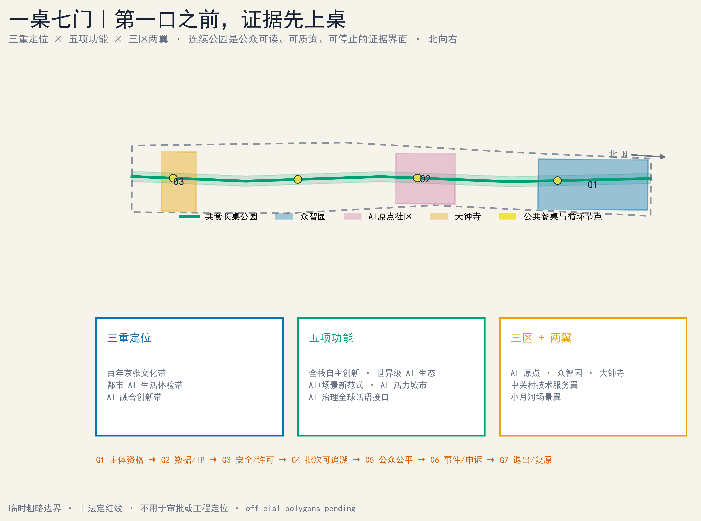
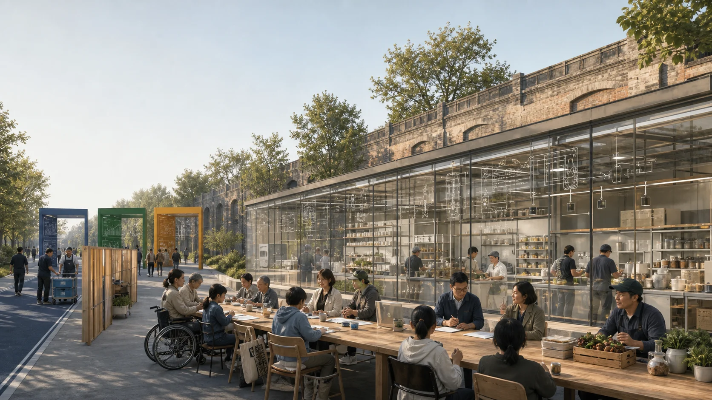
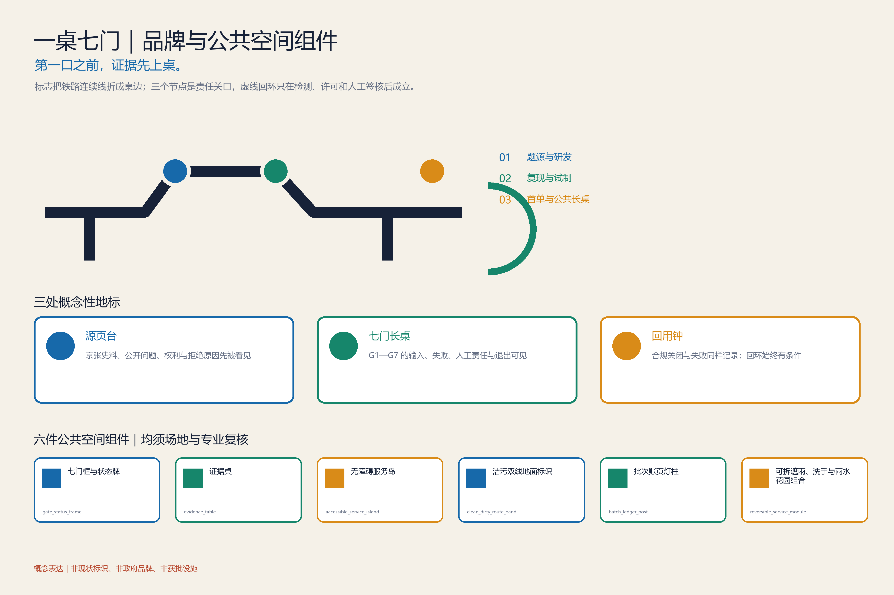
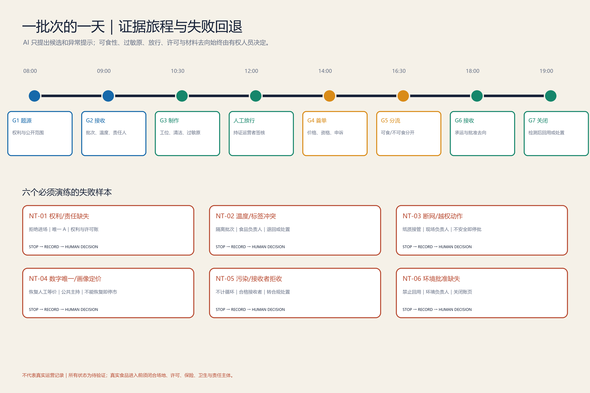
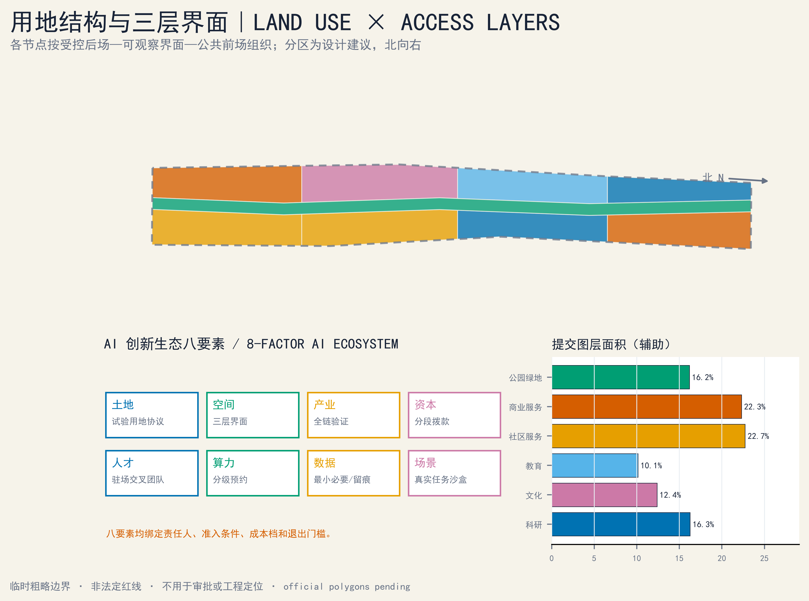
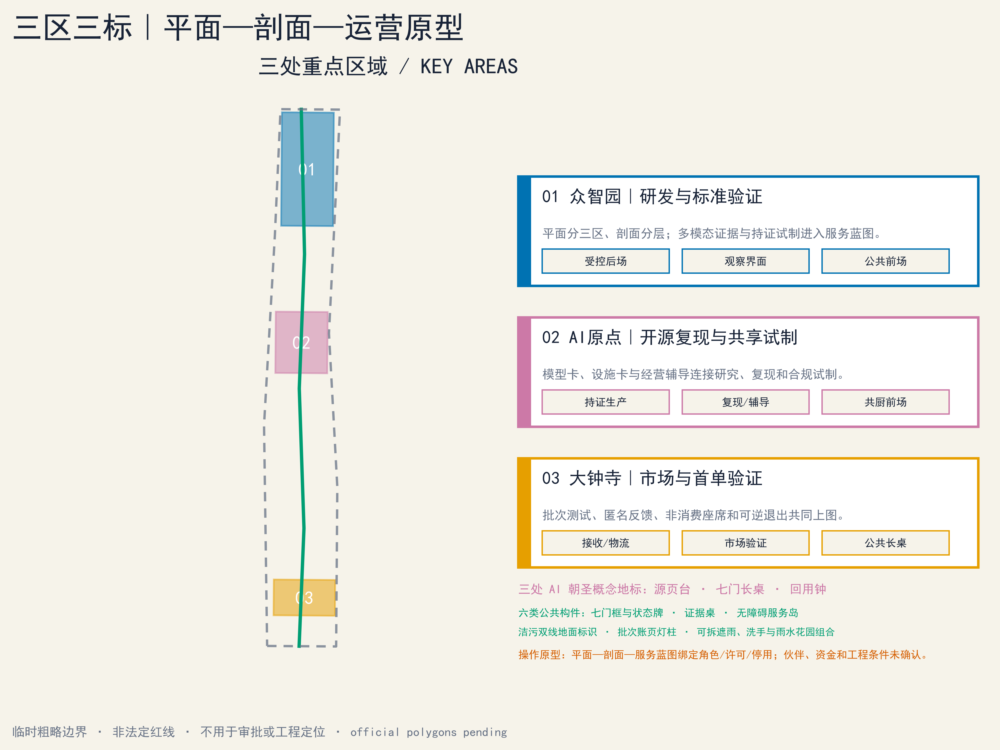
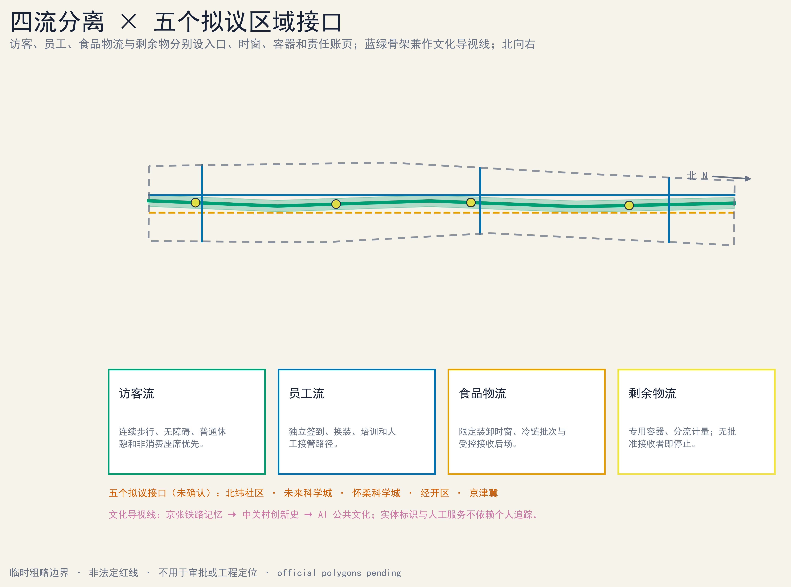
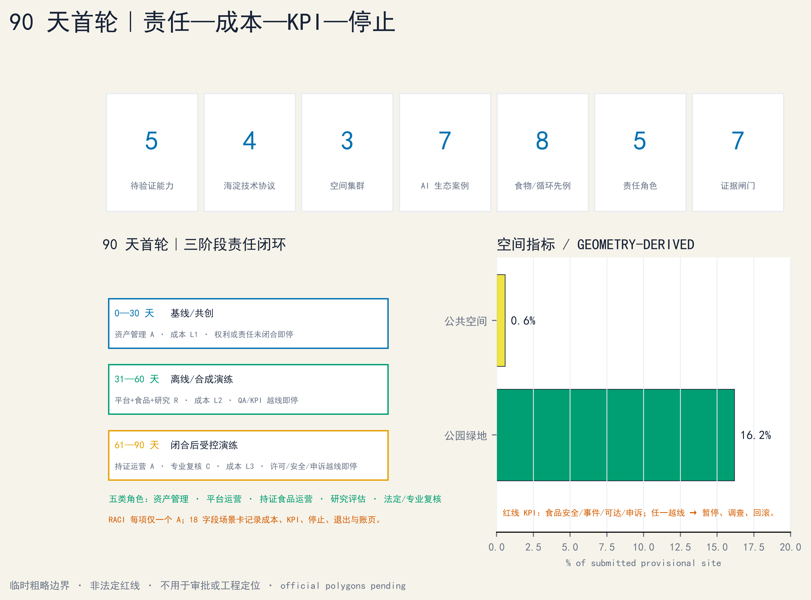

# 京张共食线｜JINGZHANG COMMON TABLE

## 从共厨生产到土壤回用：一条可审计的食物运营闭环

京张共食线不是“AI 餐厅”的合集，也不替任何人决定吃什么。它把食物科技研发、共享生产、小微经营、市集交换、低速配送、剩余物分流和生产性景观连成一条**可追溯、可人工接管、可暂停、可退出**的城市运营系统。它的规范主链是七个生产到土壤的交接门：

`G1 题源准入 → G2 原料/对象接收 → G3 共厨生产 → G4 市集交换 → G5 剩余物分流 → G6 材料接收 → G7 土壤回用`

`来源 Source → 计划 Plan → 制作 Cook → 交换 Exchange → 循环 Cycle` 只是便于公众阅读的五段物质流速记，不替代 G1—G7。只有通过稳定化、土壤/污染检测、用途审查和景观环境专业批准的土壤或生产性景观回用，才可沿条件回箭头进入下一轮来源端或种植试验；未获批准的材料在合规处置后终止，不能为了画成闭环而返回系统。

与物质主链并行但不等同的七段经营转化路径为：`题源 → 配桌 → 盘点 → 共作 → 上桌 → 成业 → 回用`。它描述团队和小微经营项目如何进入、试作、经营、暂停或退出，不把企业成立、融资或持续经营写成既定结果。

每次跨界交接都产生一条“共食账页”：对象或批次、来源与权利、时间与位置、责任运营者、必要的温度/过敏原/去向字段、人工签核、异常与退出状态。账页只追踪食物、器具和材料，不默认追踪个人。AI 可提出排程、匹配、告警和翻译候选，但食品安全、过敏原、可食性、召回、材料去向和公共开放的最终判断始终属于具备资质或权限的人类主体。[source:NIST-AI-RMF] [depth:risk_missing_data]

## V3 评审入口｜第一口之前，证据先上桌

> **旗舰原型：一桌七门｜ONE TABLE, SEVEN GATES**
>
> 把既有 G1—G7 交接门集中到一张公众可读、专业可签核、异常可叫停的“证据长桌”。每一口真实食物进入公众界面之前，先完成来源、权利、许可、过敏原、责任人、批次状态与退出路径核验。AI 只能提出候选、检查缺项和辅助翻译；开门、关门、召回与放行均由具备权限的人决定。

上图只表达“公众长桌—透明观察界面—受控后场—分离物流与材料线”的空间关系。图中人物、建筑、设施和环境均为概念合成，不对应真实地点、合作主体、既有条件或实施承诺。[standard:GENERATIVE-AI-INTERIM-MEASURES] [depth:risk_missing_data]

### 1. 对任务书的逐项回应：三大定位、五大功能、三区两翼

本方案保留食物系统这一可感知切口，并把它放回任务书的总框架。三大定位分别落到可审计的空间与运营动作：[metric:taskbook_position_count]

1. **百年京张文化带**：以铁路工程、公共交往和可核验贡献为叙事底板，不用屏幕覆盖遗产，不把概念节点写成文保工程。
2. **都市 AI 生活体验带**：让居民、经营者、研究者和访客在日常餐桌、共厨、物流与回用场景中看见 AI 的边界、人工接管与申诉渠道。
3. **AI 融合创新带**：以真实问题、受控验证、专业签核和经营交接连接研究、产业与公共生活，而不是以招商名单代替生态。

任务书所列五大功能在本方案中的对应关系如下；加粗名称沿用任务书原词，不代表本方案已取得政策、资金或实施身份：[metric:taskbook_function_count]

| 任务书功能 | 共食线的方案回应 | 必须保留的边界 |
|---|---|---|
| **AI全栈自主创新体系** | 用题源、数据权利、模型/设备测试、人工签核、版本与退出账页形成可复核链 | 不声称已有算力、模型、实验室或自主可控认证 |
| **世界级AI创新生态** | 用七个全球案例的窄机制和八项生态要素检查本地缺口 | 案例不等于伙伴、排名或绩效可迁移 |
| **AI+场景赋能新范式** | 将 12 张场景卡与 G1—G7、空间载体、运营主体和停机条件逐项绑定 | 此处仅为任务书原词；真实食品与公共活动仍须许可 |
| **智能化AI活力城市** | 提供不依赖手机的公共长桌、无障碍路径、人工服务和可撤回的轻型构件 | 不以人脸、画像或差别定价制造“活力” |
| **AI治理全球话语权** | 公开失败、人工接管、批次去向、版本和申诉结果，形成可讨论的城市证据文化 | 不声称形成标准、国际认可或治理权威 |

“三区两翼”不是五个孤岛，而是同一批次、同一责任链的五类接口：[metric:area_wing_count]

| 空间角色 | 核心任务 | 共食线交接 |
|---|---|---|
| **众智园** | AI 全栈自主创新与治理验证 | G1 题源准入、受控设备/模型测试、专业审查 |
| **北京 AI 原点社区** | 世界级 AI 创新生态与公共共创 | G2—G3 共厨试作、开发者协作、居民复核 |
| **大钟寺** | AI 原生新业态与国际交流 | G4 市集交换、公开说明、小微经营服务 |
| **中关村科技服务翼** | 知识产权、资本、设计、采购与全球资源接口 | 为每个通过验证的项目补齐权利、合同与经营证据；不预设服务机构 |
| **小月河场景翼** | 城市情境、物流与公共活力检验 | G5—G7 剩余物分流、材料接收、景观回用与日常走查 |

### 2. 七个 AI 生态案例：只迁移机制，不迁移声誉

| 案例 | 可核验的窄机制 | 京张侧的转换问题 |
|---|---|---|
| Seoul AI Hub | 将研究、创业支持、人才活动与专门空间放在同一枢纽内 | 能否把共食题源、受控测试、公开复核和经营交接排成连续路径？ [source:AI-ECO-SEOUL-HUB] |
| Hub71+ AI | 以 AI 专项项目组织企业、市场、投资与技术网络接入 | 每一项资源接入能否附资格、权利、退出和利益冲突记录？ [source:AI-ECO-HUB71] |
| Mila | 以研究、人才培养、产业连接和负责任 AI 讨论构成机构网络 | 能否让研究结果先经过专业与公众双重审查，再进入场景？ [source:AI-ECO-MILA] |
| Station F F/ai | 在大型创业园中设置聚焦 AI 的项目与导师/伙伴接口 | 能否用统一的 G1 准入卡防止“有技术、无问题或无责任人”的项目占用场地？ [source:AI-ECO-STATION-F] |
| Cyber Valley | 由成员网络、研究联系与持续活动维持跨机构社区 | 能否用公开问题、版本和复盘保持社区连续性，而不是只办一次活动？ [source:AI-ECO-CYBER-VALLEY] |
| Vector Institute | 将研究、人才与产业成员的应用交流置于清晰机构边界内 | 能否区分研究验证、商业委托和公共服务的责任与数据用途？ [source:AI-ECO-VECTOR] |
| JTC LaunchPad @ one-north | 用共享空间、孵化支持和邻近产业网络降低初创协作摩擦 | 能否把轻型可逆空间、公共配套与毕业/退出规则一起设计？ [source:AI-ECO-JTC-LAUNCHPAD] |

七案只作为机制参照，不嵌入其图片、标识、平面或宣传语，也不声称获得其支持。[metric:global_ai_ecosystem_case_count]

生态检查必须同时回答八项问题：**土地**是否权属与许可清楚；**空间**是否可逆、无障碍且洁污分流；**产业**是否从真实且可合法分享的问题出发；**资金**是否有阶段门、采购责任和退出条件；**人才**是否覆盖研发、食品、运营、环境与公共主持；**算力**是否有配额、能耗、版本和人工回退；**数据**是否最少收集、目的限定、可申诉和可删除；**场景**是否有空间载体、唯一责任人、专业签核与停机条件。任一项缺失，项目留在前一门，不以活动热度代替闭环。

### 3. 五个区域协同接口：是待提议的交换，不是既成合作

| 区域接口 | 可提议的双向交换 | 进入共食线前的门槛 |
|---|---|---|
| **北纬社区** | 社区问题、无障碍走查与非数字服务反馈 ↔ 可读的试验结果和申诉回执 | 社区授权、隐私最小化、不得代表居民集体意见 |
| **未来科学城** | 研究方法与验证能力 ↔ 公开题源、经营和城市情境反馈 | 机构确认、数据/成果权利、跨区责任 |
| **怀柔科学城** | 科学仪器、材料或检测方法线索 ↔ 城市级小样与问题清单 | 适用性、资质、样品链和结果解释责任 |
| **经开区** | 制造、机器人和供应链测试能力 ↔ 厨房/物流受控需求与失效记录 | 设备安全、食品隔离、劳动与运输许可 |
| **京津冀** | 食材、物流、再分配与材料去向研究 ↔ 批次规则和可追溯接口 | 跨区域许可、冷链、接收者资格和应急责任 |

五项均为后续可发出的接口提案；当前没有合作方、协议、场地、预算或数据交换。[metric:regional_synergy_interface_count]

### 4. 一桌七门的空间原型：三个朝圣节点、六类公共构件

三个“朝圣地标”采用可逆公共构筑物与内容系统，形成“源—桌—土”的步行叙事：[metric:ai_pilgrimage_landmark_count]

1. **源页台｜Source Ledger**（众智园概念界面）：展示 G1 题源、权利、版本与被拒原因；荣誉只记录经本人同意、可核验的贡献。
2. **七门长桌｜Seven-Gate Table**（AI 原点社区概念界面）：七段桌缘对应七个交接门，红色短划标出必须由人决定的暂停点；桌下保留轮椅膝部空间。
3. **回用钟｜Return Bell**（大钟寺概念界面）：只在批次完成或合规退出时形成匿名聚合记录；“未回用”与“失败”同样公开，不把循环率美化为满分。

位置、尺度、形态、遗产影响、产权、消防、防洪和运营权均为 `unknown`，不得由名称推定建设。六类公共空间构件采用一套稳定 ID：① `gate_status_frame`｜**七门框与状态牌**；② `evidence_table`｜可坐、可签核、可清洗的**证据桌**；③ `accessible_service_island`｜含高低双台面、盲文/触觉和人工服务位的**无障碍服务岛**；④ `clean_dirty_route_band`｜**洁污双线地面标识**；⑤ `batch_ledger_post`｜含纸质公告槽的**批次账页灯柱**；⑥ `reversible_service_module`｜**可拆遮雨、洗手与雨水花园组合**。构件只有通过具体场地、文保、消防、无障碍、结构与维护审查后才能使用；图件和 GeoJSON 只能使用这六个 ID 及对应名称。[metric:authored_component_type_count] [standard:BARRIER-FREE-ENVIRONMENT-LAW]

### 5. 场景—空间—运营者矩阵与公平控制

12 张既有场景卡继续有效。下表把承诺的 18 个字段全部展开，并按六组列逐卡给出最小运营定义：`场景 ID｜公众/产业类型｜G1—G7 所在门｜空间载体｜洁/污/公众/应急流线｜输入及权利｜AI 候选输出｜人工决定｜运营者角色｜唯一 A｜专业签核｜许可与保险｜无手机/离线替代｜无障碍与费用｜KPI｜红线｜停止/退出｜账页与保留期`。CT-01—CT-04 仍是受控产业试验；其他卡标明公共、文化或运营属性。所有“运营者”和 A 都是待确认角色，不是已签约机构。[metric:scenario_count] [metric:controlled_industry_studio_count]

| ID / 类型（字段 1—2） | 门 / 空间 / 四流（3—5） | 输入权利 / AI 候选 / 人工决定（6—8） | 运营者 / 唯一 A / 专业签核（9—11） | 许可保险 / 离线替代 / 可达费用（12—14） | KPI / 红线 / 停止退出 / 账页保留（15—18） |
|---|---|---|---|---|---|
| CT-01；受控产业 | G1—G3；众智园受控后场；员工/设备/应急分线 | 合成工序与清权说明；工序/冲突候选；厨房负责人决定 | 共厨试验运营角色；食品运营 A；食品/设备/消防会签 | 场地设备许可与保险待闭合；纸质 SOP；不开放、不收费 | 演练记录完整；机器人不判可食；停机隔离退出；按批准期限保留版本 |
| CT-02；受控产业 | G1—G3；众智园冷链接收位；食品物流/员工/应急分线 | 授权批次、温度、路线；排程/异常候选；冷链负责人处置 | 冷链试验运营角色；冷链运营 A；食品/计量/运输会签 | 运输、设备与保险待闭合；纸质温度账；不开放、不收费 | 异常均被人工处置；不得虚构温控；隔离退回退出；保留校准与处置账 |
| CT-03；受控产业 | G2—G3；众智园隔离工位；设备/员工/公众观察/应急分线 | 清权动作谱与停机状态；动作候选；现场负责人启停 | 设备试验运营角色；设备系统 A；机械/消防/劳动会签 | 设备、场地与保险待闭合；物理控制和纸质脚本；公众不可直接进入 | 急停脚本通过；机器不越权服务；物理停机退出；保留事件与复位版本 |
| CT-04；受控产业 | G1—G4；大钟寺受控市集台；商户/公众/食品/应急分线 | 公开商品、汇总库存和多语文本；队列/翻译候选；经营者审核 | 市集试验运营角色；市集运营 A；价格/食品/数据会签 | 销售活动与保险待闭合；纸质目录和人工队列；基础信息免费 | 价格/标签可核；不得画像差价；关数字路径或停市；保留价格、申诉与召回账 |
| CT-05；公共学习 | G1—G4；AI 原点共厨前场与受控后场；公众/员工/食品/应急分线 | 课程、名额和设备权利；课序/翻译候选；合格负责人放行 | 共厨课程运营角色；食品运营 A；食品/消防/儿童安全会签 | 课程、厨房与保险待闭合；纸质报名和人工讲解；无障碍席位、费用先公开 | 可达参与与签核完整；不得默认采集儿童数据；取消或停课；保留同意、批次与事件账 |
| CT-06；产业—公共交接 | G1—G4；三节点会签桌；经营者/服务者/公众/应急分线 | 公开题目、成本、交付权利；范围/报价候选；双方人工签核 | 首单撮合运营角色；合同委托方 A；法务/IP/采购会签 | 合同、场地与保险逐单确认；纸质范围单；基础咨询不绑消费 | 范围、成本、退出可读；不得承诺成交融资；无责退出；保留版本与双方签核 |
| CT-07；文化公共 | G1、G4；大钟寺源页/故事桌；访客/编辑/应急分线 | 清权史料、口述同意、双语文本；索引/翻译候选；编辑决定 | 文化内容运营角色；编辑出版 A；版权/遗产/无障碍会签 | 展示授权与保险待闭合；纸本、人工讲述；免费基础内容 | 权利与事实可追溯；不得虚构人物史实；撤稿更正退出；按同意期限保留来源与版本 |
| CT-08；公共服务 | G1、G4；大钟寺服务岛；公众/员工/应急分线 | 公开摊位、价格、活动、可达信息；导览/翻译候选；人工服务台决定 | 导览服务运营角色；公共主持 A；无障碍/语言/价格会签 | 公共活动与保险待闭合；纸质地图和人工服务；基础导览免费 | 关键信息多通道可达；不得追踪或给饮食建议；降级为人工或关闭；保留更正与申诉账 |
| CT-09；公共服务 | G1—G4；四节点无屏服务位；公众/员工/应急分线 | 纸质菜单、实体队列、服务状态；只做非个人汇总；运营者决定 | 公共服务运营角色；公共主持 A；无障碍/消防/服务会签 | 活动许可与保险待闭合；本身即离线等价；基础信息与申诉免费 | 无手机完成服务；不得强制扫码；数字关闭仍人工运行或整体停服；保留服务与申诉账 |
| CT-10；运营支持 | G2—G6；小月河器具站；洁具/污具/公众/应急分线 | 资产 ID、借还、清洗状态；调拨候选；清洗负责人放行 | 器具池运营角色；资产运营 A；卫生/物流/劳动会签 | 清洗、运输与保险待闭合；纸质借还账；押金费用须透明并有可达服务 | 对象可追踪且不追人；未洗净不得回库；隔离报废退出；保留资产、清洗与去向账 |
| CT-11；材料运营 | G5—G6；小月河材料交接位；可食/不可食/公众观察/应急分线 | 材料类、重量、污染、接收权；匹配候选；授权接收者决定 | 材料交接运营角色；合格接收者 A；环境/卫生/运输会签 | 接收运输与保险待闭合；纸质称重去向账；公众说明免费且隔离可达 | 去向与拒收可核；不得改称可食；拒收即合规处置退出；保留重量、污染与去向账 |
| CT-12；公共市集 | G1—G4；大钟寺七门长桌；商户/公众/食品/应急分线 | 核验产品、课程、服务、汇总反馈；排程/翻译候选；经营者放行 | 市集活动运营角色；市集运营 A；食品/消防/价格/无障碍会签 | 销售试吃、场地与保险待闭合；纸质目录、现金等合法替代；基础体验不绑购买 | 每批许可权利完整；不得由 AI 放行食品；召回停市退出；保留批次、价格、召回与申诉账 |

八项公平控制也使用稳定 ID，以免“八项”只停留在统计口径：

| 控制 ID | 控制内容 | 失败信号 |
|---|---|---|
| EQ-01 | 连续无障碍路线、回转和休息位 | 关键门只能经台阶、窄路或被占用路线进入 |
| EQ-02 | 价格与费用前置公开，不做画像差别定价 | 基础信息隐藏收费或同物因画像产生不同价格 |
| EQ-03 | 纸质、离线或人工等价路径 | 手机、扫码或动态屏成为唯一入口 |
| EQ-04 | 可见且可达的人工服务 | 只有自动回复，找不到有权限的责任人 |
| EQ-05 | 中英文字、图形、触觉/语音等多感官说明 | 关键证据只依赖一种语言或一种感官 |
| EQ-06 | 残障人士、儿童照护者与一线人员参与走查 | 设计未经受影响使用者测试或默认采集儿童数据 |
| EQ-07 | 申诉、更正、召回与回执 | 无法提出异议、获得人工复核或看到处理状态 |
| EQ-08 | 人工停止权与不惩罚退出 | 触发红线仍被进度要求推动，或退出成本单方转嫁 |

| 人群 | 默认障碍 | 必须写进每张相关场景卡的控制 | 失败信号 |
|---|---|---|---|
| 老年人及不使用数字设备者 | 扫码、动态界面、复杂同意 | 纸质/人工等价路径，大字与清晰语音，不能因离线降低服务 | 只有手机入口或人工窗口不可达 |
| 儿童与照护者 | 高台面、热源、误触、数据同意 | 视线可达、热源隔离、监护规则，不收集非必要儿童数据 | 儿童可进入受控后场或被默认画像 |
| 残障人士 | 台阶、窄通道、无字幕/触觉信息 | 连续无障碍路线、轮椅回转、字幕/触觉/人工说明 | 任一关键门只能通过单一感官或台阶进入 |
| 低收入使用者 | 隐性费用、设备门槛、差别定价 | 免费知情与申诉，基础公共体验不绑定消费，不做画像定价 | 需付费或提交非必要数据才可获得基本信息 |
| 小微经营者与一线工作者 | 合规成本、排班压力、责任转嫁 | 在进场前公开成本等级、责任、保险、数据权利和退出条件 | 无法无责退出，或试验损失被单方转嫁 |

这些是方案控制，不是对任何群体的现状判断或已测绩效。[metric:equity_control_count] [standard:BARRIER-FREE-ENVIRONMENT-LAW]

### 6. 九十天首轮：先关许可与责任，再做有限公开测试

| 阶段 | 只做什么 | 进入下一阶段的硬门 |
|---|---|---|
| **D0—30｜建档与共审** | 核对场地/权利/许可清单；与经营者、一线人员和可达性代表走查；建立 RACI、账页、洁污流线和退出脚本 | 场地授权、责任主体、专业审查清单、风险台账和无手机替代均有书面状态；未闭合则停在纸面 |
| **D31—60｜离线与干跑** | 只用合成数据、空载设备、封闭样品或非食用材料演练 G1—G7、召回、断网和紧急接管 | 每个关键故障均能由人接管并留痕；任何真实食品/公众活动继续保持关闭 |
| **D61—90｜受限开放** | 仅由已确认资格的主体，在许可、保险、容量和时段范围内做小规模公开测试 | 每日开场复核；触发红线即停止该批次/场景，不以完成“90 天”作为继续理由 |

六个工作包各有且只有一个 Accountable（A）；A 可以在深化阶段由真实机构替换，但不可共享或留空：[metric:pilot_work_package_count]

| 工作包 | 唯一 A | R / C / I | 最低验收证据（未来） | 交接 | 包级停止 / 退出 | 成本等级 |
|---|---|---|---|---|---|---|
| WP1 场地、遗产与许可 | 场地权利/许可协调主体 | R：测绘与场地；C：规划、文保、消防、无障碍；I：公众主持、运营者 | 权利/许可状态表、禁限条件图、专业会签缺口单 | 可用/禁用范围与条件交 WP2—WP5；版本交 WP6 | 权利不清或关键意见缺失/冲突：不落位，退回纸面或撤点 | **L1—L3 待核**：档案核查至可逆改造；无金额估算 |
| WP2 食品、共厨与批次 | 具备相应资格的食品运营主体 | R：厨房负责人及批次人员；C：食品安全、保险、劳动；I：参与团队、公众主持 | 运营资格、保险、批次、过敏原、温度与召回演练记录 | 放行批次或隔离/召回单交 WP4 与 WP6 | 资格/保险失效或批次记录断裂：隔离、召回并退出该批次 | **L1—L3 待核**：干跑至持证场地/设备；无金额估算 |
| WP3 数据、模型与设备 | 明确的数据控制/系统责任主体 | R：开发、设备与安全；C：数据、网安、伦理、知识产权；I：运营者、受影响使用者 | 数据权利表、模型/系统卡、离线接管、急停与越权测试 | 允许/禁用功能和版本交 WP4 与 WP6 | 未授权数据、无法人工接管或设备越界：断开系统、停机并删除不应保留的数据 | **L1—L3 待核**：离线原型至受控部署；无金额估算 |
| WP4 公共开放、公平与申诉 | 公共空间运营/主持主体 | R：服务、导视与活动；C：残障人士代表、社区代表、翻译、应急；I：所有参与方 | 无障碍走查、费用/遴选公示、纸质/人工等价与申诉回执 | 开放/关闭状态、修正项与公众说明交 WP6 | 路线受阻、数字唯一、费用不明或申诉失效：不开场或立即关闭公众界面 | **L1—L2 待核**：走查至可逆构件和排班；无金额估算 |
| WP5 材料接收与环境 | 具备相应资格的材料接收/环境责任主体 | R：称重、分流、运输与景观；C：环境、土壤、园林、卫生；I：食品运营者、公众主持 | 重量、污染筛查、承运、批准接收者及土壤/用途批准记录 | 接收回执或合规处置单交 WP6 | 污染、接收者拒收或检测/批准缺失：不运输、不回用，转合规处置并退出 | **L1—L3 待核**：账页演练至合规接收；无金额估算 |
| WP6 证据、评估与采购交接 | 独立研究与评估主体 | R：台账、评估和采购资料；C：运营、法务、审计、无障碍、受影响群体；I：场地协调主体、公众 | 独立验收备忘、异常/退出账、采购与运营交接包 | 通过/退回/关闭决定交相应责任门与未来采购方；不得默认为通过 | 证据缺失/冲突或把未知写成达标：拒绝验收，退回整改或关闭试点 | **L1—L2 待核**：证据模板至独立复核/采购交接；无金额估算 |

成本等级只表示采购和审批复杂度：L1 为人员、文档和轻型演练；L2 为租赁、专业服务或可逆构件；L3 为持证设施、重大设备或长期运维。它不是预算、报价或资金承诺。

**建议 KPI**均是未来验收口径，不是已达成绩：真实批次许可/权利/过敏原/唯一责任人账页完整率须为 100%；关键断网与人工接管脚本在开放前须全部通过；基本信息、知情与申诉不得只有手机入口；重大食品、消防、隐私或无障碍事件未关闭时，开放批次为 0；材料没有合格接收者或检测时，回用批次为 0。**停止条件**包括许可或保险失效、唯一 A 缺位、过敏原/温度/来源记录断裂、洁污交叉、设备越界、关键人工接管失败、无障碍通道受阻、未授权数据处理、合格接收者拒收或专业人员下令停止。

### 7. “一批次一天”负向测试：证明系统会拒绝、降级和退出

| 测试 ID | 时点/门 | 正常证据 | 主动注入的负向测试 | 必须响应 |
|---|---|---|---|---|
| NT-01｜权利/责任缺失 | 08:00 / G1 | 题源、权利、责任与许可状态 | 缺少数据/配方权利或唯一 A | 拒绝进场，记录原因，不自动补写 |
| NT-02｜温度/标签冲突 | 09:30 / G2 | 来源、温度、批次、过敏原 | 温度记录断档或标签冲突 | 隔离对象，食品负责人决定退回/处置 |
| NT-03｜断网/越权动作 | 11:00 / G3 | 工位、设备权限、人工接管 | 网络中断或模型给出越权动作 | 切换纸质/离线流程；不能安全继续则停批 |
| NT-04｜数字唯一/画像定价 | 14:00 / G4 | 价格、标签、人工服务与召回入口 | 只有扫码入口或出现画像差别定价 | 关闭数字路径，恢复人工等价服务；无法恢复则停市 |
| NT-05｜污染/接收者拒收 | 17:00 / G5—G6 | 称重、分流、接收者和去向 | 混入污染物或接收者拒收 | 不计入循环，转合规处置并关闭账页 |
| NT-06｜环境批准缺失 | 20:00 / G7 | 稳定化、检测、用途与专业批准 | 土壤/污染检测或用途许可缺失 | 禁止回到食用种植或下一轮 G1，不为画闭环而回箭头 |

NT-01—NT-06 都要留下发生时间、发现者、人工决定、影响批次、通知、处置、复开条件和版本；“被系统拒绝”是有效结果。[metric:negative_test_count]

### 8. 文化、品牌、导视与年度运营

文化叙事用三个可验证动词连接百年京张、中关村与 AI 新文化：**自建**回应铁路工程的自主实践，**开源**回应知识协作与版本文化，**共食**回应技术如何接受日常生活、经营责任和公众质询。标识将一条轨线折成桌缘，再收束为土壤环；“轨—桌—土”分别对应历史、交换和有条件回用。导视分四级：走向线、G1—G7 门牌、批次账页、开放/暂停/退出状态；中英文字、图形、触觉与人工说明并行，不让动态屏成为唯一入口。荣誉展示只记录经同意且可核验的任务、版本、证据和复核结果。[standard:BARRIER-FREE-ENVIRONMENT-LAW]

年度运营以一条可退出的开发者与经营者漏斗组织，而不是以活动次数代替成果：`公开问题征集 → 权利/安全资格门 → 沙盒组队 → 受控验证 → 公众说明/撤回 → 合同与经营交接候选 → 校友复盘`。每一步都允许退出并归还或删除不再需要的数据。五条年度项目线采用稳定分类：`AP-01` **开发者社区**“开桌题源与维护周”，公开问题、版本和待维护接口；`AP-02` **本地经营者**“共厨干跑与合同门诊”，复核成本、责任、许可和退出；`AP-03` **公众体验**“第一口之前证据周”，公开通过、失败和退出批次并完成无障碍走查；`AP-04` **京张文化**“轨—桌—土故事季”，以铁路工程、饮食记忆和可核验贡献组织线下内容；`AP-05` **全球交流**“铁路—餐桌国际复盘”，以双语案例比较机制和失败条件。AP-01—AP-05 是 `annual_program_line_count` 的唯一计数口径；前文五类候选活动只是可挂接到这些项目线的活动格式，不另计一套分类。主办、场地、频次、预算、国际嘉宾与合作机构均待确认。[metric:annual_program_line_count]

### 9. 补充证据索引：登记不等于背书

以下标签只把本方案已经登记的来源连接到正文，便于机器和人工回读；它们不增加伙伴、场地、许可、资金或绩效主张。

- 食品研发、共享设施与屋顶试验的背景记录：[source:COMMON-TABLE-FOODPOLIS] [source:COMMON-TABLE-FIPWA] [source:COMMON-TABLE-AGROTOPIA]
- 循环园区、规划阶段产业园与退出教训：[source:COMMON-TABLE-BLUECITY] [source:COMMON-TABLE-JTC-AFIP-PLANNING] [source:COMMON-TABLE-PLANT-CHICAGO-LESSON]
- 仍处规划/开发叙事阶段的警示记录：[source:COMMON-TABLE-DUBAI-FTV-PLANNING]
- 海淀产业、区情与统计背景，仅用于能力接口推演：[source:HAIDIAN-INDUSTRIAL-SYSTEM-2026] [source:HAIDIAN-OVERVIEW-2026] [source:HAIDIAN-STAT-BULLETIN-2025]
- 海淀年度计划、具身技术与成果转化背景，不构成资源承诺：[source:HAIDIAN-DEVELOPMENT-PLAN-2026] [source:HAIDIAN-EMBODIED-AI-2024] [source:HAIDIAN-TECH-TRANSFER-2026]
- 生成式 AI、无障碍与老年友好资料分别按登记范围使用：[source:DATA-SRC-GENERATIVE-AI-INTERIM-MEASURES] [source:DATA-SRC-BARRIER-FREE-ENVIRONMENT-LAW] [source:DATA-SRC-ELDERLY-SMART-TECH-PLAN-2020-45]
- 老年友好资料只作背景，不写成 2026 年阶段目标或普遍法定义务：[standard:ELDERLY-SMART-TECH-PLAN-2020-45]
- 概念封面与边界问题单均明确降级为解释/待补资料：[source:GENERATED-COVER-OPENAI] [source:REPO-ISSUE-846]

**V3 边界重申：**以上均为投稿者提出的空间、运营和验证原型。临时几何仍是 `provisional_constraint`；官方边界、法定指标、遗产条件、场地权利、许可、运营者、资金与合作关系仍须后续取得和核验。本节不会把 90 天路线、KPI、成本等级或区域接口写成政府决定、采购承诺、实施批准或现有绩效。[standard:PROJECT-AGENT-OPEN-CALL-TASKBOOK] [standard:GENERATIVE-AI-INTERIM-MEASURES]

## 设计依据与资料清单

公告文字给出约 43.6 平方公里统筹研究范围、约 11.4 平方公里总体设计范围、约 368.4 公顷重点区域总量，并列出众智园约 192.1 公顷、北京 AI 原点社区约 104.3 公顷、大钟寺约 72.0 公顷。当前仓库没有可验证坐标系的官方精确 polygon；本包的总体与三处重点区几何因此均为临时粗略约束。[source:DATA-SRC-OFFICIAL-ANNOUNCEMENT-20260509] [source:BOUNDARY-SOURCE] [source:KEY-AREA-SOURCE] [standard:PROJECT-OFFICIAL-ANNOUNCEMENT] [depth:three_level_scope_framework]

所有提交图层坚持 `official_boundary=false`、`geometry_role="provisional_constraint"`、`boundary_precision="provisional_rough"`。它们可用于本方案内部的拓扑检查、面积复算和方案讨论，不能作为法定红线、地块、权属、拆改留、审批或工程定位依据。[data:geometry/site_boundary.geojson#SITE-001] [data:geometry/key_areas.geojson#PROV-KEY-001] [metric:site_area_sqm]

容积率、总建筑面积、官方建筑密度、建筑高度、退线、道路红线、轨道站界、遗产控制、市政容量、消防、防洪、污染和土壤条件仍是 `unknown`。九处建筑基底只是功能载体，是否保留、改造或新建须在正式测绘、权属、结构、文保和专业审查后决定。[standard:MOHURD-CONTROL-DETAILED-PLANNING] [standard:MOHURD-ARCH-DESIGN-DEPTH-2016] [depth:development_intensity_controls] [depth:height_massing_character] [depth:retain_renovate_demolish]

本方案不声称已有高校、实验室、厨房、市集、商户、物流企业、材料接收者、场地、资金或政府合作。任何真实食品生产、销售、试吃、运输、再分配、堆肥或种植活动，都要在后续由具备资格的运营主体完成许可、保险、卫生、环境、消防、劳动和数据审查。[source:DATA-SRC-AGENT-TASKBOOK-20260518] [standard:PROJECT-AGENT-OPEN-CALL-TASKBOOK]

### 机器可读证据索引

来源：[source:SITE-PACKAGE] [source:SOURCE-REGISTRY] [source:PROCESSED-FACT-PACK] [source:BOUNDARY-SOURCE] [source:KEY-AREA-SOURCE] [source:DATA-SRC-OFFICIAL-ANNOUNCEMENT-20260509] [source:DATA-SRC-AGENT-TASKBOOK-20260518] [source:DATA-SRC-MOHURD-URBAN-DESIGN-MEASURES] [source:DATA-SRC-MOHURD-CONTROL-DETAILED-PLANNING] [source:DATA-SRC-MNR-LAND-USE-CLASSIFICATION-202311] [source:DATA-SRC-MOHURD-ARCH-DESIGN-DEPTH-2016] [source:COMMON-TABLE-FOODPOLIS] [source:COMMON-TABLE-FIPWA] [source:COMMON-TABLE-LA-COCINA] [source:COMMON-TABLE-EASTERN-MARKET-SHED5] [source:COMMON-TABLE-MILAN-FOOD-HUBS] [source:COMMON-TABLE-AGROTOPIA] [source:COMMON-TABLE-BLUECITY] [source:COMMON-TABLE-TEURASTAMO] [source:NIST-AI-RMF]

标准：[standard:PROJECT-OFFICIAL-ANNOUNCEMENT] [standard:PROJECT-AGENT-OPEN-CALL-TASKBOOK] [standard:MOHURD-URBAN-DESIGN-MEASURES] [standard:MOHURD-CONTROL-DETAILED-PLANNING] [standard:MNR-LAND-USE-CLASSIFICATION-GUIDE] [standard:MOHURD-ARCH-DESIGN-DEPTH-2016]

深度：[depth:existing_conditions_diagnosis] [depth:three_level_scope_framework] [depth:overall_spatial_structure] [depth:land_use_layout] [depth:development_intensity_controls] [depth:height_massing_character] [depth:retain_renovate_demolish] [depth:traffic_rail_slow_parking] [depth:municipal_new_infrastructure] [depth:blue_green_public_space] [depth:three_key_area_detailed_design] [depth:renewal_project_list] [depth:phasing_implementation] [depth:metrics_recalculation] [depth:risk_missing_data]

图层：[data:geometry/site_boundary.geojson#SITE-001] [data:geometry/key_areas.geojson#PROV-KEY-001] [data:geometry/land_use.geojson#LU-001] [data:geometry/buildings.geojson#BLDG-001] [data:geometry/roads.geojson#ROAD-001] [data:geometry/green_space.geojson#GREEN-001] [data:geometry/public_space.geojson#PUBLIC-001] [data:geometry/constraints.geojson#CONSTRAINT-001] [data:geometry/phasing.geojson#PHASE-001]

指标：[metric:site_area_sqm] [metric:total_floor_area_sqm] [metric:floor_area_ratio] [metric:building_footprint_area_sqm] [metric:submitted_concept_building_density] [metric:official_building_density] [metric:green_space_area_sqm] [metric:green_ratio] [metric:public_space_area_sqm] [metric:public_space_ratio] [metric:road_area_sqm] [metric:road_ratio] [metric:key_area_count] [metric:scenario_count] [metric:controlled_industry_studio_count] [metric:persona_count] [metric:food_system_loop_stage_count] [metric:global_case_count]

完整指标登记：[metric:site_area_sqm] [metric:land_use_area_sqm_05] [metric:land_use_area_sqm_0702] [metric:land_use_area_sqm_0802] [metric:land_use_area_sqm_0803] [metric:land_use_area_sqm_0804] [metric:land_use_area_sqm_1401] [metric:total_floor_area_sqm] [metric:floor_area_ratio] [metric:building_footprint_area_sqm] [metric:submitted_concept_building_density] [metric:official_building_density] [metric:green_space_area_sqm] [metric:green_ratio] [metric:public_space_area_sqm] [metric:public_space_ratio] [metric:road_area_sqm] [metric:road_ratio] [metric:spatial_phase_1_area_sqm] [metric:spatial_phase_2_area_sqm] [metric:spatial_phase_3_area_sqm] [metric:spatial_phase_polygon_count] [metric:key_area_count] [metric:submitted_provisional_key_area_zhongzhiyuan_sqm] [metric:submitted_provisional_key_area_beijing_ai_origin_sqm] [metric:submitted_provisional_key_area_dazhongsi_sqm] [metric:scenario_count] [metric:controlled_industry_studio_count] [metric:persona_count] [metric:food_system_loop_stage_count] [metric:key_table_count] [metric:supply_chain_count] [metric:operating_capability_count] [metric:haidian_technology_protocol_count] [metric:spatial_access_layer_count] [metric:building_cluster_count] [metric:facility_card_required_field_count] [metric:responsibility_role_count] [metric:operating_phase_gate_count] [metric:global_case_count] [metric:public_landmark_count] [metric:operations_event_count] [metric:conversion_pathway_stage_count] [metric:official_research_area_approx_sqm] [metric:official_overall_area_approx_sqm] [metric:official_key_area_total_approx_sqm] [metric:official_zhongzhiyuan_area_approx_sqm] [metric:official_ai_origin_area_approx_sqm] [metric:official_dazhongsi_area_approx_sqm] [metric:approved_building_height_m] [metric:confirmed_food_enterprise_count] [metric:confirmed_vendor_count] [metric:food_commission_completion_rate] [metric:open_recipe_code_publication_rate] [metric:vendor_incubation_conversion_rate] [metric:organic_material_circulation_rate] [metric:verified_accessible_link_ratio] [metric:public_space_component_type_count] [metric:global_ai_ecosystem_case_count] [metric:taskbook_position_count] [metric:taskbook_function_count] [metric:area_wing_count] [metric:regional_synergy_interface_count] [metric:ai_pilgrimage_landmark_count] [metric:authored_component_type_count] [metric:equity_control_count] [metric:pilot_work_package_count] [metric:negative_test_count] [metric:annual_program_line_count] [metric:ecosystem_factor_count] [metric:pilot_phase_count] [metric:pilot_setup_cost_cny] [metric:pilot_annual_operating_cost_cny] [metric:verified_batch_unit_cost_cny] [metric:pilot_gate_pass_rate] [metric:batch_evidence_pack_completion_rate] [metric:public_service_access_success_rate] [metric:appeal_resolution_rate] [metric:stop_condition_breach_count]

## 统筹研究范围产业与未来城市研究

### 一条共食粮廊

共食粮廊是一条连接铁路遗址公园公共界面与两侧产业空间的概念性网络，不是粮食生产基地，也不是已经落实的设施。它把公众步行、供应骑行、限定时段配送、器具回流和有机材料收集分成可辨识的线，普通步行、无障碍通行和应急使用优先。[data:geometry/roads.geojson#ROAD-001] [data:geometry/green_space.geojson#GREEN-001] [depth:traffic_rail_slow_parking] [depth:blue_green_public_space]

### 三张桌

1. **众智食物系统实验桌｜Food Systems Lab Table**：隔离或受控地测试厨房机器人、人机工位、冷链排程、包装与资源效率。结果不是食品安全认证。
2. **原点共厨桌｜Commons Kitchen Table**：厨师、小微经营者、学生、居民和开发者共同试作课程、流程与经营工具；合格厨房负责人掌握操作权。
3. **大钟寺世界市集桌｜World Market Table**：把经过人工核验的商品、服务、课程与铁路饮食文化内容带到市集和公共长桌；不实施消费者画像或差别定价。

### 两条责任链

- **中关村技术—经营链**：把研发、算力、设计、知识产权、财务、采购和经营辅导作为待撮合服务，不把任何机构写成已加入伙伴。
- **小月河食物—材料链**：把题源、限定时段配送、可复用器具、剩余物分流、经批准接收和生产性景观试验连成可审计路径，不假定现有处理设施。[depth:overall_spatial_structure]

### 视觉识别方向

标识由一条连续铁路轨迹折成桌边，三个节点嵌入其中，末端回到一枚土壤环。蓝色表示数据与企业服务，绿色表示材料与景观，橙色表示市集与公共交换。图形避免使用碗筷、机械厨师和无人餐厅的直白符号；字体只使用可合法分发的系统字体或提交者自制字形。[depth:overall_spatial_structure]

## 三层范围工作框架

| 层级 | 工作内容 | 当前证据边界 |
|---|---|---|
| 约 43.6 km² 统筹研究 | 比较食品研发、共享生产、市集孵化、配送、剩余物与生产性景观机制；研究两条责任链 | 只有文字四至和约面积，无官方 polygon |
| 约 11.4 km² 总体设计 | 用共食粮廊组织三桌、四个公共节点、慢行优先与材料回流；形成九个可回读图层 | 提交边界为临时粗略几何，不是法定红线 |
| 约 368.4 ha 重点区域 | 分别深化食物系统实验、共厨孵化、世界市集及相邻公共空间 | 三处 polygon 均为临时约束，不能定位地块或建筑 |

产业协同不是招商清单，而是问题—能力—场地—责任的配对。研究团队提出方法，经营者提出真实且合法公开的问题，专业人员签核食品和空间安全，公共主持人维护可达与申诉界面，最终由在地主体决定是否继续经营。[source:DATA-SRC-AGENT-TASKBOOK-20260518] [depth:existing_conditions_diagnosis]

### 八个食物与循环园区机制案例：只迁移方法，不复制承诺

| 一手来源 | 可支持的窄机制 | 对京张的设计推演 | 不可外推 |
|---|---|---|---|
| FOODPOLIS | 共享试制、食品安全与质量支持、包装评价和早期企业空间形成能力链 | 众智园采用可预约、可审计的小型试制核心，并把公众教学与持证生产分开 | 不外推利用率、盈利、公共客流或北京监管适配 [source:COMMON-TABLE-FOODPOLIS] |
| Food Innovation Precinct Western Australia | 食品研究、教学、批次试制和企业协作共址，并按条件分期扩展 | 先建最小研究—试制核心，扩展取决于使用、合规和经核验订单 | 不外推经济预测、长期利用率或高密度城市空间模式 [source:COMMON-TABLE-FIPWA] |
| La Cocina | 申请、预孵化、共享商业厨房、技术支持和毕业门槛 | 小微经营路径采用公开关口，避免无限期占用补贴空间 | 旧金山资格、费用和许可不可照搬 [source:COMMON-TABLE-LA-COCINA] |
| Eastern Market Shed 5 | 市集组织内的孵化厨房及可预约课程/活动 | 共厨紧邻摊位，非生产时段可在规则隔离下教学 | 不证明经营成效或本地许可 [source:COMMON-TABLE-EASTERN-MARKET-SHED5] |
| Milan Neighbourhood Food Hubs | 记录可食剩余物的接收、分发、合作协议与流量 | 预留与公众就餐、商业生产隔离的后场分流节点；冷藏要求由本地食品安全设计另行确定 | 不是商业收益或营养成效证据 [source:COMMON-TABLE-MILAN-FOOD-HUBS] |
| Agrotopia | 受控种植研究、资源计量、培训和不进入生产区的公众观察路径并置 | 生产性景观采用受控后场—观察界面—公共前场，先计量再谈扩展 | 不证明屋顶承载、商业盈利、净零绩效或北京适配 [source:COMMON-TABLE-AGROTOPIA] |
| BlueCity Lab | 循环企业、实验室原型和许可咨询共址 | 剩余物先登记、筛查、确认责任接收者与合规退出，不预设闭环 | 不是食品级厨房、园区物质平衡或本地许可证明 [source:COMMON-TABLE-BLUECITY] |
| Helsinki Teurastamo | 小规模生产、餐饮、商店与公共庭院共同组织 | 把庭院当作连接可见制作、小店与长桌的公共基础设施 | 所有权、气候和运营结构不可迁移 [source:COMMON-TABLE-TEURASTAMO] |

案例图像、品牌、平面图和长段原文不进入本包；只对官方/机构页面的机制做归因释义。案例转换是本方案的设计推演，不是原项目声明。[depth:risk_missing_data]

## 总体设计范围城市更新与控规深度城市设计

| 门 | 对象与最小账页 | 人工权力 | 失败退出 |
|---|---|---|---|
| G1 题源准入 | 问题所有者、数据来源、使用权、公开范围 | 数据与经营责任人确认 | 权利不清则不进入工作室 |
| G2 原料/对象接收 | 批次、供应来源、接收时间、储存条件 | 合格运营者验收 | 拒收、隔离并记录原因 |
| G3 共厨生产 | 工位、设备状态、批次、过敏原字段、责任厨师 | 厨房负责人签核流程和标签 | 暂停、封存、人工处置 |
| G4 市集交换 | 经营者资格、定价规则、摊位、批次、反馈渠道 | 市集运营者决定开放和撤场 | 立即停售/撤展并保留人工服务 |
| G5 剩余物分流 | 可食剩余与不可食有机物分开记录，标明时间和去向 | 有权主体决定再分配或废弃路径 | 混装、超时或来源不清即转合规处置 |
| G6 材料接收 | 重量、污染筛查、承运者、批准接收者 | 环境/运营责任人确认 | 无批准接收者则不运输、不堆存 |
| G7 土壤回用 | 稳定化记录、土壤/污染检测、地块用途、维护者 | 景观与环境专业人员批准 | 未满足条件则不进入种植或公众接触区 |

其原创性不在于新增一组设备，而在于把产业生态、公共空间与城市治理组织成同一套可退出机制：以“一桌七门”为核心概念，以可逆构件为物理载体，以批次账页为数据界面，以场景—责任—停机矩阵为运营模式。

这七门构成方案规范的“生产—交换—材料—土壤”操作主链。G7 不是自动回到 G1：只有经检测并由景观、环境及运营责任人批准的土壤或生产性景观回用，才可条件返回下一轮来源端；其他材料转入合规处置并结束账页。任何数字界面都必须提供纸质/人工替代；离线时允许停止智能排程，但不能中断食品安全记录、应急通道和必要的人工服务。[source:NIST-AI-RMF] [depth:municipal_new_infrastructure]

## AI 创新生态、人才画像与 AI+ 场景

### 十二个场景卡

仅 CT-01 至 CT-04 属于受控产业工作室。所有状态均为 `not_assessed`；它们是需专业确认的试验协议，不是已运行服务。[metric:scenario_count] [metric:controlled_industry_studio_count]

| ID | 场景与位置 | 数据/对象 | 公共价值 | 风险与人工复核 |
|---|---|---|---|---|
| CT-01 ★ | 人机厨房协作室｜众智园 | 合成工序、设备状态、清权操作说明 | 减少工位冲突，形成可读手册 | 机器人不判断可食性；厨房负责人控制启动、暂停和清洁 |
| CT-02 ★ | 冷链与配送编排室｜众智园 | 合成/公开/授权的批次、温度、路线、时窗 | 比较排程和异常响应 | 不承诺真实性能；校准传感器并由人员处置温度异常 |
| CT-03 ★ | 食品服务机器人共作室｜众智园 | 动作谱、占用区、速度、停止状态 | 检查人机分工与空间接口 | 物理隔离、限定时段、急停；未经确认不直接服务公众 |
| CT-04 ★ | 市集经营工作室｜大钟寺 | 商品目录、汇总库存、排队与多语内容 | 支持小微经营与非个性化信息 | 禁止消费者画像和不透明差价；经营者审核输出 |
| CT-05 | 原点共厨课｜AI 原点 | 课程材料、预约名额、设备清单 | 厨师、学生、居民共同学习 | 纸质报名与人工讲解并存；合格负责人控制厨房 |
| CT-06 | 小店共作首单｜三桌 | 经营者公开的问题、成本与交付条件 | 把技术试作转成可报价服务 | 不保证成交、融资或注册；双方签核范围与退出 |
| CT-07 | 京张百年餐桌故事｜大钟寺 | 清权史料、口述授权、双语文本 | 连接铁路、市场和日常生活 | AI 只辅助整理；事实、权利和叙事由编辑审核 |
| CT-08 | 多语市集导览｜大钟寺 | 摊位、活动、价格与无障碍公开信息 | 降低访问信息门槛 | 不追踪行为，不生成饮食建议；人工服务台兜底 |
| CT-09 | 无屏共食服务｜四节点 | 纸质菜单、实体排队标记、人工柜台 | 不使用智能设备也能获得服务 | 数字故障不影响基本服务；运营者处理申诉 |
| CT-10 | 可复用器具与包装池｜小月河 | 资产 ID、借还、清洗和调拨状态 | 降低一次性器具依赖的试验成本 | 追踪物不追踪人；不声称已有清洗体系 |
| CT-11 | 厨房副产物匹配｜小月河 | 材料类别、重量、污染状态、批准接收者 | 让材料去向可见、可计量 | 不把副产物改称可食食品；授权主体决定去向 |
| CT-12 | 钟轨世界市集首发｜大钟寺 | 经核验的产品、课程、服务和反馈 | 公共首发与本地客户发现 | 试吃和销售由具备资格的真实运营者负责 |

### 七类人物、四个公共节点、五类活动

七类人物用于逐项走查：食物科技/AI 研发者；本地餐馆、摊位或小店经营者；厨师及厨房运营人员；物流、冷链和材料循环从业者；高校学生和开源开发者；居民与公共餐桌主持人（含不使用数字设备的人）；食物文化策展人与多语内容生产者。[metric:persona_count]

四个公共节点均有实体导视、人工柜台、无障碍路径和停止条件：[data:geometry/public_space.geojson#PUBLIC-001]

1. **铁路食材站**：展示经核验题单、批次路径和供应关系，不储存未经许可的食品。
2. **共享厨房庭**：用透明窗分隔公众界面与受控操作区。
3. **钟市长桌**：承载市集、课程与公共首发，同时保留普通休憩座位。
4. **有机物循环站**：只展示计量与批准去向；真实收集、运输和接收等待许可闭合。

五类候选活动为季度共食题单发布、月度开放共厨日、季度小月河食材与材料季、年度钟轨世界市集周、双月在地经营者共建会。频率只是运营建议，不代表已有主办方、预算、场地或审批。

## 用地、建筑规模与拆改留方案

### 用地与建筑

用地图层按自然资源部分类语言登记 `05 / 0702 / 0802 / 0803 / 0804 / 1401`，用于表达商业、社区服务、研发、文化、教育和公园建议，不替代正式用地审批。[standard:MNR-LAND-USE-CLASSIFICATION-GUIDE] [source:DATA-SRC-MNR-LAND-USE-CLASSIFICATION-202311] [data:geometry/land_use.geojson#LU-001] [depth:land_use_layout]

九个概念建筑载体分为：众智园的食物系统实验室、厨房机器人工作室、冷链仿真室；AI 原点的共享厨房、摊主孵化室、开放食谱与代码室；大钟寺的世界市场厅、公共长桌厅、小微商户服务台。建筑面积、层数、高度、结构和拆改留均待确认。[data:geometry/buildings.geojson#BLDG-001] [metric:building_footprint_area_sqm]

## 交通、轨道、市政与公共服务设施

### 交通与后勤

交通组织以连续步行、无障碍与应急到达为第一优先，供应骑行、低速配送和器具回流沿概念支线运行。三张桌分别设置限定装卸时窗与明确停靠位，装卸不得侵占公共长桌、儿童活动区、盲道或消防界面；站点与轨道设施的实际边界未取得，图中线路只表达关系，不表达工程接驳。[data:geometry/roads.geojson#ROAD-001] [depth:traffic_rail_slow_parking]

批次冷链只记录完成运营所必要的温度、时间、异常和去向字段；传感器必须先校准，温度告警由合格人员复核并决定隔离、召回或处置，模型不得替代食品安全判断。有机材料运输与公众餐饮、食品供应和儿童活动在空间、容器、时段及责任账页上分离，无批准接收者时不得运输或临时堆存。市政与公共服务侧先保留清洗排水、通风排烟、用电、垃圾暂存、消防、普通休憩和人工服务的接口，但不推定现有容量足够。[depth:municipal_new_infrastructure]

道路宽度与红线、站界、交叉口条件、停车供给、地下管线、市政容量和消防条件均为未知；因此道路图层只含概念中心线，`road_area_sqm` 与 `road_ratio` 保持 `unknown`，不能从图面线宽反推道路面积、比例或通行能力。[metric:road_area_sqm] [metric:road_ratio]

## 蓝绿空间、公共空间与城市风貌

### 生产性景观

共食粮廊首先是一条连续公园和公共通行界面：树荫、普通休憩、无障碍停留、雨水与维护路线优先于消费场景。铁路食材站、共享厨房庭、钟市长桌和有机物循环站四个公共节点都保留非商业座位、实体导视、人工服务和可绕行路径；低技术标识沿铁路遗存视线布置，不以屏幕、消费或个人数据作为进入条件。[data:geometry/public_space.geojson#PUBLIC-001] [depth:blue_green_public_space]

屋顶、庭院边缘和铁路侧试验地采用本方案推导的“场地卡”制度，逐项公开结构承载、土壤与污染、水源、维护责任、食物用途和公众接触限制。未完成检测与许可时，只可进行非食用示范或封闭试验，不得以景观图推定产量或安全；只有检测合格且经景观、环境与运营责任人批准的回用材料，才可条件进入下一轮来源端或种植试验。Agrotopia 只支持受控研究、资源接口和公众观察分离的窄机制，不支持本地屋顶、产量或绩效结论。[source:COMMON-TABLE-AGROTOPIA] [data:geometry/green_space.geojson#GREEN-001]

`green_space_area_sqm`、`green_ratio`、`public_space_area_sqm` 与 `public_space_ratio` 均来自提交者的临时概念几何，只说明本包内部构图，不是法定指标或审批控制。官方生态基线、既有树木、水系、防洪、土壤污染、铁路遗产控制和真实公共空间权属仍待取得，后续必须用权威资料重建图层并复算。[metric:green_space_area_sqm] [metric:green_ratio] [metric:public_space_area_sqm] [metric:public_space_ratio]

## 重点区域详细设计

### 众智园：食物系统实验桌

以三类相邻但隔离的空间组织研发：干式数据/仿真室、受控设备工作室、需具备资格运营者管理的试制厨房。公众通过透明窗和只读展台理解问题、数据、失败与人工责任，不能进入受控操作区。概念建筑朝向和基底不构成工程结论。[data:geometry/key_areas.geojson#PROV-KEY-001] [depth:three_key_area_detailed_design]

### 北京 AI 原点社区：共厨与小微经营孵化

共享厨房、课程桌、辅导室和普通休憩庭院围绕可关闭的后勤环组织。准入采用 `申请 → 安全/经营基础课 → 共厨试作 → 市集测试 → 毕业或退出`，公布空间分配和检查点，避免无限期占用公共资源。[source:COMMON-TABLE-LA-COCINA] [source:COMMON-TABLE-EASTERN-MARKET-SHED5] [data:geometry/key_areas.geojson#PROV-KEY-002]

### 大钟寺：世界市集与公共长桌

市集厅、长桌厅和小微商户服务台围绕可分时使用的公共庭组织。后场明确批次接收、冷藏、清洗、剩余物分流和撤场路线；前场保留非消费座席、纸质双语信息与人工服务。公共性不以消费或提交个人信息为条件。[source:COMMON-TABLE-TEURASTAMO] [data:geometry/key_areas.geojson#PROV-KEY-003]

## 更新项目清单、实施政策与分期计划

| 项目 | 位置 | 阶段 | 进入条件 | 退出条件 |
|---|---|---|---|---|
| P1 来源与权利台账 | 全域 | 1 | 官方/清权资料可定位 | 来源失效或权利不清即停用 |
| P2 小型共食题单试点 | 三桌候选点 | 1 | 运营责任、保险、卫生和场地许可闭合 | 无责任主体或事件处置失败 |
| P3 共享厨房与孵化路径 | AI 原点 | 2 | 厨房资格、可负担规则、遴选与毕业门槛明确 | 无法保证安全或公平准入 |
| P4 世界市集委托 | 大钟寺 | 2 | 市集运营、摊主资格、后勤和公共空间方案确认 | 批次/撤场/申诉记录不完整 |
| P5 器具与材料回流 | 小月河 | 3 | 清洗、计量、运输及批准接收者落实 | 混装、污染或无去向 |
| P6 生产性景观试验 | 多点场地卡 | 3 | 结构、土壤、水、维护与用途通过专业审查 | 监测不合格或维护主体退出 |

空间分期图仅表达三段概念范围；阶段编号不是工期、投资或审批承诺。[data:geometry/phasing.geojson#PHASE-001] [depth:renewal_project_list] [depth:phasing_implementation]

每次委托采用 `1 食物科技团队 + 1 在地经营者/厨房 + 1 专业导师 + 1 公共主持人` 的四方结构。这是一条与 G1—G7 物质交接主链分开的七段经营转化路径，依次为题源、配桌、盘点、共作、上桌、成业、回用；可能结果包括继续经营、开源发布、转为课程、修订、暂停或退出，不把融资和企业成立当作必然结果。

## 指标体系、面积复算与合规矩阵

### 可从提交几何复算

`metrics.json` 使用 EPSG:4548 从序列化 GeoJSON 复算提交边界面积、各用地代码面积、建筑基底面积、绿地面积/比例、公共空间面积/比例、三段空间分期面积和三处临时重点区面积。[metric:green_space_area_sqm] [metric:green_ratio] [metric:public_space_area_sqm] [metric:public_space_ratio] [depth:metrics_recalculation]

### 必须保持未知

总建筑面积、容积率、官方建筑密度、高度、道路面积/比例和真实运营绩效没有合格分子或分母，均以 `status="unknown"`、`value=null`、原因、公式、来源文件和假设记录。图面目标不得覆盖这些状态。[metric:total_floor_area_sqm] [metric:floor_area_ratio] [metric:official_building_density]

### 未来运营指标的合格定义

- 共厨委托完成率：只有签署范围、责任人、批次/数据权利、验收和退出记录完整的委托进入分母。
- 小微经营转化率：必须先定义合格毕业与核验窗口；不把媒体曝光或一次市集出现计为企业形成。
- 器具回流率：以资产 ID 的借出与合格清洗/归还记录计算，不追踪个人。
- 有机材料循环率：以称重且被批准接收者确认的材料为分子；污染或去向不明批次不计入。
- 生产性景观回用率：只有通过土壤/污染和用途审查的稳定化材料才可计入；当前全部为未知。

## 风险、版权与合规说明

AI 负责检索公开资料、生成候选结构、辅助图层计算、排程和翻译；人类负责来源权利、规划判断、建筑与工程、食品安全、厨房操作、环境处理、市场开放、采购、伦理、可达性和最终提交。任何真实事故或食品风险优先进入既有人工应急流程，不等待模型回答。

隐私与公开边界遵循数据最小化、目的限定和分级公开：公众界面只展示经授权的批次状态与匿名汇总，不公开个人、商业秘密或未清权数据；删除、更正、申诉与人工复核由责任人留痕。任何实施风险或权限缺口未闭合时，方案停留在概念或干跑阶段。

本包的文字、图形、GeoJSON、HTML 和 PDF 为 Shawn Shi 与 Codex 在公开/清权资料基础上的 AI 辅助原创表达；第三方事实只作归因释义，未嵌入第三方图片、Logo、平面图或可识别人物。逐项权利清单见 `report/copyright_statement.md`。

正式深化交接顺序：获取官方范围与清权现状 → 重建九个图层 → 核验土地/建筑/交通/遗产/市政/消防/环境条件 → 确认运营与专业责任人 → 重新计算指标 → 复画五张图 → 重生成双语 HTML/PDF → 组织无障碍、经营者、食品与环境专业复核 → 再决定是否进入下一阶段。[standard:MOHURD-URBAN-DESIGN-MEASURES] [source:DATA-SRC-MOHURD-URBAN-DESIGN-MEASURES]

## 参考资料

`sources.json` 逐条登记发布者、标题、URL、访问日期、来源类型、采集方法、可支持范围、权利摘要、方案侧转换、用途和限制；`standard_matrix.json` 记录适用标准、本地快照路径与 SHA-256，用于发现引用漂移而不是声称符合性认证。项目范围、约面积和征集任务首先以官方公告与仓库任务书为权威入口，附加建筑资料仍只作为 `data_gap` 线索，不能补写官方 polygon、地块或控制条件。[source:DATA-SRC-OFFICIAL-ANNOUNCEMENT-20260509] [standard:PROJECT-OFFICIAL-ANNOUNCEMENT] [depth:risk_missing_data]

八个食物与循环园区案例只支持表中列出的窄机制：例如 La Cocina 的公开准入与毕业门、Milan 食物枢纽的剩余物接收与分发记录。冷藏配置、场地约束卡、空间落位和交接账页均是京张方案侧的设计推演，不是来源项目对本投稿的认可、合作或绩效保证。[source:COMMON-TABLE-LA-COCINA] [source:COMMON-TABLE-MILAN-FOOD-HUBS]

正文、机器登记和本地快照共同构成可定位证据链；任何访问失败、覆盖不足、许可不明或事实更新都必须保留为缺口。案例图片、标识、平面图和长段原文均未嵌入，本包也不以图形或 AI 输出替代原始权威资料。

**状态说明：本文件是开源征集投稿，不代表已评审、入选、批准、签约或建成。**
