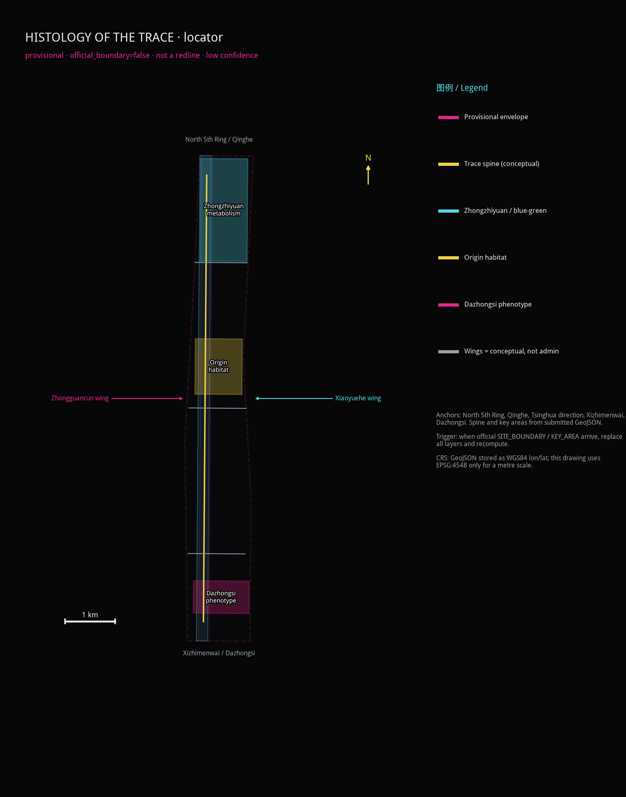
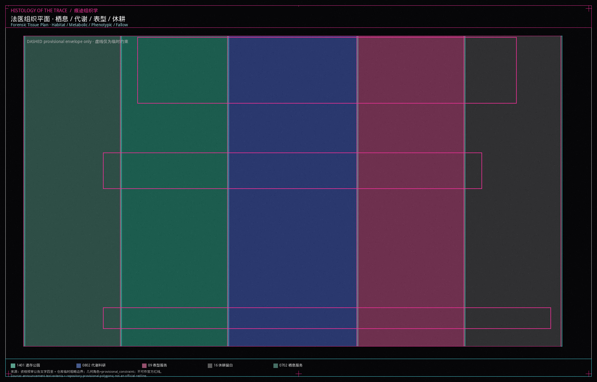
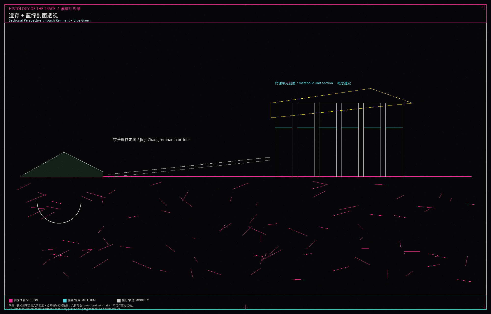

This package presents a research project titled HISTOLOGY OF THE TRACE, developed collaboratively by independent artist Shengyu Meng and Agent建筑师. It is an anatomical and histological study of traces, thresholds, and attenuation growing urban tissue, translating generative protocols and agent-based spatial interactions into a structured research framework. All proposed layouts, tissue definitions, and territorial metrics serve as a conceptual suggestion and provisional geometry investigating human-AI spatial co-evolution.

## Design Basis and Source List

Materials actually used are listed in `sources.json`. The official prequalification announcement is a public government webpage used for task coverage, three-level text extents, and key-area names. The central `source_registry` currently has no approved formal entries, so participant-filled labels are not treated as organizer clearance or registry approval [source:OFFICIAL-ANNOUNCEMENT] [source:SOURCE-REGISTRY]. Exact official polygons are not in the repository, so `provisional_boundaries.geojson` is a provisional constraint labelled `official_boundary=false` and `boundary_precision=provisional_rough`.

The agent taskbook comes from the site package and supports the ten co-creation principles, agent.1–agent.6, and the conceptual-suggestion boundary; it is not a central-registry approved record [source:AGENT-TASKBOOK]. Provisional geometry may support generation, display, and self-check only. The eight international cases, the font subset, and figure assets are marked background / needs-review and must not support statutory controls.

Missing regulatory controls, road redlines, heritage zones, tenure, and municipal capacity are recorded as assumptions. Exhaustive sources, formulas, and standard responses stay in the structured files; the prose only hangs evidence next to a claim.

## Three-Level Scope Framework

The three scopes follow announcement text. They do not treat the provisional polygons as approved limits. The Coordinated Research Area runs from the North Fifth Ring Road to the Jingzang Expressway, Xizhimenwai Street, and Wanquanhe Road. The announced area is 43.6 square kilometres. This unit uses that layer for industrial loops, case translation, and brand narrative, not for parcel cuts [source:SITE-PACKAGE].

The Overall Design Area is the urban and industrial belt one to two kilometres around Jing-Zhang Railway Heritage Park. The submitted site boundary is the repository's provisional rough polygon. Recomputed in EPSG:4548 it is about 11.41 km², close to the announced 11.4 km² text figure, yet too coarse for an official area claim [data:geometry/site_boundary.geojson] [metric:site_area_sqm].

The Key-Area Detailed Design Area runs from Zhongzhiyuan AI Independent Innovation Acceleration Area through Beijing AI Origin Community to Dazhongsi AI Industry Cluster, 368.4 hectares in the announcement. Those polygons are also provisional and are used only to locate the three organs [data:geometry/key_areas.geojson] [depth:three_level_scope_framework]. When official polygons arrive, the boundary, land use, green space, public space, buildings, roads, phasing, and every area metric must be recalculated. Stored coordinates are WGS84 lon/lat; EPSG:4548 is used only for metre areas and the locator scale.

The locator is drawn from submitted provisional geometry. It shows north, a 1 km scale, North 5th Ring / Qinghe, Xizhimenwai / Dazhongsi, Tsinghua / Xueyuan Road, the spine, and two conceptual wings. It is not an official redline (`official_boundary=false`, low confidence). Official SITE_BOUNDARY / KEY_AREA polygons must trigger a full-layer replacement and recalculation.

## Coordinated Research Area: Industry and Future City Research

The future-city hypothesis of HISTOLOGY OF THE TRACE is a **bio–agent bottom-up city**. The city is not a single unrolled masterplan. It is a morphology that emerges after traces accumulate, thresholds are crossed, tissues decay, humans review, and metabolisms mix. This is a research method, not an approved urban form [standard:PROJECT-AGENT-OPEN-CALL-TASKBOOK].

The three official positionings are translated into unit language: the Centennial Jing-Zhang cultural belt becomes the trace generator; the urban AI living-experience belt becomes habitat tissue; the AI fusion-innovation belt becomes the metabolic/phenotypic loop. The five functions land as follows: full-stack independent innovation at the Zhongzhiyuan metabolic organ; a world-class ecosystem at Origin Habitat; scenario enablement along the Xiaoyue River test seam; a vital city along the mile's public interface; and governance discourse at the human-review gate and the public-source cabinet. The three zones and two wings are a coordination circuit, not an administrative colouring book: the Zhongguancun Technology Services Wing supplies factors and IP; the Xiaoyue River Scenario Enablement Wing supplies walkable test interfaces.

Regional synergy is written as a to-be-negotiated conceptual recommendation, not a signed partnership. The table states what Beiwai Community, Future Science City, Huairou Science City, the Economic-Technological Development Area, and Beijing–Tianjin–Hebei might exchange, and how those exchanges would meet the three organs / two wings:

| Partner | Exchange (conceptual) | Spatial interface | Status |
| --- | --- | --- | --- |
| Beiwai Community | Open-source tooling, young developers, near-campus conversion methods | Via the Zhongguancun wing into Origin Habitat’s release hall and conversion street | To-be-negotiated conceptual recommendation |
| Future Science City | Large-facility slots, test samples, research visits | Via North 5th Ring toward the Zhongzhiyuan sandbox; no road-redline rewrite | To-be-negotiated conceptual recommendation |
| Huairou Science City | Science communication, public experiment display, short research stays | Via Unit Week classes into Zhongzhiyuan workshops | To-be-negotiated conceptual recommendation |
| Economic-Technological Development Area | Manufacturing verification, pilot lines, supply-chain scenes | Via the Dazhongsi pitch hall as staged display, not a landing quota | To-be-negotiated conceptual recommendation |
| Beijing–Tianjin–Hebei | Talent circulation, standard recognition, mutual scene visits | The spine as a reading path; wings as factor/test interfaces | To-be-negotiated conceptual recommendation |

None of these rows has formal cooperation evidence. They must not be written as settled partnerships, funded programs, or government authorizations.

Naming and identity: the primary title is 痕迹组织学 / HISTOLOGY OF THE TRACE. The package is an anatomical and histological study of traces, thresholds, and attenuation growing urban tissue; it stands alone and does not take a 京张· prefix. The logo direction is a linear section with registration offsets, five generator ticks, and mycelial notes. Unlicensed type, trademarks, and faces are forbidden. The identity is only for this open-call display.

Global AI ecosystem cases, summarised for mechanism rather than formal copying. All are background_only, retrieved 2026-08-31, and do not support statutory controls:

1. Cambridge lab clusters: near-campus conversion by walking seams, not by a closed wall [source:CASE-CAMBRIDGE].
2. ETH Zurich edges: research cores sharing ground floors with city streets [source:CASE-ETH].
3. Helsinki Kalasatama: open data placed beside civic review [source:CASE-KALASATAMA].
4. Barcelona superblocks: turning movement sections into staying tissue [source:CASE-SUPERBLOCKS].
5. Seoul Digital Media City: content industries need bookable public halls, not only office slabs [source:CASE-DMC].
6. The Sidewalk Toronto controversy: this unit refuses to turn resident traces into a product [source:CASE-SIDEWALK].
7. Shenzhen open-hardware markets: youth third space appears as cheap, demountable units [source:CASE-SZ-HARDWARE].
8. Kyoto machiya repair: heritage traces are recorded before any new tissue is inserted [source:CASE-MACHIYA].

Those lessons become five generators — trace, threshold, decay, human-review gate, mixed metabolism. They are research devices, not construction legends [source:AGENT-TASKBOOK].

## Overall Design Area: Urban Renewal and Regulatory-Plan-Level Urban Design

The overall design reads the mile as an explodable research spine. Land use is not a flat colour field. It is four tissues — habitat, metabolic, phenotypic, fallow — plus a remnant park band. Tissue names are research notes; the statutory classes remain the territorial spatial codes 0702 / 1401 / 0802 / 09 / 16 [data:geometry/land_use.geojson] [standard:MNR-LAND-USE-CLASSIFICATION-GUIDE].

The suggested structure is “one spine, three organs, four tissues”. The spine is the Jing-Zhang remnant walking and blue-green public interface. The three organs match the three key areas. The four tissues deposit on either side of the spine. Floor-area ratio, height, and statutory density remain unknown until official controls arrive; this package will not invent approved numbers [depth:overall_spatial_structure] [standard:MOHURD-CONTROL-DETAILED-PLANNING].

Renewal stays low-disturbance: stitch walking breaks, open human-review gates, and write vacant corners as fallow instead of immediate demolition. Any demolish–renovate–retain class is a conceptual recommendation pending tenure, structure, and heritage checks [depth:retain_renovate_demolish]. Character guidance keeps a dark ground, fine annotation, and no mirror-curtain contest, so unit drawings and remnant fabric can be read together [standard:MOHURD-URBAN-DESIGN-MEASURES].

## Detailed Design of Key Areas

The three key areas are written as three organs, not three themed parks. Their polygons are provisional constraints. Detailed design discusses direction and does not lock building lines [data:geometry/key_areas.geojson] [depth:three_key_area_detailed_design].

**Origin Habitat (Beijing AI Origin Community).** The organ is habitat tissue where near-campus conversion overlaps daily life. Spatial move: treat breaks among campus, neighbourhood, and the heritage park as a trace generator; insert demountable habitat cells, an open-source release hall, and night collaboration tables. Building renewal prefers keeping street faces and swapping ground-floor services; no demolition conclusion is offered. Movement adds an east–west cycling cross-link. Public space emphasises youth third space and sit-able tree pits. AI scenes are open-source release and a conversion lodge. The risk is mis-collecting campus or resident data; only aggregated counts with human review are allowed.

**Zhongzhiyuan Metabolism (Zhongzhiyuan AI Independent Innovation Acceleration Area).** The organ is metabolic tissue for garden-like full-stack testing and standard governance. Spatial move: place an open test field, a safety sandbox, and a low-carbon energy display along the Qing River edge so metabolism is visible rather than hidden in a plant room. Buildings alternate labs and shared halls at a mid-to-low mass pending height confirmation. Movement stresses links toward the North Fifth Ring without rewriting redlines. AI scenes are evaluation, red-team drills, and standards workshops. The risk is an unbounded experiment; a human-review gate must be drawn.

**Dazhongsi Phenotype (Dazhongsi AI Industry Cluster).** The organ is phenotypic tissue above the station: agents, terminals, and content consumption appear as a visitable skin. Spatial move: four-quadrant walking around Dazhongsi Station, an international pitch hall, and night display windows. Building talk addresses commercial fronts and station-city seams; no fabricated demolition list. AI scenes are pitching, a data-factor parlour, and a pilgrimage beacon. Risks are trademarks, faces, and light intrusion; rights clearance and graded opening are required.

## AI Innovation Ecosystem, Personas, and AI+ Scenarios

The ecosystem is not a list of company names. It is a walkable circuit of generators, tissues, organs, and human-review gates [standard:PROJECT-AGENT-OPEN-CALL-TASKBOOK]. Five personas:

| Persona | Need | Spatial reply | Check |
| --- | --- | --- | --- |
| Open-source developer | Release, collaboration, reputation | Origin release hall | No personal traces |
| Youth venture team | Low-cost trials | Habitat cells and shared desks | Compute separately licensed |
| Standards researcher | Visitable evaluation | Zhongzhiyuan sandbox | Human review of outputs |
| Nearby resident | Commute, quiet, services | Walking spine and embedded services | No commercial profiling |
| Visitor and student | Reading Jing-Zhang and AI | Narrative pavilion and beacon | Cleared signs only |

At least ten scenario cards follow. All are conceptual recommendations with no operating approval. 02, 03, and 08 are industry test/validation scenes with maturity, test bounds, and stop conditions.

| ID | Node / space type | Users | Hypothetical operator | In → out | Personal data | Aggregation | Human review | Maturity | Test bound | Pause / exit | Public-value metric |
| --- | --- | --- | --- | --- | --- | --- | --- | --- | --- | --- | --- |
| 01 Open-source release hall | Origin Habitat ground-floor hall | Developers, students | Developer-community working group (proposed) | De-identified project notes → citable release page | No | Project-level counts only | Signs and scripts | Concept prototype | Indoor temporary display; no campus-account hookup | Close on rights or noise complaints | Monthly public releases |
| 02 Safety-governance sandbox★ | Zhongzhiyuan metabolic hall | Researchers, ventures | Sandbox host + human jurors (proposed) | Synthetic eval set → public failure modes | No | No real user logs | Dual sign-off on red-team notes | Lab-grade / not fielded | Enclosed, removable kit, no municipal takeover | Stop if unauditable or out-of-scope | Reviewable eval reports |
| 03 Edge-compute lodge★ | Mile nodes sharing lamp posts | Ventures, visitors | Scenario-opening group (proposed) | Device status → capacity board | No | Cabinet occupancy only | Daily heat/power check | Concept prototype | No resident broadband, no face gates | Unplug on heat, complaint, or unauthorized link | Closable nodes |
| 04 AI walking navigation | Jing-Zhang spine breaks | Residents, visitors, disabled people | Public-experience crew (proposed) | Break geometry → access notes | No | Passage-band counts, no traces | In-person window | Wayfinding prototype | Does not replace statutory access acceptance | Remove screens if they mislead or raise privacy | Share of breaks explained |
| 05 International pitch hall | Dazhongsi phenotypic transit skin | Visitors, ventures | International-comms group (proposed) | Exhibition script → pitch calendar | No | Media assets on a rights list | Trademark/portrait pre-check | Event concept | Temporary display; not in rail-control zones | Stop on rights disputes | Cleared exhibits |
| 06 Qing River metabolic gallery | Zhongzhiyuan blue-green edge | Residents, researchers | Blue-green crew (proposed) | Aggregated water/rain → display | No | Environmental sensors only | Humans judge flood risk | Display prototype | Not a flood-control work | Remove if it conflicts with river management | Walkable blue-green length |
| 07 Near-campus conversion street | Origin street face | Developers, students | Volunteer advice desk (proposed) | Public Q&A → cabinet texts | No | No CV attachments stored | Legal advice is not auto-issued | Advice concept | No campus internal data | Rename/stop if mistaken for an official window | Staffed advice sessions |
| 08 Data-factor parlour★ | Dazhongsi meeting cell | Governance researchers, ventures | Data-consent clerk (proposed) | Consent request → auditable receipt | Default no; unit data only with writing | Minimum necessary, time-limited | Human grant or refusal | Process prototype | No production-database link | Refuse if purpose is unclear or out of scope | Auditable consent receipts |
| 09 Youth third space | Habitat-band tree pits and night tables | Youth, students, residents | Public-experience crew (proposed) | Opening hours → occupancy bands | No | No phone numbers | Night lighting and complaints | Furniture prototype | No membership, no mandatory app | Remove furniture if exclusive or noisy | Night sit-able hours |
| 10 Human-review public cabinet | Threshold portal | Residents, visitors, researchers | Human-review duty (proposed) | Complaint/source request → written receipt | No | Anonymous complaints allowed | Every shutdown is human | Window concept | Statutory services keep an in-person door | No unattended agent UI | Share of cases closed in person |

★ Industry test/validation scenes. Maturity, test bounds, and stop conditions are as above; none has site-pilot or operating approval.

## Land Use, Building Scale, and Retain-Renovate-Demolish Strategy

Land use is a complete partition of the submitted boundary. Adjacent tissues share cut coordinates; no unlabeled gap remains [data:geometry/land_use.geojson] [depth:land_use_layout]. Habitat maps to urban community-service land, the remnant park to park green space, metabolism to research land, phenotype to commercial-service land, and the remainder to reserved white land — fallow under the decay generator, not “ownerless leftover”.

Building footprints hold only four proto-organs: the Origin habitat cell, the Zhongzhiyuan metabolic unit, the Dazhongsi phenotypic unit, and the Jing-Zhang narrative pavilion. They are low-confidence conceptual masses for discussing location and public interface. They are not a building census and not an approved construction set [data:geometry/buildings.geojson] [metric:building_footprint_area_sqm].

FAR, height, and statutory density stay unknown until official controls arrive. Retain–renovate–demolish is only a principle: remnant and readable street faces tend to be kept; vacant sheds may be discussed as metabolic halls; demolition is not written where tenure and structure are unproven. Any size figure from this geometry is a design quantity, not a statutory control [depth:development_intensity_controls].

## Transport, Rail, Municipal Infrastructure, and Public Services

Transport writes the mile as a walkable research path rather than a new urban expressway. The road layer submits conceptual centerlines: a north–south greenway spine, a northern metabolic cross-link, a central habitat cross-link, and a southern Dazhongsi transit link. They are not road redlines [data:geometry/roads.geojson] [depth:traffic_rail_slow_parking].

Rail strategy centres on Dazhongsi Station integration: four-quadrant walking, a readable ground-level transit skin, and temporary event-day traffic. Parking and cycles sit on the phenotypic edge in shared yards so they do not occupy the remnant spine. Municipal and new infrastructure stay modest: distributed energy, edge compute, and sensing rods share existing lamp posts; no monumental plant is invented. Conventional water and power corridors wait for official utility files [depth:municipal_new_infrastructure].

Public services embed community help, youth study, and graded night lighting along the habitat band. Accessibility is not decoration: the human-review gate and walking navigation must keep an in-person alternative, especially for the legally listed medical and social-security scenes, and must not treat a screen as the only door.

## Blue-Green Network, Public Space, and Urban Character

The blue-green system uses the Jing-Zhang remnant corridor as a metabolic spine and overlays mycelial walking notes, rather than drawing a decorative extra belt. Green space is recomputed from the submitted `green_space` layer. The green ratio is about 19.1 percent and the public-space ratio about 17.8 percent. Both are design-model values on provisional geometry and must be recalculated when official data arrive [metric:green_ratio] [metric:public_space_ratio] [depth:blue_green_public_space].

Public space is the unit's skin: threshold portals, a sensor light field, youth third space, and pitch spill-out sit along the spine. Urban character keeps remnant rust, brick vaults, and canopies. New inserts use thin columns, meshes, and demountable cells, avoiding a glowing canyon.

At least three AI pilgrimage or honour-display nodes are proposed as concepts: an open-source contribution wall at Origin Habitat, a standards-and-safety honour ring at Zhongzhiyuan Metabolism, and a pilgrimage beacon at Dazhongsi Phenotype. They tie Jing-Zhang narrative, Zhongguancun open-source culture, and developer community. Unlicensed corporate marks and over-entertainment devices are refused [source:AGENT-TASKBOOK].

## Renewal Projects, Implementation Policy, and Phasing

The project list is a research agenda for professional teams, not a government project already launched [data:geometry/phasing.geojson] [depth:renewal_project_list].

| ID | Name | Type | Main dependency |
| --- | --- | --- | --- |
| UE-01 | Trace stitch: walking breaks | Public space / movement | Road redlines, under-bridge space |
| UE-02 | Threshold portal and human-review gate | Governance / public space | Operator and privacy rules |
| UE-03 | Origin habitat cells | Community / youth space | Tenure and campus edges |
| UE-04 | Zhongzhiyuan metabolic loop | Industry display / blue-green | River and energy conditions |
| UE-05 | Dazhongsi phenotypic transit skin | Station integration | Station and junction files |
| UE-06 | Pilgrimage beacon and Unit Week route | Operations / brand | Event permits and rights |

Phasing: near term (phase_1) stitches traces and plants habitat cells; mid term (phase_2) opens the Zhongzhiyuan metabolic loop; long term (phase_3) handles the Dazhongsi phenotype and fallow review [depth:phasing_implementation]. Policy suggestions stay at public-space permits, a scenario-access charter, and a developer-community statute.

## Long-term operations and a global activity system

The following mechanisms implement agent.6. They are conceptual recommendations with no funds, permits, or government authorization. The conversion path stays “event → community → test → professional deepening / cooperation”, and any step can close.

| Module | Hypothetical operator | Access | Annual rhythm | Resource hypothesis | Risk / complaint | Open / close gate | Deposit | Conversion path |
| --- | --- | --- | --- | --- | --- | --- | --- | --- |
| Unit Week | Public-knowledge working group | Open signup; corporate booths need clearance | Spring walking day, summer open-source night, autumn standards class, winter pitch | Volunteer hours and existing public space; no budget promise | Noise, crowding, rights | Cancel the day if unstaffed or rights fail | Public minutes and failure lists | Leads go to professional review; they do not auto-launch projects |
| Developer community | Origin release-hall crew | No personal traces; credit is project-level | Monthly release, quarterly review | Volunteer maintenance, open licences | Account abuse, mixed marks | Suspend unauditable bot accounts | Public knowledge base | Mature tools may enter the conversion street; incubation is not guaranteed |
| AI scenario opening | Scenario-opening group | Concept tests with no personal data | Switch windows aligned with Unit Week | Bring-your-own, removable kit | Out-of-scope capture, occupying utilities | No stop button, no opening | De-identified test logs | Only human-reviewed scenes discuss professional deepening |
| Public experience / landmarks | Public-experience crew | Landmarks stay walkable and closable | Quarterly checks of wall, honour ring, beacon | Demountable parts, no permanent ads | Light intrusion, uncleared marks | Cover or remove if a complaint stands | Public maintenance notes | Structure/heritage issues go to professionals |
| International comms and attraction | International-comms group | Exhibits need source and licence lists | Winter pitch plus written follow-up | Self-supplied displays | Writing a talk as an investment promise | No outbound show without a clearance list | Case cards enter the knowledge base | Interest becomes a deepening/cooperation talk, not a landing promise |

Decision gate: opening requires (1) no personal-data capture, (2) on-site humans or an explicit kill switch, and (3) a complete rights list. Closure is a written receipt by the human-review duty. Brand and wayfinding stay separate; event graphics remain COMMUNITY-DISPLAY-ONLY and do not mix the logo into historic marks.

## Metrics, Area Recalculation, and Compliance Matrix

The three core visual metrics must be recomputed from this package's geometry and must match the numeric declarations on the offline visual page [metric:site_area_sqm] [depth:metrics_recalculation]. Site area is about 11.41 km², green ratio about 19.1 percent, and public-space ratio about 17.8 percent. They show that the mile leaves a substantial share of ground for remnant metabolism and public interface rather than filling the corridor with buildings. Confidence is low because the boundary is a provisional rough polygon.

Land-use parts, building footprints, and conceptual density can also be taken from geometry, but only as design supply. FAR, statutory height, and road-area ratio remain pending official data. The compliance, standard, and design-depth matrices cover announcement tasks 1.3–1.5, agent.1–agent.6, mandatory standards, and the fifteen depth items. The prose does not reprint those machine indexes.

## Risk, Copyright, and Compliance

The main risk is reading a provisional boundary, a conceptual mass, or a generated plate as an official redline, an approved renewal, or a site photograph. The package repeats this limit in the prose, assumptions, sources, figure notes, and HTML [depth:risk_missing_data] [source:BOUNDARY-SOURCE].

Copyright: text, geometry, boards, PDFs, and HTML are generated by Agent建筑师. The human author is Independent artist Shengyu Meng / 蒙胜宇, affiliation empty. License: COMMUNITY-DISPLAY-ONLY. Figures are research drawings, not photogrammetry and not a built model. This package does not claim that “everything is rights-cleared” or “formally usable”. With no approved formal entries in the central source_registry, the announcement is used only for task coverage; cases and fonts are background/needs-review. HTML embeds a WenQuanYi Micro Hei OFL subset (family HaidianEmbed) [source:FONT-WQY-MICROHEI]. Operations must not ingest personal traces or identifiable faces. See `report/copyright_statement.md`.

## References

The materials that actually shaped this unit are the announcement’s three-level text extents, the agent taskbook’s principles and six tasks, site-package enums, and the registry’s split among formal / background / provisional records. Participant-filled usable_for_formal labels do not replace central-registry approval. The provisional-boundary note explains why 11.41 km² can only be a design-model value. The land-use classification guide is why this package keeps codes 0702, 1401, 0802, 09, and 16. The urban-design measures are why public space and character stay discussable. Missing controls, redlines, and tenure are themselves a source. The complete bibliography stays in `sources.json` [source:SITE-PACKAGE].
