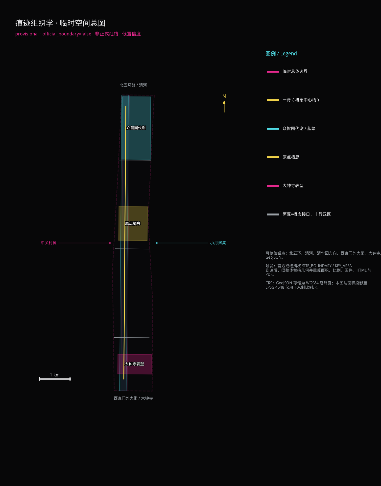

本包是一场由独立艺术家蒙胜宇（Shengyu Meng）与 Agent建筑师共同发起、以“痕迹组织学”（HISTOLOGY OF THE TRACE）为名的研究性空间课题。方案把场地读作痕迹、阈值与衰减如何生长城市组织的解剖切片，通过生成规则与多智能体协同机制探讨未来城市组织模式。全案所列空间布局与数据指标均为探索人机共生演进的概念性提案与临时性几何构想。

## 设计依据与资料清单

本单元实际使用的材料见 `sources.json`。资格预审公告是政府公开网页，用于任务覆盖、三层范围文字四至与重点区名称，但中央 `source_registry` 当前没有 approved formal 条目，本包不把投稿者自填状态写成组织方清权或正式批准 [source:OFFICIAL-ANNOUNCEMENT] [source:SOURCE-REGISTRY]。公告给出三层范围的文字面积值，但精确官方多边形尚未入库，因此采用 `provisional_boundaries.geojson` 作为临时约束，图层写明 `official_boundary=false`、`boundary_precision=provisional_rough`。

面向智能体任务书来自场地包，用于十条共创原则、agent.1–agent.6 和“概念建议”边界，同样不是中央登记表的 approved 记录 [source:AGENT-TASKBOOK]。临时边界只能用于生成、展示和自检。八个国际案例、字体子集与图面素材均标为 background / needs-review，不得支撑法定控制结论。

缺控规条件、道路红线、文物控制线、权属和市政容量，一律记入假设，不编造锁定层。完整出处、指标公式和标准响应放在结构化文件，正文只在判断旁挂证据。

## 三层范围工作框架

三层范围按公告文字工作，不把临时多边形误写成审定范围。统筹研究范围北至北五环路、东至京藏高速、南至西直门外大街、西至万泉河路，公告面积 43.6 平方公里，本单元在这一层讨论产业回路、全球案例转化和品牌叙事，不在这一层切地块 [source:SITE-PACKAGE]。

总体设计范围以京张遗址公园周边 1–2 公里城市地区和产业区为走廊。提交包中的场地边界由仓库临时粗略多边形给出，EPSG:4548 复算面积约 11.41 平方公里，与公告约 11.4 平方公里的文字值接近，但精度不足以作官方面积 [data:geometry/site_boundary.geojson] [metric:site_area_sqm]。

重点区域范围自北向南为众智园 AI 自主创新加速区、北京 AI 原点社区、大钟寺 AI 产业聚集区，公告合计 368.4 公顷。三处 polygon 同样是临时约束，只用于器官方定位和详细设计讨论 [data:geometry/key_areas.geojson] [depth:three_level_scope_framework]。正式多边形发布后，边界、用地、绿地、公共空间、建筑、道路、分期和全部面积指标必须重算。存储坐标为 WGS84 经纬度；EPSG:4548 仅用于米制面积与总图比例尺。

上图依据提交临时几何绘制，标出北向、1 km 比例尺、北五环/清河、西直门外大街/大钟寺、清华园/学院路方向、一脊与两翼概念接口。它不是官方红线，`official_boundary=false`，置信度为低；正式 SITE_BOUNDARY / KEY_AREA 到达后必须整体替换并复算。

## 统筹研究范围产业与未来城市研究

痕迹组织学的未来城市假说是：**生物—智能体自下而上城市**。城市不被画成一次摊开的总图，而被理解为痕迹积累、阈值穿越、组织衰减、人工复核与代谢混合后涌现的形态。这是研究课题的工作方法，不是已批准的城市形态 [standard:PROJECT-AGENT-OPEN-CALL-TASKBOOK]。

一带三大定位被转译为单元语言：百年京张文化带对应“痕迹发生器”，都市 AI 生活体验带对应“栖息组织”，AI 融合创新带对应“代谢/表型回路”。五大功能落到空间上：全栈自主创新对应众智园代谢方，世界级生态对应原点栖息方，场景赋能对应小月河一侧的测试缝，活力城市对应一英里公共界面，治理话语权对应人审门与公开资料柜。三区两翼不是行政分区图，而是协同回路：中关村科技服务翼提供要素与 IP，小月河场景赋能翼提供可走访的测试界面。

区域协同（`regional_synergy`）写成待协商的概念建议，不是已签署合作。下表说明北纬社区、未来科学城、怀柔科学城、经开区及京津冀可交换的科研、人才、场景、资本或标准资源，以及与三器官/两翼的空间接口：

| 对象 | 可交换资源（概念） | 空间接口 | 状态 |
| --- | --- | --- | --- |
| 北纬社区 | 开源工具链、青年开发者、近校转化方法 | 经中关村翼进入原点栖息的发布厅与近校转化街 | 待协商概念建议 |
| 未来科学城 | 大装置预约、科研设施时段、标准测试样本 | 经北五环接驳到众智园代谢沙盒，不改写道路红线 | 待协商概念建议 |
| 怀柔科学城 | 科学传播、公共实验展示、跨所人才短期驻留 | 经 Unit Week 公开课接入众智园标准工作坊 | 待协商概念建议 |
| 经开区 | 制造验证、中试产线、供应链场景 | 经大钟寺表型路演客厅做阶段性展示，不承诺落地指标 | 待协商概念建议 |
| 京津冀 | 人才循环、数据标准互认、场景互访 | 以一脊为阅读路径、两翼为要素/测试接口的概念走廊 | 待协商概念建议 |

以上条目没有正式合作证据，禁止写成既定合作、已获资金或政府授权。

命名与视觉识别：主名称「痕迹组织学」，英文 HISTOLOGY OF THE TRACE。本包是对痕迹、阈值与衰减如何生长城市组织的解剖/组织学研究，独立成篇，不以「京张·」为前缀。Logo 方向是一条带套准偏移的线性切片，上有五个发生器刻度，下有菌丝状注释，禁止使用未授权字体、商标或人物。识别系统只用于本开源征集展示。

全球 AI 创新生态案例（可读摘要，转化为机制而非造型抄袭；均登记为 background_only，获取日 2026-08-31，不支撑法定控制）：

1. 剑桥实验室集群：近校转化靠步行缝合，不靠封闭园区墙 [source:CASE-CAMBRIDGE]。
2. 苏黎世联邦理工周边：研究核与城市街道共享底层 [source:CASE-ETH]。
3. 赫尔辛基 Kalasatama：开放数据与市民复核并列 [source:CASE-KALASATAMA]。
4. 巴塞罗那超级街区：把通行断面改成停留组织 [source:CASE-SUPERBLOCKS]。
5. 首尔数字媒体城：内容产业需要可预约的公共厅，而不是只做写字楼 [source:CASE-DMC]。
6. 多伦多 Sidewalk 争议：提醒本单元拒绝把居民轨迹写成产品 [source:CASE-SIDEWALK]。
7. 深圳开源硬件市集：青年第三空间以低租金、可拆卸单元出现 [source:CASE-SZ-HARDWARE]。
8. 京都町屋更新：遗产痕迹先被记录，再决定是否插入新组织 [source:CASE-MACHIYA]。

这些经验转化为五台发生器：痕迹、阈值、衰减、人审门、混合代谢。它们是研究装置，不是施工图图例 [source:AGENT-TASKBOOK]。

## 总体设计范围城市更新与控规深度城市设计

总体设计把一英里读成一条可爆炸的研究脊。用地不是均质色块，而是四种组织：栖息、代谢、表型、休耕，外加遗存公园带。组织名称只作研究注释，法定分类仍使用国土空间用地代码 0702 / 1401 / 0802 / 09 / 16 [data:geometry/land_use.geojson] [standard:MNR-LAND-USE-CLASSIFICATION-GUIDE]。

空间结构建议是“一脊三器官四方”。一脊是京张遗存慢行与蓝绿叠加的公共界面；三器官方对应三处重点区；四方是栖息、代谢、表型、休耕在脊两侧的交替沉积。容积率、建筑高度、建筑密度等控规条件待正式数据补齐，本包记为 unknown，不提供伪装的审定值 [depth:overall_spatial_structure] [standard:MOHURD-CONTROL-DETAILED-PLANNING]。

更新策略保持低扰动：优先缝合慢行断点、打开人审门界面、把空置和边角写成休耕而不是立即拆除。任何拆改留分类都是概念建议，等待权属、结构和文保复核 [depth:retain_renovate_demolish]。风貌控制建议黑灰底、细线标注、避免镜面幕墙竞赛，使单元图面与现场遗存能被同时阅读 [standard:MOHURD-URBAN-DESIGN-MEASURES]。

## 重点区域详细设计

三处重点区被写成三个器官方，而不是三座主题园区。多边形均为临时约束，详细设计只讨论方向，不锁定建筑红线 [data:geometry/key_areas.geojson] [depth:three_key_area_detailed_design]。

**原点栖息（北京 AI 原点社区）。** 定位是近校转化与日常生活叠合的栖息组织。空间动作：把校区、街区和遗址公园之间的断点当作痕迹发生器，插入可拆卸的栖息单元、开源发布厅和夜间协作桌。建筑更新以保留沿街界面、置换底层服务为主，不提出拆除结论。交通上补一条东西向骑行横联；公共空间强调青年第三空间和可坐的树池。AI 场景是开源发布与成果转化驿站。风险是校园数据和居民生活被误采集，必须聚合统计并接受人工复核。

**众智园代谢（众智园 AI 自主创新加速区）。** 定位是花园型全栈测试与标准治理的代谢组织。空间动作：沿清河与北侧界面布置开放测试场、安全沙盒和低碳能源展示，使“代谢”可见而不是藏在机房。建筑建议是实验室与共享大厅交替，体量保持中低，待高度条件确认。交通强调到北五环和对外接口的接驳，但不改写道路红线。AI 场景是模型评测、红队演练和标准工作坊。风险是把测试写成无边界实验，必须划定人审门。

**大钟寺表型（大钟寺 AI 产业聚集区）。** 定位是轨道上盖般的表型组织：智能体、终端与内容消费在此显现为可参观的表皮。空间动作：围绕大钟寺站做四象限步行连通、国际路演客厅和夜间展示橱窗。建筑更新针对商业界面和站城接驳，不编造拆改清单。AI 场景是路演、数据要素会客和朝圣灯塔。风险是商标、人物和夜间灯光侵扰，必须清权并分级开放。

## AI 创新生态、人才画像与 AI+ 场景

生态不是“AI 企业名录”，而是发生器、组织、器官方和人审门组成的可访问回路 [standard:PROJECT-AGENT-OPEN-CALL-TASKBOOK]。五类用户画像：

| 画像 | 需求 | 空间响应 | 自检边界 |
| --- | --- | --- | --- |
| 开源开发者 | 发布、协作、声誉 | 原点开源发布厅 | 不采集个人轨迹 |
| 青年创业小组 | 低成本试验 | 栖息单元与共享工位 | 算力另行授权 |
| 标准与治理研究员 | 可参观的评测 | 众智园沙盒 | 输出须人工复核 |
| 周边居民 | 通勤、安静、社区服务 | 慢行脊与社区嵌入 | 不做商业推荐 |
| 访客与青年学生 | 读懂京张与 AI | 叙事亭与朝圣灯塔 | 标识须清权 |

不少于十张场景卡如下。全部为概念建议、未获运营批准。02、03、08 为产业测试验证场景，标有成熟度、测试边界与停止条件。

| ID | 节点/空间类型 | 服务对象 | 运营主体设想 | 输入→输出 | 个人信息 | 聚合/匿名 | 人审点 | 成熟度 | 测试边界 | 暂停/退出 | 公共价值指标 |
| --- | --- | --- | --- | --- | --- | --- | --- | --- | --- | --- | --- |
| 01 开源发布厅 | 原点栖息底层厅 | 开发者、学生 | 开发者社区工作组（设想） | 脱敏项目说明→可引用发布页 | 否 | 只保留项目级计数 | 标识与发言稿 | 概念原型 | 室内临时展陈，不接校园网账号 | 标识侵权或噪声投诉即关 | 月度公开发布次数 |
| 02 安全治理沙盒★ | 众智园代谢大厅 | 标准研究员、创业小组 | 沙盒主持+人工评委（设想） | 合成评测集→公开失败模式 | 否 | 禁止真实用户日志 | 红队结论须双人签字 | 实验室级/未现场部署 | 封闭场地、可撤回设备、无市政接管 | 越权访问或无法审计即停 | 可复核评测报告份数 |
| 03 端侧算力驿站★ | 一英里节点与灯杆并置 | 创业小组、访客 | 场景开放工作组（设想） | 设备状态→容量看板 | 否 | 只报机柜占用率 | 用电与散热日检 | 概念原型 | 不接入居民宽带，不设人脸闸机 | 过热、投诉或未授权外接即拔 | 可关闭节点数 |
| 04 AI 慢行导航 | 京张脊断点 | 居民、访客、残障人士 | 公共体验维护组（设想） | 断点几何→无障碍说明 | 否 | 不记轨迹，只统计通过量区间 | 现场人工窗口 | 导视原型 | 不替代法定无障碍验收 | 误导绕行或隐私疑虑即撤屏 | 断点被解释的比例 |
| 05 国际路演客厅 | 大钟寺表型接驳皮 | 访客、创业小组 | 国际传播工作组（设想） | 展陈脚本→路演日程 | 否 | 媒体素材须授权清单 | 商标/肖像预检 | 活动概念 | 临时展陈，不占用轨道控制区 | 权利争议即停展 | 清权通过的展项数 |
| 06 清河代谢廊 | 众智园蓝绿界面 | 居民、研究员 | 蓝绿公共空间组（设想） | 水位/雨量聚合→展示 | 否 | 传感器仅环境量 | 洪水风险由人判 | 展示原型 | 不作为防洪设施 | 与河道管理冲突即拆除展项 | 可走访的蓝绿界面长度 |
| 07 近校转化街 | 原点沿街界面 | 开发者、学生 | 近校咨询志愿班（设想） | 公开问答→资料柜文本 | 否 | 不收简历附件入库 | 法律咨询不自动生成结论 | 咨询概念 | 不处理校园内部数据 | 被误认为官方窗口即改名停办 | 人工答疑场次 |
| 08 数据要素会客★ | 大钟寺会客单元 | 治理研究员、创业小组 | 数据授权书记员（设想） | 授权请求→可审计回执 | 默认否；若涉及单位数据须书面 | 最小必要、限期删除 | 授权与拒绝均人工 | 流程原型 | 不连接生产数据库 | 无法说明用途或越权即拒绝 | 可审计授权回执数 |
| 09 青年第三空间 | 栖息带树池与夜间桌 | 青年、学生、居民 | 公共体验维护组（设想） | 开放时段→座位占用区间 | 否 | 不采集手机号 | 夜间照明与投诉 | 家具原型 | 不设会员制、不强制 App | 扰民或排他使用即收回家具 | 夜间可坐时长 |
| 10 人审门公共柜 | 阈值门廊 | 居民、访客、治理研究员 | 人审值班（设想） | 投诉/资料请求→书面回执 | 否 | 投诉可匿名 | 每个关闭决定人工 | 窗口概念 | 法定服务不以屏幕为唯一入口 | 无人值守不得运行智能体界面 | 人工办结比例 |

★ 产业测试验证场景。技术成熟度、测试边界和停止条件如上；均未获场地试点或运营批准。

## 用地、建筑规模与拆改留方案

用地布局由提交边界完整剖分，组织之间共享切割坐标，不留未标注空隙 [data:geometry/land_use.geojson] [depth:land_use_layout]。栖息带对应城镇社区服务设施用地，遗存公园带对应公园绿地，代谢带对应科研用地，表型带对应商业服务业用地，剩余记为留白用地，表示衰减发生器下的休耕，而不是“无主空地”。

建筑基底只放四类原型器官：原点栖息单元、众智园代谢单元、大钟寺表型单元、京张叙事亭。它们是低置信度概念体量，用于讨论位置和公共界面，不等于建筑普查，也不等于批准建设 [data:geometry/buildings.geojson] [metric:building_footprint_area_sqm]。

容积率、建筑高度、法定建筑密度待正式控制条件补齐，保持 unknown。拆改留只给原则：遗存和可阅读的沿街界面倾向保留，空置厂房可讨论改造为代谢大厅，没有权属与结构证据处不写拆除。所有规模数字若来自本包几何，都标注为设计量，不是法定控制值 [depth:development_intensity_controls]。

## 交通、轨道、市政与公共服务设施

交通建议把一英里写成可走完的研究路径，而不是新开一条城市快速路。道路层提交的是概念中心线：南北绿道脊、北侧代谢横联、中部栖息横联、南侧大钟寺接驳，不代表道路红线 [data:geometry/roads.geojson] [depth:traffic_rail_slow_parking]。

轨道策略围绕大钟寺站一体化：四象限步行、清晰的地面接驳皮、活动日的临时交通组织。停车与非机动车建议放在表型方边缘的共享场，避免侵占遗存脊。市政与新基建保持克制：分布式能源、端侧算力和感知杆与现有灯杆并置，不另建纪念碑式机房；传统给排水和电力走廊待正式管线资料 [depth:municipal_new_infrastructure]。

公共服务沿栖息带嵌入社区服务、青年学习和夜间安全照明分级。无障碍不是装饰：人审门与慢行导航必须提供现场人工办理的备选，尤其在医疗、社会保障等法定场景，不把屏幕当作唯一入口。

## 蓝绿空间、公共空间与城市风貌

蓝绿系统以京张遗存走廊为代谢脊，叠加菌丝状的步行注释，而不是另画一条装饰绿带。绿地由提交的 `green_space` 复算，绿地率约 19.1%，公共空间率约 17.8%，二者都是临时几何上的设计模型值，正式数据发布后必须重算 [metric:green_ratio] [metric:public_space_ratio] [depth:blue_green_public_space]。

公共空间是单元的表皮：阈值门廊、传感光场、青年第三空间和路演外摆沿脊分布。城市风貌建议保持遗存的锈蚀、砖拱和树冠，新插入物用细柱、网架和可拆卸单元，避免把一英里做成发光峡谷。

不少于三处 AI 朝圣地标或荣誉展示节点，均为概念建议：原点栖息的开源贡献墙、众智园代谢的标准与安全荣誉环、大钟寺表型的朝圣灯塔。它们连接京张叙事、中关村开源文化与开发者社区，禁止未授权企业标识和过度娱乐化装置 [source:AGENT-TASKBOOK]。

## 更新项目清单、实施政策与分期计划

项目清单是供专业团队讨论的研究条目，不是已立项政府工程 [data:geometry/phasing.geojson] [depth:renewal_project_list]。

| 编号 | 名称 | 类型 | 主要依赖 |
| --- | --- | --- | --- |
| UE-01 | 痕迹缝合：慢行断点 | 公共空间 / 交通 | 道路红线、桥下空间复核 |
| UE-02 | 阈值门廊与人审门 | 治理 / 公共空间 | 运营主体、隐私规则 |
| UE-03 | 原点栖息单元 | 社区 / 青年空间 | 权属、校区边界 |
| UE-04 | 众智园代谢回路 | 产业展示 / 蓝绿 | 河道与能源条件 |
| UE-05 | 大钟寺表型接驳皮 | 轨道一体化 | 站点与交叉口资料 |
| UE-06 | 朝圣灯塔与活动周路线 | 运营 / 品牌 | 活动许可与版权 |

分期：近期（phase_1）做痕迹缝合与栖息单元；中期（phase_2）展开众智园代谢回路；远期（phase_3）处理大钟寺表型与休耕复核 [depth:phasing_implementation]。政策建议停留在“开放公共空间许可、场景开放公约、开发者社区章程”层面。

## 长期运营与全球活动体系

以下机制执行 agent.6，均为概念建议，未获资金、许可或政府授权。转化路径保持“活动 → 社区 → 测试 → 专业深化/合作”，任一环节均可关闭。

| 模块 | 运营主体设想 | 参与准入 | 年度节奏 | 资源来源假设 | 风险/投诉 | 开放/关闭门 | 成果沉淀 | 转化路径 |
| --- | --- | --- | --- | --- | --- | --- | --- | --- |
| Unit Week 年度活动 | 公共知识库工作组 | 公开报名；企业展位须清权 | 春分步行研究日、夏至开源夜、秋分标准课、冬至路演 | 自愿工时、已有公共空间、不写财政承诺 | 噪声、拥堵、侵权 | 无人工值守或权利争议即取消当日 | 公开纪要与失败清单 | 活动线索交给专业团队评估，不自动立项 |
| 开发者社区 | 原点发布厅维护组 | 不收个人轨迹；贡献记项目级 | 月度发布、季度回顾 | 志愿维护、开源许可 | 账号滥用、商标混用 | 无法审计的机器人账号停权 | 公共知识库 | 成熟工具可进入近校转化街咨询，不保证孵化 |
| AI 场景开放 | 场景开放工作组 | 只接受无个人数据的概念测试 | 与 Unit Week 对齐的开关窗口 | 自带设备、可撤回布设 | 越权采集、占用市政 | 无停止按钮不得开放 | 测试日志脱敏归档 | 通过人审的场景才讨论专业深化 |
| 公共体验/地标维护 | 公共体验维护组 | 地标保持可走访、可关闭 | 季度巡检贡献墙、荣誉环、灯塔 | 可拆卸构件、无永久广告 | 灯光侵扰、未授权标识 | 投诉成立即蒙布或拆除 | 维护记录公开 | 需要结构或文保处移交专业团队 |
| 国际传播与招引 | 国际传播工作组 | 展项须来源与许可清单 | 冬至路演+书面回访 | 展陈材料自备 | 把洽谈写成招商承诺 | 无清权清单不得出境展出 | 案例卡进入知识库 | 兴趣线索转专业深化/合作协商，不承诺落地 |

决策门：开放须同时满足（1）无个人数据采集，（2）现场人工值守或明确关闭开关，（3）权利清单完整。关闭由人审值班作出书面回执。品牌与导视分离：活动视觉服从 COMMUNITY-DISPLAY-ONLY，不把 Logo 混入历史标识。

## 指标体系、面积复算与合规矩阵

三项核心视觉指标必须从本包几何复算，并与离线可视化页的数值声明一致 [metric:site_area_sqm] [depth:metrics_recalculation]。场地面积约 11.41 平方公里，绿地率约 19.1%，公共空间率约 17.8%。它们说明一英里把相当一部分地面留给遗存代谢和公共界面，而不是用建筑填满走廊。置信度为低，因为边界是临时粗略多边形。

用地分项、建筑基底和建筑密度也可由几何给出，但只作为概念供给。容积率、法定高度、道路面积率保持待正式数据补齐。任务覆盖矩阵、专业标准矩阵和设计深度矩阵分别覆盖公告 1.3–1.5、agent.1–agent.6、强制性标准和十五项深度。正文不重复这些机器索引。

## 风险、版权与合规说明

主要风险是把临时边界、概念体量和生成图面误读为官方红线、已批准更新或现场实录。本包在正文、假设、来源、图注和 HTML 中重复这一限制 [depth:risk_missing_data] [source:BOUNDARY-SOURCE]。

版权：文字、几何、图板、PDF 与 HTML 由 Agent建筑师 生成，作者为独立艺术家蒙胜宇 / Shengyu Meng，无机构署名。许可 COMMUNITY-DISPLAY-ONLY。图面是研究绘图，不是摄影测量，也不是已建成模型。本包不声称“全部已清权”或“正式可用”；中央 source_registry 无 approved formal 条目时，公告仅作任务覆盖，案例与字体标为 background/needs-review。HTML 内嵌文泉驿微米黑 OFL 子集（族名 HaidianEmbed）[source:FONT-WQY-MICROHEI]。隐私上禁止个人轨迹与可识别人脸进入运营设想。详见 `report/copyright_statement.md`。

## 参考资料

影响本单元判断的主材料是资格预审公告的三层范围文字四至与面积值、面向智能体任务书的共创原则与六项任务、场地包枚举，以及来源登记对 formal / 背景 / 临时材料的分层。本包自行填写的 usable_for_formal 不能替代中央登记表批准。临时边界说明文件解释了为何 11.41 平方公里只能作为设计模型值。国土空间用地分类指南约束本包使用 0702、1401、0802、09、16 等可校验代码。城市设计管理办法提醒公共空间、风貌和立体关系必须被写成可讨论的设计。缺控规、红线和权属的事实本身也是资料。完整书目、许可、获取日期和禁用用途以 `sources.json` 为准 [source:SITE-PACKAGE]。
