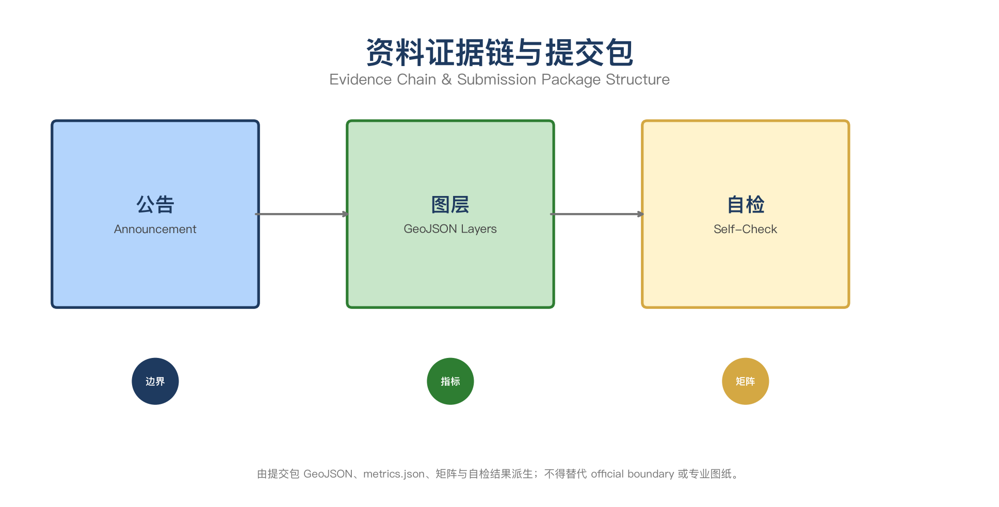
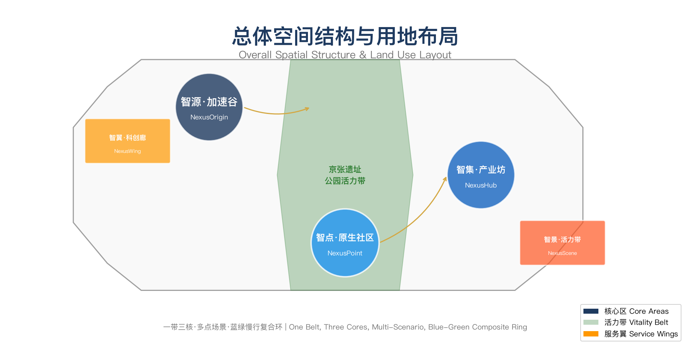

# 京张智脉·AI共生城：百年京张AI创新带城市设计方案

## 设计依据与资料清单

本方案以北京市规划和自然资源委员会海淀分局发布的《百年京张AI创新带城市设计国际方案征集资格预审公告》为第一依据，以 `brief/site-package/` 中经维护者登记的临时粗略边界、重点区域、枚举、指标和来源清单为机器可读依据 [source:OFFICIAL-ANNOUNCEMENT] [source:AGENT-TASKBOOK] [source:SITE-PACKAGE]。所有设计判断拆分为可追溯来源、可复算指标、可校验图层和可人工复核假设。完整来源和标准覆盖分别保存在 `sources.json`、`standard_matrix.json` 与 `design_depth_matrix.json` [source:SOURCE-REGISTRY]。

本方案使用 `brief/site-package/geometry/provisional_boundaries.geojson` 生成临时 formal 包。`geometry/site_boundary.geojson` 与 `geometry/key_areas.geojson` 均标注为 `provisional_constraint`、`official_boundary=false`，仅用于方案生成、自检、可视化和设计讨论 [data:geometry/site_boundary.geojson#SITE-001]。官方边界和重点区 polygon 更新后，agent 必须重新运行脚手架、自检和图纸/HTML生成。



## 一、一带总体概念与功能统筹方案设计（agent.1）

### 1.1 品牌命名体系

**主名称：** 京张智脉（JingZhang AI Nexus）

**命名体系：**

| 层级 | 名称 | 英文 | 释义 |
| --- | --- | --- | --- |
| 一带 | 京张智脉 | JingZhang AI Nexus | 以京张铁路为历史脉络，以AI智能为未来脉搏，"智脉"既指智慧脉络，也暗喻城市的生命脉搏 |
| 核心区1 | 智源·加速谷 | NexusOrigin Accelerator | 众智园AI自主创新加速区，强调自主创新的加速引擎 |
| 核心区2 | 智点·原生社区 | NexusPoint Origin Community | 北京AI原点社区，强调AI原生与近校创新的交汇 |
| 核心区3 | 智集·产业坊 | NexusHub Industry District | 大钟寺AI产业聚集区，强调产业集聚与国际交往 |
| 服务翼1 | 智翼·科创廊 | NexusWing Tech Corridor | 中关村科技服务翼 |
| 服务翼2 | 智景·活力带 | NexusScene Vitality Belt | 小月河场景赋能翼 |

### 1.2 视觉识别与Logo方向

Logo概念以"脉"为核心意象：一条流动的曲线代表京张铁路的历史轨迹，曲线上生长出数字化的节点网络，象征AI创新从历史根脉中生长。主色调采用"智脉蓝"（#1E3A5F）与"创新金"（#D4A843），辅以"生态绿"（#2E7D32）代表蓝绿空间系统。

视觉识别系统覆盖：导视标识、建筑立面色彩引导、公共艺术装置、数字交互界面、活动视觉和国际传播物料。所有字体、图像和标识均须有清权来源 [standard:MOHURD-URBAN-DESIGN-MEASURES]。

### 1.3 三大定位与五大功能

**三大定位：** 百年京张文化带 · 都市AI生活体验带 · AI融合创新带

**五大功能：** AI全栈自主创新体系 · 世界级AI创新生态 · AI+场景赋能新范式 · 智能化AI活力城市 · AI治理全球话语权

### 1.4 总体空间结构

方案的空间组织为"一带三核、多点场景、蓝绿慢行复合环" [data:geometry/site_boundary.geojson#SITE-001]：

- **一带：** 京张遗址公园活力带，南北贯穿，连接三处重点区域，是文化、慢行和公共活动的主轴
- **三核：** 智源·加速谷（北段）、智点·原生社区（中段）、智集·产业坊（南段），各承载差异化AI产业功能
- **多点场景：** 分布在一带沿线和两翼的AI+公共服务、产业服务和城市生活运营节点
- **蓝绿慢行复合环：** 清河—京张遗址公园—小月河的连续蓝绿空间与慢行系统，串联创新节点



## 二、AI全栈自主创新体系与世界级AI创新生态设计（agent.2）

### 2.1 全球AI创新生态案例研究

方案研究了以下全球AI创新生态案例，提炼海淀可借鉴的经验 [source:AGENT-TASKBOOK]：

| 案例 | 地点 | 核心模式 | 海淀借鉴 |
| --- | --- | --- | --- |
| Stanford AI Index / HAI | 斯坦福大学 | 高校策源+指数评估+政策建议 | 近校策源、开放评测、政策对话 |
| Google AI Campus | 山景城 | 企业主导+开发者生态+开放测试 | 企业引领、开发者社区、场景开放 |
| Mila / Montreal AI | 蒙特利尔 | 学术联盟+产学研转化+人才集聚 | 联合实验室、成果转化、人才特区 |
| Singapore AI Verify | 新加坡 | 沙盒监管+标准制定+国际对话 | 安全治理、标准输出、全球话语权 |
| Shenzhen AI Valley | 深圳 | 产业链集聚+硬件加速+场景落地 | 产业集聚、端侧算力、场景验证 |
| London Tech Corridor | 伦敦 | 科技走廊+金融赋能+国际网络 | 科技服务翼、资本对接、国际传播 |
| Tel Aviv Innovation District | 特拉维夫 | 军转民+创业密度+风险投资 | 创新转化、投资密度、创业服务 |
| Munich AI Campus | 慕尼黑 | 工业AI+应用验证+欧盟标准 | 工业AI测试、标准制定、合规服务 |

### 2.2 创新生态图谱

海淀的AI创新生态围绕"策源—协作—转化—体验—传播"五环构建：

1. **策源头环：** 清华大学、北京大学、中科院等高校院所提供基础研究和人才供给
2. **协作网络：** 开源社区、联合实验室、学术会议和开发者活动构成协作基础设施
3. **转化枢纽：** 众智园全栈自主创新加速区提供从原型到产品的加速通道
4. **体验界面：** 北京AI原点社区和大钟寺提供成果展示、场景体验和用户反馈
5. **传播节点：** 全球AI活动周、国际路演和数字传播构成品牌影响力

### 2.3 众智园全栈自主体系

众智园（智源·加速谷）应建设以下自主创新设施 [data:geometry/key_areas.geojson#PROV-KEY-001]：

- **自主模型测试中心：** 提供国产芯片算力、模型评测和红队测试
- **标准制定工作坊：** 承接AI安全、伦理和治理标准的研讨与制定
- **安全治理沙盒：** 在可控环境中测试AI应用的安全边界
- **低碳算力展示区：** 展示绿色计算和分布式能源在AI算力中的应用

## 三、AI+场景赋能新范式与智能化AI活力城市设计（agent.3）

### 3.1 AI场景卡（12张）

| 编号 | 场景名称 | 空间载体 | 服务对象 | 设计说明 |
| --- | --- | --- | --- | --- |
| S01 | 开源发布厅 | 智点·原生社区 | 高校师生、开源开发者 | 成果发布、代码贡献展示、小型路演空间 |
| S02 | 安全治理沙盒 | 智源·加速谷 | AI企业、监管机构 | 标准制定、安全评测、模型红队测试的可参观协作节点 |
| S03 | 端侧算力驿站 | 一带沿线节点 | 创业团队、开发者 | 与公共服务结合的新型基础设施原型 |
| S04 | AI慢行导航 | 京张遗址公园 | 市民、游客 | 可解释导视和低侵入传感识别慢行断点和无障碍需求 |
| S05 | 国际路演客厅 | 智集·产业坊 | 头部企业、国际访客 | 智能体、智能终端展示、商务洽谈和媒体发布 |
| S06 | 清河低碳创新廊 | 智源·加速谷临河界面 | 园区企业、市民 | 绿色空间、雨洪管理、步行骑行和AI展示的复合公共客厅 |
| S07 | 近校成果转化街 | 智点·原生社区 | 高校科研人员 | 孵化、展示、法务、知识产权和投融资服务 |
| S08 | 数据要素会客厅 | 智集·产业坊 | 数据企业、合规机构 | 数据要素和数字资产流通的城市服务界面 |
| S09 | AI生活服务样板街 | 社区商业交汇处 | 周边居民 | 医疗、教育、法律、生活服务等AI+场景的可运营街区 |
| S10 | 全球AI活动周路线 | 一带公共空间系统 | 全球开发者、媒体 | 从遗址文化到开源社区到产业展示的可步行体验路线 |
| S11 | AI教育体验点 | 智点·原生社区 | 中小学生、公众 | AI启蒙教育、互动体验和科普展示 |
| S12 | 智慧能源微网 | 智源·加速谷 | 园区运营方 | 分布式光伏、储能和AI调度的低碳能源示范 |

### 3.2 产业测试验证场景（3个）

1. **自主模型安全评测场景：** 在众智园安全治理沙盒中，企业提交自主大模型进行安全评测，评测结果公开透明，形成"测试—认证—应用"闭环
2. **AI慢行系统压力测试场景：** 在京张遗址公园选取关键断点，部署AI传感器进行慢行流量监测和断点识别，验证AI辅助城市治理的可行性
3. **智能体政务服务场景：** 在大钟寺产业坊选取政务服务窗口，测试AI智能体在政务咨询、材料审核和流程引导中的应用效果

### 3.3 用户画像（5类）

| 画像 | 典型需求 | 空间响应 | 隐私边界 |
| --- | --- | --- | --- |
| 开源开发者 | 发布、协作、测试、社区声誉 | 原点社区开源发布厅、公共代码墙、夜间协作空间 | 不采集个人行为轨迹；活动数据只做聚合统计 |
| 初创团队 | 低成本办公、算力入口、产品试验场 | 众智园共享测试场、端侧算力服务点 | 算力和数据服务需另行授权 |
| 头部企业访客 | 展示、商务、国际接待、人才招聘 | 大钟寺国际路演客厅、轨道站点接驳 | 企业标识和案例须清权 |
| 周边居民 | 通勤、休闲、社区服务、低扰动更新 | 京张遗址公园慢行环、社区服务嵌入 | 不将居民画像用于商业推荐 |
| 高校师生 | 成果转化、跨校协作、日常慢行 | 校区-园区慢行缝合、成果转化驿站 | 校园数据和科研成果需授权 |

## 四、AI公共空间、智能原生新业态与朝圣地标设计（agent.4）

### 4.1 京张遗址公园AI公共空间

京张遗址公园作为一带主轴，应实现以下空间策略 [data:geometry/public_space.geojson#PUBLIC-001]：

- **东西缝合：** 在京藏高速、学院路等快速路交叉点设置上跨或下穿慢行节点，缝合公园两侧城市片区
- **南北贯通：** 从清华园火车站遗址向南延伸，穿过高校区直达大钟寺，形成连续的慢行体验廊道
- **功能复合：** 沿线设置AI展示装置、智能照明、环境监测、慢行导航和文化叙事节点

### 4.2 AI朝圣地标（3个）

1. **智脉之源（Nexus Origin）：** 位于智源·加速谷核心区，以京张铁路铁轨元素与数字化网络交织的公共艺术装置，象征AI从历史根脉中生长。地面嵌入开源贡献者名录和里程碑时间轴
2. **原点广场（Origin Plaza）：** 位于智点·原生社区中心，以"0"形环路围合的开放广场，环路上展示全球AI发展里程碑，中心设置可交互的AI体验装置
3. **智集之门（Nexus Gate）：** 位于智集·产业坊入口，以参数化设计的拱形结构连接历史建筑与现代产业空间，门楣内嵌LED矩阵实时显示全球AI活动动态

### 4.3 荣誉展示体系

- **智能体贡献荣誉墙：** 位于原点广场，以数字屏展示开源征集参与Agent的贡献记录
- **AI里程碑节点：** 沿京张遗址公园设置，记录AI发展历程中的关键事件
- **开源成果展示节点：** 分布在三处重点区域，展示从开源征集到实际落地的转化成果

## 五、百年京张文化、中关村文化与AI新文化融合叙事设计（agent.5）

### 5.1 京张铁路历史文化资源系统

京张铁路是中国人自主设计的第一条干线铁路，詹天佑精神代表着自主创新的文化基因。遗址公园沿线保留的历史元素包括 [source:AGENT-TASKBOOK]：

- 清华园火车站遗址
- 铁轨遗迹和枕木
- 铁路沿线历史建筑
- 铁路文化浮雕和纪念设施

### 5.2 三重文化融合叙事

**叙事主线：** "从自主铁路到自主AI——一条创新之路的百年延续"

| 文化层 | 历史节点 | 空间表达 | 当代转译 |
| --- | --- | --- | --- |
| 京张铁路文化 | 1909年建成通车 | 铁轨遗迹、火车站遗址 | 自主创新精神的起点 |
| 中关村创新文化 | 1980年代科技体制改革 | 中关村大街、高校院所 | 科技成果转化的传统 |
| AI新文化 | 2020年代人工智能浪潮 | 三处重点区域、开源社区 | 从跟随到引领的跨越 |

### 5.3 空间文化系统

- **导视标识：** 采用"脉"纹样的统一视觉语言，从一带延伸到三核再到多点
- **文化符号：** 提取铁轨、枕木、道岔等铁路元素，与数字网络、节点、连接等AI元素融合
- **国际传播叙事：** "JingZhang AI Nexus — Where History Meets Intelligence"，强调自主创新传统的延续

## 六、一带全球AI创新活动体系与长期运营设计（agent.6）

### 6.1 年度活动体系

| 活动 | 时间 | 规模 | 核心内容 |
| --- | --- | --- | --- |
| 京张智脉AI创新周 | 每年9月 | 国际 | 主论坛、分论坛、开源发布、展览展示 |
| 开发者开放日 | 每季度 | 区域 | 代码贡献、技术分享、产品演示 |
| AI场景体验月 | 每年5月 | 公众 | 场景打卡、公众体验、科普教育 |
| 安全治理峰会 | 每年11月 | 国际 | 标准研讨、政策对话、沙盒测试 |
| 高校AI创业大赛 | 每年3月 | 全国 | 创业项目路演、投资对接、人才招聘 |

### 6.2 开发者社区运营机制

- **贡献激励：** 开源代码贡献、文档翻译、场景测试均可获得积分，积分兑换算力资源和活动优先权
- **社区治理：** 设立社区委员会，由开发者代表、企业代表和学术代表共同管理
- **知识沉淀：** 所有活动成果、技术文档和最佳实践进入公共知识库

### 6.3 转化路径

```
开源征集 → 方案评审 → 概念深化 → 工程落地 → 运营迭代
    ↑                                              ↓
    ←←←←←← 反馈循环（数据采集、用户评价、持续改进）←←←←←←
```

## 用地、建筑规模与拆改留方案

用地方案依据国土空间调查分类标准表达，形成完整闭合的用地分区 [data:geometry/land_use.geojson#LU-001]。建筑方案区分保留、改造、更新和新建对象 [data:geometry/buildings.geojson#BLDG-001]。

| 用地类型 | 面积占比 | 空间落点 | 设计说明 |
| --- | --- | --- | --- |
| 产业研发用地 | 约35% | 三处重点区域 | AI研发、测试、展示功能 |
| 公共管理与公共服务用地 | 约15% | 一带沿线 | 教育、医疗、文化设施 |
| 商业服务业设施用地 | 约12% | 大钟寺周边 | 商务、零售、餐饮 |
| 绿地与广场用地 | 约18% | 京张遗址公园及周边 | 公共开放空间 |
| 道路与交通设施用地 | 约12% | 全域 | 道路、轨道、停车 |
| 居住用地 | 约8% | 原点社区周边 | 人才公寓、社区配套 |

## 交通、轨道、市政与公共服务设施

交通方案围绕轨道站点一体化、道路微循环和慢行断点缝合组织 [data:geometry/roads.geojson#ROAD-001]：

- **轨道站点：** 大钟寺站、五道口站、清华东路西口站的一体化设计
- **慢行系统：** 京张遗址公园慢行环、清河滨水步道、小月河绿道
- **微循环：** 重点区域内部道路优化，增加非机动车停放和共享出行设施

## 蓝绿空间、公共空间与城市风貌

蓝绿空间以京张遗址公园为骨架，连接清河和小月河 [data:geometry/green_space.geojson#GREEN-001] [data:geometry/public_space.geojson#PUBLIC-001]：

- **绿地率：** 设计范围内绿地率约18%
- **公共空间比：** 公共空间占比约12%
- **慢行连通：** 南北贯通、东西缝合的慢行网络

## 更新项目清单、实施政策与分期计划

| 项目 | 类型 | 依赖条件 | 分期 |
| --- | --- | --- | --- |
| 京张遗址公园慢行断点缝合 | 公共空间/交通 | 道路红线、桥下空间 | 近期 |
| 智源·加速谷清河创新界面 | 蓝绿/产业 | 河道蓝线、生态条件 | 近期 |
| 智点·原生社区成果转化街 | 城市更新 | 校区边界、权属 | 中期 |
| 智集·产业坊步行连通 | 轨道一体化 | 轨道站点、市政管线 | 中期 |
| AI公共服务与算力节点 | 新基建 | 能源、安全、运营 | 近期 |
| 全球AI活动周公共路线 | 运营/品牌 | 公共空间许可 | 近期 |

## 指标体系、面积复算与合规矩阵

核心指标从 GeoJSON 图层复算 [metric:site_area_sqm] [metric:green_ratio] [metric:public_space_ratio]：

| 指标 | 数值 | 单位 | 状态 | 来源 |
| --- | --- | --- | --- | --- |
| 总体设计范围面积 | 11,412,825 | sqm | 已知（provisional） | geometry/site_boundary.geojson |
| 重点区域数量 | 3 | 个 | 已知 | geometry/key_areas.geojson |
| 绿地率 | 18.2% | ratio | 设计建议 | geometry/green_space.geojson |
| 公共空间比 | 12.1% | ratio | 设计建议 | geometry/public_space.geojson |
| 建筑基底面积 | 310,807 | sqm | 已知 | geometry/buildings.geojson |
| AI场景节点数 | 12 | 个 | 设计建议 | proposal.md S01-S12 |
| 更新项目数 | 6 | 个 | 设计建议 | proposal.md |

## 风险、版权与合规说明

本方案不声称官方批准、审定控规、最终土地权属或保证实施。所有空间落地建议均为概念建议、参考方案或可供专业团队深化研究 [standard:AGENT-OPEN-CALL-CHARTER]。

**主要风险：**
- 官方边界数据尚未发布，当前使用临时粗略边界
- 控规条件、道路红线、权属和市政资料待补充
- 部分AI场景的技术成熟度和运营可行性待验证

所有图片、数据和代码资产均在 `sources.json` 和 `report/copyright_statement.md` 中说明来源和许可状态。

## 参考资料

- brief/site-package/design_brief.json [source:SITE-PACKAGE]
- brief/site-package/agent_taskbook.json [source:AGENT-TASKBOOK]
- brief/site-package/allowed_design_space.json [source:SITE-PACKAGE]
- brief/site-package/sources.json [source:SOURCE-REGISTRY]
- brief/site-package/standards/standards.json [standard:PROJECT-STANDARDS]
- data/source_registry.json [source:SOURCE-REGISTRY]
- 完整机器索引：见 `sources.json`、`metrics.json`、`compliance_matrix.json`、`standard_matrix.json` 与 `design_depth_matrix.json`
