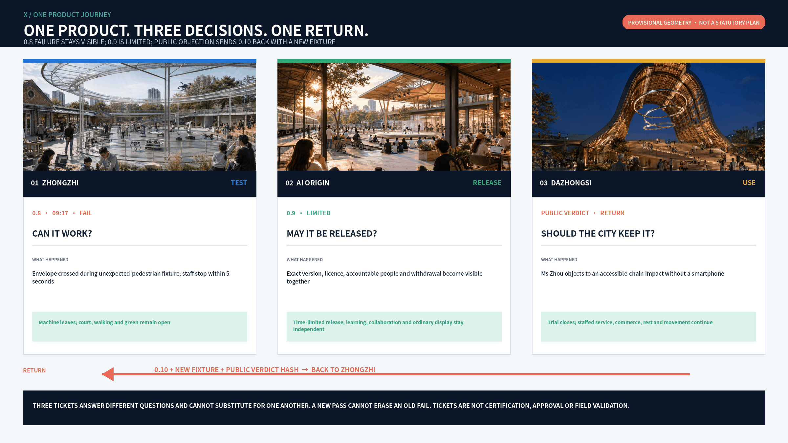
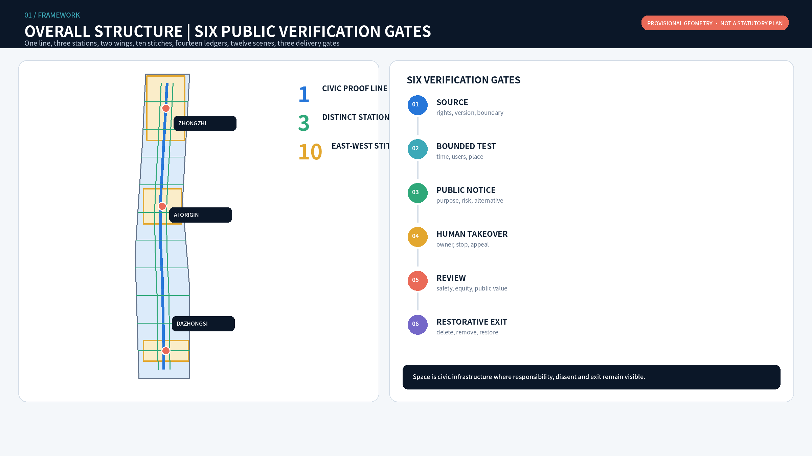
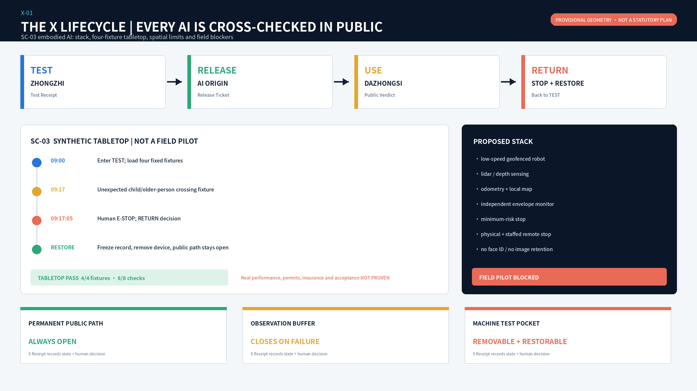
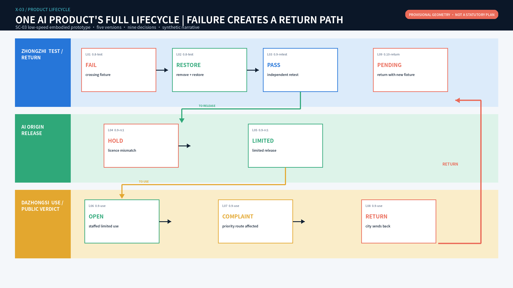
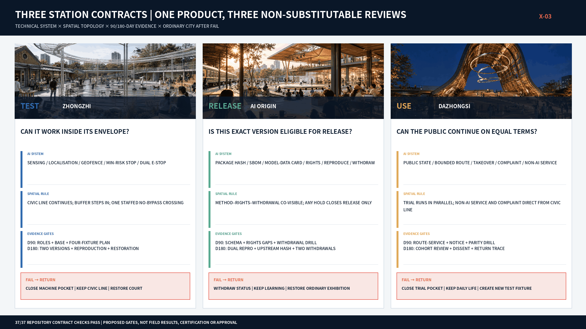

# X JINGZHANG

> The same AI product must carry the same version and a continuous evidence chain through three stations. Any failure returns the product to TEST; the city does not adapt itself around product failure. TEST → RELEASE → USE → RETURN.

## Understand it in three minutes: how one product is admitted, then returned by the city

A low-speed embodied-service prototype enters Zhongzhi as version 0.8. At 09:17 it crosses its envelope during an unexpected-pedestrian fixture; staff stop it within five seconds and the Test Receipt records FAIL. The machine leaves while the court remains open. Version 0.9 passes a new test, then exposes its exact version, licence, accountable people and withdrawal action at AI Origin before receiving a time-limited Release Ticket. During bounded use at Dazhongsi, 72-year-old Ms Zhou objects without a smartphone because equipment and a queue affect the accessible chain. The Public Verdict becomes RETURN. Trial closes, staffed service continues, and version 0.10 travels back to Zhongzhi with a new fixture. [data:visual/assets/x-lifecycle-valid-example.json] [data:visual/assets/lived-lifecycle.json]

This is X: not a logo or a chain of invisible approvals, but a public cross-check whenever a product seeks entry to the next section of city space. Technical PASS cannot substitute for rights, a Release Ticket cannot substitute for public judgment, and a new PASS cannot erase version 0.8's failure history. [data:visual/assets/verify-x-lifecycle.js] [metric:x_lifecycle_test_case_count]

| City decision | The station answers only | What the public can see | Operating ticket | How the city continues after failure |
| --- | --- | --- | --- | --- |
| Zhongzhi TEST | Can this exact version work within its declared envelope? | Test pocket, named staff, physical stop and failure record | Test Receipt | Machine leaves; court, walking and open green continue |
| AI Origin RELEASE | May this version be made public and used within limits? | Method, licence status, accountable people and withdrawal action | Release Ticket | Publication leaves; learning, collaboration and ordinary display continue |
| Dazhongsi USE | Does the public accept its continued presence in city service? | Limited trial, staffed equivalent, anonymous complaint and RETURN status | Public Verdict | Device returns; commerce, rest, staffed service and accessible chain continue |

### Why Jing-Zhang: X grows from railway operating culture

X does not paste railway vocabulary onto a generic governance system. It makes a bounded translation of four operating principles: a line is divided into sections with explicit limits; conflicting movements cannot grant themselves priority; entry to the next section requires prior conditions and human responsibility; and recovery after an abnormal condition requires human confirmation, restoration and a record. Public National Railway Administration rules support section, stop and recovery principles, but the three X tickets are not railway authorities, government approvals or product certificates. [source:NRA-TECHNICAL-RULES] [data:visual/assets/railway-operating-translation.json]

The Qinglongqiao switchback offers a more specific Jing-Zhang memory: changing direction does not erase the preceding section. X translates this into RETURN. An old FAIL cannot be overwritten by a new PASS, and a complaint or defect must create a new task that travels back to Zhongzhi. Qinglongqiao lies outside this proposal's provisional design scope; only its reliably sourced operating logic is translated, without inventing a site connection or heritage claim. [source:NRA-JINGZHANG-HISTORY] [source:BEIJING-HERITAGE-JZ]

The opened first phase of the Jing-Zhang Railway Heritage Park retains the main line, old rails, switches and Qinghuayuan Station memories while turning an approximately nine-kilometre corridor into connected public space. X therefore does not borrow railway graphics; it reverses the priority between technology and public life: **ordinary civic life is the main line, while AI innovation is a siding that needs authority and can always be returned**. The three stations become a test siding, release siding and urban-use siding. Each restores an ordinary use after closure; the main line never depends on AI being open. [source:BEIJING-JZ-PARK-PHASE1] [source:BEIJING-JZ-PARK-9KM] [depth:jingzhang_heritage_route]

### The mechanism can now reject

The lifecycle verifier is an executable state machine rather than a descriptive checklist. It checks ten states, upstream-ticket hashes, configuration fingerprints, human sign-off, rights HOLD, expiry, retesting after RETURN and immutable failure history. All 24 deterministic cases pass; 22 are paths that must be rejected for skipping, broken chains or invalid status. The station verifier now adds three non-interchangeable opening gates to civic continuity, AI closure, non-AI service, accessible independence and RETURN restoration: no bypass around Zhongzhi's controlled crossing; co-visible method-rights-withdrawal at AI Origin; and non-AI route parity with complaint at the Dazhongsi conflict point. The result is `29/29 PASS`. [data:visual/assets/x-lifecycle-test-results.json] [data:visual/assets/station-topology-results.json] [metric:station_topology_pass_count]

These PASS results prove only that repository rules, synthetic tickets and concept topology can be rerun. They do not establish field conditions, product safety, public acceptance, certification or implementation approval. SC-03 remains an explicitly labelled tabletop; a real trial remains BLOCKED without a site, operator, device, insurance and approvals. [data:visual/assets/sc03-tabletop-evidence.json]

## Coordinated Research Area: Industry and Future City Research

The first reading layer retains only TEST-RELEASE-USE-RETURN. Two wings, ten stitches, fourteen spatial ledgers, twelve scenes and three delivery gates remain in the professional layer to answer recomputation, accountable sign-off and failed exit, without substituting output quantity for an operating mechanism. [source:OFFICIAL-ANNOUNCEMENT] [source:AGENT-TASKBOOK]

At coordination scale, Beiwei Community, Future Science City, Huairou Science City, Beijing E-Town and Beijing-Tianjin-Hebei are not assumed partners but five capability interfaces to be verified. Each records a carrier space, proposed joint product, data/IP boundary and annual review measure. At overall-design scale these inputs become western R&D and industrial service, eastern community and lived feedback, a central civic line and three distinct X stations. Geometry supports concept topology and package recomputation only. Official boundaries, regulatory controls, road redlines, ownership, existing buildings, utilities, fire, heritage, operators and regional commitments remain missing; any arrival may change layers, metrics and delivery order and therefore triggers a full-chain rebuild. [data:geometry/site_boundary.geojson#SITE-001] [depth:overall_spatial_structure]

## Design Basis and Source List

The official announcement establishes tasks, textual scopes, approximate areas, and three key areas. The agent taskbook establishes three positions, five functions, the three-zone/two-wing structure, and agent.1-agent.6. Local standard snapshots constrain planning language. The overall and key-area geometries remain `provisional_constraint`; derived areas serve package consistency only. When official polygons arrive, all GeoJSON, metrics, drawings, bilingual HTML, A3/A0 files, and narrative numbers must be rebuilt as one chain. [source:BOUNDARY-SOURCE] [source:KEY-AREA-SOURCE]

Two Haidian public records provide a bounded operational baseline. The 2025 statistical bulletin records progress in the “Zhongzhi” stack and RoboOS/RoboBrain, so Zhongzhi first serves reproducible TEST rather than generic display. A district public plan states the initiation of the “Haidian AI Origin Community”, so AI Origin first serves the civic translation from method and rights to limited release. Neither source proves a candidate site, institutional partnership, product performance or operating commitment; field and accountable-party review remain required. [source:HAIDIAN-2025-STATISTICAL-BULLETIN] [source:HAIDIAN-AI-ORIGIN-PLAN]

Evidence has four uses. The announcement and taskbook support objectives and deliverables; national and ministry standards support classification and depth; international cases support mechanism comparison; provisional geometry supports topology and internal recalculation only. `sources.json` records publisher, URL, status, applicability, and non-transfer limits. `assumptions.json` retains gaps in official geometry, controls, ownership, existing buildings, utilities, fire, and heritage. No gap is filled with data from a similar project. New evidence must be registered, spatial checks rerun, and impacts recorded in `changelog.md`. [standard:MOHURD-URBAN-DESIGN-MEASURES] [standard:MNR-LAND-USE-CLASSIFICATION-GUIDE] [source:SOURCE-REGISTRY]

## Three-Level Scope Framework

| Scale | Question answered | Completed output | Boundary not crossed |
| --- | --- | --- | --- |
| Approx. 43.6 km² coordination area | How do innovation resources circulate regionally? | Five-node interface matrix, eight cases, seven-factor ecosystem | No inferred institutional commitment or performance |
| Approx. 11.4 km² overall area | How do industry, life, green space and movement connect? | 14 land-use cells, 13 concept routes, 7 green units, 15 public nodes | Not a regulatory plan, road redline or engineering alignment |
| Three key areas | Which spatial prototypes can be verified? | Three concept plans, building interfaces, scenes, sections and exit paths | No existing-building, ownership or demolition inference |

### Closing the three-position, five-function and two-wing loop

The three positions are an operating sequence rather than parallel slogans. The heritage belt holds source and memory; the urban AI experience belt holds informed use and feedback; the AI fusion belt holds bounded verification and translation. Full-stack innovation is tested at Zhongzhi Park, the world-class ecosystem is organised at AI Origin, AI+ scenes are tried along the eastern wing and civic nodes, urban vitality is made visible through active ground floors and mobility, and human-centred governance is embodied in takeover and exit interfaces. [source:AGENT-TASKBOOK]

| Regional interface | Capability input | Jingzhang interface | Joint product | Data/IP boundary | Annual measure |
| --- | --- | --- | --- | --- | --- |
| Beiwei Community | Community needs and inclusive service | Offline service nodes on the eastern wing | Non-AI equivalent service catalogue | No resident tracking or commercial profile | Issue closure and offline availability |
| Future Science City | Research platforms and enterprise trial demand | Zhongzhi verification court | Joint controlled-test brief | Project data shared only by tiered permission | Controlled tests and complete exit reviews |
| Huairou Science City | Scientific facilities and research outputs | AI Origin translation front desk | Research-to-prototype evidence ticket | Rights holder authorises results and instrument data | Research-to-prototype records |
| Beijing E-Town | Terminals and manufacturing | Dazhongsi urban trial interface | Prototype-to-small-batch referral | Design, code and supply-chain isolation | Compliant referrals and fault return time |
| Beijing-Tianjin-Hebei | Standards dialogue, talent and scene network | Annual open collaboration week | Cross-regional method comparison | No unauthorised cross-region data pool | Method sessions and talent exchanges |

### Eight cases: transfer mechanisms, not urban form

Eight primary institutional sources inform the proposal. Cambridge contributes a commercialisation front door, Helsinki contributes bounded real-city testing, and Decidim contributes open-source hybrid participation. [source:CASE-CAMBRIDGE] [source:CASE-HELSINKI] [source:CASE-DECIDIM]

AI Verify contributes neutral testing and an assurance sandbox, Seoul contributes public experience and digital inclusion, and London's Knowledge Quarter contributes cross-institution exchange. [source:CASE-AIVERIFY] [source:CASE-SEOUL] [source:CASE-KQ]

Barcelona 22@ contributes mixed innovation and public-realm renewal; Toronto Port Lands contributes resilient public realm and long-horizon phasing. [source:CASE-22AT] [source:CASE-TORONTO]

Local translation produces seven safeguards: reversible land use and an official-data trigger; three stations and active-ground-floor interfaces; four industrial verification scenes; resource bands and an exit reserve research direction rather than funding promises; a developer community and staff exchange; small edge-compute nodes with energy gates; and data permission, minimisation, expiry, deletion, and appeal. No case predicts local companies, investment, talent, or output.

## Overall Design Area: Urban Renewal and Regulatory-Plan-Level Urban Design

### Overall space: seven bands and two ledger wings

The provisional overall area is divided into seven north-south bands and two east-west wings, producing fourteen concept cells without intentional gaps or overlaps. The western wing supports R&D, professional services, IP and industrial translation. The eastern wing supports community services, talent life, culture, education, and real-use feedback. The civic verification spine belongs to no single campus. The southern gateway handles arrival and culture, Dazhongsi handles intelligent industry and public trial, the middle bands handle research translation, AI Origin handles open collaboration and talent life, and the northern bands handle full-stack verification, low carbon, and strategic reserve. [data:geometry/land_use.geojson#LU-01-W] [metric:land_use_feature_count]

The rail civic spine, east-west stitches, adaptive building interfaces, blue-green walking loop and three station anchors in the aerial point back to `roads.geojson`, `buildings.geojson`, `green_space.geojson` and `public_space.geojson`. The images explain intent rather than replace plan evidence. [data:geometry/roads.geojson#ROAD-SPINE] [depth:overall_spatial_structure]

Conceptual building interfaces are not an existing-building inventory. Courtyards, active ground floors, and traversable edges test spatial relationships through three priorities: adaptive retention, ground-floor retrofit, and reversible light additions. Demolition, construction, intensity, and height await survey, ownership, structure, regulatory, heritage, fire, and utility evidence. [data:geometry/buildings.geojson#BLDG-101] [metric:conceptual_building_interface_count]

The fourteen cells are independent design decisions, not repeated names applied to coloured zones. Each record stores a spatial move, proposed operating role, acceptance evidence, stop condition and restoration action. Full fields are in `visual/assets/review-evidence.json#spatial_ledgers`. This allows each spatial ledger to be signed off independently instead of using overall area and generic ratios as substitutes for delivery evidence.

| Ledger | Lead function | Primary spatial move | Acceptance before opening | Civic use retained after failure |
| --- | --- | --- | --- | --- |
| 01W / 01E South Gateway | Railway provenance / equivalent arrival | Verification desk, staffed window, tactile map | 100% source traceability; offline service available | Arrival, walking and rest |
| 02W / 02E Dazhongsi | Device trial / transit and consumption | Separate trial, appeal and non-AI service | Four rights channels complete; resident route uninterrupted | Ordinary retail and staffed service |
| 03W / 03E Jimeng | Professional service / community feedback | Compliance front desk and civic problem table | Responsibility and deadlines complete; dissent traceable | Ordinary office and offline deliberation |
| 04W / 04E Campus Link | Research translation / talent life | Open ground floor and quiet courts | Licence and retest complete; night boundary passes | Learning, living and non-commercial stay |
| 05W / 05E AI Origin | Open interoperability / civic collaboration | Release desk, continuous ground floor and two stitches | Reproducibility, licence and public access pass | Collaboration, exhibition and ordinary courts |
| 06W / 06E North Segment | Edge facilities / Xiaoyue ecology | Degradable loads and accessible green route | Energy, noise and route breaks recorded | Logistics and safe passage |
| 07W / 07E Zhongzhi | Model assurance / embodied test | Staffed test loop, separate public route and restoration belt | Legal operator, safety approval, stop and restoration drills pass | Ordinary courts and open green space |

## Land Use, Building Scale, and Retain-Renovate-Demolish Strategy

Fourteen concept land-use cells express functional relationships rather than statutory controls. Sixty building interfaces compare adaptive retention, ground-floor retrofit, and reversible light additions; they are not an existing-building survey, demolition decision, floor-area schedule, or development intensity. FAR, height, gross floor area, and ownership remain `unknown` until official controls and existing-condition evidence trigger a rebuild. [data:geometry/land_use.geojson#LU-01-W] [data:geometry/buildings.geojson#BLDG-101] [metric:conceptual_building_interface_count]

Retention applies only after structure and rights are verified and where public-facing adaptation is feasible. Retrofit requires accessibility, fire, energy, and traversability review. Addition means removable low-impact test infrastructure, not permanent construction. Demolition is not predicted and can enter comparison only after survey, structural, heritage, ownership, and statutory procedures. Footprint area checks layer consistency and does not derive gross floor area. Standard land-use codes and separate design-role fields prevent concept functions from being presented as statutory zoning. [standard:MNR-LAND-USE-CLASSIFICATION-GUIDE] [standard:MOHURD-CONTROL-DETAILED-PLANNING] [metric:building_footprint_area_sqm]

## Detailed Design of Key Areas

The three key areas share one evidence template but use distinct prototypes: Zhongzhi tests higher-risk technology, AI Origin handles rights disclosure and translation, and Dazhongsi supports informed public trial. Each checks concept geometry, building interfaces, public realm, scene nodes, human takeover, restorative exit, and dependencies. The polygons remain `provisional_constraint` and cannot support precise area, demolition quantity, or engineering-interface claims. [data:geometry/key_areas.geojson#PROV-KEY-001] [depth:three_key_area_detailed_design] [metric:conceptual_building_interface_count]

### 6.1 Zhongzhi Park: controlled verification court

Zhongzhi Park combines R&D courts, a red-team garden, an embodied-AI test field, and a Qinghe restoration edge. Green buffers, low-speed interfaces, and staffed takeover points separate testing from public walking. Failure triggers equipment removal, data freeze, enclosure removal, and return to ordinary use. Public displays show methods, failures, and safety boundaries rather than attack details or unauthorised enterprise material. Official boundary, flood, traffic, safety, noise, energy, and operating responsibility are prerequisites.

The first stage builds one machine test pocket with one controlled connection. It combines staff presence, physical stop and public priority; removing that node leaves no bypass from machine movement to the public edge. If formal design cannot create this relation, TEST does not open rather than making people detour. [data:visual/assets/station-topology.json#ZHONGZHI_TEST]

### 6.2 AI Origin: open-source translation block

AI Origin combines a disclosure front desk, open collaboration ground floors, talent courtyards, and public problem tables. University outputs record rights, evidence level, and applicability before entering the city. Night collaboration and quiet residential edges are separated. Two east-west stitches connect campus, park, and neighbourhood. Disputed projects cannot enter the honour display, and withdrawn contributions are removed within the stated period.

The first-stage release interface is a two-sided frontage. One side exposes method, version and scope; the other exposes licence, responsibility and withdrawal. The end connects directly to a studio that returns to ordinary learning after closure. These actions cannot be hidden in separate back offices. If publication is visible but withdrawal is not, RELEASE does not open. [data:visual/assets/station-topology.json#AI_ORIGIN_RELEASE]

### 6.3 Dazhongsi: urban trial interface

Dazhongsi combines a transit arrival hall, intelligent-device trial street, data-rights salon, and international demo lounge. Four-quadrant pedestrian connection remains a concept target pending transit, road, and utility evidence. People test products with clear notice, staffed service, and a non-AI channel. Trial does not mean purchase, certification, or permanent data capture.

The first stage places optional trial and ordinary city service at the same start. Staffed non-AI service connects directly to the civic spine and cannot require more topology steps than AI use. A complaint point touches both the civic spine and trial pocket, so objection can trigger RETURN without entering the product interface. If equivalence is longer, requires a scan, or hides complaint backstage, USE does not open. [data:visual/assets/station-topology.json#DAZHONGSI_USE]

The images describe three kinds of ordinary city life, not three AI showrooms. Zhongzhi is first a traversable test court, AI Origin an open place to learn and collaborate, and Dazhongsi an urban room for arrival, rest and staffed service. AI equipment occupies only a closable local area; ordinary use does not require the public to keep watching technology.

The station atlas aligns plan, civic section, operating programme and failed restoration on one review surface. Zhongzhi uses a staffed controlled loop to protect the public route; AI Origin uses a continuous ground floor and public problem table to connect release, collaboration and rights disclosure; Dazhongsi uses an arrival cross and circular hall to separate trial, appeal and non-AI service. These are not one generic grid with different labels, and civic space must remain useful after equipment exits. [data:geometry/buildings.geojson#BLDG-101] [data:geometry/public_space.geojson#LANDMARK-01] [depth:three_key_area_detailed_design]

The three key areas use distinct first-stage delivery packages instead of waiting for every engineering condition before acting. Full fields are in `visual/assets/review-evidence.json#station_delivery_packages`.

| Key area | Unresolved condition | First stage only | Proposed acceptance | Does not yet enter |
| --- | --- | --- | --- | --- |
| Zhongzhi | Test/public boundary, energy, noise and demobilisation are unverified | Boundary signs, takeover points, removable enclosure and restoration drill | No uncontrolled path crossing; physical stop and restoration drill pass | Permanent test facilities and utility connection |
| AI Origin | Release, public access, night work and residential quiet lack one interface | Release desk, civic problem table and two stitch markers | Rights ticket complete; public and resident routes uninterrupted | Permanent ground-floor works and additions |
| Dazhongsi | Transit arrival, trial, retail and rights service require separation | Temporary trial, staffed desk and surface wayfinding | Notice, staff, appeal and non-AI entries operate together | Permanent station-city and vertical works |

## Transport, Rail, Municipal Infrastructure, and Public Services

One north-south civic verification spine, ten east-west stitches, and two wing service routes form the concept network. Walking and cycling lead on the spine. Embodied devices operate only within key areas, limited times, low speeds, and staffed takeover routes. Each stitch needs field review of traffic, accessibility, underpass conditions, and ownership. `ROAD-SPINE` and `ROAD-X01`-`ROAD-X10` are concept centrelines, not rail or road redlines. [data:geometry/roads.geojson#ROAD-SPINE] [metric:east_west_stitch_count]

Reliable municipal evidence is unavailable. Energy, drainage, flood, fire, communications, and equipment connections therefore remain design-development prerequisites; no capacity, pipe alignment, or engineering interface is inferred. Public service uses a staffed desk, non-digital channel, and continuous accessible route as its equivalence floor.

## Blue-Green Network, Public Space, and Urban Character

Three sections make boundaries explicit. The everyday green section retains walking, cycling, rain gardens, quiet zones, and active ground floors. The controlled-test section adds a low-speed device lane, physical emergency stop, and observer zone. The urban-trial section adds staffed service, a non-digital channel, and removable display edges. Green and public-space ratios are provisional internal checks, not statutory controls. [metric:green_ratio] [metric:public_space_ratio]

Urban character comes from rail traces, rain planting, durable paving, reversible structures, and active ground floors rather than screens or device clutter. Everyday green space remains complete for shade, rest, children, older adults, and accessible movement after equipment leaves. Controlled test areas use boundaries, speed, noise, light, and physical stops; urban-trial areas protect choice with staff and a non-AI route. Heat, storm, lighting failure, or accessibility interruption closes technical operation while keeping safe passage. Official greenline, water, flood, tree, and sponge-city evidence triggers ecological and engineering review and full ratio recalculation. [standard:MOHURD-URBAN-DESIGN-MEASURES] [data:geometry/green_space.geojson#GREEN-001] [data:geometry/public_space.geojson#PUBLIC-SPINE]

The three east-west stitch sections share one public route that cannot be interrupted, while the controlled event layer can close independently after an incident, extreme weather, accessibility failure or permit lapse. Field accessibility audit, non-AI equivalent service, night-safety review, human-takeover drill and failed restoration form the continuity acceptance chain. Technical functions do not open while any link remains unresolved. [standard:MOHURD-URBAN-DESIGN-MEASURES] [data:geometry/roads.geojson#ROAD-X01] [metric:east_west_stitch_count]

### agent.5 Centennial X Jing-Zhang Cultural Route: 1909-2026-2126

The cultural route is not a scatter of QR codes. It is one continuous six-stop, three-era public journey along `ROAD-SPINE`. South Gateway explains autonomous railway engineering in 1909; Dazhongsi X Station translates arrival into present-day rights of use; Jimen Stitch shows how the railway can reconnect neighbourhoods; AI Origin X Station discloses versions, licences and release responsibility in 2026; Xiaoyue River reads infrastructure memory together with climate adaptation; Zhongzhi X Station asks how urban technology should be tested and retired by 2126. Every stop provides an onsite panel, paper foldout, tactile abstract and staffed interpretation. AI may retrieve and organise only cleared source material; it cannot invent historical claims. [data:visual/assets/x-cultural-route.json] [metric:cultural_route_stop_count] [metric:cultural_narrative_era_count]

Each published item records source, rights, version and human historical reviewer. Untraceable material stays out; disputed material displays its evidence status. Targets are 100% static-alternative availability and 100% source traceability for published content, while route continuity, stop locations and accessibility remain pending official geometry and field audit. AI improves retrieval without replacing human judgment over urban memory.

## AI Innovation Ecosystem, Personas, and AI+ Scenarios

| Scene | Type and anchor | Accountable / consulted | Data boundary | Human takeover and SLA | KPI, stop and restoration |
| --- | --- | --- | --- | --- | --- |
| SC-01 Model Assurance Court | Industry test, Zhongzhi | Platform / red team, legal | Authorised test sets, model version, risk log | Safety lead approves; severe incident stops in 15 min | Defect closure; unauthorised access or irreproducibility freezes logs and removes test |
| SC-02 Edge Compute Energy Bench | Industry test, Zhongzhi | Facility operator / energy, safety | Power, temperature, anonymous load; no task content | Engineer takes over within 30 min | Energy per task; heat, noise or uncertain supply stops operation |
| SC-03 Embodied AI Controlled Field | Industry test, Zhongzhi | Test-field operator / traffic, safety, community | Device telemetry and incidents; no face recognition | Physical stop under 5 sec; staffed whenever open | Takeover success; boundary breach, collision or unresolved complaint restores ordinary use |
| SC-04 Interoperability Bench | Industry test, AI Origin | Open-source community / third-party tester, rights holder | Interface versions and success; no private code upload | Dual review before release; dispute response in 2 days | Reproducibility; two failed rounds or lock-in risk removes display |
| SC-05 Open-source Release Hall | Ecosystem, AI Origin | Translation platform / community | Licensed metadata and licences | Rights check before release; withdrawal in 5 days | Clearance rate; rights, privacy or accessibility failure withdraws project |
| SC-06 Data Rights Salon | Service, Dazhongsi | Compliance service / legal, rights holder | Authorised catalogue only | Unclear rights transfer to a person; no transaction ruling | Rights completeness; unclear source or excessive use stops service |
| SC-07 Accessible Route Station | Civic service, spine | Park operator / transport, disability representatives | Facility state, segment flow, voluntary feedback | Human field audit before advice; unsafe advice removed at once | Continuous access; safety conflict falls back to paper and staff |
| SC-08 Community Translation Desk | Civic service, east wing | Service centre / translator, case worker | On-device text, no default retention or ID originals | Rights-impacting content goes to staff; wait under 15 min | Correction rate; rights-impacting error stops AI answer |
| SC-09 Railway Engineering Memory | Culture, spine | Cultural operator / historian | Cleared records and versions | Expert check before publication; dispute marked in 7 days | Traceability; unknown source removes exhibit |
| SC-10 Low-carbon Maintenance Station | Governance, green spine | Park/utility operator / engineer | Asset ID and environmental status, no personal data | People decide work orders; urgent response in 30 min | False alerts and closure time; repeated misrouting returns to manual inspection |
| SC-11 Co-governed Night Safety | Civic service, AI Origin | Public-space operator / community, security | Non-identifying heat and human reports | Person confirms every alert; immediate response to incidents | False alert and complaint rate; tracking or glare removes equipment |
| SC-12 Global Open Collaboration Week | Operations, full line | Annual committee / venue, rights, accessibility | Event plan, consented registration, aggregate feedback | Staffed sessions; complaint response in 2 hours | Joint tasks and issue closure; permit, safety or rights gap cancels the unit |

### SC-03 hero scene: how the city sends a robot back

SC-03 now uses an executable X Receipt instead of a generic embodied-AI label. Its proposed stack is a low-speed geofenced robot, lidar/depth sensing, odometry and local map, independent envelope monitoring, minimum-risk stop, and physical plus staffed remote emergency stops. Perception identifies movement classes such as person and wheelchair without face recognition; images are not retained and the system cannot expand its own operating envelope. Machine test pocket, observation buffer and permanent public path are spatially separated. Failure closes only the first two; the public route stays open. [data:visual/assets/x-receipt.schema.json] [data:visual/assets/x-lifecycle-valid-example.json]

This submission actually ran a **synthetic tabletop exercise**, not a field pilot. At 09:00 the robot entered TEST at Zhongzhi; at 09:17 an unexpected child/older-person crossing fixture fired; by 09:17:05 a human stop triggered RETURN; event records froze, equipment left, the ordinary court was restored, and the case returned to TEST. Ordinary pedestrian, wheelchair priority, unexpected crossing, and network/planner unavailable fixtures all behaved as specified: `4/4 fixtures` and `8/8 checks`. A field pilot remains `BLOCKED` until place, operator, platform parameters, insurance and approvals exist. [data:visual/assets/sc03-tabletop-evidence.json] [metric:sc03_tabletop_rehearsal_count] [metric:sc03_synthetic_fixture_count]

### How one AI product crosses three stations: from 0.8 failure to 0.10 return

To make X more than a brand, one low-speed embodied-service prototype travels through all three stations. The sequence below is a synthetic operating narrative governed by fixed rules; it is not evidence of a real product, company, venue or approval. Only one version is valid at any moment. Every handover carries the upstream ticket hash, and a change in version, scene or rights state invalidates downstream tickets. The city therefore encounters not a vague “robot project” but a decision chain that can be paused, questioned and reversed. [data:visual/assets/lived-lifecycle.json] [metric:product_lifecycle_event_count]

| Event | Place and version | What happens | Human decision | Spatial consequence | Evidence retained |
| --- | --- | --- | --- | --- | --- |
| L01 first test | Zhongzhi, 0.8-test | Unexpected-crossing fixture fires; the prototype cannot yield reliably within its declared time | Safety lead decides FAIL | Machine pocket and observation buffer close; public path stays open | Fixture, stop source, response time and unresolved defect |
| L02 restoration | Zhongzhi, 0.8-test | Device powers down and leaves; telemetry freezes; removable boundary is recovered | Site lead signs RESTORE | Test court returns to ordinary court, seating and green | Demobilisation image position, component inventory and ordinary-state check |
| L03 independent retest | Zhongzhi, 0.9-retest | Four fixed fixtures plus lost-link and localisation-uncertainty fixtures are repeated | Independent safety reviewer signs PASS | Machine pocket reopens only for the retest | Test Receipt with version, fixtures and human sign-off |
| L04 release hold | AI Origin, 0.9-rc1 | One software licence does not map fully to the tested version | Rights reviewer signs HOLD | Release indicator stays off; display becomes an ordinary methods lesson | Rights gap, named follow-up role and deadline |
| L05 limited release | AI Origin, 0.9-rc1 | Licence chain, component bill, limitations and withdrawal owner close | Release steward signs LIMITED | Contribution ring displays limited use, never certification or recommendation | Release Ticket and Test Receipt hash |
| L06 public use | Dazhongsi, 0.9-limited-use | Staff, three-level notice and non-AI channel are present together | Public-service lead signs OPEN | Device enters only the removable trial pocket; civic path remains unchanged | Opening check, duty roster and notice-comprehension sample |
| L07 public objection | Dazhongsi, 0.9-limited-use | Device, queue or observers interfere with wheelchair-priority movement | Staff record COMPLAINT | Device immediately HOLDS; accessible crossing clears first | Anonymous complaint ticket, response clock and affected cohort |
| L08 city return | Dazhongsi, 0.9-limited-use | Position adjustment cannot resolve the route conflict on site | User and accessibility reviewers sign RETURN | Trial pocket closes; paper and staffed services continue | Public Verdict, restoration check and revision requirement |
| L09 return to origin | Zhongzhi, 0.10-return | New version and new route-occupation fixture return to controlled testing | State becomes PENDING | It cannot return to AI Origin or Dazhongsi before retest | New test brief linked to all three previous tickets |

The value of this chain is not eventual approval. It lets the product fail at L01, L04 and L08, with different consequences. Technical failure returns to testing; rights failure blocks release; public-use failure changes both control logic and spatial layout. No one can use a later version to erase an earlier failure, use a Zhongzhi technical PASS in place of an AI Origin rights decision, or use either in place of Dazhongsi public judgment. The three stations are therefore not an exhibition tour but a relay between three distinct forms of civic authority.

### Three-station handover: three tickets, not three seals

Each station asks a different question, requires different signatories and rejects for different reasons. A Test Receipt says only whether one exact version completed declared fixtures inside an exact envelope. A Release Ticket says only whether that version's licences, data rights, software composition, limits and withdrawal duty permit limited release. A Public Verdict says only whether the city wishes limited use to continue when staff, a non-AI equivalent and real objections are present. None is a government approval, product certification or permanent passport. All three expire, are scoped and can be actively withdrawn.

| Ticket | Required fields | Proposed signatories | Explicitly does not prove | Destination after refusal |
| --- | --- | --- | --- | --- |
| Test Receipt | Product and model version, fixed fixtures, test envelope, human stop, unresolved defects, raw-record hash | Candidate operator + independent safety reviewer | Rights clearance, public acceptance, procurement value or safety in every context | Revise at Zhongzhi and restore test space |
| Release Ticket | Test Receipt hash, software/model/data bill, licences, use term, public limits and withdrawal owner | Rights reviewer + release steward | Government endorsement, commercial recommendation, field usability or long-term operation | HOLD at AI Origin; no public trial |
| Public Verdict | Release Ticket hash, notice comprehension, non-AI equivalent, complaints, cohort gaps and continue/revise/return decision | Public-service lead + user/accessibility reviewer | Universal satisfaction, permanent deployment or automatic validity for later versions | Close trial pocket and return to Zhongzhi or AI Origin |

Handover occurs on visible civic interfaces. Zhongzhi's test handover table shows only version, envelope, fixtures and unresolved issues. AI Origin uses paired release tables: one for reproducible methods and one for licences, limits and withdrawal. Dazhongsi's public-verdict table keeps continue, revise and stop states in the same sightline as staffed appeal and paper service. When a ticket expires, its light and mark disappear and the place returns to ordinary learning, rest or movement, so an obsolete exhibit cannot acquire de facto endorsement. [metric:handover_ticket_type_count]

The minimum chain is upstream hash, current version, human sign-off and expiry. If 0.9-retest becomes 0.9-rc1 at AI Origin, the release steward explains the change and decides whether retesting is necessary. If Dazhongsi changes route, speed or sensing range, the Release Ticket does not automatically cover the new condition. If a complaint reveals use absent from test fixtures, the Public Verdict creates a RETURN task rather than merely promising to “improve experience”. This gives the handover a custody chain and lets failure rewrite the upstream test brief. [data:visual/assets/lived-lifecycle.json] [metric:ticket_hash_chain_target_percent]

These rules are implemented in `visual/assets/verify-x-lifecycle.js`, not left as prose. The state machine rejects skipped TEST, ticket-type substitution, configuration changes under an old ticket, broken hashes, missing human sign-off, incomplete rights, expiry, continued USE after RETURN, and RELEASE without retesting. A complaint-triggered RETURN must create a new test or review task. The fixed suite contains 24 cases: 22 expected rejections and two expected acceptances, currently `24/24 PASS`. PASS here means only that the validator accepted or rejected its declared fixture correctly. [data:visual/assets/verify-x-lifecycle.js] [data:visual/assets/x-lifecycle-test-results.json]

### Minimum pilot: fourteen days answer one question

The minimum pilot does not seek event scale. It asks whether one declared version can pass three stations for one limited public use and restore ordinary space after failure. The proposed maximum is one specified device, one machine test pocket and one continuously open accessible public bypass. Exact dimensions, distance, speed and participation await official geometry, field measurement, hazard analysis and approval; the concept cannot pre-fill them. Without a candidate operator, insurance, safety duty, accessibility review and restoration resources, the fourteen-day clock does not begin.

The pilot first assembles a four-part main-line / siding / turnout / return-pocket kit rather than procuring permanent infrastructure. The civic main line uses static wayfinding, movable seating and staffed service and remains useful after power-down or demobilisation. The AI siding uses removable edges, a device bay and independent power isolation. The accountability turnout combines a staffed sign-off table, a visible physical stop action and a paper status board. The return pocket holds equipment, a component inventory and a restoration checklist, then recovers as an ordinary court, classroom, resting place or commercial frontage. Dimensions, materials, fire, structural, access and MEP conditions remain pending field and professional review. [metric:reversible_pilot_kit_type_count]

| Minimum spatial kit | Ordinary state | AI-running state | HOLD / RETURN action | Opening responsibility |
| --- | --- | --- | --- | --- |
| Civic main line | Continuous passage, rest and staffed service | Main chain does not change | Remains open; devices and queues clear | Accessibility and public-service steward |
| AI siding | Court, learning, rest or commercial frontage | Holds one exact version and bounded fixture | Isolate power, close and remove | Device and site-safety steward |
| Human accountability turnout | Ordinary service table | Checks upstream ticket, version, owner and expiry | No sign-off means HOLD | Station signatory |
| Return pocket | Recoverable civic use | Temporary device and removable kit standby | Isolate, inventory and issue retest task | Demobilisation and restoration lead |

Each opening shift assigns four responsibilities: site lead; safety observation and stop; accessibility/staffed service; and station-ticket review. Qualified people may combine roles where competence and independence permit, but no responsibility may be vacant. If any role is absent, the turnout cannot point toward the AI siding. This is a candidate operating arrangement, not a claim that an existing institution has committed. [metric:minimum_pilot_shift_role_count]

| Time | Required action | Passing evidence | Blocking condition |
| --- | --- | --- | --- |
| D-30 | Name candidate operator, venue, insurance, safety and accessibility roles | Responsibility register with signable fields | Any duty has no owner |
| D-7 | Complete field walk, notice-comprehension test and ordinary-state restoration drill | Breakpoint map, notice result and restoration list | Accessible main chain breaks or restoration fails |
| D0 | Repeat four synthetic fixtures and freeze X Receipt version | Reproducible tabletop record | Fixture, version or script mismatch |
| D1-D3 | Closed testing with no public user inside the machine pocket | Duty, stop, boundary and incident records | Boundary breach, lost link or takeover failure |
| D4 | Independent retest and Test Receipt decision | Dual sign-off and unresolved-defect list | Irreproducibility or concealed defect |
| D5-D7 | Review rights, version, limits and withdrawal route | Candidate Release Ticket | Unclear rights, version mismatch or absent withdrawal owner |
| D8-D12 | Limited staffed public use with non-AI service open | Opening check, complaint tickets and service log | Absent staff, broken alternative or serious objection |
| D13 | Publish de-identified issues, cohort gaps and restoration evidence | Public issue register | Missing incident, complaint or disparity |
| D14 | Decide continue, revise or RETURN | Public Verdict | Event closure cannot substitute for a decision |

Day fourteen never grants automatic renewal. PASS only lets the same version, envelope and purpose enter another time-limited review. HOLD keeps the accountability turnout aligned with the civic main line. RETURN closes the siding, sends the device back and creates a new task. RESTORE ends only after component inventory, ordinary-use recovery and accessible-main-line review. A field pilot must prove more than the tabletop's `4/4`: duty presence, public comprehension, real stop performance, whether complaints alter decisions, and whether the place remains useful after demobilisation. [metric:minimum_pilot_duration_days]

### Three failures: technical, rights and public use

**F-TECH-01 technical failure.** At Zhongzhi, localisation uncertainty exceeds the tolerance declared in the test brief. Independent envelope monitoring first issues HOLD; the on-duty safety lead executes the physical or remote stop. The machine pocket and observation buffer close while the permanent public path stays open. Event telemetry freezes, but the no-image-retention rule remains; an incident does not license expanded collection. After removal, the court returns to seating, walking and open green. A new Test Receipt requires an independent repetition of lost-localisation, minimum-risk-stop and takeover fixtures on the same hardware, software and map versions.

**F-RIGHTS-01 rights failure.** At AI Origin, release staff find that a software licence has expired or cannot be tied to the exact Zhongzhi hash. The technical PASS remains historically valid, but release becomes HOLD. The contribution ring removes “available for trial”; its table becomes an ordinary methods class. Distribution freezes while audit records remain, and disputed code or data are not exposed. The rights reviewer records the gap, owner and deadline. Only a closed licence, component bill, version hash and withdrawal duty can support a new Release Ticket; company assurance or a live demonstration cannot replace clearance.

**F-PUBLIC-01 public-use failure.** The device does not collide, but its queue, observers or parking obstruct the wheelchair-priority route, or the staffed alternative disappears. Dazhongsi's public-service lead first stops the device, clears the crossing and switches to paper and staffed service without waiting for an algorithmic ruling. A person may complain anonymously and receive a paper receipt within the five-minute target; a de-identified event enters the public register. Return to use requires a user-led route test and two review cycles without a material cohort gap. Until then, ordinary accessible movement and staffed service remain, and the product returns to Zhongzhi. “Users are unfamiliar with technology” is not an acceptable failure explanation. [metric:failure_case_count]

The three failures cause three spatial actions: technical failure contracts the machine envelope, rights failure withdraws the release interface, and public failure restores ordinary movement and human service. The common rule is that the public does not pay for product failure through detours, delay or extra data. Failure and success appear together without ranking people. Every RETURN answers five questions: who stopped it, what closed, what stayed open, how records were handled, and what is required to come back. [data:visual/assets/lived-lifecycle.json]

### Why AI makes the three places physically different

Without X, the three key areas could collapse into a laboratory, launch hall and experience shop. Each X station must reveal a civic main line independent of AI, a closable AI siding and a human-accountability turnout, but the three cannot copy one layout. Zhongzhi is a **test siding**: its permanent public path stays continuous at the outside, an observation buffer separates it from the machine pocket, and a controlled crossing is the only inner connection. Stop, envelope, version and accountable person are visible before entry. After FAIL, the pocket returns to an ordinary court and open green.

AI Origin is a **release siding**: methods table, rights table and withdrawal interface join the ground-floor civic main line in sequence. Learning and collaboration belong to the main line, so a rights failure withdraws the product without closing either. Dazhongsi is an **urban-use siding**: its limited trial pocket runs parallel to staffed/non-AI service; people reach commerce, rest and transport without crossing it, and staff clear devices and queues without closing the main line. The three sidings absorb technical, rights and public-use failures respectively. Removable edges, replaceable status, parallel service and permanent movement are therefore the spatial conditions for RETURN, not visual motifs.

The three station plans are encoded as nodes, links, AI dependency, accessibility, independent closure and ordinary RETURN uses, without invented dimensions. The verifier closes every AI node and checks civic continuity, pocket isolation, non-AI service, accessibility independence and distinct graphs, then checks Zhongzhi no-bypass access, co-visible withdrawal at AI Origin and non-AI route parity at Dazhongsi. The historical first run rejected AI Origin at `22/23` for missing recovery use; after repair and station-specific checks the current result is `29/29 PASS`. This remains professional appendix evidence, not a field claim or first-layer value proposition. [data:visual/assets/station-topology.json] [data:visual/assets/station-topology-results.json]

Every scene uses the same RACI floor: an operator is accountable, a professional group approves, users and communities are consulted, and the public is informed. AI is never the accountable actor. Resources use S (existing space and staff), M (removable components and specialist service), and L (engineering or long-term operation requiring a separate case). SC-01-SC-04 are industrial test and validation scenes. [metric:scenario_card_count] [metric:industry_validation_scenario_count]

The twelve scenes no longer receive equal emphasis. One low-speed embodied-AI product in SC-03 becomes the flagship chain through all three stations, supported by SC-01 technical red-teaming, SC-05 open release and SC-10 public service. The other scenes remain registered reserves. Three station contracts align the AI boundary, spatial topology, human sign-off, 90/180-day evidence and failed restoration on one review surface. [data:visual/assets/three-station-flagship-contracts.json]

### Three flagship contracts: one product, three non-substitutable reviews

| Station contract | AI system and data boundary | Required spatial operation | 90 / 180-day evidence gate | What the city retains after FAIL |
| --- | --- | --- | --- | --- |
| **Zhongzhi TEST**: can it work inside its envelope? | LiDAR/depth sensing, localisation and local map, geofence, minimum-risk stop, physical/remote stop and versioned event log; authorised fixtures, telemetry and events only, with no face identity or persistent person track | Civic main line stays continuous at the edge; observation buffer and machine pocket step inward; machines enter only through one staffed no-bypass crossing | Day 90 first requires candidate roles, field base, civic-route audit, insurance/permission gaps and a four-fixture plan; day 180 then tests two versioned cycles, independent reproduction, severe finding closure and restoration | Close the machine pocket while the civic line remains open; restore an ordinary court and open green after equipment leaves |
| **AI Origin RELEASE**: is this exact version eligible for publication? | Exact package hash, SBOM, model/data card, licence inventory, reproduction runner and withdrawal register; predecessor hash, version and rights metadata only, not undisclosed private code | Method, rights and withdrawal tables share one ground-floor field of view; HOLD at any table closes release while learning and collaboration continue | Day 90 requires roles, hash/dependency schema, licence gaps, reproduction and withdrawal drills; day 180 then tests dual reproduction, upstream hashes, dispute handling and two withdrawal records | Withdraw product status and release interface while methods learning, collaboration and ordinary exhibition remain |
| **Dazhongsi USE**: can the public continue on equal terms? | Public status, bounded route, staffed takeover, anonymous complaint, non-AI service state and RETURN task generator; no default identity, face or commercial-behaviour profile | Trial pocket runs parallel to the civic chain; non-AI service and complaint are directly reachable; retail, rest and staffed service survive equipment removal | Day 90 requires route/service audit, notice comprehension, non-AI parity and complaint/restoration drills; day 180 then tests two cohort reviews, accessible parity, staffed service, dissent closure and return trace | Close the trial pocket while the civic chain remains open; create a new Zhongzhi fixture and restore the ordinary square |

Both gates are **proposed acceptance thresholds, not achieved performance**. Candidate organisations, field dimensions, budgets, insurance, permissions and public acceptance remain unconfirmed. A rerunnable script checks each contract against the existing topology, scenes and JZ-06-JZ-08 projects; the current repository result is `37/37 PASS`. This proves contract consistency only, not field, safety, accessibility, certification or approval. [data:visual/assets/three-station-flagship-contract-results.json]

### Identity, three landmarks and eight components

The original mark combines two crossing tracks, a human-review node and an open extension path. Blue and green tracks form a clear `X` for the three crossings of heritage and renewal, research and public life, and trial and human judgment. The central node makes consequential decisions reviewable by people; the unclosed gold path allows revision, extension or exit. Colours are evidence blue, civic green, human-judgment gold, warning coral, and night ink. The mark must not imply endorsement beside enterprise logos or enter uncleared merchandise and permanent signage.

Three removable, low-glare, non-advertising landmarks are the Rail Evidence Gate at Zhongzhi, Open Contribution Ring at AI Origin, and Urban Trial Beacon at Dazhongsi. Eight components are source sign, test sign, staffed desk, offline service panel, movable seat, low-glare light, rain-garden sensor plinth, and tactile map. The contribution wall records verifiable public contributions, failures, and exits; it does not create a personal prestige ranking. [metric:pilgrimage_landmark_count] [metric:public_component_count]

The executable VI standard fixes mark construction, minimum clearspace, minimum digital size, five functional colours, type hierarchy and three levels of public information. Every application shows scene status, rights information and staffed/non-AI action entry together. Mimicking an official seal, implying enterprise endorsement, permanent advertising and hiding pause or exit status are prohibited. Identity therefore becomes a consistent public interface for responsibility and choice rather than decoration. [source:AGENT-TASKBOOK] [metric:public_component_count]

### Inclusion: equal service without an application

#### Ms Zhou's morning: stopping urban AI without a smartphone

Ms Zhou is a 72-year-old composite persona used to test the proposal, not a real resident. She walks slowly, needs a continuous step-free route and places to sit, does not use a smartphone for public services, and does not wish to tell a machine about herself. The design succeeds not when she learns AI but when she reaches her destination and receives equal service without it, then changes a real decision when technology affects her movement. [data:visual/assets/lived-lifecycle.json] [metric:lived_journey_step_count]

**08:10, Dazhongsi arrival edge.** The first interface is not a download prompt. It is a staffed desk, paper route and three parallel states: ordinary passage, limited trial and paused/withdrawn. Staff ask for neither account, phone number nor face data, only destination and whether a step-free route is needed. The foldout uses the same colours and numbers as ground wayfinding and remains legible when digital systems fail. Choosing paper neither lowers queue priority nor creates a “low digital ability” profile.

**08:25, urban-trial threshold.** Three-level notice first says what is being tested, then what event data may be recorded and for how long, then shows staffed help, non-AI route, anonymous complaint and immediate exit. She need not understand the model; she needs to know where the device moves, who is on duty and how to continue without participating. She remains on the civic chain while the trial pocket sits to one side. Queue and observers cannot cross the tactile boundary. Dimensions are future acceptance items, not built facts inferred from a concept drawing.

**08:42, accessible-priority crossing.** A limited-use prototype approaches. It should HOLD and yield, but observers reduce usable clearance. Even without collision this is a public-use failure: safety and dignity cannot be measured only by whether a device strikes someone. Staff stop the machine and move observers first while the civic path remains open. Ms Zhou is not asked to detour around the trial pocket.

**08:43, objection.** She can press a staffed-call control, speak at the desk or use paper. Staff record place, time, affected service and requested outcome, not identity number, contact or a lasting behaviour trail. She receives a paper event receipt within the five-minute target. An anonymous report has equal status. If she volunteers a collection method, a response is available at the same desk within the five-working-day target; otherwise the public register shows state by event number. [metric:anonymous_complaint_receipt_target_minutes]

**08:45, Public Verdict becomes RETURN.** Public-service and accessibility roles decide that this is not a single yield event but an untested relationship between device, observation and priority route. The trial pocket closes, status light changes to RETURN and equipment leaves. Ordinary retail, seating, toilet wayfinding and staffed service continue. The issue cannot be coded as “older user resists technology”. It creates a new Zhongzhi fixture: how does public clearance survive when device parking, observers and wheelchair priority coincide?

**09:05, ordinary journey continues.** Ms Zhou reaches her destination by paper route. Service surviving AI withdrawal proves the place is civic infrastructure rather than an equipment-dependent display. She need not wait for a technical review or join later testing because she complained. The desk still answers transport, toilet, rest and cultural-route questions after the site returns to ordinary state.

**11:30, public without profiling.** The register shows event number, scene version, responsible role, temporary action, next review and whether the case returned to TEST. It does not show name, age or identifiable trajectory. Age and non-digital status belong only to this synthetic design review, not a real complaint record. If the issue may affect similar users, the operator invites user and disability groups to route retesting, but participation is voluntary and not a condition of receiving an answer.

**D+5, closure rather than reassurance.** At the desk, the response lists three checkable facts: whether the device remains stopped, how the place changed and which test must pass before return. If only wording changes while route conflict remains, the Public Verdict remains RETURN. Ms Zhou may reject the response and request independent review. One ordinary objection thus travels through service desk, public verdict, new Zhongzhi fixture and the next X Receipt, changing both product and place.

The journey operationalises five indivisible rights: see status before entry, receive an equal service without AI, reach staff without an account, obtain a receipt for anonymous objection, and make objection affect continuation. Reviewers should not merely check that a desk exists. They should complete the task from transit arrival to paper route, destination under device and network failure, complaint submission and public response. Failure at any step blocks the related AI scene.

Eight personas include developers, startups, university users, enterprise visitors, residents, operators, children and caregivers, and older, disabled, and non-digital users. A continuous accessible route, concept rest nodes within 400 metres, tactile and high-contrast information, low-glare night light, paper and staffed service, and use without face recognition or a smartphone are entry conditions. Distances and locations require field audit after official geometry.

Equity measures include 100% non-digital service availability, 100% human takeover coverage for high-risk scenes, accessibility issue closure, task-completion gaps between user groups, night complaint response, and timely permission withdrawal. A scene is downgraded or stopped when one group's failure remains materially worse for two review cycles.

## Renewal Projects, Implementation Policy, and Phasing

| Project | Proposed accountable / partners | Window and resource | Dependency | Acceptance and failed exit |
| --- | --- | --- | --- | --- |
| JZ-01 Official-data rebuild | Planning-data coordinator / survey and design | 30 days after release; M | Official polygons and CRS | Full-chain difference report; unresolved mismatch pauses precise metrics |
| JZ-02 Heritage evidence review | Cultural operator / historian and heritage expert | 0-6 months; S | Resource and rights inventory | 100% traceability; unclear material removed |
| JZ-03 Accessibility continuity audit | Park operator / users and transport | 0-6 months; S | Field survey | Breakpoint register and owners; major break blocks route service |
| JZ-04 North-south walking prototype | Public-space operator / park and transport | 3-12 months; M | Road and management evidence | Continuous route and alternative; safety conflict removes prototype |
| JZ-05 Ten east-west stitch studies | Transport team / district and community | 6-18 months; L | Flow, redline and levels | Alternatives for each; infeasible stitch remains wayfinding only |
| JZ-06 Zhongzhi verification court | Site operator / safety, firms, community | 6-18 months; M/L | Boundary, safety, noise, energy | Stop and restoration drill; failure prevents opening |
| JZ-07 AI Origin open front desk | University platform / community | 3-12 months; M | Cooperation and IP | Complete rights ticket; disputed project not published |
| JZ-08 Dazhongsi urban trial window | Industry platform / transit, retail, access | 9-24 months; L | Transit, ownership, fire | Staffed and non-AI channels; otherwise temporary event only |
| JZ-09 Scene register and incident protocol | Annual committee / legal and technical | 0-6 months; S | Data charter | Complete owner, term and stop fields; incomplete application refused |
| JZ-10 Landmark/component trial | Public-space operator / design, structure, rights | 6-18 months; M | Site, fire, heritage | Night, structure and access tests; failure removes and restores site |
| JZ-11 Developer/community governance | Community secretariat / universities, firms, residents | Ongoing; S/M | Published charter | Dissent recorded and answered; repeated failure pauses events |
| JZ-12 Open collaboration week | Annual committee / venue, safety, international | Annual; M | Permit, insurance, rights | Continue/revise/stop list; unresolved major risk cancels unit |

Gate one, evidence and low-impact prototypes, permits only research, audits, guidance, and removable components. Gate two, controlled testing at three stations, requires clear responsibility, place, safety, data, and public review. Gate three, assessed institutional translation, lets an independent review decide whether anything enters planning, engineering, procurement, or long-term operation. A pilot is not procurement, a display is not certification, and event participation is not permanent data permission. [data:geometry/phasing.geojson#PHASE-001] [metric:renewal_project_count]

Annual operation is a cancellable four-season loop rather than an event list. Spring ISSUE is led by the community secretariat and publishes problems and rights limits. Summer TEST is led by site operators and produces Test Receipts. Autumn RELEASE + USE is led by release and public-service teams and produces Release Tickets and Public Verdicts. Winter RETURN + REVIEW is led by independent reviewers and publishes continue, revise or stop decisions. Each season checks problem-response, fixture completion, rights-ticket completeness, complaint closure and restoration. Roles, outputs, KPIs and cancellation conditions are fixed in a machine-readable operations file. [data:visual/assets/x-operations-cycle.json] [metric:annual_operating_season_count]

The cadence is weekly public issue triage, monthly scene-status register, quarterly public review and one annual public continue/revise/stop register. Developers maintain the open roadmap; residents and target users define problems; professionals retain legal, safety and stop authority; AI only organises records, flags conflict and tracks versions. Each scene must pass public issue, bounded test, rights review, limited public use and continue/return decision. Missing legal owner, venue permission, rights ticket, human takeover, non-AI equivalent service or restoration resources cancels the seasonal unit rather than defaulting it to approval. [metric:annual_public_decision_register_count]

### Professional handoff package: moving from concept to the next gate

Before any project enters a controlled pilot it must produce ten signable handoff items: official-data difference report, key-area existing-condition base, candidate operator responsibility charter, scene register, safety case, data-and-rights impact check, field accessibility audit, lifecycle resource brief, failed-restoration plan, and a continue/revise/stop gate decision. If legal ownership, professional approval, public notice, human takeover, non-digital service, data expiry or restoration resources are missing, the project remains in research status.

The handoff package does not invent authorisation. This submission supplies fields, candidate roles, acceptance evidence and failed actions; organisation names, signatures, budgets, insurance, field measurements and approvals remain pending. A professional team can sign off JZ-01 through JZ-12 without reverse-engineering tasks from narrative prose. [depth:phasing_implementation] [metric:renewal_project_count]

## Metrics, Area Recalculation, and Compliance Matrix

The leading risks are unclear responsibility, misleading precision, and an unfunded exit, not only technical failure. `risk.json` records privacy, implementation complexity, public acceptance, operating cost, policy uncertainty, spatial dispute, technology maturity, and inclusion, each with mitigation and human review. Before opening, every scene rehearses data expiry, takeover, complaint, incident, deletion, and spatial restoration.

Recomputable measures include provisional area, concept green and public space, building interfaces, spine and network length, 14 land-use cells, 10 stitches, 12 scenes, 4 industrial tests, 8 personas, 3 landmarks, 8 components, and 3 phases. FAR, height, road redlines, total floor area, budget, and ownership remain unknown. [metric:site_area_sqm] [metric:floor_area_ratio] [metric:implementation_budget_cny]

## Risk, Copyright, and Compliance

Text, graphics, design layers, HTML, and PDFs were produced by the declared AI agent and local tools. The participant supplied experience images generated through a web interface; the files retain no verifiable provider or model metadata, so the package does not guess a model. All are labelled as concepts rather than site photographs. No commercial map, third-party photo, enterprise logo, or personal data is loaded. Noto CJK is used under its open font licence. The asset ledger is in `report/copyright_statement.md`. [source:COPYRIGHT-LEDGER]

This is an open-source concept proposal. It cannot replace professional planning, architecture, transport, utility, heritage, legal, safety, operations, or approval work. Repository intake, self-check, or review does not represent government endorsement, implementation approval, procurement, certification, or an award.

Compliance begins with source registration and ends with restorative exit. Operators remain legally and operationally accountable; relevant professionals approve planning, mobility, safety, legal, and accessibility gates; communities and target users define problems; the public receives purpose, expiry, appeal, and alternative-service information; AI is never accountable. `risk.json` records triggers, mitigation, human review, and stopping rules across eight risks. High-risk scenes rehearse stop, takeover, data freeze, deletion, and spatial restoration. The three generated source images are retained separately from bilingual crops and labels, and unavailable model sub-version details are disclosed rather than guessed. [source:COPYRIGHT-LEDGER] [source:SOURCE-REGISTRY] [metric:scenario_card_count]

Public-data boundaries, personal privacy, asset copyright, and data authorisation are checked separately before opening. Unknown provenance, expired permission, or missing review responsibility stops the related scene; technical availability never substitutes for compliance.

## References

### Appendix: X Census as a narrative-saturation check

X Census no longer carries the first-layer concept claim. It checks whether X repeats an already saturated narrative. At the recorded git SHA, the script read 800 `ready_for_review + formal` submissions with 800 successes and no read failure: controlled-testing language matched 766, human review or takeover 783, and governance/audit/evidence language 800; public non-AI equivalence matched 117, while 73 matched the combined TEST, human decision, public opt-out and rollback/return rule. This shows that “having tests and governance” cannot support an originality claim; it does not prove that the remaining 727 lack semantically equivalent mechanisms. [data:visual/assets/x-census.json] [metric:x_census_rare_combination_count]

The census is reproducible keyword classification under disclosed rules, not manual quality review. Rules, item-level matches and the run log ship with the package. A third party can rerun `node visual/assets/run-x-census.js --repo-root ../../..` from this submission directory, and unfavourable results must remain. [data:visual/assets/x-census-details-index.json] [data:visual/assets/x-census-reading-log.json] [source:X-CENSUS-CURRENT-TREE]

`sources.json` records primary task sources, provisional-boundary provenance, professional standards, and eight international primary sources with publication status, applicability, and rights notes. Inline `[source:*]` markers resolve to that registry; unregistered material is not used as evidence. [source:SOURCE-REGISTRY] [source:OFFICIAL-ANNOUNCEMENT] [source:AGENT-TASKBOOK]

References fall into five groups: the announcement and taskbook; planning and design-depth standards; provisional sources used only for concept geometry; eight institutional cases used only for mechanism transfer; and National Railway Administration plus Beijing public sources used for bounded translation of Jing-Zhang history, operating rules and the heritage park. [standard:PROJECT-OFFICIAL-ANNOUNCEMENT] [standard:PROJECT-AGENT-OPEN-CALL-TASKBOOK] [source:NRA-TECHNICAL-RULES]

X Census reads the current git tree rather than an external factual source. A broken link or revision downgrades the related claim. Citation does not imply partnership, certification, predicted performance or trademark permission. [source:X-CENSUS-CURRENT-TREE]

- `brief/public-brief.md`: repository public brief draft, used only for task context and proposal boundaries.
- `brief/README.md`: repository public-data boundary note, used to constrain evidence status and review responsibility.
