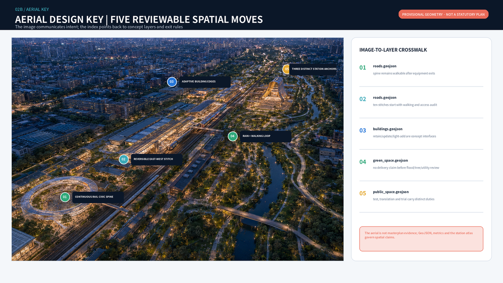
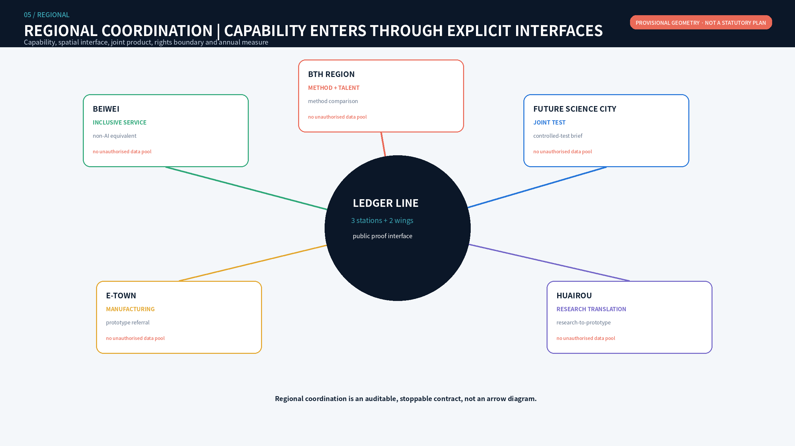
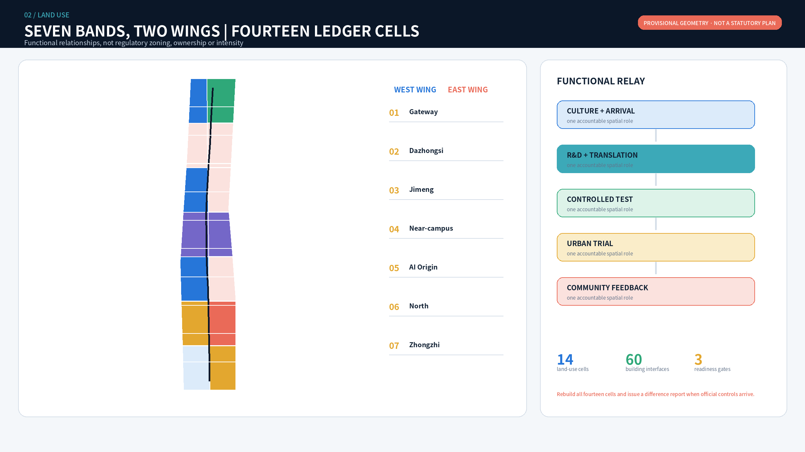
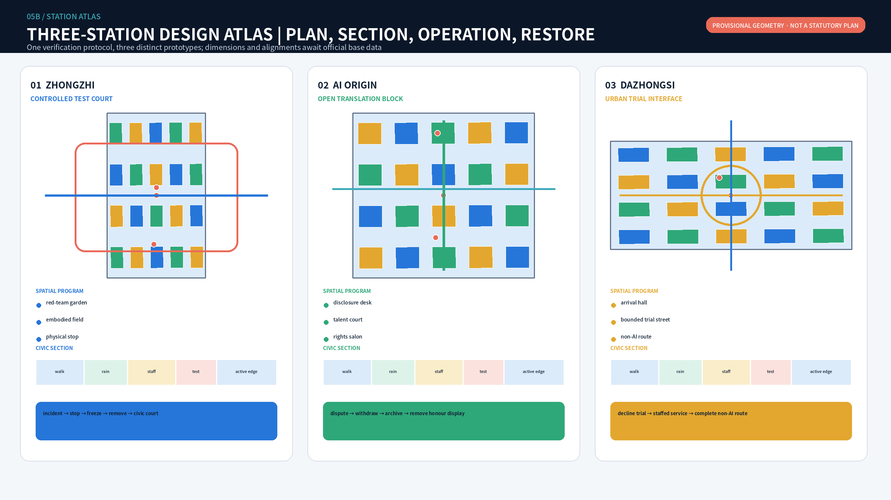
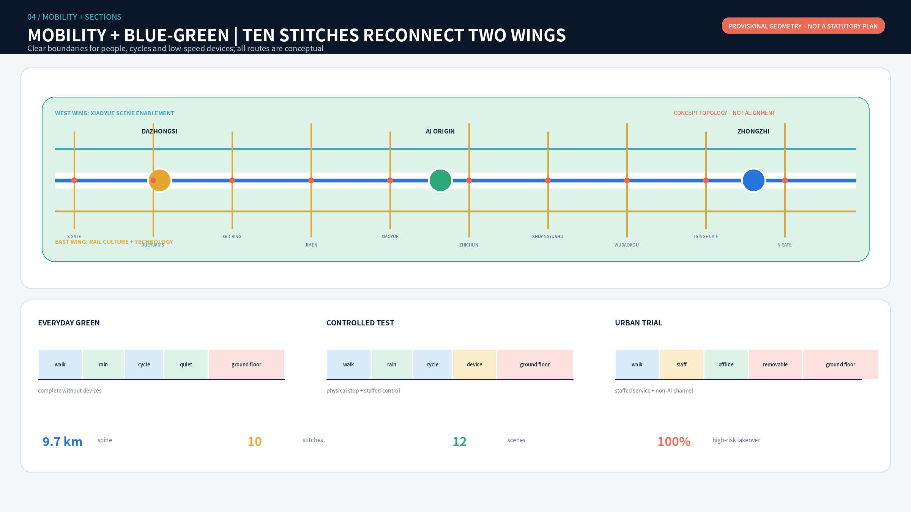
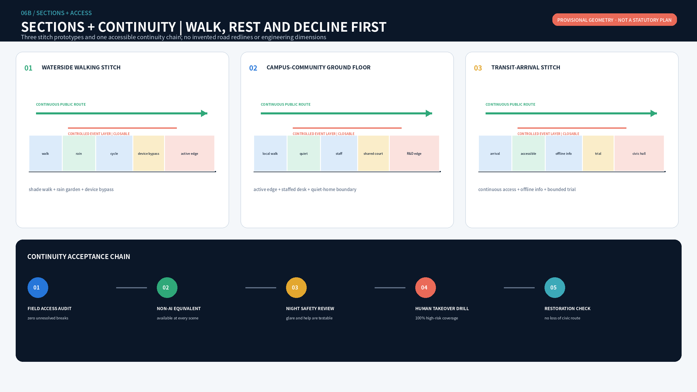
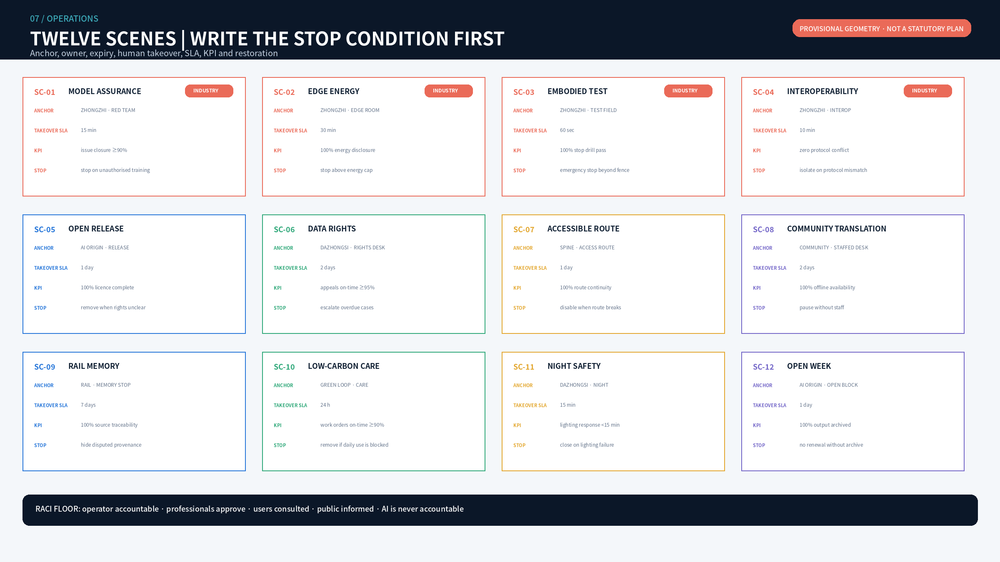
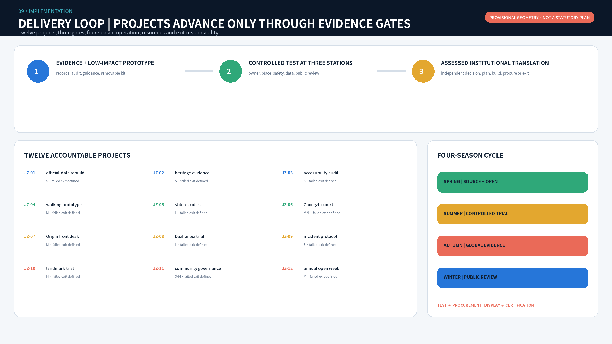

# JINGZHANG LEDGER LINE

## Coordinated Research Area: Industry and Future City Research

Jingzhang Ledger Line translates the railway's culture of engineering proof into a civic procedure for AI entering real urban settings. Every technology passes six gates: **source registration, bounded trial, informed public use, human takeover, independent review, and restorative exit**. The gates are both an operating protocol and a spatial language along the railway heritage park. They do not create a rail or road redline and do not turn testing into procurement, certification, or an implementation promise. [source:OFFICIAL-ANNOUNCEMENT] [source:AGENT-TASKBOOK]

The structure is one line, three stations, two wings, ten stitches, twelve scenes, and three readiness gates. One civic slow-mobility verification spine links differentiated stations at Zhongzhi Park, AI Origin, and Dazhongsi; two wings connect professional services and everyday-life feedback; ten east-west stitches repair access; twelve AI scenes can be stopped; three gates advance only when evidence matures. Every layer is derived from the same provisional envelope and is recomputable, but none is an official boundary, survey, ownership judgment, or approved regulatory plan. [data:geometry/site_boundary.geojson#SITE-001] [depth:overall_spatial_structure]

The rail civic spine, east-west stitches, adaptive building interfaces, blue-green walking loop and three station anchors in the aerial each point back to `roads.geojson`, `buildings.geojson`, `green_space.geojson` and `public_space.geojson`. The image explains intent rather than replacing plan evidence; concept layers, metrics and the station atlas remain authoritative for spatial review. [data:geometry/roads.geojson#ROAD-SPINE] [depth:overall_spatial_structure]

## Design Basis and Source List

The official announcement establishes tasks, textual scopes, approximate areas, and three key areas. The agent taskbook establishes three positions, five functions, the three-zone/two-wing structure, and agent.1-agent.6. Local standard snapshots constrain planning language. The overall and key-area geometries remain `provisional_constraint`; derived areas serve package consistency only. When official polygons arrive, all GeoJSON, metrics, drawings, bilingual HTML, A3/A0 files, and narrative numbers must be rebuilt as one chain. [source:BOUNDARY-SOURCE] [source:KEY-AREA-SOURCE]

Evidence has four uses. The announcement and taskbook support objectives and deliverables; national and ministry standards support classification and depth; international cases support mechanism comparison; provisional geometry supports topology and internal recalculation only. `sources.json` records publisher, URL, status, applicability, and non-transfer limits. `assumptions.json` retains gaps in official geometry, controls, ownership, existing buildings, utilities, fire, and heritage. No gap is filled with data from a similar project. New evidence must be registered, spatial checks rerun, and impacts recorded in `changelog.md`. [standard:MOHURD-URBAN-DESIGN-MEASURES] [standard:MNR-LAND-USE-CLASSIFICATION-GUIDE] [source:SOURCE-REGISTRY]

## Three-Level Scope Framework

| Scale | Question answered | Completed output | Boundary not crossed |
| --- | --- | --- | --- |
| Approx. 43.6 km² coordination area | How do innovation resources circulate regionally? | Five-node interface matrix, eight cases, seven-factor ecosystem | No inferred institutional commitment or performance |
| Approx. 11.4 km² overall area | How do industry, life, green space and movement connect? | 14 land-use cells, 13 concept routes, 7 green units, 15 public nodes | Not a regulatory plan, road redline or engineering alignment |
| Three key areas | Which spatial prototypes can be verified? | Three concept plans, building interfaces, scenes, sections and exit paths | No existing-building, ownership or demolition inference |

### Closing the three-position, five-function and two-wing loop

The three positions are an operating sequence rather than parallel slogans. The heritage belt holds source and memory; the urban AI experience belt holds informed use and feedback; the AI fusion belt holds bounded verification and translation. Full-stack innovation is tested at Zhongzhi Park, the world-class ecosystem is organised at AI Origin, AI+ scenes are tried along the eastern wing and civic nodes, urban vitality is made visible through active ground floors and mobility, and human-centred governance is embodied in takeover and exit interfaces. [source:AGENT-TASKBOOK]

| Regional interface | Capability input | Jingzhang interface | Joint product | Data/IP boundary | Annual measure |
| --- | --- | --- | --- | --- | --- |
| Beiwei Community | Community needs and inclusive service | Offline service nodes on the eastern wing | Non-AI equivalent service catalogue | No resident tracking or commercial profile | Issue closure and offline availability |
| Future Science City | Research platforms and enterprise trial demand | Zhongzhi verification court | Joint controlled-test brief | Project data shared only by tiered permission | Controlled tests and complete exit reviews |
| Huairou Science City | Scientific facilities and research outputs | AI Origin translation front desk | Research-to-prototype evidence ticket | Rights holder authorises results and instrument data | Research-to-prototype records |
| Beijing E-Town | Terminals and manufacturing | Dazhongsi urban trial interface | Prototype-to-small-batch referral | Design, code and supply-chain isolation | Compliant referrals and fault return time |
| Beijing-Tianjin-Hebei | Standards dialogue, talent and scene network | Annual open collaboration week | Cross-regional method comparison | No unauthorised cross-region data pool | Method sessions and talent exchanges |

### Eight cases: transfer mechanisms, not urban form

Eight primary institutional sources inform the proposal. Cambridge contributes a commercialisation front door, Helsinki contributes bounded real-city testing, and Decidim contributes open-source hybrid participation. [source:CASE-CAMBRIDGE] [source:CASE-HELSINKI] [source:CASE-DECIDIM]

AI Verify contributes neutral testing and an assurance sandbox, Seoul contributes public experience and digital inclusion, and London's Knowledge Quarter contributes cross-institution exchange. [source:CASE-AIVERIFY] [source:CASE-SEOUL] [source:CASE-KQ]

Barcelona 22@ contributes mixed innovation and public-realm renewal; Toronto Port Lands contributes resilient public realm and long-horizon phasing. [source:CASE-22AT] [source:CASE-TORONTO]

Local translation produces seven safeguards: reversible land use and an official-data trigger; three stations and active-ground-floor interfaces; four industrial verification scenes; resource bands and an exit reserve research direction rather than funding promises; a developer community and staff exchange; small edge-compute nodes with energy gates; and data permission, minimisation, expiry, deletion, and appeal. No case predicts local companies, investment, talent, or output.

## Overall Design Area: Urban Renewal and Regulatory-Plan-Level Urban Design

### Overall space: seven bands and two ledger wings

The provisional overall area is divided into seven north-south bands and two east-west wings, producing fourteen concept cells without intentional gaps or overlaps. The western wing supports R&D, professional services, IP and industrial translation. The eastern wing supports community services, talent life, culture, education, and real-use feedback. The civic verification spine belongs to no single campus. The southern gateway handles arrival and culture, Dazhongsi handles intelligent industry and public trial, the middle bands handle research translation, AI Origin handles open collaboration and talent life, and the northern bands handle full-stack verification, low carbon, and strategic reserve. [data:geometry/land_use.geojson#LU-01-W] [metric:land_use_feature_count]

Conceptual building interfaces are not an existing-building inventory. Courtyards, active ground floors, and traversable edges test spatial relationships through three priorities: adaptive retention, ground-floor retrofit, and reversible light additions. Demolition, construction, intensity, and height await survey, ownership, structure, regulatory, heritage, fire, and utility evidence. [data:geometry/buildings.geojson#BLDG-101] [metric:conceptual_building_interface_count]

## Land Use, Building Scale, and Retain-Renovate-Demolish Strategy

Fourteen concept land-use cells express functional relationships rather than statutory controls. Sixty building interfaces compare adaptive retention, ground-floor retrofit, and reversible light additions; they are not an existing-building survey, demolition decision, floor-area schedule, or development intensity. FAR, height, gross floor area, and ownership remain `unknown` until official controls and existing-condition evidence trigger a rebuild. [data:geometry/land_use.geojson#LU-01-W] [data:geometry/buildings.geojson#BLDG-101] [metric:conceptual_building_interface_count]

Retention applies only after structure and rights are verified and where public-facing adaptation is feasible. Retrofit requires accessibility, fire, energy, and traversability review. Addition means removable low-impact test infrastructure, not permanent construction. Demolition is not predicted and can enter comparison only after survey, structural, heritage, ownership, and statutory procedures. Footprint area checks layer consistency and does not derive gross floor area. Standard land-use codes and separate design-role fields prevent concept functions from being presented as statutory zoning. [standard:MNR-LAND-USE-CLASSIFICATION-GUIDE] [standard:MOHURD-CONTROL-DETAILED-PLANNING] [metric:building_footprint_area_sqm]

## Detailed Design of Key Areas

The three key areas share one evidence template but use distinct prototypes: Zhongzhi tests higher-risk technology, AI Origin handles rights disclosure and translation, and Dazhongsi supports informed public trial. Each checks concept geometry, building interfaces, public realm, scene nodes, human takeover, restorative exit, and dependencies. The polygons remain `provisional_constraint` and cannot support precise area, demolition quantity, or engineering-interface claims. [data:geometry/key_areas.geojson#PROV-KEY-001] [depth:three_key_area_detailed_design] [metric:conceptual_building_interface_count]

### 6.1 Zhongzhi Park: controlled verification court

Zhongzhi Park combines R&D courts, a red-team garden, an embodied-AI test field, and a Qinghe restoration edge. Green buffers, low-speed interfaces, and staffed takeover points separate testing from public walking. Failure triggers equipment removal, data freeze, enclosure removal, and return to ordinary use. Public displays show methods, failures, and safety boundaries rather than attack details or unauthorised enterprise material. Official boundary, flood, traffic, safety, noise, energy, and operating responsibility are prerequisites.

### 6.2 AI Origin: open-source translation block

AI Origin combines a disclosure front desk, open collaboration ground floors, talent courtyards, and public problem tables. University outputs record rights, evidence level, and applicability before entering the city. Night collaboration and quiet residential edges are separated. Two east-west stitches connect campus, park, and neighbourhood. Disputed projects cannot enter the honour display, and withdrawn contributions are removed within the stated period.

### 6.3 Dazhongsi: urban trial interface

Dazhongsi combines a transit arrival hall, intelligent-device trial street, data-rights salon, and international demo lounge. Four-quadrant pedestrian connection remains a concept target pending transit, road, and utility evidence. People test products with clear notice, staffed service, and a non-AI channel. Trial does not mean purchase, certification, or permanent data capture.

The station atlas aligns plan, civic section, operating programme and failed restoration on one review surface. Zhongzhi uses a staffed controlled loop to protect the public route; AI Origin uses a continuous ground floor and public problem table to connect release, collaboration and rights disclosure; Dazhongsi uses an arrival cross and circular hall to separate trial, appeal and non-AI service. These are not one generic grid with different labels, and civic space must remain useful after equipment exits. [data:geometry/buildings.geojson#BLDG-101] [data:geometry/public_space.geojson#LANDMARK-01] [depth:three_key_area_detailed_design]

## Transport, Rail, Municipal Infrastructure, and Public Services

One north-south civic verification spine, ten east-west stitches, and two wing service routes form the concept network. Walking and cycling lead on the spine. Embodied devices operate only within key areas, limited times, low speeds, and staffed takeover routes. Each stitch needs field review of traffic, accessibility, underpass conditions, and ownership. `ROAD-SPINE` and `ROAD-X01`-`ROAD-X10` are concept centrelines, not rail or road redlines. [data:geometry/roads.geojson#ROAD-SPINE] [metric:east_west_stitch_count]

Reliable municipal evidence is unavailable. Energy, drainage, flood, fire, communications, and equipment connections therefore remain design-development prerequisites; no capacity, pipe alignment, or engineering interface is inferred. Public service uses a staffed desk, non-digital channel, and continuous accessible route as its equivalence floor.

## Blue-Green Network, Public Space, and Urban Character

Three sections make boundaries explicit. The everyday green section retains walking, cycling, rain gardens, quiet zones, and active ground floors. The controlled-test section adds a low-speed device lane, physical emergency stop, and observer zone. The urban-trial section adds staffed service, a non-digital channel, and removable display edges. Green and public-space ratios are provisional internal checks, not statutory controls. [metric:green_ratio] [metric:public_space_ratio]

Urban character comes from rail traces, rain planting, durable paving, reversible structures, and active ground floors rather than screens or device clutter. Everyday green space remains complete for shade, rest, children, older adults, and accessible movement after equipment leaves. Controlled test areas use boundaries, speed, noise, light, and physical stops; urban-trial areas protect choice with staff and a non-AI route. Heat, storm, lighting failure, or accessibility interruption closes technical operation while keeping safe passage. Official greenline, water, flood, tree, and sponge-city evidence triggers ecological and engineering review and full ratio recalculation. [standard:MOHURD-URBAN-DESIGN-MEASURES] [data:geometry/green_space.geojson#GREEN-001] [data:geometry/public_space.geojson#PUBLIC-SPINE]

The three east-west stitch sections share one public route that cannot be interrupted, while the controlled event layer can close independently after an incident, extreme weather, accessibility failure or permit lapse. Field accessibility audit, non-AI equivalent service, night-safety review, human-takeover drill and failed restoration form the continuity acceptance chain. Technical functions do not open while any link remains unresolved. [standard:MOHURD-URBAN-DESIGN-MEASURES] [data:geometry/roads.geojson#ROAD-X01] [metric:east_west_stitch_count]

## AI Innovation Ecosystem, Personas, and AI+ Scenarios

| Scene | Type and anchor | Accountable / consulted | Data boundary | Human takeover and SLA | KPI, stop and restoration |
| --- | --- | --- | --- | --- | --- |
| SC-01 Model Assurance Court | Industry test, Zhongzhi | Platform / red team, legal | Authorised test sets, model version, risk log | Safety lead approves; severe incident stops in 15 min | Defect closure; unauthorised access or irreproducibility freezes logs and removes test |
| SC-02 Edge Compute Energy Bench | Industry test, Zhongzhi | Facility operator / energy, safety | Power, temperature, anonymous load; no task content | Engineer takes over within 30 min | Energy per task; heat, noise or uncertain supply stops operation |
| SC-03 Embodied AI Controlled Field | Industry test, Zhongzhi | Test-field operator / traffic, safety, community | Device telemetry and incidents; no face recognition | Physical stop under 5 sec; staffed whenever open | Takeover success; boundary breach, collision or unresolved complaint restores ordinary use |
| SC-04 Interoperability Bench | Industry test, AI Origin | Open-source community / third-party tester, rights holder | Interface versions and success; no private code upload | Dual review before release; dispute response in 2 days | Reproducibility; two failed rounds or lock-in risk removes display |
| SC-05 Open-source Release Hall | Ecosystem, AI Origin | Translation platform / community | Licensed metadata and licences | Rights check before release; withdrawal in 5 days | Clearance rate; rights, privacy or accessibility failure withdraws project |
| SC-06 Data Rights Salon | Service, Dazhongsi | Compliance service / legal, rights holder | Authorised catalogue only | Unclear rights transfer to a person; no transaction ruling | Rights completeness; unclear source or excessive use stops service |
| SC-07 Accessible Route Station | Civic service, spine | Park operator / transport, disability representatives | Facility state, segment flow, voluntary feedback | Human field audit before advice; unsafe advice removed at once | Continuous access; safety conflict falls back to paper and staff |
| SC-08 Community Translation Desk | Civic service, east wing | Service centre / translator, case worker | On-device text, no default retention or ID originals | Rights-impacting content goes to staff; wait under 15 min | Correction rate; rights-impacting error stops AI answer |
| SC-09 Railway Engineering Memory | Culture, spine | Cultural operator / historian | Cleared records and versions | Expert check before publication; dispute marked in 7 days | Traceability; unknown source removes exhibit |
| SC-10 Low-carbon Maintenance Station | Governance, green spine | Park/utility operator / engineer | Asset ID and environmental status, no personal data | People decide work orders; urgent response in 30 min | False alerts and closure time; repeated misrouting returns to manual inspection |
| SC-11 Co-governed Night Safety | Civic service, AI Origin | Public-space operator / community, security | Non-identifying heat and human reports | Person confirms every alert; immediate response to incidents | False alert and complaint rate; tracking or glare removes equipment |
| SC-12 Global Open Collaboration Week | Operations, full line | Annual committee / venue, rights, accessibility | Event plan, consented registration, aggregate feedback | Staffed sessions; complaint response in 2 hours | Joint tasks and issue closure; permit, safety or rights gap cancels the unit |

Every scene uses the same RACI floor: an operator is accountable, a professional group approves, users and communities are consulted, and the public is informed. AI is never the accountable actor. Resources use S (existing space and staff), M (removable components and specialist service), and L (engineering or long-term operation requiring a separate case). SC-01-SC-04 are industrial test and validation scenes. [metric:scenario_card_count] [metric:industry_validation_scenario_count]

### Identity, three landmarks and eight components

The original mark combines two tracks and an open node: the heritage track gives direction, the evidence track records versions, and the unclosed node permits challenge, revision, and exit. Colours are ledger blue, civic green, human-judgment gold, warning coral, and night ink. The mark must not imply endorsement beside enterprise logos or enter uncleared merchandise and permanent signage.

Three removable, low-glare, non-advertising landmarks are the Rail Evidence Gate at Zhongzhi, Open Contribution Ring at AI Origin, and Urban Trial Beacon at Dazhongsi. Eight components are source sign, test sign, staffed desk, offline service panel, movable seat, low-glare light, rain-garden sensor plinth, and tactile map. The contribution wall records verifiable public contributions, failures, and exits; it does not create a personal prestige ranking. [metric:pilgrimage_landmark_count] [metric:public_component_count]

The executable VI standard fixes mark construction, minimum clearspace, minimum digital size, five functional colours, type hierarchy and three levels of public information. Every application shows scene status, rights information and staffed/non-AI action entry together. Mimicking an official seal, implying enterprise endorsement, permanent advertising and hiding pause or exit status are prohibited. Identity therefore becomes a consistent public interface for responsibility and choice rather than decoration. [source:AGENT-TASKBOOK] [metric:public_component_count]

### Inclusion: equal service without an application

Eight personas include developers, startups, university users, enterprise visitors, residents, operators, children and caregivers, and older, disabled, and non-digital users. A continuous accessible route, concept rest nodes within 400 metres, tactile and high-contrast information, low-glare night light, paper and staffed service, and use without face recognition or a smartphone are entry conditions. Distances and locations require field audit after official geometry.

Equity measures include 100% non-digital service availability, 100% human takeover coverage for high-risk scenes, accessibility issue closure, task-completion gaps between user groups, night complaint response, and timely permission withdrawal. A scene is downgraded or stopped when one group's failure remains materially worse for two review cycles.

## Renewal Projects, Implementation Policy, and Phasing

| Project | Proposed accountable / partners | Window and resource | Dependency | Acceptance and failed exit |
| --- | --- | --- | --- | --- |
| JZ-01 Official-data rebuild | Planning-data coordinator / survey and design | 30 days after release; M | Official polygons and CRS | Full-chain difference report; unresolved mismatch pauses precise metrics |
| JZ-02 Heritage evidence review | Cultural operator / historian and heritage expert | 0-6 months; S | Resource and rights inventory | 100% traceability; unclear material removed |
| JZ-03 Accessibility continuity audit | Park operator / users and transport | 0-6 months; S | Field survey | Breakpoint register and owners; major break blocks route service |
| JZ-04 North-south walking prototype | Public-space operator / park and transport | 3-12 months; M | Road and management evidence | Continuous route and alternative; safety conflict removes prototype |
| JZ-05 Ten east-west stitch studies | Transport team / district and community | 6-18 months; L | Flow, redline and levels | Alternatives for each; infeasible stitch remains wayfinding only |
| JZ-06 Zhongzhi verification court | Site operator / safety, firms, community | 6-18 months; M/L | Boundary, safety, noise, energy | Stop and restoration drill; failure prevents opening |
| JZ-07 AI Origin open front desk | University platform / community | 3-12 months; M | Cooperation and IP | Complete rights ticket; disputed project not published |
| JZ-08 Dazhongsi urban trial window | Industry platform / transit, retail, access | 9-24 months; L | Transit, ownership, fire | Staffed and non-AI channels; otherwise temporary event only |
| JZ-09 Scene register and incident protocol | Annual committee / legal and technical | 0-6 months; S | Data charter | Complete owner, term and stop fields; incomplete application refused |
| JZ-10 Landmark/component trial | Public-space operator / design, structure, rights | 6-18 months; M | Site, fire, heritage | Night, structure and access tests; failure removes and restores site |
| JZ-11 Developer/community governance | Community secretariat / universities, firms, residents | Ongoing; S/M | Published charter | Dissent recorded and answered; repeated failure pauses events |
| JZ-12 Open collaboration week | Annual committee / venue, safety, international | Annual; M | Permit, insurance, rights | Continue/revise/stop list; unresolved major risk cancels unit |

Gate one, evidence and low-impact prototypes, permits only research, audits, guidance, and removable components. Gate two, controlled testing at three stations, requires clear responsibility, place, safety, data, and public review. Gate three, assessed institutional translation, lets an independent review decide whether anything enters planning, engineering, procurement, or long-term operation. A pilot is not procurement, a display is not certification, and event participation is not permanent data permission. [data:geometry/phasing.geojson#PHASE-001] [metric:renewal_project_count]

The annual cycle is Source and Open Week in spring, Controlled City Trial season in summer, Global Evidence Forum in autumn, and Public Evaluation and Archive month in winter. The developer community maintains a public roadmap; residents and target users define problems; professionals retain legal, safety, and stop authority; AI organises records, flags conflict, and tracks versions.

### Professional handoff package: moving from concept to the next gate

Before any project enters a controlled pilot it must produce ten signable handoff items: official-data difference report, key-area existing-condition base, candidate operator responsibility charter, scene register, safety case, data-and-rights impact check, field accessibility audit, lifecycle resource brief, failed-restoration plan, and a continue/revise/stop gate decision. If legal ownership, professional approval, public notice, human takeover, non-digital service, data expiry or restoration resources are missing, the project remains in research status.

The handoff package does not invent authorisation. This submission supplies fields, candidate roles, acceptance evidence and failed actions; organisation names, signatures, budgets, insurance, field measurements and approvals remain pending. A professional team can sign off JZ-01 through JZ-12 without reverse-engineering tasks from narrative prose. [depth:phasing_implementation] [metric:renewal_project_count]

## Metrics, Area Recalculation, and Compliance Matrix

The leading risks are unclear responsibility, misleading precision, and an unfunded exit, not only technical failure. `risk.json` records privacy, implementation complexity, public acceptance, operating cost, policy uncertainty, spatial dispute, technology maturity, and inclusion, each with mitigation and human review. Before opening, every scene rehearses data expiry, takeover, complaint, incident, deletion, and spatial restoration.

Recomputable measures include provisional area, concept green and public space, building interfaces, spine and network length, 14 land-use cells, 10 stitches, 12 scenes, 4 industrial tests, 8 personas, 3 landmarks, 8 components, and 3 phases. FAR, height, road redlines, total floor area, budget, and ownership remain unknown. [metric:site_area_sqm] [metric:floor_area_ratio] [metric:implementation_budget_cny]

## Risk, Copyright, and Compliance

Text, graphics, design layers, HTML, and PDFs were produced by the declared AI agent and local tools. Experience images use OpenAI image-generation bases with local layout and are labelled as concepts, not site photographs. No commercial map, third-party photo, enterprise logo, or personal data is loaded. Noto CJK is used under its open font licence. The asset ledger is in `report/copyright_statement.md`. [source:COPYRIGHT-LEDGER]

This is an open-source concept proposal. It cannot replace professional planning, architecture, transport, utility, heritage, legal, safety, operations, or approval work. Repository intake, self-check, or review does not represent government endorsement, implementation approval, procurement, certification, or an award.

Compliance begins with source registration and ends with restorative exit. Operators remain legally and operationally accountable; relevant professionals approve planning, mobility, safety, legal, and accessibility gates; communities and target users define problems; the public receives purpose, expiry, appeal, and alternative-service information; AI is never accountable. `risk.json` records triggers, mitigation, human review, and stopping rules across eight risks. High-risk scenes rehearse stop, takeover, data freeze, deletion, and spatial restoration. The three generated source images are retained separately from bilingual crops and labels, and unavailable model sub-version details are disclosed rather than guessed. [source:COPYRIGHT-LEDGER] [source:SOURCE-REGISTRY] [metric:scenario_card_count]

Public-data boundaries, personal privacy, asset copyright, and data authorisation are checked separately before opening. Unknown provenance, expired permission, or missing review responsibility stops the related scene; technical availability never substitutes for compliance.

## References

`sources.json` records primary task sources, provisional-boundary provenance, professional standards, and eight international primary sources with publication status, applicability, and rights notes. Inline `[source:*]` markers resolve to that registry; unregistered material is not used as evidence. [source:SOURCE-REGISTRY] [source:OFFICIAL-ANNOUNCEMENT] [source:AGENT-TASKBOOK]

References fall into four groups: the announcement and taskbook check scope and agent.1-agent.6; land-use, urban-design, regulatory-planning, and architectural-depth standards constrain terms and deliverables; provisional geometry sources support concept work only; eight institutional case pages support mechanism transfer only. A broken link, content revision, or rights change downgrades the related claim and enters the changelog. Citation does not imply partnership, certification, performance prediction, or trademark permission. [standard:PROJECT-OFFICIAL-ANNOUNCEMENT] [standard:PROJECT-AGENT-OPEN-CALL-TASKBOOK] [standard:MOHURD-ARCH-DESIGN-DEPTH-2016]

- `brief/public-brief.md`: repository public brief draft, used only for task context and proposal boundaries.
- `brief/README.md`: repository public-data boundary note, used to constrain evidence status and review responsibility.
