# X京张 X JINGZHANG

> 同一件AI产品必须带着同一版本和连续证据走完三站；任何一次失败都让产品返回测试，而不是让城市迁就产品。TEST → RELEASE → USE → RETURN。

## 三分钟读懂：一件产品如何被城市允许，又被城市退回

一台低速具身服务原型以0.8版进入众智园。09:17，它在“行人意外穿越”工况中越界，现场人员5秒内急停，Test Receipt记为FAIL；机器撤出，公众院落继续开放。0.9版完成复测后取得新的Test Receipt，在AI原点公开对应版本、许可、责任人与撤回办法，才取得有期限的Release Ticket。它随后进入大钟寺限定试用；72岁的周阿姨不需要手机即可指出设备和排队影响无障碍主链，Public Verdict立即变为RETURN。试用关闭、人工服务继续，0.10版带着新工况返回众智园。[data:visual/assets/x-lifecycle-valid-example.json] [data:visual/assets/lived-lifecycle.json]

这就是X：不是一个Logo，也不是一串后台审批，而是产品每进入下一段城市空间时都要接受一次公开交叉核对。技术PASS不能替代权利判断，Release Ticket不能替代公众决定，新版本PASS也不能覆盖0.8版的失败历史。[data:visual/assets/verify-x-lifecycle.js] [metric:x_lifecycle_test_case_count]

| 城市决定 | 这一站只回答什么 | 公众能看见什么 | 运行凭证 | 失败后城市怎样继续 |
| --- | --- | --- | --- | --- |
| 众智园 TEST | 这个精确版本能否在声明边界内安全工作？ | 测试口袋、值守人、物理急停、失败记录 | Test Receipt | 机器撤出；院落、步行与开放绿地继续 |
| AI原点 RELEASE | 这个版本是否有权被公开和有限使用？ | 方法、许可状态、责任人与撤回动作 | Release Ticket | 撤下发布；教学、协作与普通展览继续 |
| 大钟寺 USE | 公众是否愿意让它继续留在城市服务中？ | 有限试用、人工等价服务、匿名投诉与RETURN状态 | Public Verdict | 设备折返；商业、休息、人工服务与无障碍主链继续 |

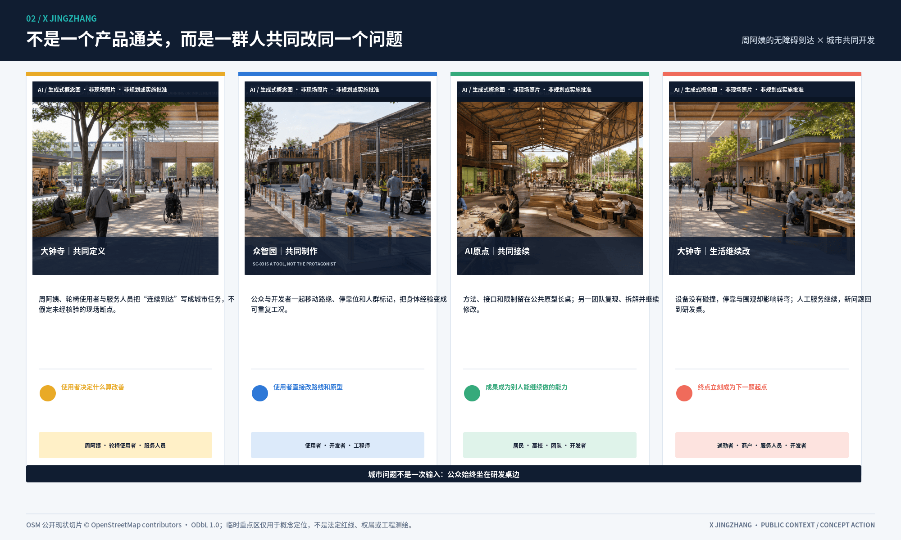

### 为什么是京张：从铁路运行文化长出的X

X不是把铁路名词贴在通用治理框架上，而是有边界地转译四条运行原则：线路被分成有明确边界的区段；相互冲突的运行关系不能靠算法自行取得优先权；进入下一段需要前序条件与人工责任；异常解除后必须人工确认、恢复并留存记录。国家铁路局公开规章支撑区段、停止与恢复原则，但本方案的三张票不是铁路行车凭证、政府审批或产品认证。[source:NRA-TECHNICAL-RULES] [data:visual/assets/railway-operating-translation.json]

京张铁路青龙桥“人”字形折返提供了更具体的空间记忆：改变方向不是抹去来路，而是保留前段状态后折返。X把这一点转成RETURN：旧FAIL不能被新PASS覆盖，产品必须带着投诉或缺陷生成的新任务返回众智园。青龙桥不在本次临时设计范围内，方案只转译其经可靠资料支持的工程逻辑，不伪造现场联系或遗产结论。[source:NRA-JINGZHANG-HISTORY] [source:BEIJING-HERITAGE-JZ]

已开放的京张铁路遗址公园一期保留铁路正线、老铁轨、道岔和清华园站等记忆，并把约9公里走廊转为贯通城市的公共空间。因此本方案不是借用铁路图形，而是倒转技术与公众的优先级：**公众日常生活是正线，AI创新是必须取得放行且随时可以折返的侧线**。三站分别形成测试侧线、发布侧线和城市试用侧线；每条侧线关闭后都恢复普通用途，正线从不依赖AI开放。[source:BEIJING-JZ-PARK-PHASE1] [source:BEIJING-JZ-PARK-9KM] [depth:jingzhang_heritage_route]

### 机制现在可以被拒绝

生命周期验证器不是一份规则清单，而是可执行状态机。它检查10种状态、上游票据哈希、版本指纹、人工签注、权利HOLD、到期、RETURN后复测和失败历史；24个确定性用例全部通过，其中22个是必须被拒绝的越级、断链或失效路径。三站空间验证器除公众主链、AI侧袋、无AI服务、无障碍独立性和RETURN恢复外，新增三项不可互换的开场门：众智园“受控交叉无旁路”、AI原点“方法—权利—撤回共可见”、大钟寺“非AI路径等价且投诉直达冲突点”，结果为29/29 PASS。[data:visual/assets/x-lifecycle-test-results.json] [data:visual/assets/station-topology-results.json] [metric:station_topology_pass_count]

这些PASS只证明仓库内规则、合成票据和概念拓扑可重跑，不证明真实现场、产品安全、公众接受、认证或实施批准。SC-03仍是明确标注的tabletop；真实试点在场地、主体、设备、保险和批准缺失时保持BLOCKED。[data:visual/assets/sc03-tabletop-evidence.json]

## 统筹研究范围产业与未来城市研究

第一阅读层只保留 TEST—RELEASE—USE—RETURN。双翼十缝、十四空间账本、十二场景和三道实施门继续作为专业审查层，分别回答空间怎样复算、责任由谁签注、失败如何退出，避免以功能数量代替运行逻辑。[source:OFFICIAL-ANNOUNCEMENT] [source:AGENT-TASKBOOK]

在统筹研究范围内，北纬社区、未来科学城、怀柔科学城、经开区和京津冀不是被假定已经合作的“资源点”，而是五类待核实的能力接口；每个接口都同时注明承接空间、建议合作产品、数据与知识产权边界以及年度复核指标。进入总体设计范围后，这些能力才被转译为西翼研发与产业服务、东翼社区与生活反馈、中央公共主线和三处差异化X站。其几何含义只到概念拓扑和包内复算为止：正式边界、控规、道路红线、权属、现状建筑、市政、消防、文保、运营主体和区域合作承诺仍然缺失，任何一项补齐都可能改变图层、指标与实施顺序，届时必须整链重建。[data:geometry/site_boundary.geojson#SITE-001] [depth:overall_spatial_structure]

## 设计依据与资料清单

官方公告用于确认任务、三层范围文字描述、约面积和三处重点区域；智能体任务书用于确认三大定位、五大功能、三区两翼和 agent.1—agent.6；本地标准快照用于约束城市设计、控规和用地分类语言。当前总体边界与三处重点区均为“临时约束”，派生面积只用于包内一致性检查。正式边界多边形发布后，空间数据、指标、图纸、双语网页、A3/A0与正文数值必须整链重建。[source:BOUNDARY-SOURCE] [source:KEY-AREA-SOURCE]

海淀区公开文件提供两条只用于方案定位的现实基线：2025年统计公报记录“众智”技术栈和RoboOS/RoboBrain相关进展，因此众智园首先承担可复现TEST而不是泛化展示；区级公开计划明确提出启动“海淀AI原点社区”建设，因此AI原点首先承担从方法、权利到有限发布的公共转译界面。两条资料都不证明候选场地、机构合作、产品性能或运营承诺，正式落位仍须现场和责任主体复核。[source:HAIDIAN-2025-STATISTICAL-BULLETIN] [source:HAIDIAN-AI-ORIGIN-PLAN]

资料按四级使用：公告与任务书只支撑目标、范围名称和交付要求；自然资源部与住建部标准只支撑分类、编制深度和专业术语；国际案例只支撑机制对照；临时几何只支撑拓扑和内部复算。`sources.json` 为来源总账，逐项记录发布机构、链接、状态、适用范围和禁止外推事项；`assumptions.json` 记录官方边界、重点区、控规、权属、现状建筑、市政、消防和文保缺口。任何缺失项不得用相似项目数据替代，任何新资料进入后都要登记版本、重跑空间复核，并在 `changelog.md` 写明影响范围。[standard:MOHURD-URBAN-DESIGN-MEASURES] [standard:MNR-LAND-USE-CLASSIFICATION-GUIDE] [source:SOURCE-REGISTRY]

## 三层范围工作框架

| 层级 | 本方案回答的问题 | 已完成成果 | 不越过的边界 |
| --- | --- | --- | --- |
| 约43.6 km²统筹研究 | 创新资源如何形成区域循环 | 五节点协同矩阵、八个案例、七要素生态图谱 | 不推定机构合作与产业绩效 |
| 约11.4 km²总体设计 | 产业、生活、绿脉和交通如何组织 | 14个用地单元、13条概念路线、7处绿地单元、15处公共节点 | 不作为控规、道路红线或工程线位 |
| 三处重点区域 | 哪些空间原型可被验证 | 三张片区总平、概念建筑接口、场景布点、剖面与退出路径 | 不推断现状建筑、权属和拆除决定 |

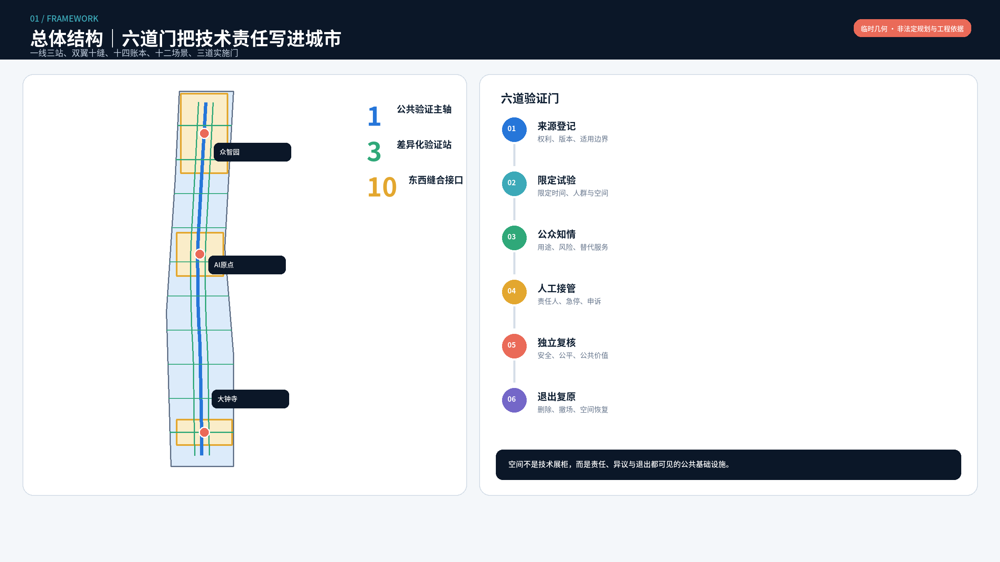

### 三大定位、五大功能与三区两翼闭环

三大定位不再是并列口号。百年京张文化带负责“来源与记忆”；都市AI生活体验带负责“知情试用与反馈”；AI融合创新带负责“受控验证与转化”。五大功能依次进入空间：全栈自主创新在众智园验证，世界级创新生态在AI原点组织，AI+场景沿小月河翼和公共节点试用，AI活力城市通过连续首层与慢行网络呈现，人本治理通过人工接管和退出复原公开可见。[source:AGENT-TASKBOOK]

| 区域接口 | 能力输入 | 京张空间接口 | 合作产品 | 数据/IP边界 | 年度指标 |
| --- | --- | --- | --- | --- | --- |
| 北纬社区 | 社区需求与包容性服务 | 小月河翼非数字服务节点 | 无AI等价服务清单 | 不采居民轨迹，不做商业画像 | 问题关闭率、线下服务可用率 |
| 未来科学城 | 科研平台与企业试验需求 | 众智园验证院 | 联合场景测试任务书 | 项目数据按授权分级，不默认共享 | 联合受控试验数、退出复盘完整率 |
| 怀柔科学城 | 科学装置与科研成果 | AI原点成果转化前台 | 研究到原型证据票据 | 科研成果与仪器数据由权利人授权 | 研究到原型转化记录数 |
| 经开区 | 智能终端与制造能力 | 大钟寺城市试用界面 | 原型到小批试制转介 | 设计文件、代码和供应链信息隔离 | 合规转介数、故障回传周期 |
| 京津冀 | 标准对话、人才和场景网络 | 年度开放协作周 | 跨区域测试方法对照 | 不建立无授权跨域数据池 | 年度方法互认研讨、人才交换任务 |

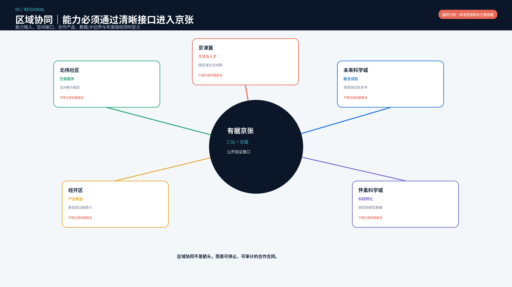

### 八个案例：只迁移机制，不复制形态

八个案例均使用政府、大学或公共机构一手页面。Cambridge Enterprise 提供成果披露与IP前台，Testbed Helsinki 提供真实城市限定试验，Decidim 提供开源参与和提案追踪。[source:CASE-CAMBRIDGE] [source:CASE-HELSINKI] [source:CASE-DECIDIM]

AI Verify 提供中立测试框架与保证沙盒，Seoul Smart City Center 提供公众体验和数字包容实验室，伦敦 Knowledge Quarter 提供跨机构人员与知识交换。[source:CASE-AIVERIFY] [source:CASE-SEOUL] [source:CASE-KQ]

Barcelona 22@ 提供产业、公共空间和生活混合更新；Toronto Port Lands 提供公共空间、韧性和长期分期。[source:CASE-22AT] [source:CASE-TORONTO]

本地转化形成七要素保障：土地采用可逆使用与正式数据触发器；空间采用三站和首层接口；产业采用四类验证场；资金只提出资源级别和退出准备金研究；人才采用开发者社区与跨机构轮岗；算力采用端侧小节点和能效门；数据采用授权、最小化、期限、删除和申诉。任何案例均不用于预测海淀企业数量、投资、人才或产值。

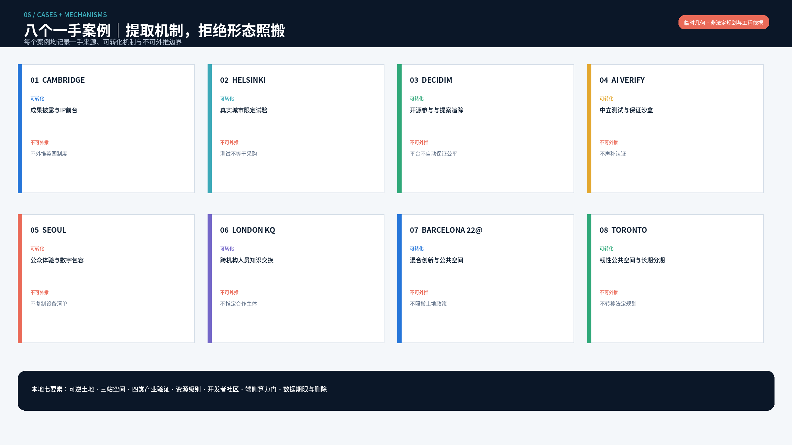

## 总体设计范围城市更新与控规深度城市设计

### 总体空间：七段双翼账本单元

总体范围被分为七个南北段和东西双翼，共14个无意留缝、无意重叠的概念单元。西翼承载研发、技术服务、IP法务和产业转化；东翼承载社区服务、人才生活、文化教育和真实场景反馈；中部公共验证主轴不归属于任一企业园区。南门户强调国际到达和文化展示，大钟寺强调智能产业与城市消费，蓟门和近校段强调科研转化，AI原点强调开源协作和人才生活，北段与众智园强调全栈验证、低碳和弹性留白。[data:geometry/land_use.geojson#LU-01-W] [metric:land_use_feature_count]

鸟瞰图中的铁路公共脊、东西缝合、适应性建筑界面、蓝绿慢行环和三站锚点分别回指 `roads.geojson`、`buildings.geojson`、`green_space.geojson` 与 `public_space.geojson`。图像说明空间意图，不替代总平证据。[data:geometry/roads.geojson#ROAD-SPINE] [depth:overall_spatial_structure]

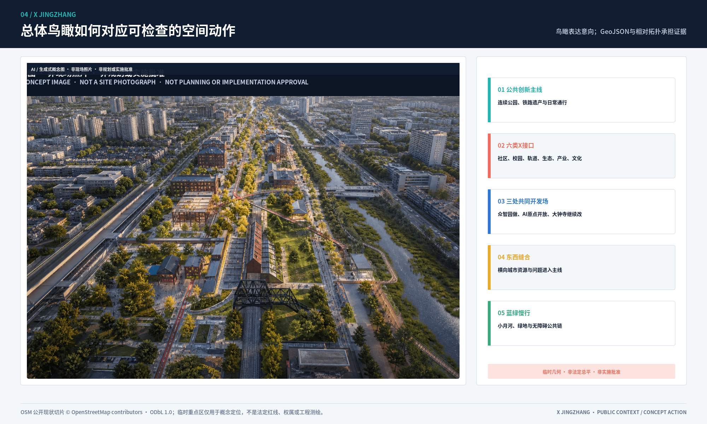

概念建筑接口不是现状建筑清单。每个重点区以院落、连续首层和可穿越界面测试空间关系，并按“保留适应性利用—首层界面更新—可逆轻量增建”三个动作表达优先顺序；任何拆除、新建、强度和高度均须等待现状调查、权属、结构、控规、文保、消防和市政条件。[data:geometry/buildings.geojson#BLDG-101] [metric:conceptual_building_interface_count]

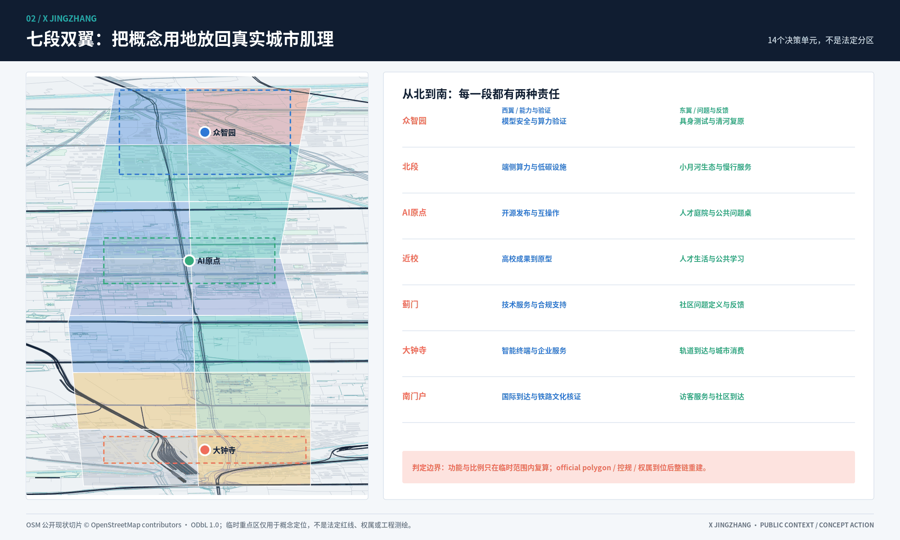

十四个单元不是同色分区的重复命名，而是十四条独立设计决策。每条记录分别保存空间动作、建议运营角色、验收证据、停止条件和复原动作；完整字段见 `visual/assets/review-evidence.json#spatial_ledgers`。这使“空间账本”可以逐项签注，而不是用总体面积、绿地率等通用指标替代具体交付。

| 账本 | 主导功能 | 首要空间动作 | 开放前验收 | 失败后保持的公共功能 |
| --- | --- | --- | --- | --- |
| 01W / 01E 南门户 | 铁路文化核证 / 等价到达 | 核证台、人工窗口、触觉地图 | 来源100%可追溯；非数字服务可用 | 普通到达、步行、休息 |
| 02W / 02E 大钟寺 | 终端试用 / 轨道与消费 | 试用、申诉、无AI服务分流 | 四项权利入口齐全；居民归家链不断 | 普通商业与人工服务 |
| 03W / 03E 蓟门 | 专业服务 / 社区反馈 | 合规前台、公共问题桌 | 责任与期限完整；异议可追踪 | 普通办公与线下议事 |
| 04W / 04E 近校段 | 成果转化 / 人才生活 | 开放首层、安静庭院 | 许可和复测完整；夜间边界通过 | 教学、生活与非消费停留 |
| 05W / 05E AI原点 | 开源互操作 / 公共协作 | 发布前台、贯通首层、两条缝合 | 可复现、许可、公众进入通过 | 协作、展览与日常庭院 |
| 06W / 06E 北段 | 端侧设施 / 小月河生态 | 降级负荷、无障碍绿脉 | 能耗噪声与路线断点有台账 | 后勤服务与安全通行 |
| 07W / 07E 众智园 | 模型验证 / 具身试场 | 有人测试环、独立公众线、复原带 | 法人、安全批准、急停和复原演练通过 | 普通院落与开放绿地 |

## 用地、建筑规模与拆改留方案

十四个概念用地单元以功能关系而非法定指标表达研发、公共服务、生活、绿地与开敞空间。六十个建筑接口仅用于比较“适应性保留、首层更新、可逆轻量增建”三类动作，不代表现状建筑调查、拆除决定、建筑面积或开发强度；容积率、建筑高度、总建筑面积和权属均为“待确认”，待官方控规与现状资料发布后重建。[data:geometry/land_use.geojson#LU-01-W] [data:geometry/buildings.geojson#BLDG-101] [metric:conceptual_building_interface_count]

“留”优先面向结构与权利状态经核验、且可通过首层开放支持公共验证的建筑；“改”面向界面封闭但具备再利用潜力的建筑，先做无障碍、消防、节能和首层可穿越性评估；“增”仅指可拆、可迁、低扰动的试验设施，不等于永久新建。“拆”没有被本方案预判，只有在正式现状调查、结构鉴定、文保审查、权属协商和法定程序完成后才可能进入比较。建筑基底面积只检查图层一致性，不推导总建筑面积；用地代码遵守仓库标准枚举，方案功能另存为设计角色字段，避免把概念分工误写为法定分类。[standard:MNR-LAND-USE-CLASSIFICATION-GUIDE] [standard:MOHURD-CONTROL-DETAILED-PLANNING] [metric:building_footprint_area_sqm]

## 重点区域详细设计

三处重点区使用同一证据模板但采用不同空间原型：众智园验证高风险技术，AI原点完成成果权利披露与转化，大钟寺承担公众知情试用。每区均检查概念边界、建筑接口、公共空间、场景节点、人工接管、停止复原和资料依赖；当前边界均为临时约束，不支持精确面积、拆建量或工程接口结论。[data:geometry/key_areas.geojson#PROV-KEY-001] [depth:three_key_area_detailed_design] [metric:conceptual_building_interface_count]

### 6.1 众智园：受控验证院

众智园形成“研发院—红队花园—具身试场—清河复原带”。测试空间与公众慢行通过绿化缓冲、低速界面和人工接管点分离；测试失败时设备撤场、数据冻结、围界拆除并恢复日常开放。首层展示只呈现可公开的测试方法、失败记录和安全边界，不展示攻击细节或未授权企业材料。前置依赖为官方边界、河道与防洪、交通、安全、噪声、能源和运营主体。

首期只做一个机器测试口袋和一个受控连接点。连接点必须同时具备有人值守、物理急停和公众优先，且移除连接点后机器不存在抵达公共边缘的旁路。正式落位若无法形成这种关系，TEST不开放，而不是让公众绕开测试。[data:visual/assets/station-topology.json#ZHONGZHI_TEST]

### 6.2 AI原点：开源转化街坊

AI原点形成“成果披露前台—开源协作首层—人才生活庭院—公共问题桌”。高校成果进入城市前先记录权利状态、证据等级和适用边界；夜间协作空间与居民安静界面分区；南北两条慢行缝合连接校园、园区和社区。争议项目不得进入荣誉展示，撤回授权后贡献信息按期限移除。

首期发布界面采用一条双面立面：一侧显示方法、版本与适用边界，另一侧显示许可、责任与撤回动作，末端直接接入可恢复为普通教学的协作工作室。三者不能分散到互不相见的后台；若“发布”可见而“撤回”不可见，RELEASE不开放。[data:visual/assets/station-topology.json#AI_ORIGIN_RELEASE]

### 6.3 大钟寺：城市试用界面

大钟寺形成“轨道到达厅—智能终端试用街—数据权利会客厅—国际路演客厅”。四象限步行联系是概念目标，具体过街和竖向形式待轨道、道路和管线资料确认。公众可在明确告知、有人服务和无AI等价通道下试用产品；试用不等于采购、认证或永久收集数据。

首期把可选试用与普通城市服务放在同一起点。人工非AI服务从公共主链直接到达，拓扑步数不得多于AI试用；投诉点同时邻接公共主链和试用口袋，使异议无需进入产品界面即可触发RETURN。若等价路径更远、需要扫码或投诉点藏在后台，USE不开放。[data:visual/assets/station-topology.json#DAZHONGSI_USE]

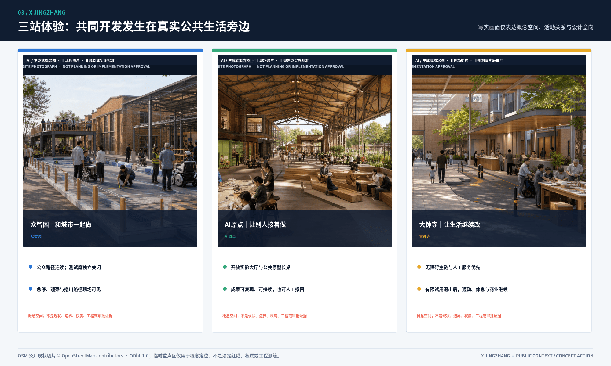

三张效果图表达的是不同的普通城市生活，不是三处AI展厅：众智园首先是一座可穿行的测试庭院，AI原点首先是可学习和协作的开放首层，大钟寺首先是可到达、休息和获得人工服务的城市客厅。AI设备只占用可关闭的局部；普通使用不要求公众持续观看技术。

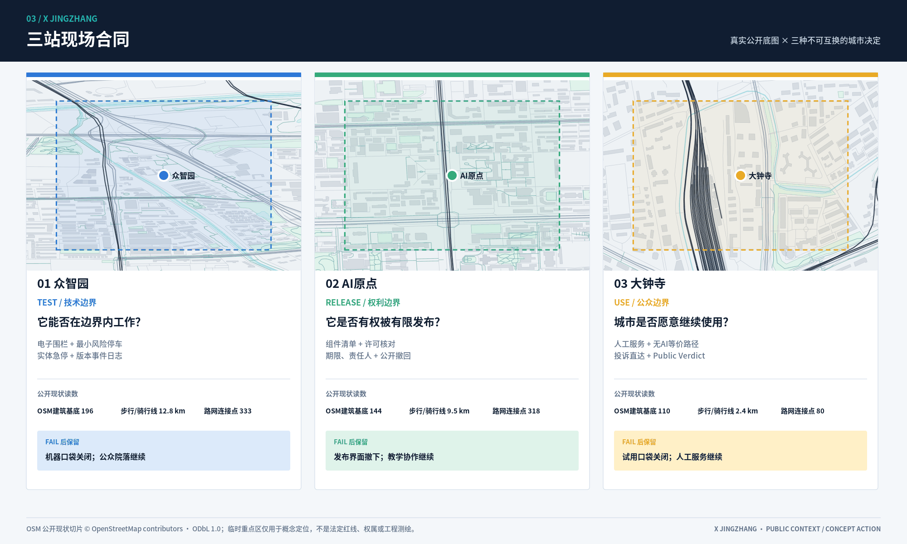

三站详细图谱把平面、公共剖面、运营程序和失败复原放在同一审查面上。众智园以有人值守的封闭测试环保护公众路径；AI原点以贯通首层和公共问题桌连接发布、协作与权利披露；大钟寺以到达十字和环形客厅分开试用、申诉与非AI服务。三种原型不是同一网格换名字，且都要求设备退出后公共空间继续成立。[data:geometry/buildings.geojson#BLDG-101] [data:geometry/public_space.geojson#LANDMARK-01] [depth:three_key_area_detailed_design]

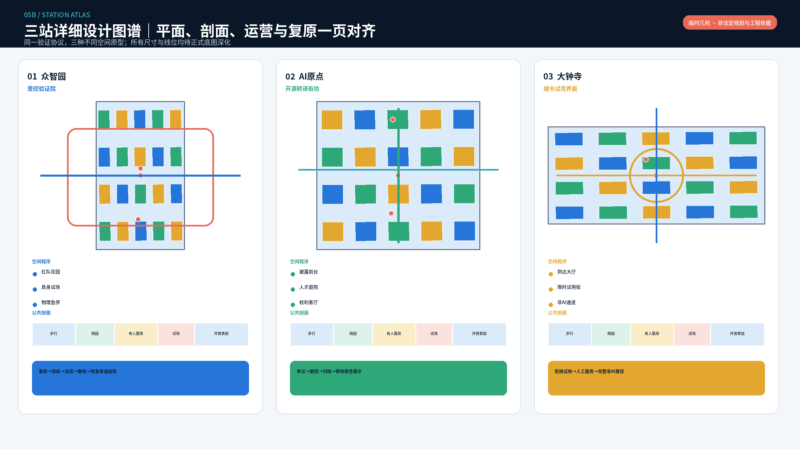

三处重点区采用不同的首期实施包，而不是等待全部工程条件后同时启动。完整字段见 `visual/assets/review-evidence.json#station_delivery_packages`。

| 重点区 | 当前待解问题 | 首期只做 | 建议验收 | 暂不进入 |
| --- | --- | --- | --- | --- |
| 众智园 | 测试与公众边界、能源噪声、撤场条件未核 | 边界标识、接管点、可拆围界和撤场演练 | 路径无未控制交叉；实体急停与复原演练通过 | 永久测试设施和工程接入 |
| AI原点 | 发布、公共进入、夜间协作与居民安静缺少共同界面 | 发布前台、公共问题桌、两条缝合标识 | 许可票据完整；公众与居民主链不中断 | 永久首层改造和增建 |
| 大钟寺 | 轨道到达、试用、商业和权利服务需要分流 | 临时试用、人工服务台、地面导引 | 告知、人工、申诉和无AI入口同时可用 | 永久站城和竖向工程 |

## 交通、轨道、市政与公共服务设施

一条南北公共验证慢行主轴、十条东西缝合通道和两条双翼服务路线构成概念网络。主轴优先步行与骑行；具身设备只在重点区限定时段、限定速度和有人工接管的路径内测试；缝合通道必须先完成现场交通、无障碍、桥下空间和产权核查。`ROAD-SPINE` 与 `ROAD-X01`—`ROAD-X10` 是概念中心线，不是道路红线或铁路设施。[data:geometry/roads.geojson#ROAD-SPINE] [metric:east_west_stitch_count]

市政条件尚无可靠资料，因此供能、排水、防洪、消防、通信和设备接入均登记为深化前置条件，不在图中推定容量、管位或工程接口。公共服务采用“有人服务台 + 非数字通道 + 无障碍连续路线”的等价服务底线。

## 蓝绿空间、公共空间与城市风貌

三类剖面建立稳定边界：日常绿脉剖面保留步行、骑行、雨洪花园、安静带和连续首层；受控试场剖面增加低速设备带、物理急停和观察区；城市试用剖面增加人工服务台、非数字通道和可撤展界面。绿地和公共空间比例均从临时空间图层复算，只用于方案内部一致性，不是法定绿地率或公共空间控制指标。[metric:green_ratio] [metric:public_space_ratio]

空间风貌不依赖发光屏幕或设备堆叠，而由铁路轨迹、雨洪种植、耐久铺装、可逆构架和连续首层形成识别。日常绿脉在设备撤离后仍须完整满足遮阴、停留、儿童与老年人通行；受控试场以围界、速度、声光和急停条件保护公众；城市试用区以有人服务和无AI路线保护选择权。绿色空间按生态、日常和测试三种使用状态排班，高温、暴雨、照明故障或无障碍中断时关闭技术功能但保留安全通行。正式绿线、水务、防洪、树木和海绵城市资料到位后，须重算绿地与公共空间并进行生态和工程专项复核。[standard:MOHURD-URBAN-DESIGN-MEASURES] [data:geometry/green_space.geojson#GREEN-001] [data:geometry/public_space.geojson#PUBLIC-SPINE]

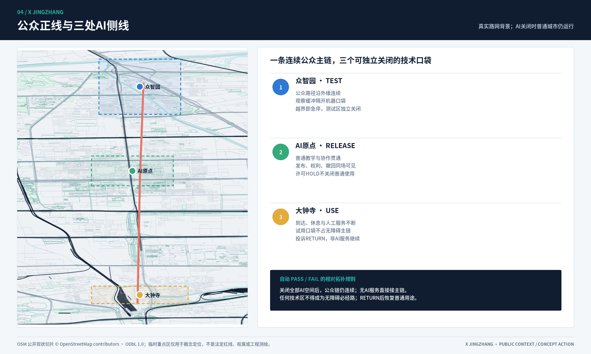

三类东西缝合剖面共享一条不可中断的公众路径，但受控活动层可按事故、天气、无障碍故障或许可状态单独关闭。现场无障碍审计、非AI等价服务、夜间安全、人工接管演练和失败复原构成连续性验收链；任一环节未闭合时，不开放相应技术功能。[standard:MOHURD-URBAN-DESIGN-MEASURES] [data:geometry/roads.geojson#ROAD-X01] [metric:east_west_stitch_count]

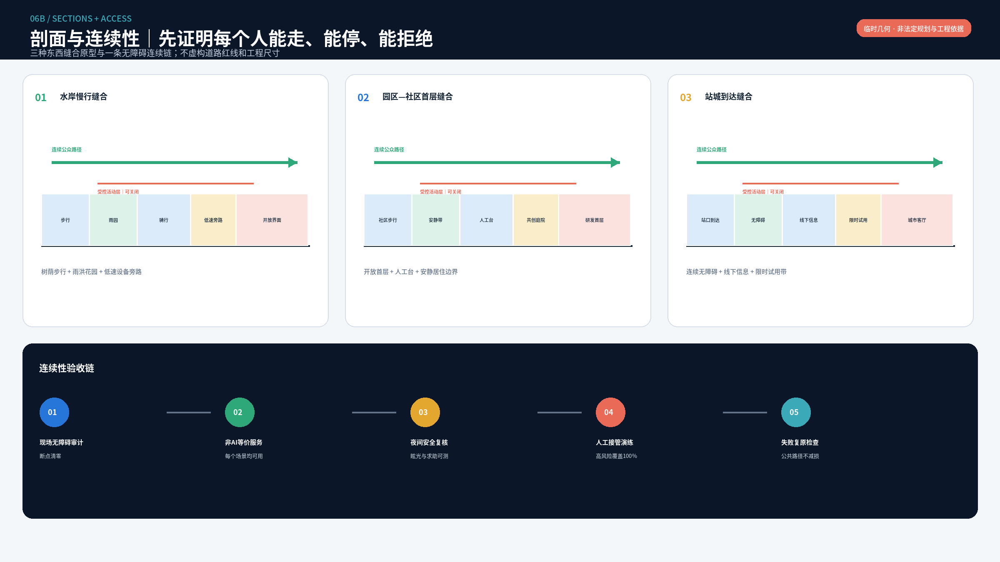

### agent.5 百年 X京张文化导览线：1909—2026—2126

文化导览不是零散的二维码，而是一条沿 `ROAD-SPINE` 串联六站、三种时间视角的连续公共路线。南门户“工程起点”解释1909年的自主建造；大钟寺X站把铁路到达转译为当代公众使用权；蓟门缝合站展示铁路如何重新连接社区；AI原点X站公开2026年的版本、许可与发布责任；小月河站把基础设施记忆与气候适应并读；众智园X站让参观者讨论2126年的城市技术应如何被检验和退出。六站均提供现场牌、纸质折页、触觉摘要和人工讲解，AI只可从已清权语料中检索与组织内容，不得生成未经核证的史实。[data:visual/assets/x-cultural-route.json] [metric:cultural_route_stop_count] [metric:cultural_narrative_era_count]

每条内容发布前记录来源、权利、版本和文史复核人；无法追溯的内容不进入导览，存在争议的内容并列展示证据状态。导览服务的目标是静态替代可用率100%、已发布内容来源可追溯率100%，但现场连续性、站点位置和无障碍条件必须待正式边界与实地审计后确认。这让AI增强检索而不替代城市记忆的人工判断。

## AI 创新生态、人才画像与 AI+ 场景

| 场景 | 类型与锚点 | 主责/协作 | 数据边界 | 人工接管与响应时限 | 衡量指标、停止与复原 |
| --- | --- | --- | --- | --- | --- |
| SC-01 模型安全共证场 | 产业验证·众智园 | 平台运营方 / 独立红队、法律顾问 | 授权测试集、模型版本、风险日志；原始数据按任务删除 | 安全负责人现场批准；严重事件15分钟内停机 | 严重缺陷关闭率；越权访问或无法复现即停止，冻结日志并撤场 |
| SC-02 端侧算力能效台 | 产业验证·众智园 | 设施运营方 / 能源、安全工程师 | 设备功耗、温度、匿名负载；不存任务内容 | 超温自动告警，工程师30分钟内接管 | 单位任务能耗；超温、噪声或供电条件不明即退出 |
| SC-03 具身智能受控试场 | 产业验证·众智园 | 测试场运营方 / 交通、安全、社区观察员 | 设备遥测与事件记录；不做人脸识别 | 现场急停小于5秒，开放时全程值守 | 人工接管成功率；越界、碰撞或公众投诉未闭环即暂停并恢复日常空间 |
| SC-04 自主技术互操作台 | 产业验证·AI原点 | 开源社区 / 第三方复测、企业权利人 | 接口版本、成功率；不上传私有代码 | 发布前双人复测，2个工作日回应争议 | 可复现率；连续两轮不可复现或锁定风险即下架 |
| SC-05 开源成果发布厅 | 生态·AI原点 | 高校转化平台 / 开源社区 | 授权项目元数据与许可证 | 发布前权利审查，撤回请求5个工作日处理 | 清权完成率；许可、隐私或无障碍检查失败即撤回 |
| SC-06 数据权利会客厅 | 服务·大钟寺 | 合规服务主体 / 法律、数据权利人 | 授权目录，不搬运原始数据 | 权利不清转人工，不输出交易结论 | 权利说明完整率；来源不清或超用途即停止 |
| SC-07 无障碍慢行导航站 | 公共服务·主轴 | 公园运营方 / 交通、残障用户代表 | 设施状态、路段级流量、自愿反馈 | 路线建议发布前人工踏勘，紧急误导即时下线 | 连续可达率；出现安全冲突即回退纸质和人工导航 |
| SC-08 社区服务翻译站 | 公共服务·东翼 | 社区服务中心 / 翻译与业务人员 | 文本现场处理，默认不留存，不接触证件原件 | 涉及权利义务必须转人工，等候不超过15分钟 | 人工纠错率；错误影响办事权利即停止AI回答 |
| SC-09 铁路工程记忆站 | 文化·主轴 | 文化运营方 / 文史专家 | 已清权史料与版本记录 | 史实发布前专家审校，争议7日内标注 | 来源可追溯率；史料来源不明即撤展 |
| SC-10 低碳设施维护站 | 城市治理·绿脉 | 园林市政运营方 / 环境工程师 | 设施编号、环境状态，不采个人数据 | 人员决定工单，紧急故障30分钟响应 | 误报率与闭环时间；连续误派即回退人工巡检 |
| SC-11 夜间安全共治站 | 公共服务·AI原点 | 公共空间运营方 / 社区、安保 | 非识别式热力与人工报告 | 报警必经人员确认，现场事件即时响应 | 误报和投诉率；形成身份追踪或眩光扰民即撤除 |
| SC-12 全球开放协作周 | 运营·全线 | 年度委员会 / 场地、版权、无障碍团队 | 活动计划、授权报名和聚合反馈 | 每场有人主持，投诉2小时内回应 | 国际合作任务与问题关闭率；许可、安全或权利缺口即取消相关单元 |

### SC-03 英雄场景：一台机器人如何被城市退回

SC-03不再停留在“具身智能”标签，而采用可执行的 X Receipt 协议。拟议技术栈限定为低速地理围栏机器人、激光雷达/深度感知、里程计与局部地图、独立围栏监测、最小风险停车、物理与值守远程急停；感知只识别人、轮椅等通行类别，不做人脸识别，不保留图像，不允许系统自行扩大运行边界。机器测试区、观察缓冲区和永久公众通道三层分离，任何失败只关闭前两层，公众通道保持开放。[data:visual/assets/x-receipt.schema.json] [data:visual/assets/x-lifecycle-valid-example.json]

本次提交实际运行了一次**合成桌面演练**，不是现场试点：09:00进入众智园TEST；09:17模拟“儿童/老人意外穿越”工况；09:17:05触发人工急停并判定RETURN；系统冻结事件记录、撤出设备、复原普通院落，再返回TEST。普通行人、轮椅优先、意外穿越、网络/规划器不可用四类固定工况均按预期执行，协议检查结果为 `4/4 fixtures`、`8/8 checks`；真实试点仍因场地、运营主体、设备参数、保险和批准缺失而保持 `BLOCKED`。[data:visual/assets/sc03-tabletop-evidence.json] [metric:sc03_tabletop_rehearsal_count] [metric:sc03_synthetic_fixture_count]

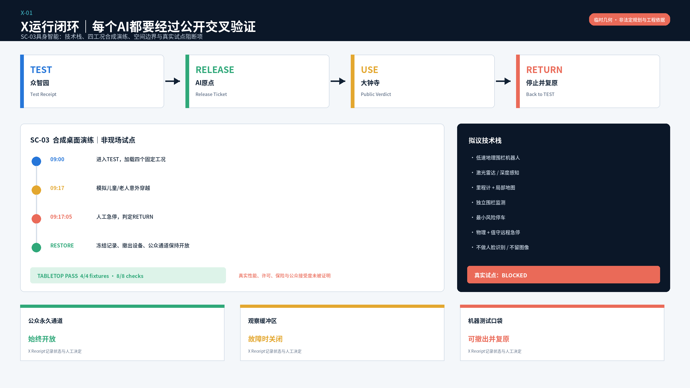

### 一件AI产品如何穿过三站：从0.8失败到0.10返回

为了让X不只停留在品牌层，本方案用同一台低速具身服务原型贯穿三站。以下过程是基于固定规则编排的合成运行叙事，不表示真实产品、企业、场地或审批已经存在。产品在任何时刻只有一个有效版本；每次跨站必须携带上一站票据的哈希，版本、场景或权利状态变化都会使下游票据失效。这样，城市面对的不是一个模糊的“机器人项目”，而是一条可以被暂停、追问和倒退的决定链。[data:visual/assets/lived-lifecycle.json] [metric:product_lifecycle_event_count]

| 事件 | 地点与版本 | 现场发生什么 | 人工决定 | 空间随之怎样变化 | 留下的证据 |
| --- | --- | --- | --- | --- | --- |
| L01 首次测试 | 众智园·0.8-test | 意外穿越工况触发，原型不能在声明时间内稳定完成让行 | 安全负责人判定FAIL | 机器口袋与观察缓冲关闭，公众通道保持开放 | 失败工况、急停来源、响应时间、未闭合缺陷 |
| L02 退出复原 | 众智园·0.8-test | 设备断电撤出，事件遥测冻结，临时围界回收 | 场地负责人签RESTORE | 测试院恢复为普通院落、座椅与绿地 | 撤场照片位、组件清点、日常状态检查表 |
| L03 独立复测 | 众智园·0.9-retest | 四类固定工况与失联、定位不确定性追加工况全部复跑 | 独立安全复核人签PASS | 仅在复测时重新启用机器口袋 | Test Receipt及版本、工况和人员签注 |
| L04 发布暂缓 | AI原点·0.9-rc1 | 一个软件组件的许可与测试版本不能完全对应 | 权利复核人签HOLD | 发布台不亮灯，展示桌转为普通方法教学 | 权利缺口、待补责任人与处理期限 |
| L05 限定发布 | AI原点·0.9-rc1 | 许可链、组件清单、限制条件和撤回责任补齐 | 发布负责人签LIMITED | 开放贡献环只显示“限定使用”，不显示认证或推荐 | Release Ticket及Test Receipt哈希 |
| L06 公众试用 | 大钟寺·0.9-limited-use | 有人服务、三层告知和无AI通道同时到位 | 公共服务负责人签OPEN | 机器仅进入可撤试用口袋，公众主链不变 | 开场检查、值守表、告知理解抽查 |
| L07 公众异议 | 大钟寺·0.9-limited-use | 轮椅优先路径附近出现设备或排队干扰 | 服务人员记录COMPLAINT | 机器立即HOLD，优先清空无障碍交叉口 | 匿名投诉票、处置时钟、受影响群体 |
| L08 城市退回 | 大钟寺·0.9-limited-use | 路线问题不能在当场通过位置调整消除 | 用户与无障碍复核人签RETURN | 试用口袋关闭，纸质与人工服务继续 | Public Verdict、空间复原检查、修订要求 |
| L09 返回起点 | 众智园·0.10-return | 新版本连同新的路径占用工况返回受控测试 | 状态改为PENDING | 未经复测不得回到AI原点或大钟寺 | 新测试任务书与前次三张票据链 |

这条链最重要的不是“最终通过”，而是允许产品在L01、L04和L08三次失败，并让失败产生不同后果。技术失败返回测试，权利失败阻断发布，公众使用失败同时改变控制逻辑与空间布置。任何人都不能用后续版本的成绩覆盖旧版本失败，也不能拿众智园的技术PASS替代AI原点的权利判断或大钟寺的公众判断。三站之间因此不是展览巡游，而是三种不同公共权力的接力。

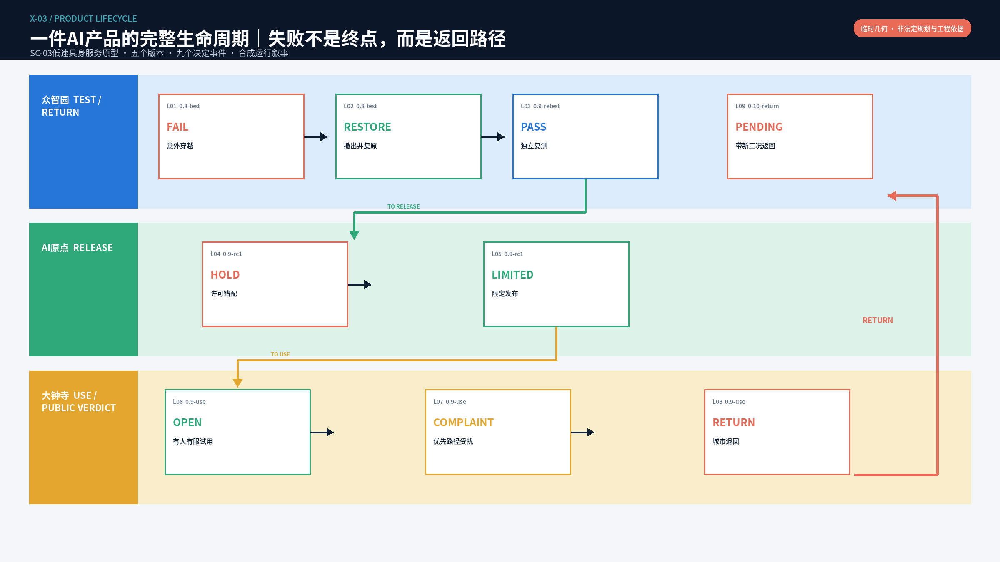

### 三站交接：三张票据不是三枚印章

三站采用“问题不同、签字不同、拒绝理由不同”的交接制度。Test Receipt只回答某个精确版本能否在精确边界内完成声明工况；Release Ticket只回答该版本的许可、数据权利、软件构成、限制和撤回责任是否允许有限发布；Public Verdict只回答在有人服务、非AI等价通道和真实异议存在时，城市是否愿意让这项有限使用继续。任何票据都不是政府审批、产品认证或永久通行证，三张票据都有期限、范围和主动撤回入口。

| 票据 | 必填字段 | 建议签注角色 | 明确不证明 | 拒绝后去向 |
| --- | --- | --- | --- | --- |
| Test Receipt | 产品与模型版本、固定工况、测试边界、人工急停、未闭合缺陷、原始记录哈希 | 候选运营主体 + 独立安全复核人 | 不证明许可清权、公众接受、采购价值和全场景安全 | 回到众智园修订、复原测试空间 |
| Release Ticket | Test Receipt哈希、软件/模型/数据清单、许可、用途期限、公开限制、撤回责任人 | 权利复核人 + 发布负责人 | 不证明政府背书、商业推荐、现场可用和长期运营 | 留在AI原点HOLD，不进入公众试用 |
| Public Verdict | Release Ticket哈希、告知理解、无AI等价服务、投诉、分群差异、继续/修改/退回决定 | 公共服务负责人 + 用户/无障碍复核人 | 不证明所有人满意、永久部署和后续版本自动适用 | 关闭试用口袋，回到众智园或AI原点 |

交接发生在可见的公共界面。众智园出口设置“测试交接桌”，只展示版本、边界、工况和仍未解决的问题；AI原点设置“发布双台”，一侧展示可复现方法，另一侧提供许可、限制与撤回；大钟寺设置“公众裁决桌”，把继续、修改、停止三个状态与人工申诉、纸质服务放在同一视线内。票据状态失效时，相应灯带和标志撤下，空间恢复普通学习、休息或通行用途，避免过期成果继续以展览形式获得事实上的背书。[metric:handover_ticket_type_count]

票据链使用“上游哈希 + 当前版本 + 人工签注 + 到期时间”四项最小关联。若0.9-retest在AI原点被改为0.9-rc1，发布方必须解释变化并判断是否需要重测；若大钟寺现场改变路线、速度或感知范围，原Release Ticket不能自动覆盖新条件；若公众投诉揭示测试工况未覆盖的使用方式，Public Verdict必须生成RETURN任务，不能只写“优化体验”。这一机制让三站交接有明确的证据保管链，也让失败能够逆向改变测试任务书。[data:visual/assets/lived-lifecycle.json] [metric:ticket_hash_chain_target_percent]

上述规则已写入 `visual/assets/verify-x-lifecycle.js`，不是仅靠文字约定。状态机拒绝跳过TEST、票据类型替代、配置变化沿用旧票、哈希断链、缺少人工签注、权利不完整、票据过期、RETURN后继续USE以及无复测再次RELEASE；投诉触发RETURN时必须创建新的测试或复核任务。固定测试集为24例，其中22例预期拒绝、2例预期接受，当前结果为 `24/24 PASS`。这里的PASS只表示验证器正确接受或拒绝预设输入。[data:visual/assets/verify-x-lifecycle.js] [data:visual/assets/x-lifecycle-test-results.json]

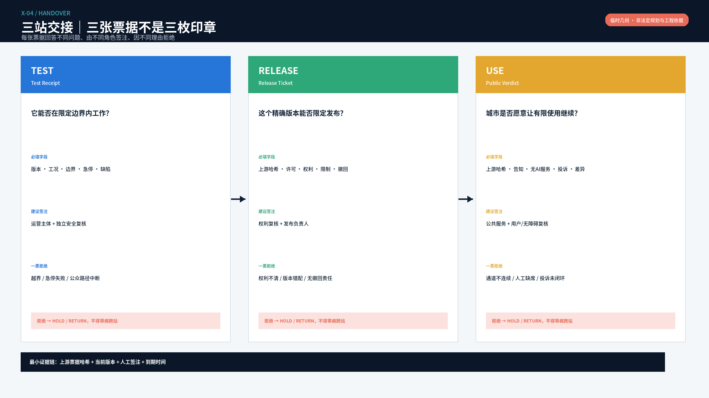

### 最小试点：十四天只回答一个问题

最小试点不追求活动规模，只回答“一个明确版本能否在一个受控空间中，经三站审查后接受一次有限公众使用，并在失败时恢复日常状态”。建议上限是一台已指定设备、一个机器测试口袋和一条始终开放的无障碍公众绕行线；精确尺寸、距离、速度和人数必须等待正式边界、现场测量、风险分析和批准，不能由概念方案预填。没有候选运营主体、保险、安全责任、无障碍复核和复原资源时，十四天倒计时不启动。

试点先搭建“正线—侧线—道岔—折返口袋”四件套，而不是先采购永久设施。公众正线只使用静态导向、可移动座椅和人工服务，断电或撤场后仍可用；AI侧线由可拆边界、设备泊位和独立断能组成；责任道岔是一张有人值守的签注桌、一个公众可见的实体停止动作和纸质状态牌；折返口袋保存设备、构件清单和复原检查表，RETURN后恢复为普通院落、教学、休息或商业界面。所有构件的尺寸、材料、防火、结构、无障碍和机电条件在现场专业复核前保持待定。[metric:reversible_pilot_kit_type_count]

| 最小空间套件 | 日常状态 | AI运行状态 | HOLD / RETURN动作 | 开场责任 |
| --- | --- | --- | --- | --- |
| 公众正线 | 连续通行、休息、人工服务 | 不改变主链 | 始终开放，清除设备和排队 | 无障碍与公共服务值守人 |
| AI侧线 | 院落、教学、休息或商业界面 | 承载精确版本与限定工况 | 独立断能、封闭并撤出 | 设备与现场安全值守人 |
| 人工责任道岔 | 普通服务桌 | 核对上游票据、版本、责任与期限 | 未签注即保持HOLD | 当站签注责任人 |
| 折返口袋 | 可恢复公共用途 | 临时设备与可拆构件待命 | 设备隔离、构件清点、生成复测任务 | 撤场与复原负责人 |

每个开放班次至少落实四项角色责任：现场总责、安全观察与急停、无障碍/人工服务、当站票据复核。角色可以由符合能力与独立性要求的人员兼任，但责任不得空缺；任一角色缺席，道岔不得朝向AI侧线。该规则是候选运营安排，不虚构现有机构已承诺承担。[metric:minimum_pilot_shift_role_count]

| 时间 | 必须完成的动作 | 通过证据 | 阻断条件 |
| --- | --- | --- | --- |
| D-30 | 明确候选运营主体、场地、保险、安全与无障碍复核角色 | 责任清单和待签字段 | 任一责任无人承担 |
| D-7 | 完成现场踏勘、公众告知理解测试、普通状态恢复演练 | 断点图、告知测试、复原清单 | 无障碍主链中断或复原失败 |
| D0 | 重跑四个合成工况，冻结X Receipt版本 | 可复现桌面记录 | 工况、版本或脚本不一致 |
| D1—D3 | 在无公众进入机器口袋的条件下做封闭测试 | 值守、急停、边界和事件记录 | 越界、失联或接管失败 |
| D4 | 独立复测并决定Test Receipt | 双人签注与未闭合缺陷 | 无法复现或缺陷被隐藏 |
| D5—D7 | 核对权利、版本、限制和撤回路径 | Release Ticket候选稿 | 权利不清、版本错配或无人撤回 |
| D8—D12 | 有人值守的有限公众使用，同时开放无AI服务 | 开场检查、投诉票和服务日志 | 人工缺席、替代服务中断或重大异议 |
| D13 | 公布去标识化问题、分群差异和复原证据 | 公开问题清单 | 事故、投诉或差异被遗漏 |
| D14 | 作出继续、修改或RETURN决定 | Public Verdict | 不允许以活动结束代替正式决定 |

十四天结束不默认续期。PASS只允许同一版本、同一边界和同一用途进入下一次有期限的复核；HOLD让责任道岔保持朝向公众正线；RETURN关闭侧线、设备折返并生成新任务；RESTORE只有在构件清点、普通用途复原和无障碍主链复核完成后才结束。真实试点要证明的不是合成演练中的`4/4`，而是值守是否到位、公众是否理解、急停是否真实有效、投诉是否改变决定，以及撤场后空间是否仍然好用。[metric:minimum_pilot_duration_days]

### 三种失败：技术、权利与公众使用分别怎样收场

**F-TECH-01 技术失败。** 原型在众智园出现定位不确定性，超出任务书声明的边界容差。独立围栏监测先触发HOLD，值守安全负责人执行实体或远程急停，机器测试口袋与观察缓冲区关闭，公众永久通道不关闭。事件遥测被冻结，图像仍按“不留存”规则处理，不因为事故而临时扩大采集。设备撤出后，测试院恢复座椅、步行和开放绿地。只有在同一硬件、软件和地图版本上独立复跑“定位丢失—最小风险停车—人工接管”工况，才可申请新的Test Receipt。

**F-RIGHTS-01 权利失败。** 0.9-rc1到达AI原点后，发布人员发现某软件组件许可已过期，或许可证不能与众智园测试的精确哈希对应。此时技术PASS仍然有效，但发布状态立即HOLD。开放贡献环撤下“可试用”状态，发布桌转为普通方法课堂；系统停止分发，不删除必要的审计记录，也不公开存在争议的代码或数据。权利复核人记录缺口、责任人和期限。只有许可证、组件清单、版本哈希及撤回责任重新闭合，才可签发新的Release Ticket；不能用企业承诺或现场演示代替清权。

**F-PUBLIC-01 公众使用失败。** 设备本身没有碰撞，但排队、观察者或设备停靠侵入轮椅优先路径，或有人服务台临时无人。大钟寺公共服务负责人必须先停止设备、清空交叉口并切换纸质和人工服务，而不是等待算法判断。投诉可以匿名提出，五分钟内取得纸质回执；去标识化事件进入公开决定册。恢复试用至少需要用户主导的路线复测，并在两个复核周期内不再出现显著群体差异。若不能满足，日常状态保持为连续无障碍通行和有人服务，产品返回众智园，不以“用户不熟悉技术”解释失败。[metric:failure_case_count]

三种失败对应三种空间动作：技术失败收缩机器边界，权利失败撤下发布界面，公众失败恢复普通通行与人工服务。共同底线是公众不为产品失败承担绕行、等待或数据代价。失败记录与成功记录并列展示，但不显示个人排行榜，不把投诉者、企业或测试人员变成永久标签。每次RETURN都必须回答“谁停止、哪里关闭、什么仍开放、记录如何处理、何时才能回来”五个问题。[data:visual/assets/lived-lifecycle.json]

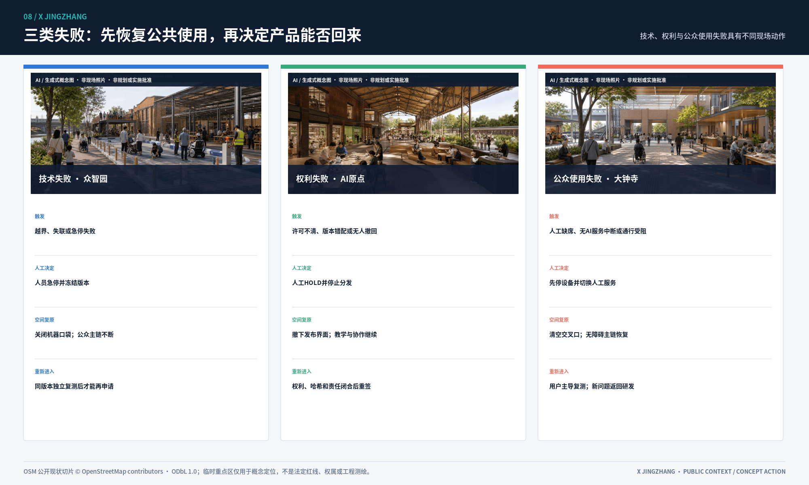

### AI为何让三处空间长得不一样

如果没有X机制，三处重点区很容易退化为实验室、路演厅和商业体验店。X要求每站都能辨认一条不依赖AI的公众正线、一条可关闭的AI侧线和一个由人承担责任的道岔，但三站不能复制同一布局。众智园是**测试侧线**：永久公众通道沿外缘连续，观察缓冲位于正线与机器口袋之间，只有受控交叉点连接内层。急停、边界、版本和负责人必须在进入前可见；FAIL后机器口袋折返为普通院落和开放绿地。

AI原点是**发布侧线**：“方法台—权利台—撤回界面”依次接入首层公众正线。方法教学和协作空间属于正线，权利失败只撤下产品状态，不关闭学习与合作；旧票据到期后不再亮灯。大钟寺是**城市试用侧线**：“有限试用口袋”与人工/非AI服务带平行，公众不穿过试用区也能到达商业、休息和交通目的地；异议发生后工作人员在不关闭主链的情况下清空设备与排队。三种侧线分别容纳技术失败、权利失败和公众使用失败；围界可拆、标志可换、服务并行和通道永久开放不是装饰语言，而是RETURN能否执行的空间条件。

三站拓扑被表达为节点、连接、AI依赖、无障碍属性、可独立关闭和RETURN恢复用途，而不是虚构尺寸。验证器逐站关闭全部AI节点，检查公众主链、侧袋隔离、无AI服务、无障碍独立性和三站差异，再检查众智园无旁路、AI原点撤回共可见和大钟寺非AI路径等价。历史首次运行曾以 `22/23` 拒绝AI原点的恢复用途；修复并补齐站点专属检查后当前为 `29/29 PASS`。该结果只进入专业附录，不作为现场证据或首层价值主张。[data:visual/assets/station-topology.json] [data:visual/assets/station-topology-results.json]

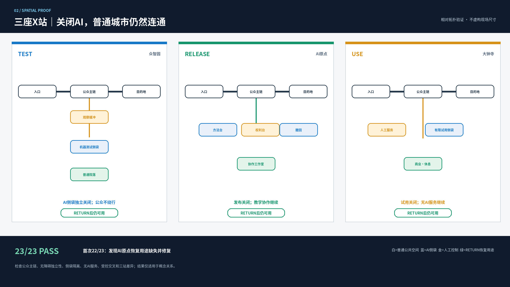

每个场景采用同一责任底线：运营主体承担主责，专业复核组负责批准，使用者和社区参与咨询，公众获得充分告知；AI不得成为责任主体。资源分为S级（既有空间与人员）、M级（可拆组件与专项服务）、L级（工程或长期运营，须另行论证）三级。12个场景中SC-01—SC-04为产业测试验证场景。[metric:scenario_card_count] [metric:industry_validation_scenario_count]

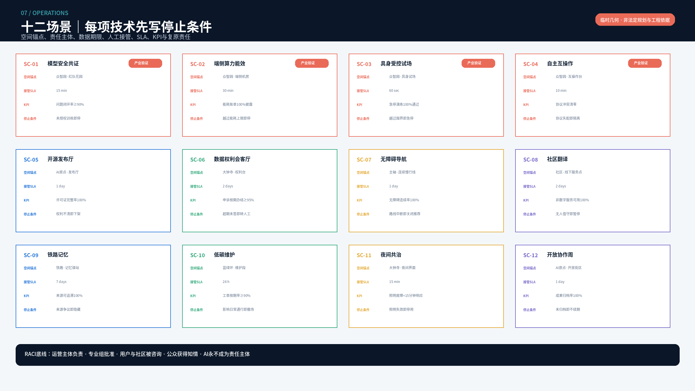

十二个场景不再平均用力。SC-03同一件低速具身AI产品成为贯穿三站的旗舰链，SC-01、SC-05和SC-10分别提供技术红队、开源发布与公众服务支撑；其余场景按登记册储备。三站合同把AI技术边界、空间拓扑、人工签注、90/180日证据和失败复原放在同一审查面上。[data:visual/assets/three-station-flagship-contracts.json]

### 三站旗舰合同：同一件产品，三种不可替代的审查

| 站点合同 | AI系统与数据边界 | 空间必须如何工作 | 90日 / 180日证据门 | FAIL后城市保留什么 |
| --- | --- | --- | --- | --- |
| **众智园 TEST**：它能否在边界内工作？ | 激光/深度感知、定位与局部地图、电子围栏、最小风险停车、实体与远程急停、版本化事件日志；只收授权工况、设备遥测和事件，不做人脸识别或持续人员轨迹 | 公众正线沿外缘连续；观察缓冲与机器口袋逐层向内；机器只能经有人值守、无旁路的受控交叉进入 | 90日先补候选主体、现场底图、公众路线、保险许可缺口和四工况计划；180日才检查两轮版本测试、独立复现、严重问题关闭和复原演练 | 关闭机器口袋，公众正线不停；设备撤出后恢复普通院落与开放绿地 |
| **AI原点 RELEASE**：这个确切版本是否有资格公开？ | 精确包哈希、SBOM、模型/数据卡、许可与权利清单、复现运行器、撤回登记；只登记上游票据哈希、版本和权利元数据，不接收未披露私有代码 | 方法台、权利台、撤回界面在同一首层视域连续出现；任一台HOLD即关闭发布，教学和协作继续 | 90日先完成角色、哈希依赖模式、许可缺口、复现和撤回演练；180日才检查双人复现、上游哈希、争议处理和两次撤回记录 | 撤下产品状态与发布界面，保留方法教学、协作和普通展览 |
| **大钟寺 USE**：公众能否平等地继续使用？ | 公众状态显示、限定路线、人工接管台、匿名投诉登记、非AI服务状态、RETURN任务生成器；不默认保留身份、面部或商业行为画像 | 试用口袋与公众主链平行；非AI服务和投诉点从主链直接到达；设备撤出不影响商业、休息和人工服务 | 90日先完成路线与服务审计、告知理解、无AI等价和投诉复原演练；180日才检查两轮分群复核、无障碍等价、人工服务、异议关闭和折返追踪 | 关闭试用口袋，公众主链不停；生成众智园新工况并恢复普通广场 |

90/180日均是**建议验收门槛而非已实现绩效**。候选主体、现场尺寸、预算、保险、许可和公众接受度仍待确认。可重跑脚本逐项核对合同与现有拓扑、场景和JZ-06—JZ-08项目的引用，当前仓库结果为 `37/37 PASS`；它只证明合同结构自洽，不代表现场、安全、无障碍、认证或审批通过。[data:visual/assets/three-station-flagship-contract-results.json]

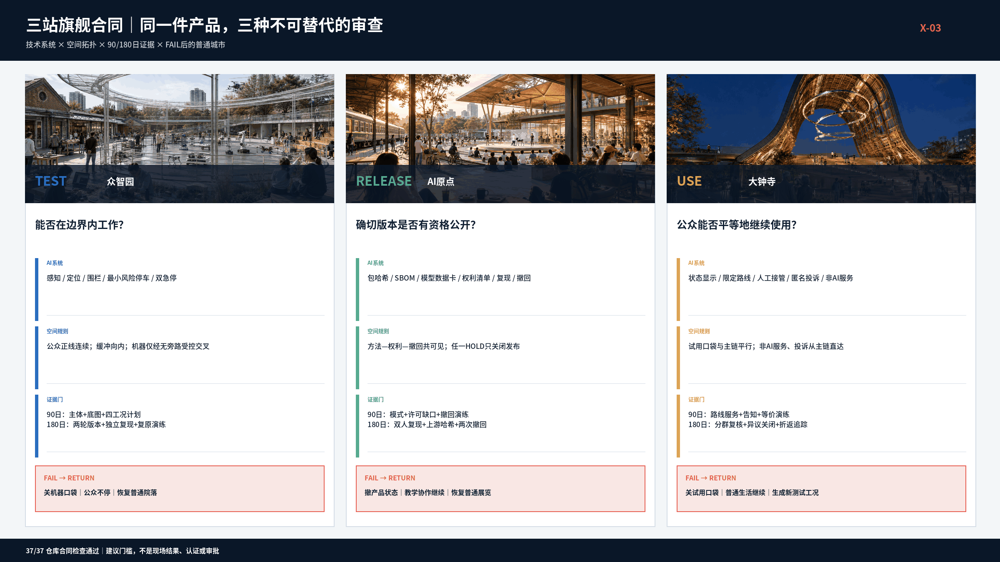

### 品牌、三处地标与八类组件

原创标志由两条交汇轨迹、一个人审节点和一条开放扩展路径组成：蓝绿轨迹构成清晰的 `X`，对应遗产与更新、研发与生活、试验与人工终决的三重交汇；中央节点要求关键决定可被人工复核，未闭合的金色路径表示系统可以修订、扩展或退出。标准色为证据蓝、公共绿、人工裁决金、警示珊瑚和夜墨；标志不得与企业Logo并排制造背书，不进入未清权商品或永久标识。

三处地标分别是众智园“轨证之门”、AI原点“开放贡献环”、大钟寺“城市试用灯塔”。它们均为可拆、低眩光、无广告的公共装置。八类组件为来源牌、试验牌、人工服务台、非数字服务面板、可移动座椅、低眩光灯、雨洪传感基座和触觉地图。贡献墙只记录自愿公开且可核验的贡献，也记录失败和退出，不建立个人声望排行榜。[metric:pilgrimage_landmark_count] [metric:public_component_count]

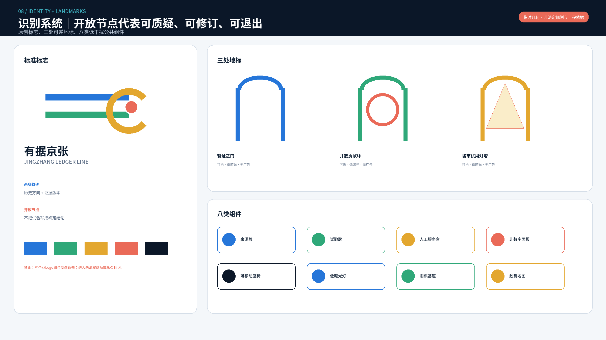

VI执行规范固定了标志构造、最小净空、最小数字尺寸、五种功能色、字体层级和三层公共信息。任何应用必须同时显示场景状态、权利信息和人工/非AI行动入口；禁止徽章化、企业背书、永久广告和隐藏暂停或退出状态。这样，品牌不是装饰，而是公众识别责任与选择权的统一界面。[source:AGENT-TASKBOOK] [metric:public_component_count]

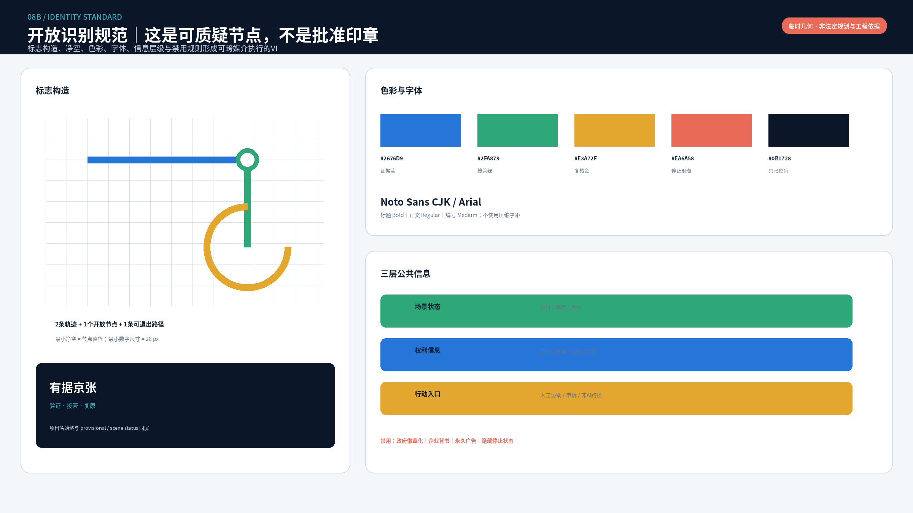

### 包容性：没有应用程序也能获得同等服务

#### 周阿姨的上午：没有手机也能让城市停止一次AI

周阿姨是用于检验方案的72岁合成人物，不对应真实居民。她走路较慢，需要连续无台阶路线和中途座椅，不使用智能手机办理公共服务，也不愿对机器说出个人情况。设计是否成立，不看她能否“学会使用AI”，而看她不使用AI时是否仍能顺利到达、获得同等服务，并在技术影响通行时真正改变现场决定。[data:visual/assets/lived-lifecycle.json] [metric:lived_journey_step_count]

**08:10，大钟寺到达边缘。** 她先看到的不是下载提示，而是人工服务台、纸质路线和三个并列状态：普通通行、有限试用、暂停/退出。工作人员不要求账号、手机号或人脸信息，只询问目的地和是否需要无台阶路线。纸质折页使用与地面导引相同的颜色和编号；若电子系统停机，导引仍然可读。她选择纸质路线，这一选择不降低排队优先级，也不被记录为“低数字能力”画像。

**08:25，城市试用阈值。** 三层告知先说明现场正在测试什么，再说明可能采集的事件数据和保存期限，最后给出人工协助、无AI路线、匿名投诉和立即退出入口。周阿姨不需要理解模型原理，只需知道“这台设备在哪里活动、谁在值守、我不参加时怎么走”。她沿公众主链继续，试用口袋位于另一侧，观察者和排队线不得跨过触觉边界。现场尺寸是深化阶段验收对象，当前方案不把概念图上的宽度写成已建事实。

**08:42，无障碍优先交叉口。** 一台处于限定使用状态的原型接近交叉点。系统应先进入HOLD并让行，但现场观察者聚集使可用净宽受到干扰。这里即使没有碰撞，也构成公众使用失败，因为人的安全与尊严不应以“设备没有撞到人”为唯一标准。值守人员看见问题后先停设备和疏散观察者，公众主链保持开放；不要求周阿姨绕过机器测试口袋。

**08:43，提出异议。** 她可以按下服务柱上的人工呼叫，也可以直接到服务台口述或填写纸质单。工作人员记录位置、时间、受影响服务和期望处理，不记录身份证号、联系方式或长期行为轨迹。她在五分钟目标内获得带事件编号的纸质回执。匿名不会降低投诉级别；如她愿意留下取件方式，可在五个工作日目标内到同一服务台领取答复，也可以只在公开决定册查询事件状态。[metric:anonymous_complaint_receipt_target_minutes]

**08:45，Public Verdict临时改为RETURN。** 公共服务负责人和当班无障碍复核角色共同判断：问题不是单次让行，而是设备、观察区与优先路径的空间关系没有被测试充分。试用口袋关闭，灯带从有限使用转为RETURN，设备撤出；普通商业、座椅、卫生间导引和人工服务继续。工作人员不能把问题记成“老人不适应新技术”，而必须生成新的众智园工况：设备停靠、围观人群和轮椅优先同时发生时，公众净空如何保持。

**09:05，继续日常行程。** 周阿姨沿纸质导引到达目的地。AI退出没有让服务消失，这才证明空间不是依赖设备才成立的展台。她不需要等待技术团队复盘，也不因投诉而被要求参与后续测试。现场恢复普通状态后，服务台仍可回答交通、卫生间、休息和文化导览问题。

**11:30，公开而不画像。** 决定册显示事件编号、场景版本、责任角色、临时动作、下一次复核时间和是否返回TEST，不显示姓名、年龄或可识别轨迹。年龄和“非数字用户”只用于本方案的合成审查，不进入真实投诉记录。若问题可能影响同类使用者，运营方邀请用户与无障碍组织参与路线复测，但参与必须自愿且不与获得答复绑定。

**D+5，闭环而不是安抚。** 周阿姨再次到服务台，看到的答复不是“已优化”，而是三项可核对结果：设备是否仍停用、空间如何调整、什么测试通过后才可能恢复。若只改变提示文字而没有消除通行冲突，Public Verdict保持RETURN。她也可以不同意处理结果并要求独立复核。一次普通人的异议由此穿过服务台、公众裁决、众智园新工况和下一版X Receipt，真正改变产品和空间。

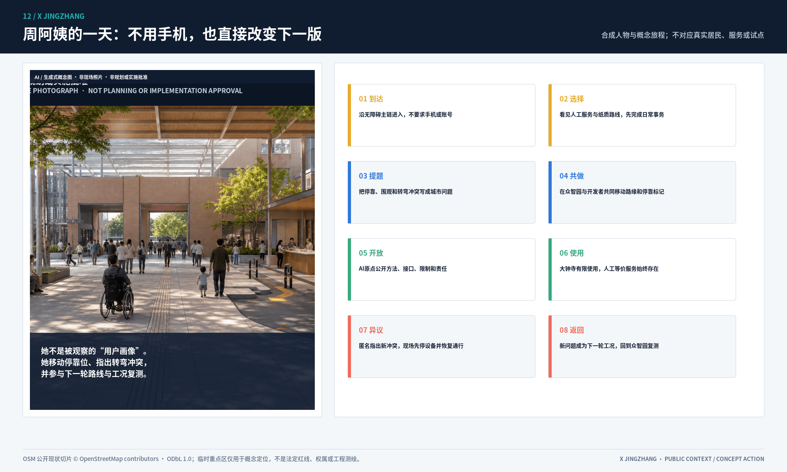

这条人物旅程对应五项不可拆分的权利：进入前可见状态、不使用AI仍有同等服务、无需账号接触工作人员、匿名异议获得回执、异议能改变继续/停止决定。评审时不只检查“是否设置服务台”，还应走完一次完整任务：从轨道到达点取得纸质路线，在设备关闭和网络中断条件下到达目的地，提出投诉并找到公开答复。任何一步失败，相关AI场景不得开放。

八类画像覆盖开发者、初创团队、高校师生、企业访客、周边居民、城市运营者、儿童照护者、老人及残障与非数字用户。连续无障碍路线、每400米以内概念休息节点、触觉和高对比信息、低眩光夜间照明、纸质和人工服务、无需人脸或智能手机的使用方式，是所有场景的进入条件。实际距离和设施位置须在正式边界与现场审计后复核。

公平指标包括：非数字服务可用率100%；高风险场景人工接管覆盖率100%；无障碍问题按期关闭率；不同用户组任务完成差距；夜间投诉响应时间；授权撤回按期执行率。任何群体的任务失败率持续显著高于总体、且两个复核周期未改善时，场景降级或停止。

## 更新项目清单、实施政策与分期计划

| 项目 | 主责建议 / 协作 | 窗口与资源 | 前置依赖 | 验收与失败退出 |
| --- | --- | --- | --- | --- |
| JZ-01 官方资料重建 | 规划数据协调方 / 测绘、设计团队 | 资料发布后30日；M | 官方边界多边形、坐标口径 | 全链差异报告；无法对齐则暂停精确指标 |
| JZ-02 遗产与公共叙事核证 | 文化运营方 / 文史、文保 | 0—6月；S | 资源清单与权利 | 史料100%可追溯；来源不明内容撤除 |
| JZ-03 无障碍连续性审计 | 公园运营方 / 使用者代表、交通 | 0—6月；S | 现场测绘 | 断点清单和责任人；重大断点未闭环不开放导航 |
| JZ-04 南北慢行原型 | 公共空间运营方 / 园林、交通 | 3—12月；M | 道路、桥下与管理权 | 连续可走且有替代路线；安全冲突即撤回 |
| JZ-05 十条东西缝合研究 | 交通专业团队 / 属地、社区 | 6—18月；L | 流量、红线、竖向 | 每条形成方案比选；无可行条件则保留导向不施工 |
| JZ-06 众智园受控验证院 | 场地运营方 / 安全、企业、社区 | 6—18月；M/L | 边界、安全、噪声、能源 | 急停和复原演练通过；否则不开场 |
| JZ-07 AI原点开源前台 | 高校转化平台 / 开源社区 | 3—12月；M | 合作与IP机制 | 权利票据完整；争议未决项目不发布 |
| JZ-08 大钟寺城市试用窗 | 产业服务平台 / 轨道、商业、无障碍 | 9—24月；L | 轨道接口、权属、消防 | 有人服务和无AI通道；不满足则缩为临时活动 |
| JZ-09 场景登记册与事故机制 | 年度委员会 / 法律、技术 | 0—6月；S | 数据治理章程 | 责任、期限、停止字段完整；缺字段不受理 |
| JZ-10 三地标与组件试装 | 公共空间运营方 / 设计、结构、清权 | 6—18月；M | 选址、消防、文保 | 夜间、结构、无障碍测试通过；否则拆除复原 |
| JZ-11 开发者与社区治理 | 社区秘书处 / 高校、企业、居民 | 持续；S/M | 公开章程 | 异议进入纪要且按期回应；连续失信暂停活动 |
| JZ-12 年度开放协作周 | 年度委员会 / 场地、安全、国际合作 | 每年；M | 许可、保险、版权 | 发布继续/修改/停止清单；重大风险未闭环取消 |

第一道门“证据补齐与低扰动原型”只做资料、审计、导览和可拆组件；第二道门“三站受控验证”要求责任主体、场地、安全、数据和公众复核全部明确；第三道门“评估后制度化转化”由独立评估决定是否进入规划、工程、采购或长期运营。试点不是采购，展示不是认证，参加活动不是永久数据授权。[data:geometry/phasing.geojson#PHASE-001] [metric:renewal_project_count]

年度运营按四季形成可取消的闭环，而不是活动清单：春季 ISSUE 由社区秘书处发布问题与权利边界；夏季 TEST 由场地运营方输出测试票据；秋季 RELEASE + USE 由发布与公众服务团队输出发布票和公众裁决；冬季 RETURN + REVIEW 由独立复核组公布继续、修改、停止决定。每季分别检查问题回应率、工况完成率、权利票据完整率、投诉关闭率和复原完成率，责任、产物、KPI与一票取消条件固化在机器可读运营文件中。[data:visual/assets/x-operations-cycle.json] [metric:annual_operating_season_count]

运营节奏为每周公开问题分诊、每月场景状态登记、每季度公开复核、每年形成一份继续/修改/停止公共决定册。开发者社区维护开放路线图，居民和目标用户参与问题定义，专业团队保留安全、法律和停止权；AI只承担资料整理、冲突提示和版本追踪。任何场景必须依次经过公开问题、受控测试、权利复核、限定公众使用和继续/返回决定；缺少法人、场地许可、权利票据、人工接管、非AI等价服务或复原资源时，该季单元取消，不顺延为默认批准。[metric:annual_public_decision_register_count]

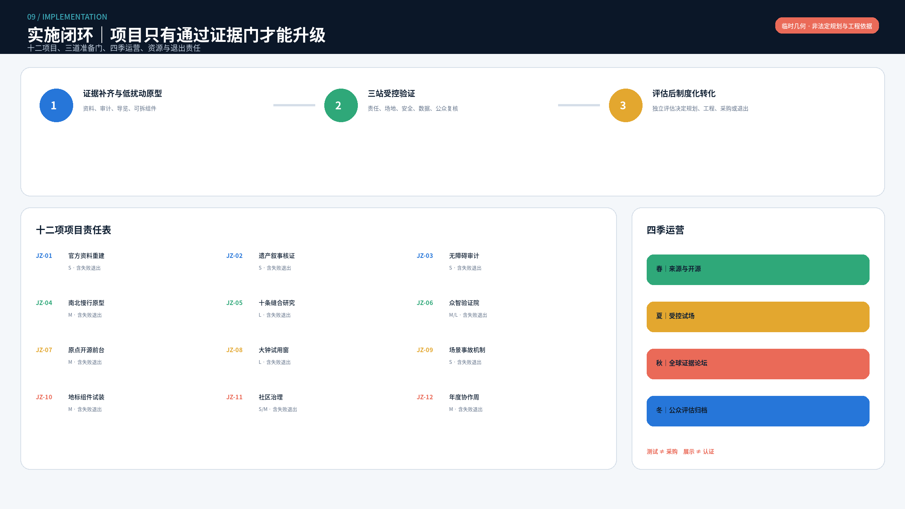

### 专业移交包：从概念成果进入下一道门

每个项目进入受控试点前必须形成十项可签注移交件：正式资料差异报告、重点区现状底图、候选运营主体责任书、场景登记卡、安全论证、数据与权利影响检查、无障碍现场审计、全生命周期资源简报、失败复原方案、继续/修改/停止的门槛决定。缺少责任法人、专业批准、公众告知、人工接管、非数字服务、数据到期或复原资源中的任何一项，项目只能保留在研究状态。

移交件不虚构授权：当前包只给出字段、责任角色、验收证据和失败动作，组织名称、签字、预算、保险、现场测量和批准状态保持待补。专业团队接手后可按 JZ-01—JZ-12 逐项签注，而不必从叙事文本重新拆解任务。[depth:phasing_implementation] [metric:renewal_project_count]

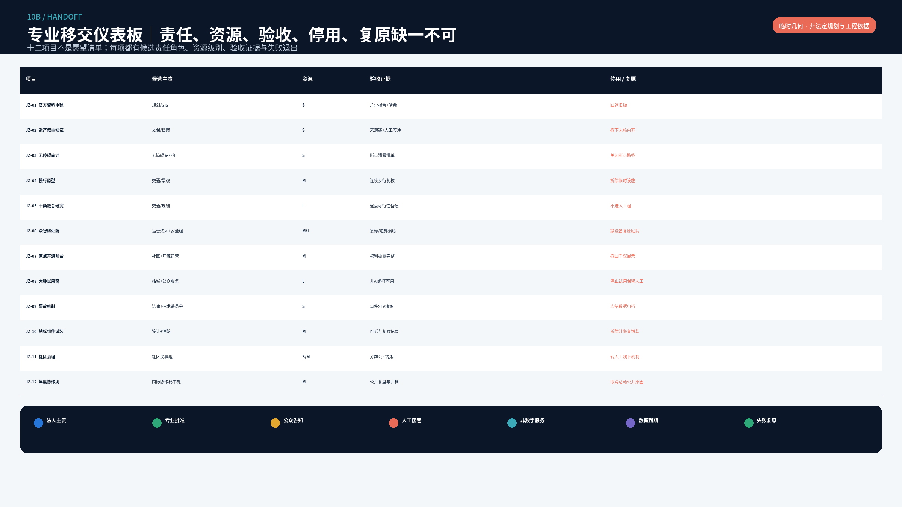

## 指标体系、面积复算与合规矩阵

风险最高的不是技术失败，而是责任不清、精确感误导和退出资源不足。`risk.json` 登记数据隐私、实施复杂度、公众接受、运维成本、政策不确定、空间争议、技术成熟度和公平包容八类风险；每类均包含缓解措施和人工复核。场景上线前必须完成数据期限、人工接管、投诉、事故、删除和场地复原演练。

可复算指标包括临时范围面积、概念绿地和公共空间面积、建筑接口基底、主轴与网络长度、14个用地单元、10条东西缝合、12个场景、4个产业验证场景、8类画像、3处地标、8类组件和3个阶段。容积率、高度、道路红线、总建筑面积、预算和权属均保持“待确认”，不用推测值补齐。[metric:site_area_sqm] [metric:floor_area_ratio] [metric:implementation_budget_cny]

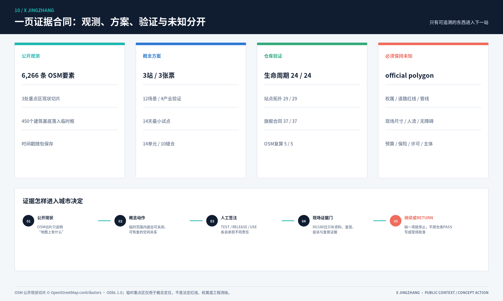

## 风险、版权与合规说明

正文、图形、设计图层、HTML与PDF由声明的AI agent和本地工具针对本项目生成；体验图由参与者通过网页生成后提供，文件未保留可核验的供应商或模型元数据，因此不猜测具体模型。所有体验图均标为概念图，不是现场照片。图纸不加载商业地图、第三方照片、企业Logo或个人数据。Noto CJK字体按其开放许可用于文档排版。逐项记录见 `report/copyright_statement.md`。[source:COPYRIGHT-LEDGER]

本成果是开源概念建议，不能替代规划、建筑、交通、市政、文保、法律、安全、运营和审批专业工作；入库、自检或评审通过均不代表政府背书、实施批准、采购、认证或获奖。

合规流程从“来源登记”开始，以“退出复原”结束：场景运营方对合法性和日常运行负责，规划、交通、安全、法律和无障碍专业人员批准对应门槛，社区和目标用户参与问题定义，公众获得用途、数据期限、申诉和替代服务信息，AI不成为责任主体。`risk.json` 对八类风险记录触发器、缓解措施、人工复核和停止条件；高风险场景必须演练急停、人工接管、数据冻结、删除和空间恢复。三张体验图保留原始生成文件，双语合成图只做裁切、标题和声明，具体工具与未暴露的模型子版本均如实披露，不猜测权利或模型信息。[source:COPYRIGHT-LEDGER] [source:SOURCE-REGISTRY] [metric:scenario_card_count]

公开资料边界、个人隐私、素材版权和数据授权在上线前分别核验；来源不明、授权到期或复核责任缺失时，对应场景直接停止，不以技术可用替代合规判断。

## 参考资料

### 附录：X Census赛道词汇检查

X Census不再承担首层概念证明，只用于检查本方案是否落入已经饱和的叙事。脚本在记录的git SHA上读取800份 `ready_for_review + formal` 投稿，成功800份、失败0份：受控测试语言命中766份，人工复核或接管命中783份，治理/审计/证据等语言命中800份；公众非AI等价路径命中117份，同时命中TEST、人工决定、公众退出和rollback/return的组合为73份。结果说明“有测试、有治理”不能构成原创性主张，也不证明其余727份方案缺少等价机制。[data:visual/assets/x-census.json] [metric:x_census_rare_combination_count]

统计是透明关键词规则下的可重复文本判定，不是人工质量评分。规则、逐项命中和运行日志随包保存；第三方可在本投稿目录运行 `node visual/assets/run-x-census.js --repo-root ../../..` 重算，不利结果也必须保留。[data:visual/assets/x-census-details-index.json] [data:visual/assets/x-census-reading-log.json] [source:X-CENSUS-CURRENT-TREE]

正式任务依据、临时边界来源、专业标准及八个国际案例的一手链接、发布日期、适用边界和权利说明均登记于 `sources.json`。正文引用以 `[source:*]` 回指该登记表；未登记资料不作为结论依据。[source:SOURCE-REGISTRY] [source:OFFICIAL-ANNOUNCEMENT] [source:AGENT-TASKBOOK]

参考资料分为五组。第一组是官方公告与任务书；第二组是规划与设计深度标准；第三组是只支撑概念几何的临时来源；第四组是八个机构案例，只迁移机制；第五组是国家铁路局与北京市公开的京张历史、运行规则和遗址公园资料，只支撑有边界的设计转译。[standard:PROJECT-OFFICIAL-ANNOUNCEMENT] [standard:PROJECT-AGENT-OPEN-CALL-TASKBOOK] [source:NRA-TECHNICAL-RULES]

X Census直接读取当前git tree，不作为外部事实来源。链接失效或内容更新时，对应结论降级并进入更新日志；引用不等于合作、认证、绩效预测或商标许可。[source:X-CENSUS-CURRENT-TREE]

- `brief/public-brief.md`：仓库公开任务书草案，仅作任务背景和方案边界引用。
- `brief/README.md`：仓库公开资料边界说明，用于约束资料状态和复核责任。
