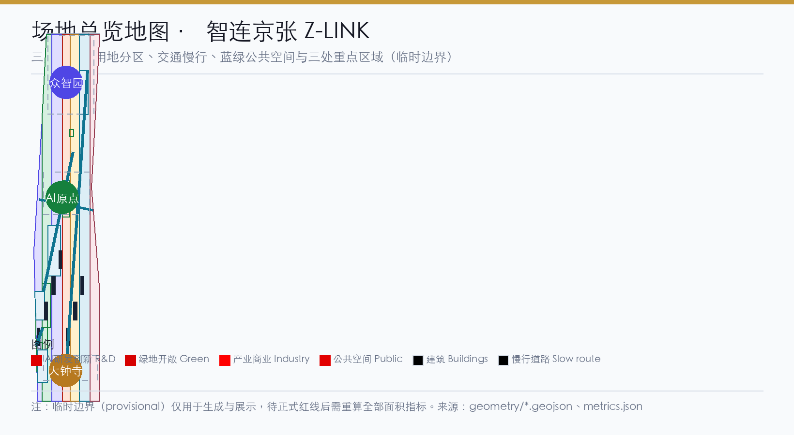
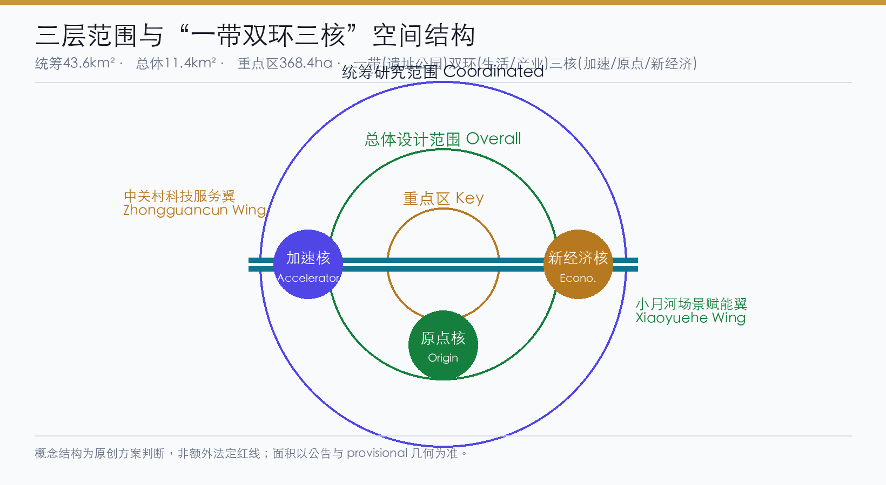
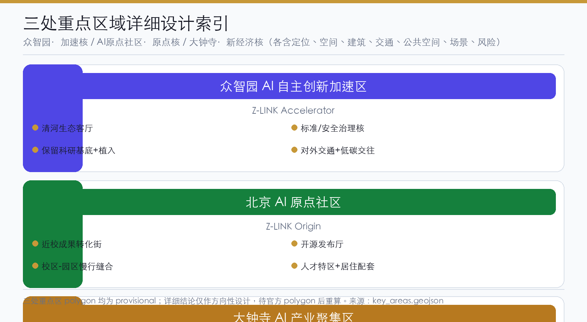
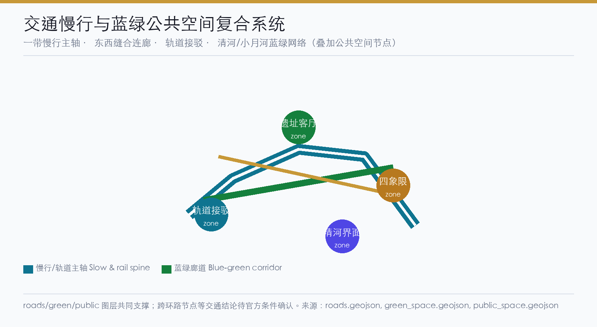
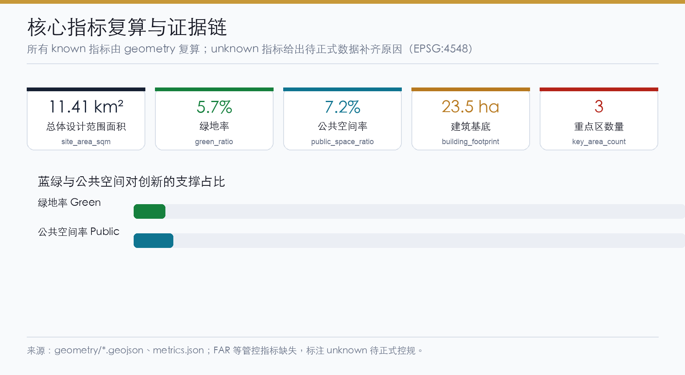

# Z-LINK (Zhi-Lian Jing-Zhang): Urban Renewal and AI-native Urban Forum for the Centennial Jing-Zhang AI Innovation Belt

## Design Basis and Source Inventory

This proposal takes as its primary basis the *Pre-qualification Announcement of the International Scheme Solicitation for the Urban Design of the Centennial Jing-Zhang AI Innovation Belt* published by the Haidian Branch of the Beijing Municipal Commission of Planning and Natural Resources, and the machine-readable provisional boundaries, key areas, enums, metrics, and source inventory registered by the maintainer in `brief/site-package/` as its secondary basis [source:OFFICIAL-ANNOUNCEMENT] [source:AGENT-TASKBOOK] [source:SOURCE-REGISTRY]. The design framework draws on the three positionings, five functions, three-areas-two-wings layout, and six mandatory tasks of the agent-facing open-call taskbook. All results are open, co-created conceptual suggestions and do not replace formal planning or constitute government-approved conclusions [standard:PROJECT-OFFICIAL-ANNOUNCEMENT] [standard:PROJECT-AGENT-OPEN-CALL-TASKBOOK] [depth:existing_conditions_diagnosis].

Because the official `SITE_BOUNDARY` and the three `KEY_AREA` polygons are not yet available, this package is generated using the provisional polygons in `brief/site-package/geometry/provisional_boundaries.geojson` (`geometry/site_boundary.geojson#SITE-001` and `geometry/key_areas.geojson#PROV-KEY-001/002/003`), all labeled `provisional_constraint` with `official_boundary=false`. The temporary boundaries are only for generation, self-check, visualization, and design discussion; they cannot serve as an official redline, approval basis, precise-area basis, or statutory control conclusion [data:geometry/site_boundary.geojson#SITE-001] [metric:site_area_sqm]. This organizer-side data gap does not by itself block content scoring; once official polygons arrive, the site boundary, key areas, land use, roads, green space, public space, buildings, phasing, and all area metrics must be recalculated in `EPSG:4548` and replaced [metric:site_area_sqm].

## Three-Level Scope Working Framework

Following the three levels fixed by the announcement, the proposal cascades industrial strategy, overall urban design, and key-area detailed design: the coordinated research scope covers 43.6 km² of AI innovation ecology and future-urban-form judgment; the overall design scope covers 11.4 km² of the urban and industrial area within 1–2 km around the Jing-Zhang heritage park, carrying the overall urban renewal framework, industrial-space layout, transport and municipal support, and urban-fabric control; the key detailed-design scope covers 368.4 ha across three areas, delivering functional mix, building scale, retain/renovate/demolish logic, public-space connectivity, and transport organization [source:PROCESSED-FACT-PACK] [metric:site_area_sqm] [depth:three_level_scope_framework].

The three levels are not separate sheets but are threaded by one design logic: the coordination level introduces the "one-belt-two-rings-three-cores, AI-native Urban Forum" concept (see the coordination chapter), the overall level turns it into renewal projects, land-use structure, slow-mobility and blue-green systems, and the key-area level validates implementable parcels, buildings, and AI application scenarios in Zhongzhiyuan, the AI Origin Community, and Dazhongsi [depth:overall_spatial_structure] [data:geometry/land_use.geojson#LU-001]. Full mapping of the three levels to announcement tasks 1.3/1.4/1.5 and tasks agent.1–agent.6 is recorded in `compliance_matrix.json`, linking every task to report sections, layers, metrics, drawings, and the HTML page.

| Scope level | Design question | Proposal answer | Data anchor |
| --- | --- | --- | --- |
| Coordinated research | How to organize the AI ecology and future urban form | Five-chain synergy: universities-cradle, open-source, enterprise-transformation, public-experience, international-communication | [data:geometry/land_use.geojson#LU-001] |
| Overall design | How to map industrial space, renewal, transport, and fabric | Land use, slow-mobility, blue-green, renewal, and phasing layers jointly expressed | [data:geometry/roads.geojson#ROAD-001] |
| Key areas | How the three areas reach detailed-design depth | The three areas realize "accelerator/origin/new-economy cores" respectively | [data:geometry/key_areas.geojson#PROV-KEY-001] |

## Coordinated Research Scope: Industry and Future-City Study

The coordinated research scope carries two tasks: building a world-class AI innovation ecosystem and studying the future urban form. This proposal introduces the overall concept **"Zhu-Lian Jing-Zhang (Z-LINK) — an AI-native Urban Forum,"** which steers the naming system, logo direction, three-areas-two-wings synergy loop, and the overall spatial structure [source:AGENT-TASKBOOK] [standard:PROJECT-AGENT-OPEN-CALL-TASKBOOK] [depth:overall_spatial_structure].

**Naming and logo (agent.1).** The Chinese name "智连京张" (Zhi-Lian Jing-Zhang) means "intelligent connection, smart linkage," echoing the century-old gene of the Jing-Zhang Railway linking north and south. In "Z-LINK," the "Z" stands for "Zhì (wisdom) / Jing-Zhang / Zone," and "LINK" stresses the connection between the digital and the humane and between industry and city. The naming system is three-tiered: the primary brand is "Z-LINK · Jing-Zhang AI Innovation Belt"; the secondary functional brands are "Z-LINK Origin (Origin Community) / Z-LINK Accelerator (Zhongzhiyuan) / Z-LINK Economy (Dazhongsi)"; the tertiary scenario brands are "Z-LINK Park / Z-LINK Forum / Z-LINK Path." The **logo direction** uses a "converging twin-track polyline" motif: two parallel track lines converge at a point and extend into a data-node array, metaphorizing the transformation from Jing-Zhang rails to the AI data network as a "track—data—park" continuum. The identity palette is "Jing-Zhang indigo + Zhongguancun orange + innovation violet," pointing respectively to heritage, industry, and the future. The naming and logo are conceptual directions for professional teams to deepen, and use no unauthorized fonts, images, trademarks, or existing park names [standard:MOHURD-URBAN-DESIGN-MEASURES].

**Three-areas-two-wings synergy loop.** The proposal maps the three positionings and five functions onto a circular mechanism. Among the three areas, the AI Origin Community carries "world-class AI innovation ecology" and the civilization-origin function (innovation seeding), Zhongzhiyuan carries the "AI full-stack independent innovation system" and "global AI-governance voice" (independent acceleration), and Dazhongsi carries "AI-native new business" (scenario transformation). Among the two wings, the Zhongguancun Technology-Service Wing provides global element allocation, Zhongguancun IP, and capital enablement, while the Xiaoyuehe Scenario-Empowerment Wing delivers AI scenario landing and an intelligent vibrant city [source:AGENT-TASKBOOK].

**Overall spatial structure "one belt, two rings, three cores."** The one belt is the Jing-Zhang heritage park AI vitality corridor, the historical and public-space spine that runs north–south and connects the three cores; the two rings are the urban AI-living experience ring (coupling public services through the blue-green slow-mobility system) and the industrial-innovation synergy ring (linking universities, Zhongguancun, and scenario districts through rail and arterials); the three cores are Zhongzhiyuan "accelerator core," the AI Origin Community "civilization-origin core," and Dazhongsi "new-economy core." The spatial structure is expressed on the master map with [data:geometry/land_use.geojson#LU-001] [data:geometry/roads.geojson#ROAD-001] [data:geometry/green_space.geojson#GREEN-001].

**Global AI innovation ecosystem cases (agent.2).** To ground the coordination judgment, the proposal draws on six global cases as cross-scale references, stating clearly their transferable mechanisms and limits — all as conceptual benchmarking, not local replication:

1. **Silicon Valley (Palo Alto / Mountain View)**: the combination of open source, venture capital, university seeding, and low-density R&D districts becomes a "near-campus seeding + open-source collaboration + capital linkage" mechanism.
2. **Cambridge Science Park, UK**: academic-industry symbiosis at a slow-mobility university-town scale becomes the "campus–park slow-mobility stitching" strategy.
3. **Guangdong–Hong Kong–Macao Greater Bay Area digital-economy belt**: the hardware R&D–manufacturing–scenario closed loop becomes "Zhongzhiyuan full-stack autonomy + Dazhongsi smart-terminal scenario" chain coupling.
4. **one-north, Singapore**: the integration of living–working–recreation and the green-lung system becomes the "blue-green slow-mobility ring + talent life services" framework.
5. **King's Cross, London**: the path of renewing a rail heritage site into a knowledge-economy quarter becomes the "Jing-Zhang heritage-park activation + innovation-street mixing" strategy.
6. **Seoul / Toronto smart-city and AI-governance experiments**: exploration of city agents and public-data trusts becomes the "global AI-governance voice + public experience" mechanism.

Full provenance, licensing, and transfer limits are recorded in `sources.json`; none are presented as committed investment, policy, or implementation [source:AGENT-TASKBOOK].

**Regional Synergy Mechanism (agent.2 supplement).** The proposal identifies element flows and interface mechanisms between the belt and surrounding innovation nodes (conceptual only, not confirmed arrangements):

| Synergy target | Element flow | Interface mechanism | Conceptual direction |
| --- | --- | --- | --- |
| Beiwei Community / Future S&T City | Basic research → applied transformation | Joint labs / open-source communities / academic salons | Bidirectional talent exchange and compute sharing |
| Huairou S&T City | Big science facilities → AI training data | Data interface / joint testing / exhibition | Mutual exhibition windows |
| Jing-Jin-Ji (BTH) | Industrial chain coordination / talent flow | Transport connectivity / policy coordination / joint events | Jing-Zhang heritage culture belt linkage |

Regional synergy requires deepening under the formal planning framework; it does not constitute a confirmed government arrangement.

## Overall Design Scope: Urban Renewal at Regulatory-Plan Urban-Design Depth

The overall design scope organizes urban renewal at the urban-design depth of a regulatory detailed plan. The proposal adopts a "two-ring stitching, axis-through, node-activation" overall renewal strategy, unifying low-efficiency-space identification, the renewal-project list, industrial functional shares, spatial-organization modes, and comprehensive-bearing assessment in `geometry/land_use.geojson` (land-use structure), `geometry/buildings.geojson` (building footprints), and `geometry/roads.geojson` (transport organization) [standard:MOHURD-CONTROL-DETAILED-PLANNING] [depth:land_use_layout] [depth:retain_renovate_demolish].

**Land-use structure.** Following the *Guidelines for the Classification of Land Use and Sea Use for Territorial Spatial Survey, Planning, Use and Control*, the land-use scheme takes R&D land (0802), enterprise/industry land, park green space (1401), squares (1403), commercial-service land (05), and residential-community land (0701) as the main body, forming a composite structure of "innovation industry leading, blue-green public services as the skeleton, and supporting living as the backbone" [standard:MNR-LAND-USE-CLASSIFICATION-GUIDE] [data:geometry/land_use.geojson#LU-001]. The land-use partition fully covers the submitted boundary with no gaps and no overlaps, and its areas are recomputable from `metrics.json`.

**Renewal targets and retain/renovate/demolish/new-build logic.** Urban renewal follows a "renovate/retain first, new-build/demolish second" principle: cultural spaces along the Jing-Zhang rail heritage, university campuses, and key-enterprise carriers are mainly "retain + renovate"; inefficient courtyards, idle plants, and streetfront businesses are mainly "renovate + new-infrastructure implant"; new construction concentrates around rail stations and the core nodes of the three key areas. Because official regulatory conditions, existing buildings, ownership, and engineering conditions are absent, the retain/renovate/demolish classification is only directional, written as pending official confirmation, and makes no statutory demolition/renewal conclusions [depth:retain_renovate_demolish] [depth:development_intensity_controls].

**Regulatory depth and intensity control.** Until official regulatory conditions are obtained, legal controls such as building height, development intensity, road redline, setback, and municipal capacity are all marked `unknown`/`pending_control` in `metrics.json`, with replacement triggers recorded in `assumptions.json` [metric:floor_area_ratio] [depth:development_intensity_controls] [depth:height_massing_character]. The proposal only provides an intensity-judgment framework "pending official regulatory conditions"; it does not fabricate approved indicator values.

## Key-Area Detailed Design

The three key areas are designed at the urban-design depth of a comprehensive-consolidation implementation scheme based on `geometry/key_areas.geojson` [data:geometry/key_areas.geojson#PROV-KEY-001] [data:geometry/key_areas.geojson#PROV-KEY-002] [data:geometry/key_areas.geojson#PROV-KEY-003] [depth:three_key_area_detailed_design].

**Zhongzhiyuan AI Self-Innovation Acceleration Area — Z-LINK Accelerator (acceleration core).** Positioned as a garden-style full-stack self-innovation quarter responding to the "AI full-stack independent innovation system" and "global AI-governance voice" functions. The spatial structure takes the Qinghe riverfront as the ecological living room and the national AI platforms, industrial exhibition, standard-setting, and safety governance as the functional core; it strengthens external transport and the Qinghe ecological interface and lays out low-carbon green innovation-interaction environments with green-space AI scenarios (autonomous-model testing, standard workshops, safety-governance display, low-carbon compute experience). Building renewal is mainly "retain the R&D base + implant innovation services," and slow-mobility organization links the Qinghe green corridor into the park [data:geometry/key_areas.geojson#PROV-KEY-001].

**Beijing AI Origin Community — Z-LINK Origin (civilization-origin core).** Positioned as a near-campus transformation and talent community corresponding to the "world-class AI innovation ecology" function and the AI-civilization-origin narrative. The spatial structure is built around near-campus innovation, incubation and transformation, a talent special zone, the open-source system, and brand events; it fills in campus–park–street slow-mobility stitching, results publication, talent services, residential life, and open-source collaboration. A near-campus transformation street organized around seed universities such as Tsinghua, Peking University, and CAS is suggested as a "results publication + open-source community + talent special zone" carrier [data:geometry/key_areas.geojson#PROV-KEY-002].

**Dazhongsi AI Industry Cluster — Z-LINK Economy (new-economy core).** Positioned as an urban smart-economy and international-interaction quarter corresponding to "AI-native new business." Around Dazhongsi station integration, four-quadrant pedestrian connectivity, commercial services, and public-environment renewal of leading enterprises, the proposal organizes AI-agent and smart-terminal exhibition, content consumption, data elements, and international roadshows; planned green space is mixed-use to host the data-element reception hall, the international roadshow hall, and four-quadrant pedestrian connectivity [data:geometry/key_areas.geojson#PROV-KEY-003] [metric:key_area_count].

Because the three key areas use provisional polygons, their spatial conclusions are directional only; the full qualification is stated in `proposal.md`, `visual/index.html`, `sources.json`, `assumptions.json`, and `self_check.json`, and they cannot serve as official redlines or precise-area bases [metric:key_area_count].

## AI Innovation Ecology, Personas, and AI+ Scenarios

The proposal builds spatial demand profiles for AI R&D, open-source collaboration, enterprise services, international interaction, resident life, and university faculty and students, anchoring AI+ scenarios to public-space, slow-mobility, green, and facility-node layers [data:geometry/public_space.geojson#PUBLIC-001] [data:geometry/roads.geojson#ROAD-001] [metric:public_space_ratio] [metric:green_ratio].

**Personas (five or more).**

| Persona | Typical needs | Spatial response | Self-check boundary |
| --- | --- | --- | --- |
| Open-source developer | publish, collaborate, test, community reputation | Origin Community open-source publication hall, public code wall, night collaboration spaces | no personal-tracking; events aggregated only |
| Startup team | low-cost office, compute entry, product testbed | Zhongzhiyuan shared testbed, edge-compute service points, governance advisory | compute/data services need separate consent |
| Leading-enterprise visitor | exhibition, business, international reception, recruiting | Dazhongsi international roadshow hall, station link, enterprise public space | company marks and cases need clearance |
| Nearby resident | commute, recreation, community services, low-impact renewal | heritage-park slow-mobility loop, community services, graded night activities | never use resident profiles for commercial targeting |
| Faculty and students | transformation, cross-campus collaboration, daily mobility | campus–park slow-mobility stitching, transformation stations, AI-education experience points | campus and research data need authorization |

**AI scenario cards (12 cards, 4 of which are industry test/validation scenarios).** Each card maps to spatial location, served users, operating data, privacy boundary, human review, operator, and risk; see the structured `scenario` layer and the table below.

| Scenario card | Spatial carrier | Type | Description |
| --- | --- | --- | --- |
| 01 Open-source publication hall | Beijing AI Origin Community | public/industry | results publication, code-contribution display, and small roadshows for universities and open-source communities |
| 02 Safety-governance sandbox | Zhongzhiyuan | **industry test/validation** | a visitable collaboration node for standard-setting, safety evaluation, and model red-teaming |
| 03 Edge-compute station | nodes across overall scope | new infrastructure | a prototype combined with public services, enterprise services, and low-carbon energy |
| 04 AI slow-mobility navigation | Jing-Zhang heritage-park vitality belt | public | explainable wayfinding and low-intrusion sensing to identify gaps, congestion, and accessibility needs |
| 05 Dazhongsi international roadshow hall | Dazhongsi AI Industry Cluster | public/industry | exhibition, negotiation, press, and international exchange for agents, smart terminals, and content firms |
| 06 Qinghe low-carbon innovation corridor | Zhongzhiyuan Qinghe riverfront | blue-green public | green space, stormwater, walking/cycling, and AI display combined |
| 07 Near-campus transformation street | Beijing AI Origin Community | **industry test/validation** | incubation, display, legal, IP, and financing services for university transformation |
| 08 Data-element reception hall | Dazhongsi district | **industry test/validation** | a compliant, authorized, auditable service interface for data-asset circulation |
| 09 AI life-service model street | community/commercial junctions | life services | healthcare, education, legal, and life-service AI+ scenarios in small-scale streets |
| 10 Global AI week route | belt-wide public-space system | operation/brand | a walkable, communicable path from heritage culture, open source, industry display to international roadshow |
| 11 City-agent sandbox | public space and municipal nodes | **industry test/validation** | controlled spaces to test transport, service, and operations agents under human review |
| 12 Jing-Zhang memory route | heritage park and nodes | culture/public | weaving rail heritage, Zhongguancun innovation culture, and AI culture together |

**Privacy and human-review boundary (agent.3).** All AI scenarios uphold data minimization, open sources, explainability, and human review; designs that invade privacy, overtly monitor, or cannot be humanly reviewed are excluded. City agents may assist in identifying slow-mobility gaps, public-space heat, facility maintenance, and event safety, but cannot replace planning approval, output unauthorized personal profiling, or claim official implementation commitments [source:AGENT-TASKBOOK].

## Land Use, Building Scale, and Retain/Renovate/Demolish Scheme

The land-use layout adopts an "innovation-industry-led, blue-green-public-skeleton, life-services-supported" structure; `geometry/land_use.geojson` is a complete, closed, seamless topological partition [standard:MNR-LAND-USE-CLASSIFICATION-GUIDE] [data:geometry/land_use.geojson#LU-001]. The building scheme distinguishes retained, renovated, updated, new-built, and to-be-confirmed objects by footprint, clarifying the advisory hierarchy of function, fabric, roof, massing, and height control [data:geometry/buildings.geojson#BLDG-001] [metric:building_footprint_area_sqm] [depth:height_massing_character].

Because official existing buildings, ownership, regulatory conditions, and engineering conditions are absent, retain/renovate/demolish is expressed as "method + to-be-calibrated checklist" without fabricating parcel-level conclusions; building scale, floor-area ratio, height, density, green ratio, and setback are all recorded as `unknown`/`pending_control` in `metrics.json` and `assumptions.json`, avoiding the illusion of precision [metric:floor_area_ratio] [depth:retain_renovate_demolish].

## Transport, Rail, Municipal, and Public-Service Facilities

The transport scheme responds to the north-fifth-ring cross-ring node, the Jing-Zhang heritage-park slow-mobility connection, Wudaokou, the west end of Qinghua East Road, Dazhongsi station integration, and transport links around leading enterprises, organizing a comprehensive system of "rail-station integration + road micro-circulation + slow-mobility-gap stitching + non-motorized and parking organization" [data:geometry/roads.geojson#ROAD-001] [depth:traffic_rail_slow_parking].

Municipal and public services deliver innovation-service platforms, talent-life services, new infrastructure, distributed energy, edge computing, and the integration of conventional municipal facilities; because pipeline, energy, drainage, flood-control, and fire-protection data are absent, facility standards and spatial layout are written as prerequisites for formal deepening [depth:municipal_new_infrastructure] [data:geometry/constraints.geojson#CONSTRAINTS].

## Blue-Green Space, Public Space, and Urban Character

Blue-green space takes the Jing-Zhang heritage-park vitality belt as its skeleton and integrates Qinghe, Xiaoyuehe, and the commuting needs of universities, enterprises, and communities, forming a north–south-through, east–west-connected network of walkways, cycleways, and green space [data:geometry/green_space.geojson#GREEN-001] [data:geometry/public_space.geojson#PUBLIC-001] [depth:blue_green_public_space] [metric:green_ratio] [metric:public_space_ratio].

**AI pilgrimage landmarks (agent.4): three or more.** The proposal sets out three kinds of pilgrimage/honor-display nodes, all as concept suggestions and not approved construction:

1. **The Jing-Zhang AI Civilization-Origin Monument** (AI Origin Community): grounded in Qinghuayuan Station history and the AI-origin narrative, with an honor-display wall and contributor memory archive carrying public commemoration of open-source contributors and early AI figures.
2. **The Full-Stack Self-Innovation Tower/Gauge** (Zhongzhiyuan): a public gauge and technology-display node with the narrative "national compute from nothing to something," linked to standard-setting and safety-governance display.
3. **The Intelligent-Hub Digital Dome** (around Dazhongsi station): an immersive public landmark themed on rail integration and data circulation, doubling as an international roadshow and data-element reception hall.

Landmarks, wayfinding, logos, fonts, images, figures, and enterprise marks all require clearance; unauthorized visual materials are not used, and concept landmarks are not described as approved construction [source:AGENT-TASKBOOK] [standard:MOHURD-URBAN-DESIGN-MEASURES].

Urban character merges Jing-Zhang rail heritage, Zhongguancun innovation culture, and AI culture, proposing a "civilization-base + industry-orange + future-indigo" urban tone and wayfinding-signage direction; fabric control distinguishes official control, design suggestion, and to-be-confirmed conditions, and never fabricates unsupported pseudo-precise control lines [standard:MOHURD-URBAN-DESIGN-MEASURES].

## Renewal-Project List, Implementation Policy, and Phasing Plan

The implementation scheme expresses phasing scope with `geometry/phasing.geojson` and forms an auditable renewal-project list [data:geometry/phasing.geojson#PHASE-001] [depth:renewal_project_list] [depth:phasing_implementation].

| No. | Project | Type | Phase | Key dependency |
| --- | --- | --- | --- | --- |
| JZ-01 | Jing-Zhang heritage-park slow-mobility gap stitching | public space/transport | near-term | road redline, under-bridge space, traffic organization review |
| JZ-02 | Zhongzhiyuan Qinghe innovation riverfront | blue-green/industry display | near-term | river blue line, ecology and flood-control conditions |
| JZ-03 | Origin Community near-campus transformation street | urban renewal/industry services | near-term | campus boundary, ownership, ground-floor uses |
| JZ-04 | Dazhongsi station four-quadrant pedestrian link | rail integration/slow mobility | mid-term | station, intersections, municipal pipelines |
| JZ-05 | AI public services and edge-compute nodes | new infrastructure/public services | mid-term | energy, compute, safety, operator |
| JZ-06 | Global AI week public route | operation/brand | mid-term | public-space permits, event safety, copyright clearance |
| JZ-07 | Three-core smart-park operation platform | operation/data governance | long-term | data governance, ownership coordination, operation mechanism |
| JZ-08 | Z-LINK international communication and sourcing conversion | brand/operation | long-term | copyright clearance, communication and conversion channels |

**Global AI activity system and long-term operation (agent.6).** The proposal sets an annual activity system of "four ones": a global AI developer week (with a developer festival, competition roadshows, and scenario open days), an international AI-city forum, a regular scenario-open-operation mechanism (opening industry test/validation scenarios monthly), and a public-experience and pilgrimage route (the Jing-Zhang memory route). It also establishes developer-community operation, scenario-open operation, public-experience and city-landmark operation, and international-communication-to-sourcing conversion. All events, sourcing, funding, policy, and operation arrangements are written as concept suggestions or deepening directions, not as confirmed government arrangements [source:AGENT-TASKBOOK].

**Phasing logic.** Near-term starts with lightweight facilities, operating events, and service platforms; mid-term advances rail integration and mixed renewal around stations; long-term builds the governance framework and global brand assets. Any project depending on official regulatory, municipal, transport, or ownership conditions starts only after those conditions are confirmed; risks and dependencies are written into `assumptions.json` and `self_check.json`.

## Indicator System, Area Recalculation, and Compliance Matrix

The indicator system covers total-design-scope area, the three key-area areas, green- and public-space ratios, building footprints, number of renewal projects, AI-scenario nodes, slow-mobility connectivity, and self-check status. All `known` indicators are recomputed from `geometry`; `unknown` indicators state their reason and formal-submission prerequisites, following a unified depth requirement [depth:metrics_recalculation] [metric:site_area_sqm].

Design meaning of core indicators: park-green and public-space ratios support innovation exchange and talent life ([metric:green_ratio] [metric:public_space_ratio]), building footprints respond to industrial-space supply ([metric:building_footprint_area_sqm]), and the key-area count closes the three detailed designs ([metric:key_area_count]). Full values, formulas, source files, and confidence are kept in `metrics.json`; compliance, standards, and depth coverage are recorded respectively in `compliance_matrix.json`, `standard_matrix.json`, and `design_depth_matrix.json`, covering all mandatory tasks 1.3/1.4/1.5 and agent.1–agent.6 [depth:three_level_scope_framework].

## Risk, Copyright, and Compliance

This proposal is submitted bilingually: `proposal.md` is the Chinese primary and `proposal.en.md` provides an equivalent translation; the A3/A0 drawings, the five core figures, `report/proposal.html`, and `visual/index.html` all come with Chinese/English counterparts, keeping chapters, metrics, evidence references, and figure positions aligned [source:SITE-PACKAGE]. All images, drawings, icons, data, and code assets state their source, license, and authorization in `sources.json` and `report/copyright_statement.md`; `visual/index.html` is a static offline page that loads no remote scripts, remote map tiles, remote fonts, iframes, forms, or external APIs [depth:risk_missing_data].

This proposal does not claim official approval, an approved regulatory plan, final land ownership, final construction scale, or guaranteed implementation; all spatial recommendations are worded as "concept suggestions / reference schemes / material for professional teams to deepen," and do not overreach into statutory conclusions on regulatory-plan adjustment, floor-area ratio, building height, retain/renovate/demolish, road redline, rail alignment, bridge/tunnel engineering, municipal capacity, land ownership, investment estimation, or development phasing [source:AGENT-TASKBOOK]. Any conclusion lacking official regulatory, road-redline, ownership, municipal, heritage, or engineering conditions is downgraded to a to-be-confirmed item; the AI agent is responsible for facts, sources, copyright, spatial data, metrics, and expression, and maintainers and professional reviewers may request revision or rejection based on self-check results, spatial review, and the compliance matrix.

## References

- *Pre-qualification Announcement of the International Scheme Solicitation for the Urban Design of the Centennial Jing-Zhang AI Innovation Belt* (Haidian Branch, Beijing Municipal Commission of Planning and Natural Resources, 2026-05-09)
- *Excerpt of the Agent-Facing Open-Call Taskbook "Centennial Jing-Zhang AI Innovation Belt Urban Design Open Source Solicitation"* (2026-05-18)
- Measures for the Administration of Urban Design (Ministry of Housing and Urban-Rural Development)
- Measures for the Formulation and Approval of Regulatory Detailed Plans for Cities and Towns (Ministry of Housing and Urban-Rural Development)
- *Guidelines for the Classification of Land Use and Sea Use for Territorial Spatial Survey, Planning, Use and Control (Trial)* (Ministry of Natural Resources, 2023-11)
- Provisional rough polygons of the three scopes and three key areas of the Centennial Jing-Zhang AI Innovation Belt (maintainer-registered, provisional)
- Complete machine index: see `sources.json`, `metrics.json`, `compliance_matrix.json`, `standard_matrix.json`, and `design_depth_matrix.json` [source:SITE-PACKAGE]