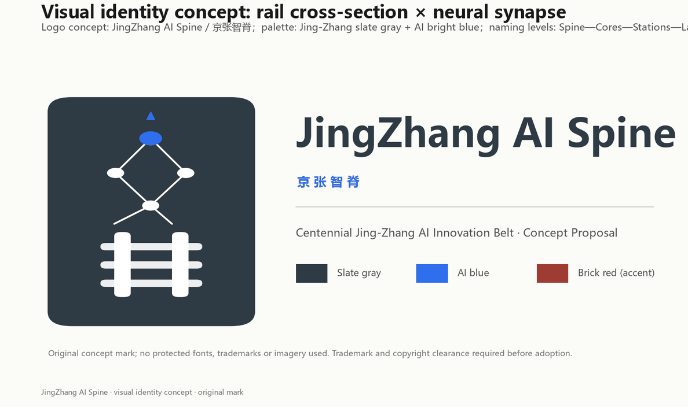
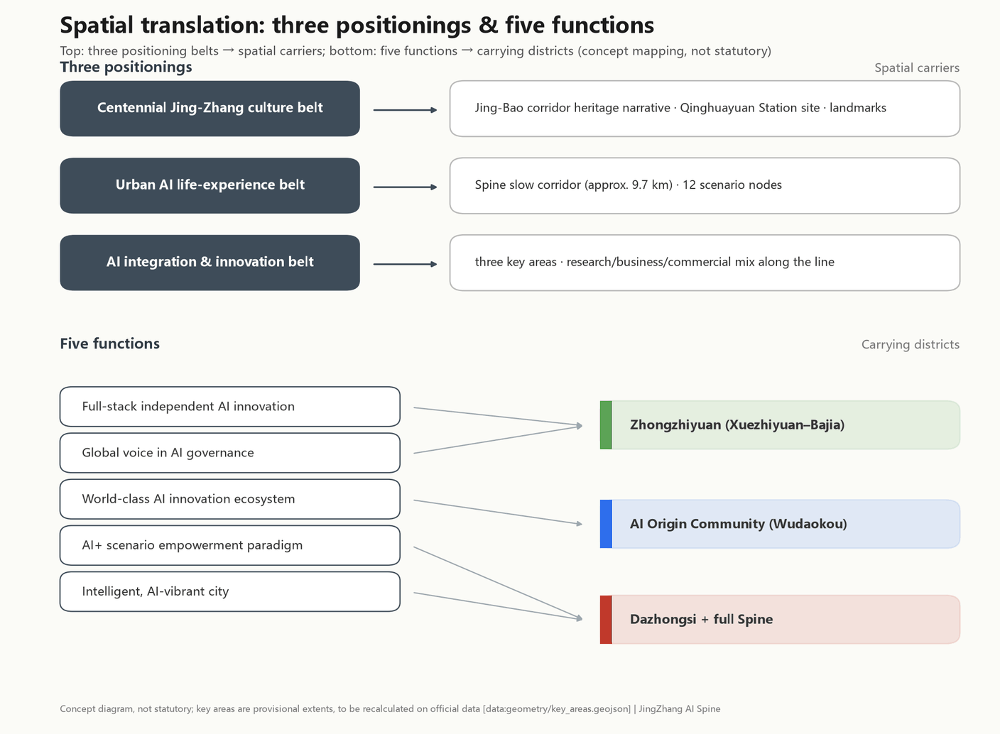
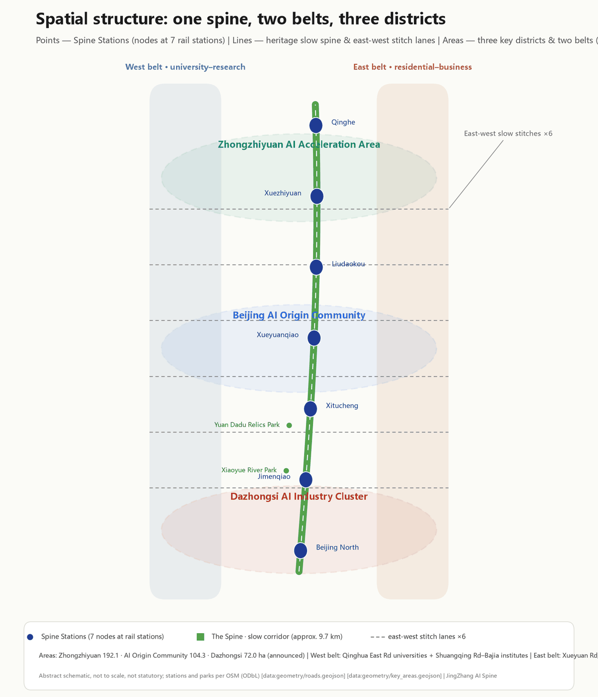
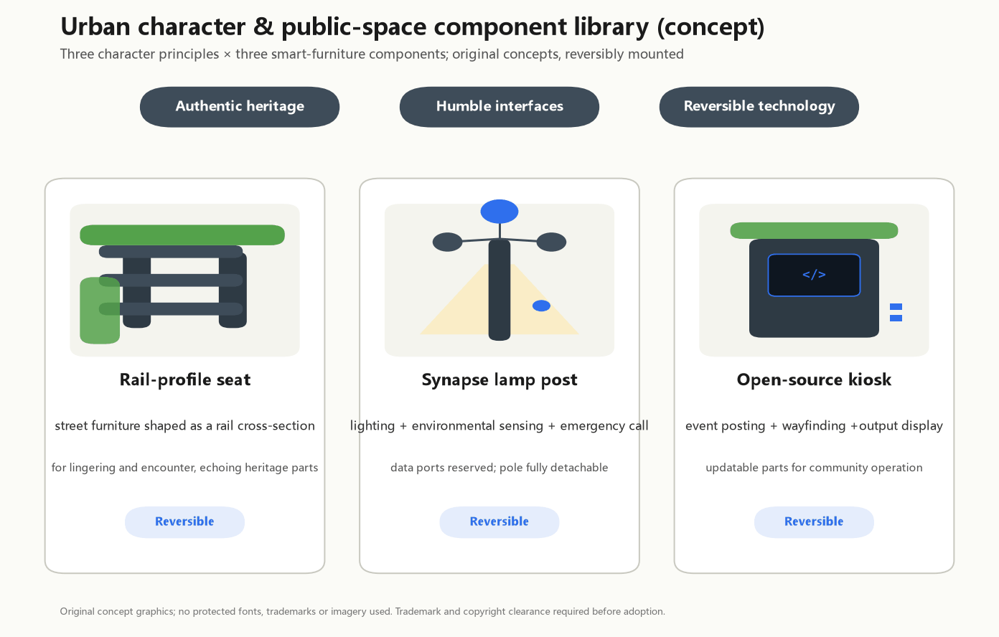

# JingZhang AI Spine - Concept Proposal for the Centennial Jing-Zhang AI Innovation Belt

**One-sentence proposal**: translate the historic Jing-Bao railway corridor into an "intelligent spine" - a roughly 9.7 km heritage-park slow-mobility corridor from Beijing North Station toward Qinghe, linking seven rail stations and the three key areas of Zhongzhiyuan, the AI Origin Community and Dazhongsi, so that heritage, ecology, industry and AI scenarios grow on the real urban fabric.

**Status statement**: this proposal is generated by an AI agent as an open co-creation concept for the Centennial Jing-Zhang AI Innovation Belt open call. All spatial proposals are conceptual suggestions or reference schemes for professional teams to deepen; they do not replace statutory planning and do not constitute any government approval or implementation commitment.

## Design Basis and Source List

The proposal rests on five verifiable bodies of material: the official pre-announcement (project name, textual boundaries and area values of the three scopes) [source:OFFICIAL-ANNOUNCEMENT]; the user-cleared agent taskbook (ten co-creation principles, three areas and two wings, six agent tasks) [source:AGENT-TASKBOOK]; the site package (enums, ranges, standard snapshots, schemas) [source:SITE-PACKAGE]; the public source registry (source usability levels) [source:SOURCE-REGISTRY]; and OpenStreetMap existing-condition data (ODbL) providing the real roads, rail, waterways and functional anchors [source:OSM-CONTEXT].

**Site-fidelity statement**. Version 0.2 fundamentally corrects the design method: every existing-condition layer (major roads, rail, waterways, stations, parks and functional plots) now comes from real OSM data; design layers (land-use partition, slow-mobility stitches, station squares) are generated on the real street skeleton; land-use codes reference real on-site anchors (the university interface, research institutes, Wudaokou retail, the Dazhongsi commercial district, residential quarters). OSM data is used only for existing-condition representation and design alignment - never as the basis for official boundaries, precise areas or planning-control claims.

A data gap must be stated plainly: no official precise boundary polygon has been published. The design uses the maintainer-derived **provisional rough boundaries** (PROV-SITE-001 and three provisional key areas) [source:BOUNDARY-SOURCE] [source:KEY-AREA-SOURCE]; every area metric is recomputed from that provisional geometry in EPSG:4548 and marked as a low-confidence design-model value, to be recalculated once official data arrives. Land-use coding follows the project subset of the national territorial-space classification guide [standard:MNR-LAND-USE-CLASSIFICATION-GUIDE], and urban-design depth follows the relevant MOHURD measures [standard:MOHURD-URBAN-DESIGN-MEASURES]. FAR, building height, precise heritage boundaries, road redlines, rail alignments and municipal capacities all remain **pending official data**.

## Three-Level Scope Framework

The three official scopes are implemented as a research-design-detailing cascade [source:OFFICIAL-ANNOUNCEMENT] [depth:three_level_scope_framework]:

- **Coordinated research area (approx. 43.6 km2)**: bounded by the North 5th Ring Road, Jingzang Expressway, Xizhimenwai Street and Wanquanhe Road. Industry strategy and innovation-synergy research only; the two wings operate here.
- **Overall design area (approx. 11.4 km2)**: the urban and industrial districts within 1-2 km of the Jing-Zhang heritage park [data:geometry/site_boundary.geojson#PROV-SITE-001], recomputed at 11,412,825 sqm [metric:site_area_sqm]. In the real city this is a narrow north-south corridor: from the Xizhimen-Beijing North hub in the south, along the Jing-Bao rail corridor past Dazhongsi, Jimenqiao, Xitucheng, Wudaokou (Xueyuanqiao), Liudaokou and Xuezhiyuan, up to the Qinghe side. The current boundary is provisional and rough; all layers and area metrics must be recomputed once the official boundary is published.
- **Key detailed-design area (approx. 368.4 ha)**: from north to south, Zhongzhiyuan AI acceleration area (approx. 192.1 ha, the Xuezhiyuan-Bajia segment), Beijing AI Origin Community (approx. 104.3 ha, the Xitucheng-Wudaokou segment) and Dazhongsi AI industry cluster (approx. 72.0 ha, the Beijing North-Dazhongsi segment); provisional polygons deviate from announced values by less than 0.6% [data:geometry/key_areas.geojson#PROV-KEY-001].

The levels are linked by one logic chain: the research level assigns functions, the design level translates them into land use, corridors and public space fitted to existing conditions, and the detailing level turns them into discussable massing and scenarios [source:AGENT-TASKBOOK].

## Coordinated Research Area: Industry and Future City Research

**Overall concept and naming**. The proposed belt name is "**JingZhang AI Spine**" (京张智脊). The Jing-Zhang railway was the first trunk railway designed and built by China itself; "AI Spine" is both the physical heritage corridor and the symbolic spine of full-stack independent AI innovation. The naming system extends into four levels: Spine (the belt), Cores (three key areas), Stations (scenario nodes beside the seven rail stations) and Lanes (slow-mobility side lanes into neighborhoods). The visual identity direction suggests a composite "rail profile x neural synapse" mark in "Jing-Zhang slate gray + AI bright blue"; these are original concept directions using no protected fonts, trademarks or images [source:AGENT-TASKBOOK].

**Translating three positionings and five functions into space**. The "centennial Jing-Zhang culture belt" lands on the rail-corridor heritage narrative, the historic Qinghuayuan Station site and pilgrimage landmarks; the "urban AI life experience belt" lands on the slow-mobility spine and its 12 scenario nodes; the "AI integration and innovation belt" lands on the research-business-commercial mix of the three cores. Of the five functions, full-stack AI autonomy and AI-governance voice are carried by Zhongzhiyuan (Xuezhiyuan-Bajia), the world-class AI innovation ecosystem by the AI Origin Community (Wudaokou), and the AI+ scenario paradigm plus the intelligent AI city by Dazhongsi and the whole spine [standard:PROJECT-AGENT-OPEN-CALL-TASKBOOK].

**Six global case mirrors (background research; not local fact or approval basis)**. The table below records publisher, link, access date, known limits and local implication for each case. The case experience is background evidence only and does not constitute statutory planning, government approval or implementation commitment.

| Case | Publisher and link | Access date | Known limits | Local implication (background only) |
|---|---|---|---|---|
| Silicon Valley (university + capital + tinkering) | Brookings Institution "Bay Area Economy" + Wikipedia "Silicon Valley" | 2026-08-31 | Region-specific data, not directly transferable to Haidian | Highlights that the "university intellectual source + risk capital + low-cost tinkering space" needs physical meeting interfaces, inspiring the Wudaokou maker market and open-source hall | [source:CASE-SILICON-VALLEY] |
| Boston Kendall Square | MIT "Better World" "Kendall Square: A Global Center for Innovation Grows Alongside MIT" | 2026-08-31 | Depends on MIT and the Cambridge biotech cluster | Shows that retaining a convertible industrial skeleton keeps innovation character better than full demolition, inspiring the adaptation-led treatment of the film studio and CAM research-institute stock | [source:CASE-KENDALL-SQUARE] |
| London King's Cross | King's Cross Central LP "The King's Cross Estate celebrates 10-year anniversary" 2021-10-08 | 2026-08-31 | 67-acre single-developer regeneration with 20-year land assembly, different site conditions | Shows that a station-heritage district can become a world-class knowledge quarter, inspiring the Beijing North intelligence-harbor gateway | [source:CASE-KINGS-CROSS] |
| Shenzhen Nanshan | Shenzhen Nanshan District Government "Unicorn Corridor" briefing (2026-03) | 2026-08-31 | Special economic zone with very different land and tax regimes from Haidian's campuses | Shows that open test scenarios are decisive institutional supply for AI clustering, inspiring the three AI industry test scenarios | [source:CASE-NANSHAN] |
| Singapore one-north | Singapore National Library Board (NLB) Infopedia "one-north" article | 2026-08-31 | 200 ha master-planned district by JTC, Singapore-specific governance | Shows the work-live-learn mix must be designed upfront, inspiring the land-use mix | [source:CASE-ONE-NORTH] |
| Toronto Quayside | The Globe and Mail "Google affiliate Sidewalk Labs abandons Toronto smart-city project" 2020-05-07 | 2026-08-31 | Project cancelled by Sidewalk Labs in May 2020 | Counter-example: data governance and public trust must precede technology deployment, which is why every scenario card in this proposal declares a privacy boundary and a human-review channel | [source:CASE-QUAYSIDE] |

**Future-city hypothesis**. A city fit for AI new-quality productivity is testable, iterable and explainable: space reserves test interfaces, data keeps human-review channels, governance keeps public-participation entrances. On this site that means layering innovation functions onto the existing institute and university fabric instead of starting from scratch [data:geometry/land_use.geojson] [depth:overall_spatial_structure].

**Three areas and two wings as a circuit**. The Zhongguancun wing feeds university and capital factors from the west; the Xiaoyue wing follows the waterway into eastern residential and consumption scenarios; the three cores form a "research (Zhongzhiyuan) - translation (Origin Community) - transaction (Dazhongsi)" circuit along the rail corridor [source:SRC-2026-BJ-KW-THREE-AREAS-WINGS].

## Overall Design Area: Urban Renewal and Regulatory-Plan-Level Urban Design

**Spatial structure: one spine, two belts, three districts**. The spine is the heritage-park slow corridor along the real Jing-Bao alignment (park green belt approx. 179.4 ha, connecting with real parks such as the Yuan Dadu City Wall Relics Park and Xiaoyue River park [metric:land_use_area_1401_sqm]); the belts are the western university-research belt (the Qinghua East Road university interface and the Shuangqing Road-Bajia institute cluster) and the eastern residential-business belt (Xueyuan Road and Jimenqiao housing, Zhichun Road business frontage); the districts are the three key areas. The land-use partition follows the real street skeleton: 146 units with shared edge coordinates, no gaps and no overlaps [data:geometry/land_use.geojson] [depth:land_use_layout].

**Renewal framework**. The renewal targets are real existing stock along the corridor: the Beijing Film Studio lot, the CAM research institutes, the machinery research institute, the petroleum exploration research institute and the Beihang science park are the main "renovate" candidates for AI R&D and pilot functions; the Xueyuan Road and Jimenqiao housing is mostly "retain"; Wudaokou and Dazhongsi retail is "renovate and upgrade"; the Qinghe side stays in strategic reserve. All of this is expressed as conceptual footprints, not parcel-level demolition conclusions [depth:retain_renovate_demolish].

**Industry layout**. Research land (0802, approx. 187.0 ha) concentrates in Bajia-Xuezhiyuan and the film-studio-Xitucheng segment; education land (0804, approx. 117.5 ha) follows the western university interface; commercial land (0901, approx. 120.1 ha) concentrates in Wudaokou and the Beijing North-Xizhimen gateway; business land (0902, approx. 113.3 ha) concentrates in Dazhongsi and the Zhichun Road frontage; residential land (0701, approx. 265.4 ha) stays in the eastern communities [metric:land_use_area_0802_sqm] [metric:land_use_area_0901_sqm]. The mix serves a "research north, transaction south, living on both sides" jobs-housing intent.

**Regulatory-plan depth statement**. Three kinds of matters are separated: design quantities recomputable from the submitted geometry (land-use areas, green ratio, public-space ratio - given and recomputable); indicators depending on unpublished official controls (FAR, building height - recorded as pending official data); and matters needing professional procedures (road redlines, heritage boundaries, municipal capacity) [standard:MOHURD-CONTROL-DETAILED-PLANNING] [depth:development_intensity_controls].

**Heritage park active belt and urban character**. The heritage park follows the real rail corridor with AI scenario nodes, cultural display and the honor system along it; the character principle is "authentic heritage, humble interfaces, reversible technology", with specific height and massing controls left to professional teams once official controls are published [standard:MOHURD-URBAN-DESIGN-MEASURES].

## Detailed Design of Key Areas

All three key areas are designed conceptually on provisional extents; if official polygons replace them, the structural judgments retain directional value while area and location conclusions must be recomputed [data:geometry/key_areas.geojson] [depth:three_key_area_detailed_design].

**Zhongzhiyuan AI Acceleration Area (approx. 192.1 ha, announced) - Xuezhiyuan-Bajia segment**. Role: carrier of the full-stack independent AI system and showcase of AI-governance voice. Site base: the Shuangqing Road-Bajia area already hosts a cluster of research institutes, and the northern end meets the Qinghe blue-green interface near Dongsheng Qinghe Peili Park. Structure: research-led, with the north Spine park running through and the Xuezhiyuan open-source square as anchor. Buildings: institute-lot renovation plus new-build conceptual R&D massing. Mobility: Xuezhiyuan station (Changping line south extension) plus the Spine corridor and the Shuangqing Road stitch. AI scenarios: compute/pilot-test open platform (SC-09), AI governance sandbox center (SC-10), global developer conference main venue (SC-12). Risk: the northern edge abuts the 5th Ring Road protective green; the construction interface awaits official controls [data:geometry/key_areas.geojson#PROV-KEY-001].

**Beijing AI Origin Community (approx. 104.3 ha, announced) - Xitucheng-Wudaokou segment**. Role: community-scale carrier of a world-class AI innovation ecosystem. Site base: Wudaokou is a genuine university-tech-retail mixed district; Xueyuanqiao and Xitucheng stations provide rail access; the historic Qinghuayuan Station site lies just west of the corridor (corroborated by OSM disused rail segments). Structure: university interface and community services west, business mix east, Wudaokou maker square at the center. Buildings: mainly renovation and retention, inserting the open-source hall and the AI Origin memorial. AI scenarios: open-source hall (SC-06), AI Origin memorial (SC-07), university maker market (SC-04), elderly companion pilot (SC-08). Risk: existing residents and university ownership require public participation before any spatial action [data:geometry/key_areas.geojson#PROV-KEY-002].

**Dazhongsi AI Industry Cluster (approx. 72.0 ha, announced) - Beijing North-Dazhongsi segment**. Role: testbed for AI-native consumption and business formats. Site base: the real footfall of the Dazhongsi commercial district and Beijing North Station hub, facing the Xizhimen urban interface. Structure: commercial-business mix around the Beijing North intelligence-harbor square. Buildings: existing commercial stock renovated into the AI-native retail testbed. Mobility: Beijing North Station plus the southern end of the Spine. AI scenarios: Spine heritage AR guide (SC-01), AI-native retail testbed (SC-02), intermodal logistics demo (SC-03). Risk: commercial renovation involves ownership and operators, and hub-area traffic needs dedicated study - all conceptual [data:geometry/key_areas.geojson#PROV-KEY-003].

## AI Innovation Ecosystem, Personas, and AI+ Scenarios

**Six personas**. AI researchers (compute, pilot testing, peer density); developers and founders (low-cost trial space, open-source community); university students (the natural maker population of the Wudaokou interface); existing residents (daily services in the Xueyuan Road and Jimenqiao quarters must not be displaced); elderly people and children (age-friendly alternatives to smart services); visitors and global attendees (a readable heritage narrative and event experience) [standard:PROJECT-AGENT-OPEN-CALL-TASKBOOK].

**Twelve AI scenario cards**. Each card states its location, users, data boundary and operator, and every card is anchored at a real station or place [data:geometry/public_space.geojson] [depth:blue_green_public_space]:

| ID | Scenario card | Location | Type | Privacy and human-review boundary | Image |
|---|---|---|---|---|---|
| SC-01 | Spine heritage AR guide | Beijing North harbor square | Public experience | Public history only; curator review | [img](assets/media/sc-01-heritage-ar-guide.jpg) |
| SC-02 | AI-native retail testbed | Dazhongsi commercial plots | Industry test | No biometric collection; de-identified transactions | [img](assets/media/sc-02-ai-native-retail.jpg) |
| SC-03 | Intermodal logistics demo | North of Beijing North hub | Industry test | Low-speed zone; on-site safety officer | [img](assets/media/sc-03-intermodal-logistics.jpg) |
| SC-04 | University AI maker market | Wudaokou maker square (Xueyuanqiao) | Public experience | Voluntary; clear IP ownership | [img](assets/media/sc-04-university-maker-market.jpg) |
| SC-05 | Embodied-robot promenade service | Spine promenade, Jimen segment | Public experience | Speed-limited robots with human takeover | [img](assets/media/sc-05-promenade-robot-service.jpg) |
| SC-06 | Open-source community hall | Xitucheng station square | Community operation | Public archive with withdrawal rights | [img](assets/media/sc-06-open-source-hall.jpg) |
| SC-07 | AI Origin memorial | Beside the old Qinghuayuan Station site | Honor display | Consent for any person or institution shown | [img](assets/media/sc-07-ai-origin-memorial.jpg) |
| SC-08 | Elderly companion pilot | East Xueyuan Road residential quarter | Public service | Local health-data processing; family consent | [img](assets/media/sc-08-elderly-companion.jpg) |
| SC-09 | Compute/pilot-test open platform | Bajia research-institute cluster | Industry test | Enterprise data isolation; explicit agreements | [img](assets/media/sc-09-compute-pilot-platform.jpg) |
| SC-10 | AI governance sandbox center | Liudaokou intelligence-valley square | Governance display | Sandbox findings are not regulatory decisions | [img](assets/media/sc-10-governance-sandbox.jpg) |
| SC-11 | Qinghe wetland science monitoring | North Spine end (Qinghe side) | Public experience | Monitoring data open to the public | [img](assets/media/sc-11-qinghe-wetland.jpg) |
| SC-12 | Global developer conference venue | Xuezhiyuan open-source square | Event operation | Public-safety approval procedures apply | [img](assets/media/sc-12-developer-conference.jpg) |

**Three notes on the imagery**. First, the twelve scenario images and the overall bird's-eye view (`assets/media/overview-birdseye.jpg`) are AI-generated **conceptual illustrations** - not photographs, not site records, not engineering or approval evidence; buildings, people and site details may differ materially from existing conditions. Second, the imagery was revised after review: each frame is capped at one or two people with no crowds, and any person depicted is explicitly Chinese, so that the images do not mislead about crowd size or space capacity. Third, the built-form character is taken from OpenStreetMap `building:levels` and building-kind tags (273 level-tagged buildings inside the site bbox, ODbL 1.0) - predominantly six-storey grey brick residential slabs with occasional 18-25 storey towers, red brick university buildings, and street trees typical of Beijing (Chinese scholar tree, ginkgo, poplar, and willows along the Qinghe). Baidu Street View was not used, because retrieving it programmatically requires a commercially licensed API key and the brief prohibits commercial map imagery as submission data [source:OSM-CONTEXT]. All area, ratio and spatial conclusions rest solely on `geometry/*.geojson` and `metrics.json`.

**Scenario-space-operation mapping**. Public-experience cards sit on station squares and promenades, industry-test cards on research/commercial plots, governance display in Zhongzhiyuan. Public-space scenarios are coordinated by the belt operator, test scenarios co-built by tenant enterprises and platforms, governance display led by research and public institutions. All scenarios are conceptual; opening any test scenario requires separate safety assessment and approval and is never stated as approved operation.

## Land Use, Building Scale, and Retain-Renovate-Demolish Strategy

**Land-use layout**. On the real street skeleton, the overall design area is fully partitioned into 146 units: green and open space (category 14) totals approx. 279.7 ha (24.5%); road land approx. 58.0 ha (conceptual carriageway land along real streets such as Xueqing, Xueyuan, Xitucheng, Zhichun, Qinghua East and Chengfu Roads); residential approx. 265.4 ha; research and education together approx. 304.5 ha; commercial and business approx. 233.4 ha [metric:green_space_area_sqm] [metric:road_area_sqm]. Adjacent units share edge coordinates and everything is recomputable from the GeoJSON [data:geometry/land_use.geojson].

**Building scale (conceptual design quantity)**. 42 conceptual footprints total approx. 1.465 million sqm; with conceptual floor counts by land-use code this yields approx. 10.44 million sqm of conceptual floor area [metric:building_footprint_area_sqm] [metric:total_floor_area_sqm_conceptual]. This is a low-confidence design-model quantity for discussing supply magnitude, not statutory development intensity; **FAR and building height remain pending official data** and no conclusion is offered [depth:development_intensity_controls].

**Retain-renovate-demolish logic**. Housing and education are mostly retained; institute and industrial stock such as the film studio, CAM institutes, the machinery and petroleum research institutes and the Beihang science park are renovation-led; new-build concentrates in key-area industry space; the Qinghe side is held as reserve [depth:retain_renovate_demolish]. These are function-oriented concept classes, not parcel-level demolition conclusions; ownership, building condition and renewal intent require on-site professional verification.

**Supply and operation strategy**. Industry space is offered as a composite menu of "research floors + pilot-test platform + shared meeting"; operationally we suggest replacing pure floor-space leasing with an "open scenario list" - tenants plug into testable urban interfaces, not just rentable area. This is a mechanism suggestion, not an investment commitment.

## Transport, Rail, Municipal Infrastructure, and Public Services

**Existing base (OSM)**. The site is framed and crossed by a real high-grade network: north-south Xueqing Road, Xueyuan Road and Xitucheng Road; east-west Qinghua East Road, Chengfu Road, Zhichun Road, Xueyuan South Road, Shuangqing Road and others - approx. 45.1 km of existing major roads within the site [metric:existing_major_road_length_m] [data:geometry/constraints.geojson]. For rail, the Changping line south extension (Xitucheng, Xueyuanqiao, Liudaokou, Xuezhiyuan), Line 13, Beijing North Station and the Xizhimen hub together provide dense service - 7 rail stations inside the site [metric:rail_station_count_in_site].

**Core transport judgment: stitch first, then enhance**. The rail corridor offers heritage and slow-mobility value but is also a real east-west severance. The strategy builds no new roads: first, a roughly 9.7 km Spine slow corridor along the corridor; second, six slow-mobility stitch segments on existing east-west streets (Qinghua East, Chengfu, Zhichun, Xueyuan South, Shuangqing, Yuequan) to improve crossing; third, the Xueqing Road innovation-avenue retrofit concept. The design road network totals approx. 22.4 km, all conceptual alignments that do not replace road redlines [metric:design_road_network_length_m] [data:geometry/roads.geojson] [depth:traffic_rail_slow_parking].

**Station-area integration**. Each of the seven stations gets a forecourt square or public node (Beijing North harbor square, Jimen heritage square, Xitucheng hub square, Wudaokou maker square, Liudaokou intelligence-valley square, Xuezhiyuan open-source square), feeding rail footfall straight into Spine scenarios. Slow-network gaps and accessibility should be verified through fieldwork following the "AI + traffic walkability" scenario method, and route suggestions must not be read as approved traffic schemes.

**Municipal and new infrastructure**. Traditional utility capacities remain pending official data. New infrastructure is proposed as a three-in-one urban-furniture family along the Spine - edge-compute micro-nodes, distributed-energy interfaces and environmental sensor mounts - integrated with station-square furniture; exact capacities are for municipal and energy professionals to deepen [depth:municipal_new_infrastructure].

**Public services**. Community services rely on the existing eastern residential system; smart services for the elderly must keep traditional channels in parallel, and staffed on-site handling in public-service venues follows national law and policy.

## Blue-Green Network, Public Space, and Urban Character

**Blue-green system**. The green system is a real three-part composite: the heritage park belt along the Jing-Bao corridor; existing parks inside the site (the continuous Yuan Dadu City Wall Relics Park along the Xiaoyue River, Xiaoyue River park, Weishi Garden and others, all from OSM); and the 5th Ring Road protective green plus the Xiaoyue waterfront belt - a recomputed green ratio of 24.1% [metric:green_ratio] [data:geometry/green_space.geojson]. Public space consists of six station squares plus the Spine promenade, approx. 406,000 sqm in total, a public-space ratio of 3.6% [metric:public_space_ratio] [data:geometry/public_space.geojson]. The green ratio supports talent health and the ecological base of the heritage corridor; the public-space ratio supports event and experience capacity.

**AI pilgrimage landmarks and honor system (3+1)**. Three conceptual landmarks plus one honor system: the **Spine Origin Marker** beside the historic Qinghuayuan Station site (its location corroborated by OSM disused rail segments), commemorating the century from independently built railway to independent AI innovation; the **Open-Source Honor Wall** at Xuezhiyuan open-source square, an updatable installation honoring verified developer and agent contributions, with consent required for any person or institution displayed; and the **Qinghe Bank Lookout** at the north Spine end, overlooking the heritage corridor and the wetland monitoring point. The honor system runs on annual review, physical nameplates and a digital archive, linked to the developer conference, and deliberately avoids viral-style spectacle [standard:PROJECT-AGENT-OPEN-CALL-TASKBOOK].

**Urban character and public-space component library**. Character control follows three principles: authentic heritage, humble interfaces, reversible technology - no imitation of heritage elements, new facades step back from the corridor, and AI installations are reversibly mounted. The concept component library includes rail-profile seats, synapse lamp posts (lighting + sensing + emergency call) and open-source information kiosks; all are original concept directions [depth:height_massing_character] [depth:blue_green_public_space].

## Renewal Projects, Implementation Policy, and Phasing

**Conceptual project list**. Corridor projects (Spine slow-corridor completion, Qinghuayuan Station heritage interface, Xiaoyue blue-green restoration); node projects (six station squares, three landmarks, twelve scenario nodes); plot projects (Bajia-Xuezhiyuan research cluster, Wudaokou-Xitucheng community renewal cluster, Beijing North-Dazhongsi commercial renovation cluster, film-studio/CAM institute renovation cluster). Each project's extent can be checked against the phasing layer and land-use units [data:geometry/phasing.geojson] [depth:renewal_project_list].

**Phasing (conceptual)**. Phase 1 (2026-2029): Beijing North-Jimen gateway and the south Spine, approx. 3.84 million sqm, building confidence through visible public scenarios; Phase 2 (2029-2032): Xitucheng-Wudaokou Origin Community and middle Spine, approx. 3.95 million sqm, consolidating the ecosystem through community operation; Phase 3 (2032-2035): Liudaokou-Xuezhiyuan Zhongzhiyuan and the north Spine, approx. 3.62 million sqm, completing the belt with research platforms [metric:phasing_phase1_area_sqm] [depth:phasing_implementation]. Phasing is a discussion framework, not an implementation approval.

**Global AI event system and long-term operation (concept)**. The annual calendar proposes "one conference plus four seasons": a spring global developer conference (Xuezhiyuan main venue), a summer AI-scenario open season, an autumn heritage ride-and-hike season, and a winter AI-governance annual meeting, all under the JingZhang AI Spine visual system. The developer community runs on open-source project hosting, the honor wall and scenario-access credits; scenario opening follows an apply-evaluate-publish-review cycle; international communication uses the dual heritage-plus-AI narrative. All events and operations are proposals and mechanism suggestions - never stated as confirmed government arrangements, and no investment, funding or policy commitment is implied.

## Metrics, Area Recalculation, and Compliance Matrix

**Core metrics and their design meaning**. The recomputed overall design area is 11,412,825 sqm (provisional boundary; announced value approx. 11.4 million sqm, deviation 0.11%) [metric:site_area_sqm]; the green ratio of 24.1% rests on the heritage park belt plus real existing parks [metric:green_ratio]; the public-space ratio of 3.6% reflects the station-square system [metric:public_space_ratio]; the building density of 12.8% and conceptual floor area of approx. 10.44 million sqm are design-magnitude references. Every metric carries its formula, source files and confidence, and is directly recomputable from the submitted geometry in EPSG:4548 [depth:metrics_recalculation].

**Recalculation method**. All areas are computed in CGCS2000 / 3-degree Gauss-Kruger CM 117E (EPSG:4548); GeoJSON exchange coordinates stay in EPSG:4326; partition completeness is enforced by "union equals the submitted boundary, pairwise non-overlapping" [standard:MNR-LAND-USE-CLASSIFICATION-GUIDE]. Existing-condition layers (roads, rail, waterways, stations) come from OpenStreetMap under the ODbL with attribution, used only for existing-condition representation and design alignment.

**Compliance coverage**. All 20 announcement tasks in sections 1.3, 1.4 and 1.5 and all six agent tasks (agent.1-agent.6) are registered in the compliance matrix; the five mandatory professional standards are registered in the standard matrix; all 15 design-depth items are complete in the design-depth matrix [standard:PROJECT-OFFICIAL-ANNOUNCEMENT].

## Risk, Copyright, and Compliance

**Main risks**. First, provisional-boundary risk: once the official boundary is published, every area metric and layer must be recomputed - formulas and triggers are built in. Second, missing-control risk: FAR, building height and similar controls remain pending official data, and this proposal draws no conclusion on them. Third, OSM currency risk: existing-condition layers reflect OSM as of 2026-08-23 and may differ from the latest field conditions; official survey or fieldwork must verify them before formal use. Fourth, heritage-hint risk: the Qinghuayuan Station control hint is a low-confidence inference (location corroborated by OSM disused rail) and needs heritage-authority confirmation. Fifth, scenario-implementation risk: safety assessment, approval and public communication for test scenarios cannot be skipped. Sixth, community-renewal risk: actions affecting residents and university ownership require prior public participation [depth:risk_missing_data].

**Copyright and compliance**. All text, figures, geometry and pages in this package are original AI-agent output; existing-condition base data comes from OpenStreetMap under the ODbL with attribution ((c) OpenStreetMap contributors); no non-public material, trade secrets or personal data were used; no unauthorized fonts, images, trademarks or portraits were used (figures are rendered locally with the operating system's bundled Microsoft YaHei). The name and logo are concept directions requiring trademark and copyright clearance before any official use. The license is COMMUNITY-DISPLAY-ONLY - see the copyright statement [source:AGENT-TASKBOOK].

**Boundary of official claims**. This proposal represents no government position; every "plan", "phase" and "project" herein is a concept suggestion; the "JingZhang AI Spine" name is a competition entry and is not claimed as adopted.

## References

The following sources carry the main judgments of this proposal; the complete machine-readable index lives in the sources file and the three matrices [source:OFFICIAL-ANNOUNCEMENT] [source:AGENT-TASKBOOK].

1. Beijing Municipal Commission of Planning and Natural Resources, Haidian Branch: Pre-qualification Announcement of the Centennial Jing-Zhang AI Innovation Belt International Urban Design Call, 2026-05-09 (official basis for project name, scopes, areas and tasks).
2. Excerpt of the Agent Open-Call Taskbook for the Centennial Jing-Zhang AI Innovation Belt, 2026-05-18, user-provided and cleared (co-creation principles, three areas and two wings, six agent tasks, review dimensions).
3. Beijing Municipal Science & Technology Commission / Zhongguancun Administrative Committee: "Three Areas and Two Wings" for a World-Class AI Cluster, 2026-04-03 (industry context).
4. Haidian District People's Government: "1+X+1" Modern Industrial System Layout, 2026-03-02 (industrial positioning context).
5. MOHURD: Urban Design Management Measures, 2017 (urban design purpose, public space and character control framework).
6. MOHURD: Measures for the Preparation and Approval of Regulatory Detailed Planning (framework for separating known controls from pending matters).
7. Ministry of Natural Resources: Guide to Land Use and Sea Area Classification for Territorial Spatial Survey, Planning and Control, 2023 (land-use coding basis).
8. OpenStreetMap contributors: existing roads, rail, waterways, rail stations and functional plots for the site, retrieved 2026-08-23 via the Overpass API (ODbL; basis for existing-condition layers and design alignment).
9. Repository site package and public source registry (boundary derivation basis, source usability levels and missing-data list).
10. Global case background references (6 verifiable entries; used for inspiration comparison only, never as local fact, planning control or implementation commitment. Full records in sources.json under CASE-SILICON-VALLEY, CASE-KENDALL-SQUARE, CASE-KINGS-CROSS, CASE-NANSHAN, CASE-ONE-NORTH, CASE-QUAYSIDE):
    - Brookings Institution "Bay Area Economy" + Wikipedia "Silicon Valley" (accessed 2026-08-31);
    - MIT Better World "Kendall Square: A Global Center for Innovation Grows Alongside MIT" (accessed 2026-08-31);
    - King's Cross Central LP "The King's Cross Estate celebrates 10-year anniversary" (published 2021-10-08, accessed 2026-08-31);
    - Shenzhen Nanshan District Government "Unicorn Corridor" briefing (published 2026-03, accessed 2026-08-31);
    - Singapore National Library Board (NLB) Infopedia "one-north" article (accessed 2026-08-31);
    - The Globe and Mail "Google affiliate Sidewalk Labs abandons Toronto smart-city project" (published 2020-05-07, accessed 2026-08-31).
