# 京张智脊 JingZhang AI Spine——百年京张AI创新带城市设计概念方案

**一句话方案**：把京包线历史廊道转译为一条"智能脊梁"——从北京北站到清河约9.7公里的遗址公园慢行主脊，串联七座轨道站点与众智园、AI原点社区、大钟寺三处重点区域，让遗产、生态、产业与AI场景在真实的城市肌理上叠合生长。

**成果属性声明**：本方案由 AI 智能体生成，是面向"百年京张AI创新带城市设计开源征集"的开放共创概念建议；所有空间落地建议均为概念建议、参考方案，可供专业团队深化研究，不替代正式规划，不构成政府审定结论或实施承诺。

## 设计依据与资料清单

本方案的判断建立在五类可核验资料之上：官方资格预审公告给出的项目名称、三层范围文字四至与面积值 [source:OFFICIAL-ANNOUNCEMENT]；用户清权提供的智能体任务书给出的十条共创原则、三区两翼与六项智能体任务 [source:AGENT-TASKBOOK]；站点资料包中的枚举、范围值、规范快照与模式定义 [source:SITE-PACKAGE]；公开来源注册表对资料可用性等级的区分 [source:SOURCE-REGISTRY]；以及 OpenStreetMap 现状数据（ODbL 许可）提供的真实道路、铁路、水系与功能锚点底图 [source:OSM-CONTEXT]。

**场地真实性声明**。v0.2 版对设计方法做了根本修正：现状层（主次干路、铁路、水系、轨道站点、既有公园与功能地块）全部来自 OSM 真实数据，设计图层（用地切分、慢行缝合、广场节点）以现状路网为骨架生成，用地性质参照场地内真实功能锚点（高校界面、科研院所、五道口商业、大钟寺商圈、居住区）赋码。OSM 数据仅用于现状表达与设计对齐，不作为官方边界、精确面积或规划控制依据。

必须坦白说明的资料缺口：官方精确范围线尚未公开，本方案使用仓库维护者依据公告文字四至推导的**临时粗略边界**（PROV-SITE-001 及三处重点区域临时范围）[source:BOUNDARY-SOURCE] [source:KEY-AREA-SOURCE]，全部面积类指标均由该临时几何在 EPSG:4548 下复算并标记为低置信度设计模型值，官方数据发布后须全部重算。用地分类表达遵循自然资源部用地用海分类指南的项目子集 [standard:MNR-LAND-USE-CLASSIFICATION-GUIDE]，城市设计深度参照住建部相关办法 [standard:MOHURD-URBAN-DESIGN-MEASURES]。容积率、建筑高度、文保精确界线、道路红线、轨道定线与市政容量均**待正式数据补齐**。

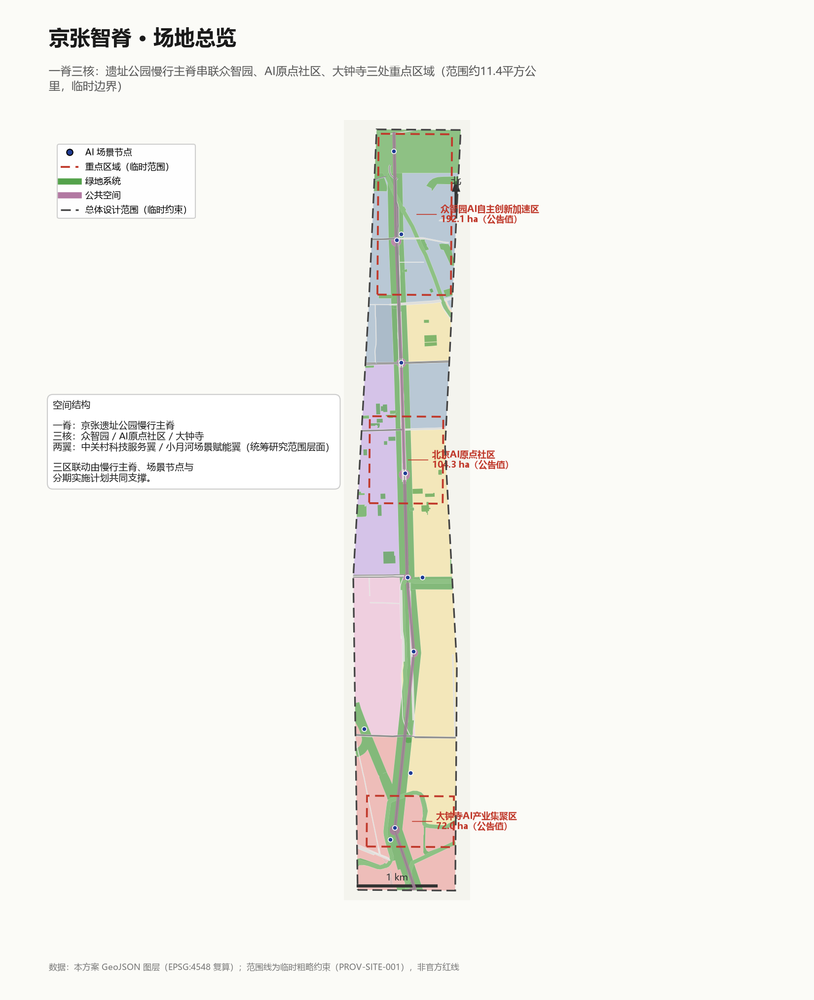

## 三层范围工作框架

三层范围是公告给定的官方工作框架，本方案按"研究—设计—深化"逐级落实 [source:OFFICIAL-ANNOUNCEMENT] [depth:three_level_scope_framework]：

- **统筹研究范围（约43.6平方公里）**：北至北五环路、东至京藏高速、南至西直门外大街、西至万泉河路。本层做产业战略与创新协同研究，"两翼"（中关村科技服务翼、小月河场景赋能翼）在这一层展开。
- **总体设计范围（约11.4平方公里）**：京张遗址公园周边1—2公里的城市地区和产业区 [data:geometry/site_boundary.geojson#PROV-SITE-001]，复算面积 1141.28 万平方米 [metric:site_area_sqm]。场地在真实城市中呈南北向狭长走廊：南起西直门—北京北站枢纽，沿京包线廊道向北经大钟寺、蓟门桥、西土城、五道口（学院桥）、六道口、学知园，北抵清河侧。当前使用临时粗略边界；取得官方范围线后所有图层与面积指标需重算。
- **重点区域范围（约368.4公顷）**：自北向南为众智园AI自主创新加速区（约192.1公顷，对应学知园—八家段）、北京AI原点社区（约104.3公顷，对应西土城—五道口段）、大钟寺AI产业集聚区（约72.0公顷，对应北京北—大钟寺段），三处临时 polygon 与公告面积值偏差均小于0.6% [data:geometry/key_areas.geojson#PROV-KEY-001]。

三层之间由明确的逻辑链衔接：研究层确定"三区两翼"功能分工，设计层把分工转译为贴合现状的用地、廊道与公共空间，深化层在三处重点区域落到可讨论的形体与场景 [source:AGENT-TASKBOOK]。

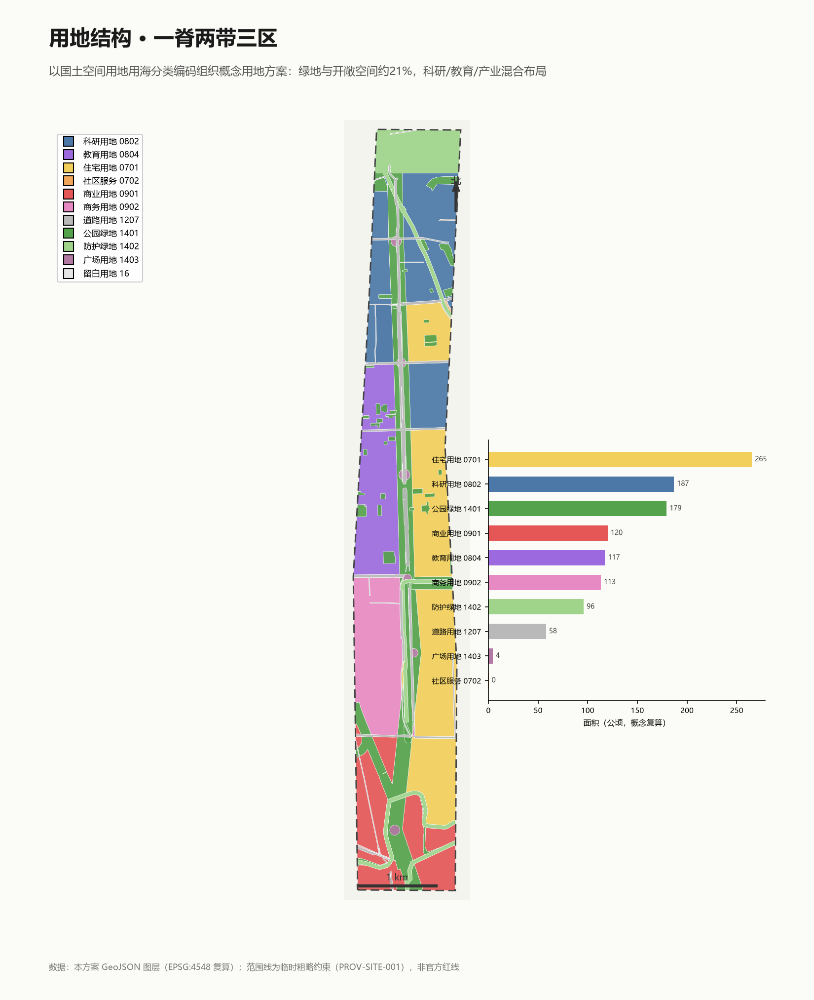

## 统筹研究范围产业与未来城市研究

**总体概念与命名**。本方案提出一带总名称"**京张智脊**"（英文：**JingZhang AI Spine**）。京张铁路是中国自主建造的第一条干线铁路；"智脊"双关——既是遗产走廊这条物理脊线，也是"智能之脊"。命名体系向下延展为"脊—核—站—巷"四级：智脊（一带总称）、三核（三处重点区域）、智站（七座轨道站点旁的场景节点）、智巷（接入周边社区的慢行支巷）。视觉识别方向建议以"轨道截面×神经元突触"叠合图形为 Logo 概念方向，主色取"京张青灰+AI亮蓝"，全部为原创概念方向，未使用任何受保护的字体、商标或图像素材 [source:AGENT-TASKBOOK]。
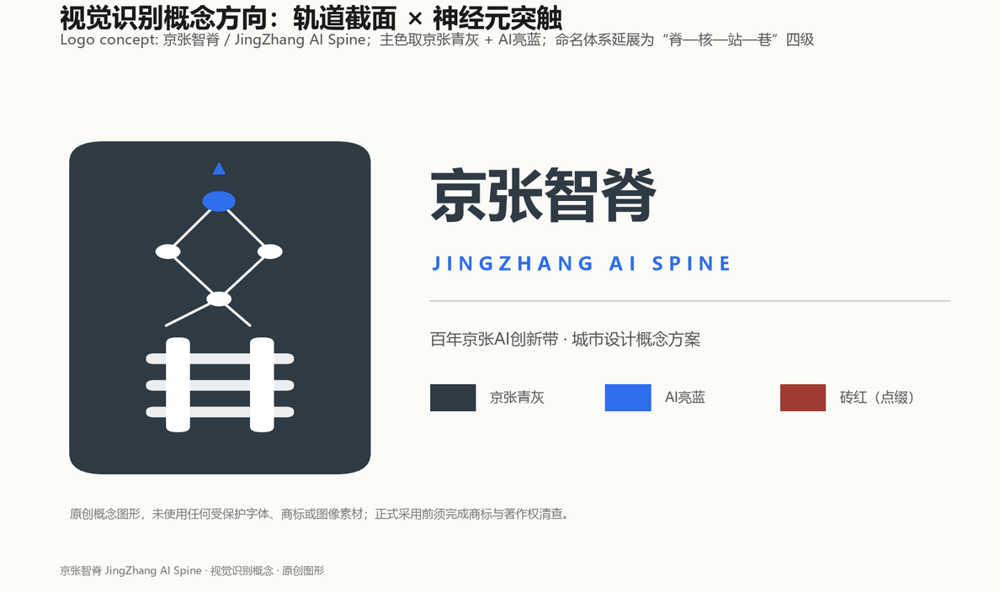

**三大定位与五大功能的空间转译**。"百年京张文化带"落在京包线廊道遗址叙事、清华园站旧址与朝圣地标系统；"都市AI生活体验带"落在沿廊道的慢行主脊与12个场景节点；"AI融合创新带"落在三核与沿线的科研、商务、商业混合用地。五大功能中，"AI全栈自主创新体系"与"AI治理全球话语权"由众智园（学知园—八家段）承载，"世界级AI创新生态"由AI原点社区（五道口段）承载，"AI+场景赋能新范式"与"智能化AI活力城市"由大钟寺与智脊全线共同承载 [standard:PROJECT-AGENT-OPEN-CALL-TASKBOOK]。
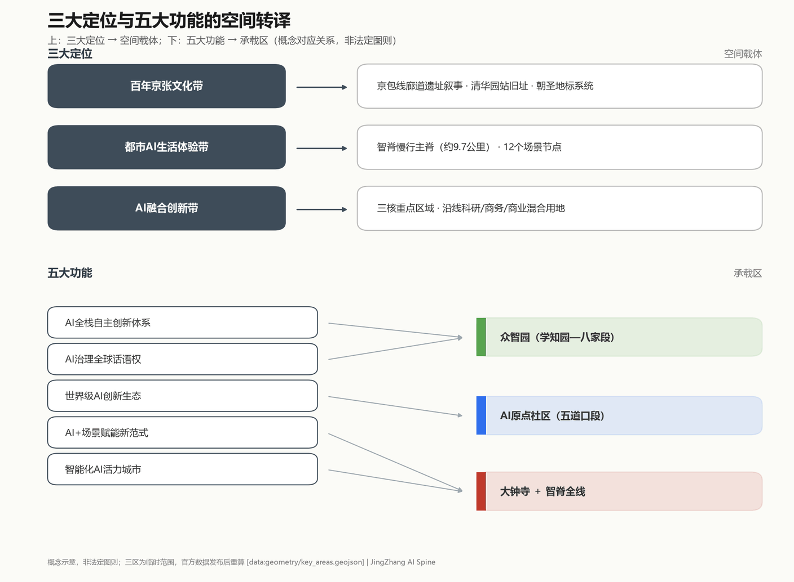

**全球案例镜鉴（6个，背景研究，不作为本地事实或审批依据）**。下表逐例登记发布者、链接、访问时间、用途边界与本地启示；案例经验仅作背景证据，不构成法定规划、政府批准或实施承诺。

| 案例 | 发布者与链接 | 访问时间 | 已知局限 | 本地启示（仅作背景） |
|---|---|---|---|---|
| 硅谷（高校+资本+试错） | Brookings Institution "Bay Area Economy" + Wikipedia "Silicon Valley" | 2026-08-31 | 区域专属数据，不可直接移植海淀 | 强调"高校智力源+风险资本+低成本试错空间"需要实体交往界面，启发五道口创客集市与开源会客厅 | [source:CASE-SILICON-VALLEY] |
| 波士顿肯德尔广场 | MIT "Better World"《Kendall Square: A Global Center for Innovation Grows Alongside MIT》 | 2026-08-31 | 依赖 MIT 与剑桥生物医药集群 | 证明保留可改造工业骨架比大拆大建更能留住创新气质，启发北影、中冶建研院等存量的改造导向 | [source:CASE-KENDALL-SQUARE] |
| 伦敦国王十字 | King's Cross Central LP《The King's Cross Estate celebrates 10-year anniversary》2021-10-08 | 2026-08-31 | 67英亩单一开发商 20 年土地整合，条件差异大 | 证明火车站遗产可转译为世界级知识社区中心，启发北京北智港门户 | [source:CASE-KINGS-CROSS] |
| 深圳南山 | 深圳市南山区人民政府"独角兽走廊"专题（2026-03） | 2026-08-31 | 经济特区土地与税制差异 | 证明测试场景开放是AI集聚的关键制度供给，启发三个产业测试验证场景 | [source:CASE-NANSHAN] |
| 新加坡纬壹科技城 | 新加坡国家图书馆管理局 NLB Infopedia "one-north" 条目 | 2026-08-31 | 200公顷由 JTC 主控，治理体系不同 | 证明"工作—生活—学习"混合比例需要前置设计，启发用地结构 | [source:CASE-ONE-NORTH] |
| 多伦多 Quayside | The Globe and Mail《Google affiliate Sidewalk Labs abandons Toronto smart-city project》2020-05-07 | 2026-08-31 | 项目已于 2020 年 5 月被叫停 | 反例：数据治理与公众信任必须先于技术部署，因此所有场景卡都写明隐私边界与人工复核机制 | [source:CASE-QUAYSIDE] |

**未来城市形态判断**。适配AI新质生产力的城市形态是"可测试、可迭代、可解释"的城市：空间预留测试接口，数据保留人工复核通道，治理保留公众参与入口。落在本场地的直接表达是：把科创功能叠放在既有的院所与高校肌理上，而非另起炉灶 [data:geometry/land_use.geojson] [depth:overall_spatial_structure]。

**三区两翼协同回路**。中关村科技服务翼向西接入高校与资本要素，小月河场景赋能翼沿小月河水系接入东侧居住与消费场景；三核沿京包线廊道形成"研发（众智园）—转化（原点社区）—交易（大钟寺）"回路 [source:SRC-2026-BJ-KW-THREE-AREAS-WINGS]。

## 总体设计范围城市更新与控规深度城市设计

**空间结构：一脊两带三区**。一脊即沿京包线廊道的遗址公园慢行主脊（公园绿地带约179.4公顷，并衔接元大都城垣遗址公园、小月河公园等真实公园 [metric:land_use_area_1401_sqm]）；两带为西侧高校—科研复合带（清华东路沿线高校界面、双清路—八家科研院所带）与东侧居住—商务带（学院路、蓟门桥居住区与知春路商务界面）；三区即三处重点区域。用地以真实路网为骨架完整切分，146个单元共享边界坐标、无重叠无遗漏 [data:geometry/land_use.geojson] [depth:land_use_layout]。
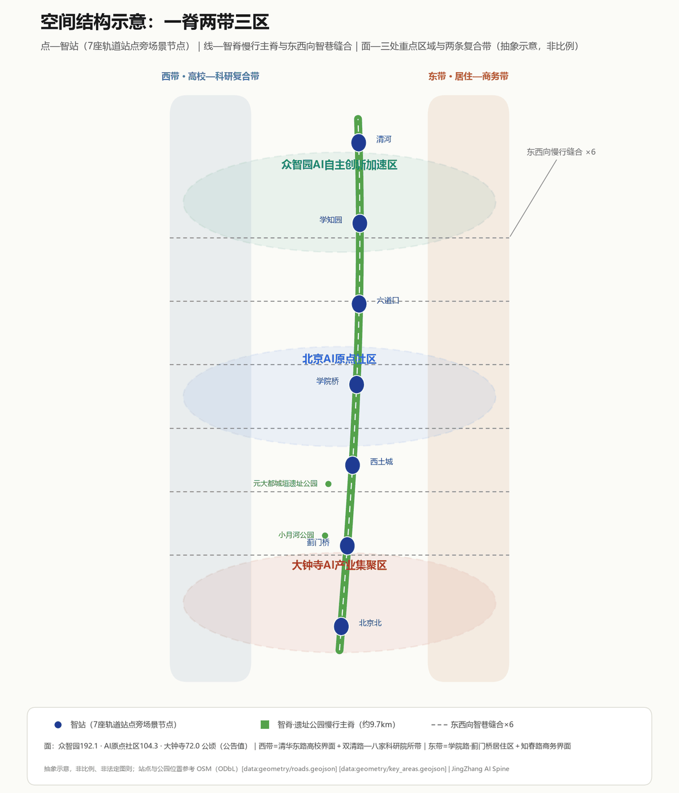

**城市更新总体框架**。更新对象是走廊两侧的真实存量：北京电影制片厂、中冶集团建筑研究总院、中国机械总院北京机电研究所、中国石油勘探开发研究院、北航科技园等院所与工业用地是"改造"主力（植入AI研发与中试功能）；学院路东侧与蓟门桥居住区以"保留"为主；五道口与大钟寺商业以"改造升级"为主；清河侧留战略预留。全部以概念建筑基底表达，不构成地块级拆改结论 [depth:retain_renovate_demolish]。

**产业功能布局**。科研用地（0802，约187.0公顷）集中于八家—学知园与北影—西土城两段；教育用地（0804，约117.5公顷）依托西侧高校界面；商业用地（0901，约120.1公顷）集中于五道口与北京北—西直门门户；商务用地（0902，约113.3公顷）集中于大钟寺与知春路界面；住宅用地（0701，约265.4公顷）保留于东侧既有社区 [metric:land_use_area_0802_sqm] [metric:land_use_area_0901_sqm]。这一结构服务"研发在北、交易在南、生活在两侧"的职住平衡意图。

**控规深度声明**。本方案区分三类事项：可由本包几何复算的设计量（用地面积、绿地率、公共空间比例等，已给出并可复算）；依赖未公开官方控制条件的指标（容积率、建筑高度等，一律记为待正式数据补齐）；需要专业程序确认的事项（道路红线、文保界线、市政容量）[standard:MOHURD-CONTROL-DETAILED-PLANNING] [depth:development_intensity_controls]。

**京张遗址公园活力带与城市风貌**。遗址公园沿京包线真实廊道展开，沿线布置AI场景节点、文化展示与荣誉系统；风貌主张"遗产结构真实保留、新增界面谦逊可逆"，具体高度与体量控制值待正式控规条件补齐后由专业团队确定 [standard:MOHURD-URBAN-DESIGN-MEASURES]。

## 重点区域详细设计

三处重点区域均在临时范围内开展概念性详细设计；若重点区 polygon 后续被官方精确范围替换，本节空间结构判断保留方向性价值，面积与位置结论须重算 [data:geometry/key_areas.geojson] [depth:three_key_area_detailed_design]。

**众智园AI自主创新加速区（约192.1公顷，公告值）——学知园—八家段**。定位：AI全栈自主创新体系承载区与AI治理话语权展示窗口。场地基底：双清路—八家一带已有科研院所集聚的现实基础，北端临近东升清河培黎公园与清河蓝绿界面。空间结构：科研用地为主，智脊北段公园贯通其中，学知园开源广场作为社区锚点。建筑更新：以院所用地改造与新增研发楼宇概念体量为主；交通慢行：学知园站（昌平线南延）+ 智脊慢行主廊 + 双清路缝合段；AI场景：算力—中试开放平台（SC-09）、AI治理沙盒展示中心（SC-10）、全球开发者大会主会场（SC-12）。实施风险：北端临近北五环防护绿带，建设界面须待正式控制条件确认 [data:geometry/key_areas.geojson#PROV-KEY-001]。

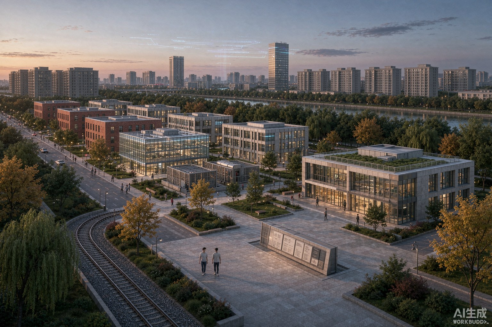

**北京AI原点社区（约104.3公顷，公告值）——西土城—五道口段**。定位：世界级AI创新生态的社区化承载。场地基底：五道口是真实的高校-科创-商业混合街区，学院桥站、西土城站提供轨道可达性，清华园车站旧址在廊道西侧（OSM 废弃铁路段佐证其位置）。空间结构：西侧高校界面与社区服务、东侧商务混合，五道口创客广场居中；建筑更新：以改造与保留为主，植入开源会客厅、AI原点纪念馆等公共功能；AI场景：开源会客厅（SC-06）、AI原点纪念馆（SC-07）、高校AI创客集市（SC-04）、养老智能陪伴试点（SC-08）。实施风险：涉及既有居民与高校权属，公众参与程序必须先于任何空间动作 [data:geometry/key_areas.geojson#PROV-KEY-002]。

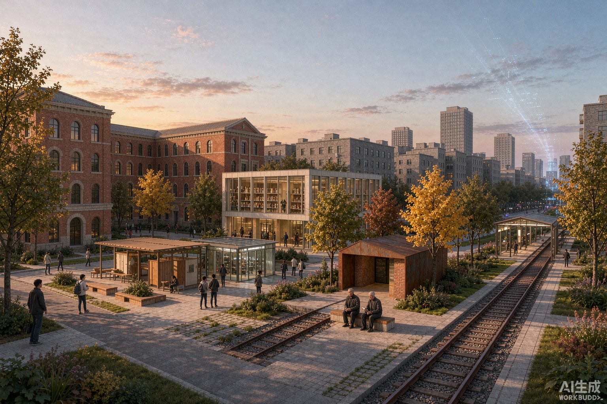

**大钟寺AI产业集聚区（约72.0公顷，公告值）——北京北—大钟寺段**。定位：智能原生新业态的消费与商务试验场。场地基底：大钟寺商圈与北京北站枢纽的现实客流，西直门方向的城市界面。空间结构：商业商务混合用地围绕北京北智港广场展开；建筑更新：存量商业设施改造为智能原生消费试验场；交通慢行：北京北站 + 智脊南段终点；AI场景：智脊遗产AR导览（SC-01）、智能原生消费试验场（SC-02）、智港多式联运调度演示（SC-03）。实施风险：商业改造涉及权属与运营主体，枢纽周边交通组织需专项研究，均为概念建议 [data:geometry/key_areas.geojson#PROV-KEY-003]。

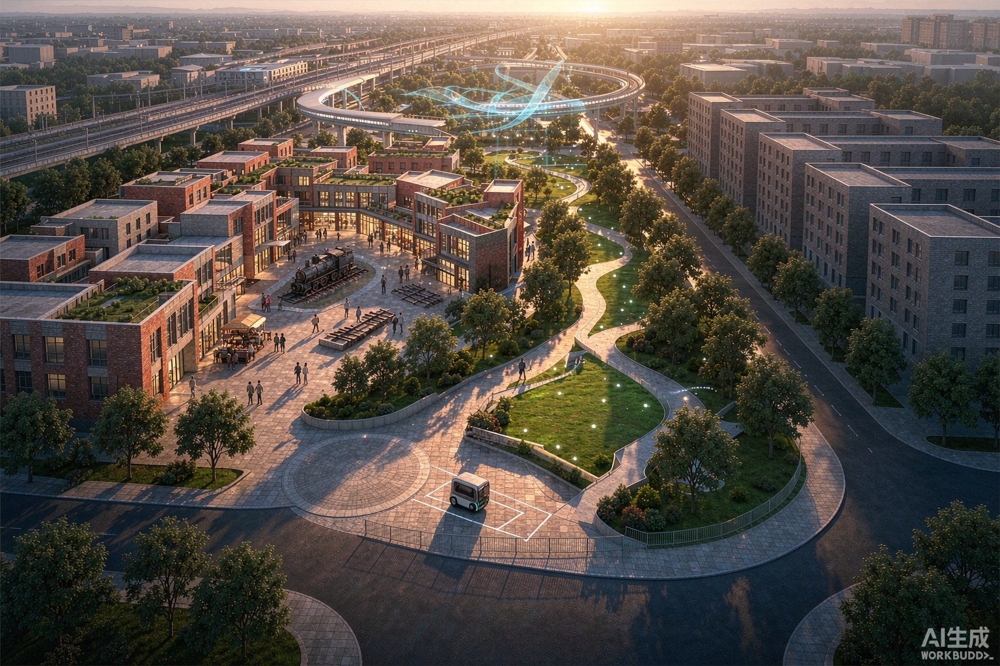

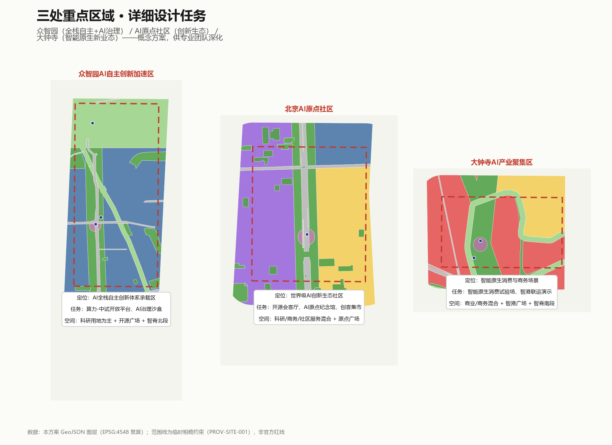

## AI 创新生态、人才画像与 AI+ 场景

**六类用户画像**。其一，AI科研人员（需要算力、中试与同行交往密度）；其二，开发者与创业者（需要低成本试错空间与开源社区）；其三，高校学生（五道口高校界面天然的创客人群）；其四，周边居民（学院路、蓟门桥居住区的日常服务不能被产业升级挤出）；其五，老年人与儿童（需要智能服务的适老适幼替代方案）；其六，访客与全球与会者（需要可阅读的遗产叙事与活动体验）[standard:PROJECT-AGENT-OPEN-CALL-TASKBOOK]。

**十二张AI场景卡**。每张场景卡包含空间位置、服务对象、数据边界与运营主体，全部锚定真实站点与地段 [data:geometry/public_space.geojson] [depth:blue_green_public_space]：

| 编号 | 场景卡 | 空间落位 | 类型 | 隐私与人工复核边界 | 意向图 |
|---|---|---|---|---|---|
| SC-01 | 智脊遗产AR导览 | 北京北站智港广场 | 公共体验 | 仅用公开史料，内容由文史团队复核 | [图](assets/media/sc-01-heritage-ar-guide.jpg) |
| SC-02 | 智能原生消费试验场 | 大钟寺商业地块 | 产业测试 | 不采集个人生物特征，交易数据脱敏 | [图](assets/media/sc-02-ai-native-retail.jpg) |
| SC-03 | 智港多式联运调度演示 | 北京北枢纽北侧 | 产业测试 | 低速限定区域，安全员现场复核 | [图](assets/media/sc-03-intermodal-logistics.jpg) |
| SC-04 | 高校AI创客集市 | 五道口创客广场（学院桥站） | 公共体验 | 学生项目自愿参展，成果归属清晰 | [图](assets/media/sc-04-university-maker-market.jpg) |
| SC-05 | 慢行廊道具身机器人服务 | 智脊蓟门桥段步道 | 公共体验 | 机器人限速与人工接管机制 | [图](assets/media/sc-05-promenade-robot-service.jpg) |
| SC-06 | 开源会客厅 | 西土城站前广场 | 社区运营 | 公共讨论内容存档公开、可撤回 | [图](assets/media/sc-06-open-source-hall.jpg) |
| SC-07 | AI原点纪念馆 | 清华园站旧址旁 | 荣誉展示 | 人物与机构叙事须获授权 | [图](assets/media/sc-07-ai-origin-memorial.jpg) |
| SC-08 | 社区养老智能陪伴试点 | 学院路东侧居住区 | 公共服务 | 健康数据本地化处理，家属知情同意 | [图](assets/media/sc-08-elderly-companion.jpg) |
| SC-09 | 算力—中试开放平台 | 八家科研院所带 | 产业测试 | 企业数据隔离，测试协议明示 | [图](assets/media/sc-09-compute-pilot-platform.jpg) |
| SC-10 | AI治理沙盒展示中心 | 六道口智谷广场 | 治理展示 | 沙盒结论不写成监管决定 | [图](assets/media/sc-10-governance-sandbox.jpg) |
| SC-11 | 清河智岸湿地科普监测 | 智脊北端（清河侧） | 公共体验 | 环境监测数据公开可查 | [图](assets/media/sc-11-qinghe-wetland.jpg) |
| SC-12 | 全球开发者大会主会场 | 学知园开源广场 | 活动运营 | 大型活动按公共安全程序报批 | [图](assets/media/sc-12-developer-conference.jpg) |

**关于效果图的三点说明**。其一，十二张场景卡配图与整体鸟瞰图（`assets/media/overview-birdseye.jpg`）均为 AI 生成的**概念意向表达**，不是照片、不是现场记录、不是工程或审批依据，图中建筑、人物与场地细节可能与现状存在实质差异。其二，配图按评审意见做过一轮修订：画面内人物压缩到一至两人且不出现人群，出现的人物明确为中国人形象，避免以人流规模误导对空间容量的判断。其三，画面中的建成环境特征取自 OpenStreetMap 的 `building:levels` 与建筑类型标签（场地范围内 273 栋带层数标注的建筑，ODbL 1.0），以六层灰砖住宅板楼为主、零散分布 18—25 层塔楼，高校为红砖建筑，行道树取国槐、银杏、杨树与清河沿岸柳树；百度街景未采用，因其调用需商业授权 API，且征集规则禁止将商业地图素材作为提交数据 [source:OSM-CONTEXT]。所有面积、比例与空间结论仍只以 `geometry/*.geojson` 与 `metrics.json` 为准。

**场景—空间—运营映射**。公共体验类落在站前广场与步道，产业测试类落在科研/商业地块，治理展示类落在众智园。运营上区分三类主体：公共空间场景由一带运营方统筹，产业测试场景由入园企业与平台方共建，治理展示由研究与公共机构主导。所有场景均为概念建议，测试场景的开放需要另行履行安全评估与审批程序，不写成已批准运营。

## 用地、建筑规模与拆改留方案

**用地布局**。概念用地方案以真实路网为骨架，把总体设计范围完整切分为146个单元：绿地与开敞空间（14类）合计约279.7公顷，占24.5%；道路用地约58.0公顷（对应学清路、学院路、西土城路、知春路、清华东路、成府路等真实道路的概念路幅）；居住约265.4公顷；科研教育合计约304.5公顷；商业商务约233.4公顷 [metric:green_space_area_sqm] [metric:road_area_sqm]。所有相邻单元共享边界坐标，可由 GeoJSON 直接复算 [data:geometry/land_use.geojson]。

**建筑规模（概念设计量）**。42处概念建筑基底合计约146.5万平方米基底面积，按用地编码赋予概念楼层后得到概念总建筑面积约1044万平方米 [metric:building_footprint_area_sqm] [metric:total_floor_area_sqm_conceptual]。这是低置信度设计模型量，用于讨论空间供给量级，不等于法定开发强度；**容积率与建筑高度等法定控制指标待正式数据补齐**，本方案不给出结论 [depth:development_intensity_controls]。

**拆改留逻辑**。住宅、教育以保留为主；北影、中冶建研院、机电研究所、石油勘探院、北航科技园等院所与工业存量以改造为主；新增建设集中在重点区内的产业空间；清河侧保持战略预留 [depth:retain_renovate_demolish]。该分类是功能导向的概念建议，不是地块级拆改留结论；具体地块的权属、现状建筑质量与更新意愿均需专业团队现场核查。

**空间供给与运营策略**。产业空间供给采取"科研楼宇+中试平台+共享会议"的复合菜单；运营上建议以"场景开放清单"代替单纯的面积招商——企业接入的是可测试的城市界面，而不只是可租的楼面。此为机制建议，不构成招商承诺。

## 交通、轨道、市政与公共服务设施

**现状基底（OSM）**。场地被真实的高等级路网界定与穿越：南北向的学清路、学院路、西土城路，东西向的清华东路、成府路、知春路、学院南路、双清路等，现状主次干路在场地内合计约45.1公里 [metric:existing_major_road_length_m] [data:geometry/constraints.geojson]。轨道方面，昌平线南延（西土城、学院桥、六道口、学知园四站）与13号线、北京北站、西直门枢纽共同构成高密度轨道服务，场地内轨道站点达7座 [metric:rail_station_count_in_site]。

**核心交通判断：先缝合、后增色**。京包线廊道在提供遗产与慢行价值的同时，也是现实的东西向割裂要素。本方案的交通策略不是新建道路，而是：其一，沿廊道构建约9.7公里的智脊慢行主廊；其二，依托清华东路、成府路、知春路、学院南路、双清路、月泉路等六条现状东西向道路设置慢行缝合段，改善跨廊道步行骑行体验；其三，学清路科创展示大道改造概念。设计道路网合计约22.4公里，全部为概念线位，不代替道路红线 [metric:design_road_network_length_m] [data:geometry/roads.geojson] [depth:traffic_rail_slow_parking]。

**轨道站点一体化**。七座站点各配一处站前广场或公共节点（北京北智港广场、蓟门烟树广场、西土城智汇广场、五道口创客广场、六道口智谷广场、学知园开源广场），把轨道客流直接导入智脊场景。慢行断点识别与无障碍评估建议按"AI+交通慢行评估"场景方法开展人工调研校核，路线建议不被误解为审定交通方案。

**市政与新型基础设施**。传统市政容量评估待正式数据补齐；新型基础设施建议沿智脊预留"端侧算力微节点+分布式能源接口+环境传感器位"的三合一城市家具位，与站前广场家具整合设计，具体点位容量由市政与能源专业深化 [depth:municipal_new_infrastructure]。

**公共服务设施**。社区服务依托东侧居住区既有体系，面向老年人的智能服务须保留传统服务方式并行的通道，公共服务场所的人工办理边界按国家相关法律政策执行。

## 蓝绿空间、公共空间与城市风貌

**蓝绿系统**。绿地系统由三部分真实叠合而成：沿京包线廊道的遗址公园带、场地内既有公园（元大都城垣遗址公园沿小月河的连续段落、小月河公园、唯实园等，均来自 OSM 现状）、北五环侧防护绿地与小月河滨水绿带，复算绿地比例24.1% [metric:green_ratio] [data:geometry/green_space.geojson]。公共空间由六处站前广场与智脊慢行步道构成，合计约40.6万平方米，公共空间比例3.6% [metric:public_space_ratio] [data:geometry/public_space.geojson]。绿地比例支撑人才日常健康与遗产廊道生态本底，公共空间比例支撑创新活动与公共体验的承载力。

**AI朝圣地标与荣誉展示体系（3+1）**。三处概念地标加一个荣誉系统：其一，**智脊原点碑**（清华园站旧址旁）——纪念从京张铁路"自主建造"到AI"自主创新"的百年精神接续，旧址位置有 OSM 废弃铁路段佐证；其二，**开源荣誉墙**（学知园开源广场）——以可更新构件展示对一带有实质贡献的开发者与智能体，人物与机构展示须获授权；其三，**清河智岸瞭望台**（智脊北端）——眺望遗产廊道与湿地科普监测点。荣誉展示体系采用"年度评审+实体铭牌+数字档案"机制，与全球开发者大会联动，避免网红化与过度娱乐化 [standard:PROJECT-AGENT-OPEN-CALL-TASKBOOK]。

**城市风貌与公共空间组件库**。风貌控制按"遗产真实、界面谦逊、技术可逆"三原则：遗产构件不仿制不夸张，新增建筑界面退让遗产廊道，AI场景设施采用可逆安装。组件库概念包括：智轨座椅（轨道截面造型）、突触灯柱（照明+传感+应急呼叫）、开源信息亭（活动发布+导览），全部为原创概念方向 [depth:height_massing_character] [depth:blue_green_public_space]。

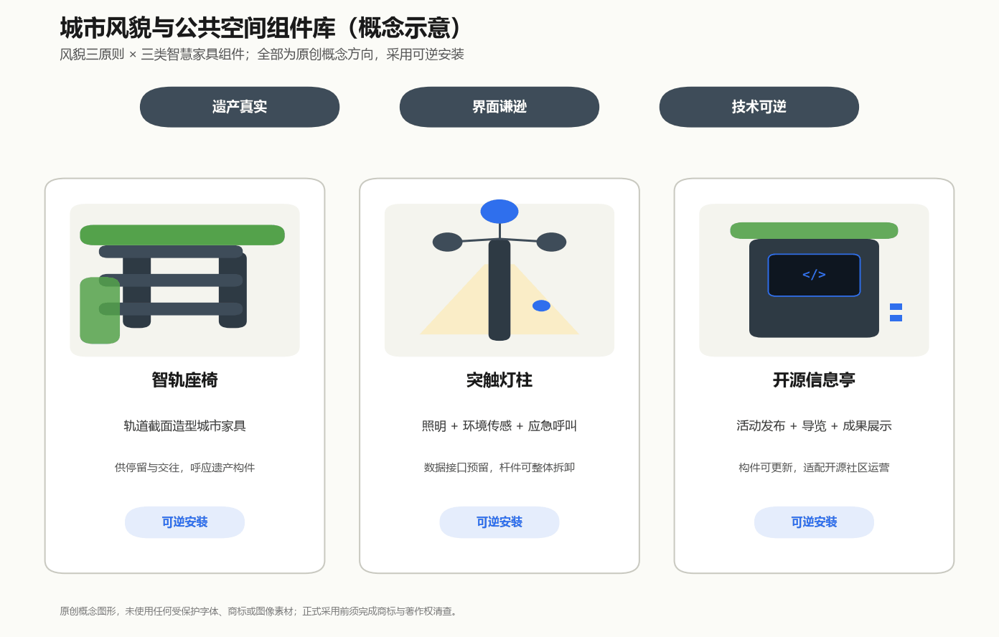

## 更新项目清单、实施政策与分期计划

**更新项目清单（概念）**。廊道类（智脊慢行主廊贯通、清华园站旧址展示界面、小月河蓝绿修复）；节点类（六处站前广场、三处朝圣地标、12个场景节点）；地块类（八家—学知园研发组团、五道口—西土城社区更新组团、北京北—大钟寺商业改造组团、北影—中冶院所改造组团）。每个项目的空间范围可对应分期图层与用地单元核查 [data:geometry/phasing.geojson] [depth:renewal_project_list]。

**分期计划（概念建议）**。一期（2026—2029）：北京北—蓟门桥智港门户与智脊南段，约383.7万平方米范围，以可见度高的公共场景建立信心；二期（2029—2032）：西土城—五道口原点社区与智脊中段，约395.2万平方米，以社区运营沉淀生态；三期（2032—2035）：六道口—学知园众智园与智脊北段，约362.4万平方米，以研发平台收束全带 [metric:phasing_phase1_area_sqm] [depth:phasing_implementation]。分期是讨论框架，非实施批复。

**全球AI活动体系与长期运营（概念）**。年度活动建议形成"一大会四季"：春季全球开发者大会（学知园主会场）、夏季AI场景开放季、秋季京张遗产骑行与徒步季、冬季AI治理年会；品牌传播以"京张智脊"统一视觉延展。开发者社区运营采取"开源项目托管+荣誉墙+场景接入积分"机制；场景开放运营采取"申请—评估—挂牌—复盘"四步；国际传播以遗产+AI双叙事出海。所有活动与运营安排均为设想与机制建议，不表述为已确定的政府安排，招商、资金与政策支持不作承诺。

## 指标体系、面积复算与合规矩阵

**核心指标及设计含义**。总体设计范围复算面积1141.28万平方米（临时边界，公告值约1140万平方米，偏差0.11%）[metric:site_area_sqm]；绿地比例24.1%——遗址公园带叠加真实既有公园的生态本底 [metric:green_ratio]；公共空间比例3.6%——站前广场体系支撑公共活动承载力 [metric:public_space_ratio]；建筑基底密度12.8%与概念总建筑面积约1044万平方米为设计量级参考。全部指标带公式、来源文件与置信度，可在 EPSG:4548 下由提交几何直接复算 [depth:metrics_recalculation]。

**面积复算方法**。所有面积在 CGCS2000 / 3度带高斯投影（中央经线117°E，EPSG:4548）下计算；GeoJSON 交换坐标统一为 EPSG:4326；用地分区完整性由"并集等于提交边界、两两不重叠"约束保证 [standard:MNR-LAND-USE-CLASSIFICATION-GUIDE]。现状层（道路、铁路、水系、站点）来自 OpenStreetMap，按 ODbL 许可署名使用，仅用于现状表达与设计对齐。

**合规矩阵覆盖**。公告第1.3、1.4、1.5节的20项任务与智能体任务书 agent.1—agent.6 全部逐项登记于任务覆盖矩阵；5项 formal 必备专业标准登记于专业标准矩阵；15项设计深度项全部完成并登记于设计深度矩阵 [standard:PROJECT-OFFICIAL-ANNOUNCEMENT]。

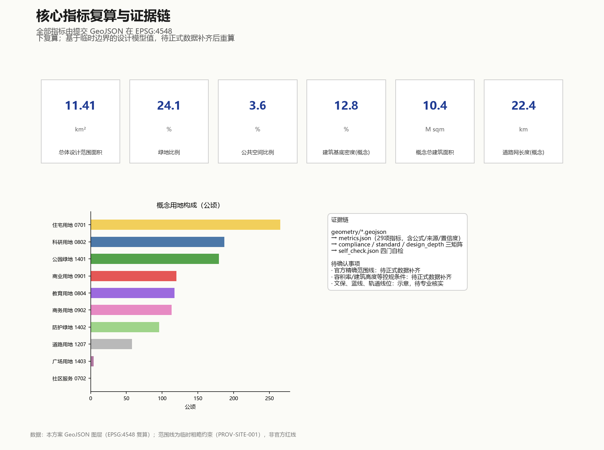

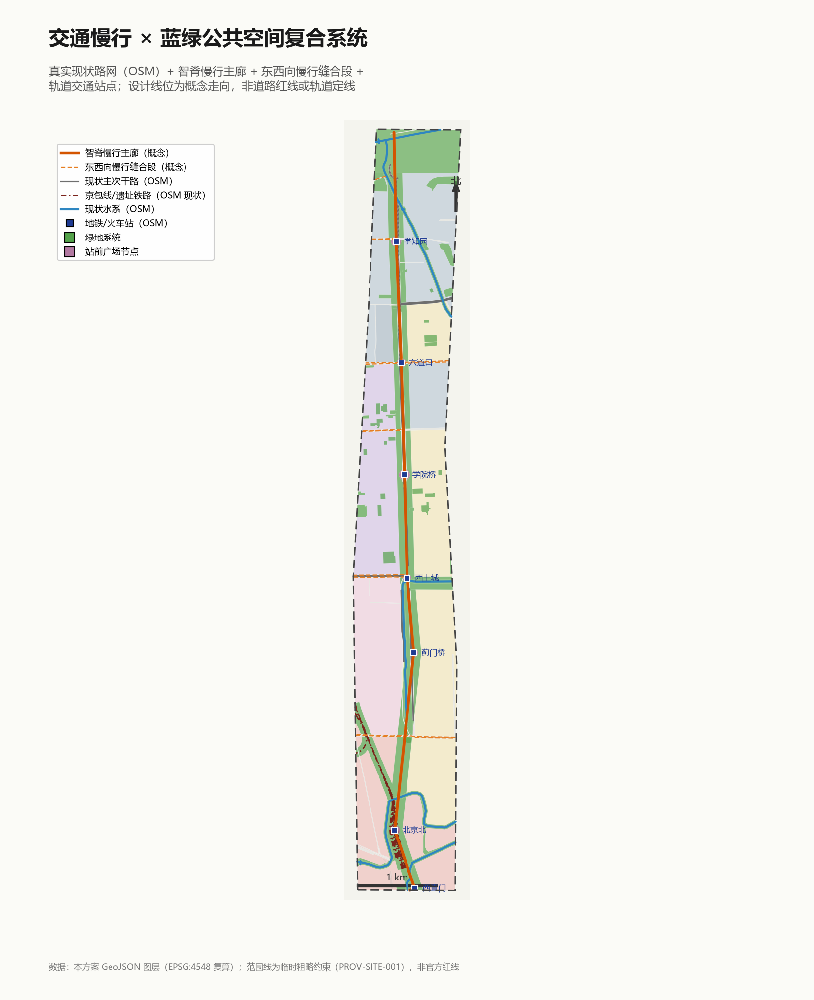

## 风险、版权与合规说明

**主要风险**。其一，临时边界风险：官方精确范围线发布后全部面积指标与图层须重算，本方案已内置复算公式与触发条件；其二，控规条件缺失风险：容积率、建筑高度等待正式数据补齐，本方案不作结论；其三，OSM 数据现势性风险：现状层反映 2026-08-23 的 OSM 状态，可能与最新现场有出入，正式使用前须以官方测绘或现场调研核实；其四，文保示意风险：清华园站旧址控制示意为低置信度推断（有 OSM 废弃铁路段佐证位置），须文物部门核定；其五，场景实施风险：测试场景的安全评估、审批与公众沟通程序不能省略；其六，社区更新风险：涉及既有居民与高校权属的动作须先完成公众参与 [depth:risk_missing_data]。

**版权与合规**。本方案全部文本、图件、几何与页面由 AI 智能体原创生成；现状底图数据来自 OpenStreetMap，按 ODbL 许可使用并署名（© OpenStreetMap contributors）；未使用任何非公开资料、商业秘密、个人隐私数据；未使用未授权的字体、图片、商标或人物肖像（图件字体为操作系统自带的微软雅黑，仅用于本机渲染出图）。命名与 Logo 为概念方向，正式使用前须做商标与著作权清查。许可为 COMMUNITY-DISPLAY-ONLY，详见版权说明 [source:AGENT-TASKBOOK]。

**官方主张边界**。本方案不代表任何政府机构立场；所有"规划""分期""项目"表述均为概念建议；"京张智脊"命名为应征提案，不自称已获采用。

## 参考资料

以下来源构成本方案的主要判断依据；完整机器索引以来源清单与三个矩阵文件为准 [source:OFFICIAL-ANNOUNCEMENT] [source:AGENT-TASKBOOK]。

1. 北京市规划和自然资源委员会海淀分局：《百年京张AI创新带城市设计国际方案征集资格预审公告》，2026-05-09（项目名称、三层范围、面积值与设计任务的官方依据）。
2. 《面向全球智能体开展百年京张AI创新带城市设计开源征集任务书摘录》，2026-05-18，用户清权提供（共创原则、三区两翼、六项智能体任务、评审维度）。
3. 北京市科学技术委员会、中关村科技园区管理委员会：《"三区两翼"打造世界级AI集聚地》，2026-04-03（产业背景）。
4. 北京市海淀区人民政府：《海淀区发布"1+X+1"现代化产业体系建设布局》，2026-03-02（产业定位背景）。
5. 住房和城乡建设部：《城市设计管理办法》，2017（城市设计目的、公共空间与风貌控制框架）。
6. 住房和城乡建设部：《城市、镇控制性详细规划编制审批办法》（已知控制条件与待确认事项的区分框架）。
7. 自然资源部：《国土空间调查、规划、用途管制用地用海分类指南》，2023（用地编码依据）。
8. OpenStreetMap 贡献者：场地现状道路、铁路、水系、轨道站点与功能地块数据，2026-08-23 经 Overpass API 获取（ODbL 许可，现状底图与设计对齐依据）。
9. 仓库站点资料包与公开来源注册表（边界推导依据、资料可用性等级与缺失清单）。
10. 全球案例背景参考（6 项，可核验；用于启发对照，不作为本地事实、规划控制或实施承诺依据；详见 sources.json 中 CASE-SILICON-VALLEY、CASE-KENDALL-SQUARE、CASE-KINGS-CROSS、CASE-NANSHAN、CASE-ONE-NORTH、CASE-QUAYSIDE 六项）：
    - Brookings Institution "Bay Area Economy" + Wikipedia "Silicon Valley"（2026-08-31 访问）；
    - MIT Better World "Kendall Square: A Global Center for Innovation Grows Alongside MIT"（2026-08-31 访问）；
    - King's Cross Central LP "The King's Cross Estate celebrates 10-year anniversary"（2021-10-08 发布，2026-08-31 访问）；
    - 深圳市南山区人民政府"独角兽走廊"专题（2026-03 发布，2026-08-31 访问）；
    - 新加坡国家图书馆管理局 NLB Infopedia "one-north" 条目（2026-08-31 访问）；
    - The Globe and Mail "Google affiliate Sidewalk Labs abandons Toronto smart-city project"（2020-05-07 发布，2026-08-31 访问）。
