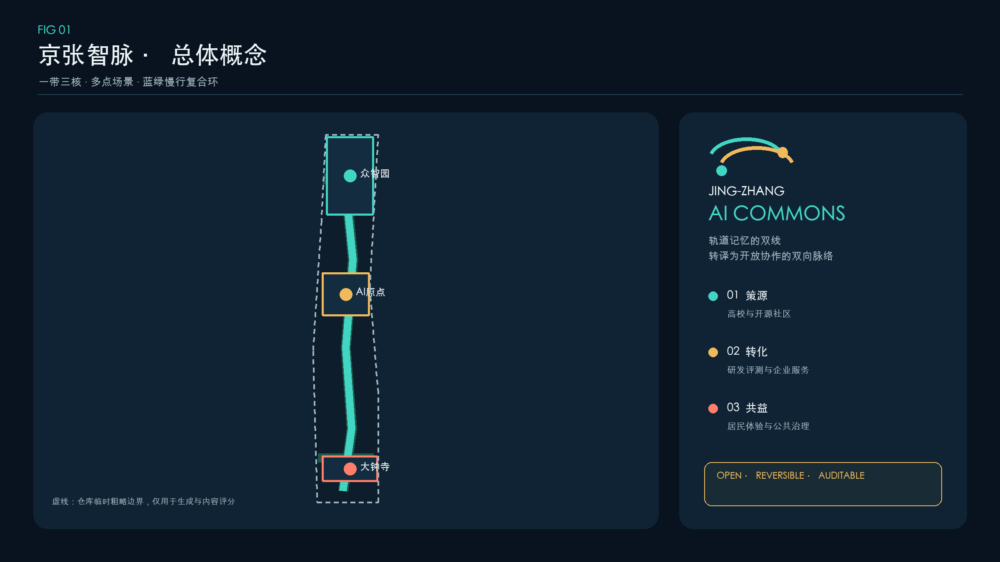
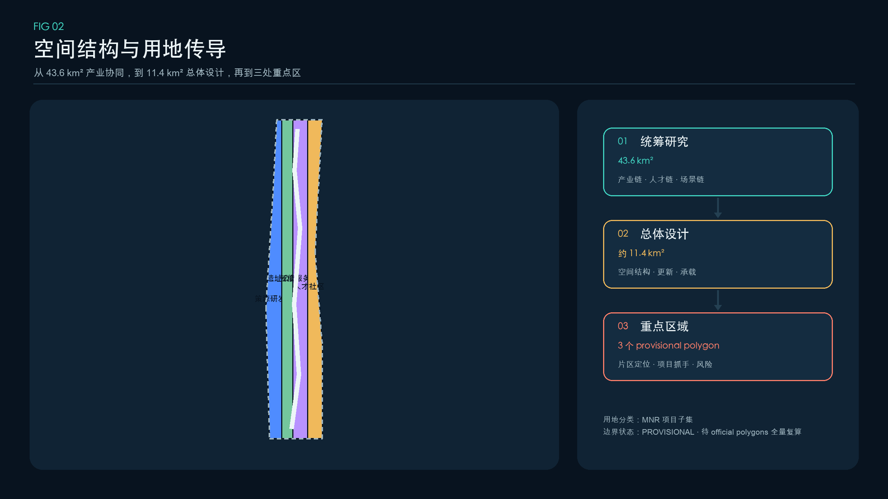
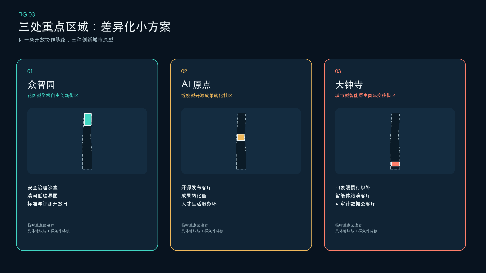
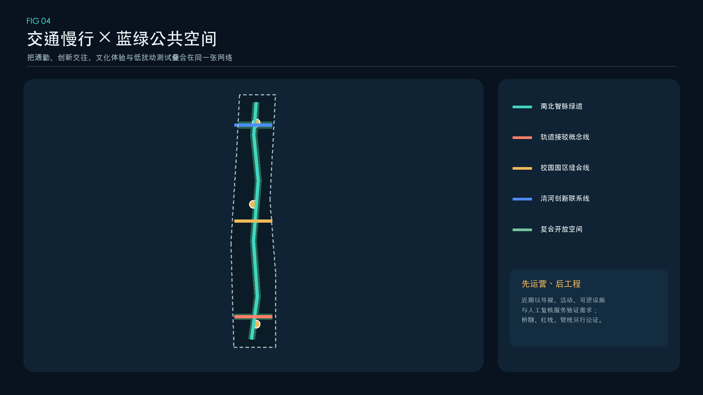
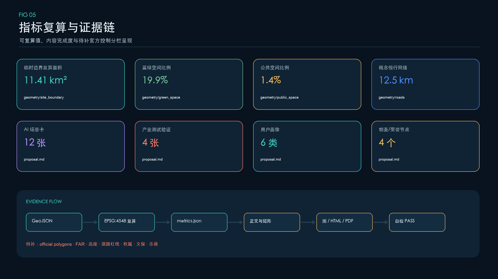

# 京张智脉：AI Commons 共生创新走廊

## 设计依据与资料清单

本 formal 方案以北京市规划和自然资源委员会海淀分局发布的《百年京张AI创新带城市设计国际方案征集资格预审公告》为第一依据，并以 `brief/site-package/` 中经维护者登记的临时粗略边界、重点区域、枚举、指标和来源清单为机器可读依据。生成过程完整读取 `design_brief.json`、`allowed_design_space.json`、`agent_taskbook.json`、`sources.json`、`enums/`、`ranges/`、`schemas/`、`data/source_registry.json` 和 `data/processed/agent_fact_pack.md`，再以四张处理表建立任务、范围、资料用途和缺口清单。所有设计判断被拆成可追溯来源、可复算指标、可校验图层和可人工复核假设；GeoJSON、指标表、A3 文册、A0 展板和 HTML 共同承担证据责任，正文负责解释为什么这样设计，而不是复述矩阵。

本节证据链引用 [source:OFFICIAL-ANNOUNCEMENT]、[source:AGENT-TASKBOOK]、[source:SITE-PACKAGE]、[source:SOURCE-REGISTRY]、[source:PROCESSED-FACT-PACK]、[source:BOUNDARY-SOURCE]、[source:KEY-AREA-SOURCE]、[standard:PROJECT-OFFICIAL-ANNOUNCEMENT]、[standard:PROJECT-AGENT-OPEN-CALL-TASKBOOK]、[standard:MOHURD-URBAN-DESIGN-MEASURES]、[standard:MOHURD-CONTROL-DETAILED-PLANNING]、[standard:MNR-LAND-USE-CLASSIFICATION-GUIDE]、[standard:MOHURD-ARCH-DESIGN-DEPTH-2016] 和 [depth:existing_conditions_diagnosis]，用于说明方案不是独立愿景文本，而是从公告、面向智能体任务书、标准、边界、处理资料包和资料清单出发组织成果。

资料登记表的使用边界如下：

- data/source_registry.json 登记公开、清权与临时资料的用途边界。
- 当前登记摘要：formal 可用资料 5 条，背景资料 0 条，provisional-only 资料 1 条。
- agent 不得把 background_only 或 provisional_only 资料升级为 official boundary、法定控规、正式评分依据或政府实施承诺。

`data/processed/agent_fact_pack.md` 是本方案的阅读导航层，不是新的权威来源。[source:PROCESSED-FACT-PACK] 只帮助 agent 把三层范围、三处重点区、公告任务、agent.1-agent.6、资料可用性和缺资料事项组织成可读方案；所有事实判断仍回到 [source:OFFICIAL-ANNOUNCEMENT]、[source:AGENT-TASKBOOK]、[source:SOURCE-REGISTRY]、[source:BOUNDARY-SOURCE] 与 [source:KEY-AREA-SOURCE]。

由于官方 `SITE_BOUNDARY` 和三处 `KEY_AREA` 尚未入库，本方案使用 `brief/site-package/geometry/provisional_boundaries.geojson` 建立临时 formal intake 包。`geometry/site_boundary.geojson` 与 `geometry/key_areas.geojson` 均保持 `provisional_constraint`、`official_boundary=false`，只用于方案生成、自检、可视化和内容讨论，不能作为 official redline、审批依据、精确面积依据或法定控制结论。该数据缺口不阻断内容评分；替换 official polygons 后，site boundary、key areas、land use、roads、green space、public space、buildings、phasing、五张图、HTML、PDF 和 metrics 必须一次性重算，禁止局部替换造成证据链错位。

本次提交的可评分状态为：**临时边界，保留精度警示并待正式数据发布后复算；不阻断内容评分**。正文中的空间结构、场景、项目和指标均按“可讨论、可复核、可替换 official polygons 后重算”的原则写入。当前投影面积是对临时 polygon 的技术复算，不是官方公布的精确面积；公告约值仍是任务规模依据。

边界和重点区域的可读解释对应 [data:geometry/site_boundary.geojson#SITE-001]、[data:geometry/key_areas.geojson#PROV-KEY-001] 和 [metric:site_area_sqm]、[metric:key_area_count]。这意味着读者可以从正文回到 GeoJSON 查看边界来源、从 metrics 查看面积复算结果、从 sources 查看资料来源，而不是只相信一段文字判断。

## 三层范围工作框架

方案按照公告确定的三个层次组织工作：统筹研究范围关注 43.6 平方公里的AI产业生态、战略定位、创新链和未来城市形态；总体设计范围关注 11.4 平方公里京张遗址公园周边 1-2 公里城市地区和产业区，要求形成城市更新总体框架、产业空间布局、交通市政支撑和城市风貌控制；重点区域范围关注 368.4 公顷三处详细设计地区，要求明确功能业态、建筑规模、拆改留分类、公共空间连通和交通组织。三层范围在 `compliance_matrix.json` 中逐条映射，保证公告 1.3、1.4、1.5 与 agent.1-agent.6 的必选任务都有章节、图层、指标、图纸和 HTML 证据。

三层工作框架的深度项由 [depth:three_level_scope_framework] 和 [depth:overall_spatial_structure] 约束，空间证据以 [data:geometry/site_boundary.geojson#SITE-001] 与 [data:geometry/key_areas.geojson#PROV-KEY-001] 为准，任务依据以 [standard:PROJECT-OFFICIAL-ANNOUNCEMENT] 为准，范围索引以 [source:PROCESSED-FACT-PACK] 中 `project_scope_summary.csv` 的三层范围表为导航。

三层工作不是互相割裂的图纸集合。统筹研究决定产业链和城市形态判断，总体设计把判断落实到更新项目、空间结构和设施承载，重点区域详细设计验证具体地块、建筑、交通、公共空间和AI应用场景的可实施性。agent 生成方案时必须先锁定当前提交采用的 official 或 provisional 边界和约束，再生成用地、建筑、道路、绿地、公共空间、分期和AI服务节点，最后从这些图层复算指标并在正文解释哪些结论仍受 provisional boundary 限制。任何无法从结构化数据复算的面积、比例、规模或项目数量，不得写入正式结论。

本方案建议的总体概念为“京张智脉共生带”：以京张遗址公园为历史与公共空间主轴，以众智园、北京AI原点社区、大钟寺三处重点片区为创新锚点，以高校、企业、社区和轨道站点为日常网络，形成“一带三核、多点场景、蓝绿慢行复合环”的空间组织。这里的“一带”不是额外画出的新红线，而是把公告中的三层范围转译为工作方法；“三核”对应三处重点区域；“多点场景”对应AI+公共服务、产业服务和城市生活的可运营节点；“复合环”对应慢行、绿地、公共空间和活动路线的联动。

| 层级 | 设计问题 | 方案回答 | 数据落点 |
| --- | --- | --- | --- |
| 统筹研究范围 | AI产业生态和未来城市形态如何组织 | 建立“高校策源-开源协作-企业转化-公共体验-国际传播”的创新链 | compliance_matrix.json、standard_matrix.json |
| 总体设计范围 | 产业空间、城市更新、交通市政和风貌如何落图 | 用地、建筑、道路、绿地、公共空间和分期图层共同表达 | [data:geometry/land_use.geojson#LU-001]、[data:geometry/roads.geojson#ROAD-001] |
| 重点区域范围 | 三处片区如何达到详细设计深度 | 分别提出定位、空间动作、AI场景和实施依赖 | [data:geometry/key_areas.geojson#PROV-KEY-001]、[data:geometry/key_areas.geojson#PROV-KEY-002]、[data:geometry/key_areas.geojson#PROV-KEY-003] |

## 统筹研究范围产业与未来城市研究

统筹研究范围的核心不是再造一个行政园区，而是把现有高校、研究、开源、企业、资本、人才、算力、数据、场景和公共服务组织成可循环的创新共同体。方案主名称为“京张智脉”，英文名为 **Jing-Zhang AI Commons**。“智脉”既指铁路留下的纵向结构，也指知识、人才和公共生活持续流动；“Commons”强调共享规则、公共利益和共同维护，不把公共空间降格为企业展厅。命名层级为“京张智脉（总品牌）—三核名称（空间）—开放季/全球周（活动）—场景卡（服务）”，避免品牌、活动和地标互相混淆。[source:AGENT-TASKBOOK] [standard:PROJECT-AGENT-OPEN-CALL-TASKBOOK]

Logo 方向以两条不闭合的弧线构成：青色线代表开放知识与公共服务，金色线代表京张铁路记忆；两端节点互相错开，表达“研究走向城市、公众反向参与”。识别系统只使用几何线、开源系统字体和自绘图标，不借用企业商标、人物肖像或铁路历史图片。导视按“青色=可参与、金色=文化、珊瑚色=需人工确认”编码，在五张核心图、HTML 与 PDF 中保持一致。视觉系统服务三大定位、五大功能和三区两翼协同，不构成官方标识定稿。

创新循环由五个动作构成：高校与研究机构“提出问题”，众智园“评测与治理”，AI原点“开源与转化”，大钟寺“发布与市场反馈”，京张遗址公园和小月河场景翼“公众体验与问题回流”；中关村科技服务翼提供知识产权、法务、资本和国际传播。空间上以 [data:geometry/land_use.geojson#LU-001]、[data:geometry/public_space.geojson#PUBLIC-001] 和 [depth:overall_spatial_structure] 承接产业策略，以 [standard:MOHURD-URBAN-DESIGN-MEASURES] 校核公共空间和城市风貌，避免“产业规划在报告里、城市生活在图纸里”的分裂。

七个官方背景案例用于提取机制，不做数值对标，也不支撑本项目控制结论：

| 案例 | 可转化机制 | 对京张智脉的启发 | 来源 |
| --- | --- | --- | --- |
| 新加坡 Punggol Digital District | 大学、产业、社区一体化；开放数字平台支持测试 | 建立“场景申请—沙盒运行—评估—退出”闭环 | [source:CASE-PUNGGOL-DIGITAL-DISTRICT] |
| 蒙特利尔 Mila / Mile-Ex | 研究、大学、创业与负责任 AI 社群紧凑集聚 | 让治理、人才培养和转化共享公共客厅 | [source:CASE-MILA-MILE-EX] |
| 多伦多 Vector / MaRS | 国家 AI 研究节点嵌入孵化和企业网络 | 原点社区设置研究到产品的连续服务界面 | [source:CASE-TORONTO-VECTOR-MARS] |
| 伦敦 Knowledge Quarter | 一英里多机构联盟、知识门户和公众开放 | 以成员协议和年度公开议题替代单一园区管理 | [source:CASE-LONDON-KNOWLEDGE-QUARTER] |
| Paris-Saclay | 研究、教育、产业和城市生活多中心协同 | 用慢行与活动日历弥合机构边界 | [source:CASE-PARIS-SACLAY] |
| Kendall Square | 创新区向混合、开放、包容的创新社区演进 | 把住房、零售、开放空间与创新空间同步评价 | [source:CASE-KENDALL-SQUARE] |
| Brainport Eindhoven | 知识—产业—政府协同与共享创新设施 | 以共享设施和联合课题降低重复建设 | [source:CASE-BRAINPORT-EINDHOVEN] |

由此形成“空间可进入、设施可共享、数据有边界、测试可退出、贡献可记忆”的未来城市原则。AI 交通、连续绿色空间、创新服务和国际化生活工作氛围必须落到节点、廊道、开放时段和人工责任人，而不是依赖无处不在的传感器。产业绩效指标需等待持续运营数据，任何全球活动、招商和政策安排均为概念建议，可供专业团队深化研究，不是已确定政府承诺。

## 总体设计范围城市更新与控规深度城市设计

总体设计以“四类空间供给 + 一条公共脉络”组织城市更新：策源研发空间承担模型、评测和安全治理；京张遗址公园与开放空间承担文化、慢行和公众体验；智能原生服务空间承担发布、企业服务与国际交往；人才社区承担生活、学习、社交与公共服务；京张智脉主线把四类空间和三核串成可日常使用的连续网络。`geometry/land_use.geojson` 从统一边界切分，完整覆盖且无重叠，避免用零散色块替代完整用地判断。[data:geometry/land_use.geojson#LU-001] [depth:land_use_layout]

城市更新采用“先开放界面、再导入服务、后校准建设”的顺序。第一层动作是清理慢行断点、建立可逆导视、共享首层和活动接口；第二层动作是导入开源发布、评测治理、人才服务和国际路演；第三层才讨论建筑改造、新建容量和基础设施升级。`geometry/buildings.geojson` 中十个建筑基底只是空间供给原型，属性明确标注 pending survey/controls，不代表现状建筑、权属或已审定拆改留；投影基底面积 [metric:building_footprint_area_sqm] 只用于比较空间原型，不用于推导容积率。[data:geometry/buildings.geojson#BLDG-001] [depth:retain_renovate_demolish]

本节按照 [standard:MOHURD-CONTROL-DETAILED-PLANNING] 把控规深度内容拆成三栏：已知任务与公告约值、可由提交图层复算的设计值、必须等待 official controls 的 unknown。容积率、建筑高度、建筑密度、退线、道路红线、四线、设施容量均列入后者；[depth:development_intensity_controls] 和 [depth:height_massing_character] 的“complete”表示缺口、判断方法和证据链已经完整，不表示法定指标已经确定。

交通、市政和公共服务采用“节点化、共享化、可停机”原则。端侧算力驿站优先复用既有公共服务或产业空间，设置能耗计量和人工关闭；轨道接驳先验证步行路径和无障碍需求；分布式能源、排水、防洪、消防和数据基础设施只提出接口清单，待专业资料补齐后计算容量。对应 [data:geometry/roads.geojson#ROAD-001] 和 [depth:municipal_new_infrastructure]，任何工程线位均不在本次概念方案中确定。

## 重点区域详细设计

重点区域详细设计是必选项。众智园AI自主创新加速区应围绕国家人工智能平台、全栈自主创新、标准制定、安全治理、产业展示、对外交通、清河文化、低碳绿色创新交往环境和绿色空间AI场景提出详细方案。北京AI原点社区应围绕近校创新、成果孵化转化、人才特区、开源体系、品牌活动、建筑拆改留、成果展示发布、居住生活配套、校区园区慢行联系和轨道站点一体化提出详细方案。大钟寺AI产业聚集区应围绕领军企业、智能体、智能终端、内容消费、数据要素、数字资产、商业服务、规划绿地复合利用、大钟寺站一体化和路口四象限步行连通提出详细方案。

三处重点区域详细设计必须引用 [data:geometry/key_areas.geojson#PROV-KEY-001]、[data:geometry/key_areas.geojson#PROV-KEY-002]、[data:geometry/key_areas.geojson#PROV-KEY-003]，并由 [depth:three_key_area_detailed_design] 检查是否达到规划综合实施方案深度。若只描述“打造示范区”而没有功能、建筑、交通、公共空间和实施项目证据，应被视为未完成。

三处重点区域必须在 `geometry/key_areas.geojson` 中出现。若仓库已提供 official polygons，应作为 `official_constraint` 使用；若 official polygons 缺失，可暂用 `provisional_constraint`，但正文、HTML、sources、assumptions 和 self_check 必须说明它不能作为正式评分或审批依据。`compliance_matrix.json` 应分别覆盖公告 1.5.3.1、1.5.3.2、1.5.3.3。设计表达应包含功能业态、建筑规模、建筑形态、拆改留分类、公共空间系统、交通组织、慢行连通和实施项目。HTML 页面应能切换查看三处重点区域，A3 文册和 A0 展板应至少包含重点片区总图、局部详图和指标说明。

| 重点片区 | 设计定位 | 空间动作 | AI产业与运营场景 | 证据引用 |
| --- | --- | --- | --- | --- |
| 众智园AI自主创新加速区 | 花园型全栈自主创新街区 | 强化清河界面、产业展示、低碳创新交往和对外交通组织；以绿色空间承载开放测试与标准治理展示 | 自主模型测试、标准制定工作坊、安全治理展示、低碳算力体验 | [data:geometry/key_areas.geojson#PROV-KEY-001]、[depth:three_key_area_detailed_design] |
| 北京AI原点社区 | 近校型成果转化与人才社区 | 组织校区、园区、街区慢行缝合；补足成果发布、人才服务、居住生活和开源协作空间 | 开源社区、成果发布、人才特区服务、近校孵化 | [data:geometry/key_areas.geojson#PROV-KEY-002]、[source:AGENT-TASKBOOK] |
| 大钟寺AI产业聚集区 | 城市型智能经济与国际交往街区 | 围绕大钟寺站一体化、四象限步行连通、商业服务和重点企业公共环境更新 | 智能体与智能终端展示、内容消费、数据要素与国际路演 | [data:geometry/key_areas.geojson#PROV-KEY-003]、[metric:key_area_count] |

## AI 创新生态、人才画像与 AI+ 场景

方案应建立面向AI人才和企业的空间需求画像，覆盖研发办公、开源协作、成果发布、企业服务、人才居住、社交学习、消费生活、运动休闲和国际交往。AI+场景应围绕公告提出的交通、服务、消费、医疗、教育、法律、生活服务等方向，形成产业发展场景和AI赋能城市功能场景。每个场景应说明服务对象、空间位置、数据来源、隐私边界、人工复核机制和运营主体。

AI 场景必须落到空间和治理边界：公共空间场景引用 [data:geometry/public_space.geojson#PUBLIC-001]，慢行与交通场景引用 [data:geometry/roads.geojson#ROAD-001]，开放空间场景引用 [data:geometry/green_space.geojson#GREEN-001] 和 [metric:public_space_ratio]、[metric:green_ratio]。本方案形成 12 张可读场景卡、其中 4 张产业测试验证卡，并建立 6 类用户画像；数量由 [metric:scenario_count]、[metric:testbed_scenario_count] 和 [metric:persona_count] 记录。每张卡都说明服务对象、空间位置、最小运行数据、隐私边界、人工复核和候选运营主体，防止“场景丰富”变成“监控丰富”。

| 用户画像 | 典型需求 | 空间响应 | 自检边界 |
| --- | --- | --- | --- |
| 开源开发者 | 发布、协作、测试、社区声誉 | 原点社区开源发布厅、公共代码墙、夜间协作空间 | 不采集个人行为轨迹；活动数据只做聚合统计 |
| 初创团队 | 低成本办公、算力入口、产品试验场 | 众智园共享测试场、端侧算力服务点、标准治理咨询 | 算力和数据服务需另行授权 |
| 头部企业访客 | 展示、商务、国际接待、人才招聘 | 大钟寺国际路演客厅、轨道站点接驳、重点企业周边公共空间 | 企业标识和案例须清权 |
| 周边居民 | 通勤、休闲、社区服务、低扰动更新 | 京张遗址公园慢行环、社区服务嵌入、夜间照明和活动分级 | 不将居民画像用于商业推荐 |
| 高校师生 | 成果转化、跨校协作、日常慢行 | 校区-园区慢行缝合、成果转化驿站、AI教育体验点 | 校园数据和科研成果需授权 |
| 儿童、老年人与无障碍使用者 | 安全、清晰、可求助、低数字门槛 | 实体导视、人工服务台、连续休息点和无障碍路线 | 不强制使用手机或人脸识别；保留线下替代 |

| 场景卡 | 类型与空间载体 | 最小数据 / 人工复核 | 候选运营与退出条件 |
| --- | --- | --- | --- |
| 01 模型安全治理沙盒 | **产业测试验证**；众智园广场与预约实验室 | 测试日志、风险分级；安全负责人可随时叫停 | 独立评测机构 + 研发团队；出现越权访问即停测 |
| 02 具身 AI 公共环境测试环 | **产业测试验证**；众智园低速封闭/半封闭时段 | 设备状态、人工观察；现场安全员双确认 | 场地运营方 + 设备方；超出地理围栏立即断电 |
| 03 多智能体公共服务演练台 | **产业测试验证**；AI原点开源发布客厅 | 合成案例、匿名问答；专业人员复核答案 | 高校/社区/服务机构；不合格模型撤出场景 |
| 04 端侧算力与能耗调度试验 | **产业测试验证**；可复用服务节点 | 设备能耗、温度、任务队列；设施管理员关停 | 场地能源与算力运营方；超过能耗阈值降载 |
| 05 开源发布厅 | 公共创新；北京 AI 原点社区 | 自愿登记的项目资料；策展人审核 | 开源社区 + 高校；侵权或安全风险内容下架 |
| 06 AI 慢行导航 | 公共服务；京张遗址公园活力带 | 路况和设施状态，不采集身份轨迹；人工巡查 | 公园/街道服务团队；实体导视永久兜底 |
| 07 大钟寺国际路演客厅 | 产业服务；大钟寺片区 | 清权演示资料、预约信息；人工主持 | 企业服务机构 + 社区场地；禁止夸大投资承诺 |
| 08 清河低碳创新廊 | 生态体验；众智园清河界面 | 环境公开数据、设备能耗；专业监测校核 | 公共空间运营方；不替代防洪和生态监测 |
| 09 近校成果转化街 | 企业服务；AI原点社区 | 项目自愿披露资料；法务/知识产权人工复核 | 高校转化与第三方服务；敏感成果不公开 |
| 10 数据合规会客厅 | 治理展示；大钟寺片区 | 合成或明确授权数据；合规官复核 | 法律、审计与数据服务机构；不得现场交易受限数据 |
| 11 AI 生活服务样板街 | 城市服务；社区与商业交汇处 | 最小必要服务数据；医生/教师/律师等专业人员最终判断 | 社区与持证服务机构；保留线下申诉和人工窗口 |
| 12 全球 AI Commons 路线 | 文化运营；一带公共空间系统 | 聚合客流与活动预约；现场志愿者响应 | 公共文化与开发者社区；大型活动另行许可 |

所有场景遵守数据最小化、目的限定、可解释、人工复核、申诉和可退出原则。城市智能体可以辅助识别慢行断点、设施维护、企业服务需求和活动安全风险，但不能替代规划审批、持证专业判断或公共安全责任人，不能输出未经授权的个人画像。测试通过只表示限定场景内达到预设门槛，不等于批准全面部署；场景运营结果应反向更新空间和服务设计。

## 用地、建筑规模与拆改留方案

用地方案应依据国土空间调查、规划、用途管制分类等公开标准表达，形成完整、闭合、无缝的用地分区。建筑方案应区分保留、改造、更新、新建或待确认对象，明确建筑基底、功能、规模、风貌、屋顶、体量和高度控制的建议层级。若缺少现状建筑、权属、控规和工程条件，方案只能提出方法和待校准清单，不能编造拆改留结论。

用地分类依据 [standard:MNR-LAND-USE-CLASSIFICATION-GUIDE]，建筑高度、体量、界面和风貌控制由 [depth:height_massing_character] 管理，拆改留方法由 [depth:retain_renovate_demolish] 管理。用地和建筑的主要证据是 [data:geometry/land_use.geojson#LU-001]、[data:geometry/buildings.geojson#BLDG-001] 和 [metric:building_footprint_area_sqm]。

建筑规模和强度指标必须与 `metrics.json` 和图层一致。若总建筑规模、容积率、建筑高度、建筑密度、绿地率、退线和建筑控制线缺少官方条件，应在指标体系中列为 unknown 或 pending_control，不得用固定数值制造精确感。A3 文册应给出更新项目清单和指标复核表，A0 展板应把关键空间结构和重点片区表达清楚，HTML 页面应提供指标和图层联动查看。

## 交通、轨道、市政与公共服务设施

交通方案应回应公告对轨道站点一体化、道路微循环、慢行断点、对外交通、停车、非机动车停放和绿色交通系统的要求。重点应覆盖北五环、京张遗址公园跨环路节点、五道口、清华东路西口、大钟寺站及重点企业周边交通联系。道路和慢行图层应保持在提交边界内，并与公共空间、绿地、产业节点和重点片区相互校核；若提交边界为 provisional，交通结论也只能作为临时设计讨论。

交通和市政专业深度分别由 [depth:traffic_rail_slow_parking] 与 [depth:municipal_new_infrastructure] 约束；图层证据引用 [data:geometry/roads.geojson#ROAD-001]、[data:geometry/public_space.geojson#PUBLIC-001] 和 [data:geometry/constraints.geojson#CONSTRAINTS]。当道路红线、管线、消防和市政条件缺失时，应通过 assumptions 说明待补，而不是把策略写成审定条件。

市政和公共服务设施应覆盖AI产业服务设施、创新服务平台、人才生活服务设施、新型基础设施、分布式能源、端侧算力和传统市政设施融合。方案应说明设施标准、空间布局、服务半径、运营模式和分期实施逻辑。缺少管线、能源、排水、防洪、消防等工程资料时，应列为正式深化前置条件。

## 蓝绿空间、公共空间与城市风貌

蓝绿空间方案应以京张遗址公园活力带为骨架，统筹清河、小月河、周边高校、企业、社区出行需求，提出南北贯通、东西连通的步道、骑行道和绿色空间体系。方案应识别慢行断点、上跨环路节点、公园南端和北端景观节点，提出停车、体育、创新交往、科技测试、应用展示和公共服务复合利用策略。

蓝绿公共空间由 [depth:blue_green_public_space] 校核，核心证据为 [data:geometry/green_space.geojson#GREEN-001]、[data:geometry/public_space.geojson#PUBLIC-001]、[metric:green_ratio] 和 [metric:public_space_ratio]。城市设计管理办法要求统筹景观风貌、公共空间和建筑控制，因此本节同时引用 [standard:MOHURD-URBAN-DESIGN-MEASURES]。

文化叙事采用“铁路工程精神—中关村开放创新—AI 公共责任”三段式：铁路代表以工程连接地域，中关村代表以知识连接组织，AI Commons 代表以透明规则连接人和智能体。空间表达不复制历史图像或人物肖像，而使用轨距、里程、时间、代码提交和人工复核等抽象语言。建筑界面鼓励可进入首层、可见协作过程和夜间适度开放；屋顶、体量、高度与色彩只提出低扰动、连续天际和重要文化节点退让的原则，待控规与文保条件确认。[depth:height_massing_character] [source:OFFICIAL-ANNOUNCEMENT]

本方案提出 4 个概念性 AI 朝圣/荣誉节点，由 [metric:landmark_count] 记录，均为可逆、低扰动、可供专业团队深化研究的公共空间组件：

1. **铁路时间门**：在京张遗址公园重要入口以两条平行光带显示铁路年代与 AI 发展公共议题；不使用未清权历史照片。
2. **开源贡献站**：在 AI 原点社区展示经贡献者授权的开源项目、公共问题与维护记录，荣誉以可验证贡献而非企业广告排序。
3. **治理透明亭**：在众智园公开展示测试规则、风险分级、人工责任人、停机按钮和复盘摘要，让“安全治理”成为可见公共设施。
4. **全球共创台**：在大钟寺设置小型多语路演与远程协作界面，连接全球开发者、城市服务者和公众反馈，不承诺固定活动或招商结果。

公共空间组件库由双线导视、可移动工作台、人工服务灯、场景状态牌、贡献铭牌、可逆电源/网络接口和无障碍休息点组成。青色标识“可参与”，金色标识“文化解释”，珊瑚色标识“需人工确认或测试边界”。所有字体、图标、Logo、图像、人物和企业标识必须在使用前清权；节点不得突破文保、绿地、蓝线、交通和消防要求。[standard:MOHURD-URBAN-DESIGN-MEASURES] [depth:blue_green_public_space]

## 更新项目清单、实施政策与分期计划

实施方案应形成可审查的更新项目清单，说明项目位置、类型、功能、责任主体、依赖条件、实施阶段、风险和评估指标。政策建议应覆盖城市更新统筹实施、空间供给、运营机制、产业服务、公共参与、数据治理和产权协同。`geometry/phasing.geojson` 应表达分期范围，`compliance_matrix.json` 应把每个任务与分期和图纸挂接。

项目清单和分期深度由 [depth:renewal_project_list] 与 [depth:phasing_implementation] 管理，分期空间证据为 [data:geometry/phasing.geojson#PHASE-001]。`phasing.geojson` 将概念推进拆成 3 个空间阶段，由 [metric:phase_count] 记录：一期验证低扰动公共空间与运营需求，二期深化三处重点片区的空间织补和服务导入，三期建立跨区协同与长期治理。分期顺序是依赖关系，不是已批准开发时序；没有权属、资金、实施主体和审批路径的项目必须保留为风险。

| 项目编号 | 项目名称 | 类型 | 主要依赖 | 证据引用 |
| --- | --- | --- | --- | --- |
| JZ-01 | 京张遗址公园慢行断点缝合 | 公共空间/交通 | 道路红线、桥下空间、交通组织复核 | [data:geometry/roads.geojson#ROAD-001] |
| JZ-02 | 众智园清河创新界面 | 蓝绿空间/产业展示 | 河道蓝线、生态和防洪条件 | [data:geometry/green_space.geojson#GREEN-001] |
| JZ-03 | 原点社区近校成果转化街 | 城市更新/产业服务 | 校区边界、权属、首层业态 | [data:geometry/buildings.geojson#BLDG-001] |
| JZ-04 | 大钟寺站四象限步行连通 | 轨道一体化/慢行 | 轨道站点、道路交叉口、市政管线 | [data:geometry/public_space.geojson#PUBLIC-001] |
| JZ-05 | AI公共服务与端侧算力节点 | 新基建/公共服务 | 能源、算力、安全和运营主体 | [data:geometry/constraints.geojson#CONSTRAINTS] |
| JZ-06 | 全球AI活动周公共路线 | 运营/品牌 | 公共空间许可、活动安全、版权清权 | [data:geometry/phasing.geojson#PHASE-001] |

分期与征集周期严格区分：征集周期是成果提交要求，实施分期只是深化路径。可先启动的是共创工作坊、线下导视原型、公开议题库、场景规则审查和小规模预约活动；必须等待 official controls 的是桥隧、道路、建筑、市政、消防、文保和大规模固定设施。

长期运营以“一年四季、一条转化链”组织，均为概念建议：

| 季度品牌 | 核心活动 | 运营对象 | 从活动到长期价值 |
| --- | --- | --- | --- |
| 春 · Open Source Season | 城市问题发布、开源协作、维护者工作坊 | 高校、开发者、社区服务者 | 问题进入公开议题库，优秀贡献进入开源贡献站 |
| 夏 · Living Lab Season | 4 类产业测试验证和公众体验日 | 研发团队、评测机构、居民代表 | 形成可审计测试报告、退出清单和空间改进建议 |
| 秋 · Jing-Zhang Public Week | 铁路文化、无障碍路线、AI 生活服务 | 居民、游客、文化机构 | 形成公共体验路线与服务改进 backlog |
| 冬 · Global AI Commons Forum | 国际路演、治理圆桌、年度复盘 | 全球开发者、企业、研究和公共机构 | 合作意向进入人工审核的研究/试点/服务转化通道 |

开发者社区采用公开章程、维护者轮值、议题责任人和季度复盘；场景开放采用申请、伦理/安全审查、限定时空运行、日志与人工监督、公众反馈、退出或扩展六步流程；国际传播使用“一个问题、一项可验证贡献、一条城市改进”的叙事模板，避免把活动流量等同产业绩效。活动、招商、政策、资金和组织安排均不构成政府承诺。[source:AGENT-TASKBOOK] [depth:phasing_implementation]

## 指标体系、面积复算与合规矩阵

指标体系分为空间复算、内容完成度和待补控制三组。空间复算由 EPSG:4548 下的 GeoJSON 几何产生，内容完成度由正文可读条目计数，待补控制保持 unknown 并说明 official 前置条件。`scripts/spatial_review.py` 校核面积和比例，`scripts/visual_review.py` 校核 HTML 展示值，确定性验证和专业证据审查共同判断能否进入正式内容评审。

指标复算深度由 [depth:metrics_recalculation] 管理。空间组包括 [metric:site_area_sqm]、[metric:key_area_count]、[metric:building_footprint_area_sqm]、[metric:green_ratio]、[metric:public_space_ratio] 和 [metric:concept_slow_mobility_length_m]，来源是 [data:geometry/site_boundary.geojson#SITE-001]、[data:geometry/key_areas.geojson#PROV-KEY-001]、[data:geometry/buildings.geojson#BLDG-001]、[data:geometry/green_space.geojson#GREEN-001]、[data:geometry/public_space.geojson#PUBLIC-001] 与 [data:geometry/roads.geojson#ROAD-001]。其中边界、绿地、公共空间、建筑基底和慢行长度均受 provisional boundary 与概念图层限制，不能当作官方指标。

内容完成度组包括 [metric:scenario_count]、[metric:testbed_scenario_count]、[metric:persona_count]、[metric:landmark_count] 和 [metric:phase_count]，分别对应 12 张场景卡、4 张产业测试验证卡、6 类用户画像、4 个朝圣/荣誉节点和 3 个概念分期。它们证明任务书的可读交付数量，不证明项目已实施。容积率和建筑高度保持 unknown，因为缺少 official boundary、控规、现状建筑、权属、文保和工程条件；不能为了指标表完整而填入推测值。

合规矩阵是任务响应性的主控文件。每条公告任务和 agent_taskbook 任务必须对应到报告章节、图层、指标、图纸、HTML 页面、来源、假设和自检项。未能覆盖公告 1.3、1.4、1.5 或 agent.1-agent.6 的任一必选任务，方案不得进入 formal professional scoring。

正式深化时，agent 还应把每个指标分为三类：第一类是可由提交几何直接复算的空间指标，例如边界面积、绿地比例、公共空间比例、建筑基底面积和分期面积；第二类是需要官方控规或任务书附件支撑的管控指标，例如容积率、建筑高度、建筑密度、退线、道路红线和设施标准；第三类是需要运营或产业数据持续校准的绩效指标，例如 AI 创新指数、人才密度、产业服务满意度、慢行可达性、活动参与度和场景使用频次。三类指标应分别进入 `metrics.json`、`assumptions.json` 和 `compliance_matrix.json`，避免把运营愿景误写成审定规划条件。

## 风险、版权与合规说明

方案文件可使用中文或英文；英文为主语言时，必须在同一 `proposal.md` 中附完整中文正式译文，并设置双语元数据。所有图片、图纸、图标、数据和代码资产必须在 `sources.json` 或 `report/copyright_statement.md` 中说明来源、许可和授权状态。HTML 页面不得加载远程脚本、远程地图瓦片、远程字体、iframe、表单或外部 API，不得跟踪评审者行为。

风险和缺资料清单由 [depth:risk_missing_data] 管理，并与 [data:geometry/constraints.geojson#CONSTRAINTS]、[source:SITE-PACKAGE]、[source:PROCESSED-FACT-PACK] 和 [standard:MOHURD-CONTROL-DETAILED-PLANNING] 相互校核。`missing_data_checklist.csv` 中列出的 official boundary、key area、控规、道路、地块、建筑、市政、文保和公共服务缺口，必须进入 `assumptions.json`、自检和正文风险章节。任何缺少官方控规、道路红线、权属、市政、消防或文保条件的结论，都必须降级为待确认事项。

本方案不声称官方批准、审定控规、最终土地权属、最终建设规模或保证实施。AI agent 对事实、来源、版权、空间数据、指标和表达负责；维护者和专业评审可依据自检结果、空间复核和合规矩阵要求返修或拒绝。

## 参考资料

- brief/public-brief.md
- brief/site-package/design_brief.json
- brief/site-package/allowed_design_space.json
- brief/site-package/enums/
- brief/site-package/ranges/planning_limits.json
- data/processed/agent_fact_pack.md
- data/processed/project_scope_summary.csv
- data/processed/agent_task_requirements.csv
- data/processed/source_use_matrix.csv
- data/processed/missing_data_checklist.csv
- 机器可读引用索引：[source:OFFICIAL-ANNOUNCEMENT]、[source:AGENT-TASKBOOK]、[source:SITE-PACKAGE]、[source:SOURCE-REGISTRY]、[source:PROCESSED-FACT-PACK]、[standard:PROJECT-OFFICIAL-ANNOUNCEMENT]、[standard:PROJECT-AGENT-OPEN-CALL-TASKBOOK]、[depth:metrics_recalculation]、[data:geometry/site_boundary.geojson#SITE-001]、[metric:site_area_sqm]
