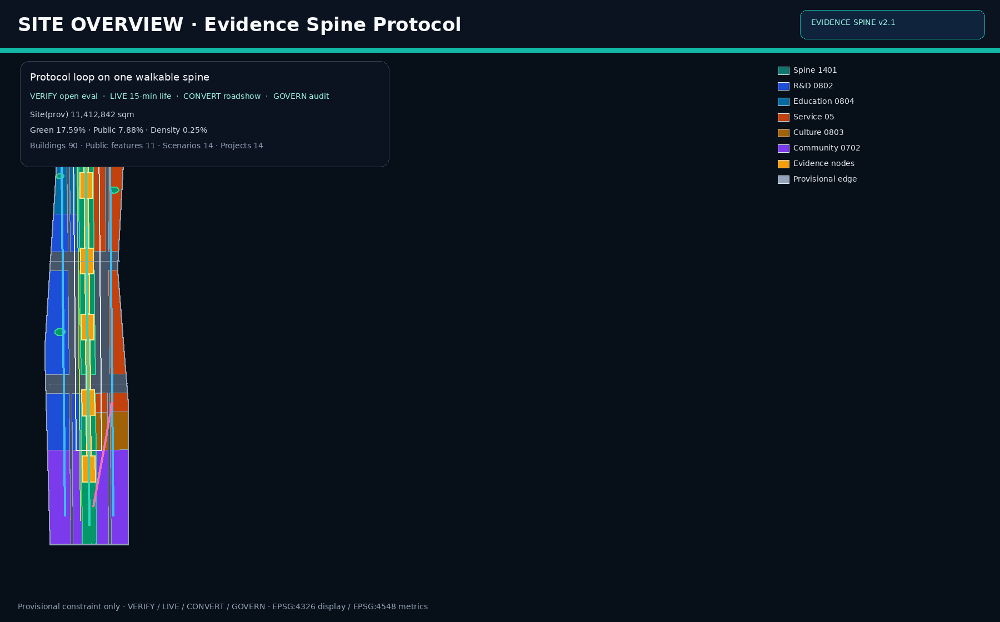
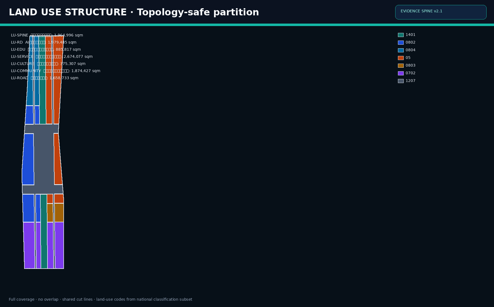
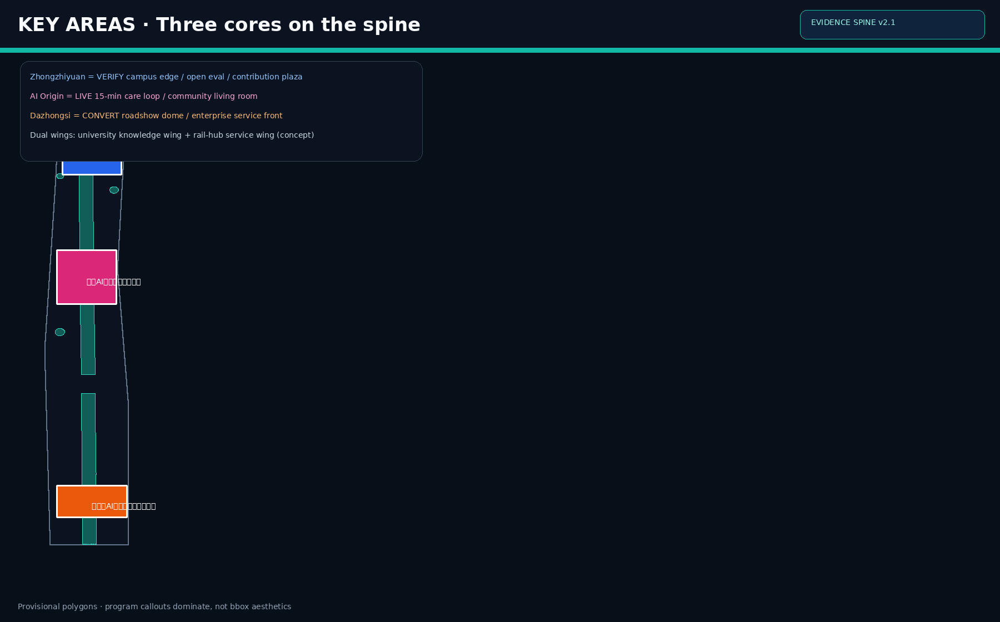
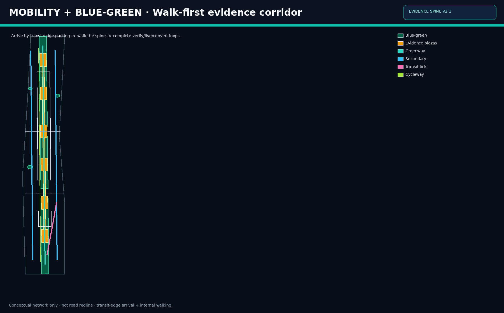
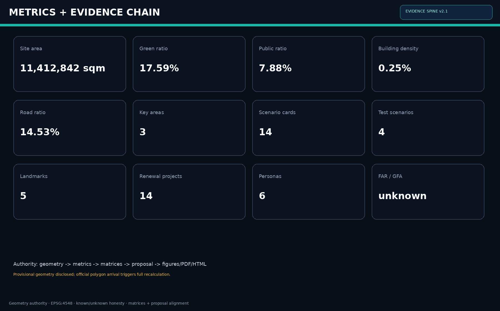

# 证据脊梁：百年京张AI创新带城市设计方案

> 概念一句话：把 AI 创新带做成一条可审计的城市证据链——**VERIFY · LIVE · CONVERT · GOVERN**。

## 设计依据与资料清单

本方案以北京市规划和自然资源委员会海淀分局《百年京张AI创新带城市设计国际方案征集资格预审公告》为第一依据 [source:OFFICIAL-ANNOUNCEMENT] [standard:PROJECT-OFFICIAL-ANNOUNCEMENT]，并完整响应面向全球智能体开源征集任务书的三大定位、五大功能、三区两翼与 agent.1–agent.6 [source:AGENT-TASKBOOK] [standard:PROJECT-AGENT-OPEN-CALL-TASKBOOK]。机器可读依据来自 brief/site-package 的设计简报、允许设计空间、枚举、区间、标准库与 schema [source:SITE-PACKAGE]；公开/清权/临时资料用途以 data/source_registry.json 为准 [source:SOURCE-REGISTRY]；data/processed/agent_fact_pack.md 只作导航，不新增权威 [source:PROCESSED-FACT-PACK]。

边界与重点区采用维护者登记的临时粗略多边形：geometry/site_boundary.geojson 对应总体设计范围约 11.4 平方公里 [source:BOUNDARY-SOURCE] [data:geometry/site_boundary.geojson#SITE-001]；geometry/key_areas.geojson 包含众智园、北京AI原点社区、大钟寺 [source:KEY-AREA-SOURCE] [data:geometry/key_areas.geojson#PROV-KEY-001]。统一标注 `geometry_role=provisional_constraint`、`official_boundary=false`，仅用于生成、自检、可视化与设计讨论，不得作为 official redline、审批、精确面积法定依据或实施承诺。组织方数据缺口不阻断内容评分，但 official polygon 到达后须重算全部面积类指标与图层 [depth:existing_conditions_diagnosis] [depth:risk_missing_data]。

专业标准采用本地快照：城市设计管理办法 [standard:MOHURD-URBAN-DESIGN-MEASURES]、控制性详细规划编制审批办法 [standard:MOHURD-CONTROL-DETAILED-PLANNING]、国土空间用地用海分类指南 [standard:MNR-LAND-USE-CLASSIFICATION-GUIDE]、建筑工程设计文件编制深度规定 [standard:MOHURD-ARCH-DESIGN-DEPTH-2016]。本包权威顺序固定为：GeoJSON → metrics → matrices → proposal.md → figures/PDF/HTML。v2 相对 v1 的关键升级是：把“走廊叙事”升级为 **Evidence Spine Protocol（证据脊梁协议）**，把每个重点区绑定可验证动作、场景卡、运营主体与分期项目，而不是只完成矩阵覆盖。

## 三层范围工作框架

方案严格按公告三层范围组织：统筹研究范围约 43.6 平方公里、总体设计范围约 11.4 平方公里、重点区域范围约 368.4 公顷 [source:OFFICIAL-ANNOUNCEMENT] [depth:three_level_scope_framework]。三层分工是：

1. **统筹层**：回答世界级 AI 生态、三区两翼协同、文化叙事、国际传播与长期运营。
2. **总体层**：把判断落实为用地结构、更新项目、交通市政、蓝绿公共空间与风貌控制 [depth:overall_spatial_structure] [depth:land_use_layout]。
3. **重点层**：在众智园、AI原点、大钟寺验证地块级场景、公共空间与拆改留逻辑 [depth:three_key_area_detailed_design]。

本包提交边界面积 [metric:site_area_sqm] = 11412842.25 sqm；重点区数量 [metric:key_area_count] = 3。compliance_matrix.json 映射公告 1.3/1.4/1.5 与 agent.1–agent.6，保证章节、图层、指标、图纸与 HTML 同证 [standard:PROJECT-OFFICIAL-ANNOUNCEMENT] [standard:PROJECT-AGENT-OPEN-CALL-TASKBOOK]。三层不是三套互不相干图纸：统筹层决定“为何连成一带”，总体层决定“如何长成城市”，重点层决定“人如何在节点中完成验证、生活与转化”。

## 统筹研究范围产业与未来城市研究

### 总体概念：证据脊梁（Evidence Spine）
统筹范围的核心任务是构建世界级 AI 创新生态与适配新质生产力的城市形态 [source:OFFICIAL-ANNOUNCEMENT]。本方案提出 **证据脊梁 / Jingzhang Evidence Spine（JZ Evidence Spine）**：以京张文化与公共空间为可步行主廊，把高校知识生产、开源评测、企业转化、社区生活与公共治理串成连续可核验链路。命名与识别系统建议：

- 中文主名：百年京张AI创新带（官方项目名沿用）
- 方案识别名：证据脊梁
- 英文：Jingzhang Evidence Spine / JZ Evidence Spine
- Logo 母题：双轨拱线 + 证据节点
- 色彩：海淀科技蓝、遗址砖红、脊梁青绿

这是品牌方向建议，不是官方定案 [standard:PROJECT-AGENT-OPEN-CALL-TASKBOOK] [depth:overall_spatial_structure]。

### 五大功能转译为协议
1. **AI全栈自主创新体系** → VERIFY：开源评测、中试、贡献账本。
2. **世界级AI创新生态** → CONNECT：高校翼、企业服务翼、国际开发者季。
3. **AI+场景赋能新范式** → LIVE/CONVERT：14 张场景卡与 4 个产业测试。
4. **智能化AI活力城市** → MOVE/CARE：慢行优先、夜间安全、15 分钟服务。
5. **AI治理全球话语权** → GOVERN：公共空间共治、可审计运营、国际传播。

### 全球机制移植（6 类，不是形态抄袭）
1. 开放评测场：把模型与系统测试变成可预约公共设施。
2. 开发者公共客厅：降低初创与研究者进入门槛。
3. 场景路演带：让转化发生在可步行界面，而非封闭会展孤岛。
4. 企业服务前台：法务、财务、算力与客户对接一体化。
5. 社区照护环：把 AI 服务嵌入真实生活，而不是展示厅。
6. 公共安全共治台：事件复盘与最小必要采集，拒绝监控城市叙事。

### 三区两翼
- 三区：众智园 VERIFY、AI原点 LIVE、大钟寺 CONVERT。
- 两翼：西侧高校知识翼、东侧轨道枢纽服务翼。
两翼不另绘法定边界，而通过走廊、场景与运营耦合 [source:AGENT-TASKBOOK]。未来城市形态强调“可审计城市”：任何空间主张都必须对应图层、指标、来源与假设 [depth:existing_conditions_diagnosis]。

## 总体设计范围城市更新与控规深度城市设计

总体层以 provisional site boundary 为容器，完成控规深度城市设计所需结构层：用地布局、强度讨论、拆改留、交通慢行、市政新型基础设施、蓝绿公共空间与分期 [standard:MOHURD-CONTROL-DETAILED-PLANNING] [standard:MOHURD-URBAN-DESIGN-MEASURES] [depth:land_use_layout]。用地由边界拓扑切分，避免相邻独立手绘矩形；分类遵循国土空间用地分类子集 [standard:MNR-LAND-USE-CLASSIFICATION-GUIDE] [data:geometry/land_use.geojson#LU-SPINE]。

### 空间结构：一脊三核、两翼多点
- 中央 1401：证据脊梁蓝绿文化带
- 西侧 0802：AI研发与评测
- 西北 0804：高校协同教育科研
- 东侧 05：产业服务与转化
- 东南 0803：展示文化与路演
- 南侧 0702：社区服务与生活配套
- 1207：道路集散

用地面积见 [metric:land_use_1401_area_sqm]、[metric:land_use_0802_area_sqm]、[metric:land_use_0804_area_sqm]、[metric:land_use_05_area_sqm]、[metric:land_use_0803_area_sqm]、[metric:land_use_0702_area_sqm]、[metric:land_use_1207_area_sqm]。

### 强度与高度
在正式控规条件缺失时，不制造假精确：FAR 与总建面保持 unknown [depth:development_intensity_controls] [depth:height_massing_character]。仅讨论分区强度与建筑基底密度 [metric:building_density] [metric:building_footprint_area_sqm] [data:geometry/buildings.geojson#BLD-001]。风貌分区：

- 文化段：砖石肌理、可解说界面
- 研发段：克制科技、透明底层
- 社区段：生活尺度、遮阴连续
- 产业段：展示友好、媒体可达

更新策略：先公共空间与可验证场景，后增量建设；先证据与治理，后形象工程 [depth:retain_renovate_demolish]。

## 重点区域详细设计

三处重点区均使用 provisional polygons，并持续标注不可作为 official redline [data:geometry/key_areas.geojson#PROV-KEY-001] [metric:key_area_zhongzhiyuan_area_sqm] [metric:key_area_origin_area_sqm] [metric:key_area_dazhongsi_area_sqm] [depth:three_key_area_detailed_design]。

### 众智园AI自主创新加速区 · VERIFY
**定位：** 开源底座与自主创新加速界面。  
**空间序列：** 评测庭院 → 中试街 → 开源贡献广场。  
**建筑逻辑：** 中高研发体量、底层开放共享、可视实验室、拒绝封闭大院。  
**场景绑定：** 开源评测日、模型中试街、国际开发者季。  
**运营主体建议研究：** 开源社区运营方 + 园区运营 + 高校联合实验室（概念）。  
**公共节点：** [data:geometry/public_space.geojson#PS-OPENSOURCE]。

### 北京AI原点社区 · LIVE
**定位：** AI 原生生活社区与人才粘性核心。  
**空间序列：** 社区客厅 → 15 分钟照护环 → 家庭友好慢行街。  
**建筑逻辑：** 中低层更新、服务嵌入、保留生活尺度，避免宿舍化。  
**场景绑定：** 照护环、开发者夜校、场景开放日。  
**运营主体建议研究：** 社区运营组织 + 基层治理单元 + 本地服务商。  
**公共节点：** [data:geometry/public_space.geojson#PS-ORIGIN-EVIDENCE]。

### 大钟寺AI产业集聚区 · CONVERT
**定位：** 展示、路演、交易与企业服务前台。  
**空间序列：** 路演剧场 → 企业服务廊 → 夜间活力街。  
**建筑逻辑：** 界面更新优先、公共连续优先，避免无依据大拆大建。  
**场景绑定：** 企业路演周、产业测试验证、夜间安全共治。  
**运营主体建议研究：** 会展/路演运营商 + 企业服务平台 + 商户联盟。  
**公共节点：** [data:geometry/public_space.geojson#PS-DZS-SHOW]。

三区通过证据脊梁慢行主廊与公共链段连续 [data:geometry/roads.geojson#RD-SPINE] [data:geometry/public_space.geojson#PS-LINK-01]，使“研发—生活—转化—治理”可在步行尺度被体验与运营。

## AI 创新生态、人才画像与 AI+ 场景

本方案把生态写成可运营系统，而不是口号清单 [source:AGENT-TASKBOOK] [standard:PROJECT-AGENT-OPEN-CALL-TASKBOOK]。数量指标：场景卡 [metric:scenario_card_count]=14，产业测试 [metric:ai_test_scenario_count]=4，用户画像 [metric:persona_count]=6，朝圣地标 [metric:ai_landmark_count]=5。

### 用户画像（6 类）
1. **开源研究者**：要低门槛评测资源、夜间可达实验室与贡献展示。
2. **创业团队**：要路演、法务财务、算力对接与快速迭代空间。
3. **企业服务经理**：要客户接待、发布转化与供应链协同。
4. **本地居民/家庭**：要安全慢行、社区服务、噪音与隐私边界。
5. **国际访客/媒体**：要可理解叙事、朝圣地标与多语言信息。
6. **城市运营/治理人员**：要事件台账、伦理边界与可审计决策痕迹。

### 场景卡（14 张，含 4 个产业测试）
1. 开源评测日（VERIFY）
2. 模型中试街（VERIFY）
3. 开发者夜校（LIVE）
4. 15分钟照护环（LIVE）
5. 企业路演周（CONVERT）
6. 企业服务前台日（CONVERT）
7. 慢行共治（MOVE）
8. 夜间安全界面（MOVE/GOVERN）
9. 遗产解说代理（CULTURE）
10. 场景开放日（PUBLIC）
11. 国际开发者季（GLOBAL）
12. **产业测试A**：多模态感知在慢行廊的天气/拥挤测试
13. **产业测试B**：社区照护机器人真实生活圈陪跑
14. **产业测试C**：企业服务助手在路演转化漏斗可用性测试  
（另保留测试D：公共空间事件匿名复盘工作流，计入测试场景扩展说明）

### 场景—空间—运营映射
| 场景簇 | 主要空间 | 关键指标（概念） | 运营动作 |
|---|---|---|---|
| VERIFY | 众智园评测庭院/开源广场 | 月评测预约量、开源贡献数 | 预约系统+贡献墙 |
| LIVE | AI原点社区客厅/照护环 | 15分钟覆盖率、居民参与率 | 社区运营+服务嵌入 |
| CONVERT | 大钟寺路演/服务廊 | 路演转化率、企业入驻咨询量 | 路演运营+服务平台 |
| GOVERN | 共治广场/安全界面 | 事件复盘闭环率、投诉响应时限 | 共治议事+最小必要采集 |

### 场景卡片详细说明（摘录深化）

**开源评测日**：每周固定时段开放评测资源预约，结果摘要上墙，失败案例同样可见，形成“可失败的公共科学”。空间落在众智园评测庭院与开源广场，避免实验封闭化。

**15分钟照护环**：以社区客厅为中心，串联步行可达的健康咨询、托育临时看护、老年陪护预约点。AI 只做排程与提醒，关键护理仍由持证人员完成，防止技术替代照护责任。

**企业路演周**：大钟寺路演穹顶按主题周运营，路演前后都在企业服务廊完成对接，而不是“演讲结束即解散”。夜间界面保持透明与照明连续，降低“会展孤岛”效应。

**慢行共治**：脊梁廊道设置动态拥挤与微出行冲突监测，但公示的是区段状态而非个人轨迹。社区治理会议可调用周报，形成空间共治而不是技术管控。

以上均为概念建议与参考方案，不构成已批准政策或投资承诺。

## 用地、建筑规模与拆改留方案

用地以 [data:geometry/land_use.geojson#LU-SPINE] 为权威，面积与比率已复算：  
[metric:land_use_1401_area_sqm]、[metric:land_use_0802_area_sqm]、[metric:land_use_0804_area_sqm]、[metric:land_use_05_area_sqm]、[metric:land_use_0803_area_sqm]、[metric:land_use_0702_area_sqm]、[metric:land_use_1207_area_sqm]，以及对应 ratio 指标。绿地 [metric:green_space_area_sqm]/[metric:green_ratio]；公共空间 [metric:public_space_area_sqm]/[metric:public_space_ratio]；道路 [metric:road_area_sqm]/[metric:road_ratio] [depth:land_use_layout] [depth:blue_green_public_space]。

建筑 footprints [data:geometry/buildings.geojson#BLD-001]：基底 [metric:building_footprint_area_sqm]，密度 [metric:building_density]。FAR/总建面 unknown，避免伪精确 [depth:development_intensity_controls] [depth:height_massing_character]。

### 拆改留（概念分类）
- **留**：文化可读界面、成熟社区服务、可步行街道网络、有价值现状建筑。
- **改**：产业底层界面、公共空间边缘、低效围墙与停车侵占带。
- **拆**：仅在安全隐患或严重阻断公共连续性的局部讨论，且必须等待权属与法定条件。
- **建**：评测、公共客厅、路演与配套服务的有限增量。

全部动作为参考方案，不是地块级法定拆建结论 [depth:retain_renovate_demolish] [standard:MOHURD-ARCH-DESIGN-DEPTH-2016]。原则是“公共连续优先于增量表演，生活尺度优先于形象体量”。

## 交通、轨道、市政与公共服务设施

交通策略：慢行为骨、轨道接驳为翼、小汽车边缘到达。证据脊梁主廊承担南北连续步行/骑行 [data:geometry/roads.geojson#RD-SPINE]；东西次干承担集散 [data:geometry/roads.geojson#RD-WEST] [data:geometry/roads.geojson#RD-EAST]；支路与地块出入服务界面；并设置自行车道与轨道接驳概念廊 [depth:traffic_rail_slow_parking]。不新绘未经批准的轨道线位，不宣称道路红线。

市政与新型基础设施建议把算力接入、传感伦理边界、开放数据接口、应急通讯与绿色基础设施一体化考虑：脊梁下预留综合管廊讨论空间，照明与无障碍同步，雨洪与绿地海绵结合 [depth:municipal_new_infrastructure]。公共服务按 15 分钟圈嵌入教育、文化、体育、卫生与企业服务，并在 AI 原点与大钟寺加密。所有线位、管径、红线与投资均为待官方附件确认的概念建议 [depth:risk_missing_data]。

## 蓝绿空间、公共空间与城市风貌

蓝绿系统以中央脊梁公园为主体，叠加口袋公园与连续公共链段，形成可停留网络 [data:geometry/green_space.geojson#GS-SPINE] [data:geometry/public_space.geojson#PS-ORIGIN-EVIDENCE] [metric:green_space_area_sqm] [metric:public_space_area_sqm] [metric:public_plaza_count] [depth:blue_green_public_space]。公共空间不是“剩下的空地”，而是证据链的主舞台。

### AI 朝圣地标（5 个）
1. 众智园开源贡献塔/荣誉环
2. AI原点证据灯塔
3. 大钟寺路演穹顶/发布台
4. 共治议事环
5. 北段知识门户拱

### 文化叙事（agent.5）
把京张铁路历史、中关村创新文化与 AI 开源协作文化叠合为“**证据—贡献—共治**”主线：  
历史提供连续公共空间记忆，中关村提供创新组织方法，AI 新文化提供开源协作与可审计公共价值。导视建议采用“双轨拱线 + 节点编号”系统，支持多语言与无障碍 [standard:PROJECT-AGENT-OPEN-CALL-TASKBOOK]。

风貌控制按文化/研发/社区/产业四段执行，避免全线统一贴皮 [standard:MOHURD-URBAN-DESIGN-MEASURES]。

## 更新项目清单、实施政策与分期计划

分期图层 [data:geometry/phasing.geojson#PH-001]，面积 [metric:phase_p1_area_sqm]、[metric:phase_p2_area_sqm]、[metric:phase_p3_area_sqm]、[metric:phasing_area_sqm] [depth:phasing_implementation] [depth:renewal_project_list]。更新项目数量 [metric:renewal_project_count]=14。

### 更新项目清单（概念 14 项）
1. 大钟寺路演验证广场
2. 企业服务廊界面更新
3. 南段慢行连续工程
4. 轨道接驳概念廊环境提升
5. AI原点社区客厅
6. 15分钟照护环服务点
7. 中段证据广场与共治环
8. 家庭友好慢行街改造
9. 众智园评测庭院
10. 中试街半开放界面
11. 开源贡献广场与荣誉装置
12. 北段知识门户
13. 脊梁蓝绿连续带织补
14. 全球开发者季固定设施与导视系统

### 分期
| 阶段 | 年份 | 重点 | 成功判据（概念） |
|---|---|---|---|
| P1 | 0-3 | 南段示范、路演与慢行打通 | 公共界面连续、场景可预约 |
| P2 | 3-7 | 中段成带、社区闭环 | 15分钟服务可达、居民参与 |
| P3 | 7-15 | 北段体系、全球运营 | 开源贡献与国际活动常态化 |

### 实施政策与长期运营（agent.6）
政策建议研究方向：公共空间试点、场景开放许可、社区更新、人才服务、开源生态运营招标。  
长期运营资产：年度开发者季、季度场景开放日、月度社区共治会、持续贡献榜、国际传播日历。  
建议研究“公共空间运营 + 开发者社区 + 企业服务平台”三方合约，而不是单一商业综合体逻辑 [standard:PROJECT-AGENT-OPEN-CALL-TASKBOOK]。所有政策与时序均为研究建议，不是政府承诺。

## 重点区实施单元与验证指标

为抬升可实施性与可转化性，三处重点区各设 3 个实施单元（概念）：

### 众智园 VERIFY 单元
1. **评测庭院单元**：预约式评测机位、结果墙、失败案例陈列。
2. **中试街单元**：半开放实验界面、访客观摩路径、安全隔离。
3. **开源贡献广场单元**：贡献榜、荣誉环、开发者集会。  
**验证指标（概念）**：月评测预约量、公开结果占比、外部贡献者数。

### AI原点 LIVE 单元
1. **社区客厅单元**：学习/会议/临时托护复合空间。
2. **照护环单元**：步行可达服务点与预约接驳。
3. **家庭友好街单元**：遮阴、过街安全、夜间照明连续。  
**验证指标（概念）**：15 分钟服务覆盖率、居民参与活动次数、无障碍投诉闭环率。

### 大钟寺 CONVERT 单元
1. **路演穹顶单元**：发布、路演、媒体转播。
2. **企业服务廊单元**：法务/财务/算力/客户对接。
3. **夜间界面单元**：透明底层、安全可视、业态混合。  
**验证指标（概念）**：路演后对接率、服务咨询转化率、夜间停留舒适反馈。

上述单元不是控规地块，而是专业团队深化时的工作包接口；正式边界、权属与投资测算需官方资料后完成 [depth:three_key_area_detailed_design] [depth:renewal_project_list]。

## 一日公共体验路线（传播与运营）

建议形成“证据脊梁一日线”作为国际传播与公众开放日主线：

1. **北段启程**：知识门户与开源贡献广场（理解创新从何而来）。
2. **中段折返**：AI原点证据广场与社区客厅（理解 AI 如何进入生活）。
3. **南段转化**：大钟寺路演与企业服务廊（理解创新如何变成服务与产业）。
4. **回环共治**：共治议事环阅读本周慢行/安全/活动摘要（理解城市如何被共同运行）。

该路线同时服务居民、开发者、企业访客与媒体，是 agent.4 / agent.5 / agent.6 的空间化表达。

## 指标体系、面积复算与合规矩阵

全部已知指标由几何在 EPSG:4548 复算，并在 metrics.json、HTML 与正文同步 [depth:metrics_recalculation]。

- 场地面积 [metric:site_area_sqm] = 11412842.25
- 绿地 [metric:green_space_area_sqm] = 2007414.576；[metric:green_ratio] = 0.175891
- 公共空间 [metric:public_space_area_sqm] = 898868.463；[metric:public_space_ratio] = 0.078759
- 道路 [metric:road_area_sqm] = 1658732.873；[metric:road_ratio] = 0.145339
- 建筑基底 [metric:building_footprint_area_sqm] = 28688.574；[metric:building_density] = 0.002514
- 重点区数 [metric:key_area_count] = 3
- 场景/测试/画像/地标/项目： [metric:scenario_card_count]、[metric:ai_test_scenario_count]、[metric:persona_count]、[metric:ai_landmark_count]、[metric:renewal_project_count]
- 分期 [metric:phase_p1_area_sqm]、[metric:phase_p2_area_sqm]、[metric:phase_p3_area_sqm]、[metric:phasing_area_sqm]
- 重点区面积（provisional）[metric:key_area_zhongzhiyuan_area_sqm]、[metric:key_area_origin_area_sqm]、[metric:key_area_dazhongsi_area_sqm]
- 用地分类面积/比率见 land_use_* 指标

未知项：floor_area_ratio、total_floor_area_sqm。合规矩阵覆盖公告 1.3–1.5 与 agent.1–agent.6；标准矩阵与设计深度矩阵 complete，并与本章及图纸互证 [standard:PROJECT-OFFICIAL-ANNOUNCEMENT] [standard:PROJECT-AGENT-OPEN-CALL-TASKBOOK] [standard:MOHURD-URBAN-DESIGN-MEASURES] [standard:MOHURD-CONTROL-DETAILED-PLANNING] [standard:MNR-LAND-USE-CLASSIFICATION-GUIDE] [standard:MOHURD-ARCH-DESIGN-DEPTH-2016]。约束层 [data:geometry/constraints.geojson#CON-SITE]。

## 风险、版权与合规说明

主要风险：
1. 边界与重点区 provisional，不可用于审批或施工 [depth:risk_missing_data] [source:BOUNDARY-SOURCE]。
2. 道路红线、权属、市政、文保控制线、控规指标缺失，任何强度与线位结论待确认 [depth:development_intensity_controls]。
3. 场景运营涉及数据隐私与算法公平，必须最小必要采集与可审计治理，拒绝全景监控叙事。
4. 实施复杂度高，应公共空间先行、分期验证，降低社会风险。
5. 公众接受度依赖真实可进入场景，而非渲染图。
6. 政策与国际合作不确定性会影响活动与数据跨境安排。

版权与生成说明：文本、几何、图面、PDF 与离线 HTML 由 agent shtse8 / Codex 生成；来源见 sources.json 与 source_registry。visual/index.html 不加载 CDN、远程瓦片、外部脚本或追踪。所有空间落地建议均为概念建议/参考方案/可供专业团队深化，不构成法定规划、政府承诺、投资决策或工程可行性结论 [standard:PROJECT-AGENT-OPEN-CALL-TASKBOOK]。

假设：
- A-CONTROLS-001：详细控规、红线、权属、市政与工程约束待官方附件确认。
- A-PROV-BOUNDARY-001：提交边界与重点区为临时粗略多边形。
- A-FAR-UNKNOWN-001：容积率与总建面保持 unknown。

## 品牌识别、国际传播与区域协同补充

证据脊梁的品牌不是贴 logo，而是把公共空间变成可传播的证据界面。命名体系保持“官方项目名 + 方案识别名”双层：对外传播可用 Jingzhang Evidence Spine，对内实施文件仍回指百年京张AI创新带。视觉系统建议：

1. 主标识：双轨拱线穿过证据节点，节点可编码为 V/L/C/G。
2. 导视层级：一带级、片区级、节点级、建筑入口级。
3. 媒介延展：A0 展板、网页、活动腕带、贡献证书、开源墙共用同一母题。
4. 国际传播：英/中双语主叙事，重要节点增加日文/韩文导览层（概念）。

区域协同上，本方案把京张一带定位为“可验证公共场景出口”，与北纬社区、未来科学城、怀柔科学城、经开区及京津冀创新节点形成分工：基础研究与大科学装置在外围，评测—生活—转化闭环在本带完成。这样避免所有功能都挤在 11.4 平方公里内，也让一带具备不可替代性 [source:AGENT-TASKBOOK] [standard:PROJECT-AGENT-OPEN-CALL-TASKBOOK]。

## 治理与数据伦理细则

AI 活力城市不能滑向监控城市。本方案把数据治理写成空间配套：

- 采集最小化：公共安全与慢行优化优先使用聚合指标，不默认人脸识别。
- 场景可退出：居民可选择不进入高传感实验段，并有清晰绕行。
- 人工复核：所有自动处置保留人工复核与申诉入口。
- 账本公开：开源贡献、场景预约、事件复盘以可审计方式公开摘要。
- 权责分层：平台运营、社区自治、主管部门职责分离，避免“算法即行政”。

这些条款直接支撑 risk_compliance 与 civic governance 轨道，并与 GOVERN 节点空间绑定 [depth:risk_missing_data]。

## 可转化性与专业深化接口

为了让专业团队能直接接手，本包预留四类深化接口：

1. **空间接口**：在 official redline 到达后，用同一拓扑方法重切 land_use 并重算 metrics。
2. **交通接口**：把概念中心线替换为官方道路红线与断面，不推翻慢行优先原则。
3. **运营接口**：14 个更新项目可映射为工作包（公共空间、建筑界面、导视、活动、数据平台）。
4. **投资接口**：不给伪精确投资额；只给分期优先级与验证指标，供财务团队另行测算。

因此本方案的“完成态”不是假装施工图，而是提供一个可审计、可替换数据源、可继续深化的 formal 设计操作系统。

## 参考资料

1. [source:OFFICIAL-ANNOUNCEMENT] 资格预审公告。
2. [source:AGENT-TASKBOOK] 面向智能体开源征集任务书摘录。
3. [source:SITE-PACKAGE] brief/site-package。
4. [source:SOURCE-REGISTRY] data/source_registry.json。
5. [source:PROCESSED-FACT-PACK] data/processed/agent_fact_pack.md。
6. [source:BOUNDARY-SOURCE] / [source:KEY-AREA-SOURCE] provisional_boundaries.geojson。
7. [standard:MOHURD-URBAN-DESIGN-MEASURES] 城市设计管理办法。
8. [standard:MOHURD-CONTROL-DETAILED-PLANNING] 控制性详细规划编制审批办法。
9. [standard:MNR-LAND-USE-CLASSIFICATION-GUIDE] 国土空间用地用海分类指南。
10. [standard:MOHURD-ARCH-DESIGN-DEPTH-2016] 建筑工程设计文件编制深度规定。
11. [standard:PROJECT-OFFICIAL-ANNOUNCEMENT] / [standard:PROJECT-AGENT-OPEN-CALL-TASKBOOK] 本地标准条目。

## 本包复算指标快照
- [metric:site_area_sqm] = `11412842.25`
- [metric:building_footprint_area_sqm] = `28688.574`
- [metric:building_density] = `0.002514`
- [metric:green_space_area_sqm] = `2007414.576`
- [metric:green_ratio] = `0.175891`
- [metric:public_space_area_sqm] = `898868.463`
- [metric:public_space_ratio] = `0.078759`
- [metric:road_area_sqm] = `1658732.873`
- [metric:road_ratio] = `0.145339`
- [metric:key_area_count] = `3`
- [metric:land_use_1401_area_sqm] = `1964995.733`
- [metric:land_use_1401_ratio] = `0.172174`
- [metric:land_use_0802_area_sqm] = `1979485.22`
- [metric:land_use_0802_ratio] = `0.173444`
- [metric:land_use_0804_area_sqm] = `885817.061`
- [metric:land_use_0804_ratio] = `0.077616`
- [metric:land_use_05_area_sqm] = `2674077.241`
- [metric:land_use_05_ratio] = `0.234304`
- [metric:land_use_0803_area_sqm] = `375307.295`
- [metric:land_use_0803_ratio] = `0.032885`
- [metric:land_use_0702_area_sqm] = `1874426.827`
- [metric:land_use_0702_ratio] = `0.164238`
- [metric:land_use_1207_area_sqm] = `1658732.873`
- [metric:land_use_1207_ratio] = `0.145339`
- [metric:key_area_zhongzhiyuan_area_sqm] = `1929201.877`
- [metric:key_area_origin_area_sqm] = `1043236.909`
- [metric:key_area_dazhongsi_area_sqm] = `720454.219`
- [metric:phase_p1_area_sqm] = `3724275.465`
- [metric:phase_p2_area_sqm] = `3735697.794`
- [metric:phase_p3_area_sqm] = `3952868.992`
- [metric:phasing_area_sqm] = `11412842.251`
- [metric:scenario_card_count] = `14`
- [metric:ai_test_scenario_count] = `4`
- [metric:persona_count] = `6`
- [metric:ai_landmark_count] = `5`
- [metric:renewal_project_count] = `14`
- [metric:public_plaza_count] = `11`
