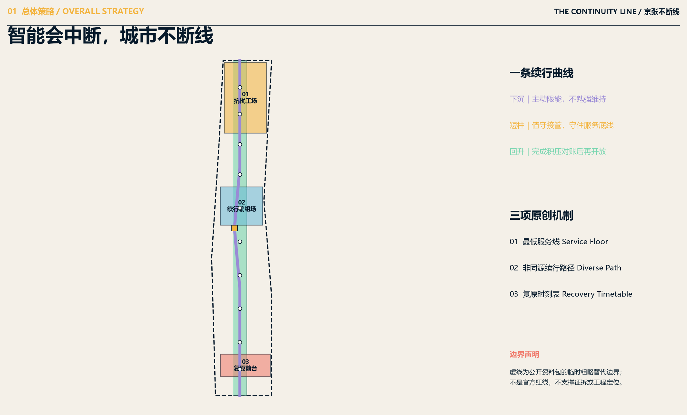
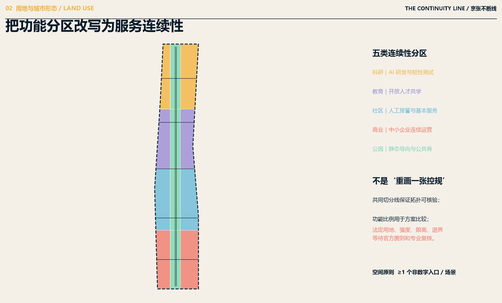
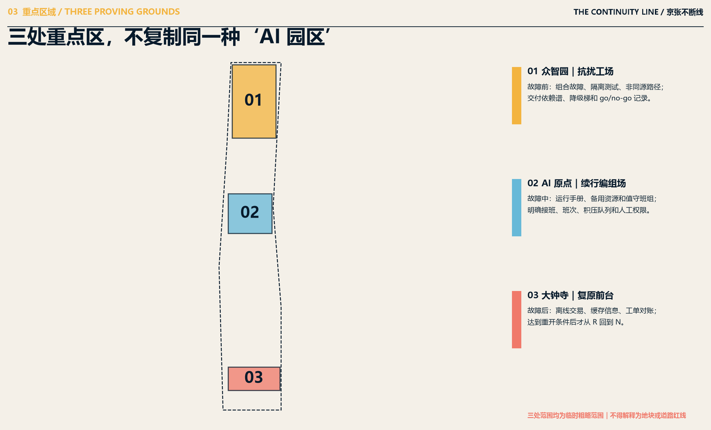
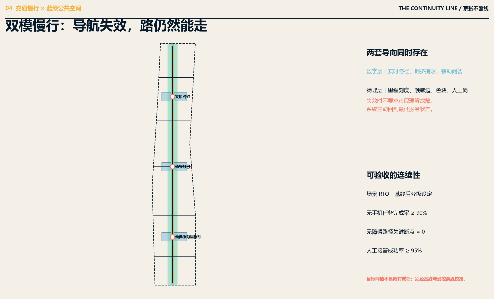
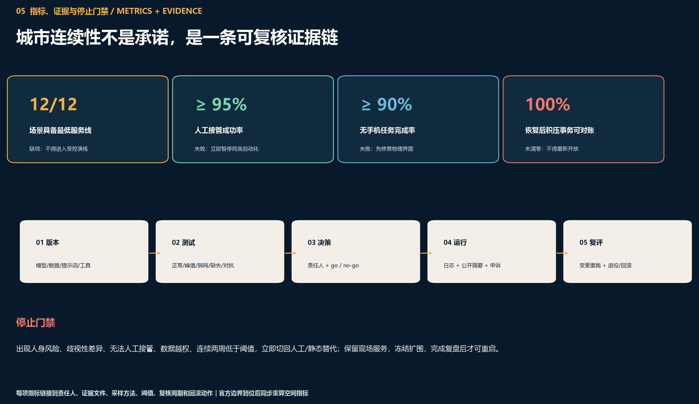

# Jing-Zhang Continuity: A Degradable, Reviewable, and Restorable AI Urban Continuity Band

> **THE CONTINUITY LINE**
> **The system may fail, and services have limits.**

"Uninterrupted" is not a promise of zero failures, but rather a commitment to maintaining the declared minimum services even when failures occur. The proposal translates the clarity of state, maintenance labor, manual scheduling, and safe shutdown required for long-term railway operation into three mechanisms for contemporary AI cities: **Service Floor** defines which services must continue, which should be proactively degraded, and which should be safely stopped during anomalies; **Diverse Continuity Path** avoids the same failure source for backup systems and primary systems; **Recovery Timetable** specifies takeover times, recovery goals, backlogged tasks, data reconciliation, and conditions for reopening. This forms a degradable, verifiable, and recoverable urban continuity belt spanning Zhongzhiyuan, Beijing AI Origin Community, and Dazhongsi.

## Design Basis and Source List

This proposal complies with the call for proposals, the agent task book, the publicly available data package, and its source registry. The official call outlines the purpose, three layers of work scope, three key areas, and the depth of professional outcomes. The agent task book supplements ten co-creation principles, six tasks, AI-Enabled Scenarios, cultural branding, and requirements for long-term operations. The source registry and fact package distinguish between formally citable, background-only, temporarily usable, and pending verification materials. Early public invitations and subsequent exchange materials are only for understanding the background of global open-source co-creation, technology-industry-city integration, ethical safety, and multi-stakeholder collaboration, and do not replace the official call. The corresponding references are [source:OFFICIAL-ANNOUNCEMENT] [source:AGENT-TASKBOOK] [source:SITE-PACKAGE] [source:SOURCE-REGISTRY] [source:PROCESSED-FACT-PACK] [source:OFFICIAL-OPEN-SOURCE-INVITE] [source:OFFICIAL-DESIGN-EXCHANGE]. (Background Only)

The spatial base map uses the temporary rough overall boundary and the areas of three key zones from the data package; both types of geometry retain official_boundary=false, provisional_constraint, and source notes. They can support conceptual generation, topological self-check, and scheme comparison but cannot be referred to as official planning boundaries. They also cannot be used as the basis for demolition and compensation, approval, land rights confirmation, or engineering layout. (Official Planning Boundary) [source:BOUNDARY-SOURCE] [source:KEY-AREA-SOURCE] The calculated area of the submitted boundary, in EPSG:4548, is [metric:site_area_sqm], and the number of key areas is [metric:key_area_count]. These values describe only the "submitted geometry" and do not confer any legal status upon it. [data:geometry/site_boundary.geojson#SITE-001] [data:geometry/key_areas.geojson#PROV-KEY-001]

The professional framework responds to Urban Design, Regulatory Detailed Planning, land use classification, and the depth requirements for architectural design. The proposal breaks down these requirements into a standard matrix, design depth matrix, nine groups of GeoJSON, recalculated indicators, A3 documents, A0 exhibition boards, and static web pages, forming an Evidence Chain that is readable by humans and checkable by machines. [standard:PROJECT-OFFICIAL-ANNOUNCEMENT] [standard:PROJECT-AGENT-OPEN-CALL-TASKBOOK] [standard:MOHURD-URBAN-DESIGN-MEASURES] [standard:MOHURD-CONTROL-DETAILED-PLANNING] [standard:MNR-LAND-USE-CLASSIFICATION-GUIDE] [standard:MOHURD-ARCH-DESIGN-DEPTH-2016] [depth:existing_conditions_diagnosis]

Documentation still lacks official boundary maps, statutory control plans, ownership details, current building conditions, road right-of-way lines, rail interface, utility lines, and cultural heritage protection and engineering geology. The plan does not allow AI to fill in these gaps: the constraints.geojson file is intentionally kept as an empty set due to the lack of space control surfaces with cleared rights; Development Intensity, height limits, setback distances, Demolish–Renovate–Retain Strategy, and road area ratios remain unknown. Once the official data is officially released, the boundaries and key areas should be replaced, constraints should be overlaid, and the parcel and building judgments should be redone. All indicators should be recalculated and new drawings produced, rather than merely changing a single number. [data:geometry/constraints.geojson#empty-pending-official-data] [depth:risk_missing_data]

## Three-Level Scope Framework

The three layers are connected by a suite of "urban continuity protocols," rather than by three unrelated scales. The Coordinated Research Area addresses who provides the algorithms, computing power, talent, public services, and fault recovery; the Overall Design Area addresses how the minimum service is delivered to parks, streets, building facades, and facility networks; and the key areas address which stress tests can be reversibly run in isolated or controlled spaces. Each layer uses the same set of five questions: what benefits are provided in normal conditions, what services are retained in fault conditions, whether the backup paths are sourced from the main paths, who can manually take over, and what evidence allows for reopening. [depth:three_level_scope_framework] [depth:overall_spatial_structure]

At the coordination level, the plan establishes a "service—asset—data—supplier—energy—personnel" dependency spectrum to identify single points and source failures, alternative links, and cross-departmental recovery sequences; at the overall level, the Jing-Zhang Continuity Park is established as the minimum service spine, with research and education, community, and industrial service belts configured on the western and eastern sides, and five horizontal connection seams that stitch together the station, community, and park interfaces; at the focal level, Zhongzhiyuan undertakes pre-failure disturbance testing, the Beijing AI Origin Community undertakes continuation assembly during a failure, and Dazhongsi undertakes service recovery and backlog reconciliation after a failure. The three locations form a "design disturbance resistance—failure continuation—recovery adoption" time chain, avoiding the duplication of three homogenized AI exhibition halls. [data:geometry/land_use.geojson#LU-001] [data:geometry/roads.geojson#ROAD-001] [data:geometry/key_areas.geojson#PROV-KEY-002]

Operating status follows : N for normal, L for limited, M for manual/offline minimum service, S for safe stop, and R for recovery and reconciliation. P0 is a 90-day baseline and isolation drill, involving only removable signage, edge devices, manned watch points, and registration systems, without injecting faults into real public services; P1 involves limited drills during approved controlled periods; P2 requires meeting criteria in two consecutive evaluation cycles, third-party re-evaluation, public consultation, and confirmation by the competent authority before discussing cross-area promotion. Any safety, privacy, discrimination, overtime, or accessibility redline triggers revert to M or S, freezing expansion but maintaining basic services. [data:geometry/phasing.geojson#PHASE-001] [depth:phasing_implementation]

The framework equates "AI Innovation" with "Urban Renewal" in a common unit: not the number of models, but the sustainable services they provide. A node that appears advanced but leaves elderly people unable to register for appointments, blind individuals without navigation, and merchants unable to reconcile accounts, does not count as innovation. A node that can articulate its capabilities, provide non-source alternatives, protect on-duty personnel, quickly take over, complete backlogged account reconciliations, and publicly document improvements, will proceed to the next stage. The three layers of scope can thus be progressively deepened or recalculated in their entirety without losing the method.

## Coordinated Research Area: Industry and Future City Research

Industrial research replaces the generic enterprise list with a "continuity capability stack." The first layer is trusted compute and edge operation, responsible for weak network, local inference, capacity switching, and offline batch processing; the second layer is models and toolchains, responsible for versions, test sets, prompts, agent tools, and vendor interoperability; the third layer is scenario operations, connecting transportation, enterprise services, education, health administration, legal processes, and Public Space; the fourth layer is public governance, including algorithm registration, impact assessment, Human Review, appeals, logs, red teaming, and decommissioning; the fifth layer is recovery, addressing audit-able reconciliation of backlogged work orders, offline transactions, cached information, and data discrepancies. Universities, enterprises, communities, and government agencies form an "R&D—testing—deployment—continuation—recovery" industrial loop based on this.

Global examples draw on seven government, international organization, or project first-party sources, and are uniformly defined as "governance mechanisms translated," not as control criteria for Jing-Zhang land use, boundaries, stations, height, or Development Intensity. NIST AI RMF's Govern—Map—Measure—Manage supports lifecycle access control; IMDA AI Verify supports technical testing and process checks; the UK ATRS supports two-tier algorithmic registration of public summaries and professional details; EU AI Act Article 14 inspires artificial coverage, reversal, and safe stop; the UK NCSC Connected Places principles inspire graceful degradation; UNDRR resilience infrastructure principles inspire a spectrum of dependencies for critical services; and Decidim inspires tracking of congruent opinions online and offline. [source:CASE-NIST-AI-RMF] [source:CASE-IMDA-AI-VERIFY] [source:CASE-UK-ATRS] [source:CASE-EU-HUMAN-OVERSIGHT] [source:CASE-NCSC-RESILIENCE] [source:CASE-UNDRR-INFRASTRUCTURE] [source:CASE-DECIDIM]

Accordingly, we propose the "Jing-Zhang Continuity Protocol (JZ-CP)" as an open public interface. Each participant submits a service specification: the responsible party, user, model/device/data version, key dependencies, normal service, minimum service, non-source continuity paths, human roles, stop thresholds, take-over targets, recovery schedule, backlogging reconciliation, evidence paths, and exit strategy. When suppliers are replaced, the minimum service and log format remain portable; when models are updated, six categories of industrial tests are automatically rerun. The public can understand the first-level summary, while researchers and reviewers can read the second-level records. The protocol, test packages, and result summaries (excluding sensitive information) are released during the "Uninterrupted Week," forming a shared asset for development, operations, and public trust.

The talent strategy does not define the city with a single image of "high-end talent." Continuity requires models of reliability engineers, edge-side engineers, robotics test leads, facility maintenance technicians, accessibility designers, public service attendants, data protection officers, teachers, legal and ethics reviewers, community workers, and public communicators. Spatially, the city supports cross-disciplinary teams with isolated test courts, operational manual libraries, shared tool rooms, on-duty training spaces, short-term residencies, and care services. Operationally, it builds a learnable city through a repository of failure cases, reproducible experiments, public demonstrations, and shift systems. The future competitiveness of the city is measured by its ability to safely continue and fully recover, not just by computational power or architectural form. [depth:municipal_new_infrastructure]

## Overall Design Area: Urban Renewal and Regulatory-Plan-Level Urban Design

The overall spatial structure is defined as "one minimum service spine, four types of service belts on both sides, five horizontal connections, and three temporal nodes." The minimum service spine is organized along the Jing-Zhang cultural and open space thread: the physical layer consists of walking, cycling, mile markers, tactile cues, artificial assistance points, and accessible basic public information; the digital layer provides real-time navigation, environmental sensing, service inquiries, and operational optimization, but can be exited. Common dividing lines are used to form five conceptual zoning categories on both sides: research, education, community services, commercial services, and parks. Five horizontal connections reconnect the daily paths that are fragmented by the park, campus, block, or transportation facilities back to the public spine. This structure is part of a discussable Urban Design proposal and does not replace the current control plan.[data:geometry/land_use.geojson#LU-009] [data:geometry/public_space.geojson#PUBLIC-001]

The land use zoning covers the submitted boundary with no area overlap, and the projected recalculated total area of the zoning is [metric:land_use_partition_area_sqm]. The central park belt serves both as an ecological recreational space and as a city's minimum service corridor: it functions as a static map, continuous lighting, accessible edges, and with artificial assistance still operational during a power outage; in normal conditions, the digital system only provides enhancements. The Building Footprints on either side consist of 16 conceptual envelopes for checking public interfaces, functional capacity, and phased development, which do not correspond to the current individual units. The conceptual building footprints and coverage ratios are [metric:building_footprint_area_sqm] [metric:building_coverage_ratio], respectively; they do not constitute new construction permits, demolition lists, or intensity indicators. [data:geometry/buildings.geojson#BLDG-001]

Urban form control is applied in the sequence of "preserving continuous facades before discussing massing": the ground floor street facade should prioritize human services, shared facilities, community lounges, and accessible experimental spaces; maintain unobstructed pedestrian lines and safe nighttime pathways between buildings; and ensure that any new digital infrastructure is maintainable, replaceable, and does not obstruct static signage. Heights, skyline, setbacks, solar access, fire safety, aviation clearance, and cultural heritage viewsheds are to be determined by statutory and specialized documentation, and no pseudo-precise numerical values are provided. [depth:land_use_layout] [depth:development_intensity_controls] [depth:height_massing_character]

The implementation object of the overall design is not a one-time large-scale demolition and construction, but a combination of continuous interfaces, Public Space stitching, renovation of building ground floors, isolation test facilities, security assurance, and combinable nodes. The identification of inefficient spaces must wait for the investigation of the current status, ownership, and usage intensity; before this, the plan only proposes "prioritize the use of existing accessible spaces, prioritize minor updates, and prioritize reversible installations." Any plot entering the update project list must undergo verification through seven items: current status surveying, ownership communication, cultural heritage screening, traffic and municipal capacity, public interest, security personnel, and full lifecycle costs.

## Detailed Design of Key Areas

Three key areas will adopt the same continuity protocol with different failure time roles. Their temporary rough ranges only support role assignments and scenario testing; all parcel boundaries, building placements, areas, and engineering interfaces await official four-boundary definitions and current data. Detailed design will first clarify key dependencies, non-source alternatives, duty roles, and recovery metrics before proceeding to spatial refinement, thus avoiding the use of elaborate drawings to conceal data gaps. [depth:three_key_area_detailed_design] [data:geometry/key_areas.geojson#PROV-KEY-003]

**01 Zhongzhiyuan｜Antidisturbance Workshop /CONTINUITY WORKS. **Responsible for pre-failure design and isolation testing to open the test loop, connecting edge computing islands, weak network areas, robot safe parking lots, building conservative mode stations, and replica laboratories. Model switching, cloud-edge computing islands, robot speed reduction during parking, and building fixed safety parameters are tested using synthetic data and isolated environments.** Each delivery relies on a failure spectrum, degradation ladder, combined failure report, responsible sign-off, and go/no-go conclusions. Space employs reversible elements and shared experimental courtyards, without pre-emptive large-scale demolition and construction.

**02 Beijing AI Origin Community | CONTINUITY YARD. ** Responsible for the assembly of backup resources and manual oversight during incidents. Core facilities include an operation manual library, an algorithm registration wall, a help point, a change freeze room, a no-phone service counter, a duty training room, and an error report entry. When a failure occurs, the marshalling yard clearly defines which offline/manual/different vendor path resumes service, who takes over the shift, the shift duration, and which items enter the to-do queue. Primary registration uses plain language to explain the purpose, responsible party, and appeals; secondary registration details the data, vendor, performance boundaries, evaluation, and version history.

**03 Dazhongsi | RECOVERY FRONT.** Responsible for service recovery and backlogging reconciliation after failures. Facing small merchants, community services, traffic information, and testing of real-time foot traffic: in case of smart queueing failure, switch to paper-based/manual ticketing; in case of network payment unavailability, retain local numbering with alternative conventional payments; in case of navigation failure, switch to static route lines; in case of robot disconnection, enter a safe parking position. After recovery, do not directly announce "normal," but instead verify offline transactions, backlogged work orders, cached information, duplicate submissions, and delay notifications. Only return to the N state after meeting the re-opening conditions.

Four public landmarks integrate culture and operation: the **Continuation Curve Field** at Zhongzhiyuan expresses the  walkable curve that descends and then rises; the **Watchlight Room** at AI Origin commemorates maintenance, inspection, and night shift labor, and carries training and operation manuals; the **Reinstated Clock** at Dazhongsi displays the time from anomaly to recovery and backlog clearance; along the line, the **Lowest Service Milepost** provides offline, multilingual, haptic help points and general service paths. They are a contemporary translation of railway operational ethics, not claiming specific historical facilities use modern redundancy or interlocking; the locations, forms, and heights involving heritage environments must undergo value assessment. [metric:landmark_count]

## AI Innovation Ecosystem, Personas, and AI+ Scenarios

Design to test public interest with eight categories of people, rather than using an "average user" to obscure differences: Model Reliability Engineers need reproducible failures and access to the latest trusted version; Robot Test Managers need safe parking spots and liability boundaries; Facility Maintenance Technicians need local manual controls, spare parts, and clear work orders; Public Service Frontline Staff need clear permissions, scheduling, rest, training, insurance, and evacuation rights; Small Business Owners and Night Workers need to be able to operate, settle, and seek help even when the network is down; Elderly Residents and Caregivers need non-account, non-mobile services; Those with Visual, Auditory, Physical, or Language Limitations need multi-channel equivalent task completion; International Developers and Visitors need multilingual rules and failure guidance. [metric:persona_count]

The following 12 scenario cards are detailed with user, space, key dependencies, failure trigger, N/L/M/S/R states, minimum service, on-call role, and recovery metrics; the first six are for industrial testing. [metric:scenario_card_count] [metric:industrial_test_count]

| # | Scenarios and Placement | Downgrade—Recovery of Mainline | Minimum Service and Stop Conditions |
|---|---|---|---|
| 01 | **Model Service Switching | Zhongzhiyuan | Industrial Testing** | Main Model → Limit Energy Small Model → Rule Library/Manual Queue → Replay Supplemental Processing | The same cloud or the same model family is not considered non-sourced; if the result cannot be reconciled, it stops. |
| 02 | **Cloud Edge Computing Island | Zhongzhiyuan | Industrial Testing** | Cloud Edge → Local Edge → Offline Batch Processing → Incremental Reconciliation | Cloud-edge shared authentication failure requires manual intervention; data differences not zeroed out will not be reprocessed. |
| 03 | **Robot Safety Docking Station｜Zhongzhiyuan｜Industrial Testing** | Autonomous → Low-Speed Enclosed Area → Remote Control/Manual Escort → Check and Restart | Docks Safely if Out of Contact, Positioning Abnormal, or Personnel Too Close |
| 04 | **Smart Building Conservative Mode｜Zhongzhiyuan｜Industrial Testing** | AI Optimization → Fixed Safety Parameters → Local Mechanical Control → Technician Confirmation | No Real Safety Critical Control Access; Local Control Must Not Be Pilot Tested |
| 05 | **Urban Mobility Information Continuation | Dazhongsi | Industrial Testing** | Real-time Prediction → Cache Authoritative Information → Fixed Signage/Human Services → Correct Delays | When there is a conflict, only published manually verified information is released. |
| 06 | **AI Product Changes and Rollbacks | Origin | Industrial Testing** | Gray→Final Trustworthy Version→Freeze/Manual Approval→Controlled Re-release | Missing versions, logs, or rollback packages must not be changed. |
| 07 | Public Services Continuously Available | Origin Point | Smart Assistant → Simplify Forms → Phone/Paper/Manual Window → Backlog Backfill | No artificial entry points or duplicate processing allowed; billing and payment assistance is not permitted. |
| 08 | No-Net Multilingual Accessible Pathway | Full Line | Digital Navigation → Offline Package → Tactile/High Contrast Signage/Human Wayfinding → Path Verification | Complete without a mobile phone interface below 90% prerequisite physics |
| 09 | Community Health Administrative Services | Origin | Reserve translation → certainty queue → telephone/paper/manual translation | Do not diagnose; suggest immediate stopping for any emergency transfer or boundary crossing. |
| 10 | Small Merchants Opening Business Package | Dazhongsi | Intelligent Inventory/Order → Local Ledger → Manual Numbering/General Payment → Transaction Reconciliation | Orders and funding cannot be verified and will be automatically frozen. |
| 11 | Heatwaves and Floods Shelter Continuation | Xiao Yuehe Scene Wing | AI Prompt→Authoritative Warning→On-Site Observation/Physical Marker→Facility Review | Do not inject faults into real public safety; prioritize safety stops. |
| 12 | Continuity Week | Controlled Simulation Network/Model/Equipment Failure → Three-Zone Mutual Aid → Evacuation → Debriefing | No Disclosure of Safety Weaknesses; Public Services Continues During Drills |

Each scenario must have at least one non-redundant continuation path; "a second instance on the same platform" or "another account of the same model" does not count as redundancy. N/L/M/S/R levels specify minimum services, trigger thresholds, switch times, data logging, on-call personnel, maximum shifts, and recovery conditions. Artificial backup does not equate to free, indefinite on-call duty: scheduling, backup, rest, training, psychological load, and the right to refuse dangerous tasks are all prerequisites for going live. Medical, legal, and public safety scenarios only provide administrative navigation, information support, and escalate to human operators, without making unauthorized professional decisions. [depth:municipal_new_infrastructure]

## Land Use, Building Scale, and Retain-Renovate-Demolish Strategy

Divide the land layers into nine conceptual zones using a common boundary line, and code them using a subset of the spatial use categories from the publicly available data package: research and development (0802), education (0804), community services (0702), commercial services (05), and park and green spaces (1401). The purpose of the zoning is not to preemptively alter the statutory use, but to check if "research and development—co-learning—care—operation—open space" can form a continuous daily service. Each zone is marked with planning_status=concept_only, and must be verified individually once the official land use plan, current land use, and ownership data are in place. [standard:MNR-LAND-USE-CLASSIFICATION-GUIDE] [data:geometry/land_use.geojson#LU-005]

Layered expression of the building envelope conveys 16 conceptual capability packages, respectively accommodating laboratories, incubation, education, community services, mixed-use functions, and cultural displays. The envelope deliberately steps back from the minimum service spine, ensuring a single public interface and horizontal access; they are merely design objects for area recalculation, scenario bearing, and phased comparison, and do not represent the current building conditions nor authorize new construction. Building Height is written as unknown_pending_statutory_confirmation to prevent the plan volume from being misread as the approved height. [data:geometry/buildings.geojson#BLDG-008]

The Demolish–Renovate–Retain Strategy employs a "Survey and Categorize" procedural approach. The first step involves establishing a building inventory with coordinates, recording the year of construction, structure, use, vacancy, ownership, tenants, cultural value, energy consumption, and safety. The second step involves a joint review by planning, architecture, structural engineering, cultural heritage preservation, and community stakeholders. Only after this review does the third step classify the buildings into categories of "retention and restoration, adaptive reuse, selective additions, and demolition and reconstruction." Given the current lack of data, no existing buildings are listed for demolition, and the term "inefficient" is not used as a substitute for evidence. [depth:retain_renovate_demolish]

Priority is given to "retaining existing accessible spaces > reversible first-floor renovations > adding lightweight facilities > necessary new construction." All artificial assistance points, static mile markers, robot safe parking spots, and edge devices are designed to be removable, repairable, and replaceable by suppliers; any new construction must explain why it cannot be accommodated by existing spaces. Once the Official Boundary, control plan, and baseline data are in place, recalculate the total built area, Floor Area Ratio, Building Coverage Ratio, parking, and public service capacity, and link each numerical value back to the parcel and review comments. [depth:development_intensity_controls]

## Transport, Rail, Municipal Infrastructure, and Public Services

The transportation system is based on the principle of "connecting without pretending to be the status quo." The submission includes a continuous greenway, a parallel cycling line, and five east-west connections, all of which are conceptual centerlines, not approved road or rail lines. Their total projected length is indicated by [metric:concept_slow_mobility_length_m]; this value is only for comparative connectivity and not converted into a road area ratio. The five east-west connections prioritize addressing pedestrian discontinuities between campuses, communities, and rail stations, with actual cross-street, crosswalks, and accessibility features to be confirmed by the transportation specialty and local operations. [data:geometry/roads.geojson#ROAD-004] [depth:traffic_rail_slow_parking]

Slow travel orientation exists on two non-identical paths: the digital layer provides real-time paths, congestion, weather, multilingual, and assistive query services; the physical layer provides continuous mileage, color-coded markings, tactile edges, nighttime lighting, static maps, audible announcements, and human assistance. When the network, location, or model fails, the system does not require citizens to understand technical failures but instead proactively switches to the M state, continuing to provide direction, distance, assistance, and basic transfer information. Those with low vision, wheelchairs, strollers, children, or those without smartphones must be able to independently complete the same core task; the performance gap between digital and human/offline channels is included in the evaluation.

Municipal infrastructure and New Infrastructure adopt a "small node, isolatable, and replaceable" approach. Edge computing power, sensors, broadcasting, emergency power, and network devices are partitioned and isolated by service zones; core public information is retained with local read-only caching and manual dissemination channels; equipment failures should not propagate to lighting, evacuation, or manual services. Each node records energy, network, data, supplier, spare parts, and personnel dependencies, pre-defining RTO Data recovery point, recovery sequence, and reconciliation responsibility. Excessiveness increases energy consumption and equipment burden; therefore, it must be evaluated in conjunction with demand reduction, shared backup capacity, and lifecycle carbon costs before implementation.

Public service facilities should be prioritized at the human-machine interface: duty light booths, no-phone service kiosks, community learning rooms, shared spaces for children and seniors, emergency volunteer stations, equipment maintenance points, and quiet waiting areas. Help points are not about shifting risks to front-line personnel but should have clear operating units, shift limits, backup options, training, insurance, upgrade paths, and the right to evacuate. A 90-day baseline should first test "can they be found, can they be understood, can they be completed, can they be appealed, and can they be accounted for," before discussing further automation. Parking, public transit, rail connections, power supply, communication, drainage, flood prevention, fire safety, and pipeline systems all require specialized calibration.

## Blue-Green Network, Public Space, and Urban Character

The Jing-Zhang Continuity Park undertakes dual roles: ecological open space and the city's minimum service line. The submitted green spaces are generated by a central continuous zone, with area and proportion as indicated by [metric:green_space_area_sqm] [metric:green_ratio]; the Public Spaces are generated by the union of longitudinal alignment lines and three horizontal intersection squares, with area and proportion as indicated by [metric:public_space_area_sqm] [metric:public_space_ratio]. These are recalculated geometric representations of the submitted concept, not statutory green space ratios or public space metrics, and still require overlay with existing green spaces, water systems, sponge city elements, utility lines, ownership, and maintenance conditions. [data:geometry/green_space.geojson#GREEN-001] [data:geometry/public_space.geojson#PUBLIC-001] [depth:blue_green_public_space]

Spaces should continue to function even if the internet is interrupted. Continuous shade, seating edges, drinking fountains, restrooms, nighttime lighting, tactile edges, color, and mile markers belong to the minimum service; environmental perception, smart irrigation, crowd alerts, and digital navigation are optional enhancements. The digital layer can reduce waste and assist operations but should not be the sole means of finding an exit, obtaining water, or seeking help. Public Space acceptance includes no-phone pedometer testing, blind or low-vision companion testing, continuous wheelchair access, nighttime safety, extreme weather and power outage drills, and no unauthorized failure injection into real safety-critical services.

Urban Character uses "continuation curves" instead of red and green traffic signals or parallel dual tracks: a line actively descends, spans a gap, and returns to its baseline. The descent segment represents limitations and artificial minimum service, the square short columns represent duty labor, the ascent segment represents recovery and reconciliation completion. Graphite blue represents responsibility, oxidized copper represents maintenance, warm cream represents the public base color, and restoration purple represents reopening. After the screen is closed, the building's first floor, paving, tactile markers, and mile markers still express direction; history and culture enter the space through readable timelines, maintenance ethics, and daily labor, rather than as decorative textures.

The blue-green system also handles cooling, rain and flood management, continuous habitats, and outdoor learning, but this time, we do not fabricate sponge city indicators, river blue lines, or tree lists. Future work should include a tree census, heat environment assessment, drainage area delineation, flood modeling, biodiversity, and maintenance resource surveys, to determine the plants, sunken green spaces, detention, and lighting. If ecological goals conflict with activity intensity, prioritize the protection of key ecological services and safe passage, and shift digital activities to nodes that can accommodate them.

## Renewal Projects, Implementation Policy, and Phasing

Implement the use of "dependency inventory first, isolation exercises, expanded access control, and component rollback." P0 (0-6 months) complete the service dependency spectrum, current baseline, prioritized services, and N/L/M/S/R specifications, without performing fault injection on real public services; P1 (6-18 months) conduct at least six industrial tests and three public service pilots in isolated spaces; P2 (18-36 months) after meeting the criteria for two consecutive cycles, organize tripartite joint operation and full-line exercises; P3 (36-60 months) after a third-party re-evaluation, public review, and confirmation by the principal department, discuss regional mutual aid and open interfaces. The three phases only express the concept management window and are not construction sequence approvals. [data:geometry/phasing.geojson#PHASE-002] [depth:renewal_project_list] [depth:phasing_implementation]

| Number | Project Package | Lead/Support | Key Deliverables | Expanded Access Control | Failure Disposition |
|---|---|---|---|---|---|
| CL-01 | Urban Service Dependency Spectrum and Baseline | Joint Team; Various Operational Entities | Service—Asset—Data—Personnel Diagram | Key Dependencies and Root Cause Failures Have Been Identified | Unclear Dependencies Shall Not Be Drilled |
| CL-02 | Minimum Service Line and Status Specifications | Scene Manager; Public Representative | 12 sets N/L/M/S/R specifications | 12/12 with service bottom line and stop conditions | Return to specification phase |
| CL-03 | Zhongzhiyuan Anti-Interference Workshop | Laboratory; Independent Tester | Combined Fault Testing Report | Six Industry Tests Met Standards | Revert to Last Trusted Version |
| CL-04 | AI Origin Continuation Yard | Operation Joint Platform; Community | Operating Manual, On-duty Training, Backup Pool | Handover, Shifts, and Substitutes Can Be Executed | Pause Automation, Increase Manual Intervention |
| CL-05 | Dazhongsi Revival Front Desk | Merchant/Service Operator | Backlog List, Discrepancy Reconciliation, Reopen Records | Reconciliation Completion Rate Meets Scenario Threshold | Maintain M, Do Not Revert to N |
| CL-06 | Offline Wayfinding and Assistance Components | Parks/Transport; Accessibility Organizations | Multilingual, Tactile, Service Pathways | Completion Without Mobile ≥ 90%, Breakpoints = 0 | Preceding Physical Pathways |
| CL-07 | 12 Scenarios Controlled Experiment Combination | Scenario Manager | Evidence Package, Stop/Rollback Records | Takeover Success ≥ 95% | Pause Similar Automation |
| CL-08 | Monitor Labor Protection Plan | Human Resources/Trade Unions/Operational Parties | Shift scheduling, training, insurance, right to evacuate | Timeout and unstaffed events=0 | Reduce Scenario Access Period |
| CL-09 | Four Types of Landmarks and Cultural Paths | Cultural/Park Operations | Curved Field, Lamp House, Clock, Milestone | Cultural Heritage and Accessibility Review | Adjust Position or Remove Structure |
| CL-10 | Continuity Week | Joint Secretariat | Controlled Drills, Red Team Walks, Public Reports | Safety Plan and Public Awareness Approved | Remove Faulty Elements, Retain Explanation |
| CL-11 | Wing and Regional Backup Interfaces | Zhongguancun/Xiaoyuehe Coordinating Entity | Backup Capacity Pool and Stress Scenario List | Avoid Exposing Security Weaknesses | Only Retain Offline Desktop Drills |
| CL-12 | Operating Model Library and Annual Improvements | Joint Review; Third-Party Evaluation | Version, KPI, Issue Closure Records | 30-Day Issue Closure Rate Meets Target | Freeze Expansion and Rectify |

Policy tools include: public procurement with minimum service specifications, non-duplicative alternatives, interoperability, data portability, labor protections, and exit clauses; assigning natural person responsibility for high-impact scenarios; triggering retesting upon substantive changes to equipment, models, data, prompts, or tools; unifying public feedback and error reporting with promised response timelines; annual budgets covering not only procurement but also staffing, maintenance, accessibility, spare parts, energy consumption, and decommissioning. An operational organization may establish a "continuity joint desk," comprising scenario managers, community representatives, accessibility advocates, front-line staff, independent assessors, and data protection officers, responsible for access control without replacing statutory approvals.

Conceptual Recommendation: The annual event is titled "Continuity Week": It invites seniors, people with disabilities, students, merchants, engineers, and emergency personnel to walk through scenarios where isolation or approved controlled environments simulate network, model, or equipment failures. The event will release case studies of failures, version differences, recovery times, backlogs in reconciliation, and commitments to rectifications. It will also host oral histories of railway maintenance, distance traversals, and labor exhibits. The event is not a one-time launch but an annual review of the city's minimum service standards. Whether to hold the event, its scale, and the main participants are part of the Conceptual Recommendation and will require further negotiation and confirmation.

## Metrics, Area Recalculation, and Compliance Matrix

Metrics are divided into three groups. The first group is spatial recalculations: the submitted area, land use zoning, conceptual buildings, green spaces, Public Spaces, and pedestrian paths are all recalculated from GeoJSON to EPSG:4548; the second group is service continuity: minimum service retention rate, human takeover time, scenario RTO, non-source path coverage, gap in completing without a phone, and backlog reconciliation completion rate; the third group is governance and labor: version retesting, appeal response, issue closure, on-duty timeout, supplier exit, and annual reassessment. Spatial metrics can be recalculated by scripts, operational metrics must establish a baseline before setting thresholds, and governance metrics are verified by responsibility records and public spot checks. [depth:metrics_recalculation]

Known spatial/achievement metrics include [metric:site_area_sqm] [metric:land_use_partition_area_sqm] [metric:building_footprint_area_sqm] [metric:building_coverage_ratio] [metric:green_space_area_sqm] [metric:green_ratio] [metric:public_space_area_sqm] [metric:public_space_ratio] [metric:concept_slow_mobility_length_m] [metric:key_area_count] [metric:scenario_card_count] [metric:industrial_test_count] [metric:persona_count] [metric:landmark_count] .metrics.json records units, formulas, source files, confidence, and assumptions; among which the spatial area confidence is limited by the Provisional Boundary, and the scene/character/landmark counts are merely indicators of the completeness of the results, not packaged as urban performance metrics.

Structural barriers first: 12/12 scenarios have a complete degradation ladder, minimum service, duty roles, stop conditions, and recovery steps; at least six industry tests; 3/3 key areas have different fault time roles; priority service with at least two non-source paths; public page personal information is zero. Operational goals include an artificial takeover success rate of at least 95%, a mobile core task completion rate of at least 90%, and zero critical accessibility breakpoints. RTO, backlog reconciliation, completion gaps, and repeat failure rates must be set scenario-by-scenario after baselining, without a blanket 99.99% uptime covering all city services.

Where there is a risk to human life, significant discriminatory differences, inability to manually take over, unauthorized data access, or if the on-duty personnel exceed their shift or there is no one to take over the shift or if the performance falls below the threshold in two consecutive evaluation cycles, switch to M or S: disable the corresponding automation, retain manual/static services, freeze expansion, protect on-site personnel and evidence, and only resume operations after completing a post-mortem analysis and settling backlogged accounts. Recovery is not a moment when the system is back online, but after all offline transactions, backlogged work orders, cached information, duplicate submissions, and public notifications have been verified. [standard:MOHURD-CONTROL-DETAILED-PLANNING] [standard:MOHURD-ARCH-DESIGN-DEPTH-2016]

Align the grid array to map announcements 1.3, 1.4, 1.5, and agent.1—agent.6 to the main text, nine image layers, indicators, A3/A0 drawings, visual pages, sources, assumptions, and self-inspection; the standard matrix explains six professional bases; the design depth matrix records 15 professional depth items with "completed response." The statutory intensity, height limits, and the completion of the demolish–renovate–retain strategy are to clarify data gaps, conclusion boundaries, and professional review paths, rather than filling in speculative numbers. (Demolish–Renovate–Retain Strategy)

## Risk, Copyright, and Compliance

**Data and Privacy.** Default use of aggregated, minimized, short-term retained, and partitioned data; facial recognition, cross-domain profiling, and training of unrelated commercial models with Public Space data are not considered foundational capabilities. Any processing of personal information must have a clear purpose, legality, necessity, retention, access, impact assessment, and informed consent, without lowering requirements due to a "pilot" phase. Testing should prioritize the use of synthetic, de-identified, and closed data; public reports should not disclose personal information, network topology, backup capabilities, security vulnerabilities, or trade secrets. [depth:risk_missing_data]

**Safety, Deviations, and Accountability.** Do not integrate the conceptual system into actual railway signals or other safety-critical controls, and do not perform unauthorized fault injection on real public services. AI suggestions should not replace professional decisions in transportation, public safety, health, law, or emergency situations. For each high-impact scenario, specify a human point of contact, delineate capability boundaries, document coverage/overriding/stoppage, provide appeals, and test with diverse populations to check for false positives, false negatives, and accessibility. Return to manual inspection when sensors are missing, and do not allow models to infer "no risk" from "no data."

**Networks, Supply Chains, and Resilience.** The status table covers peaks, denial of service, component failures, misconfigurations, outages, power failures, and loss of cloud services; minimum service interfaces and log formats avoid vendor lock-in. Off-source backups must be checked for shared authentication, networks, model families, equipment, power, and personnel dependencies. Recovery targets must be validated through drills, not replaced by vendor marketing; equipment decommissioning includes account, key, data, model, log removal, physical removal, and public notification. Secure shutdown takes precedence over maintaining service at all costs.

**Spatial and Legal Compliance.** Among the nine geometric groups, the boundaries and key areas are temporary constraints, the design layer is a conceptual proposal, and the constraint layer is an empty set. Any cultural heritage, control plan, ownership, road, municipal, and building conditions that are not provided shall not be supplemented by AI. Once official data is available, it will be reviewed jointly by urban planning, architecture, transportation, municipal services, cultural heritage, accessibility, and operations professionals. Any graphical conflicts will be resolved based on applicable legal documents, on-site verification, and the opinions of the relevant authorities. [data:geometry/constraints.geojson#empty-pending-official-data]

**Labor, Resources, and Copyright.** Artificial labor support cannot rely on unpaid and indefinite duty stations; scheduling, rest, training, psychological load, insurance, substitute, and evacuation rights are implementation conditions. Redundancy will increase energy consumption, space, and equipment waste, and must be assessed against demand reduction and standby carbon costs. Text, five main images, static web pages, and two sets PDF Created for this original generation; The base map only uses temporary GeoJSON from the warehouse public data package and does not embed third-party restricted photos, commercial map tiles, brand logos, or remote media. The license is COMMUNITY-DISPLAY-ONLY, see the copyright notice for details.

## References

The project basis includes: the official announcement [source:OFFICIAL-ANNOUNCEMENT], agent task book [source:AGENT-TASKBOOK], public site package [source:SITE-PACKAGE], source use registration [source:SOURCE-REGISTRY], processed fact package [source:PROCESSED-FACT-PACK], temporary overall boundary [source:BOUNDARY-SOURCE], temporary key area scope [source:KEY-AREA-SOURCE], open-source co-creation invitation [source:OFFICIAL-OPEN-SOURCE-INVITE], and design exchange information [source:OFFICIAL-DESIGN-EXCHANGE]. Among these, the processed fact package serves as a reading navigation and is not an additional authoritative source; temporary geometry is only used for conceptualization and self-checking.

Governance and resilience cases include: NIST AI RMF 1.0 [source:CASE-NIST-AI-RMF], Singapore IMDA AI Verify [source:CASE-IMDA-AI-VERIFY], UK Algorithmic Transparency Recording Standard [source:CASE-UK-ATRS], EU AI Act Article 14 [source:CASE-EU-HUMAN-OVERSIGHT], UK NCSC Connected Places Resilience Principles [source:CASE-NCSC-RESILIENCE], UNDRR Principles for Resilient Infrastructure [source:CASE-UNDRR-INFRASTRUCTURE], and Decidim Barcelona [source:CASE-DECIDIM]. These cases are provided merely to illustrate AI evaluation, transparency, human intervention, fail-down mechanisms, infrastructure continuity, and public engagement mechanisms; all spatial controls shall still be based on the call documents, current conditions, and applicable statutory plans and technical standards in Beijing.

Machine-readable spatial index for [data:geometry/site_boundary.geojson#SITE-001] [data:geometry/key_areas.geojson#PROV-KEY-001] [data:geometry/land_use.geojson#LU-001] [data:geometry/buildings.geojson#BLDG-001] [data:geometry/roads.geojson#ROAD-001] [data:geometry/green_space.geojson#GREEN-001] [data:geometry/public_space.geojson#PUBLIC-001] [data:geometry/constraints.geojson#empty-pending-official-data] [data:geometry/phasing.geojson#PHASE-001] .  Professional depth index for [depth:existing_conditions_diagnosis] [depth:three_level_scope_framework] [depth:overall_spatial_structure] [depth:land_use_layout] [depth:development_intensity_controls] [depth:height_massing_character] [depth:retain_renovate_demolish] [depth:traffic_rail_slow_parking] [depth:municipal_new_infrastructure] [depth:blue_green_public_space] [depth:three_key_area_detailed_design] [depth:renewal_project_list] [depth:phasing_implementation] [depth:metrics_recalculation] [depth:risk_missing_data].

The final judgment can be summed up in one sentence: **Jing-Zhang's AI urban value does not lie in never failing, but in maintaining basic services for people even in composite failures, relying on non-identical paths to continue operating, and then returning accumulated tasks and urban integrity back to daily life.**
