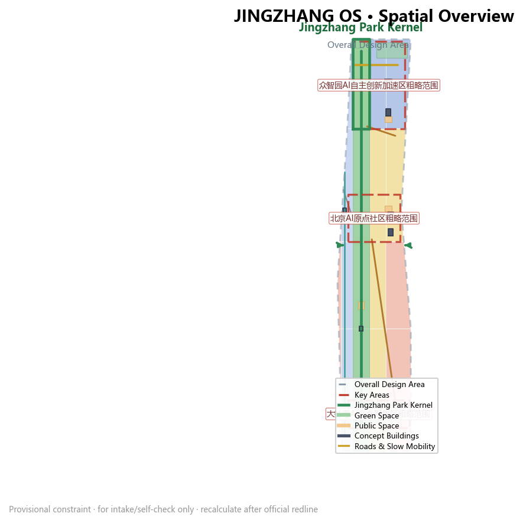
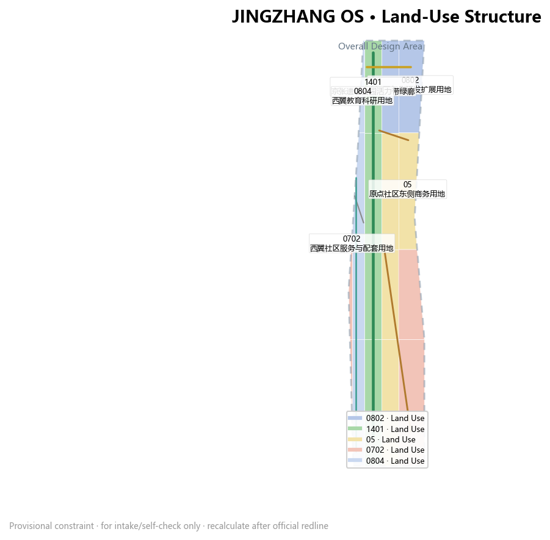
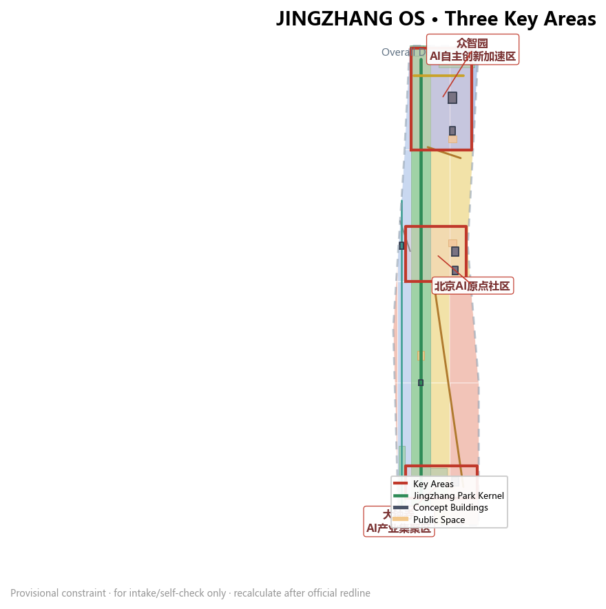
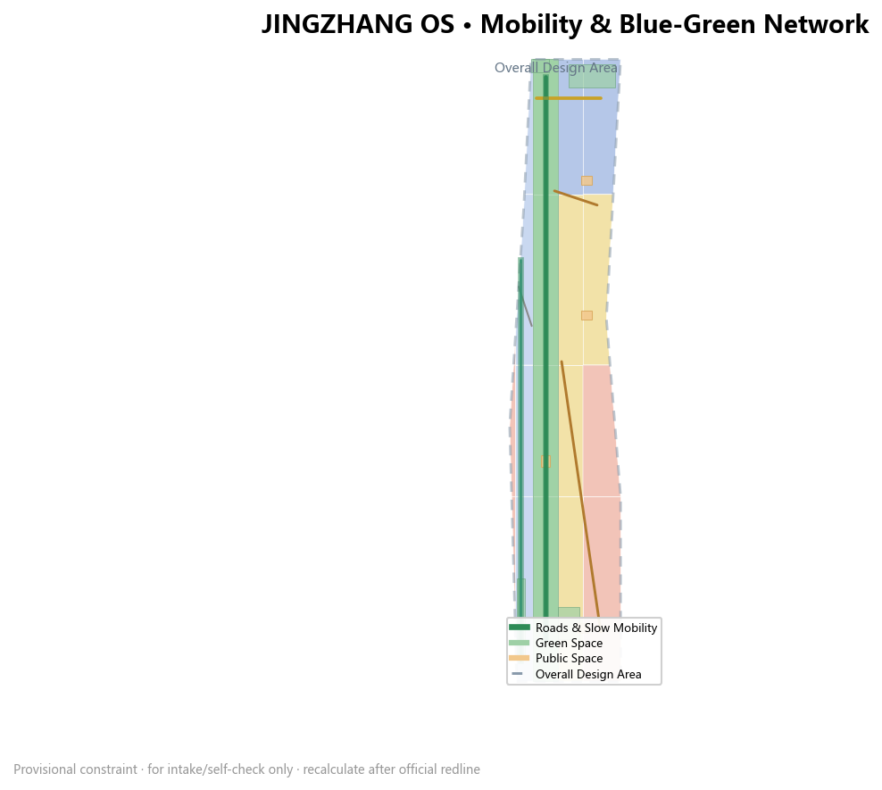
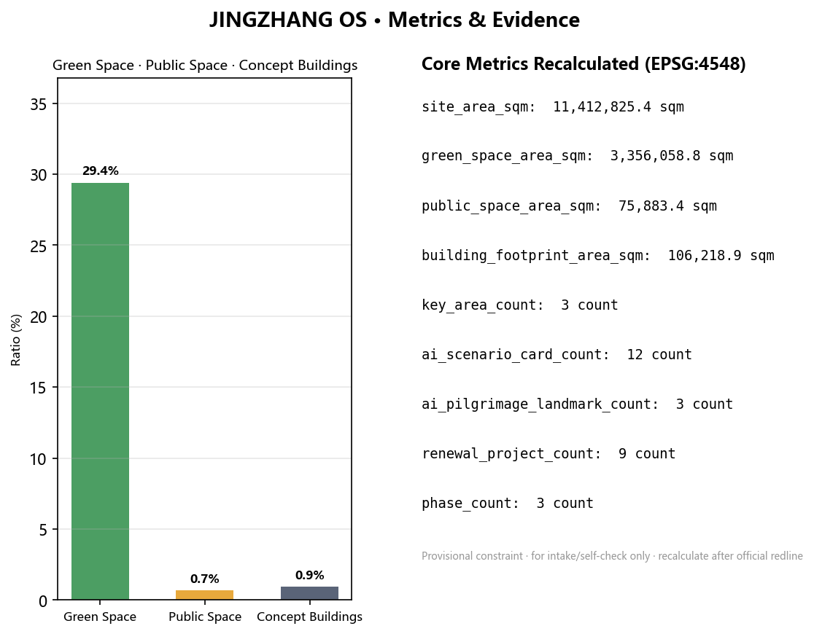

---
title: "JINGZHANG OS: Compiling a Century-Old Railway into an Urban Kernel - Urban Design for the Centennial Jing-Zhang AI Innovation Belt"
author_github: "shundebo"
language: "en"
proposal_format_version: "2"
bilingual_contract_version: "1"
translation_of: "proposal.md"
license: "CC-BY-4.0"
summary: "JINGZHANG OS treats the century-old Jing-Zhang railway heritage park as a city-scale AI operating system: the heritage spine is the kernel, the three key areas and two wings form the core processes and buses, and 12 scenario cards, 3 pilgrimage landmarks and versioned phasing deliver the three positioning belts."
tracks: ["jingzhang-heritage-narrative", "ai-origin-community", "civic-agent-governance"]
scenarios: ["ai-traffic-walkability", "ai-health-service-navigation", "enterprise-service-copilot"]
iteration: "v1.0"
---

# JINGZHANG OS: Compiling a Century-Old Railway into an Urban Kernel - Urban Design for the Centennial Jing-Zhang AI Innovation Belt

## Design Basis and Source List

This proposal takes the Qualification Pre-Announcement for the International Urban Design Solicitation of the Centennial Jing-Zhang AI Innovation Belt, issued by the Haidian Branch of the Beijing Municipal Commission of Planning and Natural Resources, as its primary official basis. The announcement defines the project name, organizers, three scope levels, three key areas, official approximate areas and required design depth [source:OFFICIAL-ANNOUNCEMENT]. The coordinated research area is about 43.6 km2, the overall design area about 11.4 km2, and the key detailed-design areas total about 368.4 ha, comprising the Zhongzhiyuan AI Acceleration Area (about 192.1 ha), the Beijing AI Origin Community (about 104.3 ha) and the Dazhongsi AI Industry Cluster (about 72.0 ha); the proposal must reach regulatory-plan-level urban design depth and planning-comprehensive-implementation urban design depth [standard:PROJECT-OFFICIAL-ANNOUNCEMENT].

The Agent Open-Call taskbook, provided and cleared by the user, adds the three positioning belts, five functions, three-areas-and-two-wings structure, six agent tasks (agent.1 through agent.6), ten co-creation principles and a unified boundary clause [source:AGENT-TASKBOOK]. This proposal treats the taskbook as the master reference for concept, scenario, branding, operation and compliance wording, and expresses every spatial proposal as a "conceptual suggestion / reference scheme / material for professional teams to deepen" rather than a statutory planning conclusion [standard:PROJECT-AGENT-OPEN-CALL-TASKBOOK].

Machine-readable inputs come from the project brief, allowed design space, enums, planning ranges and schemas under `brief/site-package/` [source:SITE-PACKAGE]. Source-use boundaries follow `data/source_registry.json`: the announcement and taskbook are formal-ready, while the provisional boundaries are provisional-only and must never be upgraded to official redlines [source:SOURCE-REGISTRY]. `data/processed/agent_fact_pack.md` is used only as a navigation layer and adds no new authority [source:PROCESSED-FACT-PACK].

Because exact official polygons are not yet public, this proposal uses the maintainers' provisional boundaries derived from the announcement's textual limits, as placeholder constraints for generation, display and self-check [source:BOUNDARY-SOURCE]. The overall design boundary recalculates to about 1,412.8 ha in EPSG:4548 [metric:site_area_sqm], and the three key areas use provisional polygons [source:KEY-AREA-SOURCE] [data:geometry/key_areas.geojson#PROV-KEY-001]. All spatial and metric conclusions are governed by the assumption that the boundary is provisional and the whole package must be recalculated after the official redline is released [assumption:A-BOUNDARY-001]; missing regulatory controls are listed as pending confirmation [assumption:A-CONTROLS-001].

On professional standards, the proposal responds to the land-use classification guide with verifiable codes [standard:MNR-LAND-USE-CLASSIFICATION-GUIDE], the urban design measures on character and public space [standard:MOHURD-URBAN-DESIGN-MEASURES], and the regulatory-plan preparation and approval measures that distinguish known controls, design suggestions and pending items [standard:MOHURD-CONTROL-DETAILED-PLANNING]. The architectural design depth regulation has not been obtained as an official file and is registered only as a deepening reminder [standard:MOHURD-ARCH-DESIGN-DEPTH-2016].

## Three-Level Scope Framework

The proposal organizes a "kernel compilation" work framework across the three scope levels defined by the announcement [depth:three_level_scope_framework]. The coordinated research area focuses on the 43.6 km2 industrial ecosystem, innovation chain, talent and future city form; the overall design area focuses on the 11.4 km2 urban area and industry belt within 1-2 km around the Jing-Zhang heritage park, forming the urban renewal framework, land use, transport, municipal and character controls; the key detailed-design areas focus on the three areas at detailed design depth [depth:overall_spatial_structure]. The three levels are not separate drawing sets but a "kernel-system-module" progression: the coordinated level decides what problem the operating system should solve, the overall level decides the kernel and bus layout, and the key areas decide the installable, testable and operable modules and interfaces [data:geometry/site_boundary.geojson#SITE-001].

Each level maps to indicators, layers, drawings, HTML and the compliance matrix. Coordinated judgments land in `compliance_matrix.json` and `standard_matrix.json`; overall spatial structure lands in `geometry/land_use.geojson`, `geometry/buildings.geojson`, `geometry/roads.geojson`, `geometry/green_space.geojson`, `geometry/public_space.geojson` and `geometry/phasing.geojson`; key areas land in the three features of `geometry/key_areas.geojson` [data:geometry/key_areas.geojson#PROV-KEY-001] [data:geometry/key_areas.geojson#PROV-KEY-002] [data:geometry/key_areas.geojson#PROV-KEY-003]. All area metrics are recalculated in EPSG:4548 [metric:site_area_sqm].

The provisional boundary is fully disclosed: it is used only for AI generation, offline visualization, intake self-check and non-statutory design discussion, and must never be treated as an official redline, approval basis, precise-area basis or statutory control [data:geometry/site_boundary.geojson#SITE-001]. After the official polygon is released, the site boundary, key areas, land use, roads, green space, public space, buildings, phasing and all metrics must be recalculated [assumption:A-BOUNDARY-001].

| Level | Design question | Proposal answer | Data anchor |
| --- | --- | --- | --- |
| Coordinated research area | World-class AI ecosystem and future city form | Three-areas-two-wings loop, five functions, innovation chain | compliance_matrix.json, standard_matrix.json |
| Overall design area | Urban renewal at regulatory-plan depth | Kernel + bus + module structure, land use and phasing | [data:geometry/land_use.geojson#LU-001], [data:geometry/phasing.geojson#PHASE-001] |
| Key detailed-design areas | Detailed design of three areas | Training, open-source and deployment modules | [data:geometry/key_areas.geojson#PROV-KEY-001] |

## Coordinated Research Area: Industry and Future City Research

The coordinated research answers one question: how to make 43.6 km2 a city-scale AI operating system that can learn, evolve and be maintained over the long term. The proposal introduces the overall concept "JINGZHANG OS", compiling the century-old Jing-Zhang railway heritage into an urban public kernel. The railway was the first mainline railway independently designed and built by Chinese engineers; it once cut the city in two, and today it should be re-stitched into a north-south public innovation bus [source:AGENT-TASKBOOK]. The naming system follows a "kernel-bus-module-interface" language: the three key areas are named Training Area (Zhongzhiyuan), Open-Source Area (AI Origin) and Deployment Area (Dazhongsi); the two wings are named Zhongguancun Technology Service Bus and Xiaoyuehe Scenario Empowerment Bus. The visual identity direction uses the dual motif of railway track and circuit board; the Logo is suggested as a "compiled railway track" symbol with a signal-green, track-grey and open-source-yellow palette, extensible to signage, digital interfaces and public art [standard:PROJECT-AGENT-OPEN-CALL-TASKBOOK].

The three positioning belts map to three functional layers: the Centennial Jing-Zhang Culture Belt corresponds to the kernel layer's heritage narrative and public space, the Urban AI Life Experience Belt to the scenario cards and public experience routes on the bus layer, and the AI Integration Innovation Belt to the industrial space and test-validation modules [depth:overall_spatial_structure]. The five functions - AI full-stack self-reliant innovation, world-class AI ecosystem, AI+ scenario empowerment paradigm, intelligent vibrant AI city, and global voice in AI governance - are carried by Zhongzhiyuan, AI Origin, the Xiaoyuehe wing, the public space system and the Zhongguancun wing respectively. The three-areas-two-wings loop is: Zhongzhiyuan produces trusted models and standards, receives capital, data and IP services through the Zhongguancun bus, is released as open source at AI Origin and openly tested by the Xiaoyuehe scenario wing, and is finally deployed as consumable applications and new businesses at Dazhongsi, forming a "train - open-source - test - deploy" closed loop [source:AGENT-TASKBOOK].

The global AI ecosystem case study selects six benchmarks: Sand Hill Road for capital density and patient capital, King's Cross for station-city integration and university spillover, Kendall Square for research-industry dual drive, One-North for garden campuses and open scenarios, Toranomon Hills for transit-hub vertical mixing, and Shenzhen Nanshan for product iteration and industry-city integration [metric:ai_scenario_card_count]. Four transferable mechanisms are distilled: slow-mobility stitching between universities and parks, bookable industrial testing spaces, open-source communities as public infrastructure, and transit stations as innovation living rooms. These mechanisms are translated into interface designs for the three key areas and two wings [depth:existing_conditions_diagnosis].

Future city form research proposes a five-layer "city-scale AI operating system": the kernel layer is the heritage park public spine, the system layer is the data-compute-energy foundation, the application layer is installable and reversible AI scenarios, the interface layer is the public experience for citizens, and the governance layer is auditable human-machine co-governance [depth:metrics_recalculation]. These layers connect to territorial spatial planning innovation by landing "integrated planning, spatial-industry integration and planning innovation" in locatable functional zones, nodes, corridors and scenarios rather than slogans [standard:MOHURD-URBAN-DESIGN-MEASURES].

## Overall Design Area: Urban Renewal and Regulatory-Plan-Level Urban Design

The overall design area organizes space through "kernel + bus + modules" at regulatory-plan-level urban design depth [depth:land_use_layout]. The land-use partition fully covers the submitted boundary without gaps or overlaps, generating 19 land-use polygons using verifiable codes including research (0802), commercial services (05), park green (1401), education (0804) and community services (0702) [data:geometry/land_use.geojson#LU-001] [standard:MNR-LAND-USE-CLASSIFICATION-GUIDE]. The building footprint recalculates to about 10.6 ha [metric:building_footprint_area_sqm] with a building density of about 0.93% [metric:building_density], reflecting a low-density, garden-like, testable city form; the green ratio is about 29.4% [metric:green_ratio] and the public-space ratio about 0.66% [metric:public_space_ratio]. The high green ratio and low public-space ratio indicate that additional accessible public activity space should be added at building ground floors and station forecourts [depth:development_intensity_controls].

The urban renewal framework adopts "compiled renewal": retain usable existing assets (railway facilities, universities and existing communities), convert functionally mismatched spaces (industry to research, commerce to public), and build the missing modules (test yards, open-source living rooms, station-city complexes), all expressed as conceptual suggestions pending confirmation of ownership, regulatory controls and engineering conditions [depth:retain_renovate_demolish]. Legal controls such as FAR, building height, setback and road redline are absent from public materials; the proposal does not fabricate approved values and uniformly lists them as "pending official regulatory-plan confirmation" [assumption:A-CONTROLS-001].

Building height, massing and character follow a "rising from heritage toward the city" principle: transition bands flank the heritage kernel, Zhongzhiyuan uses garden-style low-rise R&D, AI Origin uses mid-to-low academic blocks, and Dazhongsi moderately increases intensity around the transit node as a station-city landmark [depth:height_massing_character]. All height and massing suggestions require official regulatory plans and view analysis; the proposal only gives directional layers. The character palette blends railway red brick, track grey and open-source signal yellow; roofs encourage photovoltaics and ecological planting; unauthorised giant screens are forbidden [standard:MOHURD-URBAN-DESIGN-MEASURES].

The renewal projects and functional proportions are supported by the seven conceptual building footprints in `geometry/buildings.geojson`, the three phases in `geometry/phasing.geojson` and the task coverage in `compliance_matrix.json` [data:geometry/buildings.geojson#BLDG-001] [data:geometry/phasing.geojson#PHASE-001]. The relationship between building footprint, industrial space supply, talent services and public space is developed in the "Land Use, Building Scale, and Retain-Renovate-Demolish Strategy" chapter [metric:building_footprint_area_sqm].

## Detailed Design of Key Areas

The three key areas correspond to three core modules of JINGZHANG OS, each reaching planning-comprehensive-implementation urban design depth [depth:three_key_area_detailed_design].

### Training Area: Zhongzhiyuan AI Autonomous Innovation Acceleration Area

This area covers about 192.1 ha (recalculated on the provisional boundary) [data:geometry/key_areas.geojson#PROV-KEY-001] and is positioned as the "AI full-stack autonomous innovation training area", responsible for model training, safety evaluation, standard setting and industrial exhibition. The space is organised around "test courtyards + Qinghe interface": an open testing laboratory (BLDG-002) and a full-stack R&D centre (BLDG-001) sit at the centre, a public testing square (PUBLIC-001) is open to appointment-based public visits, and a protective green corridor (GREEN-002) along the Qinghe river combines low-carbon computing with ecological experience [data:geometry/buildings.geojson#BLDG-001] [data:geometry/green_space.geojson#GREEN-002]. Industrial testing scenarios include large-model training-cluster display, AI safety red-team exercises and chip-simulation test ground (see scenario cards) [metric:ai_scenario_card_count]. Implementation risk: testing facilities involve compute, energy and safety boundaries and must be deepened with professional teams and regulators [assumption:A-CONTROLS-001].

### Open-Source Area: Beijing AI Origin Community

This area covers about 104.3 ha (recalculated on the provisional boundary) [data:geometry/key_areas.geojson#PROV-KEY-002] and is positioned as a "campus-adjacent transfer and open-source community", treating university source innovation and the open-source community as public infrastructure. The space is organised around an "open-source living room + academic corridor": an open-source incubator (BLDG-003) and a transfer office (BLDG-004) sit on the campus side, an open-source release square (PUBLIC-002) hosts model releases, developer conferences and contribution-honour displays; education land (0804) on the west wing is stitched to campuses through slow mobility [data:geometry/public_space.geojson#PUBLIC-002] [data:geometry/land_use.geojson#LU-002]. This area is the main carrier of "global voice in AI governance" and the "open-source system", with honour displays and contribution walls forming a public memory system. Implementation risk: campus boundaries, ownership and ground-floor uses require confirmation from universities and property owners [assumption:A-OWNERSHIP-001].

### Deployment Area: Dazhongsi AI Industry Cluster

This area covers about 72.0 ha (recalculated on the provisional boundary) [data:geometry/key_areas.geojson#PROV-KEY-003] and is positioned as a "native-AI deployment area", turning agents, smart terminals, content consumption and data elements into consumable urban scenarios. The space is organised around a "station-city living room + four-quadrant connectivity": the Dazhongsi native-AI commercial complex (BLDG-005) combines with the station green (GREEN-005), and an international roadshow square (PUBLIC-003) serves global enterprises, with "arrive at the living room right after exiting the station" as the design goal [data:geometry/buildings.geojson#BLDG-005] [data:geometry/public_space.geojson#PUBLIC-003]. Transport organisation suggests ground-level four-quadrant pedestrian connectivity around Dazhongsi station; the specific alignments and engineering feasibility require transit and municipal confirmation [depth:traffic_rail_slow_parking]. Implementation risk: station-city integration involves ownership, transit and municipal conditions and is a pending-deepening item [assumption:A-CONTROLS-001].

## AI Innovation Ecosystem, Personas, and AI+ Scenarios

The proposal builds 12 AI scenario cards [metric:ai_scenario_card_count], including 3 industrial test-validation scenarios; 5 user personas; and 3 AI pilgrimage landmarks [metric:ai_pilgrimage_landmark_count]. Each scenario specifies spatial location, target users, data sources, privacy boundary, human review and operating entity [depth:ai_scenario_cards].

User personas (5): AI researchers (Zhongzhiyuan, needing quiet labs and trusted evaluation), open-source developers (AI Origin, needing release halls and collaboration spaces), startup teams (Zhongzhiyuan + Zhongguancun wing, needing compute access and capital connection), surrounding residents (along the heritage park, needing slow mobility and daily services), and global visitors and investors (Dazhongsi, needing exhibition, roadshows and international reception) [source:AGENT-TASKBOOK]. Each persona maps to specific spatial modules, layers and metrics.

12 scenario cards (including 3 test-validation scenarios):
1. Public testing of large-model training (test-validation, Zhongzhiyuan, [data:geometry/buildings.geojson#BLDG-001])
2. AI safety red-team ground (test-validation, Zhongzhiyuan PUBLIC-001, human review)
3. Smart-terminal real-environment corridor (test-validation, Dazhongsi BLDG-005)
4. Open-source model release hall (AI Origin PUBLIC-002)
5. Contribution honour wall and developer waystation (AI Origin)
6. AI slow-mobility navigation and accessibility hints (heritage kernel, [data:geometry/roads.geojson#ROAD-001])
7. Edge-compute waystation (multi-node, [data:geometry/buildings.geojson#BLDG-002])
8. AI health-service navigation (community health points, tiered privacy)
9. AI education experience kiosk (west education land, [data:geometry/land_use.geojson#LU-002])
10. Enterprise-service Copilot (Zhongguancun bus, [data:geometry/roads.geojson#ROAD-003])
11. Data-element living room (Dazhongsi, authorisation-first compliance)
12. Global AI festival week public route (belt public space, [data:geometry/public_space.geojson#PUBLIC-004])

The AI governance boundary follows data minimisation, public sources, explainability and human review: scenarios do not collect personal behavioural trajectories, activity data are aggregated only, and personal or enterprise data require separate authorisation [source:AGENT-TASKBOOK]. Agents may help identify slow-mobility gaps, public-space heat, facility maintenance and event safety, but must not replace planning approval, output unauthorised personal profiles, or claim official implementation commitments [depth:risk_missing_data].

## Land Use, Building Scale, and Retain-Renovate-Demolish Strategy

Land use follows the verifiable codes of the territorial spatial land-use classification guide [standard:MNR-LAND-USE-CLASSIFICATION-GUIDE]; 19 polygons seamlessly cover the submitted boundary [data:geometry/land_use.geojson#LU-001]. The functional mix is led by research (0802) and commercial services (05), with green (1401) as the kernel running north-south and education and community land supporting talent living. Building footprint recalculates to about 10.6 ha [metric:building_footprint_area_sqm] with a density of about 0.93% [metric:building_density]; total floor area, FAR and building height are pending confirmation pending official regulatory controls [assumption:A-CONTROLS-001].

The retain-renovate-demolish approach is conceptual: retain the Jing-Zhang railway heritage and well-preserved existing facilities, convert functionally mismatched spaces, and build missing modules such as test yards, open-source living rooms and station-city complexes [depth:retain_renovate_demolish]. Seven conceptual footprints (BLDG-001 to BLDG-007) carry R&D, testing, incubation, office, commercial, cultural and education functions [data:geometry/buildings.geojson#BLDG-001]. No parcel-level ownership conclusion is made; all judgments require current-status surveys and property confirmation before professional deepening [assumption:A-OWNERSHIP-001].

## Transport, Rail, Municipal Infrastructure, and Public Services

The transport strategy organises "rail + slow mobility first": the kernel greenway (ROAD-001), riverside cycleway (ROAD-006) and secondary connector roads (ROAD-003/004) form the slow-mobility skeleton [data:geometry/roads.geojson#ROAD-001], with total road centreline length recalculated from geometry [metric:road_centerline_length_m]. Transit integration focuses on Wudaokou, Qinghua East Road West Entrance and Dazhongsi stations, proposing "arrive at the living room right after exiting the station" for the three key areas; the specific connecting passages and alignments require transit confirmation [depth:traffic_rail_slow_parking]. External access relies on the North 5th Ring Road and Jingzang Expressway; the ring-road crossing nodes are key slow-mobility stitching points whose engineering feasibility requires transport assessment [assumption:A-CONTROLS-001].

Municipal and new infrastructure follow a "distributed + edge" strategy: distributed energy and edge compute are co-located with public buildings, sponge-city measures are coordinated with the blue-green system, and utility corridors reserve AI facility capacity [depth:municipal_new_infrastructure]. Public services are configured for the 5 personas, covering industry services, talent living, education, health and international reception; utility, fire and flood-prevention conditions are absent and uniformly listed as formal-deepening preconditions [assumption:A-CONTROLS-001].

## Blue-Green Network, Public Space, and Urban Character

The blue-green network takes the Jing-Zhang heritage park as its kernel, running north-south and stitching east-west [depth:blue_green_public_space]. The green system consists of the heritage kernel corridor (GREEN-001), the Qinghe protective corridor (GREEN-002), the Xiaoyuehe riverside park (GREEN-003), the North-5th-Ring protective green (GREEN-004) and the Dazhongsi station green (GREEN-005), with a recalculated green ratio of about 29.4% [metric:green_ratio]. The public space system consists of the Zhongzhiyuan testing square (PUBLIC-001), the open-source release square (PUBLIC-002), the international roadshow square (PUBLIC-003) and the heritage central activity belt (PUBLIC-004) [data:geometry/public_space.geojson#PUBLIC-001], with a recalculated public-space ratio of about 0.66% [metric:public_space_ratio]; additional accessible public space should be added at building ground floors and station forecourts.

Urban character blends the century-old Jing-Zhang railway culture, Zhongguancun innovation culture and AI culture: the "compiled railway track" serves as the visual motif for signage, identity, public art and international communication copy [source:AGENT-TASKBOOK]. Three AI pilgrimage landmarks [metric:ai_pilgrimage_landmark_count]: "Kernel Origin" - a model-release node in front of the Qinghuayuan Station site; "Open-Source Core" - a contribution-honour installation at the AI Origin release square; "Deployment Gate" - a digital new-business window at the Dazhongsi station-city living room. Landmarks, fonts, images, portraits and enterprise logos all require cleared rights; this proposal gives only conceptual directions and does not claim approved construction [depth:risk_missing_data] [standard:MOHURD-URBAN-DESIGN-MEASURES].

## Renewal Projects, Implementation Policy, and Phasing

The renewal project list contains 9 items [metric:renewal_project_count], grouped by "kernel-bus-module": kernel projects include heritage slow-mobility gap stitching, the kernel digital foundation and honour wall; module projects include the Zhongzhiyuan test courtyard, the AI Origin open-source living room and the Dazhongsi station-city living room; bus projects include the Zhongguancun technology service waystation, the Xiaoyuehe scenario opening corridor and the global festival week public route [depth:renewal_project_list]. Each project notes type, location, dependencies and suggested timing; implementing entities, investment and approval paths are listed as risks [data:geometry/phasing.geojson#PHASE-001].

Phasing follows a "version iteration" logic [depth:phasing_implementation]: Phase 1 (v1.0) focuses on the kernel slow mobility and digital foundation, stitching heritage-park gaps and deploying low-risk scenarios; Phase 2 (v2.0) advances two-wing industry and scenario renewal, opening testing and open-source releases; Phase 3 (v3.0) completes the Dazhongsi station-city integration and international operations. Phase areas are recalculated from `geometry/phasing.geojson` [metric:phase_count].

Global AI events and long-term operations: the proposal suggests an annual "JINGZHANG OS Developer Conference", quarterly scenario open days and monthly open-source release weeks, forming a "test - release - roadshow - deploy" operational loop [source:AGENT-TASKBOOK]. The developer community operates on open-source repository logic, and contribution honours enter a permanent memorial system; all events, investment, funding, policies and operational arrangements are conceptual suggestions and do not constitute confirmed government arrangements [depth:risk_missing_data].

## Metrics, Area Recalculation, and Compliance Matrix

The indicator system has three classes: directly recalculable spatial metrics, control metrics pending official regulatory plans, and performance metrics requiring operational data calibration [depth:metrics_recalculation]. Spatial metrics are all recalculated from `geometry/*.geojson` in EPSG:4548. The overall design area is about 1,412.8 ha [metric:site_area_sqm], the building footprint about 10.6 ha [metric:building_footprint_area_sqm], and the building density about 0.93% [metric:building_density].

Blue-green and public-space metrics support talent living and innovation exchange: the green ratio is about 29.4% [metric:green_ratio] and the public-space ratio about 0.66% [metric:public_space_ratio], indicating that accessible public space should be added at building ground floors and station forecourts. There are 3 key areas [metric:key_area_count], 9 renewal projects [metric:renewal_project_count], 12 scenario cards [metric:ai_scenario_card_count], 3 pilgrimage landmarks [metric:ai_pilgrimage_landmark_count] and 3 phases [metric:phase_count]. Control metrics such as FAR are listed as unknown pending official regulatory plans [assumption:A-CONTROLS-001].

The area recalculation notes that all values are based on the provisional boundary and must be fully recalculated after the official redline [assumption:A-BOUNDARY-001]. The compliance matrix covers every clause of the announcement 1.3, 1.4 and 1.5 and all tasks agent.1 through agent.6 [depth:compliance_matrix], with each task mapped to chapters, layers, metrics, drawings, HTML, sources, assumptions and self-checks. The professional-standard matrix covers the 5 mandatory standards and the design-depth matrix covers the 15 required depth items, forming a complete evidence chain with the in-text citations [depth:metrics_recalculation].

## Risk, Copyright, and Compliance

This is an AI-generated urban design proposal; the author is responsible for facts, sources, copyright, spatial data, metrics and expression [depth:risk_missing_data]. Key risks and data gaps: missing official boundary (provisional boundary for intake and discussion only) [assumption:A-BOUNDARY-001], missing regulatory controls (development intensity pending) [assumption:A-CONTROLS-001], missing ownership and current-status surveys (retain-renovate-demolish as methodology) [assumption:A-OWNERSHIP-001], and missing municipal and engineering conditions (facilities as conceptual framework) [assumption:A-CONTROLS-001]. All spatial proposals are expressed as "conceptual suggestions / reference schemes / material for professional teams to deepen", do not replace formal planning and do not constitute government approval conclusions [source:AGENT-TASKBOOK].

Copyright and compliance: all text, geometry, drawings, PDFs and static HTML are generated by the declared AI agent (shundebo, deepseek-v4-flash) from public or cleared sources; data sources are registered in `sources.json` and the copyright statement is in `report/copyright_statement.md`. The HTML is fully offline static, with no CDN, remote scripts, remote fonts or API requests. The proposal contains no personal information, false approval claims or unenforceable commitments. Organizer data gaps do not block content scoring, but precision-sensitive metrics must be recalculated after the official polygon is released [standard:PROJECT-OFFICIAL-ANNOUNCEMENT].

## References

1. Qualification Pre-Announcement for the International Urban Design Solicitation of the Centennial Jing-Zhang AI Innovation Belt, Haidian Branch of the Beijing Municipal Commission of Planning and Natural Resources [source:OFFICIAL-ANNOUNCEMENT]
2. Agent Open-Call taskbook excerpt for the Centennial Jing-Zhang AI Innovation Belt open call (user-provided cleared document) [source:AGENT-TASKBOOK]
3. Project brief package `brief/site-package/` [source:SITE-PACKAGE]
4. Public source-use registry `data/source_registry.json` [source:SOURCE-REGISTRY]
5. Provisional boundaries and provisional key-area polygons [source:BOUNDARY-SOURCE] [source:KEY-AREA-SOURCE]
6. Ministry of Natural Resources, Guide to Land Use and Sea Use Classification for Territorial Spatial Survey, Planning and Use Control [standard:MNR-LAND-USE-CLASSIFICATION-GUIDE]
7. Ministry of Housing and Urban-Rural Development, Measures for the Administration of Urban Design [standard:MOHURD-URBAN-DESIGN-MEASURES]
8. Ministry of Housing and Urban-Rural Development, Measures for the Preparation and Approval of Regulatory Detailed Plans for Cities and Towns [standard:MOHURD-CONTROL-DETAILED-PLANNING]
9. Architectural design depth regulation (to be enabled after the official file is obtained) [standard:MOHURD-ARCH-DESIGN-DEPTH-2016]
10. Global AI ecosystem case studies: Sand Hill Road, King's Cross, Kendall Square, One-North, Toranomon Hills, Shenzhen Nanshan [metric:ai_scenario_card_count]
