# Double-Helix Innovation Belt｜Centennial Jing-Zhang AI Innovation Belt Urban Design

## One-Page Executive Brief

**Concept in one sentence**: Building on the century-old autonomy of the Jing-Zhang Railway, the proposal weaves the Heritage helix H and the Innovation helix I into urban DNA, pairing every AI scenario with a verifiable Power Base-Pair - AI compute x energy supply - turning AI governance into auditable urban power infrastructure from an electrical-engineering perspective.

**Spatial structure**: One belt (Jing-Zhang Heritage Park vitality corridor), two strands (Heritage helix x Innovation helix), three nodes (Zhongzhiyuan 192ha / AI Origin Community 104ha / Dazhongsi 72ha), two wings (Zhongguancun Technology Service Wing x Xiaoyuehe Scenario Empowerment Wing); overall design 11.4km² with provisional boundaries to be recalculated when official redlines are published [metric:site_area_sqm] [metric:key_area_area_sqm].

**Distinctive mechanism**: Power Base-Pair with four calibrations (efficiency floor PUE <= 1.25 / green power >= 80% / resilience self-healing <= 5min / opt-out human channel 100%); 12 AI scenario cards all mapped to spatial nodes [metric:ai_scenario_card_count]; the JZ-05 PV-Storage-Charging minimal pilot is reproducible via the in-package script `visual/assets/run_jz05_pilot.js --check` (10-stage execution chain, seven gates, six acceptance criteria; evidence JSON in `visual/assets/jz05-pilot-evidence.json`) [metric:jz05_acceptance_criterion_count].

**Key figures**: 57 gap-free land units, 14 indicative buildings, 15 roads, 6 concept renders, 13 renewal projects, 24+ reproducible metrics [metric:land_use_unit_count] [metric:road_length_m].

**Boundary statement**: All spatial outputs are generated from public or cleared data; until official redlines, regulatory controls, and pilot data are published, area metrics are provisional recalculations, control metrics are unknown, and pilot candidate values are candidate baselines; this proposal is conceptual and does not constitute an approved conclusion [depth:risk_missing_data].

## Design Basis and Source Inventory

This proposal takes the Qualification Prequalification Announcement of the Centennial Jing-Zhang AI Innovation Belt International Urban Design Open Call, issued by the Haidian Branch of the Beijing Municipal Commission of Planning and Natural Resources, as its primary basis, and the registered provisional boundaries, key areas, enums, ranges, and source lists in `brief/site-package/` as its machine-readable basis [source:OFFICIAL-ANNOUNCEMENT] [source:SITE-PACKAGE]. The agent-facing open-call taskbook (agent.1–agent.6) is the direct source of the six required tasks of this proposal [source:AGENT-TASKBOOK]. The overview and spatial-structure figures use an OpenStreetMap basemap (roads/waterways/railways/parks, with on-figure attribution © OpenStreetMap contributors, ODbL); all other figures are agent-generated; the offline HTML embeds Noto Sans CJK SC font subsets [source:OSM-BASEMAP] [source:FONT-NOTO-CJK].

The public source registry distinguishes formal-ready, background, provisional-only, and needs-review material; formal claims rely only on `usable_for_formal="yes"` or separately cleared sources, while background and provisional material is used as context only [source:SOURCE-REGISTRY]. Since official `SITE_BOUNDARY` and `KEY_AREA` redlines are not yet available, this proposal uses `brief/site-package/geometry/provisional_boundaries.geojson` as provisional constraint ranges, fully labeled in narrative, geometry, metrics, and self-check, and recalculates once official polygons are published [source:BOUNDARY-SOURCE] [source:KEY-AREA-SOURCE].

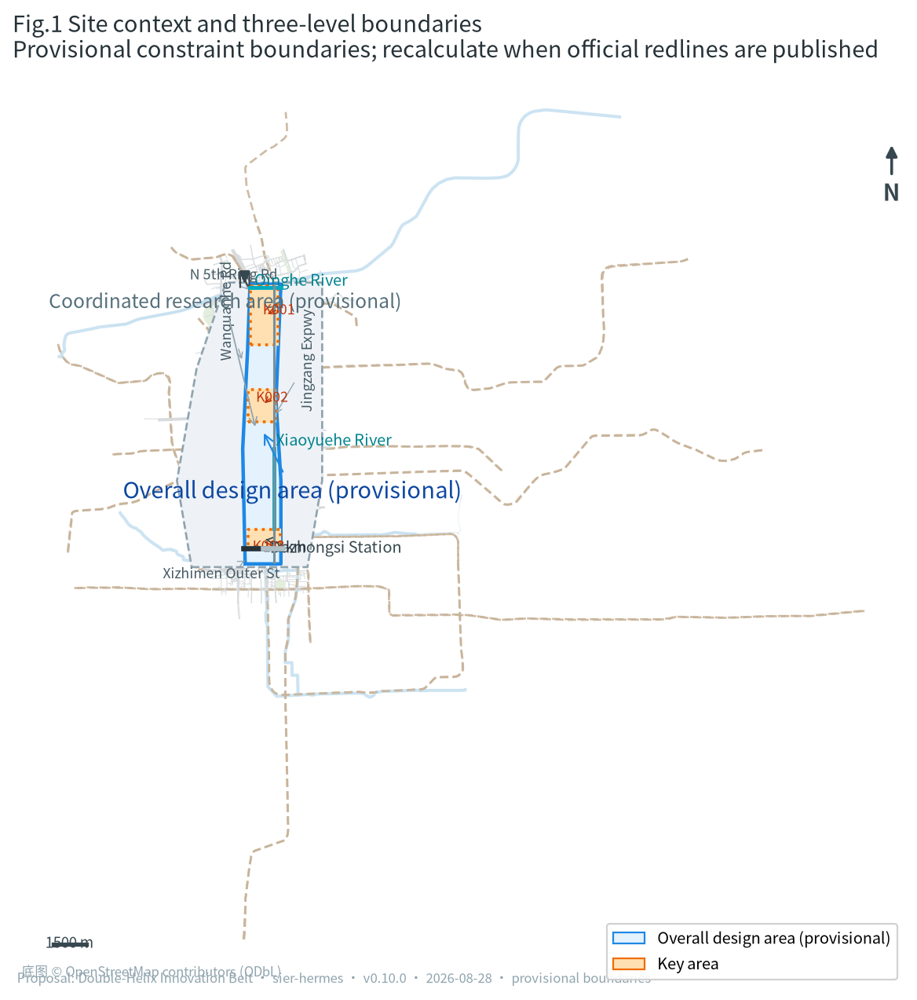

Mandatory professional standards are read from the local snapshots in `standards/references/`; a `source_url` alone is not evidence [standard:PROJECT-OFFICIAL-ANNOUNCEMENT] [standard:MOHURD-URBAN-DESIGN-MEASURES]. The narrative follows v2 format: readable judgments sit beside evidence anchors, while complete sources, metrics, matrices, and layer indexes live in the structured files [depth:existing_conditions_diagnosis].

## Three-Level Scope Framework

The proposal is organized around the three scopes defined by the announcement: the coordinated research area (43.6 km²) addresses the AI industry ecosystem and future urban form; the overall design area (11.4 km²) translates these judgments into land use, buildings, transport, municipal systems, and urban character; the key detailed design area (368.4 ha) delivers detailed design for Zhongzhiyuan, the Beijing AI Origin Community, and Dazhongsi [source:OFFICIAL-ANNOUNCEMENT] [depth:three_level_scope_framework].

The common spine of all three levels is the "double helix" spatial concept: a **Heritage helix (H-strand)** carries the century-long Jing-Zhang railway, Zhongguancun entrepreneurship culture, and the emerging AI culture; an **Innovation helix (I-strand)** carries university discovery, open-source collaboration, enterprise translation, applied scenarios, and global governance. The two strands wind along the Jing-Zhang Heritage Park corridor and interlock at three "gene nodes" in the key areas — every node is locatable and verifiable in plan and metrics [depth:overall_spatial_structure] [data:geometry/land_use.geojson#LU-001].

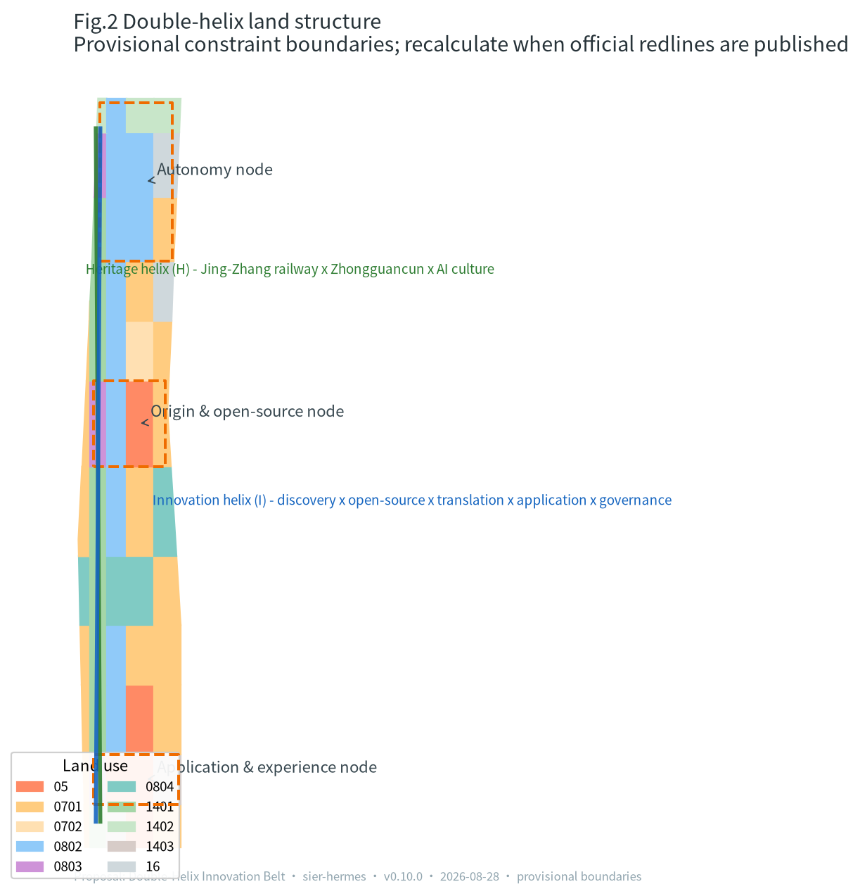

| Level | Design question | Proposal answer | Data anchor |
| --- | --- | --- | --- |
| Coordinated research area | Industry ecosystem and future city form | University discovery—open source—enterprise translation—public experience—global outreach chain | compliance_matrix.json、standard_matrix.json |
| Overall design area | Land use, renewal, transport and municipal, character | Dual-strand land structure, three nodes and two wings, dual slow-mobility spines | [data:geometry/land_use.geojson#LU-001] [data:geometry/roads.geojson#ROAD-001] |
| Key detailed design area | Detailed design of three areas | Autonomy node, origin & open-source node, application & experience node | [data:geometry/key_areas.geojson#PROV-KEY-001] [data:geometry/key_areas.geojson#PROV-KEY-002] [data:geometry/key_areas.geojson#PROV-KEY-003] |

## Coordinated Research Area: Industry and Future City Research

The core task of the coordinated research area is to build a world-class AI innovation ecosystem. The proposal organizes Haidian's universities and institutes, open-source communities, leading enterprises, compute and data factors, and technology services into a complete "discovery—collaboration—translation—experience—governance" innovation chain, and uses talent density, scenario openness, and global event capacity as the three measures of future urban form [source:AGENT-TASKBOOK] [depth:overall_spatial_structure].

Future city form answers how AI changes work, life, social interaction, and public services: R&D and testing space evolves toward semi-open districts that are visitable, testable, and governable; public space becomes the experience interface of AI scenarios; neighborhoods and commerce embed edge compute and low-carbon energy nodes. The coordinated level adds no pseudo-precise redlines; its industrial judgments are expressed through the land and facilities of the overall design level [standard:MOHURD-URBAN-DESIGN-MEASURES] [data:geometry/land_use.geojson#LU-001] .

Benchmarking global AI ecosystems, this proposal studies six case archetypes (concept-level references only, no investment or outcome commitments): the capital–talent–university loop of Silicon Valley; Tel Aviv's defense spillover and dense startup districts; King's Cross railway heritage renewal as a knowledge quarter in London; one-north's high-density R&D community in Singapore; the production–R&D–life mix of Nanshan, Shenzhen; and the corridor-style innovation organization of Hangzhou's West Sci-Tech Innovation Corridor [source:AGENT-TASKBOOK] [depth:three_level_scope_framework].

Each case is distilled into translatable spatial actions (conceptual):
| Case | Takeaway | Translatable spatial action | When applicable | When not applicable |
| --- | --- | --- | --- | --- |
| Silicon Valley | Capital-talent-university loop | Near-campus translation street (BLDG-006), Dazhongsi AI Roadshow Lounge (Scenario 06) | University/R&D density, active capital | Districts without a university hinterland |
| Tel Aviv | Defense spillover and dense startups | Zhongzhiyuan autonomous model testing ground and safety-governance sandbox (Scenarios 02/03, civilian framing) | Testing and safety-compliance needs | Domains with uncleared or non-public disclosure requirements |
| London King's Cross | Railway heritage renewal as a knowledge quarter | Heritage Park belt retained-section activation, Qinghuayuan Station Cultural Hall (BLDG-005) | Railway heritage and station resources | Zones where heritage fabric must not be disturbed |
| Singapore one-north | High-density R&D community | Zhongzhiyuan research land mixed development, Qinghe innovation riverfront (Scenario 07) | High density, rail accessibility | Low-density remote districts |
| Shenzhen Nanshan | Production-R&D-life mix | Central community service band mixed-use (Scenario 09) | Residential-industry interweaving | Strictly zoned regulatory areas |
| Hangzhou West Corridor | Corridor-style innovation organization | Double-helix corridor spatial organization and node interlocking (spatial-structure figure) | A long linear innovation axis | Polycentric dispersed layouts |

The "not applicable" column prevents case transplantation - the proposal borrows mechanisms only, never form [source:AGENT-TASKBOOK] [depth:three_level_scope_framework].

**Regional collaboration mechanism (conceptual suggestion).** The coordinated research area is not an isolated district; the belt must connect to a wider innovation network to fulfil the "world-class" positioning. This proposal suggests a "three areas, two wings, five-direction collaboration" framework: the three key areas and the two wings (Zhongguancun Technology Service Wing and Xiaoyuehe Scenario Empowerment Wing) form an internal innovation loop; externally, the belt connects with Zhongguancun Science City (origin collaboration), Future Science City (energy and infrastructure experimentation), Huairou Science City (large-scale facilities and basic research), Beijing Economic-Technological Development Area (manufacturing and industrialization), and the Beijing-Tianjin-Hebei coordinated development (cross-regional compute-energy-scenario links). Specific mechanisms (enclave incubation, compute sharing, energy interchange, event linkage) are conceptual suggestions for professional teams and authorities to deepen [source:AGENT-TASKBOOK] [depth:three_level_scope_framework]. Regional collaboration also requires cross-jurisdiction energy infrastructure planning: the belt's distribution grid, storage, and charging networks should sit within Beijing's new power system and Beijing-Tianjin-Hebei electricity interchange layout, avoiding "island-style" block-level energy construction [source:POLICY-CARBON-PEAK] [depth:municipal_new_infrastructure].

**International communication (conceptual, quantified).** International communication is not a slogan; verifiable candidate indicators are given: (1) Global AI Pilgrimage Week (Scenario 10) >= 4 editions/year; (2) annual international exchange/roadshow events >= 12; (3) multilingual content coverage (zh/en) of all 12 scenario cards, 15 figures, and offline HTML (100%); (4) JZ-HX brand touchpoints (wayfinding/digital interfaces/event visuals) >= 100 (candidate); (5) the energy digital-twin station provides an English interface and international visit routes [metric:international_event_count_target] [metric:brand_touchpoint_count_target]. All are candidate targets pending operational pilots and authority confirmation [depth:risk_missing_data].

## Overall Design Area: Urban Renewal and Regulatory-Plan-Level Urban Design
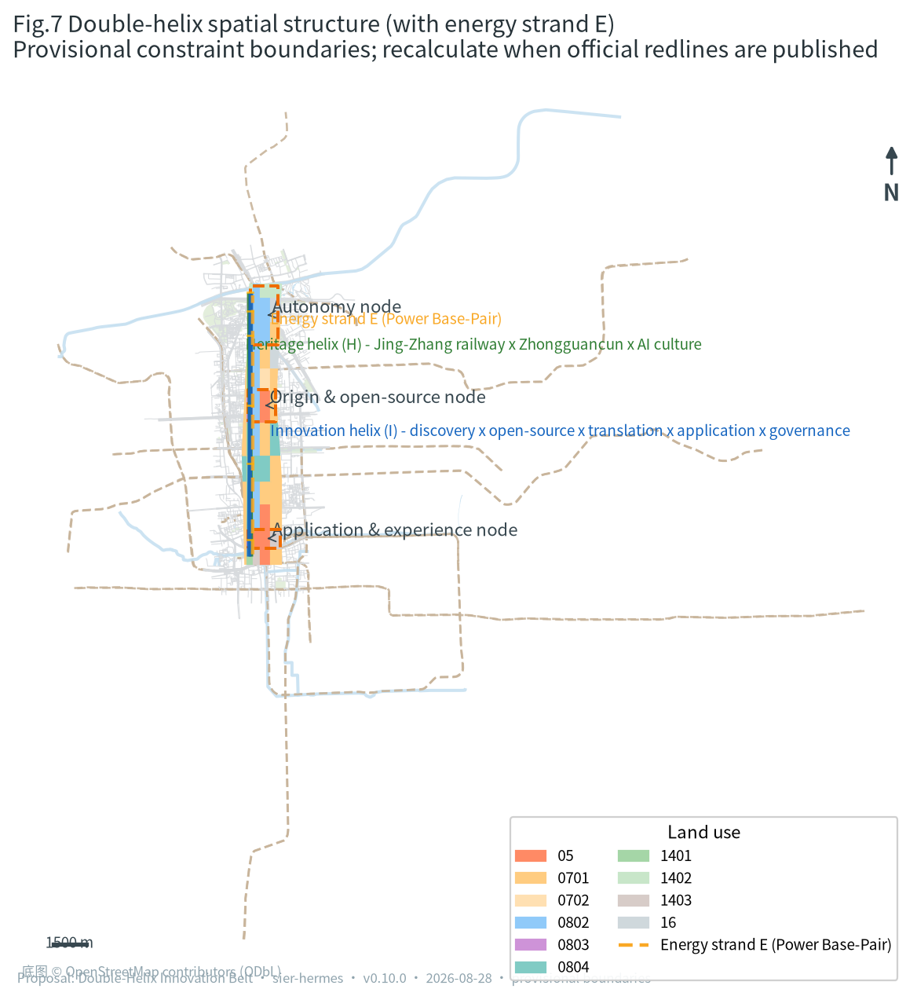

The overall design area requires regulatory-plan-level urban design depth. The proposal puts forward a "one belt, two strands, three nodes, two wings" structure: the **belt** is the Jing-Zhang Heritage Park vitality corridor, the main axis of history and public life; the **two strands** are the Heritage helix (park and cultural land sequence on the west) and the Innovation helix (R&D and industrial land sequence on the east), interlocking at the key-area nodes; the **three nodes** are the three key areas; the **two wings** are the Zhongguancun Technology Service Wing (global factor allocation) and the Xiaoyuehe Scenario Empowerment Wing (AI scenario delivery and city vitality) [source:OFFICIAL-ANNOUNCEMENT] [depth:land_use_layout].

**Power Base-Pair mechanism (the proposal's distinctive mechanism, from an electrical-engineering perspective).** When the Jing-Zhang Railway was built, Zhan Tianyou insisted on the unified standard gauge (1435 mm), enabling the line to interconnect with the national network and avoid a "narrow-gauge island"; this century-old promise of "accepting constraints and leaving standards in space for later verification" provides a direct mechanism prototype for the AI era. Combining this historical spirit with electrical engineering, the proposal introduces the **Power Base-Pair** rule: every AI scenario node on the double helix must be paired with a locatable, verifiable energy supply unit, forming an "AI compute x energy supply" base pair. Any scenario joining the belt must first pass four auditable power calibrations: (1) **Energy-efficiency floor**: compute and facilities set thresholds on PUE (Power Usage Effectiveness) and energy per unit of compute; under-performing scenarios do not enter open operation; (2) **Green-power priority**: distributed PV, storage, and green-power trading take priority, with green-power share as an operational hard metric; (3) **Resilience and self-healing**: the distribution grid adopts microgrid and island-operation capability design, with measurable self-healing recovery time and supply availability; (4) **Opt-out**: AI services retain human channels and offline/off-grid alternatives, preventing "intelligence" from crowding out basic public services [source:AGENT-TASKBOOK] [depth:municipal_new_infrastructure]. This mechanism translates "global discourse power in AI governance" from a slogan into auditable urban power infrastructure, supported by the deepening attachments in `report/narrative.md` (12 scenario cards with data fields / failure thresholds / exit conditions), the technology_maturity dimension in `risk.json`, and the energy metrics in `metrics.json` [source:AGENT-TASKBOOK] [metric:ai_scenario_card_count].

**A century-old promise, translated (the narrative spine).** In 1909, Zhan Tianyou wrote the "zigzag" line at Badaling and, with the 1435 mm standard gauge, connected the Jing-Zhang Railway into the national network - the first time Chinese engineers used a "standard" to honour a promise of "interconnection". More than a century later, AI scenarios face the same "narrow-gauge" risk: each campus with its own siloed compute, energy, and data formats would repeat the island dilemma of a hundred years ago. The Power Base-Pair translates that engineering wisdom into contemporary language: **for an AI scenario to join the belt, it must first pass the four power calibrations; the calibration rules are written plainly into space and kept in the system, so any third party can verify, reject, or roll back**. This narrative is not decoration - it determines the rationale for every energy facility, every calibration metric, and every pilot gate in the proposal, and turns "Centennial Jing-Zhang" from a cultural symbol into an operable urban governance protocol [source:OFFICIAL-ANNOUNCEMENT] [depth:three_level_scope_framework].

The land layout is expressed in 57 gap-free, overlap-free land units: research (0802), cultural (0803), and education (0804) land is organized along the two strands; park green (1401) and buffer green (1402) form the blue-green skeleton; commercial (05) concentrates at Dazhongsi and the south gateway; residential and community service (0701/0702) form living circles on both sides; and reserved land (16) in the northeast is held for future AI innovation space [data:geometry/land_use.geojson#LU-001] [metric:land_use_area_by_code] [depth:development_intensity_controls].

Building scale and intensity are governed by official regulatory conditions: FAR, building height, density, and setbacks are listed as "pending official regulatory conditions" until confirmed, and this proposal provides only indicative building footprints and massing levels, without manufacturing false precision [depth:height_massing_character] [metric:floor_area_ratio].

## Detailed Design of Key Areas

The three key areas are the three gene nodes of the double helix, carrying the detailed design of autonomy, origin & open-source, and application & experience respectively [data:geometry/key_areas.geojson#PROV-KEY-001] [data:geometry/key_areas.geojson#PROV-KEY-002] [data:geometry/key_areas.geojson#PROV-KEY-003].

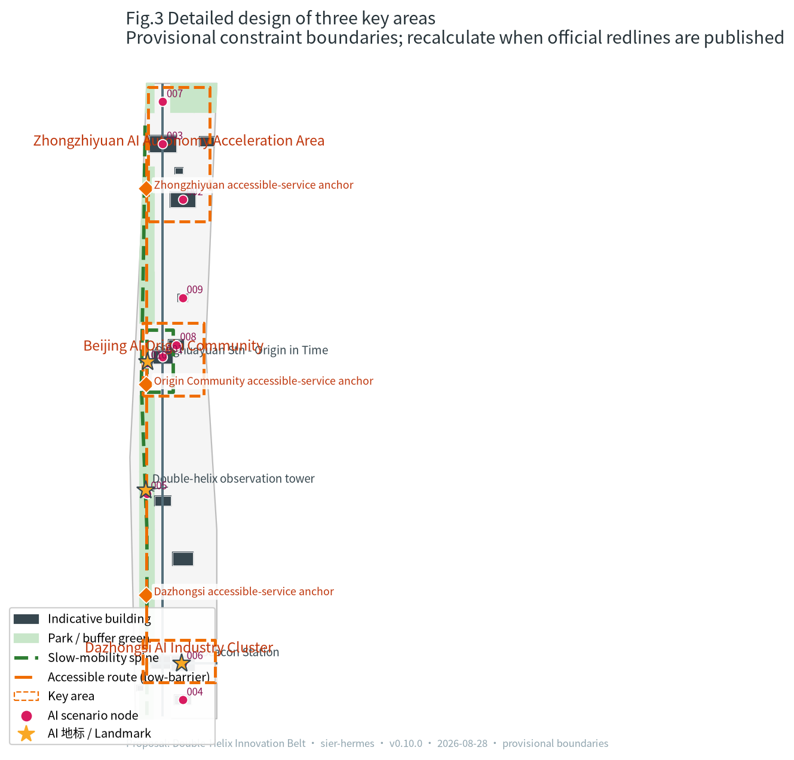

| Key area | Design positioning | Spatial moves | AI industry & operation scenarios |
| --- | --- | --- | --- |
| Zhongzhiyuan AI Autonomous Innovation Acceleration Area (192.1 ha) | Full-stack autonomy and AI governance node | Strengthen the Qinghe riverfront, industry showcase, and external access; use green space for open testing and standards-governance display; hold reserved parcels [data:geometry/key_areas.geojson#PROV-KEY-001] [data:geometry/buildings.geojson#BLDG-001] | Autonomous model testing ground, safety-governance sandbox, low-carbon compute experience, standards workshops [metric:test_scenario_count] |
| Beijing AI Origin Community (104.3 ha) | Near-campus origin and open-source node | Organize campus—park—block slow-mobility stitching; add result-release, talent-service, residential, and open-source collaboration space [data:geometry/key_areas.geojson#PROV-KEY-002] [data:geometry/buildings.geojson#BLDG-004] | Open-source release hall, near-campus translation street, talent-zone services, annual event week start [metric:ai_scenario_card_count] |
| Dazhongsi AI Industry Cluster (72.0 ha) | Native AI business and experience node | Around Dazhongsi station: integrated transfer, four-quadrant pedestrian links, and commercial renewal; cultural land hosts the dialogue between ancient bell culture and AI culture [data:geometry/key_areas.geojson#PROV-KEY-003] [data:geometry/buildings.geojson#BLDG-007] | Smart-terminal trade & exhibition, data-factor salon, international roadshow hall, consumer experience [metric:case_study_count] |

The key-area boundaries are provisional constraint ranges; the positioning and spatial moves are conceptual suggestions for professional teams to deepen, not statutory planning or demolition/renovation conclusions [depth:three_key_area_detailed_design].

## AI Innovation Ecosystem, Personas, and AI+ Scenarios
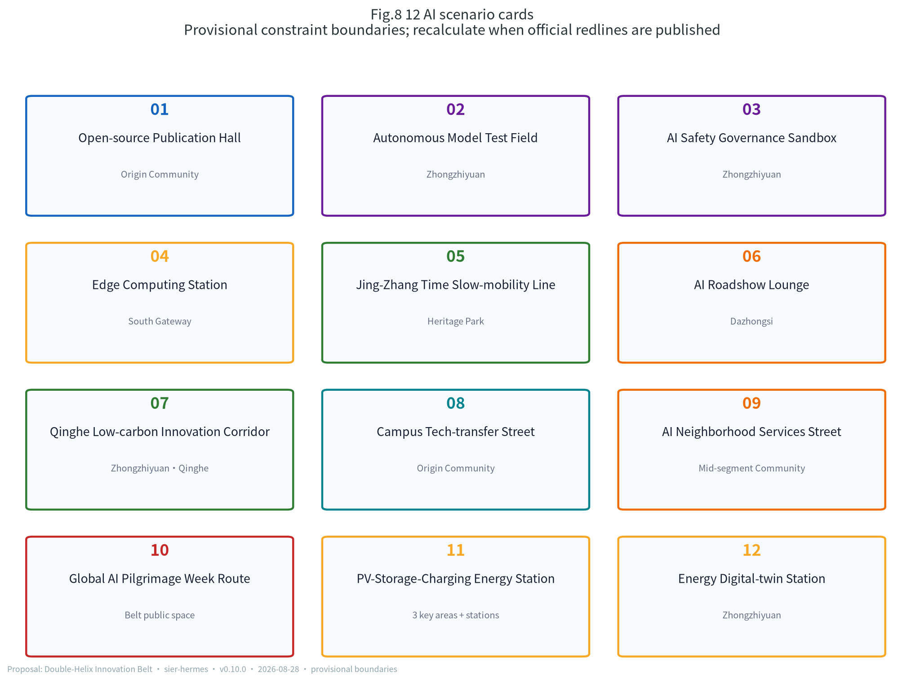

The AI innovation ecosystem is carried by four spatial types: R&D and testing space (Zhongzhiyuan), open-source origin space (Origin Community), trade and experience space (Dazhongsi), and AI service scenarios embedded in daily life (neighborhoods, parks, transport) [source:AGENT-TASKBOOK] [depth:three_key_area_detailed_design].

The proposal defines five user personas: open-source developers, startup teams, visiting executives of leading enterprises, surrounding residents, and university faculty and students. Each persona maps to explicit spatial responses and self-check boundaries - for example, no personal behavior tracking, separate authorization for compute and data services, cleared enterprise logos and cases, no commercial profiling of residents, and authorized campus and research data [source:AGENT-TASKBOOK] [metric:persona_count].

**Livelihood pain-point anchors (the driver of public-interest and inclusive design).** Every AI scenario must answer a concrete public need rather than being technology for technology's sake; safeguards for vulnerable groups are written into spatial responses and indicators:

| Livelihood pain point | Corresponding scenario / spatial response | Safeguards for vulnerable groups |
| --- | --- | --- |
| Congested commutes (slow-mobility gaps along the line) | Scenario 05 Jing-Zhang Time Slow Line, JZ-01 slow-mobility gap stitching | Accessible wayfinding, continuous tactile paving/ramps |
| Difficult healthcare/caregiving (communities and talent housing) | Scenario 09 AI Life-Services Model Street | Retained human service counters, AI services can be opted out |
| Burdensome procedures (enterprise and talent services, financing) | Scenario 06 Dazhongsi AI Roadshow Lounge, Scenario 08 Near-Campus Translation Street | Offline service points + offline alternatives |
| Digital exclusion (elderly, non-digital users) | Human channels and large-print wayfinding in Scenarios 09/11 | Human-channel availability rate, offline-alternative availability rate |
| Merchant disruption from renewal | Transitional resettlement and business-continuity safeguards during urban renewal | Merchant retention rate, disturbance complaints during renewal |

This anchor table is cross-referenced with the inclusion assessment (children, elderly, people with disabilities, low-income, non-digital users, existing merchants) in deepening attachment 4 of `report/narrative.md` and the equity_inclusion dimension of `risk.json` [depth:risk_missing_data].

**Shared scenario protocol (six fields).** All 12 scenario cards share a six-field protocol: **service recipient** (who benefits), **minimum necessary data** (data minimization, no default area-wide collection), **spatial boundary** (where it lands and its relation to site constraints), **human reviewer** (who is accountable for results), **exit and appeal** (how to opt out / offline alternative), and **evaluation and stop conditions** (when to downgrade or close). No scenario presents immature technology as fully available, and no scenario makes a vendor lock-in a necessary condition; under-performing scenarios are downgraded or exited under Power Base-Pair calibration. The full 12x6 matrix is in `report/narrative.md` attachment 8 [source:AGENT-TASKBOOK] [depth:risk_missing_data]. Each card also carries a technology-readiness level (TRL) and failure threshold (attachment 10); low-TRL scenarios are expressed as testing/pilot only, never as in operation [depth:risk_missing_data].

The proposal forms 12 AI scenario cards, all mapped to spatial nodes [metric:scenario_node_count] [metric:ai_scenario_card_count]:

| Scenario card | Spatial carrier | Design note |
| --- | --- | --- |
| 01 Open-source Release Hall | Beijing AI Origin Community  | Releases, code-contribution display, and small roadshows for universities, open-source communities, and startups |
| 02 Autonomous Model Testing Ground | Zhongzhiyuan  | Translates model evaluation, red-teaming, and safety verification into a visitable, bookable, governable node |
| 03 Safety-Governance Sandbox | Zhongzhiyuan  | Integrates standards, safety evaluation, and governance display for expert and public dialogue |
| 04 Edge-Compute Service Station | South Gateway compute center  | New-infrastructure prototype combined with public services and low-carbon energy |
| 05 Jing-Zhang Time Slow Line | Jing-Zhang Heritage Park  | Explainable wayfinding and low-intrusion sensing to identify slow-mobility gaps, crowding, and accessibility needs |
| 06 Dazhongsi AI Roadshow Lounge | Dazhongsi AI Industry Cluster  | Showcase, negotiation, press, and international exchange for agent, smart-terminal, and content enterprises |
| 07 Qinghe Low-Carbon Innovation Corridor | Zhongzhiyuan riverfront  | Green space, stormwater, walking and cycling, and AI display as a public living room |
| 08 Near-Campus Translation Street | Beijing AI Origin Community  | Incubation, display, legal, IP, and financing services for university results |
| 09 AI Life-Services Model Street | Central community service band  | Brings health, education, legal, and life-service AI+ scenarios to operable small-block space |
| 10 Global AI Pilgrimage Week Route | Belt-wide public space system | A walkable, shareable experience route from heritage culture, open source, industry, to international roadshows |
| 11 PV-Storage-Charging Energy Station | Parking at the three key areas and station interchanges | Integrated distributed PV + storage + V2G charging as the public energy node of the Power Base-Pair, with PUE and green-power share visualized |
| 12 Energy Digital Twin Station | Zhongzhiyuan energy dispatch center (suggested point) | Organizes generation, storage, charging, and carbon into a real-time auditable "energy data railway", supporting low-carbon compute and public science education |

The proposal proposes three industry test/validation scenarios (each requiring separate approval before operation): the autonomous model safety-evaluation sandbox at Zhongzhiyuan, the AI transport pilot for slow mobility and low-speed shuttle in the Jing-Zhang Heritage Park, and an AI public-service pilot in the central community band. All scenarios follow data minimization, explainability, and human-review principles; no unauthorized personal profiling, and no presentation of test scenarios as approved operations [metric:test_scenario_count] [source:AGENT-TASKBOOK].

## Land Use, Building Scale, and Retain-Renovate-Demolish Strategy

The land plan follows the project subset of the Land Use Classification Guide for Territorial Spatial Survey, Planning, and Use Control; 57 land units fully cover the submitted boundary without gaps or overlaps [standard:MNR-LAND-USE-CLASSIFICATION-GUIDE] [data:geometry/land_use.geojson#LU-001]. In metrics, the dual-strand land structure shows: research land of about 255.1 ha, education land of about 97.3 ha, and cultural land of about 49.5 ha along the two strands; park and buffer green of about 175.1 ha as the blue-green skeleton; and commercial land of about 132.2 ha concentrated at the south gateway and Dazhongsi [metric:land_use_area_by_code] [metric:green_ratio].

The building plan distinguishes retain, renovate, renew, new-build, and reserved categories, and provides 14 indicative building footprints, including the Qinghuayuan Station Cultural Hall (retained), talent apartments (new), and two energy stations (Zhongzhiyuan PV-Storage-Charging Energy Station BLDG-015, Dazhongsi District Energy Station BLDG-016, southwest of Dazhongsi Station) [data:geometry/buildings.geojson#BLDG-001] [depth:retain_renovate_demolish]. Demolition/renovation conclusions depend on ownership, engineering conditions, and approval; this proposal offers methods and a calibration checklist only, without fabricating specific retain/renovate/demolish conclusions [depth:development_intensity_controls]. Floor area, FAR, and height controls are listed as pending until official regulatory conditions are confirmed [metric:total_floor_area_sqm] [metric:floor_area_ratio].

**Retain/renovate/demolish decision tree (conceptual; formal conclusions await ownership and engineering review).** Each existing building is classified through four decision levels:

| Level | Question | Flow |
| --- | --- | --- |
| L1 Heritage and historical value | Is it a heritage/historic building or inside the heritage-belt protection scope? | Yes -> **Retain** (e.g., Qinghuayuan Station BLDG-005); No -> L2 |
| L2 Structure and engineering quality | Structural safety and engineering grade? | Unsafe beyond repair -> **Demolish and rebuild**; repairable -> **Retain/renovate**; needs appraisal -> **Pending review** |
| L3 Functional fit | Does the current function fit the AI innovation belt positioning? | Fits -> **Retain + activate**; partial -> **Renovate**; no fit -> **Renew/rebuild** |
| L4 Ownership and approval | Are ownership, regulatory, and approval conditions clear? | Clear -> execute per L1-L3; unclear -> **listed as pending confirmation**, no presumption |

The tree guarantees: no existing building lacking ownership/engineering/approval evidence enters a "demolish" presumption; "retain" precedes "renovate" and "renovate" precedes "rebuild", consistent with the low/medium/high development-intensity scenarios [depth:retain_renovate_demolish] [depth:development_intensity_controls].

## Transport, Rail, Municipal Infrastructure, and Public Services

The transport plan uses the Jing-Zhang Heritage Park slow-mobility spine (about 9.7 km) as its backbone, coordinated with the Innovation Service spine, the Xueyuan Road eastern arterial, and east–west connectors, forming a "dual-spine, multi-connector" network; the three key areas organize integrated transfer and four-quadrant pedestrian links around rail stations [data:geometry/roads.geojson#ROAD-001] [depth:traffic_rail_slow_parking]. A **continuous accessible route** (low-barrier path) runs along the slow-mobility spine, with accessible-service anchors (community service facilities) in the three key areas, ensuring full accessibility for the elderly, people with disabilities, and carers with prams [data:geometry/roads.geojson#ROAD-020] [data:geometry/roads.geojson#ROAD-021] [depth:traffic_rail_slow_parking]. Existing expressways, rail heritage, and water systems are locked as constraint layers, without overstepping into engineering feasibility conclusions [data:geometry/constraints.geojson#CONSTRAINT-001] [data:geometry/constraints.geojson#CONSTRAINT-004].

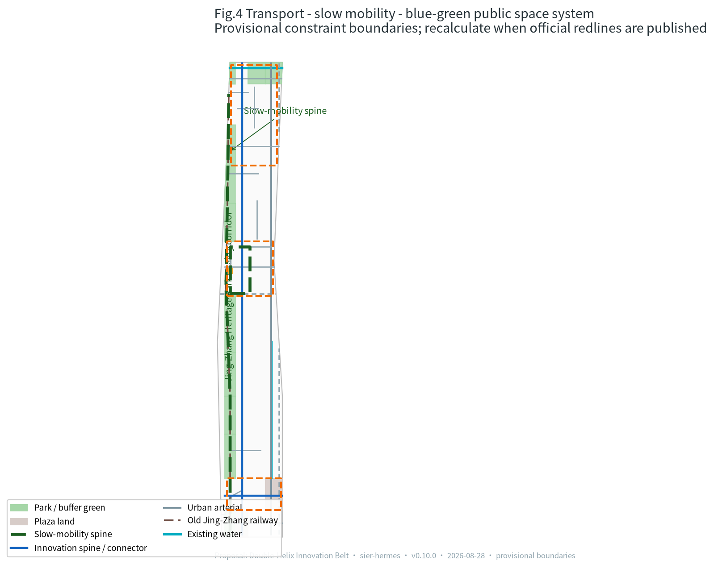

Municipal and new infrastructure covers AI industry services, innovation platforms, talent life services, distributed energy, edge compute, and integration with traditional municipal systems [depth:municipal_new_infrastructure]. The Qinghe and Xiaoyuehe rivers are included in the blue-green system as blue-line constraints; pipeline, energy, drainage, flood, and fire engineering conditions are listed as prerequisites for formal deepening [data:geometry/constraints.geojson#CONSTRAINT-002] [data:geometry/constraints.geojson#CONSTRAINT-003].

**Smart energy and the new-type power infrastructure (conceptual scheme from an electrical-engineering perspective).** Guided by the Power Base-Pair mechanism, the proposal organizes the belt's energy system into four components, all based on mature or pilot-stage technologies; formal calibration awaits professional deepening:

| Component | Spatial anchor | Technical feasibility | Verifiable indicators (candidate) |
| --- | --- | --- | --- |
| Distributed PV | Roofs of new/reserved parcels, canopies and carports (no installations on the heritage park itself, respecting heritage and character constraints) [data:geometry/land_use.geojson#LU-001] | Mature: distributed PV and BIPV are widely deployed | Self-generation share, generation per unit area (kWh/m²·yr) |
| Storage and microgrids | Zhongzhiyuan PV-Storage-Charging Energy Station, Dazhongsi District Energy Station, South Gateway compute center [data:geometry/buildings.geojson#BLDG-015] [data:geometry/buildings.geojson#BLDG-016] | Mature: electrochemical storage and microgrid projects are widely delivered | Storage capacity (MWh), island-operation duration, self-healing recovery time |
| V2G smart charging | Parking at the three key areas and rail-station interchanges [data:geometry/public_space.geojson#PUBLIC-001] | Pilot-stage: vehicle-grid interaction is being piloted in demonstration cities | V2G participation rate, charge/discharge response time |
| Energy digital twin | Zhongzhiyuan energy dispatch center (suggested point at BLDG-015) [data:geometry/buildings.geojson#BLDG-015] | Medium maturity: digital twins are used in campus energy management | Data update frequency, forecast accuracy, real-time carbon visualization |

This energy system directly supports edge compute and low-carbon compute scenarios: edge-compute stations use "PV-storage-charging integrated + low-PUE design" to reduce impact on the main grid, with PUE, green-power share, and energy per unit of compute as entry thresholds for open operation; the energy digital twin organizes the belt's generation, storage, charging, and carbon emissions into a real-time auditable "energy data railway", echoing the Jing-Zhang Railway's promise of "leaving standards in space for later verification" [source:POLICY-CARBON-PEAK] [depth:municipal_new_infrastructure]. All energy facility layouts must respect heritage protection, blue-line, flood, and character constraints; grid connection, power-market, and green-power-trading matters are listed as prerequisites for formal deepening, without constituting engineering feasibility or implementation commitments [depth:risk_missing_data].

**Quantified candidate target list (candidate baselines pending pilot calibration; not approval commitments).** To avoid vague wording such as "high", "excellent", or "green", the proposal gives verifiable candidate targets, all requiring pilot data and authority calibration:

| Dimension | Candidate target | Evidence and calibration path |
| --- | --- | --- |
| Edge-compute efficiency | PUE ≤ 1.25; energy per unit of compute audited from compute ledger | Pilot ledger + third-party sampling (narrative attachment 2) |
| Green-power priority | Green-power share ≥ 80%; self-generation share ≥ 15% | Power-trading records + grid settlement statements |
| Resilience and self-healing | Self-healing recovery time ≤ 5 min; supply availability ≥ 99.9% | Distribution-grid operation ledger |
| Opt-out | Human-channel availability 100%; offline-alternative availability ≥ 99% | Operation closure records + unannounced checks |
| Slow mobility | Slow-mobility connectivity ≥ 90%; ≥ 12 gaps eliminated | On-site survey (JZ-01 pilot) |
| Accessibility | Accessibility compliance 100% | Dedicated accessibility acceptance |
| Merchant protection | Merchant retention ≥ 85% during renewal | Renewal ledger (JZ-07 pilot) |
| V2G | Pilot participation ≥ 30% | Charging-network operation data |

This list is cross-referenced with narrative attachment 7; any candidate not met during a pilot is downgraded or exited under Power Base-Pair calibration [depth:risk_missing_data] [source:AGENT-TASKBOOK].

**Conceptual estimation methods (electrical-engineering perspective; formal calibration awaits professional deepening).** To avoid presenting numbers without a basis, the proposal gives simplified estimation methods for energy facilities - all conceptual, order-of-magnitude for benchmarking, not engineering commitments:

| Facility | Estimation method (conceptual) | Example magnitude (within provisional constraints) | Formal calibration depends on |
| --- | --- | --- | --- |
| Distributed PV | Usable roof/canopy/carport area x unit capacity (about 0.15 kW/m²) x annual equivalent hours (Beijing about 1200-1400h) | If usable area ~150,000 m² -> ~22.5 MW installed, ~30 GWh/yr | Roof structure, ownership, shading, heritage review |
| Storage | Simplified sizing by peak-load share or island duration: capacity ~ critical load x island hours / depth of discharge | If critical load ~5 MW, island 2h, DOD 0.9 -> ~11 MWh | Grid topology, load model, safety standards |
| V2G chargers | Sizing by parking ratio and service radius: units ~ key-area parking spaces x participation rate x site factor | If ~6,000 spaces, 30% participation -> ~1,800 V2G stalls | Vehicle-grid pilot policy, grid interconnection |
| Energy digital twin | Data collection covers generation/storage/charging/carbon ledgers at station-level granularity | ~4 ledgers x 12 scenario nodes -> full-belt energy data coverage | Data standards, interface protocols, operator |

All formulas and coefficients are simplified references to public engineering experience (not precise design values); formal calibration awaits pilots and professional deepening [source:POLICY-CARBON-PEAK] [depth:municipal_new_infrastructure]. Parameter selection bases and sensitivity analysis are in narrative attachment 11 (e.g., PV unit capacity 0.10-0.20 kW/m², storage DOD 0.9, V2G participation 20-30%); high-sensitivity items (PV area, V2G participation) get on-site verification and policy alignment first during formal calibration [depth:risk_missing_data].

## Blue-Green Network, Public Space, and Urban Character
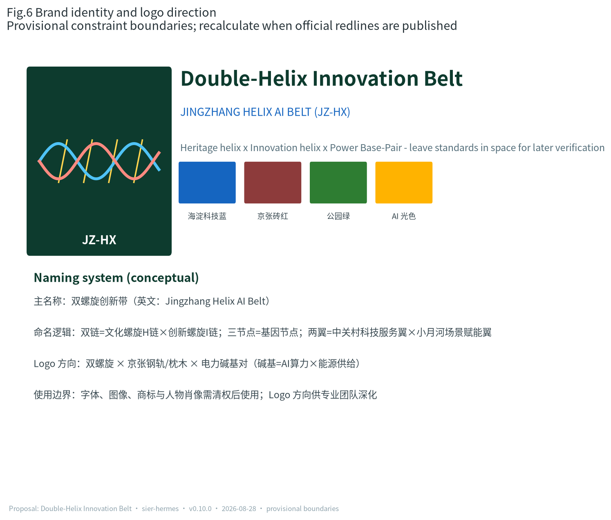

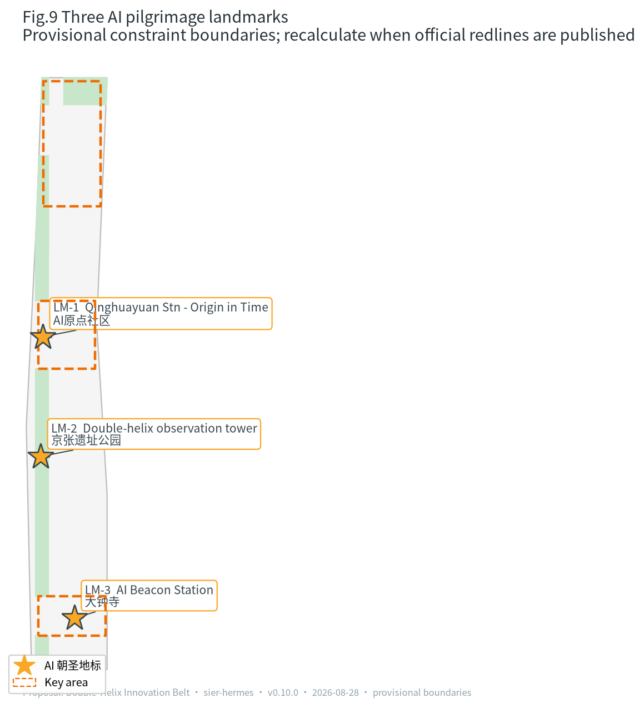

**Naming system and brand identity (conceptual).** The proposal provides a complete naming hierarchy and logo concept direction for professional teams to deepen:

| Level | Name | Note |
| --- | --- | --- |
| Master name | Double-Helix Innovation Belt (Jingzhang Helix AI Belt, JZ-HX) | Overall concept name, used bilingually |
| Concept structure | One belt, two strands, three nodes, two wings | Heritage Park vitality corridor; Heritage helix H x Innovation helix I x Energy strand E; three gene nodes; two wings |
| Node names | Zhongzhiyuan / AI Origin Community / Dazhongsi | Keep official key-area names; node image suffix "gene node" |
| Abbreviation | JZ-HX | For international communication, digital interfaces, and the energy digital twin station |

Logo concept direction: double helix x Jing-Zhang steel rail and sleepers x Power Base-Pair - the two helix strands interlock at the gene nodes, with the yellow dashed line as the Energy strand E; palette: Haidian tech blue (#1565C0), Jing-Zhang brick red (#8D3B3B), park green (#2E7D32), AI light (#FFB300); prohibitions: no confusion with heritage-protection symbols, government emblems, or corporate trademarks. Usage specification (conceptual): wayfinding systems (belt and node entrances), event visuals (Global AI Pilgrimage Week), digital interfaces (energy digital twin station); fonts, images, trademarks, and portraits require clearance before use; the formal brand identity awaits professional deepening and does not constitute authorized use [source:AGENT-TASKBOOK] [depth:three_key_area_detailed_design].

The blue-green system uses the Jing-Zhang Heritage Park vitality corridor as its skeleton and coordinates the Qinghe and Xiaoyuehe rivers, park green, and plaza land into a north–south continuous, east–west connected slow-mobility and green space system [data:geometry/green_space.geojson#GREEN-001] [depth:blue_green_public_space]. Public space is carried by two plaza land units (South Gateway Plaza, Dazhongsi Station East Plaza) and park nodes for daily gathering and AI scenario experience [data:geometry/public_space.geojson#PUBLIC-001] [metric:public_space_ratio].

Urban character merges Jing-Zhang railway heritage culture, Zhongguancun innovation culture, and AI culture, proposing a "rail grey + Haidian blue-green + AI light" city tone and a double-helix wayfinding and signage direction [standard:MOHURD-URBAN-DESIGN-MEASURES] [depth:height_massing_character]. The proposal proposes three AI pilgrimage landmarks: Qinghuayuan Station · Origin in Time (the opening of the Heritage strand), the Jing-Zhang Heritage Park · Double-Helix Observation Tower (the public high point where both strands meet), and Dazhongsi · AI Beacon Station (the application and communication interface) [metric:landmark_count] [source:AGENT-TASKBOOK]. All brands, fonts, images, portraits, and enterprise logos require cleared rights before use [depth:risk_missing_data].

## Renewal Projects, Implementation Policy, and Phasing

The implementation layer proposes a reviewable renewal project list with location, type, function, and dependency conditions [depth:renewal_project_list]:

| Project ID | Project name | Type | Main dependencies |
| --- | --- | --- | --- |
| JZ-01 | Jing-Zhang Heritage Park slow-mobility gap stitching | Public space/transport | Road redline, under-bridge space, traffic organization review [data:geometry/roads.geojson#ROAD-001] |
| JZ-02 | Zhongzhiyuan Qinghe innovation riverfront | Blue-green/industry showcase | River blue line, ecology, flood conditions [data:geometry/green_space.geojson#GREEN-001] |
| JZ-03 | Origin Community near-campus translation street | Urban renewal/industry services | Campus boundary, ownership, ground-floor use [data:geometry/buildings.geojson#BLDG-004] |
| JZ-04 | Dazhongsi station four-quadrant pedestrian link | Rail integration/slow mobility | Station, intersections, municipal pipelines [data:geometry/public_space.geojson#PUBLIC-001] |
| JZ-05 | Edge-compute and public-service nodes | New infrastructure/public services | Energy, compute, safety, operators  |
| JZ-06 | Double-helix observation tower and pilgrimage route | Brand/public space | Public space permits, event safety, copyright clearance [data:geometry/phasing.geojson#PHASE-001] |
| JZ-07 | Central AI life-services model street | Urban renewal/scenario operation | Community participation, ground-floor use, data governance boundaries  |
| JZ-08 | Global AI event week public route | Operation/brand | Event approval, crowd safety, international communication compliance [data:geometry/phasing.geojson#PHASE-002] |

Phasing is distinct from the call's submission cycle: the call sets the deadline for deliverables, while implementation phasing is the urban renewal path. The proposal is phased in three stages - Stage 1 (about 396 ha) first stitches the Heritage Park belt and the three key-area cores; Stage 2 (about 284 ha) advances whole-area renewal of the key areas; Stage 3 (about 462 ha) completes the full framework [data:geometry/phasing.geojson#PHASE-001] [metric:phasing_area_sqm] [depth:phasing_implementation]. Light facilities, operation activities, and service platforms may start early; no engineering feasibility or implementation commitments are made before official regulatory, municipal, transport, and ownership conditions are confirmed.

**Development-intensity scenario assumptions (an implementation framework while official controls are missing).** Official FAR, height, and density are absent; rather than fabricating precise values, the proposal offers three scenarios for professional teams and authorities to benchmark: a low-intensity scenario (current FAR 1.0-1.5, dominated by retention and light renewal), a medium-intensity scenario (1.5-2.5, moderate increments at the three cores), and a high-intensity scenario (2.5-3.5, transit-oriented high density around rail stations). All three scenarios keep the blue-green and public-space ratios and the building-footprint layer unchanged, varying only floor counts and floor-area accounting; calibration follows official conditions once published, and no scenario is presented as an approved conclusion [depth:development_intensity_controls] [metric:floor_area_ratio].

**Pilot projects: suggested actors, sequencing, and verifiable indicators.** To strengthen implementability, three Stage-1 pilots define suggested implementing actors and verifiable indicators (all conceptual, no commitments):

| Pilot | Suggested implementing actor | Start conditions | Verifiable indicators (candidate) |
| --- | --- | --- | --- |
| Edge compute and PV-storage-charging station (JZ-05) | District SOE + grid utility + compute operator consortium | Grid-connection scheme and power-market rules clarified | PUE, green-power share, self-generation share, self-healing recovery time |
| Heritage Park slow-mobility gap stitching (JZ-01) | District urban management/landscaping + community participation | Road redline, under-bridge space, traffic organization review | Slow-mobility connectivity, gaps eliminated, accessibility compliance rate |
| Central AI life-services model street (JZ-07) | Subdistrict office + community commerce operator + tech service provider | Ground-floor use, data-governance boundaries, merchant participation agreement | Merchant retention rate, human-channel availability rate, resident satisfaction |

**Pilot financing and operation models (conceptual).** The three pilots adopt a "public investment + market operation" hybrid model with explicit financing, actor division, and cost responsibility; none constitutes a financing commitment:

| Pilot | Financing suggestion | Operation actors and division | Cost responsibility |
| --- | --- | --- | --- |
| Edge compute and PV-storage-charging station (JZ-05) | Government special bonds/green finance + private capital (compute operator, grid utility) | Consortium: grid utility for interconnection and storage dispatch, compute operator for compute services, district SOE for asset holding | Construction cost split by contribution; operation cost covered by service revenue, shortfall backed by public-service budget |
| Heritage Park slow-mobility gap stitching (JZ-01) | District finance + urban renewal special funds | District urban management/landscaping leads implementation; community co-governance committee oversees | Engineering cost borne by district finance; maintenance included in park upkeep budget |
| Central AI life-services model street (JZ-07) | Market-based recruitment + merchant co-funding | Subdistrict office coordinates, commerce operator runs daily operations, tech service provider supplies AI capabilities | Ground-floor retrofit cost shared by merchants and operator; AI service cost settled by usage |

## Concept Renders (Conceptual)

The six concept renders below express the spatial imagery and mechanism scenarios of the proposal in a drawing-board style. They are conceptual suggestions and do not constitute engineering feasibility or implementation commitments; all imagery is derived from `geometry/*.geojson` and the sections of `proposal.md`:

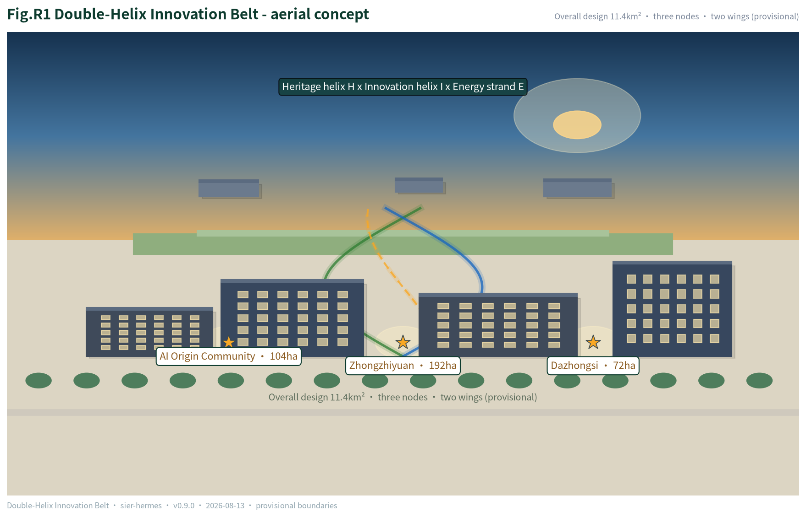

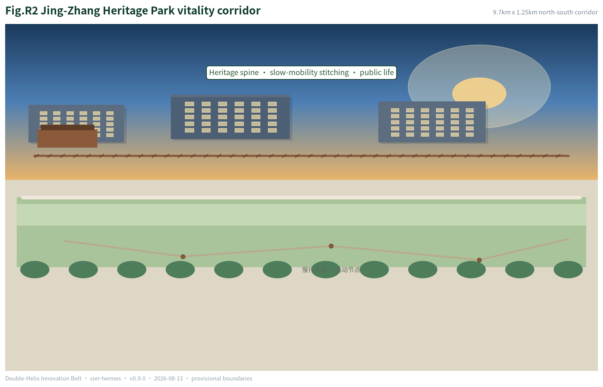

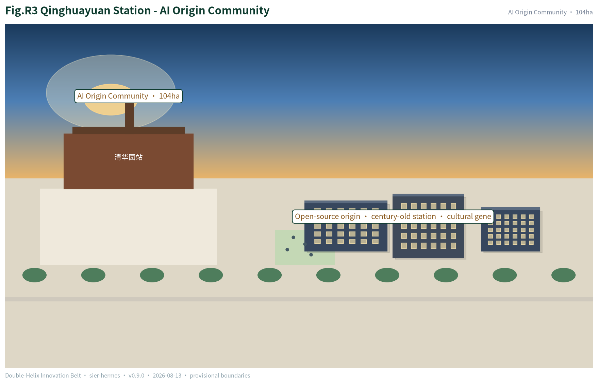

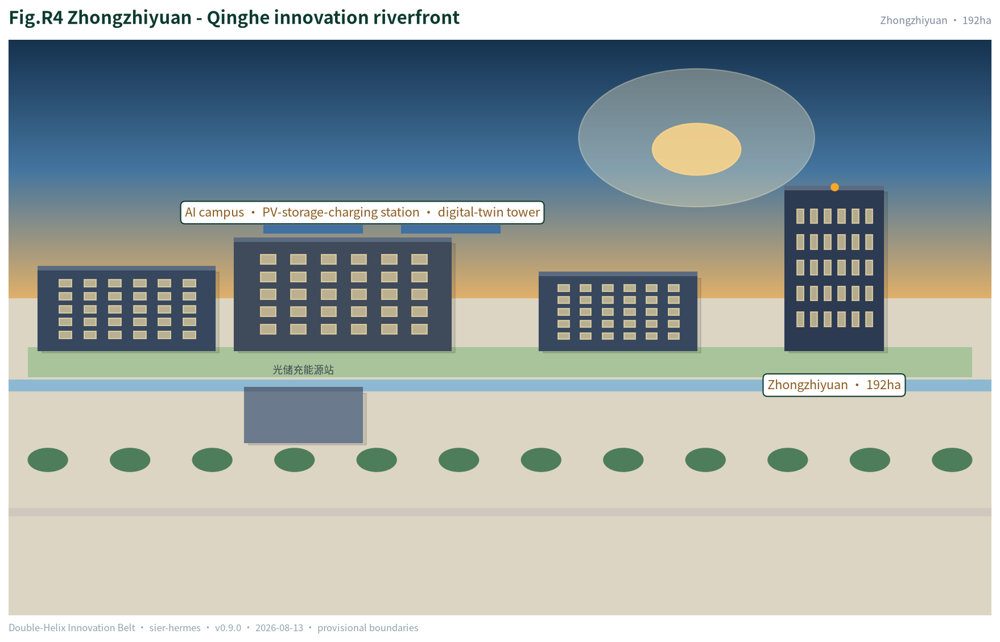

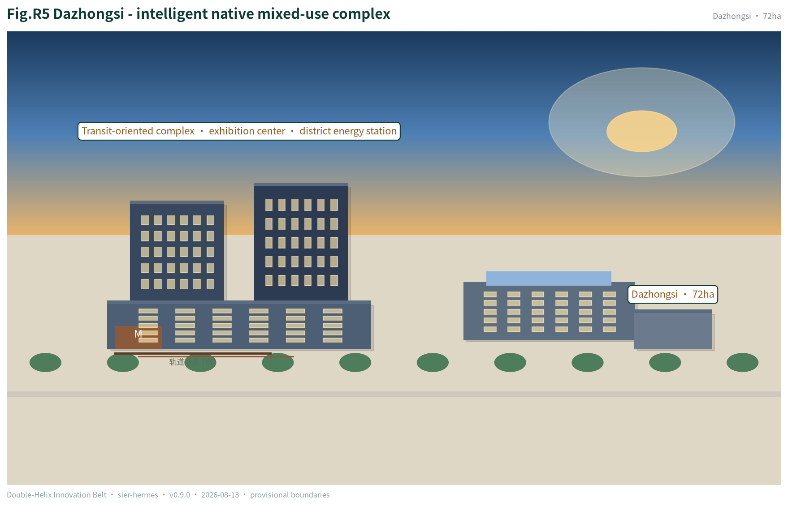

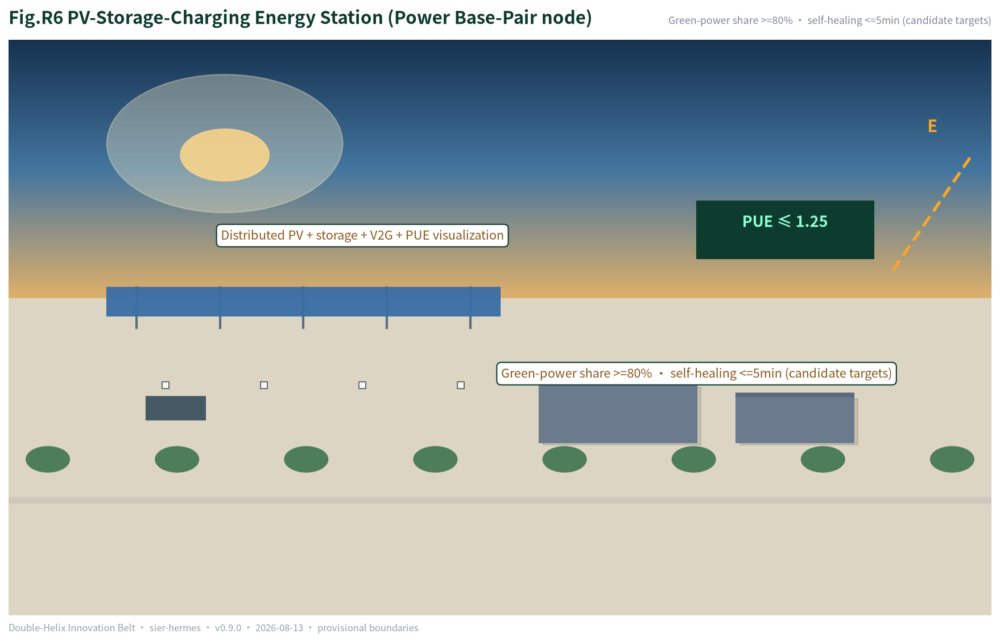

## Metrics, Area Recalculation, and Compliance Matrix

Metrics fall into three classes: spatial metrics directly reproducible from the submitted geometry (boundary area, land-use area, green and public space ratios, building footprints, road length, phasing areas, key-area areas); control metrics requiring official regulatory conditions (FAR, building height, density, setbacks, road redlines — all pending); and performance metrics requiring ongoing operational and industry data (scenario nodes, personas, test scenarios, landmarks, event system) [metric:site_area_sqm] [metric:green_ratio] [depth:metrics_recalculation].

All known metrics are reproducible from the GeoJSON under EPSG:4548; complete values, formulas, source files, and confidence are stored in `metrics.json`; unknown metrics give reasons and formal-submission prerequisites [data:geometry/site_boundary.geojson#SITE-001] [metric:key_area_count].

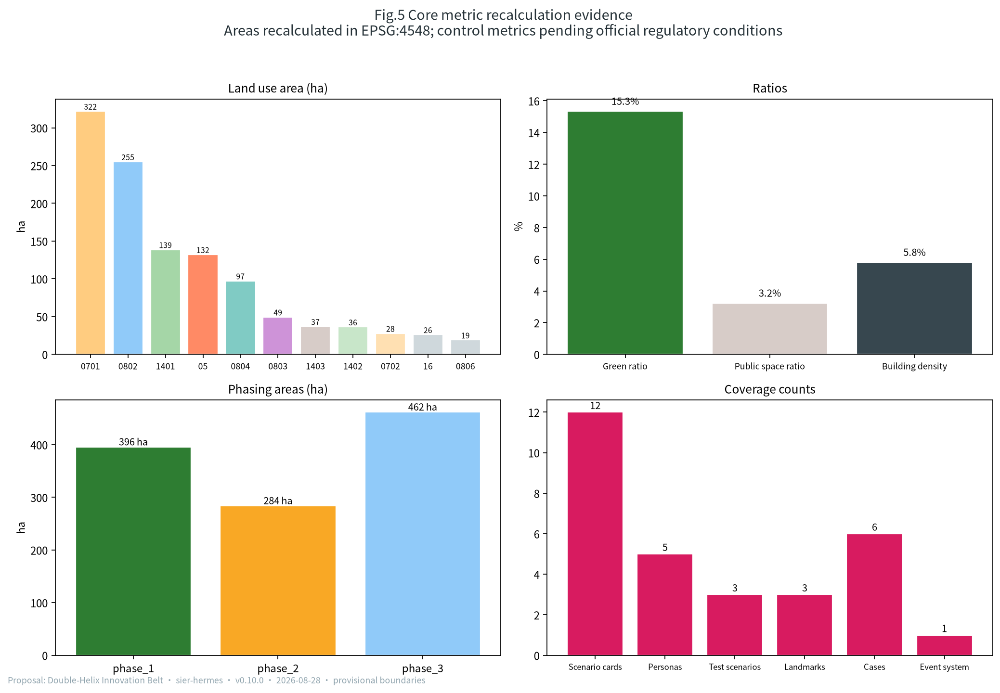

The compliance matrix is the master control of task responsiveness: every task in announcement sections 1.3, 1.4, and 1.5 and every agent task agent.1–agent.6 is mapped to report sections, layers, metrics, drawings, HTML pages, sources, assumptions, and self-checks in `compliance_matrix.json`; professional standard responses are in `standard_matrix.json`; design-depth responses are in `design_depth_matrix.json` [source:OFFICIAL-ANNOUNCEMENT] [source:AGENT-TASKBOOK].

## Risk, Copyright, and Compliance

**Bilingual contract.** The primary narrative is Chinese; `proposal.en.md` provides the complete counterpart translation. `report/proposal.html` and `report/proposal.en.html`, `visual/index.html` and `visual/index.en.html`, the A3/A0 drawings, and all text-bearing figures are provided in both language versions, with sections, claims, metrics, evidence references, and figure positions aligned.

**Boundary and data risk.** Official redlines are not yet available; all boundaries and areas are based on provisional constraint ranges and must be recalculated when official polygons are published; provisional boundaries must not be used as official redlines or precise-area basis [depth:risk_missing_data] [data:geometry/key_areas.geojson#PROV-KEY-001].

**Copyright and compliance boundary.** This proposal does not claim official approval, approved regulatory plans, final ownership, final construction scale, or guaranteed implementation; all spatial suggestions are conceptual or reference schemes for professional teams to deepen. Fonts, images, trademarks, portraits, and enterprise logos require cleared rights before use; this proposal avoids uncited visual material to the extent possible [source:SOURCE-REGISTRY].

## References

- brief/public-brief.md
- brief/site-package/design_brief.json
- brief/site-package/agent_taskbook.json
- brief/site-package/allowed_design_space.json
- brief/site-package/geometry/provisional_boundaries.geojson
- brief/site-package/standards/standards.json and its references/
- brief/site-package/enums/、ranges/planning_limits.json
- data/source_registry.json
- data/processed/agent_fact_pack.md
- Complete machine indexes: `sources.json`, `metrics.json`, `compliance_matrix.json`, `standard_matrix.json`, and `design_depth_matrix.json` [source:SITE-PACKAGE]
