# 双螺旋创新带｜百年京张AI创新带城市设计方案

## 一页执行摘要（Executive Brief）

**概念一句话**：以百年京张铁路的自主创新史为底，把文化螺旋 H链与创新螺旋 I链编织成城市 DNA，并为每个 AI 场景配一组可复核的"电力碱基对"——AI 算力 × 能源供给，用电气工程视角把 AI 治理落成可核验的城市电力基础设施。

**空间结构**：一带（京张遗址公园活力带）双链（文化螺旋 × 创新螺旋）三节点（众智园 192ha / AI原点社区 104ha / 大钟寺 72ha）两翼（中关村科技服务翼 × 小月河场景赋能翼）；总体设计 11.4km²，边界为临时约束，官方红线发布后复算 [metric:site_area_sqm] [metric:key_area_area_sqm]。

**独有机制**：电力碱基对四项校准（能效底线 PUE ≤1.25 / 绿电优先 ≥80% / 韧性自愈 ≤5min / 可退出 人工通道100%），12 张场景卡全部映射空间节点 [metric:ai_scenario_card_count]；JZ-05 光储充驿站最小试点以随包脚本 `visual/assets/run_jz05_pilot.js --check` 可复现桌面预演（十段执行链、七道 Gate、六项验收条件，证据 JSON 见 `visual/assets/jz05-pilot-evidence.json`）[metric:jz05_acceptance_criterion_count]。

**关键数字**：57 个无缝隙用地单元、14 栋示意建筑、15 条道路、6 张概念渲染图、13 个更新项目、24+ 项可复算指标 [metric:land_use_unit_count] [metric:road_length_m]。

**边界声明**：全部空间成果基于公开与清权资料生成；官方红线/控规/试点数据未发布前，面积类指标为 provisional 复算、管控指标为 unknown、试点候选值为候选口径；本方案为概念建议，不构成审定结论 [depth:risk_missing_data]。

## 设计依据与资料清单

本方案以北京市规划和自然资源委员会海淀分局发布的《百年京张AI创新带城市设计国际方案征集资格预审公告》为第一依据，并以 `brief/site-package/` 中登记的临时粗略边界、重点区域、枚举、指标和来源清单为机器可读依据 [source:OFFICIAL-ANNOUNCEMENT] [source:SITE-PACKAGE]。面向智能体的开源征集任务书（agent.1–agent.6）是本次方案六项任务的直接来源 [source:AGENT-TASKBOOK]。图件总览图与空间结构图使用 OpenStreetMap 底图（道路/水系/铁路/公园，图面署名 © OpenStreetMap contributors，ODbL），其余图件为智能体程序化绘制；离线 HTML 内嵌 Noto Sans CJK SC 字体子集 [source:OSM-BASEMAP] [source:FONT-NOTO-CJK]。

公开资料登记表区分了 formal 可用、背景、临时约束和待核查资料，方案只把 `usable_for_formal=“yes”` 或另行清权的资料用于正式主张，背景与临时资料只作背景 [source:SOURCE-REGISTRY]。官方 `SITE_BOUNDARY` 与三处 `KEY_AREA` 精确红线尚未取得，本方案按场地包规则使用 `brief/site-package/geometry/provisional_boundaries.geojson` 作为临时约束范围，并在正文、图层、指标和自检中全程标注，待官方 polygon 发布后统一复算 [source:BOUNDARY-SOURCE] [source:KEY-AREA-SOURCE]。

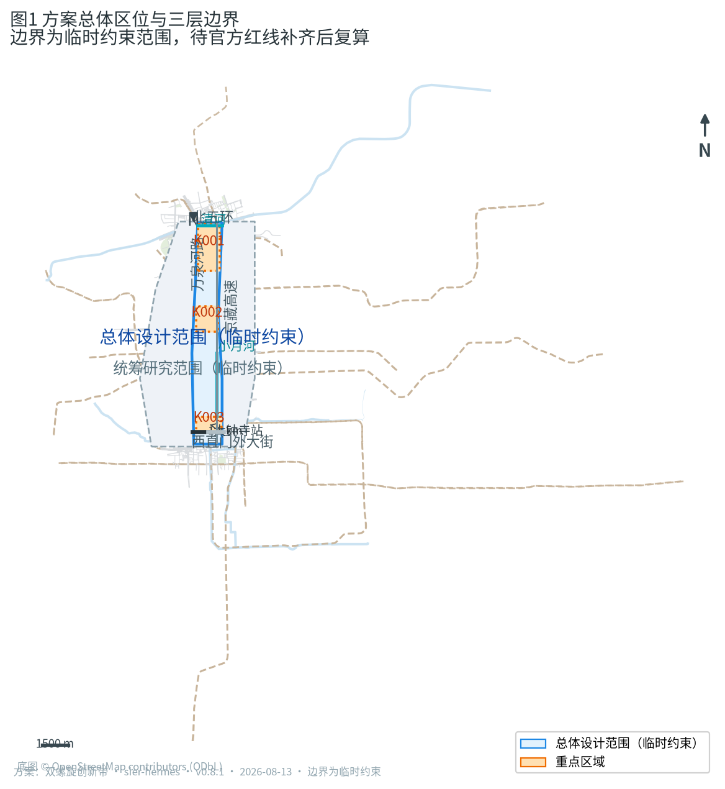

专业标准以仓库内 `standards/references/` 的本地快照为准，`source_url` 本身不构成证据 [standard:PROJECT-OFFICIAL-ANNOUNCEMENT] [standard:MOHURD-URBAN-DESIGN-MEASURES]。正文采用 v2 格式：可读判断与证据锚点并置，完整来源、指标、矩阵和图层索引保存在结构化文件中 [depth:existing_conditions_diagnosis]。

## 三层范围工作框架

方案按公告确定的三层范围组织：统筹研究范围（43.6 平方公里）回答 AI 产业生态与未来城市形态；总体设计范围（11.4 平方公里）把判断落实到用地、建筑、交通、市政和风貌；重点区域范围（368.4 公顷）对众智园、北京AI原点社区、大钟寺三处片区作详细设计 [source:OFFICIAL-ANNOUNCEMENT] [depth:three_level_scope_framework]。

三层工作的共同主轴是「双螺旋」空间概念：一条**文化螺旋链（H链）**承载百年京张铁路、中关村创业文化与 AI 新文化；一条**创新螺旋链（I链）**承载高校策源、开源协作、企业转化、场景应用与全球治理。两条链沿京张遗址公园一带互相缠绕，在三处重点区形成三个「基因节点」，在总平面与指标上均可定位、可复核 [depth:overall_spatial_structure] [data:geometry/land_use.geojson#LU-001]。

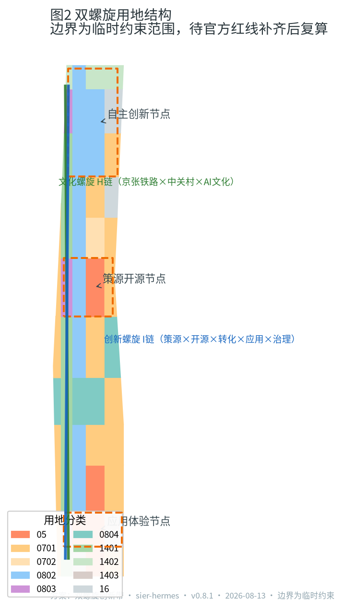

| 层级 | 设计问题 | 方案回答 | 数据落点 |
| --- | --- | --- | --- |
| 统筹研究范围 | AI 产业生态与未来城市形态 | 高校策源—开源协作—企业转化—公共体验—国际传播创新链 | compliance_matrix.json、standard_matrix.json |
| 总体设计范围 | 用地、更新、交通市政与风貌 | 双链用地结构、三节点两翼、慢行双主轴 | [data:geometry/land_use.geojson#LU-001] [data:geometry/roads.geojson#ROAD-001] |
| 重点区域范围 | 三处片区详细设计 | 自主创新节点、策源开源节点、应用体验节点 | [data:geometry/key_areas.geojson#PROV-KEY-001] [data:geometry/key_areas.geojson#PROV-KEY-002] [data:geometry/key_areas.geojson#PROV-KEY-003] |

## 统筹研究范围产业与未来城市研究

统筹研究范围的核心是构建世界级 AI 创新生态。方案把海淀高校院所、开源社区、头部企业、算力数据要素与科技服务资源组织为「策源—协作—转化—体验—治理」的完整创新链，并以人才密度、场景开放度和全球活动承载作为未来城市形态的三个衡量维度 [source:AGENT-TASKBOOK] [depth:overall_spatial_structure]。

未来城市形态回答 AI 如何改变工作、生活、社交与公共服务：研发与测试空间向「可参观、可测试、可监管」的半开放街区演化；公共空间成为 AI 场景的可体验界面；社区与商业嵌入端侧算力和低碳能源节点。统筹层不新增伪精确红线，其产业判断通过总体设计层用地与设施落位表达 [standard:MOHURD-URBAN-DESIGN-MEASURES] [data:geometry/land_use.geojson#LU-001] 。

对照全球 AI 创新生态，本方案研究并参考以下六类案例（概念级引用，不作投资或效果承诺）：美国硅谷的资本—人才—大学闭环、以色列特拉维夫的国防技术溢出与创业密集区、英国伦敦国王十字站的铁路遗产更新为知识街区、新加坡纬壹科技城的高密度研发社区、深圳南山的生产—研发—生活混合、杭州城西科创大走廊的走廊式创新组织 [source:AGENT-TASKBOOK] [depth:three_level_scope_framework]。

每个案例提炼可转化空间动作（概念建议）：
| 案例 | 借鉴点 | 可转化空间动作 | 适用条件 | 不适用条件 |
| --- | --- | --- | --- | --- |
| 硅谷 | 资本—人才—大学闭环 | 近校成果转化街（BLDG-006）、大钟寺AI路演客厅（场景 06） | 高校/科研密集、资本活跃 | 无高校腹地的片区 |
| 特拉维夫 | 国防技术溢出与创业密集区 | 众智园自主模型测试场与安全治理沙盒（场景 02/03，民用化表达） | 有测试/安全合规需求 | 授权未清或不宜公开的领域 |
| 伦敦国王十字 | 铁路遗产更新为知识街区 | 京张遗址公园带保留段活化、清华园站文化馆（BLDG-005） | 有铁路遗产与站房资源 | 遗产本体不可扰动区域 |
| 新加坡纬壹 | 高密度研发社区 | 众智园科研用地混合开发、清河创新界面（场景 07） | 高密度、轨道可达 | 低密度远郊片区 |
| 深圳南山 | 生产—研发—生活混合 | 中段社区服务带产城融合（场景 09） | 居住与产业交错 | 严格分区控规区域 |
| 杭州城西科创走廊 | 走廊式创新组织 | 双链走廊空间组织与节点咬合（spatial-structure 图） | 有长距离线性创新轴线 | 多中心离散布局 |

"不适用条件"用于防止案例照搬——本方案只借鉴机制，不移植形态 [source:AGENT-TASKBOOK] [depth:three_level_scope_framework]。

**区域协同机制（概念建议）。** 统筹研究范围不是孤立片区，创新带必须接入更大的创新网络才能兑现“世界级”定位。本方案建议建立“三区两翼 + 五向协同”的区域协同框架：三区（众智园、AI原点社区、大钟寺）与两翼（中关村科技服务翼、小月河场景赋能翼）向内形成创新回路；向外与中关村科学城（策源协同）、未来科学城（能源与基础设施实验协同）、怀柔科学城（大科学装置与基础研究协同）、北京经济技术开发区（智造与产业化协同）及京津冀协同发展（算力—能源—场景跨域联动）五向对接，具体协同机制（飞地孵化、算力共享、能源互济、活动联动）均为概念建议，待专业团队与主管部门深化 [source:AGENT-TASKBOOK] [depth:three_level_scope_framework]。区域协同同时要求能源基础设施跨区统筹：创新带的配电网、储能与充电网络应纳入北京市新型电力系统与京津冀电力互济的总体布局，避免以街区为界的“孤岛式”能源建设 [source:POLICY-CARBON-PEAK] [depth:municipal_new_infrastructure]。

**国际传播（概念建议，量化指标）。** 国际传播不只是一句口号，给出可核验的候选指标：①全球 AI 朝圣周（场景 10）年办期数 ≥ 4 期；②年度国际交流/路演活动场次 ≥ 12 场；③多语言内容覆盖（中英双语）全部 12 张场景卡、15 张图件与离线 HTML（100%）；④JZ-HX 品牌触点（导视/数字界面/活动视觉）≥ 100 处（候选）；⑤能源数字孪生站提供英文界面与国际参观路线 [metric:international_event_count_target] [metric:brand_touchpoint_count_target]。以上均为候选目标值，正式标定待运营试点与主管部门确认 [depth:risk_missing_data]。

## 总体设计范围城市更新与控规深度城市设计
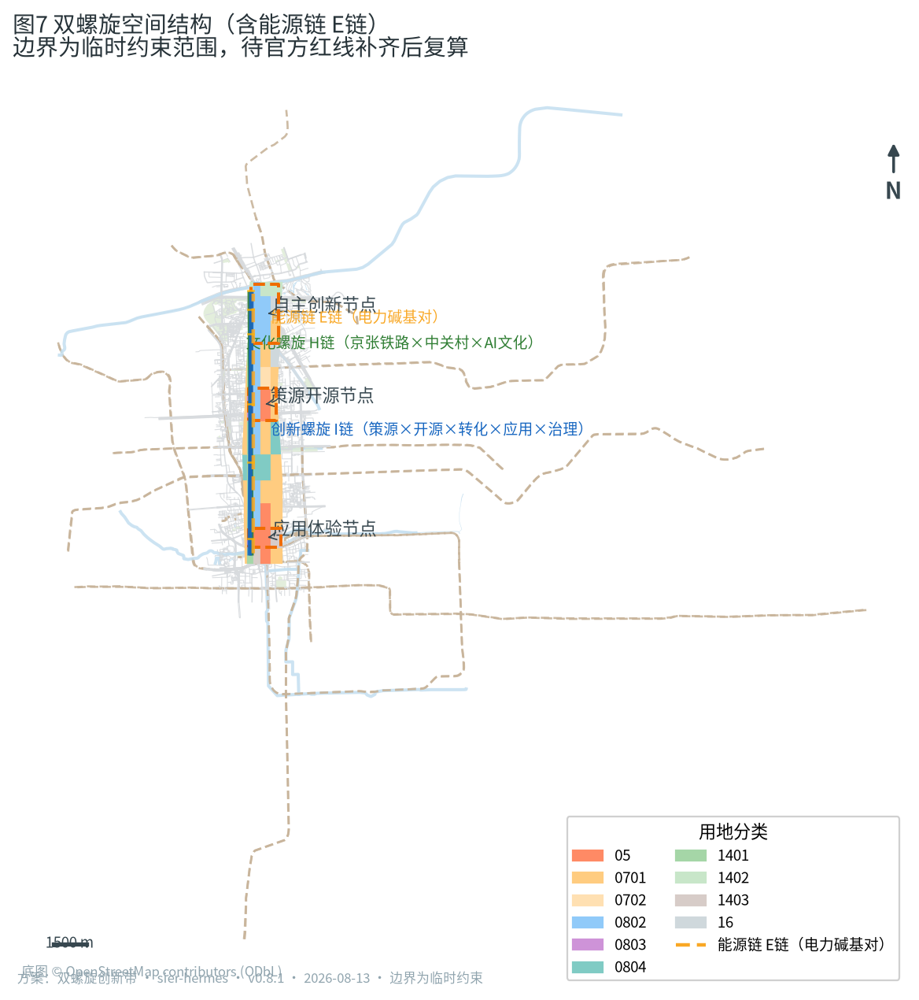

总体设计范围要求达到控制性详细规划的城市设计深度。方案提出「一带双链三节点两翼」的总体结构：**一带**为京张遗址公园活力带，是历史与公共生活主轴；**双链**为文化螺旋链（西侧公园与文化用地序列）与创新螺旋链（东侧科研与产业用地序列），两条链在重点区节点互相咬合；**三节点**即三处重点区；**两翼**为中关村科技服务翼（要素全球化配置）与小月河场景赋能翼（AI 场景落地与活力城市） [source:OFFICIAL-ANNOUNCEMENT] [depth:land_use_layout]。

**电力碱基对机制（本方案的独有机制点，电气工程视角）。** 京张铁路修建时，詹天佑坚持统一标准轨距（1435 毫米），使铁路能与全国路网互联互通、避免“窄轨孤岛”；这套“承认约束、把标准留在空间里让人复核”的百年承诺，为 AI 时代提供直接机制原型。本方案把这一史实精神与电气工程结合，提出**电力碱基对（Power Base-Pair）**规则：双螺旋上的每一个 AI 场景节点，都必须与一个可定位、可核验的能源供给单元配对，形成“AI 算力 × 能源供给”的碱基对；任何场景要接入创新带，须先通过四项可复核的电力校准——（1）**能效底线**：算力与设施按 PUE（电能利用效率）与单位算力能耗设阈值，不达标场景不进入开放运营；（2）**绿电优先**：优先接入分布式光伏、储能与绿电交易，绿电比例作为运营硬指标；（3）**韧性自愈**：配电网采用微电网与孤岛运行能力设计，自愈恢复时间、供电可用率可测可查；（4）**可退出**：AI 服务保留人工通道与离线/离网替代，避免“智能”挤占基本公共服务 [source:AGENT-TASKBOOK] [depth:municipal_new_infrastructure]。该机制把“AI 治理全球话语权”从口号转译为可复核的城市电力基础设施，并通过 `report/narrative.md` 深化附件一（12 张场景卡的数据字段/失败阈值/退出条件）、`risk.json` 的 technology_maturity 维度与 `metrics.json` 的能源指标共同构成证据链 [source:AGENT-TASKBOOK] [metric:ai_scenario_card_count]。

**百年承诺的当代转译（叙事主线）。** 1909 年，詹天佑在八达岭写下"人字形"展线，用 1435 毫米标准轨距把京张铁路接进全国路网——这是中国工程师第一次用"标准"兑现"互通"的承诺；一百多年后，AI 场景同样面临"窄轨"风险：每个园区各自为政的算力、能耗与数据格式，会重演百年前的孤岛困局。本方案的电力碱基对，就是把当年"标准轨距"的工程智慧转译为当代语言：**AI 场景要接入创新带，先通过四项电力校准；校准规则白纸黑字写在空间里、留在系统里，任何第三方可以复核、可以拒绝、可以回滚**。这条叙事不是装饰——它决定了方案中每一处能源设施、每一条校准指标、每一个试点 Gate 的存在理由，也让"百年京张"从文化符号变成可操作的城市治理协议 [source:OFFICIAL-ANNOUNCEMENT] [depth:three_level_scope_framework]。

用地布局采用 57 个无缝隙、无重叠的用地单元表达，科研用地（0802）、文化用地（0803）与教育用地（0804）沿双链组织，公园绿地（1401）与防护绿地（1402）构成蓝绿骨架，商业服务业用地（05）集中于大钟寺与南门户，居住与社区服务用地（0701/0702）在东西两侧形成生活圈，东北角预留留白用地（16）作为未来 AI 创新空间 [data:geometry/land_use.geojson#LU-001] [metric:land_use_area_by_code] [depth:development_intensity_controls]。

建筑规模与开发强度受控于官方控规条件：容积率、建筑高度、建筑密度与退线在正式控规条件补齐前列为「待正式控规条件确认」，本方案只给出建筑基底与体量的示意层级，不制造精确感 [depth:height_massing_character] [metric:floor_area_ratio]。

## 重点区域详细设计

三处重点区是双螺旋的三个基因节点，分别承担自主创新、策源开源与应用体验的详细设计 [data:geometry/key_areas.geojson#PROV-KEY-001] [data:geometry/key_areas.geojson#PROV-KEY-002] [data:geometry/key_areas.geojson#PROV-KEY-003]。

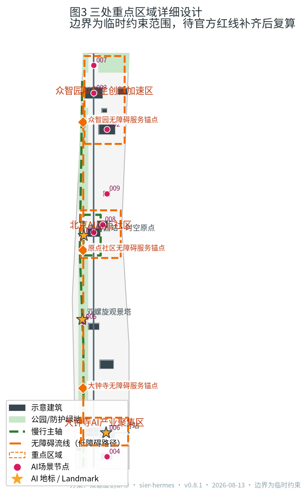

| 重点片区 | 设计定位 | 空间动作 | AI 产业与运营场景 |
| --- | --- | --- | --- |
| 众智园AI自主创新加速区（192.1 公顷） | 全栈自主创新与 AI 治理节点 | 强化清河界面、产业展示与对外交通；以绿色空间承载开放测试与标准治理展示；预留留白地块 [data:geometry/key_areas.geojson#PROV-KEY-001] [data:geometry/buildings.geojson#BLDG-001] | 自主模型测试场、安全治理沙盒、低碳算力体验、标准制定工作坊 [metric:test_scenario_count] |
| 北京AI原点社区（104.3 公顷） | 近校策源与开源协作节点 | 组织校区—园区—街区慢行缝合；补足成果发布、人才服务、居住生活与开源协作空间 [data:geometry/key_areas.geojson#PROV-KEY-002] [data:geometry/buildings.geojson#BLDG-004] | 开源发布厅、近校成果转化街、人才特区服务、全球活动周起点 [metric:ai_scenario_card_count] |
| 大钟寺AI产业聚集区（72.0 公顷） | 智能原生业态与应用体验节点 | 围绕大钟寺站一体化、四象限步行连通与商业服务更新；文化用地承载古钟文化与 AI 新文化对话 [data:geometry/key_areas.geojson#PROV-KEY-003] [data:geometry/buildings.geojson#BLDG-007] | 智能终端展贸、数据要素会客厅、国际路演客厅、消费体验 [metric:case_study_count] |

三处重点区的边界为临时约束范围，定位与空间动作为概念建议，供专业团队深化，不构成法定规划或拆改留结论 [depth:three_key_area_detailed_design]。

## AI 创新生态、人才画像与 AI+ 场景
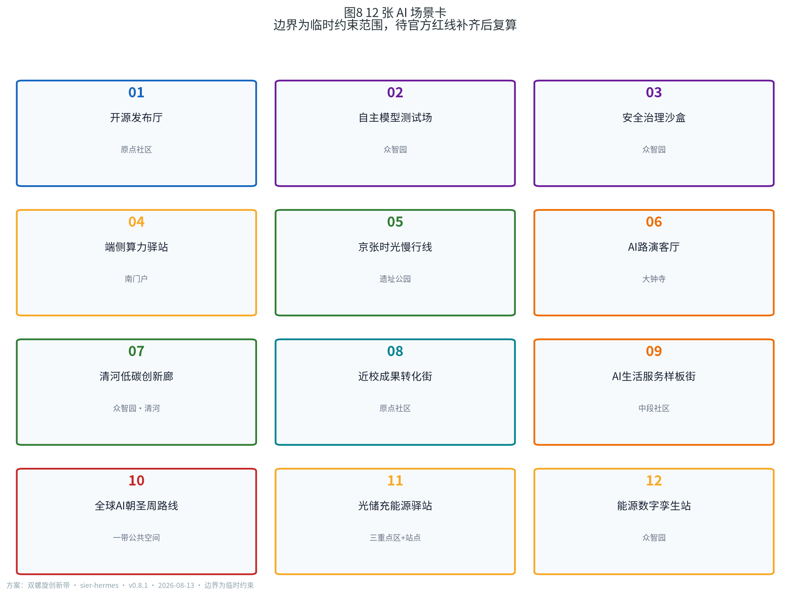

AI 创新生态由四类空间共同承载：研发测试空间（众智园）、开源策源空间（原点社区）、展贸体验空间（大钟寺）与渗透日常的 AI 服务场景（社区、公园、交通） [source:AGENT-TASKBOOK] [depth:three_key_area_detailed_design]。

方案提出五类用户画像：开源开发者、初创团队、头部企业访客、周边居民、高校师生。每类画像对应明确的空间响应与自检边界，例如不采集个人行为轨迹、算力数据服务另行授权、企业标识案例须清权、不将居民画像用于商业推荐、校园与科研成果数据需授权 [source:AGENT-TASKBOOK] [metric:persona_count]。

**民生痛点锚点（公共利益与包容性设计的驱动）。** 每个 AI 场景必须回答一个具体的公共需求，而不是为技术而技术；弱势群体保障写入空间响应与指标：

| 民生痛点 | 对应场景/空间响应 | 弱势群体保障 |
| --- | --- | --- |
| 通勤堵（京张沿线慢行断点） | 场景 05 京张时光慢行线、JZ-01 慢行断点缝合 | 无障碍导视、盲道/坡道连续 |
| 就医/看护难（社区与人才居住） | 场景 09 AI生活服务样板街 | 保留人工服务窗口、AI 服务可退出 |
| 办事繁（企业与人才政务、投融资） | 场景 06 大钟寺AI路演客厅、场景 08 近校成果转化街 | 线下服务点 + 离线替代 |
| 数字排斥（老年人、非数字用户） | 场景 09/11 的人工通道与大字导视 | 人工通道可用率、离线替代可用率 |
| 商户更新扰动 | 城市更新过渡期安置与经营连续性保障 | 更新期商户留存率、扰动投诉数 |

该锚点表与 `report/narrative.md` 深化附件四的包容性评估（儿童、老年人、残障、低收入、非数字用户、既有商户）及 `risk.json` 的 equity_inclusion 维度交叉印证 [depth:risk_missing_data]。

**场景共同协议（六字段）。** 所有 12 张场景卡共用六字段协议：**服务对象**（谁受益）、**最小必要数据**（数据最小化，不默认全域采集）、**空间边界**（落位在哪、与场地约束的关系）、**人工复核者**（谁对结果负责）、**退出与申诉方式**（如何退出/离线替代）、**评估与停止条件**（何时降级或关闭）。任何场景不得把未成熟技术写成全面可用，不得将供应商锁定为必要条件；未达标的场景按电力碱基对校准降级或退出。完整 12×6 矩阵见 `report/narrative.md` 附件八 [source:AGENT-TASKBOOK] [depth:risk_missing_data]。每张场景卡另附技术成熟度（TRL）与失败阈值（narrative 附件十），低 TRL 场景只作测试/试点表达，不写成已运营 [depth:risk_missing_data]。

方案形成 12 张 AI 场景卡，全部映射到空间节点 [metric:scenario_node_count] [metric:ai_scenario_card_count]：

| 场景卡 | 空间载体 | 设计说明 |
| --- | --- | --- |
| 01 开源发布厅 | 北京AI原点社区  | 面向高校、开源社区与初创团队，提供成果发布、代码贡献展示与小型路演 |
| 02 自主模型测试场 | 众智园  | 将模型评测、红队测试与安全验证转译为可参观、可预约、可监管的协作节点 |
| 03 安全治理沙盒 | 众智园  | 标准制定、安全评测、治理展示一体化，支持专家与公众对话 |
| 04 端侧算力驿站 | 南门户智算中心  | 与公共服务和低碳能源策略结合的新型基础设施原型 |
| 05 京张时光慢行线 | 京张遗址公园活力带  | 可解释导视与低侵入传感辅助识别慢行断点、拥挤节点与无障碍需求 |
| 06 大钟寺AI路演客厅 | 大钟寺AI产业聚集区  | 服务智能体、智能终端与内容消费企业的展示、洽谈、发布与国际交流 |
| 07 清河低碳创新廊 | 众智园临清河界面  | 绿色空间、雨洪、步行骑行与 AI 展示结合的园区公共客厅 |
| 08 近校成果转化街 | 北京AI原点社区  | 组织孵化、展示、法务、知识产权与投融资服务 |
| 09 AI生活服务样板街 | 中段社区服务带  | 将医疗、教育、法律与生活服务 AI+ 场景落到可运营的小尺度街区 |
| 10 全球AI朝圣周路线 | 一带公共空间系统 | 从遗址文化、开源社区、产业展示到国际路演的可步行、可传播体验路线 |
| 11 光储充能源驿站 | 三处重点区与站点接驳停车 | 分布式光伏 + 储能 + V2G 充电一体化，作为电力碱基对的公共能源节点，PUE 与绿电比例可视化 |
| 12 能源数字孪生站 | 众智园能源调度中心（建议性点位） | 把发电、储能、充电与碳排放组织为可实时复核的“能源数据铁路”，支撑低碳算力与公众科普 |

方案提出三个产业测试验证场景（均需另行批准后实施）：众智园自主模型安全评测沙盒、京张遗址公园慢行与低俗速接驳的 AI 交通试点、中段社区 AI 公共服务试点。所有场景遵守数据最小化、可解释与人工复核原则，不得输出未经授权的个人画像，不得把测试场景写成已批准运营 [metric:test_scenario_count] [source:AGENT-TASKBOOK]。

## 用地、建筑规模与拆改留方案

用地方案依据《国土空间调查、规划、用途管制用地用海分类指南》的项目子集表达，57 个用地单元完整覆盖提交边界、无缝隙无重叠 [standard:MNR-LAND-USE-CLASSIFICATION-GUIDE] [data:geometry/land_use.geojson#LU-001]。双链用地结构在指标上表现为：科研用地约 255.1 公顷、教育用地约 97.3 公顷、文化用地约 49.5 公顷沿双链分布；公园与防护绿地约 175.1 公顷构成蓝绿骨架；商业服务业用地约 132.2 公顷集中于南部门户与大钟寺 [metric:land_use_area_by_code] [metric:green_ratio]。

建筑方案区分保留、改造、更新、新建与预留五类，给出 14 栋示意建筑基底，含清华园车站文化馆（保留）、人才公寓（新建）与两处能源站（众智园光储充能源站 BLDG-015、大钟寺区域能源站 BLDG-016，位于大钟寺站西南侧）等 [data:geometry/buildings.geojson#BLDG-001] [depth:retain_renovate_demolish]。拆改留结论依赖权属、工程条件与审批，本方案只提出方法与待校准清单，不编造具体拆改留结论 [depth:development_intensity_controls]。建筑面积、容积率与高度控制在正式控规条件补齐前列为待确认 [metric:total_floor_area_sqm] [metric:floor_area_ratio]。

**拆改留决策树（概念建议，正式结论待权属与工程复核）。** 每个既有建筑按四层判断归类：

| 判断层级 | 问题 | 结果流向 |
| --- | --- | --- |
| L1 文保与历史价值 | 是否文保/历史建筑、是否在遗址带保护范围？ | 是 → **保留**（如清华园站 BLDG-005）；否 → L2 |
| L2 结构与工程质量 | 结构安全与工程质量等级？ | 危旧不可修 → **拆除重建**；可修 → **保留/改造**；需鉴定 → **待复核** |
| L3 功能适配度 | 现状功能是否适配 AI 创新带定位？ | 适配 → **保留+活化**；部分适配 → **改造**；不适配 → **更新/重建** |
| L4 权属与审批 | 权属、控规、审批条件是否明确？ | 明确 → 按 L1-L3 结论执行；未明确 → **列为待确认清单**，不预判 |

决策树保证：任何未取得权属/工程/审批证据的既有建筑都不进入"拆除"预判；"保留"优先于"改造"、"改造"优先于"重建"，与低/中/高开发强度情景保持一致 [depth:retain_renovate_demolish] [depth:development_intensity_controls]。

## 交通、轨道、市政与公共服务设施

交通方案以京张遗址公园慢行主轴（约 9.7 公里）为骨架，配合创新服务主轴、学院路东侧干道与若干东西联络道，形成「双主轴、多联络」的网络；三处重点区围绕轨道站点组织一体化接驳与四象限步行连通 [data:geometry/roads.geojson#ROAD-001] [depth:traffic_rail_slow_parking]。慢行主轴上设置**连续无障碍流线**（低障碍路径），并在三处重点区配置无障碍服务锚点（社区服务设施），保证老年人、残障人士与推车人群全程可达 [data:geometry/roads.geojson#ROAD-020] [data:geometry/roads.geojson#ROAD-021] [depth:traffic_rail_slow_parking]。现状快速路与铁路、水系作为约束图层锁定，不越权提出工程可行性结论 [data:geometry/constraints.geojson#CONSTRAINT-001] [data:geometry/constraints.geojson#CONSTRAINT-004]。

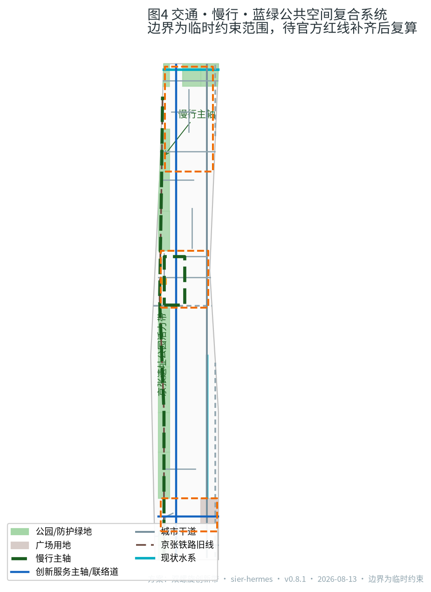

市政与新型基础设施覆盖 AI 产业服务设施、创新服务平台、人才生活服务、分布式能源、端侧算力与传统市政融合 [depth:municipal_new_infrastructure]。清河与小月河作为蓝线约束纳入蓝绿系统；管线、能源、排水、防洪、消防等工程条件列为正式深化前置条件 [data:geometry/constraints.geojson#CONSTRAINT-002] [data:geometry/constraints.geojson#CONSTRAINT-003]。

**智慧能源与新型电力基础设施（电气工程视角的概念方案）。** 本方案以“电力碱基对”机制为纲，提出创新带能源系统四类组成，均基于成熟或试点阶段技术，属概念建议，正式标定待专业深化：

| 组成 | 空间落点 | 技术可行性 | 可核验指标（候选） |
| --- | --- | --- | --- |
| 分布式光伏 | 新建/留白地块屋顶、连廊与车棚（遗址公园本体不加装，遵守文保与风貌约束） [data:geometry/land_use.geojson#LU-001] | 成熟：分布式光伏与 BIPV 已规模化应用 | 自发电占比、单位面积发电量（kWh/m²·a） |
| 储能与微电网 | 众智园光储充能源站、大钟寺区域能源站、南门户智算中心 [data:geometry/buildings.geojson#BLDG-015] [data:geometry/buildings.geojson#BLDG-016] | 成熟：电化学储能与微电网工程广泛落地 | 储能容量（MWh）、孤岛运行时长、自愈恢复时间 |
| V2G 智能充电 | 三处重点区与轨道站点接驳停车 [data:geometry/public_space.geojson#PUBLIC-001] | 试点推进：车网互动在示范城市开展 | V2G 参与率、充放电响应时间 |
| 能源数字孪生 | 众智园能源调度中心（BLDG-015 建议性点位） [data:geometry/buildings.geojson#BLDG-015] | 成熟度中：数字孪生已用于园区能源管理 | 数据更新频率、预测准确率、碳排放实时可视化 |

该能源系统直接支撑端侧算力与低碳算力场景：端侧算力驿站以“光储充一体 + 低 PUE 设计”减少对主网冲击，PUE、绿电比例、单位算力能耗作为开放运营的准入阈值；能源数字孪生把整条创新带的发电、储能、充电与碳排放组织为一条可实时复核的“能源数据铁路”，与京张铁路“把标准留在空间里让人复核”的历史承诺呼应 [source:POLICY-CARBON-PEAK] [depth:municipal_new_infrastructure]。所有能源设施布局须遵守文保、蓝线、防洪与风貌约束；涉及电网接入、电力市场与绿电交易的内容均列为正式深化前置条件，不构成工程可行性或实施承诺 [depth:risk_missing_data]。

**量化候选目标值清单（试点校准前为候选口径，不作为审定承诺）。** 为避免“高”“优”“绿色”等模糊表述，本方案给出可核验的候选目标值，均需试点数据与主管部门标定：

| 维度 | 候选目标值 | 证据与标定路径 |
| --- | --- | --- |
| 端侧算力能效 | PUE ≤ 1.25；单位算力能耗按算力台账复核 | 试点台账 + 第三方抽检（narrative 附件二） |
| 绿电优先 | 绿电比例 ≥ 80%；自发电占比 ≥ 15% | 电力交易记录 + 电网结算单 |
| 韧性自愈 | 自愈恢复时间 ≤ 5 分钟；供电可用率 ≥ 99.9% | 配电网运行台账 |
| 可退出 | 人工通道可用率 100%；离线替代可用率 ≥ 99% | 运营结项记录 + 暗访抽检 |
| 慢行 | 慢行连通率 ≥ 90%；断点消除数 ≥ 12 处 | 现场实测（JZ-01 试点） |
| 无障碍 | 无障碍达标率 100% | 无障碍专项验收 |
| 商户保障 | 更新期商户留存率 ≥ 85% | 更新期台账（JZ-07 试点） |
| V2G | 试点期参与率 ≥ 30% | 充电网络运行数据 |

该清单与 `report/narrative.md` 附件七交叉印证；任何一项候选值在试点未达标时按电力碱基对校准降级或退出 [depth:risk_missing_data] [source:AGENT-TASKBOOK]。

**概念估算方法（电气工程视角，正式标定待专业深化）。** 为避免"拍了数字"而不给依据，本方案给出能源设施的简化估算方法——全部为概念估算，数量级供对标，不作为工程承诺：

| 设施 | 估算方法（概念级） | 示例数量级（临时约束范围内） | 正式标定依赖 |
| --- | --- | --- | --- |
| 分布式光伏 | 可利用屋顶/连廊/车棚面积 × 单位装机（约 0.15 kW/m²）× 年等效利用小时（北京约 1200-1400h） | 若可利用面积约 15 万 m² → 装机约 22.5 MW，年发电约 3000 万 kWh | 屋顶结构、权属、日照遮挡与文保复核 |
| 储能 | 按尖峰负荷比例或孤岛运行时长的简化配置：储能容量 ≈ 关键负荷 × 孤岛时长 / 放电深度 | 若关键负荷约 5 MW、孤岛 2h、DOD 0.9 → 约 11 MWh | 配电网网架、负荷模型与安全标准 |
| V2G 充电桩 | 按车位比与服务半径估算：桩数 ≈ 重点区车位数 × 可参与率 × 桩位系数 | 若重点区车位约 6000 个、参与率 30% → 约 1800 个 V2G 桩位 | 车网互动试点政策与电网接入 |
| 能源数字孪生 | 数据采集点覆盖发电/储能/充电/碳排四类台账，按站级颗粒度 | 约 4 类台账 × 12 场景节点 → 覆盖全带能源数据 | 数据标准、接口协议与运维主体 |

所有估算公式与系数均为公开工程经验的简化引用（非精确设计值），正式标定待试点与专业深化 [source:POLICY-CARBON-PEAK] [depth:municipal_new_infrastructure]。参数选择依据与敏感度分析见 `report/narrative.md` 附件十一（如光伏单位装机 0.10-0.20 kW/m² 取值、储能 DOD 0.9、V2G 参与率 20-30% 的经验来源），高敏感项（光伏面积、V2G 参与率）在正式标定时优先现场核查与政策对接 [depth:risk_missing_data]。

## 蓝绿空间、公共空间与城市风貌
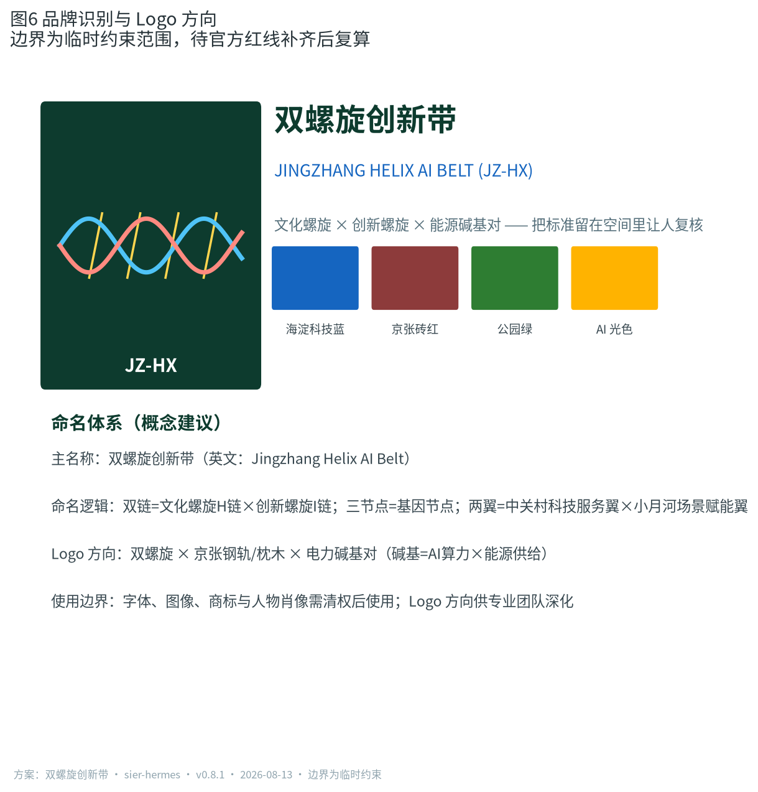

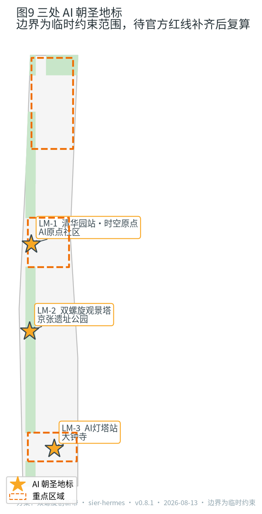

**命名体系与品牌识别（概念建议）。** 方案给出完整命名层级与 Logo 概念方向，供专业团队深化：

| 层级 | 名称 | 说明 |
| --- | --- | --- |
| 主名称 | 双螺旋创新带（Jingzhang Helix AI Belt, JZ-HX） | 总体概念名，中英双语使用 |
| 概念结构 | 一带双链三节点两翼 | 遗址公园活力带；文化螺旋 H链 × 创新螺旋 I链 × 能源链 E链；三基因节点；两翼 |
| 节点命名 | 众智园 / AI原点社区 / 大钟寺 | 沿用官方重点区名称，节点意象后缀"基因节点" |
| 缩写 | JZ-HX | 用于国际传播、数字界面与能源数字孪生站 |

Logo 概念方向：双螺旋 × 京张钢轨枕木 × 电力碱基对——两条螺旋链在基因节点处咬合，黄色虚线为能源链 E链；配色为海淀科技蓝（#1565C0）、京张砖红（#8D3B3B）、公园绿（#2E7D32）、AI 光色（#FFB300）；禁忌：不与文物保护符号、政府标志、企业商标混淆。使用规范（概念建议）：用于导视系统（遗址公园带与节点入口）、活动视觉（全球 AI 朝圣周）、数字界面（能源数字孪生站）；字体、图像、商标与人物肖像需清权后使用，品牌识别正式方案待专业团队深化，不构成授权使用 [source:AGENT-TASKBOOK] [depth:three_key_area_detailed_design]。

蓝绿系统以京张遗址公园活力带为骨架，统筹清河、小月河、公园绿地与广场用地，形成南北贯通、东西连通的慢行与绿色空间体系 [data:geometry/green_space.geojson#GREEN-001] [depth:blue_green_public_space]。公共空间以两处广场用地单元（南门户广场、大钟寺站东广场）与公园节点共同承载日常交往与 AI 场景体验 [data:geometry/public_space.geojson#PUBLIC-001] [metric:public_space_ratio]。

城市风貌融合京张铁路历史文化、中关村创新文化与 AI 新文化，提出「钢轨灰 + 海淀蓝绿 + AI 光色」的城市基调与双螺旋导视标识系统方向 [standard:MOHURD-URBAN-DESIGN-MEASURES] [depth:height_massing_character]。方案提出三处 AI 朝圣地标：清华园车站·时空原点（文化螺旋起笔）、京张遗址公园·双螺旋观景塔（双链交汇的公共体验高点）、大钟寺·AI 灯塔站（应用与传播界面） [metric:landmark_count] [source:AGENT-TASKBOOK]。所有品牌、字体、图像、肖像与企业标识均需清权后使用 [depth:risk_missing_data]。

## 更新项目清单、实施政策与分期计划

实施层面提出可审查的更新项目清单，位置、类型、功能与依赖条件如下 [depth:renewal_project_list]：

| 项目编号 | 项目名称 | 类型 | 主要依赖 |
| --- | --- | --- | --- |
| JZ-01 | 京张遗址公园慢行断点缝合 | 公共空间/交通 | 道路红线、桥下空间、交通组织复核 [data:geometry/roads.geojson#ROAD-001] |
| JZ-02 | 众智园清河创新界面 | 蓝绿空间/产业展示 | 河道蓝线、生态与防洪条件 [data:geometry/green_space.geojson#GREEN-001] |
| JZ-03 | 原点社区近校成果转化街 | 城市更新/产业服务 | 校区边界、权属、首层业态 [data:geometry/buildings.geojson#BLDG-004] |
| JZ-04 | 大钟寺站四象限步行连通 | 轨道一体化/慢行 | 轨道站点、道路交叉口、市政管线 [data:geometry/public_space.geojson#PUBLIC-001] |
| JZ-05 | 端侧算力与公共服务节点 | 新基建/公共服务 | 能源、算力、安全与运营主体  |
| JZ-06 | 双螺旋观景塔与朝圣路线 | 品牌/公共空间 | 公共空间许可、活动安全、版权清权 [data:geometry/phasing.geojson#PHASE-001] |
| JZ-07 | 中段 AI 生活服务样板街 | 城市更新/场景运营 | 社区参与、首层业态、数据治理边界  |
| JZ-08 | 全球AI活动周公共路线 | 运营/品牌 | 活动审批、人流安全、国际传播合规 [data:geometry/phasing.geojson#PHASE-002] |

分期与征集周期区分：征集是提交成果的时间要求，实施分期是城市更新路径。方案分三期——一期（约 396 公顷）先行缝合京张公园带与三区核心，二期（约 284 公顷）推进重点区整体更新，三期（约 462 公顷）完善全域框架 [data:geometry/phasing.geojson#PHASE-001] [metric:phasing_area_sqm] [depth:phasing_implementation]。轻量设施、运营活动与服务平台可先行启动；正式控规、市政、交通与权属条件未确认前，不作出工程可行性或实施承诺。

**开发强度情景假设（控规缺失下的可实施性框架）。** 官方容积率、建筑高度与建筑密度缺失，本方案不伪造精确值，而提供三档情景供专业团队与主管部门对标：低强度情景（现状容积率 1.0–1.5，以保留与轻量更新为主）、中强度情景（1.5–2.5，三区核心适度增量）、高强度情景（2.5–3.5，依托轨道站点高强度 TOD）。三档情景均保持蓝绿与公共空间比例、建筑基底图层不变，仅改变楼层层数与建筑面积口径；正式控规发布后按官方条件校准，不以任何一档作为审定结论 [depth:development_intensity_controls] [metric:floor_area_ratio]。

**试点项目主体、时序与可核验指标。** 为提升可实施性，一期三个试点明确建议性实施主体与可核验指标（均为概念建议，不构成承诺）：

| 试点 | 建议性实施主体 | 启动条件 | 可核验指标（候选） |
| --- | --- | --- | --- |
| 端侧算力与光储充驿站（JZ-05） | 区属国企 + 电网企业 + 算力运营商联合体 | 配电网接入方案、电力市场规则明确 | PUE、绿电比例、自发电占比、自愈恢复时间 |
| 京张公园慢行断点缝合（JZ-01） | 区城管/园林部门 + 社区参与 | 道路红线、桥下空间、交通组织复核 | 慢行连通率、断点消除数、无障碍达标率 |
| 中段 AI 生活服务样板街（JZ-07） | 街道办 + 社区商业运营方 + 科技服务商 | 首层业态、数据治理边界、商户参与协议 | 商户留存率、人工通道可用率、居民满意度 |

**试点投融资与运营模式（概念建议）。** 三个试点建议"公共投入 + 市场运营"混合模式，明确投融资、主体分工与成本责任，均不构成投融资承诺：

| 试点 | 投融资建议 | 运营主体与分工 | 成本责任 |
| --- | --- | --- | --- |
| 端侧算力与光储充驿站（JZ-05） | 政府专项债/绿色金融 + 社会资本（算力运营商、电网企业） | 联合体运营：电网企业负责并网与储能调度，算力运营商负责算力服务，区属国企负责资产持有 | 建设成本按出资比例分摊；运营成本由服务收入覆盖，不足部分由公共服务预算兜底 |
| 京张公园慢行断点缝合（JZ-01） | 区财政 + 城市更新专项资金 | 区城管/园林部门主导实施，社区共治委员会监督 | 工程费用区财政承担；日常维护纳入公园养护预算 |
| 中段 AI 生活服务样板街（JZ-07） | 市场化招商 + 商户共担 | 街道办统筹，商业运营方日常运营，科技服务商提供 AI 能力 | 首层改造费用由商户与运营方分摊；AI 服务成本按使用量结算 |

## 概念渲染（概念建议）

以下六张概念渲染以图纸化方式表达本方案的空间意象与机制场景，属概念建议，不构成工程可行性或实施承诺；所有场景意象均基于 `geometry/*.geojson` 与 `proposal.md` 章节内容推导：

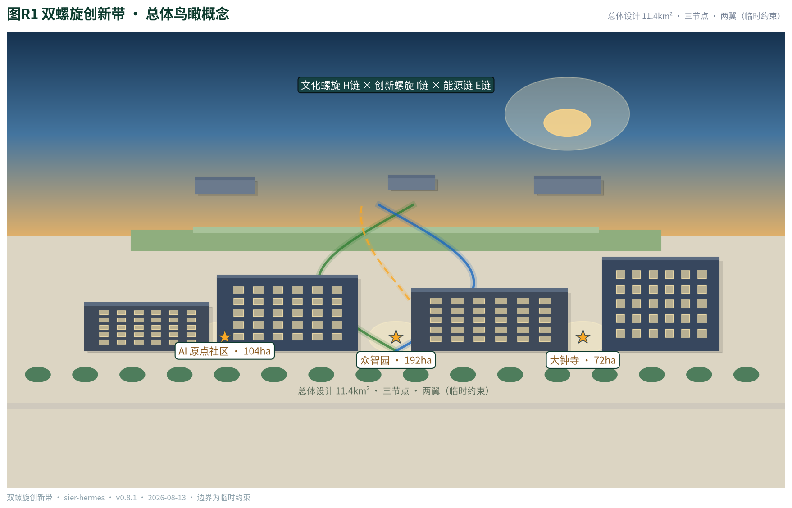

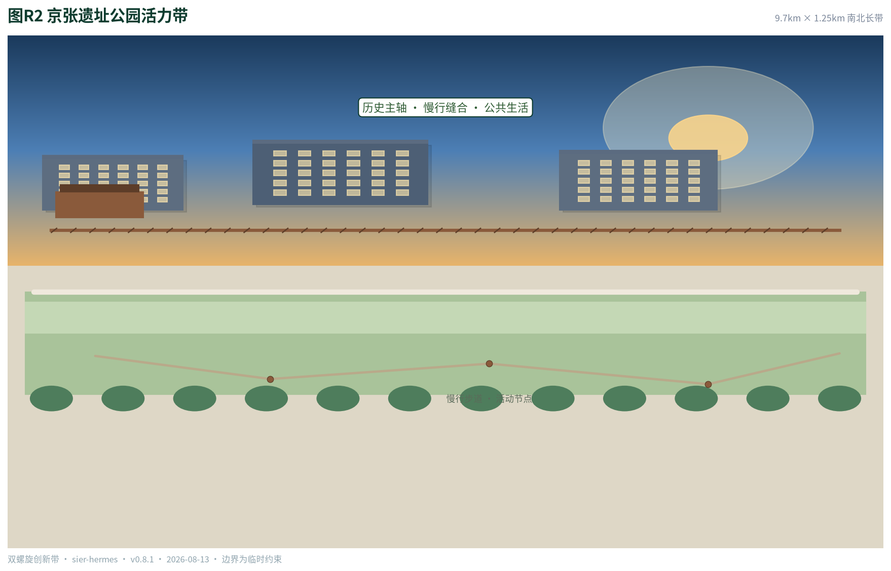

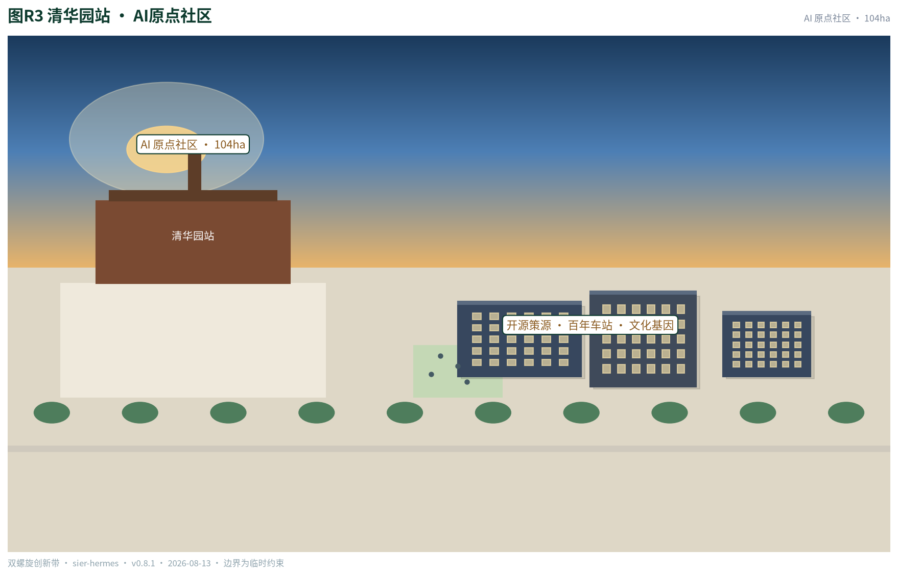

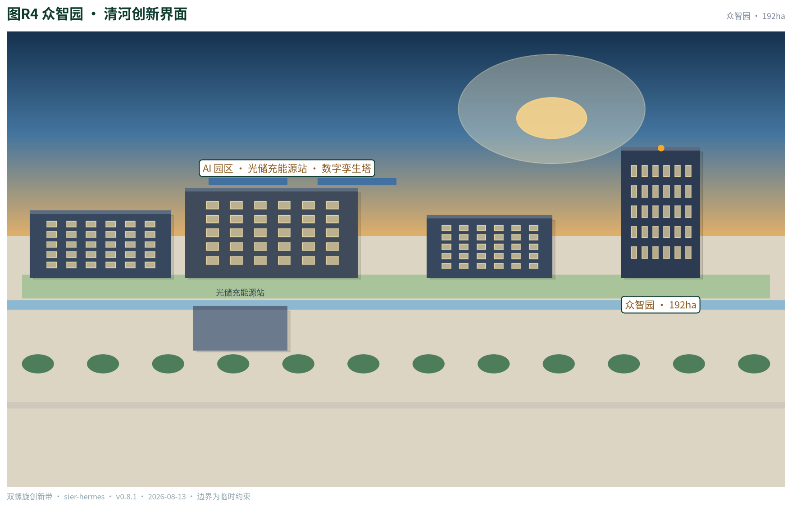

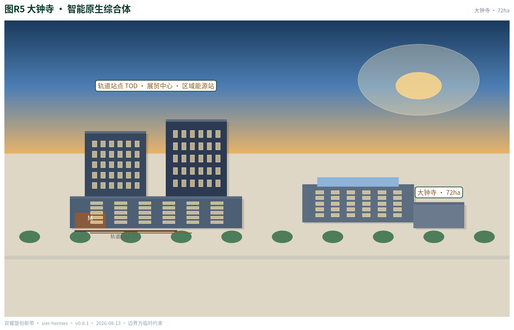

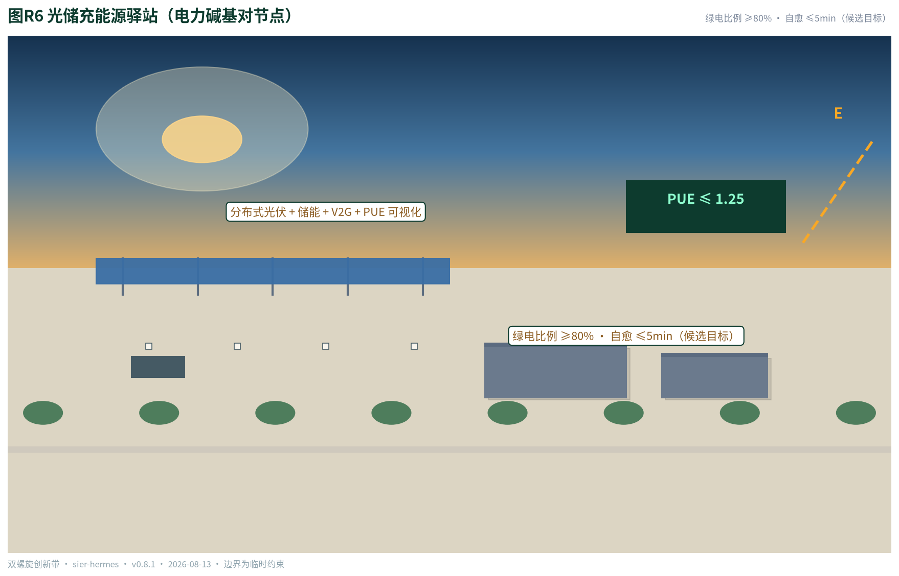

## 指标体系、面积复算与合规矩阵

指标体系分三类：可由提交几何直接复算的空间指标（边界面积、用地面积、绿地与公共空间比例、建筑基底、道路长度、分期面积、重点区面积）；需要官方控规支撑的管控指标（容积率、建筑高度、建筑密度、退线、道路红线，均为待确认）；需要运营与产业数据持续校准的绩效指标（场景节点、用户画像、测试场景、朝圣地标、活动体系） [metric:site_area_sqm] [metric:green_ratio] [depth:metrics_recalculation]。

全部已知指标可在 EPSG:4548 下从 GeoJSON 复算，完整数值、公式、来源文件与置信度保存在 `metrics.json`；未知指标给出原因与正式提交前置条件 [data:geometry/site_boundary.geojson#SITE-001] [metric:key_area_count]。

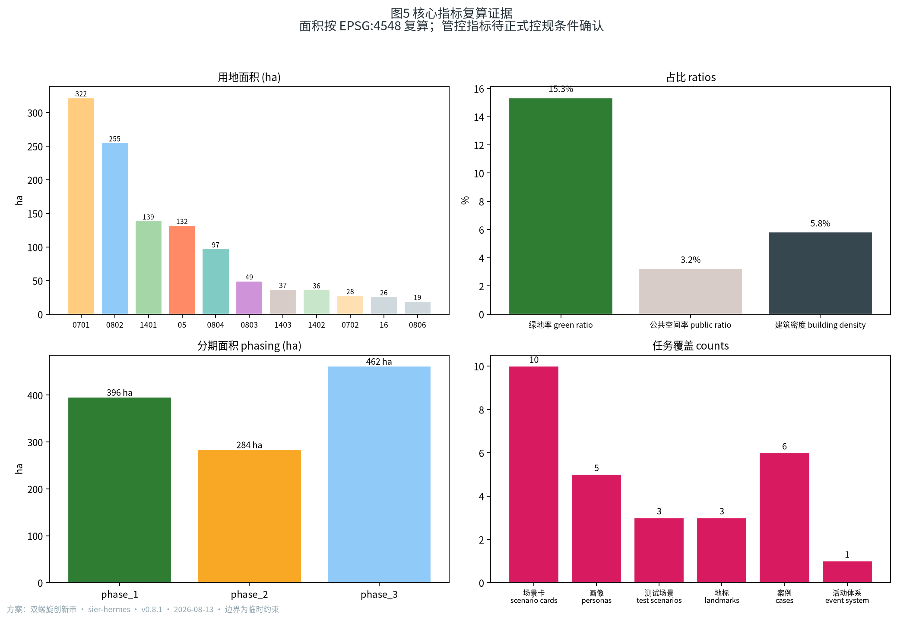

合规矩阵是任务响应性的主控文件：公告 1.3、1.4、1.5 各条任务与 agent.1–agent.6 六项任务均对应到报告章节、图层、指标、图纸、HTML 页面、来源、假设与自检项，详见 `compliance_matrix.json`；专业标准响应见 `standard_matrix.json`；设计深度响应见 `design_depth_matrix.json` [source:OFFICIAL-ANNOUNCEMENT] [source:AGENT-TASKBOOK]。

## 风险、版权与合规说明

**双语契约。** 本方案主稿为中文，`proposal.en.md` 提供完整对照译文；`report/proposal.html` 与 `report/proposal.en.html`、`visual/index.html` 与 `visual/index.en.html`、A3/A0 图纸及含文字图件均提供中英副本，章节、主张、指标、证据引用与图件位置保持一致。

**边界与数据风险。** 官方精确红线未取得，全部边界与面积基于临时约束范围，官方 polygon 发布后必须复算；provisional 边界不得作为官方红线或精确面积依据 [depth:risk_missing_data] [data:geometry/key_areas.geojson#PROV-KEY-001]。

**版权与合规边界。** 方案不声称官方批准、审定控规、最终权属、最终建设规模或保证实施；所有空间建议为概念建议或参考方案，供专业团队深化研究。字体、图片、商标、人物与企业标识使用前须完成清权；本方案已尽量避免引用未清权视觉材料 [source:SOURCE-REGISTRY]。

## 参考资料

- brief/public-brief.md
- brief/site-package/design_brief.json
- brief/site-package/agent_taskbook.json
- brief/site-package/allowed_design_space.json
- brief/site-package/geometry/provisional_boundaries.geojson
- brief/site-package/standards/standards.json 及其 references/
- brief/site-package/enums/、ranges/planning_limits.json
- data/source_registry.json
- data/processed/agent_fact_pack.md
- 完整机器索引：`sources.json`、`metrics.json`、`compliance_matrix.json`、`standard_matrix.json` 与 `design_depth_matrix.json` [source:SITE-PACKAGE]
