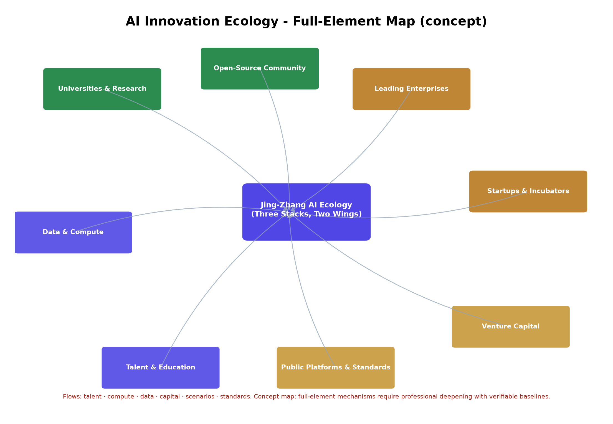
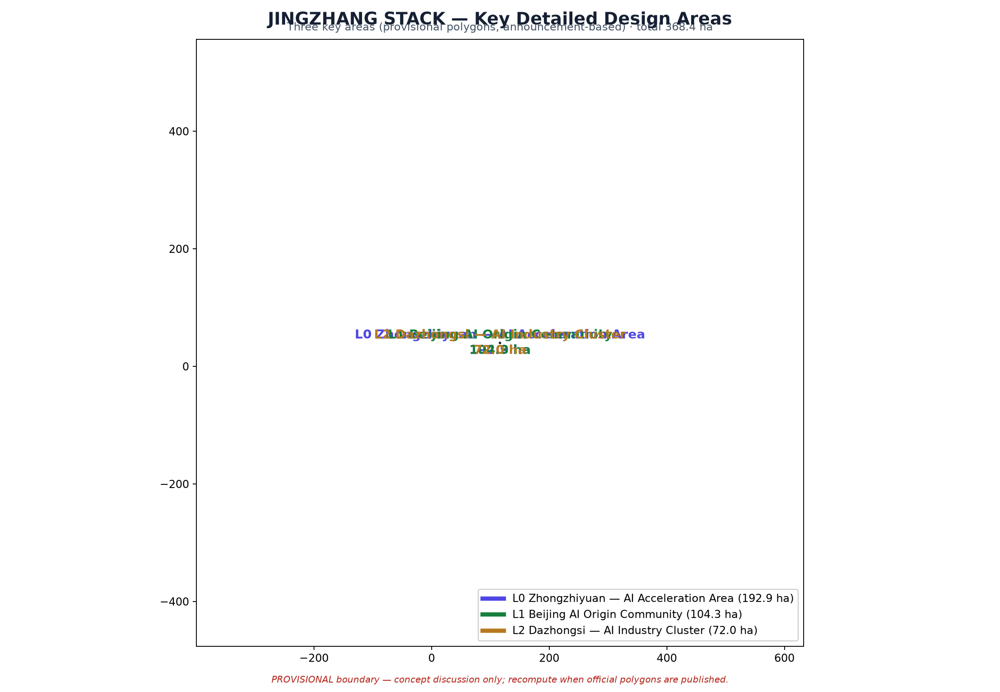
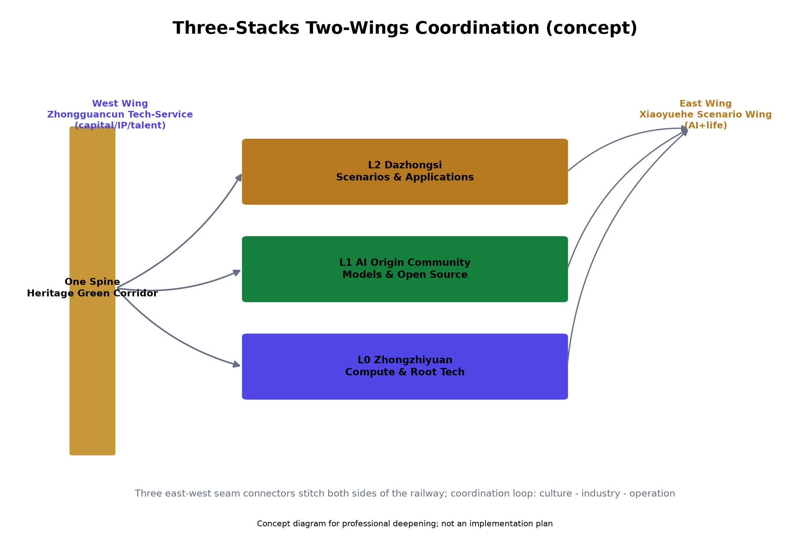
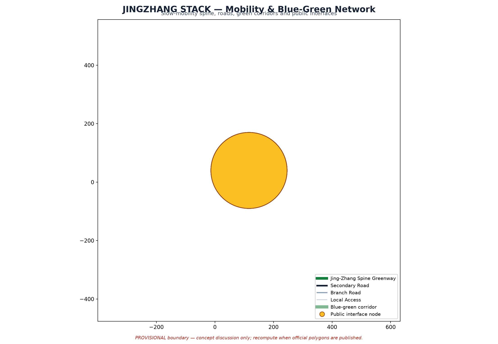

# JINGZHANG STACK: One Spine · Three Stacks · Two Wings

This is the English counterpart of the formal Chinese proposal `proposal.md`. It is a substantially equivalent translation: chapters, claims, metrics, evidence references and figure positions follow the Chinese original. Authoritative machine-readable evidence remains in the GeoJSON layers, `metrics.json`, the compliance/standard/depth matrices and the self-check result.

## Design Basis and Source Registry

The formal proposal takes the "Preliminary Qualification Announcement of the International Open Call for Urban Design of the Centennial Jing-Zhang AI Innovation Belt" (Haidian Branch, Beijing Municipal Commission of Planning and Natural Resources) as its primary basis [source:OFFICIAL-ANNOUNCEMENT] [source:AGENT-TASKBOOK]. It also uses the machine-readable brief package under `brief/site-package/` (provisional rough boundary, key areas, enumerations, metrics and source registry). All design judgements are decomposed into traceable sources, recomputable metrics, verifiable layers and human-reviewable assumptions [depth:existing_conditions_diagnosis]. Because the organizer has not yet published official redlines, the package uses a provisional boundary (`official_boundary=false`, [source:SRC-PROVISIONAL-BOUNDARIES]) and must be recomputed once official polygons are published.

## Three-Level Scope Framework

| Level | Design Question | Proposal Answer | Data Anchors |
| --- | --- | --- | --- |
| Coordinated research scope (43.6 km²) | How to organize the AI industry ecology and future urban form | Innovation chain: university strategy → open-source collaboration → enterprise incubation → public experience → international outreach; regional coordination with Haidian North, Future Science City, Huairou, E-Town and the Beijing-Tianjin-Hebei region | compliance_matrix.json, standard_matrix.json |
| Overall design scope (11.4 km²) | How to implement land use, urban renewal, mobility and image | Land use / buildings / roads / green space / public space / phasing layers; heritage park vitality belt | land_use.geojson, roads.geojson |
| Key detailed design areas (368.4 ha) | How to reach detailed design depth in three areas | L0 Zhongzhiyuan (compute & root tech), L1 AI Origin community (models & open source), L2 Dazhongsi (scenarios & applications) | key_areas.geojson |

## Coordinated Research Scope: Industry and Future City Research

The core task is building a world-class AI innovation ecology. The proposal organizes the AI innovation chain, industry chain, talent chain and city-service chain into a spatial coordination framework, serving the integrated identity of "Centennial Jing-Zhang culture belt · urban AI life experience belt · AI-integrated innovation belt" [source:AGENT-TASKBOOK] [standard:PROJECT-AGENT-OPEN-CALL-TASKBOOK]. Coordination research adds no pseudo-precise redlines; it organizes urban character, public space and building layout through the urban-design measures required by [standard:MOHURD-URBAN-DESIGN-MEASURES], anchored to [data:geometry/land_use.geojson#LU-001], [data:geometry/public_space.geojson#PUBLIC-001] and [depth:overall_spatial_structure].

### Global AI Innovation Ecology Benchmarks (6 cases)

Six global cases are used for benchmarking only (no official conclusion claimed; sources registered in `sources.json` as SRC-CASE-*):

| Case | City | Core Mechanism | Implication for Jing-Zhang |
| --- | --- | --- | --- |
| one-north | Singapore | Government-led research-industry-talent integration with a slow-mobility green network | Organization model for the L0 Zhongzhiyuan compute & root-tech stack |
| Digital Media City | Seoul | Digital-content urban renewal district + festival operations (intl. content festival) | Activity/global-communication pathway for the L2 Dazhongsi scenario stack |
| Kendall Square | Boston | MIT-driven university-industry symbiosis (lab-incubator-VC-public services) | University-adjacent commercialization for the L1 AI Origin Community |
| King's Cross | London | Railway-heritage renewal + knowledge-economy clustering + public-space operation | Heritage-innovation-public-space renewal logic for the spine green corridor |
| Hangzhou Future Sci-Tech City | Hangzhou | Low-cost startup space + open scenarios + mass-entrepreneurship events | Operating mechanisms for edge-compute stations and startup service networks |
| Nanshan High-Tech Park | Shenzhen | Leading-enterprise/SME/public-platform dense symbiosis | Industry-service complex and agent-based new businesses |

Benchmark conclusion (concept): the belt should build a perceptible three-layer synergy between "railway-heritage culture belt" and "Zhongguancun innovation source" — culture narrative (One Spine), industry organization (Three Stacks), operation and events (Two Wings and the activity week).

### Regional Coordination (concept)

The belt acts as an organic node of the Beijing innovation corridor ("one corridor, multiple nodes"): Haidian North (R&D/high-tech agglomeration, direct interface at the north end — compute/root-tech relay); Future Science City, Changping (AI safety governance and standard sandbox co-building); Huairou Science City (large-science-facility cross-research, compute stations and data-element interfaces); Beijing E-Town (intelligent-vehicle and manufacturing scenario synergy with the slow-mobility testing experience); and the Beijing-Tianjin-Hebei region (innovation activities, scenario opening and talent flows along the Jing-Zhang cultural belt). All mechanisms are concept proposals for professional deepening.

## Overall Design Scope: Urban Renewal and Regulatory-Depth Urban Design

The overall scope (11.4 km²) organizes urban renewal, land-use structure, mobility and municipal works around the Jing-Zhang heritage park vitality belt, achieving regulatory-depth urban-design quality. Land use follows the national land-use classification guide [standard:MNR-LAND-USE-CLASSIFICATION-GUIDE]; building height/massing/character are governed by [depth:height_massing_character] and retain/renovate/demolish by [depth:retain_renovate_demolish], with main evidence [data:geometry/land_use.geojson#LU-001], [data:geometry/buildings.geojson#BLDG-001] and [metric:building_footprint_area_sqm]. FAR, height, density and setbacks remain unknown where official controls are missing; no fabricated precision is introduced.

## Key Detailed Design Areas

Three key areas reach detailed-design depth (provisional polygons, announcement-based; areas recomputed in EPSG:4548):

- **L0 Zhongzhiyuan — AI Acceleration Area (192.9 ha)**: compute and root-technology stack; garden-style self-innovation district emphasizing national platforms, industrial showcase, Qinghe culture, external transport and low-carbon exchange spaces.
- **L1 Beijing AI Origin Community (104.3 ha)**: models and open-source stack; university-adjacent commercialization district emphasizing campus-origin innovation, open-source community, talent services, retain-redevelop-demolish strategy and station integration.
- **L2 Dazhongsi — AI Industry Cluster (72.0 ha)**: scenarios and applications stack; urban smart-economy district emphasizing leading enterprises, agent-based new business, commercial services, compound green-space use and four-quadrant junction connectivity.

Each key area states its industrial positioning, spatial strategy, building and public-space moves, transport interfaces and implementation risks.

## AI Innovation Ecology, Personas and AI+ Scenarios

Six persona classes are defined (open-source developers, startups, enterprise visitors, residents, university staff/students, international talents) with needs, spatial responses and self-check boundaries, e.g. no personal trajectory collection, no resident profiling for commercial recommendation, campus/research data requiring authorization.

### Scenario Card Specs (12 cards)

Each of the 12 cards is specified as an operable spec — spatial carrier with GeoJSON reference, data source, privacy boundary, human review, operating entity, failure degradation, phase and suggested KPI (concept targets only). Cards:

01 Open-Source Release Hall (PROV-KEY-002 / PUBLIC-005) · 02 Safety Governance Sandbox (PROV-KEY-001 / PUBLIC-004) · 03 Edge Compute Station (PUBLIC-001 / ROAD-001) · 04 AI Slow-Mobility Navigation (ROAD-001 / GREEN-001) · 05 Dazhongsi International Roadshow Lounge (PROV-KEY-003 / PUBLIC-006) · 06 Qinghe Low-Carbon Innovation Corridor (GREEN-002 / PUBLIC-004) · 07 University-Neighboring Commercialization Street (PROV-KEY-002 / BLDG-007) · 08 Data-Element Lounge (PROV-KEY-003 / BLDG-016) · 09 AI Life-Service Model Street (PUBLIC-003 / ROAD-005) · 10 Global AI Week Route (ROAD-001 / GREEN-001) · 11 Intelligent O&M & Public-Safety Coordination Desk (PUBLIC-001 / ROAD-003) · 12 Accessible Care Service Network (ROAD-006 / PUBLIC-002).

Governance principle: data minimization, public sources, explainability and human review. City agents may assist gap/hotspot/risk identification but never replace statutory approval, never output unauthorized personal profiles, and never claim official implementation commitments.

### Industry Test & Verification Scenarios (4)

T-01 AI slow-mobility & traffic testing corridor (ROAD-001): ≥90-day testing, recognition accuracy ≥90%, false-alarm ≤5%. T-02 City-agent service sandbox (PUBLIC-004): red-team reports, risk closure ≥95%, quarterly reviews. T-03 Low-carbon compute & public-service integration (PUBLIC-001): edge-task share ≥70%, availability ≥99.5%, ≥6-month pilot. T-04 Accessible care pilot (ROAD-006): coverage 100%, satisfaction ≥90%, ≥6-month pilot. All with data boundaries and acceptance criteria.

### Honor Showcase System (concept)

Open-source contribution wall (PUBLIC-005), milestone steles along the heritage corridor (echoing Jing-Zhang railway heritage), scenario-landing honor board (PUBLIC-006), and annual developer honors; all subject to data minimization, human review and rights clearance.

## Land Use, Building Scale and Retain/Renovate/Demolish

The land-use scheme forms a complete, closed, seamless zoning set (60 polygons, gap=0, overlap=0, 100% coverage) classified per [standard:MNR-LAND-USE-CLASSIFICATION-GUIDE]. Buildings are conceptual footprints (20, 214,843 m²) for morphology and metric discussion only — not an exhaustive building census of the 11.4 km² scope; official controls, ownership and engineering conditions remain pending in assumptions. Where FAR, height, density, setbacks or building-control lines lack official conditions, they are listed as unknown/pending rather than filled with fabricated values.

## Mobility, Rail, Municipal Works and Public Services

The proposal responds to station integration (Wudaokou, Qinghua East Road West, Dazhongsi), road micro-circulation, slow-mobility gaps, external transport, parking and green-transport requirements [depth:traffic_rail_slow_parking] [depth:municipal_new_infrastructure], anchored to [data:geometry/roads.geojson#ROAD-001], [data:geometry/public_space.geojson#PUBLIC-001] and [data:geometry/constraints.geojson#CONSTRAINTS]. With provisional boundaries, transport conclusions are temporary design discussion only. Municipal services cover AI-industry services, innovation platforms, talent life services, new infrastructure, distributed energy, edge compute and conventional facilities; missing pipelines/energy/drainage/fire/engineering data are prerequisites for formal deepening.

## Blue-Green Space, Public Space and Urban Character

The blue-green scheme is organized around the Jing-Zhang heritage park vitality belt (GREEN-001) plus the Xiaoyuehe branch (GREEN-002), proposing north-south-through, east-west-connected walking/cycling systems with slow-mobility gap identification and overpass nodes. Public space: 6 nodes (PUBLIC-001~006) including three seam connectors, Zhongzhiyuan compute plaza, AI-origin release space and Dazhongsi roadshow venue; green ratio 26.18%, public-space ratio 8.23% (recomputed, provisional).

### Public-Space Component Library (concept)

Six modular component families: rest seating & shading; smart bilingual wayfinding (incl. accessible tactile); low-carbon infrastructure (distributed energy, stormwater, ecological tree pits integrated with edge-compute stations); test & experience venues (bookable sandbox/slow-mobility/roadshow); accessibility package (wheelchair ramps, voice guide, accessible charging, linked to the care network); cultural identity nodes (railway-heritage and AI-culture symbols).

### Cultural Wayfinding System (concept)

Three-level wayfinding (regional / district / node), bilingual and accessible (tactile, voice, wheelchair-friendly) per [source:BARRIER-FREE-LAW] baseline, unified cultural symbol system derived from "One Spine · Three Stacks · Two Wings" (requires clearance), and an offline updatable content mechanism managed by park operations.

## Renewal Project List, Implementation Policy and Phasing

Six concept renewal projects (JZ-01~JZ-06) are listed by type and dependency, with three phases in `phasing.geojson`: Phase 1 near-term (Origin community + heritage spine), Phase 2 mid-term (Zhongzhiyuan compute cluster), Phase 3 far-term (Dazhongsi scenarios + two wings). FAR, height and other unknown controls are preserved as unknown. **Lightweight pilot: JZ-01 Heritage-Park Slow-Mobility Gap Stitching (concept).** Objective: stitch slow-mobility gaps along the heritage park with low disturbance and validate the minimal viable loop of AI slow-mobility navigation (Card 04) and the intelligent O&M coordination desk (Card 11). Suggested steps: (1) public data plus field survey to form a prioritized gap list anchored to [data:geometry/roads.geojson#ROAD-001]; (2) stitch 2-3 high-priority gaps first with temporary facilities (signage, lighting, accessible ramp modules); (3) deploy low-intrusion sensing and explainable wayfinding, monitoring for >=90 consecutive days; (4) evaluate against acceptance criteria (recognition accuracy >=90%, false-alarm <=5%, satisfaction >=85%); (5) if passed, incorporate into the formal renewal project library. Suggested responsible actors: park operator leads, with transport/accessibility specialists and community representatives in review (concept). Suggested timeline: initiation 0-3 months, facility deployment 3-6, monitoring 6-9, formal conversion 9-12. Start conditions: road redline, under-bridge space and traffic organization review completed; may proceed without official redlines (concept). Risk & exit: if monitoring targets are not met, revert temporary facilities and adjust the plan, reviewed by the operations committee. Concept proposal only, subject to formal conditions and approvals.

### Annual Activities and Long-Term Operation Pathway (concept)

Annual calendar framework (spring open-source developer festival at the Origin community; summer scenario open days & testing season at the sandbox; autumn international roadshow week at Dazhongsi; winter results & honors gala along the Global AI Week route). Operation pathway: events import users/demand → scenario cards become bookable services → test scenarios accumulate data/standards → mature scenarios convert to regular operation → periodic evaluation. Evaluation & exit: annual suggested KPIs; scenarios failing two consecutive cycles enter optimization/exit reviewed by an operations committee; public-fund usage follows compliance procedures. Operation funding concept: public-service input + scenario operating revenue + incubation service income. All concept proposals, no government commitments.

## Indicator System, Area Recalculation and Compliance Matrix

All metrics are recomputed from submitted geometry (EPSG:4548); see `metrics.json` for 21 metrics with formulas, confidence and provisional notes. A global `precision_declaration` states that provisional-derived metrics are concept-level only and must be recomputed after official polygons are published; count-type metrics (scenario cards, personas, landmarks, seams) retain high confidence. Task coverage: `compliance_matrix.json` covers announcement items 1.3-1.5 and agent.1-agent.6 (all complete); `standard_matrix.json` substantiates professional standards; `design_depth_matrix.json` substantiates deliverable depth.

## Risk, Copyright and Compliance

The package repeatedly discloses provisional boundaries (every figure, PDF page and HTML section), writes all spatial/activity/operation/policy proposals as concept suggestions, never fabricates official endorsements, approvals or controls, and applies data-minimization and human-review principles. `sources.json` registers 17 sources with authority level, access date and allowed/prohibited uses (SRC-ELDERLY-SMART-TECH is background_only). `assumptions.json` records pending controls (regulatory plans, road redlines, ownership, municipal, heritage, engineering). Asset-level provenance and license (COMMUNITY-DISPLAY-ONLY) are detailed in `report/copyright_statement.md`.

## References

See `sources.json` for the full registry: official announcement, agent task book, MNR land-use classification, MOHURD urban-design measures, generative-AI measures, barrier-free environment law, elderly smart-tech plan (background_only), provisional-boundary source, site package, source registry, peer proposals (not for formal) and six global benchmark cases (SRC-CASE-*).
