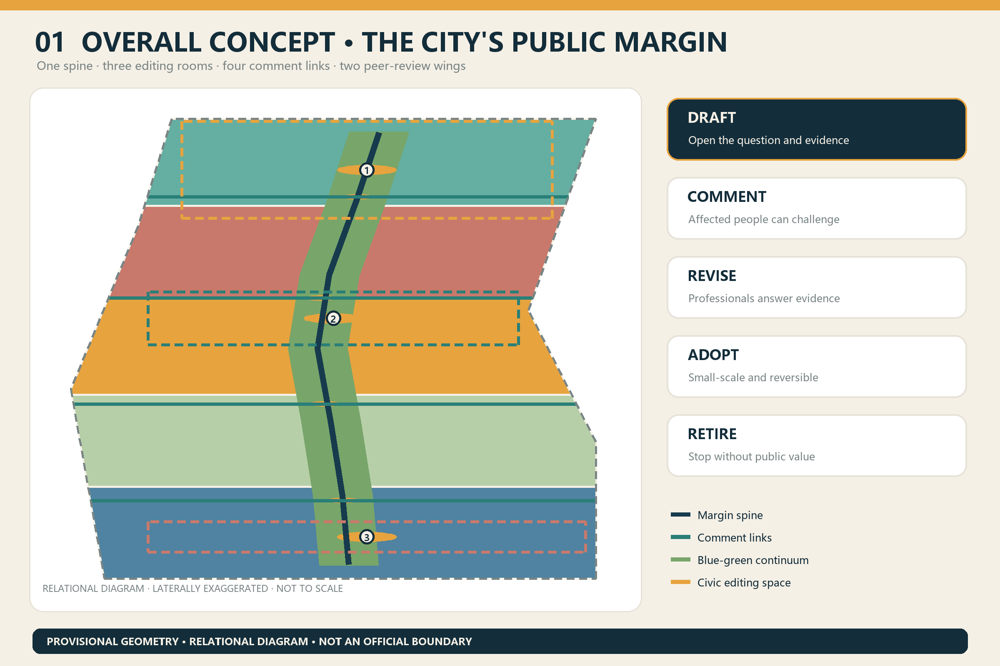
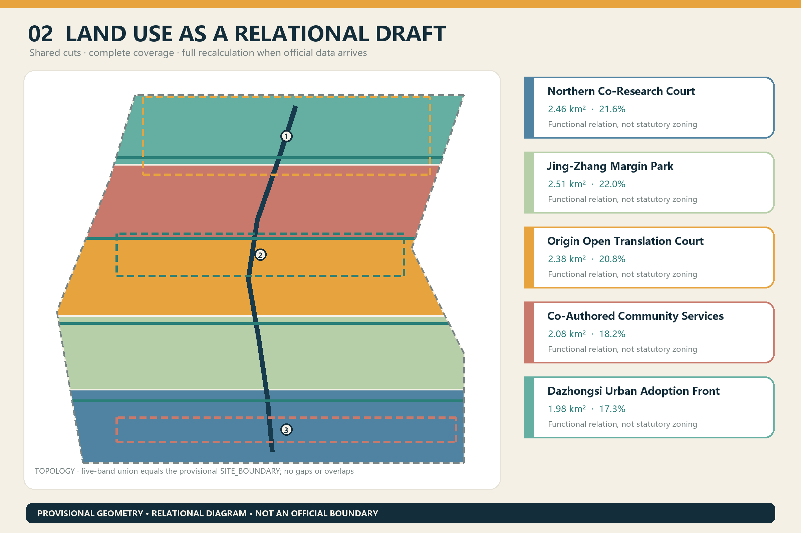
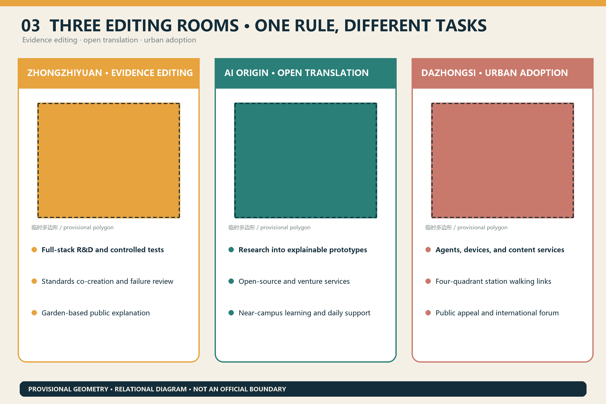
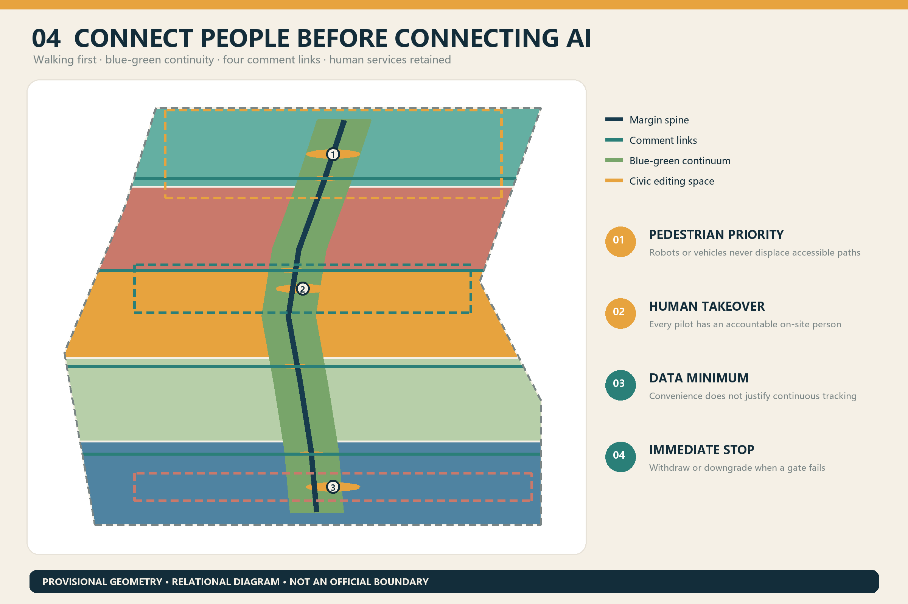
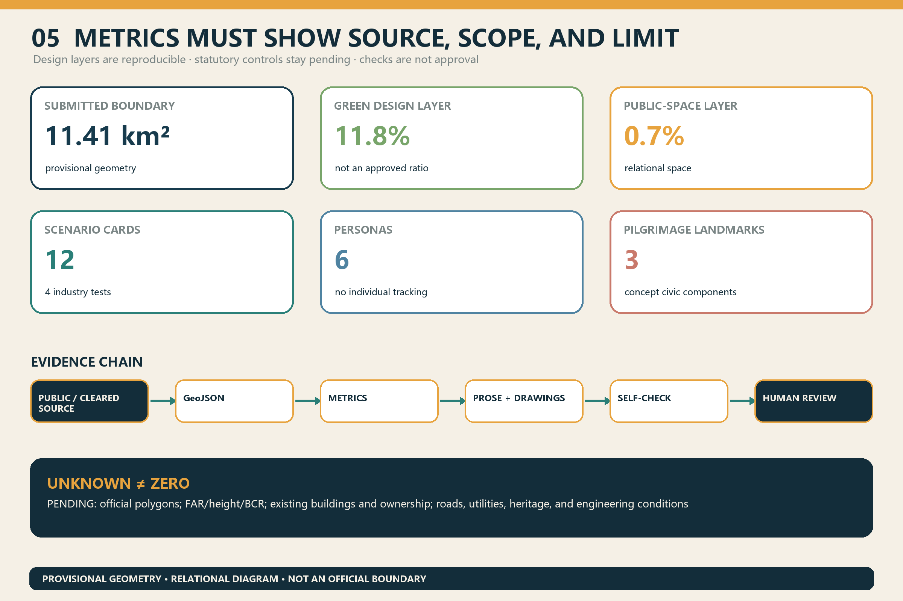

# The Co-Authored Line

**Core judgment: urban AI should not arrive as a finished manuscript. It should remain a public draft that any affected person can annotate, require to be revised, and, when necessary, withdraw.** The proposal organizes the belt as one civic margin spine, three editing rooms, four cross-margin comment links, two peer-review wings, and twelve revisable scenarios. Every spatial move is an open conceptual recommendation based on provisional geometry; none is an approved plan, government decision, investment promise, or implementation commitment.

## Design Basis and Source List

The official prequalification announcement establishes the project name, three scope levels, approximate areas, and design tasks. The rights-cleared Agent taskbook establishes the three positionings, five functions, six Agent tasks, and public-compliance boundary [source:OFFICIAL-ANNOUNCEMENT] [source:AGENT-TASKBOOK]. Local snapshots of professional standards guide urban-design language, Regulatory Detailed Planning boundaries, and land-use classification [standard:MOHURD-URBAN-DESIGN-MEASURES] [standard:MOHURD-CONTROL-DETAILED-PLANNING] [standard:MNR-LAND-USE-CLASSIFICATION-GUIDE].

Confirmed facts include the announcement's approximate 43.6 km² Coordinated Research Area, 11.4 km² Overall Design Area, and three Key-Area Detailed Design Areas. Exact official polygons, existing buildings, ownership, approved controls, road redlines, utilities, heritage controls, and engineering conditions are absent. The submitted site and key-area files therefore use repository provisional geometry only for generation, visualization, and intake checks [data:geometry/site_boundary.geojson#SITE-001] [data:geometry/key_areas.geojson#PROV-KEY-001]. The submitted boundary recalculates to about **11.41 km²** but is not an official area determination [metric:site_area_sqm].

Five international examples are used only as mechanism references. STATION F suggests program-based startup support connected to civic services and daily life; Mila combines open science, talent, adoption, and governance; Vector Institute links research, talent, and industry adoption; AI Verify Foundation organizes open testing tools and a neutral collaboration platform; Seoul AI Hub combines talent development, venture support, and community exchange. Jing-Zhang does not copy their scale or legal arrangements. It translates their shared lesson into visible interfaces for research, testing, explanation, adoption, and retirement [source:CASE-STATION-F] [source:CASE-MILA] [source:CASE-VECTOR].

## Three-Level Scope Framework

The Coordinated Research Area establishes who can co-author: universities, institutes, firms, public agencies, communities, and international peers. The Overall Design Area establishes where revision can occur: the heritage park becomes the longitudinal margin, four walking links act as comment lines, and three key areas become editing rooms. The Key-Area Detailed Design Area establishes how each revision is reviewed by pairing spatial moves with scenarios, responsibility, human review, and exit conditions [depth:three_level_scope_framework] [depth:overall_spatial_structure].

The name “The Co-Authored Line” turns the open call itself into a durable civic institution. Its identity combines open brackets, an unfinished rail line, and amber annotation points. Its verbs are **Draft / Comment / Revise / Adopt / Retire**. The proposed mark uses original geometry and rasterized system type only; it does not reuse corporate marks.

## Coordinated Research Area: Industry and Future City Research

Five configurable capabilities organize the ecosystem. Zhongzhiyuan provides evidence editing through full-stack research, testing, and governance discussion. Beijing AI Origin Community provides open translation between university research, open-source communities, venture support, and everyday learning. Dazhongsi provides urban adoption, allowing agents, devices, and content services to be understood and chosen in real commercial and civic settings. Zhongguancun Technology Services Wing provides legal, IP, finance, and international connections. Xiaoyue River Scenario Enablement Wing provides controlled testing and public experience. This responds to the three positionings and five functions without inventing company rosters, investment volumes, or policy commitments [source:AGENT-TASKBOOK] [depth:industry_future_city_strategy].

The five case mechanisms translate into five spatial types: a shared venture-service front desk, an open-science and ethics hall, an engineering room connecting research to adoption, an independent testing and standards sandbox, and a long-term platform joining talent, firms, and communities. A proposed annual public version would disclose each scenario's purpose, data, affected publics, test result, dispute, amendment, and retirement record, subject to operator and professional confirmation.

## Overall Design Area: Urban Renewal and Regulatory-Plan-Level Urban Design

The overall structure combines five topology-safe relational land-use bands, a longitudinal margin green spine, four cross-margin comment links, three public editing rooms, and three conditional phases. The land-use file covers the entire submitted polygon without gaps or overlaps; it is a functional draft, not a substitute for survey or statutory planning [data:geometry/land_use.geojson#LU-CO-01] [depth:land_use_layout]. Six conceptual building envelopes express the relationship between indoor editing and outdoor civic annotation. They make no parcel-level retain, renovate, or demolish judgment [data:geometry/buildings.geojson#BLDG-CO-01] [depth:retain_renovate_demolish].

Floor area, FAR, height, Building Coverage Ratio, road-area ratio, and setbacks remain pending official data. Conceptual footprint area can be recalculated from the submitted design layer but is neither an existing-condition nor approved-development value [metric:building_footprint_area_sqm] [depth:development_intensity_controls]. Official boundaries, existing buildings, ownership, controls, and infrastructure capacity must replace provisional inputs before the complete package is recalculated.

## Detailed Design of Key Areas

**Zhongzhiyuan Evidence Editing Room.** A garden research environment hosts controlled model and robot tests, standards co-creation, failure review, and public-readable test summaries. Blue-green links toward the Qing River remain conceptual pending flood, blue-line, ecological, and Fifth Ring Road checks [data:geometry/key_areas.geojson#PROV-KEY-001].

**AI Origin Open Translation Court.** University research, open-source code, venture services, and resident language meet at a common translation table. Research becomes an explainable prototype before small-scale trials. Low-impact ground-floor renewal, shared meeting rooms, accessible advice, and evening learning spaces remain subject to campus, ownership, and safety review [data:geometry/key_areas.geojson#PROV-KEY-002].

**Dazhongsi Urban Adoption Front.** AI-native consumption, business, and content services disclose their terms before daily use. A conceptual four-quadrant walking network, replaceable display interfaces, a civic appeal desk, and an international forum respond to the district role while rail, junction, utility, and ownership conditions remain pending [data:geometry/key_areas.geojson#PROV-KEY-003] [depth:three_key_area_detailed_design].

## AI Innovation Ecosystem, Personas, and AI+ Scenarios

Six co-author personas are addressed: researchers needing rigorous tests and attribution; startups needing affordable validation and exit; frontline operators needing maintainability and human takeover; residents needing choice, quiet, and appeal; older, disabled, and low-digital-literacy users needing accessibility and an equivalent non-AI route; and international visitors and partners needing bilingual explanation and verifiable evidence. These are design personas, not tracked individuals.

| # | Scenario card | Type / place | Co-authoring and safety gate |
|---|---|---|---|
| 01 | Public model red-team class | Industry test / Zhongzhiyuan | Cleared test data; expert release decision |
| 02 | Low-speed robot sharing trial | Industry test / controlled court | Pedestrian priority, geofence, takeover, immediate stop |
| 03 | Edge-compute and energy sandbox | Industry test / replaceable node | Measure load, noise, heat; no capacity promise |
| 04 | Generated-content provenance trial | Industry test / Dazhongsi | Synthetic status, source, and complaint entry visible together |
| 05 | Accessible walking assistant | Public service / margin spine | Data minimization; physical signs and human help retained |
| 06 | Community service explanation desk | Public service / Origin | AI explains; authorized staff complete formal service |
| 07 | Near-campus research translation table | Innovation / Origin | Record licenses, conflicts, and use boundaries |
| 08 | Enterprise service co-drafting desk | Industry / wings | Traceable advice with no mandatory vendor |
| 09 | Jing-Zhang oral-history caption kiosk | Culture / heritage park | Consent, human correction, and withdrawal |
| 10 | Public-space maintenance assistant | Operations / four links | Reports only; operators verify before action |
| 11 | Bilingual visitor guide | Communication / belt | Separate fact, concept, and pending information |
| 12 | Annual scenario revision assembly | Operations / three rooms | Publish changes, objections, renewal, or retirement |

All four testing and validation scenarios require scope, data, threshold, accountable human, stopping condition, and retrospective record. The other eight retain human alternatives and exit routes [standard:PROJECT-AGENT-OPEN-CALL-TASKBOOK] [metric:scenario_card_count] [metric:industry_test_scenario_count].

## Land Use, Building Scale, and Retain-Renovate-Demolish Strategy

Five land-use bands connect northern research, the heritage park, Origin cultural translation, community services, and southern business adoption using the official classification subset. Shared cut lines make adjacent polygons topology-safe [standard:MNR-LAND-USE-CLASSIFICATION-GUIDE] [data:geometry/land_use.geojson#LU-CO-03]. Green and public-space design layers occupy about **11.8%** and **0.7%** of the submitted provisional boundary. These are design-layer calculations, not approved statutory ratios [metric:green_ratio] [metric:public_space_ratio].

The retain-renovate-demolish gate is survey first, classification second, decision last. Heritage, safety, and use value must precede retention decisions; structure, ownership, and operating conditions precede renovation; demolition requires public necessity, lawful procedure, and alternatives; new construction requires planning, transport, utilities, fire, daylight, climate, and public review. No conceptual unit is assigned to a real ownership parcel.

## Transport, Rail, Municipal Infrastructure, and Public Services

The mobility strategy is a verification list, not a future road alignment. One longitudinal margin greenway and four east-west comment links address research access, near-campus collaboration, community sharing, and Dazhongsi station integration. All are clipped to provisional geometry, while bridge, tunnel, junction, rail, utility, and accessibility feasibility remains unverified [data:geometry/roads.geojson#ROAD-CO-01] [depth:traffic_rail_slow_parking]. Network length is reproducible but is not a construction quantity [metric:concept_mobility_length_m].

New infrastructure follows a plug-in, metered, and retireable component rule. Edge compute, sensing, charging, storage, stormwater, and information equipment must disclose accountable operators, energy and maintenance methods, data inventories, cybersecurity, and retirement procedures. Capacity and utility alignments remain pending; conventional and human services are never removed merely because an AI pilot exists [depth:municipal_new_infrastructure].

## Blue-Green Network, Public Space, and Urban Character

The heritage park is treated as a civic margin rather than a technology showroom. Rust-coloured rail traces hold memory; pale ground supports annotation and events; teal walking and stormwater interfaces stitch both sides; amber points indicate revisable content. Additions remain reversible, low-impact, and maintainable while heritage, green-line, blue-line, and safety controls are pending [standard:MOHURD-URBAN-DESIGN-MEASURES] [depth:blue_green_public_space].

Three AI pilgrimage landmarks avoid monumental spectacle. The **Century Co-Draft Wall** places railway engineering history beside AI contributions and contested revisions. The **Diff Garden** makes each proposal change publicly legible. **Revert Plaza** exhibits retired scenarios, reasons, and replacement services. The honour system credits teams, data contributors, operators, and civic annotators without implying official endorsement. The cultural arc is “build the railway—open the source—co-author the city”; professional historians must verify detailed interpretation.

## Renewal Projects, Implementation Policy, and Phasing

| Phase | Concept project | Entry condition | Exit / review |
|---|---|---|---|
| 1 Baseline | Replace provisional geometry; survey existing conditions, ownership, heritage and transport; pilot co-draft signs | Official or cleared data; named professionals | Stop and recalculate when data conflict |
| 2 Edit | Three editing rooms, four walking links, four industry tests | Planning, engineering, ethics, operations review | Downgrade or withdraw if any gate fails |
| 3 Adopt | Open twelve scenarios in batches; annual assembly; international peer review | Public evaluation and durable maintenance | Renew annually; retire without public value |

Phasing covers the submitted polygon but represents conditional task order, not a development schedule or funding promise [data:geometry/phasing.geojson#PHASE-CO-01] [depth:phasing_implementation]. Policy concepts include a public draft label for each AI service; a joint review panel including residents, developers, operators, accessibility advocates, and professionals; publication of negative results and retirement records; linkage between scenario access and maintenance responsibility; and clear communication of submitted, reviewed, selected, and implemented status.

The operating year proposes a spring problem call, summer city reading, autumn international peer review, and winter revision and retirement assembly. Developer communities maintain open issues and reproducible experiments. Public routes preserve an equivalent non-AI option. Partnership conversion requires verifiable tests and professional review rather than event traffic [depth:renewal_project_list].

## Metrics, Area Recalculation, and Compliance Matrix

EPSG:4548 calculations cover the submitted provisional boundary, relational land use, conceptual footprints, green space, public space, mobility lines, and phases. Known values describe submission design layers only. Official area values remain attributed to the announcement, while statutory and engineering metrics remain unknown. Three key areas are counted, but provisional polygon areas do not support Formal Professional Scoring [metric:key_area_count] [depth:metrics_recalculation].

The compliance matrix covers announcement sections 1.3, 1.4, and 1.5 plus Agent tasks 1–6. The standards matrix covers all mandatory standards. The design-depth matrix connects diagnosis, scope, land use, buildings, mobility, infrastructure, blue-green space, key areas, projects, phasing, recalculation, and risk to prose, drawings, geometry, metrics, sources, assumptions, and checks. A PASS means ready for content review; it does not mean excellence, approval, or constructability.

## Risk, Copyright, and Compliance

The primary risk is mistaking visual clarity in provisional geometry for official certainty. The proposal repeats the provisional status in prose, figures, HTML, sources, assumptions, and checks; official polygons trigger complete regeneration [source:BOUNDARY-SOURCE] [depth:risk_missing_data]. A second risk is capture of co-authoring by technical elites, addressed through non-AI alternatives, human takeover, dissent records, withdrawal, and annual retirement. A third risk concerns generated media, oral history, type, images, and marks; all display assets require recorded methods and rights status.

The cover is an AI-generated conceptual architectural illustration, not an existing-condition photograph or official rendering. Five figures, HTML, and PDFs are generated from the same GeoJSON and metrics. International cases use official-site text only; no external images or brand assets are copied. Planning, engineering, legal, heritage, accessibility, and data-compliance conclusions remain with qualified professionals and competent authorities.

## References

- Haidian Branch of the Beijing Municipal Commission of Planning and Natural Resources, official prequalification announcement.
- Rights-cleared Agent open-call taskbook extract.
- MOHURD, Measures for the Administration of Urban Design and Measures for Regulatory Detailed Planning.
- Ministry of Natural Resources, land-use and sea-use classification guide.
- Official websites of STATION F, Mila, Vector Institute, AI Verify Foundation, and Seoul AI Hub, background case references only.
- Complete provenance, rights, limitations, and access dates are recorded in `sources.json` [source:SOURCE-REGISTRY].
