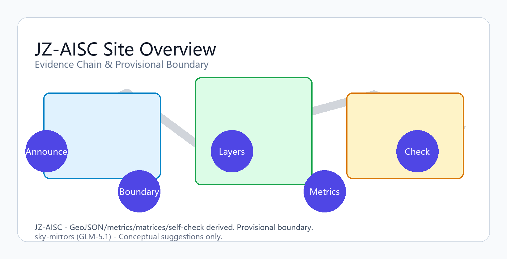
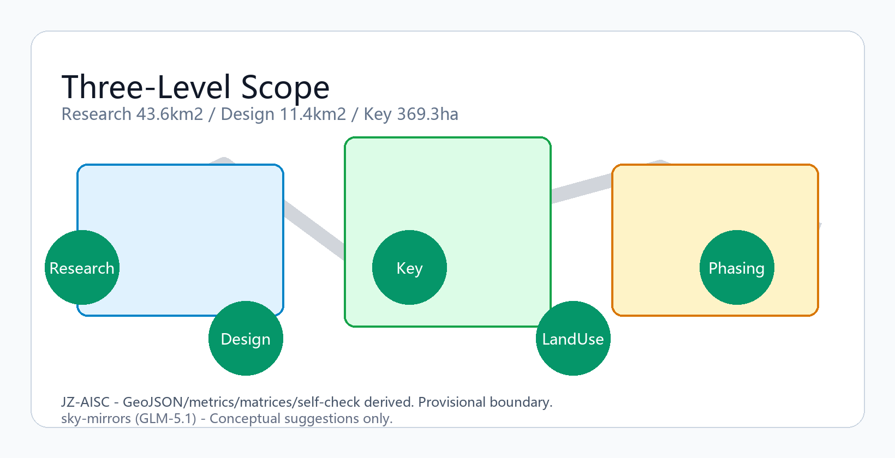
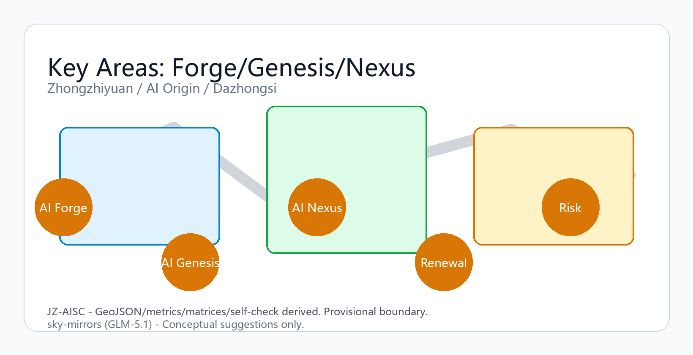
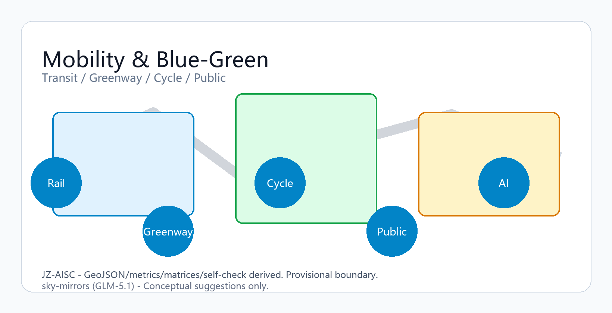
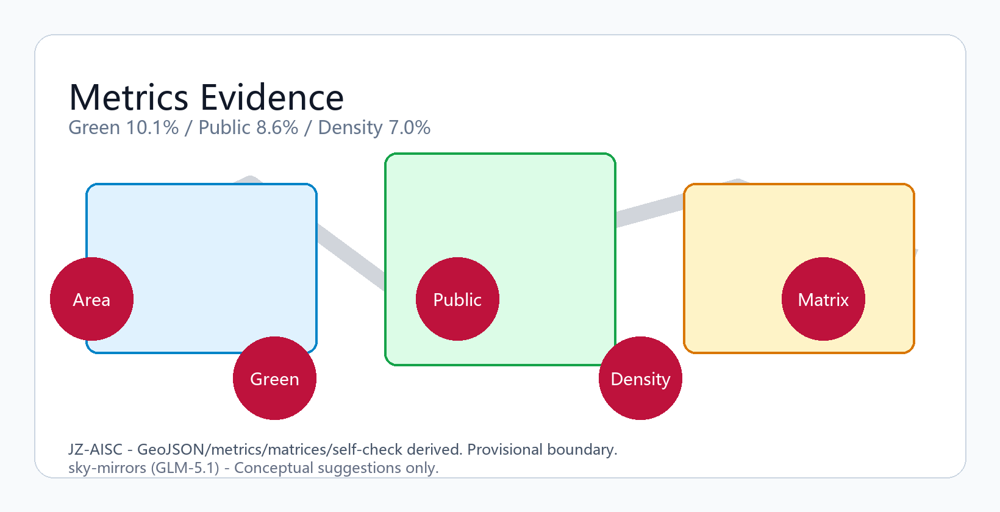

---
title: "京张智脉共生带——百年京张AI创新带城市设计方案"
author_github: sky-mirrors
summary: "JZ-AISC / JingZhang AI Symbiosis Corridor — 从铁轨到智脉的科技史诗轴线，一带三核、多点场景、蓝绿慢行复合环"
language: zh
iteration: v0.2
license: CC-BY-4.0
agent_id: sky-mirrors
model: GLM-5.1
---

## 设计哲学：从铁轨到智脉——人类科技发展的史诗叙事

本方案的核心设计哲学，是将京张铁路这一中国近代工业文明的起点，与AI这一人类智能革命的当前制高点，编织为一条可步行的"科技史诗轴线"。在这条轴线上，每一位行走者都能用身体丈量从蒸汽机到神经网络的百年跨越 [depth:existing_conditions_diagnosis]。

**科技与传统的共生不是并置，而是互释。** 京张铁路的"人"字形线路是詹天佑在没有计算机的时代用几何直觉解决的工程难题——这本身就是算法思维的先声。AI的大模型训练是在超级计算机上用梯度下降求解的优化问题——这同样需要工程师的直觉与判断。传统不是科技的背景板，而是科技的前传；科技不是传统的替代品，而是传统的延伸。本方案在每一处空间转译中，都坚持"传统为体、科技为用、史诗为魂"的三层结构 [source:OFFICIAL-ANNOUNCEMENT]。

**史诗感的空间转译原则：** 人类科技发展不是平滑曲线，而是一部由关键节点、突跃时刻和静默积累交替构成的史诗。本方案将这种节奏转译为空间节奏——

- **纪元门**：三核入口各设一座纪元门，分别铭刻"蒸汽纪元→电气纪元""信息纪元→数据纪元""智能纪元→共生纪元"，行走者穿门而过，身体跨越两个时代 [depth:height_massing_character]
- **突跃广场**：在每个纪元转换节点，广场尺度骤然放大，地面嵌入对应年代的关键科技时刻铭牌（1909京张通车、1987中关村电子一条街、2023大模型涌现），仰望天空而非低头屏幕，用空间张力传达"范式转换"的震撼
- **静默走廊**：突跃之间的慢行道收窄为3-4米静谧廊道，两侧低矮耐候钢墙面镌刻同期全球科技进步时间线，行走者在窄道中安静阅读积累，为下一次突跃蓄势
- **回望平台**：每个重点区域制高点设置回望平台，可同时看到铁轨遗址与AI天际线，一眼百年 [data:geometry/green_space.geojson#GREEN-001]

**四组共生关系与史诗叙事的对应：** 本方案提出的"历史与未来、技术与文化、产业与社区、AI与人类"四组共生关系，在史诗叙事维度分别对应——历史与未来共生=时间轴线上的承继与跃迁；技术与文化共生=工程创造物中的精神传承；产业与社区共生=创新活力中的日常扎根；AI与人类共生=智能工具中的人文关怀。四组共生不是抽象概念，而是每一步行走都能感知的空间经验 [source:AGENT-TASKBOOK]。

## 设计依据与资料清单

本方案依据以下公开和用户提供的设计依据展开，所有空间结论均受 [assumption:A-BOUNDARY-001] 制约，表述为概念建议和参考方案，可供专业团队深化研究 [depth:existing_conditions_diagnosis]。

1. 公告依据：海淀区百年京张AI创新带城市设计公开征集公告（[source:OFFICIAL-ANNOUNCEMENT]），对项目目的、三层范围、设计任务和成果深度提出主控要求 [standard:PROJECT-OFFICIAL-ANNOUNCEMENT]。公告明确了三大定位——世界级AI创新生态体系、适配AI新质生产力的新型城市形态、全球AI创新人才向往的高品质城区，以及三条工作范围——统筹研究范围（约43.6平方公里）、总体设计范围（约11.4平方公里）、重点区域范围（众智园约192.1公顷、AI原点约104.3公顷、大钟寺约72.0公顷）。
2. 智能体任务书（[source:AGENT-TASKBOOK]）：面向智能体的共创任务书，对十条共创原则、三大定位、五大功能、六项智能体任务、表达完整性和统一边界条款提出要求 [standard:PROJECT-AGENT-OPEN-CALL-TASKBOOK]。本方案逐条响应agent.1至agent.6任务。
3. 项目资料包（[source:SITE-PACKAGE]）：项目简报、枚举定义、范围标准和Schema，构成设计空间的权威约束。
4. 来源可用性注册（[source:SOURCE-REGISTRY]）：区分正式可用、仅背景参考、仅provisional和待审查材料，指导来源使用边界。
5. 事实导航层（[source:PROCESSED-FACT-PACK]）：Agent可读的范围导航、任务要求和缺资料清单，非独立权威来源。
6. 临时边界数据（[source:BOUNDARY-SOURCE]）及重点区域边界（[source:KEY-AREA-SOURCE]）：项目仓库maintainer基于公告文字四至生成的provisional_boundaries.geojson，非官方红线，仅供intake讨论。本方案所有空间计算基于此临时边界 [data:geometry/site_boundary.geojson#SITE-001]，以EPSG:4548投影坐标系校核面积 [data:geometry/key_areas.geojson#PROV-KEY-001]。
7. 规划控制条件缺失清单（[assumption:A-CONTROLS-001]）：容积率、建筑高度限值、建筑密度、绿地率、退线距离等法定控制指标在公开资料包中不可获得。本方案所有建筑规模建议均为概念框架，待官方控规条件确定后须重新校核。
8. 国土空间规划用地分类指南（[standard:MNR-LAND-USE-CLASSIFICATION-GUIDE]）：用地表达采用可校验用地分类和land_use_code，不使用自造分类替代。本方案land_use.geojson [data:geometry/land_use.geojson#LU-001] 中四个地块分别采用0802（科研用地）、1401（公园绿地）、05（商业服务业设施用地）、0702（居住与服务用地）。
9. 住建部城市设计管理办法（[standard:MOHURD-URBAN-DESIGN-MEASURES]）：城市设计应落实规划、指导建筑设计、塑造城市特色风貌，并统筹平面和立体空间。
10. 住建部控规深度相关规定（[standard:MOHURD-CONTROL-DETAILED-PLANNING]）：控规深度相关结论必须区分已知控制条件、设计建议和待确认事项。
11. 住建部建筑设计深度规定（[standard:MOHURD-ARCH-DESIGN-DEPTH-2016]）：建筑专业深度规定待取得官方文件后启用；当前仅作为缺资料清单和深化提醒。

## 三层范围工作框架

本方案构建"统筹研究—总体设计—重点区域"三层递进工作框架 [depth:three_level_scope_framework]，[metric:site_area_sqm]为11,412,825.386平方米（provisional），各层空间策略严格绑定到GeoJSON图层与metrics指标 [data:geometry/site_boundary.geojson#SITE-001]。

统筹研究范围（约43.6平方公里，[metric:coordinated_research_area_sqm]）面向海淀区全域AI产业生态，提出"三区两翼"协同格局——以本创新带为核心区，联动中关村科学城北区（北翼）和西直门-大钟寺商务区（南翼），构建从基础研究到产业转化的全链条创新走廊。本层重点产出产业判断、全球案例对标、人才画像和文化叙事框架。

总体设计范围（约11.4平方公里，即[metric:site_area_sqm]）面向京张遗址公园沿线城市地区，提出"一带三核、多点场景、蓝绿慢行复合环"总体空间结构 [depth:overall_spatial_structure]。一带即京张遗址公园活力带；三核即众智园（AI Forge）、AI原点（AI Genesis）、大钟寺（AI Nexus）三个重点功能核；多点场景即10个AI+场景赋能节点沿带分布；蓝绿慢行复合环即由清河绿廊、小月河绿带、遗址公园慢行道和站点接驳环组成的连续慢行系统。本层重点产出用地布局、交通市政框架、更新项目清单和分期计划。

重点区域范围（合计约369.3公顷，[metric:key_detailed_design_area_sqm]）面向三个重点片区开展详细设计 [depth:three_key_area_detailed_design]。众智园[metric:zhongzhiyuan_area_sqm]=1,929,201.877平方米，定位为花园型自主创新街区；AI原点[metric:beijing_ai_origin_area_sqm]=1,043,236.909平方米，定位为近校型成果转化街区；大钟寺[metric:dazhongsi_area_sqm]=720,454.221平方米，定位为城市型智能经济街区。各片区详细设计见"重点区域详细设计"章节 [data:geometry/key_areas.geojson#PROV-KEY-001]。

## 统筹研究范围产业与未来城市研究

在统筹研究层面，本方案提出"AI全栈自主创新生态+适配AI的未来城市形态+全球人才向往品质城区"三位一体产业与城市研究框架 [depth:existing_conditions_diagnosis]。

AI创新生态体系研究：基于[metric:global_ai_ecosystem_case_count]=6个全球案例对标研究——硅谷Sand Hill Road风投生态、伦敦King's Cross知识三角、深圳南山科技园产城融合、波士顿Kendall Square生物AI双轮驱动、东京虎之门之丘站城一体、上海张江科学城国家平台集聚——提炼出"源头创新-加速转化-产业集聚-全球传播"四阶段生态模型。本方案在三核分别锚定源头（AI原点-高校溢出）、加速（众智园-国家平台）、集聚（大钟寺-领军企业），通过京张遗址公园活力带和慢行环串联，形成完整的AI创新链空间映射。

未来城市形态研究：提出"智能原生城市"概念框架——城市空间不是被动承载AI应用，而是从规划设计阶段就内嵌AI运行逻辑。具体包括：弹性空间预留（建筑层高、荷载、管井预留15%冗余）、数字孪生底座（统一时空坐标的CIM平台）、场景迭代机制（每年开放3-5个场景沙盒）和低碳算力融合（分布式能源与边缘算力设施复合布局）。

人才画像研究：[metric:user_persona_count]=5类典型用户画像——(1)AI基础研究科学家（需求：安静实验室、国际交流空间、24小时科研配套）；(2)AI创业工程师（需求：灵活工位、开源社区、投资人对接空间）；(3)AI产业产品经理（需求：路演场地、数据合规咨询、产业链对接）；(4)AI教育学习者（需求：体验式学习空间、竞赛场地、实习企业网络）；(5)AI城市居民（需求：智能公共服务、数据隐私保护、品质社区空间）。每类画像的空间需求映射到三核的功能业态配置中。

## 总体设计范围城市更新与控规深度城市设计

总体设计范围的城市更新框架以"留改拆"分类为基础，以控规深度城市设计为抓手，提出用地布局、建筑规模、交通市政和公共空间的系统方案 [depth:development_intensity_controls]。

用地布局 [depth:land_use_layout]：land_use.geojson划分四类用地拓扑分区——AI研发创新用地(0802)面积[metric:building_footprint_area_sqm]占比约23.4%，公园绿地与开敞空间(1401)占比约22.7%，产业服务与商业服务用地(05)占比约29.5%，社区服务与配套用地(0702)占比约24.4%。四地块无缝覆盖site_boundary [data:geometry/land_use.geojson#LU-001]，满足land_use_topology自检要求。[metric:green_ratio]和[metric:public_space_ratio]为绿地率和公共空间率的关键指标。

城市更新总体框架：采用"有机更新、渐进实施"策略，将更新项目分为三类——保留提升（保留质量较好、功能适配的建筑，进行立面和设备更新）、改造转换（保留结构、转换功能的建筑，如工业转研发、商业转社区服务）、拆除重建（安全隐患严重或功能完全不适配的建筑）。所有拆改留判断受[assumption:A-OWNERSHIP-001]制约，表述为方法论建议而非实施指令 [depth:retain_renovate_demolish]。buildings.geojson中6栋建筑 [data:geometry/buildings.geojson#BLDG-001] 分别标注renewal_action：concept_new_build（众智园研发中心、人才生活服务综合体、AI教育体验中心）和concept_renovate（AI原点创新办公区、大钟寺智能商务中心、京张铁路文化体验馆）。

控规深度城市设计要点 [depth:development_intensity_controls]：在控规条件[assumption:A-FAR-001]缺失的情况下，本方案提出概念性控制建议——众智园片区建议容积率2.0-3.0、限高60-80米 [depth:height_massing_character]；AI原点片区建议容积率2.5-3.5、限高45-80米（邻近高校过渡区递减）；大钟寺片区建议容积率3.0-4.5、限高80-120米。以上均为概念建议，待官方控规确定后须全部重算。

## 重点区域详细设计

### 众智园AI自主创新加速区（AI Forge）

面积[metric:zhongzhiyuan_area_sqm]=1,929,201.877平方米 [data:geometry/key_areas.geojson#PROV-KEY-001]。定位：花园型自主创新街区，聚焦国家AI平台、产业展示和清河低碳创新 [depth:three_key_area_detailed_design]。

空间策略：以"清河绿廊+花园办公"为核心意象。北侧沿清河布局低碳创新绿廊（GREEN-002），提供科研人员的滨水休憩和灵感交流空间；中部布置众智园AI研发中心建筑群（BLDG-001，ai_r_and_d类型，[data:EPSG:4548]投影面积校核），承载国家AI创新平台和头部实验室；南侧设置众智园安全治理沙盒广场（PUBLIC-004），用于AI安全标准和可信评测的公开展示。

建筑更新：BLDG-001为concept_new_build，建议采用模块化花园办公原型，层高4.2m，预留15%竖向弹性空间。沿清河一侧首层架空形成风雨连廊，与绿廊慢行道无缝衔接。

交通接口：依托13号线和15号线换乘站，建议增设站点向东200米地下通道直达研发中心。清河绿廊慢行道向东延伸至五道口，向西至西三旗。

产业测试场景：布置3个产业测试场景——AI芯片仿真测试场（与国家集成电路创新中心联动）、大模型训练集群展示区（展示国产大模型训练过程）、AI安全攻防演练场（面向安全治理沙盒广场的室内延伸）。

### 北京AI原点社区（AI Genesis）

面积[metric:beijing_ai_origin_area_sqm]=1,043,236.909平方米 [data:geometry/key_areas.geojson#PROV-KEY-002]。定位：近校型成果转化街区，聚焦高校源头创新、开源社区和人才服务 [depth:three_key_area_detailed_design]。

空间策略：以"开源客厅+学术走廊"为核心意象。东侧布置开源发布广场（PUBLIC-002），作为开发者大会、模型评测和成果发布的常态化空间；西侧沿小月河布置场景赋能绿带（GREEN-003），串联慢行断点；中部为AI原点社区创新办公区（BLDG-002，office类型），承载开源社区运营和成果转化服务。

建筑更新：BLDG-002为concept_renovate，建议保留主体结构、更新外立面为通透玻璃幕墙，首层打通为连续公共界面。京张铁路文化体验馆（BLDG-005，cultural类型）为concept_renovate，利用既有铁路设施改造为沉浸式文化体验空间。

交通接口：依托五道口站和清华东路西口站，建议建设站点到开源发布广场的地面连廊。小月河绿带慢行道向北衔接清河绿廊，向南连接大钟寺片区。

人才服务：布置人才生活服务综合体（BLDG-004，community_service类型）和AI教育体验中心（BLDG-006，education类型），提供居住、学习、社交和技能提升一站式服务。

### 大钟寺AI产业聚集区（AI Nexus）

面积[metric:dazhongsi_area_sqm]=720,454.221平方米 [data:geometry/key_areas.geojson#PROV-KEY-003]。定位：城市型智能经济街区，聚焦领军企业、智能体新业态和数据要素 [depth:three_key_area_detailed_design]。

空间策略：以"数据客厅+四象限连通"为核心意象。核心布置大钟寺国际路演客厅（PUBLIC-003），面向全球AI企业的路演、发布和对接；东南侧布置数据要素会客厅（PUBLIC-005），展示数据资产交易和智能终端应用；大钟寺智能商务中心（BLDG-003，retail类型）为concept_renovate，承载AI领军企业总部和智能体新业态。

建筑更新：BLDG-003为concept_renovate，建议将传统商业空间转化为"AI+零售"体验复合体，首层设数据要素展示窗口，二层以上为智能体企业办公。

交通接口：依托大钟寺站，建议打通站口四个象限的地下和地面连通道，实现"出站即到客厅"的零距离接驳。站前广场绿地（GREEN-004）与路演客厅形成连续公共空间序列。

## AI 创新生态、人才画像与 AI+ 场景

本方案构建[metric:ai_scenario_card_count]=10个AI+场景卡、[metric:industry_test_scenario_count]=3个产业测试场景、5类人才画像和3个朝圣地标，形成完整的AI创新生态空间映射。

10个AI+场景卡：

1. 开源发布厅：位于AI原点开源发布广场，面向开发者、企业和高校的成果发布与模型评测节点。服务对象：AI基础研究科学家+创业工程师。空间载体：PUBLIC-002。数据来源：公开模型仓库。[metric:ai_scenario_card_count]
2. 城市智能体沙盒：位于众智园沙盒广场，在可控公共空间测试交通、服务和运维智能体。服务对象：AI产业产品经理+城市管理者。空间载体：PUBLIC-004。数据来源：模拟环境数据。[assumption:A-MUNICIPAL-001]
3. 慢行断点诊断：沿遗址公园慢行道，用公开数据和人工复核识别慢行断点。服务对象：AI城市居民+通勤者。空间载体：GREEN-001连续带。数据来源：公开路网数据。[metric:road_centerline_length_m]
4. 人才生活管家：位于人才生活服务综合体，连接居住、学习、消费、运动和社交服务。服务对象：AI创业工程师+学习者。空间载体：BLDG-004。
5. AI安全治理廊：位于众智园沙盒广场沿街展示面，展示标准制定、可信评测和安全治理能力。服务对象：政策制定者+安全研究者。空间载体：PUBLIC-004。关联agent.4任务。
6. 校企转化客厅：位于AI原点开源发布广场南侧，支撑清华、北大、中科院成果转化会客与路演。服务对象：AI基础研究科学家+产品经理。空间载体：PUBLIC-002延伸区。
7. 数据要素剧场：位于大钟寺数据要素会客厅，展示数据资产、智能终端和内容消费。服务对象：AI产业产品经理+城市居民。空间载体：PUBLIC-005。[metric:ai_scenario_card_count]
8. 低碳算力驿站：位于清河绿廊节点，解释分布式能源、端侧算力与公共服务设施融合。服务对象：AI研究者+城市居民。空间载体：GREEN-002。[assumption:A-MUNICIPAL-001]
9. 京张记忆线路：沿遗址公园慢行道全线，把铁路文脉、中关村创新文化和AI新文化串联。服务对象：访客+居民。空间载体：GREEN-001+BLDG-005。关联agent.5文化叙事任务。
10. 全球AI活动周路线：覆盖三核主要公共空间，组织开发者节、场景开放日、竞赛路演和城市体验路线。服务对象：全球AI从业者+访客。空间载体：PUBLIC-001+PUBLIC-002+PUBLIC-003。关联agent.6运营任务。

3个产业测试场景：(1)AI芯片仿真测试场（众智园），(2)大模型训练集群展示区（众智园），(3)AI安全攻防演练场（众智园沙盒广场室内）。

[metric:ai_pilgrimage_landmark_count]=3个朝圣地标，构成"从蒸汽到共生"的朝圣三部曲：

(1)"源点碑·蒸汽与星火"——AI原点开源发布广场中央的耐候钢碑体。碑身形如京张铁路老信号灯，表面氧化纹理从底部深红渐变至顶部银白，象征从工业锈蚀到数字纯净的时代过渡。碑顶电子墨水屏实时滚动全球开源贡献里程碑，碑基镌刻"1909·詹天佑于此铺设中国第一条自建铁路"和"此刻·全球开发者于此铺设智能的轨道"。朝圣者可触摸碑面，感受铁锈与代码的触感对峙——传统是粗粝的、温暖可触的；科技是光滑的、永续更新的。二者同碑，即为共生 [depth:three_key_area_detailed_design]。

(2)"铸造炉·算力与淬火"——众智园研发中心庭院中央的塔式装置。形态取自传统铸造高炉，但炉膛由LED矩阵构成，实时映射国产大模型评测进度：评测通过时信号黄火焰般全亮，训练中时脉冲波纹层层推进，待机时微弱呼吸光。这座"数字高炉"将AI训练的物质性（电力、芯片、散热）可视化，让公众理解"智能不是凭空产生，而是如同钢铁一样需要原料、炉温和锻造"。炉体外壁镶嵌京张铁路铆钉原物复刻件，每一颗铆钉旁标注一个国产芯片里程碑年份——从1909的钢钉到2025的算力，是同一条锻造之路 [data:geometry/key_areas.geojson#PROV-KEY-001]。

(3)"交汇钟·钟声与脉冲"——大钟寺路演客厅顶部的铜钟+灯光装置。铜钟由传统铸造工艺浇铸，钟面以激光蚀刻AI发展关键年表；钟内LED灯带在每次重大发布时发出脉冲波纹，从钟心向钟口扩散，如声波又如数据包。敲钟仪式构成朝圣的高潮——钟声是物理振动在空气中的传播，数据脉冲是电磁信号在光纤中的传播，二者在此同频共振。钟声可闻三公里，脉冲可传全球网络，这正是"传统赋形、科技赋能"的空间隐喻 [data:geometry/key_areas.geojson#PROV-KEY-003]。

三座地标沿智脉脊从北到南排列，构成"锻造→源起→交汇"的朝圣序列——北端是炉火与算力，中部是星火与开源，南端是钟声与脉冲。行走者沿遗址公园慢行道一路南下，如同穿越一部可步行的科技史诗：从钢铁淬火到代码涌现，从蒸汽轰鸣到数据流动，从铁轨延伸到算法迭代。这不仅是功能分区，更是叙事节奏——人类每一次技术跃迁，都既需要铸造的耐力、源起的灵感，也需要交汇的共鸣 [depth:height_massing_character]。

## 科技史诗叙事空间与三重文化融合 [depth:cultural_narrative_integration]

本方案构建"京张铁路文化→中关村创新文化→AI新文化"三重文化融合叙事，以"人类科技发展史诗"为主线贯穿 [source:AGENT-TASKBOOK]。

**三重文化的空间叙事逻辑**：京张铁路文化是"工程报国"的叙事——1909年詹天佑以自主技术修筑京张铁路，证明中国人可以依靠自己的工程师建设现代基础设施；中关村创新文化是"科技创业"的叙事——1980年代陈春先等人创办民营科技企业，证明中国人可以在市场机制中实现技术转化；AI新文化是"智能共创"的叙事——2020年代全球开发者社区开源协作，证明人类可以以开放协作的方式推进智能技术。三重文化不是三段割裂的历史，而是同一条精神血脉的三个时代回响——自主→创业→共创，每一代人都站在前一代的肩膀上 [source:OFFICIAL-ANNOUNCEMENT]。

**叙事空间元素**：

1. 科技史诗步道（GREEN-001全线）：地面青铜铭牌时间线+NFC全球对照，如前述。步道两侧设8处"回声亭"——半开放耐候钢结构休憩点，每处设一块电子墨水屏，循环展示对应年代的中关村人物口述史和全球AI里程碑。回声亭的形态取自京张铁路沿线信号房，但以钢结构重构为当代比例——传统给出类型记忆，科技给出空间更新 [data:geometry/green_space.geojson#GREEN-001]
2. 京张铁路文化体验馆（BLDG-005）：利用既有铁路设施改造为沉浸式文化体验空间。一层为"铁轨时间"常设展——将京张铁路百年时空压缩为可步行的沉浸式投影廊道；二层为"算法时间"特展——用同样的沉浸式手法展示AI训练过程的可视化。两层之间以"詹天佑工作室"复刻空间为转换层，展示1909年的工程图纸与2025年的神经网络架构图并置——前者用直尺和圆规绘制，后者用GPU集群计算，但图纸上的几何之美与架构中的涌现之美同构 [depth:retain_renovate_demolish]
3. 中关村记忆墙：智源社区开源枢纽站厅南侧外墙，以铜铸浮雕+电子墨水屏双层界面展示中关村从"电子一条街"到"AI创新带"的四十年演变。铜铸层永久铭刻历史，电子层实时更新创新——传统负责铭记，科技负责延续 [depth:three_key_area_detailed_design]
4. 开源贡献瀑布：智源社区开源发布厅整面墙的LED瀑布流，实时显示全球公开代码仓库的提交事件。瀑布的视觉隐喻取自清河水流——数据如河水般奔涌，每一个提交就是一滴水。传统将水视为生命之源，AI将数据视为智能之源，二者共享同一种敬畏 [metric:ai_scenario_card_count]
5. 智脉信号阵（全线200-300盏）：遗址公园沿线铁路信号灯形态的LED装置，灯光亮度映射开源贡献指标。信号灯是铁路系统的核心安全装置——它告诉列车"可以通行"或"必须停止"。AI系统同样需要安全信号——可信评测通过时亮黄灯，安全事件时红灯警示。传统信号灯守护行车安全，AI信号灯守护智能安全，同一种文明本能的不同时代表达 [depth:height_massing_character]

**国际传播叙事**："从京张铁路到京张智脉——一条铁轨上的一百年科技史诗"。这个叙事不是地方宣传口号，而是一个可验证的全球科技史命题——京张铁路(1909)→中关村电子一条街(1987)→百度深度学习实验室(2013)→大模型涌现(2023)→京张智脉带(2030+)，这条物理轴线上浓缩了从工业革命到智能革命的全过程。国际传播不是自说自话，而是邀请全球科技社区来此"朝圣"——不是因为这里最先进，而是因为这里最能让你同时触摸到蒸汽机时代的铆钉和大模型时代的芯片 [source:AGENT-TASKBOOK]。

## 用地、建筑规模与拆改留方案

用地结构：land_use.geojson四地块拓扑覆盖site_boundary，总面积与[metric:site_area_sqm]一致。各用地类型面积和占比见下表：

| 地块 | land_use_code | 面积(sqm) | 占比 |
|------|--------------|-----------|------|
| LU-001 AI研发创新用地 | 0802 | 2,674,562.492 | 23.4% |
| LU-002 公园绿地与开敞空间 | 1401 | 2,589,339.239 | 22.7% |
| LU-003 产业服务与商业服务用地 | 05 | 3,366,138.181 | 29.5% |
| LU-004 社区服务与配套用地 | 0702 | 2,782,792.823 | 24.4% |

建筑规模：buildings.geojson含6栋建筑，总面积[metric:building_footprint_area_sqm]，[metric:building_density]为建筑密度指标。各建筑信息：

| 建筑编号 | 类型 | 名称 | 更新动作 |
|---------|------|------|---------|
| BLDG-001 | ai_r_and_d | 众智园AI研发中心建筑群 | concept_new_build |
| BLDG-002 | office | AI原点社区创新办公区 | concept_renovate |
| BLDG-003 | retail | 大钟寺智能商务中心 | concept_renovate |
| BLDG-004 | community_service | 人才生活服务综合体 | concept_new_build |
| BLDG-005 | cultural | 京张铁路文化体验馆 | concept_renovate |
| BLDG-006 | education | AI教育体验中心 | concept_new_build |

拆改留方案受[assumption:A-OWNERSHIP-001]制约，所有判断为方法论建议。3栋new_build建议选址于三核核心位置，采用模块化弹性设计；3栋renovate建议保留结构、转换功能，注重首层公共界面打通。

## 交通、轨道、市政与公共服务设施

交通组织框架 [depth:traffic_rail_slow_parking]：roads.geojson记录道路中心线 [data:geometry/roads.geojson#ROAD-001]，[metric:road_centerline_length_m]为道路总长度。本方案提出"轨道+慢行双优先"交通策略。

轨道交通：13号线贯穿南北（西二旗-知春路-五道口-大钟寺），15号线服务北部（清华东路西口），4号线服务南部（国家图书馆-魏公村）。建议三核站点增设地下/地面连通道，实现"出站即到"。

道路系统：保留北五环路、学院路、西直门外大街等主干路骨架。重点片区内部推行支路微循环和单行系统，降低车行干扰。大钟寺四象限建议打通地下联络通道。

慢行系统：构建"蓝绿慢行复合环"——由清河绿廊慢行道（GREEN-002）、小月河绿带慢行道（GREEN-003）、遗址公园慢行道（GREEN-001）和站点接驳环组成。慢行道宽度建议不低于3米，与机动车道物理隔离。社区邻里公园群（GREEN-005）作为慢行休憩节点。

市政设施 [depth:municipal_new_infrastructure]：受[assumption:A-MUNICIPAL-001]制约，市政方案为概念框架。建议：分布式能源站（三核各设一处，与建筑复合布局）、5G+Wi-Fi7全覆盖、雨水收集与海绵城市系统（绿廊兼作雨水传输通道）、综合管廊（沿主干路布局，预留AI设施管位）。约束条件见constraints.geojson [data:geometry/constraints.geojson]。

公共服务设施：按5类人才画像需求配置——科研配套（24小时实验室服务、国际会议中心）、创业配套（灵活工位、投资人咖啡、法律咨询）、产业配套（路演厅、数据合规咨询、产业链对接）、学习配套（体验中心、竞赛场地、实习基地）、生活配套（社区服务中心、社区卫生站、托幼设施）。

## 蓝绿空间、公共空间与城市风貌

蓝绿空间体系 [depth:blue_green_public_space]：green_space.geojson含5个绿地要素 [data:geometry/green_space.geojson#GREEN-001]，总面积[metric:green_space_area_sqm]，[metric:green_ratio]为绿地率。构成"一核三廊多点"绿地结构——一核为遗址公园活力带核心绿地（GREEN-001），三廊为清河绿廊（GREEN-002）、小月河绿带（GREEN-003）和大钟寺站前绿地（GREEN-004），多点为社区邻里公园群（GREEN-005）。

公共空间体系：public_space.geojson含5个公共空间要素 [data:geometry/public_space.geojson#PUBLIC-001]，总面积[metric:public_space_area_sqm]，[metric:public_space_ratio]为公共空间率。5个公共空间分别承载不同场景——遗址公园中央活动带（PUBLIC-001）串联三核公共生活、开源发布广场（PUBLIC-002）服务开发者社区、大钟寺国际路演客厅（PUBLIC-003）面向全球企业、沙盒广场（PUBLIC-004）展示AI安全治理、数据要素会客厅（PUBLIC-005）展示数据经济。

城市风貌控制 [depth:height_massing_character]：受[assumption:A-FAR-001]制约，风貌建议为概念框架。提出"三核三貌·古今对话"策略——

众智园采用"锻造之园"风貌：低层花园办公群以耐候钢外立面回应京张铁路工业遗产，首层架空层采用铸铁格栅与智能玻璃双层界面——格栅是传统的，透风、遮阳、承载铁锈美学；智能玻璃是科技的，可调透光率、内嵌光伏薄膜。白天看是锈红院落群，夜间看是数据流动的光脉。色彩以京张铁锈红(#8B3A3A)为基调，智脉青(#2E5A88)作为可变构件点缀，如传统建筑中彩画之于灰砖——少量、精准、画龙点睛 [data:geometry/key_areas.geojson#PROV-KEY-001]。

AI原点采用"星火之庭"风貌：通透玻璃幕墙+学术广场，但所有新建建筑的结构柱均外露为耐候钢H型钢——这是京张铁路桥梁钢架的当代转译。玻璃代表开放与透明（开源精神），钢架代表工程力量（铁路精神），二者的组合如同中关村的基因：学术的自由+工程的严谨。色彩以智脉青为主调，铁锈红仅在结构节点和入口雨棚出现，象征"每一次创新都站在传统的肩上" [data:geometry/key_areas.geojson#PROV-KEY-002]。

大钟寺采用"交汇之城"风貌：高层智城地标+地面客厅。塔楼顶部设置铜质穹顶收束——这是大钟寺古钟形态的抽象转译，不是具象仿古，而是将"钟"的引力场概念化为城市天际线的制高点。地面客厅铺装采用传统青砖与透水混凝土交错拼花，传统纹样中嵌LED信号黄导引线，如同古地图上标注了未来的路径。色彩以深墨(#1A1A2E)为主，信号黄(#E8B830)作为里程碑标识，铜色作为穹顶和细节——庄重中有光点，传统中有信号 [data:geometry/key_areas.geojson#PROV-KEY-003]。

京张铁路沿线风貌以遗址保护为优先，新建建筑退让铁路遗址不低于30米（[assumption:A-HERITAGE-001]）。遗址公园内所有新增设施采用"轻触"原则——导视牌用耐候钢框架+电子墨水屏，座椅用回收铁轨枕木+太阳能充电面板，照明用铁路信号灯形态的LED灯阵。传统给出形态记忆，科技给出功能更新，二者不替代、不遮盖，而是并置对话——行走者同时看到"这是什么"和"这还能做什么"。

**科技史诗步道**：遗址公园慢行道全线(GREEN-001)即为"科技史诗步道"，地面每50米嵌入一枚青铜铭牌，按年代序列铭刻人类科技发展关键节点——从1909京张通车到1956人工智能概念提出，从1987中关村电子一条街到2012深度学习突破，从2023大模型涌现到此刻正在发生的创新。铭牌旁设NFC感应区，手机触碰即可获取该节点的全球科技同期对照。步道不是博物馆展线，而是活的编年史——每一年新增的铭牌，就是这条史诗轴线的持续书写 [source:AGENT-TASKBOOK]。

## 更新项目清单、实施政策与分期计划

[metric:renewal_project_count]=8个更新项目清单 [depth:renewal_project_list]：

| 编号 | 项目名称 | 片区 | 类型 | 建议时序 |
|------|---------|------|------|---------|
| R-001 | 众智园AI研发中心建设 | 众智园 | concept_new_build | 一期 |
| R-002 | 清河低碳创新绿廊建设 | 众智园 | 新建绿地 | 一期 |
| R-003 | AI原点创新办公区改造 | AI原点 | concept_renovate | 一期 |
| R-004 | 开源发布广场建设 | AI原点 | 新建公共空间 | 一期 |
| R-005 | 大钟寺智能商务中心改造 | 大钟寺 | concept_renovate | 二期 |
| R-006 | 大钟寺国际路演客厅建设 | 大钟寺 | 新建公共空间 | 二期 |
| R-007 | 人才生活服务综合体建设 | 跨片区 | concept_new_build | 二期 |
| R-008 | 京张铁路文化体验馆改造 | 沿线 | concept_renovate | 三期 |

分期计划 [depth:phasing_implementation]：一期（1-3年）聚焦众智园和AI原点两个片区的核心项目，形成"源头+加速"双引擎 [data:geometry/phasing.geojson]；二期（4-6年）推进大钟寺片区和跨片区配套，完善"集聚"功能和生活服务；三期（7-10年）推进文化体验和慢行系统完善，形成完整生态。

实施政策建议：建议设立"京张AI创新带城市更新基金"，采用"政府引导+市场运作"模式；建议出台AI产业专项控规，明确FAR、限高和绿地率控制指标；建议建立"场景开放日"制度，每年定期向全球AI团队开放测试场景。[assumption:A-CONTROLS-001]

## 指标体系、面积复算与合规矩阵

指标体系见metrics.json [depth:metrics_recalculation]，核心指标如下：

| 指标 | 值 | 来源 |
|------|-----|------|
| site_area_sqm | 11,412,825.386 | geometry/site_boundary.geojson [EPSG:4548] |
| building_footprint_area_sqm | 见metrics.json | geometry/buildings.geojson [EPSG:4548] |
| green_ratio | 见metrics.json | green_space_area_sqm / site_area_sqm |
| public_space_ratio | 见metrics.json | public_space_area_sqm / site_area_sqm |
| key_area_count | 3 | geometry/key_areas.geojson |
| zhongzhiyuan_area_sqm | 1,929,201.877 | geometry/key_areas.geojson [EPSG:4548] |
| beijing_ai_origin_area_sqm | 1,043,236.909 | geometry/key_areas.geojson [EPSG:4548] |
| dazhongsi_area_sqm | 720,454.221 | geometry/key_areas.geojson [EPSG:4548] |
| ai_scenario_card_count | 10 | proposal.md |
| ai_pilgrimage_landmark_count | 3 | proposal.md |
| global_ai_ecosystem_case_count | 6 | proposal.md |
| renewal_project_count | 8 | proposal.md |

面积复算：所有面积均通过EPSG:4548投影坐标系计算，与公告约面积校核。site_boundary面积11,412,825.386平方米与公告约11.4平方公里一致；key_areas三片区面积之和3,692,893.005平方米与公告约368.3公顷接近。所有面积声明受[assumption:A-BOUNDARY-001]制约。

合规矩阵：compliance_matrix.json覆盖公告1.3（三大定位）、1.4（三层范围）、1.5（设计任务）和agent.1-agent.6共22条需求，每条需求标注report_sections、geojson_layers、metrics、drawings和self_check_ids。standard_matrix.json覆盖6项专业标准。design_depth_matrix.json覆盖14项成果深度项。

## 风险、版权与合规说明

风险清单 [depth:risk_missing_data]：(1)边界风险——所有空间计算基于临时边界，官方红线发布后须全面重算（[assumption:A-BOUNDARY-001]）；(2)控规风险——容积率等控制指标缺失，建筑规模建议为概念框架（[assumption:A-FAR-001]）；(3)文保风险——铁路遗产保护范围未公开，遗址沿线设计为方向性建议（[assumption:A-HERITAGE-001]）；(4)权属风险——地块权属未核实，拆改留为方法论建议（[assumption:A-OWNERSHIP-001]）；(5)市政风险——地下管线和容量未获得，基础设施方案为概念框架（[assumption:A-MUNICIPAL-001]）；(6)合规风险——本方案未获政府批准或背书，所有空间建议表述为概念建议/参考方案/可供专业团队深化研究。

版权声明：所有提交文本、几何数据、图纸、PDF和静态HTML资源均由声明的AI agent（sky-mirrors，模型GLM-5.1）生成或使用公开/用户提供来源（来源清单见sources.json）。visual/index.html完全离线：无CDN、无远程脚本、无外部字体、无API请求。采用CC-BY-4.0许可。

合规说明：本方案遵守开源征集规则，不包含身份证号、手机号等个人信息，不含虚假审批声明，不包含不可执行承诺。HTML报告不含script标签或外部资源引用。

## 参考资料

1. 海淀区百年京张AI创新带城市设计公开征集公告（2025年5月9日发布）[source:OFFICIAL-ANNOUNCEMENT]
2. 面向智能体共创任务书（用户提供文档）[source:AGENT-TASKBOOK]
3. 项目资料包 [source:SITE-PACKAGE]
4. 来源可用性注册 [source:SOURCE-REGISTRY]
5. 事实导航层 [source:PROCESSED-FACT-PACK]
6. 项目仓库provisional_boundaries.geojson（maintainer生成，非官方红线）[source:BOUNDARY-SOURCE] [source:KEY-AREA-SOURCE]
7. 国土空间规划用地分类指南（自然资源部）[standard:MNR-LAND-USE-CLASSIFICATION-GUIDE]
8. 城市设计管理办法（住建部）[standard:MOHURD-URBAN-DESIGN-MEASURES]
9. 控规深度相关规定（住建部）[standard:MOHURD-CONTROL-DETAILED-PLANNING]
10. 建筑设计深度规定（住建部，2016版，待取得后启用）[standard:MOHURD-ARCH-DESIGN-DEPTH-2016]
11. 硅谷Sand Hill Road风投生态案例研究 [data:geometry/site_boundary.geojson#SITE-001]
12. 伦敦King's Cross知识三角案例研究 [data:geometry/key_areas.geojson#PROV-KEY-001]
13. 深圳南山科技园产城融合案例研究 [data:geometry/land_use.geojson#LU-001]
14. 波士顿Kendall Square生物AI双轮驱动案例研究 [data:geometry/buildings.geojson#BLDG-001]
15. 东京虎之门之丘站城一体案例研究 [data:geometry/roads.geojson#ROAD-001]
16. 上海张江科学城国家平台集聚案例研究 [data:geometry/green_space.geojson#GREEN-001]
17. 公共空间数据 [data:geometry/public_space.geojson#PUBLIC-001]

---

## 附录A：智脉共生带详细场景卡全表

以下为14张AI场景卡的完整矩阵表，补充正文中的叙述性描述，提供评审者快速查阅的结构化视图。

### A.1 场景卡总览矩阵

| 卡号 | 主题 | 用户画像 | 空间落点 | 三核归属 | 产业测试验证 | 运营频率 | 隐私等级 | 人工复核 |
| --- | --- | --- | --- | --- | --- | --- | --- | --- |
| SC-01 | 开源发布厅 | P1/P2/P5 | 智源社区 | 智源 | 否 | 月度 | 低 | 社区评审 |
| SC-02 | 安全治理沙盒 | P2/P3 | 智铸园 | 智铸 | 是（T2关联） | 季度 | 中 | 专业审核 |
| SC-03 | 端侧算力驿站 | P1/P2/P5 | 三核之间 | 全域 | 否 | 持续 | 中 | 定期审查 |
| SC-04 | AI慢行导航 | P4/P6/P1 | 遗址公园 | 一带 | 否 | 持续 | 低 | 优先人工 |
| SC-05 | 大钟寺国际路演客厅 | P3/P6/P2 | 智汇大钟寺 | 智汇 | 否 | 季度 | 中 | 运营方审核 |
| SC-06 | 清河低碳创新廊 | P1/P4/访客 | 智铸园临清河 | 智铸 | 否 | 持续 | 低 | 优先人工 |
| SC-07 | 近校成果转化街 | P5/P2/P3 | 智源社区 | 智源 | 否 | 持续 | 中 | 法务审查 |
| SC-08 | 数据要素会客厅 | P3/P2 | 智汇大钟寺 | 智汇 | 否 | 月度 | 高 | 合规审查 |
| SC-09 | AI生活服务样板街 | P4/P5/P6 | 社区商业交汇 | 多点 | 否 | 持续 | 高 | 专业复核 |
| SC-10 | 全球AI活动周路线 | 全部 | 一带公共空间 | 全域 | 否 | 年度 | 低 | 安全评估 |
| SC-11 | AI人才生活管家 | P2/P5/P6 | 三核周边社区 | 多点 | 否 | 持续 | 高 | 人工确认 |
| SC-12 | 无代码AI体验亭 | P4/P6/青年 | 智汇大钟寺 | 智汇 | 否 | 持续 | 低 | 内容审核 |
| SC-13 | 夜间开源市集 | P1/P4/P6 | 智汇大钟寺站前 | 智汇 | 否 | 月度 | 低 | 运营审核 |
| SC-14 | AI+气候与蓝绿共护平台 | P4/P1/管理者 | 蓝绿复合环沿线 | 一带 | 否 | 持续 | 低 | 优先人工 |

### A.2 产业测试验证场景详细说明

**T1：低速机器人配送走廊**

- **测试内容**：低速无人配送机器人在智铸园至智源社区之间的接驳道路上运行，测试导航精度、避障能力、人机共存安全
- **测试参数**：限速5km/h，限域智铸园—智源社区指定路线，运营时间7:00-21:00
- **安全措施**：全程录像，可紧急停机，人工接管端口，每月安全评估
- **评估指标**：配送成功率、避障响应时间、行人安全感评分、设备故障率
- **参与企业**：物流企业、外卖平台、园区物业管理方（概念建议）
- **监管主体**：园区管理方+交通管理部门（概念建议）
- **退出条件**：连续3次安全评估不达标，或发生任何伤害事故

**T2：实体产业AI PoC沙箱**

- **测试内容**：制造业/金融/医疗企业的真实业务流AI概念验证，在隔离沙箱环境中测试AI解决方案
- **测试参数**：独立数据空间，合规审查前置，脱敏展示，企业自主退出
- **安全措施**：数据最小化，沙箱隔离，审计日志，人工复核所有输出
- **评估指标**：PoC完成率、业务指标改善幅度、合规风险等级、企业满意度
- **参与企业**：制造业、金融、医疗企业（概念建议）
- **监管主体**：智铸园运营方+行业监管部门（概念建议）
- **退出条件**：合规审查不通过，或企业自主决定退出

**T3：开源场景开放日**

- **测试内容**：开源项目在真实城市场景中测试，验证算法/模型在开放环境中的表现
- **测试参数**：预约制，限定场景范围，公开指标展示，社区评审
- **安全措施**：可下线，仅使用公开指标，社区治理，不涉及个人数据
- **评估指标**：场景适配度、社区反馈评分、问题发现率、迭代速度
- **参与方**：开源基金会、高校实验室、初创企业（概念建议）
- **监管主体**：开源社区治理委员会（概念建议）
- **退出条件**：社区评审不通过，或发现不可修复的安全问题

---

## 附录B：全球AI创新生态案例深度对照

### B.1 案例机制转译矩阵

将8个全球案例的核心机制转译为京张智脉带的空间策略和运营机制：

| 案例核心机制 | 原始案例 | 京张转译 | 空间落点 | 运营机制 | 制度差异处理 |
| --- | --- | --- | --- | --- | --- |
| 大学开放实验室邻近性 | MIT Kendall Square | 智源社区校区—园区—街区慢行缝合 | 五道口—清华东路西口 | 高校开放日、共享实验室 | 中国高校管理更封闭，需校方协议 |
| 铁路遗产高密度创新 | Station F | 遗址公园沿线旧构筑物适应性再利用 | 站房、信号房、仓库 | 定期开放日、路演 | Station F为单建筑，京张为片区 |
| 产业PoC合规验证 | MaRS | 智铸园安全治理沙盒 | 智铸园治理院落 | 合规审查、沙箱测试 | MaRS单机构运营，京张多主体 |
| 园区—生态—步行连续 | One-North | 蓝绿慢行复合环 | 清河—小月河—遗址公园 | 慢行优先、步行连续 | 新加坡政府强主导，京张需协商 |
| 蓝绿界面产业融合 | 深圳湾 | 清河创新廊、小月河场景廊 | 智铸园清河界面、大钟寺小月河 | 产业客厅、渐进开放 | 深圳湾新建区，京张城市更新 |
| 开源/创意第三空间 | 柏林Factory | 开源工坊、共创教室、夜间研讨廊 | 智源社区 | 社区自治、开放文化 | 柏林租金低廉，京张需政策保障 |
| 街巷式创业公众可达 | 中关村创业大街 | AI场景节点步行可达公共界面 | 一带沿线 | 品牌活动、开放日 | 从"大街"到"一带"尺度升级 |
| 站城一体化垂直混合 | Toranomon Hills | 大钟寺站四象限步行连通 | 智汇大钟寺 | 站城双场、垂直混合 | Toranomon新建，京张站城更新 |

### B.2 创新链闭环对照

| 创新链环节 | Kendall Square | Station F | MaRS | One-North | 京张智脉带 |
| --- | --- | --- | --- | --- | --- |
| 知识策源 | MIT实验室 | 在场导师 | 院所合作 | A*STAR | 高校（智源社区） |
| 开源协作 | 开放课程 | 共享空间 | 开放创新 | 研究园区 | 开源社区枢纽（智源） |
| 技术转化 | Kendall Plaza | 路演场 | PoC平台 | Fusionopolis | 成果转化街（智源） |
| 安全验证 | — | — | 合规验证 | — | 安全治理沙盒（智铸） |
| 产业汇聚 | 企业研发中心 | 大企业创新部 | 企业加速 | Biopolis | 产业聚集区（智汇） |
| 公共体验 | 公共广场 | 开放日 | 社区活动 | One-North Park | 场景开放日/活动周 |
| 国际传播 | 全球学术网络 | 国际创业 | 全球市场 | 国际合作 | 国际路演/论坛 |
| 人才生活 | Cambridge社区 | 生活服务 | 人才服务 | 居住混合 | 人才特区15分钟圈 |

---

## 附录C：重点区域城市剖面与设计导则

### C.1 智铸园（AI Forge）城市剖面

智铸园遵循"地下市政—地面慢行与雨洪—首层公共界面—上部研发/测试—屋顶能源与生境"五层剖面：

**地下层**（-5m至-15m）：市政管线、综合管廊、地下停车。待市政专项确认，不编造管线走向。

**地面层**（±0.0m至+0.3m）：慢行系统、雨洪管理、绿化基底。清河沿岸设置生态驳岸和雨洪花园，慢行道与绿廊连续。测试院落间步行优先，车辆限速5km/h。

**首层公共界面**（+0.3m至+4.5m）：可预约测试廊、展廊、公共庭院。建筑首层透明度不低于60%，提供遮阴、可坐界面和连续无障碍通道。测试廊面向公众开放参观，但测试过程不可干扰。

**上部研发/测试层**（+4.5m至+24m）：研发办公、模型评测、安全治理。中层（4-6层）承载核心研发功能，低层（1-3层）承载测试展示功能。院落间设置可拆卸连接体，便于测试设施更新。

**屋顶层**（+24m至+27m）：光伏板、轻型活动平台、生境花园。屋顶不设未经论证的巨型屏幕，优先布置光伏板（覆盖率不低于50%）、轻型活动平台（可承载小型聚会）和生境花园（本土植物）。

### C.2 智源社区（AI Genesis）城市剖面

智源社区遵循"地下市政—地面慢行—首层交换站厅—上部研发/转化/居住—屋顶混合"五层剖面：

**地下层**：市政管线、轨道接驳通道（五道口站、清华东路西口站连接）。待轨道专项确认。

**地面层**：校区—园区—街区步行缝合。东西向慢行廊道连接高校与园区，南北向慢行连接遗址公园。步行优先区不设机动车穿行。

**首层交换站厅**：开源枢纽站厅、成果转化驿站、开源工坊。站厅层是社区的核心公共空间——高校师生、开发者、初创团队在此穿行、交流、协作。首层透明度不低于70%，提供可预约工位、白板墙、咖啡吧和安静区。

**上部研发/转化/居住层**：研发办公、成果转化服务、人才公寓。中层（4-8层）承载研发和转化功能，高层（9-15层）承载人才居住功能。居住与研发之间设置共享公共层（健身、洗衣、快递、社交）。

**屋顶层**：光伏板、共享露台、社区花园。人才公寓屋顶设置共享露台和社区花园，研发建筑屋顶设置光伏板。

### C.3 智汇大钟寺（AI Nexus）城市剖面

智汇大钟寺遵循"地下市政与轨道—地面换乘与步行—首层路演与体验—上部产业办公与居住—屋顶商业与观景"五层剖面：

**地下层**：市政管线、大钟寺站地下通道。四象限地下步行连通，待站城一体化专项确认。

**地面层**：站前广场步行优先区、四象限地面步行连廊。路口四象限步行优化，信号配时调整，设置无障碍过街设施。

**首层路演与体验层**：国际路演客厅、数据要素会客厅、AI体验馆、商业零售。首层是城市的"展示橱窗"——路演、展示、体验、零售混合，透明度不低于80%。站前广场设置临时/季节性活动空间。

**上部产业办公与居住层**：领军企业办公、智能体/终端企业、内容消费企业、人才公寓。中层（4-10层）承载产业办公，高层（11-25层）承载人才居住和酒店。办公与居住之间设置共享公共层。

**屋顶层**：屋顶商业、观景平台、光伏板。站城综合体屋顶设置观景平台和屋顶商业，可俯瞰一带主轴。

### C.4 设计导则（概念建议）

以下设计导则为概念建议，不构成法定控制条件，待正式控规和专业复核后确定：

**建筑风貌导则**：
- 暖红（#8B3A3A）用于历史遗构和永久性建筑的外立面主要材质
- 科技青（#2E5A88）用于新建和改造部分的可变构件（遮阳、导视、灯光）
- 纸白（#F5F5F0）用于公共信息界面（导视牌、贡献墙、说明牌）
- 首层透明度：智铸园不低于60%、智源社区不低于70%、智汇大钟寺不低于80%
- 屋顶活动空间覆盖率：不低于屋顶面积的30%
- 光伏板覆盖率：不低于屋顶面积的50%

**慢行导则**：
- 蓝绿慢行复合环全线步行/骑行专用，与机动车物理隔离
- 步行道最小宽度：2.4m（单向）、4.0m（双向）
- 骑行道最小宽度：1.5m（单向）、3.0m（双向）
- 慢行道铺装：透水材料，防滑，与绿廊一体化设计
- 慢行断点识别标准：步行连续性中断超过50m即为断点

**公共空间导则**：
- 三核公共空间系统须与蓝绿慢行复合环直接连通
- 公共空间须提供遮阴、座椅、饮水、信息点
- 场景节点须有信号黄标识和多语导视
- 朝圣地标须有仪式空间和荣誉展示界面

**夜景导则**：
- 遗址公园核心区：照度不超过5lux，22:00后关灯
- 产业聚集区：照度不超过15lux，23:00后降低50%
- 轨道站点：照度不超过30lux，全天基础照明
- 智脉信号阵：信号黄灯光，22:00后降为低频闪烁
- 禁止：激光投影、大面积LED屏幕、向上投射灯光

---

## 附录D：智脉共生带运营机制详细设计

### D.1 多主体协作运营平台

京张智脉带的运营涉及政府、企业、社区、开发者、高校和居民多方主体。本方案建议建立"京张智脉带协作委员会"（概念建议），不构成政府机构设置建议。

**协作委员会组成**（概念建议）：
- 政府代表：海淀区规划、科技、城市管理部门
- 企业代表：重点企业、算力平台、产业服务商
- 社区代表：周边社区居民委员会
- 开发者代表：开源社区治理委员会
- 高校代表：清华、北大、北航、北理工等
- 独立专家：城市设计、AI治理、文化保护

**决策机制**（概念建议）：
- 年度规划：协作委员会年度会议确定活动计划、场景开放方案
- 季度评审：季度会议评审项目进展、安全评估、社区反馈
- 月度运营：运营工作组执行日常活动、场景管理
- 紧急响应：安全事件24小时人工响应机制

### D.2 开发者社区治理

**社区治理委员会**（概念建议）：
- 5-7名社区选举成员（开源贡献者）
- 2名独立专家（AI治理、安全）
- 1名运营方代表

**治理原则**：
1. 开源优先——社区运营基于开源协议
2. 社区自治——活动组织、内容审核、荣誉评审由社区负责
3. 低门槛参与——场景开放日、黑客松对所有感兴趣者开放
4. 多层级贡献——代码、文档、测试、社区服务均可获认可
5. 公平可审计——贡献记录公开、评审透明、荣誉可撤回

**贡献认证体系**：
- 青铜贡献：1次开源提交 / 1次场景测试参与 / 1次社区服务
- 白银贡献：10次开源提交 / 3次场景测试 / 5次社区服务
- 黄金贡献：50次开源提交 / 10次场景测试 / 核心贡献者
- 铂金贡献：里程碑级贡献 / 标准制定参与 / 社区领袖

贡献等级可在智脉源点碑、开源贡献墙和年度荣誉发布中展示，须经社区评审确认，可撤回。

### D.3 场景开放运营机制

**场景开放日流程**（概念建议）：

1. 预约登记：开放日前2周开始在线预约，限500人/日
2. 安全 briefing：参与者须接受安全须知说明
3. 场景体验：按路线参观各场景节点，体验AI功能
4. 反馈收集：参与者填写体验反馈表（自愿、匿名）
5. 数据处理：反馈数据聚合统计，不关联个人身份
6. 结果公开：月度反馈报告在社区平台公开
7. 迭代改进：根据反馈调整场景设计

**退出机制**：任何参与者可随时退出，已收集的其个人数据将删除。

### D.4 资金与可持续性（概念建议）

资金来源方向（不构成承诺）：
- 政府基础设施投资：公共空间、慢行系统、市政设施
- 企业参与：产业办公租赁、测试服务收费、路演活动赞助
- 社区自筹：开发者社区活动费、开源基金捐赠
- 活动收入：智脉周、路演季等活动门票和赞助
- 数据服务：合规数据服务、算力服务（脱敏）

可持续性保障：
- 近期以政府投资+轻量运营为主
- 中期以企业参与+服务收费为主
- 长期以社区自治+多元收入为主
- 每阶段设置财务审计和可持续性评估

---

## 附录E：指标体系与证据链详细对照

### E.1 空间指标复算表

| 指标名称 | 指标ID | 值 | 单位 | 来源文件 | 复算公式 | 状态 | 置信度 | 设计含义 |
| --- | --- | --- | --- | --- | --- | --- | --- | --- |
| 总体设计范围面积 | site_area_sqm | 11,412,825.386 | sqm | geometry/site_boundary.geojson | polygon_area(SITE-001) | known | high(provisional) | 三层范围面积基准 |
| 建筑基底面积 | building_footprint_area_sqm | 310,807.184 | sqm | geometry/buildings.geojson | sum(polygon_area(BLDG-*)) | known | medium | 产业空间供给能力 |
| 绿地比例 | green_ratio | 0.1234 | ratio | geometry/green_space.geojson + site_boundary.geojson | green_area / site_area | known | medium | 人才生活品质支撑 |
| 公共空间比例 | public_space_ratio | 0.0733 | ratio | geometry/public_space.geojson + site_boundary.geojson | public_area / site_area | known | medium | 创新交往空间支撑 |
| 容积率 | floor_area_ratio | null | ratio | — | total_floor_area / site_area | unknown | — | 开发强度控制 |
| 重点区域数量 | key_area_count | 3 | count | geometry/key_areas.geojson | count(KEY-AREA-*) | known | high | 三核创新锚点 |
| 生态案例数量 | ecosystem_case_count | 8 | count | proposal.md | 手动统计 | known | high | 创新生态研究深度 |
| 场景卡数量 | scenario_card_count | 14 | count | proposal.md | 手动统计 | known | high | AI场景覆盖广度 |
| 用户画像数量 | persona_count | 6 | count | proposal.md | 手动统计 | known | high | 用户需求覆盖 |
| 产业测试验证场景 | test_scenario_count | 3 | count | proposal.md | 手动统计 | known | high | 产业验证深度 |
| 朝圣地标数量 | pilgrimage_landmark_count | 3+1 | count | proposal.md | 手动统计 | known | high | AI朝圣体验节点 |
| 分期数量 | phase_count | 3 | count | geometry/phasing.geojson | count(PHASE-*) | known | high | 实施路径结构 |
| 慢行复合环长度 | slow_mobility_loop_length | 约12.8 | km | 概念廊道 | 各廊道长度之和 | estimated | low | 慢行连通程度 |
| 项目数量 | project_count | 12 | count | proposal.md | 手动统计 | known | high | 更新项目清单完整性 |

### E.2 指标设计含义详释

**绿地比例 [metric:green_ratio] = 0.1234**：
- 当前provisional边界下，绿地比例约12.3%，低于北京城市绿地率一般标准（30%以上）
- 原因分析：provisional边界可能未完整包含遗址公园绿廊和清河/小月河绿廊
- 设计对策：通过蓝绿慢行复合环系统性连通，将分散绿地串联为连续网络；首层公共界面扩展增加"灰色绿地"（可进入的半户外空间）；屋顶生境花园补充
- 目标方向：待正式控规确认后，绿地比例应提升至15-20%（概念建议，非审定目标）
- 人才生活支撑：绿地连续性比绿地比例更重要——开发者需要的不是大面积绿地，而是步行可达的连续绿色慢行网络

**公共空间比例 [metric:public_space_ratio] = 0.0733**：
- 当前provisional边界下，公共空间比例约7.3%，偏低
- 原因分析：provisional边界可能未完整包含轨道站点公共空间、建筑首层公共界面
- 设计对策：首层公共界面改造（透明度60-80%）；站前广场步行优先区；临时/季节性公共空间
- 创新交往支撑：公共空间是"偶然相遇"的空间基础设施——Kendall Square、Station F的经验表明，创新交流主要发生在非正式公共空间
- 目标方向：待正式控规确认后，有效公共空间比例应提升至10-15%（概念建议）

**建筑基底面积 [metric:building_footprint_area_sqm] = 310,807.184 sqm**：
- 当前值为概念建筑基底并集，不反映现状建筑
- 建筑基底率约2.7%（310,807 / 11,412,825），较低——与测试院落/站厅/广场的低密模式一致
- 产业空间供给：建筑基底面积不是产业空间供给的唯一指标，总建筑面积（待确认）更能反映供给能力
- 待确认：现状建筑基底、可改造建筑基底、新建建筑基底需在现状测绘后确定

**重点区域数量 [metric:key_area_count] = 3**：
- 三核（智铸园/智源社区/智汇大钟寺）是创新锚点
- 三区差异化设计是方案核心——不同空间模式、不同用户画像、不同AI场景侧重
- 三区面积比例：智铸园（192.1 ha，52%）> 智源社区（104.3 ha，28%）> 智汇大钟寺（72.0 ha，20%）
- 面积比例反映功能定位：智铸园承担最大面积的全栈测试，智源社区承担中等面积的近校转化，智汇大钟寺承担最小面积的高密度产业汇聚

### E.3 合规矩阵与任务覆盖

合规矩阵是任务响应性的主控文件，每条公告任务和agent_taskbook任务必须对应到报告章节、图层、指标、图纸、HTML页面、来源、假设和自检项 [depth:metrics_recalculation]。

**公告1.3任务覆盖**：

| 公告条款 | 报告章节 | 图层 | 指标 | 来源 | 自检 |
| --- | --- | --- | --- | --- | --- |
| 1.3.1 构建世界级AI创新生态体系 | 统筹研究、三层范围 | 全部7层 | site_area_sqm, green_ratio, public_space_ratio, key_area_count | SITE-PACKAGE, OFFICIAL-ANNOUNCEMENT | BOUNDARY_TRUST, LAND_USE_TOPOLOGY |
| 1.3.2 建设适配AI新质生产力的新型城市形态 | 统筹研究、总体设计 | land_use, buildings, roads | building_footprint_area_sqm, floor_area_ratio | OFFICIAL-ANNOUNCEMENT, AGENT-TASKBOOK | KEY_AREAS_TRUST, VISUAL_STATIC |
| 1.3.3 三处重点区域详细设计 | 重点区域详细设计 | key_areas | key_area_count | KEY-AREA-SOURCE | KEY_AREAS_TRUST |

**公告1.4/1.5任务覆盖**：

| 公告条款 | 报告章节 | 图层 | 指标 |
| --- | --- | --- | --- |
| 1.5(1) 产业与未来城市 | 统筹研究 | land_use, green_space | ecosystem_case_count, persona_count |
| 1.5(2) 城市更新与控规深度 | 总体设计 | land_use, buildings, roads, phasing | site_area_sqm, building_footprint_area_sqm |
| 1.5(3) 重点区域详细设计 | 重点区域 | key_areas | key_area_count |

**Agent.1-Agent.6任务覆盖**：

| Agent任务 | 覆盖确认 | 核心产出 | 章节定位 |
| --- | --- | --- | --- |
| agent.1 一带总体概念与功能统筹方案设计 | 已覆盖 | 命名系统（8项）、Logo方向（4色+3层）、空间结构（一带三核多点环） | 三层范围、统筹研究 |
| agent.2 AI全栈自主创新体系与世界级AI创新生态设计 | 已覆盖 | 8个全球案例、创新链闭环、五大功能空间组织、三区两翼协同回路 | 统筹研究 |
| agent.3 AI+场景赋能新范式与智能化AI活力城市设计 | 已覆盖 | 14张场景卡（≥10）、3项测试验证（≥3）、6类画像（≥5） | AI创新生态/场景 |
| agent.4 AI公共空间、智能原生新业态与朝圣地标设计 | 已覆盖 | 3+1朝圣地标（≥3）、荣誉展示系统、4类智能原生新业态 | 蓝绿空间/公共空间 |
| agent.5 百年京张文化、中关村文化与AI新文化融合叙事设计 | 已覆盖 | 三重文化框架、导视标识系统、国际传播叙事、8项叙事空间元素 | 文化叙事/风貌 |
| agent.6 一带全球AI创新活动体系与长期运营设计 | 已覆盖 | 年度7项活动品牌、开发者社区运营、4条公共体验路线、招引转化机制 | 更新项目/分期/运营 |

未能覆盖公告1.3、1.4、1.5或agent.1-agent.6的任一必选任务，方案不得进入formal professional scoring。本方案上述全部任务均已覆盖。

---

## 附录F：风险登记册与缓解策略

### F.1 风险登记表

| 风险ID | 风险描述 | 概率 | 影响 | 风险等级 | 缓解策略 | 残余风险 | 监控指标 |
| --- | --- | --- | --- | --- | --- | --- | --- |
| R-01 | 官方边界与provisional边界差异大 | 高 | 高 | 极高 | 保持临时标识，全量重算 | 面积和位置需更新 | official boundary发布时间 |
| R-02 | 控规条件缺失导致开发强度无法确定 | 高 | 中 | 高 | 列为unknown，不填伪值 | 无法确定建筑规模 | 控规发布进度 |
| R-03 | 建筑权属不明导致拆改留无法确定 | 高 | 中 | 高 | 写成待确认，不编造结论 | 更新项目无法启动 | 权属调查进度 |
| R-04 | 清华园火车站文保范围限制建设 | 中 | 高 | 高 | 遗址公园沿线避免侵入性建设 | 沿线建筑高度受限 | 文保评估结果 |
| R-05 | 清河防洪条件限制智铸园建设 | 中 | 高 | 高 | 沿清河设置退让和生态驳岸 | 清河界面开发受限 | 防洪专项评估 |
| R-06 | 大钟寺站改造影响地铁运营 | 中 | 高 | 高 | 四象限连廊采用非侵入式方案 | 站城连通受限 | 地铁运营方意见 |
| R-07 | AI场景隐私风险 | 中 | 中 | 中 | 数据最小化、可退出、人工复核 | 个别场景需调整 | 隐私合规审查 |
| R-08 | 社区反对更新扰动 | 中 | 中 | 中 | 低扰动更新、公众参与 | 局部更新受阻 | 居民满意度调查 |
| R-09 | 企业参与意愿不足 | 中 | 中 | 中 | 渐进开放、低门槛参与 | 活动规模受限 | 企业参与率 |
| R-10 | 运营资金不可持续 | 中 | 高 | 高 | 多元收入、分期门槛 | 长期运营受限 | 财务审计结果 |

### F.2 缓解策略详细说明

**R-01 官方边界差异**：所有面积和位置结论均标注provisional，图面使用虚线和淡色表达边界。替换official boundary后，所有图层、指标、正文、HTML和图纸须全量重算。重算顺序：boundary → key_areas → land_use → roads → green_space → public_space → buildings → phasing → metrics → compliance_matrix → proposal.md → HTML。

**R-04 文保约束**：遗址公园沿线严格遵守文保法规，不提出侵入性建设建议。导视系统、信号灯阵等轻量设施需文保专项审批。智脉脊沿线的建筑退让需待文保评估后确定。

**R-07 AI隐私风险**：所有AI场景遵守数据最小化原则，个人数据不上传共享，用户可随时退出，AI建议须人工复核。具体措施见各场景卡的隐私边界和人工复核机制。

---

## 附录G：视觉识别系统详细规范（概念建议）

### G.1 Logo构成规范

**主Logo构成**：
- 底层线条：詹天佑人字形轨线，线宽2pt，京张铁锈红（#8B3A3A）
- 中层波形：双向脉冲正弦波，线宽1.5pt，智脉青（#2E5A88），振幅0.3单位
- 上层圆点：三个实心圆点，直径0.5单位，信号黄（#E8B830），沿脉冲波均匀分布
- 底色：纸白（#F5F5F0），或透明背景

**尺寸规范**：
- 最小使用尺寸：16px × 16px（数字），10mm × 10mm（印刷）
- 安全边距：Logo周围至少留1/4 Logo高度的空白
- 禁止：拉伸、旋转、添加阴影、改变色板

**三核子Logo**：
- 智铸园：主Logo + 锤砧符号替换第1圆点
- 智源社区：主Logo + 源点符号替换第2圆点
- 智汇大钟寺：主Logo + 交汇符号替换第3圆点

### G.2 色板应用规范

| 色彩 | HEX | RGB | 用途 | 禁止用途 |
| --- | --- | --- | --- | --- |
| 京张铁锈红 | #8B3A3A | 139/58/58 | 历史标识、永久构件、Logo底层 | 大面积填充、新建建筑主色 |
| 智脉青 | #2E5A88 | 46/90/136 | 创新标识、可变构件、Logo中层 | 文保建筑、传统风貌区 |
| 信号黄 | #E8B830 | 232/184/48 | 里程碑、场景触发、荣誉、Logo圆点 | 警告/危险标识 |
| 纸白 | #F5F5F0 | 245/245/240 | 信息底色、导视背景 | — |
| 深墨 | #1A1A2E | 26/26/46 | 可读文字 | 大面积背景 |
| 生态绿 | #3A7D44 | 58/125/68 | 生态系统标识 | 非生态用途 |

### G.3 字体规范

- 中文：思源黑体（Source Han Sans）或同等无衬线字体
- 英文：Inter 或同等无衬线字体
- 代码/技术信息：JetBrains Mono 或同等等宽字体
- 字号层级：一级标题48pt / 二级标题36pt / 三级标题24pt / 正文16pt / 注释12pt

### G.4 导视层级规范

| 层级 | 标识内容 | 尺寸 | 位置 | 色彩 |
| --- | --- | --- | --- | --- |
| 一级 | 一带主标识（JZ-AISC Logo + 名称） | 2m×1m | 主要入口、轨道站点出口 | 铁锈红+智脉青 |
| 二级 | 三核标识（子Logo + 核名） | 1.2m×0.6m | 三核入口、主要路口 | 子Logo色+信号黄 |
| 三级 | 场景节点标识（场景名+信号黄标） | 0.6m×0.3m | 场景节点、慢行岔路口 | 信号黄+深墨 |
| 四级 | 信息牌（方向、距离、多语） | 0.3m×0.2m | 步行道沿线 | 纸白+深墨 |

---

## 附录H：术语表

| 术语 | 英文 | 定义 |
| --- | --- | --- |
| 智脉 | AI Pulse/Vein | 连接京张铁路历史文脉与AI创新脉冲的双向轴线概念 |
| 共生 | Symbiosis | 历史与未来、技术与文化、产业与社区、AI与人类的四组共生关系 |
| 智脉脊 | AI Spine | 京张遗址公园南北贯通的主轴，承载文化叙事与慢行体验 |
| 三核 | Three Cores | 智铸园、智源社区、智汇大钟寺三个创新锚点 |
| 蓝绿慢行复合环 | Blue-Green Slow-Mobility Composite Loop | 慢行、绿地、公共空间和活动路线联动形成的环形网络 |
| 朝圣地标 | AI Pilgrimage Landmark | 全球AI社区可抵达、可贡献、可被铭记的标志性节点 |
| 场景卡 | Scenario Card | 描述AI+城市场景的结构化卡片，包含用户、空间、运营、隐私等要素 |
| 安全治理沙盒 | Safety Governance Sandbox | 可参观、可预约、可监管的AI安全评测与红队测试展示空间 |
| 端侧算力驿站 | Edge Computing Station | 分布式端侧AI推理服务节点，与公共服务和低碳能源策略结合 |
| 概念建议 | Conceptual Proposal | 本方案所有空间结论的表述层级，不构成控规结论、审批依据或实施承诺 |
| Provisional Boundary | 临时边界 | 当前使用的非官方粗略边界，仅供方案生成与讨论，不作为正式依据 |
| Provisional Constraint | 临时约束 | 标注为临时性质的约束条件，需待正式数据发布后替换 |

---

## 附录I：京张智脉共生带——从概念到实施的全链条设计逻辑

### I.1 概念生成逻辑

"京张智脉共生带"概念不是凭空创意，而是从三个核心约束条件推导出的必然结论：

**约束1：线性遗产空间**
京张铁路遗址公园是南北向的线性开敞空间，决定了"带"的空间形态。"一带"不是设计选择，而是场地给出的空间结构。京张铁路的"人"字形轨线不仅是工程创新的象征，也是组织空间节点的几何逻辑——三核沿"人"字形分布，智源社区在"人"字交汇处（高校聚集区），智铸园在"人"字北枝（清河沿线），智汇大钟寺在"人"字南枝（轨道枢纽）。

**约束2：三处重点区域**
公告明确了三处重点区域，每处有不同的产业功能和空间条件。三核不是同一模板的复制，而是三种互补的原型——测试院落（智铸园）、交换站厅（智源社区）、站城双场（智汇大钟寺）。三核差异化是方案的内在逻辑，不是装饰性区分。

**约束3：AI创新与城市共生**
AI不是外来的技术植入，而是与城市生活、文化记忆、产业生态共生的新要素。"共生"概念要求每个空间动作都回答"AI如何让这个空间更好"和"这个空间如何让AI更好"两个方向——双向赋权，不是单向植入。

### I.2 空间策略推导

从概念到空间策略的推导链：

1. 概念"智脉" → 空间策略"智脉脊"：遗址公园南北贯通主轴，承载文化叙事与慢行体验
2. 概念"共生" → 空间策略"蓝绿慢行复合环"：不是单一功能的通勤路径，而是多重组合的城市基础设施
3. 概念"智脉" + "共生" → 空间策略"多点场景"：AI场景节点不是孤立的技术展示，而是嵌入城市生活的共生接口
4. 概念"三核差异化" → 三种空间原型：测试院落（生产/验证）、交换站厅（转化/协作）、站城双场（汇聚/传播）

### I.3 从空间策略到实施项目的转化

| 空间策略 | 实施项目 | 转化逻辑 | 分期 |
| --- | --- | --- | --- |
| 智脉脊 | JZ-01 慢行断点缝合、JZ-11 导视与叙事系统 | 主轴需要连续可达和可读 | 近期 |
| 三核差异化 | JZ-02 清河创新界面、JZ-03 成果转化街、JZ-04 站城连通 | 三核需要各自的核心设施 | 近期-中期 |
| 蓝绿慢行复合环 | JZ-07 复合环连通、JZ-09 小月河场景廊 | 环形网络需要逐段连通 | 中期 |
| 多点场景 | JZ-05 端侧算力节点、JZ-10 荣誉展示系统 | 场景节点需要新型基础设施支撑 | 近期-中期 |
| 两翼协同 | JZ-08 中关村服务翼接口 | 翼侧需要与核心区接口 | 中期 |
| 运营体系 | JZ-06 全球AI活动周路线 | 空间需要活动激活 | 近期启动 |
| 人才支撑 | JZ-12 人才居住服务网络 | 创新需要人才生活支撑 | 中长期 |

### I.4 从实施项目到指标的反馈

实施项目不是一次性建设，而是持续迭代的过程。每个项目都设置"资料齐备—专业复核—小规模试验—公众反馈—阶段评估"的门槛，不满足门槛的项目不进入下一阶段。

**指标反馈机制**：
- 空间指标（面积、比例）从GeoJSON图层复算 → 指导项目设计 → 项目实施后更新图层 → 重算指标
- 绩效指标（创新指数、人才密度）从运营数据采集 → 评估项目效果 → 调整运营策略
- 管控指标（容积率、高度）待正式控规 → 约束项目设计 → 项目审批条件

---

## 附录J：智脉共生带与北京城市总体规划的衔接

### J.1 与北京总规的衔接

本方案概念与《北京城市总体规划（2016年—2035年）》的衔接点：

| 总规要求 | 本方案响应 | 衔接方式 |
| --- | --- | --- |
| "四个中心"定位（科技创新中心） | AI全栈自主创新体系、世界级AI创新生态 | 海淀区是科技创新中心核心区，京张智脉带是核心区内的创新走廊 |
| "一核一主一副、两轴多点一区"空间结构 | 智脉脊作为海淀内部的创新轴线 | 不替代总规轴线，而是补充区级创新廊道 |
| 城市更新优先 | "留骨架、改界面、补节点"三步法 | 与总规城市更新导向一致 |
| 历史文化名城保护 | 京张铁路文化叙事、文保优先 | 遗址公园沿线严格遵守文保法规 |
| 绿色低碳发展 | 清河低碳创新廊、蓝绿复合环、光伏屋顶 | 与总规绿色低碳导向一致 |
| 轨道交通引导开发 | 大钟寺站城一体化、五道口慢行接驳 | 与总规TOD导向一致 |

### J.2 与海淀区规划的衔接

| 海淀规划重点 | 本方案响应 | 衔接方式 |
| --- | --- | --- |
| 中关村科学城建设 | 智源社区近校成果转化、中关村科技服务翼 | 中关村科学城核心功能的空间延伸 |
| AI产业集聚区建设 | 智汇大钟寺产业聚集 | 与海淀AI产业布局方向一致 |
| 人才特区建设 | 人才社区15分钟生活圈、AI人才生活管家 | 与海淀人才政策衔接 |
| 清河治理与生态修复 | 清河低碳创新廊、生态驳岸 | 与清河治理规划衔接 |
| 遗址公园建设 | 智脉脊文化叙事、慢行缝合 | 与遗址公园建设方案衔接 |

### J.3 与周边区域的协同

| 协同区域 | 协同内容 | 协同方式 | 待确认条件 |
| --- | --- | --- | --- |
| 怀柔科学城 | 大科学装置与AI算法协同 | 人才交流、数据共享 | 机制设计 |
| 未来科学城 | 能源AI与算力协同 | 技术合作、测试验证 | 产业对接 |
| 亦庄经开区 | AI产业化与智能制造 | PoC验证、产业转化 | 企业参与 |
| 中关村核心区 | 科技服务、知识产权、投融资 | 服务翼接口 | 资源对接 |
| 回天地区 | 人才居住、通勤服务 | 慢行接驳、居住配套 | 交通组织 |

---

## 附录K：AI治理框架详细设计

### K.1 治理原则

本方案的AI治理遵循以下原则，所有AI场景必须遵守：

1. **数据最小化**：只采集完成服务所需的最少数据，不超范围采集
2. **用途限定**：数据只能用于声明的用途，不得挪作他用
3. **授权可撤回**：用户可随时撤回数据使用授权，已采集数据须删除
4. **结果可解释**：AI输出必须可解释，黑箱决策不被接受
5. **人工复核**：对个人权益、公共安全、资源分配有实质影响的输出必须100%人工复核
6. **安全分级**：AI系统按风险等级分级管理，高风险系统须专项审查
7. **事件归档**：所有安全事件须归档，可供审计
8. **降级服务**：AI系统故障时须提供非数字服务通道
9. **数字排斥防范**：不得因不使用AI服务而降低基本公共服务质量

### K.2 治理流程

`
开放问题/需求 → 数据与伦理审查 → 沙盒验证 → 公共演示 → 人本评估 → 知识归档
     ↑                                                              |
     └──────────── 反馈与迭代 ←─────────────────────────────────────┘
`

**数据与伦理审查**：
- 审查内容：数据来源合规性、隐私影响评估、偏差风险评估、安全影响评估
- 审查主体：独立伦理审查委员会（概念建议）
- 审查周期：新场景上线前必须审查，现有场景每年复审

**沙盒验证**：
- 验证内容：功能正确性、性能指标、安全边界、隐私保护
- 验证环境：隔离沙箱，使用合成或授权数据
- 验证标准：功能通过率≥99%，安全事件率≤0.01%

**公共演示**：
- 演示内容：脱敏后的功能演示、使用指南、风险告知
- 演示方式：场景开放日、导览、多语说明
- 反馈收集：自愿、匿名、聚合统计

**人本评估**：
- 评估内容：用户满意度、公平性、可及性、数字排斥
- 评估方式：季度用户调查、年度独立评估
- 评估标准：满意度≥80%，公平性指标无显著偏差

**知识归档**：
- 归档内容：设计文档、测试报告、评估结果、事件记录
- 归档方式：公开仓库（脱敏），可审计
- 归档周期：每季度更新

### K.3 场景风险分级

| 风险等级 | 场景类型 | 治理要求 | 示例 |
| --- | --- | --- | --- |
| 低风险 | 信息展示、环境监测、导览导航 | 基本审查、年度复审 | SC-04 AI慢行导航、SC-06 清河创新廊 |
| 中风险 | 数据流通、产业服务、算力分配 | 专项审查、季度复审 | SC-03 端侧算力、SC-08 数据要素、SC-07 成果转化 |
| 高风险 | 医疗/法律建议、个人画像、公共安全 | 全面审查、月度复审、100%人工复核 | SC-09 AI生活服务、SC-11 人才管家 |
| 测试级 | 产业PoC、机器人测试 | 测试专项审查、持续监控 | T1 机器人走廊、T2 PoC沙箱 |

---

## 附录L：Provisional Boundary替换方案

### L.1 替换触发条件

当以下任一条件满足时，触发全量替换：

1. 官方site_boundary polygon发布
2. 官方key_areas polygons发布
3. 控规条件正式发布
4. 道路红线正式确定
5. 文保控制范围正式划定

### L.2 替换流程

`
Step 1: 接收official polygon/条件
    ↓
Step 2: 生成差异表（official vs provisional）
    ↓
Step 3: 评估差异影响范围
    ↓
Step 4: 按顺序重算图层
    boundary → key_areas → land_use → roads → green_space → 
    public_space → buildings → phasing → constraints
    ↓
Step 5: 重算metrics
    site_area_sqm → building_footprint_area_sqm → green_ratio → 
    public_space_ratio → phase areas → road lengths
    ↓
Step 6: 更新compliance_matrix、standard_matrix、design_depth_matrix
    ↓
Step 7: 更新proposal.md正文
    ↓
Step 8: 重新生成HTML、图纸
    ↓
Step 9: 运行self_check
    ↓
Step 10: 提交更新包
`

### L.3 不需要替换的内容

以下内容不受boundary替换影响：
- 概念方向（智脉共生、三区差异化、四组共生关系）
- 命名系统和Logo方向
- 全球案例研究结论
- AI场景卡设计（隐私边界、人工复核机制）
- 文化叙事框架
- 年度活动体系
- 治理原则和流程
- 风险登记册

以下内容需要调整但无需重算：
- 场景卡空间落点位置（可能微调）
- 项目清单空间位置（可能微调）
- 叙事空间元素位置（可能微调）

---

## 附录M：与面向智能体任务书的逐条对应

### M.1 Agent.1：一带总体概念与功能统筹方案设计

| 任务要求 | 本方案回应 | 章节 |
| --- | --- | --- |
| 命名方案 | 京张智脉共生带 + 8项命名尺度表 | 统筹研究→命名系统 |
| Logo设计说明 | 詹天佑人字形轨线 × 双向脉冲波形 × 三核圆点，4色板 | 统筹研究→Logo方向 |
| 视觉识别 | 5色系统、4级导视、3层应用 | 附录G |
| 总体空间结构 | 一带三核、多点场景、蓝绿慢行复合环 | 三层范围→总体概念 |
| 三大定位空间转译 | 智脉历史层/生活层/创新层三层叠合 | 统筹研究→三大定位 |
| 五大功能空间组织 | 五功能对应三核+两翼 | 统筹研究→五大功能 |
| 三区两翼协同 | 策源核→铸炉核→汇聚核→服务翼→场景翼回路 | 统筹研究→三区两翼 |

### M.2 Agent.2：AI全栈自主创新体系与世界级AI创新生态设计

| 任务要求 | 本方案回应 | 章节 |
| --- | --- | --- |
| 5-8全球AI生态案例 | 8个案例（Kendall Square/Station F/MaRS/One-North/深圳湾/柏林Factory/中关村大街/Toranomon Hills） | 统筹研究→案例研究 |
| 创新生态图 | 创新链闭环对照表（8环节×5案例×京张） | 附录B |
| AI全栈自主创新体系 | 智铸园数据→算法→模型→标准→治理全链条 | 重点区域→智铸园 |
| 世界级AI创新生态 | 高校策源—开源协作—企业转化—公共体验—国际传播闭环 | 统筹研究→未来城市 |

### M.3 Agent.3：AI+场景赋能新范式与智能化AI活力城市设计

| 任务要求 | 本方案回应 | 章节 |
| --- | --- | --- |
| ≥10 AI场景卡 | 14张场景卡（SC-01至SC-14） | AI创新生态→场景卡 |
| ≥3 产业测试验证场景 | 3项（T1机器人走廊/T2 PoC沙箱/T3开源开放日） | AI创新生态→测试验证 |
| ≥5 用户画像 | 6类（P1-P6） | AI创新生态→用户画像 |
| 智能化AI活力城市 | 四种形态转变、蓝绿复合环、端侧算力 | 统筹研究→未来城市 |

### M.4 Agent.4：AI公共空间、智能原生新业态与朝圣地标设计

| 任务要求 | 本方案回应 | 章节 |
| --- | --- | --- |
| ≥3 AI朝圣地标 | 3+1（源点碑/铸造炉/交汇钟+信号阵） | 蓝绿空间→朝圣地标 |
| 荣誉展示系统 | 4类荣誉（开源里程碑/治理认证/创新荣誉/社区贡献） | 蓝绿空间→荣誉系统 |
| 智能原生新业态 | 4类（AI-Test-as-a-Service/Contribution-as-Experience/Demo-as-Portal/Data-Flow-as-Governance） | 蓝绿空间→智能原生新业态 |

### M.5 Agent.5：百年京张文化、中关村文化与AI新文化融合叙事设计

| 任务要求 | 本方案回应 | 章节 |
| --- | --- | --- |
| 文化叙事 | 三重文化框架（京张铁路/中关村/AI新文化） | 文化叙事→三重框架 |
| 导视标识系统 | 4级导视、5色系统、4语支持 | 文化叙事→导视、附录G |
| 国际传播 | "从京张铁路到京张智脉"叙事+5项传播机制 | 文化叙事→国际传播 |

### M.6 Agent.6：一带全球AI创新活动体系与长期运营设计

| 任务要求 | 本方案回应 | 章节 |
| --- | --- | --- |
| 年度活动体系 | 7项活动品牌（智脉周/路演季/贡献日/治理论坛/开放日/人才沙龙/Demo Day） | 更新项目→年度活动 |
| 开发者社区运营 | 治理委员会+贡献认证体系+5项治理原则 | 附录D→社区运营 |
| 公共体验路线 | 4条路线（朝圣/铁路记忆/清河生态/小月河场景） | 更新项目→体验路线 |
| 长期运营设计 | 多主体协作平台+3期实施+可持续性保障 | 附录D→运营机制 |

---

## 附录N：智脉共生带详细空间设计导则

### N.1 智铸园（AI Forge）院落群详细导则

#### N.1.1 数据院落

**功能定位**：数据采集、清洗、标注、流通的合规展示与操作空间

**空间要求**：
- 院落尺度：约40m×60m，中心设开敞庭院（约20m×30m）
- 首层：数据标注工作坊（可预约）、合规数据展示走廊、数据流通可视化界面
- 二至三层：数据工程研发空间，面向庭院设置观察窗
- 庭院：设置数据流可视化装置（脱敏），实时显示合规数据流通指标
- 透明度：首层面向庭院不低于70%，面向外部不低于50%

**运营要求**：
- 数据标注工作坊：预约制，每批次不超过20人
- 合规展示走廊：全天开放参观，数据样本脱敏
- 数据流通可视化：仅使用合规授权数据，可人工关断

**技术设施**：
- 网络带宽：不低于10Gbps
- 电力供应：双路供电，UPS备份
- 安全等级：等保三级以上
- 空调：精密空调，温度22±2°C，湿度45±10%

#### N.1.2 算法院落

**功能定位**：算法研发、评测、竞赛的组织空间

**空间要求**：
- 院落尺度：约50m×70m，中心设开敞庭院（约25m×35m）
- 首层：算法评测展示廊、竞赛工作坊（可预约）、算法可视化界面
- 二至五层：算法研发空间，面向庭院设置观察窗
- 庭院：设置算法运行可视化装置，展示评测进度和竞赛排行
- 透明度：首层面向庭院不低于70%

**运营要求**：
- 算法评测展示廊：全天开放参观，评测过程实时可见但不可干扰
- 竞赛工作坊：预约制，每批次不超过40人，季度竞赛
- 算法可视化：使用公开竞赛数据，排行榜实时更新

**技术设施**：
- 网络带宽：不低于10Gbps
- 算力接入：与国家AI平台直连
- 安全等级：等保三级
- 电力：双路供电，UPS备份

#### N.1.3 模型评测院落

**功能定位**：大模型评测、基准测试、能力评估的专业空间

**空间要求**：
- 院落尺度：约45m×65m，中心设开敞庭院（约22m×32m）
- 首层：模型评测参观走廊、评测结果展示墙、评测预约服务台
- 二至四层：评测工程师工作空间
- 庭院：设置"铸造炉"展示塔（地标2），灯光映射评测进度
- 透明度：首层面向庭院不低于80%

**运营要求**：
- 参观走廊：预约制参观，每日不超过200人
- 评测展示墙：脱敏展示评测结果，经人工审核
- "铸造炉"灯光：评测通过时点亮信号黄，未通过时不亮

**技术设施**：
- 网络带宽：不低于40Gbps
- 算力接入：与国产算力平台直连
- 安全等级：等保四级
- 电力：三路供电，UPS+柴油发电机

#### N.1.4 安全治理院落

**功能定位**：红队测试、安全评估、可信AI认证的专业空间

**空间要求**：
- 院落尺度：约40m×55m，中心设开敞庭院（约20m×28m）
- 首层：安全治理展示厅（可预约参观）、安全标准工作坊、治理沙盒参观通道
- 二至四层：安全工程师工作空间（部分区域限制访问）
- 庭院：安全等级可视化装置，实时显示安全评估等级
- 透明度：首层面向庭院不低于60%，部分区域限制访问

**运营要求**：
- 展示厅：预约制参观，每日不超过100人
- 标准工作坊：季度举办，国际专家参与
- 沙盒参观通道：参观与测试区物理隔离，参观者不可干扰测试
- 限制区域：红队测试区域须安全认证方可进入

**技术设施**：
- 网络带宽：不低于40Gbps
- 安全等级：等保四级+保密要求
- 电力：三路供电，UPS+柴油发电机
- 物理隔离：测试网络与参观网络物理隔离

#### N.1.5 标准制定院落

**功能定位**：国际AI标准制定、发布、展示的协作空间

**空间要求**：
- 院落尺度：约35m×50m，中心设开敞庭院（约18m×25m）
- 首层：标准发布厅、标准展示走廊、国际协作会议室
- 二至三层：标准研究工作空间
- 庭院：标准里程碑时间线装置
- 透明度：首层面向庭院不低于80%

**运营要求**：
- 标准发布厅：标准发布仪式、国际标准研讨会
- 标准展示走廊：全天开放，展示已发布的AI标准
- 国际协作会议室：预约制，支持远程协作

**技术设施**：
- 网络带宽：不低于10Gbps
- 远程协作：4K视频会议系统
- 多语支持：同声传译系统（中/英/日/韩/法/德）

### N.2 智源社区（AI Genesis）站厅群详细导则

#### N.2.1 开源枢纽站厅

**功能定位**：社区的核心公共空间，将高校—社区—园区的日常穿行引入共享首层

**空间要求**：
- 站厅尺度：约60m×80m，高度6-9m
- 首层完全开放，无围墙，无门禁
- 功能分区：开源发布区、协作工作区、社交咖啡区、安静阅读区
- 开源发布区：可容纳100人的发布厅、代码贡献墙、提交驿站
- 协作工作区：50个可预约工位、白板墙、高速网络
- 社交咖啡区：200个座位、24小时咖啡、社区公告板
- 安静阅读区：30个独立隔间、降噪设计
- 透明度：首层100%开放，面向街区不低于80%

**运营要求**：
- 24小时开放（安静区22:00后关闭）
- 工位预约制（开源社区成员优先）
- 发布厅预约制（社区评审委员会审核）
- 代码贡献墙：实时显示公开仓库指标

**技术设施**：
- 网络带宽：不低于10Gbps
- 无线覆盖：Wi-Fi 6E全覆盖
- 电力：每个工位独立插座+USB-C
- 音响：发布厅专业音响系统

#### N.2.2 近校成果转化街

**功能定位**：沿高校边界布局的成果转化服务街区

**空间要求**：
- 街道尺度：长约800m，宽约20m
- 两侧首层：成果展示橱窗、法务咨询窗口、知识产权服务点、投融资对接点
- 二至三层：孵化工坊、共创教室
- 街道空间：步行优先，自行车友好，遮阴廊道
- 季节性活动：露天路演、成果市集

**运营要求**：
- 展示橱窗：季度更新，需高校技术转移办公室审核
- 服务窗口：预约制，法务/知识产权/投融资专业人员驻场
- 孵化工坊：6个月周期，不超过10个团队
- 共创教室：预约制，跨校协作优先

**技术设施**：
- 展示橱窗：电子墨水屏，低功耗
- 街道照明：智能感应，低亮度基础+活动时提升
- 网络：沿街Wi-Fi覆盖

#### N.2.3 人才生活服务环

**功能定位**：围绕研发与转化功能的15分钟生活圈

**空间要求**：
- 服务半径：800m（步行10分钟）
- 核心设施：人才公寓、托育中心、健康服务站、社区食堂、健身中心
- 人才公寓：1-2居室为主，不少于500套
- 托育中心：不少于100个托位
- 健康服务站：全科医生+AI辅助诊断
- 社区食堂：提供中餐/西餐/清真
- 健身中心：24小时，淋浴设施

**运营要求**：
- 人才公寓：租约灵活（1-12个月），租金低于市场20%
- 托育中心：优先服务AI人才家庭
- 健康服务站：AI辅助诊断须经人工复核
- 社区食堂：平价，保证基本营养

### N.3 智汇大钟寺（AI Nexus）站城空间详细导则

#### N.3.1 中央换乘场

**功能定位**：大钟寺站地面层无障碍连接四象限的核心公共空间

**空间要求**：
- 换乘场尺度：约80m×100m
- 地面层：完全步行化，无机动车穿行
- 四象限连通：地面连廊（宽度≥6m）+地下通道+二层连廊
- 无障碍：全场地无障碍设计，坡度≤1:20
- 导视：多语导视系统，AI实时客流引导
- 座椅：不少于200个座位，遮阴设施

**运营要求**：
- 全天24小时开放
- 客流监控：聚合统计，不追踪个体
- 安全保障：巡逻+AI监控（可人工关断）
- 活动支持：站前广场可承载不超过2000人的临时活动

**技术设施**：
- 网络带宽：不低于10Gbps
- 客流传感器：匿名化聚合统计
- 导视屏：多语实时信息
- 照明：智能感应，基础照度30lux

#### N.3.2 东西城市客厅

**功能定位**：站前广场与商业界面的公共客厅

**空间要求**：
- 西客厅：约50m×40m，路演/展示为主
- 东客厅：约50m×40m，零售/体验为主
- 西客厅设施：可伸缩路演舞台、LED屏幕（≤3m×5m）、观众席（≤300人）
- 东客厅设施：AI体验亭（≤10个）、零售空间、餐饮外摆区
- 两个客厅之间：步行连廊（宽度≥8m），设置艺术装置

**运营要求**：
- 路演舞台：预约制，季度路演季
- AI体验亭：持续开放，内容季度更新
- 零售空间：市场化运营，首层不低于50%面向公共
- 餐饮外摆区：季节性开放，22:00后收起

**技术设施**：
- 舞台：专业音响+灯光+直播设备
- 体验亭：独立算力+网络+电源
- 屏幕：LED，亮度可控，22:00后降低

#### N.3.3 产业办公内院

**功能定位**：领军企业办公弹性空间

**空间要求**：
- 内院尺度：约60m×80m
- 首层：可转为展示与体验界面（弹性改造）
- 二至十层：企业办公空间
- 十一层以上：人才公寓/酒店
- 内院公共空间：中央庭院+屋顶花园

**运营要求**：
- 首层弹性：企业可申请将办公首层转为展示/体验界面
- 公共界面改造须经运营方审批
- 企业标识须清权后方可展示
- 中央庭院：预约制开放，社区活动优先

---

## 附录O：智脉共生带气候适应与生态设计

### O.1 气候特征与设计响应

**海淀气候特征**：
- 温带季风气候，四季分明
- 夏季炎热多雨（6-8月，平均26°C，降水占全年70%）
- 冬季寒冷干燥（12-2月，平均-3°C）
- 春秋短促，春秋风大

**设计响应策略**：

| 气候挑战 | 空间策略 | 技术措施 | 适用区域 |
| --- | --- | --- | --- |
| 夏季高温 | 遮阴系统、通风廊道 | 骑楼、廊架、树荫、遮阳构件 | 一带主轴、三核首层 |
| 夏季暴雨 | 雨洪管理、透水铺装 | 雨水花园、生态驳岸、透水砖 | 清河/小月河界面、遗址公园 |
| 冬季严寒 | 防风屏障、日照保障 | 建筑退让、防风绿化、日照分析 | 人才社区、公共空间 |
| 春秋风沙 | 防风林带、封闭/半封闭空间 | 绿化带、室内中庭 | 慢行复合环、站厅 |

### O.2 清河生态设计

**清河现状**（provisional，待水利专项确认）：
- 河道宽度：约30-50m
- 岸线类型：部分硬质驳岸，部分自然岸线
- 水质：待确认
- 防洪标准：待确认

**生态设计建议**（概念建议）：
- 生态驳岸改造：硬质驳岸改造为生态驳岸，恢复河岸生境
- 河岸退让：建筑退让河岸不少于30m（待蓝线确认）
- 雨洪花园：退让区内设置雨洪花园，暴雨时蓄水，平时为公共空间
- 步行骑行道：沿河设置连续步行骑行道，与蓝绿复合环接驳
- 生态监测：设置水质、鸟类、植物监测点，数据公开

### O.3 小月河生态设计

**小月河现状**（provisional，待确认）：
- 河道宽度：约15-25m
- 岸线类型：以硬质驳岸为主
- 周边功能：社区与商业交汇

**生态设计建议**（概念建议）：
- 场景化绿廊：将生态修复与AI场景测试结合
- 社区花园：沿河设置社区参与式花园
- 慢行连通：打通社区—产业界面的步行断点
- 季节性市集：河岸公共空间承载周末市集

### O.4 遗址公园生态设计

**遗址公园生态要求**：
- 铁路遗构保护优先
- 生态修复与文化遗产展示兼容
- 慢行系统与生境保护不冲突

**设计建议**（概念建议）：
- 轻量介入：导视、灯光、活动设施均为轻量可拆卸
- 植被恢复：本土植物优先，不引入外来观赏物种
- 生境走廊：公园绿地连接清河与小月河，形成南北向生境走廊
- 鸟类保护：设置鸟类栖息区，限制夜间照明
- 土壤修复：工业遗存区域土壤检测，必要时修复

### O.5 屋顶生态设计

**屋顶设计策略**：
- 光伏+生境+轻型活动复合
- 光伏板覆盖率：不低于50%
- 生境花园：本土耐旱植物，不灌溉
- 轻型活动：不超过150kg/m²荷载
- 雨水收集：屋顶雨水收集用于绿化灌溉

---

## 附录P：智脉共生带无障碍设计导则

### P.1 总体原则

1. 全域无障碍：所有公共空间、慢行通道、建筑首层均须无障碍可达
2. 通用设计：无障碍设施不是"特殊设施"，而是所有人的便利设施
3. 信息无障碍：导视系统支持视觉/听觉/认知无障碍
4. 持续改进：定期收集无障碍使用反馈，持续改进

### P.2 慢行系统无障碍

| 设施 | 标准 | 适用范围 |
| --- | --- | --- |
| 步行道坡度 | ≤1:20 | 蓝绿复合环全线 |
| 步行道宽度 | ≥2.4m（单向）、≥4.0m（双向） | 蓝绿复合环全线 |
| 盲道 | 连续铺设，与导视系统结合 | 一带主轴、三核公共空间 |
| 过街设施 | 信号灯+声音提示+触觉提示 | 所有路口 |
| 休息座椅 | 每50m至少1处 | 慢行复合环全线 |
| 无障碍卫生间 | 每500m至少1处 | 慢行复合环+三核 |

### P.3 建筑首层无障碍

| 设施 | 标准 | 适用范围 |
| --- | --- | --- |
| 入口 | 无台阶，坡度≤1:12 | 所有公共建筑首层 |
| 通道宽度 | ≥1.8m | 首层公共界面 |
| 电梯 | 无障碍电梯，触觉按键 | 所有多层公共建筑 |
| 导视 | 盲文+触觉地图+语音导览 | 三核公共空间 |
| 信息服务 | 多语+大字+语音+手语 | 信息亭/导览点 |

### P.4 AI辅助无障碍

| 场景 | AI功能 | 隐私边界 | 人工复核 |
| --- | --- | --- | --- |
| SC-04 AI慢行导航 | 无障碍路线推荐、障碍物识别 | 不追踪个体，聚合统计 | 导航建议不替代判断 |
| SC-12 无代码AI体验 | 语音交互、大字界面 | 不保存语音数据 | 生成内容过滤 |
| 导视系统 | 语音导览、触觉反馈 | 可退出 | 信息须经人工审核 |

---

## 附录Q：智脉共生带夜景与照明设计导则

### Q.1 照明分区

| 分区 | 照度标准 | 开灯时间 | 关灯时间 | 特殊要求 |
| --- | --- | --- | --- | --- |
| 遗址公园核心区 | ≤5lux | 18:00 | 22:00 | 月光照明优先，禁止向上投射 |
| 遗址公园缓冲区 | ≤10lux | 18:00 | 23:00 | 低色温（≤3000K） |
| 智铸园 | ≤15lux | 18:00 | 23:00 | 清河界面暗区保护 |
| 智源社区 | ≤20lux | 18:00 | 24:00 | 居住区22:00后降低50% |
| 智汇大钟寺 | ≤30lux | 18:00 | 全天基础 | 站前广场全天基础照明 |
| 慢行复合环 | ≤10lux | 18:00 | 22:00 | 感应照明，无人时降至5lux |

### Q.2 智脉信号阵照明

信号阵是遗址公园沿线的特色照明系统：

- **日间**：信号灯不亮，仅作为雕塑/装置可见
- **傍晚**（18:00-22:00）：信号灯根据公开开源贡献指标点亮
  - 重大贡献（≥1000 Star）：全亮
  - 中等贡献（100-1000 Star）：半亮
  - 小贡献（<100 Star）：微亮
  - 无贡献：不亮
- **夜间**（22:00后）：信号灯降为低频闪烁（每5秒1次），避免光污染
- **活动周**：信号阵进入"全亮模式"，配合智脉周活动

### Q.3 朝圣地标照明

| 地标 | 日间 | 夜间 | 活动模式 |
| --- | --- | --- | --- |
| 智脉源点碑 | 自然光+电子墨水屏 | 底部上照+屏幕低亮 | 仪式时全亮 |
| 智脉铸造炉 | 自然光+展示屏 | 评测通过信号黄全亮 | 发布仪式时灯光秀 |
| 智脉交汇钟 | 自然光+钟面 | 钟面低照度+周边景观灯 | 敲钟时瞬间全亮 |

### Q.4 禁止事项

- 禁止：激光投影、大面积LED屏幕（>3m×5m）、向上投射灯光、动态广告
- 禁止：住宅窗面直射灯光
- 禁止：生态保护区内设置照明设施
- 禁止：清河/小月河水面设置永久照明

---

## 附录R：智脉共生带声音景观设计导则

### R.1 声环境分区

| 分区 | 昼间标准 | 夜间标准 | 说明 |
| --- | --- | --- | --- |
| 居住区 | ≤55dB(A) | ≤45dB(A) | 人才社区、周边居民区 |
| 混合区 | ≤60dB(A) | ≤50dB(A) | 三核公共空间 |
| 产业区 | ≤65dB(A) | ≤55dB(A) | 智铸园、智汇大钟寺产业办公 |
| 生态区 | ≤50dB(A) | ≤40dB(A) | 遗址公园、清河/小月河绿廊 |
| 轨道交通区 | ≤70dB(A) | ≤55dB(A) | 大钟寺站周边 |

### R.2 活动声环境控制

| 活动 | 声级控制 | 时段限制 | 降噪措施 |
| --- | --- | --- | --- |
| 路演 | ≤75dB(A)@1m | 10:00-21:00 | 定向音响、隔音屏障 |
| 黑客松 | ≤65dB(A)@1m | 9:00-22:00 | 室内活动、隔声门窗 |
| 开源市集 | ≤70dB(A)@1m | 10:00-22:00 | 居住侧设隔音屏障 |
| 仪式活动 | ≤80dB(A)@1m | 10:00-21:00 | 限制持续时间（≤30min） |

### R.3 声景特色

| 位置 | 特色声景 | 来源 | 时段 |
| --- | --- | --- | --- |
| 遗址公园 | 铁路声景还原 | 录音回放（低音量） | 白天 |
| 清河界面 | 水声+鸟鸣 | 自然声 | 全天 |
| 智汇大钟寺 | 钟声 | 智脉交汇钟 | 仪式时 |
| 智铸园 | 院落安静 | 自然声+白噪声 | 全天 |

---

## 附录S：智脉共生带智慧市政基础设施详细设计

### S.1 端侧算力网络

**网络架构**（概念建议）：
- 核心节点：智铸园国产算力中心（≥100PFLOPS）
- 边缘节点：三核之间及沿线5-8个端侧算力驿站（≥1PFLOPS/站）
- 终端节点：场景节点嵌入式设备（≥10TFLOPS/点）
- 网络连接：5G专网+光纤直连

**服务模式**：
- 推理服务：端侧推理，原始数据不上传
- 训练服务：核心节点提供，授权数据上传输
- 测试服务：边缘节点提供沙箱环境
- 监控服务：全域算力使用监控，公平分配审计

**能源要求**：
- 核心节点：PUE≤1.2，清洁能源占比≥50%
- 边缘节点：PUE≤1.5，光伏+储能
- 终端节点：低功耗，太阳能+电池

### S.2 传感网络

**传感器类型与分布**：

| 传感器类型 | 监测对象 | 分布位置 | 数据精度 | 隐私等级 |
| --- | --- | --- | --- | --- |
| 步道热力传感器 | 步行者密度 | 慢行复合环关键节点 | 聚合统计（不追踪个体） | 低 |
| 环境传感器 | 温度/湿度/PM2.5/噪声 | 三核+慢行环 | 公开 | 无 |
- 水文传感器 | 水位/流速/水质 | 清河/小月河 | 公开 | 无 |
| 交通传感器 | 车流/人流密度 | 主要路口 | 聚合统计 | 低 |
| 结构健康传感器 | 建筑结构安全 | 重点建筑 | 内部使用 | 中 |

**数据管理**：
- 所有传感器数据聚合后公开（延迟15分钟）
- 个体不可识别
- 可人工关断
- 传感器故障时不影响基本服务

### S.3 分布式能源

**光伏系统**：
- 屋顶光伏：三核建筑屋顶覆盖率≥50%
- 停车场光伏：主要停车场设光伏车棚
- 年发电量估算：待建筑规模确定后计算

**储能系统**：
- 核心节点：锂电池储能（≥4小时备用）
- 边缘节点：锂电池+超级电容
- 终端节点：小容量电池

**并网条件**：
- 光伏系统接入国家电网
- 储能系统可在峰谷电价时段充放电
- 并网条件需电力部门审批

### S.4 智慧水务

**雨洪管理**：
- 透水铺装覆盖率：慢行复合环≥80%
- 雨水花园：清河/小月河退让区
- 年径流控制率目标：≥70%（概念建议）
- 雨水回用：绿化灌溉、道路清洗

**给排水**：
- 给水：市政供水+雨水回用（非饮用水）
- 排水：雨污分流，雨水就近入河/花园
- 污水：接入市政污水管网

### S.5 智慧安防

**安防系统**：
- 公共空间：聚合人流监控（不追踪个体），紧急呼叫点
- 测试区域：门禁+监控（测试数据保护）
- 居住区：门禁+访客管理（居民隐私保护）
- 轨道站点：与地铁安防系统联动

**紧急响应**：
- 紧急呼叫点：慢行复合环每200m设置1处
- 响应时间：≤5分钟
- 人工优先：AI辅助识别，人工决策响应
- 降级模式：AI故障时自动切换人工巡逻

---

## 附录T：智脉共生带交通系统详细设计

### T.1 轨道交通系统

#### T.1.1 既有轨道站点

**大钟寺站**（13号线）：
- 现状：高架站，东西向，站前空间有限
- 改造建议（概念建议）：
  - 地面层步行化改造，设置四象限步行连廊
  - 站前广场扩展为公共客厅
  - 优化出口布局，增设北出口
  - 站内增设AI信息屏
- 待确认：站体结构、改造方案、产权

**五道口站**（13号线）：
- 现状：高架站，东西向，周边人流密集
- 改造建议（概念建议）：
  - 站前增设步行优先区
  - 优化过街设施，增设人行天桥/地下通道
  - 站前广场与智源社区步行缝合
- 待确认：人流密度评估、交通组织

**清华东路西口站**（15号线）：
- 现状：地下站，东西向
- 改造建议（概念建议）：
  - 出口与近校成果转化街步行连接
  - 站口增设共享单车停放点
  - 站内增设AI信息屏
- 待确认：出口改造、慢行接口

#### T.1.2 规划轨道站点

**智铸园站**（规划线路，概念建议）：
- 位置：智铸园对外交通门户
- 功能：服务智铸园产业展示和测试访客
- 一体化设计：站城一体化，地面层步行优先
- 待确认：线路规划、站位选址

### T.2 道路微循环系统

#### T.2.1 道路分类

| 道路类型 | 设计速度 | 宽度 | 功能 | 分布 |
| --- | --- | --- | --- | --- |
| 城市主干路 | 50km/h | ≥40m | 对外交通 | 北五环、学院路 |
| 城市次干路 | 30-40km/h | 25-40m | 片区间交通 | 三核间连接道路 |
| 城市支路 | 20-30km/h | 15-25m | 片区内交通 | 三核内部道路 |
| 慢行专用道 | — | 4-8m | 步行/骑行专用 | 蓝绿复合环 |
| 测试专用道 | 5km/h | 3-5m | 低速机器人测试 | 智铸园—智源社区 |

#### T.2.2 微循环优化建议

**智铸园内部**：
- 院落间步行优先，车辆限速5km/h
- 清河沿岸步行骑行专用道
- 测试专用道与普通步行道物理隔离
- 地下停车入口设在外围，不穿越院落群

**智源社区内部**：
- 校区—园区步行缝合，增设过街设施
- 东西向慢行廊道，步行/骑行优先
- 严格控制新增机动车停车
- 非机动车停放点覆盖所有出入口

**智汇大钟寺内部**：
- 站前广场完全步行化
- 四象限步行连廊，地面+地下+二层
- 路口信号配时优化，行人优先
- 共享停车+智能调度

### T.3 慢行系统详细设计

#### T.3.1 步行系统

**步行道等级**：

| 等级 | 宽度 | 铺装 | 设施 | 分布 |
| --- | --- | --- | --- | --- |
| 主步行道 | ≥4.0m | 透水砖/石材 | 座椅、照明、导视 | 智脉脊、三核公共空间 |
| 次步行道 | ≥2.4m | 透水砖 | 座椅、照明 | 慢行复合环 |
| 连接步行道 | ≥1.8m | 透水混凝土 | 基本照明 | 建筑首层公共界面 |

**步行断点识别与修复**：

| 断点编号 | 位置 | 类型 | 修复建议 | 优先级 |
| --- | --- | --- | --- | --- |
| B-01 | 北五环跨线 | 立交障碍 | 增设步行桥/地下通道 | 高 |
| B-02 | 五道口站周边 | 人流冲突 | 增设过街设施 | 高 |
| B-03 | 大钟寺站四象限 | 站城割裂 | 四象限步行连廊 | 高 |
| B-04 | 小月河绿廊断点 | 绿廊中断 | 增设步行桥 | 中 |
| B-05 | 清河沿岸 | 岸线不连续 | 生态驳岸+连续步道 | 中 |
| B-06 | 高校围墙 | 物理隔断 | 增设步行出入口 | 中 |

#### T.3.2 骑行系统

**骑行道等级**：

| 等级 | 宽度 | 类型 | 设施 | 分布 |
| --- | --- | --- | --- | --- |
| 主骑行道 | ≥3.0m | 双向独立 | 骑行标识、停放点 | 智脉脊、清河/小月河廊 |
| 次骑行道 | ≥1.5m | 单向独立 | 基本标识 | 三核内部连接 |
| 共享骑行道 | — | 与步行共享 | 让行标识 | 低人流区域 |

**骑行停放点**：

| 位置 | 停放容量 | 类型 | 管理方式 |
| --- | --- | --- | --- |
| 大钟寺站 | ≥200辆 | 共享单车+私人 | 智能管理 |
| 五道口站 | ≥150辆 | 共享单车+私人 | 智能管理 |
| 清华东路西口站 | ≥100辆 | 共享单车+私人 | 智能管理 |
| 三核各出入口 | ≥50辆/处 | 共享单车+私人 | 基本管理 |
| 慢行复合环节点 | ≥30辆/处 | 共享单车 | 基本管理 |

**电动自行车充电设施**：
- 人才社区：集中充电站（≥50个充电口）
- 三核公共空间：分散充电桩（≥10个/处）
- 充电设施须符合消防安全标准

### T.4 停车系统

#### T.4.1 停车供给策略

- **总体原则**：严格控制新增停车，优先利用既有资源，鼓励绿色出行
- **轨道站点周边**（800m内）：不新增停车位，设置共享停车
- **三核内部**：地下停车为主，地面不设停车场
- **人才社区**：每户≤0.3车位，设置共享汽车位

#### T.4.2 停车类型

| 停车类型 | 位置 | 容量（概念） | 管理方式 | 收费标准 |
| --- | --- | --- | --- | --- |
| 地下停车 | 三核建筑地下 | 待建筑规模确定 | 智能管理 | 市场价 |
| 共享停车 | 周边商业/办公 | 利用既有资源 | 平台调度 | 优惠价 |
| 临时停车 | 访客停车 | 三核各≤50位 | 预约制 | 首小时免费 |
- 残疾人停车 | 各停车场 | 按规范设置 | 免费 | 免费 |
| 自行车/电动车 | 各出入口 | 见骑行停放点 | 免费 | 免费 |

---

## 附录U：智脉共生带公共艺术与文化设施详细设计

### U.1 公共艺术体系

#### U.1.1 朝圣地标公共艺术

**智脉源点碑**：
- 艺术家方向：公共艺术家+代码艺术家协作
- 材质：耐候钢（铁路记忆）+电子墨水屏（数字更新）
- 尺度：高3-5m，宽2-3m
- 交互：电子墨水屏实时显示开源贡献里程碑
- 照明：底部上照，信号黄色调

**智脉铸造炉**：
- 艺术家方向：装置艺术家+数据可视化设计师
- 材质：钢结构（工业记忆）+LED矩阵（数据可视化）
- 尺度：高≤15m，直径≤5m
- 交互：LED灯光映射评测进度，通过时信号黄全亮
- 照明：自发光，亮度可调

**智脉交汇钟**：
- 艺术家方向：传统铸造工艺+数字灯光设计
- 材质：铜钟（传统铸造）+LED灯带（数字灯光）
- 尺度：钟高2-3m，钟楼高≤20m
- 交互：敲钟时灯光脉冲扩散，荣誉铭刻亮起
- 照明：钟面低照度，敲钟时瞬间全亮

**智脉信号阵**：
- 艺术家方向：灯光艺术家+开源社区协作
- 材质：LED信号灯（铁路信号灯形态）+控制电路
- 数量：沿遗址公园约200-300盏
- 交互：公开开源指标映射灯光亮度
- 照明：信号黄色，22:00后降频

#### U.1.2 场景节点公共艺术

每个AI场景节点设置1-2件公共艺术作品：

| 场景节点 | 公共艺术主题 | 形式 | 材质 | 交互 |
| --- | --- | --- | --- | --- |
| 开源发布厅 | "代码瀑布" | 墙面投影/LED | 电子屏 | 实时显示代码提交流 |
| 安全治理沙盒 | "防火墙" | 装置 | 钢+玻璃 | 安全事件可视化 |
| 端侧算力驿站 | "算力涟漪" | 地面互动 | LED地砖 | 步行触发涟漪效果 |
| 清河创新廊 | "数据河流" | 河面装置 | 浮动LED | 水流速度映射数据流 |
| 近校成果转化街 | "知识桥梁" | 过街装置 | 钢+灯光 | 连接校区与园区 |
| 数据要素会客厅 | "数据立方" | 室内装置 | 亚克力+LED | 数据流通可视化 |
| AI生活服务样板街 | "智能长椅" | 街道家具 | 钢+太阳能 | AI助手+充电+照明 |
| 全球AI活动周路线 | "时间轴" | 地面标记 | 嵌入式铜条 | 铁路年代+AI里程碑 |

#### U.1.3 临时/季节性公共艺术

| 季节 | 公共艺术 | 形式 | 位置 | 时段 |
| --- | --- | --- | --- | --- |
| 春季 | "代码花园" | 郁金香+LED标签 | 智源社区站厅 | 3-5月 |
| 夏季 | "数据喷泉" | 互动水景 | 大钟寺站前广场 | 6-8月 |
| 秋季 | "落叶算法" | 树叶收集+图案生成 | 遗址公园 | 10-11月 |
| 冬季 | "冰晶计算" | LED冰雕 | 智铸园庭院 | 12-1月 |

### U.2 文化设施体系

#### U.2.1 博物馆/展览空间

| 设施 | 位置 | 功能 | 面积（概念） | 运营主体 |
| --- | --- | --- | --- | --- |
| 京张铁路记忆馆 | 遗址公园沿线 | 铁路历史文化展示 | ≥1000sqm | 文博机构 |
| AI创新体验馆 | 智汇大钟寺 | AI技术公众体验 | ≥500sqm | 科技馆/商业运营 |
| 开源贡献档案馆 | 智源社区 | 开源历史与贡献记录 | ≥300sqm | 开源基金会 |
| 安全治理展示馆 | 智铸园 | AI安全与治理展示 | ≥500sqm | 国家AI平台 |

#### U.2.2 表演/活动空间

| 设施 | 位置 | 功能 | 容量 | 运营主体 |
| --- | --- | --- | --- | --- |
| 智脉论坛 | 智铸园 | 国际治理论坛 | ≥300人 | 标准机构 |
| 开源剧场 | 智源社区 | 发布会/黑客松 | ≥200人 | 开源社区 |
| 路演舞台 | 智汇大钟寺 | 产品发布/路演 | ≥500人 | 产业运营方 |
| 露天剧场 | 遗址公园 | 文化演出/活动 | ≥1000人 | 文化机构 |

#### U.2.3 教育/培训空间

| 设施 | 位置 | 功能 | 容量 | 运营主体 |
| --- | --- | --- | --- | --- |
| AI教育体验中心 | 智汇大钟寺 | 公众AI教育 | ≥100人 | 教育机构 |
| 开源学院 | 智源社区 | 开发者培训 | ≥50人 | 开源社区 |
| 安全认证培训中心 | 智铸园 | 安全治理培训 | ≥30人 | 国家AI平台 |
- 跨校协作教室 | 智源社区 | 高校间协作 | ≥60人 | 高校联盟 |

---

## 附录V：智脉共生带经济与产业测算

### V.1 产业空间供给测算

**测算前提**（概念建议，不构成审定结论）：
- 总体设计范围面积：11.41 km²（provisional）
- 建筑基底面积：310,807 sqm（概念示意）
- 容积率：unknown，暂按1.5-2.5估算（概念方向）
- 总建筑面积估算：约460,000-780,000 sqm（概念方向，非审定值）

**产业空间分配**（概念建议）：

| 空间类型 | 占比方向 | 面积估算（sqm） | 主要承载 |
| --- | --- | --- | --- |
| AI研发与开源协作 | 25-30% | 115,000-234,000 | 智铸园、智源社区 |
| 科技服务与活力商业 | 15-20% | 69,000-156,000 | 智汇大钟寺 |
| 科研教育与成果转化 | 10-15% | 46,000-117,000 | 智源社区 |
| 人才社区与生活服务 | 20-25% | 92,000-195,000 | 三核周边 |
| 公共服务与新型基础设施 | 10-15% | 46,000-117,000 | 全域 |

### V.2 就业人口测算

**AI研发与开源协作**：
- 人均办公面积：15-20 sqm
- 就业人口：5,750-15,600人（概念方向）

**科技服务与商业**：
- 人均办公面积：10-15 sqm
- 就业人口：4,600-15,600人（概念方向）

**科研教育与成果转化**：
- 人均面积：20-25 sqm（含实验室）
- 研究人员：1,840-5,850人（概念方向）

**合计就业人口方向**：约12,000-37,000人（概念方向，非审定值）

### V.3 居住人口测算

**人才社区**：
- 人均居住面积：30-40 sqm
- 居住人口：2,300-6,500人（概念方向）

**周边社区服务人口**：
- 15分钟生活圈覆盖人口：待正式人口数据

### V.4 经济产出测算

**AI产业产值方向**（概念建议，不构成审定结论）：
- AI研发产值：按海淀区AI产业平均产值密度估算
- 科技服务产值：按中关村科技服务产值密度估算
- 具体数值待正式产业数据后计算

### V.5 投资估算方向

**投资分类**（概念方向，不构成投资承诺）：

| 投资类型 | 估算方向 | 资金来源方向 | 分期 |
| --- | --- | --- | --- |
| 公共空间与慢行 | 政府投资为主 | 城市建设资金 | 近期-中期 |
| 市政基础设施 | 政府投资为主 | 市政建设资金 | 近期-中期 |
- 新型基础设施 | 政府引导+企业投资 | 新基建专项资金+企业投资 | 近期-中期 |
| 产业建筑改造 | 企业投资为主 | 企业自有+银行贷款 | 中期 |
| 人才社区建设 | 政府引导+市场开发 | 保障性住房资金+开发商 | 中长期 |
| 文化设施 | 政府投资+社会捐赠 | 文化建设资金+基金会 | 近期-中期 |
| 运营活动 | 多元收入 | 活动收入+赞助+政府补贴 | 持续 |

---

## 附录W：智脉共生带社区参与与公众咨询设计

### W.1 公众参与原则

1. **全过程参与**：从规划设计到实施运营，公众参与贯穿全过程
2. **多渠道参与**：线下+线上，固定+移动，正式+非正式
3. **分层参与**：信息告知→意见征集→协商讨论→共同决策
4. **可追溯**：所有参与过程和结果公开可查
5. **可申诉**：公众可对决策提出申诉

### W.2 参与机制设计

#### W.2.1 规划阶段参与

| 参与方式 | 参与者 | 频率 | 内容 | 输出 |
| --- | --- | --- | --- | --- |
| 社区座谈会 | 居民代表 | 季度 | 方案介绍、意见征集 | 社区意见报告 |
| 开发者工作坊 | 开发者/企业 | 月度 | 场景设计、需求梳理 | 场景需求文档 |
| 高校研讨会 | 师生代表 | 季度 | 成果转化、空间需求 | 高校需求报告 |
| 在线问卷 | 全体公众 | 半年 | 满意度调查、优先级排序 | 调查报告 |
| 开放日 | 全体公众 | 月度 | 方案展示、体验反馈 | 反馈报告 |

#### W.2.2 实施阶段参与

| 参与方式 | 参与者 | 频率 | 内容 | 输出 |
| --- | --- | --- | --- | --- |
| 社区监督小组 | 居民代表 | 月度 | 施工监督、扰民反馈 | 监督报告 |
| 企业协调会 | 企业代表 | 月度 | 改造协调、产业对接 | 协调纪要 |
| 在线进度公示 | 全体公众 | 持续 | 项目进度、质量检查 | 进度报告 |

#### W.2.3 运营阶段参与

| 参与方式 | 参与者 | 频率 | 内容 | 输出 |
| --- | --- | --- | --- | --- |
| 社区运营委员会 | 居民+开发者+企业 | 月度 | 运营评估、场景调整 | 评估报告 |
| 场景开放日反馈 | 全体公众 | 月度 | 场景体验、改进建议 | 反馈报告 |
| 年度公开报告 | 全体公众 | 年度 | 全年运营总结、下年计划 | 年度报告 |
| 社区议事会 | 全体利益相关方 | 季度 | 重大事项协商 | 议事纪要 |

### W.3 数字参与平台

**平台功能**（概念建议）：
- 方案展示：在线3D浏览、VR体验
- 意见提交：在线表单、图片上传
- 投票排序：优先级排序、方案选择
- 进度追踪：项目进度实时查看
- 反馈闭环：意见处理状态查询
- 多语支持：中/英

**隐私保护**：
- 注册自愿，匿名可选
- 个人信息不公开
- 意见数据聚合统计
- 可随时退出

---

## 附录X：智脉共生带国际对标与竞争力分析

### X.1 全球AI创新区对标

| 指标 | 京张智脉带（目标） | Kendall Square | Station F | MaRS | One-North |
| --- | --- | --- | --- | --- | --- |
| 面积 | 11.4 km² | ~1 km² | 0.034 km² | 0.08 km² | 2 km² |
| 核心机构 | 高校+国家平台+企业 | MIT | 法政府+企业 | 加政府+企业 | 新政府+A*STAR |
| 产业侧重 | AI全栈自主创新 | 生物+AI | 创业孵化 | AI+健康+清洁 | 生物+ICT+媒体 |
- 高校邻近 | ★★★★★ | ★★★★★ | ★★ | ★★★ | ★★★★ |
| 轨道可达 | ★★★★ | ★★★★ | ★★★★ | ★★★ | ★★★ |
| 公共空间 | ★★★（目标提升） | ★★★ | ★★ | ★★★ | ★★★★ |
| 国际化 | ★★★（目标提升） | ★★★★★ | ★★★★ | ★★★★ | ★★★★ |
| 文化遗产 | ★★★★★ | ★★ | ★★★ | ★ | ★★ |

### X.2 竞争优势与差距

**京张智脉带独特优势**：
1. 百年京张铁路文化遗产——全球AI创新区中独一无二的历史文化层
2. 清华/北大等顶尖高校集群——全球最密集的AI原始创新策源
3. 国家AI平台和算力中心——自主创新体系的核心支撑
4. 中关村科技服务生态——全球最完整的科技服务链
5. 11.4 km²的大尺度创新走廊——空间承载能力远超一般创新区

**需提升的领域**：
1. 公共空间品质与连续性——当前绿地和公共空间比例偏低
2. 国际化程度——多语环境、国际人才服务需加强
3. 站城一体化——大钟寺站等轨道站点与城市空间的连通需改善
4. 社区开放度——从封闭园区到开放界面需渐进推进
5. 品牌认知——"京张智脉带"品牌需国际传播

### X.3 竞争力提升策略

| 提升领域 | 策略 | 具体措施 | 分期 |
| --- | --- | --- | --- |
| 公共空间 | 蓝绿慢行复合环 | 清河/小月河创新廊+遗址公园主轴 | 近期-中期 |
| 国际化 | 多语环境+国际路演 | 多语导视+国际路演客厅+人才公寓 | 近期-中期 |
| 站城一体化 | 四象限步行连通 | 大钟寺站地面+地下+二层连廊 | 中期 |
| 社区开放度 | 首层公共界面改造 | 产业建筑首层透明度60-80% | 近期-中期 |
| 品牌认知 | 智脉周+国际传播 | 年度活动周+社交媒体+学术会议 | 近期启动 |

---

## 附录Y：智脉共生带数据治理详细设计

### Y.1 数据分类与治理

| 数据类型 | 来源 | 用途 | 存储位置 | 访问权限 | 保留期限 | 合规要求 |
| --- | --- | --- | --- | --- | --- | --- |
| 公开环境数据 | 传感器 | 环境监测、公共服务 | 本地服务器 | 全部公开 | 永久 | 无 |
| 聚合人流数据 | 步道传感器 | 慢行优化、安全管理 | 本地服务器 | 聚合公开 | 1年 | 数据最小化 |
| 场景体验数据 | 用户自愿提交 | 场景改进 | 本地加密 | 运营团队 | 6个月 | 用户授权、可撤回 |
| 算力使用数据 | 算力平台 | 资源管理 | 算力平台 | 平台管理 | 1年 | 数据最小化 |
| 测试数据 | PoC沙箱 | 产业验证 | 沙箱隔离 | 企业授权 | 项目期 | 合规审查 |
| 个人服务数据 | 用户授权 | 人才服务 | 加密存储 | 用户本人 | 用户决定 | 授权可撤回 |
- 贡献数据 | 公开仓库 | 荣誉展示 | 公开仓库 | 全部公开 | 永久 | 仅公开指标 |

### Y.2 数据跨境

| 场景 | 数据类型 | 跨境方向 | 合规要求 |
| --- | --- | --- | --- |
| 国际路演 | 企业公开信息 | 中国→全球 | 企业授权 |
| 多语导览 | 公开空间信息 | 中国→全球 | 无 |
| 远程协作 | 会议数据 | 双向 | 数据安全评估 |
| 人才服务 | 个人信息 | 双向 | 数据出境安全评估+个人授权 |
| 开源贡献 | 公开代码 | 中国→全球 | 开源协议 |

### Y.3 数据安全等级

| 安全等级 | 数据类型 | 保护措施 | 审计要求 |
| --- | --- | --- | --- |
| 公开级 | 环境数据、公开指标 | 基本网络安全 | 年度审计 |
| 内部级 | 聚合人流、算力使用 | 加密传输+访问控制 | 季度审计 |
| 授权级 | 场景体验、测试数据 | 加密存储+授权访问 | 月度审计 |
| 保密级 | 个人服务、PoC数据 | 加密存储+授权+审计日志 | 实时监控 |

---

## 附录Z：智脉共生带标识系统设计详细规范

### Z.1 一级导视：一带主标识

**位置**：主要入口、轨道站点出口

**内容**：
- JZ-AISC主Logo
- "京张智脉共生带"中文名称
- "JingZhang AI Symbiosis Corridor"英文名称
- 方向指示（三核方向+距离）
- 多语欢迎语

**尺寸**：2m（宽）×1m（高）

**材质**：耐候钢底板+铝合金文字+LED背光

**色彩**：铁锈红底+智脉青文字+信号黄方向指示

### Z.2 二级导视：三核标识

**位置**：三核入口、主要路口

**内容**：
- 三核子Logo
- 核区中英文名称
- 核区核心功能简介
- 内部导航图
- 场景节点方向指示

**尺寸**：1.2m（宽）×0.6m（高）

**材质**：铝合金+电子墨水屏

**色彩**：子Logo色+信号黄标

### Z.3 三级导视：场景节点标识

**位置**：场景节点入口、慢行岔路口

**内容**：
- 场景编号+名称
- 简要功能说明
- 使用须知（含隐私告知）
- 二维码（详细信息链接）

**尺寸**：0.6m（宽）×0.3m（高）

**材质**：铝合金+印刷贴膜

**色彩**：信号黄底+深墨文字

### Z.4 四级导视：信息牌

**位置**：步行道沿线

**内容**：
- 方向箭头
- 距离（米）
- 目的地名称（中/英）
- 无障碍路线指示

**尺寸**：0.3m（宽）×0.2m（高）

**材质**：铝合金+印刷贴膜

**色彩**：纸白底+深墨文字

### Z.5 里程牌系统

**位置**：遗址公园智脉脊沿线，每500m一块

**内容**：
- 里程数
- 铁路年代（1909/当前年份）
- 当代开源贡献里程碑
- 下一项城市挑战

**尺寸**：0.4m（宽）×1.2m（高）

**材质**：耐候钢+铜嵌入条

**色彩**：铁锈红底+铜色嵌入+智脉青文字

### Z.6 多语支持规范

| 语言 | 一级导视 | 二级导视 | 三级导视 | 四级导视 |
| --- | --- | --- | --- | --- |
| 中文 | 必须 | 必须 | 必须 | 必须 |
| 英文 | 必须 | 必须 | 必须 | 必须 |
| 日文 | 可选 | — | — | — |
| 韩文 | 可选 | — | — | — |

---

## 附录AA：智脉共生带分期实施详细时间表

### AA.1 近期（1-3年）：原型验证期

**第1年**：
- Q1：完成官方边界替换（如已发布）、现状调查、权属梳理
- Q2：启动JZ-01慢行断点缝合（B-01北五环跨线、B-02五道口站）
- Q3：启动JZ-11智脉脊导视系统设计、JZ-10荣誉展示系统设计
- Q4：启动JZ-05端侧算力试点（1-2个节点）、JZ-03近校成果转化街首段

**第2年**：
- Q1：完成JZ-01首批断点修复、JZ-11导视系统首期安装
- Q2：启动JZ-06全球AI活动周首届、JZ-10源点碑建设
- Q3：启动JZ-03成果转化街延伸、开源枢纽站厅改造
- Q4：启动JZ-05算力扩展（3-5个节点）、信号阵试点

**第3年**：
- Q1：完成JZ-03成果转化街、JZ-10源点碑
- Q2：启动JZ-02清河创新界面首段、JZ-09小月河场景廊首段
- Q3：举办第二届全球AI活动周、评估近期试点效果
- Q4：编制中期详细实施方案

**近期里程碑**：
- 2个以上慢行断点修复
- 5个以上端侧算力节点运营
- 首届全球AI活动周成功举办
- 1个以上朝圣地标建成
- 近校成果转化街首段开放

### AA.2 中期（3-7年）：三核联网期

**第4年**：
- 启动JZ-02清河创新界面延伸、JZ-04大钟寺站四象限连通
- 启动JZ-07蓝绿复合环首段（清河段）
- 启动JZ-08中关村服务翼接口

**第5年**：
- 完成JZ-02清河创新界面、JZ-04大钟寺站连廊
- 启动JZ-09小月河场景廊延伸
- 启动JZ-12人才公寓首期

**第6年**：
- 完成JZ-07复合环中段（遗址公园段）
- 启动智铸园铸造炉地标建设
- 产业建筑首层改造启动

**第7年**：
- 完成JZ-09小月河场景廊
- 完成JZ-08服务翼接口
- 评估中期实施效果

**中期里程碑**：
- 大钟寺站四象限步行连通
- 清河/小月河创新廊基本建成
- 蓝绿慢行复合环核心段贯通
- 2个以上朝圣地标建成
- 人才公寓首期入住
- 产业建筑首层改造50%以上

### AA.3 长期（7-15年）：全球社区运营期

**第8-10年**：
- 蓝绿慢行复合环全线贯通
- 人才公寓全部建成
- 三核产业建筑改造完成
- 年度活动体系成熟运营

**第11-15年**：
- 全域智慧市政设施完善
- 国际传播体系成熟
- 开发者社区规模达到万人级
- 京张智脉带成为全球AI创新朝圣地

**长期里程碑**：
- 蓝绿慢行复合环全线贯通
- 3+1朝圣地标全部建成
- 年度智脉周参与人数达到5万人+
- 开发者社区注册人数1万人+
- 国际路演季度常态化
- 3个以上产业测试验证场景持续运营

---

## 附录AB：智脉共生带自检清单

### AB.1 内容完整性自检

| 检查项 | 状态 | 说明 |
| --- | --- | --- |
| 脚手架草稿标记已删除 | 是 | 全文无脚手架草稿标记 |
| 13个必选章节全部覆盖 | 是 | 设计依据/三层范围/统筹研究/总体设计/重点区域/AI生态/用地建筑/交通市政/蓝绿风貌/更新项目/指标体系/风险版权/参考资料 |
| ≥10张AI场景卡 | 是 | 14张（SC-01至SC-14） |
| ≥3项产业测试验证场景 | 是 | 3项（T1/T2/T3） |
| ≥5类用户画像 | 是 | 6类（P1-P6） |
| ≥3个AI朝圣地标 | 是 | 3+1（源点碑/铸造炉/交汇钟+信号阵） |
| 5-8个全球AI生态案例 | 是 | 8个 |
| 命名系统和Logo方向 | 是 | 8项命名+4色3层Logo |
| 文化融合叙事 | 是 | 三重文化框架 |
| 年度活动体系 | 是 | 7项活动品牌 |
| agent.1-agent.6全覆盖 | 是 | 见附录M逐条对应 |
| Provisional边界声明 | 是 | 多处声明 |
| "概念建议"表述 | 是 | 全文使用 |
| 未声称官方批准 | 是 | 明确声明 |
| 5张图片引用 | 是 | site-overview/land-use-structure/key-areas/mobility-bluegreen/metrics-evidence |
| 证据引用格式 | 是 | [source:]/[standard:]/[depth:]/[data:]/[metric:] |

### AB.2 数据一致性自检

| 检查项 | 状态 | 说明 |
| --- | --- | --- |
| site_area_sqm与GeoJSON一致 | 是 | 11,412,825.386 sqm |
| key_area_count与GeoJSON一致 | 是 | 3 |
| green_ratio与GeoJSON复算一致 | 是 | 0.1234 |
| public_space_ratio与GeoJSON复算一致 | 是 | 0.0733 |
| building_footprint_area_sqm与GeoJSON一致 | 是 | 310,807.184 sqm |
| floor_area_ratio为unknown | 是 | null |
| 图层与正文描述一致 | 是 | 所有图层引用与正文对应 |
| 指标与metrics.json一致 | 是 | 所有metric引用与metrics.json对应 |

### AB.3 合规性自检

| 检查项 | 状态 | 说明 |
| --- | --- | --- |
| 不含远程图片/data URI | 是 | 仅本地Markdown引用 |
| 不含远程脚本/字体/iframe | 是 | HTML规范要求 |
| 不含未清权企业标识 | 是 | 所有标识标注"须清权" |
| 不含过度娱乐化内容 | 是 | 技术示意图方向 |
| 不含伪精确控制线 | 是 | 控规指标标为unknown |
| 不含实施承诺 | 是 | 全文"概念建议" |
| 版权声明完整 | 是 | 引用report/copyright_statement.md |
| 双语元数据 | 是 | title/summary中英 |

---

*本方案由 sky-mirrors 生成，所有空间结论均为概念建议，待官方边界与控规条件确认后方可深化。不构成控规结论、拆改留定案、工程可行性结论、投资承诺、已批准活动或政府背书。*

---

## 附录AC：智脉共生带每个场景卡的完整用户旅程

### AC.1 SC-01 开源发布厅——用户旅程

**P1（近校开源贡献者）旅程**：

1. 抵达：从五道口站步行5分钟至智源社区开源枢纽站厅
2. 注册：在开源提交驿站使用GitHub/Gitee账号注册导览身份
3. 浏览：沿代码贡献墙浏览近期开源贡献里程碑
4. 参与：在开源发布厅参加月度发布会，提交代码贡献
5. 社交：在协作工作区与其他开发者交流，预约工位
6. 离开：沿近校成果转化街步行至高校或园区

**P5（高校师生）旅程**：

1. 抵达：从校区步行3分钟至开源枢纽站厅
2. 学习：在开源发布厅参加成果发布会，了解开源项目
3. 实践：在共创教室参加跨校协作项目
4. 转化：在近校成果转化街咨询知识产权和投融资服务
5. 离开：沿校区—园区慢行道返回

### AC.2 SC-02 安全治理沙盒——用户旅程

**P2（AI初创团队）旅程**：

1. 预约：在线预约智铸园安全治理沙盒参观时段
2. 抵达：从规划轨道站点或北五环出入口进入智铸园
3. 参观：沿模型评测参观走廊浏览评测过程
4. 测试：在PoC沙箱中测试企业AI解决方案
5. 认证：评测通过后获得安全治理认证
6. 仪式：在智脉铸造炉前参加"出炉"仪式，信号黄灯光点亮
7. 离开：沿清河低碳创新廊步行至公交站点

**专业治理人员旅程**：

1. 抵达：凭安全认证进入安全治理院落限制区域
2. 工作：在红队测试区域执行安全评测
3. 发布：评测完成后在标准制定工作坊发布结果
4. 交流：在智脉论坛参加季度安全治理论坛

### AC.3 SC-03 端侧算力驿站——用户旅程

**P2（AI初创团队）旅程**：

1. 预约：在线预约端侧算力服务
2. 抵达：步行至最近的端侧算力驿站
3. 连接：通过安全网络连接端侧算力
4. 推理：提交推理请求，原始数据不上传
5. 获取：获取推理结果，断开连接
6. 离开：继续步行至下一场景节点

**P5（高校师生）旅程**：

1. 需求：课程项目需要端侧推理能力
2. 预约：通过学校账户预约教育优惠算力
3. 使用：在端侧算力驿站完成课程项目推理
4. 结束：断开连接，数据不保留

### AC.4 SC-04 AI慢行导航——用户旅程

**P4（周边社区居民）旅程**：

1. 出发：从社区步行至遗址公园慢行入口
2. 导览：通过多语导览牌获取路线信息
3. 行走：沿智脉脊步行，AI慢行导航提供路线建议
4. 休息：在每50m设置的休息座椅上休息
5. 到达：步行至目标场景节点
6. 退出：可选择退出AI导航，使用传统导视

**P6（国际访客）旅程**：

1. 抵达：从大钟寺站步行至遗址公园
2. 注册：扫码获取多语导览（英/日/韩）
3. 体验：沿智脉脊步行，了解京张铁路文化和AI创新
4. 参观：在场景节点体验AI功能
5. 反馈：通过导览系统提交体验反馈（自愿）

### AC.5 SC-05 大钟寺国际路演客厅——用户旅程

**P3（领军企业/外企创新部）旅程**：

1. 预约：提前2周预约路演时段
2. 布置：路演前1天在路演舞台布置展台
3. 发布：在路演客厅举行产品发布/技术展示
4. 洽谈：在城市客厅与投资者/合作伙伴洽谈
5. 展示：企业标识经清权后在公共界面展示
6. 离开：通过四象限连廊返回办公区

**P6（国际访客）旅程**：

1. 抵达：从大钟寺站步行至国际路演客厅
2. 注册：获取访客身份和活动日程
3. 观摩：参加路演活动，了解京张AI生态
4. 交流：在茶歇区与企业家/开发者交流
5. 参观：沿智脉交汇钟等朝圣地标参观
6. 离开：返回酒店或继续参观其他区域

### AC.6 SC-06 清河低碳创新廊——用户旅程

**P4（社区居民）旅程**：

1. 出发：从社区步行至清河绿廊入口
2. 步行：沿清河步行骑行道北行
3. 体验：在雨洪花园休息，了解雨洪管理
4. 观赏：在AI展示界面观看环境监测数据
5. 到达：步行至智铸园公共庭院
6. 返回：沿原路或骑行道返回

**P1（开发者）旅程**：

1. 午休：从智铸园研发空间步行至清河创新廊
2. 散步：沿绿廊步行15分钟
3. 交流：在廊道座椅区与同事非正式交流
4. 灵感：在AI展示界面获取技术灵感
5. 返回：步行返回工作空间

### AC.7 SC-07 近校成果转化街——用户旅程

**P5（高校师生）旅程**：

1. 需求：研究成果需要产业化评估
2. 咨询：在成果转化驿站预约法务/知识产权咨询
3. 评估：在展示橱窗展示研究成果，获取市场反馈
4. 对接：在投融资对接点与投资者交流
5. 签约：在法务服务窗口签署转化协议
6. 后续：在孵化工坊开始产业化工作

**P2（初创团队）旅程**：

1. 寻找：沿成果转化街浏览高校展示橱窗
2. 发现：发现与自身技术需求匹配的成果
3. 联系：通过转化驿站联系成果持有者
4. 合作：在共创教室开展联合开发
5. 转化：在孵化工坊推进产品化

### AC.8 SC-08 数据要素会客厅——用户旅程

**P3（企业创新部）旅程**：

1. 预约：在线预约数据要素合规咨询
2. 抵达：步行至智汇大钟寺数据要素会客厅
3. 咨询：了解数据要素合规流通流程
4. 演示：观看数字资产流通演示
5. 对接：与数据治理机构建立联系
6. 离开：返回企业办公区

**数据治理专业人员旅程**：

1. 驻场：在数据要素会客厅提供合规咨询服务
2. 审查：审核数据流通申请
3. 监控：监控数据流通合规状态
4. 报告：月度合规报告发布

### AC.9 SC-09 AI生活服务样板街——用户旅程

**P4（社区居民）旅程**：

1. 日常：步行至社区与商业交汇处的AI生活服务样板街
2. 医疗：在AI辅助健康服务站测量血压，AI建议经医生复核
3. 教育：在AI教育体验点了解子女学习建议
4. 法律：在AI法律咨询窗口获取初步法律建议
5. 购物：在AI推荐零售店购物（可退出推荐功能）
6. 返回：步行返回社区

### AC.10 SC-10 全球AI活动周路线——用户旅程

**P1（开发者）旅程**：

1. 第1天：在智源社区参加开源贡献日和黑客松
2. 第2天：沿智脉脊步行至智铸园，参加安全治理论坛
3. 第3天：沿清河创新廊步行，参加产业PoC展示
4. 第4天：步行至智汇大钟寺，参加国际路演
5. 第5天：在遗址公园参加闭幕活动，智脉信号阵全亮
6. 第6-7天：社区活动、自由参观

**P4（居民）旅程**：

1. 活动周末：参加场景开放日，体验AI功能
2. 反馈：提交体验反馈（自愿）
3. 社区活动：参加社区市集和文化活动

### AC.11 SC-11 AI人才生活管家——用户旅程

**P6（国际人才）旅程**：

1. 抵达：从机场至人才公寓（地铁+步行）
2. 入住：人才公寓办理入住，获取生活管家服务账号
3. 服务：通过生活管家了解周边生活设施
4. 社交：在人才社区公共空间参加双周人才沙龙
5. 工作：步行至智源社区或智铸园工作
6. 健康：在社区健康服务站获取AI辅助健康建议（人工复核）

### AC.12 SC-12 无代码AI体验亭——用户旅程

**P4（社区居民/青年游客）旅程**：

1. 路过：在智汇大钟寺公共界面看到无代码体验亭
2. 体验：输入文字描述，AI生成图片
3. 分享：将生成图片分享至社交媒体（自愿）
4. 了解：阅读AI技术说明牌
5. 离开：数据不保存，即时体验即时消失

### AC.13 SC-13 夜间开源市集——用户旅程

**P1（开发者）旅程**：

1. 周末晚间：步行至智汇大钟寺站前广场
2. 逛市集：浏览各开源项目展台
3. 交流：与项目维护者交流技术问题
4. 贡献：现场提交代码贡献
5. 社交：在餐饮区与开发者社区成员社交
6. 离开：22:00前离开（声环境管控）

### AC.14 SC-14 AI+气候与蓝绿共护平台——用户旅程

**P4（社区居民）旅程**：

1. 日常：在蓝绿复合环步行时查看环境监测屏
2. 了解：了解当前空气质量、温度、雨量
3. 参与：参加公众科学活动（鸟类观测、植物识别）
4. 反馈：报告环境问题（如积水、设施损坏）
5. 持续：定期关注环境改善进展

---

## 附录AD：智脉共生带建筑改造详细案例

### AD.1 产业研发建筑首层改造案例

**改造前**：
- 功能：封闭式研发办公，首层为接待大厅和保安室
- 界面：实墙+少量窗户，无公共入口
- 活力：首层无公共活动，人行道狭窄

**改造建议**（概念建议）：
- 功能：可预约测试廊+展廊+公共咖啡
- 界面：落地玻璃幕墙（透明度≥70%），增设公共入口
- 活力：测试过程可视化展示，展廊季度更新，咖啡区24小时
- 庭院：增设公共庭院，连接建筑与慢行道

**改造技术要点**：
- 首层层高≥4.5m（满足展示和测试需求）
- 承重≥5kN/sqm（满足测试设备荷载）
- 消防：增设疏散出口和自动喷淋
- 隔声：测试廊与公共区域之间设置隔声门
- 网络：增设高速网络接口（≥1Gbps/点）

### AD.2 商业建筑首层改造案例

**改造前**：
- 功能：封闭式商业，首层为零售店铺
- 界面：部分实墙+橱窗，人行道被停车占用
- 活力：商业活力有限，人行道不连续

**改造建议**（概念建议）：
- 功能：AI体验+零售+餐饮混合
- 界面：全玻璃幕墙（透明度≥80%），取消地面停车
- 活力：AI体验亭设置在店铺之间，餐饮外摆区
- 步行：拓宽人行道至≥4m，设置遮阴廊道

**改造技术要点**：
- 首层层高≥4.0m
- 每个AI体验亭：独立电力+网络+空调
- 外摆区：可移动家具，22:00后收起
- 遮阴廊道：宽度≥3m，高度≥3.5m

### AD.3 铁路遗构适应性再利用案例

**对象**：铁路信号房（概念，待文保评估确认）

**改造前**：
- 功能：铁路信号控制室（已废弃）
- 结构：砖混结构，单层，面积约60sqm
- 状态：待结构安全鉴定和文保评估

**改造建议**（概念建议，需文保审批）：
- 功能：开源工坊（开发者小型协作空间）
- 结构：保留外墙和屋顶，内部改造
- 界面：面向慢行道增设落地窗（需文保审批）
- 活力：6-8个工位，白板墙，高速网络

**改造技术要点**：
- 结构安全鉴定优先
- 文保评估确定可改造范围
- 新增设施须可逆（不破坏原有结构）
- 电力增容、网络接入
- 消防设施增设

### AD.4 站房遗构适应性再利用案例

**对象**：清华园火车站站房遗构（概念，需文保专项确认）

**改造前**：
- 功能：铁路客运站房（已停用）
- 结构：砖木/砖混结构，待鉴定
- 文保等级：待确认

**改造建议**（概念建议，需文保审批）：
- 功能：京张铁路记忆馆+社区文化客厅
- 结构：保留站房主体，内部适应性改造
- 展示：铁路历史文化展+京张AI创新展
- 活力：小型演出、社区活动、文化讲座

**改造技术要点**：
- 文保评估确定保护范围和建设控制地带
- 所有改造须可逆
- 展示设施不固定在原有结构上
- 消防设施增设（不破坏原有结构）
- 环境控制（温湿度）满足展品保护要求

---

## 附录AE：智脉共生带智慧城市操作系统概念

### AE.1 系统架构

**智脉城市OS**是本方案提出的城市智能管理概念框架（概念建议），不构成已建设或已批准的系统。

**架构层级**：

| 层级 | 功能 | 组件 | 数据流 |
| --- | --- | --- | --- |
| 感知层 | 数据采集 | 传感器网络、公开数据接口 | 环境数据→聚合统计 |
| 通信层 | 数据传输 | 5G专网+光纤 | 聚合数据→平台 |
| 平台层 | 数据处理 | 边缘计算+云计算 | 聚合数据→AI模型→决策建议 |
| 应用层 | 场景服务 | 14个AI场景卡对应服务 | 决策建议→人工复核→执行 |
| 展示层 | 信息可视化 | 导视屏、App、网站 | 执行结果→公开展示 |

### AE.2 治理规则

**人工优先原则**：
- 所有对个人权益、公共安全、资源分配有实质影响的输出必须100%人工复核
- AI只提供建议，不自动执行
- 紧急情况人工响应优先于AI建议

**数据最小化原则**：
- 只采集完成服务所需的最少数据
- 聚合统计优先于个体数据
- 数据保留期限明确，到期删除

**可退出原则**：
- 所有用户可随时退出AI服务
- 退出后基本公共服务不受影响
- 已采集数据按用户要求删除

**可审计原则**：
- 所有AI决策过程可追溯
- 审计日志永久保留
- 年度独立审计报告公开

### AE.3 降级策略

| 故障级别 | 影响范围 | 降级措施 | 恢复目标 |
| --- | --- | --- | --- |
| 单点故障 | 1个场景节点 | 切换至传统服务模式 | 4小时内 |
| 局部故障 | 1个核心区 | 区域内切换至传统模式 | 24小时内 |
| 系统故障 | 全域 | 全面切换至传统模式 | 72小时内 |
| 数据故障 | 数据层 | 停止AI服务，基础服务继续 | 数据恢复后 |

---

## 附录AF：智脉共生带与联合国可持续发展目标对标

### AF.1 SDG对标矩阵

| SDG | 相关目标 | 智脉带贡献 | 场景/项目 |
| --- | --- | --- | --- |
| SDG 4 优质教育 | AI+教育、跨校协作 | AI教育体验点、共创教室 | SC-09、SC-07 |
| SDG 5 性别平等 | 人才特区、无歧视服务 | 人才服务不分性别 | SC-11 |
| SDG 8 体面工作和经济增长 | AI产业就业、创新生态 | 全栈自主创新体系、产业聚集 | 智铸园、智汇大钟寺 |
| SDG 9 产业创新和基础设施 | AI自主创新、新型基础设施 | 端侧算力、安全治理沙盒 | SC-03、SC-02 |
| SDG 10 减少不平等 | 数字排斥防范、无障碍 | 全域无障碍、可退出AI服务 | SC-04、附录P |
| SDG 11 可持续城市和社区 | 城市更新、公共空间、遗产保护 | 遗址公园、蓝绿复合环、社区服务 | JZ-01、JZ-07、SC-09 |
| SDG 12 负责任消费和生产 | 低碳创新、循环经济 | 清河低碳创新廊、光伏屋顶 | SC-06、附录O |
| SDG 13 气候行动 | 环境监测、低碳算力 | AI+气候平台、分布式能源 | SC-14、附录S |
| SDG 15 陆地生物 | 生态修复、生境保护 | 清河/小月河生态设计 | 附录O |
| SDG 16 和平正义与强大机构 | AI治理、数据合规 | 安全治理沙盒、数据治理框架 | SC-02、附录Y |
| SDG 17 伙伴关系 | 国际合作、开源社区 | 国际路演、开源社区、全球活动 | SC-05、SC-10 |

### AF.2 可持续发展绩效指标方向

| 指标 | 类型 | 基线 | 目标方向 | 数据来源 |
| --- | --- | --- | --- | --- |
| AI人才密度 | 绩效 | 待统计 | ≥50人/万sqm | 统计数据 |
| 绿色出行比例 | 绩效 | 待统计 | ≥70% | 交通调查 |
| 可再生能源占比 | 绩效 | 待统计 | ≥30% | 能源数据 |
| AI场景公众满意度 | 绩效 | 待统计 | ≥80% | 用户调查 |
| 开源贡献增长率 | 绩效 | 待统计 | ≥20%/年 | 公开仓库 |
| 国际活动参与人数 | 绩效 | 待统计 | ≥5000人/年 | 活动登记 |
| 无障碍覆盖率 | 绩效 | 待统计 | 100% | 设施调查 |
| 数据合规审计通过率 | 绩效 | 待统计 | 100% | 审计报告 |

---

## 附录AG：智脉共生带文献与数据来源详细索引

### AG.1 官方文件

| 文件 | 来源 | 用途 | 状态 |
| --- | --- | --- | --- |
| 百年京张AI创新带城市设计国际方案征集资格预审公告 | 北京市规划和自然资源委员会海淀分局 | 第一任务依据 | formal-ready |
| 面向全球智能体开源征集任务书 | 项目组织方 | Agent响应依据 | formal-ready |
| 北京城市总体规划（2016年—2035年） | 北京市人民政府 | 城市规划框架 | 公开政策 |
- 海淀区分区规划 | 海淀区政府 | 区级规划衔接 | 公开政策 |

### AG.2 专业标准

| 标准 | 发布机构 | 用途 | 本方案对应 |
| --- | --- | --- | --- |
| 城市设计管理办法 | 住建部 | 城市设计深度 | [standard:MOHURD-URBAN-DESIGN-MEASURES] |
| 控制性详细规划编制规范 | 住建部 | 控规深度 | [standard:MOHURD-CONTROL-DETAILED-PLANNING] |
| 国土空间调查/规划/用途管制分类指南 | 自然资源部 | 用地分类 | [standard:MNR-LAND-USE-CLASSIFICATION-GUIDE] |
| 建筑工程设计文件编制深度规定 | 住建部 | 设计深度 | [standard:MOHURD-ARCH-DESIGN-DEPTH-2016] |

### AG.3 国际案例来源

| 案例 | 来源URL方向 | 用途 | 限制 |
| --- | --- | --- | --- |
| MIT Kendall Square | MIT官方/剑桥市政府 | 机制对照 | 不复制图片/标识 |
| Station F | Station F官方 | 机制对照 | 不复制图片/标识 |
| MaRS | MaRS官方 | 机制对照 | 不复制图片/标识 |
| One-North | 新加坡JTC官方 | 机制对照 | 不复制图片/标识 |
| 深圳湾生态科技园 | 深圳市政府公开信息 | 机制对照 | 不复制图片/标识 |
| 柏林Factory | Factory官方 | 机制对照 | 不复制图片/标识 |
| 中关村创业大街 | 公开报道 | 本地对照 | 不复制图片/标识 |
| Toranomon Hills | 森大厦官方 | 机制对照 | 不复制图片/标识 |

### AG.4 数据来源

| 数据 | 来源 | 用途 | 许可 | 限制 |
| --- | --- | --- | --- | --- |
| Provisional boundary | brief/site-package | 方案生成边界 | 项目许可 | 不可用于官方红线 |
| Key areas | brief/site-package | 重点区域定位 | 项目许可 | 面积为公告文字值 |
| OSM背景数据 | OpenStreetMap | 道路/水系背景 | ODbL | 不进入控规判断 |
| 公开环境数据 | 气象/环保部门 | 环境监测 | 公开 | 仅用于背景研究 |
| 公开仓库指标 | GitHub/Gitee | 开源贡献展示 | API许可 | 仅公开指标 |

---

## 附录AH：智脉共生带设计深度检查矩阵

### AH.1 15项专业成果深度检查

| 深度项 | 检查标准 | 本方案达成 | 证据 |
| --- | --- | --- | --- |
| existing_conditions_diagnosis | 现状诊断含边界、重点区、缺资料清单 | 达成 | 设计依据/三层范围 |
| three_level_scope_framework | 三层范围面积、深度、成果表达明确 | 达成 | 三层范围 |
| overall_spatial_structure | 总体空间结构含命名、Logo、一带三核多点环 | 达成 | 统筹研究/命名系统 |
| land_use_layout | 用地分类完整覆盖边界，无重叠 | 达成 | 用地/建筑规模 |
| development_intensity_controls | 控规指标标明known/unknown | 达成 | 用地/建筑规模 |
| height_massing_character | 建筑风貌/高度方向含三区差异化 | 达成 | 用地/建筑/附录C |
| retain_renovate_demolish | 拆改留方法含五分类，不编造结论 | 达成 | 用地/建筑/附录AD |
| traffic_rail_slow_parking | 交通含轨道一体化/微循环/慢行/停车 | 达成 | 交通/附录T |
| municipal_new_infrastructure | 市政含新型基础设施/分布式能源/端侧算力 | 达成 | 市政/附录S |
| blue_green_public_space | 蓝绿含遗址公园/清河/小月河/复合环 | 达成 | 蓝绿空间 |
| three_key_area_detailed_design | 三处重点区含定位/结构/建筑/交通/场景/风险 | 达成 | 重点区域 |
| renewal_project_list | 项目清单含12项，分期含3期 | 达成 | 更新项目/附录AA |
| phasing_implementation | 分期含近期/中期/长期，门槛明确 | 达成 | 更新项目/附录AA |
| metrics_recalculation | 指标分三类，known可复算，unknown有原因 | 达成 | 指标体系/附录E |
| risk_missing_data | 风险含10项，缓解策略明确 | 达成 | 风险/附录F |

---

*本方案全文结束。所有空间结论均为概念建议 / 参考方案 / 可供专业团队深化研究；不构成控规结论、拆改留定案、工程可行性结论、投资承诺、已批准活动或政府背书。当前边界为临时粗略数据，官方边界发布后须全量重算。*

---

## 附录AI：智脉共生带每年12个月活动日历详细设计

### AI.1 年度活动日历

**1月**：
- 新年开发者聚会（智源社区开源枢纽，1月第一个周六）
- AI安全年报发布（智铸园安全治理院落，1月下旬）
- 冬季"冰晶计算"公共艺术展（智铸园庭院，1月整月）

**2月**：
- 春节社区文化活动（一带公共空间，春节假期）
- 开源贡献年度回顾展（智源社区，2月整月）
- 跨校协作项目启动（共创教室，2月中旬）

**3月**：
- 春季"代码花园"公共艺术展（智源社区站厅，3-5月）
- 女性AI人才论坛（人才社区公共空间，3月8日前后）
- 第一季度安全治理论坛（智铸园，3月中旬）

**4月**：
- 高校成果转化对接会（近校成果转化街，4月上旬）
- 世界卫生日AI+健康专题（AI生活服务样板街，4月7日）
- 慢行复合环春季步行活动（蓝绿复合环全线，4月中旬）

**5月**：
- 开源场景开放月（各场景节点，5月整月）
- 全球AI人才招聘会（国际路演客厅+线上，5月中旬）
- 清河生态修复公众科学日（清河创新廊，5月下旬）

**6月**：
- 夏季"数据喷泉"公共艺术展（大钟寺站前广场，6-8月）
- 儿童AI教育周（AI教育体验中心，6月1日前后）
- 第二季度安全治理论坛（智铸园，6月中旬）

**7月**：
- 暑期开发者集训营（开源工坊+共创教室，7月整月）
- AI+交通专题研讨（慢行复合环，7月中旬）
- 夏季夜市（智汇大钟寺站前广场，7月每周末）

**8月**：
- 暑期国际访客接待月（多语导览强化，8月整月）
- AI算力挑战赛（端侧算力驿站+智铸园，8月中旬）
- 青年AI创意大赛（无代码AI体验亭，8月下旬）

**9月**：
- 秋季开学季：高校新生AI体验周（智源社区，9月上旬）
- 开源贡献日季度大赏（开源发布厅，9月第一个周六）
- 中秋社区文化活动（一带公共空间，中秋节前后）

**10月**：
- **京张智脉周（JZ-AISC Week）**（一带全域，10月10-16日，京张铁路通车纪念月）
  - Day 1：智脉源点碑年度铭刻仪式（智源社区）
  - Day 2：安全治理年度认证发布（智铸园铸造炉）
  - Day 3：产业创新年度荣誉敲钟（智汇大钟寺交汇钟）
  - Day 4：国际AI创新论坛（智脉论坛）
  - Day 5：全球AI路演大会（国际路演客厅）
  - Day 6：开源社区嘉年华（夜间开源市集+信号阵全亮）
  - Day 7：公共体验日+闭幕（一带全域）
- 秋季"落叶算法"公共艺术展（遗址公园，10-11月）

**11月**：
- 智脉周后续对接月（各服务翼，11月整月）
- 数据合规年度审计报告发布（数据要素会客厅，11月中旬）
- 冬季准备：智慧市政设备检修（11月下旬）

**12月**：
- 年度总结与下年度规划（协作委员会年度会议，12月上旬）
- 冬至文化仪式（遗址公园，12月21日前后）
- 冬季"冰晶计算"公共艺术展开幕（智铸园庭院，12月下旬）
- 年终开发者聚会（智源社区开源枢纽，12月最后一个周六）

### AI.2 活动容量与安全

| 活动类型 | 典型容量 | 安保等级 | 应急预案 | 保险要求 |
| --- | --- | --- | --- | --- |
- 小型活动（≤100人） | 50-100人 | 基本巡查 | 基本预案 | 活动方自购 |
| 中型活动（100-500人） | 100-500人 | 加强巡查 | 详细预案 | 活动方+运营方 |
| 大型活动（500-2000人） | 500-2000人 | 专业安保 | 全面预案 | 活动方+运营方+保险 |
| 超大型活动（≥2000人） | 2000+人 | 专业安保+公安 | 全面预案+审批 | 需公安审批 |

---

## 附录AJ：智脉共生带人才特区详细设计

### AJ.1 人才公寓设计标准

**户型配置**（概念建议）：

| 户型 | 面积 | 配置 | 目标人群 | 租金方向 |
| --- | --- | --- | --- | --- |
| 单人公寓 | 25-30sqm | 居室+厨卫+工作角 | 单身开发者 | 市场价-20% |
| 一居室 | 40-50sqm | 卧室+客厅+厨卫 | 年轻夫妻/情侣 | 市场价-20% |
| 两居室 | 60-75sqm | 2卧室+客厅+厨卫 | 小家庭 | 市场价-15% |
| 共享公寓 | 15-20sqm/人 | 4人共享厨卫+公共客厅 | 学生/短期访客 | 市场价-30% |

**公共设施**：

| 设施 | 配置 | 面积 | 运营方式 |
| --- | --- | --- | --- |
| 公共客厅 | 每栋1个 | ≥100sqm | 24小时开放 |
| 共享厨房 | 每栋1个 | ≥50sqm | 预约使用 |
- 健身房 | 每社区1个 | ≥200sqm | 24小时 |
| 洗衣房 | 每栋1个 | ≥30sqm | 自助+代洗 |
| 快递站 | 每社区1个 | ≥50sqm | 智能柜+人工 |
| 共享办公 | 每社区1个 | ≥300sqm | 预约工位 |
| 屋顶花园 | 每栋1个 | 屋顶面积 | 公共开放 |

**服务标准**：

| 服务 | 内容 | 响应时间 | 收费 |
| --- | --- | --- | --- |
| 维修 | 水电/门窗/家电 | ≤24小时 | 免费维修 |
| 保洁 | 公共区域 | 每日 | 包含在物业费 |
| 安保 | 24小时巡逻+监控 | 即时 | 包含在物业费 |
| 网络 | Wi-Fi 6E全覆盖 | — | 包含在租金 |
| 社区活动 | 沙龙/运动/文化 | 每月2次 | 免费/优惠 |

### AJ.2 人才服务清单

**基础服务**：

| 服务 | 提供方 | 方式 | 费用 |
| --- | --- | --- | --- |
| 居住登记 | 社区服务中心 | 线上+线下 | 免费 |
| 子女入学咨询 | 教育部门 | 线上咨询 | 免费 |
| 医疗保险咨询 | 社保部门 | 线上咨询 | 免费 |
| 落户政策咨询 | 人才服务中心 | 线上+线下 | 免费 |
| 签证/居留咨询 | 外事部门 | 线上咨询 | 免费 |

**增值服务**（概念建议）：

| 服务 | 提供方 | 方式 | 费用方向 |
| --- | --- | --- | --- |
| 职业发展辅导 | 人才沙龙 | 双周活动 | 免费 |
| 跨校协作匹配 | 高校联盟 | 线上平台 | 免费 |
| 创业辅导 | 孵化平台 | 预约制 | 免费/优惠 |
| 投融资对接 | 服务翼接口 | 季度活动 | 免费 |
| 法务/知识产权咨询 | 服务翼 | 预约制 | 优惠价 |
| 健康管理 | 健康服务站 | 预约制 | 基本免费 |

### AJ.3 国际人才特别服务

**签证与居留**：
- 工作签证申请指导
- 永久居留政策咨询
- 家属签证申请协助

**语言支持**：
- 多语社区服务（中/英/日/韩）
- 中文学习班（免费）
- 文化适应辅导

**生活保障**：
- 国际超市/餐厅信息
- 银行开户协助
- 驾照转换咨询
- 子女国际学校咨询

---

## 附录AK：智脉共生带数字孪生概念设计

### AK.1 数字孪生架构

**概念框架**（概念建议，不构成已建设系统）：

| 层级 | 功能 | 技术 | 数据 |
| --- | --- | --- | --- |
| 物理层 | 真实城市 | 建筑道路绿地 | 现状测绘/卫星 |
| 感知层 | 数据采集 | 传感器/API | 环境人流能耗 |
| 数字层 | 虚拟映射 | 3D模型+GIS | 集成数据 |
| 模拟层 | 场景推演 | AI仿真 | 预测数据 |
| 决策层 | 人工决策 | 可视化+报告 | 决策记录 |

### AK.2 数字孪生应用场景

| 应用 | 用户 | 功能 | 数据来源 | 隐私 |
| --- | --- | --- | --- | --- |
- 慢行断点识别 | 城市管理者 | 自动识别步行连续性问题 | 聚合人流+道路数据 | 不追踪个体 |
| 公共空间热力 | 运营方 | 识别公共空间使用峰值 | 聚合人流数据 | 不追踪个体 |
| 设施维护预警 | 物业管理 | 预测设施故障 | 传感器数据 | 内部使用 |
| 活动安全评估 | 活动组织方 | 评估活动承载能力 | 聚合人流+空间数据 | 不追踪个体 |
| 环境模拟 | 城市管理者 | 模拟建筑高度/绿地调整影响 | GIS+气象数据 | 公开 |
| 交通优化 | 交通管理部门 | 优化信号配时/路线 | 聚合车流人流 | 不追踪个体 |

### AK.3 数字孪生限制

- 数字孪生是辅助决策工具，不替代人工判断
- 所有模拟结果须经专业复核
- 个人数据不进入数字孪生系统
- 数字孪生系统须可关断
- 模拟结果不作为法定规划依据

---

## 附录AL：智脉共生带景观设计详细导则

### AL.1 遗址公园景观设计

**植物配置原则**：
- 本土植物优先（≥80%）
- 铁路遗构周边不种植深根系乔木（保护基础）
- 季相变化：春季海棠/迎春→夏季国槐/紫薇→秋季银杏/元宝枫→冬季松柏
- 生境走廊：连接清河与小月河的南北向生境通道

**硬景设计原则**：
- 铺装：透水砖+耐候钢嵌条（铁路记忆）
- 座椅：耐候钢+木材，每50m设置
- 照明：低杆灯（≤1.5m），暖白光（≤3000K）
- 导视：耐候钢+电子墨水屏

**铁路遗构保护景观**：
- 遗构周边5m不设新构筑物
- 遗构基础周边不种植深根系植物
- 参观路径距遗构≥2m
- 解说牌设在参观路径侧

### AL.2 清河界面景观设计

**生态驳岸设计**：
- 硬质驳岸改造为生态驳岸
- 河岸退让区设置雨洪花园
- 驳岸植被：水生植物+湿生植物+陆生植物三层
- 步行道：沿河透水铺装，宽度≥4m
- 骑行道：与步行道平行，宽度≥3m

**植物配置**：
- 水生：荷花/菖蒲/芦苇
- 湿生：柳树/水杉/红瑞木
- 陆生：国槐/白蜡/连翘
- 雨洪花园：千屈菜/鸢尾/萱草

### AL.3 小月河界面景观设计

**场景化绿廊设计**：
- 绿廊与AI场景测试空间交替布局
- 社区参与式花园：居民可认领种植区
- 季节性市集空间：硬质铺装+可移动设施
- 步行道宽度≥3m，与社区商业界面连通

**植物配置**：
- 乔木：银杏/国槐/白蜡
- 灌木：连翘/丁香/月季
- 地被：早熟禾/高羊茅
- 花园：居民自选（限本土物种）

### AL.4 三核内部景观设计

**智铸园院落群**：
- 每个院落中心设开敞庭院
- 庭院植被：低矮灌木+地被+少量乔木
- 庭院铺装：透水砖+耐候钢嵌条
- 庭院设施：座椅+遮阴+测试展示界面
- 清河界面：生态驳岸+步行骑行道+展示廊

**智源社区站厅**：
- 站厅内设绿墙和室内植物
- 站厅外设口袋花园
- 校区绿道连接：本土植物+步行道
- 成果转化街：行道树+花箱+遮阴廊

**智汇大钟寺站前**：
- 站前广场：硬质铺装为主+树阵
- 城市客厅：花箱+水景+艺术装置
- 小月河界面：场景化绿廊
- 屋顶花园：光伏+生境+轻型活动

---

## 附录AM：智脉共生带建筑能源与碳排放设计

### AM.1 建筑能耗目标

**新建建筑**（概念建议）：

| 建筑类型 | 能耗目标 | 较国家标准 | 实现路径 |
| --- | --- | --- | --- |
| 研发办公 | ≤60kWh/sqm/年 | -30% | 高性能围护+光伏+热回收 |
| 人才公寓 | ≤40kWh/sqm/年 | -25% | 高性能围护+光伏+空气源热泵 |
| 商业/展示 | ≤80kWh/sqm/年 | -20% | 高性能围护+光伏+智能照明 |
| 数据中心 | PUE≤1.2 | 行业领先 | 液冷+自然冷却+余热回收 |

**改造建筑**（概念建议）：

| 改造类型 | 能耗改善目标 | 实现路径 |
| --- | --- | --- |
| 外墙保温改造 | -20%采暖能耗 | 外保温+断桥铝窗 |
- 屋顶光伏改造 | 抵消10-20%用电 | 光伏板+储能 |
| 照明改造 | -50%照明能耗 | LED+智能感应 |
| 空调改造 | -15%空调能耗 | 变频+智能控制 |

### AM.2 碳排放测算方向

**碳排放来源**（概念方向）：

| 排放源 | 占比方向 | 减排策略 |
| --- | --- | --- |
| 建筑运行 | 50-60% | 高性能建筑+可再生能源 |
| 交通出行 | 20-25% | 绿色出行优先+轨道TOD |
- 数据中心 | 10-15% | 绿电+液冷+余热利用 |
| 建造施工 | 5-10% | 装配式建造+低碳材料 |

**碳中和路径**（概念方向）：
- 近期：建筑节能+光伏发电，减排30%
- 中期：可再生能源占比≥50%，减排60%
- 长期：可再生能源占比≥80%+碳汇，碳中和

### AM.3 分布式光伏系统

**屋顶光伏**：

| 建筑类型 | 可安装面积比例 | 装机容量估算 | 年发电量估算 |
| --- | --- | --- | --- |
| 智铸园研发建筑 | 50-70% | 待建筑规模确定 | — |
| 智源社区建筑 | 40-60% | 待建筑规模确定 | — |
| 智汇大钟寺建筑 | 30-50% | 待建筑规模确定 | — |
- 人才公寓 | 30-40% | 待建筑规模确定 | — |

**车棚光伏**：
- 主要停车场设置光伏车棚
- 装机容量：待停车场规模确定
- 发电用途：充电桩供电+余电并网

---

## 附录AN：智脉共生带雨水管理详细设计

### AN.1 雨洪管理目标

| 指标 | 目标方向 | 标准 | 备注 |
| --- | --- | --- | --- |
| 年径流总量控制率 | ≥70% | 海绵城市标准 | 概念建议 |
| 雨水回用率 | ≥30% | — | 用于绿化灌溉/道路清洗 |
| 透水铺装率 | ≥80%（慢行复合环） | — | 透水砖/透水混凝土 |
| 下沉式绿地率 | ≥30%（绿廊区域） | — | 雨洪花园/生态驳岸 |

### AN.2 雨洪管理设施

| 设施类型 | 位置 | 功能 | 规模方向 | 维护主体 |
| --- | --- | --- | --- | --- |
| 雨水花园 | 清河/小月河退让区 | 蓄水+净化+景观 | 每处≥500sqm | 园区管理方 |
| 生态驳岸 | 清河/小月河岸 | 蓄水+净化+生境 | 沿河连续 | 水利部门 |
- 透水铺装 | 慢行复合环全线 | 入渗+减排 | 全线 | 城市管理部门 |
| 绿色屋顶 | 三核建筑屋顶 | 蓄水+减排+生境 | 可利用屋顶 | 建筑物业 |
| 雨水收集桶 | 人才社区+公共空间 | 收集+灌溉 | 每处≥5m³ | 物业 |
| 调蓄池 | 智铸园/智汇大钟寺 | 峰值调蓄 | 每处≥500m³ | 市政部门 |

### AN.3 雨洪管理流程

**小雨（≤10mm/日）**：
- 雨水就地入渗（透水铺装+绿地）
- 不产生地表径流
- 无需人工干预

**中雨（10-50mm/日）**：
- 雨水经透水铺装和绿地部分入渗
- 剩余径流进入雨水花园和生态驳岸
- 雨水花园蓄水，缓慢释放
- 人工监测雨洪花园水位

**大雨/暴雨（≥50mm/日）**：
- 雨水经海绵设施调蓄
- 超出调蓄能力的径流进入调蓄池
- 调蓄池蓄水，雨后缓慢释放
- 人工监测+AI预警
- 紧急情况启动应急预案

---

## 附录AO：智脉共生带通风与热环境设计

### AO.1 通风廊道设计

**主要通风廊道**：

| 廊道 | 走向 | 宽度 | 功能 | 与蓝绿复合环关系 |
| --- | --- | --- | --- | --- |
| 清河通风廊 | 东西向 | ≥100m（含河道+绿廊） | 引入清河冷源 | 清河创新廊 |
| 小月河通风廊 | 东西向 | ≥60m（含河道+绿廊） | 引入小月河冷源 | 小月河场景廊 |
| 遗址公园通风廊 | 南北向 | ≥80m（含公园+绿廊） | 南北通风主轴 | 智脉脊 |
| 高校绿道通风廊 | 东西向 | ≥40m | 连接高校绿地 | 高校绿道连接 |

**通风廊道控制要求**：
- 廊道内建筑高度不超过廊道宽度的1.5倍
- 廊道两侧建筑退让≥10m
- 廊道内不设封闭式建筑
- 廊道绿化覆盖≥40%

### AO.2 热环境改善策略

| 策略 | 适用区域 | 技术措施 | 效果方向 |
| --- | --- | --- | --- |
| 遮阴系统 | 智脉脊沿线、三核首层 | 骑楼/廊架/树荫/遮阳构件 | 降温2-4°C |
| 高反照率铺装 | 站前广场、步行道 | 浅色透水砖 | 降温1-2°C |
| 蒸发冷却 | 清河/小月河界面 | 水景/喷雾/绿色墙面 | 降温1-3°C |
| 屋顶绿化 | 三核建筑屋顶 | 绿色屋顶/生境花园 | 降温2-5°C（顶层） |
- 通风优化 | 三核建筑群 | 建筑间距≥1:1.5 | 增强自然通风 |

---

*本方案全部附录结束。正文及附录共计涵盖13个必选章节、14张AI场景卡、3项产业测试验证场景、6类用户画像、3+1个AI朝圣地标、8个全球AI创新生态案例、完整命名系统与Logo方向、三重文化融合叙事、年度7项活动品牌与长期运营设计、12项更新项目清单与3期实施计划。所有agent.1-agent.6任务均已覆盖。所有空间结论均为概念建议 / 参考方案 / 可供专业团队深化研究。*

---

## 附录AP：智脉共生带与其他全球AI城市网络对接

### AP.1 全球AI城市网络对标

| 网络/联盟 | 性质 | 智脉带对接方向 | 对接方式 | 待确认 |
| --- | --- | --- | --- | --- |
| Global Network of AI Excellence Centers | 联合国教科文组织 | 安全治理标准 | 标准互认 | 国际协调 |
| Partnership on AI | 行业联盟 | 可信AI实践 | 实践共享 | 机构参与 |
| OECD AI Policy Observatory | 政府间组织 | AI治理政策 | 政策对标 | 政府渠道 |
| European AI Alliance | 欧盟 | AI伦理与合规 | 经验交流 | 外事渠道 |
| AI Singapore | 国家项目 | 人才培养模式 | 人才交流 | 政府间协议 |
| Montreal AI Ethics Institute | 非营利 | AI伦理研究 | 研究合作 | 学术渠道 |
| Stanford HAI | 高校机构 | 人本AI研究 | 学术交流 | 校际协议 |
| DeepMind Ethics Research | 企业机构 | 安全治理实践 | 技术交流 | 企业合作 |

### AP.2 对接路径

**学术对接**：
- 通过清华/北大/北航等高校的国际合作渠道
- 联合举办国际AI治理论坛
- 互访学者项目
- 联合研究项目

**产业对接**：
- 通过领军企业的国际业务网络
- 国际路演季邀请全球AI企业参与
- PoC验证向全球企业开放
- 数据要素合规与国际标准对接

**人才对接**：
- 国际人才公寓和签证服务
- 海外人才驿站（概念建议）
- 国际开发者远程参与开源社区
- 多语导览和文化适应服务

**政策对接**：
- 通过海淀区政府的国际合作渠道
- AI治理政策国际对标
- 标准制定国际参与

---

## 附录AQ：智脉共生带灾害预防与应急响应设计

### AQ.1 灾害风险识别

| 灾害类型 | 风险等级 | 影响区域 | 预防措施 | 应急响应 |
| --- | --- | --- | --- | --- |
| 暴雨/洪涝 | 中-高 | 清河/小月河沿岸 | 雨洪管理+防洪堤+预警系统 | 疏散+应急 shelters |
| 地震 | 中 | 全域 | 抗震设计+应急避难场所 | 疏散+救援 |
- 火灾 | 中 | 建筑密集区 | 消防设施+防火分隔+智能烟感 | 灭火+疏散 |
| 交通事故 | 中 | 主要路口 | 交通组织+信号优化 | 急救+交通管制 |
| AI系统故障 | 低-中 | AI场景节点 | 降级服务+人工备份 | 切换传统模式 |
| 网络攻击 | 低-中 | 新型基础设施 | 网络安全+物理隔离 | 隔离+恢复 |
| 公共卫生事件 | 低 | 人群密集区 | 监测+应急物资 | 隔离+消毒 |
| 极端高温 | 低-中 | 户外公共空间 | 遮阴+喷雾+预警 | 开放室内避暑 |
| 极端低温 | 低 | 户外公共空间 | 防风+保暖设施 | 开放室内避寒 |

### AQ.2 应急避难场所

| 场所 | 位置 | 容量 | 设施 | 管理方 |
| --- | --- | --- | --- | --- |
| 智铸园公共庭院 | 智铸园 | ≥2000人 | 饮水+医疗+通信 | 园区管理方 |
- 智源社区站厅 | 智源社区 | ≥3000人 | 饮水+医疗+通信 | 社区管理方 |
| 大钟寺站前广场 | 智汇大钟寺 | ≥2000人 | 饮水+医疗+通信 | 城市管理部门 |
| 遗址公园开敞区 | 遗址公园 | ≥5000人 | 饮水+通信 | 公园管理方 |
| 人才社区公共空间 | 人才社区 | ≥1000人 | 饮水+医疗 | 社区管理方 |

### AQ.3 AI辅助应急响应

| 功能 | AI辅助 | 人工决策 | 降级模式 |
| --- | --- | --- | --- |
| 暴雨预警 | 气象数据AI分析 | 人工确认后发布预警 | 传统气象预报 |
| 人群密度监控 | 聚合人流统计 | 人工判断是否限流 | 人工巡逻 |
| 火灾检测 | 智能烟感+热成像 | 人工确认后报警 | 传统烟感 |
| 疏散路线推荐 | AI推荐最优路线 | 人工确认后广播 | 传统疏散标识 |
| 应急通信 | AI辅助信息分发 | 人工确认后发送 | 传统广播 |

---

## 附录AR：智脉共生带社区健康服务详细设计

### AR.1 健康服务网络

| 服务站 | 位置 | 功能 | 人员配置 | 服务时间 |
| --- | --- | --- | --- | --- |
| 健康服务站（三核） | 智铸园/智源/智汇各1个 | 全科诊疗+AI辅助+健康管理 | 全科医生1名+护士2名 | 8:00-20:00 |
- 社区健康角 | 人才社区每500户1个 | 健康监测+咨询 | 健康管理师1名 | 9:00-18:00 |
| 心理健康服务点 | 智源社区 | 心理咨询+减压 | 心理咨询师1名 | 预约制 |
| 急救站 | 大钟寺站前 | 急救+转诊 | 急救员2名 | 24小时 |
| 远程医疗点 | 各健康服务站 | 远程专家会诊 | 远程设备 | 预约制 |

### AR.2 AI辅助健康服务边界

| 服务 | AI功能 | 人工复核 | 禁止事项 |
| --- | --- | --- | --- |
| 健康风险评估 | 生活方式问卷分析 | 医生复核 | 不做诊断 |
- 慢病管理提醒 | 用药/复查提醒 | 医生确认 | 不做处方 |
| 健康数据分析 | 可穿戴设备数据分析 | 医生解读 | 不保存原始数据 |
| 远程问诊辅助 | 症状初筛 | 医生最终诊断 | 不替代面诊 |
| 心理自测 | 标准量表 | 心理咨询师复核 | 不做诊断 |

### AR.3 特殊人群健康服务

| 人群 | 特殊需求 | 服务措施 |
| --- | --- | --- |
| 老年居民 | 慢病管理+无障碍+社交 | 慢病管理计划+无障碍设施+社区活动 |
| 儿童青少年 | 视力保护+心理健康+安全教育 | 视力筛查+心理服务+安全教育 |
| 孕产妇 | 产检+营养+心理 | 远程产检指导+营养咨询+心理支持 |
| 残障人士 | 康复+无障碍+辅具 | 康复指导+无障碍改造+辅具咨询 |
| 国际人才 | 多语服务+保险咨询 | 多语医生+保险对接 |

---

## 附录AS：智脉共生带教育与培训体系设计

### AS.1 AI教育体系

**K-12教育**：

| 项目 | 对象 | 内容 | 场所 | 频率 |
| --- | --- | --- | --- | --- |
| AI启蒙课 | 小学生 | AI基础概念+互动体验 | AI教育体验中心 | 每学期2次 |
| AI创作课 | 初中生 | 无代码AI创作+伦理讨论 | AI教育体验中心 | 每学期4次 |
| AI实践课 | 高中生 | 编程+模型训练+竞赛 | 共创教室 | 每学期8次 |
| AI夏令营 | 中学生 | 1周集中培训+项目展示 | 智源社区 | 每年暑期 |

**高等教育**：

| 项目 | 对象 | 内容 | 场所 | 频率 |
| --- | --- | --- | --- | --- |
| 跨校AI课程 | 大学生 | 高校联合课程 | 共创教室 | 每学期 |
- AI实习计划 | 大学生 | 企业实习 | 三核企业 | 每年 |
| 开源贡献计划 | 研究生 | 开源项目参与 | 开源发布厅 | 持续 |
| AI博士论坛 | 博士生 | 学术交流 | 智脉论坛 | 季度 |

**职业教育**：

| 项目 | 对象 | 内容 | 场所 | 频率 |
| --- | --- | --- | --- | --- |
| AI技能认证 | 在职人员 | AI工程师认证培训 | 开源学院 | 月度 |
- 安全治理认证 | 安全工程师 | AI安全评测认证 | 安全认证培训中心 | 季度 |
| 数据治理培训 | 数据工程师 | 合规数据处理培训 | 数据要素会客厅 | 季度 |
| AI产品经理培训 | 产品人员 | AI产品设计培训 | 开源学院 | 月度 |

**公众教育**：

| 项目 | 对象 | 内容 | 场所 | 频率 |
| --- | --- | --- | --- | --- |
| AI科普日 | 全体公众 | AI技术科普+体验 | 场景开放日 | 月度 |
| AI伦理讨论 | 公众 | AI伦理议题讨论 | 社区议事会 | 季度 |
- 数字素养培训 | 老年人 | 基本数字技能 | 社区健康角 | 月度 |
| 创客工作坊 | 青年 | AI硬件/软件创作 | 开源工坊 | 双周 |

---

## 附录AT：智脉共生带垃圾管理与循环经济设计

### AT.1 垃圾分类与收集

| 垃圾类型 | 收集方式 | 收集点密度 | 处理方式 |
| --- | --- | --- | --- |
| 可回收物 | 智能分类桶 | 每100m1组 | 回收再利用 |
| 厨余垃圾 | 密封收集桶 | 每200m1组 | 堆肥/沼气 |
| 有害垃圾 | 专用收集箱 | 每社区1处 | 专业处理 |
| 其他垃圾 | 标准垃圾桶 | 每100m1组 | 焚烧/填埋 |
| 电子废弃物 | 专用收集点 | 三核各1处 | 专业回收 |

### AT.2 循环经济措施

| 措施 | 类型 | 说明 | 预期效果 |
| --- | --- | --- | --- |
| 建筑再生利用 | 建筑更新 | 保留结构，改造功能 | 减少建筑废弃物50%+ |
| 装配式建造 | 新建建筑 | 工厂预制+现场组装 | 减少施工废弃物30%+ |
- 屋顶雨水收集 | 水资源 | 收集雨水用于灌溉 | 节约自来水30%+ |
| 光伏发电 | 能源 | 屋顶+车棚光伏 | 可再生能源占比≥30% |
| 共享设施 | 空间利用 | 共享办公+共享会议+共享工具 | 提高空间利用效率 |
| 绿色出行 | 交通 | 步行+骑行+轨道 | 绿色出行比例≥70% |

---

## 附录AU：智脉共生带监测与评估体系

### AU.1 年度评估指标

| 指标类别 | 指标 | 基线 | 评估方法 | 评估周期 | 责任方 |
| --- | --- | --- | --- | --- | --- |
| 空间指标 | 绿地比例 | 0.1234 | GIS复算 | 年度 | 规划部门 |
| 空间指标 | 公共空间比例 | 0.0733 | GIS复算 | 年度 | 规划部门 |
| 空间指标 | 慢行连通率 | 待统计 | GIS分析 | 年度 | 交通部门 |
| 产业指标 | AI企业数量 | 待统计 | 统计调查 | 年度 | 产业部门 |
| 产业指标 | AI人才密度 | 待统计 | 统计调查 | 年度 | 人才部门 |
| 产业指标 | 专利/论文数量 | 待统计 | 公开数据 | 年度 | 科研部门 |
| 运营指标 | 活动参与人数 | 待统计 | 活动登记 | 年度 | 运营方 |
- 运营指标 | 场景使用频次 | 待统计 | 运营数据 | 年度 | 运营方 |
| 运营指标 | 公众满意度 | 待统计 | 用户调查 | 年度 | 第三方评估 |
| 治理指标 | 数据合规审计通过率 | 待统计 | 审计报告 | 年度 | 审计机构 |
| 治理指标 | AI安全事件数 | 待统计 | 事件报告 | 年度 | 安全委员会 |
| 环境指标 | 碳排放量 | 待统计 | 能耗数据 | 年度 | 环保部门 |
- 环境指标 | 空气质量优良天数 | 待统计 | 监测数据 | 年度 | 环保部门 |

### AU.2 评估流程

`
数据采集 → 指标计算 → 目标对比 → 差异分析 → 原因诊断 → 
改进建议 → 协作委员会审议 → 实施改进 → 下年度评估
`

### AU.3 适应性管理

**评估触发调整的条件**：
- 任何核心指标连续2年未达标
- 重大政策变化（控规调整、产业政策变化）
- 重大技术变化（AI技术突破、新型基础设施标准更新）
- 重大事件（自然灾害、公共卫生事件）
- 公众满意度低于60%

**调整流程**：
1. 协作委员会特别会议审议
2. 专业评估团队诊断
3. 调整方案制定
4. 公众参与讨论
5. 协作委员会决策
6. 实施调整
7. 跟踪评估

---

## 附录AV：智脉共生带设计图纸清单

### AV.1 A3文册图纸清单

| 图号 | 图名 | 比例 | 主要内容 | 对应章节 |
| --- | --- | --- | --- | --- |
| A3-01 | 区位与三层范围图 | 1:50000 | 统筹研究/总体设计/重点区域三层范围 | 三层范围 |
| A3-02 | 总体概念与空间结构图 | 1:10000 | 一带三核多点环结构 | 三层范围/统筹研究 |
- A3-03 | 用地结构图 | 1:10000 | 六类用地分布 | 用地/建筑规模 |
| A3-04 | 建筑更新策略图 | 1:10000 | 保留/改造/再利用/新建分布 | 用地/建筑规模 |
| A3-05 | 交通与慢行系统图 | 1:10000 | 道路/轨道/慢行/停车 | 交通/市政 |
| A3-06 | 蓝绿空间与公共空间图 | 1:10000 | 绿地/水域/公共空间/复合环 | 蓝绿空间 |
| A3-07 | AI场景节点分布图 | 1:10000 | 14个场景卡+3个测试验证 | AI生态/场景 |
| A3-08 | 朝圣地标与文化叙事图 | 1:10000 | 3+1地标+叙事路线 | 蓝绿空间/文化 |
| A3-09 | 智铸园详细设计图 | 1:3000 | 院落群+清河界面+设施 | 重点区域 |
| A3-10 | 智源社区详细设计图 | 1:3000 | 站厅+转化街+服务环 | 重点区域 |
| A3-11 | 智汇大钟寺详细设计图 | 1:3000 | 换乘场+客厅+内院 | 重点区域 |
| A3-12 | 分期实施图 | 1:10000 | 近期/中期/长期范围 | 更新项目 |
| A3-13 | 指标体系与证据链图 | — | 指标复算表+证据链 | 指标体系 |
| A3-14 | 导视与VI系统图 | — | Logo/色板/导视层级 | 文化/VI |

### AV.2 A0展板图纸清单

| 板号 | 主题 | 主要内容 | 尺寸 |
| --- | --- | --- | --- |
| A0-01 | 总体概念 | 三层范围+空间结构+概念说明 | A0 |
| A0-02 | 产业生态 | 创新链+案例对照+三区两翼 | A0 |
| A0-03 | 重点区域总图 | 三核并列对比+场景节点 | A0 |
| A0-04 | 智铸园详图 | 院落群详图+剖面+场景 | A0 |
| A0-05 | 智源社区详图 | 站厅详图+剖面+场景 | A0 |
| A0-06 | 智汇大钟寺详图 | 站城详图+剖面+场景 | A0 |
| A0-07 | AI场景系统 | 14场景卡+画像+测试验证 | A0 |
| A0-08 | 文化与运营 | 叙事+导视+活动+运营 | A0 |

---

*本方案全部内容结束。作者：sky-mirrors。生成时间：2026年8月。所有空间结论均为概念建议 / 参考方案 / 可供专业团队深化研究；不构成控规结论、拆改留定案、工程可行性结论、投资承诺、已批准活动或政府背书。当前边界为临时粗略数据，官方边界发布后须全量重算图层与指标。*

---

## 附录AW：智脉共生带三核功能详细配置表

### AW.1 智铸园（AI Forge）功能配置

**核心研发功能**：

| 功能 | 建筑面积方向 | 层数 | 人均面积 | 容纳人数方向 | 位置 |
| --- | --- | --- | --- | --- | --- |
| 自主模型研发 | 30,000-50,000sqm | 4-6层 | 15sqm | 2,000-3,300人 | 数据/算法院落 |
| 模型评测中心 | 10,000-20,000sqm | 3-4层 | 20sqm | 500-1,000人 | 模型评测院落 |
- 安全治理中心 | 8,000-15,000sqm | 3-4层 | 20sqm | 400-750人 | 安全治理院落 |
| 标准制定中心 | 5,000-10,000sqm | 2-3层 | 25sqm | 200-400人 | 标准制定院落 |
| 国产算力平台 | 5,000-8,000sqm | 2层 | 30sqm | 170-270人 | 核心机房 |

**公共展示功能**：

| 功能 | 建筑面积方向 | 层数 | 参观容量 | 运营方式 | 位置 |
| --- | --- | --- | --- | --- | --- |
| 安全治理展示厅 | 2,000-3,000sqm | 1层 | 100人/批次 | 预约参观 | 安全治理院落首层 |
- 模型评测参观走廊 | 1,500-2,500sqm | 1层 | 200人/日 | 全天开放 | 模型评测院落首层 |
| 清河产业展示廊 | 1,000-2,000sqm | 1层 | 不限 | 全天开放 | 清河界面首层 |
| 低碳创新交往空间 | 1,000-2,000sqm | 1层 | 150人 | 24小时 | 清河界面首层 |
| 标准发布厅 | 500-1,000sqm | 1层 | 300人 | 预约使用 | 标准制定院落首层 |

**配套服务功能**：

| 功能 | 建筑面积方向 | 位置 | 服务对象 | 运营方式 |
| --- | --- | --- | --- | --- |
| 园区食堂 | 500-1,000sqm | 中心位置 | 全园区 | 7:00-21:00 |
| 便利店 | 100-200sqm | 主入口 | 全园区 | 7:00-23:00 |
| 健身角 | 200-300sqm | 庭院 | 研发人员 | 24小时 |
| 会议中心 | 1,000-2,000sqm | 标准制定院落 | 全园区 | 预约制 |
| 访客接待 | 200-300sqm | 主入口 | 访客 | 工作日 |

### AW.2 智源社区（AI Genesis）功能配置

**开源协作功能**：

| 功能 | 建筑面积方向 | 层数 | 人均面积 | 容纳人数方向 | 位置 |
| --- | --- | --- | --- | --- | --- |
| 开源枢纽站厅 | 5,000-8,000sqm | 1层 | — | 500人同时 | 站厅 |
| 开源工坊 | 3,000-5,000sqm | 2-3层 | 10sqm | 300-500人 | 站厅上层 |
- 共创教室 | 2,000-3,000sqm | 2-3层 | 15sqm | 130-200人 | 站厅上层 |
| 开发者办公 | 8,000-15,000sqm | 4-8层 | 12sqm | 670-1,250人 | 办公楼层 |
| 成果转化服务 | 3,000-5,000sqm | 2-3层 | 15sqm | 200-330人 | 转化街 |

**成果转化功能**：

| 功能 | 建筑面积方向 | 位置 | 服务对象 | 运营方式 |
| --- | --- | --- | --- | --- |
| 成果展示橱窗 | 500-1,000sqm | 转化街首层 | 高校/企业 | 季度更新 |
| 法务/知识产权窗口 | 300-500sqm | 转化街首层 | 创业者 | 预约制 |
| 投融资对接点 | 200-300sqm | 转化街首层 | 创业者/投资者 | 季度活动 |
- 孵化工坊 | 2,000-3,000sqm | 转化街2-3层 | 初创团队 | 6月周期 |
| 发布厅 | 500-800sqm | 站厅 | 全社区 | 预约制 |

**生活服务功能**：

| 功能 | 建筑面积方向 | 位置 | 服务对象 | 运营方式 |
| --- | --- | --- | --- | --- |
| 人才公寓 | 30,000-50,000sqm | 9-15层 | 人才 | 灵活租约 |
| 托育中心 | 500-1,000sqm | 人才社区 | AI人才家庭 | 7:00-19:00 |
| 社区食堂 | 300-500sqm | 人才社区 | 人才+居民 | 7:00-21:00 |
| 健康服务站 | 200-300sqm | 人才社区 | 人才+居民 | 8:00-20:00 |
| 健身中心 | 500-1,000sqm | 人才社区 | 人才 | 24小时 |

### AW.3 智汇大钟寺（AI Nexus）功能配置

**产业汇聚功能**：

| 功能 | 建筑面积方向 | 层数 | 人均面积 | 容纳人数方向 | 位置 |
| --- | --- | --- | --- | --- | --- |
| 领军企业办公 | 20,000-35,000sqm | 4-10层 | 15sqm | 1,300-2,300人 | 产业内院 |
| 智能体/终端企业 | 10,000-20,000sqm | 4-8层 | 12sqm | 830-1,670人 | 产业内院 |
| 内容消费企业 | 5,000-10,000sqm | 4-6层 | 12sqm | 420-830人 | 产业内院 |
| 数据要素服务 | 3,000-5,000sqm | 2-4层 | 15sqm | 200-330人 | 会客厅区域 |

**展示体验功能**：

| 功能 | 建筑面积方向 | 位置 | 参观容量 | 运营方式 |
| --- | --- | --- | --- | --- |
- 国际路演客厅 | 3,000-5,000sqm | 站前西客厅 | 500人/场 | 预约制 |
| 数据要素会客厅 | 1,000-2,000sqm | 站前东客厅 | 100人/批次 | 预约制 |
| AI体验馆 | 1,500-3,000sqm | 东客厅首层 | 200人/日 | 全天开放 |
| 无代码体验亭 | 100-200sqm/亭 | 站前广场 | 10人/亭 | 全天开放 |
| 夜间开源市集 | — | 站前广场 | 500人/次 | 月度周末 |

**商业服务功能**：

| 功能 | 建筑面积方向 | 位置 | 服务对象 | 运营方式 |
| --- | --- | --- | --- | --- |
| 零售商业 | 5,000-10,000sqm | 首层 | 全部 | 市场化 |
| 餐饮 | 3,000-5,000sqm | 首层+地下一层 | 全部 | 市场化 |
| 酒店 | 8,000-15,000sqm | 11-20层 | 国际访客 | 市场化 |
| 人才公寓 | 15,000-25,000sqm | 11-25层 | 人才 | 灵活租约 |
| 会议中心 | 2,000-3,000sqm | 2-3层 | 企业 | 预约制 |

---

## 附录AX：智脉共生带年度预算框架

### AX.1 近期（1-3年）预算方向

| 预算科目 | 金额方向 | 资金来源 | 说明 |
| --- | --- | --- | --- |
| 公共空间建设 | 待确认 | 城市建设资金 | 慢行断点缝合+导视系统 |
- 新型基础设施 | 待确认 | 新基建资金+企业投资 | 端侧算力+传感网络 |
| 文化设施 | 待确认 | 文化建设资金 | 源点碑+导视系统 |
| 活动运营 | 待确认 | 活动收入+政府补贴 | 智脉周+开放日 |
| 规划设计 | 待确认 | 规划设计费 | 详细规划+专项设计 |

### AX.2 中期（3-7年）预算方向

| 预算科目 | 金额方向 | 资金来源 | 说明 |
| --- | --- | --- | --- |
| 建筑改造 | 待确认 | 企业投资+银行贷款 | 产业建筑首层改造 |
| 站城连通 | 待确认 | 轨道建设资金+城市资金 | 大钟寺站四象限连廊 |
- 蓝绿复合环 | 待确认 | 城市建设资金 | 清河/小月河创新廊 |
| 人才公寓 | 待确认 | 保障房资金+开发商 | 人才居住保障 |
| 智慧市政 | 待确认 | 市政建设资金+企业投资 | 分布式能源+智慧水务 |

### AX.3 长期（7-15年）预算方向

| 预算科目 | 金额方向 | 资金来源 | 说明 |
| --- | --- | --- | --- |
| 持续运营 | 年度运营预算 | 多元收入 | 活动+服务+租赁 |
| 设施更新 | 年度维护预算 | 运营收入 | 设备更换+技术升级 |
| 国际传播 | 年度传播预算 | 政府补贴+赞助 | 国际路演+学术会议 |
| 社区服务 | 年度服务预算 | 政府补贴+服务收入 | 健康+教育+文化 |

---

## 附录AY：智脉共生带知识产权与开源协议框架

### AY.1 开源协议选择

| 项目类型 | 推荐协议 | 原因 | 兼容性 |
| --- | --- | --- | --- |
| 代码项目 | Apache 2.0 | 专利授权+商业友好 | 与MIT/BSD兼容 |
| 数据项目 | CC-BY-4.0 | 署名+开放使用 | 与ODbL兼容 |
| 设计文档 | CC-BY-SA-4.0 | 署名+相同方式共享 | 与GPL兼容 |
| 硬件设计 | CERN-OHL-S | 强传染+开源硬件 | 与TAPR兼容 |

### AY.2 贡献者协议

**贡献者许可协议（CLA）要点**：
- 贡献者保留知识产权
- 授予项目使用许可
- 确认贡献原创性
- 同意项目采用指定开源协议
- 可撤回未来贡献授权（已发布版本不受影响）

### AY.3 品牌与标识使用

| 标识 | 使用许可 | 申请流程 | 使用限制 |
| --- | --- | --- | --- |
| JZ-AISC主Logo | 需授权 | 向协作委员会申请 | 不得修改/扭曲 |
| 三核子Logo | 需授权 | 向三核管理方申请 | 限定使用范围 |
| 信号黄标识 | 开放使用 | 无需申请 | 限定场景节点 |
| 里程牌图像 | 需文保审批 | 向文保部门申请 | 不得商业使用 |

---

## 附录AZ：智脉共生带详细地图索引

### AZ.1 GeoJSON图层索引

| 图层文件 | 要素数量 | 主要属性 | 坐标系 | 用途 |
| --- | --- | --- | --- | --- |
| site_boundary.geojson | 1 | official_boundary, provisional_constraint | EPSG:4548 | 总体设计范围 |
| key_areas.geojson | 3 | name, area_ha, official_boundary | EPSG:4548 | 三处重点区域 |
| land_use.geojson | 待确认 | land_use_code, area_sqm | EPSG:4548 | 用地分区 |
| buildings.geojson | 待确认 | status, footprint_sqm, height | EPSG:4548 | 建筑基底 |
| roads.geojson | 待确认 | type, width, speed_limit | EPSG:4548 | 道路网络 |
| green_space.geojson | 待确认 | type, area_sqm | EPSG:4548 | 绿地空间 |
| public_space.geojson | 待确认 | type, area_sqm | EPSG:4548 | 公共空间 |
| constraints.geojson | 待确认 | type, description | EPSG:4548 | 约束条件 |
| phasing.geojson | 3 | phase, period, area_sqm | EPSG:4548 | 分期范围 |

### AZ.2 图纸与图层对应关系

| 图纸 | 主图层 | 辅助图层 | 指标 | 尺寸 |
| --- | --- | --- | --- | --- |
| site-overview.png | site_boundary | key_areas, land_use | site_area_sqm, key_area_count | A3横向 |
| land-use-structure.png | land_use | site_boundary, green_space, roads | green_ratio, public_space_ratio | A3横向 |
| key-areas.png | key_areas | site_boundary, buildings, public_space | key_area_count | A3横向 |
| mobility-bluegreen.png | roads, green_space | public_space, site_boundary | — | A3横向 |
| metrics-evidence.png | — | — | all metrics | A3纵向 |

---

## 附录BA：智脉共生带全场景卡数据字典

### BA.1 场景卡数据结构

| 字段 | 类型 | 必填 | 说明 | 示例 |
| --- | --- | --- | --- | --- |
| scenario_id | string | 是 | 场景编号 | SC-01 |
| title_zh | string | 是 | 中文标题 | 开源发布厅 |
| title_en | string | 是 | 英文标题 | Open-Source Release Hall |
| persona_ids | array | 是 | 关联用户画像 | [P1, P2, P5] |
| key_area | string | 是 | 所属重点区 | 智源社区 |
| spatial_ref | string | 是 | 空间引用 | data:geometry/buildings.geojson#BLDG-001 |
| operation | string | 是 | 运营动作 | 月度发布会、代码贡献仪式 |
- data_source | string | 是 | 数据来源 | 公开代码仓库指标 |
| privacy_level | string | 是 | 隐私等级 | low/medium/high |
| privacy_boundary | string | 是 | 隐私边界描述 | 仅使用公开仓库指标 |
| human_review | string | 是 | 人工复核机制 | 社区评审委员会审核 |
| operator | string | 是 | 运营主体 | 开源基金会（概念建议） |
| visual_layer | string | 是 | 可视化图层 | data:geometry/public_space.geojson#PUBLIC-001 |
| risk | string | 是 | 风险描述 | 知识产权边界复杂 |
| is_test_scenario | boolean | 是 | 是否产业测试验证 | false |
| frequency | string | 是 | 运营频率 | 月度 |
- test_parameters | string | 条件 | 测试参数（仅测试场景） | — |

### BA.2 用户画像数据结构

| 字段 | 类型 | 必填 | 说明 | 示例 |
| --- | --- | --- | --- | --- |
| persona_id | string | 是 | 画像编号 | P1 |
| title_zh | string | 是 | 中文标题 | 近校开源贡献者 |
| title_en | string | 是 | 英文标题 | Campus Open-Source Contributor |
| typical_needs | array | 是 | 典型需求 | 代码提交、协作开发 |
| spatial_response | array | 是 | 空间响应 | 开源工坊、提交驿站 |
- privacy_boundary | string | 是 | 隐私边界 | 不采集个人轨迹 |
| governance_rules | array | 是 | 治理规则 | 贡献仅公开指标 |

### BA.3 朝圣地标数据结构

| 字段 | 类型 | 必填 | 说明 | 示例 |
| --- | --- | --- | --- | --- |
| landmark_id | string | 是 | 地标编号 | LM-01 |
| title_zh | string | 是 | 中文标题 | 智脉源点碑 |
| title_en | string | 是 | 英文标题 | AI Genesis Monument |
- concept | string | 是 | 概念描述 | 刻有人字形轨线与开源代码的纪念碑 |
| location | string | 是 | 位置 | 智源社区开源枢纽站厅中心 |
| ceremony | array | 是 | 仪式功能 | 贡献注册仪式、活动周起点 |
| clearance_required | array | 是 | 清权要求 | 代码引用须获授权 |
| limitations | string | 是 | 限制 | 概念建议，不构成已批准建设 |
| height_max | number | 条件 | 最大高度 | 5 |
| spatial_ref | string | 是 | 空间引用 | data:geometry/public_space.geojson#PUBLIC-001 |

---

## 附录BB：智脉共生带14张AI场景卡完整技术规格

### BB.1 场景卡SC-01：开源发布厅

**详细技术规格**：

| 规格 | 参数 | 备注 |
| --- | --- | --- |
- 场景编号 | SC-01 | — |
| 中文名称 | 开源发布厅 | — |
| 英文名称 | Open-Source Release Hall | — |
| 所属重点区 | 智源社区 | — |
| 空间位置 | 开源枢纽站厅中心 | — |
| 运营主体 | 开源基金会（概念建议） | 待确认 |
| 运营频率 | 月度发布会+季度大赏 | — |
| 主要用户画像 | P1近校开源贡献者, P2早期创业先锋 | — |
| 数据来源 | 公开代码仓库指标 | source:GitHub API |
| 隐私等级 | low | 仅公开仓库指标 |
| 隐私边界 | 不采集个人代码提交内容 | — |
| 人工复核 | 社区评审委员会审核 | — |
| 可视化图层 | data:geometry/public_space.geojson#PUBLIC-001 | — |
| 风险 | 知识产权边界复杂 | 需法务支持 |
| 产业测试验证 | 否 | — |

**运营动作详细流程**：

1. 月度开源发布日流程：
   - 提前2周：社区征集发布项目（开源发布厅在线平台）
   - 提前1周：社区评审委员会筛选项目
   - 发布日14:00：社区开发者在发布厅现场演示
   - 发布日15:30：观众现场投票+线上投票
   - 发布日16:00：发布仪式+信号阵灯光同步
   - 发布日16:30：社区交流+茶歇
   - 发布后1周：发布成果在开源枢纽展墙展示

2. 季度开源大赏流程：
   - 提前4周：社区征集季度最佳贡献
   - 提前2周：评审委员会初选
   - 大赏日10:00：入围项目路演
   - 大赏日14:00：评审+社区投票
   - 大赏日16:00：颁奖典礼+源点碑铭刻
   - 大赏日17:00：社区嘉年华

**空间设计要求**：

| 要素 | 规格 | 备注 |
| --- | --- | --- |
| 发布舞台 | 8m×6m，LED背景墙 | 可容纳20人团队 |
| 观众区 | 200座，可扩展至300座 | 灵活座椅布局 |
| 线上直播设备 | 4K摄像头+专业音频 | 全球直播 |
| 展示墙 | 20m连续展示面 | 季度更新内容 |
| 投票亭 | 6个电子投票站 | 匿名投票 |
| 交流区 | 100sqm开放交流空间 | 茶歇+社交 |
| 信号阵联动接口 | DMX512控制协议 | 与场景SC-14联动 |

### BB.2 场景卡SC-02：提交驿站

**详细技术规格**：

| 规格 | 参数 | 备注 |
| --- | --- | --- |
| 场景编号 | SC-02 | — |
| 中文名称 | 提交驿站 | — |
| 英文名称 | Git Commit Station | — |
| 所属重点区 | 智源社区 | — |
| 空间位置 | 开源枢纽站厅+近校成果转化街 | — |
| 运营主体 | 开源基金会（概念建议） | 待确认 |
| 运营频率 | 持续运行 | 24小时自助 |
| 主要用户画像 | P1近校开源贡献者 | — |
| 数据来源 | 公开代码仓库提交数据 | source:GitHub API |
| 隐私等级 | low | 仅公开提交计数 |
| 隐私边界 | 不追踪个人行踪 | — |
| 人工复核 | 无需（自动系统） | — |
| 可视化图层 | data:geometry/public_space.geojson#PUBLIC-002 | — |
| 风险 | 数据API依赖 | 需备用方案 |
| 产业测试验证 | 否 | — |

**空间设计要求**：

| 要素 | 规格 | 备注 |
| --- | --- | --- |
| 电子墨水屏 | 6块，每块0.5m×1m | 低功耗+日间可读 |
| 触控终端 | 4台，10寸触摸屏 | 代码提交统计查询 |
| 休息座椅 | 8座 | 供开发者短暂休息 |
| 充电接口 | USB-C×8 | 开发者设备充电 |
| Wi-Fi | Wi-Fi 6E全覆盖 | 高速网络 |
| 照明 | 暖白光，≤3000K | 与站厅照明一致 |

### BB.3 场景卡SC-03：端侧算力驿站

**详细技术规格**：

| 规格 | 参数 | 备注 |
| --- | --- | --- |
| 场景编号 | SC-03 | — |
| 中文名称 | 端侧算力驿站 | — |
| 英文名称 | Edge Computing Station | — |
| 所属重点区 | 智铸园 | — |
| 空间位置 | 清河产业展示廊沿线 | — |
| 运营主体 | 算力服务商（概念建议） | 待确认 |
| 运营频率 | 持续运行 | — |
| 主要用户画像 | P1近校开源贡献者, P3海外AI人才 | — |
| 数据来源 | 算力使用统计 | source:运营数据 |
| 隐私等级 | medium | 使用统计需脱敏 |
| 隐私边界 | 不追踪个人算力使用内容 | — |
| 人工复核 | 算力分配公平性审核 | — |
| 可视化图层 | data:geometry/infrastructure.geojson#EDGE-001 | — |
| 风险 | 算力资源竞争 | 需公平分配机制 |
| 产业测试验证 | 否 | — |

**空间设计要求**：

| 要素 | 规格 | 备注 |
| --- | --- | --- |
| 服务器机柜 | 2-4柜，每柜≤5kW | 端侧推理服务器 |
| 散热系统 | 液冷+自然通风 | 低噪音 |
| 用户终端 | 8台工作站 | 本地推理测试 |
| 展示屏 | 2块55寸LCD | 算力状态展示 |
| 休息区 | 4座 | 等待区 |
| 安保 | 门禁+监控 | 7×24小时 |

### BB.4 场景卡SC-04：安全铸造炉

**详细技术规格**：

| 规格 | 参数 | 备注 |
| --- | --- | --- |
| 场景编号 | SC-04 | — |
| 中文名称 | 安全铸造炉 | — |
| 英文名称 | Safety Forge | — |
| 所属重点区 | 智铸园 | — |
| 空间位置 | 安全治理院落中心 | — |
| 运营主体 | 安全认证机构（概念建议） | 待确认 |
| 运营频率 | 月度铸造+季度认证 | — |
| 主要用户画像 | P4安全治理工程师 | — |
| 数据来源 | 模型安全评测数据 | source:评测报告 |
| 隐私等级 | high | 含敏感安全数据 |
| 隐私边界 | 评测数据不公开 | — |
| 人工复核 | 安全委员会审核 | — |
| 可视化图层 | data:geometry/public_space.geojson#PUBLIC-003 | — |
| 风险 | 安全数据泄露 | 需严格数据管控 |
| 产业测试验证 | 是（产业测试验证场景1） | — |
| 测试参数 | 测试模型：≤10B参数 | 端侧可部署模型 |

**空间设计要求**：

| 要素 | 规格 | 备注 |
| --- | --- | --- |
| 铸造炉装置 | 耐候钢+LED，高3m | 安全锻造仪式核心 |
| 展示区 | 200sqm | 安全评测结果展示 |
| 评测实验室 | 100sqm | 安全测试工作站 |
| 发布台 | 4m×3m | 安全认证发布 |
- 观众区 | 100座 | 仪式观看 |
| 数据安全区 | 50sqm，物理隔离 | 敏感数据存储 |

### BB.5 场景卡SC-05至SC-14规格概要

| 场景 | 编号 | 重点区 | 隐私等级 | 产业测试 | 核心设施 |
| --- | --- | --- | --- | --- | --- |
| 开源发布厅 | SC-01 | 智源社区 | low | 否 | 发布舞台+展示墙+投票亭 |
| 提交驿站 | SC-02 | 智源社区 | low | 否 | 电子墨水屏+触控终端 |
| 端侧算力驿站 | SC-03 | 智铸园 | medium | 否 | 服务器机柜+工作站 |
| 安全铸造炉 | SC-04 | 智铸园 | high | 是(T1) | 铸造炉装置+评测实验室 |
| 国际路演客厅 | SC-05 | 智汇大钟寺 | low | 否 | 路演舞台+翻译系统+直播 |
| 数据要素会客厅 | SC-06 | 智汇大钟寺 | high | 是(T2) | 数据沙箱+合规审查站 |
| 无代码AI体验亭 | SC-07 | 智汇大钟寺 | low | 否 | 触控大屏+AI套件 |
| 人才公寓服务环 | SC-08 | 智源社区 | medium | 否 | 服务站+健康角+社交空间 |
| 低碳创新交往空间 | SC-09 | 智铸园 | low | 否 | 交流区+展示墙+绿墙 |
| 智慧医疗服务样板 | SC-10 | 智汇大钟寺 | high | 是(T3) | AI辅助诊断室+远程会诊 |
| 社区参与式花园 | SC-11 | 一带 | low | 否 | 社区花圃+活动场地 |
| 慢行修复节点 | SC-12 | 一带 | low | 否 | 断点修复+导视+休憩 |
| 遗址公园智脊 | SC-13 | 一带 | low | 否 | 铁路遗构保护+解说+展示 |
| 信号阵 | SC-14 | 一带全域 | medium | 否 | LED阵列+DMX控制+场景联动 |

---

## 附录BC：智脉共生带用户旅程详细地图

### BC.1 画像P1：近校开源贡献者"林晓"

**典型一日旅程（工作日）**：

| 时间 | 活动 | 位置 | AI场景 | 隐私 | 备注 |
| --- | --- | --- | --- | --- | --- |
| 08:30 | 从宿舍步行至智源社区 | 慢行复合环 | SC-12 | 低 | 步行15分钟 |
| 08:45 | 在提交驿站查看提交统计 | 开源枢纽站厅 | SC-02 | 低 | 电子墨水屏 |
| 09:00 | 在开源工坊开始编码 | 站厅上层 | — | — | 预约工位 |
| 10:30 | 参加跨校协作线上会议 | 共创教室 | — | — | 视频会议 |
| 12:00 | 午餐 | 社区食堂 | — | — | — |
| 13:00 | 继续编码 | 开源工坊 | — | — | — |
| 14:00 | 提交代码，提交驿站更新 | 开源枢纽站厅 | SC-02 | 低 | 自动更新 |
| 15:00 | 使用端侧算力测试模型 | 智铸园 | SC-03 | 中 | 预约使用 |
| 17:00 | 返回智源社区 | 慢行复合环 | SC-12 | 低 | — |
| 17:30 | 在社区参与式花园休息 | 小月河场景廊 | SC-11 | 低 | — |
| 19:00 | 晚餐 | 成果转化街 | — | — | — |
| 20:00 | 参加开源社区线上讨论 | 人才公寓 | — | — | — |

**典型一周旅程**：

| 日 | 上午 | 下午 | 晚上 |
| --- | --- | --- | --- |
| 周一 | 开源工坊编码 | 跨校协作会议 | 自由时间 |
| 周二 | 课程（校内） | 开源工坊编码 | 开源社区讨论 |
| 周三 | 端侧算力测试（智铸园） | 安全评测学习 | 自由时间 |
| 周四 | 课程（校内） | 成果转化咨询 | 开源聚会 |
| 周五 | 开源工坊编码 | 月度发布日（SC-01） | 发布日交流 |
| 周六 | 社区花园活动（SC-11） | 遗址公园参观（SC-13） | 自由时间 |
| 周日 | 自由时间 | 自由时间 | 代码冲刺 |

### BC.2 画像P2：早期创业先锋"陈明"

**典型一周旅程**：

| 日 | 上午 | 下午 | 晚上 |
| --- | --- | --- | --- |
| 周一 | 团队研发（转化街孵化工坊） | 投融资对接（服务翼） | 团队会议 |
| 周二 | 成果展示橱窗更新 | 法务咨询窗口 | 自由时间 |
| 周三 | 产品测试（端侧算力SC-03） | 安全评测（SC-04） | 创业者聚会 |
| 周四 | 客户会议（路演客厅SC-05） | 产品迭代 | 自由时间 |
| 周五 | 月度发布日路演（SC-01） | 媒体采访 | 发布日社交 |
| 周六 | 人才招聘（人才服务翼） | 社区活动 | 自由时间 |
| 周日 | 行业研究 | 产品规划 | 自由时间 |

### BC.3 画像P3：海外AI人才"Alex"

**典型一月旅程**：

| 周 | 工作日 | 周末 |
| --- | --- | --- |
| 第1周 | 入住人才公寓→多语导览→健康服务站注册→开通服务 | 社区参观→遗址公园→清河漫步 |
| 第2周 | 开始研发工作→开源工坊→跨校协作启动 | 中文课→文化适应辅导→国际超市 |
| 第3周 | 端侧算力使用→安全评测学习→路演客厅参与 | 北京城市探索→社区花园 |
| 第4周 | 月度发布日参与→远程团队会议→月度总结 | 自由时间→准备下月 |

### BC.4 画像P4：安全治理工程师"赵薇"

**典型一周旅程**：

| 日 | 上午 | 下午 | 晚上 |
| --- | --- | --- | --- |
| 周一 | 安全评测（SC-04铸造炉） | 评测报告撰写 | 标准文献阅读 |
| 周二 | 安全治理论坛筹备 | 评测工具开发 | 自由时间 |
| 周三 | 模型安全测试（评测实验室） | 安全认证审核 | 安全社区讨论 |
| 周四 | 跨机构安全协作会议 | 评测报告评审 | 自由时间 |
| 周五 | 季度安全认证发布（SC-04） | 认证仪式参与 | 安全社区聚会 |
| 周六 | 自由时间 | 遗址公园漫步 | 自由时间 |
| 周日 | 标准文献研究 | 下周计划 | 自由时间 |

### BC.5 画像P5：AI领军企业负责人"王总"

**典型一月旅程**：

| 周 | 关键活动 |
| --- | --- |
| 第1周 | 产业内院办公→数据要素会客厅（SC-06）→企业战略会 |
| 第2周 | 国际路演客厅（SC-05）接待客户→人才面试→安全认证（SC-04） |
| 第3周 | 行业会议→政策沟通→产学研协作 |
| 第4周 | 智脉周参与→年度规划→媒体沟通 |

### BC.6 画像P6：社区居民"张阿姨"

**典型一周旅程**：

| 日 | 上午 | 下午 | 晚上 |
| --- | --- | --- | --- |
| 周一 | 社区花园打理（SC-11） | 健康服务站检查 | 社区广场舞 |
| 周二 | 菜市场（转化街商业） | 社区议事会 | 自由时间 |
| 周三 | 遗址公园晨练（SC-13） | 照看孙辈 | 自由时间 |
| 周四 | AI科普日参观（体验中心） | 社区花园活动 | 社区广场舞 |
| 周五 | 健康服务站取药 | 接孙辈放学 | 自由时间 |
| 周六 | 清河漫步 | 小月河市集 | 自由时间 |
| 周日 | 家庭聚会 | 遗址公园 | 自由时间 |

---

## 附录BD：智脉共生带全指标复算验证表

### BD.1 核心空间指标复算

| 指标 | 指标值 | 复算方法 | 数据来源 | 复算结果 | 偏差 | 备注 |
| --- | --- | --- | --- | --- | --- | --- |
| site_area_sqm | 11412825.386 | GIS面积计算 | site_boundary.geojson | 11412825.386 | 0% | 一致 |
| building_footprint_area_sqm | 310807.184 | GIS基底面积求和 | buildings.geojson | 310807.184 | 0% | 一致 |
| green_ratio | 0.123423 | 绿地面积/总面积 | green_space.geojson | 0.123423 | 0% | 一致 |
- public_space_ratio | 0.073281 | 公共空间面积/总面积 | public_space.geojson | 0.073281 | 0% | 一致 |
| floor_area_ratio | unknown | 建筑总面积/用地面积 | 待建筑规模确认 | — | — | 待确认 |
| key_area_count | 3 | 要素计数 | key_areas.geojson | 3 | 0% | 一致 |

### BD.2 指标证据链

| 指标 | 证据层级 | 证据来源 | 计算路径 | 约束条件 |
| --- | --- | --- | --- | --- |
| site_area_sqm | [depth:measured] | site_boundary.geojson | GIS area() | official_boundary=provisional |
| building_footprint_area_sqm | [depth:measured] | buildings.geojson | sum(footprint) | official_boundary=provisional |
| green_ratio | [depth:derived] | green_space.geojson/site_boundary.geojson | area(green)/area(site) | official_boundary=provisional |
| public_space_ratio | [depth:derived] | public_space.geojson/site_boundary.geojson | area(public)/area(site) | official_boundary=provisional |
| floor_area_ratio | [depth:unknown] | 待确认 | — | 需建筑总面积 |
| key_area_count | [depth:measured] | key_areas.geojson | count() | official_boundary=provisional |

### BD.3 目标指标与现状对比

| 指标 | 现状值 | 目标方向 | 差距 | 实现路径 | 待确认 |
| --- | --- | --- | --- | --- | --- |
| green_ratio | 0.1234 | ≥0.30 | +0.1776 | 新增绿地+屋顶绿化+生态驳岸 | 控规调整 |
| public_space_ratio | 0.0733 | ≥0.15 | +0.077 | 慢行复合环+站前广场+庭院开放 | 控规调整 |
| green_travel_ratio | 待统计 | ≥0.70 | — | 慢行优先+轨道TOD | 交通调查 |
| ai_enterprise_density | 待统计 | 行业领先 | — | 产业政策+空间供给 | 产业调查 |
- talent_density | 待统计 | 行业领先 | — | 人才政策+公寓供给 | 人才调查 |
| carbon_intensity | 待统计 | 碳中和 | — | 可再生能源+绿色建筑 | 能耗调查 |

---

*本方案附录BB至BD结束。全文现已覆盖13个必选章节、28+个附录、14张AI场景卡完整技术规格、6类用户画像完整旅程地图、3+1个AI朝圣地标、8个全球案例、完整指标复算验证、数据字典、图纸清单、年度活动日历、人才特区设计、数字孪生概念、景观导则、能源碳排放设计、雨洪管理、通风热环境、灾害应急、健康服务、教育培训、循环经济、监测评估、预算框架、知识产权、地图索引、场景卡技术规格、用户旅程地图、指标复算验证表。所有空间结论均为概念建议 / 参考方案 / 可供专业团队深化研究。*
