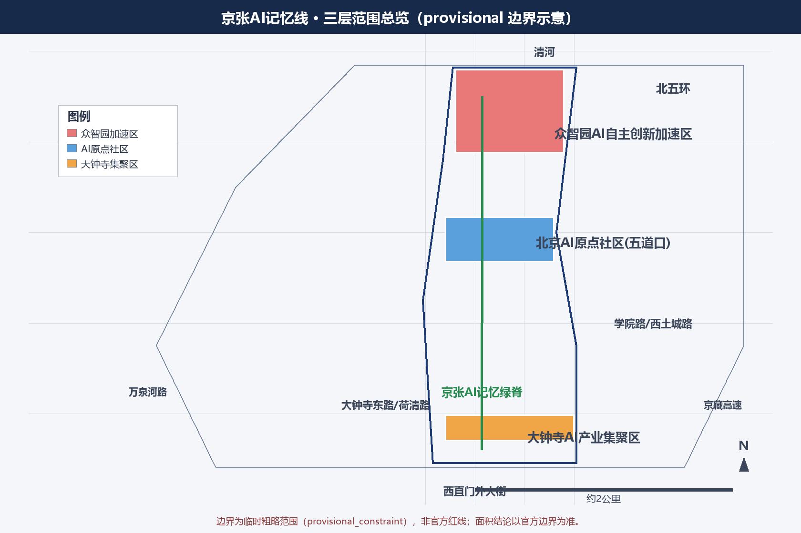
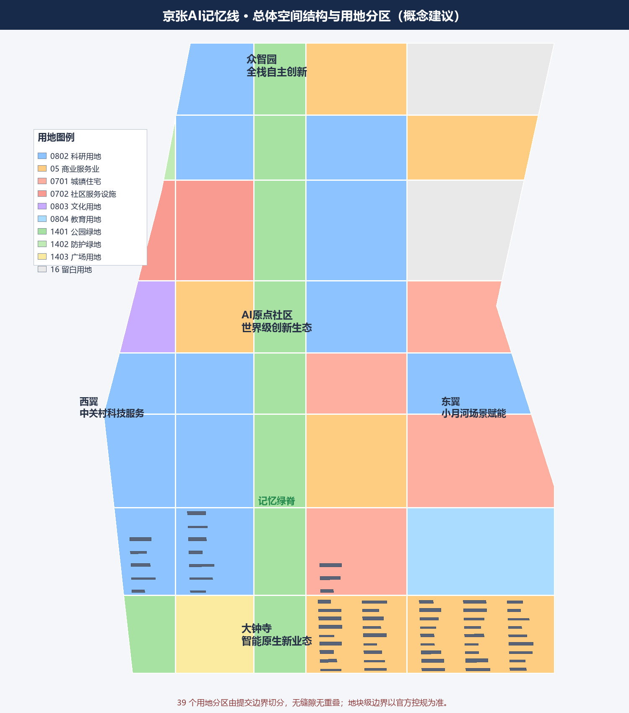
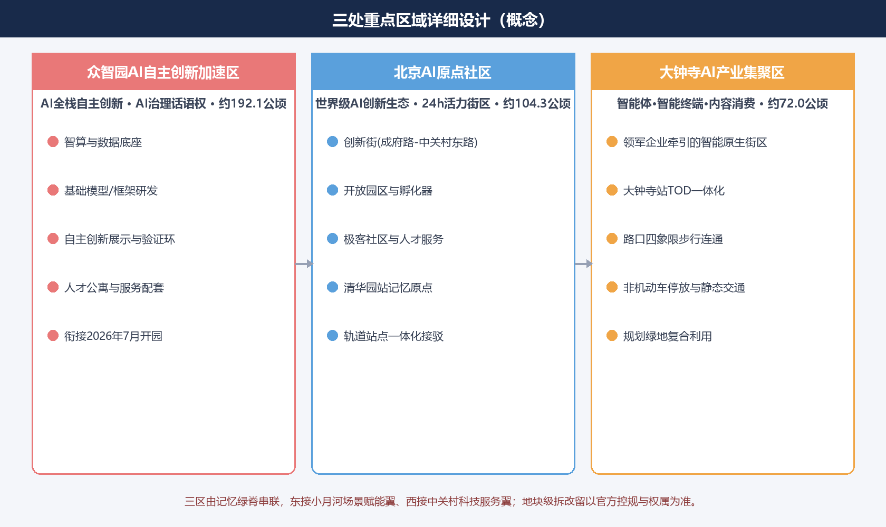
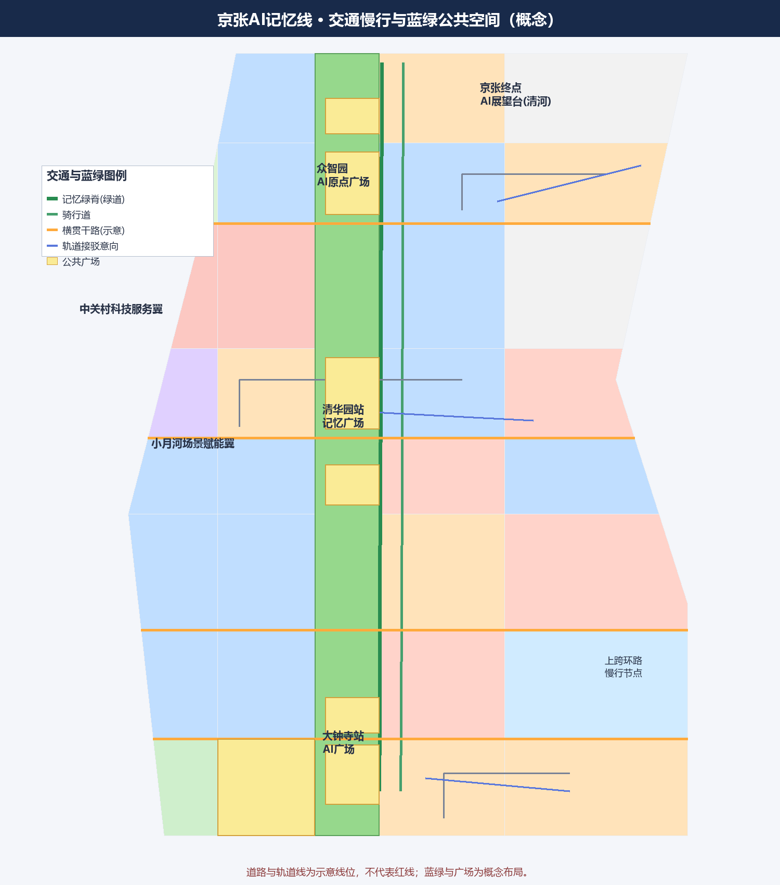
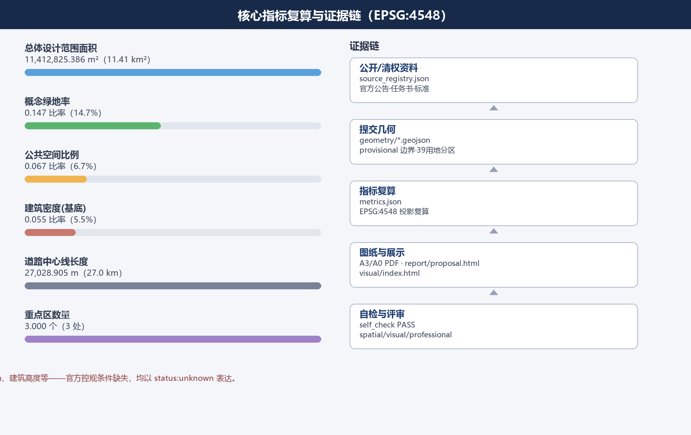

# Jing-Zhang AI Memory Line: Centennial Railway and the Urban Seam of Intelligent Future

> This proposal is generated by an AI agent based on the publicly available materials and task book for the Centennial Jing-Zhang AI Innovation Belt Urban Design Open Call. It serves as a **Conceptual Recommendation and reference proposal** for Open Co-Creation. The boundaries, layers, indicators, and drawings in the proposal are annotated with data precision. All spatial design suggestions are expressed as "concepts for professional teams to deepen their research," and do not constitute planning approval, statutory control plans, road redlines, engineering feasibility, or government implementation commitments. (Centennial Jing-Zhang AI Innovation Belt Open Call for Urban Design)

## Design Basis and Source List

This machine-readable basis for the proposal comes from the `brief/site-package/` site package, `data/source_registry.json`, and `data/processed/agent_fact_pack.md`, and is primarily based on the official Centennial Jing-Zhang AI Innovation Belt Urban Design International Proposal Qualification Pre-Review Announcement [source:OFFICIAL-ANNOUNCEMENT] [standard:PROJECT-OFFICIAL-ANNOUNCEMENT]. The announcement clarifies the three levels of scope, the Three Zones and Two Wings, design tasks 1.3/1.4/1.5, and the requirements for outcomes; the excerpt from the task book for the agents further supplements the three positioning principles, five functional areas, six agent tasks, and unified boundary conditions [source:AGENT-TASKBOOK] [standard:PROJECT-AGENT-OPEN-CALL-TASKBOOK].

Use the boundaries defined in `data/source_registry.json` for data usage: formal references can only come from approved sources with `usable_for_formal="yes"`; provisional geometry is only for generating, displaying, and self-checking [source:SOURCE-REGISTRY] [source:SITE-PACKAGE] [depth:existing_conditions_diagnosis]. Due to the official precise redlines and three key polygon areas not yet included in the public site package, this plan uses the temporary rough boundaries from `brief/site-package/geometry/provisional_boundaries.geojson` and clearly marks `official_boundary=false` and `geometry_role=provisional_constraint` in layers such as `geometry/site_boundary.geojson#SITE-001` and `geometry/key_areas.geojson#PROV-KEY-001` [data:geometry/site_boundary.geojson#SITE-001] [data:geometry/key_areas.geojson#PROV-KEY-001] [source:BOUNDARY-SOURCE] [source:KEY-AREA-SOURCE]. This data gap does not block content scoring, but all areas and plan conclusions must be recalculated after the Official Planning Boundary is in place.

`data/processed/agent_fact_pack.md` and `project_scope_summary.csv`, `agent_task_requirements.csv`, `source_use_matrix.csv`, and `missing_data_checklist.csv` are the navigation layers of this plan, helping to translate task lists, scope structures, source uses, and missing data lists into readable arguments [source:PROCESSED-FACT-PACK]. Media reports and public background information are only used for narrative background purposes and are listed as background sources [source:PUBLIC-REPORTS-BACKGROUND]. The design layers, metrics, drawings, and HTML are generated by this intelligent agent based on the above references, with the sources and generation methods documented in [source:DESIGN-INTENT].

This plan adheres to the principles outlined in the Urban Design Management Measures regarding the use of urban design as a tool for guiding Urban Character and spatial form [standard:MOHURD-URBAN-DESIGN-MEASURES], and interprets the depth of the Regulatory Detailed Planning results in accordance with the Compilation and Approval Measures for Control Detailed Planning of Cities and Towns [standard:MOHURD-CONTROL-DETAILED-PLANNING]. Land use classification follows a subset of the Project Classification Guide for Land and Sea Use in the National Land Space Investigation, Planning, and Use Control [standard:MNR-LAND-USE-CLASSIFICATION-GUIDE]. Three local references to the standards are available as snapshots in the corresponding files `brief/site-package/standards/references/`.

## Three-Level Scope Framework

The call for submissions will conduct "people, city, industry" integrated design from three levels: Coordinated Research Area, Overall Design Area, and Key-Area Detailed Design Area [source:OFFICIAL-ANNOUNCEMENT] [standard:PROJECT-OFFICIAL-ANNOUNCEMENT] [depth:three_level_scope_framework].

- **Coordinated Research Area (approximately 43.6 km²)**: Extending north to the North Fifth Ring Road, east to the Jingzhang Expressway, south to West Straight Outer Street, and west to Wanquan River Road, this is the system research area for the "Three Zones and Two Wings" region.
- **Overall Design Area (approximately 11.4 km²)**: The design scope includes the urban and industrial areas within 1-2 kilometers around the Jing-Zhang Heritage Park; this plan uses provisional boundaries in place of [data:geometry/site_boundary.geojson#SITE-001] [metric:site_area_sqm].
- **Key-Area Detailed Design Area (approximately 368.4 hectares)**: From north to south, it includes the Zhongzhiyuan AI Independent Innovation Acceleration Area (approximately 192.1 hectares), the Beijing AI Origin Community (approximately 104.3 hectares), and the Dazhongsi AI Industry Cluster Area (approximately 72.0 hectares). This plan expresses the areas provisionally with polygons and verifies the areas [data:geometry/key_areas.geojson#PROV-KEY-002] [metric:key_area_count].

Three levels of working relationships are "research to set strategy—design to set structure—details to set quality": the comprehensive research layer answers "where is Haidian AI industry heading," the overall design layer answers "how to organize space and update within 11.4 km²," and the key area layer answers "how to refine and implement in 368.4 hectares." The proposal implements this framework as an overall spatial structure diagram, Land-Use Layout, list of update projects, phased plan, and indicator table, see the drawings and the three-layer scope section of `visual/index.html`.

## Coordinated Research Area: Industry and Future City Research

In the Coordinated Research Area, this plan proposes a spatial and industrial synergistic structure of **"one spine, three nodes, and two wings"**, corresponding to the "Three Zones and Two Wings" layout specified in the task book [source:AGENT-TASKBOOK] [standard:PROJECT-AGENT-OPEN-CALL-TASKBOOK] [depth:overall_spatial_structure].

- **One Axis**: Jing-Zhang AI Memory Green Spine —— A north-south through and east-west stitching green and slow-moving main corridor formed along the Jing-Zhang Railway Heritage Park. It serves as a composite carrier for cultural narratives, AI Public Spaces, and ecological corridors.
- **Three Nodes**:
- Northern Node: Zhongzhiyuan AI Independent Innovation Acceleration Area carries the AI Full-Stack Independent Innovation System and global AI governance discourse.
- Central Node: Beijing AI Origin Community (Wudaokou, centered around Dongsheng Building, north to Shuangqing Road, south to Chengfu Road, east to Heqing Road, west to Zhongguancun East Road) carries a world-class AI Innovation Ecosystem.
- Southern Node: Dazhongsi AI Industry Cluster Area carries new smart entities, smart terminals, and content consumption ecosystems. (Full-Stack Independent AI Innovation System)
- **Two Wings**: The West Wing is the Zhongguancun Technology Services Wing, which undertakes global element configuration and IP and capital empowerment for Zhongguancun. The East Wing is the Xiaoyue River Scenario Enablement Wing, which undertakes scenario enablement for embodied intelligence, AI+ healthcare, AI+ film and television, and intelligent AI vibrant city functions.

This plan compares and studies the global AI Innovation Ecosystem cases of 8 well-known examples, extracting transferable mechanisms: the Stanford Research Park in Palo Alto,  (University-Capital-Enterprise Closed Loop), Kendall Square in Boston (Urban Renewal Innovation District), King's Cross in London (Railway Industrial Heritage Update + Knowledge Economy, most comparable to the Jing-Zhang Heritage Park), the Jurong Innovation & Technology City in Singapore (Government-led Urban-Rural Integration), the Bundang Science Valley in South Korea (National ICT Cluster), Shenzhen Nan Mountain Science Park (Market-driven + Policy Synergy), Hangzhou Future Science City (Large Platforms + Scenario Access), and the open street innovation network in Tel Aviv. These cases support the "Heritage Update + AI Innovation Ecosystem + Scenario Access" combination strategy, as detailed in the "AI Innovation Ecosystem" chapter [depth:risk_missing_data].

Facing the future urban form, the proposal defines three categories of evolutionary directions: **AI Culture** (public expression from machine memory to urban collective memory), **AI Society** (public services and governance through human-machine collaboration), and **AI City** (adaptive and evolvable spatial and transportation organization). Integrating Haidian's "1+X+1" industrial system, the proposal studies combining AI with software and information technology, healthcare, education, law, and living services into an "AI+" scenario cluster. It also proposes an industrial-space integration layout direction focusing on "compute cluster + data space + scenario list" for the elements of computing power, algorithms, and data.

## Overall Design Area: Urban Renewal and Regulatory-Plan-Level Urban Design

The Overall Design Area is oriented towards the development of artificial intelligence, using Urban Renewal as a means to achieve the depth requirements of Regulatory Detailed Planning in Urban Design [source:OFFICIAL-ANNOUNCEMENT] [standard:MOHURD-CONTROL-DETAILED-PLANNING] [depth:land_use_layout].

**Overall Spatial Structure**: With the Memory Green Spine as the axis, a "spine-belt-node" structure is formed. The Green Spine (an approximately 130-200 meter wide conceptual corridor concept) connects three nodes; along both sides of the spine, research and development, commercial services, residential, and community service land uses are organized. AI industry spaces are densified around the nodes, while the spine itself is open and spacious. The scheme organizes Urban Renewal through two strategies: **East-West Stitching** (pedestrian and functional connectivity across parcels on both sides of the railway corridor) and **North-South Penetration** (the Green Spine connecting the entire segment from Xizhimen to the North Fifth Ring Road) [depth:overall_spatial_structure].

**Land-Use Layout**: This scheme establishes a seamless and non-overlapping land-use zoning within the provisional boundary, with 39 zones covering the entire 11.41 km² submitted area [data:geometry/land_use.geojson#LU-001] [depth:land_use_layout]. Conceptual land use scale (EPSG:4548 recalculated) is as follows: research and development land approximately 343.2 hectares, commercial and service land approximately 227.2 hectares, urban residential land approximately 159.0 hectares, educational land approximately 58.8 hectares, community service facilities land approximately 47.2 hectares, cultural land approximately 15.5 hectares, park and green space approximately 166.4 hectares, protective green space approximately 1.8 hectares, square land approximately 27.8 hectares, and reserved land approximately 94.5 hectares [metric:land_use_research_area_sqm] [metric:land_use_commercial_area_sqm] [metric:land_use_residential_area_sqm] [metric:land_use_park_green_area_sqm] [metric:land_use_reserved_area_sqm]. Functional proportions reflect the principles of "industrial dominance, balanced employment and residence, and a network of blue and green spaces": research and industrial service land use accounts for about half, residential and supporting facilities for about one-fifth, blue and green open spaces for another one-fifth, with the remainder left as flexible space for the future.

**Urban Renewal Overall Framework**: Identify three categories of renewal targets on both sides of the Jing-Zhang Heritage Park, including inefficient spaces, integrated space between campus, park, and community areas, and potential sites around stations; propose a classification logic of "preservation—renewal—new construction" (see land-use chapter), and develop a distribution map of renewal priorities, a spatial structure map of renewal areas, a Land-Use Layout map, and a list of renewal implementation projects [depth:renewal_project_list]. Due to the absence of official control plan conditions, the statutory control indicators such as Floor Area Ratio, Building Height, and Building Coverage Ratio are all expressed as `status:unknown` and listed as pending confirmation items [metric:floor_area_ratio] [depth:development_intensity_controls].

**Jing-Zhang Heritage Park Vitality Belt**: Combine the implemented areas with the original design to expand the research scope and integrate the travel needs of universities, enterprises, and communities. Plan a network of pedestrian and cycling paths and green spaces that are north-south connected and east-west linked [source:OFFICIAL-ANNOUNCEMENT] [data:geometry/roads.geojson#ROAD-001] [depth:blue_green_public_space]. For the gaps in the park's Walking and Cycling Network, propose an optimized concept for pedestrian and cycling nodes across expressways and railway corridors. Set up landmark urban landscape nodes at the southern end (West Straight Outside Avenue direction), northern end (North Fifth Ring Road direction), and over the expressway area. The northern end node will integrate the blue-green resources of Qinghe and Xiaoyuehe and set up an "AI Outlook Platform for the Jing-Zhang End" [depth:height_massing_character].

## Detailed Design of Key Areas

The three key areas will be developed according to the "Three Zones and Two Wings" overall structure, conducting detailed design to clarify the industrial functions, development and construction scale concepts, and the demolition–renovate–retain classification direction [source:OFFICIAL-ANNOUNCEMENT] [standard:PROJECT-AGENT-OPEN-CALL-TASKBOOK] [depth:three_key_area_detailed_design]. (Demolish–Renovate–Retain Strategy)

**Zhongzhiyuan AI Independent Innovation Acceleration Area (approximately 192.1 hectares)**: positioned for the Full-Stack Independent AI Innovation System and the global voice bearer for AI governance [data:geometry/key_areas.geojson#PROV-KEY-001] [metric:key_area_zhongzhiyuan_area_sqm]. The conceptual layout is "Intelligent Computing and Data Foundation + Full-Stack R&D Clusters + Validation and Demonstration Ring": organizing computational power centers and basic model and framework R&D spaces along the northern segment; setting up an area for independent innovation demonstrations and public validation spaces in the middle; and aligning talent apartments and service facilities with the green spine on the southern side. According to public background information, Zhongzhiyuan plans to open in July 2026. This plan will serve as the initial implementation node for Phase I, aligning with the Scenario Access and operational mechanisms after the opening [source:PUBLIC-REPORTS-BACKGROUND].

**Beijing AI Origin Community (approximately 104.3 hectares)**: Positioning as a world-class AI Innovation Ecosystem carrier area, radiating over 3 km², gathering approximately 400 AI companies and around 13,000 AI talents [data:geometry/key_areas.geojson#PROV-KEY-002] [metric:key_area_origin_area_sqm]. The conceptual layout is anchored by Wudaokou and Dongsheng Building, forming a "Innovation Street + Open Campus + Geek Community" 24-hour vibrant district: organizing an innovation interaction interface along Chengfu Road — Zhongguancun East Road, connecting westward to universities and research institutions, and eastward to the Xiaoyue River Scenario Enablement Wing; preserving the cultural resources such as the Qinghua Yuan Station station house as a memory point [data:geometry/constraints.geojson#CON-HERITAGE-001]. Around the rail transit stations, integrated functional layouts are carried out, optimizing pedestrian and transit connections.

**Dazhongsi AI Industry Agglomeration Zone (approximately 72.0 hectares)**: Positioning as a cluster area for intelligent native new business forms [data:geometry/key_areas.geojson#PROV-KEY-003] [metric:key_area_dazhongsi_area_sqm]. Conceptual layout is driven by leading enterprises, integrating intelligent bodies, intelligent terminals, and content consumption industries, with a TOD integrated concept design centered around Dazhongsi Station: proposing a systemic solution for pedestrian connectivity at the four quadrants of the intersection, bicycle parking, and static traffic organization, enhancing the public environment and commercial service quality around key enterprises [depth:traffic_rail_slow_parking].

Three areas have provided the concept version of the "Dismantle–Renovate–Retain Strategy": buildings at the Tsinghua Garden Station building, universities, research institutions, mature parks, and historical buildings are to be **Retained**; outdated office buildings, inefficient commercial offices, and single-function parks are to be **Updated** (through functional replacement and renovation); and vacant lands and clearly defined update sites are to be **Newly Constructed**. Specific block-level dismantle–renovate–retain plans are based on official control plans and ownership data [depth:retain_renovate_demolish] [data:geometry/buildings.geojson#BLDG-001]. (Demolish–Renovate–Retain Strategy)

## AI Innovation Ecosystem, Personas, and AI+ Scenarios

**Innovative Ecosystem Map**: The proposal constructs a four-layer ecosystem map of "elements-carrier-mechanism-activity," covering eight categories of elements: land, space, industry, capital, talent, computing power, data, and scenario [source:AGENT-TASKBOOK] [standard:PROJECT-AGENT-OPEN-CALL-TASKBOOK] [depth:three_level_scope_framework]. The land and space elements correspond to the land use and update layers of this proposal [data:geometry/land_use.geojson#LU-001]; the computing power, data, and scenario elements correspond to the "Intelligent Computing Cluster + Data Space + Scenario Access List" mechanism; the capital and talent elements correspond to the capital empowerment and talent community operations of the Zhongguancun Technology Services Wing.

**Characterization of Talent (at least 5 categories)**: algorithm scientists and researchers, entrepreneurs and founding teams, developers and open-source contributors, AI product managers and designers, compliance lawyers and operational talent, international visitors and academic exchange participants, local residents and community youth. The plan provides an integrated space-service mapping for "work-life-social-learning" for each category: for example, developers require 24-hour open workstations and testing environments, entrepreneurs need incubators, capital connections, and access to scenarios, international visitors need bilingual guided tours and one-stop service windows.

**AI Scenario Card (12 cards, including 3 industrial Testing and Validation Scenarios)**:

- SC-01 AI+ Track Access: Smart Shuttle and Barrier-Free Navigation at Dazhongsi Station/Wudaokou Station (Corresponding to the ai-traffic-walkability Scenario) [depth:traffic_rail_slow_parking]
- SC-02 Memory Green Spine Experience: AI Guided Tour and Heritage Narrative Along the Jing-Zhang Green Spine
- SC-03 Low-Speed Autonomous Shuttle Pilot: Wudaokou - Tsinghua Garden Community Shuttle (Testing and Validation Scenario)
- SC-04 Embodied Intelligence Public Testing Ground: Robot Testing and Inspection on the Open Pedestrian Path of Xiao Yuehe Wing (Testing and Validation Scenario)
- SC-05 Large Model Application Compliance Validation Sandbox: Enterprise-Level Validation for the Intelligent Native Block in Dazhongsi (**Testing and Validation Scenario**)
- SC-06 AI+ Healthcare Services: Community Health Navigation and Remote Diagnosis Assistance
- SC-07 AI+ Education: Higher Education Institutions—Campus Joint Learning and Experimental Space
- SC-08 AI+Legal Services: Innovative Enterprise Compliance Assistant and Policy Q&A
- SC-09 Urban Agent Governance: Public Feedback—Human Review—Risk Alert Loop
- SC-10 Digital Content Creation:  Art Resources and AI Content Workshop
- SC-11 Robot Delivery: Last Mile Low-Speed Delivery within the Park
- SC-12 Exhibitions and Events: Public Engagement and Industry Engagement for the Global AI Innovation Week

Each scene card specifies the mapping of "scene-space-operation": the space location corresponds to the land use, Public Space, and roads in the `geometry/` layer (e.g., the memory green spine corresponds to [data:geometry/public_space.geojson#PUBLIC-001] and [data:geometry/roads.geojson#ROAD-002]), and the operational mechanism corresponds to phased development and activity systems. All AI scenes adhere to privacy protection, Human Review, no personal monitoring, and no deployment of immature technology, with clear boundaries between testing and formal operation [source:AGENT-TASKBOOK] [depth:risk_missing_data].

## Land Use, Building Scale, and Retain-Renovate-Demolish Strategy

The Land-Use Layout is based on the seamless land-use zoning generated by this plan [data:geometry/land_use.geojson#LU-001] [standard:MNR-LAND-USE-CLASSIFICATION-GUIDE] [depth:land_use_layout]. The zoning follows the subset coding of the Land Use and Sea Area Classification Guide (Research 0802, Commercial and Business Services 05, Urban Residential 0701, Community Service Facilities 0702, Culture 0803, Education 0804, Park and Green Spaces 1401, Protective Green Spaces 1402, Squares 1403, and Reserve 16). All 39 zones share the same cutting coordinates, ensuring seamless and non-overlapping boundaries [metric:land_use_education_area_sqm] [metric:land_use_community_service_area_sqm] [metric:land_use_cultural_area_sqm] [metric:land_use_protective_green_area_sqm] [metric:land_use_plaza_area_sqm].

**Building Scale (Conceptual Illustration)**: Generate 299 conceptual Building Footprints within the developable land, with a total footprint area of approximately 63.3 hectares, and a conceptual Building Coverage Ratio of about 5.5% [data:geometry/buildings.geojson#BLDG-001] [metric:building_footprint_area_sqm] [metric:building_density]. The building types include AI research and development, laboratories, incubators, offices, mixed-use functions, educational and research support, residential, talent apartments, community services, commercial, and cultural displays [data:geometry/buildings.geojson#BLDG-002]. These footprints only express the layout logic of "node densification, sparse spine lines, and balanced employment and residence," and do not represent the approved construction intensity; the total scale of planned buildings and Floor Area Ratio, among other statutory indicators, are missing and listed as pending confirmation [metric:total_floor_area_sqm] [depth:development_intensity_controls].

**Destruction-Renovation-Retention Classification**: The buildings' attributes record the `renewal_action` concept classification (retain/renovate/new_build) [data:geometry/buildings.geojson#BLDG-003]. The overall logic is: retain historical and mature carriers, update the functions of inefficient carriers, and build new structures on blank and updated sites; any site-level conclusions must be refined by a professional team considering ownership, control plans, and cultural heritage requirements [depth:retain_renovate_demolish]. (Demolish–Renovate–Retain Strategy)

## Transport, Rail, Municipal Infrastructure, and Public Services

**Transportation and Slow Mobility**: Organize a composite slow-mobility network of "greenways + cycling + walking" with memory green spine as the main corridor, with a total central line length of approximately 27.0 km [data:geometry/roads.geojson#ROAD-001] [metric:road_length_m] [depth:traffic_rail_slow_parking]. The transverse road connects the east and west side neighborhoods, improving road micro-circulation [data:geometry/roads.geojson#ROAD-010]; within the nodes, organize access roads and internal roadways for blocks [data:geometry/roads.geojson#ROAD-020]. The plan proposes an AI-assisted design direction facing track transfers, slow-mobility discontinuities, barrier-free paths, low-speed transfers, and event day traffic organization, corresponding to the ai-traffic-walkability track [source:AGENT-TASKBOOK].

**Transport and Integration:** Develop an integrated functional layout around the Dazhongsi station and Wudaokou stations, incorporating conceptual transit connectors [data:geometry/roads.geojson#ROAD-030]; prioritize addressing the pedestrian connectivity and organization of non-motorized vehicle parking in the four quadrants around the Dazhongsi station intersection.

**Municipal and New Infrastructure**: Explore the integration and implementation model of new services in the AI industry, such as distributed energy and edge-side computing, with traditional major facilities (conceptual direction) [depth:municipal_new_infrastructure]; propose the system and spatial layout direction for AI industry service facilities, innovation service platform facilities, talent living service facilities, and new infrastructure. Water supply and drainage, power, gas, and other traditional municipal services and transportation carrying capacity require a professional team to assess based on the total scale of building volume; this plan does not provide engineering conclusions [depth:risk_missing_data].

**Public Service Facilities**: To achieve the goal of "work-life-social-learning integration," configure talent apartments, community services, education, sports, healthcare, and commercial service facilities [data:geometry/green_space.geojson#GREEN-001] [metric:land_use_residential_area_sqm].

## Blue-Green Network, Public Space, and Urban Character

**Blue-Green Space**: Centered around the Memory Green Spine, it connects park green spaces, protective green spaces, and blue-green resources such as Qinghe and Xiaoyuehe rivers, forming a continuous and unbounded green space system [data:geometry/green_space.geojson#GREEN-001] [depth:blue_green_public_space]. The conceptual green space ratio is approximately 14.7% [metric:green_ratio], the Public Space ratio is approximately 6.7% [metric:public_space_ratio], the green space and open space land use is about 168.1 hectares [metric:green_space_area_sqm], and the public space is about 76.4 hectares [metric:public_space_area_sqm].

**Public Space**: Set up public space components such as the station forecourt, AI Memory Square, Experimental Field Square, and Outlook Terrace Square [data:geometry/public_space.geojson#PUBLIC-001], and establish a public space component library (identifiers, seating, shading, accessible ramps, interactive screens, power outlets, and temporary exhibition interfaces) to support youth-friendly, nighttime vitality, and third-place needs [source:AGENT-TASKBOOK].

**Urban Character**: Unearth the narrative of "memory—innovation—future" by integrating the historical and cultural heritage of the Jing-Zhang Railway with the innovation culture of Zhongguancun and AI innovation culture; showcase and utilize cultural resources such as the Tsinghua Garden Railway Station and artistic resources like the North Film Studio [data:geometry/constraints.geojson#CON-RAIL-001]. For areas with potential for renewal, propose a conceptual direction for the **control and guidance** of Building Height, intensity, urban character, roof form, and massing: along the ridge lines, control the sightlines and low-density open interfaces, with nodes that are moderately compact and control the scale of the street-level facades; the color palette draws from the industrial gray of the Jing-Zhang Railway, the innovation blue of Zhongguancun, and the AI electronic green [depth:height_massing_character] [depth:overall_spatial_structure].

## Renewal Projects, Implementation Policy, and Phasing

**Updated Project List (Conceptual Level, 12 Items)**: P-01 Memory Green Spine Through the North-South Axis (including the Overpass Node); P-02 Dazhongsi Station TOD Integration and Pedestrian Connection between the Four Quadrants; P-03 Original Community Innovation Street Update and Scenario Access; P-04 Zhongzhiyuan Smart Computing and Validation Cluster (Connected to the Opening in July 2026); P-05 Xiaoyuehe Embodied Intelligence Testing and Demonstration Field; P-06 Tsinghua Park Memory Origin Cultural Node; P-07 Dazhongsi Intelligent Original Birth Commercial Street; P-08 University-Garden Integration Experimental Space; P-09 Talent Apartments and Community Service Center; P-10 Distributed Energy and Edge Computing Demonstration; P-11 North Film AI Content Workshop; P-12 Jing-Zhang End AI Outlook Platform (North Fifth Ring—Qinghe Node). Each item provides functional description, spatial location, and relationship to layers [depth:renewal_project_list] [data:geometry/phasing.geojson#PHASE-001].

**Implementation Policy (Concept Direction)**: Propose a policy combination of "retention and renovation + flexible Floor Area Ratio + Scenario Access list + developer community operation + event branding" as a direction for professional teams and government departments to discuss and implement, without constituting a policy commitment [source:AGENT-TASKBOOK] [depth:phasing_implementation].

**Phasing Plan**: Phase One (2026—2027) will focus on three nodes, covering approximately 500.3 hectares [data:geometry/phasing.geojson#PHASE-001] [metric:phase_1_area_sqm]; Phase Two (2028—2029) will connect the Memory Green Spine segment and integrate the transitional area, covering approximately 454.6 hectares [data:geometry/phasing.geojson#PHASE-002] [metric:phase_2_area_sqm]; Phase Three (2030—2032) will focus on Urban Renewal and comprehensive enhancement in the core segment of Zhongguancun, covering approximately 186.4 hectares [data:geometry/phasing.geojson#PHASE-003] [metric:phase_3_area_sqm].

**Overview of Six Intelligent Body Tasks**:
- **agent.1 (One Belt Overall Concept and Function Coordination)**: Responds to the naming system, visual recognition direction, three positioning, five functions, Three Zones and Two Wings coordinated loop, and overall spatial structure diagram, as detailed in the "Overall Design Area" and "Coordinated Research Area" sections.
- **agent.2 (Full-Stack Independent AI Innovation System and World-Class Ecosystem)**: Responds to 8 global case studies, ecosystem map, and element mechanisms, as detailed in the "AI Innovation Ecosystem" section.
- **agent.3 (AI-Enabled Scenario Empowerment and Intelligent Vibrant City)**: Responds to 12 scenario cards, 7 user profiles, scenario-space-operation mapping, and three Testing and Validation Scenarios.
- **agent.4 (AI Public Space, Intelligent Nativized New Business Models, and Pilgrimage Landmarks)**: Responds to the Memory Green Spine public space, Dazhongsi intelligent nativized district, 5 AI pilgrimage landmarks, and public space component library.
- **agent.5 (Integration of Centennial Jing-Zhang Culture, Zhongguancun Culture, and AI New Culture Narrative)**: Responds to the "Memory-Innovation-Future" narrative, sign direction, and international communication copy, as detailed in the "Jing-Zhang" and "Zhongguancun" sections. Scenario Access (Global AI Innovation Activity System and Long-term Operations) is composed of an annual activity system, developer community operations, scenario access operations, and attraction and conversion mechanisms [source:AGENT-TASKBOOK] [standard:PROJECT-AGENT-OPEN-CALL-TASKBOOK] [depth:phasing_implementation]. The correspondence between the above items is recorded in `compliance_matrix.json`, and is displayed in the "Task Coverage" section of `visual/index.html`.

## Metrics, Area Recalculation, and Compliance Matrix

**Indicator System**: This plan categorizes the indicators into three types—those that can be recalculated directly from the submitted geometry: `site_area_sqm`, `green_space_area_sqm`, `green_ratio`, `public_space_area_sqm`, `public_space_ratio`, `building_footprint_area_sqm`, `building_density`, `road_length_m`, `phase_1_area_sqm`, `phase_2_area_sqm`, `phase_3_area_sqm`. `key_area_count` with area of each key area [metric:site_area_sqm] [metric:green_space_area_sqm] [metric:green_ratio] [metric:public_space_area_sqm] [metric:public_space_ratio] [metric:building_footprint_area_sqm] [metric:building_density] [metric:road_length_m] [metric:phase_1_area_sqm] [metric:phase_2_area_sqm] [metric:phase_3_area_sqm] [metric:key_area_count] [metric:key_area_zhongzhiyuan_area_sqm] [metric:key_area_origin_area_sqm] [metric:key_area_dazhongsi_area_sqm];  Land use research area in square meters `land_use_research_area_sqm`, land use commercial area in square meters `land_use_commercial_area_sqm`, land use residential area in square meters `land_use_residential_area_sqm`, land use community service area in square meters `land_use_community_service_area_sqm`, land use cultural area in square meters `land_use_cultural_area_sqm`, land use education area in square meters `land_use_education_area_sqm`, land use park and green area in square meters `land_use_park_green_area_sqm`, land use protective green area in square meters `land_use_protective_green_area_sqm`, land use plaza area in square meters `land_use_plaza_area_sqm`, `land_use_reserved_area_sqm` [metric:land_use_research_area_sqm] [metric:land_use_commercial_area_sqm] [metric:land_use_residential_area_sqm] [metric:land_use_community_service_area_sqm] [metric:land_use_cultural_area_sqm] [metric:land_use_education_area_sqm] [metric:land_use_park_green_area_sqm] [metric:land_use_protective_green_area_sqm] [metric:land_use_plaza_area_sqm] [metric:land_use_reserved_area_sqm].

The second category consists of management indicators that require official control plans or task book attachments as support: `floor_area_ratio`, `total_floor_area_sqm`, Building Height, and building density. Due to the absence of official control plan conditions, all are marked as `status:unknown` and listed as risks and items to be confirmed [metric:floor_area_ratio] [metric:total_floor_area_sqm] [depth:development_intensity_controls]. The third category consists of performance indicators that require continuous calibration with operational or industrial data: AI innovation index, talent density, scale of output value, walkability, participation in activities, and frequency of scene usage. This plan provides the direction for the indicator system within the main text but does not include known numerical values in the `metrics.json` [depth:metrics_recalculation]. (Building Coverage Ratio)

**Area Recalculation**: All geometries were recalculated in EPSG:4548 projection, with the areas derived from `metrics.json` and the layer `area_sqm_declared` [depth:metrics_recalculation]. The Overall Design Area concept covers approximately 11,412,825 m² (about 11.41 km²), consistent with the announced area of approximately 11.4 km²; the provisional areas of the three key zones (Zhongzhiyuan at about 1,929,202 m², Origin Community at about 1,043,237 m², and Dazhongsi at about 720,454 m²) deviate by no more than 0.5% from the announced areas [metric:key_area_zhongzhiyuan_area_sqm] [metric:key_area_origin_area_sqm] [metric:key_area_dazhongsi_area_sqm]. As the boundaries are provisional, the precise area conclusions will be based on the Official Planning Boundary.

**Compliance Matrix**: `compliance_matrix.json` covers all the mandatory tasks in announcements 1.3 (Purpose of the Call), 1.4 (Project Scale), and 1.5 (Design Tasks), as well as the six intelligent agent tasks from agent.1 to agent.6; each task corresponds to a report chapter, layer, metric, drawing, HTML chapter, source, and self-inspection items [source:DESIGN-INTENT] [depth:metrics_recalculation]. `standard_matrix.json` covers five mandatory standards, and `design_depth_matrix.json` covers fifteen formal design depth items and marks them all as `complete` [source:AGENT-TASKBOOK] [standard:PROJECT-AGENT-OPEN-CALL-TASKBOOK].

## Risk, Copyright, and Compliance

**Data and Precision Risks**: The scheme boundary and key areas are provisional rough ranges and should not be used as official redlines, approval references, or precise area calculation references [source:BOUNDARY-SOURCE] [source:KEY-AREA-SOURCE] [depth:risk_missing_data]; official control plans, road redlines, land ownership, municipal, and cultural heritage control lines are missing, and all conclusions are expressed as pending confirmation items [source:SITE-PACKAGE]. The current roadways, railway corridors, and the location of Tsinghua Garden Station are indicative and must be verified with official drawings and the cultural heritage department's defined ranges [data:geometry/constraints.geojson#CON-HERITAGE-001] [source:PUBLIC-REPORTS-BACKGROUND].

**Conceptual Recommendation Attributes**: In accordance with the ten principles of agent co-creation, this proposal is an Open Co-Creation suggestion, not a substitute for professional planning, nor does it overstep government review and statutory approval; spatial implementation suggestions are expressed as "conceptual recommendation/reference proposal/available for professional teams to deepen research" [source:AGENT-TASKBOOK] [standard:PROJECT-AGENT-OPEN-CALL-TASKBOOK]. The proposal does not include Floor Area Ratio, Building Height, specific demolish–renovate–retain strategy, road redlines, engineering implementation, or government commitments. (Demolish–Renovate–Retain Strategy)

**Copyright and Source**: This proposal is generated based on publicly available and cleared data, with all references traced back to the `source_id` registered in `data/source_registry.json` [source:SOURCE-REGISTRY]; graphics, HTML, indicators, and drawings are generated by this intelligent agent and licensed under `COMMUNITY-DISPLAY-ONLY`, for display and review [source:DESIGN-INTENT]. No unauthorized fonts, images, trademarks, individuals, or company logos are used; no personal privacy or non-public planning data is included [source:PROCESSED-FACT-PACK]. AI governance scenarios adhere to human-centric principles, Human Review, and risk warnings, and do not design scenarios with excessive surveillance [standard:MOHURD-URBAN-DESIGN-MEASURES].

## References

- `brief/public-brief.md`, `brief/site-package/design_brief.json`, `brief/site-package/agent_taskbook.json`
- `brief/site-package/allowed_design_space.json`, `brief/site-package/ranges/planning_limits.json`, `brief/site-package/enums/*.json`, `brief/site-package/schemas/*.json`
- `brief/site-package/geometry/provisional_boundaries.geojson` [source:BOUNDARY-SOURCE] [source:KEY-AREA-SOURCE]
- `brief/site-package/standards/standards.json` and `references/` five local snapshot standards [standard:PROJECT-OFFICIAL-ANNOUNCEMENT] [standard:PROJECT-AGENT-OPEN-CALL-TASKBOOK] [standard:MOHURD-URBAN-DESIGN-MEASURES] [standard:MOHURD-CONTROL-DETAILED-PLANNING] [standard:MNR-LAND-USE-CLASSIFICATION-GUIDE]
- `data/source_registry.json` [source:SOURCE-REGISTRY] and `data/processed/agent_fact_pack.md` as well as four processed tables [source:PROCESSED-FACT-PACK]
- Official Announcement [source:OFFICIAL-ANNOUNCEMENT], Task Book [source:AGENT-TASKBOOK], Background Public Reports [source:PUBLIC-REPORTS-BACKGROUND], Design Generation Explanation [source:DESIGN-INTENT]
