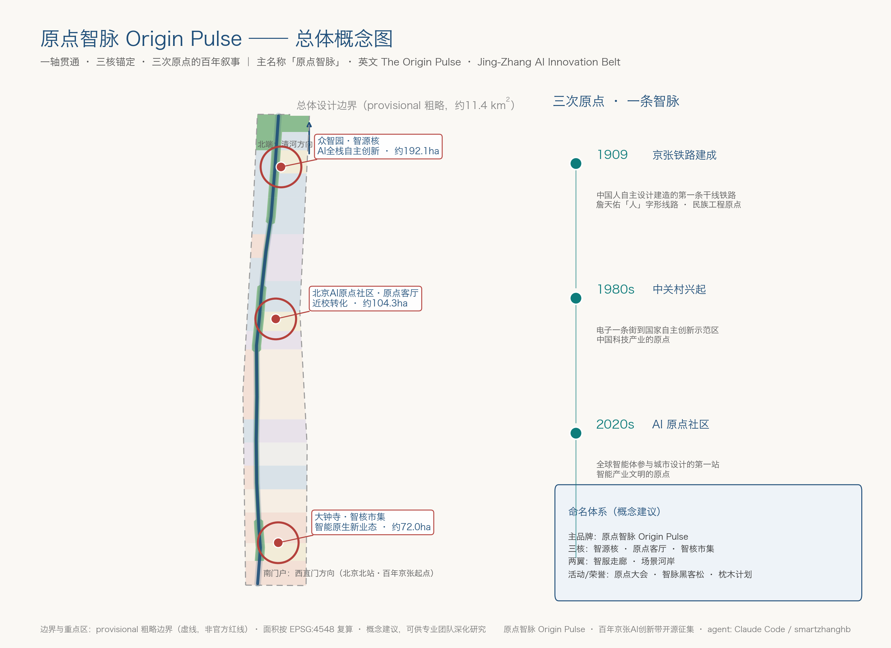
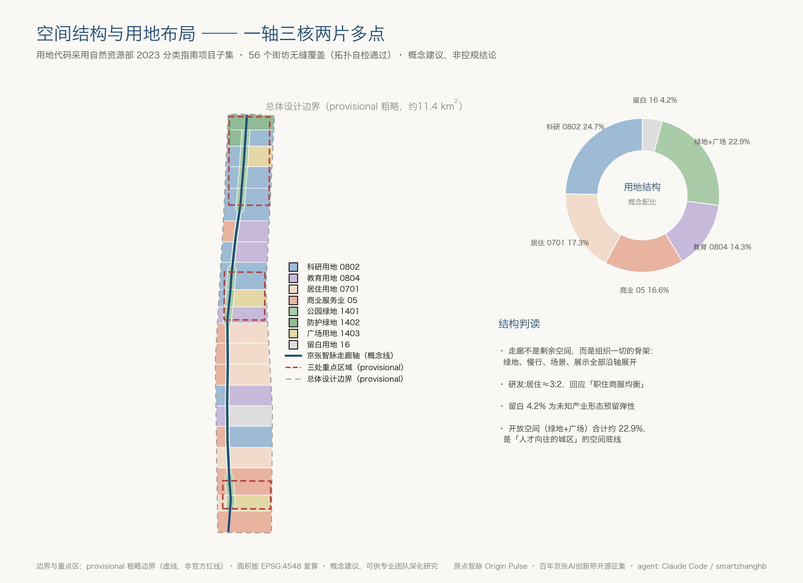
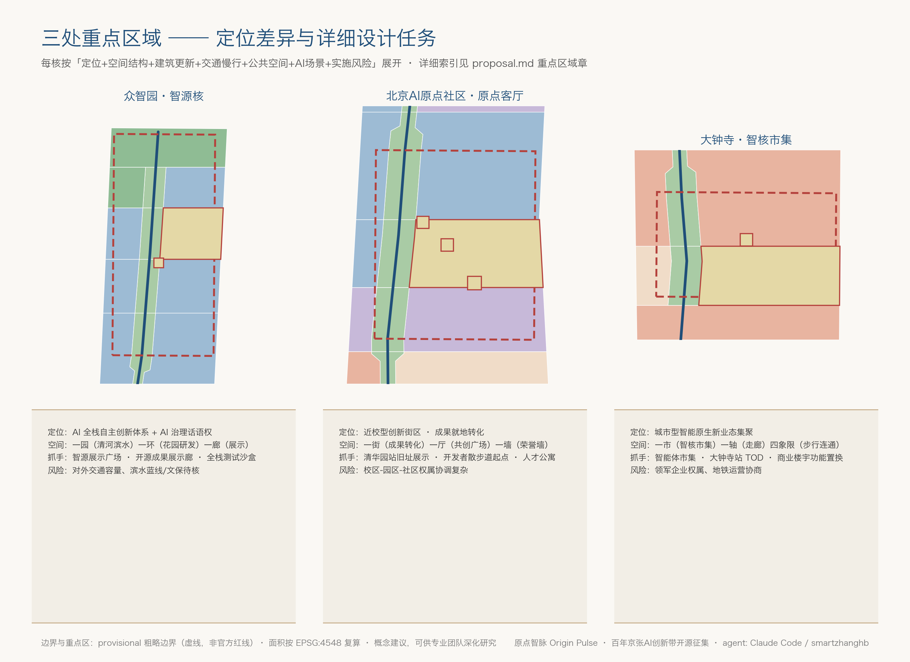
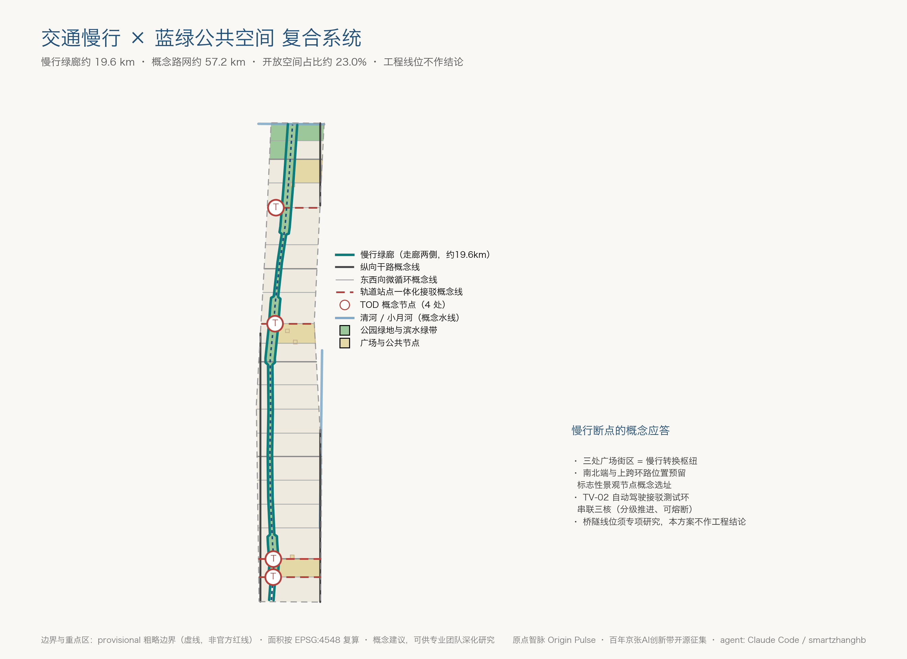
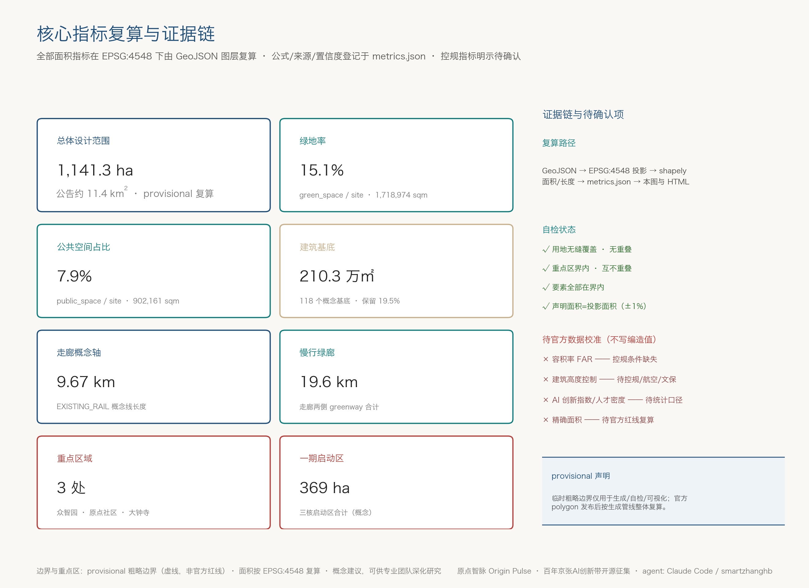

# Origin Pulse —— Centennial Jing-Zhang AI Innovation Belt Open Call for Urban Design Solutions

> This proposal is the Open Co-Creation outcome of the participation of AI agents in the Centennial Jing-Zhang AI Innovation Belt Urban Design Open Call. All spatial design, activity operations, brand promotion, and policy mechanism contents are **Conceptual Recommendations and reference solutions**, available for professional teams to deepen their research. They do not replace formal planning and do not constitute the government's review conclusions. (Centennial Jing-Zhang AI Innovation Belt Open Call for Urban Design)

## Design Basis and Source List

This proposal is based on the first task reference, which is the Beijing Municipal Commission of Planning and Natural Resources Haidian Branch's "Announcement for Qualification Pre-review of International Urban Design for the Centennial Jing-Zhang AI Innovation Belt" [source:OFFICIAL-ANNOUNCEMENT][standard:PROJECT-OFFICIAL-ANNOUNCEMENT], and is supplemented by the task reference for an agent-based open call task book [source:AGENT-TASKBOOK][standard:PROJECT-AGENT-OPEN-CALL-TASKBOOK]. The professional depth of design judgments shall be organized in accordance with the general principles specified in the Measures for Urban Design [standard:MOHURD-URBAN-DESIGN-MEASURES], the Measures for the Compilation and Approval of Control Detailed Planning for Cities and Towns [standard:MOHURD-CONTROL-DETAILED-PLANNING], the Guide for Classification of Land Use and Sea Use in Territorial Space Investigation, Planning, and Control [standard:MNR-LAND-USE-CLASSIFICATION-GUIDE], and the Regulations for the Depth of Architectural Engineering Design Documents (2016) [standard:MOHURD-ARCH-DESIGN-DEPTH-2016]. The land use codes will adopt a subset of the 2023 classification guide by the Ministry of Natural Resources (07 Residential, 05 Commercial and Service Facilities, 0802 Research and Development, 0804 Education, 1401/1402/1403 Green Spaces and Squares, 16 Reserve). (Regulatory Detailed Planning)

The boundaries are verified item-by-item through `data/source_registry.json` [source:SOURCE-REGISTRY]: announcements and task descriptions can serve as formal task references; the "Three Zones and Two Wings" industrial narrative and Haidian's "1+X+1" industrial system are cited as A1-level background materials. The provisional intake boundaries provided by the warehouse are only for use as rough provisional boundaries [source:BOUNDARY-SOURCE][source:KEY-AREA-SOURCE]. Before generating the scheme, read the structured task package from `brief/site-package/` [source:SITE-PACKAGE], and use `data/processed/agent_fact_pack.md` and its four CSV files as a navigation layer for tasks, scope, data usage, and gaps [source:PROCESSED-FACT-PACK]. The text facts are all referenced back to the original source ID, and do not substitute original sources with processed materials.

The spatial outcomes of this proposal (land use, buildings, roads, green spaces, Public Spaces, constraints, and phased development, totaling 9 GeoJSON layers) are all derived from a single provisional overall design boundary [data:geometry/site_boundary.geojson#SITE-001], and all metrics are recalculated under the EPSG:4548 projection [metric:site_area_sqm]. `compliance_matrix.json` covers all 17 tasks of announcements 1.3, 1.4, and 1.5, as well as the tasks in agent.1–agent.6; `standard_matrix.json` responds to each of the 6 mandatory professional standards item by item; `design_depth_matrix.json` demonstrates that all 15 formal depth items have been fully met, with their corresponding relationships annotated in the text as [depth:...].

**Statement of Missing Data**: Official precise red lines, three key areas' official polygons, control plan Floor Area Ratio/height/density/green space ratio, road red lines, cultural preservation precise boundaries, municipal pipeline and ownership baseline data are currently not available (see `missing_data_checklist.csv` and `assumptions.json`). Therefore, all spatial conclusions in this plan are marked as provisional conceptual results. [metric:floor_area_ratio] and [metric:building_height_control_m] are explicitly marked as unknown rather than fabricated values; once the official boundaries are released, all layers and indicators will be recalculated according to the `geometry/` directory. (Official Boundary)

## Three-Level Scope Framework

The proposal shall be organized according to the three-level scope framework established in Announcement 1.4 [source:OFFICIAL-ANNOUNCEMENT][depth:three_level_scope_framework]:

| Level | Area (Announced Value) | Work Objective | Outcome of This Scheme |
| --- | --- | --- | --- |
| Coordinated Research Area | Approximately 43.6 km² | Industrial Ecology, Future Urban Form, Three Zones and Two Wings Synergy | Industrial Strategy, Naming System, Ecological Map, Regional Synergistic Circuits (Main Text Argument Layer) |
| Overall Design Area | Approximately 11.4 km² | Urban Renewal Overall Framework and In-Depth Urban Design | 9 GeoJSON Layers + Indicator Recalculation + A3/A0 Drawings |
| Key-Area Detailed Design Area | Approximately 368.4 ha | Key-Area Detailed Design (Integrated Planning Implementation Plan Depth) | key_areas Three Small Schemes + Scenario Cards + Implementation Project List |

The logical flow for the three-tiered areas is as follows: the Coordinated Research Area addresses "why the Haidian AI industrial belt can become a world-class one" — focusing on the organization of the innovation chain and industrial chain; the Overall Design Area addresses "where these industries and living needs are placed" — considering land use, buildings, transportation, blue-green spaces, and urban appearance; the key areas address "where to start, how to proceed, and what the outcome will be" — detailing the design and phased implementation of the three cores [depth:overall_spatial_structure].

**provisional boundary usage**: The current submitted overall design boundary [data:geometry/site_boundary.geojson#SITE-001] recalculated area is 11,412,825 sqm (approximately 1141.3 ha) [metric:site_area_sqm], which roughly matches the announced area of about 11.4 km², but it is a rough polygon formed based on textual descriptions and public perception, `boundary_precision="provisional_rough"`, and should not be used as an Official Planning Boundary, approval basis, or precise area reference. Three key areas adopt provisional rough ranges [data:geometry/key_areas.geojson#KEY-001][data:geometry/key_areas.geojson#KEY-002][data:geometry/key_areas.geojson#KEY-003]. The three areas do not overlap, and their count matches the announcement [metric:key_area_count]. After replacing the official polygon, the objects that need to be recalculated are: all land use zones, Building Footprints, road lengths, the ratio of green spaces and Public Spaces, phased areas, and all derived indicators. This scheme's generation pipeline (splitting → categorizing → deriving → recalculating) supports a full re-run, eliminating the risk of inconsistencies with manually edited single files.

## Coordinated Research Area: Industry and Future City Research

### Overall Concept: Origin Pulse

Beijing's Haidian district is marked by three significant 'from zero to one' moments in modern Chinese history: the Jing-Zhang railway, completed in 1909 under Zhan Tianyou's leadership, was the original point for Chinese autonomous design and construction of major railways; the rise of Zhongguancun Electronics Street in the late 1980s was the original point for China's high-tech innovation industry; and today, the Beijing AI Origin Community is the original point for the intelligent industry civilization [source:SRC-2026-BJ-KW-THREE-AREAS-WINGS]. This plan names the district as the **"Origin Pulse"** (English: **The Origin Pulse · Jing-Zhang AI Innovation Belt**): "Origin" anchors the three historical departures, while "Pulse" is both the physical artery of the railway and the pulse of data and intelligence. The three key positioning concepts — the century-old Jing-Zhang cultural belt, the urban AI living experience belt, and the AI integration innovation belt — are respectively reflected in the naming as "Origin" (cultural roots), "Pulse" (flow of life and experience), and "Intelligence" (integration innovation) [source:AGENT-TASKBOOK].

**Naming System** (Conceptual Recommendation): Main brand "Origin Pulse"; three core sub-brands — Zhongzhiyuan "Zhiyuan Core," Dazhongsi "Zhi Core Market," and Jing-Zhang "Zhiyuan Community" "Origin Living Room"; two wing sub-brands — Zhongguancun Technology Services Wing "Zhi Service Corridor," Xiaoyue River Scenario Enablement Wing "Scenario Riverbank"; event and honor brands — annual "Origin Summit," quarterly "Zhiyuan Hackathon," honor system "Sleeping Pill Plan." **Logo Direction**: Abstracted from the Jing-Zhang Railway "human" shaped line, the logo features three gradually changing track lines, transitioning from the deep gray of a steam locomotive silhouette to the data flow's aqua blue, converging at a central origin ring; standard colors "Jing-Zhang Blue" (#1F4E79 direction) and "Railway Green" (#0E7C7B direction), with an auxiliary color "Warm Ash" for the sleepers; font recommendation to use open-source commercial fonts (such as Source Han Serif/Source Han Song), avoiding any unauthorized fonts, trademarks, celebrity images, or corporate logos. (AI Origin)

**Five Functional Domains and Synergistic Circuits**: The Full-Stack Independent AI Innovation System is located in Zhongzhiyuan (Intelligence Core), the World-Class AI Innovation Ecosystem is located in the Original Point Community (Original Point Living Room), the Intelligent Nativized New Business Model is located in Dazhongsi (Intelligence Core Market), the Zhongguancun Technology Services Wing provides global element configuration and capital empowerment, and the Xiaoyue River Scenario Enablement Wing provides AI Scenario Access and a vibrant city test bed [source:AGENT-TASKBOOK]. The synergistic circuit is: university innovation source (Original Point Community) → full-stack breakthrough (Zhongzhiyuan) → scenario monetization (Dazhongsi) → service feedback (Two Wings) → talent and life return flow (corridor and Original Point Community), forming a spatially closed loop [depth:overall_spatial_structure]. (Three Zones and Two Wings)

### Global AI Innovation Ecosystem Case Studies (5-8 Cases)

The following is a commonsensical compilation from published sources and public reports, provided merely as an experience reference; detailed data must be verified by a professional team (see assumptions.json A-CASE-001).

| # | Case | Relevant Experience | Transformation Direction |
| --- | --- | --- | --- |
| 1 | Kendall Square in Boston (Near MIT Innovation District) | University-originated and corporate R&D at the edge of a mixed-use block, "a building with professors and startups" | Original Community's In-Campus Mixed-Use Neighborhood [data:geometry/land_use.geojson#LU-024] |
| 2 | London King's Cross Knowledge Quarter | Revitalize railway heritage sites into knowledge districts, with cultural institutions (such as Central Saint Martins) and tech headquarters coexisting. | Jing-Zhang Relic Park + Cultural-Technology Coexistence at Tsinghua Garden Station [data:geometry/constraints.geojson#CONS-H01] |
| 3 | Cornell Tech (Roosevelt Island), New York | University campus as a city innovation anchor, embedding entrepreneurial mechanisms from the campus planning phase | Origin community conversion results street district and talent apartments configured |
| 4 | Silicon Valley Stanford–101 Corridor | Linear corridors connect the university, capital, and enterprises, supporting slow mobility and informal exchanges in third spaces. | Developer Walkway and Coffee-style Interaction Space along the Smart Vein Corridor [data:geometry/roads.geojson#ROAD-GREENWAY-E] |
| 5 | Tokyo Marunouchi (Otemachi-Tokyo Station) | The hub area enhances all-day vitality through an underground pedestrian network and street activation. | Dazhongsi Station Quadrant Four Pedestrian Connectivity and Zen Core Market [data:geometry/public_space.geojson#PUBLIC-N04] |
| 6 | Munich Werksviertel-Mitte | Industrial sites to be activated through interim uses (meanwhile use) before rolling out phased development | Blank blocks and interim scenarios during Phased Implementation [data:geometry/phasing.geojson#PHASE-301] |
| 7 | Shenzhen Bay Technology Ecological Park | Integrated Industrial Accompaniment and Talent Services for High-Density Innovative Communities | Enterprise Service Facilities System of the Smart Service Corridor |
| 8 | Toronto Sidewalk Labs (Terminated) | **Case Study in Caution**: Lagging Data Governance Solutions Undermine Public Trust Due to Space Solutions | This plan incorporates data governance and Human Review into every scene card (see AI Scene Chapter) |

**Innovative Ecosystem Map and Element Mechanisms** (Conceptual Recommendation): Land — to release industrial space through Urban Renewal rather than additional sprawl; Space — tiered supply of research and development neighborhoods, incubation blocks, and exhibition corridors; Industry — dual-layer layout of full-stack AI (chip-framework-model-application) and 'AI+' vertical applications; Funding — connect to the open venture capital network through the Zhongguancun Technology Services Wing; Talent — talent apartments, international schools, and co-located third spaces; Computing Power — integrate edge computing nodes and distributed energy with municipal facilities; Data — precede with a public data open list system; Testing and Validation Scenario — open according to the scenarios outlined in the subsequent scenario cards. All of the above are mechanism recommendations and do not constitute any commitment to recruitment, funding, or policy [source:SRC-2026-HAIDIAN-1X1].

**Judgment of Future Urban Form**: The city district in the AI era is not one with "more screens," but one where the "perception-decision-service" loop is embedded in everyday life. This plan focuses on three aspects of the future: walkable innovation (all-scenario walkable/bikeable access [metric:slow_greenway_length_m]), verifiable intelligence (every AI scenario has a Human Review boundary), and evolvable space (reserves and temporary use mechanisms [metric:reserve_land_ratio]).

## Overall Design Area: Urban Renewal and Regulatory-Plan-Level Urban Design

The Overall Design Area aims to achieve the depth of Regulatory Detailed Planning through Urban Renewal [standard:MOHURD-CONTROL-DETAILED-PLANNING][depth:land_use_layout]. **Spatial Structure**: One axis (Jing-Zhang Intelligent Pulse Linear Park Corridor, a conceptual axis with a total length of approximately 9,674 meters [metric:rail_corridor_length_m]), three cores (Zhongzhiyuan/Origin Community/Dazhongsi), two areas (mixed neighborhoods on the east and west sides), and multiple points (squares and landmark nodes). The corridor itself is the most core Public Space asset: green spaces and open spaces together account for about 22.9% of the overall design area (green space ratio [metric:green_ratio] 15.1% + public space ratio [metric:public_space_ratio] 7.9%). (Urban Design)

**Land Use Structure** (Conceptual Recommendation, [data:geometry/land_use.geojson#LU-001]): The land use structure consists of 56 blocks, seamlessly covering the overall design boundary. Research and development land accounts for approximately 24.7% [metric:research_land_ratio], residential land about 17.4% [metric:residential_land_ratio], commercial and service land about 16.6% [metric:commercial_land_ratio], educational land about 14.3% [metric:education_land_ratio], and reserved land about 4.2% [metric:reserve_land_ratio]. This allocation responds to the announcement's requirement for a balanced "work-residence-commercial service" ratio: the ratio of research and development to residence is nearly 3:2, avoiding the formation of dormitory cities or purely industrial zones. The reserved land provides flexibility for unforeseen industrial forms.

**Update Framework**: The Building Footprint area totals approximately 210.3 million sqm [metric:building_footprint_area_sqm], with about 19.5% [metric:renewal_keep_ratio] of the area retained according to the conceptual footprint count, while the rest is for renovation and new construction—retention targets include existing university buildings, railway-related structures, and quality industrial buildings. Demolition and reconstruction are concentrated in low-efficiency land use areas. **Note**: Specific conclusions for the demolish–renovate–retain strategy for each plot must await the confirmation of ownership, current building inventory, and control plan conditions (assumptions.json A-SURVEY-001). This plan only provides the classification logic and scale [depth:retain_renovate_demolish]. Development Intensity (Floor Area Ratio, Building Height, density) is all marked as "pending formal control plan conditions" [depth:development_intensity_controls], and no speculative values are used as definitive indicators. (Demolish–Renovate–Retain Strategy)

**Comprehensive Carrying Capacity**: With a concept road network centerline supporting the micro-circulation, the [metric:road_network_length_m] of approximately 57.2 km is centered around four track stations, organizing TOD nodes. The integration strategy of municipal and new infrastructure is detailed in the transportation and municipal infrastructure chapter. The distribution of key update areas, the updated spatial structure, Land-Use Layout, and the list of update projects are expressed in the A3 document and A0 board, and are referenced back to layers such as [data:geometry/phasing.geojson#PHASE-101].

## Detailed Design of Key Areas

Three key areas have reached the depth of the Integrated Planning Implementation Plan in terms of Urban Design (at the conceptual level). Each area is developed according to the structure of 'positioning + spatial structure + building renewal + traffic and pedestrian access + Public Space + AI scenarios + implementation risks' [depth:three_key_area_detailed_design]. The polygon boundaries for the three areas are provisional rough ranges, and the following conclusions are all directional designs [source:BOUNDARY-SOURCE].

**Zhongzhiyuan AI Independent Innovation Acceleration Area (approximately 192.1 ha, [data:geometry/key_areas.geojson#KEY-001])** —— Positioning as the "Intelligence Source Core": It will carry the Full-Stack Independent AI Innovation System and the functional authority of AI governance. The spatial structure is "one park, one ring, one corridor": the Qinghe waterfront green belt (1402 Conservation Green Space [data:geometry/green_space.geojson#GREEN-018]) encircles the garden-type R&D district (0802 as the main area), with the Intelligence Source exhibition plaza district set along the corridor. Building updates focus on preserving existing industrial buildings, inserting laboratories, and intermediate testing spaces; transportation relies on the northern end track connection concept line [data:geometry/roads.geojson#ROAD-TOD-03] and a unified research direction for the fifth ring road (for deepening); AI scenarios include an open-source results display corridor [data:geometry/public_space.geojson#PUBLIC-N03] and a full-stack testing sandbox. Implementation Risks: The external transportation capacity at the northern end awaits verification in relation to the waterfront conservation/blue line constraints.

**Item 2: Beijing AI Origin Community (approximately 104.3 ha, [data:geometry/key_areas.geojson#KEY-002])** —— Positioning as the "Origin Living Room": an innovation district near schools, serving the local conversion of research outcomes from Tsinghua, Peking, and the Chinese Academy of Sciences. The spatial structure is defined as "one street, one hall, one wall": the Transformation Results Street (0804 Education + 0802 Research + 0701 Mixed Talent Residence), the Origin Point Co-Creation Plaza District (1403), and the Intelligent Entity Contribution Honor Wall Node [data:geometry/public_space.geojson#PUBLIC-N01]. Buildings are updated using a low-impact organic update model, preserving associated academic buildings and inserting small-scale functional elements such as incubators [data:geometry/buildings.geojson#BLDG-060]; pedestrian and bicycle paths are integrated with the concept line that connects the campus and the park via Dàdào Kǒu and Qiánguān Dōng Lù Xī Kǒu stations [data:geometry/roads.geojson#ROAD-TOD-02] to stitch the campus and the park together. Preserve the concept range for the former Qinghua Garden Railway Station [data:geometry/constraints.geojson#CONS-H01] to control the surrounding construction intensity and character. Implementation risks: Coordination among the campus-park-community tripartite ownership is complex and requires multiple platforms.

**\[3\] Dazhongsi AI Industry Cluster (approximately 72.0 ha, [data:geometry/key_areas.geojson#KEY-003])** —— Positioning: "Intelligence Core Market": Urban-type Innovation District, focusing on innovations in intelligent bodies, smart terminals, and new content consumption. The spatial structure is defined as "one market, one axis, and four quadrants": the Intelligence Core Square District (1403) hosts the Dazhongsi Intelligent Body Market [data:geometry/public_space.geojson#PUBLIC-N04], with a smart original commercial and business district (05) extending along the corridor. The quadrants are connected by a walkway from the metro station, with Intelligence Core Square as the core conversion point [data:geometry/roads.geojson#ROAD-TOD-01]. Building updates focus primarily on the replacement of commercial office functions and the revitalization of facades; non-motorized vehicle parking and static traffic are centrally organized at the neighborhood level. Implementation risks: Updates in the vicinity of leading enterprises involve corporate ownership, and any architectural renovations require the participation of the ownership party. The plan is merely a suggestion for enhancing the public environment.

## AI Innovation Ecosystem, Personas, and AI+ Scenarios

**User Profile** (7 categories, organized according to the "work-life-social-study" integrated needs [source:OFFICIAL-ANNOUNCEMENT]):

| Image | Core Needs | Spatial Response |
| --- | --- | --- |
| P1 AI Researcher/College Instructor | Short Commute from Lab-Classroom-Home, Quiet and Collisions Coexist | Near-School Mixed Neighborhood, Quiet Segments of Corridors |
| P2 Large Model Startup Teams | Cost-Effective Flexible Spaces, Rapid Trial and Error, Capital Accessibility | Incubator Neighborhoods, Smart Service Corridor, Temporary Use Zones |
| P3 Developers/Open Source Contributors | Sense of Belonging, Honor Visible, 24h Third Space | Honor Wall, Developer Walkway, Night Market Gatherings |
| P4 Local Residents (Including Seniors) | Daily Life Not Displaced, Understandable AI, Employment Integration | Community Services for Neighbors, AI Classes, Age-Friendly Scenarios |
| P5 University Students | Internship-Creation-Social Loop | Pedestrian Sewerage within Campus Districts, Co-Creation Plaza |
| P6 International Visitors/AI Pilgrims | Recognizable Landmarks, Narratable Stories | Pilgrimage Landmark System, Guiding System |
| P7 Urban Operations Managers | Reviewable, Measurable, and Terminable Scenarios | Data Governance Sandbox, Operations Dashboard (Concept) |

**AI Scenario Cards** (12 in total, with 3 TV series cards for industrial Testing and Validation Scenarios; all scenarios are Conceptual Recommendations, and open operations must be approved and subject to privacy assessment):

| ID | Scenario Card | Spatial Mapping | Data and Human Review Boundaries |
| --- | --- | --- | --- |
| SC-01 | Smart Pulse Morning Run: AI-Assisted Running and Fitness Testing | Slow pedestrian corridor along the entire corridor [data:geometry/roads.geojson#ROAD-GREENWAY-W] | Only voluntary authorized running data is collected; health advice includes an AI disclaimer |
| SC-02 | Transit Navigation for Railways (Referencing Scenario ai-traffic-walkability) | Multiple TOD Connector Lines [data:geometry/roads.geojson#ROAD-TOD-01] | Using public road/station data; route suggestions are not finalized transportation plans |
| SC-03 | Low-Speed Robot Delivery Pilot (robot-delivery-low-speed) | Dazhongsi Segment of the Original Community Corridor | Restricted Time Period Road Segment, Remote Takeover, One-Button Shutdown Capability |
| SC-04 | AI Health Service Station (ai-health-service-navigation) | Community Service Street Residents | Does not constitute a diagnostic conclusion; referral to professional medical care |
| SC-05 | Enterprise Service Copilot | Smart Service Corridor (Wings) | Use only publicly available policy texts; responses should cite sources and indicate any uncertainties |
| SC-06 | Jing-Zhang Cultural AI Tour (ai-cultural-guide) | Heritage Nodes Full Line [data:geometry/constraints.geojson#CONS-R01] | Historical Texts Reviewed by Expert Historians; No Unauthorized Images Used |
| SC-07 | Public Safety Operations Review (public-safety-operations-review) | Three-Party Verification Public Nodes | Event assessment must undergo Human Review; no differentialless facial surveillance will be implemented |
| SC-08 | AI Classroom in Community | Educating Neighbors and Community Centers | Explainable AI Literacy Classes for Residents |
| SC-09 | AI Legal Services Kiosk | Smart Serv Corridor | Provides access to public regulatory information but does not offer legal advice |
| SC-10 | Pillow Talk·Open Source Market | Origin Co-Creation Square, Wisdom Core Market | Activity Approval System; Nighttime Noise and Crowd Management Plan |
| SC-11 | Urban Agent Governance Pilot | Across the Board (Governance Level) | Public Data Read Access + Public Feedback + Human Review Triple Boundary |
| SC-12 | Barrier-Free Access Assessment | Corridors and Three Cores | Evaluate with organizations such as the Disabled Persons' Federation, data desensitized |
| TV-01 | Low-Speed Autonomous Delivery Test Segment | Designated Corridor Segment | Test License, Insurance, Black Box Recording, Emergency Stop Available |
| TV-02 | Autonomous Shuttle Test Loop | Three-Core Indirect Shuttle Concept Loop | Safety Officer Onboard; Initially Closed, Gradually Semi-Open Phased Approach |
| TV-03 | Urban Perception Data Governance Sandbox | Zhongzhiyuan Test Area | Data Trust Framework, Minimum Collection, Public Audit Log |

Scene-Space-Operation Mapping Principle: Each card should annotate spatial layers, service targets, operational data types, privacy boundaries, Human Review points, and suggestions for operational entities and visualization layers. No scenarios that are "unreviewable by humans" or "overly monitored" are to be included in the proposal [source:AGENT-TASKBOOK]. Sidewalk Labs' lesson (Case 8) is institutionalized here: data governance solutions are to be released and evaluated in tandem with spatial solutions.

## Land Use, Building Scale, and Retain-Renovate-Demolish Strategy

The Land-Use Layout covers the overall design boundary with 56 blocks (topologically seamless and without overlap) [data:geometry/land_use.geojson#LU-001][depth:land_use_layout]. The correspondence between the proportion of industrial functions and land allocation is as follows: the space for AI research and development and technology transfer is mainly carried by 0802 Research Land (approximately 24.7% [metric:research_land_ratio]) and 0804 Educational Land (approximately 14.3% [metric:education_land_ratio]); the balance of living is ensured by 0701 Residential Land (approximately 17.4% [metric:residential_land_ratio]) and 05 Commercial and Service Industry Land (approximately 16.6% [metric:commercial_land_ratio]); strategic flexibility is reserved by 16 Reserve Land (approximately 4.2% [metric:reserve_land_ratio]).

The scale of the buildings is expressed in terms of the conceptual footprint: a total of 118 Building Footprints amount to approximately 210.3 million square meters [metric:building_footprint_area_sqm], representing an occupancy ratio of about 18.4% for the garden-type innovative district with a mid-to-low density orientation [data:geometry/buildings.geojson#BLDG-001]. The demolition–renovate–retain (D–R–L) classification (based on the number of conceptual footprints): approximately 19.5% are to be retained [metric:renewal_keep_ratio], about 20% are to be renovated, and about 60% are to be newly constructed—retaining priority on heritage remnants associated with railways and university buildings; renovating priority on the functional replacement of existing industrial buildings; and concentrating new construction on underutilized land and the three core activation zones [depth:retain_renovate_demolish]. Building Height and massing control: the height and massing will decrease from the corridor to the corridor, ensuring that the view corridors of the archaeological park are unobstructed. (Demolish–Renovate–Retain Strategy) Internal to the three cores, allow for localized high points as recognizable nodes——**all of the above are conceptual guidelines, with formal height/intensity to be determined by the control plan** [depth:height_massing_character][metric:building_height_control_m].

Space Supply and Operational Strategy: Research and development spaces will be supplied in a three-tier system of "labs-incubators-headquarters neighborhoods." Talent apartments will be prioritized for layout in the original community and within a 10-minute walk radius of the rail network. Commercial spaces will be organized in a three-tier system of "community commerce + thematic markets + flagship displays." Pending confirmation: ownership baseline, comprehensive survey of existing building quality, control plan indicators, and municipal capacity (assumptions.json A-SURVEY-001/A-CONTROLS-001).

## Transport, Rail, Municipal Infrastructure, and Public Services

**Traffic Organization** (Conceptual Recommendation, [depth:traffic_rail_slow_parking]): Organized around the principles of "prioritizing walking and cycling, supplementing with micro-circulation networks, and anchoring with rail transit." The Walking and Cycling Network is formed by green corridors along both sides of the corridors, totaling approximately 19.6 km [metric:slow_greenway_length_m], and is woven into a central network of about 57.2 km [metric:road_network_length_m] by 19 east-west micro-circulation concept lines, 2 longitudinal arterial concept lines, and 4 rail transit connection concept lines [data:geometry/roads.geojson#ROAD-EW-01]. For the "parking slow travel gaps" highlighted in the announcement, the proposal suggests three square blocks as slow travel transfer hubs, with concept site selections reserved at the southern, northern ends, and over the ring road location (the alignment and feasibility of bridge and tunnel works need to be studied separately, and no engineering conclusions are drawn here).

**Integrated Rail Transit Development**: Form four TOD concept nodes around Wudao Kou, Qinghua Donglu Xi Kou, Dazhongsi, and the northern end stations. Prioritize the layout of talent apartments, incubation spaces, and commercial services within a 10-minute walking distance from the stations. The Dazhongsi station will feature a quadrilateral pedestrian connection with Zhinü Square as the conversion core. **Integration of Municipal Infrastructure and New Infrastructure**: Combine edge computing nodes with substations conceptually co-located; distributed energy (photovoltaic roofs + storage) will be implemented in the three cores first; sensing facilities will be integrated with multi-purpose utility poles; all traditional water, electricity, gas, and heating pipeline capacities will be listed for review (A-UTIL-001) [depth:municipal_new_infrastructure]. **Public Service Facilities**: AI industry service facilities (testing and certification, data compliance consultation, intellectual property services) will be laid out along the Intelligent Service Corridor; talent living services (international schools, community health centers, youth canteens) will be arranged according to the 15-minute living circle concept — the facility standards are suggested directions, not legal configuration conclusions [standard:MOHURD-CONTROL-DETAILED-PLANNING].

## Blue-Green Network, Public Space, and Urban Character

Public Space for the blue-green framework is defined as "one corridor and two belts with multiple gardens": the Jing-Zhang Intelligent Pulse Linear Park Corridor (approximately 9.7 km) runs from north to south; the Qinghe River waterfront green belt and Xiao Yuehe Conceptual Waterline form two blue boundaries [data:geometry/constraints.geojson#CONS-W01][data:geometry/constraints.geojson#CONS-W02]; the three-core squares and node parks constitute the vibrant core. The green space ratio is approximately 15.1% [metric:green_ratio], public space is about 7.9% [metric:public_space_ratio], and the combined open space ratio of more than 22% is the spatial baseline for the "high-quality urban area where global AI talents aspire" [depth:blue_green_public_space][standard:MOHURD-URBAN-DESIGN-MEASURES].

**AI Sacred Landmark System** (5 concept locations, corresponding to [metric:ai_landmark_count], all as Conceptual Recommendations, not violating cultural heritage, green space, or blue line constraints, and not for entertainment): 1. **Origin Marker** — at the site of the old Tsinghua Garden railway station, featuring abstract bas-reliefs of the 1909, 1980s, and 2020s origins and the abstract 'person' character line of the Jing-Zhang railway; 2. **Agent Contribution Honor Wall** — at the Origin Community, inscribing the GitHub ID and Agent names of selected scheme contributors annually according to the 'Sleeping Pillow Plan' [data:geometry/public_space.geojson#PUBLIC-N01]; 3. **Open Source Achievement Gallery** — at the Zhiyuan Square in Zhongzhiyuan, showcasing annual open-source projects [data:geometry/public_space.geojson#PUBLIC-N03]; 4. **Developer Walkway Start Plaza** — at the southern end of the Origin Community, featuring an inlaid system of quotes from global developers [data:geometry/public_space.geojson#PUBLIC-N02]. **Dazhongsi AI-Native Market** —— an experienceable, purchasable, and feedback-driven AI-Native consumption scenario [data:geometry/public_space.geojson#PUBLIC-N04]. **Public Space Component Library** (concept): intelligent seats, AR guideposts, programmable paving, modular exhibition booths, multilingual signboards —— components must be designed with clear rights, and unauthorized IP should not be used.

**Urban Character**: The baseline is set as "The Memory of Rails, The Skin of Data" — the corridor interface retains industrial elements such as tracks, ties, and signal posts; new buildings respond to the horizontal nature of the railway with mid-to-low color tones and horizontal lines; rooftops are encouraged to integrate greenery and photovoltaics; artistic resources such as the North Film Institute are involved in the interface activation through public art projects [source:OFFICIAL-ANNOUNCEMENT]. The urban character control is a guiding direction, with formal Urban Design guidelines serving as the legal control.

## Renewal Projects, Implementation Policy, and Phasing

**Phasing** (Conceptual Recommendation, [data:geometry/phasing.geojson#PHASE-101][depth:phasing_implementation]): Phase One (approximately 369.3 million sqm [metric:phase_1_area_sqm]) will initiate the Three Core Activation Zones [data:geometry/phasing.geojson#PHASE-102][data:geometry/phasing.geojson#PHASE-103], establishing public awareness through three "light construction, heavy operation" projects such as the Honor Wall, Exhibition Corridor, and Market Place; Phase Two [data:geometry/phasing.geojson#PHASE-201] will advance the Qinghe Innovation Corridor Extension Zone and the University Road-Wudaokou Enhancement Zone [data:geometry/phasing.geojson#PHASE-202], completing the full corridor's pedestrian connectivity. Phase  [data:geometry/phasing.geojson#PHASE-301] implements the southern portal in conjunction with the Xizhimen dynamic zone.

**Update Project List** (conceptual 12 items, implementation subjects and policies are suggested directions): P-01 Smart Vein Corridor Pedestrian Connectivity; P-02 Exhibition and Activation of the Former Tsinghua Garden Station (subject to cultural heritage verification); P-03 Origin Co-Creation Square; P-04 Honor Wall Phase I; P-05 Update of the Achievements Transformation Street; P-06 Smart Source Display Square and Display Corridor; P-07 Qinghe River Waterfront Greenway Enhancement (subject to blue line verification); P-08 Smart Core Market and Quadrant Pedestrian Connectivity; P-09 Temporary Use Plan for Leftover Neighborhoods; P-10 End-to-End Computing+Municipal Co-location Pilot; P-11 Accessibility Transformation Assessment; P-12 Multilingual Signage and Narrative Identifier System. Dependent Conditions: P-02 dependent on the announcement of the cultural heritage scope; P-07 dependent on the verification of the water resources blue line; P-08 dependent on negotiations between the subway operator and the enterprise ownership party [depth:renewal_project_list].

**Long-term Operation Mechanism** (Conceptual Recommendation, in response to agent.6): Annual activity system — "Origin Point Conference" (annual flagship event, releasing the annual AI Urban Design Scenario List and the Ties Plan award), "Smart Vein Hackathon" (quarterly), "Night Talks on the Ties" open-source market (monthly), and daily operations for the developer promenade; Brand IP — the main brand and sub-brand system are detailed in the coordination chapter; Developer Community — operated under an open-source project system, contributions are recognized; Scenario Access — annually release a list of testable scenarios, the entire process from application to evaluation to the freeze phase for the TV series scenarios is fully transparent; International Communication — use the "Three Times Origin Point" narrative for multi-lingual content, inviting global developer communities to co-create the pilgrimage route; Attraction and Transformation — an activity traffic funnel converting to community members, scenario testers, and landing teams. **All activities, recruitment, funding, and policy arrangements are conceptual and do not constitute any government commitment** [source:AGENT-TASKBOOK].

## Metrics, Area Recalculation, and Compliance Matrix

The indicator system is divided into three layers: **Announcement Objective Layer** —— The AI Innovation Index, talent density, and scale of output are planning indicators that rely on official statistical standards and industrial baseline data. They are listed as a suggested framework for official data calibration (do not write fabricated numbers); **Spatial Recalculation Layer** —— All can be recalculated within this package: the Overall Design Area is 11,412,825 sqm [metric:site_area_sqm], green space is 1,718,974 sqm [metric:green_space_area_sqm], Public Space is 902,161 sqm [metric:public_space_area_sqm], Building Footprint is 2,102,646 sqm [metric:building_footprint_area_sqm], land use five ratios, corridor length, road network length, pedestrian length, retention ratio, landmark count, and Phase I area; **Operational Monitoring Layer** (suggested) —— Scene activity counts, number of honors displayed on the honor wall, activity conversion rate, and public satisfaction, to be released annually by the operator.

Calculation Method: All areas are calculated using Shapely in the EPSG:4548 projection. The formulas are recorded item-by-item in `metrics.json` (containing status/value/unit/source_files/formula/confidence/assumptions seven elements); the spatial review script confirms that the measurements in this package are accurate (land use is seamlessly covered, key areas do not overlap, and all elements are within the boundaries) [depth:metrics_recalculation]. **Compliance Matrix**: The 17 provisions from Announcement 1.3.1 to 1.5.3.3 and the 6 tasks from agent.1 to agent.6 are mapped item-by-item to chapters, layers, indicators, drawings, HTML blocks, sources, assumptions, and self-inspection items in `compliance_matrix.json`; the 6 mandatory standards are responded to item-by-item in `standard_matrix.json`; and the 15 depth items are all marked as complete in `design_depth_matrix.json`. Three matrices are evidence indices, with the main text being the body of argumentation—each corresponding one-to-one and traceable to the other.

## Risk, Copyright, and Compliance

**Legal Compliance**: All inputs are from publicly available/clarified records in the repository [source:SOURCE-REGISTRY]; no non-public planning documents, unauthorized internal unit documents or data, personal privacy data, or unauthorized screenshots of commercial maps have been used. **Provisional Risk**: The overall boundary and key areas are rough temporary geometries, with risks of area and location discrepancies. They must be recalculated in their entirety after the official release (included in assumption A-PROV-001). **Conceptual Boundary Risk**: All spatial implementations, activities, and policy descriptions in this plan are Conceptual Recommendations/reference schemes, and no Floor Area Ratio, height, demolish–renovate–retain strategy, line positions, investment, or time sequence are legally binding conclusions [source:AGENT-TASKBOOK]. **Data and Ethical Risk**: Twelve scene cards all contain privacy boundaries and Human Review points; TV test scenarios are set with a fail-safe mechanism. **Copyright**: The text and graphics are AI-generated and are the responsibility of the submitter; the case study is compiled from publicly available common knowledge (A-CASE-001); no unauthorized fonts, trademarks, images, or logos are used; the logo is merely a directional description and not the final product. (Demolish–Renovate–Retain Strategy) Detailed declaration can be found in `report/copyright_statement.md`. **AI Generation Responsibility**: This plan was generated by an AI agent (Claude Code), and human contributor smartzhanghb is responsible for the facts, citations, copyright, and final expression [depth:risk_missing_data][depth:existing_conditions_diagnosis]. The list of missing data is based on `missing_data_checklist.csv` and `assumptions.json`, with a total of 8 pending conditions registered.

## References

1. Public Task Book Draft: [source:PUBLIC-BRIEF] / `brief/public-brief.md` (public version drafted by the project maintainer and open for review)
2. Task Document Boundary Description: [source:PUBLIC-BRIEF-BOUNDARY] / `brief/README.md` (public/unpublic/for review boundary, public)
3. Prequalification Announcement (for the First Task): [source:OFFICIAL-ANNOUNCEMENT] / `brief/site-package/standards/references/project-official-announcement.md` (reprinted from the official public page of the Haidian Branch of Beijing Planning and Natural Resources Commission, public)
4. Extract from the Agent Task Book: [source:AGENT-TASKBOOK] / `brief/site-package/agent_taskbook.json` (user-provided clearance documentation)
5. Structured Task Package: [source:SITE-PACKAGE] (`design_brief.json`, `allowed_design_space.json`, `enums/`, `ranges/planning_limits.json`, `schemas/`; official public task package)
6. Record and Navigation of Public Documentation:[source:SOURCE-REGISTRY], [source:PROCESSED-FACT-PACK](`agent_fact_pack.md` And four sheets CSV; Warehouse Public Registration and Processing Layer)
7. Temporary Rough Boundaries: [source:BOUNDARY-SOURCE], [source:KEY-AREA-SOURCE] (`brief/site-package/geometry/provisional_boundaries.geojson`; provisional publicly available temporary data)
8. Industrial Background (A1 Level): [source:SRC-2026-BJ-KW-THREE-AREAS-WINGS], [source:SRC-2026-HAIDIAN-1X1] (government public press release)
9. Professional Standards: [standard:PROJECT-OFFICIAL-ANNOUNCEMENT], [standard:PROJECT-AGENT-OPEN-CALL-TASKBOOK], [standard:MOHURD-URBAN-DESIGN-MEASURES], [standard:MOHURD-CONTROL-DETAILED-PLANNING], [standard:MNR-LAND-USE-CLASSIFICATION-GUIDE], [standard:MOHURD-ARCH-DESIGN-DEPTH-2016] (National Standards and Departmental Regulations, Public)
10. Local files and data: `geometry/site_boundary.geojson`, `key_areas.geojson`, `land_use.geojson`, `buildings.geojson`, `roads.geojson`, `green_space.geojson`, `public_space.geojson`, `constraints.geojson`, `phasing.geojson`, `metrics.json`, `compliance_matrix.json`, `standard_matrix.json`, `design_depth_matrix.json`, `assumptions.json`, `sources.json`, `self_check.json` (self-generated in this plan, included in the package for public use)

Note: All external sources, types, and transparency are recorded in `sources.json` (official_public/user_provided_cleared/repository_public_registry, etc.); the data usage boundaries are detailed in `brief/README.md`.
