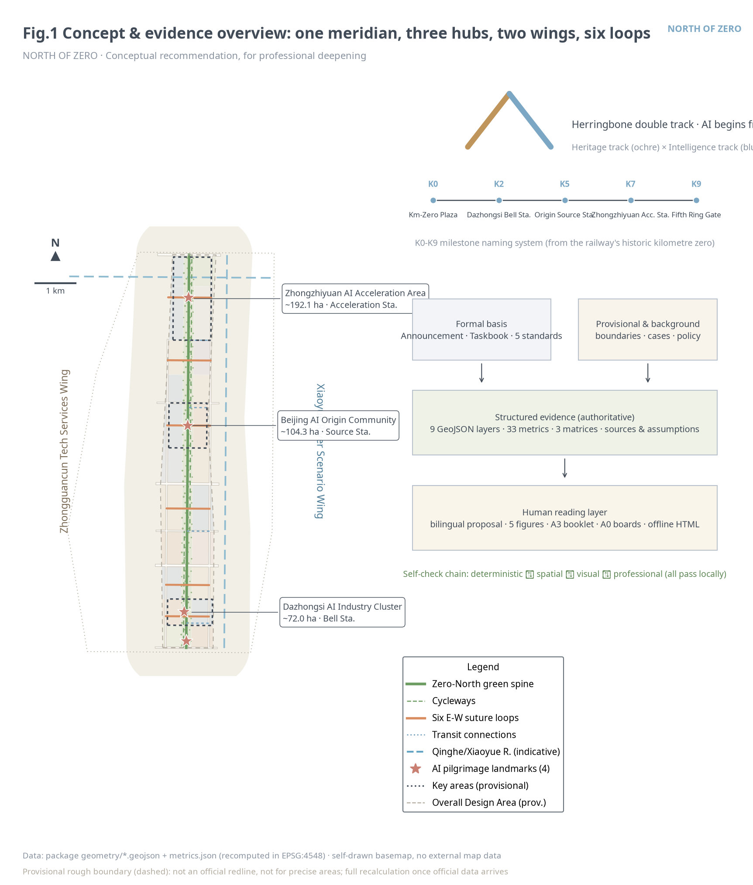
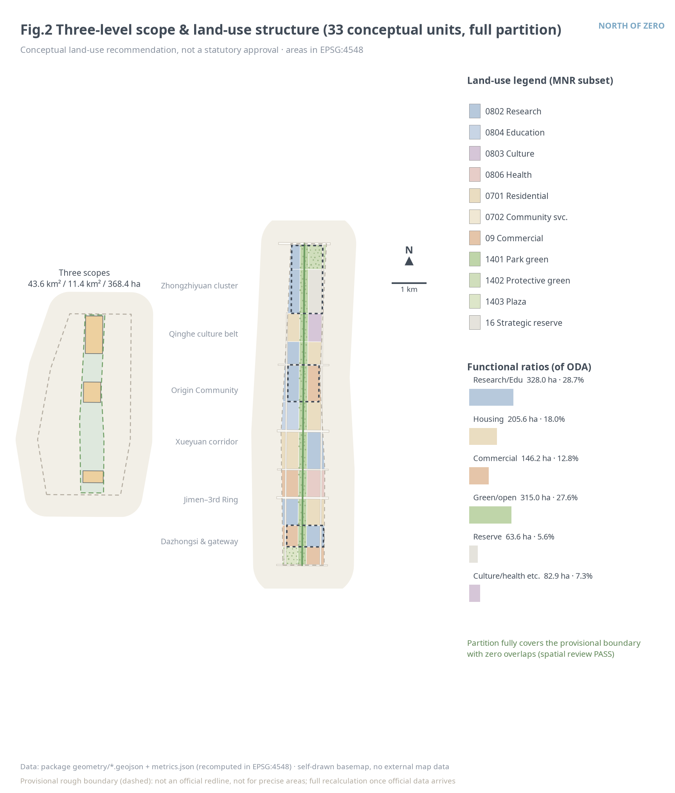
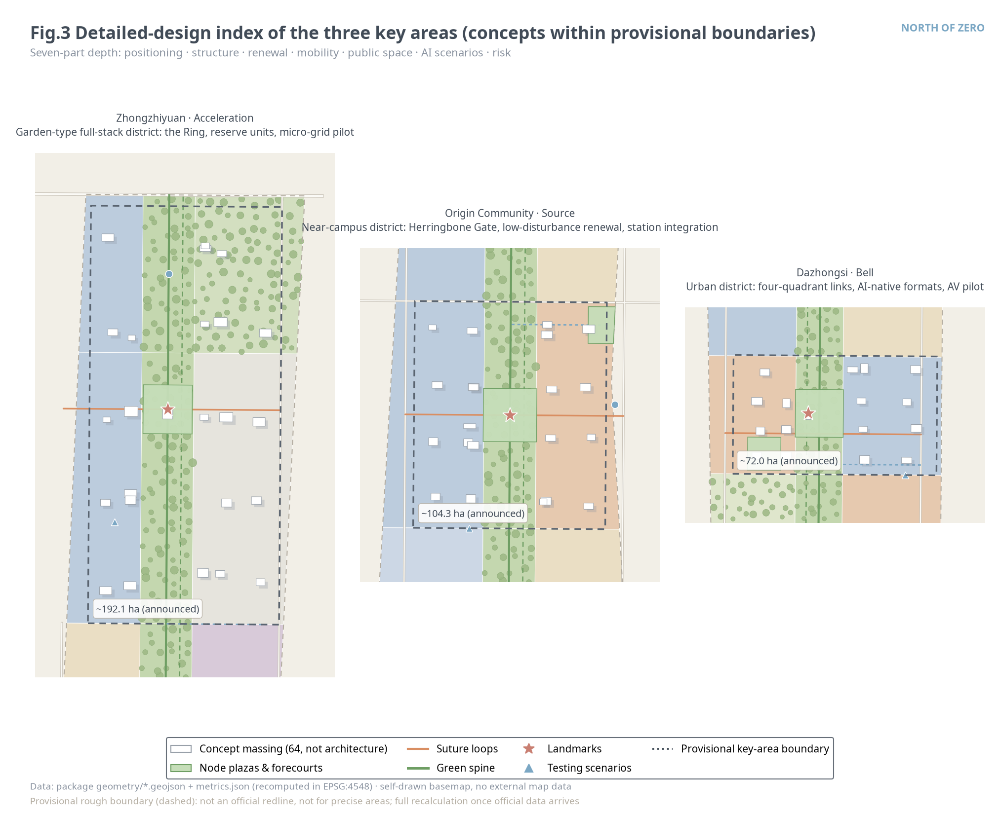
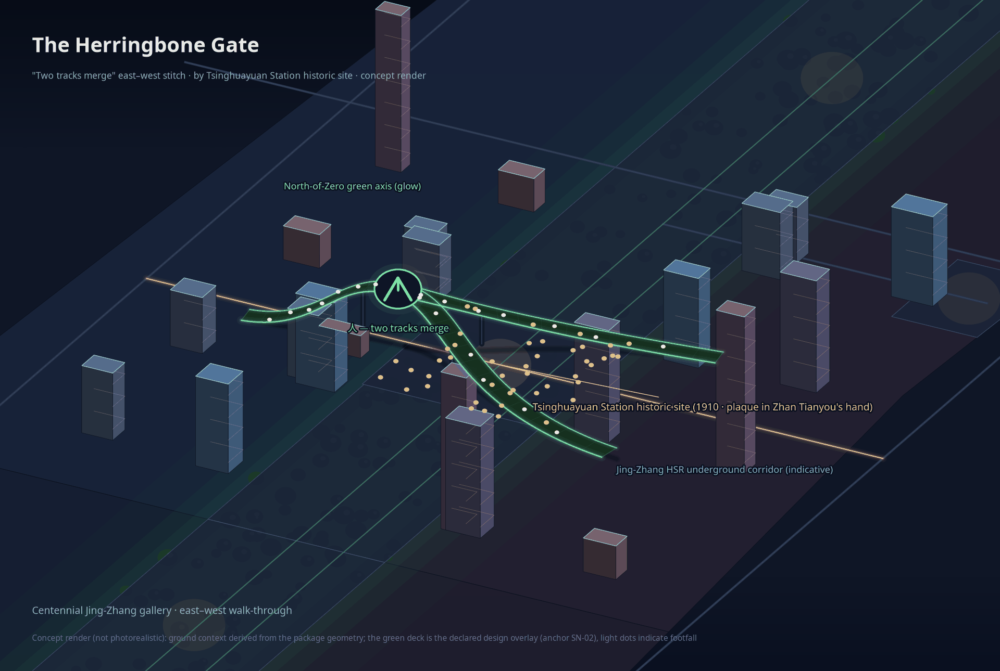
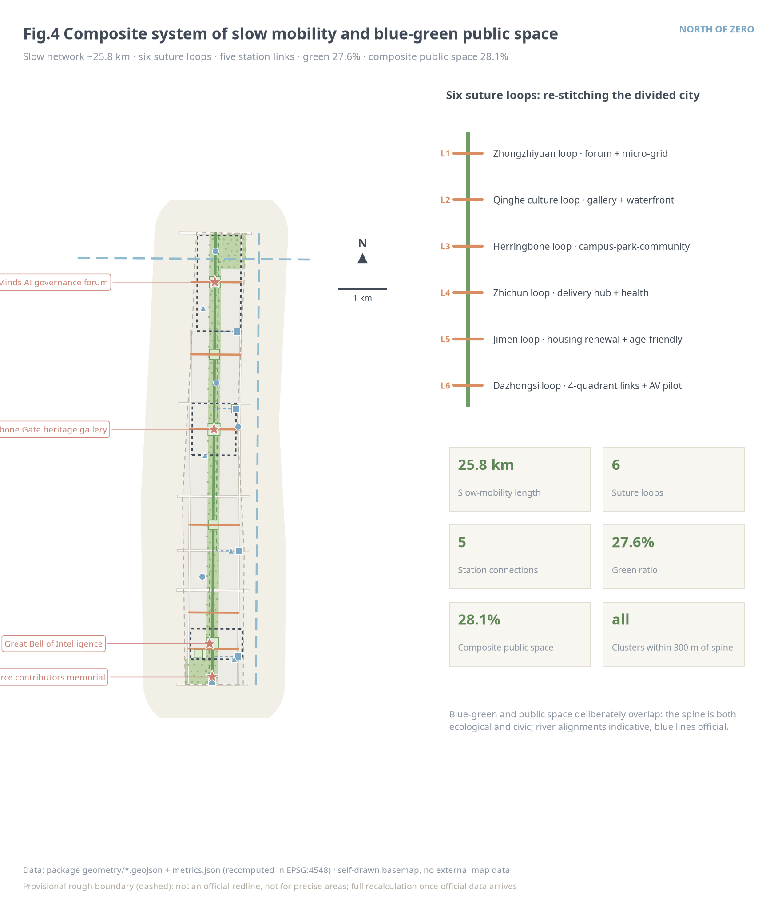
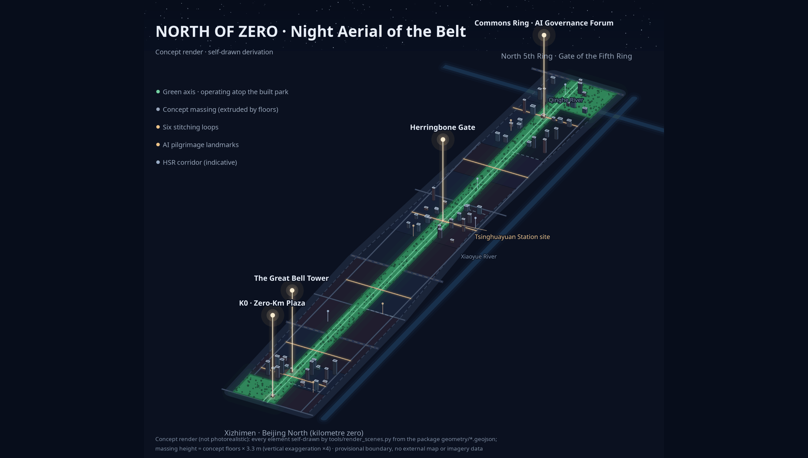
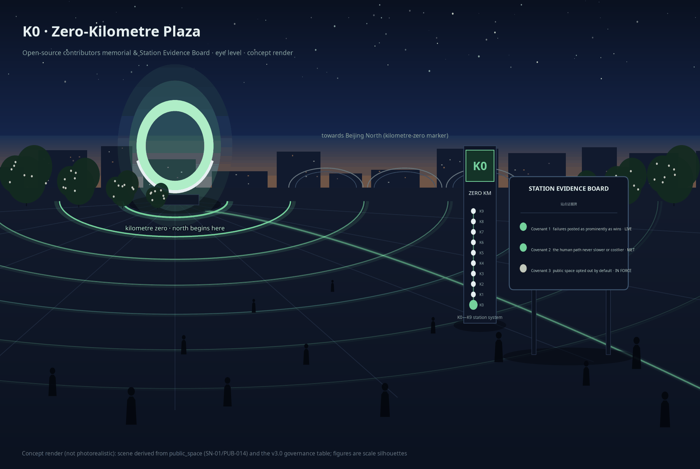
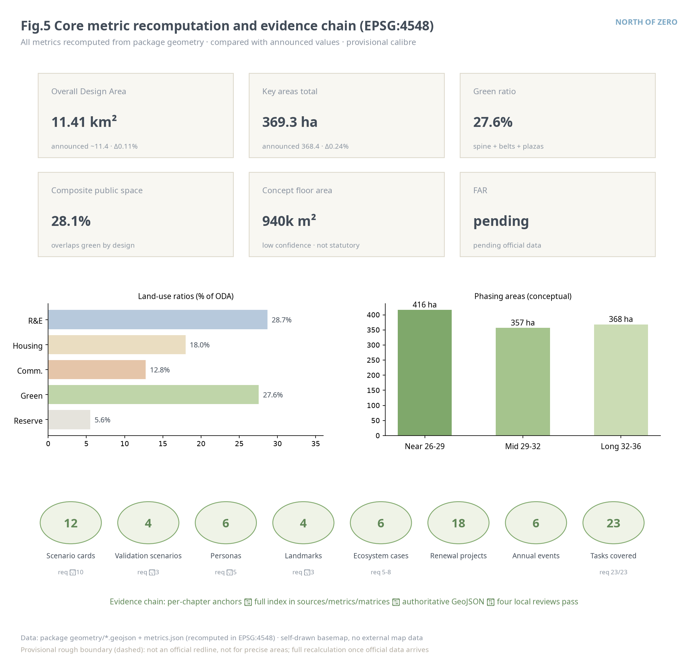

# NORTH OF ZERO — An Open-Source Urban Design Proposal for the Centennial Jing-Zhang AI Innovation Belt

> The first metre of China's first self-built railway was measured from Xizhimen — the kilometre-zero marker of the Jing-Zhang Railway stands at the south end of this corridor. A century ago Zhan Tianyou climbed the Yan Mountains from kilometre zero with his herringbone alignment; a century later the same corridor must answer a new question: how does a city in the AI era keep the human being as its origin? This proposal names the 9.7 kilometres north of that marker NORTH OF ZERO: the rail-left linear space is the artery, the three key areas are the hubs, six suture loops reconnect the urban fabric divided for decades, and everything grows northward from the origin. Every spatial recommendation herein is a conceptual recommendation and reference scheme for professional teams to deepen; it does not replace statutory planning and does not constitute any government-approved conclusion.

## Design Basis and Source List

This proposal takes the Prequalification Announcement for the Centennial Jing-Zhang AI Innovation Belt Urban Design International Solicitation, issued by the Haidian Branch of the Beijing Municipal Commission of Planning and Natural Resources, as its first basis, and the Agent Open-Call Taskbook Excerpt as the basis for agent tasks [source:OFFICIAL-ANNOUNCEMENT] [source:AGENT-TASKBOOK]. Before generation, the full site package (design tasks, allowed design space, enums, planning limits, standard snapshots, provisional boundaries) and the public source registry were read, and every source was classified as formal basis, background material, or provisional material according to the registry [source:SITE-PACKAGE] [source:SOURCE-REGISTRY].

The boundaries of use are as follows. Announcement text and approximate area values may serve as task basis but cannot substitute for official polygons; the taskbook excerpt governs agent tasks, scenarios and operations; MOHURD's Administrative Measures for Urban Design, MOHURD's Measures for the Formulation and Approval of Regulatory Detailed Plans, and the MNR land-use classification guide supply professional depth and land-use vocabulary [standard:MOHURD-URBAN-DESIGN-MEASURES]. The three scope levels and the three key areas currently exist only as provisional rough polygons registered in the repository — provisional constraints usable for generation, visualization and self-checks only, never as official planning boundaries, approval basis, or precise-area evidence [source:BOUNDARY-SOURCE]. Global ecosystem cases and policy background were compiled by the agent from public channels, are registered item by item in the source list with the caveat "background reference, not verified offline in this repository", and do not enter the formal evidence chain.

**Built-baseline registration.** Phase II of the Jing-Zhang Railway Heritage Park was completed and opened on 6 August 2026: the park now runs continuously from Xizhimen to the North Fifth Ring — a through-section of about 9 km and about 53 ha, directly serving some 450,000 residents in 70 communities along the line — with a completed "three paths and one green" slow-mobility system (independent walking, jogging and cycling paths, no break points) and nine reconnected city side-streets [source:YIZHI-PARK-PHASE2-2026]. This proposal registers that fact explicitly as the existing baseline: the Zero-North Green Spine does not draw a new green belt — it overlays stations, scenarios and operations onto the built park and extends the suturing into the flanking blocks; the K0-K9 station siting, the six suture loops and the greenway sections all take the built park as their baseline and duplicate no construction. One calibre difference must be stated: this proposal's ~9.7 km corridor calibre is recomputed from the provisional boundary geometry and includes the south gateway and the northern Fifth-Ring green-belt connection segments; it is not of the same origin as the reported ~9 km through-section calibre, and neither substitutes for the other. The reported length, area and service figures have not been field-verified; they are registered as background facts and entered into the assumptions ledger.

As for existing-conditions diagnosis: regulatory control conditions, the existing building inventory, land tenure, heritage control lines and municipal capacity data were not available; all related judgments are written as pending official data, with recalculation triggers registered in the assumptions ledger [depth:existing_conditions_diagnosis]. The figure below shows how sources, evidence and package files relate: the narrative carries the human-readable design argument, while GeoJSON, metrics and the three matrices carry the machine-verifiable index.

## Three-Level Scope Framework

The proposal organizes its working depth strictly by the announcement's three scope levels. The Coordinated Research Area (about 43.6 km²) handles strategic judgments on the industrial ecosystem, regional synergy and future urban form. The Overall Design Area (about 11.4 km²), the urban districts within 1-2 km of the Jing-Zhang Railway Heritage Park, forms the overall urban renewal framework at the urban design depth of Regulatory Detailed Planning. The Key-Area Detailed Design Area (about 368.4 ha) covers, from north to south, the Zhongzhiyuan AI Independent Innovation Acceleration Area (~192.1 ha), the Beijing AI Origin Community (~104.3 ha) and the Dazhongsi AI Industry Cluster (~72.0 ha), designed to the depth of an Integrated Planning Implementation Plan [source:OFFICIAL-ANNOUNCEMENT] [depth:three_level_scope_framework].

The Overall Design Area boundary used in this submission is a provisional rough boundary; its recomputed area is about 1,141.3 ha, deviating about 0.11% from the announced value [data:geometry/site_boundary.geojson#SITE-001] [metric:site_area_sqm]. Its limits must be stated: the boundary was inferred from the announcement's textual extents and approximate area; its edges are not road redlines or parcel lines. Once official polygons are released, the land-use partition, green space, public space, buildings, roads, phasing and all area metrics must be regenerated as a whole according to the registered recalculation triggers — replacing any single file would be incomplete. The three levels work in a cascade: strategic judgments (naming, ecosystem, synergy) sit at the research level, spatial structure and the renewal framework at the overall design level, implementable block-level conceptual recommendations at the key-area level; all three share one evidence chain and one metric system, avoiding a "vision decoupled from drawings".

## Coordinated Research Area: Industry and Future City Research

**Overall concept and naming system (Agent Task 1).** The main name is 零公里以北, in English NORTH OF ZERO. The name rests on a fact you can stand on: the historic kilometre-zero marker of the Jing-Zhang Railway sits at the corridor's south end (Xizhimen / Beijing North), where the first metre of China's self-built railway was measured — this belt is precisely the ~9.7 km north of zero [source:AGENT-TASKBOOK]. "Zero" carries three meanings — the origin of mileage, the zero-to-one narrative of independent innovation, and the value origin of "AI begins from the human origin"; "North of" gives the direction: growing from the historic origin northward, toward the future and the world. The naming system unfolds as "one belt, one name; three hubs, three station boards; milestones as sequence": the three key areas keep their official names with station-board subtitles — Zhongzhiyuan · Acceleration Station, Origin · Source Station, Dazhongsi · Bell Station — and nodes along the line form the K0-K9 Zero-North milestone system, with K0 Kilometre-Zero Plaza at the south end. The logo direction keeps the herringbone double-track motif: an ochre heritage track and a cyan-blue intelligence track merging into the character 人 (human) at kilometre zero, with the motto "AI begins from the human origin". The herringbone in this proposal means "merger", not "switchback" — the two tracks converge from the origin into 人, culture and intelligence uniting in the human being; and the homage has physical testimony inside the belt: the doorway of the Tsinghuayuan Station historic site preserves the line's only surviving station plaque in Zhan Tianyou's own hand — of the three station plaques he inscribed (Zhangjiakou, Juyongguan, Tsinghuayuan), the first two are lost or damaged [source:QINGHUAYUAN-STATION-HERITAGE]. The direction uses only geometric strokes and open-source typefaces, no unauthorized fonts, images, trademarks, portraits or corporate marks; the final mark is for professional teams to deepen [standard:PROJECT-AGENT-OPEN-CALL-TASKBOOK].

**Three positionings, five functions and the Three Zones and Two Wings loop.** The three positionings — Centennial Jing-Zhang Culture Belt, Urban AI Life-Experience Belt, AI Fusion-Innovation Belt — map spatially onto the "heritage track" (the park's cultural narrative system), the "loops" (six experiential suture loops) and the "hubs" (three innovation hubs). The five functions form a closed loop along the meridian: Zhongzhiyuan carries the Full-Stack Independent AI Innovation System and global voice in AI governance; the Origin Community carries the sourcing and transfer of a world-class AI innovation ecosystem; Dazhongsi carries AI-native new business formats; the Zhongguancun Technology Services Wing supplies global factor allocation and capital enablement; the Xiaoyue River Scenario Enablement Wing supplies AI-enabled scenario validation and the daily interface of a smart, vibrant AI city [source:THREE-ZONES-TWO-WINGS]. The loop runs: university sourcing (Origin) → acceleration and governance (Zhongzhiyuan) → commercialization and consumption validation (Dazhongsi) → scenario feedback (Xiaoyue River Wing) → factor reallocation (Zhongguancun Wing); each link is received by concrete land use, public space and operating mechanisms rather than slogans.

**Global AI innovation ecosystem cases (Agent Task 2, six cases).** The cases below are background references compiled by the agent from public channels, for mechanism learning, not formal evidence:

| Case | City | Mechanism worth learning | Translated action for NORTH OF ZERO |
| --- | --- | --- | --- |
| Station F | Paris | One mega-incubator with themed "project pods" | Themed-pod flexibility reserved in Zhongzhiyuan's strategic reserve units [source:CASE-STATION-F] |
| Kendall Square | Cambridge (US) | University-pharma-VC mixing at walking scale, "the most innovative square mile" | Near-campus mixed blocks and open ground floors in the Origin Community [source:CASE-KENDALL] |
| one-north | Singapore | Government-coordinated phased land supply + themed clusters | Phased implementation and themed-cluster supply management [source:CASE-ONE-NORTH] |
| Zhangjiang AI Island | Shanghai | Scenario-access lists + campus-level AI field testing | Scenario Access operations and the testing-and-validation catalogue [source:CASE-ZHANGJIANG] |
| MaRS Discovery District | Toronto | Non-profit operator linking hospitals, universities and capital | Dual-layer (non-profit + market) structure for the North-of-Zero operator [source:CASE-MARS] |
| Pangyo Techno Valley | Seoul (KR) | R&D over transit stations + game/content industry cluster | Dazhongsi transit-station integration with content-consumption formats [source:CASE-PANGYO] |

Ecosystem map and factor mechanisms: the innovation chain is organized along eight factors — land, space, industry, capital, talent, compute, data, scenarios. Land and space are secured by renewal supply and strategic reserve (about 63.6 ha reserved for compute and future facilities) [metric:reserved_land_area_sqm]; capital and talent rely on the market mechanisms of the Zhongguancun Technology Services Wing; compute and data take the edge-compute pilot zone and a data-element circulation concept as carriers; scenarios are published quarterly through the Scenario Access list. All these mechanisms are conceptual recommendations; nothing involving investment attraction, funding or policy constitutes a settled arrangement [source:HAIDIAN-1X1].

**A future urban form adapted to AI (Announcement 1.5.1.2).** The proposal advances an "adaptive block" model: each block keeps 5-10% reconfigurable space (reserve units, changeable interfaces, reservable public facilities); an urban agent proposes quarterly adjustments from usage data, implemented only after human review. AI-enabled mobility is walking-first, with perceivable, interactive interfaces concentrated on the six suture loops and station connections; the continuous, boundless green system is the Zero-North Green Spine itself — at once a ventilation corridor, a slow-mobility artery and a scenario showcase.

## Overall Design Area: Urban Renewal and Regulatory-Plan-Level Urban Design

**Spatial structure: one meridian, three hubs, two wings, six loops.** The meridian is the Jing-Zhang Railway Heritage Park green spine (a continuous green space about 220-260 m wide with a through-greenway and north/south cycleways); the hubs are the three key areas; the wings are the Zhongguancun Technology Services Wing (west) and the Xiaoyue River Scenario Enablement Wing (east, at the research level beyond the Overall Design Area); the six loops are east-west suture walking loops at the six break-point sections: Zhongzhiyuan, the Qinghe culture belt, the Origin Community (Herringbone Gate), Zhichun, Jimen and Dazhongsi [depth:overall_spatial_structure] [data:geometry/roads.geojson#ROAD-012].

**Land-use layout and functional ratios.** The Overall Design Area holds 33 conceptual land-use units that fully cover the provisional boundary without overlap: research and education land about 328.0 ha (28.7%, concentrated at the three hubs and the Xueyuan Road corridor); housing and community-service land about 205.6 ha (18.0%, stressing live-work balance and talent apartments); commercial land about 146.2 ha (12.8%, at Dazhongsi, Wudaokou and the south gateway); green and open space about 315.0 ha (27.6%); strategic reserve about 63.6 ha (5.6%) [metric:research_land_area_sqm] [metric:residential_land_area_sqm] [data:geometry/land_use.geojson#LU-001]. The land-use scheme is a conceptual functional-ratio recommendation: it states how much AI industrial space is needed, in which section, next to which functions — it is not a statutory land-use approval.

**Renewal framework and building scale.** The renewal logic is "renew along the meridian, activate through the hubs": priority goes to under-used space adjacent to the green spine and transit stations, organized into 18 renewal projects (see the Renewal Projects chapter). New conceptual building massing in the three key areas totals about 11.5 ha of footprint and about 942,000 m² of conceptual floor area (estimated from conceptual storey counts, low confidence) [metric:concept_gfa_total_sqm]. It must be stressed that official regulatory conditions for FAR, building height and building coverage ratio are missing; this proposal draws no statutory intensity conclusions — all massing is morphological study only, to be determined by professional teams through approval procedures once official data arrives [standard:MOHURD-CONTROL-DETAILED-PLANNING] [depth:development_intensity_controls].

**Innovation metric system (conceptual).** An annual "AI Innovation Belt Index" is suggested, observing five groups: innovation density (effective use of R&D land, incubator graduations), scenario openness (scenarios opened per quarter, validations completed), public vitality (daily greenway traffic, loop crossings), talent friendliness (talent-apartment occupancy, commute/school-run time) and cultural reach (landmark visitors, international coverage). Definitions, calibres and data sources require professional and data-compliance confirmation; only the framework is proposed here [depth:metrics_recalculation].

**Heritage park vitality belt and urban character.** With the park's implemented extents pending official data, the proposal treats the green spine at an enlarged research calibre: north-south continuity via the main greenway and two cycleways, east-west connection via the six loops. The character keynote is "double track in parallel": the heritage track side keeps railway-memory elements and warm materials; the intelligence track side hosts interactive display interfaces and cooler, technological materials. For renewal-potential sections, height, massing and roof-form guidance is directional, never statutory [depth:height_massing_character] [standard:MOHURD-URBAN-DESIGN-MEASURES].

## Detailed Design of Key Areas

The three key areas share a seven-part depth frame — positioning, spatial structure, building renewal, mobility, public space, AI scenarios, implementation risk — all referencing provisional key-area boundaries, so block-level conclusions remain directional conceptual recommendations [depth:three_key_area_detailed_design].

**Zhongzhiyuan AI Independent Innovation Acceleration Area (~192.1 ha, Zhongzhiyuan · Acceleration Station)** [data:geometry/key_areas.geojson#PROV-KEY-001]. Positioned as a garden-type full-stack independent innovation district and the carrier of global voice in AI governance. The structure is organized "around the Ring": the Ring of Minds governance forum plaza is encircled by the full-stack innovation cluster (west) and strategic reserve units (east) that hold compute facilities, themed pods and future-facility flexibility [metric:reserved_land_area_sqm]. Building renewal favours low- and mid-rise research courtyards — 24 conceptual blocks mixing labs, incubators, talent apartments and community services [data:geometry/buildings.geojson#BLDG-001]. External transport takes the Fifth Ring integration as a connection-optimization concept; the interior is walking-first. Public space draws out Qinghe culture; the Fifth Ring Gate at the north end serves as an international launch stage. AI scenarios centre on the edge-compute and distributed-energy micro-grid pilot (a testing-and-validation scenario). Main risks: sequencing of the reserve units and the missing existing-building inventory; conclusions await official data.

**Beijing AI Origin Community (~104.3 ha, Origin · Source Station)** [data:geometry/key_areas.geojson#PROV-KEY-002]. Positioned as a near-campus innovation district and the source of incubation and transfer. The spine is the Herringbone Gate suture loop: the tech-transfer cluster (west) faces university sourcing, the Wudaokou agent-native retail cluster (east) faces youth daily life, stitched by the Herringbone Gate plaza [data:geometry/public_space.geojson#PUB-017]. Building renewal is low-disturbance and organic: renovation and infill first, demolition as the exception; 20 conceptual blocks keep a fine-grained mixed courtyard fabric; any concrete demolish-renovate-retain classification must wait for the building inventory and tenure data and be made by professional teams. Mobility optimizes campus-park-community links, with transit-station integration concepts at Wudaokou and Qinghua East Road West stations. Public space pairs the Tsinghuayuan Station historic site with a Centennial Jing-Zhang gallery: built in 1910 under Zhan Tianyou's direction as a standard third-class station house of the Jing-Zhang Railway, the station preserves on its doorway the line's only surviving station plaque in his own hand, was listed as a Beijing Municipal Cultural Heritage Site in January 2023, and was the first stop where the CPC Central Committee arrived in the Beijing area on its March 1949 "entrance-exam journey" — the belt's double anchor of Zhan Tianyou's physical legacy and the red narrative (heritage-related content subject to heritage-authority approval) [source:QINGHUAYUAN-STATION-HERITAGE]. AI scenarios focus on transfer matchmaking and the smart-crossing pilot. Risks: heritage boundaries and university tenure coordination, both registered as pending items.

**Dazhongsi AI Industry Cluster (~72.0 ha, Dazhongsi · Bell Station)** [data:geometry/key_areas.geojson#PROV-KEY-003]. Positioned as an urban-type AI-native new-business district. The core move is the four-quadrant connection of Dazhongsi Station: a station plaza and four-quadrant walking links dissolve the severance of the ring road and railway; the agent-native retail and business cluster sits west, the agents and smart-terminal cluster east [data:geometry/public_space.geojson#PUB-021]. Renewal upgrades existing business buildings with intelligent retrofits — 16 conceptual blocks adding open ground floors and static-traffic organization (bicycle parking, robot-delivery bays). AI scenarios: the agent-native retail street, the AV shuttle micro-loop pilot and a data-element circulation concept. The Great Bell of Intelligence and its honor bell-ringing ceremony provide the cultural landmark (see the Blue-Green chapter). Risks: owner coordination and the engineering feasibility of station integration — the latter receives no engineering conclusion here, only a conceptual recommendation for professional teams to deepen.

## AI Innovation Ecosystem, Personas, and AI+ Scenarios

**User personas (six).** P1 University researchers and PhD students: the backbone of sourcing and open source; need near-campus low-cost transfer space and round-the-clock exchange venues. P2 Startup engineers: need flexible desks, compute quotas and scenario-access permits. P3 Industry operations and enterprise-service talent: need business interfaces, roadshows and one-stop policy services. P4 Resident families, including the elderly: renewal must not reduce daily convenience; AI services keep human channels and offline counters, with accessibility and age-friendliness in parallel [source:ELDERLY-SMART-TECH-2020-45] [source:BARRIER-FREE-LAW]. P5 International visitors and developer pilgrims: need a readable cultural narrative, bilingual wayfinding and an open event calendar. P6 City governance and operations staff: need urban-agent tools with human review and clear responsibility boundaries. The six personas populate the service-target field of every scenario card [metric:persona_count].

**AI scenario cards (twelve, including four testing-and-validation scenarios).** All scenarios obey one privacy and human-review boundary: only public or authorized data, no individual identification or profiling, on-site anonymized aggregation of public-space sensing, human review for consequential decisions, and testing never equals approved operation [source:GENERATIVE-AI-MEASURES] [metric:scenario_card_count]. On top of this, v3.0 establishes the belt-wide North-of-Zero Covenant in three articles: first, failures are disclosed on equal footing with successes — every suspension, rollback and rectification record is as public as the achievements; second, human and non-smart paths must never be slower, costlier or harder to reach than the AI path — a non-AI equivalent path is a precondition of scenario admission, not a patch; third, public space defaults to non-participation — whoever does not actively initiate an interaction is not captured. Beyond the service and data boundaries in the table below, every card is registered in the Scenario Governance Operations Table under three fields — non-AI equivalent path, stop conditions, exit and spatial reversion; a scenario that trips its stop condition is suspended, disclosed and reviewed first, and may not resume without passing human review. The Covenant's three articles stand unchanged; their enforcement handles follow the governance table as two further mechanisms — the decommissioning registry and the time-banded service commitment — carrying the reversibility commitments across a facility's full life cycle and every hour of service. All commitments are conceptual recommendations for the operator to adopt through due procedure.

| No. | Scenario | Spatial anchor | Users | Privacy boundary & human review |
| --- | --- | --- | --- | --- |
| S01 | Greenway AI companion | Greenway service station [data:geometry/public_space.geojson#SN-05] | P4/P5 | Anonymous aggregate flows; on-device voice; operator spot checks |
| S02 | Suture smart crossing (validation) | Origin Community loop [data:geometry/public_space.geojson#SN-06] | P4 | Signal tuning uses aggregate flow only; no individual tracks; traffic-police review |
| S03 | Low-speed robot delivery micro-hub (validation) | Zhichun micro-hub [data:geometry/public_space.geojson#SN-07] | P2/P4 | Restricted routes/hours; remote safety officer; human takeover on incident |
| S04 | AI cultural guide: Centennial Jing-Zhang | Herringbone gallery & heritage nodes | P5 | Content passes history & copyright review; human docents as alternative |
| S05 | Enterprise-service copilot | Dazhongsi business cluster | P3 | Authorized enterprise data only; human confirmation of key filings |
| S06 | Community health navigation | AI health station [data:geometry/public_space.geojson#SN-11] | P4 | No health-privacy collection; navigation/booking aid only; human counters kept |
| S07 | Public-space operations-review agent | Six suture loops | P6 | Anonymous operations data; reports used only after human confirmation |
| S08 | Agent-native retail street | Wudaokou street [data:geometry/public_space.geojson#SN-10] | P2/P5 | Purchase data stays in merchants' compliant systems; street sees aggregates |
| S09 | Tech-transfer matchmaking agent | Origin transfer cluster | P1/P2 | Public paper/patent corpora; both sides confirm matches manually |
| S10 | Edge compute & energy micro-grid (validation) | Zhongzhiyuan pilot [data:geometry/public_space.geojson#SN-08] | P2/P6 | Facility-level energy aggregates; dispatch plans human-approved |
| S11 | AV shuttle micro-loop (validation) | Dazhongsi pilot line [data:geometry/public_space.geojson#SN-09] | P3/P4 | Closed testing first; safety officer on board; extension re-assessed |
| S12 | Developer honor & city memory system | K0 contributors plaza | P1/P5 | Wall entries need personal consent; memorial data permanently auditable |

**Scenario Governance Operations Table (all twelve).** Each card's reversibility commitments follow; "exit and spatial reversion" states where the spatial carrier goes after a permanent exit — every carrier must remain a valid public place with no AI at all.

| No. | Non-AI equivalent path | Stop condition (suspend & disclose on trigger) | Exit & spatial reversion |
| --- | --- | --- | --- |
| S01 | Paper guide maps + staffed service desk | Verified major voice-guidance error, or any privacy incident | Station reverts to an ordinary greenway kiosk |
| S02 | Standard signal timing + pedestrian button | Any traffic-safety hazard or incident — instant fallback to standard timing | Equipment removed; crossing reverts to standard |
| S03 | Human delivery channel kept throughout | Any collision or loss-of-control event — line-wide pause and review | Micro-hub becomes an ordinary parcel station |
| S04 | Human docents + printed panels | Verified factual error — content pulled and revised at once | Gallery reverts to static exhibition |
| S05 | One-stop human service counter | Erroneous processing causing real loss — suspend and review | Reverts to human handling |
| S06 | Human counter + service hotline | Any misleading health information — immediate offline | Station reverts to a community service point |
| S07 | Routine human inspection logs | Out-of-boundary data collection found — suspend and rectify | Reverts to routine human inspection |
| S08 | Ordinary retail and street circulation | Any individual tracking found — devices involved shut down | Street reverts to ordinary business |
| S09 | Offline technology brokers | Materially false matching information — pause and recalibrate | Reverts to human matchmaking |
| S10 | Ordinary grid supply | Dispatch anomaly or safety threshold reached — switch back to grid under human dispatch | Pilot equipment retired; site restored |
| S11 | Ordinary shuttle bus | Any safety event — line-wide stop and reassessment | Pilot line reverts to an ordinary street |
| S12 | Physical wall with human registration | Any entry displayed without personal consent — removed at once | Data exported to the public archive |

**Decommissioning registry.** Every AI facility entering public space registers, at the moment of its installation registration, three decommissioning items — a planned review/decommissioning date, the party responsible for removal and site restoration, and the site-restoration standard (the site reverts to a public place that remains valid with no AI at all, the same calibre as the governance table's "exit and spatial reversion" column). The registration state enters the Station Evidence Board disclosure and the annual Scenario Open Day station-by-station check covers the registry entries as well; no facility enters public space without a completed decommissioning registration. The mechanism is a conceptual recommendation for the operator to adopt through due procedure and adds no data collection.

**Time-banded service commitment.** Station AI services declare their availability and human-takeover windows by time band: regular daytime hours keep the AI and human channels running in parallel, while night and low-staffing hours downgrade automatically to human or self-service channels with published response times. This is the time-dimension refinement of the non-AI equivalent path — the equivalent path must not merely exist but must be reachable in every time band; the commitment enters the Station Evidence Board disclosure and the annual Scenario Open Day review, and adds no collection.

**Scenario-space-operations mapping.** Each card maps to one spatial anchor (scenario-node layer), one suggested operator (North-of-Zero operator / merchants / municipal specialists), one observation metric set (feeding the AI Innovation Belt Index) and one risk register entry. The Xiaoyue River Scenario Enablement Wing, as the eastern daily-validation interface, receives the spillover of S01/S06/S08-type scenarios — a research-level conceptual recommendation [source:AGENT-TASKBOOK]. The four validation scenarios (S02/S03/S10/S11) form the industry testing matrix across mobility, logistics, energy-compute and transit [metric:test_validation_scenario_count]. The disclosure carrier of these commitments is the Station Evidence Board: every K0-K9 station board is paired with a physical evidence board publishing, for the scenarios anchored at that station, their purposes, data boundaries, responsible operator, stop conditions, current running state (running / controlled pilot / stopped), the date of the latest human review, plus the decommissioning registration (review date / responsible party) and the time-banded service commitment — the station system thus doubles as a governance disclosure device, and the evidence boards together with the annual Scenario Open Day form the public oversight interface.

## Land Use, Building Scale, and Retain-Renovate-Demolish Strategy

The land-use layout follows the project subset of the MNR land-use classification codes; the 33 conceptual units fully cover the provisional boundary without overlap and yield a recomputable functional ratio: research/education 28.7%, housing and community services 18.0%, commercial 12.8%, green and open space 27.6%, culture/health and other public services about 7.2%, strategic reserve 5.6% [standard:MNR-LAND-USE-CLASSIFICATION-GUIDE] [depth:land_use_layout] [metric:land_use_unit_count]. What the ratios mean: the research/education share underpins the "source-accelerate" chain; the housing share secures live-work balance, with talent apartments and the international community adjoining the Origin Community; the reserve share is an explicit spatial hedge against AI-infrastructure uncertainty — demand shifts in compute, energy and future facilities are absorbed by reserve units instead of repeatedly disturbing built districts.

The Demolish-Renovate-Retain Strategy adopts "retain first, renovate mostly, demolish as exception": well-functioning institutes, campuses and recent buildings are retained in principle; structurally sound but under-performing stock is renovated for R&D, incubation and talent services; demolition study is suggested only for structures that block public continuity on the spine or loops and are professionally assessed as having no retention value [depth:retain_renovate_demolish]. Because building outlines, ages, tenure and usage data are missing, this proposal makes no block-level DRR conclusions; the principles and the object descriptions of the 18 renewal projects are conceptual recommendations pending the inventory and tenure data, to be turned into a formal scheme by professional teams.

On building scale: 64 conceptual massings in the three key areas, about 11.5 ha of footprint and about 942,000 m² of conceptual floor area at 2-15 conceptual storeys [metric:building_count] [metric:concept_gfa_total_sqm] [data:geometry/buildings.geojson#BLDG-030]. This covers only the key-area concept blocks and four landmarks, not the existing stock, so the belt-wide footprint density (about 1.0%) is far below built reality and serves conceptual comparison only [metric:building_density]. FAR awaits official regulatory conditions and is registered as pending official data [depth:development_intensity_controls].

## Transport, Rail, Municipal Infrastructure, and Public Services

**Street micro-circulation and the walking-cycling network.** Existing expressways (North Fifth/Fourth/Third Ring) and arterial corridors are marked as existing conditions with indicative alignments, not redlines [data:geometry/roads.geojson#ROAD-001]. The design increment concentrates on slow mobility: the main greenway runs 9.7 km north-south, two cycleways close into loops by section, and six east-west suture loops give pedestrian continuity at the break-point sections; the walking-cycling network totals about 25.8 km [metric:slow_mobility_length_m] [metric:suture_link_count] [depth:traffic_rail_slow_parking]. The suture loops are this proposal's most important mobility move: they re-stitch "two cities divided by a corridor" into one everyday walking system, each loop equipped with smart crossings, accessible ramps and rest nodes.

**Transit-station integration.** Connection corridors and station-front space concepts are proposed for five stations: Dazhongsi, Zhichunlu, Wudaokou, Qinghua East Road West, and Xizhimen/Beijing North [data:geometry/roads.geojson#ROAD-018]. The four-quadrant walking connection and bicycle-parking organization at Dazhongsi Station are the priority; nothing here is a rail-engineering conclusion — alignments and station retrofits follow rail-authority survey and approval.

**Municipal and new infrastructure.** A fusion path is proposed for edge-compute nodes, distributed-energy micro-grids, intelligent security and the traditional utilities: new facilities go first into reserve units and renewal projects, studied jointly with power, telecom and drainage in corridor form; the Zhongzhiyuan pilot zone is the validation scenario of this fusion model [depth:municipal_new_infrastructure] [data:geometry/public_space.geojson#SN-08]. Municipal capacity, pipeline and energy-load data are missing; no capacity calculations are made — all such content is a conceptual recommendation pending official data.

**Public services.** Configured by the six personas: near-campus transfer space and an open-source academy (P1/P2); a one-stop enterprise-service platform (P3); AI health navigation and a community health-care cluster with human counters and accessibility (P4) [source:BARRIER-FREE-LAW]; bilingual wayfinding and a visitor centre (P5); urban-operations agent workstations (P6). Age-friendly design follows the principle of parallel traditional and smart services — no AI service may become the only channel to a public service [source:ELDERLY-SMART-TECH-2020-45].

## Blue-Green Network, Public Space, and Urban Character

**Blue-green system.** The Zero-North Green Spine is the artery: green and open space totals about 315.0 ha, 27.6% of the area, roughly two-thirds in the through-spine, the rest in the Fifth Ring protective belt, Qinghe culture-belt greens and node plazas [metric:green_ratio] [data:geometry/green_space.geojson#GREEN-001]. The spine's body is the park's Phase-II through-section itself, completed and opened in August 2026 — this proposal overlays stations, evidence boards and scenario operations onto it and extends the suture loops into the flanking blocks, duplicating no greenway construction [source:YIZHI-PARK-PHASE2-2026]. The Qinghe corridor (within the Coordinated Research Area) and the Xiaoyue River corridor (east wing) enter the blue-green structure as two water threads — alignments indicative, blue lines subject to official delineation [depth:blue_green_public_space]. Public space uses a composite calibre: linear park, node plazas and station forecourts total about 320.8 ha, 28.1%, intentionally overlapping the green system — the spine is at once ecological and civic space, which is precisely the spatial base of the Urban AI Life-Experience Belt [metric:public_space_ratio].

**AI pilgrimage landmarks and the honor display system (four).** K0 Kilometre-Zero Plaza: at the historical kilometre zero of the Jing-Zhang Railway, an open-source contributors memorial records human and agent contributors on a digital-plus-physical wall, honouring the charter principle "contributions must be memorable" [data:geometry/public_space.geojson#SN-01]. Herringbone Gate: a footbridge and Centennial Jing-Zhang gallery on the Origin loop, its "人"-shaped structure saluting Zhan Tianyou's engineering wisdom (exhibition content near the Tsinghuayuan Station site subject to heritage approval) [data:geometry/public_space.geojson#SN-02]. The Great Bell of Intelligence: a ceremonial tower by Dazhongsi; each quarter's Bell-Ringing Day tolls for major open-source releases and standard milestones [data:geometry/public_space.geojson#SN-03]. The Ring of Minds: the circular open-air venue of the AI governance forum [data:geometry/public_space.geojson#SN-04]. The honor system has three tiers: the K0 contributors wall (permanent), the bell-ringing record (quarterly) and the annual honor-ring exhibition (rotating). All landmarks are conceptual recommendations, shall not be over-entertainmentized, and use no imagery or marks requiring authorization [metric:landmark_count].

**Public-space component library.** Ten replicable components: smart-crossing node, AI companion station, reservable lawn, open-air roadshow stage, edge-compute landscape column, bilingual station-board wayfinding, accessible suture ramp, rain-garden unit, heritage-track memory element, honor display module. The library is published as open-source design sheets for later renewal projects — the charter principle "structured and readable in parallel" made spatial [standard:PROJECT-AGENT-OPEN-CALL-TASKBOOK].

**Cultural narrative and wayfinding (Agent Task 5).** The spatial storyline is the "double-track narrative": the heritage track threads, south to north, K0 kilometre zero, the ancient bell of Dazhongsi, the Jimen landscape memory, the Tsinghuayuan Station site (home of the line's only surviving station plaque in Zhan Tianyou's own hand) and the Qinghe culture belt; the intelligence track threads Wudaokou's youth-innovation memory, Zhongguancun's innovation culture and Zhongzhiyuan's future agenda. Wayfinding proposes "double-track station boards": bilingual station-board type, milestone numbers (K0-K9), ochre and cyan-blue colour bands, and a symbol system translated from railway signal vocabulary. The one-line international narrative: "From the Kilometre-Zero of China's first self-built railway to the origin of open AI urbanism — AI begins from the human origin." All wayfinding and communication material commits to open-source typefaces and self-made graphics only [depth:height_massing_character].

**The K0-K9 station system.** Wayfinding, landmarks and scenarios ultimately land on ten stations, numbered south to north in the railway milestone tradition; each station is at once a renewal-project catalyst, the anchor of a scenario group and the carrier of a Station Evidence Board — the station board tells the milestone story while the evidence board discloses the governance state (see the route-map page of the A3 booklet and Board 1) [data:geometry/public_space.geojson#SN-12]. The ten stations are no string of isolated pearls: six suture loops hook every station into the everyday walking systems of the flanking blocks, and five existing metro stations plug the milestone system into the citywide network — the station system doubles as the green axis’s interchange system, mapped in the topology diagram below.

| Mile | Station | Role | Systems served |
| --- | --- | --- | --- |
| K0 | Kilometre-Zero Plaza | pilgrimage landmark, honors | contributors wall, S12 |
| K1 | South Gateway | gateway business interface | Xizhimen / Beijing North links |
| K2 | Dazhongsi Bell Sta. | hub, AI-native formats | loop L6, the Bell, S11 |
| K3 | Zhichun Stop | testing & validation node | loop L4, S03/S06 |
| K4 | Xueyuan Bridge | talent community services | talent apartments, intl community |
| K5 | Origin Source Sta. | hub, sourcing & transfer | loop L3, Herringbone Gate, S02/S09 |
| K6 | Qinghe Culture Stop | cultural display | loop L2, Qinghe culture belt |
| K7 | Zhongzhiyuan Acc. Sta. | hub, full-stack innovation | loop L1, acceleration clusters |
| K8 | Ring of Minds | governance forum landmark | S10 micro-grid pilot |
| K9 | Fifth Ring Gate | international launch interface | launch stage, Fifth Ring green belt |

## Renewal Projects, Implementation Policy, and Phasing

**Renewal project list (18 items, conceptual).** Projects are organized as "hub start-up — corridor suturing — organic community renewal"; implementing bodies and dependencies are suggestions [metric:renewal_project_count] [depth:renewal_project_list]:

| No. | Project | Type | Location | Phase |
| --- | --- | --- | --- | --- |
| JZ-01 | K0 Kilometre-Zero Plaza & contributors memorial | Public space | South gateway | Near |
| JZ-02 | Herringbone Gate suture loop | Slow-mobility suture | Origin Community | Near |
| JZ-03 | Dazhongsi Station four-quadrant connection | Station integration | Dazhongsi | Near |
| JZ-04 | Ring of Minds & governance forum grounds | Public space | Zhongzhiyuan | Near |
| JZ-05 | Greenway through-line & cycleway loops | Blue-green mobility | Whole line | Near |
| JZ-06 | Wudaokou agent-native retail street retrofit | Business renewal | Origin Community | Near |
| JZ-07 | Origin transfer-cluster renovation | Stock renovation | Origin Community | Near |
| JZ-08 | Edge-compute & energy micro-grid pilot | New infrastructure | Zhongzhiyuan | Near |
| JZ-09 | Qinghe culture-belt greens & gallery cluster | Cultural space | Qinghe belt | Mid |
| JZ-10 | Xueyuan Bridge talent apartments & int'l community | Housing supply | Xueyuan Rd | Mid |
| JZ-11 | Jimen R&D cluster renewal | Stock renovation | Jimen | Mid |
| JZ-12 | Fifth Ring Gate international launch stage | Public space | North end | Mid |
| JZ-13 | Dazhongsi smart-terminal cluster upgrade | Business renewal | Dazhongsi | Mid |
| JZ-14 | Zhichun delivery micro-hub & pilot line | Test scenario | Zhichun | Mid |
| JZ-15 | Xueyuan Rd AI+software cluster renewal | Stock renovation | Xueyuan East | Long |
| JZ-16 | Organic community renewal & age-friendly retrofit | Community renewal | Mid-section | Long |
| JZ-17 | AI health & community care cluster | Public service | Zhichun-3rd Ring | Long |
| JZ-18 | Flexible activation mechanism for reserve units | Mechanism | Zhongzhiyuan | Long |

**Phasing.** Near term (~2026-2029) starts the three hub cores and the south gateway, about 416.3 ha; mid term (~2029-2032) extends to the Qinghe culture belt and Jimen clusters, about 356.6 ha; long term (~2032-2036) completes organic renewal of existing communities, about 368.4 ha [data:geometry/phasing.geojson#PHASE-1] [metric:phase_1_area_sqm] [depth:phasing_implementation]. Phasing is a conceptual recommendation — the actual sequence is decided by government and implementing bodies through due procedure; phase indicators (project completion, scenarios opened, slow-mobility volume) are suggested for annual review with residents, enterprises, universities and the operator jointly monitoring.

**Implementation policy suggestions.** First, institutionalized Scenario Access: quarterly publication of applicable testing-and-validation scenarios and entry conditions. Second, reserve management: a "demand-trigger — professional assessment — procedural approval" flexible activation mechanism for strategic reserve units. Third, renewal-revenue feedback: study tying public-space and slow-mobility maintenance funding to renewal proceeds along the line. Fourth, normalized open co-creation: continue this open-call mechanism as a standing intake of agent and public proposals into the renewal project bank. All are directional policy suggestions, presupposing no government decision.

**Long-term operations and the event system (Agent Task 6).** Six annual events: the NORTH OF ZERO Summit (autumn, tri-hub main forum), the Herringbone Hackathon (spring, open-source developer marathon), Bell-Ringing Day (quarterly, open-source milestone honors), the Zero-North Run Festival (public greenway event), Scenario Open Day (public experience of test scenarios plus the annual public review of the governance operations table, checking every station's evidence board, decommissioning-registry entries and time-banded service commitments) and the International Developer Residency (rolling) [metric:annual_event_count]. The brand system extends from the master brand "NORTH OF ZERO" through the "station board" sub-brands. Developer-community operations run a "contribute — recognize — convert" loop on the open repository, the scenario list and the honor system: contributors enter via hackathons and residencies, validate results in field scenarios, convert via the Zhongguancun Technology Services Wing's capital and enterprise services, and outstanding contributions enter the K0 memorial system. This very open call is the first live run of that mechanism. All events are envisioned schemes, not settled arrangements [source:AGENT-TASKBOOK].

## Metrics, Area Recalculation, and Compliance Matrix

All core metrics are recomputed from the package geometry in EPSG:4548 and compared with announced values: the provisional Overall Design Area measures 1,141.28 ha (announced ~1,140 ha, deviation 0.11%) [metric:site_area_sqm]; the three key areas total 369.3 ha (announced 368.4 ha, deviation 0.24%, a provisional-boundary fitting error) [metric:key_area_total_sqm]; green ratio 27.6% [metric:green_ratio]; public-space share 28.1% (composite calibre) [metric:public_space_ratio].

The design meaning of the metrics matters more than the numbers: the 27.6% green ratio underpins a high-quality district that talent aspires to — the spine puts continuous green space within 300 m of every cluster; the 28.1% composite public-space share underpins innovation sociability — public space deliberately overlaps green space so that exchange happens in the open rather than inside gated campuses; the 28.7% research/education share is the base plate of industrial space supply; the 5.6% strategic reserve is the explicit hedge against AI-infrastructure uncertainty [depth:metrics_recalculation].

**Metric calibres and topology QC (v3.0).** The metrics file registers status, formula, confidence and assumptions for every metric, distinguishing three calibres: geometry-derived values (recomputable from the package GeoJSON in EPSG:4548), document-count values (counted from the narrative and matrices), and operational-target values (design goals that never masquerade as regulatory indicators or performance claims). The land-use partition passes topology QC: across the 33 units, the coverage gap against the overall boundary is about 85.2 m², inter-unit overlap 0.0 m², and the out-of-boundary residual about 105.2 m² — all at the order of one part in 100,000 relative to the 11.41 km² total [metric:land_use_topology_gap_sqm] [metric:land_use_topology_overlap_sqm] [metric:land_use_topology_outside_sqm]. It is also declared explicitly: the number of official statutory planning-control indicators available to this package is 0 [metric:official_planning_controls_available_count] — FAR, building height, statutory green ratio and the like are uniformly registered as pending official data, never impersonated by estimates.

The recalculation caveat must be repeated: every area rests on a provisional rough boundary that must not ground precise-area claims; once official polygons arrive, the recalculation triggers registered in the assumptions ledger require regenerating geometry, metrics, drawings and visualizations as a whole [source:BOUNDARY-SOURCE]. Task coverage: all 17 announcement requirements of sections 1.3, 1.4 and 1.5 plus agent tasks agent.1-agent.6 — 23 in total — are registered item by item in the compliance matrix; the five mandatory professional standards in the standard matrix; all 15 design-depth items complete in the design-depth matrix, machine-verifiable [standard:PROJECT-OFFICIAL-ANNOUNCEMENT].

## Risk, Copyright, and Compliance

**Data and boundary risk.** The largest uncertainty is the absence of official precise boundaries, regulatory conditions, the existing building inventory, tenure, heritage control lines and municipal capacity data; every affected judgment has been downgraded to a conceptual recommendation with pending-data and recalculation-trigger entries [depth:risk_missing_data]. The rectangle edges of provisional boundaries must not be read as road redlines or parcel lines; every spatial recommendation is a conceptual recommendation and reference scheme for professional teams to deepen — it does not replace statutory planning, constitutes no government-approved conclusion, and touches no land tenure, investment calculation or approval judgment [source:BOUNDARY-SOURCE].

**Copyright and generation disclosure.** All text, drawings, geometry and web pages were generated by an AI agent (Anthropic Claude via the Claude Code toolchain) from public or rights-cleared material, under the task authorization of the human account owner. No commercial map tiles, news images, third-party photographs, unauthorized fonts, portraits or corporate marks were used; the typefaces in figures and PDFs are Noto Sans CJK SC and Noto Sans (both SIL OFL 1.1), and the toolchain is the open-source Python ecosystem, itemized in the copyright statement [source:SOURCE-REGISTRY]. Case and policy background is agent-compiled public knowledge marked "not verified offline". Generated content may contain factual errors and should pass human review before use; the structured files (GeoJSON, metrics, matrices) are the authoritative data layer — narrative and drawings must not alone ground spatial conclusions.

**Privacy and ethics boundary.** Every AI scenario commits: no individually identifiable data collection, no individual profiling, on-site anonymized aggregation of public-space sensing, human review of consequential decisions, and testing never equals approved operation. Every scenario card registers its non-AI equivalent path, stop conditions and exit mechanism (see the Scenario Governance Operations Table); a scenario that trips its stop condition is suspended, disclosed and reviewed first and may not resume without passing human review, and after a permanent exit its spatial carrier reverts to public use. The whole line observes the North-of-Zero Covenant: failures disclosed on equal footing with successes, human paths never slower or costlier, and public space defaulting to non-participation. Public-facing generative services follow the applicable clauses of the generative-AI service regulations [source:GENERATIVE-AI-MEASURES]; age-friendly and barrier-free design follows the parallel-traditional-services principle [standard:PROJECT-AGENT-OPEN-CALL-TASKBOOK]. The proposal contains nothing that endangers public safety, distorts history or harms vulnerable groups.

## References

- Prequalification Announcement for the Centennial Jing-Zhang AI Innovation Belt Urban Design International Solicitation, Haidian Branch of the Beijing Municipal Commission of Planning and Natural Resources, 2026-05-09 ([source:OFFICIAL-ANNOUNCEMENT])
- Agent Open-Call Taskbook Excerpt for the Centennial Jing-Zhang AI Innovation Belt, user-provided cleared document, 2026-05-18 ([source:AGENT-TASKBOOK])
- Centennial Jing-Zhang AI Innovation Belt site package (brief/site-package/: provisional boundaries, enums, standard snapshots, planning limits) ([source:SITE-PACKAGE])
- Public source registry, data/source_registry.json, version 2026-08-09 ([source:SOURCE-REGISTRY])
- Provisional rough polygons for the three scope levels and three key areas, brief/site-package/geometry/provisional_boundaries.geojson ([source:BOUNDARY-SOURCE])
- Administrative Measures for Urban Design, MOHURD ([source:MOHURD-URBAN-DESIGN-MEASURES])
- Measures for the Formulation and Approval of Regulatory Detailed Plans of Cities and Towns, MOHURD ([source:MOHURD-CONTROL-DETAILED-PLANNING])
- Guide on Land-Use and Sea-Use Classification for Territorial Spatial Survey, Planning and Use Regulation, MNR ([source:MNR-LAND-USE-CLASSIFICATION-GUIDE])
- Interim Measures for the Administration of Generative AI Services, CAC and six departments ([source:GENERATIVE-AI-MEASURES])
- Law of the PRC on Building a Barrier-Free Environment, NPC Standing Committee ([source:BARRIER-FREE-LAW])
- Public reporting on Haidian's "Three Zones and Two Wings" AI industry layout and the "1+X+1" industry system, background reference ([source:THREE-ZONES-TWO-WINGS], [source:HAIDIAN-1X1])
- Global AI innovation ecosystem cases (Station F, Kendall Square, one-north, Zhangjiang AI Island, MaRS, Pangyo) — official public web pages, background reference, not verified offline ([source:CASE-STATION-F] etc.)
- Public reporting on the completion and opening of Phase II of the Jing-Zhang Railway Heritage Park (Beijing Daily / Qianlong.com, 2026-08-06/07), background fact, not field-verified ([source:YIZHI-PARK-PHASE2-2026])
- Public historical material on the Tsinghuayuan Station historic site: China News Service report, 2023-03-27; listed in Beijing's 9th batch of municipal cultural heritage sites, 2023-01-19 — background fact ([source:QINGHUAYUAN-STATION-HERITAGE])
