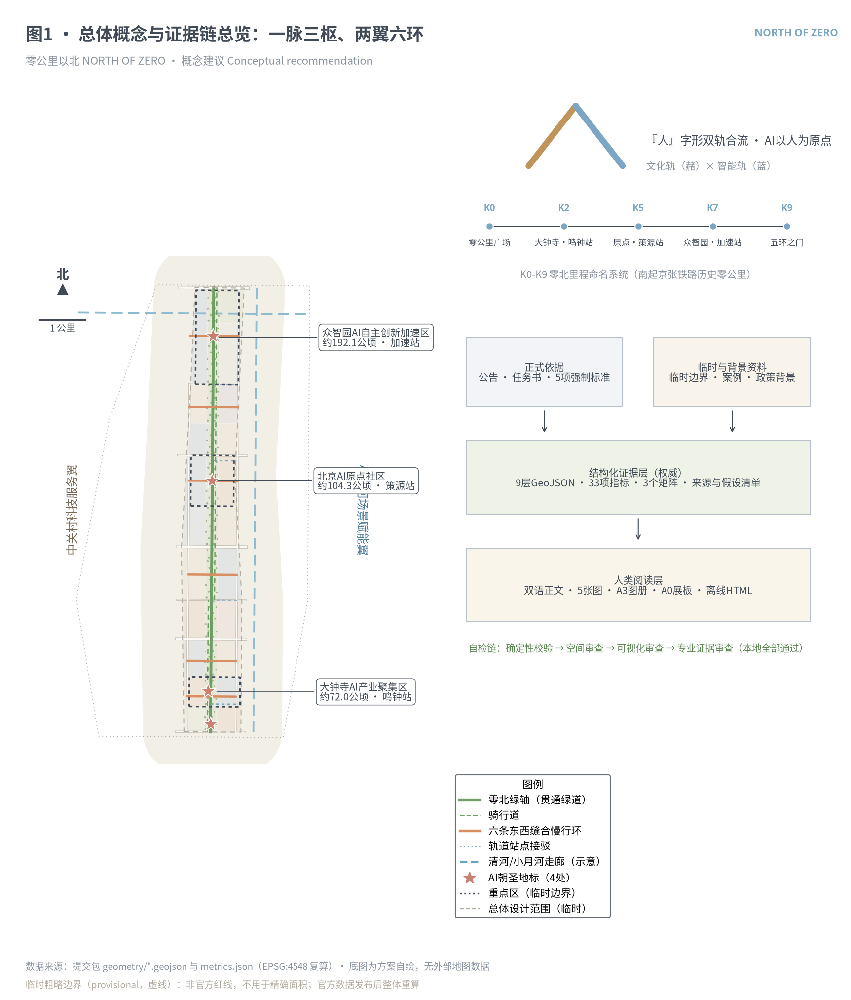
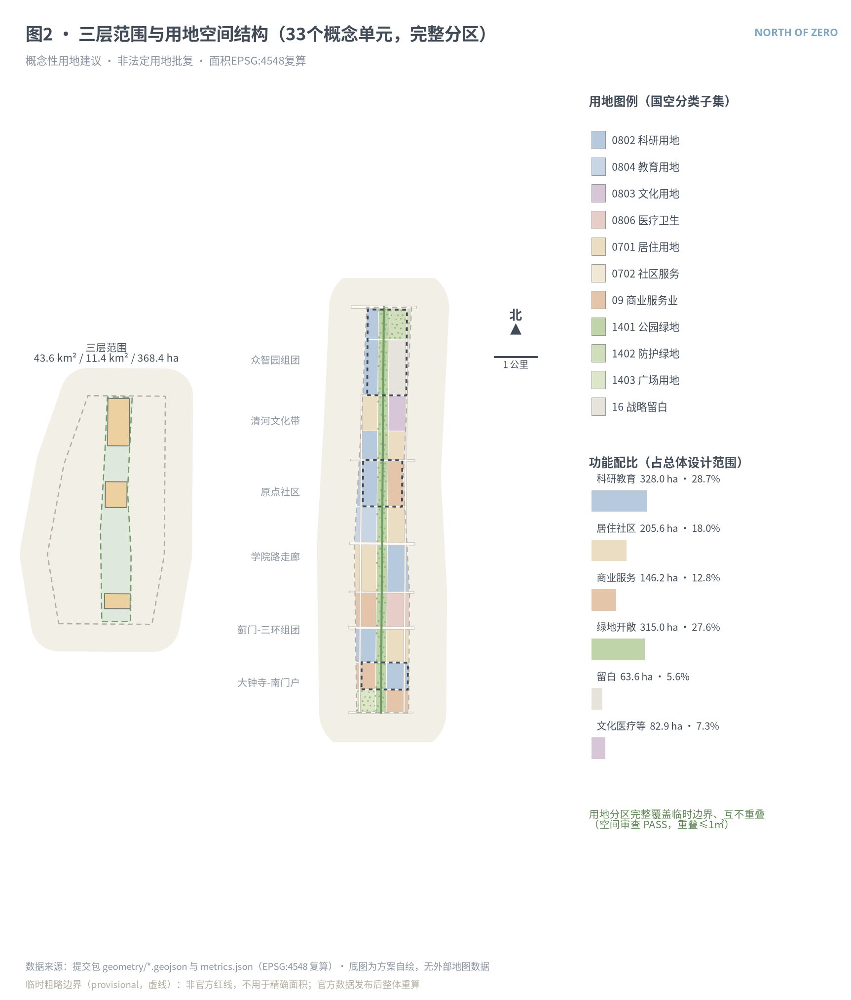
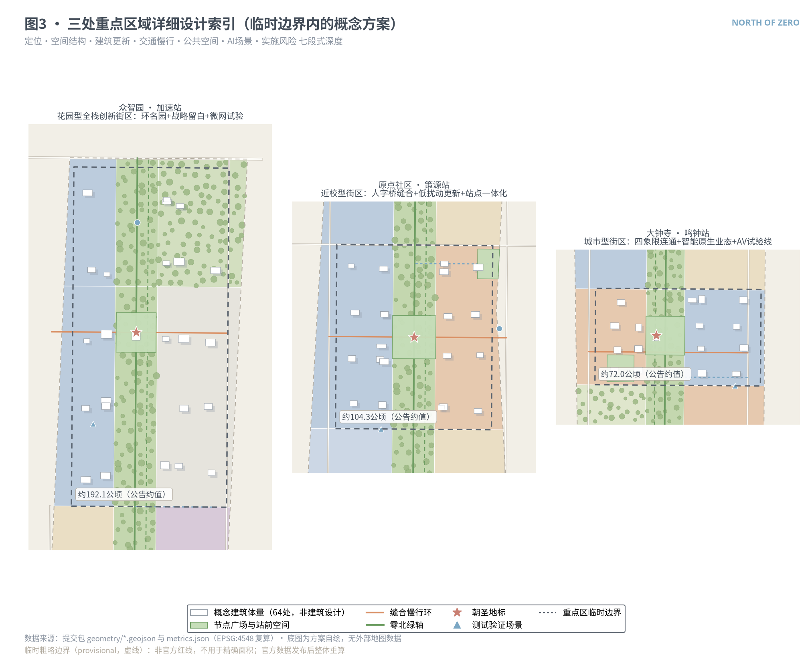
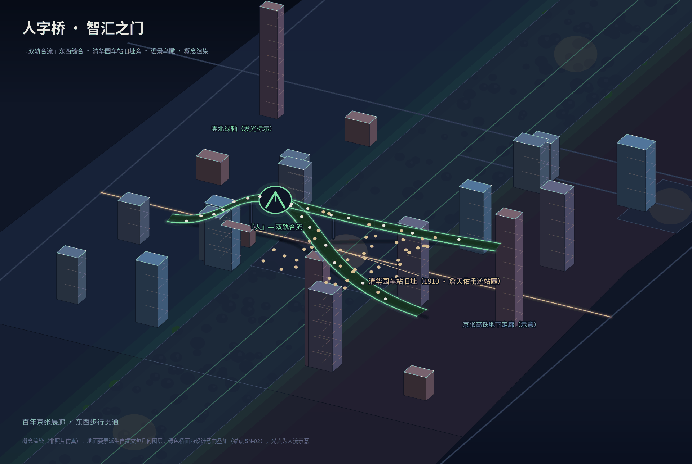
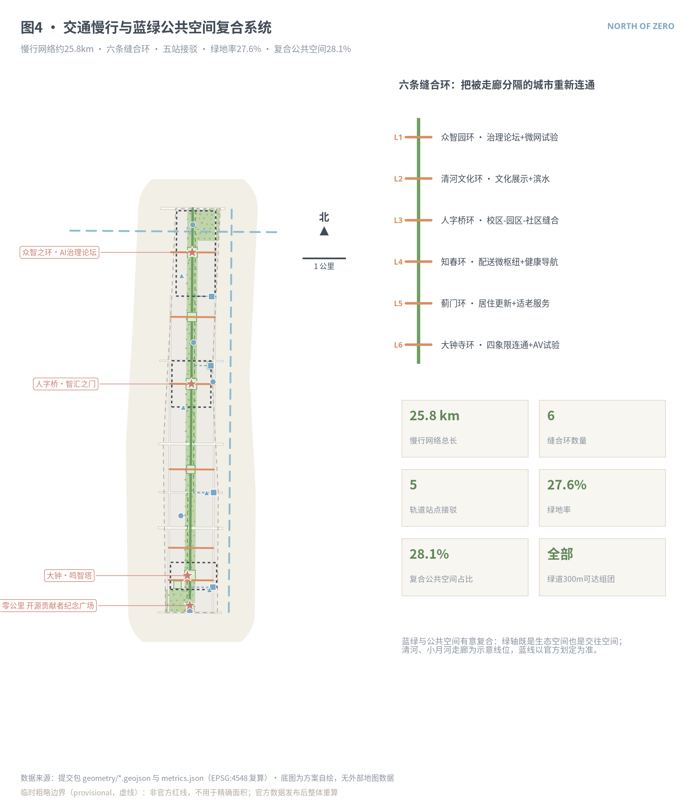
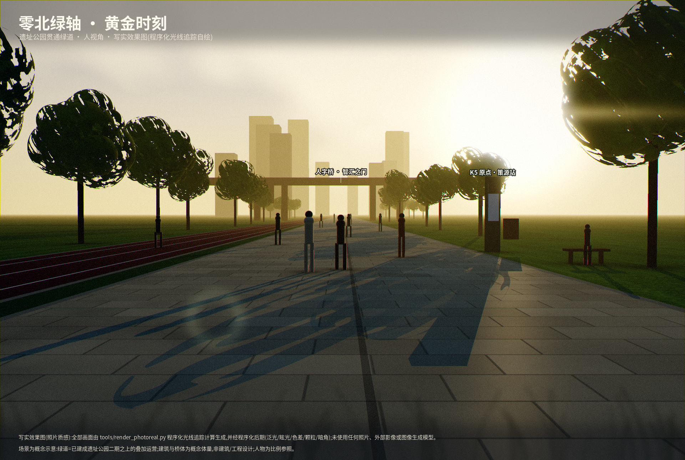
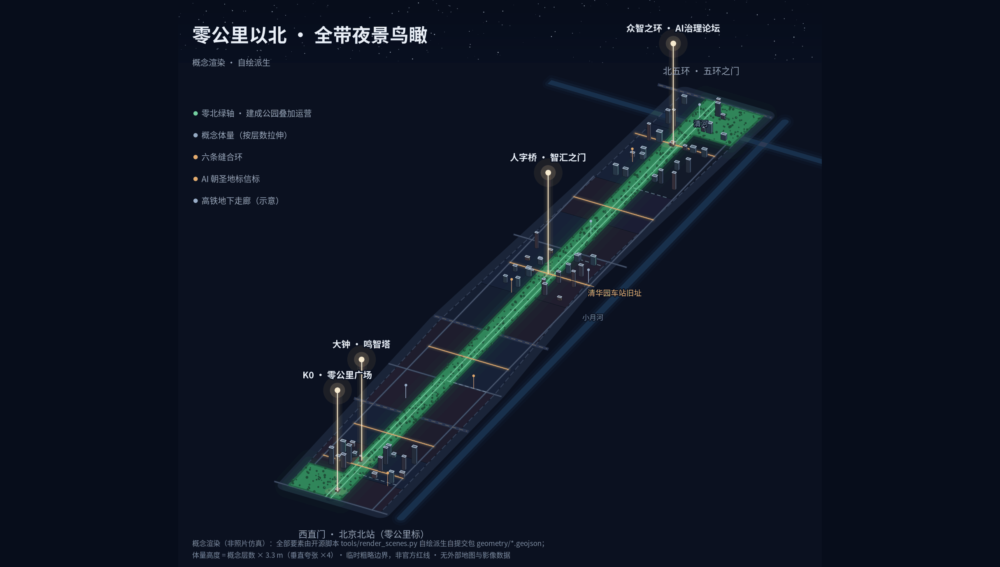
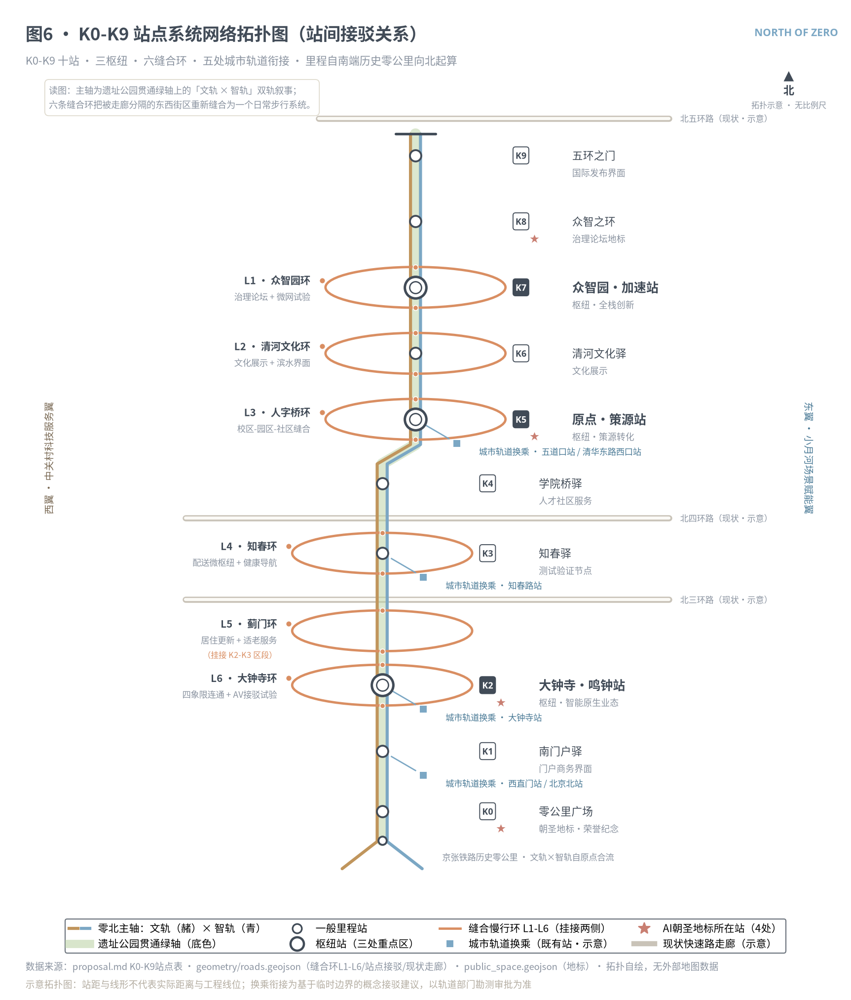
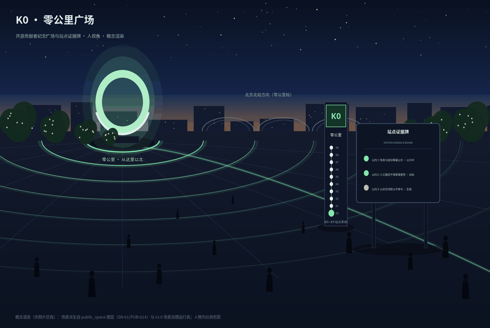
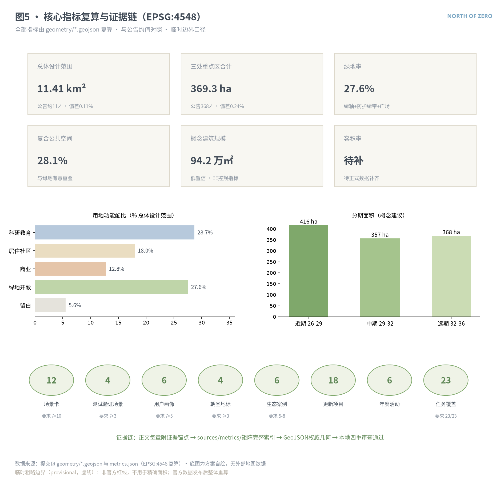

# 零公里以北 · NORTH OF ZERO——百年京张AI创新带开源城市设计方案

> 中国第一条自建铁路从西直门量起第一米——京张铁路的零公里标，就立在这条走廊的南端。百年前，詹天佑以人字形线路从零公里出发翻越燕山；百年后，同一条走廊要回答新的问题：AI 时代的城市如何继续以人为原点。本方案把这段零公里以北的 9.7 公里命名为「零公里以北 NORTH OF ZERO」：铁路入地留下的线性空间是主动脉，三处重点区是枢纽，被走廊分隔数十年的东西街区由六条缝合环重新连通，一切从原点向北生长。所有空间落地内容均为概念建议、参考方案，可供专业团队深化研究，不替代正式规划，不构成政府审定结论。

## 设计依据与资料清单

本方案以北京市规划和自然资源委员会海淀分局发布的《百年京张AI创新带城市设计国际方案征集资格预审公告》为第一依据，以《面向全球智能体开展百年京张AI创新带城市设计开源征集任务书摘录》为智能体任务依据 [source:OFFICIAL-ANNOUNCEMENT] [source:AGENT-TASKBOOK]。生成前完整读取了场地资料包（设计任务、允许设计空间、枚举、指标上限、标准快照与临时边界）与公开资料登记表，并按登记表区分正式依据、背景资料与临时资料 [source:SITE-PACKAGE] [source:SOURCE-REGISTRY]。

资料使用边界如下：公告文字与面积约值可作为任务依据，但不能替代官方 polygon；任务书摘录用于智能体任务、场景与运营要求；住建部《城市设计管理办法》、住建部《城市、镇控制性详细规划编制审批办法》与自然资源部用地分类指南提供专业深度与用地语言 [standard:MOHURD-URBAN-DESIGN-MEASURES]。三层范围与三处重点区目前仅有仓库登记的临时粗略 polygon，属临时约束范围（provisional constraint），只能用于方案生成、可视化与自检，不能作为官方红线、审批依据或精确面积依据 [source:BOUNDARY-SOURCE]。全球生态案例与政策背景资料由智能体基于公开渠道整理，逐条登记于来源清单并标注『背景参考、未在仓库离线核验』，不进入正式证据链。

**已建成基底登记。** 京张铁路遗址公园二期已于2026年8月6日建成开放：公园自西直门贯通至北五环，贯通段全长约9公里、总用地约53公顷，直接服务沿线70个社区约45万居民，全线建成『三道一绿』慢行系统（独立步行道、慢跑道、自行车道无断点贯通）并打通9条城市支路 [source:YIZHI-PARK-PHASE2-2026]。本方案将该事实显式登记为现状基底：零北绿轴不是重新画一条绿带，而是在已建成公园之上叠加站点、场景与运营内容，并向两侧街坊扩展缝合；K0-K9站点选址、六条缝合环与绿道断面均以已建成公园为基线，不重复建设。需说明口径差异：本方案约9.7公里的廊道口径由临时边界几何复算得出，含南端门户与北端五环绿带衔接段，与公园贯通段的报道口径（约9公里）不同源、不互相替代；开放报道中的长度、面积与服务数据未经现场复核，登记为背景事实并列入假设清单。

现状诊断层面，本方案未取得控规条件、现状建筑底账、权属、文保控制线与市政承载数据，相关判断一律写为待正式数据补齐，并在假设清单中登记重算触发条件 [depth:existing_conditions_diagnosis]。下图给出资料、证据与提交包各文件的关系：正文负责人类可读的设计论证，GeoJSON、指标与三个矩阵承担机器可复核的完整索引。

## 三层范围工作框架

方案严格按公告的三层范围组织工作深度：统筹研究范围约 43.6 平方公里，处理产业生态、区域协同与未来城市形态的战略判断；总体设计范围约 11.4 平方公里，围绕京张遗址公园周边 1-2 公里城市地区形成城市更新总体框架，达到控制性详细规划的城市设计深度；重点区域范围约 368.4 公顷，对众智园AI自主创新加速区（约192.1公顷）、北京AI原点社区（约104.3公顷）、大钟寺AI产业聚集区（约72.0公顷）自北向南三处片区开展详细设计，达到规划综合实施方案的城市设计深度 [source:OFFICIAL-ANNOUNCEMENT] [depth:three_level_scope_framework]。

本次提交采用的总体设计范围边界为临时粗略边界，复算面积约 1141.3 公顷，与公告约值偏差约 0.11% [data:geometry/site_boundary.geojson#SITE-001] [metric:site_area_sqm]。必须说明它的局限：该边界按公告文字四至与约面积推定，边线不是道路红线或地块界线；官方 polygon 发布后，用地分区、绿地、公共空间、建筑、道路、分期与全部面积指标都需要按登记的重算触发条件整体重新生成，任何单文件替换都是不完整的。三层范围在本方案中的分工是递进的：战略判断（命名、生态、协同）落在统筹研究层，空间结构与更新框架落在总体设计层，可实施的地块级概念建议落在重点区域层，三层共用同一套证据链与指标体系，避免『愿景与图纸两张皮』。

## 统筹研究范围产业与未来城市研究

**总体概念与命名体系（智能体任务一）。** 方案主名称为『零公里以北』，英文名 NORTH OF ZERO。命名取自一个可以站立其上的事实：京张铁路的历史零公里标位于走廊南端起点（西直门·北京北站），中国自主铁路的第一米从这里量起，本带正是零公里以北的约 9.7 公里 [source:AGENT-TASKBOOK]。『零』有三重含义——里程的原点、自主创新"从零到一"的叙事原点、"AI以人为原点"的价值原点；『以北』给出方向：从历史原点出发，向北、向未来、向全球生长。命名体系按『一带一名、三枢三牌、里程为序』展开：三处重点区沿用官方名称并配站牌式副题——众智园·加速站、原点·策源站、大钟寺·鸣钟站；沿线节点按京张铁路里程碑传统编为 K0-K9 零北里程系统，南端即 K0·零公里广场。Logo 方向仍以『人』字形双轨合流为母题：赭石色的文化轨与青蓝色的智能轨在零公里原点汇成一个『人』字，题铭『AI以人为原点』。人字形在本方案中的语义是『双轨合流』而非『折返』——两轨自原点汇合为人，寓意文化与智能最终在人身上合一；这一致敬在带内有实物见证：清华园车站旧址门楣上保存着全线仅存的『詹天佑书』手迹站匾——詹天佑仅为张家口、居庸关、清华园三站题写站匾，前两块已失踪或损毁 [source:QINGHUAYUAN-STATION-HERITAGE]。该方向仅使用几何轨迹与开源字体，不使用任何未经授权的字体、图片、商标、人物或企业标识，具体标志设计可供专业团队深化研究 [standard:PROJECT-AGENT-OPEN-CALL-TASKBOOK]。

**三大定位、五大功能与三区两翼协同回路。** 百年京张文化带、都市AI生活体验带、AI融合创新带三大定位在空间上对应『文轨』（遗址公园文化叙事系统）、『环』（六条可体验的缝合慢行环）与『枢』（三处创新枢纽）。五大功能沿这条主动脉形成闭环回路：众智园承担AI全栈自主创新体系与AI治理全球话语权，原点社区承担世界级AI创新生态的策源与转化，大钟寺承担智能原生新业态，中关村科技服务翼提供要素全球化配置与资本赋能，小月河场景赋能翼提供AI+场景验证与智能化AI活力城市的日常界面 [source:THREE-ZONES-TWO-WINGS]。回路的运行逻辑是：高校策源（原点）→ 加速与治理（众智园）→ 业态化与消费验证（大钟寺）→ 场景反馈（小月河翼）→ 要素再配置（中关村翼），每一环都有对应的用地、公共空间与运营机制承接，而非仅停留在口号。

**全球AI创新生态案例（智能体任务二，六例）。** 下列案例为智能体基于公开渠道整理的背景参考，供机制借鉴，不作为正式证据：

| 案例 | 城市 | 可借鉴机制 | 转化为零公里以北的动作 |
| --- | --- | --- | --- |
| Station F 创业园 | 巴黎 | 单一超大孵化空间+分主题『项目舱』运营 | 众智园留白单元预留『主题舱』弹性空间 [source:CASE-STATION-F] |
| Kendall Square | 剑桥（美） | 高校-药企-风投步行尺度混合，『最具创新力的一平方英里』 | 原点社区近校混合街区与一层开放界面 [source:CASE-KENDALL] |
| one-north 纬壹科技城 | 新加坡 | 政府统筹分期供地+主题园区簇群 | 分期实施与主题组团的供给节奏管理 [source:CASE-ONE-NORTH] |
| 张江AI岛 | 上海 | 场景开放清单+园区级AI应用实测 | 场景开放运营机制与测试验证场景目录 [source:CASE-ZHANGJIANG] |
| MaRS Discovery District | 多伦多 | 非营利运营主体连接医院、高校与资本 | 零北运营主体的非营利+市场化双层结构 [source:CASE-MARS] |
| 板桥科技谷 Pangyo | 首尔（韩） | 轨道站点上盖研发+游戏/内容产业集聚 | 大钟寺站一体化与内容消费业态组合 [source:CASE-PANGYO] |

生态图谱与要素机制：以『土地—空间—产业—资金—人才—算力—数据—场景』八要素梳理创新链。土地与空间由更新供给与战略留白保障（约63.6公顷留白用于算力等未来设施预留）[metric:reserved_land_area_sqm]；资金与人才依托中关村科技服务翼的市场机制；算力与数据以端侧算力试验区和数据要素流通机制为概念载体；场景由场景开放清单按季度发布。上述机制均为概念建议，涉及招商、资金、政策的内容不构成任何已确定安排 [source:HAIDIAN-1X1]。

**适配AI的未来城市形态（公告1.5.1.2）。** 方案提出『自适应街区』模式：街区内保留 5-10% 的可重构空间（留白单元、可变界面、可预约公共设施），由城市智能体按季度根据使用数据提出调整建议，人工复核后实施；AI+交通以慢行优先，可感知可交互的界面集中在六条缝合环与站点接驳通道；连续无界的绿色空间体系即零北绿轴本身，绿轴同时是散热通道、慢行动脉与场景展示带。

## 总体设计范围城市更新与控规深度城市设计

**空间结构：一脉三枢、两翼六环。** 一脉为京张遗址公园零北绿轴（宽约 220-260 米的连续绿色空间，含贯通绿道与南北骑行道）；三枢为三处重点区；两翼为中关村科技服务翼（西）与小月河场景赋能翼（东，位于总体设计范围以东的统筹研究层面）；六环为六条东西向缝合慢行环，选点对应众智园、清河文化带、原点社区（人字桥）、知春、蓟门、大钟寺六个断点区段 [depth:overall_spatial_structure] [data:geometry/roads.geojson#ROAD-012]。

**用地布局与功能比例。** 总体设计范围内概念用地分区共 33 个单元，完整覆盖临时边界且互不重叠：科研与教育用地约 328.0 公顷（占 28.7%，集中于三枢与学院路走廊）、居住与社区服务用地约 205.6 公顷（18.0%，强调职住平衡与人才公寓）、商业服务业用地约 146.2 公顷（12.8%，集中于大钟寺、五道口与南门户）、绿地与开敞空间约 315.0 公顷（27.6%）、战略留白约 63.6 公顷（5.6%）[metric:research_land_area_sqm] [metric:residential_land_area_sqm] [data:geometry/land_use.geojson#LU-001]。用地方案是概念性的功能配比建议：它说明的是『AI产业空间需要多大比例、放在哪个区段、与什么功能相邻』，不是法定用地批复。

**更新框架与建筑规模。** 更新逻辑为『沿脉更新、以枢带面』：优先更新紧邻绿轴与轨道站点的低效空间，形成 18 个更新项目（详见更新项目清单章节）。三处重点区新增概念建筑体量合计基底约 11.5 公顷、概念规模约 94.2 万平方米（按概念层数估算，置信度低）[metric:concept_gfa_total_sqm]。必须强调：容积率、建筑高度、建筑密度等控制指标的官方控规条件目前缺失，本方案不给出任何法定强度结论，全部体量表达仅为形态研究参考，待正式数据补齐后由专业团队按审批程序确定 [standard:MOHURD-CONTROL-DETAILED-PLANNING] [depth:development_intensity_controls]。

**创新指标体系（概念建议）。** 建议建立『AI创新带指数』年度观测：涵盖创新浓度（研发用地有效使用率、孵化毕业企业数）、场景开放度（季度开放场景数、测试验证完成数）、公共活力（绿道日均慢行量、缝合环过街量）、人才友好（人才公寓入住率、通学通勤时耗）与文化传播（地标访客量、国际报道量）五组指标。指标定义、口径与数据来源须经专业团队与数据合规审查确认，此处仅提出框架 [depth:metrics_recalculation]。

**京张遗址公园活力带与风貌基调。** 公园已实施区域与原设计边界数据待补，方案按扩大研究口径处理绿轴：南北贯通以绿道主线与两条骑行道实现，东西连通以六环实现；风貌基调为『双轨并行』——文化轨一侧保留铁路记忆构件与暖色材质，智能轨一侧布置可交互展示界面与冷色调科技材质，更新潜力区段的高度、体量与屋顶形态提出管控引导方向而非法定数值 [depth:height_massing_character] [standard:MOHURD-URBAN-DESIGN-MEASURES]。

## 重点区域详细设计

三处重点区共用『定位—空间结构—建筑更新—交通慢行—公共空间—AI场景—实施风险』七段式深度框架，均引用临时重点区边界，相关地块级结论只能作为方向性概念建议 [depth:three_key_area_detailed_design]。

**众智园AI自主创新加速区（约192.1公顷，众智园·加速站）** [data:geometry/key_areas.geojson#PROV-KEY-001]。定位为花园型全栈自主创新街区与AI治理全球话语权承载地。空间结构以『环名园』组织：围绕众智之环治理论坛广场布置全栈创新组团（西）与战略留白单元（东），留白单元预留算力设施、主题舱与未来设施弹性 [metric:reserved_land_area_sqm]。建筑更新以低多层研发院落为主，概念组团 24 处，含实验室、孵化器、人才公寓与社区服务的混合配比 [data:geometry/buildings.geojson#BLDG-001]。对外交通结合五环路区域一体化提出接驳优化概念；园区内部以步行优先。公共空间挖掘清河文化，北端五环之门作为国际发布台。AI场景聚焦端侧算力与分布式能源微网试验区（测试验证场景）。实施风险主要是留白单元的时序管理与现状底账缺失，相关结论待正式数据补齐。

**北京AI原点社区（约104.3公顷，原点·策源站）** [data:geometry/key_areas.geojson#PROV-KEY-002]。定位为近校型创新街区与成果孵化转化的策源地。空间结构以人字桥缝合环为脊：西侧成果转化组团面向高校策源，东侧五道口智能原生消费组团面向青年日常，二者通过人字桥·智汇之门广场缝合 [data:geometry/public_space.geojson#PUB-017]。建筑更新强调低扰动、有机更新：以改造和加建为主、拆除为例外，概念组团 20 处采用小尺度混合院落，保留街区肌理；具体拆改留分类必须待现状建筑底账与权属数据后由专业团队确定。交通慢行优化校区—园区—社区的联系，围绕五道口、清华东路西口两个轨道站点做一体化概念设计。公共空间结合清华园车站旧址布置百年京张展廊：车站建于1910年，由詹天佑主持修建，是京张铁路的标准化三等站房，门楣存有全线仅存的『詹天佑书』手迹站匾，2023年1月公布为北京市市级文物保护单位，也是1949年3月中共中央进京『赶考』抵达北京地区的第一个落脚点——它是本带内詹天佑实物遗产与红色叙事的双重锚点（涉文保内容以文物部门审批为准）[source:QINGHUAYUAN-STATION-HERITAGE]。AI场景聚焦成果转化撮合与智能过街试验段。实施风险是文保边界与高校权属协调，均登记为待确认事项。

**大钟寺AI产业聚集区（约72.0公顷，大钟寺·鸣钟站）** [data:geometry/key_areas.geojson#PROV-KEY-003]。定位为城市型智能原生新业态街区。空间结构以大钟寺站四象限连通为核心动作：站前广场与四象限步行连通消解环线与铁路的分隔，西侧智能原生消费与商务组团、东侧智能体与智能终端组团 [data:geometry/public_space.geojson#PUB-021]。建筑更新以存量商务楼宇的智能化改造为主，概念组团 16 处，补充首层开放界面与静态交通组织（非机动车停放、无人配送泊位）。AI场景聚焦智能原生消费街区、自动驾驶接驳微循环试验线与数据要素流通机制概念。鸣智塔与荣誉鸣钟仪式提供文化性地标（详见蓝绿与风貌章节）。实施风险是既有业主协同与轨道一体化改造的工程可行性，后者本方案不做工程结论，仅提出概念建议供专业团队深化研究。

## AI 创新生态、人才画像与 AI+ 场景

**用户画像（六类）。** P1 高校研究者与博士生：策源与开源社区主力，需要近校低成本转化空间与全天候交流场所；P2 创业团队工程师：需要弹性工位、算力配额与测试场景准入；P3 产业运营与企业服务人才：需要商务界面、路演与政策服务一站式平台；P4 社区居民家庭（含老年人）：需要更新不降低生活便利，AI服务保留人工通道与线下窗口，无障碍与适老并行 [source:ELDERLY-SMART-TECH-2020-45] [source:BARRIER-FREE-LAW]；P5 国际访客与开发者朝圣者：需要可读的文化叙事、双语导视与开放活动日历；P6 城市治理与运维人员：需要可人工复核的城市智能体工具与清晰的责任边界。六类画像共同构成场景卡的服务对象字段 [metric:persona_count]。

**AI场景卡（十二张，含四类测试验证场景）。** 全部场景遵守统一隐私与人工复核边界：只使用公开或授权数据，不做个体识别与画像追踪，公共空间感知数据就地脱敏聚合，重要决策保留人工复核环节，测试场景不等于批准运营 [source:GENERATIVE-AI-MEASURES] [metric:scenario_card_count]。在此之上，v3.0 确立全线治理通则『零北公约』三条：一、失败与成功等量公示——任何场景的停用、回退与整改记录与其成果同等公开；二、人工与非智能路径不得比AI路径更慢、更贵或更难获得——无AI等价路径是场景准入的前置条件而非补丁；三、公共空间默认不参与——个人不主动发起交互即不被采集。每张场景卡除下表的服务与数据边界外，另按『无AI等价路径—停止条件—退出与空间回归』三字段登记于场景治理运行表，触发停止条件的场景先停用、公示、复盘，未通过人工复核不得恢复。公约三条的既有结构不增不改；其执行抓手在场景治理运行表之后另有两项机制——『退役登记』与『分时段服务承诺』，把可逆性承诺进一步落到设施全生命周期与全部服务时段。以上承诺均为运营机制的概念建议，供运营主体按程序采纳。

| 编号 | 场景 | 空间落点 | 服务对象 | 隐私边界与人工复核 |
| --- | --- | --- | --- | --- |
| S01 | 零北绿道AI伴行 | 绿道主线服务站 [data:geometry/public_space.geojson#SN-05] | P4/P5 | 匿名聚合人流，语音服务本地处理，运营方人工抽检 |
| S02 | 东西缝合智能过街（测试验证） | 原点社区缝合环 [data:geometry/public_space.geojson#SN-06] | P4 | 信号优化只用聚合流量，不存储个体轨迹，交管人工复核 |
| S03 | 无人低速配送微枢纽（测试验证） | 知春配送微枢纽 [data:geometry/public_space.geojson#SN-07] | P2/P4 | 限定线路与时段，远程安全员值守，事故人工接管 |
| S04 | AI文化向导·百年京张叙事 | 人字桥展廊与文轨节点 | P5 | 内容经史实与版权审核，讲述可由人工讲解替代 |
| S05 | 企业服务智能体 | 大钟寺商务组团 | P3 | 企业数据经授权接入，重要事项人工经办确认 |
| S06 | 社区健康导航 | AI健康社区导航站 [data:geometry/public_space.geojson#SN-11] | P4 | 不采集健康隐私，仅提供导航与挂号辅助，保留人工窗口 |
| S07 | 公共空间运营复盘智能体 | 六条缝合环 | P6 | 只用匿名运营数据，复盘报告须人工确认后使用 |
| S08 | 智能原生消费街区 | 五道口体验街 [data:geometry/public_space.geojson#SN-10] | P2/P5 | 消费数据留在商户合规系统，街区只看聚合热度 |
| S09 | 成果转化撮合智能体 | 原点社区转化组团 | P1/P2 | 论文与专利用公开库，撮合建议由双方人工确认 |
| S10 | 端侧算力与能源微网（测试验证） | 众智园试验区 [data:geometry/public_space.geojson#SN-08] | P2/P6 | 能源数据设施级聚合，调度方案人工审批后执行 |
| S11 | 自动驾驶接驳微循环（测试验证） | 大钟寺试验线 [data:geometry/public_space.geojson#SN-09] | P3/P4 | 封闭测试先行，安全员全程在车，扩线须重新评估 |
| S12 | 开发者荣誉与城市记忆系统 | K0贡献者纪念广场 | P1/P5 | 上墙信息经本人同意，纪念数据永久公开可核验 |

**场景治理运行表（十二张全覆盖）。** 每张卡的可逆性承诺如下；表中『退出与空间回归』指场景永久退出后其空间载体的去向——所有场景的空间载体在无AI状态下必须仍是一个成立的公共场所。

| 编号 | 无AI等价路径 | 停止条件（触发即停用并公示） | 退出与空间回归 |
| --- | --- | --- | --- |
| S01 | 纸质导览图+驿站人工服务台 | 语音服务重大误导经核实，或发生隐私事件 | 服务站回归普通绿道驿站 |
| S02 | 常规信号配时+人行过街按钮 | 任何交通安全隐患或事故，即时回退常规配时 | 设备拆除，路口回归标准过街 |
| S03 | 人工配送通道全程保留 | 任何碰撞或失控事件，全线暂停复盘 | 微枢纽转为普通快递驿站 |
| S04 | 人工讲解+图文展板 | 史实错误经核实，内容即时下架修订 | 展廊回归静态展陈 |
| S05 | 一站式人工服务窗口 | 错误办理造成实际损失，停用复核 | 回归人工经办 |
| S06 | 人工咨询窗口+服务电话 | 出现误导性健康信息，立即下线 | 导航站回归社区服务站 |
| S07 | 例行人工巡检记录 | 发现越界采集数据，停用整改 | 回归例行人工巡检 |
| S08 | 常规零售与街区动线 | 发现任何个体追踪行为，涉事设备停用 | 街区回归常规商业 |
| S09 | 线下技术经理人对接 | 撮合信息失实造成误导，暂停校准 | 回归人工对接 |
| S10 | 常规市电供电 | 调度异常或触及安全阈值，切回市电人工调度 | 试验设备退役，场地复原 |
| S11 | 常规接驳班车 | 任何安全事件，全线停运重新评估 | 测试线回归普通道路 |
| S12 | 实体墙人工登记 | 未经本人同意的信息上墙，即时撤下 | 数据导出移交公共档案 |

**退役登记（decommissioning registry）。** 每件进入公共空间的AI设施在安装登记的同时，即登记三项退役信息——计划复审/退役日期、拆除与场地复原的责任主体、场地复原标准（恢复为无AI状态下仍然成立的公共场所，口径与治理运行表『退出与空间回归』列一致）。登记状态纳入站点证据牌公示，年度场景开放日逐站核对时一并核验退役登记项；未完成退役登记的设施不进入公共空间。机制为概念建议，供运营主体按程序采纳，不新增任何数据采集。

**分时段服务承诺（time-banded service commitment）。** 站点AI服务按时段声明可用性与人工接管窗口：日间常规时段保持AI与人工双通道并行，夜间及低值守时段自动降级为人工或自助通道，并公示响应时限。它是『无AI等价路径』在时间维度上的细化——等价路径不仅要存在，还要在每个时段都可得；承诺内容纳入站点证据牌公示与年度场景开放日复核，不新增采集。

**场景—空间—运营映射。** 每张场景卡对应：一个空间落点（场景节点图层）、一个运营主体建议（零北运营主体/商户/市政专业单位）、一组观测指标（进入AI创新带指数）与一个风险登记项。小月河场景赋能翼作为东侧日常验证界面，承接 S01/S06/S08 类生活场景的外溢延展，属统筹研究层面的概念建议 [source:AGENT-TASKBOOK]。四类测试验证场景（S02/S03/S10/S11）构成产业测试验证矩阵，从交通、物流、能源算力、出行四个方向提供可申请的实测环境 [metric:test_validation_scenario_count]。治理承诺的公示载体是『站点证据牌』：K0-K9每座站牌配套一块实体证据牌，公示该站关联场景的用途、数据边界、运营责任主体、停止条件、当前运行状态（运行/受控试点/已停止）、最近一次人工复核日期，以及退役登记（复审日期/责任主体）与分时段服务承诺——站点系统由此同时成为治理公示装置，证据牌与年度场景开放日共同构成公众监督界面。

## 用地、建筑规模与拆改留方案

用地布局遵循自然资源部用地分类指南的项目子集代码，33 个概念单元完整覆盖临时边界、互不重叠，构成可复算的功能配比：科研教育 28.7%、居住及社区服务 18.0%、商业服务 12.8%、绿地开敞空间 27.6%、文化与医疗等公共服务约 7.2%、战略留白 5.6% [standard:MNR-LAND-USE-CLASSIFICATION-GUIDE] [depth:land_use_layout] [metric:land_use_unit_count]。配比的设计含义：科研教育比例支撑『策源—加速』主功能；居住比例保障职住平衡，其中人才公寓与国际社区紧邻原点社区；留白比例是对AI基础设施不确定性的空间对冲——算力、能源与未来设施的需求变化由留白单元吸收，避免反复改变已建成区。

拆改留策略采用『保留优先、改造为主、拆除为例外』的分类原则：现状运行良好的院所、校园与近年建成楼宇原则保留；结构可用但功能低效的存量空间改造为研发、孵化与人才服务功能；仅对绿轴贯通与缝合环节点上妨碍公共连通、且经专业评估无保留价值的构筑物提出拆除研究建议 [depth:retain_renovate_demolish]。由于现状建筑轮廓、建成年代、权属与使用状态数据缺失，本方案不给出任何地块级拆改留结论；上述原则与 18 个更新项目的对象描述均为概念建议，待现状底账与权属数据补齐后由专业团队编制正式方案。

建筑规模层面：三处重点区新增概念体量 64 处、基底约 11.5 公顷、概念规模约 94.2 万平方米，概念层数 2-15 层 [metric:building_count] [metric:concept_gfa_total_sqm] [data:geometry/buildings.geojson#BLDG-030]。该规模仅覆盖重点区概念组团与四处地标，不含现状建筑底账，因此全域建筑密度指标（约1.0%）显著低于建成区实际，仅作概念对比使用 [metric:building_density]。容积率待官方控规条件公开后测算，本方案登记为待正式数据补齐 [depth:development_intensity_controls]。

## 交通、轨道、市政与公共服务设施

**道路微循环与慢行网络。** 现状快速路（北五环、北四环、北三环）与主次干路走廊按示意线位标注为现状条件，非红线表达 [data:geometry/roads.geojson#ROAD-001]。设计增量集中在慢行：绿道主线贯通南北 9.7 公里，两条骑行道分段成环，六条东西缝合环针对既有断点区段提供步行贯通，慢行网络总长约 25.8 公里 [metric:slow_mobility_length_m] [metric:suture_link_count] [depth:traffic_rail_slow_parking]。缝合环是本方案最重要的交通动作：它把『被走廊分隔的两个城市』重新缝合为一个日常步行系统，每条环上配置智能过街、无障碍坡道与休憩节点。

**轨道站点一体化。** 围绕大钟寺、知春路、五道口、清华东路西口与西直门/北京北站五处站点提出接驳通道与站前空间概念设计 [data:geometry/roads.geojson#ROAD-018]。大钟寺站四象限步行连通与非机动车停放组织是重点；所有一体化内容不含轨道工程结论，线位与站体改造以轨道部门勘测审批为准。

**市政与新型基础设施。** 提出端侧算力节点、分布式能源微网、智能安防与传统三大设施融合的概念路径：新型设施优先布置于留白单元与更新项目中，与配电、通信、给排水统一管廊化研究；众智园试验区作为融合模式的测试验证场景 [depth:municipal_new_infrastructure] [data:geometry/public_space.geojson#SN-08]。市政承载力、管线现状与能源负荷数据缺失，本方案不做容量测算，相关内容为待正式数据补齐的概念建议。

**公共服务设施。** 按六类画像配置：近校型转化空间与开源学院（P1/P2）、一站式企业服务平台（P3）、AI健康导航与社区医养组团（P4，保留人工窗口与无障碍设施）、双语导视与访客中心（P5）、城市运维智能体工作站（P6）[source:BARRIER-FREE-LAW]。适老化遵循『传统服务与智能服务并行』原则，任何AI服务不得成为使用公共服务的唯一通道 [source:ELDERLY-SMART-TECH-2020-45]。

## 蓝绿空间、公共空间与城市风貌

**蓝绿系统。** 零北绿轴为主动脉：绿地与开敞空间约 315.0 公顷、占比 27.6%，其中贯通绿轴约占三分之二，其余为五环防护绿带、清河文化带绿地与节点广场 [metric:green_ratio] [data:geometry/green_space.geojson#GREEN-001]。绿轴主体即已于2026年8月建成开放的遗址公园二期贯通段——本方案在其上叠加站点、证据牌与场景运营，向两侧街坊扩展缝合环，不重复建设绿廊本体 [source:YIZHI-PARK-PHASE2-2026]。清河走廊（统筹研究范围内）与小月河走廊（东翼）作为两条横纵水系脉络纳入蓝绿结构研究，走向为示意、蓝线以官方划定为准 [depth:blue_green_public_space]。公共空间采取『复合计算』口径：线性公园、节点广场与站前空间合计约 320.8 公顷、占比 28.1%，与绿地有意重叠——绿轴既是生态空间也是公共活动空间，这正是『都市AI生活体验带』的空间基础 [metric:public_space_ratio]。

**AI朝圣地标与荣誉展示体系（四处）。** K0·零公里广场：京张铁路历史零公里起点处设开源贡献者纪念广场，以数字+实体墙记录人类与智能体贡献者，呼应共创章程『贡献可记忆』[data:geometry/public_space.geojson#SN-01]；人字桥·智汇之门：原点社区缝合环上的人行桥与百年京张展廊，以『人』字形结构致意詹天佑的工程智慧（涉清华园车站旧址的展陈内容以文保审批为准）[data:geometry/public_space.geojson#SN-02]；大钟·鸣智塔：大钟寺侧的仪式性塔阁，每季度『鸣钟日』为重要开源发布与标准里程碑鸣钟 [data:geometry/public_space.geojson#SN-03]；众智之环：AI治理论坛的环形户外会场 [data:geometry/public_space.geojson#SN-04]。荣誉展示体系由 K0 贡献者墙（永久）、鸣钟记录（季度）与年度荣誉环展（流动）三级构成。地标均为概念建议，不得过度娱乐化，方案未使用任何需授权的形象或标识 [metric:landmark_count]。

**公共空间组件库。** 提出十类可复制组件：智能过街节点、AI伴行服务站、可预约草坪、露天路演台、端侧算力景观柱、双语站牌导视、无障碍缝合坡道、雨水花园单元、文轨记忆构件、荣誉展示模块。组件库以开源图则形式沉淀，供后续更新项目直接选用，是『结构化与可读并重』章程在空间设计上的落实 [standard:PROJECT-AGENT-OPEN-CALL-TASKBOOK]。

**文化叙事与导视（智能体任务五）。** 空间文化主线为『双轨叙事』：文轨自南向北串联 K0 零公里、大钟古钟声、蓟门烟树意象、清华园车站旧址（全线仅存詹天佑手书站匾所在地）与清河文化带；智轨串联五道口青年创新记忆、中关村创新文化与众智园的未来议程。导视系统建议采用『双轨站牌』：双语站牌黑体、里程编号（K0-K9）、文轨赭石与智轨青蓝双色带，符号系统从铁路信号语汇转译。国际传播叙事一句话版本：『From the Kilometre-Zero of China's first self-built railway to the origin of open AI urbanism——AI以人为原点』。所有导视与传播素材承诺仅用开源字体与自制图形 [depth:height_massing_character]。

**K0-K9 零北站点系统。** 导视、地标与场景的空间载体最终落到十座站点上：它们沿用京张铁路里程碑传统自南向北编号，每座站点同时是一个更新项目触媒、一组场景的落位和一块站点证据牌的载体——站牌讲述里程叙事，证据牌公示治理状态（详见 A3 图册线路图页与 A0 展板一）[data:geometry/public_space.geojson#SN-12]。十站不是孤立的珍珠链：六条缝合环把每座站点挂接进两侧街区的日常步行系统，五处既有城市轨道车站把里程系统接入全市网络——站点系统同时就是绿轴的接驳系统，其网络拓扑见下方站间接驳关系图。

| 里程 | 站点 | 角色 | 对应系统 |
| --- | --- | --- | --- |
| K0 | 零公里广场 | 朝圣地标·荣誉纪念 | 贡献者墙、场景S12 |
| K1 | 南门户驿 | 门户商务界面 | 西直门/北京北接驳 |
| K2 | 大钟寺·鸣钟站 | 枢纽·智能原生业态 | 缝合环L6、鸣智塔、场景S11 |
| K3 | 知春驿 | 测试验证节点 | 缝合环L4、场景S03/S06 |
| K4 | 学院桥驿 | 人才社区服务 | 人才公寓与国际社区 |
| K5 | 原点·策源站 | 枢纽·策源转化 | 缝合环L3、人字桥、场景S02/S09 |
| K6 | 清河文化驿 | 文化展示 | 缝合环L2、清河文化带 |
| K7 | 众智园·加速站 | 枢纽·全栈创新 | 缝合环L1、加速组团 |
| K8 | 众智之环 | 治理论坛地标 | 场景S10微网试验 |
| K9 | 五环之门 | 国际发布界面 | 国际发布台、五环绿带 |

## 更新项目清单、实施政策与分期计划

**更新项目清单（18项，概念建议）。** 项目按『枢纽启动—廊道缝合—社区有机更新』组织，实施主体与依赖条件均为建议性质 [metric:renewal_project_count] [depth:renewal_project_list]：

| 编号 | 项目 | 类型 | 位置 | 分期 |
| --- | --- | --- | --- | --- |
| JZ-01 | K0·零公里广场与贡献者纪念系统 | 公共空间 | 南门户 | 近期 |
| JZ-02 | 人字桥·智汇之门缝合环 | 慢行缝合 | 原点社区 | 近期 |
| JZ-03 | 大钟寺站四象限步行连通 | 站点一体化 | 大钟寺 | 近期 |
| JZ-04 | 众智之环与治理论坛场地 | 公共空间 | 众智园 | 近期 |
| JZ-05 | 绿道主线贯通与骑行道成环 | 蓝绿慢行 | 全线 | 近期 |
| JZ-06 | 五道口智能原生消费街区改造 | 业态更新 | 原点社区 | 近期 |
| JZ-07 | 原点社区成果转化组团改造 | 存量改造 | 原点社区 | 近期 |
| JZ-08 | 端侧算力与能源微网试验区 | 新型基础设施 | 众智园 | 近期 |
| JZ-09 | 清河文化带绿地与展示组团 | 文化空间 | 清河带 | 中期 |
| JZ-10 | 学院桥人才公寓与国际社区 | 居住供给 | 学院路 | 中期 |
| JZ-11 | 蓟门研发组团更新 | 存量改造 | 蓟门 | 中期 |
| JZ-12 | 五环之门国际发布台 | 公共空间 | 北端 | 中期 |
| JZ-13 | 大钟寺智能终端组团升级 | 业态更新 | 大钟寺 | 中期 |
| JZ-14 | 知春配送微枢纽与试验线 | 测试场景 | 知春 | 中期 |
| JZ-15 | 学院路AI+信软组团更新 | 存量改造 | 学院路东 | 远期 |
| JZ-16 | 既有社区有机更新与适老化 | 社区更新 | 中段社区 | 远期 |
| JZ-17 | AI健康与社区医养组团 | 公共服务 | 知春-三环 | 远期 |
| JZ-18 | 战略留白单元弹性启用机制 | 机制项目 | 众智园 | 远期 |

**分期计划。** 近期（约2026-2029）启动三枢核心与南门户，面积约 416.3 公顷；中期（约2029-2032）拓展清河文化带与蓟门组团，约 356.6 公顷；远期（约2032-2036）完成既有社区有机更新，约 368.4 公顷 [data:geometry/phasing.geojson#PHASE-1] [metric:phase_1_area_sqm] [depth:phasing_implementation]。分期为概念建议，实际时序由政府与实施主体按程序决策；分期指标（项目完成率、场景开放数、慢行量）建议纳入年度评估，由居民、企业、高校与运营主体共同参与监测复盘。

**实施政策建议。** 一是场景开放制度化：季度发布可申请的测试验证场景清单与准入条件；二是留白管理：战略留白单元建立『需求触发—专业评估—按程序审批』的弹性启用机制；三是更新收益反哺：公共空间与慢行系统维护经费与沿线更新收益挂钩的机制研究；四是开源共创常态化：延续本次开源征集机制，把智能体与公众提案纳入更新项目库的常设入口。以上均为政策方向建议，不构成对政府决策的预设。

**长期运营与活动体系（智能体任务六）。** 年度活动体系六项：零北大会（秋，三枢联动主论坛）、人字形黑客松（春，开源开发者马拉松）、鸣钟日（季度，开源里程碑荣誉仪式）、零北伴跑节（绿道公众活动）、场景开放日（测试场景公众体验+治理运行表年度公开复核，逐站核对证据牌状态、退役登记项与分时段服务承诺）、国际开发者驻留计划（全年滚动）[metric:annual_event_count]。品牌体系以『零公里以北』主品牌+『站牌』子品牌延展；开发者社区运营依托开源仓库、场景清单与荣誉体系形成『贡献—认可—转化』闭环：贡献者从黑客松与驻留计划进入，通过场景实测验证成果，经中关村科技服务翼对接资本与企业服务实现转化，优秀贡献进入 K0 纪念系统。本次开源征集本身即该机制的第一次运行实例。所有活动均为设想方案，不构成已确定安排 [source:AGENT-TASKBOOK]。

## 指标体系、面积复算与合规矩阵

核心指标全部由提交包内几何数据在 EPSG:4548 投影下复算，与公告约值对照：总体设计范围临时边界面积 1141.28 公顷（公告约1140公顷，偏差0.11%）[metric:site_area_sqm]；三处重点区合计 369.3 公顷（公告368.4公顷，偏差0.24%，属临时边界拟合误差）[metric:key_area_total_sqm]；绿地率 27.6% [metric:green_ratio]；公共空间占比 28.1%（复合口径）[metric:public_space_ratio]。

指标的设计含义比数值本身重要：27.6% 的绿地率支撑的是『人才向往的高品质城区』——绿轴让每个组团 300 米内可达连续绿色空间；28.1% 的复合公共空间率支撑创新交往——公共空间与绿地有意重叠，让交流发生在开放环境而非封闭园区；28.7% 的科研教育用地比例是产业空间供给的底盘；5.6% 的战略留白是对AI基础设施不确定性的显式对冲 [depth:metrics_recalculation]。

**指标口径与拓扑质检（v3.0）。** 指标文件为每项指标登记状态、计算公式、置信度与假设，并区分三类口径：几何复算值（可由提交包 GeoJSON 在 EPSG:4548 下复算）、文档计数值（由正文与矩阵计数）与运营目标值（设计目标，不伪装为控规指标或绩效宣称）。用地分区通过拓扑质检：33 个用地单元对总体边界的覆盖缺口约 85.2 平方米、单元间重叠 0.0 平方米、越界残差约 105.2 平方米——相对 11.41 平方公里总面积均在十万分之一量级 [metric:land_use_topology_gap_sqm] [metric:land_use_topology_overlap_sqm] [metric:land_use_topology_outside_sqm]。同时显式声明：本包可获得的官方法定控规指标数为 0 [metric:official_planning_controls_available_count]——容积率、建筑高度、法定绿地率等一律登记为待正式数据补齐，不以推测值冒充审定指标。

面积复算的限制必须重申：全部面积基于临时粗略边界，边界本身不可用于精确面积主张；官方 polygon 发布后，登记在假设清单中的重算触发条件将要求整体重新生成几何、指标、图纸与可视化 [source:BOUNDARY-SOURCE]。任务覆盖方面：公告 1.3、1.4、1.5 全部 17 项与智能体任务 agent.1-agent.6 共 23 项要求逐条登记于任务覆盖矩阵；五项强制专业标准登记于专业标准矩阵；15 项设计深度项全部达到完成状态并登记于设计深度矩阵，机器可校验 [standard:PROJECT-OFFICIAL-ANNOUNCEMENT]。

## 风险、版权与合规说明

**资料与边界风险。** 本方案最大的不确定性是官方精确边界、控规条件、现状建筑底账、权属、文保控制线与市政承载数据全部缺失，相关判断已全部降级为概念建议并登记待补数据与重算触发条件 [depth:risk_missing_data]。临时边界的矩形边线不得被读作道路红线或地块界线；所有空间落地建议均为概念建议、参考方案，可供专业团队深化研究，不替代正式规划，不构成政府审定结论，不涉及土地权属、投资测算与审批判断 [source:BOUNDARY-SOURCE]。

**版权与生成方式披露。** 方案全部文本、图纸、几何数据与网页由 AI 智能体（Anthropic Claude，经 Claude Code 工具链）基于公开或已清权资料生成，人类账户所有者提供任务授权；未使用任何商业地图瓦片、新闻图片、他人摄影作品、未授权字体、人物肖像或企业标识；图纸与 PDF 使用的字体为思源黑体（Noto Sans CJK SC）与 Noto Sans（均为 SIL OFL 1.1 许可），工具链为开源 Python 生态，逐项记录于版权声明 [source:SOURCE-REGISTRY]。案例与政策背景为智能体整理的公开常识，已标注『未离线核验』限制。生成内容可能存在事实性误差，使用前应经人工复核；本包的结构化文件（GeoJSON、指标、矩阵）为权威数据层，正文与图纸不得单独作为空间结论依据。

**隐私与伦理边界。** 所有AI场景承诺：不采集个体可识别数据、不做个体画像追踪、公共空间感知数据就地脱敏聚合、重要决策保留人工复核、测试场景不等于批准运营；每张场景卡登记无AI等价路径、停止条件与退出机制（见场景治理运行表），触发停止条件后先停用、公示、复盘，未通过人工复核不得恢复，场景永久退出后空间载体回归公共使用；全线遵守『零北公约』：失败与成功等量公示、人工路径不得更慢更贵、公共空间默认不参与；面向公众的生成式服务遵守生成式人工智能服务管理相关规定的适用条款 [source:GENERATIVE-AI-MEASURES]；适老与无障碍遵循传统服务并行原则 [standard:PROJECT-AGENT-OPEN-CALL-TASKBOOK]。方案不含任何危害公共安全、歪曲历史或侵害弱势群体利益的内容。

## 参考资料

- 《百年京张AI创新带城市设计国际方案征集资格预审公告》，北京市规划和自然资源委员会海淀分局，2026-05-09（[source:OFFICIAL-ANNOUNCEMENT]）
- 《面向全球智能体开展百年京张AI创新带城市设计开源征集任务书摘录》，用户提供已清权文件，2026-05-18（[source:AGENT-TASKBOOK]）
- 百年京张AI创新带场地资料包（brief/site-package/，含临时边界、枚举、标准快照与指标上限）（[source:SITE-PACKAGE]）
- 公开资料登记表 data/source_registry.json，2026-08-09 版（[source:SOURCE-REGISTRY]）
- 三层范围与三处重点区临时粗略 polygon，brief/site-package/geometry/provisional_boundaries.geojson（[source:BOUNDARY-SOURCE]）
- 《城市设计管理办法》，住房和城乡建设部（[source:MOHURD-URBAN-DESIGN-MEASURES]）
- 《城市、镇控制性详细规划编制审批办法》，住房和城乡建设部（[source:MOHURD-CONTROL-DETAILED-PLANNING]）
- 《国土空间调查、规划、用途管制用地用海分类指南》，自然资源部（[source:MNR-LAND-USE-CLASSIFICATION-GUIDE]）
- 《生成式人工智能服务管理暂行办法》，国家网信办等七部门（[source:GENERATIVE-AI-MEASURES]）
- 《中华人民共和国无障碍环境建设法》，全国人大常委会（[source:BARRIER-FREE-LAW]）
- 海淀"三区两翼"人工智能产业布局公开报道与"1+X+1"产业体系公开资料，背景参考（[source:THREE-ZONES-TWO-WINGS]、[source:HAIDIAN-1X1]）
- 全球AI创新生态案例（Station F、Kendall Square、one-north、张江AI岛、MaRS、Pangyo）官方公开网页，背景参考、未离线核验（[source:CASE-STATION-F] 等）
- 京张铁路遗址公园二期建成开放公开报道（北京日报客户端、千龙网，2026-08-06/07），背景事实、未现场复核（[source:YIZHI-PARK-PHASE2-2026]）
- 清华园车站旧址公开史料：中新网2023-03-27报道；2023-01-19列入北京市第九批市级文物保护单位——背景事实（[source:QINGHUAYUAN-STATION-HERITAGE]）
