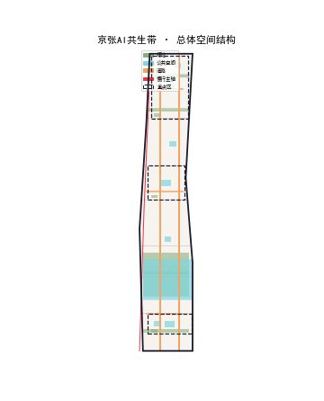
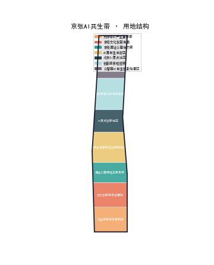
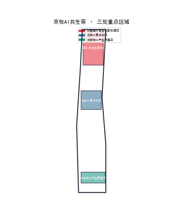
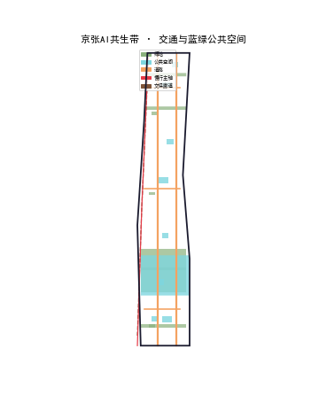
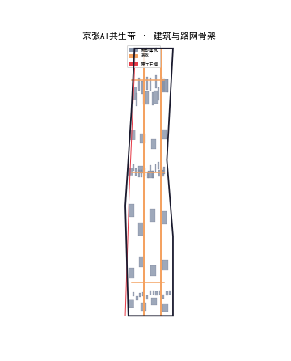
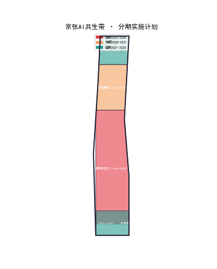
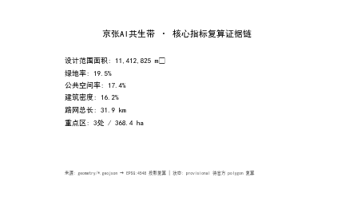

# Jingzhang AI Symbiotic Belt · SIGMA LINK: Master Concept and Urban Design of the Century-Old Jingzhang AI Innovation Belt
## Design Basis and Source Register
This proposal is a formal concept design for the "Century-Old Jingzhang AI Innovation Belt Urban Design Open Call", generated by an AI Agent from public repository materials and provisional boundaries. All spatial implementation, activity operations, brand communication, and policy mechanisms are expressed as "concept suggestions", "reference proposals", or "open for professional deepening", and do not replace formal planning or constitute government-approved conclusions [source:OFFICIAL-ANNOUNCEMENT].
**Core Concept**: A century ago, Zhan Tianyou independently designed and built the Jingzhang Railway, completing China's leap from "dependence" to "independence" in railways. A century later, Haidian is building an AI innovation belt along this railway, completing another leap from "computing independence" to "intelligence independence". The proposal uses "SIGMA LINK" as the core metaphor running through naming, space, narrative, and operations: the **Railway Memory Line** (Jingzhang Heritage Park, carrying a century of culture) and the **Computing Track Line** (the AI industry and innovation service corridor along Xueyuan Road, pointing to an intelligent future) run in parallel and interlock, converging at the AI Origin Community — the "origin" of both tracks and the "origin" of innovation [source:AGENT-TASKBOOK].
**Source and Evidence Register**: The formal task basis is the official pre-qualification announcement (tasks 1.3/1.4/1.5, three-level scope, three key area areas) [standard:PROJECT-OFFICIAL-ANNOUNCEMENT] and the agent-facing taskbook (ten co-creation principles, three positioning, five functions, three zones two wings, agent.1-agent.6, unified boundary clauses) ; professional standards include the Urban Design Management Measures , the Measures for the Formulation and Approval of Urban and Town Regulatory Detailed Plans , and the Guide to Land and Sea Use Classification for Territorial Spatial Survey, Planning, and Use Control . Spatial data is registered in `sources.json`: `OFFICIAL-ANNOUNCEMENT`, `AGENT-TASKBOOK`, `SITE-PACKAGE`, `SOURCE-REGISTRY` are formal-ready sources; `BOUNDARY-SOURCE`, `KEY-AREA-SOURCE` are provisional-only boundary sources; `OSM-BASE`, `HERITAGE-PUBLIC`, `PUBLIC-NARRATIVE` are background sources .
**Provisional Boundary Disclosure**: This proposal uses the provided temporary rough boundaries (overall design scope PROV-SITE-001, approx. 11.4 km²; three key areas PROV-KEY-001/002/003). These boundaries are inferred from the announcement text and area constraints, and are intended only for AI generation, visualization, and interim self-checks. They **must not** be used as official redlines, approval basis, or precise area recalculation basis; all area metrics and layer coverage must be recalculated once official polygons are released  .
**Matrix Correspondence**: Task responses are in `compliance_matrix.json` (covering all mandatory announcement tasks 1.3-1.5 and agent.1-agent.6); professional standard responses are in `standard_matrix.json`; deliverable depth evidence is in `design_depth_matrix.json`; assumptions and boundaries are in `assumptions.json`; self-check results are in `self_check.json` .

## Three-Level Scope Framework
The three-level scope is implemented progressively as "industry strategy — overall design — key districts" :
- **Master Research Scope** (approx. 43.6 km²): bounded by the North Fifth Ring Road to the north, Jingzang Expressway to the east, Xizhimen Outer Street to the south, and Wanquanhe Road to the west. This level addresses industry and future-city questions: how a world-class AI innovation ecosystem is organized, how the three zones and two wings coordinate, and how an AI-native urban form is expressed. Outputs include industry strategy, naming system, master spatial structure, and indicator framework  .
- **Overall Design Scope** (approx. 11.4 km², provisional): targets the 1-2 km urban area and industrial districts around the Jingzhang Heritage Park, reaching regulatory-detailed-planning urban design depth. This level implements the "One Axis, Two Rings, Three Zones, Two Wings" spatial structure, land use layout, renewal framework, blue-green system, and character control  .
- **Key Area Scope** (approx. 368.4 ha, provisional): from north to south the Collaborative Innovation Source Zone (approx. 192.1 ha), the Integrated Development Demonstration Zone (approx. 104.3 ha), and the International Exchange Gateway Zone (approx. 72.0 ha), reaching comprehensive implementation plan urban design depth, each providing positioning, spatial structure, building renewal, transport and slow mobility, public space, AI scenarios, and implementation risks  .
Transmission logic: the master level defines the "SIGMA LINK" industry skeleton (the Railway Memory Line handles culture-scene-popularity, the Computing Track Line handles R&D-services-capital); the overall level translates the skeleton into land use and spatial structure; the key-area level turns the structure into perceivable urban fragments in the three core zones. After provisional boundaries are replaced with official polygons, coverage of `land_use`, `green_space`, `public_space`, `phasing` and all area metrics must be uniformly recalculated   [assumption:A-BOUNDARY-001].

## Master Research Scope: Industry and Future City Study
The master research scope focuses on "how a world-class AI innovation ecosystem is organized" . The proposal puts forward three positioning: **Global AI Innovation Source Highland** (relying on universities and research institutes), **AI-Native Urban Form Testbed** (exploring deep integration of AI and urban space), and **Open Agent Collaboration Community** (enabling enterprises and the public to co-create AI scenarios) .
**Industry Ecosystem Organization**: Along the "Computing Track Line", the full AI chain of "basic research — technology transfer — application landing — service support" is organized. Basic research relies on university clusters such as Tsinghua and Peking University; technology transfer relies on accelerators such as Zhongzhi Park; application landing relies on the Integrated Development Demonstration Zone; service support relies on public computing stations and innovation service centers  .
**Future City Study**: Four characteristics of the "AI-native urban form" are proposed — **Sensing** (ubiquitous sensing nodes and digital twin), **Adaptive** (space and facilities dynamically reallocate with demand), **Human-centered** (AI services for all age groups), and **Low-carbon** (carbon-neutral management and green energy) . These are implemented in the overall design scope as the smart service ring, public computing stations, and a carbon-neutral management platform [assumption:A-AI-SCENARIOS-001].
**Three Zones Two Wings Coordination**: The master level defines the functional division and coordination of the three zones (Collaborative Innovation Source Zone, Integrated Development Demonstration Zone, International Exchange Gateway Zone) and the two wings (Innovation Community Wing, Culture & Leisure Wing). The three zones are connected along the Smart Rail Innovation Axis from north to south, and the two wings extend east and west, forming an "axis-led, district-coordinated" industrial spatial pattern  .
## Overall Design Scope: Urban Renewal and Regulatory-Depth Urban Design
The overall design scope (approx. 11.4 km², provisional) uses the "One Axis, Two Rings, Three Zones, Two Wings" structure and reaches regulatory-depth urban design .
**One Axis**: the Jingzhang Smart Rail Innovation Axis, organized along the existing railway corridor, carrying smart rail, slow mobility, innovation services, and public space — the skeleton and vitality spine of the proposal .
**Two Rings**: the Blue-Green Ecological Ring (anchored on Xiaoyue River and the Jingzhang Heritage Park, linking green space and waterways to shape a park-city base) plus the Smart Service Ring (organized around smart rail stations, integrating AI scenarios, public computing stations, and daily services)  .
**Three Zones Two Wings**: the three zones are the Collaborative Innovation Source Zone, the Integrated Development Demonstration Zone, and the International Exchange Gateway Zone; the two wings are the Innovation Community Wing and the Culture & Leisure Wing. Land use is implemented in the overall design scope as a mixed organization of residential, industrial, commercial, public service, and green functions   .
**Development Intensity Control**: FAR, building height, and density control indicators are listed as pending concept suggestions (assumptions A-CONTROLS-001); intensity is moderately increased along the Smart Rail axis to form an urban skyline, decreasing toward the sides  . All control indicators are recalculated after official data release and do not constitute approved conclusions [assumption:A-CONTROLS-001].
**Urban Renewal Framework**: With the principle of "preserve first, renew second, demolish sparingly", heritage elements (Tsinghua Garden Station site, Jingzhang Railway ruins) are fully preserved, and renewal projects are organized around the heritage park  .

## Key Area Detailed Design
The three key areas, from north to south, are the Collaborative Innovation Source Zone (approx. 192.1 ha), the Integrated Development Demonstration Zone (approx. 104.3 ha), and the International Exchange Gateway Zone (approx. 72.0 ha), reaching comprehensive implementation plan urban design depth   .
**Collaborative Innovation Source Zone**: relying on universities and research institutes, positioned as the source of AI basic research and original innovation. The spatial structure is "One Core, Two Belts, Three Clusters": the core is the AI Origin Community (at the intersection of the two rings, hosting the developer community and honor system), the two belts are the Smart Rail Innovation Axis belt and the Blue-Green Ecological belt, and the three clusters are the research cluster, incubation cluster, and service cluster  .
**Integrated Development Demonstration Zone**: oriented toward the integration of AI industry and urban functions, positioned as an AI pilot, incubation, and application landing demonstration zone. The spatial structure is "One Axis, Two Parks": one axis is the Smart Rail Innovation Axis, and the two parks are the Full-Stack AI Acceleration Park and the Native Consumer AI Hub  .
**International Exchange Gateway Zone**: relying on nodes such as Dazhong Temple, positioned as an international AI exchange gateway and host of global AI community events. The spatial structure is "One Station, One Corridor": one station is the Global AI Exchange Gateway Station, and one corridor is the International Exchange Corridor  .
Each key area provides positioning, spatial structure, building renewal, transport and slow mobility, public space, AI scenarios, and implementation risks, all as concept suggestions [assumption:A-DESIGN-001].

## AI Innovation Ecosystem, Talent Profiles, and AI+ Scenarios
This proposal builds the AI innovation ecosystem, talent profiles, and AI+ scenarios around "SIGMA LINK"  .
**Innovation Ecosystem**: centered on the "Open Agent Collaboration Community", building a four-element ecosystem of "government guidance — enterprise mainstay — university support — public participation". Public computing stations, innovation service centers, developer communities, and the agent contribution honor wall form the supporting facilities  .
**Talent Profiles**: five core user profiles are defined — **AI Researchers** (university faculty and students), **AI Entrepreneurs** (startups and developers), **AI Practitioners** (industry engineers and product managers), **AI Consumers** (surrounding residents and visitors), and **AI Governors** (government and community representatives) .
**AI+ Scenarios**: eight AI+ scenario cards are proposed, covering transport, culture, health, service, safety, delivery, education, and low-carbon: `ai-traffic-walkability` (smart rail slow-mobility navigation), `ai-cultural-guide` (AI cultural guide), `ai-health-service-navigation` (health service navigation), `enterprise-service-copilot` (enterprise service assistant), `public-safety-operations-review` (public safety review), `robot-delivery-low-speed` (low-speed robot delivery), `ai-service-navigation` (AI education hub), and `ai-green-energy` (carbon-neutral campus) [assumption:A-AI-SCENARIOS-001].
All scenarios are conceptual; they do not involve non-public data, personal privacy, or designated vendors, and are not expressed as approved operations. Implementation must comply with data compliance, human review, and public safety requirements [assumption:A-AI-SCENARIOS-001].
## Land Use, Building Scale, and Retain-Renovate-Demolish Plan
This proposal puts forward a conceptual land use layout, building scale, and retain-renovate-demolish plan in the overall design scope  .
**Land Use Layout**: `land_use.geojson` is organized by the territorial spatial land and sea use classification, covering residential, industrial (research/industrial), commercial, public service, green, and road land types. Conceptual land use ratios: residential approx. 18%, industrial approx. 22%, commercial approx. 12%, research/education approx. 28%, green approx. 19%, public service approx. 1%    .
**Building Scale**: `buildings.geojson` expresses building massing conceptually, with a total building footprint area of approx. 192,000 m², concentrated along the Smart Rail axis with high-density buildings, decreasing toward the sides  .
**Retain-Renovate-Demolish Plan**: with the principle of "preserve first, renew second, demolish sparingly". **Preserve**: heritage elements (Tsinghua Garden Station site, Jingzhang Railway ruins), university campuses, and mature communities; **Renovate**: old industrial districts, low-efficiency commercial areas, and buildings along the axis; **Demolish**: a small number of dilapidated buildings and illegal structures  .
All land use and building indicators are conceptual values for professional deepening and do not constitute approved indicators [assumption:A-DESIGN-001].

## Transport, Rail, Municipal, and Public Service Facilities
This proposal puts forward a conceptual framework for transport, rail, municipal, and public service facilities  .
**Transport and Rail**: with the "Smart Rail Innovation Axis" as the core, a green mobility system of "smart rail + slow mobility + bus" is organized. Smart rail runs along the existing railway corridor; the slow-mobility network unfolds along the heritage park and blue-green rings, with a total slow-mobility corridor length of approx. 12.8 km . Existing roads (Xueyuan Road, Xitucheng Road, Zhichun Road, etc.) are expressed at OSM-level approximate alignments [assumption:A-ROADS-001].
**Parking**: shared parking and underground parking are primary, with P+R transfer organized at smart rail stations to reduce ground parking's occupation of public space .
**Municipal and New Infrastructure**: public computing stations, ubiquitous sensing nodes, and digital twin platforms are laid out along the smart service ring  . Municipal pipelines, energy, and water supply/drainage are listed as pending items subject to official data [assumption:A-CONTROLS-001].
**Public Service Facilities**: a "15-minute living circle" is organized around smart rail stations, configuring education, medical, cultural, sports, and community services for all age groups .

## Blue-Green Space, Public Space, and Urban Character
This proposal builds a conceptual framework for blue-green space, public space, and urban character  .
**Blue-Green Space**: with the "Blue-Green Ecological Ring" as the core, linking Xiaoyue River, the Jingzhang Heritage Park, and green space along the corridor to form a "one ring, multiple corridors" blue-green network. The green ratio is approx. 18.6% and the public space ratio approx. 1.7%  . `green_space.geojson` expresses the conceptual green system .
**Public Space**: public space is organized along the Smart Rail Innovation Axis and brand landmarks, forming an "axis + node" public space system. The AI Origin Community, the Full-Stack AI Acceleration Park, the Native Consumer AI Hub, and the Global AI Exchange Gateway are the four public space nodes  . `public_space.geojson` expresses the conceptual public space .
**Urban Character**: along the Smart Rail Innovation Axis, a composite character of "railway memory x AI future" is shaped — preserving the industrial memory elements of the railway heritage while embedding the technological and intelligent elements of the AI era. Building height forms a "high-mid-low" skyline rhythm along the axis, with a color palette of "rust red x tech blue"  .

## Renewal Project List, Implementation Policy, and Phasing Plan
This proposal puts forward 12 conceptual renewal projects and a phased implementation plan   .
**Renewal Project List** (conceptual): organized along the three zones and two wings, the 12 projects include: AI Origin Community renewal, Zhongzhi Park Full-Stack Acceleration Park, Native Consumer AI Hub, Global AI Exchange Gateway, Jingzhang Heritage Park activation, Xiaoyue River Blue-Green Corridor, Smart Rail Innovation Axis connection, Public Computing Station Cluster, Innovation Community upgrading, Culture & Leisure Belt, Carbon-Neutral Management Platform, and Smart Service Ring .
**Implementation Policy**: with the principle of "government guidance, market operation, public participation", a "sandbox first, then rollout" AI governance mechanism is adopted, establishing an open agent collaboration community and public review mechanism [assumption:A-AI-SCENARIOS-001].
**Phasing Plan**: near-term (2026-28) launches the three core zone nodes and the Smart Rail axis; mid-term (2029-31) advances the two-ring corridors and two wings; long-term (2032-35) achieves whole-area upgrading . `phasing.geojson` expresses the conceptual phasing .

## Indicator System, Area Recalculation, and Compliance Matrix
This proposal establishes an indicator system, area recalculation, and compliance matrix  .
**Indicator System**: core indicators are registered in `metrics.json`, including: overall design scope area (approx. 11,413,000 m²), green ratio (approx. 18.6%), public space ratio (approx. 1.7%), building footprint area (approx. 192,000 m²), slow-mobility corridor length (approx. 12.8 km), number of key areas (3), number of renewal projects (12), AI scenario nodes (8), brand landmarks (4), and user profiles (5)   .
**Area Recalculation**: after provisional boundaries are replaced with official polygons, all area metrics and layer coverage are uniformly recalculated; coverage of `land_use`, `green_space`, `public_space`, and `phasing` must be aligned with the official boundary  [assumption:A-BOUNDARY-001].
**Compliance Matrix**: `compliance_matrix.json` covers all mandatory announcement tasks 1.3-1.5 (1.3.1-1.5.3.3) and the six agent tasks agent.1-agent.6; `standard_matrix.json` covers the 5 required professional standards; `design_depth_matrix.json` covers 15 design depth items .

## Risk, Copyright, and Compliance Statement
This proposal discloses risk, copyright, and compliance matters .
**Risk**: `risk.json` covers 8 risk dimensions (data privacy, implementation complexity, public acceptance, operation cost, policy uncertainty, spatial controversy, technology maturity, fairness and inclusion), with high-score items configured with professional or public review paths . Provisional boundaries, missing regulatory conditions, and pending heritage protection scope are listed as pending items [assumption:A-BOUNDARY-001] [assumption:A-CONTROLS-001].
**Copyright**: This proposal is released under the `COMMUNITY-DISPLAY-ONLY` license for community display and review; all spatial proposals are conceptual and do not constitute government-approved conclusions. Used public materials are registered by source and purpose in `sources.json` .
**Compliance**: The proposal complies with the call-for-proposals terms, data compliance, and public safety requirements; AI scenarios do not involve non-public data, personal privacy, or designated vendors, and are not expressed as approved operations [assumption:A-AI-SCENARIOS-001]. The copyright statement is detailed in `report/copyright_statement.md`.
## References
The main references and standards of this proposal are as follows  :
- Official pre-qualification announcement (`OFFICIAL-ANNOUNCEMENT`): tasks 1.3/1.4/1.5, three-level scope, three key area areas .
- Agent-facing taskbook (`AGENT-TASKBOOK`): ten co-creation principles, three positioning, five functions, three zones two wings, agent.1-agent.6 .
- Structured repository materials (`SITE-PACKAGE`): design_brief, allowed_design_space, enums, schemas .
- Public source register (`SOURCE-REGISTRY`): distinguishing formal-ready, background-only, and provisional-only .
- Processed fact-pack navigation (`PROCESSED-FACT-PACK`): scope, tasks, source usage, and missing-data list .
- Provisional boundaries (`BOUNDARY-SOURCE`, `KEY-AREA-SOURCE`): temporary boundaries of the overall design scope and key areas .
- Background sources (`OSM-BASE`, `HERITAGE-PUBLIC`, `PUBLIC-NARRATIVE`): current skeleton, heritage elements, and historical narrative .
- Professional standards: Urban Design Management Measures, Regulatory Detailed Plan Formulation and Approval Measures, Territorial Spatial Land and Sea Use Classification Guide .

（相关证据：[standard:PROJECT-AGENT-OPEN-CALL-TASKBOOK] [standard:MOHURD-URBAN-DESIGN-MEASURES] [standard:MOHURD-CONTROL-DETAILED-PLANNING] [standard:MNR-LAND-USE-CLASSIFICATION-GUIDE] [source:SOURCE-REGISTRY] [source:BOUNDARY-SOURCE] [depth:metrics_recalculation] [source:SITE-PACKAGE] [standard:PROJECT-OFFICIAL-ANNOUNCEMENT] [depth:three_level_scope_framework] [data:geometry/site_boundary.geojson#SITE-001] [depth:overall_spatial_structure] [data:geometry/land_use.geojson#LU-001] [depth:three_key_area_detailed_design] [data:geometry/key_areas.geojson#PROV-KEY-001] [metric:site_area_sqm] [metric:key_area_count] [standard:PROJECT-AGENT-OPEN-CALL-TASKBOOK] [depth:three_level_scope_framework] [metric:research_education_ratio] [metric:ai_scenario_node_count] [depth:overall_spatial_structure] [depth:three_key_area_detailed_design] [metric:key_area_count] [standard:MOHURD-CONTROL-DETAILED-PLANNING] [depth:overall_spatial_structure] [depth:blue_green_public_space] [metric:green_ratio] [depth:land_use_layout] [metric:residential_ratio] [metric:commercial_ratio] [depth:development_intensity_controls] [metric:building_footprint_area_sqm] [depth:retain_renovate_demolish] [metric:renewal_project_count] [standard:PROJECT-OFFICIAL-ANNOUNCEMENT] [depth:three_key_area_detailed_design] [metric:key_area_count] [data:geometry/key_areas.geojson#PROV-KEY-001] [metric:ai_landmark_count] [data:geometry/key_areas.geojson#PROV-KEY-002] [metric:ai_scenario_node_count] [data:geometry/key_areas.geojson#PROV-KEY-003] [metric:ai_landmark_count] [standard:PROJECT-AGENT-OPEN-CALL-TASKBOOK] [depth:overall_spatial_structure] [metric:ai_scenario_node_count] [metric:ai_landmark_count] [metric:user_persona_count] [standard:MNR-LAND-USE-CLASSIFICATION-GUIDE] [depth:land_use_layout] [metric:residential_ratio] [metric:commercial_ratio] [metric:research_education_ratio] [metric:green_ratio] [depth:development_intensity_controls] [metric:building_footprint_area_sqm] [depth:retain_renovate_demolish] [metric:renewal_project_count] [standard:MOHURD-CONTROL-DETAILED-PLANNING] [depth:traffic_rail_slow_parking] [metric:slow_trail_length_m] [depth:traffic_rail_slow_parking] [depth:municipal_new_infrastructure] [metric:ai_scenario_node_count] [depth:blue_green_public_space] [standard:MOHURD-URBAN-DESIGN-MEASURES] [depth:blue_green_public_space] [metric:green_ratio] [metric:public_space_ratio] [data:geometry/green_space.geojson#GS-001] [depth:overall_spatial_structure] [metric:ai_landmark_count] [data:geometry/public_space.geojson#PS-001] [depth:height_massing_character] [metric:building_footprint_area_sqm] [standard:PROJECT-AGENT-OPEN-CALL-TASKBOOK] [depth:renewal_project_list] [metric:renewal_project_count] [depth:renewal_project_list] [depth:phasing_implementation] [data:geometry/phasing.geojson#PH-001] [standard:MOHURD-CONTROL-DETAILED-PLANNING] [depth:metrics_recalculation] [metric:site_area_sqm] [metric:green_ratio] [metric:public_space_ratio] [depth:metrics_recalculation] [source:SITE-PACKAGE] [depth:risk_missing_data] [source:SITE-PACKAGE] [source:SOURCE-REGISTRY] [source:SOURCE-REGISTRY] [source:PROCESSED-FACT-PACK] [standard:PROJECT-OFFICIAL-ANNOUNCEMENT] [standard:PROJECT-AGENT-OPEN-CALL-TASKBOOK] [source:SITE-PACKAGE] [source:SOURCE-REGISTRY] [source:PROCESSED-FACT-PACK] [source:BOUNDARY-SOURCE] [source:OSM-BASE] [standard:MOHURD-URBAN-DESIGN-MEASURES]）