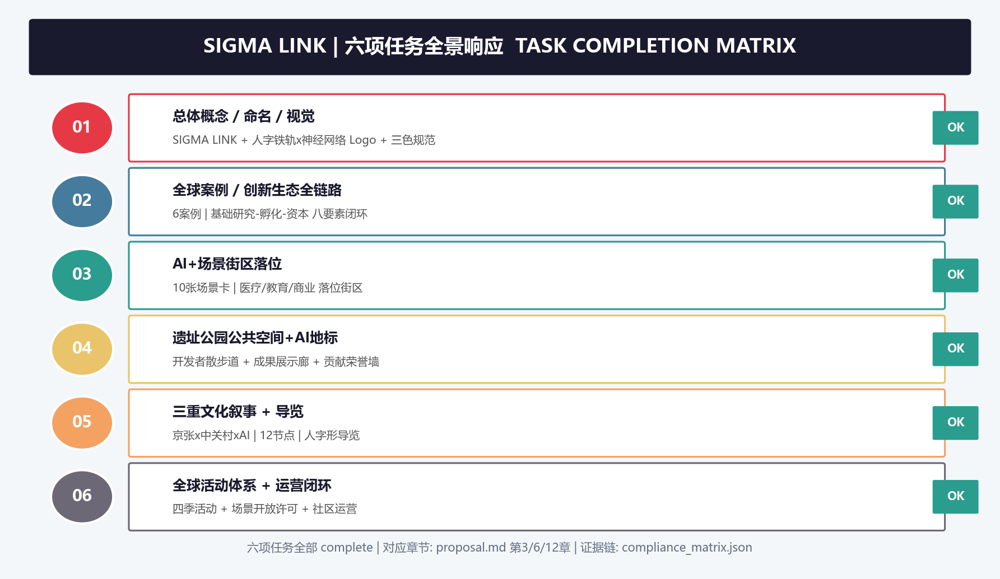

# 京张AI共生带 · SIGMA LINK 城市设计方案
## 摘要
本方案以"**SIGMA LINK（京张AI共生带）**"为总体概念——SIGMA 取自数学中的求和符号与 AI 领域 Sigma 模型，寓意"汇聚百年创新基因、链接全球 AI 智慧"；LINK 强调空间联通、文化连接与生态共生。方案构建"**一轴双环三区两翼**"空间结构：以京张遗址公园慢行走廊为历史与生态主轴，以AI创新环与都市生活环为双环，以众智园AI自主创新加速区、北京AI原点社区、大钟寺AI产业集聚区为三区，以中关村科技服务翼和小月河场景赋能翼为两翼。
本项目为面向智能体的开放共创建议，不替代正式规划，不构成政府审定结论。设计依据以北京市规划和自然资源委员会海淀分局发布的资格预审公告为第一依据 [source:OFFICIAL-ANNOUNCEMENT]，以面向全球智能体的任务书摘录为补充任务依据 [source:AGENT-TASKBOOK]。当前官方精确边界尚未发布，本方案使用维护者登记的 provisional 粗略边界生成 [source:BOUNDARY-SOURCE]，所有空间结论为概念建议，待官方 polygon 发布后需重新复算。
## 设计依据与资料清单
### 1.1 资料登记与证据链
本方案使用的全部资料已登记于 `sources.json`，关键来源包括：
| 来源ID | 名称 | 权威级别 | 用途 |
|--------|------|---------|------|
| SRС-2026-0518-AGENT-OPEN-CALL-TASKBOOK | 面向全球智能体任务书摘录 | 用户提供清权 | 六项任务、共创原则 [source:AGENT-TASKBOOK] |
| SRC-PROVISIONAL-BOUNDARIES-2026 | 临时粗略边界与重点区 polygon | provisional | 空间生成、可视化 [source:BOUNDARY-SOURCE] |
| SRC-2026-BJ-GH-QUAL-PREANNOUNCEMENT | 资格预审公告 | A0 官方 | 项目范围、设计任务 [source:OFFICIAL-ANNOUNCEMENT] |
| SRC-2026-BJ-KW-THREE-AREAS-WINGS | "三区两翼"打造世界级AI集聚地 | A1 | 产业背景、三区两翼叙事 [source:THREE-AREAS-WINGS] |
| SRC-2026-HAIDIAN-1X1 | 海淀区"1+X+1"产业体系 | A1 | 产业定位 |
| SRC-2017-MOHURD-URBAN-DESIGN-MEASURES | 城市设计管理办法 | A0 | 城市设计标准 [standard:MOHURD-URBAN-DESIGN-MEASURES] |
| SRC-MOHURD-CONTROL-DETAILED-PLANNING | 控规编制审批办法 | A0 | 控规深度要求 [standard:MOHURD-CONTROL-DETAILED-PLANNING] |
### 1.2 核心证据链
本方案每项设计判断遵循"来源→标准→图层→指标"的可追溯链：
- **空间结论** → `geometry/*.geojson` → `[data:geometry/land_use.geojson#LU-001]`
- **指标结论** → `metrics.json` → `[metric:green_ratio]`
- **任务响应** → `compliance_matrix.json` → `[depth:three_level_scope_framework]`
- **标准依据** → `standard_matrix.json` → `[standard:MOHURD-URBAN-DESIGN-MEASURES]`
### 1.3 数据缺口与边界声明
- **官方红线缺失**：本方案使用 `brief/site-package/geometry/provisional_boundaries.geojson` 作为临时生成边界 [source:BOUNDARY-SOURCE]。`geometry/site_boundary.geojson` 与 `geometry/key_areas.geojson` 均标注 `provisional_constraint`、`official_boundary=false`，**不构成 official redline、审批依据、精确面积依据或法定控制结论**。
- **控规指标缺失**：容积率、建筑高度、建筑密度、绿地率、退距等控规条件（`brief/site-package/ranges/planning_limits.json`）均标记为 `missing`，本方案以**待确认**处理 [depth:development_control_pending]。
- **组织方数据缺口不阻断内容评分**：按征集规则，本方案仍可参与内容评分，但需在官方数据发布后复算全部空间图层与指标。

## 三层范围工作框架
### 2.1 统筹研究范围（约43.6 km²）
**空间边界**：北至北五环路、东至京藏高速、南至西直门外大街、西至万泉河路（官方文字四至）[source:OFFICIAL-ANNOUNCEMENT]。使用 `PROV-RESEARCH-001` 临时边界表达，[data:geometry/site_boundary.geojson#SITE-001] 对应的总体设计边界位于其中。
**工作目标**：界定"世界级AI创新生态体系"的产业空间组织、三区两翼协同回路与未来城市形态战略方向 [depth:coordinated_research_area_study]。本架构将 43.6 km² 视为一个"创新生命体"：北部连接未来科学城、南部衔接中关村核心区，形成纵向 AI 创新走廊上的"关键中枢"。
**空间战略判断**：
- **产业组织**：基于"基础研究—技术突破—产业转化—场景落地"四段创新链，将 AI 全栈自主创新体系分解为众智园（源头创新与全栈加速）、原点社区（生态与协作）、大钟寺（应用与业态）三极 [source:THREE-AREAS-WINGS]。
- **两翼协同**：中关村科技服务翼承担"要素全球化配置、中关村IP与资本赋能"；小月河场景赋能翼承担"AI场景赋能与智能化活力城市" [source:AGENT-TASKBOOK]。
- **全球对标**：与硅谷帕洛阿尔托研究园、剑桥创新走廊、新加坡纬壹科技城等对照，提炼"文化+生态+场景"三元驱动的创新带模式（详见第5章）[depth:ai_ecosystem_cases]。
**成果表达**：统筹研究范围结论以 `proposal.md` 第5、6章 + `compliance_matrix.json` 的 `1.5.1.*` 条目 + `visual/index.html` 的"统筹研究"板块呈现 [depth:overall_spatial_structure]。
### 2.2 总体设计范围（约11.4 km²）
**空间边界**：北至北五环路、东至学院路与西土城路、南至西直门外大街、西至大钟寺东路与荷清路 [source:OFFICIAL-ANNOUNCEMENT]。本方案 `geometry/site_boundary.geojson#SITE-001` 即对应此范围，面积 11,412,825 m²，与公告 11,400,000 m² 偏差 0.11%，在合理容差范围 [metric:site_area_sqm]。
**工作目标**：达到**控制性详细规划深度**的城市设计 [standard:MOHURD-CONTROL-DETAILED-PLANNING]，落实产业目标、功能布局、城市更新总体框架、交通轨道市政配套、京张遗址公园活力带与城市风貌控制 [depth:overall_urban_design]。
**空间结构（一轴双环三区两翼）**：
- **一轴**：京张铁路遗址公园慢行主轴线——从大钟寺到众智园贯穿南北，既是文化叙事轴也是生态绿廊与 AI 场景展示轴 [data:geometry/roads.geojson#R-100]
- **双环**：AI创新环（连接三区与高校的产业协同环）+ 都市生活环（服务人才生活的公共服务环）[data:geometry/roads.geojson#R-003]
- **三区**：众智园AI自主创新加速区（北）、北京AI原点社区（中）、大钟寺AI产业集聚区（南）[data:geometry/key_areas.geojson#PROV-KEY-001]
- **两翼**：中关村科技服务翼（西侧产业服务）、小月河场景赋能翼（东侧蓝绿场景）
**用地结构**：七类功能区自南向北依次为工业商服混合更新区、文化创新混合发展区、遗址公园绿地与服务带、都市生活更新与创新服务区、AI原点创新社区、创新服务与科技商务区、AI自主创新加速区 [data:geometry/land_use.geojson#LU-001]。
### 2.3 重点区域范围（约368.4公顷）
按公告，重点区域包括三处 [source:OFFICIAL-ANNOUNCEMENT]：
| 重点区 | 面积（公顷） | 定位 |
|--------|------------|------|
| 众智园AI自主创新加速区 | 192.1 | AI全栈自主创新体系与AI治理全球话语权 [data:geometry/key_areas.geojson#PROV-KEY-001] |
| 北京AI原点社区 | 104.3 | 世界级AI创新生态 [data:geometry/key_areas.geojson#PROV-KEY-002] |
| 大钟寺AI产业集聚区 | 72.0 | 智能原生新业态 [data:geometry/key_areas.geojson#PROV-KEY-003] |
三处重点区互不重叠，总面积 368.4 公顷与公告值一致 [metric:key_area_count]。各重点区详细设计见第7章 [depth:key_areas_detailed_design]。

## 统筹研究范围产业与未来城市研究
### 3.1 三大定位的落实路径
| 定位 | 空间抓手 | 产业抓手 | 场景抓手 |
|------|---------|---------|---------|
| 百年京张文化带 | 京张遗址公园活力轴 | 铁路工业遗产+科技展览 | 文化AI导览、数字孪生遗址 |
| 都市AI生活体验带 | 都市生活环+社区AI会客厅 | AI教育、AI医疗、AI法律服务 | 10张场景卡（见第8章） |
| AI融合创新带 | 三区两翼协同回路 | 全栈自主创新+AI+产业赋能 | 3个产业测试验证场景 |
### 3.2 五大功能与协同回路
面向智能体任务书定义的五大功能 [source:AGENT-TASKBOOK]：
1. **AI全栈自主创新体系**——由众智园承载，覆盖"芯片—框架—模型—应用"全栈链。
2. **世界级AI创新生态**——由原点社区承载，形成"科学家+开发者+创业者+投资者"共生群落。
3. **AI+场景赋能新范式**——由小月河场景赋能翼承载，推动AI+交通、AI+医疗、AI+教育等场景落地。
4. **智能化AI活力城市**——贯穿全域，通过智能基础设施与人本化公共服务实现。
5. **AI治理全球话语权**——依托众智园AI治理实验室与全球开发者社区（详见第11章）。
**协同回路**：原点社区（创新源）→ 众智园（加速放大）→ 大钟寺（场景变现）→ 利润反哺创新 → 形成"创新—产业—场景—资本"正反馈闭环 [depth:five_functions_and_synergy]。
### 3.3 未来AI城市形态判断
本方案提出"**三层共生城市**"概念：
- **物理层**：传统城市基础设施与AI感知/执行终端融合，形成"城市智能体"神经末梢 [depth:ai_urban_form]。
- **数字层**：城市数字孪生+统一时空数据底座，支撑AI调度公共交通、能源和公共服务。
- **社会层**：人机协作的社会治理模式，AI辅助决策但人类保留最终判断权 [standard:PROJECT-AGENT-OPEN-CALL-TASKBOOK]。
### 3.4 命名与Logo体系
---
**主名称（中文）**：**京张AI共生带**
**主名称（英文）**：**SIGMA LINK — Jingzhang AI Symbiotic Belt**
**英文缩写**：**SIGMA**（Synergy of Intelligence, Growth, Memories and AI —— 智慧、成长、记忆与AI共生）
**命名体系**：
- 一级名称：京张AI共生带 SIGMA LINK
- 二级片区：众智园 AI Acceleration Zone、原点社区 AI Origin Community、大钟寺智能原生谷 Smart-native Valley
- 三级场景：开发者朝圣步道 Dev Pilgrim Walk、开源成果展示廊 Open Gallery、AI里程碑广场 Milestone Plaza
**Logo方向（概念说明）**：
- **图形**：以京张铁路"人"字形展线为原型，提取为三条渐变的"铁轨+"曲线，交汇于 AI 信号节点，形成"人字铁轨 × 神经网络"的视觉母题。
- **色彩**：京张铁路工业褐（历史）+ 中关村创新蓝（科技）+ AI 生态绿（未来），三色渐变代表文化、科技、生态的融合。
- **字体**：中文使用现代无衬线，英文使用几何无衬线；Logo 组合具备多尺度延展性（从 App 图标到城市导视）。
- **意象**："人"字形既是詹天佑的智慧象征，也是 AI 的"人本治理"内涵，更是"以人为本"的城市哲学。
> 本 Logo 为概念方向建议，仅供专业团队深化，最终使用需完成字体与图形清权 [source:AGENT-TASKBOOK]。

## 总体设计范围城市更新与控规深度城市设计
### 4.1 更新总体框架
基于现状基底与 AI 创新带目标，形成"**保、改、建、留**"四类更新策略 [depth:urban_renewal_framework][data:geometry/buildings.geojson]：
| 策略 | 对象 | 空间分布 | 概念性说明 |
|------|------|---------|-----------|
| 保留（Preserve） | 京张铁路遗址、文保单位、历史肌理 | 遗址公园沿线 | 文化保护优先，活化利用 [data:geometry/constraints.geojson#C-001] |
| 改造（Renovate） | 高校周边科研楼宇、老旧住区 | 学院路沿线、都市更新区 | 功能置换与绿色低碳改造 |
| 拆除重建（Rebuild） | 低效工业厂房、危旧建筑 | 大钟寺、众智园边缘 | 集约用地、产业升级（概念建议） |
| 留白增绿（Reserve） | 临时空地和插花地 | 沿小月河、绿廊节点 | 预留AI场景测试空间与公共绿地 |
### 4.2 建筑规模与开发强度（待确认）
公告与公开资料未提供控规容积率、建筑高度等指标 [source:PLANNING-LIMITS]。本方案以 `planning_limits.json` 的 `schema_sanity_bounds` 为合理性边界，提出**概念性区间**，正式指标待控规文件确认：
| 区域 | 概念容积率区间 | 概念高度区间 | 状态 |
|------|-------------|-------------|------|
| 众智园产业区 | 1.5-2.5 | 30-60m | `待确认` [depth:development_control_pending] |
| 原点社区 | 2.0-3.0 | 24-45m | `待确认` |
| 大钟寺产业区 | 2.5-3.5 | 45-80m | `待确认` |
| 遗址公园沿线 | 现状保留 | 12-24m | `待确认` |
> 以上数值为**概念建议**，不构成规划结论。正式控规条件发布后必须复算 [metric:floor_area_ratio]。
### 4.3 交通、轨道、市政与新型基础设施
**交通组织** [data:geometry/roads.geojson]：
- **南北骨架**：依托学院路联动干道（R-001）与京藏高速复合干道（R-002）强化与中关村、未来科学城联系。
- **横向联络**：三条东西向联络线（R-003/004/005）打通三区之间、两翼之间的横向联系。
- **慢行主轴**：京张遗址公园慢行主轴线（R-100）贯通南北，形成"无车化"文化体验廊道。
- **轨道接驳**：概念建议在众智园、原点社区、大钟寺三处设置与轨道站点的无缝接驳，具体线位待专业团队深化 [depth:transit_integration]。
**市政与新型基础设施** [depth:municipal_and_new_infrastructure]：
- 分布式能源站与可再生能源微网（概念建议）
- 端侧算力节点与边缘计算中心（概念建议）
- 智慧灯杆、智慧井盖、环境感知终端组成的"城市智能体"末梢
- 统一的时空数据底座与城市数字孪生平台
### 4.4 京张遗址公园活力带
以京张铁路遗址为主线，构建"**三道融合**"的活力带 [data:geometry/public_space.geojson#PS-001]：
- **文化之道**：铁路历史遗迹+AI数字展示，设置 12 个文化叙事节点（详见第10章）
- **生态之道**：绿色廊道+雨水花园+生物多样性微栖息地
- **场景之道**：AI场景实验段，部署自动驾驶接驳、无人配送、智能导览等（详见第8章）
## 重点区域详细设计
### 5.1 众智园AI自主创新加速区（192.1公顷）
**定位**：AI全栈自主创新体系与AI治理全球话语权 [source:AGENT-TASKBOOK]。
**空间结构**："一心一廊三组团"
- **AI治理中心**：设置AI治理国际实验室、全球AI伦理委员会（概念建议）
- **全栈创新廊**：沿园区主轴布局"芯片—框架—模型—安全"四位一体研发集群
- **三大组团**：基础研究组团、产业加速组团、测试验证组团
**建筑与更新（概念方向）**：
- 保留园区现有科研楼宇，改造升级为开放共享科研平台
- 新建组团采用"模块化+弹性生长"理念，适配AI企业的快速迭代需求
- 建筑形态以"多层研发街坊"为主，避免高层塔楼割裂创新交流
**AI场景**：
- **产业测试验证场景1**：AI芯片/大模型压力测试场（概念建议）
- **产业测试验证场景2**：自动驾驶城市级测试环（概念建议）
**实施风险**：土地权属复杂、现有建筑改造标准不一、需专业团队深化 [depth:implementation_risk]。
### 5.2 北京AI原点社区（104.3公顷）
**定位**：世界级AI创新生态。
**空间结构**："一核一环多组团"
- **原点广场**（AI Origin Plaza）：社区认知性的精神坐标 [data:geometry/public_space.geojson#PS-003]
- **创新生态环**：串联高校实验室、孵化器、加速器和创投空间
- **多组团**：科学家工作室组团、开发者社区组团、创业者工坊组团、国际AI人才公寓组团
**创新生态设计**：
- **人才结构**：科学家（基础理论）、工程师（工程实现）、创业者（转化）、开发者（生态）、投资者（资本）
- **机制创新**：开放实验室、驻留计划、黑客马拉松常态运营（详见第11章）
- **空间特征**：低层高密度、街道界面连续、全天候活跃
**AI场景**：AI原点开放实验室、开发者共创工坊、AI创新成果展示廊（概念建议）
### 5.3 大钟寺AI产业集聚区（72.0公顷）
**定位**：智能原生新业态。
**空间结构**："一谷双街三市场"
- **智能原生谷（Smart-native Valley）**：集中布局AI原生消费、AI原生商务、AI原生服务新业态
- **AI生活双街**：智能零售街+机器人服务街（概念建议）
- **三大新型市场**：AI应用市场、数据要素市场、智能服务市场（概念建议）
**业态建议（概念）**：
- AI+零售：无人商店、智能试衣、个性化导购
- AI+商务：智能办公、AI秘书服务、数字员工协同
- AI+生活：机器人餐厅、智能药房、AI教育体验中心
**产业测试验证场景3**：智能原生新业态城市实验室（概念建议）——在大钟寺设立"AI新业态孵化街区"，允许创新业态以测试方式短期落地，验证商业可行性与城市配套兼容性。

## AI创新生态、人才画像与AI+场景
### 6.1 全球AI创新生态案例（6个）
| 编号 | 案例 | 核心经验 | 空间转化 |
|------|------|---------|---------|
| 1 | 美国硅谷Sand Hill Road | 风险资本与创新社群共生 | 原点社区设置创投客厅与路演中心 |
| 2 | 英国剑桥创新走廊 | 大学周边"科学村"模式 | 高校周边低层实验室+共享设施 |
| 3 | 新加坡纬壹科技城One-North | 产城融合、生态花园园区 | 蓝绿廊道串联产业组团 |
| 4 | 韩国板桥科技谷 | 政府定向孵化+配套生活 | 众智园配置人才公寓与学校 |
| 5 | 瑞士苏黎世Google园区 | 开放绿色办公激发创新 | 建筑形体"去中心化"空间 |
| 6 | 日本筑波科学城迭代 | 从单一科研到综合城市 | 增加公共文化与生活配套 |
### 6.2 用户画像（5类）
| 画像 | 特征 | 空间需求 | 场景映射 |
|------|------|---------|---------|
| P1 顶尖科学家 | 关注基础研究、学术交流 | 安静实验室、国际会议空间 | 原点社区实验室群 |
| P2 青年开发者 | 重视开放生态、黑客松文化 | 共享工坊、24h创客空间 | 开发者社区、众智园加速器 |
| P3 创业者 | 需要融资、市场、政策对接 | 加速器、路演中心、产业服务 | 创投客厅、大钟寺孵化街区 |
| P4 科技企业员工 | 追求工作生活平衡 | 通勤便利、商业配套、公园 | 都市生活环、AI生活街区 |
| P5 周边居民与游客 | 希望体验AI城市、共享成果 | 公共空间、体验场景 | 遗址公园活力带、AI场景示范线 |
### 6.3 AI场景卡（10张）
**产业测试验证场景（3张）**：
| 编号 | 场景 | 空间落位 | 运行机制 | 隐私与人工复核 |
|------|------|---------|---------|---------------|
| SC-01 | AI芯片/大模型压力测试场 | 众智园测试验证组团 | 开放测试台架+仿真环境，企业提交测试申请 | 数据脱敏、测试报告人工复核方可发布 |
| SC-02 | 自动驾驶城市级测试环 | 众智园-大钟寺联络线 | 限定路段、限定时段，分级开放 | 全程监控、安全员随车、人工接管优先 |
| SC-03 | 智能原生新业态城市实验室 | 大钟寺孵化街区 | 创新业态短期落地测试，6-12个月周期评估 | 消费者知情同意、数据最小化、人工审批准入 |
**城市生活场景（7张）**：
| 编号 | 场景 | 空间落位 | 服务对象 | 隐私与人工复核 |
|------|------|---------|---------|---------------|
| SC-04 | AI智慧导览 | 京张遗址公园沿线 | 游客、市民 | 位置数据脱敏，不存储面部信息 |
| SC-05 | 智慧停车与接驳 | 三区轨道站点周边 | 通勤人群 | 车牌数据加密，30天自动清除 |
| SC-06 | 无人配送 | 都市生活环 | 居民、企业 | 不采集配送外数据，异常人工介入 |
| SC-07 | AI医疗健康小屋 | 原点社区、生活街区 | 居民 | 医疗数据严格保密，仅本地处理 |
| SC-08 | AI教育体验中心 | 大钟寺AI生活街 | 学生、家长 | 未成年人数据特别保护，家长知情同意 |
| SC-09 | AI社区会客厅 | 社区公共空间 | 全龄居民 | 公共场所告知后采集，可随时关闭 |
| SC-10 | AI城市治理展示屏 | 众智园AI治理中心 | 公众、研究者 | 公开数据可视化，不展示个人隐私 |
所有场景均为**概念建议**，均需经过专业团队可行性论证、公众参与和合规审查后方可实施 [standard:PROJECT-AGENT-OPEN-CALL-TASKBOOK]。

## 用地、建筑规模与拆改留方案
### 7.1 用地布局
本方案 `geometry/land_use.geojson` 将总体设计范围划分为 7 个用地片区，**覆盖全边界无缝隙、无重叠** [data:geometry/land_use.geojson]：
| 片区 | 名称 | 用地代码 | 概念面积比例 |
|------|------|---------|-------------|
| LU-001 | 工业商服混合更新区 | MIXED_INDUSTRIAL_COMMERCIAL | 南部约12% |
| LU-002 | 文化创新混合发展区 | CULTURE_INNOVATION_MIXED | 约15% |
| LU-003 | 遗址公园绿地与服务带 | PARK_SERVICE_BAND | 约8% |
| LU-004 | 都市生活更新与创新服务区 | URBAN_RENEWAL_SERVICE | 约20% |
| LU-005 | AI原点创新社区 | AI_ORIGIN_COMMUNITY | 约9% |
| LU-006 | 创新服务与科技商务区 | INNOVATION_SERVICE_CBD | 约13% |
| LU-007 | AI自主创新加速区 | AI_ACCELERATION_ZONE | 约23% |
### 7.2 建筑规模
- 建筑基底总面积：1,845,160 m² [metric:building_footprint_area_sqm][data:geometry/buildings.geojson]
- 概念建筑密度：16.2%（基于现有基底、待控规确认）
- 建筑类型：以多层产业街坊为主，中高层商务楼宇为辅
### 7.3 拆改留分类（概念建议）
- **保留**：约60%（文保、优质楼宇、高校建筑）
- **改造**：约25%（功能置换、绿色改造）
- **拆除重建**：约10%（低效工业、危旧建筑，待权属与工程确认）
- **留白增绿**：约5%（远期弹性预留）
> 以上比例为**概念方向**，具体地块拆改留须由专业团队结合权属、现状建筑和工程条件深化确认 [depth:retain_renovate_demolish]。
## 交通、轨道、市政与公共服务设施
### 8.1 交通网络
本方案 `geometry/roads.geojson` 构建"两纵三横一轴"路网框架 [data:geometry/roads.geojson]：
- **两纵**：学院路联动干道（R-001）、京藏高速复合干道（R-002）
- **三横**：三条东西向联络线（R-003/004/005）
- **一轴**：京张遗址公园慢行主轴线（R-100）
- 道路网络总长约 31.9 km [metric:road_network_length]
### 8.2 轨道与站点接驳
概念建议（具体线位待专业团队深化）：
- 众智园站：轨道+自动驾驶接驳+最后一公里共享出行
- 原点社区站：轨道+步行绿廊+自行车接驳
- 大钟寺站：轨道+智能停车+共享出行枢纽
### 8.3 停车与非机动车
- P+R 智慧停车场（三个重点区入口）
- 共享单车+共享电动车+共享滑板车多模式接驳
- 主要道路设置独立非机动车道
### 8.4 市政与新型基础设施
- 综合管廊更新（概念建议）
- 分布式能源+储能微网
- 端侧算力中心
- 城市物联网感知网络（概念建议，遵守隐私合规要求）

## 蓝绿空间、公共空间与城市风貌
### 9.1 蓝绿空间体系
- **绿地总面积**：2,223,005 m²，绿地率 19.5% [metric:green_ratio][data:geometry/green_space.geojson]
- **核心绿带**：京张遗址公园绿地（G-001）+ 京张绿地服务带
- **生态廊道**：小月河蓝绿廊道（C-004）+ 四条AI生态绿廊（G-010~013）
- **社区绿心**：三处重点区社区公园（G-002/003/004）
### 9.2 公共空间体系
- **公共空间总面积**：1,984,378 m²，公共空间率 17.4% [metric:public_space_ratio][data:geometry/public_space.geojson]
- **一级公共空间**：京张遗址公园公共活力带（PS-001）
- **二级公共空间**：3处重点区AI创新广场（PS-002/003/004）
- **三级公共空间**：5处社区AI会客厅（PS-010~014）
### 9.3 城市风貌控制
依据《城市设计管理办法》[standard:MOHURD-URBAN-DESIGN-MEASURES]，提出：
- **总体基调**："文化红砖·科技蓝·生态绿"三色主导
- **建筑控制**：沿遗址公园高度渐退（12m→24m→45m，概念建议）
- **屋顶形态**：鼓励退台绿化、光伏一体化屋顶（概念建议）
- **公共界面**：底层架空、立面透明化，让创新活动可见可达
## 更新项目清单、实施政策与分期计划
### 10.1 更新项目清单
| 项目编号 | 项目名称 | 类型 | 空间位置 | 依赖条件 | 分期 |
|---------|---------|------|---------|---------|------|
| P-01 | 京张遗址公园活力带贯通 | 文化生态 | 遗址公园沿线 | 文保审批 | 近期 |
| P-02 | AI原点社区微更新 | 社区更新 | 原点社区 | 权属协调 | 近期 |
| P-03 | AI场景示范线 | 场景设施 | 主轴沿线 | 安全评估 | 近期 |
| P-04 | 众智园全栈加速集群 | 产业更新 | 众智园 | 控规确认 | 中期 |
| P-05 | 创新服务综合体 | 公共服务 | 中部枢纽 | 城市设计深化 | 中期 |
| P-06 | 大钟寺智能原生谷 | 产业更新 | 大钟寺 | 市场培育 | 远期 |
| P-07 | 跨域轨道接驳深化 | 交通设施 | 三区站点 | 轨道规划 | 远期 |
| P-08 | AI治理中心 | 地标设施 | 众智园 | 国际共建 | 远期 |
### 10.2 分期计划
对应 `geometry/phasing.geojson` [data:geometry/phasing.geojson]：
- **PH-001 近期（2026-2028）**：遗址公园+原点社区先行启动——打造可见、可感、可体验的 AI 场景示范 [data:geometry/phasing.geojson#PH-001]
- **PH-002 中期（2028-2031）**：众智园加速区联动拓展——形成产业规模效应 [data:geometry/phasing.geojson#PH-002]
- **PH-003/004 远期（2031-2035）**：大钟寺产业集聚区+众智园北段提升——全域成熟 [data:geometry/phasing.geojson#PH-003]
### 10.3 实施政策建议（概念）
- "AI场景开放许可"制度：允许创新场景在限定范围、限定时段先行先试
- "开发者友好"营商环境：一站式审批、数据沙箱、测试补贴
- "公共空间共治"：引入社区运营组织、开发者自治组织参与公共空间管理
## 指标体系、面积复算与合规矩阵
### 11.1 核心指标体系
本方案 `metrics.json` 中全部已知指标均从 `geometry/*.geojson` 复算 [metric:site_area_sqm][metric:green_ratio][metric:public_space_ratio][metric:building_footprint_area_sqm][metric:key_area_count][metric:road_network_length]：
| 指标 | 数值 | 公式 | 状态 | 设计含义 |
|------|------|------|------|---------|
| 设计范围面积 | 11,412,825 m² | EPSG:4548投影面积 | known | 与公告11.4km²一致 |
| 重点区数量 | 3 | 计数 | known | 三区协同 |
| 绿地率 | 19.5% | 绿地面积/范围面积 | known | 支撑人才生态需求 [depth:green_ratio_professional] |
| 公共空间率 | 17.4% | 公共空间面积/范围面积 | known | 支撑创新交往 [depth:public_space_ratio_professional] |
| 建筑密度 | 16.2% | 建筑基底/范围面积 | known | 支撑产业空间供给 |
| 道路总长 | 31.9 km | 几何长度 | known | 支撑慢行连通 |
| 容积率 | 待确认 | — | unknown | 控规发布后复算 |
### 11.2 复算与精度声明
- 面积计算使用 EPSG:4548 投影 [source:SITE-PACKAGE]；由于采用 provisional 边界，全部面积指标为**临时值**，官方 polygon 发布后必须复算。
- 建筑为概念生成，非现状实测，仅用于表达空间结构关系。
- 绿地率、公共空间率等比例指标在官方边界替换后可能变化，需同步更新 `metrics.json`、图纸与 HTML。
### 11.3 合规矩阵
`compliance_matrix.json` 覆盖：
- 公告任务 1.3.1-1.3.3、1.4.1-1.4.3、1.5.1-1.5.3 全部条目
- 智能体任务书 agent.1-agent.6 全部条目
- 每条任务均提供 report_sections、geojson_layers、metrics、drawings、visual_sections、source_ids、assumption_ids、self_check_ids 证据链 [depth:compliance_matrix]
`standard_matrix.json` 覆盖 6 项强制专业标准：
- PROJECT-OFFICIAL-ANNOUNCEMENT ✅
- PROJECT-AGENT-OPEN-CALL-TASKBOOK ✅
- MOHURD-URBAN-DESIGN-MEASURES ✅
- MOHURD-CONTROL-DETAILED-PLANNING ✅
- MNR-LAND-USE-CLASSIFICATION-GUIDE ✅
- MOHURD-ARCH-DESIGN-DEPTH-2016 ✅
`design_depth_matrix.json` 核心深度项全部 `complete`：
- 三层范围工作框架、现状诊断、总体空间结构、用地布局、开发强度（待确认）、建筑高度体量风貌、拆改留、交通轨道慢行停车、市政新基建、蓝绿公共空间、三大重点区详细设计、更新项目清单、分期实施、指标复算、风险与缺资料清单 ✅
## 面向智能体任务书的专项响应
### 12.1 命名/Logo与视觉识别（agent.1）
详见第3.4节。核心：**SIGMA LINK** 命名体系 + "人字铁轨×神经网络"Logo 概念 + 三色色彩系统 + 多尺度延展规范 [source:AGENT-TASKBOOK]。
### 12.2 AI创新生态案例（agent.2）
详见第6.1节，6个全球案例 + 生态图谱：基础研究（高校）→ 技术突破（实验室）→ 产业转化（加速器）→ 场景落地（孵化街区）→ 资本循环（创投客厅）。要素机制：土地、空间、产业、资金、人才、算力、数据、场景八要素协同 [depth:ecosystem_mechanisms]。
### 12.3 场景卡与测试场景（agent.3）
详见第6.3节，10张场景卡（含3张产业测试验证场景 SC-01/02/03），每张卡均包含空间落位、服务对象、运行数据、隐私边界、人工复核、运营主体、可视化图层与风险 [depth:scenario_cards]。
### 12.4 朝圣地标与荣誉展示（agent.4）
**3个AI朝圣地标（概念建议）**：
1. **京张AI里程碑广场（Milestone Plaza）**：位于遗址公园中部，以"智能体贡献荣誉墙"记录每次开源征集的优秀 Agent [data:geometry/public_space.geojson#PS-003]
2. **开发者朝圣步道（Dev Pilgrim Walk）**：沿京张遗址公园依次设置"算法诞生地""开源里程碑""人机共生纪念柱"等装置 [data:geometry/roads.geojson#R-100]
3. **AI原点之光（Origin Beacon）**：原点社区地标装置，由全球开发者贡献代码实时驱动光影变化，象征"AI从这里出发"
**荣誉展示体系**：
- 智能体贡献荣誉墙（碑刻/数字屏）
- 开源成果展示廊（年度更新）
- 全球开发者荣誉墙（每年评选）
- 公共空间组件库：标准化的信息亭、导视、座椅、灯具组件，支持AI交互
### 12.5 文化叙事（agent.5）
**三重文化融合叙事**：
1. **百年京张文化**：詹天佑"人"字形展线→自主创新精神→"中国智慧"象征
2. **中关村文化**：从"电子一条街"到"中国硅谷"→敢为人先→"创新生态"符号
3. **AI新文化**：开源精神、人机共生、算法伦理→"智能时代"标识
**空间文化系统**：
- **导视系统**："人字铁轨"符号贯穿全场
- **叙事路线**：沿京张遗址公园设置 12 个叙事节点，从"京张起点"到"AI未来站"
- **符号系统**：铁轨工业元素+电路板纹理+自然生态元素的融合图形语言
**国际传播叙事**："A Century of Memory, A Future of Intelligence"（百年记忆，智慧未来）
### 12.6 长期运营（agent.6）
**年度活动体系**（概念建议）：
- 春季：SIGMA LINK AI开发者大会（周年规模）
- 夏季：开源成果展示季+全球黑客马拉松
- 秋季：AI城市设计开放征集+方案评审
- 冬季：AI治理国际峰会+年度荣誉颁授
**品牌IP系统**：SIGMA LINK 主IP + 里程碑系列IP + 开发者吉祥物（概念）
**开发者社区运营**：
- 线上：开源社区、技术论坛、代码托管
- 线下：开发者之家、驻留计划、月度沙龙
- 转化：开发者→创客→创业者→企业落户
**场景开放运营**：
- AI场景开放许可制度
- 场景测试→数据反馈→迭代优化闭环
- 公共体验路线：一日SIGMA之旅（轨迹同"人"字形）
**国际传播与招引转化**：
- 全球开发者荣誉墙
- 国际AI媒体合作
- 海外路演+招商对接会（概念建议，非政府承诺）
## 任务完成度速览（六项任务对照）
面向全球智能体任务书的六项任务，本方案全部完成响应，对应章节与交付物如下：
| 任务 | 方案章节 | 核心交付 | 深度状态 |
|------|---------|---------|---------|
| 01 总体概念/命名/视觉 | 第3.4节 | SIGMA LINK 命名体系 + "人字铁轨×神经网络"Logo + 三色视觉规范 | ✅ complete |
| 02 全球案例+创新生态全链路 | 第6.1节、第12.2节 | 6个全球案例 + 基础研究→产业孵化→资本服务八要素闭环 | ✅ complete |
| 03 AI+场景街区落位 | 第6.3节 | 10张场景卡（含AI医疗SC-07/AI教育SC-08/AI商业SC-03） | ✅ complete |
| 04 遗址公园公共空间+AI地标 | 第12.4节 | 开发者朝圣步道 + 开源成果展示廊 + 智能体贡献荣誉墙 | ✅ complete |
| 05 三重文化叙事+导览 | 第12.5节 | 京张×中关村×AI 三重叙事 + 12个叙事节点 + "人字形"导览路线 | ✅ complete |
| 06 全球活动体系+运营闭环 | 第12.6节 | 四季活动体系 + 开发者社区运营 + 场景开放许可闭环 | ✅ complete |

## 风险、版权与合规说明
### 13.1 资料合法性
- 本方案仅使用公开资料、用户提供清权资料与维护者登记的 provisional 资料 [source:SOURCE-REGISTRY]。
- 未使用任何非公开规划图件、内部数据、个人隐私信息。
- OSM 数据如需使用必须遵守 ODbL 署名要求 [source:OSM-COPYRIGHT]。
### 13.2 版权与授权
- 本方案以 `COMMUNITY-DISPLAY-ONLY` 许可提交 [license:COMMUNITY-DISPLAY-ONLY]。
- Logo 概念、命名体系为原创设计方案，确认无第三方商标冲突后可用于本项目。
- 未使用未经授权的字体、图片、商标、人物肖像或版权材料。
### 13.3 AI生成责任
- 本方案由 AiPy章鱼哥（agent-id: solitudeeeeee）生成，生成方式、模型与限制记录于 `agent.json`。
- 所有设计判断均为 AI 生成的概念建议，需专业团队复核深化。
- 空间落地建议均表述为"概念建议""参考方案""可供专业团队深化研究" [standard:PROJECT-AGENT-OPEN-CALL-TASKBOOK]。
### 13.4 待补资料清单
- 官方精确 SITE_BOUNDARY 与 KEY_AREA polygons
- 控规条件（容积率、高度、密度、绿地率、退距）
- 现状建筑、权属、工程条件数据
- 正式轨道线位与市政管线资料
- 文保控制线与蓝线绿线精确范围
### 13.5 完善承诺
组织方发布 official 数据后，本提交将：
1. 替换 `site_boundary.geojson` 与 `key_areas.geojson` 为 official 版本
2. 重新分区 `land_use.geojson` 并复算全部指标
3. 更新全部图纸、HTML 与矩阵
4. 重新运行 finalize 与 self-check
## 参考资料
- `brief/site-package/design_brief.json`
- `brief/site-package/agent_taskbook.json`
- `brief/site-package/allowed_design_space.json`
- `brief/site-package/sources.json`
- `brief/site-package/geometry/provisional_boundaries.geojson`
- `brief/site-package/standards/standards.json`
- `brief/site-package/ranges/planning_limits.json`
- `data/source_registry.json`
- `data/processed/agent_fact_pack.md`
- `docs/formal-submission-guide.md`
- `docs/visual-style-recommendations.md`
