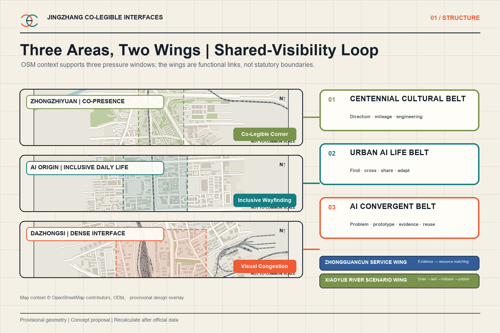
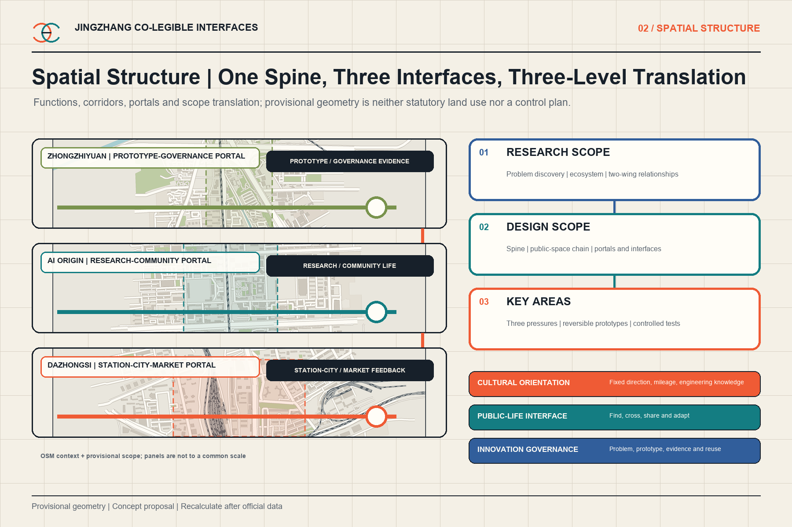
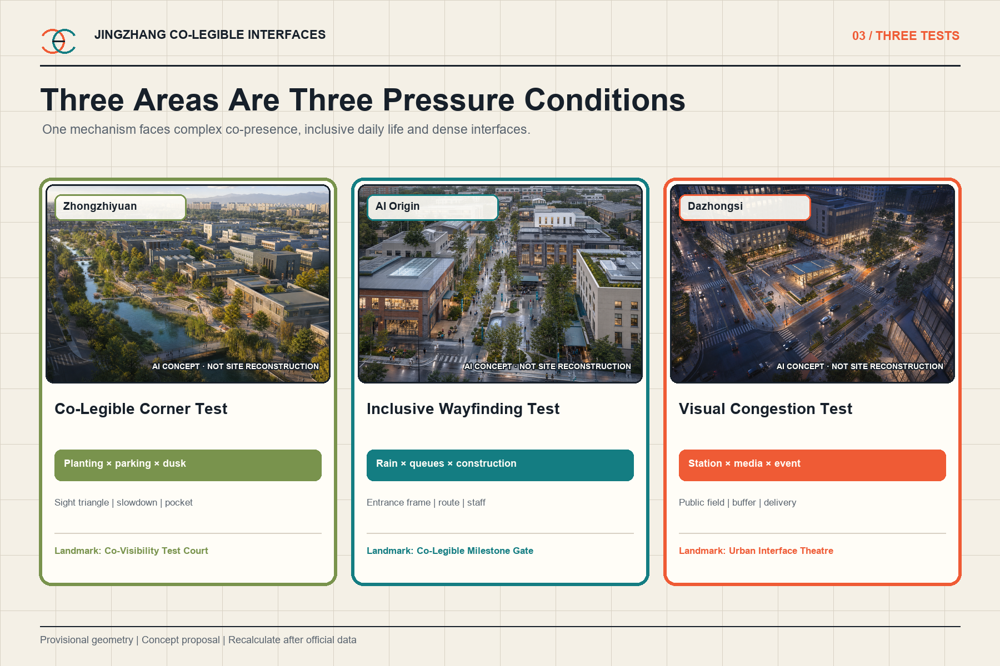
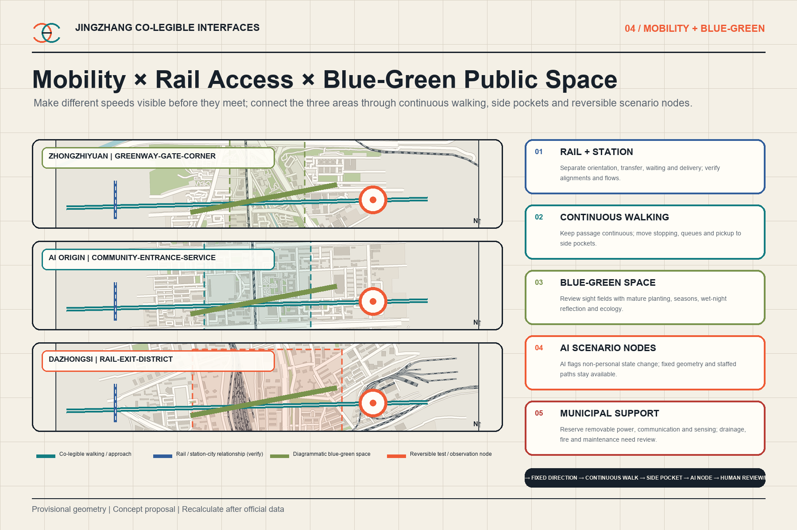
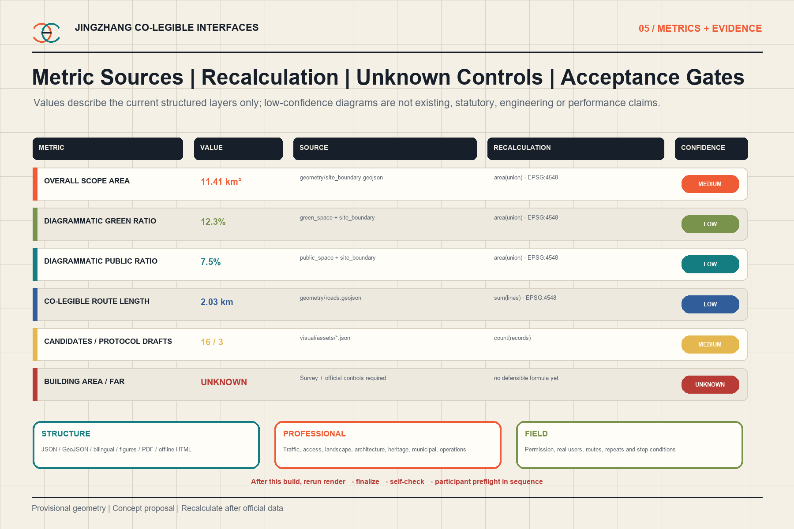

# Jingzhang Co-Legible Interfaces

> **Let the city be understood before it is made intelligent.**

This proposal does not make AI into a screen, light show or robot showroom. It turns a more basic question into urban design: as people move, goods circulate, environments change and digital agents gradually reach urban interfaces, can essential directions, boundaries, conflict objects and public services remain sufficiently visible, clear, non-overloaded and predictable? The design objects are sight fields, occlusion, entrances, curbs, planting, ground floors, wayfinding and temporary interfaces. AI only assists comparison, maintenance and scenario coordination; the city continues to work when AI is off.

## Design basis and evidence

The official announcement and agent taskbook govern scope. The repository site package supplies the boundary, three key areas, controlled vocabularies and missing-data list. The site and all key-area polygons remain provisional geometry; no footprint in this package is an official redline, parcel, approval or engineering conclusion [source:OFFICIAL-ANNOUNCEMENT] [source:AGENT-TASKBOOK] [assumption:A-BOUNDARY-001].

Evidence is separated into GeoJSON, metrics recalculated in EPSG:4548, and explicit assumptions. Existing-condition diagnosis begins with falsifiable urban tasks and field-survey needs rather than a fabricated basemap [depth:existing_conditions_diagnosis] [source:PROCESSED-FACT-PACK].

Six external cases provide methods only. They are not Beijing standards and no threshold is transferred:

| Case | Method extracted | Restrained transfer |
| --- | --- | --- |
| Legible London, TfL | Consistent pedestrian information at decision points | Protect public orientation before commercial messages; no graphic standard is copied |
| LTA street-level wayfinding pilot, Singapore | Survey, co-design, physical pilot and interview evaluation | Test entrance, landmark and confirmation cues before codifying components |
| NYC DOT intersection visibility tool | Improve visibility through curb and parking design | Change physical space before adding sensing |
| U.S. Access Board PROWAG | Continuous accessibility in public rights-of-way | A visual specialty never substitutes for tactile, audible and full accessibility review |
| UK Inclusive Transport Strategy | Treat inclusion as a whole-journey condition | Test the chain from entrance to crossing to service, not one sign |
| Toronto TO360 | Citywide consistency across pedestrian wayfinding nodes | Reuse a stable public-information grammar while adapting content to place |

## Three-level scope framework

At the strategic scale, co-legibility becomes a public question for the AI ecosystem. At the overall design scale, a transferable interface kit connects to the Jingzhang heritage-park system. At the key-area scale, three different pressures test the same mechanism. The loop is problem, prototype, field test, revision and reuse [depth:three_level_scope_framework] [standard:PROJECT-OFFICIAL-ANNOUNCEMENT].

The structure is one co-legibility spine, three pressure tests and six component families: co-legible corners, entrance recognition frames, protected public-wayfinding fields, continuous passage bands, side stopping pockets and versioned temporary interfaces [depth:overall_spatial_structure] [data:geometry/roads.geojson#ROAD-001].

## Taskbook positioning, three areas, two wings and coordination loop

Co-legible interfaces do not replace the taskbook with a visual theme. They translate its three positions and five functions into a testable public-space layer. The positions are the Centennial Jingzhang Cultural Belt, Urban AI Life Experience Belt and AI Convergent Innovation Belt. The functions are a full-stack independent AI innovation system, a world-class AI innovation ecosystem, a new paradigm for AI-enabled scenarios, a vibrant AI-enabled city and a global voice in AI governance. Direction, mileage, signalling and maintenance knowledge shape the cultural narrative; everyday finding, crossing, sharing and adapting shape the life experience; urban problems, prototypes, evidence packets and component reuse shape convergent innovation; minimum data, human review, published failures and rollback shape governance evidence [source:AGENT-TASKBOOK] [assumption:A-TASK-COVERAGE-001].

The three areas and two wings are not five isolated projects. Zhongzhiyuan receives full-stack capabilities, professional review and governance evidence. AI Origin connects university research, talent, community life and public services. Dazhongsi receives station-city pressure, enterprise prototypes, AI-native services and market feedback. The Xiaoyue River Scenario Empowerment Wing links the three prototypes through enter, orient, co-test, respond, roll back and publish. The Zhongguancun Technology Service Wing only matches professionally reviewed evidence packets with advisory IP, capital, technology service, compute and international resources. The loop is urban problem → three-area prototypes → Xiaoyue River public experience chain → human and professional review → Zhongguancun service matching → component reuse. Exact wing extents, ownership, carriers and flows remain unverified [assumption:A-TWO-WINGS-001] [assumption:A-XIAOYUEHE-001].

## Global AI ecosystem comparison and eight Jingzhang mechanisms

Six AI ecosystems were separately checked; wayfinding or accessibility cases no longer stand in for agent.2. Seoul AI Hub shows public coordination of research, firms and talent. Punggol Digital District links a university, industry space and district digital platform. IPAI Campus combines research, business, social participation, living labs and startup support [source:CASE-SEOUL-AI-HUB] [source:CASE-PUNGGOL-DIGITAL-DISTRICT] [source:CASE-IPAI-CAMPUS].

Mila connects a research network, industry collaboration and talent. AI Singapore connects problem-led projects, engineering platforms and talent programmes. Hub71+ AI illustrates market, capital, corporate and international-talent services. These sources support mechanisms only; their scale, investment, subsidy, tax, visa, authority, tenants or reputation are not transferred [source:CASE-MILA] [source:CASE-AI-SINGAPORE] [source:CASE-HUB71-AI].

| Factor | Action now available to Jingzhang | Required evidence | Human gate |
| --- | --- | --- | --- |
| Land / space | Test reversible components only on confirmed carriers | Location, version, plan, section and failure samples | Planning, ownership, architecture, traffic, landscape and accessibility |
| Industry / funds | Match capabilities to real urban problems and verify staged cost and exit | Reproducible experiment, boundary statement and pending cost range | Public-interest, finance and procurement review |
| Talent | Developers, professionals and real users review together | Contributions, consent and review record | Ethics, participant protection and professional responsibility |
| Compute / data | Compute only when needed; use non-personal, aggregated or manual records | Inputs, outputs, retention, deletion responsibility and AI-off record | Security, privacy and operator confirmation |
| Scenarios / governance | Controlled tests, public experience chain, published failures and rollback | Scenario cards, test records, human decision and version archive | Venue, public and professional review |

Firms, funding, compute capacity, policies, partners, floor area and attraction results are unconfirmed [assumption:A-ECOSYSTEM-ACTORS-001].

## AI operating contract: three marginal values to prove

AI is limited to three functions that can be compared with a manual baseline: seasonal occlusion-change alerts for planting, parking and temporary objects; construction and event interface version audits for barriers, detours and public wayfinding; and non-personal visual-load comparison for media, events, wet-night reflection and public directions. Each function declares minimum inputs, outputs, the human decision, low-confidence and error handling, the AI-off baseline, data retention and rollback. There is no facial recognition, personal trajectory, emotion inference or automatic enforcement [assumption:A-AI-OPERATIONS-001].

Marginal value is recorded separately as discovery time, false positives and misses, review labour, missed version drift and overlooked conflict types. AI produces only a sourced recommendation ticket with a confidence note. Missing versions, incomparable records, an out-of-scope site condition or an output that cannot be reviewed triggers a stop and human fallback. Operator, access, retention, professional thresholds, budget and procurement remain open gates.

## Three public landmarks, recognition and cultural storyline

The Jingzhang heritage-park AI public-space concept combines fixed public directions, continuous passage bands, side stopping pockets and versioned temporary interfaces. East-west stitching strengthens multi-height directions and protected sight fields only at existing crossings cleared for ownership, traffic and accessibility. North-south connection follows a station-exit, gate, corner and greenway task chain; it makes no untested bridge or tunnel claim. Dazhongsi's AI-native consumer and business scenarios are limited to visible staffed help, switchable prototype trials outside critical decision views, sourced evidence review including failures, and service interfaces separated from delivery stopping and queues. They are neither a product menu nor a confirmed attraction programme [assumption:A-CONTROLS-001] [assumption:A-LANDMARK-SITING-001].

The three landmarks are neither large buildings nor technology spectacles. The Co-Visibility Test Court at Zhongzhiyuan displays reversible components, failures and the current version. The Co-Legible Milestone Gate at AI Origin connects direction, mileage and version information with contemporary co-creation without imitating heritage fabric. The Urban Interface Theatre at Dazhongsi hosts switchable demonstrations, service trials, short events and visible human help while dynamic content stays outside critical decision fields. Exact location, size, form, ownership, heritage and engineering conditions remain pending [assumption:A-LANDMARK-SITING-001].

Recognition records problem contributors, designers, test participants, maintainers, failures and revisions. States are candidate, controlled test, failed, revised and reused. A replaceable low-tech plaque or version strip is paired with an offline archive carrying provenance, consent and version. Being recorded does not mean awarded, approved, built or commercially endorsed.

The public-space component library contains six families: co-legible corner, entrance recognition frame, protected public-wayfinding field, continuous passage band, side stopping and service pocket, and versioned temporary interface. Each defines composable objects and a validation boundary only. Reuse at another site requires renewed geometry, traffic, accessibility, heritage, ownership, operation and real-user review. The structured list is in `visual/assets/prototype-library.json`.

Cultural resources are managed in four classes: officially listed railway lines, stations, structures and archives; engineering knowledge of direction, mileage, signalling, maintenance and collaboration; Zhongguancun cultures of research, entrepreneurship and open collaboration; and consented memories of users, maintainers and communities. The storyline is orient → read history → co-test → leave a contribution. Visual layers are belt identity, fixed public wayfinding, side-positioned cultural interpretation and switchable AI status. Unverified heritage, people, events, images and marks remain outside factual storytelling [assumption:A-HERITAGE-INVENTORY-001].

## Annual operation, developer community and conversion boundary

Spring is the open-problem and baseline season; summer is the co-creation and development season; autumn is the controlled-test season; winter is the evidence and version season. The developer flow is issue intake → source and privacy review → scenario gate → small prototype → professional and public review → controlled test → adopt, revise or roll back → version archive [assumption:A-EVENT-OPERATOR-001].

The provisional event brand/IP is City Co-Legibility Challenge. It is subordinate to Jingzhang Co-Legible Interfaces and does not replace the belt identity or historical-cultural marks. Its grammar uses two open sight fields, direction and mileage, and candidate—test—fail—revise—reuse version strips. Annual problem lists, bilingual scenario cards, failure records, contributor plaques, switchable event wayfinding and evidence summaries share provenance and versioning. Names, marks, people, archive images, partner exposure and international communication require clearance; dynamic communication stays outside critical decision views.

The conversion path is visitor or problem contributor → registered contributor → cross-disciplinary team → reproducible experiment → evidence packet → Zhongguancun service-wing matching → independent incubation or procurement evaluation. The final step is evaluation only; it does not promise attraction, investment, procurement, tenancy or conversion rate [assumption:A-CONVERSION-001].

## Innovation ecosystem and future urban form

The ecosystem is organized around actual urban problems rather than a single device. Optics and machine vision, accessibility, traffic, landscape maintenance, spatial computing, building interfaces and public operations collaborate through the Actor × Task × Environment × Space matrix. Thirty-six candidates passed through nine qualitative gates to form sixteen working scenarios. Visible, legible and timely are recorded separately; there is no composite readability score.

The annual assets are a component library, a case library that includes failure conditions, and a city co-legibility challenge. Companies and universities may co-test problems and components, but receive no automatic decision right over public space. Only anonymous aggregate or manually recorded observations are permitted [standard:PROJECT-AGENT-OPEN-CALL-TASKBOOK] [assumption:A-AI-001].

The identity mark uses two open fields meeting at a shared interface. It connects the railway language of direction, mileage and signalling to an AI-era public interface without turning heritage into a technology backdrop.

## Overall urban renewal and control-plan-depth design

The proposal uses interface-first renewal. Without reliable parcel, ownership and building data, it does not fabricate a demolition masterplan. It starts with shared public problems at station exits, gates, corners, greenways, curbs, ground floors and construction interfaces. The complete land-use partition remains a replaceable carrier; prototypes occupy public-space and interface layers only [data:geometry/land_use.geojson#LU-001] [depth:land_use_layout] [standard:MOHURD-CONTROL-DETAILED-PLANNING].

The priority stack is fixed geometry and physical information; reversible signs, planting, furniture and curb adjustments; anonymous state observation and layout comparison; then human operational decisions. AI never reverses that hierarchy.

## Detailed design for the three key areas

The three areas are not a repeated research-incubation-commerce sequence. They are three pressure conditions for one mechanism. Every location is diagrammatic within a provisional key area [data:geometry/key_areas.geojson#PROV-KEY-001] [depth:three_key_area_detailed_design].

### Zhongzhiyuan: complex co-presence

The Co-Legible Corner Test asks whether an older pedestrian and a cycling courier can discover one another, understand priority and retain action margin before a conflict zone when dusk, vegetation growth and temporary parking overlap. The prototype combines a maintainable sight triangle, mature-growth planting layers, a no-stop edge, an early cycle slowdown and a side observation pocket. AI compares layouts and flags degrading conditions; it does not identify people or control movement [data:geometry/public_space.geojson#PUBLIC-ZZ-001] [assumption:A-SAFETY-001].

### AI Origin: inclusive everyday wayfinding

The Inclusive Wayfinding Test asks diverse users to complete the same chain—entrance, crossing, building and service—during rain, dusk, queuing and construction detours. A fixed entrance frame, redundant vertical and ground cues, continuous accessible passage, side queuing pockets, versioned detours and a visible staffed window form the AI-off baseline [data:geometry/public_space.geojson#PUBLIC-AO-001] [assumption:A-ACCESS-001].

### Dazhongsi: high-density interface pressure

The Visual Congestion Test incrementally adds station crowds, commercial media, wet-night reflections, outdoor seating, delivery and temporary events. It observes when public direction, exits and speed crossings lose priority. The design removes dynamic media from the first decision field and creates flow-release pockets, multi-height redundancy, delivery boundaries and staffed fallback [data:geometry/public_space.geojson#PUBLIC-DZ-001] [assumption:A-BASELINE-001].

## AI ecosystem, personas and AI-enabled scenarios

Present-day protagonists are moving people and goods: older pedestrians, people with low vision, first-time visitors, children and caregivers, wheelchair or stroller users, cycling couriers, night workers, maintenance crews, residents and storefront users. Digital agents and future machine perception remain a public, non-personalized interface rather than the project protagonist.

| Family | Scenario | Primary spatial move | Area |
| --- | --- | --- | --- |
| Find | First Look After Exit | Protect the first public orientation field; remove commercial media from its background | Dazhongsi |
| Find | A Community Entrance That Does Not Hide | Fixed entrance frame, no-parking sight field and staffed window | AI Origin |
| Find | An Accessible Branch Legible in Rain | Vertical and ground cues linked to drainage, tactile and human help | AI Origin |
| Find | A Delivery Bay Found Without Looking Down | Make the bay visible before arrival and separate stopping from entrances | Dazhongsi, AI Origin |
| Cross | Co-Legible Corner Test | Sight triangle, layered planting, no-stop edge and early slowdown | Zhongzhiyuan |
| Cross | A Continuous Footway Through Pickup Peak | Keep through movement continuous; move waiting into side pockets | AI Origin |
| Cross | A Visible Crossing of Four Speeds | Separate pedestrian, cycle, feeder and delivery speeds before intersection | Dazhongsi |
| Cross | A Crossing Signal Not Lost in Advertising Glare | Protect signal contrast and remove dynamic media from the background | Dazhongsi |
| Share | A Greenway for Stopping, Moving and Passing | Separate through movement from stopping and passing pockets | Zhongzhiyuan, AI Origin |
| Share | A Continuous Route Beneath the Canopy | Keep queues and canopy supports outside the accessible route | AI Origin, Dazhongsi |
| Share | A Protected Visual Field for Public Wayfinding | Multi-height public redundancy and commercial-layer retreat | Dazhongsi |
| Share | Heritage Reading Without Occupying Direction Choice | Separate heritage stopping from immediate direction decisions | AI Origin, Dazhongsi |
| Adapt | A Sight Triangle That Accounts for Growth | Maintain by season and mature growth, not one nominal height | Zhongzhiyuan, AI Origin |
| Adapt | Changing Hoardings, Continuous Direction | Versioned detour frames keep information continuous | All three |
| Adapt | Decision Margin During Crowd Surges | Retain observation, dispersal and staffed fallback | Dazhongsi |
| Adapt | The City Still Explains Itself with AI Off | Fixed cues, physical boundaries, paper information and staff | All three |

Every scenario has a no-AI path. AI may compare weather, occlusion, event and construction versions and pass non-personalized maintenance suggestions to human reviewers. It may not perform facial recognition, personal tracking, emotion inference or automatic closure [metric:selected_scenario_count] [metric:flagship_test_count].

## Land use, building capacity and retain-renovate-demolish method

The complete indicative land-use partition is retained to keep the package recalculable; it is not a statutory rezoning proposal. Building footprints are also low-confidence design carriers. Floor-area ratio, height, density, setbacks and total floor area remain unknown until official controls and verified surveys are available [metric:building_footprint_area_sqm] [depth:development_intensity_controls] [standard:MNR-LAND-USE-CLASSIFICATION-GUIDE].

The method favours retaining buildings that support visible public entrances and continuous ground-floor interfaces; reversible modification addresses annexes and interfaces that obscure direction or break accessible routes. Any demolition, new-build or height decision requires ownership, fire, structure, heritage and planning review [depth:retain_renovate_demolish] [depth:height_massing_character] [assumption:A-CONTROLS-001].

## Mobility, transit, municipal and public-service interfaces

Different speeds are made visible before they meet at stations, gates, curbs and greenways. Side pockets remove stopping, pickup and delivery from continuous footways. The road layer records the co-legibility spine and three test approaches, not approved redlines or traffic rules [data:geometry/roads.geojson#ROAD-002] [depth:traffic_rail_slow_parking].

Municipal design only reserves standardized, removable power, communication and sensing interfaces. Fixed wayfinding, physical boundaries, paper information and staff support remain operational through outages. Drainage, lighting, power, communications, fire and service access are professional prerequisites [data:geometry/constraints.geojson] [depth:municipal_new_infrastructure].

## Blue-green space, public space and character

Landscape is a changing interface that grows, occludes, reflects and attracts stopping. Maintenance therefore reviews seasonal condition, eye height, approach direction and conflict object rather than applying one nominal trimming height. Visibility improvement must not erase ecological value or optimize the city for cameras [data:geometry/green_space.geojson#GREEN-001] [depth:blue_green_public_space].

The graphic and spatial language uses a warm neutral base, orange public information, teal environmental checks and blue AI status. The public layer is fixed and non-animated; commercial content stays outside the first decision field; the AI layer can be switched off and never covers public information [standard:MOHURD-URBAN-DESIGN-MEASURES].

## Project list, policy and phasing

| Project | Reversible first move | Professional dependency | Fallback |
| --- | --- | --- | --- |
| JZ-01 Co-Visibility Test Court | Corner, replaceable planting and furniture, no-stop edge | Traffic, landscape, lighting and real-user testing | Fixed geometry and manual inspection |
| JZ-02 Co-Legible Passage | Entrance frame, continuous route, queue pocket and detour kit | Accessibility, fire, ownership and community operation | Fixed cues and staffed window |
| JZ-03 Urban Interface Theatre | Protected public field, station buffer and delivery pocket | Ridership, advertising, event and egress review | Disable dynamic layer and staff the interface |
| JZ-04 Component and case library | Versions, failure conditions and reuse | Data, copyright and operator responsibility | Freeze a version and publish the reason |

Phasing follows baseline observation, reversible prototype, controlled test, public and professional evaluation, component revision and cross-site reuse. Near-term work is reversible; medium-term reuse waits for professional confirmation; long-term operation builds the annual challenge and maintenance library [data:geometry/phasing.geojson#PHASE-001] [depth:renewal_project_list] [depth:phasing_implementation].

A venue operator, local public body, relevant professionals and user representatives share responsibility. AI opens recommendation tickets; people decide and retain a rollback version [assumption:A-OPERATIONS-001].

## Metrics, recalculation and compliance

Overall area, key-area count, concept prototype envelope and route length can be recalculated from GeoJSON in EPSG:4548, subject to the provisional boundary. The building layer is only a schema scaffold, so building area remains `unknown`. The official visual interface requires numeric green and public-space ratios; metrics.json therefore retains low-confidence recalculations of the current diagrammatic layers, with formulas stating that they mix scaffold and concept prototypes. They are not existing-condition ratios, controls or approved values and must be replaced after official geometry and field survey.

Performance is not collapsed into one score. Each scenario asks what becomes visible and where; whether users understand direction, boundary and priority; and whether professionally confirmed action margin remains. Conditions and failures are retained, and simulation is never presented as field safety proof [metric:site_area_sqm] [metric:green_ratio] [depth:metrics_recalculation].

The compliance matrix covers the announcement and all six agent tasks. Standard and design-depth matrices connect readable claims to drawings, data and assumptions. Every geometry edit must regenerate figures, PDFs, HTML, manifest hashes and the full preflight.

## Risk, copyright and compliance boundary

The proposal does not claim compliance certification, engineering feasibility, approval, investment, schedule, tenant commitment or accident reduction. Its principal conceptual risks are a composite readability index, a robot-first city or a lighting project. The controlling rules are shared conditions rather than shared scores; people first and machines adapt; space before algorithms [depth:risk_missing_data] [standard:MOHURD-ARCH-DESIGN-DEPTH-2016].

All figures are original local renders from project data. No third-party image, font file or map tile is distributed. HTML contains no remote script, API, form, iframe or tracking. The participant GitHub login has been verified locally as somnus-J-307; a writable personal fork must still be configured as origin before push or PR creation [assumption:A-IDENTITY-001].

## References

This section defines how evidence enters design and where it must stop. The announcement and taskbook govern scope and deliverable depth. The site package supplies provisional geometry, schemas and missing-data controls. Accessibility material prevents a visual specialty from substituting for a full accessible-environment review. Six external cases support methods such as decision-point information hierarchy, spatial change before sensing, physical pilots, whole-journey testing and system consistency; no foreign dimension, threshold or legal rule is transferred to Beijing. GeoJSON and metrics provide recalculable evidence, while assumptions retain the unresolved boundary, controls, survey baseline, professional thresholds, operation and author identity [source:SOURCE-REGISTRY] [depth:risk_missing_data].

Official and repository sources are indexed in sources.json [source:OFFICIAL-ANNOUNCEMENT] [source:SITE-PACKAGE]. Method references include TfL, Singapore LTA, NYC DOT, the U.S. Access Board, UK DfT and Toronto TO360. They are background methods only.
