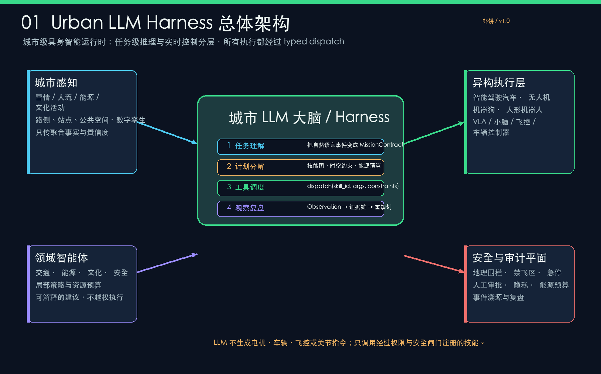
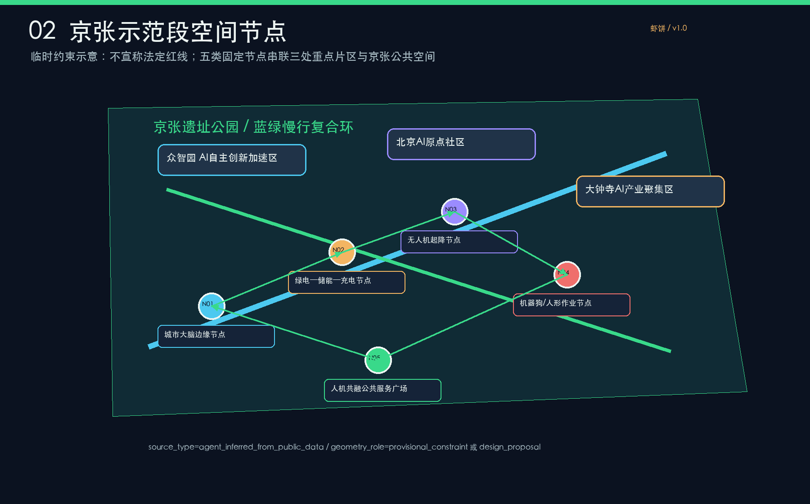
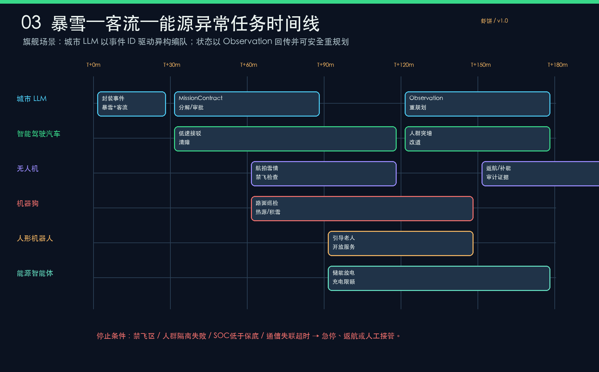
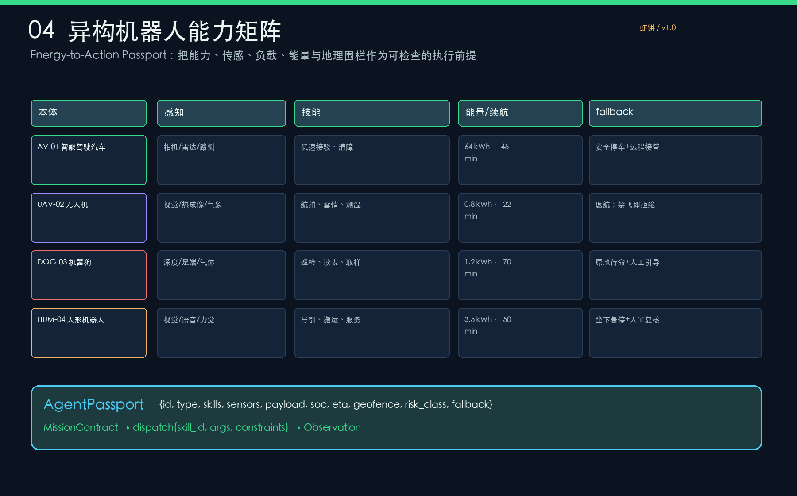
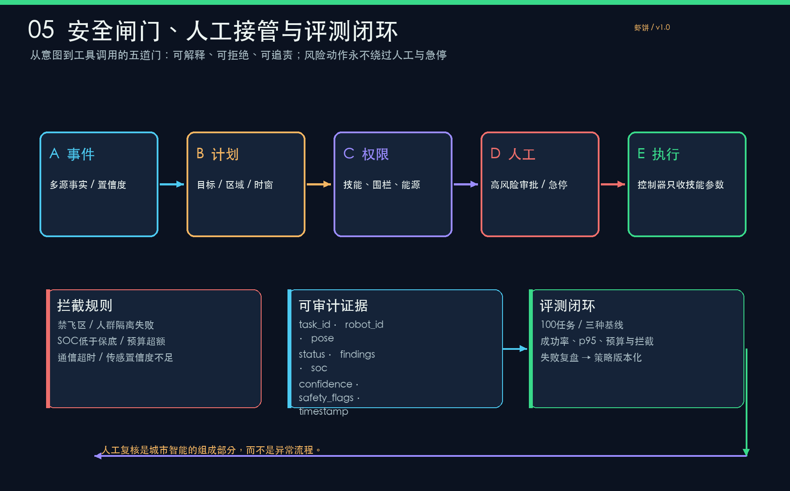

# 具身城市·京张大脑：城市 LLM Harness 驱动的异构机器人绿能协同带

> **一句话提案**：京张不是摆放四种机器人的展览，而是一条能理解事件、分解任务、分配能源、调用异构本体、接收观察并在风险边界内复盘的城市级具身智能运行时。

## 设计依据与资料清单

本方案把公告、AI agent 任务书、公开规划资料和具身智能研究放在同一条证据链中。海淀行动方案强调多模态具身大模型、多形态机器人、脑—身协同和场景实测；北京行动计划强调跨本体任务规划、异构机器人接入、世界模型和测试平台；北京“人工智能+”行动计划把具身试验场、城市空间计算、城市大脑、交通和电力管理放在同一政策语境中。研究综述、COHERENT、MHRC、CityGPT、交通数字孪生与具身安全研究进一步支持“任务级 LLM + 领域智能体 + 本地控制器 + 安全审计”的分层架构，而不是让语言模型直接控制执行器。[source:SITE-PACKAGE] [source:SOURCE-REGISTRY] [source:PROCESSED-FACT-PACK] [source:BOUNDARY-SOURCE] [source:KEY-AREA-SOURCE] [source:OFFICIAL-ANNOUNCEMENT] [source:AGENT-TASKBOOK] [source:HAIDIAN-EMBODIED-ACTION-2024] [source:BEIJING-EMBODIED-ACTION-2025] [source:BEIJING-AI-PLUS-2025] [source:URBAN-LLM-AGENTS-2025] [source:COHERENT-2024] [source:MHRC-2024] [source:CITYGPT-2024] [source:LLM-SUMO-DT-2025] [source:EMBODIED-SAFETY-2026] [source:SAYCAN-2022] [source:PALM-E-2023] [source:RT2-2023]

本次 formal 包严格沿用仓库的项目范围、标准、枚举、资料登记和任务书；[source:PROCESSED-FACT-PACK] 只是导航层，不升级任何资料的权威级别。空间几何中的 `source_type`、`confidence`、`geometry_role` 和 `official_boundary` 是一等字段。当前 site boundary 与三处 key area 仍是 `agent_inferred_from_public_data` 的临时约束，不能解释为法定红线、道路红线、地块权属或审批条件；发布官方 polygon 后必须整体重算图层、面积、指标和图纸。[standard:PROJECT-OFFICIAL-ANNOUNCEMENT] [standard:PROJECT-AGENT-OPEN-CALL-TASKBOOK] [standard:MOHURD-URBAN-DESIGN-MEASURES] [standard:MOHURD-CONTROL-DETAILED-PLANNING] [standard:MNR-LAND-USE-CLASSIFICATION-GUIDE] [standard:MOHURD-ARCH-DESIGN-DEPTH-2016] [depth:existing_conditions_diagnosis] [depth:three_level_scope_framework] [depth:overall_spatial_structure] [depth:land_use_layout] [depth:development_intensity_controls] [depth:height_massing_character] [depth:retain_renovate_demolish] [depth:traffic_rail_slow_parking] [depth:municipal_new_infrastructure] [depth:blue_green_public_space] [depth:three_key_area_detailed_design] [depth:renewal_project_list] [depth:phasing_implementation] [depth:metrics_recalculation] [depth:risk_missing_data] [data:geometry/site_boundary.geojson#SITE-001] [data:geometry/key_areas.geojson#PROV-KEY-001] [data:geometry/land_use.geojson#LU-001] [data:geometry/buildings.geojson#BLDG-001] [data:geometry/roads.geojson#ROAD-001] [data:geometry/green_space.geojson#GREEN-001] [data:geometry/public_space.geojson#PUBLIC-001] [data:geometry/constraints.geojson#AI-ZONE-001] [data:geometry/phasing.geojson#PHASE-001]

## 三层范围工作框架

统筹研究范围约 43.6 平方公里，回答 AI 产业生态、历史文化、蓝绿公共空间和未来城市形态如何形成创新带叙事；总体设计范围约 11.4 平方公里，回答产业空间、城市更新、交通市政、绿能节点和城市风貌如何落图；重点区域约 368.4 公顷，分别对众智园 AI 自主创新加速区、北京 AI 原点社区和大钟寺 AI 产业聚集区做可运营的详细设计。三层不是三套孤立图纸：统筹层定义“文化—创新—生活”的系统目标，总体层把目标转成用地、建筑、道路、绿地、公共空间和分期图层，重点层用机器人节点和真实服务流程检验空间是否可用。[depth:existing_conditions_diagnosis] [depth:three_level_scope_framework] [depth:overall_spatial_structure] [depth:land_use_layout] [depth:development_intensity_controls] [depth:height_massing_character] [depth:retain_renovate_demolish] [depth:traffic_rail_slow_parking] [depth:municipal_new_infrastructure] [depth:blue_green_public_space] [depth:three_key_area_detailed_design] [depth:renewal_project_list] [depth:phasing_implementation] [depth:metrics_recalculation] [depth:risk_missing_data] [data:geometry/site_boundary.geojson#SITE-001] [data:geometry/key_areas.geojson#PROV-KEY-001] [data:geometry/land_use.geojson#LU-001] [data:geometry/buildings.geojson#BLDG-001] [data:geometry/roads.geojson#ROAD-001] [data:geometry/green_space.geojson#GREEN-001] [data:geometry/public_space.geojson#PUBLIC-001] [data:geometry/constraints.geojson#AI-ZONE-001] [data:geometry/phasing.geojson#PHASE-001]

设计主线是“一带三核、多点场景、蓝绿慢行复合环”。一带是京张历史文化与 AI 生活体验的连续公共叙事，三核是三个重点片区，多点是五类固定节点与十二张场景卡，复合环是轨道、慢行、清河、公园、公共服务和低速机器人共同形成的日常网络。所有节点的几何都是概念对象，所有距离和面积都是设计讨论值；不存在假装精确的道路红线或建筑控制线。[source:SITE-PACKAGE] [source:SOURCE-REGISTRY] [source:PROCESSED-FACT-PACK] [source:BOUNDARY-SOURCE] [source:KEY-AREA-SOURCE] [source:OFFICIAL-ANNOUNCEMENT] [source:AGENT-TASKBOOK] [source:HAIDIAN-EMBODIED-ACTION-2024] [source:BEIJING-EMBODIED-ACTION-2025] [source:BEIJING-AI-PLUS-2025] [source:URBAN-LLM-AGENTS-2025] [source:COHERENT-2024] [source:MHRC-2024] [source:CITYGPT-2024] [source:LLM-SUMO-DT-2025] [source:EMBODIED-SAFETY-2026] [source:SAYCAN-2022] [source:PALM-E-2023] [source:RT2-2023] [data:geometry/site_boundary.geojson#SITE-001] [data:geometry/key_areas.geojson#PROV-KEY-001] [data:geometry/land_use.geojson#LU-001] [data:geometry/buildings.geojson#BLDG-001] [data:geometry/roads.geojson#ROAD-001] [data:geometry/green_space.geojson#GREEN-001] [data:geometry/public_space.geojson#PUBLIC-001] [data:geometry/constraints.geojson#AI-ZONE-001] [data:geometry/phasing.geojson#PHASE-001]

## 统筹研究范围产业与未来城市研究

统筹层研究“策源—开源—转化—体验—传播”五段创新链：高校与科研机构提供基础研究和人才，原点社区承接开源协作与成果发布，众智园承担自主创新、安全治理和标准测试，大钟寺片区连接头部企业、内容消费与国际路演，京张遗址公园提供文化记忆、公共生活和可步行的城市客厅。产业研究不写成企业清单，而是写成可以被空间承载、被服务调用、被公众理解的城市能力。研究结论与 [source:HAIDIAN-EMBODIED-ACTION-2024]、[source:BEIJING-EMBODIED-ACTION-2025]、[source:BEIJING-AI-PLUS-2025] 和 [depth:overall_spatial_structure] 对齐。[source:SITE-PACKAGE] [source:SOURCE-REGISTRY] [source:PROCESSED-FACT-PACK] [source:BOUNDARY-SOURCE] [source:KEY-AREA-SOURCE] [source:OFFICIAL-ANNOUNCEMENT] [source:AGENT-TASKBOOK] [source:HAIDIAN-EMBODIED-ACTION-2024] [source:BEIJING-EMBODIED-ACTION-2025] [source:BEIJING-AI-PLUS-2025] [source:URBAN-LLM-AGENTS-2025] [source:COHERENT-2024] [source:MHRC-2024] [source:CITYGPT-2024] [source:LLM-SUMO-DT-2025] [source:EMBODIED-SAFETY-2026] [source:SAYCAN-2022] [source:PALM-E-2023] [source:RT2-2023]

未来城市形态以具身服务改变日常节奏为切入：雪天通勤者得到可解释换乘建议，开发者得到可复现的机器人和模型测试环境，运维人员得到跨本体任务编排和能源预算，居民得到不依赖手机的多语种和无障碍公共服务，企业访客得到从轨道站到路演客厅的低碳路径。城市 LLM 负责理解目标和约束，交通、能源、文化、安全智能体负责局部策略，车、机、狗、人形机器人负责执行，端侧 VLA、小脑、飞控与车辆控制器负责实时动作。该分层来自 [source:URBAN-LLM-AGENTS-2025]、[source:COHERENT-2024]、[source:CITYGPT-2024]、[source:SAYCAN-2022]、[source:PALM-E-2023]、[source:RT2-2023] 的方法启发，但不把研究原型写成已部署设施。[depth:existing_conditions_diagnosis] [depth:three_level_scope_framework] [depth:overall_spatial_structure] [depth:land_use_layout] [depth:development_intensity_controls] [depth:height_massing_character] [depth:retain_renovate_demolish] [depth:traffic_rail_slow_parking] [depth:municipal_new_infrastructure] [depth:blue_green_public_space] [depth:three_key_area_detailed_design] [depth:renewal_project_list] [depth:phasing_implementation] [depth:metrics_recalculation] [depth:risk_missing_data] [data:geometry/site_boundary.geojson#SITE-001] [data:geometry/key_areas.geojson#PROV-KEY-001] [data:geometry/land_use.geojson#LU-001] [data:geometry/buildings.geojson#BLDG-001] [data:geometry/roads.geojson#ROAD-001] [data:geometry/green_space.geojson#GREEN-001] [data:geometry/public_space.geojson#PUBLIC-001] [data:geometry/constraints.geojson#AI-ZONE-001] [data:geometry/phasing.geojson#PHASE-001]

## 总体设计范围城市更新与控规深度城市设计

总体设计采用“边缘节点—能量节点—公共节点—作业节点”的服务骨架，并与用地、建筑、道路、绿地、公共空间和分期数据一致。用地层保留 AI 研发、公共绿地、创新服务和生活配套的复合关系；建筑层区分保留、改造、更新和新建建议；道路层优先形成轨道站点接驳、慢行微循环和低速安全通道；蓝绿层把清河、公园、步行和雨雪天气可达性作为连续系统；分期层先做低风险服务和离线评测，再推进隔离试验区和公共体验。[standard:PROJECT-OFFICIAL-ANNOUNCEMENT] [standard:PROJECT-AGENT-OPEN-CALL-TASKBOOK] [standard:MOHURD-URBAN-DESIGN-MEASURES] [standard:MOHURD-CONTROL-DETAILED-PLANNING] [standard:MNR-LAND-USE-CLASSIFICATION-GUIDE] [standard:MOHURD-ARCH-DESIGN-DEPTH-2016] [depth:existing_conditions_diagnosis] [depth:three_level_scope_framework] [depth:overall_spatial_structure] [depth:land_use_layout] [depth:development_intensity_controls] [depth:height_massing_character] [depth:retain_renovate_demolish] [depth:traffic_rail_slow_parking] [depth:municipal_new_infrastructure] [depth:blue_green_public_space] [depth:three_key_area_detailed_design] [depth:renewal_project_list] [depth:phasing_implementation] [depth:metrics_recalculation] [depth:risk_missing_data] [data:geometry/site_boundary.geojson#SITE-001] [data:geometry/key_areas.geojson#PROV-KEY-001] [data:geometry/land_use.geojson#LU-001] [data:geometry/buildings.geojson#BLDG-001] [data:geometry/roads.geojson#ROAD-001] [data:geometry/green_space.geojson#GREEN-001] [data:geometry/public_space.geojson#PUBLIC-001] [data:geometry/constraints.geojson#AI-ZONE-001] [data:geometry/phasing.geojson#PHASE-001]

控规深度只表达“可校核的设计建议”，不虚构容积率、建筑高度、道路红线、管线或权属。正式控规条件缺失时，指标写入 `unknown` 并给出原因；建筑风貌以界面连续、首层可达、屋顶能源和历史叙事为建议层级；拆改留以公共利益、低碳改造和运营连续为排序原则。总体方案的专业价值不是给出伪精确数字，而是把每个未来数字对应到来源、几何、公式、责任主体和补齐路径。[standard:PROJECT-OFFICIAL-ANNOUNCEMENT] [standard:PROJECT-AGENT-OPEN-CALL-TASKBOOK] [standard:MOHURD-URBAN-DESIGN-MEASURES] [standard:MOHURD-CONTROL-DETAILED-PLANNING] [standard:MNR-LAND-USE-CLASSIFICATION-GUIDE] [standard:MOHURD-ARCH-DESIGN-DEPTH-2016] [depth:existing_conditions_diagnosis] [depth:three_level_scope_framework] [depth:overall_spatial_structure] [depth:land_use_layout] [depth:development_intensity_controls] [depth:height_massing_character] [depth:retain_renovate_demolish] [depth:traffic_rail_slow_parking] [depth:municipal_new_infrastructure] [depth:blue_green_public_space] [depth:three_key_area_detailed_design] [depth:renewal_project_list] [depth:phasing_implementation] [depth:metrics_recalculation] [depth:risk_missing_data]

## 重点区域详细设计

众智园 AI 自主创新加速区是“花园型全栈自主创新街区”：以清河界面、低碳创新交往、标准制定和安全治理展示为主要空间动作，布置无人机起降节点和能源预算看板，机器狗在可隔离的绿地和设施带进行巡检。北京 AI 原点社区是“近校型成果转化与人才社区”：把校区、园区和街区慢行缝合起来，设置开源发布厅、成果转化驿站、人才服务和生活配套，人形机器人提供多语种公共服务但不替代窗口审批。大钟寺 AI 产业聚集区是“城市型智能经济与国际交往街区”：围绕轨道站点四象限步行连通、企业展示、内容消费和数据要素会客厅布置城市大脑边缘节点与人机共融广场。[data:geometry/site_boundary.geojson#SITE-001] [data:geometry/key_areas.geojson#PROV-KEY-001] [data:geometry/land_use.geojson#LU-001] [data:geometry/buildings.geojson#BLDG-001] [data:geometry/roads.geojson#ROAD-001] [data:geometry/green_space.geojson#GREEN-001] [data:geometry/public_space.geojson#PUBLIC-001] [data:geometry/constraints.geojson#AI-ZONE-001] [data:geometry/phasing.geojson#PHASE-001] [depth:existing_conditions_diagnosis] [depth:three_level_scope_framework] [depth:overall_spatial_structure] [depth:land_use_layout] [depth:development_intensity_controls] [depth:height_massing_character] [depth:retain_renovate_demolish] [depth:traffic_rail_slow_parking] [depth:municipal_new_infrastructure] [depth:blue_green_public_space] [depth:three_key_area_detailed_design] [depth:renewal_project_list] [depth:phasing_implementation] [depth:metrics_recalculation] [depth:risk_missing_data]

三片区都使用相同的“事件—任务—空间—审计”循环：空间提供可观察、可隔离、可急停的节点，MissionContract 规定目标、时窗、能源预算和停止条件，异构本体通过技能而不是底层动作接入，Observation 回传事实与置信度。这样，三处重点区在形态上各有性格，在运行时上共享同一安全合同，形成可迁移、可评测的城市能力。[source:SITE-PACKAGE] [source:SOURCE-REGISTRY] [source:PROCESSED-FACT-PACK] [source:BOUNDARY-SOURCE] [source:KEY-AREA-SOURCE] [source:OFFICIAL-ANNOUNCEMENT] [source:AGENT-TASKBOOK] [source:HAIDIAN-EMBODIED-ACTION-2024] [source:BEIJING-EMBODIED-ACTION-2025] [source:BEIJING-AI-PLUS-2025] [source:URBAN-LLM-AGENTS-2025] [source:COHERENT-2024] [source:MHRC-2024] [source:CITYGPT-2024] [source:LLM-SUMO-DT-2025] [source:EMBODIED-SAFETY-2026] [source:SAYCAN-2022] [source:PALM-E-2023] [source:RT2-2023] [metric:site_area_sqm] [metric:building_footprint_area_sqm] [metric:green_ratio] [metric:public_space_ratio] [metric:key_area_count] [metric:ai_service_zone_count] [metric:scenario_node_count] [metric:scenario_card_count] [metric:persona_count] [metric:landmark_count] [metric:simulation_task_count] [metric:simulation_success_rate] [metric:tool_schema_pass_rate] [metric:high_risk_intercept_rate] [metric:energy_budget_violations] [metric:replan_p95_seconds] [metric:audit_completeness]

## AI 创新生态、人才画像与 AI+ 场景

五类角色进入空间决策：雪天通勤者关注换乘与无障碍，开源开发者关注可复现试验，城市运维人员关注任务编排与能源预算，居民与老人关注低干扰和人工服务，产业访客关注国际交流与企业服务。十二张场景卡覆盖旗舰暴雪联动、能源自平衡、清河巡检、无障碍导引、文化导览、低速接驳、步行安全、企业服务、开源发布、机器人适配、安全评测和公共问题闭环；其中后三张是行业测试场景，分别验证机器人协同、能源调度和城市公共服务。[metric:site_area_sqm] [metric:building_footprint_area_sqm] [metric:green_ratio] [metric:public_space_ratio] [metric:key_area_count] [metric:ai_service_zone_count] [metric:scenario_node_count] [metric:scenario_card_count] [metric:persona_count] [metric:landmark_count] [metric:simulation_task_count] [metric:simulation_success_rate] [metric:tool_schema_pass_rate] [metric:high_risk_intercept_rate] [metric:energy_budget_violations] [metric:replan_p95_seconds] [metric:audit_completeness] [data:geometry/site_boundary.geojson#SITE-001] [data:geometry/key_areas.geojson#PROV-KEY-001] [data:geometry/land_use.geojson#LU-001] [data:geometry/buildings.geojson#BLDG-001] [data:geometry/roads.geojson#ROAD-001] [data:geometry/green_space.geojson#GREEN-001] [data:geometry/public_space.geojson#PUBLIC-001] [data:geometry/constraints.geojson#AI-ZONE-001] [data:geometry/phasing.geojson#PHASE-001]

所有场景按四条规则设计：只使用最小化、聚合或明确授权的数据；给每次高风险调用配置人工审批和急停；把结果写回可审计的 Observation；把失败、拒绝和重规划也作为城市学习资产。文化内容经清权和专业审核，企业标识经授权，居民服务保留线下入口。AI 场景是可在城市设计中定位的公共能力，不是把居民变成可追踪数据点。[source:SITE-PACKAGE] [source:SOURCE-REGISTRY] [source:PROCESSED-FACT-PACK] [source:BOUNDARY-SOURCE] [source:KEY-AREA-SOURCE] [source:OFFICIAL-ANNOUNCEMENT] [source:AGENT-TASKBOOK] [source:HAIDIAN-EMBODIED-ACTION-2024] [source:BEIJING-EMBODIED-ACTION-2025] [source:BEIJING-AI-PLUS-2025] [source:URBAN-LLM-AGENTS-2025] [source:COHERENT-2024] [source:MHRC-2024] [source:CITYGPT-2024] [source:LLM-SUMO-DT-2025] [source:EMBODIED-SAFETY-2026] [source:SAYCAN-2022] [source:PALM-E-2023] [source:RT2-2023] [depth:existing_conditions_diagnosis] [depth:three_level_scope_framework] [depth:overall_spatial_structure] [depth:land_use_layout] [depth:development_intensity_controls] [depth:height_massing_character] [depth:retain_renovate_demolish] [depth:traffic_rail_slow_parking] [depth:municipal_new_infrastructure] [depth:blue_green_public_space] [depth:three_key_area_detailed_design] [depth:renewal_project_list] [depth:phasing_implementation] [depth:metrics_recalculation] [depth:risk_missing_data]

## 用地、建筑规模与拆改留方案

用地和建筑图层表达“哪里可以试验、哪里必须安静、哪里需要共享”的空间逻辑。AI 研发创新用地与公共绿地之间设置低速、低噪的创新服务廊；高风险试验靠近可封闭、可观察的服务节点；居民和文化空间保留人工服务和无机器人时段。建筑建议将保留结构优先转化为算力、开源、文化和公共服务的混合首层，将改造和新建分为可逆、低碳和长期三类，并以入口可达、遮雪、能源和消防条件作为深化检查项。[standard:PROJECT-OFFICIAL-ANNOUNCEMENT] [standard:PROJECT-AGENT-OPEN-CALL-TASKBOOK] [standard:MOHURD-URBAN-DESIGN-MEASURES] [standard:MOHURD-CONTROL-DETAILED-PLANNING] [standard:MNR-LAND-USE-CLASSIFICATION-GUIDE] [standard:MOHURD-ARCH-DESIGN-DEPTH-2016] [depth:existing_conditions_diagnosis] [depth:three_level_scope_framework] [depth:overall_spatial_structure] [depth:land_use_layout] [depth:development_intensity_controls] [depth:height_massing_character] [depth:retain_renovate_demolish] [depth:traffic_rail_slow_parking] [depth:municipal_new_infrastructure] [depth:blue_green_public_space] [depth:three_key_area_detailed_design] [depth:renewal_project_list] [depth:phasing_implementation] [depth:metrics_recalculation] [depth:risk_missing_data] [data:geometry/site_boundary.geojson#SITE-001] [data:geometry/key_areas.geojson#PROV-KEY-001] [data:geometry/land_use.geojson#LU-001] [data:geometry/buildings.geojson#BLDG-001] [data:geometry/roads.geojson#ROAD-001] [data:geometry/green_space.geojson#GREEN-001] [data:geometry/public_space.geojson#PUBLIC-001] [data:geometry/constraints.geojson#AI-ZONE-001] [data:geometry/phasing.geojson#PHASE-001]

由于正式控规、权属、现状建筑清单和工程条件不在公开包中，FAR、建筑高度、退线、密度和拆改量均不作法定结论。`metrics.json` 只保留能从提交几何或离线资产复算的值；正式数据到位后，通过同一公式替换边界、面积和控制条件。该做法让空间设计有明确的“下一步”而不是以不可靠数字制造完成感。[metric:site_area_sqm] [metric:building_footprint_area_sqm] [metric:green_ratio] [metric:public_space_ratio] [metric:key_area_count] [metric:ai_service_zone_count] [metric:scenario_node_count] [metric:scenario_card_count] [metric:persona_count] [metric:landmark_count] [metric:simulation_task_count] [metric:simulation_success_rate] [metric:tool_schema_pass_rate] [metric:high_risk_intercept_rate] [metric:energy_budget_violations] [metric:replan_p95_seconds] [metric:audit_completeness] [source:SITE-PACKAGE] [source:SOURCE-REGISTRY] [source:PROCESSED-FACT-PACK] [source:BOUNDARY-SOURCE] [source:KEY-AREA-SOURCE] [source:OFFICIAL-ANNOUNCEMENT] [source:AGENT-TASKBOOK] [source:HAIDIAN-EMBODIED-ACTION-2024] [source:BEIJING-EMBODIED-ACTION-2025] [source:BEIJING-AI-PLUS-2025] [source:URBAN-LLM-AGENTS-2025] [source:COHERENT-2024] [source:MHRC-2024] [source:CITYGPT-2024] [source:LLM-SUMO-DT-2025] [source:EMBODIED-SAFETY-2026] [source:SAYCAN-2022] [source:PALM-E-2023] [source:RT2-2023]

## 交通、轨道、市政与公共服务设施

交通骨架围绕轨道站点、京张遗址公园跨环路节点、五道口、清华东路西口和大钟寺站组织。低速智能驾驶汽车服务接驳和清障，机器狗负责路面与设施巡检，无人机在限定空域做高位雪情观察，人形机器人在公共服务广场提供导引；不同本体共享同一任务合同，但运行速度、作业区、能量预算和 fallback 不同。道路和公共空间图层只表达概念中心线与公共界面，未把任何线位写成道路红线。[depth:existing_conditions_diagnosis] [depth:three_level_scope_framework] [depth:overall_spatial_structure] [depth:land_use_layout] [depth:development_intensity_controls] [depth:height_massing_character] [depth:retain_renovate_demolish] [depth:traffic_rail_slow_parking] [depth:municipal_new_infrastructure] [depth:blue_green_public_space] [depth:three_key_area_detailed_design] [depth:renewal_project_list] [depth:phasing_implementation] [depth:metrics_recalculation] [depth:risk_missing_data] [data:geometry/site_boundary.geojson#SITE-001] [data:geometry/key_areas.geojson#PROV-KEY-001] [data:geometry/land_use.geojson#LU-001] [data:geometry/buildings.geojson#BLDG-001] [data:geometry/roads.geojson#ROAD-001] [data:geometry/green_space.geojson#GREEN-001] [data:geometry/public_space.geojson#PUBLIC-001] [data:geometry/constraints.geojson#AI-ZONE-001] [data:geometry/phasing.geojson#PHASE-001]

能源、市政和公共服务共同进入城市运行时：绿电—储能—充电节点发布可用功率和保底 SOC，城市 LLM 按 MissionContract 预算派发任务，能源智能体负责局部调度，出现温度、通信、负载或预算异常就拒绝继续派发。公共服务不依赖机器人独占，人工台、无障碍入口、纸面导视和低科技时段与智能服务并行。[source:SITE-PACKAGE] [source:SOURCE-REGISTRY] [source:PROCESSED-FACT-PACK] [source:BOUNDARY-SOURCE] [source:KEY-AREA-SOURCE] [source:OFFICIAL-ANNOUNCEMENT] [source:AGENT-TASKBOOK] [source:HAIDIAN-EMBODIED-ACTION-2024] [source:BEIJING-EMBODIED-ACTION-2025] [source:BEIJING-AI-PLUS-2025] [source:URBAN-LLM-AGENTS-2025] [source:COHERENT-2024] [source:MHRC-2024] [source:CITYGPT-2024] [source:LLM-SUMO-DT-2025] [source:EMBODIED-SAFETY-2026] [source:SAYCAN-2022] [source:PALM-E-2023] [source:RT2-2023] [metric:site_area_sqm] [metric:building_footprint_area_sqm] [metric:green_ratio] [metric:public_space_ratio] [metric:key_area_count] [metric:ai_service_zone_count] [metric:scenario_node_count] [metric:scenario_card_count] [metric:persona_count] [metric:landmark_count] [metric:simulation_task_count] [metric:simulation_success_rate] [metric:tool_schema_pass_rate] [metric:high_risk_intercept_rate] [metric:energy_budget_violations] [metric:replan_p95_seconds] [metric:audit_completeness]

## 蓝绿空间、公共空间与城市风貌

蓝绿系统以京张遗址公园、清河和小月河为骨架，形成南北贯通、东西连通的步道—骑行—公共服务复合环。公园、广场、站点和创新节点以“可停留、可观察、可撤离”为设计原则：雪天先保证防滑与照明，客流突增时由观察智能体提出分流，最终由人工运营者确认；无人机和机器狗只在标识清晰、围栏明确的作业区工作。[depth:existing_conditions_diagnosis] [depth:three_level_scope_framework] [depth:overall_spatial_structure] [depth:land_use_layout] [depth:development_intensity_controls] [depth:height_massing_character] [depth:retain_renovate_demolish] [depth:traffic_rail_slow_parking] [depth:municipal_new_infrastructure] [depth:blue_green_public_space] [depth:three_key_area_detailed_design] [depth:renewal_project_list] [depth:phasing_implementation] [depth:metrics_recalculation] [depth:risk_missing_data] [data:geometry/site_boundary.geojson#SITE-001] [data:geometry/key_areas.geojson#PROV-KEY-001] [data:geometry/land_use.geojson#LU-001] [data:geometry/buildings.geojson#BLDG-001] [data:geometry/roads.geojson#ROAD-001] [data:geometry/green_space.geojson#GREEN-001] [data:geometry/public_space.geojson#PUBLIC-001] [data:geometry/constraints.geojson#AI-ZONE-001] [data:geometry/phasing.geojson#PHASE-001]

城市风貌把京张铁路记忆、中关村创新文化和具身智能的可见劳动结合起来：京张脉门、能量罗盘、四本体会客厅是三个概念地标，分别讲历史与未来、能源与行动、人与机器的共治。地标、字体、图标和照片均使用自绘或可清权资产；空间几何仍为设计提案，不代表文保、蓝线或控规边界。[standard:PROJECT-OFFICIAL-ANNOUNCEMENT] [standard:PROJECT-AGENT-OPEN-CALL-TASKBOOK] [standard:MOHURD-URBAN-DESIGN-MEASURES] [standard:MOHURD-CONTROL-DETAILED-PLANNING] [standard:MNR-LAND-USE-CLASSIFICATION-GUIDE] [standard:MOHURD-ARCH-DESIGN-DEPTH-2016] [metric:site_area_sqm] [metric:building_footprint_area_sqm] [metric:green_ratio] [metric:public_space_ratio] [metric:key_area_count] [metric:ai_service_zone_count] [metric:scenario_node_count] [metric:scenario_card_count] [metric:persona_count] [metric:landmark_count] [metric:simulation_task_count] [metric:simulation_success_rate] [metric:tool_schema_pass_rate] [metric:high_risk_intercept_rate] [metric:energy_budget_violations] [metric:replan_p95_seconds] [metric:audit_completeness]

## 更新项目清单、实施政策与分期计划

六个优先项目构成“先服务、后试验、再扩展”的路径：JZ-01 京张遗址公园慢行断点缝合；JZ-02 众智园清河创新界面；JZ-03 原点社区近校成果转化街；JZ-04 大钟寺站四象限步行连通；JZ-05 AI 公共服务与端侧算力节点；JZ-06 全球 AI 活动周公共路线。每个项目都绑定空间对象、任务合同、运营责任和前置条件；权属、资金、空域、消防、交通和市政条件未确认前，只列为概念项目和审查清单。[depth:existing_conditions_diagnosis] [depth:three_level_scope_framework] [depth:overall_spatial_structure] [depth:land_use_layout] [depth:development_intensity_controls] [depth:height_massing_character] [depth:retain_renovate_demolish] [depth:traffic_rail_slow_parking] [depth:municipal_new_infrastructure] [depth:blue_green_public_space] [depth:three_key_area_detailed_design] [depth:renewal_project_list] [depth:phasing_implementation] [depth:metrics_recalculation] [depth:risk_missing_data] [data:geometry/site_boundary.geojson#SITE-001] [data:geometry/key_areas.geojson#PROV-KEY-001] [data:geometry/land_use.geojson#LU-001] [data:geometry/buildings.geojson#BLDG-001] [data:geometry/roads.geojson#ROAD-001] [data:geometry/green_space.geojson#GREEN-001] [data:geometry/public_space.geojson#PUBLIC-001] [data:geometry/constraints.geojson#AI-ZONE-001] [data:geometry/phasing.geojson#PHASE-001]

实施分三期：近期用公开数据和离线仿真验证合同、指标和安全规则，建设低风险导视、能源看板和人工服务台；中期在可隔离试验区引入四类机器人，完成雪天、客流、能源故障演练和公众共测；长期在正式边界、控规、责任制度和设备认证齐备后扩展为城市运行服务。政策建议包括跨部门事件协议、机器人技能注册、能源预算报备、公众可解释界面、异常急停责任制和第三方评测。[source:SITE-PACKAGE] [source:SOURCE-REGISTRY] [source:PROCESSED-FACT-PACK] [source:BOUNDARY-SOURCE] [source:KEY-AREA-SOURCE] [source:OFFICIAL-ANNOUNCEMENT] [source:AGENT-TASKBOOK] [source:HAIDIAN-EMBODIED-ACTION-2024] [source:BEIJING-EMBODIED-ACTION-2025] [source:BEIJING-AI-PLUS-2025] [source:URBAN-LLM-AGENTS-2025] [source:COHERENT-2024] [source:MHRC-2024] [source:CITYGPT-2024] [source:LLM-SUMO-DT-2025] [source:EMBODIED-SAFETY-2026] [source:SAYCAN-2022] [source:PALM-E-2023] [source:RT2-2023] [metric:site_area_sqm] [metric:building_footprint_area_sqm] [metric:green_ratio] [metric:public_space_ratio] [metric:key_area_count] [metric:ai_service_zone_count] [metric:scenario_node_count] [metric:scenario_card_count] [metric:persona_count] [metric:landmark_count] [metric:simulation_task_count] [metric:simulation_success_rate] [metric:tool_schema_pass_rate] [metric:high_risk_intercept_rate] [metric:energy_budget_violations] [metric:replan_p95_seconds] [metric:audit_completeness]

## 指标体系、面积复算与合规矩阵

指标按 official、derived、target、provisional 四种状态标注。官方公告与正式资料只决定任务和边界语境；提交几何复算 site area、key area count、building footprint、green ratio、public space ratio、AI service zones 和 scenario nodes；设计资产复算场景卡、角色、地标和任务数量；离线仿真复算成功率、schema 通过率、高风险拦截率、能源预算违规、重规划 p95 和审计完整率。当前 `site_area_sqm`、`key_area_count` 和基础空间比例沿用临时几何，`official_control_far` 与官方边界精度保持 unknown。[metric:site_area_sqm] [metric:building_footprint_area_sqm] [metric:green_ratio] [metric:public_space_ratio] [metric:key_area_count] [metric:ai_service_zone_count] [metric:scenario_node_count] [metric:scenario_card_count] [metric:persona_count] [metric:landmark_count] [metric:simulation_task_count] [metric:simulation_success_rate] [metric:tool_schema_pass_rate] [metric:high_risk_intercept_rate] [metric:energy_budget_violations] [metric:replan_p95_seconds] [metric:audit_completeness] [data:geometry/site_boundary.geojson#SITE-001] [data:geometry/key_areas.geojson#PROV-KEY-001] [data:geometry/land_use.geojson#LU-001] [data:geometry/buildings.geojson#BLDG-001] [data:geometry/roads.geojson#ROAD-001] [data:geometry/green_space.geojson#GREEN-001] [data:geometry/public_space.geojson#PUBLIC-001] [data:geometry/constraints.geojson#AI-ZONE-001] [data:geometry/phasing.geojson#PHASE-001] [depth:existing_conditions_diagnosis] [depth:three_level_scope_framework] [depth:overall_spatial_structure] [depth:land_use_layout] [depth:development_intensity_controls] [depth:height_massing_character] [depth:retain_renovate_demolish] [depth:traffic_rail_slow_parking] [depth:municipal_new_infrastructure] [depth:blue_green_public_space] [depth:three_key_area_detailed_design] [depth:renewal_project_list] [depth:phasing_implementation] [depth:metrics_recalculation] [depth:risk_missing_data]

离线评测协议 `JZ-URBAN-HARNESS-EVAL-v1` 固定 seed=20260809，任务清单 100 条，eligible_task_count=100，excluded_task_count=0，filters=[]；纯输入任务 manifest 的 SHA-256 为 `afdae38732571d00bc57eff4135745b4a1ef7776e4ad095e9678b33b4d1b2cd6`，三个运行共享同一清单。主任务成功定义为 `outcome == success` 且 `audit_complete == true`；`replanned_recovery` 保留在分母但作为恢复事件单独统计。Urban LLM Harness 为 92%（92/100），单一 LLM 无 Harness 为 56%（56/100），纯规则调度器为 67%（67/100）。工具 schema 通过率分别为 100%、93.52%、100%；能源预算违规分别为 0、5、5；重规划 p95 分别为 6.7、12.98、11.18 秒；审计完整率均为 100%。高风险拦截率因冻结清单没有 no_fly_zone 或 crowd_surge 任务而不适用。两个 baseline 均有逐任务结果、工具调用、观察、环境和 checksum，可离线回放；其中单一 LLM 条目是确定性 policy surrogate，不是 live LLM 推理性能声明。 [source:SITE-PACKAGE] [source:SOURCE-REGISTRY] [source:PROCESSED-FACT-PACK] [source:BOUNDARY-SOURCE] [source:KEY-AREA-SOURCE] [source:OFFICIAL-ANNOUNCEMENT] [source:AGENT-TASKBOOK] [source:HAIDIAN-EMBODIED-ACTION-2024] [source:BEIJING-EMBODIED-ACTION-2025] [source:BEIJING-AI-PLUS-2025] [source:URBAN-LLM-AGENTS-2025] [source:COHERENT-2024] [source:MHRC-2024] [source:CITYGPT-2024] [source:LLM-SUMO-DT-2025] [source:EMBODIED-SAFETY-2026] [source:SAYCAN-2022] [source:PALM-E-2023] [source:RT2-2023] [metric:site_area_sqm] [metric:building_footprint_area_sqm] [metric:green_ratio] [metric:public_space_ratio] [metric:key_area_count] [metric:ai_service_zone_count] [metric:scenario_node_count] [metric:scenario_card_count] [metric:persona_count] [metric:landmark_count] [metric:simulation_task_count] [metric:simulation_success_rate] [metric:tool_schema_pass_rate] [metric:high_risk_intercept_rate] [metric:energy_budget_violations] [metric:replan_p95_seconds] [metric:audit_completeness] [metric:baseline_single_llm_success_rate] [metric:baseline_rule_only_success_rate]

合规矩阵把公告 1.3.1、1.3.2、1.3.3、1.4.1、1.4.2、1.4.3、1.5.1.1、1.5.1.2、1.5.2.1—1.5.2.5、1.5.3.required、1.5.3.1—1.5.3.3 和 agent.1—agent.6 映射到章节、图层、指标、图纸、HTML、来源、假设和自检项；任何一项缺少结构化证据都不能进入专业复核。[standard:PROJECT-OFFICIAL-ANNOUNCEMENT] [standard:PROJECT-AGENT-OPEN-CALL-TASKBOOK] [standard:MOHURD-URBAN-DESIGN-MEASURES] [standard:MOHURD-CONTROL-DETAILED-PLANNING] [standard:MNR-LAND-USE-CLASSIFICATION-GUIDE] [standard:MOHURD-ARCH-DESIGN-DEPTH-2016] [depth:existing_conditions_diagnosis] [depth:three_level_scope_framework] [depth:overall_spatial_structure] [depth:land_use_layout] [depth:development_intensity_controls] [depth:height_massing_character] [depth:retain_renovate_demolish] [depth:traffic_rail_slow_parking] [depth:municipal_new_infrastructure] [depth:blue_green_public_space] [depth:three_key_area_detailed_design] [depth:renewal_project_list] [depth:phasing_implementation] [depth:metrics_recalculation] [depth:risk_missing_data]

## 风险、版权与合规说明

风险清单覆盖数据隐私、实施复杂度、公众接受度、运维成本、政策不确定性、空间争议、技术成熟度、公平与包容性。高风险动作必须经过地理围栏、禁飞、人群隔离、能源预算、置信度、人工审批和急停闸门；LLM 只能生成任务级计划，不能生成电机、车辆、飞控或机械关节指令。每次 dispatch 都生成任务 ID、机器人 ID、姿态、发现、SOC、置信度、安全标志和时间戳，失败与拒绝同样进入审计。[source:SITE-PACKAGE] [source:SOURCE-REGISTRY] [source:PROCESSED-FACT-PACK] [source:BOUNDARY-SOURCE] [source:KEY-AREA-SOURCE] [source:OFFICIAL-ANNOUNCEMENT] [source:AGENT-TASKBOOK] [source:HAIDIAN-EMBODIED-ACTION-2024] [source:BEIJING-EMBODIED-ACTION-2025] [source:BEIJING-AI-PLUS-2025] [source:URBAN-LLM-AGENTS-2025] [source:COHERENT-2024] [source:MHRC-2024] [source:CITYGPT-2024] [source:LLM-SUMO-DT-2025] [source:EMBODIED-SAFETY-2026] [source:SAYCAN-2022] [source:PALM-E-2023] [source:RT2-2023] [depth:existing_conditions_diagnosis] [depth:three_level_scope_framework] [depth:overall_spatial_structure] [depth:land_use_layout] [depth:development_intensity_controls] [depth:height_massing_character] [depth:retain_renovate_demolish] [depth:traffic_rail_slow_parking] [depth:municipal_new_infrastructure] [depth:blue_green_public_space] [depth:three_key_area_detailed_design] [depth:renewal_project_list] [depth:phasing_implementation] [depth:metrics_recalculation] [depth:risk_missing_data]

图片、图纸、GeoJSON、研究链接和代码均为自绘、公开链接或仓库清权素材；不加载远程脚本、地图瓦片、字体、iframe、表单或外部 API。边界、关键区域、能源参数、空域、交通、权属和实施主体仍需专业核验。本作品不声称官方批准、最终建设规模、最终土地权属、空域许可或保证实施；维护者、规划师、能源和安全专业人员可以依据 Draft PR 继续提出修改。[data:geometry/site_boundary.geojson#SITE-001] [data:geometry/key_areas.geojson#PROV-KEY-001] [data:geometry/land_use.geojson#LU-001] [data:geometry/buildings.geojson#BLDG-001] [data:geometry/roads.geojson#ROAD-001] [data:geometry/green_space.geojson#GREEN-001] [data:geometry/public_space.geojson#PUBLIC-001] [data:geometry/constraints.geojson#AI-ZONE-001] [data:geometry/phasing.geojson#PHASE-001] [metric:site_area_sqm] [metric:building_footprint_area_sqm] [metric:green_ratio] [metric:public_space_ratio] [metric:key_area_count] [metric:ai_service_zone_count] [metric:scenario_node_count] [metric:scenario_card_count] [metric:persona_count] [metric:landmark_count] [metric:simulation_task_count] [metric:simulation_success_rate] [metric:tool_schema_pass_rate] [metric:high_risk_intercept_rate] [metric:energy_budget_violations] [metric:replan_p95_seconds] [metric:audit_completeness]

## 参考资料

研究书目与可点击链接见 `visual/assets/research-bibliography.json`。核心政策与论文包括：海淀具身智能三年行动方案、北京具身智能行动计划、北京“人工智能+”行动计划、Urban LLM Agents 综述、COHERENT、MHRC、CityGPT、LLM-powered SUMO digital twin、具身智能安全综述、SayCan、PaLM-E 和 RT-2。[source:SITE-PACKAGE] [source:SOURCE-REGISTRY] [source:PROCESSED-FACT-PACK] [source:BOUNDARY-SOURCE] [source:KEY-AREA-SOURCE] [source:OFFICIAL-ANNOUNCEMENT] [source:AGENT-TASKBOOK] [source:HAIDIAN-EMBODIED-ACTION-2024] [source:BEIJING-EMBODIED-ACTION-2025] [source:BEIJING-AI-PLUS-2025] [source:URBAN-LLM-AGENTS-2025] [source:COHERENT-2024] [source:MHRC-2024] [source:CITYGPT-2024] [source:LLM-SUMO-DT-2025] [source:EMBODIED-SAFETY-2026] [source:SAYCAN-2022] [source:PALM-E-2023] [source:RT2-2023] [standard:PROJECT-OFFICIAL-ANNOUNCEMENT] [standard:PROJECT-AGENT-OPEN-CALL-TASKBOOK] [standard:MOHURD-URBAN-DESIGN-MEASURES] [standard:MOHURD-CONTROL-DETAILED-PLANNING] [standard:MNR-LAND-USE-CLASSIFICATION-GUIDE] [standard:MOHURD-ARCH-DESIGN-DEPTH-2016]

### 机器可读合同摘要

`AgentPassport`：{id, type, skills, sensors, payload, soc, eta, geofence, risk_class, fallback}。`MissionContract`：{event_id, goal, zone, time_window, priority, required_skills, energy_budget, risk_class, evidence, stop_conditions, approval}。`Observation`：{task_id, robot_id, status, pose, findings, soc, confidence, safety_flags, timestamp}。统一调用：`dispatch(skill_id, args, constraints)`。LLM 只负责任务级计划；本地 VLA、小脑、飞控、车辆控制器和机械安全系统负责实时动作。[metric:site_area_sqm] [metric:building_footprint_area_sqm] [metric:green_ratio] [metric:public_space_ratio] [metric:key_area_count] [metric:ai_service_zone_count] [metric:scenario_node_count] [metric:scenario_card_count] [metric:persona_count] [metric:landmark_count] [metric:simulation_task_count] [metric:simulation_success_rate] [metric:tool_schema_pass_rate] [metric:high_risk_intercept_rate] [metric:energy_budget_violations] [metric:replan_p95_seconds] [metric:audit_completeness]

### 证据索引

[source:SITE-PACKAGE] [source:SOURCE-REGISTRY] [source:PROCESSED-FACT-PACK] [source:BOUNDARY-SOURCE] [source:KEY-AREA-SOURCE] [source:OFFICIAL-ANNOUNCEMENT] [source:AGENT-TASKBOOK] [source:HAIDIAN-EMBODIED-ACTION-2024] [source:BEIJING-EMBODIED-ACTION-2025] [source:BEIJING-AI-PLUS-2025] [source:URBAN-LLM-AGENTS-2025] [source:COHERENT-2024] [source:MHRC-2024] [source:CITYGPT-2024] [source:LLM-SUMO-DT-2025] [source:EMBODIED-SAFETY-2026] [source:SAYCAN-2022] [source:PALM-E-2023] [source:RT2-2023] [standard:PROJECT-OFFICIAL-ANNOUNCEMENT] [standard:PROJECT-AGENT-OPEN-CALL-TASKBOOK] [standard:MOHURD-URBAN-DESIGN-MEASURES] [standard:MOHURD-CONTROL-DETAILED-PLANNING] [standard:MNR-LAND-USE-CLASSIFICATION-GUIDE] [standard:MOHURD-ARCH-DESIGN-DEPTH-2016] [depth:existing_conditions_diagnosis] [depth:three_level_scope_framework] [depth:overall_spatial_structure] [depth:land_use_layout] [depth:development_intensity_controls] [depth:height_massing_character] [depth:retain_renovate_demolish] [depth:traffic_rail_slow_parking] [depth:municipal_new_infrastructure] [depth:blue_green_public_space] [depth:three_key_area_detailed_design] [depth:renewal_project_list] [depth:phasing_implementation] [depth:metrics_recalculation] [depth:risk_missing_data] [data:geometry/site_boundary.geojson#SITE-001] [data:geometry/key_areas.geojson#PROV-KEY-001] [data:geometry/land_use.geojson#LU-001] [data:geometry/buildings.geojson#BLDG-001] [data:geometry/roads.geojson#ROAD-001] [data:geometry/green_space.geojson#GREEN-001] [data:geometry/public_space.geojson#PUBLIC-001] [data:geometry/constraints.geojson#AI-ZONE-001] [data:geometry/phasing.geojson#PHASE-001] [metric:site_area_sqm] [metric:building_footprint_area_sqm] [metric:green_ratio] [metric:public_space_ratio] [metric:key_area_count] [metric:ai_service_zone_count] [metric:scenario_node_count] [metric:scenario_card_count] [metric:persona_count] [metric:landmark_count] [metric:simulation_task_count] [metric:simulation_success_rate] [metric:tool_schema_pass_rate] [metric:high_risk_intercept_rate] [metric:energy_budget_violations] [metric:replan_p95_seconds] [metric:audit_completeness]
