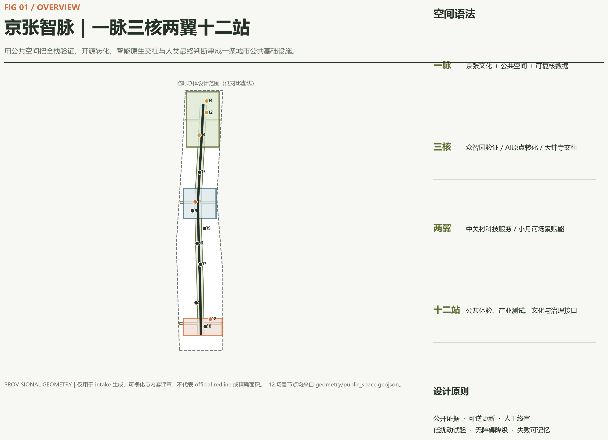
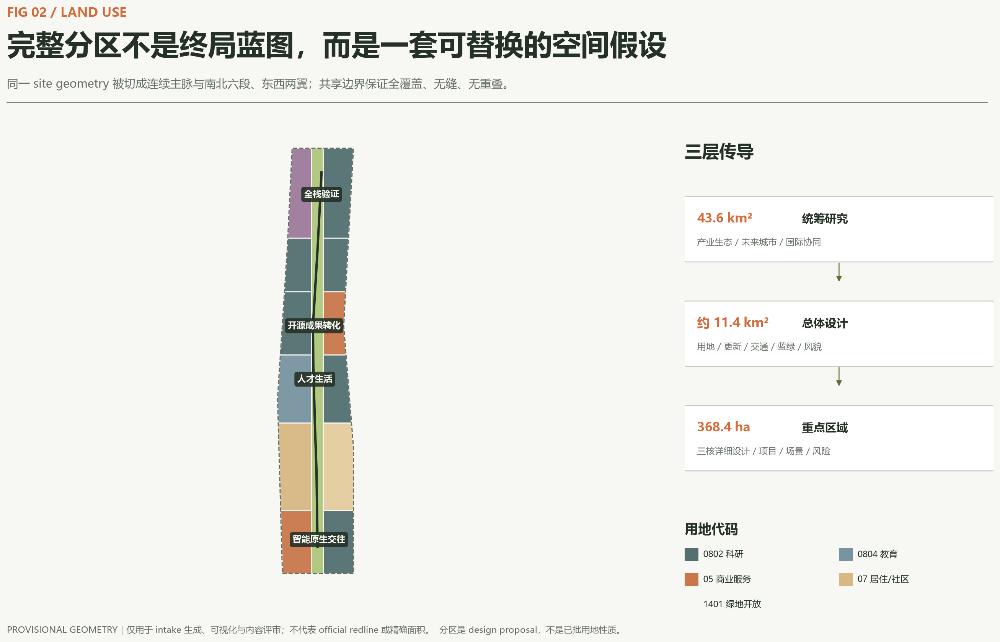
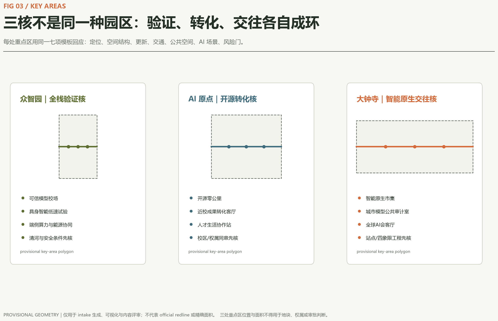
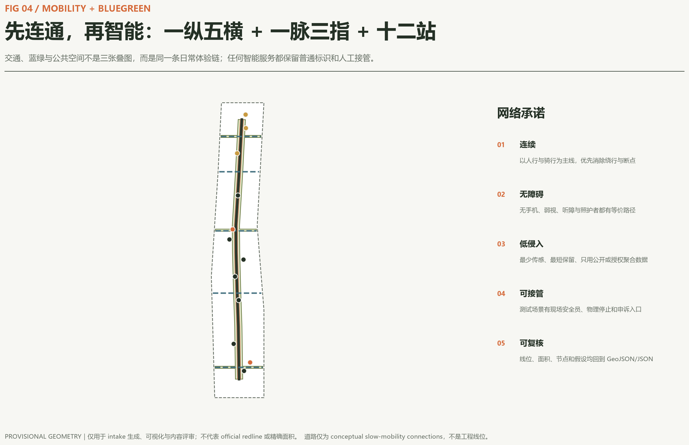
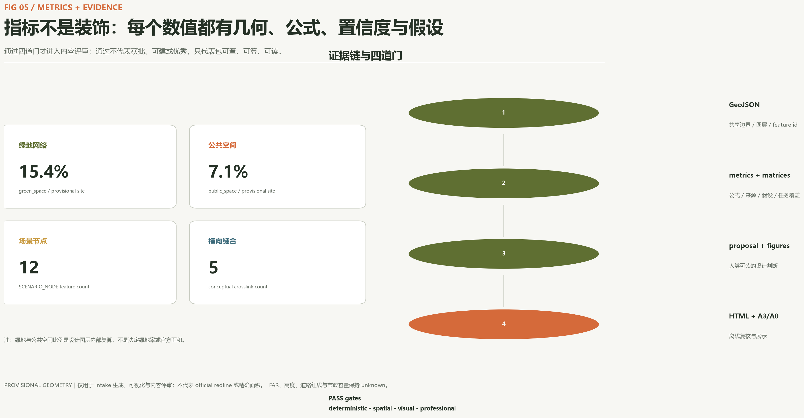

# 京张智脉｜Jing-Zhang Intelligence Commons

“京张智脉”不是一条被技术装饰的线性公园，而是一套把知识、空间、场景与公共判断连起来的城市公共基础设施。方案以京张铁路百年时间轴为文化主脉，把众智园、北京 AI 原点社区和大钟寺三处重点区组织为“验证、转化、交往”三核；中关村科技服务翼负责人才、资本、知识产权与国际服务，小月河场景赋能翼负责城市服务验证；沿线十二站让开发者、企业、居民、学生和访客都能进入这套创新系统。所有空间动作均是概念建议或可供专业团队深化研究的参考方案，不替代正式规划，不构成政府审定或实施承诺。

## 设计依据与资料清单

本方案先把事实分成三层。第一层是可以作为任务依据的公告、清权智能体任务书和专业标准：公告确认项目名称、三层范围、公告约面积和设计任务；智能体任务书确认三大定位、五大功能、三区两翼、六项任务和公开合规边界；住建部、自然资源部资料用于城市设计、控规深度和用地分类语言。[source:DATA-SRC-OFFICIAL-ANNOUNCEMENT-20260509] [source:DATA-SRC-AGENT-TASKBOOK-20260518] [source:DATA-SRC-MOHURD-URBAN-DESIGN-MEASURES] [source:DATA-SRC-MOHURD-CONTROL-DETAILED-PLANNING] [source:DATA-SRC-MNR-LAND-USE-CLASSIFICATION-202311]

第二层是只能用于 intake 的空间约束。`site_boundary.geojson` 与三处重点区来自仓库 provisional polygon，`official_boundary=false`，只支持生成、可视化、拓扑与内容评审，不支持 official redline、精确面积、权属、控规或审批判断。[source:DATA-SRC-PROVISIONAL-BOUNDARIES-20260605] [data:geometry/site_boundary.geojson#SITE-001] [data:geometry/key_areas.geojson#PROV-KEY-001] [metric:site_area_sqm] official polygons 到位后必须整体替换边界并重算用地、建筑、道路、绿地、公共空间、分期、全部指标、五张图、HTML 和 PDF，而不是只改一个数值。

第三层是本次生成的设计提案。用地是从同一 provisional site geometry 拓扑切分出的完整分区；建筑是“可逆更新载体原型”，不是现状测绘；道路是慢行与接驳概念线，不是道路红线；绿地、公共空间、场景节点和分期均是可讨论的设计层。[depth:existing_conditions_diagnosis] [standard:PROJECT-OFFICIAL-ANNOUNCEMENT] [standard:PROJECT-AGENT-OPEN-CALL-TASKBOOK] 图纸与网页只解释这些机器数据，不新增事实。

## 三层范围工作框架

统筹研究范围约 43.6 平方公里，回答“海淀如何形成世界级 AI 创新生态和未来城市形态”；总体设计范围公告约 11.4 平方公里，回答“产业、更新、交通、市政、蓝绿与风貌如何形成一套城市设计”；重点区域公告约 368.4 公顷，回答“三个核心片区如何以不同机制完成验证、转化与城市交往”。三层不是三套互不相干的图，而是从战略、空间到项目证据逐级收敛。[depth:three_level_scope_framework] [depth:overall_spatial_structure]

方案将这套传导概括为“一脉三核两翼十二站”。一脉是京张文化与公共空间主脉；三核分别是众智园“全栈验证核”、AI 原点社区“开源转化核”、大钟寺“智能原生交往核”；两翼延续任务书中的中关村科技服务翼和小月河场景赋能翼；十二站是沿主脉分布的可进入、可测试、可人工复核的小尺度公共接口。结构不是新红线，而是工作框架，图层以 [data:geometry/land_use.geojson#LU-SPINE-001]、[data:geometry/roads.geojson#ROAD-SPINE-001] 和 [data:geometry/public_space.geojson#SCN-01] 解释。

用地分区共 [metric:land_use_zone_count] 个 feature，完整覆盖提交边界且无重叠。南北六段表达从大钟寺智能原生商务、人才生活、近校科研、开源转化到众智园全栈验证的功能梯度；中部连续开放空间降低 provisional 边界的视觉权重，把设计重点放在廊道、横向缝合和公共节点。[standard:MNR-LAND-USE-CLASSIFICATION-GUIDE]

## 统筹研究范围产业与未来城市研究

### 命名与识别

主名称“京张智脉”把铁路“脉络”、创新“智力”和公共“生命线”合在一起；英文名 `Jing-Zhang Intelligence Commons` 强调 commons，而非封闭园区。命名层级为“智脉 / 三核 / 两翼 / 十二站”，便于空间导视、活动、数字目录和版本迭代共享同一语法。Logo 方向采用两条平行轨线在中部形成开放括号，中间一点代表人的最终判断；轨枕由短长交替模块组成，可映射二进制但不直接模仿企业标识。主色取铁路植被的橄榄绿，辅以砖红、青灰和纸白；系统只使用原创几何与系统字体。[standard:PROJECT-AGENT-OPEN-CALL-TASKBOOK]

### 六个国际案例与可转化机制

案例只作为背景比较，不支撑本项目红线、控规或绩效承诺。Kendall Square 的启示是研究机构、企业和社区公共界面必须一起规划，而不能只有研发楼；one-north 的启示是把研发、生活、绿地、试验与商业化平台做成步行可达的组合；STATION F 的启示是共享服务和高密度项目运营比“企业名录”更能形成网络；Toronto MaRS 的启示是用实验室、资本、客户和咨询平台连接科学到市场；Helsinki Maria 01 的启示是旧建筑可以通过社区共建和渐进扩张转化为创新校园；Pittsburgh Robotics Factory 的启示是具身智能需要从原型、测试到制造放大的连续支持。[source:CASE-KENDALL-SQUARE] [source:CASE-ONE-NORTH] [source:CASE-STATION-F] [source:CASE-MARS-TORONTO] [source:CASE-MARIA01] [source:CASE-PITTSBURGH-ROBOTICS]

本地转化不复制形式，而提炼六个机制：公共界面先行、混合日常、项目制社群、科学商业化服务、旧载体可逆利用、原型到规模化验证。它们分别落到十二站、两翼服务、三核分工和三阶段运营。生态指标采用“连接质量”而非编造企业、产值或投资额：记录公开活动、跨机构协作、场景从申请到人工复核的周期、无障碍反馈闭环和开源贡献留痕。运营数据只有在真实发生且授权后才进入下一版。

### 五大功能的协同回路

全栈自主创新体系在众智园进行可信模型、具身智能和端侧算力验证；世界级创新生态在 AI 原点社区连接高校、开源社区、孵化与专业服务；AI+ 场景赋能在小月河翼和十二站形成公开试验入口；智能化 AI 活力城市通过无障碍慢行、公共文化、生活服务和智能原生市集被普通人感知；AI 治理全球话语权由公共审计室、规则版本库和国际活动形成可复用知识。每个输出均保留人工最终判断和退出机制。

## 总体设计范围城市更新与控规深度城市设计

总体结构不是“大拆大建”，而是“开放空间先行、现状调查前置、载体可逆更新、场景运营校验”。`land_use.geojson` 把连续主脉与东西两翼切成完整分区；`buildings.geojson` 用若干模块验证首层开放、共享中庭和研发生活混合的体量关系，但不表示任何现状建筑；`roads.geojson` 用一纵五横表达南北贯通与东西缝合；`phasing.geojson` 表达依赖顺序。[data:geometry/buildings.geojson#BLDG-001] [data:geometry/phasing.geojson#PHASE-001] [depth:land_use_layout]

控规深度在本方案中表现为“控制项齐全、证据状态明确”，而不是擅自填数。用地兼容、容积率、高度、密度、绿地率、退线、道路红线、四线、市政与公共安全均进入待核清单；[metric:floor_area_ratio] 与 [metric:building_height_m] 明确为 unknown。`constraints.geojson` 保持空集合，避免用 agent 生成线替代 official control。[data:geometry/constraints.geojson#constraints-empty-by-design] [standard:MOHURD-CONTROL-DETAILED-PLANNING] [depth:development_intensity_controls]

建筑形态采用四条可转译原则：沿智脉的一层界面应公共、通透、可进入；新旧之间优先形成可逆连接，不把“未来感”等同于异形体量；靠近铁路遗址与可能的文保对象时，先做视线、尺度、振动和遗产评估；屋顶优先承载可维护的遮阴、雨水、能源或公共活动，而非纯造型。[depth:height_massing_character] 更新决策使用“调查 - 安全与价值评估 - 保留 - 改造 - 必要时更新”的门槛流程，缺现状建筑和权属时不作逐栋拆改留结论。[depth:retain_renovate_demolish]

## 重点区域详细设计

三个重点区均使用 provisional polygon，因此下列位置、面积和内部结构只作为方向性设计，需 official key area、地块、建筑和控制条件补齐后重绘。[data:geometry/key_areas.geojson#PROV-KEY-001] [data:geometry/key_areas.geojson#PROV-KEY-002] [data:geometry/key_areas.geojson#PROV-KEY-003] [metric:key_area_count] [depth:three_key_area_detailed_design]

### 众智园：全栈验证核

定位为花园型全栈自主创新街区。空间上以“可信模型校场、具身智能低速试验环、端侧算力与能源协同站”形成三段式验证链；绿色公共界面承担展示、休息、标准工作坊和公众解释，不把封闭测试区伪装成公共空间。建筑更新优先适配可分隔实验单元、设备搬运和共享评测空间；交通上只提出与外部公共交通及慢行系统的概念接驳，等待五环、清河、防洪、道路和安全条件复核。运营抓手是测试申请、风险分级、现场观察、第三方复核和结果公开摘要。

### 北京 AI 原点社区：开源转化核

定位为近校型成果转化与人才生活社区。空间上组织“开源零公里、近校成果转化客厅、人才生活协作站”三类公共接口：第一类记录开源贡献与版本，第二类连接技术、法务、知识产权、场景与客户，第三类把居住、托育、运动、学习和夜间协作纳入创新日常。更新采用小步试用：先开放首层、空闲时段与共享设施，再根据使用证据决定后续；不得假设高校、园区或业主已同意改造。慢行重点是校区、园区、社区和轨道站点之间的无障碍连续性。

### 大钟寺：智能原生交往核

定位为城市型智能原生商务、消费与国际交往街区。空间上以“智能原生市集、城市模型公共审计室、全球 AI 会客厅”形成从公众体验到专业讨论的界面；四象限步行缝合只表达期望关系，不给出桥隧或施工可行性结论。建筑首层优先服务路演、展示、短期工作、社区消费和非机动车停放；公共绿地的复合使用必须服从绿地、交通安全和活动许可。运营通过公开体验路线把商业传播与模型责任、数据来源、人工申诉结合起来，避免只做产品发布秀。

## AI 创新生态、人才画像与 AI+ 场景

### 六类用户画像

1. 研发者与开源维护者需要可预约评测、安静协作、贡献记忆和跨机构接口；2. 初创与中小企业需要原型设备、合规咨询、首批客户和低成本阶段性空间；3. 大企业产品与运营团队需要真实问题、可审计试验和国际交流；4. 周边居民与照护者需要低扰动、无障碍、儿童友好、清楚退出 AI 服务的日常空间；5. 高校师生需要成果转化、学习展示和安全慢行；6. 国际访客与非中文使用者需要双语、无应用也可使用的导视和公共交通接驳。画像不来自个人追踪，只是服务设计角色，真实运营前应通过自愿参与研究校准。

### 十二张场景卡

| 场景 | 类型与空间 | 最小数据 | 人工复核与退出 |
| --- | --- | --- | --- |
| 开源零公里 | 地标 / AI 原点 | 项目自愿提交的版本与许可 | 维护者确认，允许撤回展示 |
| 可信模型校场 | 产业测试 / 众智园 | 公开测试集或已授权数据 | 专业评测员签署结果，不发布敏感样本 |
| 具身智能低速试验环 | 产业测试 / 众智园 | 设备状态与匿名事件 | 安全员现场接管，明确物理停止按钮 |
| 端侧算力与能源协同站 | 产业测试 / 众智园 | 设备能耗和任务队列 | 运维审批，不采集个人内容 |
| AI 慢行守护 | 公共服务 / 智脉 | 公开路网、匿名障碍反馈 | 人工核验后发布，无手机替代路线 |
| 无障碍路径共创台 | 公共服务 / 中段 | 用户主动提交的障碍类型 | 当事人可匿名，专业无障碍审核 |
| 京张记忆译站 | 文化 / 遗址节点 | 清权史料与展签 | 史实审校，标注不确定内容 |
| 近校成果转化客厅 | 生态 / AI 原点 | 团队自愿公开需求 | 专业服务人员复核，不替代法律意见 |
| 人才生活协作站 | 社区 / AI 原点 | 公共服务目录 | 人工客服和线下窗口并行 |
| 智能原生市集 | 新业态 / 大钟寺 | 产品说明与现场安全记录 | 场地运营方审核，可暂停单项体验 |
| 城市模型公共审计室 | 治理 / 大钟寺 | 模型卡、数据卡、影响说明 | 多角色评议，发布少数意见 |
| 全球 AI 会客厅 | 地标 / 大钟寺 | 公开议程与报名信息 | 活动主办方确认，禁止暗示政府承诺 |

其中三项产业测试验证场景明确写入 `scenario_category=industry_test`；全部十二站写入 [data:geometry/public_space.geojson#SCN-01] 至 SCN-12，并设置 `human_review_required=true`。[metric:scenario_node_count] 场景设计遵守数据最小化、目的限定、可解释、人工接管、线下替代和可退出六条底线，不把未成熟技术写成全面部署。[depth:municipal_new_infrastructure]

## 用地、建筑规模与拆改留方案

用地结构以连续开放空间为中介，而非把各类产业封闭在园区墙内。南端加强智能原生商务、文化与人才生活，中段加强近校科研、开源转化与社区服务，北端加强全栈研发、安全验证与低碳算力。每个分区采用仓库枚举中的 `05`、`07`、`08`、`14` 类代码，但它们是设计语言，不是已批用地性质。[data:geometry/land_use.geojson#LU-01-W] [standard:MNR-LAND-USE-CLASSIFICATION-GUIDE]

建筑图层由 [metric:building_footprint_area_sqm] 的概念载体原型构成，占提交边界比例见 [metric:building_footprint_ratio]。这些 footprint 只用于验证公共空间、首层开放、研发模块和东西联系是否能形成合理关系，置信度为 low；它们不代表现状建筑数量、建设规模或可拆除对象。正式深化需逐栋补充用途、年代、结构、安全、产权、能耗、历史价值与使用者意见，然后进入“保留、修缮、适应性改造、局部更新、新建”的多方案比较。

建筑规模、容积率和高度不填入虚构值。现阶段可交付的是方法：以公共空间日照与风环境、遗址视线、消防与市政承载、混合功能、可逆结构和生命周期碳作为比较维度；每次专业深化更新 `assumptions.json` 与模型哈希，让改变可以追溯。[standard:MOHURD-ARCH-DESIGN-DEPTH-2016]

## 交通、轨道、市政与公共服务设施

交通结构为“一纵五横”：一纵是京张智脉公共体验绿道，五横分别服务大钟寺四象限、南中段场景翼、AI 原点近校联系、北中段创新社区和众智园对外接驳。[data:geometry/roads.geojson#ROAD-SPINE-001] [metric:crosslink_count] 线位全部限制在 provisional site 内，表达需求关系而非道路红线。正式深化必须使用轨道出入口、道路断面、公交、客流、停车、非机动车、无障碍、消防和市政资料进行可达性与安全校核。[depth:traffic_rail_slow_parking]

慢行策略先处理“能否连续、安全、无障碍地到达”，再讨论智能化。AI 只辅助归并公众自愿上报的障碍、生成可解释替代路线和安排活动日引导；任何推荐都要提供普通标识、现场人员和纸面地图作为降级路径。停车不追求总量口号，先区分通勤、访客、无障碍、装卸和活动峰值，优先以轨道接驳、共享出行和规范非机动车停放减少公共空间挤占。

市政与新型基础设施采用“可插拔服务单元”：端侧算力只处理明确授权任务，分布式能源与储能需能源和消防专项，公共 Wi-Fi 与传感设备使用最少采集和最短保留，模型输出保留人工申诉。设施位置、容量、管线与工程可行性均待 official 资料，不把概念节点写成确认建设。[data:geometry/constraints.geojson#constraints-empty-by-design]

## 蓝绿空间、公共空间与城市风貌

蓝绿系统由一条连续主脉和三条东西绿指组成，设计面积 [metric:green_space_area_sqm]、比例 [metric:green_ratio]；公共空间以较窄的可步行共享界面与十二个站点广场形成，面积 [metric:public_space_area_sqm]、比例 [metric:public_space_ratio]。这些数值从 design proposal geometry 复算，只说明方案内部一致性，不是法定绿地率或官方面积。[data:geometry/green_space.geojson#GREEN-SPINE-001] [data:geometry/public_space.geojson#PUBLIC-COMMONS-001] [depth:blue_green_public_space]

公共空间有三种时间尺度：百年尺度讲京张铁路与中关村创新史；年度尺度承载开发者节、公共审计周和城市体验季；日常尺度服务通勤、运动、照护、休息、学习与小型协作。导视用“轨线 + 站码 + 人工确认点”构成：例如 `JZ-07 / 京张记忆译站`，每个站牌同时标明数据来源、AI 是否参与和非数字服务入口。[standard:MOHURD-URBAN-DESIGN-MEASURES]

四个“AI 朝圣 / 荣誉”节点分别是：开源零公里，记录可验证的公共代码与工具贡献；百年道岔，展示铁路技术、城市选择与版本分歧；城市模型公共审计室，保存模型卡、失败案例和少数意见；全球 AI 会客厅，承载跨语言公共讨论。它们不是巨型雕塑，而是可使用、可更新、可质疑的公共组件。任何历史内容先做史实审校，任何人物、企业、论文图片和商标先做版权授权，任何选址先做文保、绿线、蓝线与交通安全核验。

## 更新项目清单、实施政策与分期计划

九个项目原型构成从空间到运营的最小闭环：JZ-01 京张智脉连续步行与导视；JZ-02 大钟寺四象限无障碍缝合；JZ-03 智能原生市集与公共审计室；JZ-04 AI 原点开源零公里；JZ-05 近校成果转化客厅；JZ-06 人才生活协作站；JZ-07 众智园可信模型校场；JZ-08 具身智能低速试验环；JZ-09 端侧算力与能源协同站。每项都需记录空间、使用者、运营主体建议、前置数据、安全门、退出条件和复核指标，而不是只列建设名称。[depth:renewal_project_list]

分期不是批准开发时序，而是依赖顺序，共 [metric:phase_count] 阶段。阶段一“开放与验证”优先做公开资料台账、导视、无障碍共创、活动原型和可撤除设施；阶段二“协同更新”在建筑、权属、交通、市政与文保调查完成后比较更新方案并连成网络；阶段三“治理固化”把有效的场景准入、人工复核、运营责任和公共知识版本化。[data:geometry/phasing.geojson#PHASE-001] [depth:phasing_implementation]

年度运营采用四季循环：春季“公开问题征集与场景招募”，夏季“低风险原型和公共体验”，秋季“全球 AI 城市周与同行评议”，冬季“结果审计、失败展与下一版规则发布”。开发者社区维护问题库、场景运营方维护安全与服务、专业团队维护空间和工程判断、公众代表拥有反馈与退出权。国际传播不以企业数量或投资承诺为主，而发布可复用规则、失败教训、公共空间数据字典和双语路线。所有活动均受 [source:DATA-SRC-AGENT-TASKBOOK-20260518] 的边界条款约束。[depth:phasing_implementation]

## 指标体系、面积复算与合规矩阵

机器可复算指标分三类。第一类是几何一致性：provisional site 面积、绿地面积与比例、公共空间面积与比例、概念建筑基底面积与比例，全部使用 EPSG:4548 复算。第二类是结构数量：用地分区、重点区、场景节点、横向联系和阶段数量。第三类是 unknown 的官方控制：FAR、高度、道路红线、设施容量等，必须等待 official/cleared 数据。已知指标引用为 [metric:site_area_sqm] [metric:green_space_area_sqm] [metric:green_ratio] [metric:public_space_area_sqm] [metric:public_space_ratio] [metric:building_footprint_area_sqm] [metric:building_footprint_ratio] [metric:land_use_zone_count] [metric:key_area_count] [metric:scenario_node_count] [metric:crosslink_count] [metric:phase_count]。[depth:metrics_recalculation]

`compliance_matrix.json` 覆盖公告 1.3、1.4、1.5 及 agent.1-agent.6，逐条挂接正文、九类 GeoJSON、指标、A3/A0、HTML、来源、假设和自检。`standard_matrix.json` 对五项强制依据全部 `addressed`，建筑深度标准因缺官方文件保持 `data_gap`。`design_depth_matrix.json` 的十五项 required depth 全部 `complete`；complete 表示本阶段提供了可定位证据和明确缺口，不表示官方批准或工程完成。[depth:risk_missing_data]

## 风险、版权与合规说明

九类主要数据缺口已进入 `assumptions.json`：official 总体边界、official 三处重点区、控规、道路交通、建筑与权属、文保、市政安全、法定蓝绿控制和公共空间运维。最关键风险不是“图不够精确”，而是把概念精度误读为规划精度；因此所有图面使用低对比虚线表达 provisional 边界，所有派生数值说明只用于方案内部复算。官方图件到位后若不整体重算，本方案即失去一致性。[data:geometry/site_boundary.geojson#SITE-001] [depth:risk_missing_data]

AI 风险采用场景级控制：不使用秘密、企业内部或个人隐私数据；医疗、法律、安全和公共服务输出仅作信息辅助；高风险场景必须人工批准、现场接管、日志审计和公开申诉；模型失败和少数意见进入公共审计室。任何活动、招商、政策、资金、伙伴、建设或运营表达均为概念建议，不构成已确定政府决定。全部原创生成和外部背景引用见 `report/copyright_statement.md` 与 `sources.json`。

本方案的已知隐患是缺乏 official polygon 与现状专业底数，因此只能作为内容评审和专业深化的高完整度起点，不能进入精确面积评分、法定规划、工程设计或投资决策。提交前执行 deterministic validation、spatial review、visual packaging check 和 professional evidence review；通过只代表具备机器检查与内容评审基础，不代表方案优秀、可建或获批。

## 参考资料

- 公告与范围任务：[source:DATA-SRC-OFFICIAL-ANNOUNCEMENT-20260509]
- 智能体六项任务与边界条款：[source:DATA-SRC-AGENT-TASKBOOK-20260518]
- 城市设计、控规与用地分类：[standard:MOHURD-URBAN-DESIGN-MEASURES] [standard:MOHURD-CONTROL-DETAILED-PLANNING] [standard:MNR-LAND-USE-CLASSIFICATION-GUIDE]
- 项目与任务标准：[standard:PROJECT-OFFICIAL-ANNOUNCEMENT] [standard:PROJECT-AGENT-OPEN-CALL-TASKBOOK]
- 建筑专业深度缺口：[standard:MOHURD-ARCH-DESIGN-DEPTH-2016]
- 全部图层索引：[data:geometry/site_boundary.geojson#SITE-001] [data:geometry/key_areas.geojson#PROV-KEY-001] [data:geometry/land_use.geojson#LU-SPINE-001] [data:geometry/buildings.geojson#BLDG-001] [data:geometry/roads.geojson#ROAD-SPINE-001] [data:geometry/green_space.geojson#GREEN-SPINE-001] [data:geometry/public_space.geojson#PUBLIC-COMMONS-001] [data:geometry/constraints.geojson#constraints-empty-by-design] [data:geometry/phasing.geojson#PHASE-001]
