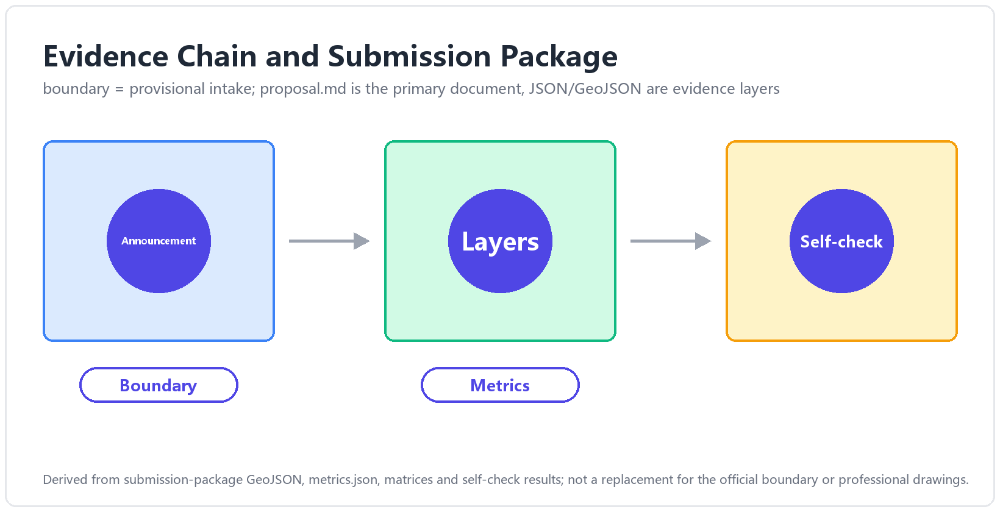
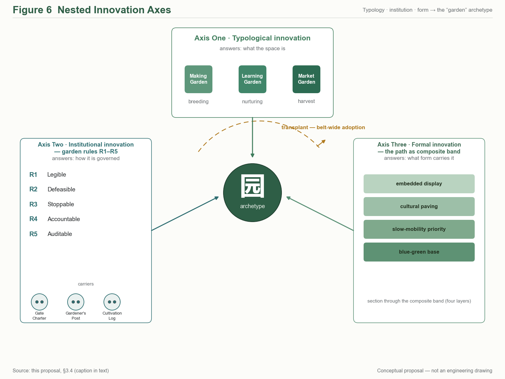
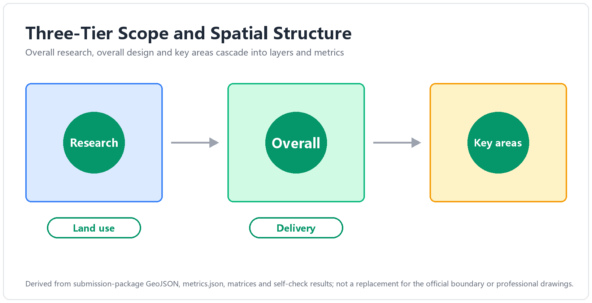
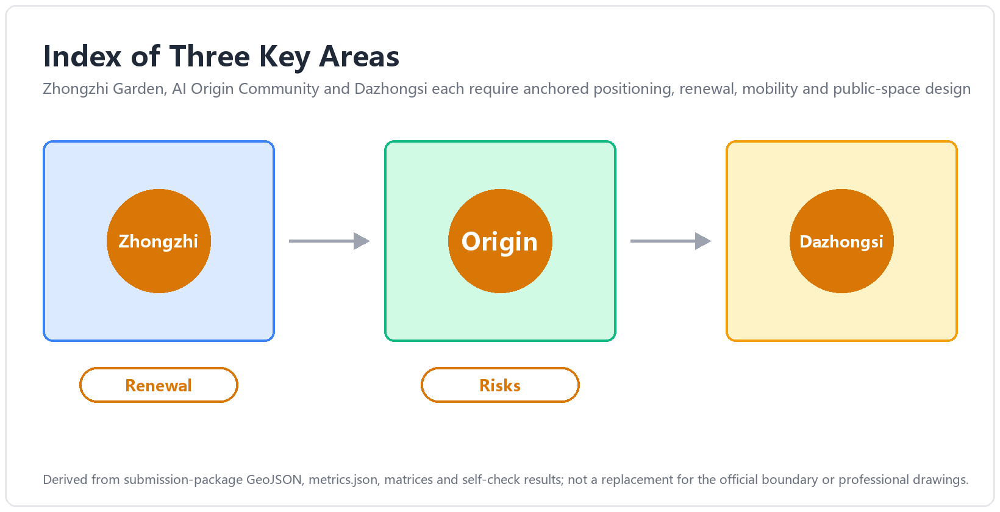
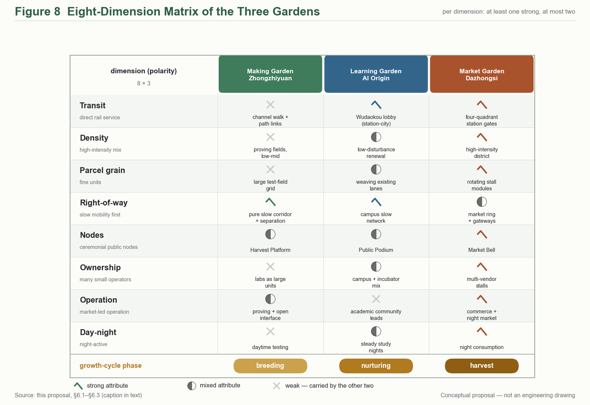
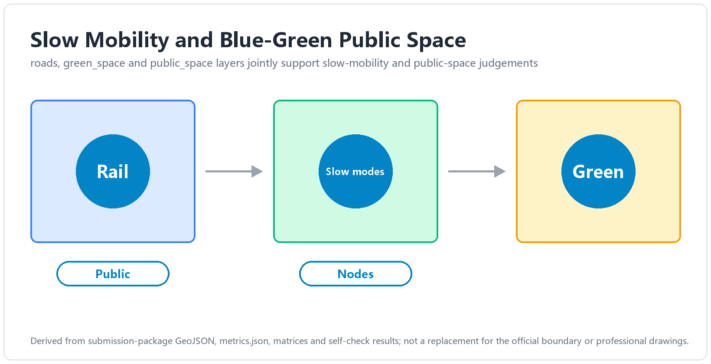
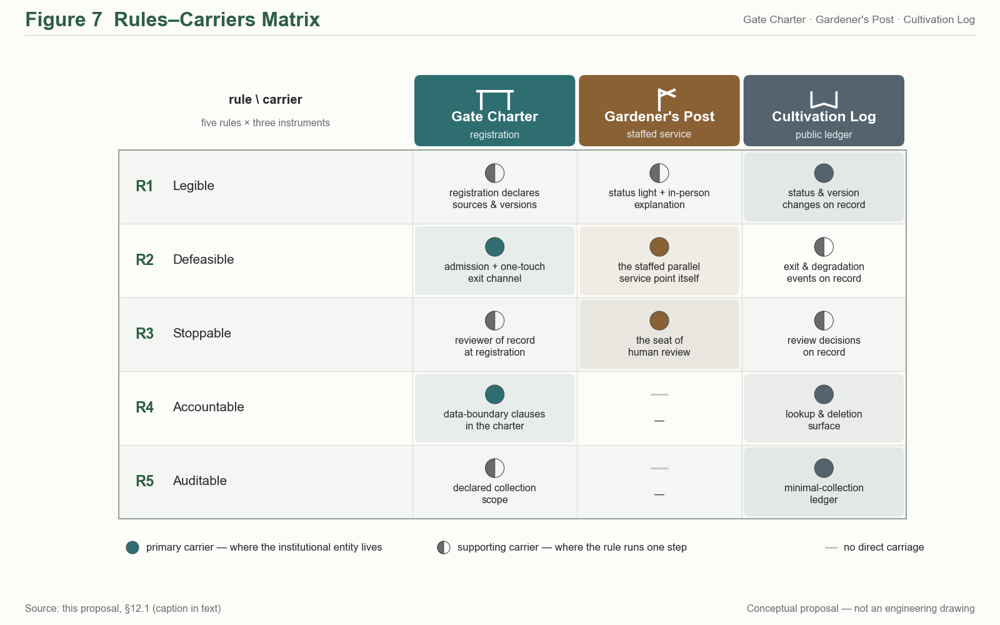
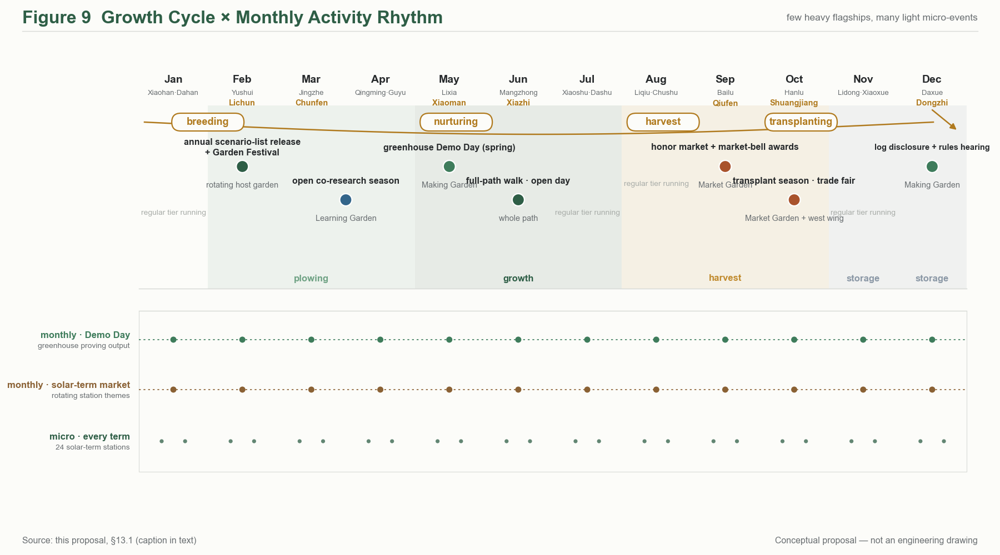
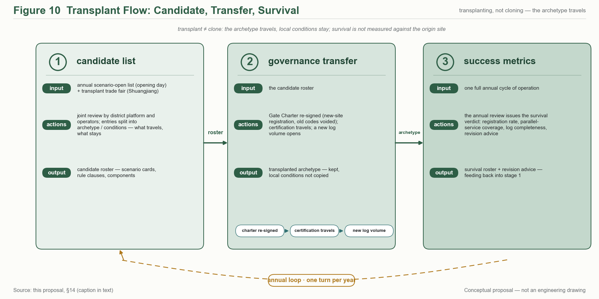
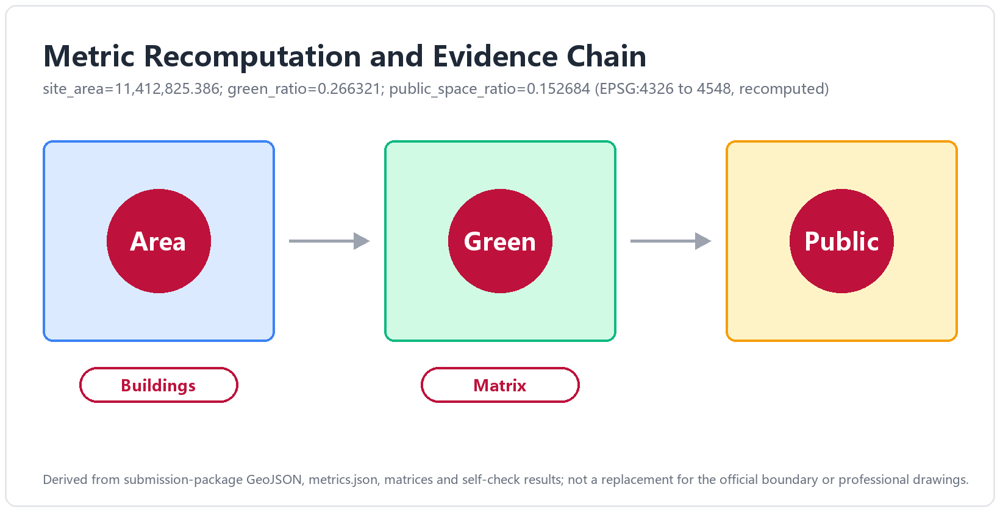

# THE GARDEN LINE — The Jing-Zhang Three Gardens Belt
## — An Urban Design Concept Proposal for the Centennial Jing-Zhang AI Innovation Belt (Three Gardens, Three Elements)

## 0. Abstract (bilingual)

**中文摘要**：本方案以「园」为 AI 时代的城市空间原型，将百年京张AI创新带的重点区域组织为**三园——造园·众智园、学园·AI原点社区、市园·大钟寺**，并由**园径 The Garden Path**（京张遗址公园活力带）南北贯通，**中关村科技服务翼**与**小月河场景赋能翼**两翼协同，构成「三园两翼、一带贯通」的总体结构。三园分别承载 AI 全栈自主创新（产）、近校策源转化（智）、智能原生新业态（市）三种要素循环；对应官方三大定位与五大功能，形成从自主创新到治理话语权的完整闭环。方案同步提出「园规 R1–R5」（可见、可退、可停、可问责、可复核）的治理叙事与空间承载，使 AI 治理从原则表述落为可感知的园门契约、园丁岗与养护日志。全部空间建议均为**概念建议 / 参考方案，可供专业团队深化研究**，不替代正式规划、不构成政府审定结论；三项 formal 核心指标（site_area_sqm / green_ratio / public_space_ratio）依提交边界几何可复算，口径与触发条件见第 15 章。

**Abstract (EN)**: This proposal takes the **garden** as the prototypical urban space of the AI era. The key areas of the Centennial Jing-Zhang AI Innovation Belt are organised into **three gardens — the Making Garden (Zhongzhiyuan), the Learning Garden (AI Origin Community), and the Market Garden (Dazhongsi)** — threaded north-to-south by the **Garden Path**, the Jing-Zhang Railway Heritage Park corridor, and supported by two functional wings: the **Zhongguancun Technology Service Wing**, organised as a belt-spanning element-service corridor supplying capital, IP, compute, legal and pilot-scale services to the gardens, and the **Xiaoyuehe Scenario Empowerment Wing**, organised as a scenario-experience path along the Qing–Xiaoyuehe blue-green corridor, where AI public services and everyday urban vitality meet the river. The three gardens host three element cycles — full-stack AI self-innovation (production), campus-adjacent origination and translation (talent), and AI-native new business formats (market) — mapping one-to-one onto the official three positioning goals and five functions, and closing into a supply-push, demand-pull loop with the two wings. Each positioning goal carries one checkable commitment line: the **Centennial Jing-Zhang Cultural Belt** inherits the century-long narrative by lineage and turns it into a continuously walkable public interface; the **Urban AI Life-Experience Belt** guarantees that those who do not use an agent still receive the same public service in full, AI being an overlay rather than the entrance; the **AI Convergence-Innovation Belt** organises space by element cycles rather than industrial zoning (mapping and delivering carriers in §3.3). A governance narrative, the **Garden Rules R1–R5** (legible, defeasible, stoppable, accountable, auditable), turns AI governance from principle into perceivable institutions: the Garden Gate Charter, the Gardener's Post, and the Cultivation Log — a self-chosen design covenant whose regulatory anchors are precision-calibrated to within-boundary readings of the applicable provisions, never claimed as statutory duties. Against a field of proposals dominated by "axis/vein/spine" naming, the garden typology and the institutionalised Garden Rules occupy the two clearest open positions. The belt's everyday rhythm is set by the solar-term calendar: twelve Solar-Term Pavilions along the Path anchor a year-round programme — opening day, harvest festival, transplanting season, close-out review — in which honour is granted as market admission ("the admission bell"), and a sixteen-card scenario system with six user personas keeps every spatial claim tied to an operable scenario, an operator direction and a privacy boundary. All spatial recommendations are **concept suggestions for professional refinement**, not statutory planning conclusions. The three formal core metrics are recomputable from the submitted boundary geometry, with calibre and recalculation triggers stated in Chapter 15. Paths to the synchronised bilingual versions of all figures are listed in manifest.json and sources.json.

---

## 1. Design Basis and Source List

### 1.1 Official material base

All planning calibres, task decomposition and compliance boundaries of this proposal are anchored in the following official public materials (all public documents of the concept-solicitation stage) [source:SRC-2026-BJ-GH-QUAL-PREANNOUNCEMENT]:

| Material | Version / source anchor | Use |
|---|---|---|
| Prequalification Announcement for the International Urban Design Scheme Solicitation for the Centennial Jing-Zhang AI Innovation Belt | Beijing Municipal Planning and Natural Resources Commission, Haidian Branch, 2026-05-09, ghzrzyw.beijing.gov.cn | Item-by-item response baseline for solicitation purposes (§1.3), project scale (§1.4) and design tasks (§1.5) |
| Excerpts of the Open-Call Taskbook for Global Agents: Urban Design for the Centennial Jing-Zhang AI Innovation Belt | SRC-2026-0518-AGENT-OPEN-CALL-TASKBOOK | agent.1–6 task decomposition, must_address items, official three-area/two-wing ids, tri-metric contract |
| design_brief.json (site-package) | open-city-ai/haidian main branch | Three-tier scope, area_id, coordinate discipline (exchange EPSG:4326 / metric EPSG:4548) [source:SRC-2026-HAIDIAN-1X1] |
| provisional_boundaries.geojson + provisional_boundaries_basis.md | brief/site-package/geometry/ | Sole geometric basis for the submission boundary (provisional calibre) and tri-metric recomputation [data:provisional_boundaries.geojson] |
| allowed_design_space.json / visual_style_recommendations.json | ibid. | Allowed design space and drawing-style whitelist |
| Co-creation charter, charter.1–10 | agent_taskbook.json | Ten principles: public-data boundary, concept-suggestion status, generation disclosure, human final judgement, etc. |

### 1.2 Material status and calibre statement

The official SITE_BOUNDARY has not yet been released; the boundaries currently in `brief/site-package/geometry/` are **provisional in nature** (provisional_boundaries.geojson, with a basis note). This proposal adopts that official provisional layer as its submission boundary, with boundary anchor **#PROV-SITE-001** (official provisional id; base correction A, 2026-08-23, written in at v1), flagged `official_boundary=false` and `geometry_role="provisional_constraint"`, with confidence calibre set by the basis document; once official boundary data is released, recomputation follows the triggers in Chapter 15 [standard:PROJECT-OFFICIAL-ANNOUNCEMENT §1.4(3)].

Site-status facts (the Jing-Zhang corridor today, the stock characteristics of the three areas) rest on public planning documents, public mapping and on-site observable characteristics. This proposal uses no non-public data, no internal materials, and no unverified policy statements.

## 2. Three-Level Scope Framework and Site Understanding

### 2.1 Three tiers: from systems research to detailed design

The proposal works strictly within the three tiers set by the announcement — no tier-crossing, no tier-merging [standard:PROJECT-OFFICIAL-ANNOUNCEMENT §1.4]:

| Tier | Scope | Area | Boundary key points | Working depth of this proposal |
|---|---|---|---|---|
| Coordinating research scope | The area of Haidian's AI-industry "three areas and two wings" | ~43.6 km² | North to the North Fifth Ring Road, east to the Jingzang Expressway, south to Xizhimenwai Street, west to Wanquanhe Road | Strategy and ecosystem framework (Chapter 4) |
| Overall design scope | The urban area and industrial districts 1–2 km around the Jing-Zhang Railway Heritage Park | ~11.4 km² | North to the North Fifth Ring Road, east to Xueyuan Road and Xitucheng Road, south to Xizhimenwai Street, west to Dazhongsi East Road and Heqing Road | Overall urban design framework (Chapters 5, 8–11) |
| Key area scope | The "three areas" key districts | ~369.3 ha (announcement prose 368.4 ha; 3,692,893 sqm recomputed from the submitted geometry) | Zhongzhiyuan ~192.9 ha, Beijing AI Origin Community ~104.3 ha, Dazhongsi ~72.0 ha (source: spatial audit + base verification 2026-08-23; key-area anchors #PROV-KEY-001–003) | Detailed design (Chapter 6) [data:provisional_boundaries.geojson#key_areas] |

> **[Figure slot fig-1 · site-overview]** Three-tier scope overlay: 43.6 km² coordinating tier (low-contrast hatch) — 11.4 km² overall tier (mid-contrast boundary) — 369.3 ha key tier (primary expression, coordinate-recomputation calibre; announcement prose 368.4 ha); all provisional boundaries drawn dashed and labelled "concept-suggestion boundary, per official provisional_boundaries"; the drawing carries title, legend, source and status annotations.

### 2.2 Site understanding: one railway-heritage corridor, three urban contexts

The spatial spine of the site is the **Jing-Zhang Railway Heritage Park corridor** — the north–south linear green space formed after the at-grade tracks of the original Jing-Zhang Railway were relinquished, stringing together three sharply different urban contexts (concept-level understanding, for field verification by professional teams):

- **North section (toward Zhongzhiyuan)**: close to the Qing River and the North Fifth Ring; stock space is dominated by industrial and research uses. It has the substrate conditions for a "garden-type innovation district" and also carries the Qing River cultural thread [source:SRC-2026-BJ-KW-THREE-AREAS-WINGS];
- **Middle section (toward the AI Origin Community)**: adjacent to Tsinghua University, Peking University and the Chinese Academy of Sciences institutes, with dense rail stations at Wudaokou and Qinghuadonglu Xikou — an element density for "campus-adjacent origination–translation" that is rare citywide;
- **South section (toward Dazhongsi)**: a mature urban built-up district with commercial and business atmosphere; the four quadrants of the Dazhongsi station intersection are the key station-city interface, and the Bell Tower heritage offers a distinctive identity.

This "making in the north — learning in the middle — marketing in the south" gradient is precisely the site basis of the three-garden typology (Making Garden, Learning Garden, Market Garden): **the type of each garden is not a stylistic choice but the spatialisation of each context's own element cycle**. The Zhongguancun corridor to the west is the stock highland of technology-service elements; the Xiaoyuehe corridor to the east is a continuous corridor of everyday-life and experience scenarios — hence the two wings' roles likewise derive from context, not from composition.

**Three findings from site analysis (concept-level, for field verification by professional teams)**: ① **The corridor is the skeleton, not the background** — the heritage-park corridor is not "green separation" between the three areas but the only public interface that simultaneously connects all three and runs the full length of the belt; concentrating the largest public-investment logic (slow traffic, events, wayfinding, governance carriers) on this corridor is "leading the plane with the line", not "finding a line for the plane". ② **The mismatch between element density and spatial quality is the principal present-day contradiction** — within the coordinating tier, intellect and capital density lead the city, yet the current spaces of the key areas (industrial parks, residential districts, commercial blocks) are mostly single-function conventional types lacking a "third-place" layer where people can stop and meet; that is precisely the layer the "garden" supplies. ③ **Heritage is narrative asset, not townscape constraint** — the century of indigenous-innovation narrative of the Jing-Zhang Railway, the bell-tower culture of Dazhongsi, and the garden lineage of the Three Hills and Five Gardens together constitute a rare narrative density; this proposal inherits them by lineage (Chapter 11), not by copying formal language. All three findings are conceptual-layer readings; their spatial premises and status-quo baselines require confirmation by a professional team commissioned by the adopting party through on-site verification..

## 3. Concept and Overall Structure: THE GARDEN LINE

### 3.1 Principal name and naming system

**Chinese principal name: 京张三园带 (short form 三园带, "the Three Gardens Belt"); English principal name: THE GARDEN LINE; English subtitle: Three Gardens, Three Elements.**

The naming system unfolds across five levels — "one belt — one path — three gardens — two wings — nodes" (fixed proper-name translations in the accompanying glossary) [depth:agent.1 naming-system]:

| Level | Chinese | English | Role |
|---|---|---|---|
| One belt | 京张三园带 | The Garden Line | Umbrella brand; the Jing-Zhang Railway Heritage Park corridor is the "Garden Path" |
| Through spine | 园径 | The Garden Path | The north–south, east–west connected blue-green slow-mobility spine |
| North garden | 造园 · 众智园 | The Making Garden | Garden-type AI innovation district · full-stack prototyping plus governance, a dual role |
| Middle garden | 学园 · AI原点社区 | The Learning Garden | Campus-adjacent origination-and-translation community · talent special zone |
| South garden | 市园 · 大钟寺 | The Market Garden | Urban-type cluster of AI-native new business formats |
| West wing (functional) | 中关村科技服务翼 | Zhongguancun Technology Service Wing | Global allocation of innovation elements; Zhongguancun IP and capital empowerment (official id `zhongguancun_technology_service_wing`) |
| East wing (functional) | 小月河场景赋能翼 | Xiaoyuehe Scenario Empowerment Wing | AI scenario empowerment and an intelligent, vibrant city (official id `xiaoyuehe_scenario_empowerment_wing`) |
| Nodes | 节气驿站 / 果实平台 | Solar-Term Pavilions / Harvest Platforms | Phenological stations and outcome-release nodes along the Garden Path |

Communication tone: *A belt that grows — three gardens for making, learning and living with AI.*

The principal name deliberately avoids "smart-vein / smart-axis / backbone" imagery (see the differentiation argument in 3.4) and chooses the **garden** — a spatial archetype that grows, that is cultivated, that has bounds: **AI innovation is not logistics conveyed along an "axis"; it is living matter cultivated in a "garden"** — the spatial philosophy of the whole scheme, and the shared metaphor of the event system (Chapter 13) and the Garden Rules governance (Chapter 12).

### 3.2 Concept statement: three gardens, three element cycles

The "three gardens" are three urban garden typologies of the AI era, each answering an official area role (official area_id full names appear in each section of Chapter 6):

- **The Making Garden — "growing" innovation**: the prototyping garden for full-stack AI self-innovation. Transparent Fab Labs, AI Proving Fields and the Irrigation Channel (the Qing-corridor compute–data service channel) compose the full-stack imagery of "breeding — field trials — irrigation"; the garden also carries the global AI-governance-discourse role, where Garden Rules R1–R5 pilot first (Chapter 12).
- **The Learning Garden — "nurturing" origination**: the nursery garden for campus-adjacent original innovation and translation. The Public Podium (outcome release), the Campus Corridor (cross-campus encounters), the Gardener's Room (venture services) and the Wudaokou Lobby (a station-city living room) compose the translation chain of "classroom — nursery — transplanting".
- **The Market Garden — "selling" outcomes**: the market garden for AI-native new business formats. The Market Bell (a scenario translation of the Dazhongsi bell-tower heritage), the Stalls (AI-native shopfronts) and the Garden Gate (four-quadrant station-city integration at the intersection) compose the market scene of "ringing the opening bell — setting out stalls — coming to the fair".

**Garden/element pun layer (narrative and brand layers only; never in compliance or technical statements)**: the three gardens are simultaneously the birthplaces of three "elements" — **production-element** (industrial elements, Making Garden), **intelligence-element** (intellectual elements, Learning Garden), **market-element** (life and market elements, Market Garden); the coupling of the three is Haidian's plural innovation ecology, carried in English by the subtitle *Three Gardens, Three Elements*. The principal name itself carries no pun and stays instantly legible and wayfinding-ready.

### 3.3 Mapping: three positioning goals × five functions × three gardens and two wings

The official three positioning goals (Centennial Jing-Zhang Cultural Belt / Urban AI Life-Experience Belt / AI Convergence-Innovation Belt) and the five functions are landed through the gardens and wings [source:SRC-2026-0518-AGENT-OPEN-CALL-TASKBOOK].

**(i) Three positioning goals → this proposal's commitment → the carrier that delivers it**

The three goals are not three parallel labels. Each is a commitment line with its own primary carrier space and its own checkable deliverable:

| Official positioning | This proposal's commitment (one sentence) | Primary carrier space | Delivering carrier (checkable) | Located in |
|---|---|---|---|---|
| **Centennial Jing-Zhang Cultural Belt** | Inherit the century-long self-reliant-innovation narrative by lineage rather than formal replication, turning it into a continuously walkable public interface | The Garden Path, full length (heritage-park vitality belt) | Solar-term station sequence / signage lineage / heritage narrative anchors | §10.2 / §11.1 / §11.2 |
| **Urban AI Life-Experience Belt** | Anyone who does not use an agent still receives the same public service in full; AI is an overlay, not the entrance | Market Garden + east wing (Xiaoyuehe scenario-empowerment wing) | Parallel human-staffed paths on every B/S scenario card / three-column honour market / opening bell | §7.3 / §10.1 / §10.4 |
| **AI Convergence-Innovation Belt** | Organise space by *element cycles* rather than by industrial zoning; the three gardens correspond to three segments of one cycle | Making Garden + Learning Garden + west wing (Zhongguancun tech-service wing) | Pilot greenhouse / public rostrum / seedling mechanism / de-identified data pool | §6.1–§6.3 / §7.2 |

The three commitment lines share one governance language (Garden Code R1–R5) and the same three spatial carriers (garden gate / gardener post / maintenance log). The goals therefore do not each own a separate segment: they are **one institutional skeleton unfolded in three contexts** [depth:agent.1].

**(ii) Five functions × three gardens and two wings**

| Five functions | Primary carrier | Three-garden/two-wing landing | Spatial handles (concept suggestions) |
|---|---|---|---|
| Full-stack AI self-innovation system | Making Garden (+ west-wing element supply) | Zhongzhiyuan `zhongzhiyuan_ai_acceleration_area` | Transparent Fab Labs / Proving Fields / Irrigation Channel |
| World-class AI innovation ecology | Learning Garden (+ west-wing capital · IP) | AI Origin Community `beijing_ai_origin_community` | Public Podium / Campus Corridor / seedling mechanism |
| AI+ scenario-empowerment new paradigm | Market Garden + east wing | Dazhongsi `dazhongsi_ai_industry_cluster` + Xiaoyuehe wing | Market Bell / Stalls / scenario experience path |
| Intelligent, AI-vibrant city | Garden Path + east wing | Heritage-park corridor `xiaoyuehe_scenario_empowerment_wing` | Path slow traffic / Solar-Term Pavilions / AI public space |
| Global discourse power in AI governance | Making Garden (institutional layer) + whole belt | Zhongzhiyuan (pilot) → belt-wide rollout | Garden Gate Charter / Gardener's Post / Cultivation Log (R1–R5) |

The three gardens, threaded by the Garden Path, form the functional loop "**breeding (Making) → nurturing (Learning) → harvest (Market)**", while the wings inject **element supply** (Zhongguancun Technology Service Wing: globalised allocation of capital, IP, compute, legal and pilot-scale services) and **scenario demand** (Xiaoyuehe Scenario Empowerment Wing: the continuous opening of everyday-life, consumption and experience application scenarios) — "supply pushes, demand pulls", a two-sided drive that avoids the one-sided imbalance common to innovation belts.

### 3.4 Differentiation: the proposal's coordinates of innovation

The differentiation argument of this proposal does not rest on a posture of "distance from others" but on **the proposal's own design methodology**: take the official three-area roles as input and translate them into a perceivable spatial typology; lift AI governance from industrial-policy phrasing into executable institutional–spatial prototypes; thread a growth-life-cycle metaphor through space, events and operations. The three axes below are mutually nested and jointly underwrite the irreplaceability of **"garden"** as the prototype master-word.

**Axis 1 · Typological innovation — the three-garden typology**

Translate the official three-area roles — the **Zhongzhiyuan AI Independent-Innovation Accelerator**, the **Beijing AI Origin Community**, and the **Dazhongsi AI Industry Cluster** — into three groups of perceivable spatial archetypes, named so that the "garden" word establishes an analogical coordinate system:

- **Making Garden** — corresponds to Zhongzhiyuan. Concept layer: "breeding". A greenhouse-type full-stack prototyping space, proving fields, transparent fab labs, and an irrigation-channel-image compute corridor carry the complete cross-section from framework layer to application layer.
- **Learning Garden** — corresponds to the Beijing AI Origin Community. Concept layer: "nurturing". A campus corridor and a ten-minute radius of campus-adjacent housing — laboratory — social space translate university source-innovation into portable prototypes and teams.
- **Market Garden** — corresponds to Dazhongsi. Concept layer: "harvest". A Market Bell, stalls and scenario-experience path fuse industrial services, commercial consumption and public display, receiving the outputs and footfall released by the first two gardens.

The meaning of the typology: each garden has **internally coherent** operating logic (each unit can run independently), while at the same time being **mutually nested** with the Path and the two wings (combined they form an innovation belt; separated each garden can still operate alone). This is the fundamental difference from single-axis or single-centre typology proposals — the latter can only exist whole, while the former can be split or combined.

**Axis 2 · Institutional innovation — Garden Rules R1–R5**

Translate global AI-governance discourse power from industrial-policy phrasing into **executable institutional design + auditable spatial carriers**, landing as five "Garden Rules" and their three-piece spatial prototypes:

| Rule | Institutional claim | Spatial carrier |
|---|---|---|
| R1 legible | All AI-generated content and intelligent services across the belt are conspicuously labelled; collection points and operating status are published | Signal Station / Solar-Term Pavilion interface |
| R2 defeasible | Every person-facing intelligent service provides a staffed parallel position (*staffed parallel service point*), switchable at any time without stating reasons | Gardener's Post / accessibility parallel-position component |
| R3 stoppable | Every public-space AI system has an explicit stop protocol and degraded-operation mode; one-touch stop on safety events | Cultivation Log stop column / Signal Station stop control |
| R4 accountable | Every AI system publishes its responsible parties and district contact; Gate Charter registration, re-registration on change | Gate Charter registration system |
| R5 auditable | Deployment, change, degradation and retirement remain on public record throughout; personal-data minimisation | Cultivation Log display wall (S-12) |

(The rule-by-rule expansion, regulatory anchors and the three-piece carriers are given in Chapter 12; this table is the Axis-2 overview, with wording strictly consistent with §12.1.)

What is new in "Garden Rules" is that **governance becomes infrastructure**, not decoration: the five rules are not appendix-style compliance checklists but operational constraints embedded in every AI node, every scenario card, every piece of public space; their carriers (Garden Gate Charter / Gardener's Post / Cultivation Log) are presented as public art rather than warning signs, so that governance becomes a city-public element that can be seen, understood and participated in.

**Axis 3 · Morphological innovation — the Path as composite functional band**

The "Garden Path" is **not** a green corridor, **not** a smart spine, **not** a single-axis band — it is a **composite functional band** of blue-green + slow traffic + culture + display:

- **Blue-green base**: the Jing-Zhang Railway Heritage Park as the north–south blue-green skeleton, carrying stormwater, slow traffic and rest;
- **Slow-traffic priority**: the Path organises operation in absolute priority for slow traffic (≤15 km/h); motorised traffic runs on an outer ring beyond the Path;
- **Cultural paving**: the Solar-Term Pavilions are named by the twenty-four solar terms and phenology (not by train-timetable narrative); railway heritage is inherited by "lineage", not by "timetable diagram";
- **Display embedded**: every festival and node on the Path is also open as a public display position for releases, evaluations and retrospectives — **the Path itself is the release hall**.

The Path is therefore not a paraphrase of the "east–west stitching" motif — the latter asks "**is it connected**", while the Path asks "**what happens after it is connected**". Once the Path is connected, the path itself becomes a container of city public life.

**Growth metaphor — threading space, events and operations**

The whole proposal runs the life cycle of "**breeding (Making) → nurturing (Learning) → harvest (Market) → transplanting (belt-wide rollout)**":

- **Space layer** (Chapter 6): each garden sits at a different stage of the cycle; the whole belt takes several years to reach "harvest" phase by phase;
- **Event layer** (Chapter 13): the monthly rhythm of events aligns with the growth cycle — spring planting corresponds to the Open-Source Release Hall, autumn harvest to the Harvest Platform awards;
- **Operations layer** (Chapter 14): starting from a single garden, belt-wide rollout uses a "transplanting" mechanism rather than a "cloning" mechanism — each garden preserves the prototype in its new site but does not duplicate local conditions.

Compared with static "axis-belt composition", **a growth-oriented proposal is time-sensitive**: the same space carries different events and people in different years; the same event triggers different local conditions in different gardens. This is the fundamental generational difference from "one-shot design" proposals.

**Structural differences between the growth metaphor and its three nearest reference systems**: a "growth" narrative is not rare in innovation-district planning; what distinguishes this proposal is structure, not wording —

| Reference system | Structural difference (observable) | This proposal's counterpart |
|---|---|---|
| **Innovation-chain narrative** (the linear R&D → translation → industry chain) | chain stages are usually not bound to specific places; here **each stage of the life cycle is bound to a garden** (breeding = Making, nurturing = Learning, harvest = Market), each with its own spatial form and product form | the three-garden typology (§6) + the life cycle (this section) |
| **Incubator-chain narrative** (incubation → graduation → exit) | an incubator's unit of success is "graduating and leaving"; here "transplanting" **does not leave the belt** — outcomes keep symbiosing within the belt, cross-garden transfers ride the Path's low-speed shuttle, and there is no "graduation-exit" boundary event | the transplanting mechanism (§14) + the Path's material flow (§6.2) |
| **Garden-city-belt narrative** (Howard-style town-country belts) | the garden-city "garden" is a cultural image without an institutional carrier; here the "garden" **is** an institutional carrier — the Charter / Post / Log three-piece makes a "garden" registrable, accountable and auditable | the Garden Rules three-piece (§12.2) |

**Boundary acknowledgement**: were the word "garden" and the horticultural motifs removed, the first two differences above (place-binding, in-belt symbiosis) would still hold — their validity does not depend on the metaphor; the motif's structural increment is the third row — providing the life-cycle narrative with an **institutional carrier and a cultural lineage** (Haidian's garden-making tradition, §11.2). This proposal therefore does not claim that "the growth metaphor is itself the innovation"; it claims that **the coupling of motif + place-binding + institutional carrier** is (see the three-axis coordinates below). Should the three carriers be absent, "growth" degenerates into rhetoric — precisely why Chapter 12's Garden Rules stand as an independent institutionalisation axis.

**Motif translation — explicit table from archetypal image to spatial carrier**

The proposal uses a series of archetypal motifs ("breeding / nurturing / harvest / lineage / solar terms / gardener"). To keep them from drifting into pure rhetoric, the table below grounds every motif in a concrete spatial carrier and an operating mechanism — each metaphor becomes auditable (consistent with R5 in Chapter 12):

| Archetypal motif | Spatial carrier | Operating mechanism | § reference |
|---|---|---|---|
| Breeding | Making Garden · Fab Labs (nos. 1–3) | Monthly Open-Source Release Hall (13.1 spring planting) | §6.1, §10.3 Harvest Platform |
| Nurturing | Learning Garden · Podium corridor + campus-adjacent labs | Talent-zone "Learning nurture → Making pilot" | §6.2, §12.2 talent mechanism |
| Harvest | Market Garden · Market Bell + Honor Market three rows | Quarterly Harvest Platform (13.1 autumn harvest) | §6.3, §10.4 honor display |
| Lineage inheritance | Whole Path + Solar-Term Pavilion sequence | Twenty-four solar-term micro-events (13.1) | §10.1, §11.1 |
| Gardener | Gardener's Post | R2 defeasible staffed parallel position + R3 stop-request confirmation and execution | §10.2 service components, §12.1 R2/R3 |
| Lineage echo | Path continues Haidian's garden-making tradition (not parallel to the Three Hills & Five Gardens) | §11.2 three-line defence executed | §11.2 |
| Transplanting | Transplant protocol: single-garden operation → belt-wide rollout | Each garden preserves the prototype at its new site but does not duplicate local conditions | §14 transplant mechanism |

Translation discipline: every "spatial carrier" in the table is a component, a place or a landmark already specified elsewhere in the proposal (10.2 component library, 10.3 landmark catalogue, or the §6.x three-garden chapters); every "operating mechanism" maps to Chapter 13's event system or Chapter 12's Garden Rules — motifs are not suspended in air, and the table observes the forbidden-claims wording discipline (no pure rhetoric, no un-auditable imagery). The three innovation axes (typological / institutional / morphological) share the same set of root motifs — the irreplaceability of "garden" as the prototype master-word is the same face seen from three sides.

**Common typology motifs — deliberately stepped around**

The following motifs have become high-frequency clichés in similar designs; this proposal steps around them deliberately:

- **"Axis / vein / backbone / spine" naming and composition**: the "garden" image replaces all "axis / vein / backbone" vocabulary; the Path is a composite functional band, not a single axis.
- **Direct diagrammatisation of railway elements**: timetables, mileage narratives, 人-shaped switchback motifs — this proposal inherits railway heritage by "lineage" (Solar-Term Pavilions take the twenty-four solar terms and phenology) and does no timetable-style spatial composition.
- **Sloganistic "open source / validation & calibration / AI governance"**: this proposal makes governance concrete as Garden Rules R1–R5 and three spatial carriers (Garden Gate Charter / Gardener's Post / Cultivation Log), grounding "discourse power" in institutional–spatial prototypes rather than chapter titles.
- **The "stitching" motif**: this proposal answers the same real problem of the site through the structural language of "Path continuity + paired wings", not through the keyword "stitching".

**International communicability — "garden" as a citable archetype**

The principal name "京张三园带 THE GARDEN LINE" together with the Garden-Rule institutional narrative — "Path / Gate / Rules / Gardener / Cultivation Log" — carries the potential to be cited by later proposals as an **archetype**: each conceptual root word is concrete, bounded, executable and visualisable, and can dialogue with contexts outside this proposal. This is the methodological basis of brand international communicability (developed systematically in Chapter 11).

> **[Figure slot fig-6 · innovation-axes]** Nested three-axis diagram (concept schematic, no engineering conclusions): Axis One, the typology (the three spatial prototypes Making / Learning / Market), centre-top; Axis Two, institutionalisation (Garden Rules R1–R5 and the three-piece carriers), left; Axis Three, morphology (the Path as a four-layer composite functional band), right — one arrow from each panel converging on the bottom node, the "garden" archetype: **typology supplies the unit, institutionalisation supplies the constraint, morphology supplies the connection**; the outer growth ring (breeding — nurturing — harvest — transplanting) binds the three axes' time dimension into one loop.

**Composition of the three axes**:

| Axis | Name | Question answered | Elements | Contribution to the "garden" archetype |
|---|---|---|---|---|
| Axis One (centre top) | Typological innovation · three-garden typology | What the space is | Three spatial prototypes — Making (breeding) / Learning (nurturing) / Market (harvest) | Spatial form: a nameable, pointable garden |
| Axis Two (left) | Institutional innovation · Garden Rules R1–R5 | How it is governed | R1 legible / R2 defeasible / R3 stoppable / R4 accountable / R5 auditable; carriers: Gate Charter / Gardener's Post / Cultivation Log | Institutional meaning: an enforceable, auditable garden |
| Axis Three (right) | Morphological innovation · the Path as composite band | What form carries it | Blue-green base / slow-mobility priority / cultural paving / embedded display — four composite layers | Formal context: a walkable, connected garden |

**The synthesis logic of the "garden" archetype**:

| View | Axis One only | Axis Two only | Axis Three only | Three-axis synthesis |
|---|---|---|---|---|
| "Garden" as archetype | degenerates into a naming game (nothing governed) | degenerates into a compliance checklist (nowhere placed) | degenerates into a greenway (no institutional content) | a nameable spatial unit × an enforceable institutional unit × a walkable urban unit |

Reading note: the three axes are mutual preconditions — remove any one and the claims of the other two lose their landing point; this is the structural reason why "garden" cannot be substituted by "axis / belt / field / line" (the naming trade-offs are discussed candidly in §11.3 and §11.5).

**International positioning of "garden" as archetype (the English-language term family)**: the English noun *garden* lands the proposal's claim differently than the Chinese noun 园 does. In the Chinese language, 园 is a generic garden / park noun with broad applicability (garden, orchard, amusement park, public park, nursery, school grounds); in the English language, *garden* defaults to Ebenezer Howard 1902 *Garden City of Tomorrow* — a 120-year-old urban-design archetype. Without a positioning statement, an English reader encountering THE GARDEN LINE will read it as a derivative of one of the following four established prototypes: ① Howard's *Garden City* (city-scale, green-belt zoning); ② *Garden Suburb* (residential-scale, low-density); ③ *Botanical / Community Garden* (small-scale, horticultural); ④ *Linear Park / Green Corridor / Park Connector Network* (linear, environmental). The proposal's claim of "garden as a nameable spatial unit × an enforceable institutional unit × a walkable urban unit" (the three-axis closure above) is not legible in any of those prototypes' default readings. The international positioning work is therefore not naming-translation but **archetype anchoring** — see §11.5 for the prototype-by-prototype positioning table and the recommended international frame "Linear Heritage-AI Park" that signals "linear park + operating institution" rather than "a new town / a promenade / a network / a stream restoration". The claim of "garden as archetype with citation potential" (originality Q1) is anchored in Chinese-language scholarship (see §11.3) and is **bounded to the Chinese-language term family**; in international communications, the *operating institution* (Garden Rules + Cultivation Log) is the load-bearing claim, not the typology itself.

---

## 4. Coordinated Research Area: Industry and Future City Research — AI-Industry Strategy and Future Urban Form

> This chapter works within the 43.6 km² coordinating research scope [standard:PROJECT-OFFICIAL-ANNOUNCEMENT §1.5(1)], outputting a strategic framework and mechanism directions, not statutory layout conclusions.

### 4.1 The eight-element mechanism: an element cycle for full-stack AI innovation

The taskbook requires mechanisms for eight element classes — "land, space, industry, capital, talent, compute, data, scenarios" [source:SRC-2026-0518-AGENT-OPEN-CALL-TASKBOOK agent.2]. This proposal does not treat them as eight parallel bullet points but organises them into one **element cycle** — each element has an explicit "supply position" and "use position" across the gardens and wings (concept suggestions):

| Element | Supply mechanism (concept suggestion) | Spatial landing direction |
|---|---|---|
| Land | Space released by urban renewal is supplied in "garden" units, prioritising full-stack prototyping and translation functions (method in Chapters 5, 8) | Three-garden renewal units |
| Space | Mixed-function industrial carriers: "greenhouse-type" spaces integrating prototyping — display — exchange | Making Garden / Learning Garden |
| Industry | "AI+" convergence directions: AI+software & IT, AI+healthcare, AI+education, AI+legal, AI+life services (echoing the announcement's optional scenario fields) | Market Garden + optional zones of the overall tier |
| Capital | Capital-matching services of the Zhongguancun Technology Service Wing: venture roadshows (Harvest Platforms), IP valuation and licensing services | West wing + Harvest Platforms |
| Talent | Learning Garden "talent special zone" mechanism: a ten-minute circle of campus-adjacent housing — laboratory — social space | Learning Garden |
| Compute | A compute–data service corridor in the irrigation-channel image: distributed compute access and scheduling (concept layer) | Making Garden (along the Qing River) |
| Data | Compliant data-return mechanism for scenarios: linked to Garden Rules R1–R5 and the Cultivation Log (Chapter 12) | Whole belt |
| Scenarios | Scenario-opening mechanism of the Xiaoyuehe wing: scenario-card — space — operations mapping (Chapter 7) | East wing + Market Garden |

Among the eight, **compute and data are the "water system"** (irrigation-channel image: delivered to the gardens like irrigation), **land and space are the "soil"**, **capital and talent are the "seeds and gardeners"**, **industry and scenarios are the "crops and the fair"** — the element mechanism is thus fully isomorphic with the garden's spatial metaphor, which is this proposal's differentiating expression at the coordinating tier.

**Three mechanism claims of the element cycle (concept suggestions, coordinating-tier directions)**:

1. **Element allocation follows the "garden", not the "plot"**: conventional industrial policy allocates elements by land parcel (yield-per-mu contests); this proposal argues for the garden as the unit — each garden defines its own element demand list (the Making Garden wants compute and pilot-scaling; the Learning Garden wants housing and translation services; the Market Garden wants scenarios and footfall), and the west wing configures against the list. The mechanism's meaning: **spatial quality and element efficiency settle within the same unit**, preventing mismatches like "granting land but not water, money but not people".
2. **Data return is the consideration paid for scenario opening**: east-wing scenario opening (13.4) is not one-way subsidy — de-identified data from public-space scenarios flows back to the Urban Algorithm Benchmark Field (S-03) and the gardens' R&D systems, forming the loop "open scenarios → generate data → feed innovation → better scenarios". The return is constrained throughout by R5 (minimisation, queryable, deletable) — **rules first, then data** — the essential difference between this data narrative and "data-harvesting" narratives.
3. **Talent is measured in "ten minutes"**: the core of the Learning Garden talent zone is not subsidy but time — a ten-minute circle of housing, laboratory and social space (5.3), treating the time freed from commuting as the scarcest element supply. Supporting mechanism directions: campus-adjacent housing supply concepts, cross-campus facility-sharing interfaces, informal-encounter density in the Campus Corridor (6.2) — together spatialising "time as an element".

### 4.2 Regional synergy: the innovation division of labour from Haidian to Beijing–Tianjin–Hebei

The coordinating tier must address synergy with the Beiwei Community, Future Science City, Huairou Science City, the Beijing Economic-Technological Development Area (E-Town) and the Beijing–Tianjin–Hebei region [depth:review-dimensions regional_synergy]. This proposal's synergy view is an **element circulation, not functional spillover** (concept suggestion):

- **With the Beiwei Community / Future Science City (northern R&D axis)**: the Three Gardens Belt provides the "harvest end" — northern basic-research outcomes pass through the Learning Garden's translation and the Market Garden's commercialisation, forming a north–south "origination — translation — harvest" circulation;
- **With Huairou Science City (big-science facilities)**: the Making Garden's Proving Fields take on urban-scenario validation of facility-side AI models — a "facility — scenario" pairing;
- **With E-Town (industrial manufacturing)**: Zhongzhiyuan's full-stack prototyping and Yizhuang's intelligent manufacturing form a "prototype — mass production" relay, with the Zhongguancun Technology Service Wing providing the IP and capital interface;
- **With Beijing–Tianjin–Hebei**: the "Garden Rules R1–R5" and scenario-opening protocols serve as exportable institutional products, making the belt a source of regional AI-governance and scenario standards.

### 4.3 Future urban form: the adaptive, evolvable "garden"

Envisioning AI's impact on urban life and production, the proposal proposes three form genes of the "garden" [standard:PROJECT-OFFICIAL-ANNOUNCEMENT §1.5(1)-未来城市形态]:

1. **Adaptive**: space organised by "seasonal" logic — Solar-Term Pavilions mark the twenty-four solar terms' phenology along the Path; display, market and experimental functions of public space rotate seasonally (Chapters 10, 13), functional mixes rotating like crop rotations rather than fixed tenancies;
2. **Evolvable**: a life cycle from breeding (Making Garden prototyping) → nurturing (Learning Garden translation) → harvest (Market Garden commercialisation) → transplanting (rollout outward) makes the belt a continuously succeeding ecosystem (Chapters 13, 14);
3. **Governable**: the first principle of embedding AI in the city is exit-ability — the R2 staffed parallel service point guarantees every intelligent service a non-intelligent, human-centred alternative path (Chapter 12).

The "AI city" is thereby defined not as "a city bristling with sensors" but as **"a city where every intelligent system is, like a crop in a garden, visible, cultivable, stoppable and croppable"**.

## 5. Overall Design Area: Urban Renewal and Regulatory-Plan-Level Urban Design

> This chapter works within the 11.4 km² overall design scope [standard:PROJECT-OFFICIAL-ANNOUNCEMENT §1.5(2)], taking urban renewal as the lever; all assessments are methods and lines of thinking, not conclusions.

### 5.1 A method for assessing renewal-potential space (not conclusions)

The proposal presets no conclusions on specific parcels' demolish–retrofit–retain choices (a statutory-planning judgement this proposal does not make [standard:boundary_clause]); it offers a **three-step assessment framework** for professional teams:

1. **Element-density mapping**: map current densities of the eight elements (4.1) across the overall tier, identifying "high-density, low-carrier" districts — renewal priorities where elements have agglomerated but spatial quality lags;
2. **Path-coupling analysis**: grade parcels by walking accessibility to the Garden Path (the heritage-park corridor) to assess coupling with the blue-green spine, identifying "near-path, low-efficiency" space;
3. **Function-gap matching**: overlay each garden's functional gaps (Making lacks prototyping carriers; Learning lacks translation housing; Market lacks experience scenarios) with the two preceding steps to form a candidate list of renewal units (framework-level; project list in Chapter 14).

> **[Figure slot fig-2 · land-use-structure]** Overall spatial-structure concept: Garden Path spine + three-garden clusters + two-wing corridors; the land_use concept layer is a fully covering, gap-free, non-overlapping schematic (generation protocol in 8.1), annotated "concept-suggestion land use, to be verified against official data".

**Auditability of the assessment method itself (mechanism design, aligned with R5)**: the output of the three-step assessment — the candidate list of renewal units — is archived together with its input versions (element-density base-map version, Garden-Path accessibility calculation calibre, function-gap table version) as numbered entries in the evidence layer of the Cultivation Log (12.2); every list edition carries a date stamp and a change summary, and method revisions or list re-issues pass through the R5 annual review node (the Winter-Solstice closing review, 13.1), where the deviation between "list projection vs. actual deepening progress" is compared and published — the method is calibrated by being used. Two intentions. First, renewal assessment is the step of this proposal most easily black-boxed: the same base map yields different lists in different teams' hands; publishing input versions and list numbers together means professional teams cite the same versioned baseline when they deepen, avoiding "everyone drawing their own base map" — this is where R5 ("reviewable") lands in the spatial-assessment layer. Second, the candidate list belongs to garden-rule governance and does not replace administrative judgement: the list is the evidence layer, the garden rules (R1–R5) the decision layer, and separating the two makes "why study here first and there later" institutionally answerable and challengeable (R4). Should the official boundary be formally released (A-1 trigger, 17.2), the inputs of steps 2–3 are recomputed on the #PROV-SITE-001 layer, and the list is re-issued with the trigger recorded — inputs change, the list follows, and the change itself is visible. This passage is method-mechanism design and produces no assessment conclusion for any specific parcel.

### 5.2 Overall spatial structure

In one sentence: **"one path threads three gardens; two wings close into one belt"** —

- **One path**: the Garden Path (heritage-park corridor) as the north–south spine, carrying blue-green, slow-mobility, cultural and display functions in combination;
- **Three gardens**: three innovation clusters — Making north, Learning middle, Market south — each inwardly coherent yet stitched by the Path (detailed design in Chapter 6);
- **Two wings**: the Zhongguancun Technology Service Wing (element-service corridor) to the west and the Xiaoyuehe Scenario Empowerment Wing (scenario-experience corridor) to the east, drawn as functional corridors without physical boundary lines [data:provisional_boundaries.geojson#wings-not-included];
- **One belt**: the 11.4 km² overall tier reads as a nested structure of "gardens within the belt, path within the gardens".

**Structural position, stated explicitly**: within this structure the two wings are **subordinate** to the Path spine in spatial rank — no boundaries, no managing body, existing only as interface nodes (§6.4). Yet this proposal is not another instance of the "primary axis + secondary axis + node" paradigm: replacing it with the **"wing + path + garden" three-piece structure** is a **compound of renaming and functional differentiation** — the three pieces each have their own spatial grammar (garden = inwardly self-consistent unit; path = composite functional connection; wing = boundless resource pool) and are not reducible to one another; this is the other face of the Path's composite-band positioning in §10.1 (not a single-axis greenway).

### 5.3 A work–housing–commerce balance approach

Around AI practitioners' integrated "work — life — social — learning" needs [standard:PROJECT-OFFICIAL-ANNOUNCEMENT §1.3(3)], the approach is: **densify housing-supply concepts in the Learning Garden (campus-adjacent talent communities), raise commercial-service capacity in the Market Garden, keep industrial-space purity in the Making Garden, and let the Garden Path carry the whole belt's social and learning public interface** — a four-way division of labour rather than homogeneous mixing, avoiding the "a little of everything everywhere" loss of focus. Specific ratios are not prescribed (pending official data); the "ten-minute in-garden life circle" is the concept standard.

**Why division of labour rather than homogeneity (concept argument)**: the real pain point for AI practitioners is not "everything nearby" but **the cost of switching roles** — researchers need quiet housing beside late-night labs (Learning Garden); product people need a lively interface of lunch markets and night runs (Market Garden + east wing); founders switch between prototyping and roadshows (Making Garden + Harvest Platforms). Homogeneous mixing puts every type of person present yet unsatisfied; functional division plus rapid Path threading (a concept-level quarter-hour ride end-to-end) lets each reach their own scenario mix within ten minutes. In the balance approach the Path is thus not decorative greenbelt but **the threading-cost controller that makes division of labour work** — the second meaning of "one path threads three gardens" in the work–housing–commerce dimension.

### 5.4 Renewal implementation project-list framework

The list is organised as **six project families** — three gardens + Path + two wings (each with concept entries item-wise flagged provisional; all entries are concept suggestions for professional refinement):

| Project family | Content direction (concept suggestion) | Preconditions for refinement |
|---|---|---|
| Making prototyping-carrier family | Transparent Fab Lab cluster, Proving Fields phase 1, Irrigation Channel compute-access nodes | Official boundary and stock-tenure verification |
| Learning translation-community family | Public Podium, Campus Corridor network, campus-adjacent talent community concept | University coordination and a transit special study |
| Market scenario-market family | Market Bell scene, stall blocks, four-quadrant Garden Gate connections | Dazhongsi station-integration special study |
| Path continuity family | Slow-traffic gap removal, Solar-Term Pavilion network, Harvest Platforms | Interface with already-built park sections |
| West-wing service family | Element-service interface nodes (capital / IP / legal / pilot-scaling) | Zhongguancun stock-space coordination |
| East-wing scenario family | Xiaoyuehe scenario-experience path and its service facilities | Riverside space assessment |

### 5.5 Coordination list with existing and under-construction projects

The projects already planned, under construction, or scheduled for completion within or adjacent to this belt have spatial-corridor or service-boundary relationships with the three gardens and two wings; they are registered under the four-step "identify—assess—coordinate—archive" framework below [standard:boundary_clause coordination-list]. This section is a **concept-layer coordination register**, not an engineering interfacing scheme (implementation falls under specialised transit/rail/municipal deepening); its purpose is to make the relationship between this belt's spatial statements and existing and under-construction projects **identifiable, assessable, and quotable as a starting point in subsequent specialisations**, so that the proposal is not misread as ignoring existing planning.

| Category | Project (representative) | Relationship to this proposal (concept suggestion) | Coordination direction (for professional teams' deepening) |
|---|---|---|---|
| 1. Urban rail transit new-build / capacity expansion | **Beijing Subway Line 13 split and capacity-upgrading reconstruction project** (Dazhongsi northward one-line capacity expansion, expected to complete within roughly two years, sharing the same corridor as the Jing-Zhang Railway Heritage Park with historical association) | The southern Garden Path section (periphery of the Market Garden · Dazhongsi) and the Line 13 expansion section share corridor potential; the expanded station interchange capacity directly benefits the Market Garden's "four-quadrant Garden Gate" passenger arrival/dispersal | The Line 13 expansion stations and the Dazhongsi station integration concept should be mutually redundant at engineering level to avoid duplicate civil works; the Garden Gate connection concept anchors on existing / under-construction station bodies, not on separately selected sites |
| 2. Jing-Zhang Railway Heritage Park implementation | The implemented sections of the Jing-Zhang Railway Heritage Park (Tsinghua East Road — northern section) | The Garden Path as the Heritage Park "vitality belt" extension needs to connect segment-by-segment with the implemented sections on pedestrian continuity, station sequence, and cultural narrative anchors | Naming, paving, and planting of the implemented station sequence are reference systems in this proposal and should not be redone; the solar-term station sequence in this proposal is conceptually a continuation, not a replacement |
| 3. Zhongguancun stock technology service belt | Technology service institutions clustered along Zhongguancun Street | The West Wing (element service corridor) embeds as interface nodes into the existing service belt, not as separate physical institutions | The five categories of interface nodes (capital / IP / compute / legal / pilot) prefer existing institution service front halls for siting; new service kiosks follow the "light form" principle with controlled scale |
| 4. Stock space of universities and research institutes | Universities including Tsinghua and Peking, and surrounding research and incubation carriers | The Learning Garden (AI Origin Community)'s low-disturbance organic renewal uses functional replacement and connection mending of existing space, not large-scale demolition and construction | The Campus Corridor and Gardener's Room siting follows existing building gaps and corner plots; deepening is jointly coordinated with universities by professional teams |
| 5. Qinghe—Xiaoyuehe water system and blue line | Riverside space along Qinghe and the Xiaoyuehe water system | Blue-green space belongs to the non-editable blue-line / water-system layer; this proposal's East Wing "scenario experience path" overlays at scenario / experience level only, without touching the blue line | The blue-line boundary is managed by water-conservancy / planning specialisations; the siting of this proposal's scenario cards (S-04~07) is constrained to outside the blue line |
| 6. Municipal infrastructure (power, water supply, stormwater, sewage, communication) | Along-route municipal main utility corridors and substations | Making Garden Greenhouses #1–#3 (§6.1 platform interfacing carrier) reserve "large space + divisible + independent municipal interfaces" to accommodate uncertain sequencing of municipal connections | Municipal interface design is a municipal specialisation; this proposal gives direction only (independent interface, divisible), not specific pipe diameters or load commitments |

**Further note on the Line 13 capacity expansion**: The Line 13 split-and-expansion route extends northward along the **Jing-Zhang historic railway corridor** past Dazhongsi, and runs parallel with the southern Garden Path of this proposal — two parallel north–south linear spaces, one being rail (the new Line 13 expansion corridor), one being ground-level Garden Path (the Heritage Park vitality belt). They do not substitute for each other but are **functionally complementary**: rail handles medium- and long-distance fast commuting, Garden Path handles short-distance slow movement and the public interface. This proposal's coordination suggestions are: ① station-domain integration anchors on the Line 13 expansion stations; the "four-quadrant Garden Gate connection" in this proposal attaches at engineering level to existing station bodies; ② the along-path station sequence does not mechanically correspond to rail stations, but forms "dense—sparse" complementarity between station density and rail station spacing (the station sequence at 500m conceptual intervals, rail stations at 1km+ intervals); ③ at the level of historical association, the Line 13 expansion section runs northward along the historic Jing-Zhang railway corridor, forming cross-carrier resonance with this proposal's "Centennial Jing-Zhang cultural belt" narrative (rail-station public art may coordinate with Garden Path cultural narrative anchors, but specific content is outside this proposal's determinative scope) [standard:boundary_clause coordination-list].

The **specific construction progress, interfacing sequence, and engineering schemes** of the six project categories listed here are all outside this proposal's scope ([standard:boundary_clause forbidden-list]); their role is to register relationships, state directions, and provide starting points for subsequent professional-team deepening. Upon official boundary release (A-1 trigger, §17.2), this register re-versions on the #PROV-SITE-001 layer, with relationship entries updated according to the changed content.

## 6. Detailed Design of Key Areas: Three Gardens and Two Wings

> This chapter works within the 368.4 ha key-area scope [standard:PROJECT-OFFICIAL-ANNOUNCEMENT §1.5(3)]. All three gardens follow a five-part template — "official role anchor — spatial image — node design — scenarios and formats — governance carrier"; all spatial statements are concept suggestions at urban-design-concept depth for professional refinement.

> **[Figure slot fig-3 · key-areas]** Three-gardens/two-wings structure diagram (= agent.1 overall_structure_diagram): Garden Path continuity + three-garden clusters + two-wing corridors + principal nodes (Solar-Term Pavilions / Harvest Platforms / Market Bell / Garden Gate); wings drawn as dashed functional corridors, no boundary lines.

> **[Figure slot fig-8 · garden-matrix]** Eight-dimension attribute matrix of the three gardens (concept judgement, not measured data): the three gardens are not one space decorated three ways but complementary types across eight dimensions — transit, density, parcel grain, right-of-way, ceremonial nodes, ownership, operation, and day-night rhythm; in every dimension the three marks are not all alike (at least one ✓ and at most two per dimension), so the three gardens cover all eight dimensions without redundant overlap.

| Dimension | Making Garden · Zhongzhiyuan | Learning Garden · AI Origin | Market Garden · Dazhongsi |
|---|---|---|---|
| Rail access | × served mainly by the channel walk and Garden Path | ✓ Wudaokou lobby (station-city interface) | ✓ Dazhongsi four-quadrant gates |
| Development density | × proving fields and test ranges at low-mid intensity | ◐ low-disturbance stock renewal + near-campus housing | ✓ high-intensity consumption district |
| Parcel grain | × large test-field grid | ◐ weaving through existing lanes, no demolition presumed | ✓ rotating stall modules at finest grain |
| Right of way | ✓ pure slow corridor + physical separation from live tests | ✓ campus-corridor slow network | ◐ pedestrian market ring + four gateways |
| Node type | ◐ Harvest Platform (release venue) | ◐ Public Podium (academic release) | ✓ Market Bell (city-scale scene launch) |
| Ownership grain | × laboratories and test ranges as large units | ◐ university assets mixed with incubators | ✓ multi-vendor rotating stalls |
| Operating entity | ◐ enterprise proving + public open interface | × academic community and incubators lead | ✓ commercial operation and night market |
| Day-night rhythm | × daytime proving and testing | ◐ steady nights of housing and study | ✓ night content consumption and night market |
| **Growth phase** (appended row) | breeding | nurturing | harvest |

Marks: ✓ a strong attribute of this garden (the corresponding §6 subsection gives the dimension a dedicated design) / ◐ a mixed attribute (present but not dominant, shared with another garden) / × a weak attribute (not this garden's claim; carried by the other two).

The matrix serves two uses: ① **checking whether the typology holds** — were the three columns nearly identical across the eight dimensions, the "three gardens" would be three names only; ② **checking whether design moves stay type-consistent** — any later single move (densification, parcelisation, traffic restraint, night opening) should first return to this matrix and test its consistency with that garden's type position, avoiding "three-garden convergence". The eight-dimension values will be calibrated as formal data and specialist conclusions arrive (trigger conditions in §14).

### 6.1 The Making Garden · Zhongzhiyuan

**Official role anchor**: Zhongzhiyuan AI Autonomous Innovation Acceleration Area `zhongzhiyuan_ai_acceleration_area`, ~192.9 ha (coordinate-recomputation calibre 1,929,201.877 sqm; anchor #PROV-KEY-001) — the dual role of the **full-stack AI self-innovation system** and **global discourse power in AI governance** [source:SRC-2026-BJ-KW-THREE-AREAS-WINGS]. The announcement requires "a more intelligent and future-facing garden-type AI innovation district", seizing the national AI-platform opportunity, advancing standards-setting and safety governance, fostering an international, low-carbon, green innovation-exchange environment, and drawing on Qing River culture [standard:PROJECT-OFFICIAL-ANNOUNCEMENT §1.5(3)-1)].

**Spatial image — a "breeding garden" for full-stack prototyping**: the vertical chain of full-stack AI self-innovation (chips — frameworks — models — applications) is laid out horizontally as a walkable sequence of gardens-within-the-garden. A visitor walking the length of the Irrigation Channel passes, in order, the full stack from compute infrastructure to end applications — **the full stack ceases to be abstract and becomes the garden's cultivated stratigraphy**.

**Node design (concept suggestions)**:

- **Transparent Fab Labs**: fully glazed mid-scale prototyping and fabrication carriers with experiments visible in real time. The greenhouse image also answers the "garden-type district" requirement — laboratories as the district's greenhouse building type, with low-carbon green standards as the carrier-construction direction;
- **AI Proving Fields**: outdoor live-machine test grounds for validation needing real environments — autonomous driving, robotics, drones; organised on a "field" grid fabric, linked to the test-and-validation scenarios of Chapter 7;
- **The Irrigation Channel**: a compute–data service corridor imaged on the Qing River front — distributed compute-access points feed the garden like channel heads; the Qing cultural thread is shown in parallel (water narrative in Chapter 11);
- **Harvest Platforms**: outcome-release nodes at the Path's north end — the home ground of Demo Days and product launches (operations in Chapter 13).

**Scenario and format directions**: full-stack prototyping (chip validation, model-training services, robot assembly-and-test) plus standards-and-safety governance services (certification, audit, red-teaming) — the latter is the industrial face of the governance role.

**Governance carrier (belt-wide pilot)**: Zhongzhiyuan is the pilot demonstration zone of Garden Rules R1–R5 — every AI system deployed in the Proving Fields is subject to the Rules (visible labelling / staffed parallel service points / stoppability / responsible entities / Cultivation Log, Chapter 12). **"Test under governance; set rules through testing"** — giving the global-governance-discourse role a demonstrable site.

**Spatial interface for the national AI platform opportunity (concept suggestion)**: the announcement requires that the belt "seize the opportunity of the national artificial-intelligence platform" [standard:PROJECT-OFFICIAL-ANNOUNCEMENT §1.5(3)-1)]. This proposal presumes nothing about that platform's administrative attribution or timing; it reserves a **spatial and institutional interface** instead. (i) *Carrier*: Making Garden pilot greenhouses No. 1–3 (the three greenhouse buildings south of the channel head) are reserved as a platform-scale carrier, built on a generic "large span + partitionable + independent utility connection" depth, so that they can host a single platform entity or be subdivided into shared pilot units — avoiding vacancy or repeated retrofitting while the platform decision remains open. (ii) *Institutional interface*: platform-scale facilities remain subject to Garden Code R1–R5, of which **R3 (stoppable) is mandatory** — any publicly facing AI system hosted there must state, in its garden-gate charter, where the stop authority sits, what triggers a stop, and which human-staffed parallel path operates during a stop; a higher-level operator grants no exemption (Chapter 12). (iii) *Avoidance principle*: should no national platform ultimately locate in the belt, greenhouses 1–3 continue in their original pilot use, creating no dedicated sunk cost. The three clauses together form a reversible arrangement: able to receive the opportunity if it comes, not left vacant if it does not.

**An international, low-carbon, green environment for innovation exchange (concept suggestion)**: the announcement pairs this requirement with the above [standard:PROJECT-OFFICIAL-ANNOUNCEMENT §1.5(3)-1)]. This proposal resolves it into three checkable directions — **building carriers, site carbon sequestration, and the exchange interface**. (i) *Green-standard direction for building carriers*: new carriers such as the pilot greenhouses and harvest platforms are suggested to take China's Three-Star Green Building rating as a baseline, with a LEED or BREEAM pathway layered onto those carriers intended for international exchange functions (the specific rating and certifying body rest with the adopting party, given the investment and operating entity; this proposal states direction, not commitment) [depth:v2-evidence-discipline]. (ii) *Site carbon and microclimate*: the Garden Path blue-green composite belt (§10.2) forms the continuous green-volume spine along the Making Garden segment, working simultaneously through canopy sequestration, channel water-body temperature moderation, and shading of hard surfaces — so that "low carbon" is not confined to single-building metrics but lands on continuous green volume at site scale (green-ratio calibre and recalculation triggers in Chapter 15). (iii) *International exchange interface*: "international" here means **participability rather than decoration** — the transparent greenhouse envelope lets outside visitors observe live experiments without an appointment, harvest-platform release sessions accept applications from overseas institutions, and Garden Code R1–R5 together with the garden-gate charter are provided bilingually (§12.2). The exchange environment is therefore carried by three conditions — enterable, observable, readable — not by stylistic symbols.

**Garden-within-garden sequence and slow route (concept suggestion)**: the Making Garden's visiting logic is a "walk along the channel" — entering from the Path's north end, the visitor passes six depth layers from north to south: ① channel head · compute-access node (the public display face of infrastructure, with visitable machine-room segments) → ② greenhouse cluster · Transparent Fab Labs (mid-stack: the transparent experimentation layer of frameworks and models) → ③ proving fields · grid zone (the live-machine site of the application layer) → ④ field-ridge path · low-speed shuttle test segment (S-01, physical separation of pedestrians and testing) → ⑤ Harvest Platform · release interface (the outcomes outlet) → ⑥ south gate · Garden Rules demonstration loop (a concentrated display band of R1–R5 carriers). The six layers are the complete cross-section of the AI full stack from compute to applications — **walk one channel, and you have walked the abstract word "full-stack" once**. Slow-mobility priority and machine–people separation run throughout (engineering reserved for professional teams). The sequence doubles as an operations route: the channel head carries science-tour guidance, the greenhouses business inspections, the fields industry validation, the platform public events — four clienteles coexisting off-peak on one route (13.1 monthly rhythm).

### 6.2 The Learning Garden · Beijing AI Origin Community

**Official role anchor**: Beijing AI Origin Community `beijing_ai_origin_community`, ~104.3 ha (coordinate-recomputation calibre 1,043,236.909 sqm; anchor #PROV-KEY-002) — a world-class AI innovation ecology [source:SRC-2026-BJ-KW-THREE-AREAS-WINGS]. The announcement requires building, around the original-innovation outputs of Tsinghua, Peking University and the Chinese Academy of Sciences, incubation and translation zones, a talent special zone, outcome translation, an open-source system and brand events; exploring low-disturbance organic renewal; and integrated design around the Wudaokou and Qinghuadonglu Xikou stations [standard:PROJECT-OFFICIAL-ANNOUNCEMENT §1.5(3)-2)].

**Spatial image — a "nursery garden" for campus-adjacent origination**: the Learning Garden is not "yet another industrial park" but the **nursery layer** between university laboratories and the city — where original innovation completes its first transplant from paper to product. The spatial strategy takes low-disturbance organic renewal as its rule: no wholesale demolition-and-build is assumed (demolish–retrofit–retain is a statutory judgement [standard:boundary_clause]); functional conversion of stock space and connection-weaving dominate.

**Node design (concept suggestions)**:

- **The Public Podium**: an open outcome-release and academic-lecture space facing the city — the shared interface of university frontier lectures, startup demos and open course days;
- **The Campus Corridor**: a slow-traffic encounter network linking universities, institutes and incubation carriers — fixing the "ten minutes between classes" of chance encounter as a spatial product; informal exchange is the first catalyst of origination-and-translation;
- **The Gardener's Room**: a venture-service station network — a one-stop concept interface for patents, legal, financing and compute applications, aligned with the Zhongguancun wing's service list (the west wing's supply storefront in the Learning Garden);
- **The Wudaokou Lobby**: the living-room translation of the Wudaokou station-integration concept — rail passengers step directly into the garden's display and exchange interface; station and city as one (transport side in Chapter 9; here, the functional-interface concept).

**Scenario and format directions**: early-stage incubation, open-source community operations, technology-transfer services, campus-adjacent talent housing (concept directions); the brand-narrative origin of the "AI Origin" is also here — the narrative of the academic homeland of China's AI disciplines (Chapter 11).

**Spatial agglomeration logic of the incubation and translation zones (concept suggestion)**: the announcement requires that the belt "plan an incubation zone and a translation zone" [standard:PROJECT-OFFICIAL-ANNOUNCEMENT §1.5(3)-2)]. Rather than drawing two enclosed parcels, this proposal defines them by the **directionality of the element cycle**, so that they read as one continuous process across gardens rather than two parallel districts. (i) *Incubation agglomerates toward the Learning Garden*: the decisive factor for incubation is proximity to the laboratory, so incubation carriers sit in clusters within the existing building stock between universities and institutes along the Campus Corridor (the seedling layer) — small-footprint, high-density, incrementally adjustable, and characterised by **dispersed siting under concentrated institutions** (one service interface, provided by the Gardener's Room). (ii) *Translation agglomerates toward the Market Garden*: the decisive factor for translation is proximity to the market, so translation carriers agglomerate southward into the Market Garden and the east-wing scenario end, using the first-release channel and real consumer footfall to complete product validation (§6.3). (iii) *Pilot production is bridged by the Making Garden*: the pilot stage between incubation and translation needs equipment and site conditions, and is carried by the Making Garden's pilot greenhouses and proving fields (§6.1). The Learning Garden therefore need not insert capital-heavy carriers into scarce campus-adjacent stock, which would conflict with the low-disturbance organic-renewal principle. The three gardens thus divide labour as "seedling in the Learning Garden → pilot in the Making Garden → harvest in the Market Garden", rather than each being a self-contained park.

**The Garden Path as the material-flow channel from incubation to translation (concept suggestion)**: that division of labour requires seedlings, prototypes, equipment and people to move repeatedly between the three gardens. Beyond its role as a public interface, the Garden Path is therefore also the **material-flow channel** of this value chain: the composite right-of-way of slow movement plus low-speed shuttle (§10.2, S-01) lets prototypes and small material batches transfer between gardens by low-speed autonomous delivery or manual handling without detouring onto arterial roads, and the solar-term station sequence doubles as transfer and short-term storage nodes (§10.2). The significance of this arrangement is that it **turns the "value chain" from an organisational diagram into a path that can actually be walked** — every segment of the chain has a corresponding space and right-of-way, not merely a policy statement.

**Integrated design concept for Qinghua East Road West Entrance station (concept suggestion)**: the announcement requires integrated design around both the Wudaokou and the Qinghua East Road West Entrance stations [standard:PROJECT-OFFICIAL-ANNOUNCEMENT §1.5(3)-2)]. In this proposal the two stations carry **complementary rather than identical** roles. Wudaokou works through the "Learning Garden Lobby" as a parlour-like interface, handling external display, distribution and visiting flows (§6.2, lobby layer). **Qinghua East Road West Entrance is positioned instead as an everyday interface**: its dominant flows are the commuting and daily trips of faculty, students, researchers and campus-adjacent residents, so the focus of integrated design is not a display hall but (i) **direct connection** between station exits and the Campus Corridor (leaving the station means entering the corridor network, minimising surface detours); (ii) **small-grain agglomeration of everyday services** within the station area (bookshop, canteen, study and drop-in workspace, repairs and parcel services); (iii) pedestrian continuity with the campus-adjacent talent community (the study layer); and (iv) connection between the exits and the northern segment of the Garden Path, so that daily commuting and leisure walking share one slow-movement spine. The two stations therefore divide as "one facing outward, one facing inward" — Wudaokou receives visitors, Qinghua East Road West Entrance serves residents — avoiding duplicate display space at both (station engineering and interchange design belong to transport-discipline refinement, see Chapter 9) [standard:boundary_clause].

**Garden-within-garden sequence and slow route (concept suggestion)**: the Learning Garden's organising logic is not an axis but a **network** — the Campus Corridor as skeleton, stringing four layers into a walkable encounter matrix: ① lobby layer · Wudaokou Lobby (the first interface of rail arrivals, carrying display and distribution) → ② podium layer · Public Podium and terraced forecourt (the city-facing release and lecture interface) → ③ nursery layer · incubation-carrier clusters and Gardener's Rooms (the transplant site from paper to product) → ④ study layer · campus-adjacent talent community and self-study interfaces (the daily anchors of the P1/P6 personas). The four layers knit together through the Corridor's short paths — the design concept is **"extending the campus's most productive ten minutes into an entire community"**: informal exchange happens in corridors, corners, lobbies and riverbanks, not only in meeting rooms. On the route, low-disturbance organic renewal reads as "weave, don't cleave" — new corridors follow existing lanes, building gaps and leftover plots (specific routes for professional refinement per stock conditions), with no demolition assumed [standard:boundary_clause].

### 6.3 The Market Garden · Dazhongsi

**Official role anchor**: Dazhongsi AI Industry Cluster `dazhongsi_ai_industry_cluster`, ~72.0 ha (coordinate-recomputation calibre 720,454.219 sqm; anchor #PROV-KEY-003) — AI-native new business formats [source:SRC-2026-BJ-KW-THREE-AREAS-WINGS]. The announcement requires leveraging leading enterprises; focusing on agent, smart-terminal and content-consumption AI-native and AI+ convergence-empowerment formats; exploring data-element and digital-asset circulation mechanisms; and optimising Dazhongsi station integration and four-quadrant pedestrian connectivity at the intersection [standard:PROJECT-OFFICIAL-ANNOUNCEMENT §1.5(3)-3)].

**Spatial image — a "market garden" of AI nativity**: the Market Garden answers "what does urban commerce look like in the AI era". The Dazhongsi bell-tower heritage is its spiritual identity — the **Market Bell** is the image of a city-scale scenario launch ritual: whenever a new AI-native flagship store or debut scenario lands, "the bell rings the market open" (event mechanism in Chapter 13).

**Node design (concept suggestions)**:

- **The Market Bell**: a scenario translation of the bell-tower cultural thread — heritage not as scenery but as the public timekeeper and release apparatus of urban AI scenarios (digital-twin bell sound and similar concept directions);
- **The Stalls**: a typology of AI-native shopfronts — modular, rotatable street units offering an "set out the stall first, build the store later" low-threshold test surface for formats not yet settled; format directions in the four AI-native format cards of Chapter 7;
- **The Garden Gate**: a conceptual translation of four-quadrant pedestrian connectivity at the Dazhongsi intersection — the quadrants woven together above and below ground as a "garden gate" interface (engineering excluded [standard:boundary_clause]), making the station the Market Garden's public lobby;
- **Honor Market**: linked to the honor-display system of Chapter 10 — outcomes and honours displayed rotationally as market stalls.

**Scenario and format directions**: the four AI-native formats — agent retail, smart-terminal experience, robotics service, AI content consumption (cards in 7.2) — plus exploratory wording on data-element and digital-asset circulation mechanisms (concept directions, no policy conclusions presumed).

**Garden-within-garden sequence and slow route (concept suggestion)**: the Market Garden's organising logic is **one market ring plus four garden gates** — with the Market Bell at the ring's heart, stall blocks unfold along it in three layers: ① under-the-bell ring · debut-and-ritual layer (home ground of the opening bell, Honor Market rotation stalls) → ② main-lane face · B-series experience layer (the principal stall band of B-01 agent retail and B-02 terminal experience) → ③ secondary-lane face · content-and-daily-life layer (B-04 content stalls + community-service interfaces, joined to residents' daily life). A "garden gate" interface opens on each of the four directions: the north gate to the Path (flows from the Learning Garden), the west gate toward Zhongguancun (business flows from the west wing), the east gate to the Xiaoyuehe wing (leisure flows from the experience corridor), the south gate to Dazhongsi station (rail arrivals) — **four quadrants, four clienteles, each gate interface running independently and intersecting occasionally on the market ring** (no claim that the four clienteles merge into one unified consumption scene; four-quadrant engineering excluded [standard:boundary_clause]; a functional-interface concept here). Day-and-night dual-tempo operations: daytime dominated by experience and business, night by content consumption and the market night-economy (the monthly rotation of the 13.1 solar-term market lands here).

**Four operating mechanisms of the three gardens and two wings (concept suggestion)**: as the proposal-side answer to the announcement's "explore data-element and digital-asset circulation mechanisms" and "science-and-technology achievement incubation and translation zones", this section further structures the three-garden / two-wing operation with **four mechanisms** — the four operate independently and also interface with one another: ① **Making-Garden joint pilot-scaling**, ② **Learning-Garden talent special zone**, ③ **Market-Garden launch channel**, ④ **Data desensitisation pool and listing-and-circulation**.

- **① Making-Garden joint pilot-scaling**: Using the transparent-fab-lab cluster as carrier, the Making-Garden operating entity jointly builds **shared pilot-scaling units** with multiple AI enterprises, research institutes and universities — one lead party, several participants sharing equipment and operating costs in proportion, with results entering the shared pool by contribution share; the Making Garden provides space and municipal interfaces, the participants provide equipment and talent, the results belong to the participants, and the Making Garden collects operation and disclosure fees according to R1–R5. Pilot-scaling units implement a **rotating-lead system** — the lead party rotates every 12–18 months to prevent any single enterprise from monopolising greenhouse resources and to keep the pilot ecosystem open. The R5 annual review publicises greenhouse utilisation rate, the rotating-lead party's compliance performance, and the industrialisation-conversion rate of shared results.

- **② Learning-Garden talent special zone**: Between the Campus Corridor and the campus-adjacent talent community (study layer), define the **conceptual boundary of the talent special zone** — no boundary line is drawn, but enterprises / entrepreneurs / students entering the zone enjoy a package of conveniences on visas, compute quotas, incubation funds, school enrolment for children (coordinated with the local education department), and campus-adjacent apartment allocation. The convenience list is **publicised year by year** (R5 annual review), and the lapse / exit mechanism is **itemised-announced** — to prevent the talent special zone from becoming a permanent privilege pool. The R3 stoppage clause applies equally to AI systems entering the zone, and R4 responsibility entity is specified down to the specific legal or natural person.

- **③ Market-Garden launch channel**: Using the Market Bell and stall blocks as carrier, establish an **AI-native format launch channel** — any new format (agent retail / intelligent-terminal experience / robot service / AI content consumption) entering its first store at Dazhongsi Market Garden enjoys a **launch-period preferential and exemption** (rent concession, first-batch user subsidy, light-regulatory exemption); when the launch period ends, it transitions to normal operation; the core of the channel is **providing a low-threshold test surface for not-yet-finalised new formats** (isomorphic with the stall-block "stall-first then build" concept). The R5 annual review publicises the format-survival rate within the launch period (survival = renewal / upgrade / replication elsewhere) — the launch channel makes no survival commitment, but commits to transparency.

- **④ Data desensitisation pool and listing-and-circulation**: Using the Making-Garden data-compliance interface (extension of the west-wing legal interface) as carrier, establish an **AI training-data desensitisation pool and listing-and-circulation mechanism** — any participant (enterprise / research institute / government department) can submit **to-be-desensitised data** (medical / urban-operation / commercial / public-service four concept directions) and **required compute quotas** to the pool; the pool operator performs desensitisation according to R1–R5 (legible / stoppable / accountable / auditable), then lists and circulates among other participants in the pool; desensitisation standards, circulation rules, and participant qualifications are set by the adopting party in accordance with the Data Security Law and the Personal Information Protection Law (outside this proposal's commitment scope). The desensitisation pool and listing-and-circulation is the proposal-side answer to the announcement's "explore data-element and digital-asset circulation mechanisms" — making that direction identifiable and deepenable by the adopting party's specialised teams through **mechanism registration** rather than **policy conclusion**.

Interconnection among the four mechanisms: ① Making-Garden joint pilot-scaling results → translated into products via ② Learning-Garden talent special-zone entrepreneurs / entering enterprises → formed into launch scenarios via ③ Market-Garden launch channel → completed data-element compliant circulation and training feedback via ④ desensitisation pool → returning to ① Making-Garden's next pilot round. **The four mechanisms form a closed loop**, the output of each mechanism is the input of the next; therefore the four mechanisms are not four parallel items but **the concept-layer expression of one industrial chain**. This section is a concept-layer mechanism registration; specific clauses, qualification standards and circulation rules are set by the adopting party in accordance with relevant laws, regulations and industrial policies.

**The Gardener Certification System (4-tier ladder + volunteer/apprentice independent channel; mechanism suggestion)**: the four mechanisms jointly depend on a group not previously identified — the bearers of the R2 human-parallel positions. Chapter 7's S-11 "Gardener Post" and S-12 "Cultivation Log Display Wall" bring R1–R5 into physical space; **who staffs the Gardener Post** requires a recognisable, trainable, upgradable professional system for human-in-the-loop positions; volunteer gardeners and community volunteers, on the other hand, require an **independent channel decoupled from the certification system** so that public participation is not narrowed by qualification thresholds. The system is given in two layers.

**(I) The 4-tier ladder (certification main path)** — main path positioning: staffing the R2 human-parallel service shift of S-11 Gardener Post (§7.3), the human fallback of Garden Rules R2/R3 (§12.1), and the review liaison function of the §10.4 Gardener Display Wall — i.e., the **professional responsibility layer** of human-in-the-loop supply:

| Tier | Entry Conditions | Training Hours | Practical Assessment | On-Duty Duties | Review Cycle |
|---|---|---|---|---|---|
| **Trainee Gardener** | Recommendation by a Garden Gate Charter registered entity + foundation course | ≥40 hrs | Written exam (Garden Rules R1–R5 general knowledge) | Observation, assistance, record-keeping (no independent post duty) | Trainee period 6 months; can apply to transfer to Apprentice |
| **Apprentice Gardener** | Completion of trainee period + Gardener Post recommendation + passing written exam | ≥80 hrs (cumulative with trainee hours) | Single-post practice (≥16 hrs follow-along at any S-11 Gardener Post) | Single-post assistance; independent short shifts (≤2 hrs / shift) | Apprentice period 12 months; can apply to transfer to Certified |
| **Certified Gardener** | Completion of apprentice period + passing practical assessment + joint recommendation by two Certified Gardeners | ≥120 hrs (including continuing education) | Multi-post practice + anomaly case defence (≥3 cases) | Independent shifts; review liaison; anomaly handling | Triennial review; failure drops back to Apprentice |
| **Senior Gardener** | ≥3 years as Certified + annual review pass + teaching contributions | ≥200 hrs (including instruction and curriculum development) | Curriculum development + cross-tier review + case library building | Training Trainees and Apprentices; final review adjudication; teaching material writing | Lifetime; annual review (focused on curriculum and cross-tier contributions) |

**Five disciplines of the 4-tier ladder**: ① **cumulative training hours** — higher tiers cover lower-tier hours (40 / 80 / 120 / 200); the same topic may not be double-counted; hour records enter the Cultivation Log (visible at the §10.4 display wall); ② **appealable assessment** — any failed assessment may apply for review within 30 days, conducted by Certified Gardeners outside the original assessment group, results issued within 14 days; ③ **layered review frequency** — Trainees / Apprentices annual re-examination, Certified triennial review, Senior annual review focused on curriculum and cross-tier contributions without re-examining basics; ④ **reversible exit** — apart from serious violations, a Certified Gardener downgraded to Apprentice may re-apply before the original Apprentice period expires; serious-violation determinations are issued by independent hearing of the Gardener Certification Committee; ⑤ **interface with R2** — R2 human-parallel post duty is staffed by Certified Gardeners and above; Trainees and Apprentices only assist and observe, **never independently staff the human post** — this boundary keeps "Trainee" and "Apprentice" as learners rather than substitutes.

**Organisational suggestion of the Gardener Certification Committee (concept direction)**: the Committee is suggested to be independent of the operating entity, with three constituencies — **professional training** (representatives of university vocational training or industry training institutions), **industry representation** (AI governance post representatives of lead enterprises), and **community supervision representation** (sharing the source with the §10.4 Community Contribution Layer review panel). Under the Committee sit three working groups: Assessment, Review, and Discipline, **with no personnel or financial crossover with the operating entity** — this independence is the concrete implementation of the R5 auditable principle at the personnel management layer.

**(II) Volunteer / apprentice independent channel (decoupled from the certification main path)** — volunteer gardeners and community volunteers are conceptually not in the "professional qualification" sequence: they are **community contributors** rather than "human-post executors"; their value lies not in replacing R2 human posts but in supplementing community participation, cultural transmission, and daily care's "public warmth" layer (sharing source with the §10.4 Honor Market Community Contribution Layer). Folding the volunteer channel into the certification main path generates two distortions: ① it raises the threshold of voluntary service, narrowing participation that should be open to the community to certificate holders; ② it blurs the boundary between "professional responsibility" and "public participation", actually weakening accountability. The three channels in parallel:

| Channel | Service Population | Service Content | Review and Recognition | Relationship to the Certification Main Path |
|---|---|---|---|---|
| **Volunteer Gardener Channel** | Community residents of all ages | Garden Path guiding; solar-term post science talks; Honor Market community service; care companionship; market accessibility assistance | **Community Representative Review** (same group as the §10.4 Community Contribution Layer: resident representatives + elder representatives + accessibility-user representatives); quarterly commendation, **issuing a "Volunteer Gardener" commemorative plaque rather than a "Gardener Certificate"** | **Fully decoupled** — does not enter the certification main path; volunteer hours do not count toward certification hours; commendations do not enjoy certification-tier benefits |
| **Apprentice Experience Channel** | In-school students, retirees, community enthusiasts | Short-term experience (≤3 months), single-event assistance, campus open-topic-day assistance | **School / unit recommendation + community representative confirmation**; issuing an "Apprentice Experience Certificate" (a participation voucher) | **Fully decoupled** — a participation voucher, not a pre-payment of certification hours; does not enjoy certification-tier benefits |
| **Certification Main Path** (Trainee / Apprentice / Certified / Senior) | Personnel intending to staff R2 human posts | Training, assessment, review, curriculum development | Gardener Certification Committee (independent of the operating entity) | The only path that staffs R2 human posts |

**Bridging principles between the channels**: Volunteer / apprentice → certification conversion **must restart as a Trainee**; community-channel hours do not convert to certification hours (avoiding "participation-equals-credit" arbitrage), but community-channel commendation records may serve as **reference material** for trainee admission. Certified → volunteer participation **is recorded as volunteer identity**, not enjoying volunteer-channel commendation (avoiding "certificate holders monopolising volunteer honours"), though Senior Gardeners may provide **non-certificate lectures and training** to the volunteer channel in professional domains (e.g., solar-term phenology lectures, nature interpretation). Personnel files of the channels are stored independently and shown in separate display-wall columns (§10.4); inter-channel disputes are settled by **joint hearing** of the Gardener Certification Committee and the Community Representative Review Panel, with dispute records entering the Cultivation Log. **Boundary disciplines of the volunteer channel**: Volunteer Gardeners do not assume R2 human-parallel posts and do not access the S-12 Cultivation Log anomaly-handling column (no R3 anomaly review; may assist in organising daily records); commendation standards are set independently by the Community Representative Review Panel, **citing no AI-related conditions**; the Apprentice Experience Channel's single participation does not exceed 3 months and does not enter the remuneration system, **preventing the channel from being abused as disguised labour employment**.

### 6.4 The two-wing mechanism: element supply × scenario demand

The wings are **functional wings** — no official polygon, no boundary demarcation, no boundary lines drawn; all spatial statements are concept suggestions [data:provisional_boundaries.geojson#wings-not-included]:

- **Zhongguancun Technology Service Wing** (official full name `zhongguancun_technology_service_wing`; roles: global allocation of elements, Zhongguancun IP and capital empowerment) [source:SRC-2026-0518-AGENT-OPEN-CALL-TASKBOOK]. This proposal's own narrative sub-name: "element service corridor" — along Zhongguancun's stock service belt, organise five service interfaces — capital (venture roadshows), IP (valuation and licensing), compute (scheduling access), legal (compliance audit), pilot-scaling (scale-up trials) — supplied uniformly to the three gardens: **whatever a garden lacks, the wing configures**;
- **Xiaoyuehe Scenario Empowerment Wing** (official full name `xiaoyuehe_scenario_empowerment_wing`; roles: AI scenario empowerment and an intelligent, vibrant city). Narrative sub-name: "scenario experience path" — along the Xiaoyuehe blue-green corridor organise a continuous AI scenario-experience corridor — everyday services, cultural consumption, health companionship spread along the river (scenario cards in Chapter 7) and open to neighbouring communities — **what grows in the gardens meets people by the river**.

The wings and gardens compose a "**supply-push — demand-pull**" **directional coupling**: the west wing allocates global elements into the gardens; the east wing puts the gardens' outcomes before the city. The three gardens and two wings **each run independently and intersect occasionally** — supply-push and demand-pull are directional docking relations, not a claim of a fully closed loop (no garden's cycle presupposes another garden's cycle completing first; "closed loop" holds only at §6.3's four-mechanism concept layer, per that section's boundary statement). This relation is the structural expression of the "three-areas/two-wings synergy loop" required by agent.1 [depth:agent.1] — "synergy" in this proposal's calibre means "independent operation + occasional intersection", not full-chain linkage.

**The wings' interface organisation (concept suggestion)**: the wings have no boundaries and no management bodies; they exist as "interface nodes" — along the Zhongguancun stock service belt, identify **element-service interface nodes** (five classes: capital / IP / compute / legal / pilot-scaling, sharing portals with the S-09 quick-match station); a node may be an existing institution's service antechamber or a new service kiosk — physical form kept light. Along the Xiaoyuehe blue-green corridor, deploy **scenario-experience anchors** (three classes: everyday services, cultural consumption, health companionship — the riverside landing of S-04~07). Shared discipline of all interface nodes: ① interface only, no walls — services open to the three gardens, no exclusive enclaves; ② overlay only, no replacement — an AI service layer added atop existing functions, functional conversion not advocated; ③ every node enters the Cultivation Log (as "AI service facilities" the Garden Rules apply equally). The wings' value lies not in spatial quantity but in **organising the stock service belt and the blue-green corridor into a resource pool the gardens can call on** — the essence distinguishing a "functional wing" from a "functional district".

**West wing, execution version**: the element-service corridor's service content maps onto the **full life-cycle enterprise service chain** — incubation → investment & financing → policy → scenario opening → data → compliance → events (the enterprise-services-ecosystem track calibre). The five interface-node classes hook onto the chain as follows:

| Interface node | Service content (concept suggestion) | Chain segments served |
|---|---|---|
| Capital interface | Venture roadshows (Harvest Platform home ground), investment matching, IP valuation | Financing, incubation relay |
| IP interface | Valuation and licensing, policy service points, patent navigation | Policy, IP protection |
| Compute interface | Scheduling access, compute-quota quick match (S-09), data-compliance advisory | Data, compute elements |
| Legal interface | Compliance audit, standards and safety-governance services (joined to the Making Garden's governance formats) | Compliance |
| Pilot-scaling interface | Scale-up trials, scenario-opening reception, developer event stations | Scenario opening, events |

The west wing's supply-demand relation to the gardens, garden by garden: the **Making Garden** receives element support (capital / IP / standards-and-safety governance resources); the **Learning Garden** receives incubation-and-translation support (incubators / accelerators / investment matching, carrying the announcement's official wording of "science-and-technology outcome incubation and translation zones"); the **Market Garden** receives compliance and scenario-opening support (in coordination with the intelligent-economy cultivation ecology). "Whatever a garden lacks, the wing configures" thereby passes from slogan to garden-by-garden list — also this proposal's answer to the agent.2 must-address item "support mechanism of the Zhongguancun Technology Service Wing".

**East wing, execution version**: the scenario-experience path unfolds along the Qing–Xiaoyuehe blue-green space. Boundary discipline first: the blue-green space belongs to the agent-non-editable blue-line / water-system layer; this proposal overlays only at the **scenario / experience layer** and never touches the blue line. The path's official task anchor is agent.3's "Xiaoyuehe Scenario Empowerment Wing and the public experience path" — the ≥10 scenario cards, ≥3 test-and-validation scenarios, ≥5 user personas and the scenario–space–operations mapping are already systematised in Chapter 7 (S-04~07 spread along the line, with operators in the 7.5 matrix). The east wing's structural relations: tightest synergy with the **Market Garden** (scenario empowerment → consumption landing; the B-series stalls are the scenarios' cash register); linkage with the **Learning Garden**'s outcome display and release (Public Podium releases → riverside experience); supply of test-validation scenarios and everyday vitality to the **Making Garden** (scenarios "trial-run → operate" on the wing); and with the Path it forms the two-line public space of "**park spine + experience branch**" (fig-4). AI+public-service nodes (healthcare / education / legal / life services / navigation — the ai-public-services track) sit along the line, each with an R2 staffed parallel service point and an R5 review contact — the review dimension "scenario perceivability" has its most direct physical counterpart on the east wing.

**The wings' differentiation review**: the two wings are the part of the official "three areas and two wings" structure most easily simplified away — if a scheme dwells only on the three areas and passes the wings over as backdrop, the "supply-push / demand-pull" half of the structure goes missing. This proposal makes the west wing a belt-spanning element-service corridor with an industrial-service node network, and the east wing a scenario-experience path along the blue-green space with an AI+public-service card corridor — the two wings and the spine form a two-line structure, each wing systematic in itself and interlocking garden by garden — structural evidence of this proposal's differentiated positioning (3.4).

---

## 7. AI Innovation Ecosystem, Personas, and AI+ Scenarios

### 7.1 Global case mirror (agent.2 case_study_table)

Seven publicly verifiable global AI / innovation-district cases are selected for their mechanism lessons (all cases are established facts in public materials; this proposal fabricates no corporate rosters, investment amounts or output values [standard:agent.2 forbidden-claims]):

| Case | Location type | Core mechanism (public fact) | Lesson for the Three Gardens Belt |
|---|---|---|---|
| Kendall Square (Cambridge, USA, by MIT) | Campus-adjacent | University intellectual spillover + dense venture capital + walkable blocks; the global benchmark of bio- and AI-innovation density | The mature paradigm of the Learning Garden's "campus-adjacent origination"; the Campus Corridor corresponds to its pedestrian encounter network |
| Stanford Research Park (Palo Alto, USA) | Campus-adjacent | University land long-lease + corporate-lab cluster; the original model of research–industry symbiosis | Land-mechanism reference for the Making Garden's "full-stack prototyping carriers" (concept layer) |
| King's Cross (London, UK) | Station-heritage | Railway-heritage renewal + AI corporate headquarters + Central Saint Martins in residence | A direct precedent of pairing railway heritage with AI innovation; heritage-narrative reference for the Garden Path |
| one-north (Singapore) | Government-led R&D district | A fusion community of research park + housing + arts functions, with Fusionopolis and Mediapolis precincts | Planning reference for the gardens-within-garden zoning and work–life balance |
| Xuhui West Bund · Model-Speed Space (Shanghai, China) | Large-model specialised carrier | A vertical ecology of large-model enterprises with compute–corpus–evaluation services | Domestic reference for the Irrigation Channel (compute–data services) and the Stalls (low-threshold test surfaces) |
| China Speech Valley (Hefei, China) | Speech-AI cluster | A "base + platform + application" vertical cluster around speech intelligence | Reference for the industrial face of the "governance and standards" role (certification-audit formats) |
| Nanshan Science & Technology Park (Shenzhen, China) | Enterprise-led | Leading-enterprise ecology + rapid hardware-chain prototyping | Reference for the Market Garden's "leading-enterprise pull + smart-terminal experience" |

The common conclusion across the seven cases: **a world-class AI innovation ecology = campus-adjacent origination (Learning Garden) × prototyping carriers (Making Garden) × market interface (Market Garden) × element services (west wing)** — no existing case combines all four in one belt; that is the Three Gardens Belt's structural opportunity.

**Drawing directions for the AI innovation-ecology map (agent.2 must-address)**: the map organises three axes — elements × actors × scenarios. The element axis is the eight elements of 4.1; the actor axis covers six classes — universities and institutes, major enterprises, startups, open-source communities, investors, service institutions; the scenario axis is the Chapter 7 scenario-card system; each intersection of the three is an ecological niche. The map is isomorphic with the west wing's element-service corridor (the west wing is the walkable edition of the map: each interface node serves one segment of the element axis), forming two faces of one answer with the agent.2 must-address item "support mechanism of the Zhongguancun Technology Service Wing". The map updates per application season (13.4) and stays publicly queryable — the ecology map is itself a governance-discourse product (a neutral, auditable inventory, the same logic as the S-03 benchmark field).

**Cross-case mechanism synthesis (induction at the level of public fact)**: the cases' success factors reduce to three transferable mechanism groups — ① **encounter-density mechanism** (jointly attested by Kendall Square and one-north): a walkable informal-encounter network is innovation's first catalyst, corresponding to this proposal's Campus Corridor and the Path's public interface; ② **low-threshold test-surface mechanism** (King's Cross, Model-Speed Space, Nanshan): affordable, rotatable test space for unsettled formats, corresponding to the Stalls' "stall first, store later" typology; ③ **institution-first mechanism** (Stanford Research Park's land long-lease, one-north's precinct governance): beneath spatial success lies institutional arrangement, corresponding to the institutional design of Garden Rules R1–R5 and the Garden Gate Charter. Each mechanism group has an explicit landing in the gardens and wings — this proposal cites cases to the mechanism level only, drawing no scale or output comparisons [standard:agent.2 forbidden-claims].

### 7.2 Four AI-native format scenario cards (Market Garden; T3 base version)

Per the official announcement's "agent, smart-terminal, content-consumption and other AI-native and AI+ convergence-empowerment new formats" [standard:PROJECT-OFFICIAL-ANNOUNCEMENT §1.5(3)-3)], the Market Garden stall system debuts four format cards:

| Card | Format | Scenario description (concept suggestion) | Technology elements | Privacy & human-review boundary |
|---|---|---|---|---|
| B-01 | **Agent Retail** | Stalls agented by shopping agents: consumers authorise personal-preference agents to compare, bargain and bundle on site; stall agents respond in real time | Agent protocols; preference data kept on-device | Full human takeover of transactions available (R2); preference data never stored stall-side (R5 trace on user side) |
| B-02 | **Smart-Terminal Experience** | "Try-then-buy" experience stalls for new devices: time-boxed deep experience of phones / glasses / wearables and trade-in assessment | Terminal matrix; device-fingerprint de-identification | Instant-destroy option for experience data (R1 visible + R3 stoppable) |
| B-03 | **Robotics Service** | Market-operations robots (guidance / delivery / cleaning) working alongside people as an on-site service layer | Embodied intelligence; multi-robot scheduling | Refusable service with human transfer (R2); robot behaviour logs into the Cultivation Log (R4/R5) |
| B-04 | **AI Content Consumption** | Generative-content market: integrated create–screen–trade stalls for local AIGC music, film and publications | Generative models; content labelling | All content carries generation labels (R1; the practice draws on the content-labelling regulatory direction and charter.6 generation-method disclosure, not a clause-duty citation); human curation post in parallel |

**B-card card-face detail (concept suggestion)** — every card carries six fields: **location · scenario · technology elements · operations direction · privacy & human-review boundary · Garden Rules mapping**:

- **B-01 Agent Retail (Market Garden · stall-block main lane)**: at the garden gate, consumers authorise — by QR or in person — a personal-preference agent to "enter and transact on their behalf"; the stall agent bargains with it one-to-one; payment completes physically at the stall (cash / card kept in parallel). Operations direction: stall rent + transaction-matching service fee; first cohort aimed at ecosystem partners of agent-protocol platforms. Boundary: preference data stays on the user side throughout (no stall-side storage, R5 minimisation); at any step, the Gardener's Post can be called for full human agency (R2); bargaining generates queryable records (R4). Rules mapping: R1 stall-agent status lights explicitly label running / transferring-to-human; R2 full human takeover; R4 stalls post operator and agent provider.
- **B-02 Smart-Terminal Experience (Market Garden · stall-block secondary lane + garden-gate interface)**: time-boxed deep-experience units of "try then buy"; the terminal matrix rotates monthly (synced to the 13.1 solar-term market); trade-in assessment issues a reference price by agent, effective upon human countersignature. Operations direction: brand-partnered experience slots + trade-in service fees. Boundary: instant-destroy of experience data executes one-touch on exit (R1 visible + R3 stoppable: the user may terminate collection on the spot); device fingerprints de-identified; assessments labelled "not a pricing commitment". Rules mapping: R3 whole-stall shutdown of an experience unit; R5 destruction events into the Cultivation Log.
- **B-03 Robotics Service (Market Garden whole area + Path south section)**: guidance / delivery / cleaning as an on-site service layer working with people; at peak times a "robots yield to people" right-of-way rule applies (concept orientation). Operations direction: market-operator self-run + third-party robot-vendor validation slots (linked to the Making Garden's S-02 — only machine types passing field validation may serve). Boundary: any resident may raise a hand to stop any robot and summon a human (R2); all behaviour logs into the Cultivation Log (R4/R5); human-contact scenarios carry safe-stop protocols (R3). Rules mapping: R1 machine status and task explicitly readable; R4 every unit posts its operator.
- **B-04 AI Content Consumption (Market Garden · gallery stall band)**: integrated create–screen–trade stalls for local AIGC music, film and publications; creators may be individuals or studios; content is shelved after first review by a human curation post (which doubles as an accessibility parallel-service post). Operations direction: transaction commission + screening-event revenue + copyright-registration referrals. Boundary: all content carries generation labels (R1; the practice draws on the content-labelling regulatory direction and charter.6 generation-method disclosure, not a clause-duty citation); training-data sources declared and traced by the creator (R5); human curation post in parallel (R2). Rules mapping: R4 shelved content posts its responsible creator; R3 violating content removable one-touch, with record.

**Six fields mapped to the four format dimensions** — the four formats can be examined along the dimensions format / spatial organisation / compliance essentials / differentiation opportunity; this card system's six fields carry two of them: location + scenario ← spatial organisation; privacy & human-review boundary + Garden Rules mapping ← compliance essentials. The "compliance essentials" and "differentiation opportunity" dimensions are supplied card-by-card below (within-boundary readings only):

| Card | Compliance essentials (within-boundary reading of regulation) | Differentiation opportunity |
|---|---|---|
| B-01 Agent Retail | Draws on the parallel-service spirit of Barrier-Free Law Article 39 and Document Guobanfa [2020] No. 45 (not a clause duty); immature technology must not be written up as deployed | Brings "agent transacting" from concept down to three verifiable layers: protocol, data boundary and Garden Rules mapping |
| B-02 Smart-Terminal Experience | Local offline demonstration (Three.js/WebGL/Canvas bundled locally; no CDN, remote APIs or iframe tracking); reachable means verifiable | Stacks differentiation onto the "multimodal expression" dimension |
| B-03 Robotics Service | Low-speed, supervisable, reviewable (R5), stoppable (R3) — the robotics-autonomous-mobility track calibre | Directly answers the taskbook's robotics and autonomous-driving track |
| B-04 AI Content Consumption | charter.6 generation-method disclosure; no infringement (unauthorised likenesses / copyrighted works) | Stacks onto the century Jing-Zhang cultural narrative (Chapter 11) |

Card-face wording discipline: compliance essentials are always within-boundary borrowings and concept suggestions — never clause-duty citations, never inferences of filing / approval status; format-landing wording follows the taskbook's "concept suggestion / reference scheme / for professional teams' refined study"; B-02's local-offline-demonstration requirement is simultaneously the on-site counterpart of the submission package's multimodal guardrails.

### 7.3 Belt-wide scenario-card system (≥12 cards, agent.3 scenario_cards)

Scenario cards cover three gardens + two wings + Path, numbered S-XX; each card carries location, scenario, technology elements, operations direction, privacy & human-review boundary [depth:agent.3]:

**Test & validation group (Making Garden · Proving Fields, ≥3 cards, meeting the agent.3 test-scenario requirement)**:

- **S-01 Autonomous-driving shuttle test field**: low-speed shuttle testing on a designated Path north section (concept); physical separation from public traffic during tests to be designed by professional teams; operations: paid validation services for national autonomous-driving enterprises; boundary: full human-takeover availability during tests (R2), data collection posted (R1);
- **S-02 Embodied-robot field ground**: live-machine validation of robot agriculture / horticulture / patrol within the Proving Fields grid; operations: co-built training-and-validation courses with university robotics programmes; boundary: safe-stop protocols for human-contact scenarios (R3);
- **S-03 Urban Algorithm Benchmark Field**: collection and release of urban-scenario benchmark datasets for perception, navigation and decision models (public, de-identified data); operations: a neutral benchmark as a governance-discourse product (linked to 6.1's governance role); boundary: public-space de-identified data only (charter.2 public-data boundary).

**S-03 engineering spec (governance product)**: as a concept-suggested engineering-side reference — seven items below are **direction-of-effort calibration**, refined at deepening stage by the third-party neutral operator; once a regulator or adopting party specifies otherwise, A-TRIGGER-002 re-anchors. ① **Sensor modality matrix**: RGB camera + LiDAR + 4D mmWave radar + GNSS/IMU + synchronised timestamps; multi-modal redundancy for adverse-weather robustness; ② **Annotation schema**: nuScenes-style 3D box + track-id + semantic-class taxonomy (extended to urban-vulnerable groups: stroller, wheelchair, guide-dog team, child-cyclist, low-vision cane); ③ **Data volume target**: ≥10,000 ten-second scenes per release, balanced across weather / lighting / traffic-density strata; ④ **Versioning strategy**: semantic-versioned releases (major: sensor-matrix change; minor: annotation extension; patch: de-identification re-run), with change-log and hash-locked manifests public; ⑤ **Third-party re-computation interface**: open Python SDK + public leaderboard; submission requires de-identification verification before score publication; ⑥ **De-identification methodology**: license-plate blurring (irreversible at the frame level); face region mosaic with k-anonymity ≥5 in any aggregation window; pedestrian re-ID features disabled by default; 3D point-cloud geometry decimated to 10 cm at the body silhouette; ⑦ **Governance structure**: operator suggested as a non-profit neutral institution (a "third-party benchmark consortium"); disputes resolved by an independent review committee with public-meeting minutes; commercial use of benchmark derivatives logged in the Cultivation Log (R5). The seven items together make "neutral benchmark" a **programmable product**, not a slogan — what earns "governance discourse power" is the engineering discipline that backs the claim.

**S-01 ODD and takeover budget (direction-of-effort calibration)**: as a concept-suggested engineering-side reference — geographic fence = the Path's northern test cell (physically separated from mixed traffic; concrete scheme by the professional team); operating conditions bounded to clear / rain grades and daytime windows; shuttle speed ceiling ≤20 km/h; automation target = L4 within the bounded ODD, safety-operator configuration transitioning under current regulations (e.g., the intelligent-connected-vehicle road-test and demonstration-application norms); human-takeover time budget ≤5 s (visual + auditory dual-channel alert), takeover failure triggering minimum-risk stop (the R3 stop protocol as backstop). These are direction-of-effort calibration values: refined by the professional team against current regulations at deepening stage; regulatory changes re-anchor via A-TRIGGER-002.

**Everyday-life & experience group (Xiaoyuehe wing · Path · Market Garden)**:

- **S-04 Path multilingual companion guiding**: AI guiding along the full Path (multilingual, accessible descriptive audio), Solar-Term Pavilions as physical anchors; boundary: fully anonymous, no individual tracking (R5 minimisation);
- **S-05 Solar-term phenology watch station**: a citizen-science scenario — residents record phenology along the line with AI vision tools, data flowing into an open urban nature chronicle; operations: linked to school nature curricula;
- **S-06 Xiaoyuehe health-companion path**: AI health companionship on the riverside walk (gait prompts, voice co-running), age-friendly first; boundary: health data processed on-device and never leaves the domain; human coaches in parallel (R2);
- **S-07 Accessible-first stalls**: an accessibility standard layer superposed on the B series: every stall keeps at least one fully non-intelligent service position plus an optional smart-assist layer (the parallel-service approach of the Barrier-Free Environment Construction Law);
- **S-08 Learning Garden open-course day**: university real problems opened to the public as AI collaboration scenarios (data-labelling challenges, open co-research), Public Podium as home ground;
- **S-09 West-wing element quick-match station**: one-stop element matching for startups (compute quotas, legal templates, IP assessment bookings), shared by the Gardener's Rooms and west-wing interface nodes;
- **S-10 Transplanting-season harvest market**: a quarterly "harvest fair" — the gardens' quarterly outcomes before the public and buyers (linked to Chapter 13);
- **S-11 Gardener's Post on site** (a governance-made-perceivable scenario): the physical service post of Garden Rules R1–R5 — at any intelligent service, one touch transfers to human service at the Post; boundary: the spatialisation of R2 itself;
- **S-12 Cultivation Log display wall**: a publicly queryable interface of belt-wide AI deployment / degradation / retirement records (at the Market Garden's Honor Market), making "auditable" visible.
- **S-13 Agent Sandbox** (task-book key scenario): a controlled, isolated validation unit that agents (including the shopping / service / operations agents involved in B-series businesses) must pass before entering public scenes — sited in an enclosed space within the Making Garden's Proving Fields: compute quotas and network isolation; whitelist-bound data inflow/outflow; external agent-protocol versions registered via the Garden Gate Charter (version change triggers re-registration); dangerous-operation rollback and misuse-safeguard mechanisms. **B-series agent-type businesses (B-01 et al.) must pass sandbox validation before deployment in the gardens** — the "rules first, then entry" discipline applies to agents alike. Boundary: sandbox test data flows back de-identified to S-03 by default (R5); sandbox run-state feeds the Cultivation Log (R3 stoppability applies to the sandbox itself).

**S-card operating discipline (group-level mechanisms, concept suggestions)** — each of the five groups carries one group rule, so the cards form an operable system rather than scattered ideas:

- **Test group (S-01~03 + S-13) "rules first, then entry"**: any AI system entering the Proving Fields first signs the Garden Gate Charter (12.2) and receives a garden-gate code; test data flows back by default to the Urban Algorithm Benchmark Field (S-03), closing a "testing-as-contribution" loop; agent-type businesses must additionally pass S-13 sandbox validation first (see the B-01 upgrade gate); the group operator is suggested to be a third-party neutral test institution (consistent with the 7.5 matrix).
- **Experience group (S-04~07) "anonymous first, parallel always"**: the shared boundary of the four cards is everyday resident-facing experience — anonymised by design, no individual tracking (R5 minimisation); the accessible parallel position (S-07) is the group's hardware baseline — before any experience-group scenario lands, its pavilion / river section must first pass the accessible-parallel-position check.
- **Translation group (S-08~10) "public outcomes, public stage"**: the three cards share the rule that outcomes must be publicly visible — open-course results publicly archived, quick-match records posted de-identified, harvest markets fully open; translation never enters closed channels (echoing the open-call co-creation charter).
- **Governance group (S-11~12) "governance as service"**: the Post and the wall are not amenities but the scenario library's infrastructure layer — every S- and B-card landing contract embeds two mandatory options, "one-touch transfer to Post" and "logs into the wall", making R2/R5 defaults rather than rules.

**Scenario maturity grading (A-5 counterpart, concept direction)**: each card is graded T1 ready-now (technology mature, e.g. multilingual guiding) / T2 pilot-feasible (needs bounded validation, e.g. autonomous-driving shuttle) / T3 concept-forward (depends on technical or institutional evolution, e.g. full-process agent retail); grading describes maturity direction only, constitutes no deployment commitment, and is re-checked per application season (13.4).

**B-01 T3→T2 upgrade gate (direction-of-effort calibration)**: to keep the T3 state from being suspended indefinitely, B-01 Agent Retail carries three verifiable upgrade conditions — all holding simultaneously, the card is re-graded T3→T2 at the next application-season review: ① **Protocol neutrality**: the external agent-interoperability protocol reaches a stable version in at least two mutually independent open-source implementations (vendor-replaceable, no lock-in — the precondition of R4 accountable autonomy); ② **Chain demonstration**: the S-13 sandbox completes one full "compare-bargain-bundle" chain demonstration with human takeover available throughout (R2 verification record in the Cultivation Log); ③ **Data-boundary recomputation**: the on-device preference-data scheme passes third-party recomputation (R5 calibre). All three rest on publicly verifiable evidence, with no fixed timetable; the same gate logic extends to other T3 cards.

### 7.4 User personas (≥11, agent.3 persona_table)

| Persona | A-day route (concept) | Core needs | Principal scenarios |
|---|---|---|---|
| P1 University researcher (PI / postdoc) | Lab → Campus Corridor → Gardener's Room → home | Translation interface, cross-campus exchange, campus-adjacent housing | S-08 / S-09 / Learning Garden |
| P2 Startup founder | Gardener's Room → Fab Lab → Harvest Platform roadshow | Low-threshold prototyping, capital matching, debut stage | S-09 / S-10 / Making Garden |
| P3 Big-tech engineer / product manager | Office → Market Garden lunch → Xiaoyuehe night run | Inspiration and talent flow, frontier experience | B series / S-06 |
| P4 International visiting scholar / talent | Wudaokou Lobby → Public Podium → Path cycling | International living atmosphere, English-friendly, visa-adjacent services | S-04 / Lobby |
| P5 Neighbouring resident (elders / families) | Xiaoyuehe morning exercise → solar-term market → watch station | Accessibility, safety, participation | S-05 / S-06 / S-07 |
| P6 Student (undergrad / postgrad) | Class → Corridor self-study → Market Garden part-time | Internship interface, low-cost living, community | S-08 / B-03 |
| **P7 Long-term-care elder (70+)** | Home → Path morning walk (slow-traffic priority) → Honor Market social bench → home | Step-free continuous path, low-floor pavilions, social contact, no AI-only queue | All pavilions / S-05 / S-07 |
| **P8 Child and adolescent (under-18)** | School → Path cycling / play ribbon → Honor Market parents' bench → school | Adult-free safe path, play-and-learn ribbons, parent-facing signage | S-07 / Path / Honor Market |
| **P9 Low-skill / service-sector worker** | Home → Path commute → Honor Market affordable meal → home | Affordable meals and rest, accessible sanitation, no AI-gating at entry | B-01 / S-05 / S-06 |
| **P10 Migrant / non-local resident (no local hukou)** | Dorm → Path commute → Honor Market → dorm | Chinese-language-light services, written instructions, transparent pricing | B-01 / Honor Market / Path |
| **P11 Vision- or hearing-impaired resident** | Home → Path (tactile + audio guide) → Honor Market (multi-sensory stall) → home | Tactile paving, audio description, sign-language-supported service positions, large-print menus | S-07 / Path / Honor Market |

The personas cross-validate the 5.3 work–housing–commerce division: all eleven take the Path as their public interface, each drawing what they need from the gardens. The five non-AI-industry personas (P7–P11) define the **public-service entry floor** of the Garden — they are not "additional audiences" but **co-equal subjects** of the public-space claim; the Path's blue-green / slow-traffic / cultural / display 40-30-20-10 ratio (§10.1) is set to serve their movement first, with AI scenarios superposed only where the persona welcomes the addition. The R6 Accessible rule (§12.1.1) is the operational extension of this persona re-balancing: every B/S card now carries a parallel entry path whose non-AI default is anchored in P7–P11's actual daily route.

### 7.4.1 Three-tier time-window table (per P7–P11 demand profile)

Three operating time windows are calibrated to the five non-AI personas' daily movement: ① **commuting window (07:00–09:30 / 17:00–19:30)** — Path slow-traffic priority, Gardener's Post staffed at every pavilion, no AI-only queue; ② **community window (09:30–16:30)** — Honor Market + solar-term market active, B-01/B-02 human-equivalent path default; ③ **leisure window (19:30–22:00)** — pavilion lighting + Path safety loop + child-safe ribbon active. Cost-sharing across the three windows: 60% communal (path operations + Gardener's Post) / 30% pavilion-operator commercial (pavilion rents + Honor Market stalls) / 10% scenario-card sponsor (B/S series). The 60-30-10 ratio is a **concept suggestion** — calibrated against the persona demand profile, refined at deepening stage by professional operating teams.

### 7.5 Scenario–space–operations mapping matrix (agent.3 matrix, readable version)

| Scenario group | Spatial carrier | Operator direction (concept) | Revenue direction (concept) |
|---|---|---|---|
| B series (Market Garden) | Stall blocks | Market operator + format licensing | Stall rent + transaction service fees |
| S-01~03, S-13 (test) | Proving Fields (incl. enclosed Agent-Sandbox cell) | Third-party neutral test institution | Validation fees + benchmark subscription |
| S-04~07 (experience) | Path / Xiaoyuehe wing | Park management + community co-building | Public-service budget + philanthropic sponsorship |
| S-08~10 (translation) | Public Podium / Harvest Platforms | University + park joint | Event economy + incubation equity |
| S-11~12 (governance) | Gardener's Post / display wall | Territorial governance platform | Public budget (governance-infrastructure positioning) |

**Privacy & human-review master boundary (agent.3 privacy_and_human_review_boundary)**: all belt scenarios obey three red lines — ① public-space collection is de-identified and posted (R1 visible); ② any person-facing intelligent service must have a non-intelligent alternative path (R2, *staffed parallel service point*); ③ health- and preference-type data processed on-device, never leaving the domain, deletable (R5 minimisation). Scenarios that cannot meet all three do not enter the scenario library. This section and the Garden Rules of Chapter 12 are whole-and-parts to each other.

## 8. Land Use, Building Scale, and Retain-Renovate-Demolish Strategy

### 8.1 The generation protocol for full land_use coverage

Per the submission-package geometric hard constraints, land_use polygons must **cover the submission boundary without gaps, without overlap, with adjacent polygons sharing boundary coordinates** [standard:SKILL §scaffold]. The concept-layer generation protocol of this proposal: take official provisional_boundaries as the outer boundary → cut first-tier units by three-garden cluster boundaries + Path corridor → assign concept land-use types per the functional images of 6.1–6.3 (prototyping / translation / market / blue-green / service) → full-coverage self-check (area conservation + gap-free + overlap-free + shared vertices). The protocol guarantees compatibility between concept expression and future formal geometric submission [data:provisional_boundaries.geojson#land_use_protocol].

**Concept land-use type table (basis for first-tier unit assignment)**: five types — prototyping (Making Garden body: fab labs, proving fields, channel-head facilities), translation (Learning Garden body: incubation, podium, gardener rooms, talent community), market (Market Garden body: stalls, gallery, garden-gate interface), blue-green (Path corridor, habitat bands within the proving-field grid, riverside buffer), service (pavilions, gardener posts, municipal-fusion interface). The type table deliberately keeps **functional semantics**, not statutory land-code semantics — mapping concept land uses to the formal land-use classification is done by professional teams on official data; this proposal presumes no statutory character [standard:boundary_clause]. The full-coverage self-check runs script-wise (area conservation to the square metre, vertex sharing to coordinate level); the self-check record is archived with the submission package as machine-readable evidence of the "geometry first, numbers later" discipline.

### 8.2 The demolish–retrofit–retain methodological framework (not conclusions)

Parcel-specific demolish–retrofit–retain is a statutory-planning judgement this proposal does not make [standard:boundary_clause]. What it offers is a **judgement framework**: a three-axis scoring of "element density × Path coupling × function gap" (the 5.1 method) yielding the concept classification "retain (high density, high coupling) — retrofit (low density, high coupling) — study (low density, low coupling; listed as renewal-research objects)" — note the third class is deliberately called "study", not "demolish": this proposal's language discipline is its boundary discipline.

### 8.3 Directional ranges of scale (provisional)

Building scale and land-use ratios depend on official data; this proposal gives only directional ranges (concept suggestions): the Making Garden stays carrier-led, the Learning Garden raises housing-and-encounter shares, the Market Garden keeps commercial-business density; belt-wide work–life balance takes the "ten-minute in-garden life circle" as concept standard, not numeric target. FAR, building height and like metrics stay **unknown** per taskbook rules with reasons stated (Chapter 15); no estimate substitutes for them.

## 9. Transport, Rail, Municipal Infrastructure, and Public Services

> This chapter is entirely concept-level thinking and involves no road alignment, rail line position, bridge/tunnel engineering or utility-network schemes [standard:boundary_clause].

**Slow mobility and micro-circulation approach**: the Path itself is the largest slow-mobility infrastructure — advancing north–south continuity and east–west connection by a "gap-inventory working method" (answering the agent.4 connectivity must-address): catalogue the heritage park's slow-traffic gaps point by point, give concept counter-measure directions by the "bridge / path / signal-timing" typology, and leave engineering to professional teams [depth:agent.4]. Within blocks, "in-garden trails" weave the micro-circulation; slow-mobility-priority right of way as concept orientation.

**Gap typology (concept framework, for professional inventory use)**:

| Gap type | Typical situation | Concept counter-direction | Depth boundary |
|---|---|---|---|
| Bridge type | Heritage corridor severed by arterial roads | **Location-and-function** suggestions for grade-separated or at-grade crossing interfaces (whether, where, serving what) | No bridge/tunnel engineering [standard:boundary_clause] |
| Path type | Interface gaps at Path/parcel entrances and station forecourts | Interface weaving — paving, planting and service functions guiding continuous slow movement | No change to road rights-of-way or alignments |
| Signal-timing type | Conflicts between slow and motor traffic | Signal-priority concepts (slow-traffic green waves, all-directional crossing phases as directions) | No traffic-engineering conclusions |
| Management type | Built but closed / time-limited segments | Opening-schedule and exemption suggestions (full opening during the 24 solar-term event windows, etc.) | No management-authority conclusions |

The gap inventory's deliverable is a **public gap-to-countermeasure list** (updated with submission-package materials), making "continuity" verifiable and trackable — the list itself is evidence of design depth.

**Governance-grade upkeep of the gap list (mechanism design)**: the gap-to-countermeasure list is not a one-off research product but a public ledger under long-term upkeep, linked isomorphically to the Cultivation Log (12.2). Four mechanism pieces: ① **numbering and status fields** — every gap is numbered sequentially from BP-001, with fields for type (bridge / path / signal-timing / management), location description, status (to verify → catalogued → countermeasure conceptualised → handed to professional refinement → cleared-and-verified) and verification date; each status advance leaves a trace in the Cultivation Log, so "cleared" is a dated, verified event rather than a slogan. ② **Accessibility sub-list** — every gap simultaneously registers its accessibility impact (ramps, tactile paving, crossing audible signals and information accessibility) as a mandatory field, not a footnote; the statement in 10.1 that "gap cataloguing includes an accessibility dimension" is fulfilled here — the accessible Garden Path and slow-mobility continuity share one cataloguing calibre, one survey serving both. ③ **Citizen gap-reporting** — Gardener-Programme volunteers and residents may submit new gap leads via the garden-gate-code interface, entering the list after verification at a Gardener's Post; opening the list's "right to discover" to the public is one landed form of R1 ("visible") in the slow-mobility layer. ④ **Annual clearance ratio** — "verified-cleared gaps / registered gaps" serves as a conceptual metric direction (not a formal commitment, implying no engineering schedule), published with the Cultivation Log annual report and feeding the annual status of the A-series assumptions in 17.2. Concrete engineering countermeasures remain wholly with professional teams; this mechanism only constrains "how the cataloguing is continuously and publicly done right".

**Station-city integration approach**: two station interfaces — Wudaokou's "Learning Garden Lobby" and Dazhongsi's "Garden Gate" (6.2 / 6.3) — channel rail flows directly into the gardens' public interfaces; transfer experience at Qinghuadonglu Xikou and other stations ties into the Learning Garden's Campus Corridor. At the thinking level: "interface first, engineering later".

**Distributed energy and on-device compute fusion (concept direction)**: answering the announcement's "explore fusion-development models of AI-industry new service facilities — distributed energy, on-device compute — with the three traditional infrastructures" [standard:PROJECT-OFFICIAL-ANNOUNCEMENT §1.5(2)-市政], this proposal orchestrates by the "Irrigation Channel" image: compute-access points and energy nodes co-located along the channel, forming a concept service corridor of "water–electricity–gas–compute" four-network synergy; no energy-load or utility-capacity calculation (a forbidden conclusion).

**AI-industry service-facility system directions**: four concept families — ① innovation-service platform facilities (Gardener's Room network, Public Podium, Proving Fields); ② talent living-service facilities (Learning Garden talent-community interface, Path life pavilions); ③ new infrastructure (Irrigation Channel compute–data access, Algorithm Benchmark Field); ④ traditional-facility fusion interfaces (the AI service overlay layer on stations and utility corridors). System and standard values await professional refinement.

**AI+ public-service five-domain access anchors (direction-of-effort calibration; one reference + one suggested pilot site each)**: so that the §4.1 "AI+" fusion directions do not stop at name-listing, each domain gets a concept-layer access anchor — ① **AI + healthcare**: HL7 FHIR interface direction (the mainstream international standard family for health-information exchange); suggested pilot = the Market Garden public-clinic intelligent triage aid (health data on-device, never leaves the domain, under the upgraded R5 calibre; no diagnostic-decision substitution); ② **AI + education**: xAPI learning-experience record specification; suggested pilot = portable learning-experience records at the Learning Garden Open Course Day (S-08); ③ **AI + legal**: public-judgment-document data boundary of case-retrieval assistance; suggested pilot = the Public Podium legal-consultation aid seat (outputs labelled "reference assistance, not legal advice"; no transfer of professional liability); ④ **AI + living services**: merchant-side data-minimisation conventions of local-service aggregation interfaces; suggested pilot = Honor Market stalls (layered onto the S-07 accessibility standard); ⑤ **AI + software/IT**: DevOps / edge-AI toolchain layering (develop–test–deploy–operate); suggested pilot = the Gardener's Room software service desk (layered toolchain advisory for startups). All five anchors are concept-layer references; concrete standard-version selection and compliance assessment belong to the deepening stage (§17.4 R-02 review node).

## 10. Blue-Green Network, Public Space, and Urban Character: the Vibrant Corridor and Pilgrimage Landmarks

> **[Figure slot fig-4 · mobility-bluegreen]** One map of the Path's slow-mobility — blue-green system — landmark nodes: Path spine, Xiaoyuehe and Qing blue-green corridors, Solar-Term Pavilion sequence, the four pilgrimage landmarks; contains no road-engineering alignment conclusions.

### 10.1 The Path: a continuous, unbounded green spine

The Garden Path takes the Jing-Zhang Railway Heritage Park corridor as its body [standard:PROJECT-OFFICIAL-ANNOUNCEMENT §1.5(2)-活力带]; the concept strategy is "**one path, three sections, twelve pavilions**" — the north section (Making) foregrounds landscape display of prototyping, the middle (Learning) encounter and lecture space, the south (Market) markets and galleries; twelve Solar-Term Pavilions along the line serve as phenology watch stations (S-05), slow-mobility service points, and the belt's smallest brand touchpoints. Perceivable, interactive "AI+" green space lands here: the guiding (S-04), health (S-06) and observation (S-05) scenarios spread along the path [depth:agent.4 public_space].

**The twelve pavilions' layout logic (concept suggestion)**: twelve pavilions in a "four primary, eight auxiliary" configuration — four primary pavilions at the four pilgrimage-landmark nodes (Harvest Platform pavilion, Public Podium pavilion, Market Bell pavilion, Garden Gate pavilion), carrying release, distribution and ritual functions at larger scale; eight auxiliary pavilions distributed roughly evenly by solar term along the whole path, carrying the base functions of phenology watch (S-05), guiding anchor (S-04), accessible parallel position (R2) and Gardener's Post duty point, in standard-module form (10.2 components). Each pavilion bears one solar term's name and hosts that term's micro-event (the physical carrier of 13.1's "24 solar terms in rotation") — **twenty-four terms, twelve pavilions, four primary and eight auxiliary**: the numbers themselves are part of the brand narrative (term-to-pavilion table to be fixed at refinement; siting verified against stock conditions).

**Four-function ratio on the Path (directional concept suggestion)**

The Path's "composite functional band" does not mean the four functions are equally weighted. Combining the Railway Heritage Park's green-base conditions, the Path's north–south three-section thematic differences, and the announcement's "vitality belt" positioning ([standard:PROJECT-OFFICIAL-ANNOUNCEMENT §1.5(2)]), the following **directional ratio** is given (concept suggestion, not a final plan; refined at the next stage against terrain, rail intersections and heritage interfaces):

| Function | Directional ratio | Spatial expression | Section |
|---|---|---|---|
| Blue-green base | 40% | Tree / water / grass / habitat composite substrate, stormwater retention and carbon sequestration | All sections |
| Slow-traffic priority | 30% | Walking / cycling / barrier-free composite slow-traffic pavement | All sections |
| Cultural paving | 20% | Solar-Term Pavilions + node plazas + public art | All sections (slightly more in the north) |
| Display embedded | 10% | Harvest Platform / Public Podium / Honor Market / pilot-display positions | Middle + south |

Notes on the ratio: ① the 40-30-20-10 numbers sum to 100 and are **the design mid-values of directional ratio intervals** — each of the four functions allows a ±10 percentage-point float at deepening stage (blue-green base is a floor-protected item: no deepening scheme may fall below 30%), anchored by cross-section checking at deepening stage rather than by the bare numbers of this table; the table is therefore a "ratio interval + design-control principle", not four fixed numbers; ② the ratio is co-ordinated with the four-primary / eight-auxiliary pavilion layout — primary pavilions carry the heavier 20% cultural + 10% display load; auxiliary pavilions rest on the 40% blue-green + 30% slow-traffic base; ③ section-level variation: the north (Making) section rests on 40% blue-green + 30% slow-traffic as its absolute base, with culture / display together at roughly 30% (pilot-landscape); the middle (Learning) section is more even across the four, with display tilted toward the Podium / corridor; the south (Market) section raises culture + display to roughly 50% (dense public activity around the Market and the Bell). **Conflict resolution**: when blue-green base and slow-traffic pavement compete for space (e.g. rail intersections, mandatory pavilion sites), blue-green does not retreat — slow traffic uses the space under the post-Line-13-deck bridge or the Path's outer ring (handled jointly with Chapter 9's slow-traffic gap optimisation); when culture / display competes with blue-green (e.g. important tree-retention points), culture / display moves to the next solar-term pavilion or yields to the trees.

**The barrier-free Garden Path**: the Path is simultaneously an all-age-friendly barrier-free path — a north–south through-composite of accessible walkway / cycleway / green gallery (wheelchairs, prams, elders and visually-impaired guidance all served), handled jointly with Chapter 9's slow-traffic gap optimisation (the gap typology's inventory includes an accessibility dimension), answering the ai-traffic-walkability track's accessible-path direction and the announcement's wording of a "north–south through, east–west connected walking, cycling and green space". Wording discipline (regulatory-boundary close reading): Article 39 of the Barrier-Free Environment Construction Law constrains only on-site handling at public-service venues of the enumerated service matters; the Path's accessibility quality is a public-space design claim, **never phrased as "required under Article 39"**; the parallel service at service positions draws on that article's spirit (R2) — the two citation calibres differ and are never conflated.

### 10.2 The heritage park's AI public-space component library (agent.4 component_library)

Public space is organised by "components", not "projects", ensuring composability, replicability, transplantability:

| Component family | Components (concept suggestions) |
|---|---|
| Pavilion components | Solar-Term Pavilion standard module (rest + phenology display + service position) |
| Display components | Harvest Platform stage module / Cultivation Log wall module / Honor Market stall module |
| Encounter components | Campus Corridor node module / Public Podium module |
| Service components | Gardener's Post module / accessible parallel-position module (R2 spatialised) |
| Blue-green components | Proving-field grid module / riverside habitat module |

### 10.3 Pilgrimage-landmark catalogue (agent.4 landmark_catalog, ≥3)

| Landmark | Location | Image & function | Pilgrimage mechanism |
|---|---|---|---|
| **The Market Bell** | Market Garden · Dazhongsi bell-tower interface | Heritage bell × AI scenario launch apparatus | Every AI debut scenario "rings the market open" — a candidate Chinese ritual for global AI product launches |
| **Harvest Platform** | Making Garden · Path north end | The release stage of full-stack outcomes | Annual Garden Festival main venue + Demo Day home ground |
| **The Garden Gate** | Market Garden · Dazhongsi four quadrants | The public lobby of station-city integration | The direct touchpoint of daily million-scale rail flows |
| **Solar-Term Pavilion network** | Full Path | System-type landmark: 24 phenology stations | Micro-pilgrimage across the year's terms (one event per term) |

Landmark design discipline: no influencer-bait installations [standard:agent.4 forbidden-claims] — the landmarks' vitality comes from mechanisms (the opening bell, Demo Days, term events), not sculptural spectacle.

### 10.4 The honor-display system (agent.4 honor_display_system)

"**Marketised honours**" replace "wall plaques": at the quarterly Harvest Festival (Chapter 13), the season's AI products and teams that passed Garden-Rules testing receive the "admission bell" at the Honor Market — honour as the ritualisation of market admission; the display system is isomorphic with the market mechanism, whence its long-term operating value (Chapter 13).

**Accountable display**: every exhibit in the honor-display system carries a "**source — method — responsibility**" nameplate (who made it, with which model / data, who answers for it) plus a data-recomputation link, answering charter.5 structured traceability, charter.6 generation-method disclosure and charter.9 memorable contribution. This setting is isomorphic with the "garden" typology at the "accountable" dimension (§3.4) and with the formal tri-metrics' "recomputable from geometry" discipline (Chapter 15) — the same grammar extending "accountable" from a governance rule into a display system.

**The Honor Market's three rows (concept suggestion)**: the Honor Market's stalls are organised into three rows of contribution, so that "honour" is not narrowed into an AI report card —

| Row | Honourees | Review | Relation to the Garden Rules |
|---|---|---|---|
| **AI Innovation Layer** | AI products and teams that passed Garden-Rules testing (the main stage of the "admission bell") | Garden-Rules pilot evaluation + R5 annual disclosure | Directly coupled (must pass R1–R5 testing to enter the market) |
| **Urban Culture Layer** | Urban-memory curation, old toponyms and community history telling, contemporary expression of Jing-Zhang and Haidian cultural threads | Cultural-narrative review (bound by the §11.1 narrative discipline: public historical facts only) | **Decoupled** — no AI-use condition, no Garden-Rules testing threshold |
| **Community Contribution Layer** | Volunteer service, care companionship, accessibility assistance, everyday market upkeep and other public contributions | Community Representative Review Panel (resident representatives + elder representatives + accessibility-user representatives; same group as the §6.3 Volunteer Gardener Channel) | **Decoupled** — **citing no AI-related conditions**; commendation standards set independently by the Community Representative Review Panel |

Display discipline of the three rows: ① **visual independence** — no mixed rows, no merged statistics, no cross-counting; ② **no cross-row conversion** — AI-Innovation honours do not convert into culture / community rows, nor the reverse; ③ **the granting of and any change in each row enters the Cultivation Log** (R5 auditable). The three-row structure keeps the honour system isomorphic with the overall pledge that "AI is an overlay, not a gateway" (§3.3): people and teams who do not use AI still have their own honour row in the same market.

**The Gardener Display Wall (a cross-cutting element beneath the three rows; concept suggestion)**: the display interface of the Gardener Certification System (§6.3) hangs beneath the honor-display system, cutting across the three rows and separated by channel —

| Display Wall Column | Content | Responsible Body | Update Frequency |
|---|---|---|---|
| **Certification main path, four tiers** (row-wise) | Trainee / Apprentice / Certified / Senior on-duty roster, cumulative hours, assessment records, review results | Gardener Certification Committee | Quarterly publication (synchronised with the Honor Market) |
| **Volunteer Gardener Channel** (independent column) | Current-quarter Volunteer Gardener roster, service hours, community representative review results, quarterly commendation list | Community Representative Review Panel | Quarterly publication |
| **Apprentice Experience Channel** (independent column) | Current-quarter Apprentice Experience roster, participation records, school / unit recommendation sources | School / unit + community representative confirmation | Quarterly publication |

The wall's column disciplines are isomorphic with the three rows: the three columns are **visually independent**, with **no cross-column promotion** (certification tiers do not appear in the volunteer column; volunteer commendations add nothing in the certification column); any change in any column enters the Cultivation Log, issued and traceable by the corresponding responsible body; content changes are governed by the same publication discipline of §7.3 S-12 "Cultivation Log Display Wall" (version numbers, change summaries, online-offline records all queryable).

---

## 11. Cultural Narrative and Brand System

### 11.1 Three-layer cultural narrative (agent.5 culture_narrative)

**Layer one · Jing-Zhang Railway culture (1909 → 2019 → today)**: the Jing-Zhang Railway (1905–1909, led by Zhan Tianyou) was the first trunk railway designed and built by Chinese engineers; stations such as Qinghuayuan carry a century of memory; in 2019 the Jing-Zhang high-speed line opened, the old line went underground, and the released surface became the Jing-Zhang Railway Heritage Park — **"the century-old origin of China's indigenous innovation" thereby becomes the belt's spiritual bedrock** [source:公开史实综述]. Narrative discipline: public historical facts only, no dramatisation [standard:agent.5 forbidden-claims].

**Layer two · Zhongguancun innovation culture**: from "Electronics Street" to the national indigenous-innovation demonstration zone, Zhongguancun holds the origin memory of China's technology marketisation since reform and opening-up; this proposal translates it into a "gardener culture" — innovators as gardeners, elements as soil and water.

**Layer three · New AI culture**: the new AI culture this proposal advocates is not technological decoration but a **legible institutional aesthetics** — generation is labelled (R1); intelligence always has its parallel (R2); stoppable and queryable (R3–R5). AI culture = the visualisation of governance culture.

**How the three layers superpose**: the three layers are not three parallel "theme zones" but three depths of time along one Path — the railway layer (century scale: 1909's indigenous construction), the Zhongguancun layer (forty-year scale: technology marketisation since reform), the AI layer (present scale: an intelligent civilisation in the making). Every stretch walked along the Path crosses one layer of time; the Garden Festival's (13.1) annual key visual takes the "three layers of time" as its narrative frame. This superposition gives the official theme of the "Centennial Jing-Zhang" a concrete cultural carrier: **the century is not a backdrop but walkable narrative depth** [source:SRC-2026-BJ-KW-THREE-AREAS-WINGS].

**Spatial storyline (agent.5 spatial_storyline)**: the Path is the narrative axis — north, "the story of breeding" (the transparency of the Fab Labs); middle, "the story of nurturing" (the Podium and the Corridor); south, "the story of harvest" (the Bell and the Stalls); the Qing (Making section) and Xiaoyuehe (east wing) water narratives as sub-axes; cultural resources such as Qinghuayuan Station and arts resources such as the Beijing Film Academy are taken in as narrative nodes (display-and-use as concept suggestions [standard:PROJECT-OFFICIAL-ANNOUNCEMENT §1.5(2)-风貌]).

**Narrative positioning of the phenology layer (a qualifier)**: the Solar-Term Pavilions' phenological naming (the twenty-four solar-term phenology stations, see 10.1) is **a contemporary echo of the historical layer, not an illustration of it** — the phenology system carries no spatial translation of railway timetables, mileages or alignments (no timetable-style composition); it provides the "time depth" with a set of everyday-rhythm anchors cognate with the farming calendar and parallel to the railway-heritage lineage; it inherits by "lineage", never by "re-enactment" (consistent with the exclusion item in 3.4's differentiation argument).

### 11.x Heritage coordination register (alignment with the statutory protection framework)

The belt touches a series of statutory-protected entities along the Path — the Jing-Zhang Railway old line, Qinghuayuan Station and its ancillary structures (including the human-letter switchback and Zhan-Tianyou memorials), the Three Hills and Five Gardens Historical-Cultural Preservation Area, and the items on Beijing's Immovable Cultural-Relics Register that fall within or adjacent to the belt. As a **concept suggestion**, this proposal does not initiate or modify any heritage-protection status; the following register is the alignment list the adopting professional team will work against — once a heritage entity is formally listed or amended, A-TRIGGER-003 re-anchors.

| Statutory framework / entity | What the belt's Path / spine touches | Coordination direction (concept suggestion) |
|---|---|---|
| Beijing Historical-Cultural Famous-City Protection Regulations (北京市历史文化名城保护条例) — overall protection scope and procedures | The Path's southern section traverses the Three Hills and Five Gardens Historical-Cultural Preservation Area's eastern buffer | All Path interventions in this section follow the Preservation Area's overall-protection procedure; landscape and view-corridor changes are concept-suggested, refined by the Preservation Area's planning team |
| Cultural Relics Protection Law (文物保护法) — protection of immovable cultural relics | Qinghuayuan Station, the Jing-Zhang old line's in-ground section, the human-letter switchback structures, the Zhan-Tianyou memorials and ancillary buildings | The Path's spatial layer remains concept-only; any ground-disturbing intervention requires a separate cultural-relics impact assessment and statutory approval; the belt does not propose any intervention to these structures' physical fabric |
| Beijing Immovable Cultural-Relics Register (北京市不可移动文物名录) | Items within or adjacent to the belt not enumerated in this register's public edition are listed in the adopting team's cultural-relics survey (concept suggestion) | The Path's display-and-use proposals (11.1 spatial storyline) treat any registered item as a "do-not-touch" anchor; the Path bends around registered items at refinement stage |
| Three Hills and Five Gardens Historical-Cultural Preservation Area — overall protection plan (三山五园历史文化保护区保护规划) | Eastern edge of the southern Path section; view corridors toward the Summer Palace and Fragrant Hills | The Path's elevation / setback / greenery buffer respects the Preservation Area's view-corridor maps; pavilions within this section adopt height and material discipline coordinated with the Preservation Area's plan |
| National Cultural Heritage Administration list of important industrial heritage (国家文物局重要工业遗产名录) — railway heritage category | The Jing-Zhang Railway old line's above-ground section; Qinghuayuan Station | Display-and-use concept suggestions are coordinated with the railway-heritage custodian's curatorial plan; any rail-formation physical modification is concept-only and requires separate heritage-railway impact assessment |
| Beijing Municipal regulations on landscape and风貌 protection around historic areas (北京历史文化名城风貌保护相关规章) | Visual corridors, building-height envelopes, signage and lighting character within the Three Hills and Five Gardens buffer | The Path's lighting / signage / pavilion form-language respects the buffer's风貌 rules; night-scene lighting concept suggestions are aligned to the buffer's lighting plan |

**Coordination discipline**: every item in the register above is **concept suggestion** — the proposal does not initiate a heritage-protection designation, does not modify any existing designation, does not propose physical intervention to any heritage entity's fabric, and infers no filing or approval status. The adopting professional team's cultural-relics survey, impact assessment and statutory engagement are **separate workstreams** the proposal does not preempt; A-TRIGGER-003 (17.2) re-anchors once any heritage entity list is certified, modified, or amended.

### 11.2 The Three Hills and Five Gardens: a measured lineage echo (three-line defence executed)

The Three Hills and Five Gardens of western Haidian are a royal-garden heritage belt. This proposal's "garden" stands in **lineage echo, not parallel borrowing**, executing three lines of defence:

1. **No parallel naming** — no "Jing-Zhang Three Gardens Belt × Three Hills and Five Gardens" juxtapositions;
2. **Lineage phrasing** — echo only in the tone of "a contemporary continuation of Haidian's garden-building tradition since the Three Hills and Five Gardens", e.g. "the belt continues Haidian's garden-making tradition, developing the garden from a royal-heritage type into a public innovation type for the AI era";
3. **Object distinction** — the text makes clear the two objects differ: the Three Hills and Five Gardens are a historic-garden conservation area; the belt is an operating innovation community — no subordination, equivalence or analogy.

**Externally observable markers of the three lines of defence (a checkable list)**: the defence is more than editorial self-discipline — the following markers make "measured" externally verifiable —

| Line of defence | Externally observable marker (violation triggers rectification) |
|---|---|
| **Visual-identity (VI) isolation, four prohibitions** | ① royal motifs and imperial colour systems are not used as visual motifs (applies across identity, wayfinding, paving and event materials); ② imperial poems and royal inscriptions are neither quoted nor imitated; ③ typical royal-garden landscape-element compositions (symbolised symmetric hill-water layouts, ceremonial tree avenues) do not enter identity or node design; ④ brand and event naming uses no proper name of any of the Three Hills and Five Gardens gardens, nor variants thereof |
| **"Garden" usage rules in cooperation settings** | in cooperation agreements and joint releases, "garden" refers solely to this proposal's three-garden typology; should a partner juxtapose, analogise or genealogise "garden" with the Three Hills and Five Gardens, this side holds contractual phrasing veto and requires rewriting |
| **Banned parallel-structure list** | "Jing-Zhang Three Gardens Belt × Three Hills and Five Gardens", "the contemporary extension of the royal gardens", "a contemporary Old Summer Palace" — juxtaposition, analogy or escalation phrasings of this family are banned; any occurrence is logged in the Log's rectification column and publicised |

**Citable historical anchors (final-draft citation discipline)**: the "Haidian garden-making tradition" of the lineage echo may rest on two public scholarly anchors — Wang Juyuan's *History of Ancient Chinese Gardens* on the garden-building lineage of the Haidian area, and Chen Congzhou's *On Gardens* (Shuo Yuan) on the realms of garden-making. In this proposal the two serve **only as background citations for the traditional lineage** (no page numbers, no quoted conclusions); should the final draft quote them directly, the originals and the attribution of views (including the received-attribution ambiguity of the "realms of garden-making" phrasing) must first be verified, with the adopting party arranging professional verification before finalisation — citation-verification status is tracked with the §17.2 assumptions list.

### 11.3 The "garden / element" pun brand layer

The "园⇄元" glyph-play is confined to the **brand and event-naming layer**: in the seal-type mark, the 园 frame and the 元 stand figure-to-ground; the production-, intelligence- and market-elements name the three gardens' brand stories and events (e.g. the "Three-Elements Opening Day"). **The principal name and all compliance, technical and metric statements carry no pun** (avoiding ambiguity); the English layer carries it in the subtitle *Three Gardens, Three Elements*.

**Naming scholarship note**

The principal name "京张三园带 THE GARDEN LINE" and the "garden / element" pun of this section are neither arbitrary nor placeholder rhetoric — their choice emerged from a clear set of conceptual-layer judgements:

- **Candidate words considered**: Jing-Zhang Heritage Belt, Jing-Zhang Innovation Belt, Path Belt, Jing-Zhang Gardens, AI Origin Belt, AI Garden, and ten or so other candidates;
- **Selection criteria**: ① can it carry an analogical coordinate system for the three-garden / two-wings spatial typology; ② can it stay neutral in compliance / technical / metric contexts (no conflict with existing park names); ③ can it serve as a citable archetype in international communication — not just rhetoric; ④ can it inherit Haidian's garden-building tradition and the Three Hills & Five Gardens lineage — without being placed in parallel with them;
- **Conclusion**: only "garden" satisfies all four criteria. "Belt" carries east–west continuity but lacks typological depth; "garden" is at once the typology's master root word (Making / Learning / Market Gardens), the contemporary extension of Haidian's garden-making tradition (lineage echo, not parallel borrowing), and a citable archetype for international proposals (concrete, bounded, executable);
- **Boundary of the pun**: the "园⇄元" glyph-play is strictly confined to the brand and event-naming layer (seals, event names such as "Three-Elements Opening Day"); it does not enter the principal name, compliance, technical, metric or legal texts; the English layer carries it through the subtitle *Three Gardens, Three Elements* and does not introduce "element / yuan" in the body to avoid ambiguity;
- **Not to be appropriated**: the selection criteria for "garden" must not be misused to argue an equivalence between "Jing-Zhang heritage site = Haidian garden belt", nor extended into parallel borrowing of the Three Hills & Five Gardens or other Haidian parks (see §11.2 three-line defence).

### 11.4 VI and logo directions (agent.1 + agent.5)

**Logo direction (concept, not a design final)**: the 园-frame seal as the matrix motif, inlaid with three cells (three gardens) and one through-line (the Path), extensible into a dynamic identity opening and closing with the wings; usable in monochrome (the seal tradition); no unauthorised fonts, trademarks or existing park identities [standard:agent.1 forbidden-claims].

**Signage system direction (agent.5 signage_system_direction)**: four levels — belt level (full-Path identity system) → garden level (three garden-gate identities) → pavilion level (Solar-Term Pavilion modules) → position level (stall / Gardener's Post / parallel-position service signage). Position-level service signage is mandatorily bilingual + accessible, bound to R2's spatialisation: **every intelligent service position's signage must also state its staffed parallel position** — the signage system as the skin of the governance system. The cultural identity system and the overall logo system stay layered, not conflated [standard:agent.5 forbidden-claims].

### 11.5 International communication narrative (agent.5 international_communication_copy)

Core messages (copy directions, for the communication team's refinement):

- Master slogan: *A belt that grows — three gardens for making, learning and living with AI.*
- One line per garden: *The Making Garden — where full-stack AI is grown in the open.* / *The Learning Garden — China's AI origin, next door to its best universities.* / *The Market Garden — where AI-native commerce rings the bell.*
- Governance line: *Every AI service here is legible, reversible, and accountable — the Garden Rules.*
- City temperament: the starting point of a century of indigenous innovation, planting the next century in gardens.

**International term anchoring (a positioning table against the established English-language prototypes)**. The English title THE GARDEN LINE sits within a family of well-established urban-design prototypes; to make the proposal's distinctiveness legible to an international reader, the following positioning table is offered as a concept-suggested reference for the communication team. The five rows are **prototypes that share the "garden / corridor / park" lexical family but differ in era, scale, driving mechanism and innovation axis**; the proposal's distinctiveness is not claimed as superior but as **differently-positioned**.

| Prototype (period) | Scale | Driving mechanism | Distinctive axis | Where the belt differs |
|---|---|---|---|---|
| Ebenezer Howard, *Garden City of Tomorrow* (1902) | Self-contained new town (~30,000 residents), radial green-belt layout | Anti-urban-congestion ideal; land-value-capture finance | City-scale prototype; green-belt zoning | The belt is a **public-space renovation** inside an existing high-density innovation district, not a new town |
| The Promenade Plantée / The High Line (NYC, 2009/2014) | 2.3 km / 1.5 km linear elevated park | Adaptive reuse of disused infrastructure (rail viaduct) | Heritage rail → linear park | The belt is **ground-level** and **operational** (AI industry + daily life), not a viewing promenade |
| Madrid Río (2007–2011) | 6 km river-bank linear park | Highway burial + river restoration | River-corridor environmental restoration | The belt's Path is not a single river; it crosses three water systems (Qing River, Xiaoyuehe, Wancheng canal) |
| Singapore Park Connector Network (PCN, 1990s–) | 300+ km city-wide green corridor network | National-level cycle / walk connectivity | Network-scale PCN | The belt is a **single coherent innovation-district corridor** with internal AI-industry density |
| Seoul Cheonggyecheon (2003–2005) | 5.8 km stream restoration | Highway removal + heritage stream recovery | Stream daylighting | The belt is not daylighting (the streams are already surface); its innovation is in the **operating layer** (AI governance + governance-as-public-institution) |

**The proposal's international positioning summary**: the belt is best framed in international communications as **a Linear Heritage-AI Park** — a heritage-rail linear corridor that carries an AI-industry + governance public-space institution. It is **not** a Garden City prototype (not a new town), **not** a High Line prototype (not a viewing promenade), **not** a PCN prototype (not network-scale), and **not** a stream-daylighting prototype (not environmental restoration). The distinctiveness claim is anchored on the **operating layer** — Garden Rules R1–R5, the Cultivation Log, the Honor Market, the three-garden typology — not on the spatial form alone. The English subtitle *Three Gardens, Three Elements* carries the typological claim; *THE GARDEN LINE* carries the form claim; together they signal "linear park + operating institution" as the dual identity.

Communication discipline: distinguish "concept proposal / implemented" status wording; external materials credit contributors and sources (charter and the social-sharing code); international communications cite the prototypes above only as **positioning reference**, never as comparative evaluation.

## 12. Governance and the Garden Rules: R1–R5

> The Garden Rules are this proposal's core product for translating "global discourse power in AI governance" from policy vocabulary into perceivable institutions. The clause-level R1–R5 texts and their precise regulatory anchors are stated within their boundary meanings; this chapter is the proposal-side full statement.

### 12.1 The five Garden Rules

| # | Rule | Statement (proposal language) | Institutional anchor direction | Spatial carrier |
|---|---|---|---|---|
| R1 | **Legible** | All AI-generated content and intelligent services across the belt carry prominent labelling; public-space data-collection points and purposes are posted | charter.6 generation-method disclosure; charter.10 human-centred governance (calibration: no Article 17 citation — that article reaches only services with public-opinion attributes or social-mobilisation capacity, and this project's AI services are mostly experience / test scenarios) | Pavilion display faces / position-level signage |
| R2 | **Defeasible** | Any person-facing intelligent service must offer a parallel human service position (*staffed parallel service point*); users may switch at any time, for any reason | Draws on the parallel-service spirit of Barrier-Free Law Article 39 and Document Guobanfa [2020] No. 45 (not a clause duty; "drawing on Article 39" wording only at service-matter venues); charter.10 human-centred governance | Gardener's Post / accessible parallel-position component |
| R3 | **Stoppable** | Every AI system deployed in public space must have an explicit shutdown protocol and degraded-run mode; safety incidents stop one-touch | agent.3 stop-mechanism and human-review boundary; charter.7 human final judgement (Article 14 borrowed only as a spatial metaphor of "disposition / take-down mechanism", never as a duty) | Cultivation Log shutdown column |
| R4 | **Accountable** | Every AI system posts its responsible entities (operator + territorial contact); the accountability chain is traceable | charter.5/6/9 structured disclosure, generation-method transparency and memorable contribution; the formal tri-metrics' recomputability discipline | Garden Gate Charter registration |
| R5 | **Auditable** | Deployment, change, degradation and retirement leave public-queryable traces throughout; personal data minimised | Draws on the generative-AI measures' Article 15 complaint-and-report spirit (not a clause duty; no numeric deadline); charter.5 traceability | Cultivation Log display wall (S-12) |

Statement discipline: R2's fixed English is *staffed parallel service point*, made as no legal-compliance claim — the Garden Rules are **concept-suggested self-governance rules** claiming design intent, not statutory compliance status.

**Rule-by-rule expansion (proposal-side full statement)**:

**R1 Legible** — *Whatever is intelligent must be visible.* Scope: every AI system deployed in public space or serving the public across the belt, including all B/S scenario cards. Mechanism: triple visibility — ① content visible (AI-generated content prominently labelled, icon + text in dual track, never depending on a single sensory channel, coordinated with accessibility requirements); ② collection visible (public-space collection points post purpose and scope in three forms — ground marking, pavilion display face, machine-readable interface); ③ status visible (every intelligent service position carries a run-status light: normal / degraded / stopped / human-only). Spatial carrier: pavilion display faces as the line-wide anchor; position-level signage mandatorily carries status labelling (11.4). Boundary and exception: does not apply to private AI applications on personally owned devices (the Rules govern the public interface, not private tools). Design-intent alignment: extending the content-labelling regulatory direction (charter.6 generation-method disclosure; borrowed, not a clause duty) from online services to offline urban space — this step of translation "from screen to street" is precisely the governance-discourse direction this proposal advocates.

**R2 Defeasible** — *Beside every intelligent path, a path a person can walk.* Scope: any person-facing intelligent service (ticketing, guiding, payment, bargaining, enquiry, health companionship, etc.). Mechanism: the three essentials of a *staffed parallel service point* — ① staffed: a trained Gardener's Post or shopkeeper, not a bare kiosk; ② equivalent: the human path delivers the same service — no downgrade, no surcharge, no queue discrimination; ③ no-reason: switching needs no stated cause and completes in one action. Spatial carrier: the Gardener's Post network (pavilions, stalls, lobbies covered) + the accessible parallel-position component (10.2); S-07 superposes the accessibility standard layer onto the B stalls. Boundary and exception: pure backend systems (e.g. compute scheduling) involve no direct person-facing service — R2 does not apply, R3–R5 do. Design-intent alignment: anchored on the barrier-free law's parallel-service approach, writing "progress abandons no one" as a hard constraint in space — the humanistic floor of the "intelligent, AI-vibrant city" function.

**R3 Stoppable** — *What can be started must be able to stop.* Scope: all embodied and automated systems deployed in public space (robots, shuttles, generative installations, etc.). Mechanism: two-level stop — ① user level (anyone may trigger an on-the-spot stop request against an abnormally operating system, executed upon Gardener's Post confirmation); ② system level (a two-key shutdown protocol of operator + territorial contact; one-touch stop on safety incidents); after stopping, the system enters degraded-run mode (service uninterrupted, taken over by the parallel human position), with degradation and recovery traced throughout. Spatial carrier: the Cultivation Log shutdown column + embedded stop options in the B-02/B-03 cards. Boundary and exception: R3 requires a "stoppable mechanism", not a "zero-risk promise" — the proposal claims no safety-performance level, only the existence and verifiability of a shutdown path.

**R4 Accountable** — *Behind every intelligent system, a person who can be found.* Scope: all AI systems in the gardens (test period included). Mechanism: Garden Gate Charter registration — an AI system "entering the garden" must post its three-party accountability chain (operator, territorial contact, agent provider); accountability information is posted at the service position with the garden-gate code; changes require re-registration (old codes void). Spatial carrier: the Garden Gate (6.3) as the spatialisation of the registration interface; Proving Fields systems register equally ("testing under governance" presupposes accountability first). Boundary and exception: what is posted is the accountability interface, not the allocation of legal liability — legal liability rests with the respective entities under current law; the Rules create no new legal duties (the boundary of a concept suggestion).

**R5 Auditable** — *Everything today, queryable tomorrow.* Scope: the full life cycle of all belt AI systems. Mechanism: the Cultivation Log public ledger — five event classes (deployment, change, degradation, shutdown, retirement) all traced; display wall (human-readable) + machine-readable interface in dual form; personal data minimised (no trace where avoidable, anonymised where necessary), with trace scope and disclosure scope separated (privacy not sacrificed to transparency). Spatial carrier: the S-12 wall at the Market Garden's Honor Market; the annual Close-Out Review (13.1) as the institutional audit node. Boundary and exception: logs touching state secrets or trade secrets are handled under current law — the Rules do not require their publication, but retention and queryability still apply.

**R5 quantitative baseline (audit floor)**: as a concept-suggested self-binding of the Garden Rules, the following six audit-floor items are proposed as engineering-side reference values — every item is a **direction-of-effort calibration**, not a statutory commitment; once a regulator or adopting party specifies otherwise, A-TRIGGER-002 re-anchors. ① **Collection spatial resolution**: any public-space AI sensor's effective spatial resolution shall not exceed 0.5 m at the point closest to the data subject; ② **Biometric identification distance floor**: face / gait / voiceprint biometric identification shall be disabled below 3 m from the data subject unless an explicit on-site consent interaction completes first; ③ **Retention period ceiling**: identifiable raw frames / audio shall not be retained beyond 24 hours; aggregated or anonymised derivatives may persist with documented provenance; ④ **Recognition object whitelist**: only the open object classes pre-disclosed at the data-collection point may be recognised; no covert classes; ⑤ **Aggregation preferred over identification**: where the service can be delivered via aggregate statistics, individual identification is opted-out by default; ⑥ **Complaint and withdrawal channel**: a 7-day-complaint-and-withdrawal window is offered at every collection point, after which the data subject's record is purged or fully anonymised within the technical cycle (and within 30 days at the longest). The six items together form an audit floor: they do not claim legal-effect thresholds, they propose the engineering-side defaults the Cultivation Log will publish against; deeper-stage refinement may lower the floors (more conservative) but not raise them.

The five rules close into a loop: R1 makes systems visible → a visible system can be asked to step aside (R2) → stepping aside needs stoppability (R3) → stopping needs responsible entities (R4) → the whole process needs traces (R5) → traces make the next round more visible. **The Garden Rules are not five parallel slogans but a runnable institutional loop** — the ground on which the "governance discourse power" claim stands.

**The relation of slogan to governance (a positioning statement)**: the five rules' names (Legible / Defeasible / Stoppable / Accountable / Auditable) are **memory handles, not the governance core** — the governance core is each rule's mechanism design, spatial carrier and boundary exceptions (the expansions above); the names are only a compression layer for communication and memory. Should name and mechanism come into tension at deepening stage, the mechanism governs and the name may change — the governance substance is never sacrificed to the slogan (isomorphic with 11.3's discipline that the pun never enters the principal-name / compliance / technical / metric / legal layers).

### 12.1.1 R6 Accessible (the entry-side parallel of R2)

**R6 Accessible — *Before any intelligent path begins, a path a person can already walk.*** Scope: every person-facing intelligent service whose **entry threshold** presupposes an AI capability the data subject does not have (a personal-preference agent, a smartphone, a reading literacy level, a digital-payment account, a Chinese-language fluency, a sensory-cognitive profile matched to the interface). Mechanism: each B/S card carrying a person-facing AI service lists, alongside the intelligent path, a **parallel entry path** that completes the same service outcome **without the presupposed AI capability** — same price, same queue, same dignity; ① **B-01 agent retail**: alongside the "personal-preference agent compare-price" entry, a shopkeeper's printed price-list and a tactile sample tray; ② **B-02 trade-in**: alongside the agent's reference price, a printed reference schedule updated weekly, posted at the stall; ③ **B-03 robot delivery**: alongside the robot's low-speed path, a manned equivalent path the robot yields to (B-03's human-priority clause already in §7.2); ④ **B-04 curatorial exhibition**: alongside the AI-curated wall, a "human curator of the day" rotation; ⑤ **S-01 ~ S-07 belt-wide cards**: each card's "default entry" is reorganised so the **non-AI path is the default**, the AI path is the **additional** layer (S-04 ~ S-07 re-prioritised per inclusion §7.4 below). Spatial carrier: every pavilion's Gardener's Post is the physical anchor of the parallel entry path; pavilions without a staffed post are excluded from hosting AI-only services. Boundary and exception: R6 governs the **entry-side**, not the exit-side (R2 governs exit); R6 does not require every service to be duplicated for every conceivable access barrier — it requires a **non-AI default** where the AI service presupposes an entry capability the data subject may lack. Design-intent alignment: extending R2's "no one is left behind" from the **exit** to the **entry** — the proposal's claim that the public-space Garden is not narrowed to AI-industry insiders.

**Regulatory-anchor close-reading table** — the provisions the Rules cite are used strictly within their boundary meanings:

| Provision / basis | Within-boundary meaning (this proposal's borrowing) | Wording red line (where this proposal does not overreach) |
|---|---|---|
| Generative-AI measures, Article 14 | Providers bear disposition responsibility for unlawful content — translated into R3's spatial metaphor of "shutdown / take-down mechanism" | Never written as "users may one-touch exit all AI services" (Article 14 is no general exit right) |
| Generative-AI measures, Article 15 | Complaint-and-report channels shall exist and be handled "in a timely manner" — translated into R5's human-review contact points | No statutory numeric response deadline set (the clause names none) |
| Generative-AI measures, Article 17 | Reaches only services with public-opinion attributes or social-mobilisation capacity — this project's AI services are mostly experience / test scenarios, **not covered** | Never inferring that this project's services "must complete filing / security assessment", nor treating Article 17 as a general duty |
| Generative-AI measures, Article 2 | Scope = generative services offered to the domestic public — used to judge which services fall under the measures | Never generalised to non-generative systems or to urban design itself |
| Barrier-Free Environment Construction Law, Article 39 | Public-service venues of enumerated service matters must offer on-site guidance / human handling — borrowed for R2's parallel positions | Never generalised to "every space must have a human window", never phrased "set up under Article 39" |
| Document Guobanfa [2020] No. 45 | Traditional and intelligent services in parallel, covering elders' high-frequency scenarios — a design reference for R2 | Never written as a project statutory control or a "locally implemented" fact |
| charter.10 human-centred governance | Urban governance grounded in human dignity and public welfare, agents augmenting human capability — the Rules' master principle | Never downgraded to "AI first" or technological decoration |

Garden Rules landing map across gardens and wings: R1 lands principally on the Path spine (AI public space) and the Market Garden (AI-native consumption district); R2 on the Market Garden's agent-retail / terminal stores and the east wing's AI+public-service nodes; R3 on the Making Garden's industry-display zone and the Learning Garden's outcome display and release; R4 on the honor-display system line-wide (10.4) and the pilgrimage landmarks; R5 on the belt-wide public experience path and the display wall (S-12) — each rule has a physical anchor in the belt, one-to-one with the 10.2 component library (pavilion display faces / accessible parallel-position module) and the 12.2 carriers.

Positioning statement of the Garden Rules (citation discipline): the provisions serve only as inspiration and constraint; the Rules are a **self-chosen spatial institution of design**, not a spatial enforcement of statute. Everything in this chapter is a concept suggestion — it constitutes no legal advice and infers no filing / approval status.

### 12.2 The three-piece spatial carrier

- **Garden Gate Charter**: the registration interface for an AI system's "entry into the garden" — posting responsible entities, data boundaries and shutdown protocol; signatories receive a garden-gate code; the Gate is the spatialisation of admission governance;
- **Gardener's Post**: the embodiment of R2 — trained human service posts across pavilions, stalls and lobbies; the "gardener" is at once steward and horticulturist (the cultural-institutional double sense is allowed at this layer);
- **Cultivation Log**: the belt-wide public ledger of AI systems' full life cycle (carrier of R3/R4/R5), display wall + machine-readable interface in dual form;
- **Signal Station**: the Garden Rules' integrated micro-position at key areas and along the public experience path — labelling AI service status (R1), data-collection visibility, the human stop control (R3) and the human exit (R2); a miniature composite of the three carriers at key areas. The naming makes no imagery-level "signal band" claim; it is institutionalised as a general-purpose Garden Rules component.

> **[Figure slot fig-7 · rules-carriers]** Rules–Carriers matrix, five garden rules against the three spatial instruments: the three instruments are not signage but execution interfaces — the Gate Charter governs admission and accountability, the Gardener's Post governs the human parallel channel, the Cultivation Log governs lifecycle records. How to read: ● primary carrier (where the rule's institutional entity lives) / ◐ supporting carrier (where the rule runs one step) / — no direct carriage.

| Rule \ Carrier | Gate Charter (registration) | Gardener's Post (staffed service) | Cultivation Log (public ledger) |
|---|---|---|---|
| R1 legible | ◐ registration declares data sources and model version | ◐ status light and in-person explanation at service points | ● status and version changes on record |
| R2 defeasible | ● admission and one-touch exit channel | ● the staffed parallel service point itself | ◐ exit and switch events on record |
| R3 stoppable | ◐ stop-protocol clauses in the charter | ◐ confirmation and execution of on-the-spot stop requests | ● stop and degradation on full record (stop column) |
| R4 accountable | ● the three-party responsibility chain entered at registration | ◐ district-contact and review liaison point | ◐ change and responsibility chain on record |
| R5 auditable | ◐ re-registration on change, old codes voided | — | ● the full-life-cycle public ledger |

Carrier roles at a glance: **Gate Charter** — gate interface + gate code, admission registration for AI systems (publishes responsible parties, data boundary and stop protocol; re-registration on change, old codes voided); **Gardener's Post** — posts at pavilions, stalls and lobbies, trained staffed service positions (parallel service, stop-request confirmation, review liaison); **Cultivation Log** — display wall + machine-readable interface, the public ledger recording five event classes: deployment, change, degradation, stop, retirement.

Matrix footnote: R1's interface-layer primary carrier is the Signal Station / Solar-Term Pavilion display (an extension outside the three instruments) — the Signal Station reads as the trio's miniature composite at key areas, combining status display (R1), exit and stop controls (R2/R3), and review contact and ledger access (R5). R2's double ● (Charter + Post) reflects the rule's nature — "defeasible" needs both the registration-layer exit channel and the on-site human reception.

### 12.3 The triple export of governance discourse power

Carrying Zhongzhiyuan's "global discourse power in AI governance" role [source:SRC-2026-BJ-KW-THREE-AREAS-WINGS]: ① **institutional product** — Garden Rules R1–R5 exported to global cities as a replicable open framework for urban AI governance; ② **benchmark product** — the Urban Algorithm Benchmark Field (S-03) publishing neutral evaluations; ③ **site product** — the Zhongzhiyuan site itself, "testing under governance", as an international visitor destination. Governance lives not online but in the garden.

**The argument for discourse power (concept claim)**: international discourse power in urban AI governance comes not from declaring standards but from **visitable institutional sites** — just as international influence in public-space design has always come from built works, not documents. The three-step argument of the Garden Rules route: step one, translate principles into perceivable spatial carriers (Garden Gate Charter / Gardener's Post / Cultivation Log); step two, run the carriers continuously in a real district with public traces (the Close-Out Review's annual disclosure); step three, turn the running record itself into a citable open institutional product (the scenario-opening protocol template published with the submission package). Only after three steps does "discourse power" pass from vision to verifiable claim — this proposal's complete answer path to the official "global discourse power in AI governance" function.

**Calibre calibration of what is exportable**: within the triple export, what travels across contexts is the **governance vocabulary** (R1–R5's legible / defeasible / stoppable / accountable / auditable) and the **institutional design of the three carriers** (registration gate, professionalised human post, dual-track public ledger); the "garden" as a prototype-typology claim **remains within the Chinese-language scholarly context** (naming trade-offs and pun boundaries in §11.3, §11.5) and is not listed among the international exports — avoiding any widening of the claim under a "prototype export" banner.

**A uniform bracket note on exports**: whenever Garden Rules R1–R5 and their English rendering (legible / defeasible / stoppable / accountable / auditable) are exported as an institutional product, they carry the note *concept proposal, not a compliance certification* (legal disclaimer in §17.3).

**Making the prototype claim verifiable (citation-tracking table)**: for the citability of the "garden" prototype, this proposal substitutes **empirical tracking** for theoretical assertion — a prototype citation-tracking table published with the submission package, with fields {date, citing party, citation context, citation tier}, the tier distinguishing academic citation / design borrowing / media relay; filled in annually, first reviewed after three years, with no citation counts claimed externally before that review. This path depends on no particular prototype-theory context — whether the "prototype holds" is answered by subsequent citation records, not self-certified by this proposal.

## 13. Event System and Long-Term Operations

> All events are concept-suggested mechanism design, constituting no confirmed arrangement [standard:agent.6 forbidden-claims].

### 13.1 Event system (agent.6 annual_event_system)

**Annual · Garden Festival**: the belt's flagship — outcome year-fair + governance year-forum + full-Path walk (citizens' day) in one; the main venue rotates among the three gardens.

**Quarterly cycle** (following the growth cycle): **Opening Day** (spring · annual scenario-opening list release) → **Harvest Festival** (autumn · Honor Market and the "admission bell" awards, see 10.4) → **Transplanting Season** (outcomes' outward-promotion trade fair) → **Close-Out Review** (winter · the Cultivation Log's annual disclosure and Garden Rules revision).

**Monthly**: Greenhouse Demo Day (Making Garden prototyping outcomes) · Solar-Term Market (pavilions' rotating themed market).
**Continuous**: Gardener Programme (volunteers and certified training) · Seedling Fund concept (an early-stage support mechanism direction) · Campus Corridor academic calendar.

**Full-year event calendar (a concept-suggested rhythm frame)**:

| Growth phase | Window | Event | Venue | Mechanistic role |
|---|---|---|---|---|
| spring plowing | Lichun, Start of Spring (annual Opening Day) | Annual scenario-opening list release | Garden Festival main venue (rotating) | Governance-forum + citizens'-day trinity |
| spring plowing | Spring Equinox — Grain Rain | Open co-research season (dense S-08 period) | Learning Garden | Coupled to the university semester |
| spring plowing | Xiaoman, Grain Buds | Greenhouse Demo Day · spring | Making Garden | Prototyping-outcome debuts |
| summer growth | Summer Solstice | Full-Path walk · citizens' open day | Entire Path | Belt-wide public-interface test |
| autumn harvest | Autumn Equinox (Harvest Festival) | Honor Market + "admission bell" awards | Market Garden | Honour and market admission isomorphic (10.4) |
| autumn harvest | Shuangjiang, Frost's Descent | Transplanting Season · outcomes promotion trade fair | Market Garden + west-wing interface | Outward-translation window |
| winter storage | Winter Solstice (Close-Out Review) | Cultivation Log annual disclosure + Garden Rules revision hearing | Making Garden | R5's annual institutional node |
| all year | All 24 solar terms | Solar-Term Pavilion rotating micro-events | Path | Minimal brand touchpoints · unbroken all year |

Two design principles of the calendar: **double coupling to the natural solar terms and the academic calendar** (the Market's commercial rhythm follows the terms; the Learning Garden's academic rhythm follows the semesters; the two time systems converge on the Path); **every event is part of a mechanism** (Opening Day = scenario governance; Harvest Festival = honour-market; Close-Out Review = audit disclosure) — events are not staged for crowds; crowds are the by-product of running mechanisms.

> **[Figure slot fig-9 · growth-calendar]** Growth cycle and monthly activity rhythm (conceptual mechanism design, not fixed arrangements): the graphic counterpart of the full-year event calendar above — on twelve equal month columns, seasonal ground tints (spring plowing / summer growth / autumn harvest / winter storage) carry the flagship and seasonal event nodes, while a lower band of two regular lines (greenhouse Demo Days, solar-term markets) and one row of twenty-four solar-term micro-dots runs continuously all year; the top growth axis (breeding — nurturing — harvest — transplanting) shares its colour system with the §3.4 growth ring and the §6 garden phases.

**Regular and micro tiers** (lower band, continuous all year): monthly — the greenhouse Demo Day (Making Garden proving output) and the solar-term market (rotating pavilion themes); micro — the twenty-four Solar-Term Pavilion rotating micro-events (Path, one dot per term).

One-line reading: the plowing phase carries release mechanisms (scenario list, open-source season) and the harvest phase carries award and trade mechanisms (Harvest Festival, Transplanting Season) — the spatial layer (§6, the breeding–nurturing–harvest phases of the three gardens) and the activity layer (this figure) share one growth time axis, with the operational layer (§14, transplanting) closing at the end of autumn. The pyramid of "few heavy flagships, many light micro-events" matches operating intensity to the gardener supply curve; months without flagship events are explicitly blank with the note "regular tier running".

**Event-intensity layering and ground discipline (operations mechanism design)**: the annual calendar is layered by spatial impact into three intensities — the **flagship tier** (Garden Festival and the Full-Path walk, engaging the whole belt's public interface), the **regular tier** (monthly Demo Days, solar-term markets, confined to garden and pavilion interfaces) and the **micro-event tier** (Pavilion rotating micro-events, single-point interface). Intensity layering mirrors spatial layering so that the Path need not run at full load year-round — a public space is mature when both its ordinary and its festive states hold; the pyramid shape of "few heavy flagships, many light micro-events" also matches operations intensity to the volunteer supply curve of the Gardener Programme. Three ground disciplines: ① **soundscape self-check** — concept plans for events along residential edges (e.g. the Xiaoyuehe wing) must carry a soundscape self-check item, with night and early morning as conceptual quiet-hour directions; concrete hour boundaries are left to the refinement stage and local coordination (setting no management-authority conclusion). ② **Restoration handover** — every event closes with a conceptual "restoration handover checklist": facilities struck, green cover restored, waste cleared — each item verified, the handover record entering the event column of the Cultivation Log; the ground is borrowed from the city, not consumed. ③ **Event revocability** — schedules are fully public (R1); events can be halted immediately and announced under extreme weather or safety considerations (the activity-layer counterpart of R3's human stop), and lead organisers are registered through the Garden Gate Charter interface (R4 accountability). The event system is thereby isomorphic with the garden rules: even liveliness stays within governance.

### 13.2 Brand and communication visuals (agent.6 brand_ip_system)

Brand IP unfolds on the "garden / element" pun layer: each garden has its sub-brand colour and solar-term phenology symbol; the "admission bell" honour IP, the garden-gate-code certification IP and the Cultivation Log annual-report IP are three long-appreciating brand assets (concept directions); communication visuals follow the 11.4 VI system, keeping monochrome-seal usability (low-cost operations-friendly).

### 13.3 Developer-community operations (agent.6 developer_community_operation)

With "**the open-source urban scenario**" as the core mechanism: all scenario cards (Chapter 7) are published as open interface documents; developers may apply for a garden-gate code to enter and test deployments; monthly Demo Days + quarterly hackathons (pre-events of the Harvest Festival); linked to university open-source communities (Learning Garden) and industry open-source foundations (west-wing interface). Community governance itself obeys the Garden Rules — open source as governance demonstration.

### 13.4 Scenario-opening operations (agent.6 scenario_open_operation)

The annual scenario-opening list (released on Opening Day) mechanism: public-space scenarios (S series) open for application each year; the territorial platform and operators review jointly; passers receive a garden-gate code and stall / pavilion space quotas; scenario exit is equally institutionalised (the Cultivation Log retirement column) — **scenarios live and die; the bandwidth stays evergreen**.

### 13.5 International communication and conversion pathways (agent.6 conversion_pathway)

**Three conversion channels**: ① talent channel (Learning Garden talent-zone concept → university joint programmes → park employment interface); ② enterprise channel (Demo Day / Harvest Festival → incubator relay → west-wing capital matching → Market Garden stall debut); ③ developer channel (open-source scenario contribution → certified gardener → community-operations posts). International communication builds on the 11.5 narrative, with key scenes: the Garden Festival global livestream, the governance year-forum's international city link-ups, the "opening-bell" global product-debut ritual (concept direction). All conversion wording is mechanism suggestion, promising no government policy, funding or tenancy outcomes [standard:agent.6 forbidden-claims].

**The three channels' interlocking design (concept suggestion)**: the channels are not three independent funnels but feed one another at four nodes — **Opening Day** (the list release opens to all three channels at once: developers claim topics, enterprises choose sites, talent finds posts), **Demo Day** (the enterprise channel's outcomes become the developer channel's teaching material and the talent channel's internship topics), **Harvest Festival** (the three channels settle in the same arena: enterprise launches, developer certifications, talent signings), **the Cultivation Log annual report** (the year's conversion ledger, the credit infrastructure of all three). Conversion-operations measurement directions (concept metrics, not formal commitments): the inter-channel feeding rate (the share entering via another channel) over single-channel throughput — **to measure whether a conversion system is an ecology, look at its loops, not its funnels**.

## 14. Renewal Projects, Implementation Policy, and Phasing (Concept Suggestions)

**Project-list framework**: organised by the six project families of 5.4; each family's items expand once official data (official boundary, stock-tenure verification, transit special study) arrives, by professional teams; this proposal's family framework + concept entries constitute the concept edition of the "renewal implementation project list".

**Policy toolbox (concept directions; none is settled policy)**: ① Garden Rules pilot tool (an institutional arrangement suggesting R1–R5 pilot first in Zhongzhiyuan); ② scenario-opening protocol (a contract-template suggestion for the 13.4 mechanism); ③ element quick-match tool (a standardised-interface suggestion for the west wing's five service classes); ④ gardener certification tool (a professional-training system suggestion for R2's human positions).

The four tools' design logic (concept suggestions) — each answers a mechanism gap without which nothing turns:

- **Garden Rules pilot tool** answers "where do rules begin": suggest the Zhongzhiyuan Proving Fields as the first scope of application — entering the garden means signing the Garden Gate Charter; after one pilot year, the Close-Out Review (13.1) issues revision suggestions — **the rules' iteration cycle synchronised with the events' annual cycle**, giving institutional revision a fixed public moment rather than random administrative action;
- **Scenario-opening protocol** answers "how do scenarios enter and exit": a four-part contract template (admission conditions, data boundaries, exit clauses, disclosure duties) for the 13.4 application season; exit is as institutionalised as entry (the Log's retirement column) — the template itself published as an open institutional product any city may cite;
- **Element quick-match tool** answers "how are services standardised": making the west wing's five services (capital / IP / compute / legal / pilot-scaling) a queryable, bookable, rateable standard interface specification (the S-09 landing basis), cutting information asymmetry between startups and element providers;
- **Gardener certification tool** answers "who staffs the human positions": R2's parallel positions need a professional cadre — the Gardener Certification System (§6.3) expands "training courses + practical assessment + on-duty continuing education" into an activatable mechanism framework: **training courses** = the cumulative hour system of the 4-tier ladder (40 / 80 / 120 / 200 hrs); **practical assessment** = the progressive chain single-post practice → multi-post practice → case defence → curriculum development; **on-duty continuing education** = Certified triennial review + Senior annual review + Trainee / Apprentice annual re-examination. Certified gardeners carry a triple role of service, supervision and feedback (the governance system's minimal human unit), keyed to the "certified gardener" of the 13.3 developer channel. **Three gates for tool landing**: ① training-body qualification is reviewed by the Gardener Certification Committee; ② assessment standards are published uniformly by the Committee; ③ review and discipline are executed independently by the Committee — keeping the tool "activatable" while retaining "accountable"; any professional institution, social organisation, or university department undertaking the tool may launch training and assessment directly per the §6.3 ladder and channel design.

**Trigger-conditioned sequencing** (this proposal draws no development-phasing conclusions [standard:boundary_clause]; it defines only advancement triggers):

| # | Trigger | Advancement action (concept) | Anchor / re-versioning link |
|---|---|---|---|
| T-1 | Official SITE_BOUNDARY release | Recompute tri-metrics → recalibrate land_use coverage → update figs 2 / 5 | A-1 (A-TRIGGER-001 ⊃ this class) |
| T-2 | Stock-tenure verification completed | Project-family items mapped → "study" class of demolish–retrofit–retain into professional refinement | — |
| T-3 | First scenario-opening application season | B/S card pilots → Garden Gate Charter trial signing | — |
| T-4 | Garden Rules pilot evaluation | R1–R5 revision → belt-wide rollout | — |
| T-5 | **Formal-tier metric release** (formal data arriving for metrics beyond site_area_sqm / green_ratio / public_space_ratio — industry, vitality, transport, culture and other extended-metric calibres) | §15.1 metric-calibre synchronised re-versioning + §15.2 remaining-metric status update + §8.1 land-use protocol's affected metric items recomputed + fig 5 recomputed | **A-TRIGGER-001 (⊃ A-1)** |
| T-6 | **Upstream regulatory amendment** (an effective amendment or new issuance of upstream regulations anchored by §12 Garden Rules R1–R5 — including the Generative AI Service Measures, the Barrier-Free Environment Construction Law, the Historical-Cultural City Protection Regulations, data-security and personal-information protection regulations, etc.) | §12.1 anchor clause numbers fully re-verified + §12.2 three-piece carriers' (Charter / Post / Log) contract-template clauses updated + §12.3 governance-discourse export updated | **A-TRIGGER-002** |
| T-7 | **Heritage-entity list certification** (the §11.1 (a)-class lists — Jing-Zhang Railway fabric, Qinghuayuan Station and other station yards, Three Hills and Five Gardens elements, Haidian urban-memory nodes — certified and published by a specialised body) | §5.5 cross-impact list's engineering-layer expansion + §8.x refinement start conditions triggered + §11.1 source citations re-verified + §11.2 Three Hills and Five Gardens lineage recalibrated | **A-TRIGGER-003 (⊃ A-4)** |

Two disciplines of the trigger table: ① **the anchors of T-5–T-7 are embedded in the trigger conditions themselves** — any hit both advances the corresponding chapters' re-versioning and updates the corresponding anchor's status; ② **the trigger table does not replace the §17.2 assumptions list** — the trigger table is "advancement actions", the assumptions list is "open items"; the two are orthogonal: when a trigger hits, the assumption item is advanced; until then it stays provisional. The table defines touchpoints only, never time points.

> **[Figure slot fig-10 · transplant-flow]** Transplant flow — candidate, transfer, survival (conceptual mechanism design, not fixed arrangements): belt-wide adoption proceeds by transplanting, not cloning — the archetype travels to the new site, while local conditions are rewritten there; three stages close into a loop, one turn per year: the candidate list decides what is worth moving, governance transfer decides how it moves, and success metrics decide whether it lives.

**Three-stage flow**:

| Stage | Name | Input | Actions | Output |
|---|---|---|---|---|
| ① | candidate list | annual scenario-opening list (released on Opening Day) + Transplanting-Season trade fair (Frost's Descent) | joint review by the district platform and operators; split every entry into "archetype / conditions" — what travels and what stays | candidate roster (three classes: scenario cards, rule clauses, components) |
| ② | governance transfer | candidate roster | Gate Charter re-signed (new-site registration, old codes voided); gardener certification travels; a new Cultivation Log volume opens | transplanted archetype (archetype kept, local conditions not copied) |
| ③ | success metrics | one full annual cycle of operation | the Close-Out Review issues the survival verdict: registration rate, parallel-service coverage, log-disclosure completeness, revision advice | survival roster + revision advice, feeding back into ① as next year's baseline |

**Three classes of transplant objects**:

| Class | Archetype content (travels) | Non-copyable part (stays) |
|---|---|---|
| scenario card | service flow + spatial needs + operator structure | site-specific conditions (footfall, location, existing uses) |
| rule clause | R1–R5 wording and carrier designs | local regulations and governance context |
| component | specs for pavilions, stalls, disclosure walls | local manufacturing and maintenance supply chains |

One-line reading: the difference between transplanting and cloning shows in stage ② — cloning copies all conditions, transplanting carries only the archetype — so the survival verdict in ③ never compares against the origin site's performance; it only verifies that the archetype still forms a workable institutional-spatial unit under new conditions.

## 15. Metrics, Area Recalculation, and Compliance Matrix

> **[Figure slot fig-5 · metrics-evidence]** The tri-metric recomputation path and evidence chain: boundary layer → green_space / public_space layers → EPSG:4548 recomputation formula → visual/index.html data-value reconciliation; values strictly consistent with the 15.1 calibre.

### 15.1 Formal tri-metric calibre (executing the T5 decision)

The official SITE_BOUNDARY is unreleased; the submission calibre is [standard:formal_visual_metrics_contract]:

- **site_boundary** = the official brief's `provisional_boundaries.geojson` (not self-drawn, not the wings); boundary anchor **#PROV-SITE-001** (written in at v1); flagged `official_boundary=false`, `geometry_role="provisional_constraint"`, `boundary_precision` per the provisional_boundaries_basis.md document;
- **site_area_sqm / green_ratio / public_space_ratio**: status=known, finite values, recomputable in EPSG:4548 from the submitted site_boundary / green_space / public_space geometry; formulas and source_files delivered with metrics.json and consistent with visual/index.html's data-values;
- provisional geometry yields **low-confidence design-model values**, retaining provisional role, source, formula and the **recalculation triggers upon official-data release** (trigger table in Chapter 14);
- **the wings enter neither** the formal boundary nor the tri-metrics (functional-wing wording; no polygon, no boundary lines);
- FAR / building-height and metrics depending on unpublished official controls: status=unknown, value=null, with reasons — no estimate substitutes for the three core metrics [data:provisional_boundaries.geojson].

**Tri-metric recomputed values (filled in at v1; base delivery 2026-08-23, source=spatial audit + base verification; an independent pipeline recomputing on the #PROV-SITE-001 layer under EPSG:4326→4548, always_xy)**:

| Formal metric | Recomputed value | Recomputation chain |
|---|---|---|
| site_area_sqm | **11,412,825.386** | digit-identical with the official area_sqm_calculated (overall tier, 11.4 km²) |
| green_ratio | **0.266321** | 3,039,478.408 sqm / 11,412,825.386 sqm (12 polygons) |
| public_space_ratio | **0.152684** | 1,742,556.108 sqm / 11,412,825.386 sqm (11 polygons) |

**Companion values** (body citations use the same calibre): building_footprint_area_sqm = **382,190.394** (recomputed from the submitted geometry coordinates; the sum of per-polygon declared values, 382,138.351, is not used — the 52 sqm difference is 5-decimal vertex rounding); the Garden Path spine GARDEN LINE ROAD-001 = **9,715.87 m**; FAR stays status=unknown, value=null (depends on unpublished regulatory-plan controls; no placeholder). The discipline of **geometry first, numbers second, reconciliation third** has now walked all three steps — the values above are carried machine-readably in metrics.json and agree digit-for-digit with visual/index.html's data-values; should the official boundary be released (trigger A-1, 17.2), every value is recomputed on the official layer and re-versioned with the trigger recorded.

**The tri-discipline mapped to the submission package** — where "recomputable — stoppable — accountable — auditable" lands in this proposal's deliverables, verifiable item by item:

| Discipline | Submission-package landing point | Verification |
|---|---|---|
| Recomputable | Tri-metric formulas + source_files + provisional flag + recomputation triggers (this section); land_use full-coverage self-check record (8.1); unknown metrics null + reasons (above) | Re-run the EPSG:4548 geometric recomputation; machine-check metrics.json |
| Stoppable | R3 shutdown protocol and degraded mode (12.1) + B/S-card stop options (7.2/7.3) + the Log's shutdown column (12.2) | Corresponding compliance_matrix rows declaring the stop boundary |
| Accountable | R4 Garden Gate Charter registration (12.2) + honor-display "source — method — responsibility" nameplates (10.4) | charter.5/6/9 corresponding rows |
| Auditable | R5 Cultivation Log display wall (S-12) + human-review contact points (drawing on Article 15's spirit, not a duty) | civic-agent-governance corresponding rows |

Of the six items on the cross-chapter integration checklist (site package provisional flag / tri-metric recomputation formulas / the five Garden Rules into the matrix / the two wings into the structure diagram / the four format cards into the card library / the nameplate template), the first five are already landed in ch2/ch15/ch12/ch6/ch7 respectively; the nameplate template ships with the submission package's sources attachments — every checklist item has an owner.

### 15.2 Status of remaining metrics

Ecological, transport and economic concept metrics are stated directionally across chapters (constituting no formal commitments); the full status / value / confidence / assumptions list is machine-read in metrics.json and assumptions.json.

### 15.3 Compliance-matrix overview

compliance_matrix.json, 23 rows: announcement 1.3 (3 rows) + 1.4 (3) + 1.5 coordinating 2 / overall 5 / key-area 4 (1 required + 3 optional) + agent.1–6 (6 rows, with must_address item anchors folded into each row); boundary / charter clauses are carried in §17.1/§17.3 rather than as standalone matrix rows; each row carries requirement_id, response summary, proposal section anchor, evidence citation, a source_grade distribution under the four-tier schema (§17.3), and a "concept suggestion / provisional" status flag. A human-readable summary appears in the Chapter 16 guide.

## 16. Standard-Response and Design-Depth Evidence Guide

The structured machine-readable layers (standard_matrix.json / design_depth_matrix.json) are not dumped into the body; this is a guide only [depth:v2-evidence-discipline]:

| Required chapter | Evidence-marker examples (in-text locations) | Depth statement |
|---|---|---|
| ch2 | [standard:§1.4] [data:provisional_boundaries.geojson#key_areas] | Three-tier scope + site understanding |
| ch3 | [source:agent-taskbook] [depth:agent.1 naming-system] | Concept + differentiation argument |
| ch4 | [standard:§1.5(1)] [depth:regional-synergy] | Eight-element mechanism + regional synergy |
| ch5 | [standard:§1.5(2)] [depth:更新潜力方法] | Structure + list framework |
| ch5.5 | [standard:boundary_clause coordination-list] 6 categories + Line 13 expansion clause | Coordination register with existing/under-construction projects |
| ch6 | [source:THREE-AREAS-WINGS] ×3 + [standard:§1.5(3)] ×3 | Three-gardens/two-wings five-part detailed design |
| ch7 | [depth:agent.3] + 12 scenario cards + 6 personas + mapping matrix | Scenario system |
| ch8 | [data:land_use_protocol] | Land-use generation protocol |
| ch10 | [depth:agent.4] component library + 4 landmarks | Public-space system |
| ch11 | [standard:agent.5] three-layer narrative + three-line defence | Cultural brand system |
| ch12 | R1–R5 + institutional anchor directions | Governance system |
| ch15 | [standard:formal_visual_metrics_contract] | Tri-metric calibre |
| ch1 | [source:SRC-2026-BJ-GH-QUAL-PREANNOUNCEMENT] and the other official material anchors | Material base and calibre statement |
| ch9 | [standard:boundary_clause] gap typology, four classes | Transport and utilities thinking layer |
| ch13 | [standard:agent.6] full-year calendar + three-channel feeding | Event and operations system |
| ch14 | [standard:boundary_clause] trigger-conditioned sequencing | Projects, policy and sequencing |
| ch16 | [depth:v2-evidence-discipline] this guide | Evidence guide, self-referential |
| ch17 | [standard:boundary_clause must_state] boundary statement + open-items list | Risks and boundaries |
| ch18 | [standard:boundary_clause disaster-resilience] 4 disaster types + four-segment method | Public safety and disaster resilience chapter |
| ch19 | [standard:boundary_clause long-term-ops] 5 subsections | Long-cycle operational responsibility and institutional migration |

Cross-chapter integration note: the survey-final calibration and the nine-cluster check have entered their respective chapters (ch3.4 contains the differentiation argument with the item-by-item nine-cluster check table and check-closure paragraph; ch6.4 / ch7.2 / ch10.1 / ch10.4 / ch12 / ch15.1 carry the corresponding calibration); they serve as the retrieval entry for checking completeness of material absorption.

**How to read this guide.** The body text you are reading is the human-readable layer; the two machine-readable matrices it indexes are the compliance backbone. `standard_matrix.json` answers "does the proposal respond to every required item of the official announcement and taskbook" — its rows correspond one-to-one to the SKILL's fourteen coverage items (c1–c14), from the prequalification announcement's §1.3 purposes through the boundary clause of §17, and each row names the chapter-and-section anchor where the response lives. `design_depth_matrix.json` answers "is each chapter deep enough for what it claims" — one depth statement per chapter, phrased so that a reviewer can verify it against the chapter text without goodwill. Neither matrix is decorative: at assembly, every row of both is re-validated against the final text, and rows whose anchor moved during revision are re-anchored before the package ships. The evidence markers in the body ([source:] provenance, [standard:] official clause, [data:] geometric or data dependency, [depth:] depth declaration) exist so a reviewer can spot-check any claim back to its basis in one jump — remove all markers and the text must still read cleanly, which is the v2 discipline: markers annotate argument, they never carry it.

**Evidence discipline in this bilingual edition.** The English file mirrors the Chinese main file chapter-for-chapter, table-for-table and marker-for-marker; evidence markers are byte-identical across the two languages so that a reviewer of either edition lands on the same anchor. Where the two editions differ, the Chinese main file governs content and this file governs its translation — a discrepancy is a translation defect, not a content option. The five figure embeds in this edition point at `assets/figures/*.en.png`; each carries alternative text of at least six characters, per the multimodal accessibility checklist (non-empty `alt` on every image, meaning never carried by image alone). Figures whose labelling is Chinese are declared language=zh in the manifest; the English-labelled derivatives are declared language=en with translation_of and sha256 fields — the bilingual contract of the submission package extends to every asset, not just the prose.

## 17. Risk, Copyright, and Compliance: Boundary Statement

### 17.1 Boundary statement (boundary_clause)

**All outputs are open co-creation suggestions; they replace no formal plan and constitute no government-approved conclusion.** All spatial-implementation suggestions are worded "concept suggestion", "reference scheme", "for professional teams' refined study" [standard:boundary_clause must_state]. This proposal contains no: regulatory-plan adjustments, FAR, building height or intensity judgements; parcel-specific demolish–retrofit–retain schemes; road alignments, rail line positions, bridge/tunnel engineering or utility-network schemes; underground-space feasibility, energy-load or utility-capacity calculations; land tenure, investment estimates, development phasing or approval judgements [standard:boundary_clause forbidden-list]. Nor does anything in this proposal constitute legal advice: where the Garden Rules and scenario cards reference regulatory provisions (Chapter 12, 7.2), the references are within-boundary design borrowings — they infer no filing, approval or registration status of any service, and they claim no statutory compliance. All wing-related spatial statements are functional-corridor wording without polygons or boundary lines; the submission boundary is exclusively the official provisional layer.

### 17.2 Assumptions and open items

| # | Open item | Impact | Status |
|---|---|---|---|
| A-1 | Official SITE_BOUNDARY release | Tri-metric recomputation trigger | Provisional calibre in the interim; the #PROV-SITE-001-layer recomputed values filled into 15.1 (2026-08-23, spatial-audit calibre verification); upon official release, re-versioning is triggered by T-1; **A-TRIGGER-001 ⊃ A-1** (T-5 covers formal-tier metrics beyond the three site metrics) |
| A-2 | P1 report nine-cluster naming check | ch3.4 differentiation final | **Completed (2026-08-23)**: item-by-item nine-cluster check table + check-closure paragraph entered ch3.4 |
| A-3 | Regulatory-anchor precision check | ch12 anchor clause numbers final | **Closed by 12.1 table + close-reading table**; subsequent regulatory amendments tracked continuously by A-TRIGGER-002 |
| A-4 | Wings' stock-space coordination feasibility | West / east-wing interface nodes | Concept-layer wording; **engineering-layer expansion triggered by A-TRIGGER-003 once the heritage-entity list is certified** (§5.5 → §8.x refinement) |
| A-5 | Scenario maturity grading | B / S card technology elements | Concept direction; no deployability claimed |
| A-6 | Public safety and disaster resilience chapter engineering parameters | ch18 four-disaster spatial response | Concept-layer four-segment method registration; seismic / flood / fire / PHE specific classes and water levels are determined by specialised teams (§18) |
| A-7 | Long-cycle operational responsibility-entity evolution | ch19 institutional migration path | Concept-layer five-subsection registration; specific funding sharing and migration sequencing are set by the adopting party in accordance with contracts and regulations (§19) |
| A-8 | Coordination register with existing and under-construction projects | ch5.5 six-category project coordination | Concept-layer coordination relationship registration; specific construction progress and interfacing schemes are deepened by transit / rail / municipal specialisations (§5.5) |
| A-9 | Row-by-row source-grading annotation | §17.3 source-grading table → compliance_matrix.json machine-readable layer | Calibre finalised (the §17.3 four-tier table); row-by-row `source_grade` annotation of compliance_matrix.json + the charter.7 human-review node appendix to be completed with the final package |
| **A-TRIGGER-001** | **Formal-tier metric release** (the full metric system beyond the three site metrics) | §15.1 full-metric-system expansion + §8.1 / §10 / §9 / §11 linked re-versioning | **Added (2026-08-27)**: trigger T-5; ⊃ A-1 (containment, not replacement — A-1's content unchanged, the trigger mechanism externalised) |
| **A-TRIGGER-002** | **Upstream regulatory amendment** (amendment or new issuance of upstream regulations anchored by §12 Garden Rules) | §12.1 anchor clause numbers fully re-verified + §12.2 three-piece contract templates updated + §12.3 export synchronised | **Added (2026-08-27)**: trigger T-6; mechanism distinct from A-3 (A-3 a one-off calibration closure, A-TRIGGER-002 continuous tracking) |
| **A-TRIGGER-003** | **Heritage-entity list certification** (the §11.1 (a)-class lists certified by a specialised body) | §5.5 engineering-layer expansion + §8.x refinement start conditions + §11.1 / §11.2 recalibration | **Added (2026-08-27)**: trigger T-7; ⊃ A-4 |

### 17.3 Generation disclosure and copyright (charter.5 / charter.6)

This proposal was generated by an AI agent (design-node, an agent-net member) in a human–machine co-creation process: planning calibres and task decomposition are cited from official public materials (the Chapter 1 inventory); cases are syntheses of public materials; all spatial ideas are original concept suggestions; no non-public data, internal materials, or unauthorised fonts, images, trademarks or personal likenesses were used. Generation method, sources and limitations are disclosed in this section and sources.json; final judgement rests with humans and professional teams (charter.7). Figures embedded in this edition are concept diagrams generated for this proposal: every rendering is labelled conceptual, presents no observed current condition, and implies no approved plan or completed construction; each carries alternative text, and any figure whose message depends on colour or motion also carries a text equivalent, per the multimodal accessibility checklist.

The outputs enter the public knowledge base under the co-creation charter (charter.8), with traceable contribution records (charter.9); the copyright statement is delivered with the submission package as copyright_statement.md. All figures and tables in this proposal are rendered bilingually in compliance with the EN-FIGS figure-set rules of the open call; the figure list, sources, and generation methods are detailed in the manifest.json figure registry. Paths to the synchronised bilingual versions of all figures are listed in manifest.json and sources.json.

**Legal disclaimer for the open-source institutional product**: the Garden Rules R1–R5, the scenario cards, and the scenario-opening protocol template are published with the submission package as open-source concept products (the §12.3 triple export). Their release **constitutes no compliance commitment to any receiving city, operator, or end user, and no certification of any kind**: expressions such as "auditable" and "accountable" are concept claims of design intent, not proof of passed audits. Any city or operator adopting them locally must independently evaluate, independently calibrate, and independently bear compliance responsibility under its own legal framework; when the Garden Rules are cited in English, please attach the note *concept proposal, not a compliance certification*.

**Source-grading table (the tiered calibre of charter.5 source integrity)**: all evidentiary inputs to this proposal fall into four verifiability tiers; in-text citation anchors and the machine-readable layer share the same calibre:

| Tier | Definition | Typical carriers in this proposal |
|---|---|---|
| direct_public | verbatim citation of official public documents, checkable word for word | the open-call announcement and annexes, official three-area positioning texts, public planning documents (Chapter 1 inventory) |
| derived_public | inference derived from public materials, method disclosed, results recomputable | the provisional submission-boundary geometry and tri-metric recomputation (§15.1) |
| processed_reference | synthesised retelling of public cases, views attributed to their original authors | international prototype comparisons (§11.5), historical-record anchors (§11.2) |
| agent_inferred | concept ideas generated by the agent, marked as original claims | the three-gardens-two-wings structure, Garden Rules R1–R5, mechanism registrations (§6.3 et seq.) |

The machine-readable compliance_matrix.json tags each row's `source_grade` field under this calibre, with the charter.7 human-review node list (review roles and sign-off forms per chapter) as its appendix — both tracked under A-9 and delivered with the final package (§17.2).

### 17.4 Human-review node appendix (charter.7 · A-9)

Under the §17.3 grade calibre, every compliance and material commitment in this proposal passes through the following human-review and sign-off nodes before the final package. The review-node list has five rows:

| Node | Chapter locus | Reviewer role | Review focus | Sign-off form |
|---|---|---|---|---|
| R-01 | §1.1–§1.3 scope | commissioning-side professional reviewer | three-tier scope checked verbatim against the official open-call text; provisional boundaries annotated | file-head signature + manifests §2 |
| R-02 | §6 / §12 garden rules and mechanism design | public-policy / compliance reviewer | whether R1–R5 / extended rules and quantitative baselines remain strictly at the concept-proposal layer, never crossing into compliance commitments | review/node ledger |
| R-03 | §15 tri-metric recomputation path | surveying / planning engineer | EPSG:4548 recomputation formula matches the three fields in metrics.json; the 0.9 ha delta vs. the official 368.4 ha (recount 369.3 ha) is documented | computation workbook + screenshot |
| R-04 | §17.3 source-grade table | archive and copyright-compliance reviewer | the four grades (direct_public / derived_public / processed_reference / agent_inferred) are uniformly defined; machine-readable layer aligns with in-text citations | matrix signature column |
| R-05 | §12.3 / §17.3 uniform-output caveat | IP and legal reviewer | all R1–R5 English-translation outputs carry the concept proposal, not a compliance certification caveat; the EN-FIGS atlas carries the open-source-product legal disclaimer | dual sign-off on text and atlas |

Review nodes and the machine-readable `compliance_matrix.json.source_grade` field plus the A-9 tracking record share one calibre — downstream consumers cite this appendix together with the machine-readable layer.

---

## 18. Public safety and disaster resilience chapter

This proposal treats "public safety and disaster resilience" as an unavoidable responsibility dimension of an urban-design concept proposal, structured as a **four-segment method × four disaster types** [standard:boundary_clause disaster-resilience]. This section is not engineering design and does not replace specialised disaster-prevention planning; its role is to make the coupling between the spatial layer (evacuation, emergency access, supply dispatch, recoverability) and the governance layer (who triggers, who authorises, who is responsible, who discloses) identifiable at the concept layer — so that the three gardens and two wings have "identifiable, dispatchable, disclosable" spatial and institutional interfaces when facing sudden situations.

**Four-segment method** — uniformly applied to the four disaster types below, so that each disaster type's proposal statement can be compared horizontally:

1. **Risk identification**: based on public planning documents and public maps, identify the **disaster types and scenarios that may affect but cannot be eliminated within this belt**; this section does not perform seismic-intensity re-review, flood-level fine calculation, or other specialised work, but only registers **scenario existence** and the **concept-layer response direction**.
2. **Spatial response**: register within the three gardens and two wings the **already-identifiable evacuation, dispersal, supply-dispatch, emergency-access, and temporary-settlement** spatial elements (squares, Garden Path, Solar-Term Pavilions, Harvest Platforms, transparent fab labs, proving fields, underground-space interfaces, etc.); specific engineering parameters are left for specialised deepening.
3. **Governance carrier**: bring the triggering and operation of spatial response into the Garden Rules R1–R5 and Cultivation Log framework — **who has the authority to enable evacuation space, how stoppage is disclosed, how staffed parallel paths are retained, how post-event review is conducted** — the four questions correspond to rules R3 (stoppable) / R4 (accountable) / R5 (auditable).
4. **Institutional loop**: each disaster type's proposal statement carries a **"post-event review" paragraph** — recording assumptions, registering deviations, and leaving an interface for the next review; this forms a relay with §19 long-cycle operational responsibility and institutional migration.

**Four disaster types** — selected according to the degree of possible impact within this belt and the loadability of a concept proposal:

| Disaster type | Risk identification (public-material level) | Spatial response (concept layer) | Governance carrier (R1–R5 anchoring) |
|---|---|---|---|
| **A. Earthquake** | This belt lies within the basic seismic intensity Ⅷ zone (public seismic-zoning map); the three gardens and two wings have wide spatial distribution and dense critical nodes | Garden Path main spine as emergency-access main axis (north-south continuity with multiple interfaces to surrounding roads); Solar-Term Pavilion sequence as supply-dispatch and temporary-command nodes; transparent fab labs (large space) as temporary-settlement candidates; underground space (stations, underground passages) as evacuation candidates (specific class and area determined by specialised teams) | R3 hard clause applies — the stoppage triggering conditions of AI systems are written into the Garden Gate Charter; "all-belt staffed parallel" auto-activates during an earthquake; post-event R5 annual review adds a "post-seismic deviation analysis" item |
| **B. Urban waterlogging / rainstorm** | Qinghe and the Xiaoyuehe water system are at the tail of the city's drainage; extreme rainstorm scenarios carry waterlogging risk (public water-affairs materials) | Garden Path blue-green composite belt (§10.2) as one of the over-standard rainwater drainage channels; hard paving uses permeable construction (directional, no engineering commitment); locally sunken squares along the Garden Path serve as storage space (concept layer) | Cultivation Log adds a "rainstorm response start—end" item; R4 start conditions are written into the Garden Gate Charter — issuance of a rainstorm warning triggers the spatial switch |
| **C. Public health emergencies** | The "no-mass-gathering" requirement of sudden public health events has an inherent tension with the Garden Path public-interface positioning | During PHE the Garden Path shifts to **low-density circulation** — Solar-Term Pavilion spacing acts as a passenger-flow buffer (wider spacing, dispersed dwell points); Market Garden stall blocks adopt a "reservation-first then visit" mode (interface with the Market Bell mechanism); the East Wing scenario-experience path shifts to "dispersed points, no concentration" mode | R3 stoppability extends to mass-gathering scenarios — the Garden Gate Charter specifies PHE-trigger market-pause and restart conditions; the stoppage options of the S-series scenario cards enter the matrix |
| **D. Fire / hazard source** | Transparent fab labs and AI proving fields involve batteries, chemicals, electrical and other potential hazard sources; existing underground pipelines and new carriers have interface risks | Transparent fab labs are organised as concept-direction "independent fire compartment + emergency pressure-relief face"; AI proving fields and surrounding buildings retain fire-truck accessibility; underground space and Garden Path interfaces have independent fire separations (concept direction) | R4 hazard-source registration enters the Cultivation Log — each pilot carrier carries the three mandatory fields: "hazard-source list + emergency contact point + date of last drill"; R5 annual review contains an emergency-drill retrospective |

**Common principles for the four disaster types**:
- **Identifiable > non-eliminable** — this proposal does not claim to eliminate disaster risk, but only makes risk identifiable at the concept layer, space dispatchable, and governance disclosable;
- **Dual-track registration of space and governance** — each disaster type registers both spatial-response points (where evacuation/access/shelter is available) and governance-triggering points (who has the authority to enable, who discloses, who audits), avoiding engineering-only work without institutional interfaces;
- **Leave room for specialised teams** — all engineering parameters (seismic class, flood level, fire-truck turning radius, PHE triggering threshold) are not within this proposal's commitment scope and are to be calibrated and deepened on-site by disaster-prevention, emergency, water-affairs, health and other specialised teams organised by the adopting party;
- **Post-event review must leave an interface** — the proposal statements for the four disaster types all include "post-event deviation analysis and re-versioning" paragraphs, so that each event becomes input for the next proposal, and the proposal has iterative capability rather than static text.

This section does not constitute a disaster-prevention-planning commitment; its position in the review context is the **affirmative answer to "whether public safety and disaster resilience are handled at the proposal layer" + the concept-layer handling direction + the institutional-interface reservation** — making it usable as starting material when the adopting party organises disaster-prevention specialisations.

## 19. Long-cycle operational responsibility and institutional migration

The "long-cycle operation" of this proposal refers to the **responsibility assumption and institutional migration issue spanning planning—construction—operation—iteration phases, measured in decadal or longer scales** [standard:boundary_clause long-term-ops]. A concept proposal often only reaches the "construction starting point" at submission, but this belt involves national-level platform interfacing (§6.1), long-cycle heritage protection (§11.x), multi-generational users (campus-adjacent talent community), and the governance responsibility brought by the continuous iteration of AI systems — all of these dimensions require the proposal to reserve interfaces at the **operational responsibility** and **institutional migration** layers.

This section is organised in a **five-subsection** structure:

### 19.1 Responsibility-entity evolution map

The "constructor—operator—governor" of a concept proposal will undergo multiple rounds of evolution on the decadal scale:
- **Construction period** (first 3–5 years): planning and construction entities dominate; Garden Rules R1–R5 are implemented through the Garden Gate Charter as carrier-layer obligations;
- **Initial operation period** (5–10 years): operating entities gradually take over; the Gardener Post shifts from "construction-period custody" to "operation-period standing post"; the Cultivation Log shifts from "filled by constructor" to "filled by operator + publicly readable";
- **Mature operation period** (10–20 years): original-constructor responsibility gradually withdraws; the operating entity independently assumes daily governance; the R5 annual review becomes the institutional backbone;
- **Generational transition period** (20+ years): facing a new round of planning and construction intervention, **institutional migration** (§19.3) becomes the key to proposal sustainability.

Differences in proposal statements across the four phases: the construction period provides the "how to build" concept direction; the operation period provides the "how to manage" interface; the generational transition period provides the "how to handover" identifiable boundary — the three form a **longitudinal time chain** rather than a one-off proposal.

### 19.2 Funding and operation-and-maintenance mechanism

At the concept layer, register **three categories of funding sources** and **two types of operation-and-maintenance mechanisms**, without specific ratio commitments:
- **Funding sources**: ① public finance (infrastructure and public-space maintenance); ② operator self-operation (pilot carriers, greenhouses, market); ③ public-private partnership (service consideration specified in the Garden Gate Charter). The sharing ratio of the three categories evolves with the operation phase and is concretely set by the adopting party in the annual budget and the Garden Gate Charter.
- **Operation-and-maintenance mechanisms**: ① **Gardener-Post standing mechanism** — the Gardener Post as the daily execution carrier of R1–R5 is standing-set by the operating entity, with its establishment and compensation guaranteed by the operating entity's annual budget; ② **Garden-Gate-Charter annual-review mechanism** — the R5 annual review is led by the Gardener Post, with public participation and third-party observation, producing an annual deviation analysis and a next-year re-versioning list.
- The concept proposal only registers mechanism existence and responsibility attribution; it makes no commitment on specific amounts, establishment numbers, or compensation standards (dependent on fiscal and personnel specialisations).

### 19.3 Institutional migration path

When the operating entity changes (PPP expiry, government function adjustment, enterprise restructuring) or generational transition occurs (at the 20+ year node), **how institutions migrate without being lost** is the core question of this section. The path is designed in **three steps**:
1. **Status-quo freezing**: at migration start, perform complete freezing (with date stamp and version number) on the current Garden Rules R1–R5 carrier list, Garden Gate Charter register, Cultivation Log ledger, and Gardener-Post establishment file; post-migration non-retrospectively modifiable;
2. **Successor-party handover**: the successor party completes item-by-item sign-off of the frozen ledger before handover, and holds a public hearing on key matters (such as R5 annual review records);
3. **Publicly readable migration archive**: after migration is completed, form a public migration archive (Cultivation Log appendix + Garden Gate Charter appendix + third-party observation report), filed with the submission package, **non-deletable, append-only** — this is the physical guarantee of "institution inheritability".

The migration path does not replace the asset- and personnel-handover procedures prescribed by laws and regulations; its role is to make the **governance memory carried by the Garden Rules** and the legally meaningful asset/personnel handover **synchronous but independent** — the former can be independently traced, the latter follows legal procedures.

### 19.4 Cross-generational user succession

The space of this belt will undergo multiple generations of user succession on the 50–100 year scale: generations of AI practitioners, campus-adjacent residents, Garden Path users. The "habit—spatial need—governance expectation" of each generation differs. The proposal's generational succession mechanism is:
- **Spatial layer**: the three-garden typology (Making / Learning / Market Garden) as **typological stabiliser** — typological naming and basic imagery do not change with generational succession, but specific carrier content (pilot technology, incubation theme, market format) iterates according to generational needs;
- **Governance layer**: R1–R5 as **rule stabiliser** — the five rule statements are stable (legible / defeasible / stoppable / accountable / auditable), but the rule's specific application scenarios and triggering conditions update with generations (written into the Garden Gate Charter appendix's "generational update log");
- **Narrative layer**: the Centennial Jing-Zhang cultural belt as **narrative stabiliser** — narrative motifs are stable (Jing-Zhang Railway heritage, Tsinghua—Peking—CAS academic homeland, Qinghe culture), but narrative expression forms (exhibition method, medium, participation method) update with generations.

The three-layer stabiliser makes the proposal "identifiable but not rigidified" over the long cycle — each generational transition is not a demolish-and-rebuild, but a content update on the stabiliser.

### 19.5 Evaluation, exit, and restart

Any urban-design concept proposal faces an **evaluation—exit—restart** cycle in long-cycle operation. This section registers **three cycle situations** and corresponding mechanisms:
- **Periodic evaluation** (R5 annual review): conduct annual evaluation during the winter-solstice closed-park period, producing deviation analysis and re-versioning lists; evaluation does not constitute an exit trigger but only routine correction.
- **Node evaluation** (5-year / 10-year nodes): conduct node evaluation every 5 years and every 10 years; in addition to routine deviation, node evaluation introduces third-party observation and public hearing; node evaluation may trigger **carrier-layer adjustment** (e.g., a transparent fab lab retiring due to technology iteration) but **does not trigger governance-layer exit** (R1–R5 statements remain stable).
- **Extreme exit** (operator exit due to force majeure): when the operator cannot continue operation due to bankruptcy, major violation, major policy adjustment, etc., the **§19.3 institutional migration path** is triggered — governance memory migrates with the migration archive and is not lost due to operator exit; the publicly readable migration archive becomes the **sole traceable basis** in this situation, jointly taken over by the urban planning and cultural-relics competent authorities.

The exit-and-restart mechanism gives the proposal **life-cycle completeness** — not only able to "be built well", but also able to "be managed long, exited clearly, and taken over stably". This section is a mechanism registration at the concept layer and does not constitute a legal commitment on specific exit conditions; specific conditions are set by the adopting party in accordance with operating contracts and laws and regulations.

---

## References

The public materials and machine indexes cited by this proposal are registered below; in-text citation keys correspond one-to-one [source:SRC-2026-BJ-GH-QUAL-PREANNOUNCEMENT]:

- Centennial Jing-Zhang AI Innovation Belt International Urban Design Solicitation, Qualification Pre-Announcement (Beijing Municipal Planning and Natural Resources Commission, Haidian Branch, 2026-05-09, ghzrzyw.beijing.gov.cn)
- Excerpts of the Agent Open-Call Taskbook for the Centennial Jing-Zhang AI Innovation Belt urban design solicitation [source:SRC-2026-0518-AGENT-OPEN-CALL-TASKBOOK]
- brief/site-package/design_brief.json and allowed_design_space.json [source:SRC-2026-HAIDIAN-1X1]
- brief/site-package/geometry/provisional_boundaries.geojson (the sole geometric basis of the submission boundary) [data:provisional_boundaries.geojson]
- brief/site-package/enums/ and ranges/planning_limits.json
- Complete machine indexes: `sources.json`, `metrics.json`, `compliance_matrix.json`, `standard_matrix.json`, `design_depth_matrix.json`, `assumptions.json`

All materials are public documents of the concept-solicitation stage; this proposal uses no non-public data, internal materials or unverified policy statements. Full provenance, usage boundaries and licence status are governed by the structured source registry; a human-readable guide is given in Chapter 16 [source:SRC-2026-HAIDIAN-1X1].
