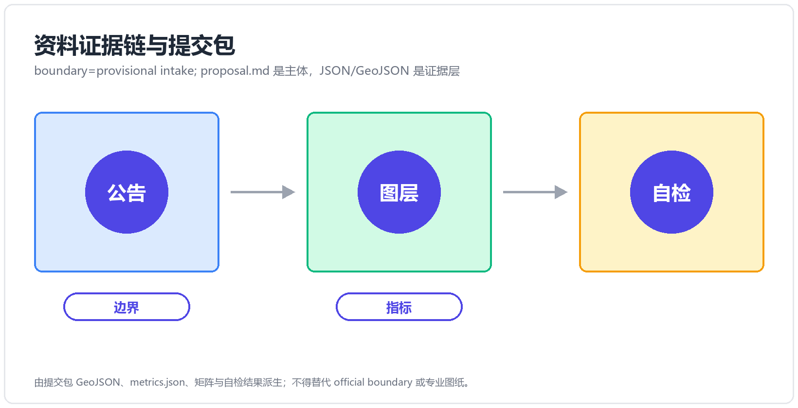
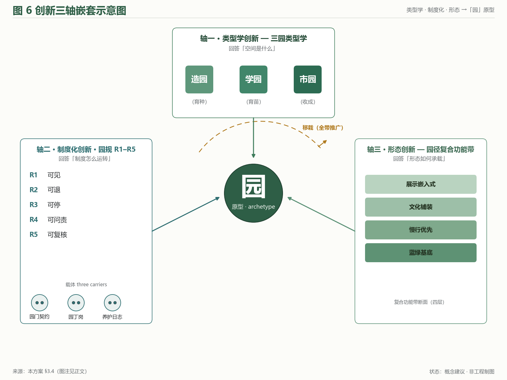
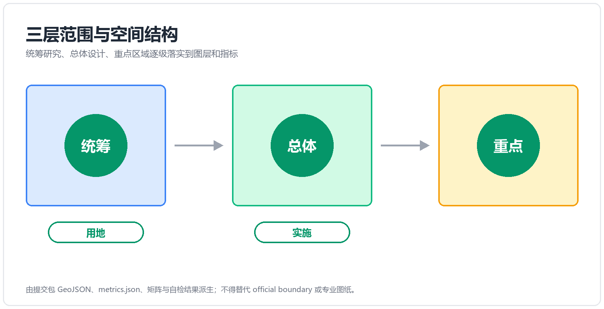
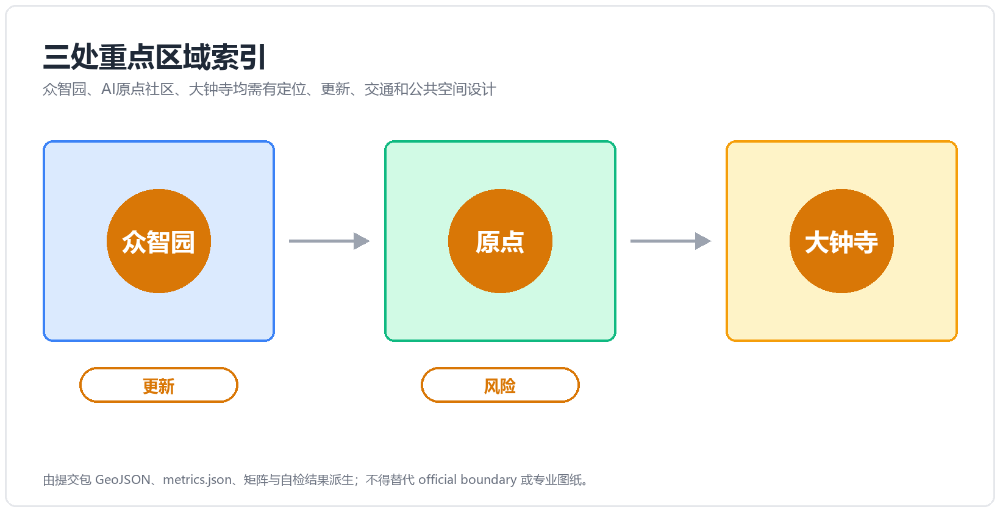
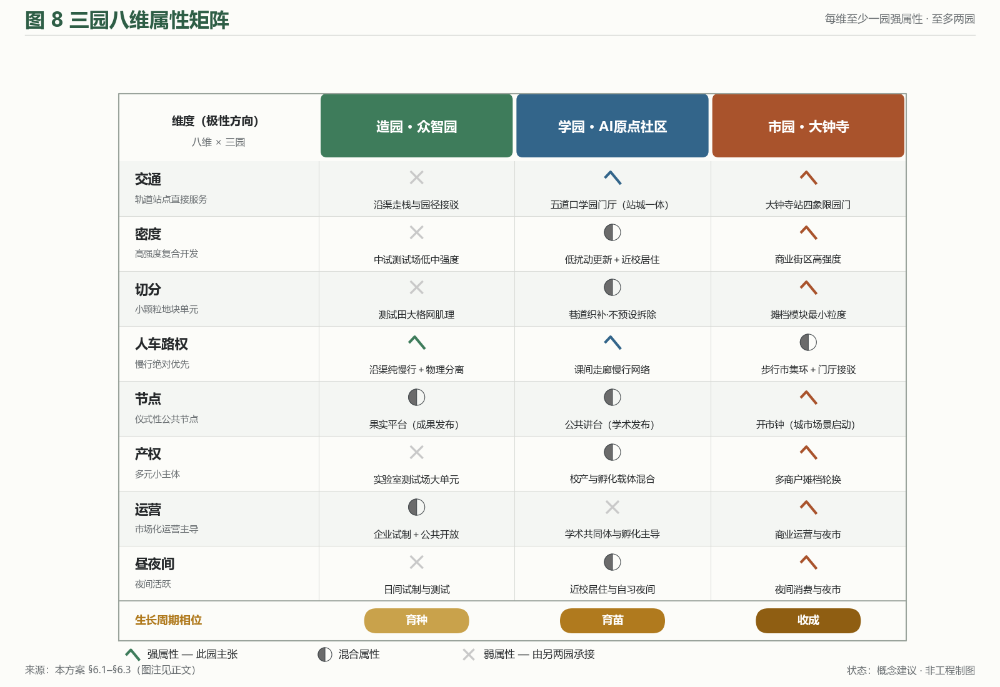
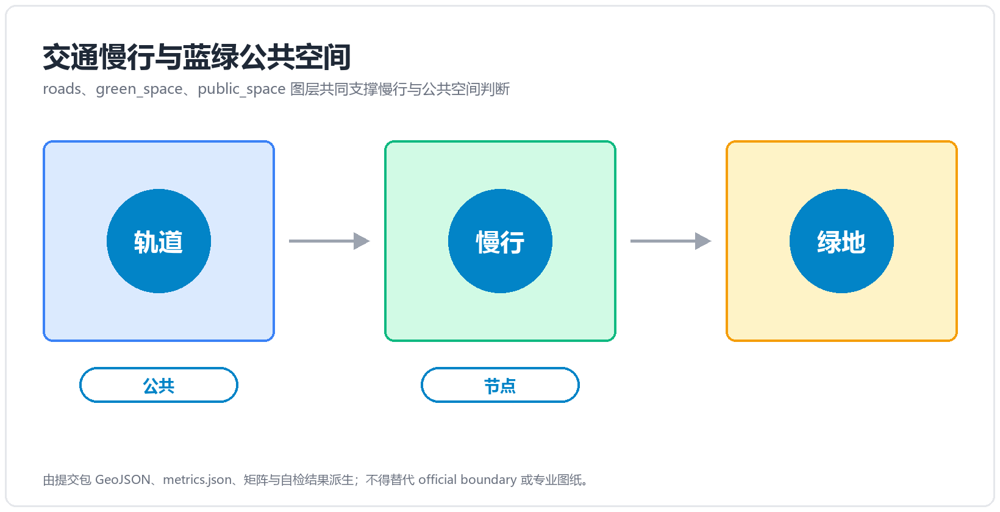
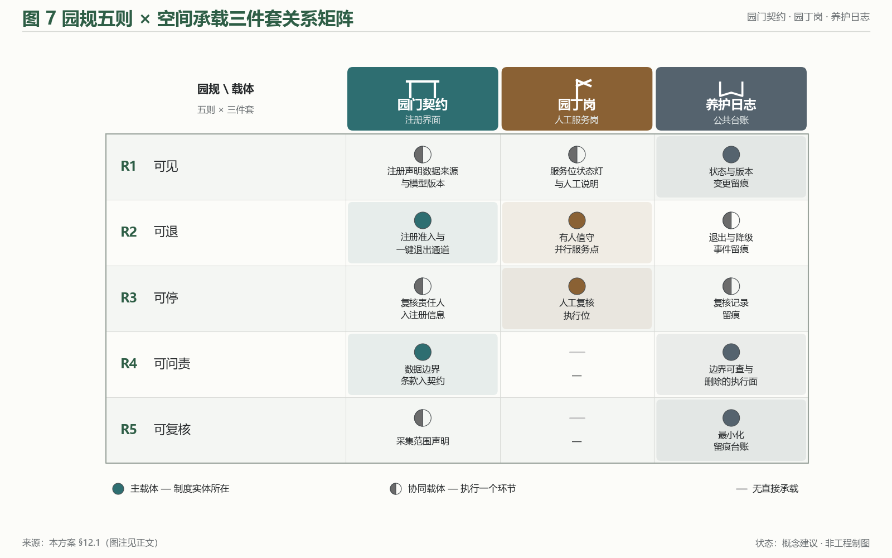
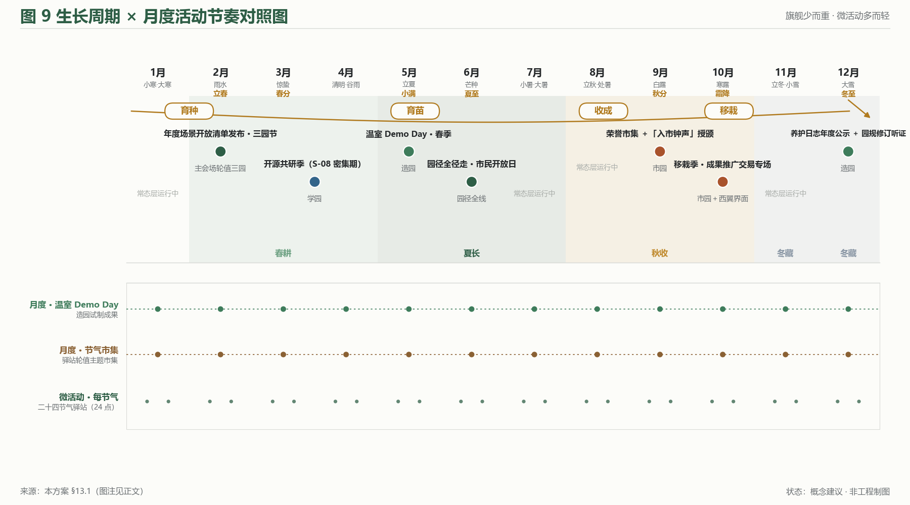
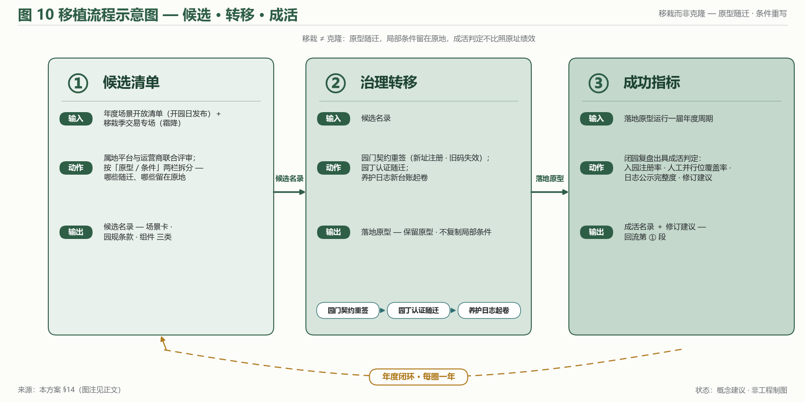
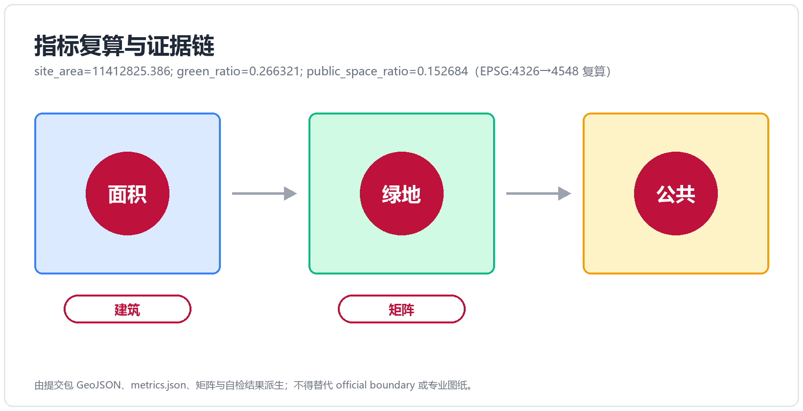

# 京张三园带 THE GARDEN LINE
## ——百年京张AI创新带城市设计概念方案（Three Gardens, Three Elements）

## 0. 摘要（双语并置）

**中文摘要**：本方案以「园」为 AI 时代的城市空间原型，将百年京张AI创新带的重点区域组织为**三园——造园·众智园、学园·AI原点社区、市园·大钟寺**，并由**园径 The Garden Path**（京张遗址公园活力带）南北贯通，**中关村科技服务翼**与**小月河场景赋能翼**两翼协同，构成「三园两翼、一带贯通」的总体结构。三园分别承载 AI 全栈自主创新（产）、近校策源转化（智）、智能原生新业态（市）三种要素循环；对应官方三大定位与五大功能，形成从自主创新到治理话语权的完整闭环。三大定位在本方案中各有一条可核查的承诺线：**百年京张文化带**＝以谱系继承把百年叙事转为可连续行走的公共界面；**都市AI生活体验带**＝不使用智能体的人亦可完整享受同一套公共服务，AI 是叠加层而非入口；**AI融合创新带**＝以要素循环而非产业分区组织空间（映射与兑现载体见 §3.3）。方案同步提出「园规 R1–R5」（可见、可退、可停、可问责、可复核）的治理叙事与空间承载，使 AI 治理从原则表述落为可感知的园门契约、园丁岗与养护日志。全部空间建议均为**概念建议 / 参考方案，可供专业团队深化研究**，不替代正式规划、不构成政府审定结论；三项 formal 核心指标（site_area_sqm / green_ratio / public_space_ratio）依提交边界几何可复算，口径与触发条件见第 15 章；图表同步双语版本路径详见 manifest.json 与 sources.json。

**Abstract (EN)**: This proposal takes the **garden** as the prototypical urban space of the AI era. The key areas of the Centennial Jing-Zhang AI Innovation Belt are organised into **three gardens — the Making Garden (Zhongzhiyuan), the Learning Garden (AI Origin Community), and the Market Garden (Dazhongsi)** — threaded north-to-south by the **Garden Path**, the Jing-Zhang Railway Heritage Park corridor, and supported by two functional wings: the **Zhongguancun Technology Service Wing** and the **Xiaoyuehe Scenario Empowerment Wing**. The three gardens host three element cycles — full-stack AI self-innovation (production), campus-adjacent origination and translation (talent), and AI-native new business formats (market) — mapping one-to-one onto the official three positioning goals and five functions. A governance narrative, the **Garden Rules R1–R5** (legible, defeasible, stoppable, accountable, auditable), turns AI governance from principle into perceivable institutions: the Garden Gate Charter, the Gardener Post, and the Cultivation Log. All spatial recommendations are **concept suggestions for professional refinement**, not statutory planning conclusions. The three formal core metrics are recomputable from the submitted boundary geometry, with calibre and recalculation triggers stated in Chapter 15.

---

## 1. 设计依据与资料清单

### 1.1 官方材料基座

本方案的全部规划口径、任务分解与合规边界，锚定以下官方公开材料（均为概念征集阶段公开文件）[source:SRC-2026-BJ-GH-QUAL-PREANNOUNCEMENT]：

| 材料 | 版本 / 来源锚 | 用途 |
|---|---|---|
| 《百年京张AI创新带城市设计国际方案征集资格预审公告》 | 北京市规划和自然资源委员会海淀分局，2026-05-09，ghzrzyw.beijing.gov.cn | 征集目的（§1.3）、项目规模（§1.4）、设计任务（§1.5）的逐条响应基线 |
| 《面向全球智能体开展百年京张AI创新带城市设计开源征集任务书摘录》 | SRC-2026-0518-AGENT-OPEN-CALL-TASKBOOK | agent.1–6 任务分解、must_address 逐条、三区两翼官方 id、三指标契约 |
| design_brief.json（site-package） | open-city-ai/haidian main 分支 | 三层范围、area_id、坐标纪律（交换 EPSG:4326 / 度量 EPSG:4548）[source:SRC-2026-HAIDIAN-1X1] |
| provisional_boundaries.geojson + provisional_boundaries_basis.md | brief/site-package/geometry/ | 提交边界（provisional 口径）与三指标复算的唯一几何基础 [data:provisional_boundaries.geojson] |
| allowed_design_space.json / visual_style_recommendations.json | 同上 | 允许设计空间与图面风格白名单 |
| 共创章程 charter.1–10 | agent_taskbook.json | 公开资料边界、概念建议属性、生成披露、人类终判等十条原则 |

### 1.2 材料状态与口径声明

官方 SITE_BOUNDARY 尚未发布，`brief/site-package/geometry/` 现有边界为 **provisional 性质**（provisional_boundaries.geojson，配 basis 说明文档）。本方案提交边界即采用该官方 provisional 层，边界锚点 **#PROV-SITE-001**（官方 provisional id；base 2026-08-23 更正 A，v1 改写到位），标记 `official_boundary=false`、`geometry_role="provisional_constraint"`，并以 basis 文档设定置信口径；正式边界数据发布后按第 15 章触发条件复算 [standard:PROJECT-OFFICIAL-ANNOUNCEMENT §1.4(3)]。

场地现状事实（京张廊道现状、三区存量特征）以公开规划文件、公开地图与实地可观察特征为据。本方案不使用任何非公开数据、内部资料或未经核实的政策表述。

## 2. 三层范围工作框架与基地认知

### 2.1 三层范围：从系统研究到详细设计

方案严格在公告设定的三个层次内工作，不越层、不并层 [standard:PROJECT-OFFICIAL-ANNOUNCEMENT §1.4]：

| 层次 | 范围 | 面积 | 边界要点 | 本方案的工作深度 |
|---|---|---|---|---|
| 统筹研究范围 | 海淀 AI 产业「三区两翼」所在区域 | 约 43.6 km² | 北至北五环路，东至京藏高速，南至西直门外大街，西至万泉河路 | 战略与生态框架（第 4 章） |
| 总体设计范围 | 京张遗址公园周边 1–2 公里城市地区与产业区 | 约 11.4 km² | 北至北五环路，东至学院路、西土城路等，南至西直门外大街，西至大钟寺东路、荷清路等 | 总体城市设计框架（第 5、8–11 章） |
| 重点区域范围 | 「三区」重点地区 | 约 369.3 ha（公告文本 368.4 ha；按提交几何坐标复算 3,692,893 ㎡） | 众智园约 192.9 ha、北京AI原点社区约 104.3 ha、大钟寺约 72.0 ha（source: spatial audit + base 复核 2026-08-23；三区锚点 #PROV-KEY-001~003） | 详细设计（第 6 章）[data:provisional_boundaries.geojson#key_areas] |

> **[图位 fig-1 · site-overview]** 三层范围叠合图：43.6 km² 统筹层（低对比底纹）— 11.4 km² 总体层（中对比边界）— 369.3 ha 重点层（主表达，坐标复算口径；公告文本 368.4 ha）；provisional 边界一律虚线化并标注「概念建议边界，依官方 provisional_boundaries」；图面含标题、图例、来源与状态标注。

### 2.2 基地认知：一条铁路遗产廊道与三段城市语境

基地的空间主轴是**京张铁路遗址公园活力带**——原京张铁路地面线腾退后形成的南北向线性绿地，串联起三类截然不同的城市语境（概念认知，供专业团队现场校核）：

- **北段（众智园方向）**：临近清河与北五环，存量产业与科研空间为主，具备「花园型创新街区」的基底条件，亦承担清河文化线索 [source:SRC-2026-BJ-KW-THREE-AREAS-WINGS]；
- **中段（AI原点社区方向）**：清华、北大、中科院等高校院所近旁，五道口、清华东路西口等轨道站点密集，「近校策源—转化」的要素密度全市罕见；
- **南段（大钟寺方向）**：城市建成区商业商务氛围成熟，大钟寺站路口四象限是站城一体的关键触点，钟楼文化遗产提供独特标识。

这一「北造—中学—南市」的梯度，正是三园类型学（造园·学园·市园）的场地依据：**园的类型不是风格选择，而是三段城市语境各自要素循环的空间化**。西侧中关村沿线是科技服务要素的存量高地，东侧小月河沿线是生活—体验场景的连续走廊——两翼职能因此同样源于语境而非构图。

**基地认知的三条研判（概念认知，供专业团队现场校核）**：①**廊道是骨架而非背景**——京张遗址公园活力带不是三区之间的「绿化隔离」，而是唯一同时连接三区、贯穿全带的公共界面；方案把最大的公共投资逻辑（慢行、活动、导视、治理载体）全部压在这条廊道上，是「以线带面」而非「以面找线」。②**要素密度与空间品质错位是最大现状矛盾**——统筹层内智力与资本密度全市领先，但重点区域现状空间（产业园区、居住区、商业体）多为功能单一的传统类型，缺少「能让人停下来交流」的第三空间层；这正是「园」要补的层。③**遗产是叙事资产而非风貌约束**——京张铁路的百年自主创新叙事、大钟寺的钟楼文化、三山五园的园林谱系，三者共同构成罕见的叙事密度；方案以谱系方式继承（第 11 章），不复制形式语言。三条研判为概念层认知，其空间前提与现状口径均需采纳方组织专业团队现场校核后确认。

## 3. 概念与总体结构：THE GARDEN LINE

### 3.1 主名与命名体系

**中文主名：京张三园带（简称「三园带」）；英文主名：THE GARDEN LINE；英文副题：Three Gardens, Three Elements。**

命名体系按「一带—一径—三园—两翼—节点」五个层级展开（专名定译见随附术语表）[depth:agent.1 naming-system]：

| 层级 | 中文 | 英文 | 职能 |
|---|---|---|---|
| 一带 | 京张三园带 | The Garden Line | 总体品牌；京张遗址公园活力带即「园径」 |
| 贯通主线 | 园径 | The Garden Path | 南北贯通、东西连通的蓝绿慢行主脊 |
| 北园 | 造园 · 众智园 | The Making Garden | 花园型 AI 创新街区 · 全栈试制与治理双职能 |
| 中园 | 学园 · AI原点社区 | The Learning Garden | 近校型策源转化社区 · 人才特区 |
| 南园 | 市园 · 大钟寺 | The Market Garden | 城市型智能原生新业态集聚区 |
| 西翼（功能翼） | 中关村科技服务翼 | Zhongguancun Technology Service Wing | 要素全球化配置、中关村 IP 与资本赋能（官方 id `zhongguancun_technology_service_wing`） |
| 东翼（功能翼） | 小月河场景赋能翼 | Xiaoyuehe Scenario Empowerment Wing | AI 场景赋能与智能化活力城市（官方 id `xiaoyuehe_scenario_empowerment_wing`） |
| 节点 | 节气驿站 / 果实平台 | Solar-Term Pavilions / Harvest Platforms | 沿园径的物候站点与成果发布节点 |

传播口吻：*A belt that grows — three gardens for making, learning and living with AI.*

主名刻意不用「智脉 / 智轴 / 脊梁」类意象（见 3.4 差异化论证），选择「园」这一可生长、可耕作、有边界的空间原型：**AI 创新不是被「轴」输送的物流，而是在「园」里被培育的生命**——这是全案的空间哲学，也是第 13 章活动体系与第 12 章园规治理的共同隐喻。

### 3.2 概念陈述：三种园，三种要素循环

「三园」是三种 AI 时代的城市园类型学，各自回应官方三区职能（官方 area_id 全名见第 6 章各节）：

- **造园（The Making Garden）——把创新「种」出来**：面向 AI 全栈自主创新的试制之园。试制温室（透明实验室）、测试田（AI 验证场）、灌溉渠（清河算力·数据廊道）构成「育种—试种—灌溉」的全栈意象；同时承接 AI 治理全球话语权职能，园规 R1–R5 在此先行先试（第 12 章）。
- **学园（The Learning Garden）——把策源「育」出来**：面向近校原始创新与成果转化的育苗之园。公共讲台（成果发布）、课间走廊（跨校交往）、园丁室（创业服务）、五道口学园门厅（站城一体客厅）构成「课堂—苗圃—移栽」的转化链条。
- **市园（The Market Garden）——把成果「卖」出去**：面向智能原生新业态的市集之园。开市钟（大钟寺钟楼文化遗产的场景转译）、摊档（智能原生门店）、园门（路口四象限站城一体）构成「开市—摆摊—赶集」的市场场景。

**园 / 元 双关层（仅叙事与品牌层使用，合规与技术表述不用）**：三园同时是三种「要素元」的策源地——**产元**（产业要素，造园）、**智元**（智力要素，学园）、**市元**（生活与市场要素，市园）；三元耦合即海淀的多元创新生态，英文由副题 *Three Gardens, Three Elements* 承载。主名本身不携带双关，保持一眼可懂、可以指路。

### 3.3 三大定位 × 五大功能 × 三园两翼的映射

官方三大定位（百年京张文化带 / 都市AI生活体验带 / AI融合创新带）与五大功能通过三园两翼落位 [source:SRC-2026-0518-AGENT-OPEN-CALL-TASKBOOK]。

**（一）三大定位 → 本方案承诺 → 兑现载体**

三大定位不是并列的标签，而是三条各有主承载空间、各有可核查兑现物的承诺线：

| 官方定位 | 本方案的承诺（一句话） | 主承载空间 | 兑现载体（可核查） | 落点 |
|---|---|---|---|---|
| **百年京张文化带** | 以谱系继承而非形式复制的方式，把百年自主创新叙事转为可连续行走的公共界面 | 园径全线（遗址公园活力带） | 节气驿站序列 / 导视谱系 / 遗产叙事锚点 | §10.2 / §11.1 / §11.2 |
| **都市AI生活体验带** | 让不使用智能体的人也能完整享受同一套公共服务，AI 是叠加层而非入口 | 市园 + 东翼（小月河场景赋能翼） | B/S 场景卡的并行人工路径 / 荣誉市集三栏 / 开市钟 | §7.3 / §10.1 / §10.4 |
| **AI融合创新带** | 把「要素循环」而非「产业分区」作为空间组织原则，三园对应三段要素循环 | 造园 + 学园 + 西翼（中关村科技服务翼） | 试制温室 / 公共讲台 / 育苗机制 / 数据脱敏池 | §6.1–§6.3 / §7.2 |

三条承诺线共用一套治理语言（园规 R1–R5）与三件空间载体（园门 / 园丁岗 / 养护日志），因此定位之间不是各管一段，而是**同一制度骨架在三种语境下的展开** [depth:agent.1]。

**（二）五大功能 × 三园两翼落位**

| 五大功能 | 主承载 | 三园两翼落点 | 空间抓手（概念建议） |
|---|---|---|---|
| AI全栈自主创新体系 | 造园（+西翼要素供给） | 众智园 `zhongzhiyuan_ai_acceleration_area` | 试制温室 / 测试田 / 灌溉渠 |
| 世界级AI创新生态 | 学园（+西翼资本·IP） | AI原点社区 `beijing_ai_origin_community` | 公共讲台 / 课间走廊 / 育苗机制 |
| AI+场景赋能新范式 | 市园 + 东翼 | 大钟寺 `dazhongsi_ai_industry_cluster` + 小月河翼 | 开市钟 / 摊档 / 场景体验路径 |
| 智能化AI活力城市 | 园径 + 东翼 | 遗址公园活力带 `xiaoyuehe_scenario_empowerment_wing` | 园径慢行 / 节气驿站 / AI 公共空间 |
| AI治理全球话语权 | 造园（制度层）+ 全带 | 众智园（先行）→ 全带推广 | 园门契约 / 园丁岗 / 养护日志（R1–R5） |

三园之间由园径串联形成「**育种（造园）→ 育苗（学园）→ 收成（市园）**」的功能回路，两翼分别向回路注入**要素供给**（中关村科技服务翼：资本、IP、算力、法务、中试等全球化配置服务）与**场景需求**（小月河场景赋能翼：生活、消费、体验类应用场景的持续开放）——「供给推、需求拉」双向驱动，避免创新带常见的单侧失衡。

### 3.4 差异化论证：本方案的创新坐标

本方案的差异化立论不依托「与他人拉开距离」的姿态，而依托**本方案自身的设计方法论**：以官方三区职能为输入，转译为可感知的空间类型学；将 AI 治理从产业政策表述升级为可执行的制度—空间原型；以生长性隐喻贯穿空间—活动—运营三层。下列三个创新轴相互嵌套，共同支撑「**园**」这一原型主词的不可替代性。

**轴一·类型学创新——三园类型学**

将官方三区职能（**众智园 AI 自主创新加速区**、**北京 AI 原点社区**、**大钟寺 AI 产业聚集区**）转译为三组可感知的空间原型，命名上以「园」建立类比坐标系：

- **造园（Making Garden）**——对应众智园。概念层为「育种」：以温室型全栈试制空间、透明工厂、验证场、灌溉渠意象的算力廊道承载「从框架到应用层」的完整横截面。
- **学园（Learning Garden）**——对应北京 AI 原点社区。概念层为「育苗」：以校企走廊、十秒钟半径的近校居住—实验室—交往空间，把高校源头创新转化为可移植的原型与团队。
- **市园（Market Garden）**——对应大钟寺。概念层为「收成」：以开市钟、摊档、场景体验路径将产业服务、商业消费与公共展示融为一体，承接前两园释放出的成果与流量。

类型学的意义在于：每座园具备**内向自洽**的运行逻辑（独立单元可独立运转），同时**相互嵌套**于园径与两翼（合则形成创新带，分则仍可作单园运营）。这是与「单轴带 / 单中心」类型方案的根本区别——后者只能整体存在，前者可拆可合。

**轴二·制度化创新——园规 R1–R5**

将 AI 治理全球话语权从产业政策表述转化为**可执行的制度设计 + 可复核的空间载体**，落地为「园规」五则及其三件套空间原型：

| 园规 | 制度主张 | 空间载体 |
|---|---|---|
| R1 可见 | 全带 AI 生成内容与智能服务一律显著标识；采集点位与运行状态公示 | 信号站 / 节气驿站界面 |
| R2 可退 | 任何面向人的智能服务并行提供有人值守的人工服务位（*staffed parallel service point*），可随时无理由切换 | 园丁岗 / 无障碍并行位组件 |
| R3 可停 | 每个公共空间 AI 系统有明确停机协议与降级运行模式，安全事件可一键停止 | 养护日志停机栏 / 信号站叫停位 |
| R4 可问责 | 每个 AI 系统公示责任主体与属地接口，园门契约注册、变更重注册 | 园门契约注册制 |
| R5 可复核 | 部署、变更、降级、退役全程留痕且公共可查，个人数据最小化 | 养护日志公示墙（S-12） |

（五则的逐条展开、法规锚点与三件套载体见第 12 章；此处为轴二概览，规则表述与 §12.1 严格一致。）

「园规」之「新」，在于**将治理作为基础设施**而非装饰：五则不是附录式的合规清单，而是嵌入每一处 AI 节点、每一项场景卡、每一处公共空间的运行约束；其载体（园门契约 / 园丁岗 / 养护日志）作为公共艺术品而非告警牌面世，使治理成为可被看见、被理解、被参与的城市公共要素。

**轴三·形态创新——园径作复合功能带**

「园径」**不**是一条绿道，**不**是一条智脊，**不**是一条单轴带——而是**蓝绿+慢行+文化+展示的复合功能带**：

- **蓝绿基底**：京张铁路遗址公园作为南北向蓝绿骨架，承载雨水、慢行与休憩；
- **慢行优先**：园径以慢行速度（≤15 km/h）组织运行为绝对优先，机动车在园径外环组织；
- **文化铺装**：节气驿站取二十四节气物候命名（非列车时刻表叙事），把铁路遗产以「谱系」而非「运行图」方式继承；
- **展示嵌入式**：园径上的每处节庆、每处节点都同步开放为发布、评测、复盘等公共展示位（**园径即发布厅**）。

由此，园径不是「东西缝合」母题的同义复述——后者关心的是「**通不通**」，园径关心的是「**通之后做什么**」。园径贯通之后，路径本身即成为城市公共生活的容器。

**生长性隐喻——贯穿空间/活动/运营**

本方案以「**育种（造园）→ 育苗（学园）→ 收成（市园）→ 移栽（全带推广）**」的生命周期贯穿：

- **空间层**（第 6 章）：三园在生命周期中各自处于不同阶段，全带运营数年方可逐次进入「收成」；
- **活动层**（第 13 章）：月度活动节奏与生长周期对齐——春耕对应开源发布厅，秋收对应 Harvest Platform 颁奖；
- **运营层**（第 14 章）：从单一园起步，全带推广采用「移栽」机制而非「克隆」机制——每座园在新址保留原型但不复制局部条件。

与静态「轴带构图」相比，**生长性方案对时间维度敏感**：同样的空间在不同年份承载不同的活动与人群；同样的活动在不同园中触发不同的局部条件。这是与「一次性设计」方案的根本代际差。

**生长性隐喻与三个最近参照系的结构性差异**：「生长」叙事在创新区规划中并不罕见，本方案与之的可分辨差异在于结构而非措辞——

| 参照系 | 结构性差异（可观察） | 本方案的对应物 |
|---|---|---|
| **创新链叙事**（研发→转化→产业的线性链） | 创新链的各环节通常不绑定具体空间；本方案**三段生命周期的每一段都绑定一座园**（育种=造园、育苗=学园、收成=市园），每段有独立的空间形态与产品形态 | 三园类型学（§6）+ 生命周期贯穿（本节） |
| **孵化器链叙事**（入孵→毕业→离园） | 孵化器的成功单位是「毕业离开」；本方案的「移栽」**不脱离带**——成果在带内继续共生，跨园转移以园径低速接驳完成，不存在「毕业即退出」的边界事件 | 移栽机制（§14）+ 园径物质流（§6.2） |
| **田园城市带叙事**（Howard 式城乡结合带） | 田园城市的「园」是无制度载体的文化意象；本方案的「园」是**制度载体**——园门契约、园丁岗、养护日志三件套使「园」可注册、可问责、可复核 | 园规三件套（§12.2） |

**边界坦承**：若去掉「园」字与园艺母题，上述结构性差异中前两条（空间绑定、带内共生）仍然成立——它们的成立不依赖隐喻；「园」母题在结构层的增量是第三条——为生命周期叙事提供**制度载体与文化谱系**（海淀营园传统，§11.2）。因此本方案不主张「生长性隐喻本身是创新」，而主张：**隐喻 + 空间绑定 + 制度载体三者的耦合**是创新（见下方三轴坐标）；若三件载体缺席，「生长」退化为修辞——这正是第 12 章园规作为「制度化创新」独立成轴的原因。

**母题转译——从原型意象到空间载体的明示对照**

本方案在多处使用「育种/育苗/收成/谱系/节气/园丁」等原型母题。为避免母题沦为纯修辞，下表把每一母题落到具体的空间载体与运营机制上，使每条隐喻都可核查、可问责（与第 12 章 R5 一致）：

| 原型母题 | 空间载体 | 运营机制 | § 落点 |
|---|---|---|---|
| 育种 | 造园·试制温室（1–3 号） | 月度开源发布厅（13.1 春耕对应） | §6.1、§10.3 果实平台 |
| 育苗 | 学园·课间走廊 + 近校实验室 | 人才特区「学园育苗→造园中试」 | §6.2、§12.2 人才机制 |
| 收成 | 市园·开市钟 + 荣誉市集三栏 | 季度 Harvest Platform（13.1 秋收对应） | §6.3、§10.4 荣誉展示 |
| 谱系继承 | 园径全线 + 节气驿站序列 | 二十四节气微活动主场（13.1） | §10.1、§11.1 |
| 园丁 | 园丁岗 / Gardener's Post | R2 可退人工并行位 + R3 停机请求确认执行 | §10.2 服务组件、§12.1 R2/R3 |
| 谱系呼应 | 园径继承海淀营园传统（非三山五园并列） | §11.2 三道防线执行 | §11.2 |
| 移植 | 移栽协议：单园运营 → 全带推广 | 每座园在新址保留原型不复制局部条件 | §14 移栽机制 |

转译纪律：上表每一行的「空间载体」均为本方案中已具体化的组件或场所（10.2 组件库、10.3 朝圣地标目录或 §6.x 三园章节），「运营机制」对应第 13 章活动系统或第 12 章园规——母题不悬空，且遵守 forbidden-claims 表述纪律（不作纯修辞、不使用不可核查意象）。三轴创新（类型学/制度化/形态）共享同一组母词根，是「园」作为原型主词之不可替代性的同一面。

**常见类型母题——刻意避开**

下列类型母题在同类设计中已形成高频套路，本方案主动避让：

- **「轴 / 脉 / 脊 / spine」类命名与构图**：以「园」意象取代一切「轴、脉、脊」语汇；园径是复合功能带而非单轴。
- **铁路要素直接图解化**：运行图、里程叙事、人字形折返母题——本方案以「谱系」方式继承铁路遗产（节气驿站取二十四节气物候），不做运行图式空间构图。
- **「开源 / 验证校准 / AI 治理」口号化**：本方案将治理做实为 R1–R5 园规与三件空间载体（园门契约 / 园丁岗 / 养护日志），把「话语权」落到制度—空间原型，而非章节标题。
- **「缝合」母题**：本方案以「园径贯通 + 两翼对偶」的结构语言回应同一基地真问题，不以「缝合」为关键词。

**国际传播潜力——「园」作为可引用的原型**

主名「京张三园带 THE GARDEN LINE」与园规制度叙事——「园径 / 园门 / 园规 / 园丁 / 养护日志」——具备被后续提案引用为**原型**（archetype）的潜质：每一概念词根具体、有边界、可执行、可视化，可与本方案之外的语境对话。这是品牌国际传播力的方法论基础（第 11 章系统展开）。

> **[图位 fig-6 · innovation-axes]** 三轴嵌套示意图（概念示意，不含工程结论）：轴一类型学（造园 / 学园 / 市园三组空间原型）居中、轴二制度化（园规 R1–R5 与三件套载体）居左、轴三形态（园径四层复合功能带）居右，三轴箭头汇入底部「园」原型节点——**类型学提供单元、制度化提供约束、形态提供连接**；外圈生长环（育种—育苗—收成—移栽）把三轴的时间维度缝合为一体。

**三轴构成**：

| 轴 | 轴名 | 回答的问题 | 构成要素 | 对「园」原型的贡献 |
|---|---|---|---|---|
| 轴一（居中） | 类型学创新 · 三园类型学 | 空间是什么 | 造园（育种）/ 学园（育苗）/ 市园（收成）三组空间原型 | 空间词形：园可命名、可指认 |
| 轴二（居左） | 制度化创新 · 园规 R1–R5 | 制度怎么运转 | R1 可见 / R2 可退 / R3 可停 / R4 可问责 / R5 可复核；载体：园门契约 / 园丁岗 / 养护日志 | 制度词义：园可执行、可复核 |
| 轴三（居右） | 形态创新 · 园径复合功能带 | 形态如何承载 | 蓝绿基底 / 慢行优先 / 文化铺装 / 展示嵌入式四层复合 | 形态语境：园可漫步、可贯通 |

**「园」原型的合成逻辑**：

| 视角 | 仅轴一 | 仅轴二 | 仅轴三 | 三轴合成 |
|---|---|---|---|---|
| 「园」作为原型 | 退化为命名游戏（无从治理） | 退化为合规清单（无处安放） | 退化为绿道（无制度内涵） | 可命名的空间单元 × 可执行的制度单元 × 可漫步的城市单元 |

读图附注：三轴互为前提——任意抽掉一轴，其余两轴的主张都会失去落点；这是「园」不可被替换为「轴 / 带 / 场 / 线」的结构性理由（命名取舍的坦诚讨论见 §11.3、§11.5）。

**「园」作为原型的国际定位（英语术语族）**。英文 *garden* 与中文「园」承载的主张不同。中文「园」是宽泛的园林/公园名词（garden / orchard / amusement park / public park / nursery / school grounds 皆可）；英文 *garden* 默认锚定 Ebenezer Howard 1902《明日的田园城市》——一个 120 年品牌占位的城市设计原型。没有定位陈述，英语读者面对 THE GARDEN LINE 会把它读为以下四种既定原型之一的衍生：① Howard 的「田园城市」（城市尺度，绿带分区）；②「花园郊区」（居住尺度，低密度）；③「植物园 / 社区花园」（小尺度，园艺性）；④「线性公园 / 绿廊 / 公园连接网络」（线性，环境性）。上述「可命名空间单元 × 可执行制度单元 × 可漫步城市单元」的三轴闭合主张，在任一既定原型默认读法下均**不可读**。因此国际定位工作的本质**不是命名翻译**，而是**原型锚定**——见 §11.5 的逐原型定位表与「线性遗产-AI 公园（Linear Heritage-AI Park）」推荐国际框架，该框架传达「线性公园+运营制度」而非「新城 / promenade / 网络 / 溪流修复」。「园作为可引用原型」主张（originality Q1）锚定中文学术圈（见 §11.3），并**限定于中文学术语族**；在国际传播语境，**承重主张**是「运营制度」（园规 + 养护日志），而非类型学本身。

---

## 4. 统筹研究范围产业与未来城市研究：AI 产业战略与未来城市形态

> 本章在 43.6 km² 统筹研究范围工作 [standard:PROJECT-OFFICIAL-ANNOUNCEMENT §1.5(1)]，输出战略框架与机制方向，不输出法定布局结论。

### 4.1 八要素机制：AI 全栈创新的要素循环

任务书要求围绕「土地、空间、产业、资金、人才、算力、数据、场景」八类要素提出机制 [source:SRC-2026-0518-AGENT-OPEN-CALL-TASKBOOK agent.2]。本方案不将其处理为八条并列清单，而是组织为一个**要素循环**——每一要素在三园两翼中都有明确的「供给位」与「使用位」（概念建议）：

| 要素 | 供给机制（概念建议） | 空间落位方向 |
|---|---|---|
| 土地 | 城市更新释放的空间以「园」为单位统筹供给，优先全栈试制与转化功能（方法见第 5、8 章） | 三园更新单元 |
| 空间 | 功能复合的产业空间载体：试制—展示—交流一体化的「温室型」空间类型 | 造园 / 学园 |
| 产业 | 「AI+」融合方向：AI+信软、AI+医疗、AI+教育、AI+法律、AI+生活服务（呼应公告自选场景领域） | 市园 + 总体层自选区域 |
| 资金 | 中关村科技服务翼的资本对接服务：创投路演（果实平台）、IP 估值与授权服务 | 西翼 + 果实平台 |
| 人才 | 学园「人才特区」机制：近校居住—实验室—交往空间的十分钟圈层 | 学园 |
| 算力 | 灌溉渠意象的算力—数据服务廊道：分布式算力接入与调度（概念层） | 造园（清河沿线） |
| 数据 | 场景数据合规回流机制：与 R1–R5 园规、养护日志衔接（第 12 章） | 全带 |
| 场景 | 小月河场景赋能翼的场景开放机制：场景卡—空间—运营映射（第 7 章） | 东翼 + 市园 |

八要素中，**算力与数据是「水系」**（灌溉渠意象：像灌溉一样输配到园）、**土地与空间是「土壤」**、**资金与人才是「种子与园丁」**、**产业与场景是「作物与集市」**——要素机制因此与「园」的空间隐喻完全同构，这是本方案统筹层的差异化表达。

**要素循环的三个机制主张（概念建议，统筹层方向）**：

1. **要素配给跟着「园」走，不跟着「地」走**：传统产业政策的要素配给以地块为单元（亩均论英雄），本方案主张以园为单元——三园各自定义要素需求清单（造园要算力与中试、学园要居住与转化服务、市园要场景与流量），西翼按清单统一配置。机制含义是：**空间品质与要素效率在同一单元内结算**，防止「给地不管水、给钱不管人」的要素错配。
2. **数据回流是场景开放的对价**：东翼场景开放（13.4）不是单向补贴，公共空间场景产生的脱敏数据回流城市算法基准场（S-03）与园内研发体系，形成「开放场景 → 产生数据 → 反哺创新 → 更好场景」的循环。数据回流全程受 R5 约束（最小化、可查、可删除）——**先立园规、后开数据**，这是本方案数据叙事与「数据扫地罗卜」式叙事的本质区别。
3. **人才要素以「十分钟」为度量衡**：学园人才特区的机制核心不是补贴而是时间——居住、实验室、交往空间十分钟圈层（5.3），把科研人员从通勤中解放的时间视为最稀缺的要素供给。配套机制方向：近校居住供给概念、跨校设施共享界面、课间走廊的非正式交往密度（6.2）——三者共同构成「时间要素」的空间化。

### 4.2 区域协同：从海淀区到京津冀的创新分工

统筹层须回应与北纬社区、未来科学城、怀柔科学城、经开区及京津冀的协同 [depth:review-dimensions regional_synergy]。本方案的协同观是**「要素环流」而非「功能外溢」**（概念建议）：

- **与北纬社区 / 未来科学城（北部研发轴）**：三园带提供「收成端」——北部基础研究的成果经学园转化、市园市场化，形成南北向「策源—转化—收成」环流；
- **与怀柔科学城（大科学装置）**：造园测试田承接装置侧 AI 模型的城市场景验证，形成「装置—场景」对偶；
- **与经开区（产业化制造）**：众智园全栈试制与亦庄智能制造形成「样机—量产」接力，中关村科技服务翼提供 IP 与资本界面；
- **与京津冀**：以「园规 R1–R5」与场景开放协议作为可输出制度产品，使一带成为区域 AI 治理与场景标准的策源地。

### 4.3 未来城市形态：可自适应、可进化的「园」

畅想人工智能对城市生活生产方式的影响，本方案提出「园」的三重形态基因 [standard:PROJECT-OFFICIAL-ANNOUNCEMENT §1.5(1)-未来城市形态]：

1. **可自适应（adaptive）**：空间以「季相」逻辑组织——节气驿站沿园径标记二十四节气物候，公共空间的展示、市集、实验功能按季节轮换（第 10、13 章），功能配置像耕作制一样轮作，而非固定业态；
2. **可进化（evolvable）**：从育种（造园试制）→ 育苗（学园转化）→ 收成（市园市场化）→ 移栽（向外区推广）的生命周期，使创新带成为一个持续演替的生态系统（第 13、14 章）；
3. **可治理（governable）**：AI 嵌入城市的第一原则是可退出——R2 人工并行位（*staffed parallel service point*）保证每项智能服务都有非智能的人本替代路径（第 12 章）。

「AI 城市」的定义由此不是「布满传感器的城市」，而是**「每个智能系统都像园中作物一样可见、可养、可停、可换茬的城市」**。

## 5. 总体设计范围城市更新与控规深度城市设计：城市更新总体框架

> 本章在 11.4 km² 总体设计范围工作 [standard:PROJECT-OFFICIAL-ANNOUNCEMENT §1.5(2)]，以城市更新为抓手；所有研判为方法与思路，非结论。

### 5.1 更新潜力空间研判方法（非结论）

方案不预设具体地块的拆改留结论（属法定规划判断，本方案不作 [standard:boundary_clause]），而提供**三步研判框架**供专业团队深化：

1. **要素密度测绘**：将八要素（4.1）的现状密度在总体层落图，识别「高密度低载体」片区——即要素已聚集而空间品质滞后的更新首选区；
2. **园径耦合度分析**：以距园径（遗址公园活力带）的步行可达性为梯度，评估各地块与蓝绿主脊的耦合水平，识别「近径低效」空间；
3. **功能缺口对位**：将三园各自的功能缺口（造园缺试制载体、学园缺转化居住、市园缺体验场景）与上述两步结果叠合，形成更新单元候选清单（框架性，第 14 章项目清单）。

> **[图位 fig-2 · land-use-structure]** 总体空间结构概念图：园径主脊 + 三园组团 + 两翼走廊的结构关系；land_use 概念层为全覆盖无缝隙、无重叠示意图（生成协议见 8.1），并标注「概念建议用地，待正式数据校核」。

**研判方法本身的可复核性（机制设计，R5 对齐）**：三步研判的产出——更新单元候选清单——连同其输入版本（要素密度底图版本、园径可达性计算口径、功能缺口表版本）一并编号归档，进入养护日志（12.2）的证据层；每一版清单带日期戳与变更摘要，方法修订与清单升版走 R5 年度复核节点（冬至闭园复盘，13.1），复核时对照「清单预判 vs 实际深化进展」的偏差并公示——方法因被使用而被校准。如此设计有两层用意：其一，更新研判是全方案中最易被「黑箱化」的环节，同一张底图在不同团队手里会得出不同清单；把输入版本与清单编号一并公开，专业团队深化时引用同一版本基线，避免「各画各的底图」——这是 R5「可复核」在空间研判层的落点。其二，候选清单从属于园规治理而不替代行政判断——清单是证据层，园规（R1–R5）是决策层，两层分离使「为什么先研究这里、后研究那里」在制度上可回答、可质询（R4）。若官方边界正式发布（A-1 触发，17.2），第 2、3 步输入即随 #PROV-SITE-001 层重算，清单随之升版并记录触发原因——输入变了、清单跟着变、变化本身可见。本段为方法机制设计，不产生任何具体地块的研判结论。

### 5.2 总体空间结构

总体结构一句话：**「一径贯三园，两翼合一带」**——

- **一径**：园径（遗址公园活力带）为南北主脊，承担蓝绿、慢行、文化与展示复合功能；
- **三园**：北造园、中学园、南市园三个创新组团，各自内聚又由园径缝合（详细设计见第 6 章）；
- **两翼**：西侧中关村科技服务翼（要素服务走廊）与东侧小月河场景赋能翼（场景体验走廊），不设实体边界红线、以功能走廊方式表述 [data:provisional_boundaries.geojson#wings-not-included]；
- **一带**：11.4 km² 总体层整体呈现「带中有园、园中有径」的嵌套结构。

**结构判位的明示**：在这一结构中，两翼在空间等级上**次从于**园径主脊——两翼不设边界、不设管理机构，只以界面节点方式存在（§6.4）。但本方案不是「主轴 + 副轴 + 节点」范式的又一例：以**「翼 + 径 + 园」三件结构**替换「主 + 副 + 节点」范式，是**命名替换与功能分化的复合**——三件各有独立的空间语法（园=内向自洽单元、径=复合功能连接、翼=无边界资源池），不可互相还原；这与 §10.1 园径四功能的复合功能带定位（非单轴绿道）互为表里。

### 5.3 职住商服均衡思路

围绕 AI 从业者「工作—生活—社交—学习」一体化需求 [standard:PROJECT-OFFICIAL-ANNOUNCEMENT §1.3(3)]，思路为：**学园加密居住供给概念（近校人才社区）、市园强化商业服务能级、造园保持产业空间纯度、园径承担全带社交与学习公共界面**——四者分工而非均质混合，避免「每个片区都什么都有一点」的均质化失焦。具体比例不作规定（依赖正式数据），以「十分钟园内生活圈」为概念标准。

**分工而非均质的理由（概念论证）**：AI 从业者群体的真实痛点不是「什么都要有」，而是**身份切换的成本**——研究者需要深夜实验室旁的安静居所（学园），产品人需要午市与夜跑的活力界面（市园+东翼），创始人在试制与路演之间切换（造园+果实平台）。均质混合使每类人都在场却都不满足；功能分工 + 园径快速串联（骑行一刻钟级贯通全带，概念）使每类人十分钟内抵达自己的场景组合。园径因此在均衡思路里不是装饰性绿带，而是**使分工成立的串联成本控制器**——这是「一径贯三园」在职住商服维度的第二重意义。

### 5.4 更新实施项目清单框架

清单按三园 + 园径 + 两翼组织为**六组项目族**（每族下若干概念条目，逐条标注 provisional；条目性质均为概念建议，供专业团队深化研究）：

| 项目族 | 内容方向（概念建议） | 深化前置条件 |
|---|---|---|
| 造园试制载体族 | 试制温室群、测试田首期、灌溉渠算力接入节点 | 官方边界与存量权属核查 |
| 学园转化社区族 | 公共讲台、课间走廊网络、近校人才社区概念 | 高校协调与交通专项 |
| 市园场景市集团族 | 开市钟场景、摊档街区、园门四象限连通 | 大钟寺站一体化专项 |
| 园径贯通族 | 慢行断点消除、节气驿站网络、果实平台 | 公园已实施区域衔接 |
| 西翼服务族 | 要素服务通道界面节点（资本 / IP / 法务 / 中试） | 中关村存量空间协调 |
| 东翼场景族 | 小月河场景体验路径及其服务设施 | 沿河空间评估 |

### 5.5 既有与在建项目交叉影响清单

本带范围内已规划/在建/近年将竣工的城市与轨道交通项目与本方案三园两翼存在空间廊道或服务边界上的相邻关系，按"识别—评估—协调—归档"四步登记如下 [standard:boundary_clause coordination-list]。本节为概念层的**协调关系清单**，不是施工层面的对接方案（工程实施属交通/轨道/市政专项深化范畴）；其作用是使本带的空间表述与既有及在建项目的关系**可识别、可评估、可在后续专项中作为起点引用**，避免把本方案误读为无视既有规划的单体设计。

| 类别 | 项目（代表性） | 与本方案的关系（概念建议） | 协调方向（供专业团队深化） |
|---|---|---|---|
| 1. 城市轨道交通新建/扩能 | **北京地铁 13 号线拆分扩能提升改造工程**（大钟寺向北一线扩能改造，预计近两年竣工，与京张铁路遗址公园沿相同廊道且具历史关联） | 园径南段（市园·大钟寺外围）与 13 号线扩能段存在共廊可能；扩能后站点接驳能力提升直接利好市园"四象限园门"客流到发 | 13 号线扩能站点与大钟寺站一体化概念在工程层面互为冗余备份，应避免重复土建；园门连通概念以既有/在建站体为锚点，不另行选址 |
| 2. 京张铁路遗址公园实施 | 京张铁路遗址公园已实施段（清华东路—北段） | 园径作为京张遗址公园"活力带"的延伸，与已实施段在慢行连续性、驿站序列、文化叙事锚点上需逐段衔接 | 已实施段的驿站命名、铺装、绿化品种在本方案中作为参考系，不主张重做；本方案节气驿站序列在概念层延续而非替换 |
| 3. 中关村存量科技服务带 | 中关村大街沿线科技服务机构集聚区 | 西翼（要素服务通道）以界面节点方式嵌入既有服务带，不另设物理机构 | 五类界面节点（资本/IP/算力/法务/中试）的选址以既有机构服务前厅优先，新增服务亭按"轻形态"原则控制体量 |
| 4. 高校与科研院所存量空间 | 清华、北大、中科院等高校及周边科研、孵化载体 | 学园（AI 原点社区）的低扰动有机更新以既有空间的功能置换与连接织补为主，不主张大拆大建 | 课间走廊与园丁室选址参照既有建筑间隙与边角地，深化阶段由专业团队会同高校协调 |
| 5. 清河—小月河水系与蓝线 | 清河沿线滨水空间与小月河水系 | 蓝绿空间属不可编辑的蓝线/水系层；本方案东翼"场景体验路径"在场景/体验层叠加，不触碰蓝线 | 蓝线边界由水利/规划专项管理；本方案场景卡（S-04~07）的落位以蓝线外侧为约束 |
| 6. 市政基础设施（电力、给水、雨水、污水、通信） | 沿线市政主干管廊与变电站 | 造园 1–3 号试制温室（§6.1 平台对接载体）预留"大空间 + 可分隔 + 独立市政接口"，以适应市政接入的不确定时序 | 市政接口设计属市政专项；本方案只给方向（独立接入、可分隔），不作具体管径、负荷承诺 |

**与 13 号线扩能的进一步说明**：13 号线拆分扩能工程沿线位**沿京张铁路遗址公园同一廊道向北延伸**至大钟寺以北区域，与本方案园径南段存在两条平行的南北向线性空间——一条是轨道（13 号线扩能后的新廊道），一条是地面园径（遗址公园活力带）。二者不构成替代关系，而是**功能互补**：轨道承担中长距离快速通勤，园径承担近距离慢行与公共界面。本方案对二者的协调建议为：①站域一体化以 13 号线扩能站点为锚，本方案"园门四象限连通"在工程层面依附既有站体；②园径沿线的驿站序列不与轨道站点机械对应，而是在驿站密度与轨道站间距之间形成"密—疏"互补（驿站密度按 500m 概念间隔，轨道站按 1km+ 间隔布局）；③历史关联层面，13 号线扩能段沿京张老铁路走廊向北，与本方案"百年京张文化带"叙事形成跨载体呼应（轨道站点公共艺术可与园径文化叙事锚点协同，但具体内容不属本方案确定范围）[standard:boundary_clause coordination-list]。

本节所列六类项目的**具体施工进度、对接时序与工程方案**均不属本方案范围（[standard:boundary_clause forbidden-list]）；其作用是登记关系、声明方向、为后续专业团队深化提供起点。如官方边界正式发布（A-1 触发，§17.2），本清单随 #PROV-SITE-001 层重算升版，关系条目按变化内容更新。

## 6. 重点区域详细设计：三园两翼

> 本章在 368.4 ha 重点区域范围工作 [standard:PROJECT-OFFICIAL-ANNOUNCEMENT §1.5(3)]。三园统一采用「官方职能锚 — 空间意象 — 节点设计 — 场景与业态 — 治理承载」五段式；全部空间表述为概念建议，达到供专业团队深化研究的城市设计概念深度。

> **[图位 fig-3 · key-areas]** 三园两翼结构图（= agent.1 overall_structure_diagram）：园径贯通 + 三园组团 + 两翼走廊 + 主要节点（节气驿站 / 果实平台 / 开市钟 / 园门）；两翼以功能走廊虚线表达，不画红线。

> **[图位 fig-8 · garden-matrix]** 三园八维属性矩阵（概念判断，非实测数据）：三园不是同一空间的三次装修，而是八个维度上互补的三种园——轨道、密度、切分、路权、节点、产权、运营、昼夜间；任一维度上三园记号不全同（每维至少一园 ✓、至多两园 ✓），三园分工覆盖八维而无冗余重叠。

| 维度 | 造园 · 众智园 | 学园 · AI原点社区 | 市园 · 大钟寺 |
|---|---|---|---|
| 轨道可达 | × 以沿渠走栈与园径接驳为主 | ✓ 五道口学园门厅（站城一体） | ✓ 大钟寺站四象限园门 |
| 开发密度 | × 中试与测试场为主的低中强度 | ◐ 低扰动存量更新 + 近校居住 | ✓ 商业消费街区高强度 |
| 用地切分 | × 测试田大格网肌理 | ◐ 既有巷道织补、不预设拆除 | ✓ 摊档模块可轮换的最小粒度 |
| 人车路权 | ✓ 沿渠纯慢行 + 真机测试物理分离 | ✓ 课间走廊慢行网络 | ◐ 步行市集环 + 四向门厅接驳 |
| 节点类型 | ◐ 果实平台（成果发布主场） | ◐ 公共讲台（学术发布界面） | ✓ 开市钟（城市级场景启动） |
| 产权粒度 | × 实验室与测试场大单元 | ◐ 校产与孵化载体混合 | ✓ 摊档轮换的多商户结构 |
| 运营主体 | ◐ 企业试制测试 + 公共开放界面 | × 学术共同体与孵化机构主导 | ✓ 商业运营与市集夜经济 |
| 昼夜间活力 | × 日间试制与测试为主 | ◐ 近校居住与自习的常态夜间 | ✓ 夜间内容消费与市集夜经济 |
| **生长相位**（附加行） | 育种 | 育苗 | 收成 |

记号：✓ 该维为此园强属性（§6 对应小节有专门设计）／ ◐ 混合属性（存在但非主导，与其他园分置）／ × 弱属性（非此园主张，由另两园承接）。

矩阵的用途有二：①**校核类型学是否成立**——若三列在八维上高度雷同，「三园」只是三个名字；②**校核设计动作是否与类型一致**——后续深化中任何单项动作（加密、切分、限行、夜间开放）都应先回到本矩阵检查与该园类型定位的一致性，避免「三园趋同」。八维取值随正式数据与专项结论校准（触发条件见 §14）。

### 6.1 造园 · 众智园（The Making Garden）

**官方职能锚**：众智园AI自主创新加速区 `zhongzhiyuan_ai_acceleration_area`，约 192.9 ha（坐标复算口径 1,929,201.877 ㎡；锚点 #PROV-KEY-001）——AI全栈自主创新体系**与** AI治理全球话语权双重职能 [source:SRC-2026-BJ-KW-THREE-AREAS-WINGS]。公告要求建设「更具智慧型与未来感的花园型人工智能创新街区」，抓好国家人工智能平台契机，推进标准制定与安全治理，营造国际化低碳绿色的创新交往环境，并挖掘清河文化 [standard:PROJECT-OFFICIAL-ANNOUNCEMENT §1.5(3)-1)]。

**空间意象——全栈试制的「育种园」**：将 AI 全栈自主创新（芯片—框架—模型—应用）的纵向链条，横向铺展为可漫步感知的园中园序列。访客沿灌溉渠走完一程，即顺序经过从算力基础设施到终端应用的全栈现场——**全栈不再抽象，而是园的耕作层理**。

**节点设计（概念建议）**：

- **试制温室（Transparent Fab Labs）**：全玻璃界面的中试与试制载体，内部实验实时可见。温室意象兼回应「花园型街区」要求——实验室就是园中的温室建筑类型，低碳绿色标准作为载体建设方向；
- **测试田（AI Proving Fields）**：室外真机测试场，承接自动驾驶、机器人、无人机等需要真实环境的验证需求；以「田」的格网肌理组织，与第 7 章测试验证场景衔接；
- **灌溉渠（The Irrigation Channel）**：清河沿线的算力—数据服务廊道意象，分布式算力接入点像渠口一样向园内供「水」；同步展示清河文化线索（水系叙事见第 11 章）；
- **果实平台（Harvest Platforms）**：园径北端的成果发布节点，Demo 日与产品首发的主场（运营见第 13 章）。

**场景与业态方向**：全栈试制（芯片验证、模型训练服务、机器人总装测试）+ 标准与安全治理服务业态（认证、审计、红队测试）——后者是治理职能的产业面。

**治理承载（全带先行）**：众智园是园规 R1–R5 的先行示范区——测试田内每项 AI 系统部署即适用园规（可见标识 / 人工并行位 / 可停机 / 责任主体 / 养护日志，第 12 章），**「在治理中测试，在测试中立规」**，使 AI 治理全球话语权职能有可展示的现场。

**国家人工智能平台契机的空间对接（概念建议）**：公告要求「抓好国家人工智能平台契机」[standard:PROJECT-OFFICIAL-ANNOUNCEMENT §1.5(3)-1)]，本方案不预设平台的行政归属或落地时序，而是**预留可对接的空间与制度接口**：①**对接载体** —— 造园 1–3 号试制温室（渠首以南的三座温室建筑）预留为平台级载体，采用「大空间 + 可分隔 + 独立市政接口」的通用型进深，使其既可作为单一平台主体的集中承载，也可拆分为多机构共用的中试单元，避免因平台方案未定而形成空置或反复改造；②**制度接口** —— 平台级设施同样适用园规 R1–R5，其中 **R3（可停）为硬性条款**：平台承载的任何面向公众的 AI 系统，须在园门契约中载明停机权归属、停机触发条件与停机期间的人工并行路径，不因主体层级提高而豁免（第 12 章）；③**避让原则** —— 若国家级平台最终未落于本带，1–3 号温室按原中试用途正常运行，不产生专用化沉没成本。此三条构成「有契机则接得住、无契机则不空置」的双向可逆安排。

**国际化低碳绿色的创新交往环境（概念建议）**：公告并列要求「营造国际化低碳绿色的创新交往环境」[standard:PROJECT-OFFICIAL-ANNOUNCEMENT §1.5(3)-1)]，本方案将其拆为**建筑载体、场地固碳、交往界面**三个可校核方向：①**建筑载体的绿色标准方向** —— 试制温室与果实平台等新建载体建议以绿色建筑三星级为基准线，并对拟承担国际交往职能的载体叠加 LEED 或 BREEAM 认证路径（具体等级与认证主体由采纳方依投资与运营主体确定；本方案只给方向，不作承诺）[depth:v2-evidence-discipline]；②**场地固碳与微气候** —— 园径蓝绿复合带（§10.2）作为造园段的连续绿量骨架，承担乔木层固碳、渠道水体调温与硬质面遮荫三重作用，使低碳不止于单体建筑指标，而落在场地尺度的连续绿量上（绿地率口径与复算触发见第 15 章）；③**国际化交往界面** —— 「国际化」在本方案中指**可参与性而非装饰性**：温室的透明界面使外部访客无需预约即可观察实验现场、果实平台的发布场次向境外机构开放申请、园规 R1–R5 与园门契约提供中英双语文本（§12.2），交往环境因此由可进入、可观察、可读懂三项条件支撑，而非由风格符号表达。

——访客自园径北端入园，沿灌溉渠自北向南顺序经过六个进深层次：①渠首·算力接入节点（基础设施的公共展示面，机房可参观段）→ ②温室群·试制温室（全栈中游：框架与模型的透明实验层）→ ③测试田·格网区（应用层的真机现场）→ ④田埂路·低速接驳测试段（S-01，人行与测试物理分离）→ ⑤果实平台·发布界面（成果出口）→ ⑥南门·园规示范环（R1–R5 载体的集中展示带）。六个层次即 AI 全栈从算力到应用的完整剖面——**访客走完一渠，等于把「全栈」这个抽象词走了一遍**；慢行优先、机非分离的路权概念贯穿全程（工程方案留待专业团队）。序列同时是运营动线：渠首承担科普导览、温室群承担商务考察、测试田承担行业验证、果实平台承担公众活动——四类客流在一条动线上错峰共存（13.1 月度节奏）。

### 6.2 学园 · AI原点社区（The Learning Garden）

**官方职能锚**：北京AI原点社区 `beijing_ai_origin_community`，约 104.3 ha（坐标复算口径 1,043,236.909 ㎡；锚点 #PROV-KEY-002）——世界级AI创新生态 [source:SRC-2026-BJ-KW-THREE-AREAS-WINGS]。公告要求围绕清华、北大、中科院等高校原始创新策源成果，规划孵化区与转化区，建设人才特区、成果转化、开源体系、品牌活动，探索低扰动有机更新，围绕五道口、清华东路西口站点开展一体化设计 [standard:PROJECT-OFFICIAL-ANNOUNCEMENT §1.5(3)-2)]。

**空间意象——近校策源的「育苗园」**：学园不是「又一个产业园」，而是高校实验室与城市之间的**苗圃层**——原始创新在这里完成从论文到产品的一次移栽。空间策略以低扰动、有机更新为纲：不设想大拆大建（拆改留属法定判断 [standard:boundary_clause]），以存量空间的功能置换与连接织补为主。

**节点设计（概念建议）**：

- **公共讲台（The Public Podium）**：面向城市的开放成果发布与学术讲演空间，高校前沿讲座、初创 Demo、课程公开日的共享界面；
- **课间走廊（The Campus Corridor）**：连接各高校、院所与孵化载体的慢行交往网络——把「课间十分钟」的偶然交流固化为空间产品；非正式交流是策源转化的第一催化剂；
- **园丁室（The Gardener's Room）**：创业服务站网络——专利、法务、融资、算力申请的一站式概念界面，与中关村科技服务翼服务清单衔接（西翼供给在学园的门面）；
- **五道口学园门厅（The Wudaokou Lobby）**：五道口站点一体化概念的客厅化转译——轨道客流在这里直接进入学园的展示与交往界面，站城一体（交通侧见第 9 章，此处为功能界面概念）。

**场景与业态方向**：早期孵化、开源社区运营、技术转移服务、近校人才公寓（概念方向）；「AI 原点」的品牌叙事原点亦在此——中国 AI 学科的学术原乡叙事（第 11 章）。

**孵化区与转化区的空间集聚关系（概念建议）**：公告要求「规划孵化区与转化区」[standard:PROJECT-OFFICIAL-ANNOUNCEMENT §1.5(3)-2)]。本方案不以图面划定两个封闭地块，而以**要素循环的方向性**定义二者，使其成为跨园的连续过程而非并列分区：①**孵化向学园集聚** —— 孵化的关键要素是「离实验室足够近」，因此孵化载体沿课间走廊在高校与院所之间的存量空间内成组分布（苗圃层），形成小体量、高密度、可增减的集聚形态，其空间特征是**分散布点但制度集中**（统一由园丁室提供服务界面）；②**转化向市园集聚** —— 转化的关键要素是「离市场足够近」，因此转化载体向南侧市园与东翼场景端集聚，依托首发通道与真实消费人流完成产品验证（§6.3）；③**中试由造园桥接** —— 孵化到转化之间的中试环节需要设备与场地条件，由造园的试制温室与测试田承担（§6.1），使学园无需在近校存量空间内塞入重资产载体，避免与低扰动有机更新原则冲突。三者构成「学园育苗 → 造园中试 → 市园收成」的分工，而非三个各自完备的园区。

**园径作为孵化→转化的物质流通道（概念建议）**：上述分工要求苗、样机、设备与人在三园之间频繁往返，因此园径除公共界面职能外，同时是这条产业链的**物质流通道**：慢行与低速接驳复合的路权安排（§10.2、S-01）使样机与小批量物料可在园间以低速无人配送或人工推运方式转移，不必绕行城市主干路；节气驿站序列兼作转运与暂存的节点（§10.2）。这一安排的意义在于**把「产业链」从组织图落为一条可实际行走的路径** —— 链条的每一段都有对应的空间与路权，而不只是政策表述。

**清华东路西口站点的一体化设计概念（概念建议）**：公告要求围绕五道口与清华东路西口两个站点开展一体化设计 [standard:PROJECT-OFFICIAL-ANNOUNCEMENT §1.5(3)-2)]。两站在本方案中承担**互补而非同构**的职能：五道口站以「学园门厅」为客厅化界面，承担对外展示、集散与到访客流（§6.2 门厅层）；**清华东路西口站则以「日常界面」为定位** —— 其主要客流是高校师生、科研人员与近校居住人群的通勤与日常出行，因此一体化设计的重点不是展示性大厅，而是①站点出入口与课间走廊的**直接接驳**（出站即入走廊网络，减少地面绕行）、②站域内**日常服务的小尺度集聚**（书店、食堂、自习与临时工位、维修与快递等近校生活服务），③与近校人才社区（书斋层）的步行连续性，以及④出入口与园径北段的衔接，使日常通勤与休闲慢行共用同一套慢行骨架。两站因此形成「一个对外、一个对内」的分工：五道口承接到访，清华东路西口承接常住，避免两站重复建设同类型展示空间（站点工程与换乘方案属交通专业深化范围，见第 9 章）[standard:boundary_clause]。

——课间走廊为骨架，把三个层次串成可漫步的交往矩阵：①门厅层·五道口学园门厅（轨道到发的第一界面，承担展示与集散）→ ②讲台层·公共讲台 + 阶梯前广场（面向城市的发布与讲演界面）→ ③苗圃层·孵化载体组团与园丁室（论文到产品的移栽现场）→ ④书斋层·近校人才社区与自习界面（P1/P6 画像的日常锚点）。四层之间以课间走廊的短路径密接——设计概念是**「把校园里最有生产力的十分钟，延伸为一整个社区」**：非正式交流发生在走廊、转角、门厅、河岸，而不是只发生在会议室。低扰动有机更新在动线上的表达是「织补而非拉开」——新走廊沿既有巷道、建筑间隙与边角地布置（具体路径依存量条件由专业团队深化），不预设任何拆除动作 [standard:boundary_clause]。

### 6.3 市园 · 大钟寺（The Market Garden）

**官方职能锚**：大钟寺AI产业集聚区 `dazhongsi_ai_industry_cluster`，约 72.0 ha（坐标复算口径 720,454.219 ㎡；锚点 #PROV-KEY-003）——智能原生新业态 [source:SRC-2026-BJ-KW-THREE-AREAS-WINGS]。公告要求发挥领军企业牵引，围绕智能体、智能终端、内容消费等 AI 原生与 AI+ 融合赋能新业态，探索数据要素与数字资产流通机制，优化大钟寺站一体化与路口四象限步行连通 [standard:PROJECT-OFFICIAL-ANNOUNCEMENT §1.5(3)-3)]。

**空间意象——智能原生的「市集园」**：市园回答「AI 时代的城市商业长什么样」。以大钟寺钟楼文化遗产为精神标识——**开市钟**即城市级场景启动仪式的意象：每当新的智能原生业态首店 / 首发场景落地，即「鸣钟开市」（活动机制见第 13 章）。

**节点设计（概念建议）**：

- **开市钟（The Market Bell）**：钟楼文化线索的场景转译——遗产不作布景，而作城市 AI 场景的公共计时与发布装置（数字孪生钟声等概念方向）；
- **摊档（The Stalls）**：智能原生门店的类型学——模块化、可轮换的街面单元，为尚未定型的 AI 原生业态提供「先摆摊、后建店」的低门槛试验面；业态方向见第 7 章四类 AI 原生业态卡；
- **园门（The Garden Gate）**：大钟寺站路口四象限步行连通的概念转译——四象限以「园门」界面的地上地下一体化织补（工程方案不涉及 [standard:boundary_clause]），使站点成为市园的公共门厅；
- **荣誉市集（Honor Market）**：与第 10 章荣誉展示体系衔接，成果荣誉以市集摊位方式轮展。

**场景与业态方向**：智能体零售、智能终端体验、机器人服务、AI 内容消费四类 AI 原生业态（场景卡见 7.2），叠加数据要素与数字资产流通机制的探索性表述（概念方向，不预设政策结论）。

**园中园序列与慢行动线（概念建议）**：市园的组织逻辑是**一圈市集环 + 四向园门**——以开市钟为环心，摊档街区沿环带展开三层：①钟下环·首发与仪式层（鸣钟开市的主场，荣誉市集轮展位）→ ②主巷面·B 系列体验层（B-01 智能体零售与 B-02 终端体验的主摊档带）→ ③次巷面·内容与日常层（B-04 内容摊档 + 社区服务界面，与周边居民日常衔接）。环带四向各接一座「园门」界面：北门接园径（来自学园的客流）、西门接中关村方向（来自西翼的商务客流）、东门接小月河翼（来自体验走廊的休闲客流）、南门接大钟寺站（轨道到发客流）——**四个象限四类客流，各园门界面独立运行、在市集环上偶发交集**（不主张四类客流被整合为同一消费场景；四象限连通的工程方案不涉及 [standard:boundary_clause]，此处为功能界面概念）。日间与夜间双时序运营：日间以体验与商务为主，夜间以内容消费与市集夜经济为主（13.1 节气市集的月度轮换在此落地）。

**三园两翼的四种运行机制（概念建议）**：作为公告「探索数据要素与数字资产流通机制」与「科技成果孵化区和转化区」的方案侧回答，本节以**四种机制**对三园两翼的运行方式作进一步结构化——四种机制既独立运行，也彼此衔接：①**造园联合试制**、②**学园人才特区**、③**市园首发通道**、④**数据脱敏池与挂牌流转**。

- **① 造园联合试制**：以试制温室群为载体，由造园运营主体联合多家 AI 企业、研究院所与高校共建**共享试制单元**——一家主导、若干参与方按比例分担设备与运营成本，成果按贡献比例入共享池；造园提供空间与市政接口，参与方提供设备与人才，成果归参与方，造园按 R1–R5 收取运营与公示费。试制单元实行**轮值主导制**——每 12–18 个月轮换一次主导方，避免单一企业垄断温室资源、保持试制生态的开放性。R5 复核每年对温室使用率、轮值主导方的合规表现、共享成果的产业化转化率作公示。

- **② 学园人才特区**：在课间走廊与近校人才社区（书斋层）之间划定**人才特区的概念边界**——不画红线，但入区企业 / 创业者 / 学生在签证、算力额度、孵化资金、子女入学（与属地教育部门协调）、近校公寓分配上享有一揽子便利。便利清单**逐年公示**（R5 年度复核），失效 / 退出机制**逐项公告**——避免人才特区沦为永久特权池。R3 停机条款对入区 AI 系统同样适用，R4 责任主体明确到具体法人或自然人。

- **③ 市园首发通道**：以开市钟 + 摊档街区为载体，建立**智能原生业态首发通道**——任何新业态（智能体零售 / 智能终端体验 / 机器人服务 / AI 内容消费）首店入驻大钟寺市园，享有一段**首发期优惠与免责**（租金优惠、首批用户补贴、轻度监管免责），首发期结束即转入正常运营；通道的核心是**为尚未定型的新业态提供低门槛试验面**（与摊档街区"先摆摊后建店"概念同构）。R5 年度复核对首发期内的业态成活率（成活 = 续约 / 升级 / 复制他处）作公示——首发通道不承诺成活率，但承诺透明度。

- **④ 数据脱敏池与挂牌流转**：以造园数据合规界面（西翼法务界面延伸）为载体，建立**AI 训练数据脱敏池与挂牌流转机制**——任何参与方（企业 / 研究院所 / 政府部门）可向脱敏池提交**待脱敏数据**（医疗 / 城市运行 / 商业 / 公共服务四类概念方向）与**所需算力额度**，由脱敏池运营方按 R1–R5（可见 / 可停 / 可问责 / 可复核）作脱敏处理后，向池内其他参与方挂牌流转；脱敏标准、流转规则、参与方资质由采纳方依数据安全法与个人信息保护法设定（不属本方案承诺范围）。脱敏池与挂牌流转是公告「探索数据要素与数字资产流通机制」的方案侧回答——以**机制登记**而非**政策结论**的方式使该方向可被识别、可被采纳方专业团队深化。

四种机制之间的衔接：①造园联合试制的成果 → 经 ②学园人才特区的创业者 / 入区企业转化为产品 → 经 ③市园首发通道形成首发场景 → 经 ④数据脱敏池完成数据要素的合规流转与训练反馈 → 回到 ①造园的下一轮试制。**四机制形成闭环**，每一机制的输出是下一机制的输入，因此四机制不是并列的四件事，而是**一条产业链的概念表达**。本节为概念层机制登记，具体条款、资质标准、流转规则由采纳方依相关法律法规与产业政策设定。

**园丁认证体系（4 级分阶 + 志愿/见习独立通道，机制建议）**：四种机制共同依赖一个此前未指认的群体——R2 人工并行位的承担者。第 7 章 S-11「园丁岗现场」与 S-12「养护日志公示墙」把 R1–R5 落到实体空间，**园丁岗由谁来承担**则需要一个可识别、可训练、可升级的人工位职业化体系；志愿园丁与社区志愿者则需要一个**与认证体系脱钩的独立通道**，使公共参与不被资格门槛窄化。体系分两层给出。

**（一）4 级分阶表（认证主路径）**——主路径定位：承担 §7.3 S-11 园丁岗的 R2 人工并行位执勤、§12.1 园规 R2/R3 的人工并行与复核兜底、§10.4 园丁公示墙的复核联络职能，即**职业责任层**的人工位供给：

| 级别 | 准入条件 | 培训学时 | 实操考核 | 在岗职责 | 复核周期 |
|---|---|---|---|---|---|
| **学员园丁** | 园门契约注册主体推荐 + 入学基础课 | ≥40 学时 | 笔试（园规 R1–R5 通识） | 观摩、协助、记录（不独立值守） | 学员期 6 个月可申请转见习 |
| **见习园丁** | 学员期满 + 园丁岗推荐 + 笔试合格 | ≥80 学时（含学员学时累计） | 单站实操（任一 S-11 园丁岗 ≥16 小时跟岗） | 单站辅助、独立值守小段（≤2 小时 / 次） | 见习期满 12 个月可申请转认证 |
| **认证园丁** | 见习期满 + 实操合格 + 两名认证园丁联名推荐 | ≥120 学时（含继续教育） | 多站实操 + 异常处置案例答辩（≥3 案例） | 独立值班、复核联络点、异常处置 | 三年一审，未通过降为见习 |
| **资深园丁** | 认证期满 ≥3 年 + 年度复核合格 + 教学贡献 | ≥200 学时（含授课与课程开发） | 课程开发 + 同侪评审 + 案例库建设 | 培训学员与见习、复核终裁、教材编写 | 终身，每年复核（聚焦课程与同侪贡献） |

**4 级分阶的五条纪律**：①**培训学时累计制**——高阶覆盖低阶学时（40 / 80 / 120 / 200），同一主题不得重复计学时，学时记录入养护日志（§10.4 公示墙可查）；②**考核可申诉**——任一次考核不合格可在 30 日内申请复核，复核由非原考核组的认证园丁主持，结果 14 日内出具；③**复核频率分层**——学员 / 见习期内每年复考，认证 3 年一审，资深每年复核但聚焦课程与同侪贡献、不重复基础考核；④**退出可逆**——除严重违规外，认证园丁降级为见习后可在原见习期满前重新申请复评，严重违规的认定由园丁认证委员会独立听证给出；⑤**与 R2 衔接口**——R2 人工并行位的人员配置由认证园丁及以上承担，学员与见习仅做辅助与观摩，**不独立值守人工位**——这条边界使「学员」与「见习」始终是学习者而非替代者。

**园丁认证委员会的组织建议（概念方向）**：委员会独立于运营方，由**专业培训方**（高校职业培训或行业培训机构代表）、**行业代表**（领航企业 AI 治理岗位代表）、**社区监督代表**（与 §10.4 社区贡献层评审组同源）三方面组成，下设考核、复核、纪律三个工作小组，**与运营方不存在人事与财务交叉**——这一独立性是 R5 可复核原则在人员管理层面的具体落实。

**（二）志愿 / 见习独立通道（与认证主路径脱钩）**——志愿园丁与社区志愿者在概念上不属于「职业资格」序列：他们是**社区贡献者**而非「人工位执行者」，其价值不在替代 R2 人工位，而在补足社区参与、文化传承与日常照料的「公共温度」层（与 §10.4 荣誉市集社区贡献层同源）。把志愿通道纳入认证主路径会产生两类偏差：①抬高志愿服务门槛，把本应开放给社区的参与窄化为持证者；②模糊「职业责任」与「公共参与」的边界，反而不利于责任认定。三通道并列如下：

| 通道 | 服务对象 | 服务内容 | 评审与认可 | 与认证主路径的关系 |
|---|---|---|---|---|
| **志愿园丁通道** | 全年龄段社区居民 | 园径导览、节气驿站科普、荣誉市集社区服务、照料陪伴、市集无障碍辅助 | **社区代表评审**（与 §10.4 社区贡献层同组：居民代表 + 长者代表 + 无障碍使用者代表）；季度表彰，**颁发「志愿园丁」纪念牌而非「园丁证」** | **完全脱钩**——不进入认证主路径；志愿时长不计入认证学时；表彰不享受认证级别待遇 |
| **见习体验通道** | 在校学生、退休人员、社区热心人士 | 短期体验（≤3 个月）、单次活动辅助、校园开放课题日辅助 | **学校 / 单位推荐 + 社区代表确认**；颁发「见习体验证明」（参与凭证） | **完全脱钩**——见习体验证明是参与凭证，不是认证学时预支；不享受认证级别待遇 |
| **认证主路径**（学员 / 见习 / 认证 / 资深） | 拟承担 R2 人工位的人员 | 培训、考核、复核、课程开发 | 园丁认证委员会（独立于运营方） | 唯一承担 R2 人工位的路径 |

**两通道的衔接原则**：志愿 / 见习 → 认证的转换**必须以学员身份重新开始**，社区通道时长不折算认证学时（避免「参与即抵扣」的路径套利），但社区通道表彰记录可作学员准入的**参考材料**；认证 → 志愿的参与**以志愿者身份记录**、不享受志愿通道表彰（避免「持证者垄断志愿荣誉」），但允许资深园丁在专业领域为志愿通道提供**非认证性的讲座与培训**（如节气物候讲座、自然导赏）；两条通道的人事档案独立存放、公示栏分栏显示（§10.4）；通道间争议由园丁认证委员会与社区代表评审组**联合听证**，记录入养护日志。**志愿通道的边界纪律**：志愿园丁不承担 R2 人工并行位、不接触 S-12 养护日志的异常处置栏（不参与 R3 异常复核，可协助日常记录整理）；表彰标准由社区代表评审组独立制订、**不引用任何 AI 相关条件**；见习体验通道单次参与不超过 3 个月、不进入劳动报酬体系，**避免见习通道被滥用为变相劳动用工**。

### 6.4 两翼机制：要素供给 × 场景需求

两翼为**功能翼**，无官方 polygon，不作边界划定、不画红线；一切空间表述为概念建议 [data:provisional_boundaries.geojson#wings-not-included]：

- **中关村科技服务翼**（官方全名 `zhongguancun_technology_service_wing`，职能：要素全球化配置、中关村 IP 与资本赋能）[source:SRC-2026-0518-AGENT-OPEN-CALL-TASKBOOK]。本方案自设叙事子名「要素服务通道」：沿中关村存量服务带组织资本（创投路演）、IP（估值授权）、算力（调度接入）、法务（合规审计）、中试（放大试验）五类服务界面，向三园统一供給——**园里缺什么，翼上配什么**；
- **小月河场景赋能翼**（官方全名 `xiaoyuehe_scenario_empowerment_wing`，职能：AI 场景赋能与智能化活力城市）。叙事子名「场景体验路径」：沿小月河蓝绿空间组织连续的 AI 场景体验走廊——生活服务、文化消费、健康陪伴等场景沿河铺开（场景卡见第 7 章），并向周边社区开放——**园里长出来的，到河上见人**。

两翼与三园构成「**供给推—需求拉**」的**方向性耦合**：西翼把全球要素配进园，东翼把园内成果放到城。三园与两翼**各自独立运行、偶发性交集**——供给推与需求拉是方向上的对接关系，不主张全链闭合的完整回路（任一园的循环不依赖其余园的循环先行完成；「闭环」仅在 §6.3 四机制的概念层成立，见该节边界声明）。这一关系是 agent.1 要求的「三区两翼协同回路」的结构表达 [depth:agent.1]——「协同」在本文口径中即「独立运行+偶发交集」，非全链联动。

**两翼的界面组织（概念建议）**：两翼不设边界、不设管理机构，以「界面节点」方式存在——西翼沿中关村存量服务带识别若干**要素服务界面节点**（资本 / IP / 算力 / 法务 / 中试五类，与 S-09 速配站共用门户），节点本身可为既有机构的服务前厅或新增服务亭，物理形态从轻；东翼沿小月河蓝绿走廊布设**场景体验锚点**（生活服务、文化消费、健康陪伴三类，即 S-04~07 的沿线落位）。界面节点的共同纪律：①只做界面不做围墙——服务向三园开放，不形成排他圈层；②只叠加不替换——在既有功能上叠加 AI 服务层，不主张功能置换；③全部节点入养护日志（作为「AI 服务设施」同样适用园规）。两翼的价值不在空间量，而在**把存量服务带与蓝绿走廊组织成三园可调用的资源池**——这是「功能翼」区别于「功能区」的本质。

**西翼细化的执行版**：要素服务通道的服务内容对应**企业全生命周期服务链**——孵化 → 投融资 → 政策 → 场景开放 → 数据 → 合规 → 活动（enterprise-services-ecosystem 轨道口径）。五类界面节点各自挂接链上环节：

| 界面节点 | 服务内容（概念建议） | 挂接的服务链环节 |
|---|---|---|
| 资本界面 | 创投路演（果实平台主场）、投融资对接、IP 估值 | 投融资、孵化接力 |
| IP 界面 | 估值授权、政策服务点、专利导航 | 政策、IP 保护 |
| 算力界面 | 调度接入、算力额度速配（S-09）、数据合规咨询 | 数据、算力要素 |
| 法务界面 | 合规审计、标准与安全治理服务（与造园治理业态衔接） | 合规 |
| 中试界面 | 放大试验、场景开放受理、开发者活动站 | 场景开放、活动 |

西翼与三园的供需关系逐园落位：**造园**得要素支持（资本 / IP / 标准-安全治理资源）；**学园**得孵化转化支持（孵化器 / 加速器 / 投融资对接，承接公告「科技成果孵化区和转化区」的官方表述）；**市园**得合规与场景开放支持（配合智能经济培育生态）。「园里缺什么，翼上配什么」由此从口号变成逐园清单——这也是 agent.2 必答「中关村科技服务翼支撑机制」的方案侧回答。

**东翼细化的执行版**：场景体验路径沿清河—小月河蓝绿空间展开。边界纪律先行：蓝绿空间属 agent 不可编辑的蓝线 / 水系层，本方案只在**场景 / 体验层**叠加，不触碰蓝线。路径的官方任务锚是 agent.3「小月河场景赋能翼和公共体验路径」——≥10 场景卡、≥3 测试验证场景、≥5 用户画像与场景—空间—运营映射已在第 7 章成体系落位（S-04~07 沿线铺开，7.5 映射矩阵给出运营主体）。东翼的结构关系：与**市园**协同最紧（场景赋能 → 消费落地，B 系列摊档是场景的收银台）；与**学园**成果展示发布联动（公共讲台发布 → 河上体验）；为**造园**供给测试验证场景与日常活力（场景在翼上「试运行 → 运营」）；与园径构成「**公园主脊 + 体验支线**」的双线公共空间（fig-4）。AI+公共服务节点（医疗 / 教育 / 法律 / 生活服务 / 导航，ai-public-services 轨道）沿线设点，一律配 R2 人工并行位与 R5 复核联络点——评审维度「场景可感知度」在东翼有最直接的物理对应物。

**两翼的差异化复盘**：两翼是「三园两翼」官方结构中最易被简化处理的部分——若只着墨三区、把两翼当作背景带过，「供给推—需求拉」的半壁即告缺失。本方案把西翼做成横贯全带的要素服务通道 + 产业服务节点网络、东翼做成沿蓝绿空间的场景体验路径 + AI+公共服务卡走廊，两翼与主脊构成双线——两翼各自成体系、又与三园逐园咬合，是本方案差异化占位（3.4）的结构性证据。

---

## 7. AI 创新生态、人才画像与 AI+ 场景

### 7.1 全球案例镜鉴（agent.2 case_study_table）

选取 7 个可公开查证的全球 AI / 创新集聚区案例，提炼对本方案的机制启示（案例均为公开资料中的既有事实，本方案不编造任何企业名单、投资额或产值 [standard:agent.2 forbidden-claims]）：

| 案例 | 区位类型 | 核心机制（公开事实） | 对三园带的启示 |
|---|---|---|---|
| 肯德尔广场 Kendall Square（美国剑桥市，MIT 畔） | 近校型 | 高校智力外溢 + 密集风险资本 + 步行尺度街区，全球生物与 AI 创新密度标杆 | 学园「近校策源」的成熟范式；课间走廊对应其步行交往网络 |
| 斯坦福研究园 Stanford Research Park（美国帕洛阿尔托） | 近校型 | 大学土地长租 + 企业实验室集聚的产学研最初范式 | 造园「全栈试制载体」的土地机制参照（概念层） |
| 伦敦国王十字 King's Cross（英国伦敦） | 车站遗产型 | 铁路遗产更新 + AI 企业总部 + 中央圣马丁艺术学院混居 | 京张铁路遗产与 AI 创新并置的直接先例；园径的遗产叙事参照 |
| one-north（新加坡） | 政府主导研发社区 | 研究园区 + 居住 + 艺术功能的融合社区，启奥城 / 媒体城分区 | 三园「园中园」分区与职住平衡的规划参照 |
| 上海徐汇西岸·模速空间（中国上海） | 大模型专业载体 | 面向大模型企业的垂直生态社区与算力—语料—评测服务 | 造园灌溉渠（算力数据服务）与市园摊档（低门槛试验面）的国内参照 |
| 中国声谷（中国合肥） | 语音 AI 集聚 | 围绕智能语音的「基地 + 平台 + 应用」垂直集聚 | 「治理与标准」职能产业面（认证审计业态）的参照 |
| 深圳南山科技园（中国深圳） | 企业牵引型 | 领军企业生态 + 硬件产业链快速原型 | 市园「领军企业牵引 + 智能终端体验」的参照 |

七案例的共性结论：**世界级 AI 创新生态 = 近校策源（学园）× 试制载体（造园）× 市场界面（市园）× 要素服务（西翼）**——四者齐备的带状案例尚未出现，此即三园带的结构机会。

**AI 创新生态图谱的绘制方向（agent.2 必答）**：图谱以「要素 × 主体 × 场景」三轴组织——要素轴即 4.1 八要素，主体轴覆盖高校院所 / 大企业 / 初创 / 开源社区 / 投资机构 / 服务机构六类，场景轴即第 7 章场景卡体系；三轴交点即生态位。图谱与西翼要素服务通道同构（西翼是图谱的可步行版：每个界面节点对应要素轴上的一段服务），与「中关村科技服务翼支撑机制」的 agent.2 必答互为表里。图谱随申报季滚动更新（13.4），公开可查——生态图谱本身也是治理话语权产品（可复核的中立盘点，与 S-03 基准场同一逻辑）。

**跨案例机制综述（公开事实层面归纳）**：七案例的成功要素可归为三组可迁移机制——①**交往密度机制**（肯德尔广场、one-north 共同验证）：步行尺度的非正式交往网络是创新的第一催化剂，对应本方案课间走廊与园径的公共界面策略；②**低门槛试验面机制**（国王十字、模速空间、南山）：为未定型业态提供可负担、可轮换的试验空间，对应市园摊档「先摆摊、后建店」的类型学；③**制度先行机制**（斯坦福研究园的土地长租、one-north 的分区治理）：空间成功的底层是制度安排，对应园规 R1–R5 与园门契约的制度设计。三组机制在三园两翼中各有明确落点——本方案对案例的引用止于机制层，不作规模、产值类比 [standard:agent.2 forbidden-claims]。

### 7.2 四类 AI 原生业态场景卡（市园，T3 基础版）

依官方公告「智能体、智能终端、内容消费等 AI 原生和 AI+ 融合赋能新业态」[standard:PROJECT-OFFICIAL-ANNOUNCEMENT §1.5(3)-3)]，市园摊档体系首发四类业态卡：

| 卡号 | 业态 | 场景描述（概念建议） | 技术要素 | 隐私与人工复核边界 |
|---|---|---|---|---|
| B-01 | **智能体零售** Agent Retail | 摊档由购物智能体代理：消费者授权个人偏好智能体到场比价、议价、组单，摊档智能体实时应答 | 智能体协议、偏好数据本地化 | 交易可全程人工接管（R2）；偏好数据不留存于摊档侧（R5 留痕于用户侧） |
| B-02 | **智能终端体验** Terminal Experience | 新品终端的「先试后买」体验摊档群：手机 / 眼镜 / 可穿戴的限时深度体验与以旧换新评估 | 终端矩阵、设备指纹脱敏 | 体验数据即时销毁选项（R1 可见 + R3 可停） |
| B-03 | **机器人服务** Robotics Service | 市集运营机器人（导引 / 配送 / 清洁）与人协作的现场服务层 | 具身智能、多机调度 | 服务可拒绝并转人工（R2）；机器人行为日志入养护日志（R4/R5） |
| B-04 | **AI 内容消费** AI Content Consumption | 生成式内容市集：本地 AIGC 音乐、影像、出版物的创作—展映—交易一体化摊档 | 生成模型、内容标识 | 全部内容带生成标识（R1；做法借鉴内容标识监管方向与 charter.6 生成方法披露，非条文义务引用）；人工策展位并行 |

**B 卡卡面细则（概念建议）**——每卡统一六字段：**位置 · 场景 · 技术要素 · 运营方向 · 隐私与人工复核边界 · 园规映射**：

- **B-01 智能体零售（市园·摊档街区主巷面）**：消费者在园门入口处以扫码或当面方式授权个人偏好智能体「进园代办」，摊档智能体与之一对一议价；成交在摊档物理完成（现金 / 刷卡并行保留）。运营方向：摊位租金 + 交易撮合服务费，首批面向智能体协议平台的生态伙伴。边界：偏好数据全程留存于用户侧（摊档侧不留存，R5 最小化）；任意环节可呼叫园丁岗转人工全程代办（R2）；议价过程生成记录可查（R4）。园规映射：R1 摊档智能体状态灯显式标识运行 / 转人工中；R2 全程人工可接管；R4 摊档公示运营主体与智能体提供方。
- **B-02 智能终端体验（市园·摊档街区次巷面 + 园门界面）**：「先试后买」的限时深度体验单元，终端矩阵按月轮换（与 13.1 节气市集节奏同步），以旧换新评估由智能体出具参考价、人工复核签字生效。运营方向：品牌合作体验位 + 换新服务费。边界：体验数据即时销毁选项在退出时一键执行（R1 可见 + R3 可停：用户可当场终止采集）；设备指纹脱敏；评估结果标注「非定价承诺」。园规映射：R3 体验单元可整档停机；R5 销毁动作入养护日志。
- **B-03 机器人服务（市园全域 + 园径南段）**：导引 / 配送 / 清洁三类市集运营机器与人协作的现场服务层；高峰时段执行「机器人让行于人」的路权规则（概念导向）。运营方向：市集运营方自营 + 第三方机器人厂商验证位（与造园测试田 S-02 衔接——通过田野场验证的机型方可上岗）。边界：市民可对任一机器人举手示意停止并呼叫人工（R2）；机器人行为日志全部入养护日志（R4/R5）；涉人接触场景设安全停机协议（R3）。园规映射：R1 机身状态与任务显式可读；R4 每台公示运营主体。
- **B-04 AI 内容消费（市园·展廊摊档带）**：本地 AIGC 音乐、影像、出版物的创作—展映—交易一体化摊档；创作者可为个人或工作室，内容经人工策展位初审后上架（策展位同时是无障碍并行服务位）。运营方向：交易抽成 + 展映活动经济 + 版权登记导流。边界：全部内容带生成标识（R1；做法借鉴内容标识监管方向与 charter.6 生成方法披露，非条文义务引用）；训练数据来源由创作者声明并留痕（R5）；人工策展位并行（R2）。园规映射：R4 上架内容公示责任创作者；R3 违规内容可一键下架并记录。

**六字段与业态四维的对应**——四类业态可按「业态 / 空间组织 / 合规要点 / 差异化机会」四维检视；本卡六字段承载其二维：位置+场景 ← 空间组织，隐私与人工复核边界+园规映射 ← 合规要点。逐卡补齐「合规要点」与「差异化机会」两维如下（表述只取法规边界内含义）：

| 卡号 | 合规要点（法规边界内含义） | 差异化机会 |
|---|---|---|
| B-01 智能体零售 | 借鉴无障碍法第 39 条与国办发〔2020〕45 号「并行」精神（非条文义务）；不得把未成熟技术写成已部署 | 把「代理交易」从概念落到协议、数据边界与园规映射三层可核验结构 |
| B-02 智能终端体验 | 本地离线演示（Three.js/WebGL/Canvas 本地打包，禁 CDN、远程 API 与 iframe 跟踪）；可触达即验证 | 与「多模态表达」维度差异化叠加 |
| B-03 机器人服务 | 低速、可监管、可复核（R5）、可停（R3）——robotics-autonomous-mobility 轨道口径 | 直接对应任务书机器人与自动驾驶轨道 |
| B-04 AI 内容消费 | charter.6 生成方法披露；不得侵权（未授权肖像 / 版权物） | 与京张百年文化叙事叠加（第 11 章） |

卡面表述纪律：合规要点一律为「边界内含义」的借鉴与概念建议，不作条文义务引用、不推断备案 / 审批状态；业态落地表述以任务书「概念建议 / 参考方案 / 可供专业团队深化研究」措辞为准；B-02 的本地离线演示要求同时是提交包多模态 guardrails 的现场对应物。

### 7.3 全带场景卡系统（≥12 张，agent.3 scenario_cards）

场景卡覆盖三园 + 两翼 + 园径，编号规则 S-XX；每卡含位置、场景、技术要素、运营方向、隐私与人工复核边界五要素 [depth:agent.3]：

**测试验证类（造园·测试田，≥3 张，满足 agent.3 测试验证场景要求）**：

- **S-01 自动驾驶接驳测试场**：园径北段限定区段的低速接驳测试（概念），测试期与社会交通物理隔离方案由专业团队设计；运营方向：面向全国自动驾驶企业的付费验证服务；边界：测试段全程可人工接管（R2），数据采集公示（R1）；
- **S-02 具身机器人田野场**：测试田格网内的机器人农业 / 园艺 / 巡检真机验证；运营方向：与高校机器人学科共建实训—验证一体课程；边界：与人接触场景设安全停机协议（R3）；
- **S-03 城市算法基准场**：面向感知、导航、决策模型的城市场景基准测试数据集采集与发布（公开数据、脱敏）；运营方向：中立基准即治理话语权产品（与 6.1 治理职能衔接）；边界：仅采集公共空间脱敏数据（charter.2 公开资料边界）。

**S-03 工程规格（治理产品）**：作为概念建议的工程侧参考——以下七项为**方向性校准**，深化阶段由第三方中立运营方校核；若监管方或采纳方另行规定，A-TRIGGER-002 重新锚定。① **传感器模态矩阵**：RGB 相机 + LiDAR + 4D 毫米波雷达 + GNSS/IMU + 时间同步戳；多模态冗余以应对恶劣天气稳健性；② **标注 schema**：nuScenes 风格 3D 框 + track-id + 语义类目（在城市弱势群体维度扩展：婴儿车、轮椅、导盲犬队、儿童骑行、低视力手杖）；③ **数据量目标**：每次发布 ≥10,000 个十秒级场景，在天气/光照/交通密度维度分层均衡；④ **版本号策略**：语义化版本发布（major：传感器矩阵变更；minor：标注扩展；patch：脱敏重跑），变更日志与哈希锁定清单公开；⑤ **第三方复算接口**：开源 Python SDK + 公共排行榜；提交需先完成脱敏核验方公告分数；⑥ **脱敏方法学**：车牌模糊化（帧级不可逆）；人脸区域马赛克，任一聚合窗口内 k-匿名 ≥5；行人重识别特征默认关闭；3D 点云几何在身体轮廓处降采样至 10 cm；⑦ **治理结构**：运营方建议为非营利中立机构（「第三方基准联盟」），争议由独立审议委员会公开会议纪要解决；基准衍生品的商用使用记入养护日志（R5）。七项合计让「中立基准」成为**可工程化的产品**，而非口号——「治理话语权」的支撑是工程纪律。

**S-01 ODD 与接管预算（方向性校准）**：作为概念建议的工程侧参考——地理围栏＝园径北段测试单元（与社会交通物理隔离，具体方案由专业团队设计）；运行条件限定晴 / 雨两档与昼间时段；接驳速度上限 ≤20 km/h；自动化等级目标＝限定 ODD 内的 L4 级，安全员配置随《智能网联汽车道路测试与示范应用管理规范》等现行规范口径过渡；人工接管时间预算 ≤5 秒（视觉 + 听觉双通道提示），接管失败即触发最小风险停车（R3 停机协议兜底）。以上为方向性校准值，深化阶段由专业团队依现行法规校核，监管口径变化时按 A-TRIGGER-002 重锚定。

**生活与体验类（小月河翼·园径·市园）**：

- **S-04 园径多语伴随导览**：园径全线 AI 导览（多语种、无障碍描述音频），节气驿站为物理锚点；边界：纯匿名、不追踪个体轨迹（R5 最小化）；
- **S-05 节气物候观察站**：公众科学场景——市民用 AI 视觉工具记录沿线物候，数据汇入公开城市自然志；运营方向：与中小学自然教育课程衔接；
- **S-06 小月河健康陪伴路径**：沿河步道的 AI 健康陪伴（步态提示、语音陪跑），老年友好优先设计；边界：健康数据端侧处理、不出域，人工教练并行（R2）；
- **S-07 市集无障碍优先摊档**：S-07 与 B 系列叠加的无障碍标准层：每个摊档至少一个完全非智能服务位 + 智能辅助可选层（无障碍法要求的并行服务思路）；
- **S-08 学园开放课题日**：高校真实课题面向公众的 AI 协作场景（数据标注挑战、开源共研），公共讲台为主场；
- **S-09 西翼要素速配站**：面向初创的一站式要素匹配（算力额度、法务模板、IP 评估预约），园丁室与西翼界面节点共用；
- **S-10 移栽季成果市集**：季度性「收成展销」——三园季度成果面向公众与买家的市集（与第 13 章活动衔接）；
- **S-11 园丁岗现场**（治理可感知场景）：园规 R1–R5 的实体服务位——市民在任一智能服务处可一键转园丁岗人工服务；边界：即 R2 的空间化；
- **S-12 养护日志公示墙**：全带 AI 系统部署 / 降级 / 退役记录的公共可查界面（市园荣誉市集处），使「可复核」可看见。
- **S-13 智能体沙盒**（任务书重点场景）：智能体（含 B 系列业态所涉购物 / 服务 / 运营智能体）进入公共场景前的受控隔离验证单元——设于造园测试田围合空间：计算资源配额与网络隔离、数据流入流出白名单、外部智能体协议版本以园门契约登记（版本变更重注册）、危险操作回滚与误用兜底机制；**B 系列智能体类业态（B-01 等）须先经沙盒验证合格方可入园部署**——「先立规、后进场」纪律对智能体同样适用；边界：沙盒内测试数据默认脱敏回流 S-03（R5），沙盒运行状态接入养护日志（R3 可停适用于沙盒自身）。

**S 卡运行纪律（组级机制，概念建议）**——五组场景各配一条组级规则，使场景卡不是零散创意而是可运营的系统：

- **测试组（S-01~03 + S-13）「先立规、后进场」**：任何进入测试田的 AI 系统须先签园门契约（12.2）取得园门码，测试数据默认公开回流城市算法基准场（S-03），形成「测试即贡献」的机制闭环；智能体类业态另须先经 S-13 沙盒验证（见 B-01 升级门限）；组级运营主体建议为第三方中立测试机构（与 7.5 映射矩阵一致）。
- **体验组（S-04~07）「匿名优先、并行常设」**：四卡共同边界是面向市民的日常体验场景，一律匿名化设计、不追踪个体轨迹（R5 最小化）；无障碍并行位（S-07）是全组的硬件基准——体验组任何场景落地前，其所在驿站 / 河段须先通过无障碍并行位配置核查。
- **转化组（S-08~10）「公开成果、公共舞台」**：三卡共享「成果必须面向公众可见」的规则——开放课题日成果公开归档、要素速配记录脱敏公示、收成市集全量对外，转化过程不进入封闭通道（呼应开源征集的共创章程精神）。
- **治理组（S-11~12）「治理即服务」**：园丁岗与公示墙不是附加设施而是场景库的基础设施层——任何 S 卡与 B 卡的落地合同中都内嵌「一键转园丁岗」与「日志入公示墙」两个必选项，使 R2/R5 从规则变为默认状态。

**场景成熟度分级（A-5 对应，概念方向）**：每张卡标注 T1 现成可用（技术已成熟，如多语导览）/ T2 试点可行（需限定范围验证，如自动驾驶接驳）/ T3 概念前瞻（依赖技术或制度演进，如智能体零售全流程）三级；分级只描述成熟度方向，不构成部署承诺，逐卡复核随申报季（13.4）动态更新。

**B-01 T3→T2 升级门限（方向性校准）**：为避免 T3 状态被永久悬置，B-01 智能体零售设定三项可核验的升级门限——同时成立时随申报季复核由 T3 改评 T2：①**协议中立性**：外部智能体互操作协议在至少两个相互独立的开源实现中达到稳定版本（供应商可替换，不构成锁定，R4 可问责的自治前提）；②**链路演示**：S-13 沙盒完成一次完整「比价—议价—组单」链路演示，全程可人工接管（R2 验证记录入养护日志）；③**数据边界复算**：偏好数据本地化方案通过第三方复算（R5 口径）。三项均以可公开核验的证据为准，不设固定时间表；同型门限逻辑可扩展至其他 T3 卡。

### 7.4 用户画像（≥11 类，agent.3 persona_table）

| 画像 | 一天动线（概念） | 核心需求 | 主要场景 |
|---|---|---|---|
| P1 高校研究者（PI / 博士后） | 实验室 → 课间走廊 → 园丁室 → 归家 | 成果转化界面、跨校交往、近校居住 | S-08 / S-09 / 学园 |
| P2 初创创始人 | 园丁室 → 试制温室 → 果实平台路演 | 低门槛试制、资本对接、首发舞台 | S-09 / S-10 / 造园 |
| P3 大厂工程师 / 产品经理 | 办公 → 市园午市 → 小月河夜跑 | 灵感与人才流动、体验前沿 | B 系列 / S-06 |
| P4 国际访问学者 / 人才 | 五道口门厅 → 公共讲台 → 园径骑游 | 国际化生活氛围、英语友好、签证外服务 | S-04 / 门厅 |
| P5 周边居民（长者 / 亲子） | 小月河晨练 → 节气市集 → 观察站 | 无障碍、安全感、参与感 | S-05 / S-06 / S-07 |
| P6 在校学生（本硕） | 课堂 → 课间走廊自习 → 市园兼职 | 实习界面、低成本生活、社群 | S-08 / B-03 |
| **P7 长照长者（70+）** | 家 → 园径晨行（慢行优先）→ 荣誉市集社交长凳 → 家 | 全程无高差、低台驿站、社交接触、不被 AI-only 队列拒绝 | 全驿站 / S-05 / S-07 |
| **P8 儿童与青少年（18 岁以下）** | 学校 → 园径骑游/玩耍带 → 荣誉市集家长长凳 → 学校 | 无成人监管不可达的安全路径、玩耍-学习带、对家长友好的标识 | S-07 / 园径 / 荣誉市集 |
| **P9 低技能 / 服务行业劳动者** | 家 → 园径通勤 → 荣誉市集平价餐 → 家 | 平价餐食与休息、可达的卫生设施、入口不被 AI 设卡 | B-01 / S-05 / S-06 |
| **P10 流动人口 / 非本地户籍居民** | 宿舍 → 园径通勤 → 荣誉市集 → 宿舍 | 弱中文依赖服务、清晰文字说明、价格透明 | B-01 / 荣誉市集 / 园径 |
| **P11 视障 / 听障居民** | 家 → 园径（触感+音频引导）→ 荣誉市集（多感官摊位）→ 家 | 触感铺装、音频描述、手语支持服务位、大字菜单 | S-07 / 园径 / 荣誉市集 |

画像交叉验证了 5.3 职住商服分工：十一类人群全部以园径为公共界面，三园各取所需。五类非 AI 产业画像（P7–P11）定义园径的**公共服务入口基准**——它们不是「附加受众」，而是公共空间主张的**同等主体**；园径 40-30-20-10 蓝绿/慢行/文化/展示配比（§10.1）的设置首先服务其通行，AI 场景仅在画像欢迎时叠加。R6 可达红线规则（§12.1.1）是此画像再平衡的运行延伸：每张 B/S 卡均携带一条并行入口路径，非 AI 默认路径锚定于 P7–P11 的实际一日动线。

### 7.4.1 三层时段表（按 P7–P11 需求画像校准）

三层运营时段按五类非 AI 画像的一日通行校准：① **通勤窗口（07:00–09:30 / 17:00–19:30）**——园径慢行优先、每驿站园丁室在岗、不设 AI-only 队列；② **社群窗口（09:30–16:30）**——荣誉市集+节气市集活跃、B-01/B-02 人工等价路径默认；③ **休闲窗口（19:30–22:00）**——驿站灯光+园径安全环+儿童安全带活跃。三窗口成本分摊：60% 公共（园径运维+园丁室）/ 30% 驿站运营方商业（驿站租金+荣誉市集摊位）/ 10% 场景卡赞助（B/S 系列）。60-30-10 为**概念建议**——按画像需求画像校准，深化阶段由专业运营团队校核。

### 7.5 场景—空间—运营映射矩阵（agent.3 matrix，可读版）

| 场景组 | 空间载体 | 运营主体方向（概念） | 收益模式方向（概念） |
|---|---|---|---|
| B 系列（市园） | 摊档街区 | 市场化运营商 + 业态准营 | 摊位租金 + 交易服务费 |
| S-01~03、S-13（测试） | 测试田（含智能体沙盒围合单元） | 第三方中立测试机构 | 验证服务费 + 基准订阅 |
| S-04~07（体验） | 园径 / 小月河翼 | 公园管理方 + 社区共建 | 公共服务预算 + 公益赞助 |
| S-08~10（转化） | 公共讲台 / 果实平台 | 高校 + 园区联合 | 活动经济 + 孵化权益 |
| S-11~12（治理） | 园丁岗 / 公示墙 | 属地治理平台 | 公共预算（治理基础设施定位） |

**隐私与人工复核总边界（agent.3 privacy_and_human_review_boundary）**：全带场景遵守三条红线——①公共空间采集一律脱敏并公示（R1 可见）；②任何面向人的智能服务必须存在非智能替代路径（R2，*staffed parallel service point*）；③健康、偏好类数据端侧处理、不出域、可删除（R5 最小化）。凡做不到三者的场景不进入场景库。本节与第 12 章园规互为总分关系。

## 8. 用地、建筑规模与拆改留方案：更新逻辑

### 8.1 land_use 全覆盖的生成协议

按提交包几何硬约束，land_use 多边形须**无缝覆盖提交边界、互不重叠、相邻多边形共享边界坐标** [standard:SKILL §scaffold]。本方案概念层的生成协议为：以官方 provisional_boundaries 为外边界 → 三园组团界 + 园径走廊切分一级单元 → 按 6.1–6.3 节功能意象赋概念用地类型（试制 / 转化 / 市场 / 蓝绿 / 服务）→ 全覆盖自检（面积守恒 + 无缝隙 + 无重叠 + 顶点共享）。该协议保证概念表达与未来正式几何提交的兼容性 [data:provisional_boundaries.geojson#land_use_protocol]。

**概念用地的类型表（一级单元赋值依据）**：试制类（造园主体：温室、测试田、渠首设施）、转化类（学园主体：孵化、讲台、园丁室、人才社区）、市场类（市园主体：摊档、展廊、园门界面）、蓝绿类（园径走廊、测试田格网中的生境带、河畔缓冲）、服务类（驿站、园丁岗、市政融合界面）五类。类型表刻意保持**功能语义**而非法定用地代码语义——概念用地到正式用地分类的映射由专业团队在正式数据基础上完成，本方案不预设任何法定性质 [standard:boundary_clause]。全覆盖自检以脚本化方式执行（面积守恒到平方米级、顶点共享到坐标级），自检记录随提交包留档，作为「先几何、后数字」纪律的机读证据。

### 8.2 拆改留的方法逻辑框架（非结论）

具体地块拆改留属法定规划判断，本方案不作 [standard:boundary_clause]。提供的是**判断框架**：以「要素密度 × 园径耦合度 × 功能缺口」三维评分（5.1 方法）形成「留（高密度高耦合）— 改（低密度高耦合）— 研（低密度低耦合，列为更新研究对象）」的概念分类逻辑——注意第三类刻意叫「研」不叫「拆」：本方案的语言纪律即边界纪律。

### 8.3 规模的方向区间（provisional）

建筑规模与用地比例依赖正式数据，本方案仅给方向区间（概念建议）：造园以产业载体为主、学园提高居住与交往比例、市园保持商业商务密度；全带职住平衡以「十分钟园内生活圈」为概念标准而非数值指标。容积率、建筑高度等指标依任务书规则保持 unknown 状态并说明原因（见第 15 章），不以任何估算顶替。

## 9. 交通、轨道、市政与公共服务设施

> 本章全部为思路层面概念建议，不涉及道路线形、轨道线位、桥隧工程、市政管线方案 [standard:boundary_clause]。

**慢行与微循环思路**：园径即最大慢行基础设施——以「断点清单工作法」推进南北贯通、东西连通（呼应 agent.4 必答项的连通策略）：把遗址公园慢行断点逐点编目，按「桥 / 路 / 时序信号」类型学给出概念对策方向，具体工程方案留给专业团队 [depth:agent.4]。街区内部以「园内小径」织补微循环，慢行优先路权作为概念导向。

**断点类型学（概念框架，供专业团队编目时套用）**：

| 断点类型 | 典型情境 | 概念对策方向 | 设计深度边界 |
|---|---|---|---|
| 桥类 | 遗产廊道被城市干道切割处 | 立体或平面过街界面的**位置与功能**建议（是否设、设在哪、承担什么） | 不涉及桥隧工程方案 [standard:boundary_clause] |
| 路类 | 园径与地块出入口、站前广场的交接断点 | 界面织补——以铺装、绿化与服务功能引导连续慢行 | 不改变道路红线与线位 |
| 时序信号类 | 慢行与机动车交通的冲突点 | 信号优先概念（慢行绿波、全向过街相位方向） | 不输出交通组织工程结论 |
| 管理类 | 已建成但封闭 / 限时段开放的段落 | 开放时序与豁免机制建议（24 节气活动时段全开等） | 不设定管理权属结论 |

断点编目的产出形态是一张**公开的断点—对策对照清单**（随提交包资料更新），使「贯通」这一目标可核验、可追踪——清单本身即是设计深度的证据。

**断点清单的治理化运维（机制设计）**：断点—对策对照清单不是一次性研究成果，而是一件长期运维的公共台账，与养护日志（12.2）同构挂接。四个机制件：①**编号与状态字段**——每一断点自 BP-001 起统一编号，字段含类型（桥 / 路 / 时序信号 / 管理）、位置描述、状态（待核 → 已编目 → 对策概念化 → 移交专业深化 → 已贯通核验）与核验日期；状态每进一格即在养护日志留痕，「贯通」因此是一次有日期、有核验的事件，而非一句口号。②**无障碍子清单**——每条断点同步登记无障碍影响（坡道、盲道、过街声响与信息无障碍），作为必填字段而非附注；10.1 所述「断点类型学编目含无障碍维度」在此落实，无障碍园径与慢行贯通共用一套编目口径、一次踏勘两用。③**市民报漏**——园丁计划志愿者与市民可经园门码界面提交新断点线索，经园丁岗核验后入册；清单的「发现权」向公众开放，是 R1「可见」在慢行层的落地形态之一。④**年度贯通率**——以「已贯通核验断点数 / 在册断点数」为概念度量方向（非 formal 承诺、不含任何工程进度含义），随养护日志年报公示，并作为 17.2 假设清单 A 系列的年度状态来源之一。清单的具体工程对策仍全部留给专业团队，本机制只约束「编目如何被持续地、公开地做对」。

**站城一体思路**：五道口「学园门厅」与大钟寺「园门」两个站点一体化界面（6.2 / 6.3 节），把轨道客流直接导入园区公共界面；清华东路西口等站点的换乘体验与学园课间走廊衔接。思路层面强调「先界面、后工程」。

**分布式能源与端侧算力融合（概念方向）**：呼应公告「探索分布式能源、端侧算力等 AI 产业新型服务设施与传统三大设施融合发展模式」[standard:PROJECT-OFFICIAL-ANNOUNCEMENT §1.5(2)-市政]，本方案以「灌溉渠」意象统筹：算力接入点与能源节点沿渠复合布置，形成「水电气算」四网协同的概念服务走廊；不进行能源负荷与市政容量测算（属禁止结论）。

**AI 产业服务设施体系方向**：四类设施的概念体系——①创新服务平台设施（园丁室网络、公共讲台、测试田）；②人才生活服务设施（学园人才社区界面、园径生活驿站）；③新型基础设施（灌溉渠算力—数据接入、算法基准场）；④传统设施融合界面（站点、市政走廊的 AI 服务叠加层）。体系与标准的具体数值留待专业深化。

**AI+ 公共服务五领域的接入锚点（方向性校准，各 1 项参考 + 1 个建议试点位）**：为使 §4.1 的「AI+」融合方向不停留在列名层，五领域各给一组概念层接入锚点——①**AI+医疗**：参考 HL7 FHIR 接口方向（健康信息交换的国际主流标准族），建议试点位＝市园公共诊所智能分诊辅助（健康数据端侧处理、不出域，按 R5 升级口径执行，不涉诊疗决策替代）；②**AI+教育**：参考 xAPI 学习经历记录规范，建议试点位＝学园开放课题日（S-08）的学习经历可携带记录；③**AI+法律**：参考类案检索辅助的公开裁判文书数据边界，建议试点位＝公共讲台法律咨询辅助位（输出标注「辅助参考，不构成法律意见」，不转移执业责任）；④**AI+生活服务**：参考本地生活服务聚合界面的商户侧数据最小化惯例，建议试点位＝荣誉市集摊档（S-07 无障碍标准层叠加）；⑤**AI+信软**：参考 DevOps / 边缘 AI 工具链分层（开发—测试—部署—运维），建议试点位＝园丁室信软服务台（面向初创的分层工具链咨询）。五组锚点均为概念层方向参考，具体标准版本选择与合规评估属深化阶段（§17.4 R-02 复核节点）。

## 10. 蓝绿空间、公共空间与城市风貌：活力带与朝圣地标

> **[图位 fig-4 · mobility-bluegreen]** 园径慢行—蓝绿体系—地标节点一张图：园径主脊、小月河与清河蓝绿走廊、节气驿站序列、四大朝圣地标位置；不含任何道路工程线形结论。

### 10.1 园径：连续无界的绿色空间主脊

园径（The Garden Path）以京张遗址公园活力带为本体 [standard:PROJECT-OFFICIAL-ANNOUNCEMENT §1.5(2)-活力带]，概念策略为「**一径三段十二驿**」——北段（造园段）以试制主题景观化展示为主、中段（学园段）以交往与讲演空间为主、南段（市园段）以市集与展廊为主；沿线十二处节气驿站（Solar-Term Pavilions）既是物候观测站（S-05）、慢行服务点，也是全带最小单元的品牌触点。可感知、可交互的「AI+」绿色空间在此落地：导览（S-04）、健康（S-06）、观察（S-05）三场景沿径铺开 [depth:agent.4 public_space]。

**十二驿的布设逻辑（概念建议）**：十二驿按「四主八辅」配置——四座主驿对应四个朝圣地标节点（果实平台驿、公共讲台驿、开市钟驿、园门驿），承担发布、集散与仪式功能，驿站规模较大；八座辅驿约按节气等分园径全线，承担物候观察（S-05 观察站）、导览锚点（S-04）、无障碍并行位（R2）与园丁岗驻点的基础功能，形态为标准模块（10.2 驿站组件）。每驿以一个节气命名并作为该节气微活动的主场（13.1「全年 24 节气轮值」的物理载体）——**二十四节气、十二驿站、四主八辅**，数字本身即品牌叙事的一部分（节气—驿站对应表随深化阶段落定，布点依存量条件校核）。

**园径四类功能配比（方向性概念建议）**

园径的「复合功能带」并非四类功能等权叠加。结合铁路遗址公园绿带基底条件、园径南北三段主题差异与公告「活力带」定位（[standard:PROJECT-OFFICIAL-ANNOUNCEMENT §1.5(2)]），给出以下**方向性配比**（概念建议，非定案，深化阶段依地形、轨道交点与遗产界面校核）：

| 功能 | 方向配比 | 空间表征 | 适配段 |
|---|---|---|---|
| 蓝绿基底 | 40% | 树/水/草/生境复合基底，雨水滞蓄与固碳 | 全段 |
| 慢行优先 | 30% | 步行/骑行/无障碍复合慢行路面 | 全段 |
| 文化铺装 | 20% | 节气驿站 + 节点广场 + 公共艺术 | 全段（北段略多） |
| 展示嵌入 | 10% | 果实平台/公共讲台/荣誉市集/试制展示位 | 中段+南段 |

配比说明：①数字 40-30-20-10 之和为 100，是**方向性配比区间的设计中值**——四类功能各自允许 ±10 个百分点的深化浮动（蓝绿基底为下限保护项，任何深化方案不得低于 30%），锚定方式为深化阶段断面图校核而非本表的裸数字；本表因此是「配比区间 + 设计控制原则」，不是四则定数；②配比与四主八辅驿站布局协同——主驿承担 20% 文化 + 10% 展示的较重比例，辅驿以 40% 蓝绿 + 30% 慢行为基底；③南北段差异：北段（造园段）40% 蓝绿 + 30% 慢行为绝对基底，文化/展示合计约 30%（试制景观化）；中段（学园段）四类相对均衡，展示向讲台/走廊倾斜；南段（市园段）文化 + 展示合计提升至约 50%（市集与开市钟的密集公共活动）。**冲突解决**：当蓝绿基底与慢行路面争地（如轨道交点、驿站必设位），蓝绿不退，慢行借原 13 号线扩能后的桥下空间或园径外环解决（与第 9 章慢行断点优化合并处理）；当文化/展示与蓝绿争地（如重要乔木保留点），文化/展示移到下一节气驿站或让位给乔木。

**无障碍园径**：园径同时是一条全龄友好的无障碍园径——南北贯通的无障碍步道 / 骑行 / 绿廊复合系统（轮椅、婴儿车、长者、视障导引全通达），与第 9 章慢行断点优化合并处理（断点类型学编目含无障碍维度），对应 ai-traffic-walkability 轨道的无障碍路径方向与公告「南北贯通、东西连通步道骑行道绿色空间」表述。表述纪律（法规边界精读）：无障碍环境建设法第 39 条仅约束「列举服务事项的公共服务场所」的现场办理，园径的无障碍品质是公共空间的设计主张，**不写成「依第 39 条必须」**；服务位层面的并行服务借鉴该条精神（R2）——两层的引用口径不同，不混用。

### 10.2 京张遗址公园 AI 公共空间组件库（agent.4 component_library）

以「组件」而非「项目」组织公共空间设计，保证可组合、可复制、可移栽：

| 组件族 | 组件（概念建议） |
|---|---|
| 驿站组件 | 节气驿站标准模块（休憩 + 物候屏 + 服务位） |
| 展示组件 | 果实平台舞台模块 / 养护日志公示墙模块 / 荣誉市集摊位模块 |
| 交往组件 | 课间走廊节点模块 / 公共讲台模块 |
| 服务组件 | 园丁岗模块 / 无障碍并行位模块（R2 空间化） |
| 蓝绿组件 | 测试田格网模块 / 河畔生境模块 |

### 10.3 朝圣地标目录（agent.4 landmark_catalog，≥3）

| 地标 | 位置 | 意象与功能 | 朝圣机制 |
|---|---|---|---|
| **开市钟** The Market Bell | 市园·大钟寺钟楼界面 | 遗产钟声 × AI 场景启动装置 | 每场 AI 首发场景「鸣钟开市」——全球 AI 产品发布的中国仪式感候选 |
| **果实平台** Harvest Platform | 造园·园径北端 | 全栈成果的发布舞台 | 年度三园节主会场 + Demo 日主场 |
| **园门** The Garden Gate | 市园·大钟寺站四象限 | 站城一体的公共门厅 | 每日百万级轨道客流的直接触点 |
| **节气驿站网络** Solar-Term Pavilions | 园径全线 | 系统型地标：二十四节气物候站 | 全年节气的微观朝圣（每个节气一处活动） |

地标设计纪律：不做网红化装置 [standard:agent.4 forbidden-claims]——朝圣地标的生命力来自机制（鸣钟开市、Demo 日、节气活动）而非造型奇观。

### 10.4 荣誉展示体系（agent.4 honor_display_system）

以「**市集化荣誉**」取代「墙上铭牌」：季度收成节（第 13 章）上，本季通过园规测试的 AI 产品与团队在荣誉市集获颁「入市钟声」——荣誉即市场准入的仪式化，展示体系与市场机制同构，长期运营价值由此而来（第 13 章）。

**可问责的展示**：荣誉展示体系的每个展项附「**来源—方法—责任**」铭牌（谁做的、用什么模型 / 数据、谁负责）+ 数据可复算链接，对应 charter.5 结构化与来源可追溯、charter.6 生成方法披露、charter.9 贡献可记忆。这一设置与第 3.4 节「园」类型学母题在「可问责」维度上同构、与 formal 三指标「从几何可复算」的纪律同构（第 15 章），是「可问责」从治理规则延伸到展示体系的同一套语法。

**荣誉市集三栏（概念建议）**：荣誉市集的摊位按三类贡献分栏组织，使「荣誉」不窄化为 AI 成绩单——

| 栏 | 表彰对象 | 评审 | 与园规的关系 |
|---|---|---|---|
| **AI 创新层** | 通过园规测试的 AI 产品与团队（「入市钟声」授颁主场） | 园规试点评估 + R5 年度公示 | 直接挂钩（须过 R1–R5 测试方可入市） |
| **城市文化层** | 城市记忆整理、老地名与社区史讲述、京张与海淀文化线索的当代表达 | 文化叙事评审（§11.1 叙事纪律约束：仅公开史实） | **脱钩**——不以 AI 使用为条件，亦不以园规测试为门槛 |
| **社区贡献层** | 志愿服务、照料陪伴、无障碍协助、市集日常维护等社区公共贡献 | 社区代表评审组（居民代表 + 长者代表 + 无障碍使用者代表，与 §6.3 志愿园丁通道同组） | **脱钩**——**不引用任何 AI 相关条件**，表彰标准由社区代表评审组独立制订 |

三栏的展示纪律：①**视觉独立**——三栏不混排、不合并统计、不交叉计分；②**不可跨栏兑换**——AI 创新层的荣誉不在文化 / 社区栏折算，反之亦然；③**任何一栏的授予与变动均入养护日志**（R5 可复核）。三栏结构使荣誉体系与「AI 是叠加层而非入口」的总承诺（§3.3）同构：不用 AI 的人与团队，在同一座市集上仍有自己的荣誉层。

**园丁公示墙（三栏之下的横切要素，概念建议）**：园丁认证体系（§6.3）的公示界面挂在荣誉展示体系之下、横切三栏，按通道分栏——

| 公示墙分栏 | 内容 | 责任主体 | 更新频率 |
|---|---|---|---|
| **认证主路径四档**（按行排列） | 学员 / 见习 / 认证 / 资深四级在岗人员名册、学时累计、考核记录、复核结果 | 园丁认证委员会 | 季度公示（与荣誉市集同步） |
| **志愿园丁通道**（独立列） | 当季志愿园丁名册、服务时长、社区代表评审结果、季度表彰名单 | 社区代表评审组 | 季度公示 |
| **见习体验通道**（独立列） | 当季见习体验者名册、参与活动记录、学校 / 单位推荐来源 | 学校 / 单位 + 社区代表确认 | 季度公示 |

公示墙的分栏纪律与三栏同构：三列**视觉独立**、**不可跨列升级**（认证级别不在志愿列显示，志愿表彰不在认证列加分）；任何一列变动均入养护日志，由对应责任主体出具并留痕；内容变更由 §7.3 S-12「养护日志公示墙」的同套发布纪律管辖（版本号、变更摘要、上线下线记录可查）。

---

## 11. 文化叙事与品牌系统

### 11.1 三层文化叙事（agent.5 culture_narrative）

**第一层 · 京张铁路文化（1909 → 2019 → 今）**：京张铁路（1905–1909，詹天佑主持）是中国人自主设计建造的第一条干线铁路；清华园站等站场承载百年记忆；2019 年京张高铁开通、老线入地，地面空间释放为京张铁路遗址公园——**「中国自主创新的百年原点」由此成为一带的精神底座** [source:公开史实综述]. 叙事纪律：仅引用公开史实，不作史实演绎 [standard:agent.5 forbidden-claims]。

**第二层 · 中关村创新文化**：从「电子一条街」到国家自主创新示范区，中关村代表改革开放以来中国科技市场化的原点记忆；本方案将其转译为「园丁文化」——创新者即园丁，要素即水土。

**第三层 · AI 新文化**：本方案主张的 AI 新文化不是科技装饰，而是一套**可读的制度美学**——生成即标识（R1）、智能必有并行（R2）、可停可查（R3–R5）。AI 文化 = 治理文化的可视化。

**三层叙事的叠合方式**：三层不是并列的三个「主题区」，而是同一条园径上的三种时间深度——铁路层（百年尺度：1909 年的自主建造）、中关村层（四十年尺度：改革开放的科技市场化）、AI 层（当下尺度：正在生成的智能文明）。行人在园径上每走一段，穿越一层时间；三园节（13.1）年度主视觉即以「三层时间」为叙事骨架。这一叠合使「百年京张」的官方命题有了具体的文化载体结构：**百年不是背景板，而是可步行的叙事纵深** [source:SRC-2026-BJ-KW-THREE-AREAS-WINGS]。

**空间叙事线（agent.5 spatial_storyline）**：园径即叙事轴——北段「育种的故事」（试制温室的透明性）、中段「育人的故事」（公共讲台与课间走廊）、南段「收成的故事」（开市钟与摊档）；清河（造园段）与小月河（东翼）两条水系叙事为副轴；清华园火车站等文化资源与北影等艺术资源作为叙事节点纳入（展示利用方式为概念建议 [standard:PROJECT-OFFICIAL-ANNOUNCEMENT §1.5(2)-风貌]）。

**物候层的叙事定位（限定句）**：节气驿站的物候命名（二十四节气物候站点，见 10.1）是**历史层的当代回响而非图解**——物候系统不承担对铁路运行时刻、里程或线形的空间转译（不做运行图式构图），仅为「时间深度」提供一套与农时同源、与铁路遗产谱系并行的日常节律锚点；它是以「谱系」而非「复现」的方式继承（与 3.4 差异化论证的排除项一致）。

### 11.x 遗产保护对接清单（与上位法定保护框架对齐）

园径沿线触及多项法定保护对象——京张铁路老线、清华园站及其附属构筑物（含人字形折返线与詹天佑纪念物）、三山五园历史文化保护区、以及落在带内或邻接带的北京市不可移动文物名录项。作为**概念建议**，本方案不发起亦不变更任何遗产保护身份；以下清单为采纳方专业团队工作的对接清单——任何遗产对象经正式公布或修订后，A-TRIGGER-003 重新锚定。

| 上位法定框架 / 对象 | 园径/主脊的接触点 | 对接方向（概念建议） |
|---|---|---|
| 北京历史文化名城保护条例——总体保护范围与程序 | 园径南段穿越三山五园历史文化保护区东缘缓冲 | 此段园径任何干预服从保护区总体保护程序；景观与视廊变化为概念建议，深化阶段由保护区规划团队校核 |
| 文物保护法——不可移动文物保护 | 清华园站、京张老线入地段、人字形折返线构筑物、詹天佑纪念物及其附属建筑 | 园径空间层保持纯概念；任何动土干预须独立开展文物影响评估并按法规审批；方案不主张对这些构筑物本体的任何干预 |
| 北京市不可移动文物名录 | 带内或邻接未在公开版本中详列的项目由采纳方文物调查补足（概念建议） | 园径展示利用建议（11.1 空间叙事线）将任何已登记项目视为「不可触碰」锚点；深化阶段园径绕让已登记项目 |
| 三山五园历史文化保护区保护规划 | 园径南段东缘；朝向颐和园、香山的视廊 | 园径高程/退距/绿带缓冲尊重保护区视廊图；此段驿站采用与保护区规划协同的高度与材质纪律 |
| 国家文物局重要工业遗产名录——铁路遗产类 | 京张铁路老线地上段；清华园站 | 展示利用概念建议与铁路遗产保管机构的策展规划协同；任何路基物理改造为纯概念，须独立开展遗产铁路影响评估 |
| 北京市历史文化名城风貌保护相关规章 | 三山五园缓冲内的视廊、建筑高度包络、标识与灯光风貌 | 园径灯光/标识/驿站形式语汇尊重缓冲风貌规则；夜景灯光概念建议与缓冲灯光规划对齐 |

**对接纪律**：以上清单每项均为**概念建议**——本方案不发起遗产保护定名、不修改既有定名、不主张对任何遗产对象本体的物理干预、不推断任何申报或批准状态。采纳方专业团队的文物调查、影响评估与法定沟通为方案不抢跑的**独立工作流**；任何遗产对象清单经公布、修订或调整后，§17.2 A-TRIGGER-003 重新锚定。

### 11.2 三山五园：有分寸的谱系呼应（三道防线执行）

海淀西部三山五园是皇家园林遗产带。本方案的「园」与之是**谱系呼应而非并列借用**，执行三道防线：

1. **主名不并列**——不出现「京张三园带 × 三山五园」类并列表述；
2. **谱系表述**——仅以「海淀园林营建传统的当代谱系延续」语气呼应，如：「三园带延续海淀自三山五园以来的营园传统，把『园』从皇家遗产类型发展为 AI 时代的公共创新类型」；
3. **对象区分**——行文明确两者对象不同：三山五园是历史园林保护区，三园带是运营型创新社区；不存在隶属、等同或比附关系。

**三道防线的外部可观察标志（可核查清单）**：防线不止于行文自律，以下标志使「有分寸」可被外部核验——

| 防线 | 外部可观察标志（违规即触发整改） |
|---|---|
| **视觉识别（VI）隔离四禁** | ①皇家纹样与御用色彩体系不作为视觉母题（标识、导视、铺装、活动物料全适用）；②御制诗文与皇家题额不直引、不仿写；③皇家园林典型景观元素组合（对称山水格局、御道仪树序列等符号化用法）不进入标识与节点设计；④品牌与活动命名不使用三山五园各园专名或其变体 |
| **合作场景「园」字使用规范** | 对外合作协议与联合发布文本中，「园」字仅指本方案三园类型学；若合作方将「园」与三山五园并列、比附或溯源表述，本方按协议条款享有表述否决权并要求改写 |
| **禁用并列结构清单** | 「京张三园带 × 三山五园」「皇家园林的当代延伸」「当代颐和园」类并列、比附、升级句式一律禁用；发现即按养护日志的整改栏记录并公示 |

**可引用史实锚点（终稿引用纪律）**：谱系呼应的「海淀营园传统」表述可挂靠两条公开学术锚点——汪菊渊《中国古代园林史》对海淀一带园林营建脉络的记述、陈从周《说园》关于造园境界的论述。两条锚点在本方案中**只作为传统谱系的背景引用**（不引具体页码、不引原文结论）；终稿如需实引，须先核对原文与观点归属（含「造园境界」表述的通行归属歧义），由采纳方组织专业核对后定稿——引用核对状态随 §17.2 假设清单跟踪。

### 11.3 「园 / 元」双关品牌层

「园⇄元」字形互玩仅用于**品牌与活动命名层**：印章式标识中「园」字方框与「元」字互为图底；产元 / 智元 / 市元用于三园品牌故事与活动命名（如「三元开市日」）。**主名与一切合规、技术、指标表述不使用双关**（避免歧义），英文层由副题 *Three Gardens, Three Elements* 承载。

**命名学说明（Naming scholarship note）**

主名「京张三园带 THE GARDEN LINE」与本节所述「园/元」双关并非凭空而生，亦非占位修辞——其取舍经历一组明确的概念层判断：

- **候选词**：京张遗产带、京张创新带、园径带、京张园、AI 原点带、AI 园等十余候选；
- **取舍判据**：①能否承载三园两翼空间类型学的可类比坐标；②能否在合规、技术、指标语境中保持中性（不与既有园区名称冲突）；③能否在国际化叙事中作为可引用原型（archetype）——而非仅作修辞；④是否能被海淀营园传统与三山五园谱系继承——而非与之并列；
- **取舍结论**：仅「园」满足四判据。「带」承载东西贯通空间，但无类型学纵深；「园」既为类型学主词根（造园/学园/市园），又为海淀营园传统的当代延伸（谱系呼应而非并列借用），又为可被国际提案引用的原型（具象、有边界、可执行）；
- **双关边界**：「园⇄元」字形互玩严格限定于品牌与活动命名层（印章、活动名如「三元开市日」）；不进入主名、合规、技术、指标、法律文本；英文层由副题 *Three Gardens, Three Elements* 承载，不引入「元」的概念以避免英文歧义；
- **不可挪用**：「园」之取舍判据不可被误用为「京张遗产地 = 海淀园林带」的等同论，亦不可被扩大为对三山五园或海淀其他园区的并列借用（参见 §11.2 三道防线）。

### 11.4 VI 与 Logo 方向（agent.1 + agent.5）

**Logo 方向（概念，非设计定稿）**：以「园」字方框为印章母题，内嵌三格（三园）与一条贯通线（园径），可延展为两翼开合的动态标识；黑白单色可用（印章传统），禁止使用任何未授权字体、商标与既有园区标识 [standard:agent.1 forbidden-claims]。

**导视系统方向（agent.5 signage_system_direction）**：四级导视——带级（园径全程标识系统）→ 园级（三园园门标识）→ 驿级（节气驿站模块）→ 位级（摊档 / 园丁岗 / 并行位服务标识）。服务位级导视强制双语 + 无障碍标识，与 R2 空间化绑定：**每个智能服务位的标识必须同时指明人工并行位位置**——导视系统即治理系统的皮肤。文化标识系统与整体 Logo 系统分层不混淆 [standard:agent.5 forbidden-claims]。

### 11.5 国际传播叙事（agent.5 international_communication_copy）

核心传播信息（copy 方向，供传播团队深化）：

- 主口号：*A belt that grows — three gardens for making, learning and living with AI.*
- 三园各一句：*The Making Garden — where full-stack AI is grown in the open.* / *The Learning Garden — China's AI origin, next door to its best universities.* / *The Market Garden — where AI-native commerce rings the bell.*
- 治理一句：*Every AI service here is legible, reversible, and accountable — the Garden Rules.*
- 城市气质：百年自主创新的起点，把下一个百年种进园里。

**国际术语锚定（与既有英语术语谱系的差异化定位表）**。英文标题 THE GARDEN LINE 落在已有城市设计原型家族之中；为使国际读者读出方案的差异化，以下定位表作为概念建议供传播团队参考。五行为共享「garden / corridor / park」词族但年代、规模、驱动机制与创新轴各异的原型；方案的差异化**不主张优劣**，仅**主张定位不同**。

| 原型（年代） | 规模 | 驱动机制 | 差异化轴 | 京张三园带与之的区别 |
|---|---|---|---|---|
| Howard，*Garden City of Tomorrow*（1902） | 自给自足新城（~30,000 居民），放射状绿带 | 反城市拥挤理想；土地增值捕获融资 | 城市尺度原型；绿带分区 | 京张三园带是**既有高密度创新区内部**的公共空间更新，**非新城** |
| The Promenade Plantée / The High Line（NYC，2009/2014） | 2.3 km / 1.5 km 线性高架公园 | 废弃基础设施（铁路高架）适应性再利用 | 铁路遗产 → 线性公园 | 京张三园带**地面**且**运营性**（AI 产业+日常生活），**非观景 promenade** |
| Madrid Río（2007–2011） | 6 km 河岸线性公园 | 高架下埋 + 河道修复 | 河道走廊环境修复 | 京张三园带园径**非单一河道**，跨三条水系（清河、小月河、万城运河） |
| 新加坡 Park Connector Network（PCN，1990s–） | 300+ km 全市绿廊网络 | 国家级骑行/步行连通 | 网络级 PCN | 京张三园带是**单一凝聚的创新区带**，**非网络尺度** |
| Seoul Cheonggyecheon（2003–2005） | 5.8 km 溪流修复 | 高架拆除 + 遗产溪流恢复 | 溪流重现地表 | 京张三园带**非溪流重现**（水系本就在地表）；其创新在**运营层**——AI 治理与治理即公共制度 |

**方案国际定位小结**：在国际传播中京张三园带宜定位为**线性遗产-AI 公园（Linear Heritage-AI Park）**——一条承载 AI 产业+治理公共空间制度的铁路遗产线性走廊。它**不是**花园城市原型（非新城）、**不是**高线原型（非观景 promenade）、**不是** PCN 原型（非网络尺度）、**不是**溪流重现原型（非环境修复）。差异化主张锚定于**运营层**——园规 R1–R5、养护日志、荣誉市集、三园类型——而非空间形式本身。英文副题 *Three Gardens, Three Elements* 承载类型学主张；*THE GARDEN LINE* 承载形式主张；二者并置传达「线性公园+运营制度」双重身份。

传播纪律：区分「概念方案 / 已落地」两种状态表述；对外素材注明贡献者与来源（charter 与社交分享守则）；国际传播引用上表原型仅作**定位参考**，不作比较评价。

## 12. 治理与园规：R1–R5

> 园规是本方案把「AI治理全球话语权」从政策语汇转译为可感知制度的核心产品。R1–R5 逐条全文与法规锚点经逐条精读对应；本章为方案侧完整表述。

### 12.1 五条园规

| # | 园规 | 规则表述（方案语言） | 制度锚点方向 | 空间载体 |
|---|---|---|---|---|
| R1 | **可见** Legible | 全带所有 AI 生成内容与智能服务一律显著标识；公共空间数据采集点位与用途公示 | charter.6 生成方法披露、charter.10 人本治理（口径说明：不引第 17 条——该条仅约束具有舆论属性或社会动员能力的服务，本项目 AI 服务多属体验 / 测试场景） | 节气驿站公示面 / 导视位级 |
| R2 | **可退** Defeasible | 任何面向人的智能服务必须并行提供人工服务位（*staffed parallel service point*），用户可随时无理由切换 | 借鉴无障碍法第 39 条与国办发〔2020〕45 号「并行」精神（非条文义务；仅服务事项类场所用「借鉴 39 条」表述）、charter.10 人本治理 | 园丁岗 / 无障碍并行位组件 |
| R3 | **可停** Stoppable | 每个部署于公共空间的 AI 系统必须有明确停机协议与降级运行模式，安全事件可一键停止 | agent.3 可停机制与人工复核边界、charter.7 人类最终判断（第 14 条仅作「处置 / 下线机制」的空间隐喻借鉴，非义务引用） | 养护日志停机栏 |
| R4 | **可问责** Accountable | 每个 AI 系统公示责任主体（运营方 + 属地接口），责任链路可追 | charter.5/6/9 结构化、生成方法披露与贡献可记忆；formal 三指标可复算纪律 | 园门契约注册制 |
| R5 | **可复核** Auditable | 部署、变更、降级、退役全程留痕且公共可查，个人数据最小化 | 借鉴生成式 AI 办法第 15 条投诉举报精神（非条文义务、无数字期限）、charter.5 可追溯 | 养护日志公示墙（S-12） |

**R5 量化基线（审计底线）**：作为园规概念建议的自约束，以下六项审计底线为工程侧参考值——每项均为**方向性校准**，不作法定承诺；监管方或采纳方另行规定时，A-TRIGGER-002 重新锚定。① **采集空间分辨率**：公共空间 AI 传感器的有效空间分辨率在距数据主体最近点不超过 0.5 m；② **生物识别距离底线**：人脸/步态/声纹生物识别在距数据主体 3 m 以内默认关闭，除非现场显式同意交互完成；③ **保留时长上限**：可识别原始帧/音频保留时长不超过 24 小时；聚合或匿名化衍生可在文档化来源链路下持续保留；④ **识别对象白名单**：仅采集点位预先公示的开放对象类可识别，不设隐蔽对象类；⑤ **聚合优先于个体**：服务可通过聚合统计交付时，个体识别默认关闭；⑥ **投诉与撤回通道**：每个采集点位提供 7 日投诉-撤回窗口；之后数据主体记录在技术周期内（最长不超过 30 日）清除或完全匿名化。六项合计构成审计底线——它们不主张法律效力阈值，提出养护日志将据此公示的工程侧默认值；深化阶段可降低（更保守）底线，不可抬高。

表述纪律：R2 英文定译 *staffed parallel service point*，不作 legal compliance claim——园规是**概念建议的自治规则**，声称的是设计意图而非法定合规状态。

**逐条展开（方案侧完整表述；法规锚点条款号经逐条精读校核）**：

**R1 可见 Legible**——*凡是智能，必须看得见。* 适用对象：全带所有部署于公共空间或面向公众服务的 AI 系统，含 B/S 全部场景卡。机制设计：三重可见——①内容可见（AI 生成内容一律显著标识，图标 + 文字双轨，不依赖单一感官通道，与无障碍要求协同）；②采集可见（公共空间数据采集点位以地面标识 + 驿站公示面 + 机读接口三种形态公示用途与范围）；③状态可见（每个智能服务位设运行状态灯：正常运行 / 降级 / 停机 / 仅人工）。空间载体：节气驿站公示面为全线锚点，位级导视强制搭载状态标识（11.4）。边界与例外：不适用于个人自持设备上的私人 AI 应用（园规管公共界面，不管私人工具）。设计意图对位：把内容标识的监管方向（charter.6 生成方法披露；借鉴而非条文义务）从线上服务延伸到线下城市空间——这一步「从屏幕到街道」的转译，正是本方案主张的治理话语权方向。

**R2 可退 Defeasible**——*每一条智能路旁，都有一条人走的路。* 适用对象：任何面向人的智能服务（购票、导览、支付、议价、问询、健康陪伴等）。机制设计：*staffed parallel service point*（人工并行位）三要件——①有人：受过训练的园丁岗或店员，非纯自助终端；②等价：人工路径完成同一服务，不降级、不加价、不排队歧视；③无理由：用户切换不需要说明原因，切换动作一次完成。空间载体：园丁岗网络（驿站、摊档、门厅全覆盖）+ 无障碍并行位组件（10.2）；S-07 把无障碍标准层叠加到 B 系列摊档。边界与例外：纯后台系统（如算力调度）不涉及直接对人服务，不适用 R2，但适用 R3–R5。设计意图对位：以无障碍环境建设法的并行服务思路为锚，把「技术进步不抛弃任何人」写成空间里的硬约束——这也是「智能化AI活力城市」功能的人文底线。

**R3 可停 Stoppable**——*能启动的，必须能停下来。* 适用对象：部署于公共空间的全部具身与自动化系统（机器人、接驳车、生成装置等）。机制设计：两级停止——①用户级（任何人可对异常运行的系统就地触发停止请求，经园丁岗确认执行）；②系统级（运营方 + 属地接口双钥匙停机协议，安全事件一键停止）；停机后进入降级运行模式（服务不中断，转人工并行位承接），降级与恢复全程留痕。空间载体：养护日志停机栏 + B-02/B-03 卡内嵌停机选项。边界与例外：R3 要求的是「可停机制」而非「零风险承诺」——方案不声称任何安全绩效水平，只承诺停机路径的存在与可验证。

**R4 可问责 Accountable**——*每个智能系统背后，都有一个可找到的人。* 适用对象：园内全部 AI 系统（含测试期）。机制设计：园门契约注册制——AI 系统「入园」须公示运营主体、属地接口人、智能体提供方三方责任链路；责任信息随园门码张贴于服务位；变更须重新注册（旧码失效）。空间载体：园门（6.3）即注册界面的空间化；测试田系统同样注册（「在治理中测试」的前提是先可问责）。边界与例外：问责链路公示的是责任接口而非法律责任分配——法律责任依现行法律法规由相应主体承担，园规不创设新的法律义务（概念建议的边界）。

**R5 可复核 Auditable**——*今天的一切，明天可查。* 适用对象：全带 AI 系统的全生命周期。机制设计：养护日志公共台账——部署、变更、降级、停机、退役五类事件全部留痕；公示墙（人读）+ 机读接口双形态；个人数据最小化（能不留的痕迹不留，须留的痕迹匿名化），留痕范围与公开范围分离（隐私不因透明而牺牲）。空间载体：S-12 公示墙设于市园荣誉市集处，年度闭园复盘（13.1）为制度性复核节点。边界与例外：涉及国家安全、商业秘密的日志按现行法规处理，园规不要求其公开，但仍须留存可查。

五条园规彼此构成闭环：R1 使系统可见 → 可见的系统才可被要求退出（R2）→ 退出需要停机能力（R3）→ 停机需要责任主体（R4）→ 一切过程需要留痕（R5）→ 留痕使下一轮更可见。**园规不是五条并列的口号，而是一个可运转的制度回路**——这是「治理话语权」主张的底气所在。

**口号与治理的关系（定位句）**：五条园规的中文名（可见/可退/可停/可问责/可复核）**是记忆抓手而非治理核心**——治理核心是各条目下的机制设计、空间载体与边界例外（上列展开），名称仅为传播与记忆的压缩层；若名称与机制在深化阶段出现张力，以机制为准、名称可改，不因口号牺牲治理实质（与 11.3「双关不进入主名/合规/技术/指标/法律层」的纪律同构）。

### 12.1.1 R6 可达 Accessible（R2 的入口侧并行）

**R6 可达——*任何一条智能路开启之前，已经有一条人可以走的路。*** 适用对象：每项面向人的智能服务，其**入口门槛**预设了数据主体未必具备的 AI 能力（个人偏好智能体、智能手机、读写能力、数字支付账户、中文流畅度、与界面匹配的感觉-认知画像）。机制设计：每张携带面向人 AI 服务的 B/S 卡，在智能路径旁列一条**并行入口路径**，在**不依赖预设 AI 能力**的前提下完成同等服务——同价、同队、同尊严；① **B-01 智能体零售**：在「个人偏好智能体比价」入口旁，店员打印价目表+触觉样品盘；② **B-02 以旧换新**：在智能体参考价旁，每周更新一次的纸质参考表张贴于摊位；③ **B-03 机器人配送**：在机器人低速路径旁，等价的人工路径由机器人让行（B-03 的人优先条款已在 §7.2）；④ **B-04 策展展陈**：在 AI 策展墙旁，「当日人工策展人」轮值；⑤ **S-01~S-07 全带卡**：每张卡的「默认入口」重排为**非 AI 路径默认**，AI 路径为**附加**层（S-04~S-07 按 §7.4 包容性画像重排）。空间载体：每驿站的园丁岗即并行入口路径的物理锚点；无在岗园丁的驿站不得承载 AI-only 服务。边界与例外：R6 管**入口侧**，R2 管出口侧；R6 不要求每项服务都为每种可想到的访问壁垒复制——它要求**非 AI 默认**，当 AI 服务预设了数据主体可能缺乏的入口能力时。设计意图对位：把 R2 的「不抛弃任何人」从**出口**延伸到**入口**——园径是公共空间，不窄化为 AI 业内人的地盘。

**法规锚点精读对照**——园规引用的法规条款只取「边界内含义」：

| 条款 / 依据 | 边界内含义（本方案的设计借鉴） | 表述红线（本方案不越界之处） |
|---|---|---|
| 生成式 AI 办法 第 14 条 | 服务提供者对违法内容负有处置责任——转译为 R3 的「停机 / 下架机制」空间隐喻 | 不写成「用户可一键退出所有 AI 服务」（14 条不是一般退出权） |
| 生成式 AI 办法 第 15 条 | 应有投诉举报渠道并「及时处理」——转译为 R5 的人工复核联络点 | 不设定法定数字响应期限（条文无数字期限） |
| 生成式 AI 办法 第 17 条 | 仅适用于具有舆论属性或社会动员能力的服务——本项目 AI 服务多属体验 / 测试场景，**不套用** | 不推断本项目服务「须完成备案 / 安全评估」，不当普遍义务 |
| 生成式 AI 办法 第 2 条 | 适用范围 = 向境内公众提供生成式服务——用于判断哪些服务落入办法范围 | 不泛化到非生成式系统或城市设计本身 |
| 无障碍环境建设法 第 39 条 | 列举服务事项的公共服务场所须现场指导 / 人工办理——借鉴为 R2 人工并行位 | 不泛化为「所有空间必须人工窗口」，不声称「依第 39 条设置」 |
| 国办发〔2020〕45 号 | 传统服务与智能服务并行、覆盖老年人高频场景——R2 的设计参考 | 不写成项目法定控制或「本地已实施」事实 |
| charter.10 人本治理 | 城市治理以人的尊严与公共福祉为基础，智能体用于增强人的能力——园规总纲 | 不降格为「AI 优先」或技术装饰 |

园规与三区两翼的落点映射（与本方案空间体系对齐）：R1 主落园径主脊（AI 公共空间）与市园（智能原生消费区）；R2 主落市园 AI 零售 / 终端店与东翼 AI+公共服务节点；R3 主落造园产业展示区与学园成果展示发布；R4 主落荣誉展示体系全线（10.4）与朝圣地标；R5 主落全带公共体验路径与公示墙（S-12）——五条规则在全带各有实体锚，与 10.2 组件库（驿站公示面 / 无障碍并行位模块）、12.2 三件套一一对应。

园规定位声明：法规条款只做启发与约束，园规是**设计自选的空间制度**，不是法条的空间化执行；本章全部内容为概念建议，不构成法律意见，不推断任何备案 / 审批状态。

### 12.2 空间承载三件套

- **园门契约（Garden Gate Charter）**：AI 系统「入园」的注册界面——公示责任主体、数据边界、停机协议，签署后获园门码；园门即准入制度的空间化；
- **园丁岗（Gardener's Post）**：R2 的实体——受过训练的人工服务岗，分布于驿站、摊档、门厅；「园丁」同时是治理者与园艺人（文化与制度双关在此层允许使用）；
- **养护日志（Cultivation Log）**：全带 AI 系统的全生命周期公共台账（R3/R4/R5 的载体），公示墙 + 可机读接口双形态；
- **信号站（Signal Station）**：重点区与公共体验路径上的园规集成位——标识 AI 服务状态（R1）、数据采集可见性、人工叫停操作位（R3）与人工退出口（R2），是三件套在重点区的迷你组合件；命名不作「信号带」类意象层面的主张，仅作为园规通用组件的制度化表述。

> **[图位 fig-7 · rules-carriers]** 园规五则 × 空间承载三件套关系矩阵：三件套不是三块告示牌，而是园规的三个执行界面——园门契约管准入与责任，园丁岗管人工对位，养护日志管全程留痕。矩阵读法：● 主载体（该规则的制度实体所在）／ ◐ 协同载体（该规则在此执行一个环节）／ — 无直接承载。

| 园规 \ 载体 | 园门契约（注册界面） | 园丁岗（人工服务岗） | 养护日志（公共台账） |
|---|---|---|---|
| R1 可见 | ◐ 注册声明数据来源与模型版本 | ◐ 服务位状态灯与人工说明 | ● 状态与版本变更留痕 |
| R2 可退 | ● 注册准入与一键退出通道 | ● 有人值守并行服务点 | ◐ 退出与切换事件留痕 |
| R3 可停 | ◐ 停机协议条款入契约 | ◐ 就地停止请求的确认执行 | ● 停机与降级全程留痕（停机栏） |
| R4 可问责 | ● 责任三方链路入注册 | ◐ 属地接口与复核联络点 | ◐ 变更与责任链路留痕 |
| R5 可复核 | ◐ 变更重注册、旧码失效 | — | ● 全生命周期公共台账 |

三件套职责速览：**园门契约**——园门界面 + 园门码，AI 系统入园注册（公示责任主体、数据边界、停机协议，变更重注册、旧码失效）；**园丁岗**——驿站 / 摊档 / 门厅服务位，受训人工服务岗（并行服务、停止请求确认、复核联络）；**养护日志**——公示墙 + 机读接口，部署、变更、降级、停机、退役五类事件留痕的公共台账。

矩阵脚注：R1 的界面层主载体为信号站 / 节气驿站界面（三件套之外的扩展件）——信号站可视为三件套在重点区的迷你组合件，集状态标识（R1）、退出口与叫停位（R2/R3）、复核联络与留痕接入（R5）于一体；R2 的 ● 双落（园门契约 + 园丁岗）是规则性质的体现——「可退」既需要注册层的退出通道，也需要现场的人工承接。

### 12.3 治理话语权的三重输出

承接众智园「AI治理全球话语权」职能 [source:SRC-2026-BJ-KW-THREE-AREAS-WINGS]：①**制度产品**——园规 R1–R5 作为可复制的城市 AI 治理开源框架向全球城市输出；②**基准产品**——城市算法基准场（S-03）发布中立评测；③**现场产品**——「在治理中测试」的众智园现场本身即国际参观目的地。治理不在线上，在园里。

**话语权的论证逻辑（概念主张）**：城市 AI 治理的国际话语权不来自宣布标准，而来自**可参观的制度现场**——正如公共空间设计的国际影响从来靠建成作品而非文件。园规路线的三步论证：第一步，把原则转译为可感知的空间载体（园门契约 / 园丁岗 / 养护日志）；第二步，让载体在一个真实园区持续运转并公开留痕（闭园复盘年度公示）；第三步，把运转记录本身做成可引用的开源制度产品（场景开放协议模板随提交包公开）。三步之后，「话语权」才从愿景变为可验证的主张——这是本方案对「AI治理全球话语权」这一官方职能的完整回答路径。

**可传播物的口径校准**：三重输出中，可跨语境传播的是**治理词汇**（R1–R5 的 legible / defeasible / stoppable / accountable / auditable）与**三件载体的制度设计**（注册卡点、职业化人工位、双轨公共台账）；「园」作为原型类型学的主张**限于中文学术语境**（命名取舍与双关边界见 §11.3、§11.5），不列入国际输出项——避免「以原型输出之名」扩大主张范围。

**输出物统一括注**：园规 R1–R5 及其英文译本（legible / defeasible / stoppable / accountable / auditable）作为制度产品对外输出时，一律随附标注 *concept proposal, not a compliance certification*（法律免责声明见 §17.3）。

**原型主张的可验证化（引用追踪表）**：对「园」原型的可引用性，本方案以**经验追踪**代替理论断言——随提交包公开一张原型引用追踪表，字段为 {日期, 引用方, 引用语境, 引用层级}，其中引用层级区分学术引用 / 方案借用 / 媒体转述三类；采用年度回填、每三年首次复盘的节奏，复盘前不对外主张任何引用数量。此路径不依赖任何特定原型理论语境——「原型成立与否」由后续实践中的引用记录回答，不由本方案自证。

## 13. 活动体系与长期运营

> 全部活动为概念建议的机制设计，不构成已确定安排 [standard:agent.6 forbidden-claims]。

### 13.1 活动体系（agent.6 annual_event_system）

**年度 · 三园节（Garden Festival）**：全带旗舰——成果年市 + 园规年会（治理论坛）+ 园径全径走（市民日）三位一体；主会场轮值三园。

**季度循环**（对应生长周期）：**开园日**（春 · 发布年度场景开放清单）→ **收成节**（秋 · 荣誉市集与「入市钟声」授颁，见 10.4）→ **移栽季**（成果向外区推广交易专场）→ **闭园复盘**（冬 · 养护日志年度公示与园规修订）。

**月度**：温室 Demo Day（造园试制成果）· 节气市集（驿站轮值主题市集）。
**持续**：园丁计划（志愿者与认证培训）· 育苗基金概念（早期项目扶持机制方向）· 课间走廊学术日历。

**全年活动日历（概念建议的节奏框架）**：

| 生长相 | 时段 | 活动 | 园区 | 机制角色 |
|---|---|---|---|---|
| 春耕 | 立春（年度开园日） | 年度场景开放清单发布 | 三园节主会场（轮值） | 治理论坛 + 市民日三位一体 |
| 春耕 | 春分—谷雨 | 开源共研季（S-08 密集期） | 学园 | 高校学期节奏耦合 |
| 春耕 | 小满 | 温室 Demo Day · 春季 | 造园 | 试制成果首发 |
| 夏长 | 夏至 | 园径全径走 · 市民开放日 | 园径全线 | 全带公共界面测试 |
| 秋收 | 秋分（收成节） | 荣誉市集 +「入市钟声」授颁 | 市园 | 荣誉与市场准入同构（10.4） |
| 秋收 | 霜降 | 移栽季 · 成果推广交易专场 | 市园 + 西翼界面 | 对外转化窗口 |
| 冬藏 | 冬至（闭园复盘） | 养护日志年度公示 + 园规修订听证 | 造园 | R5 的年度制度节点 |
| 全年 | 24 节气 | 节气驿站轮值微活动 | 园径 | 品牌最小触点 · 全年不断线 |

日历设计的两条原则：**与自然节气和校历双耦合**（市园商业节奏跟节气走、学园学术节奏跟校历走，两套时间系统在园径上汇合）；**每场活动都是机制的一部分**（开园日=场景治理、收成节=荣誉市场、闭园复盘=审计公示）——活动不为聚人气而设，人气是机制运转的副产品。

> **[图位 fig-9 · growth-calendar]** 生长周期 × 月度活动节奏对照图（概念建议的机制设计，非已定安排）：上表（全年活动日历）的图形化对照件——十二个月等宽横轴上，四季色块底纹（春耕 / 夏长 / 秋收 / 冬藏）承载旗舰与季度活动节点，下带两条常态线（温室 Demo Day、节气市集）与一行二十四节气微点全年连续；顶部生长轴（育种—育苗—收成—移栽）与 §3.4 生长环、§6 三园相位同色系。

**常态与微活动层**（下带，全年连续）：月度——温室 Demo Day（造园试制成果）与节气市集（驿站轮值主题）；微活动——二十四节气驿站轮值微活动（园径，每节气一点）。

对照判读：春耕相位对应发布类机制（场景清单、开源共研），秋收相位对应颁授与交易类机制（收成节、移栽季）——空间层（§6 三园的育种—育苗—收成分相）与活动层（本图）共用同一条生长时间轴，运营层（§14 移栽机制）在秋末收口；「旗舰少而重、微活动多而轻」的塔形结构使运营强度与园丁人力供给曲线相匹配。无旗舰活动的月份显式留白并标注「常态层运行中」。

**活动强度分层与场地纪律（运营机制设计）**：全年日历按空间影响分三层强度——**旗舰层**（三园节与全径走，动用全带公共界面）、**常态层**（月度 Demo Day、节气市集，限于园区与驿站界面）、**微活动层**（驿站轮值微活动，单点界面）。强度分层对应空间分层，使园径不必全年满负荷运转——公共空间的成熟在于平日与节庆两种状态都成立；「旗舰少而重、微活动多而轻」的塔形结构，也让运营强度与园丁计划志愿者体系的人力供给曲线相匹配。三条场地纪律：①**声环境自查**——毗邻居住段（如小月河翼沿线）的活动概念方案须含声环境自查条目，夜间与清晨为概念性静音时段方向，具体时段边界留待深化阶段与属地协调（不设定管理权属结论）；②**还原交接**——每场活动结束执行「还原交接单」概念流程：设施撤场、绿地恢复、垃圾清运逐项核验，交接记录入养护日志活动栏——场地是向城市借来的，不是消耗品；③**活动可退**——日程全公开（R1），遇极端天气或安全考量可即时中止并公告（R3 人工叫停在活动层的对应），主承办方经园门契约界面登记（R4 可问责）。活动体系由此与园规同构：热闹也在治理之内。

### 13.2 品牌与传播视觉（agent.6 brand_ip_system）

品牌 IP 沿「园 / 元」双关层展开：三园各有子品牌色与节气物候符号；「入市钟声」荣誉 IP、园门码认证 IP、养护日志年报 IP 为三个可长期增值的品牌资产（概念方向）；传播视觉沿用 11.4 VI 系统，保持单色印章可用性（低成本运营友好）。

### 13.3 开发者社区运营（agent.6 developer_community_operation）

以「**开源的城市场景**」为核心机制：场景卡（第 7 章）全部以开放接口文档方式发布，开发者可申请园门码入园部署测试；月度 Demo Day + 季度黑客松（收成节前站）；与高校开源社区（学园）和产业开源基金会（西翼界面）联动。社区治理本身适用园规——开源即治理示范。

### 13.4 场景开放运营（agent.6 scenario_open_operation）

年度场景开放清单（开园日发布）机制：公共空间场景（S 系列）每年开放申报，属地平台 + 运营商联合评审，通过者获园门码与摊档 / 驿站空间配额；场景退出同样制度化（养护日志退役栏）——**场景有生有死，带宽常青**。

### 13.5 国际传播与招引转化（agent.6 conversion_pathway）

**转化路径三通道**：①人才通道（学园人才特区概念 → 高校联合培养 → 园区就业界面）；②企业通道（Demo Day / 收成节 → 孵化器接力 → 西翼资本对接 → 市园摊档首店）；③开发者通道（开源场景贡献 → 认证园丁 → 社区运营岗位）。国际传播以 11.5 叙事为基础，重点场景：三园节全球直播、园规年会国际城市连线、「鸣钟开市」全球新品首发仪式（概念方向）。所有招引表述为机制建议，不承诺任何政府政策、资金或入驻结果 [standard:agent.6 forbidden-claims]。

**三通道的衔接设计（概念建议）**：三通道不是三条独立漏斗，而是在四个节点上互喂——**开园日**（场景清单发布同时向三通道开门：开发者领题、企业选址、人才找岗）、**Demo Day**（企业通道的成果直接成为开发者通道的教材与人才通道的实习题）、**收成节**（三通道同场结算：企业发布、开发者认证、人才签约）、**养护日志年报**（全年转化的公共账本，三通道的信用基础设施）。转化运营的度量方向（概念指标，非 formal 承诺）：通道间互喂率（经由另一通道进入的比例）优于单通道流量——**衡量转化体系是否成生态，看的是回路而非漏斗**。

## 14. 更新项目清单、实施政策与分期计划（概念建议）

**项目清单框架**：按 5.4 节六项目族组织，每族细目在正式数据（官方边界、存量权属核查、交通专项）到位后由专业团队展开；本方案交付的项目族框架 + 概念条目即为「更新实施项目清单」的概念版。

**政策工具箱（概念方向，均非已定政策）**：①园规试点工具（R1–R5 在众智园先行先试的制度安排建议）；②场景开放协议（13.4 机制的契约模板建议）；③要素速配工具（西翼五类服务的标准化界面建议）；④园丁认证工具（R2 人工位的职业化培训体系建议）。

四件工具的设计逻辑（概念建议）——各自回答一个「没有它就转不动」的机制缺口：

- **园规试点工具**回答「规则从哪开始」：建议以众智园测试田为首个适用范围，入园即签园门契约，试点满一年由闭园复盘（13.1）出具修订建议——**规则的迭代周期与活动的年度周期同步**，使制度修订有固定的公共时刻，而非随机行政动作；
- **场景开放协议**回答「场景怎么进出」：为 13.4 申报季提供契约模板（准入条件、数据边界、退出条款、公示义务四段式），场景退出与进入同等制度化（养护日志退役栏）——模板本身作为开源制度产品发布，任何城市可引用；
- **要素速配工具**回答「服务怎么标准化」：把西翼五类服务（资本 / IP / 算力 / 法务 / 中试）做成可查询、可预约、可评价的标准化界面规范（S-09 落地依据），减少初创企业与要素方之间的信息不对称；
- **园丁认证工具**回答「人工位谁来干」：R2 的人工并行位需要职业化队伍——园丁认证体系（§6.3）把「培训课程 + 实操考核 + 在岗继续教育」三段展开为可启动的机制框架：**培训课程** = 4 级分阶的学时累计体系（40 / 80 / 120 / 200 学时）；**实操考核** = 单站实操 → 多站实操 → 案例答辩 → 课程开发的递进考核；**在岗继续教育** = 认证三年一审 + 资深每年复核 + 学员 / 见习期内每年复考。认证园丁同时承担服务、监督与反馈三重角色（治理体系的最小人力单元），与 13.3 开发者通道的「认证园丁」衔接口一致。工具落地的**三道闸**：①培训方资质由园丁认证委员会审定；②考核标准由委员会统一发布；③复核与纪律由委员会独立执行——三道闸使工具在「可启动」的同时保有「可问责」，任何专业机构、社会组织或高校院所在承接该工具时，可直接按 §6.3 的分阶表与通道设计启动培训与考核。

**触发条件式时序**（本方案不做开发时序结论 [standard:boundary_clause]，只定义推进触点）：

| # | 触发条件 | 推进动作（概念） | 锚点 / 升版联动 |
|---|---|---|---|
| T-1 | 官方 SITE_BOUNDARY 正式发布 | 复算三指标 → 校准 land_use 全覆盖 → 更新图 2 / 图 5 | A-1（A-TRIGGER-001 ⊃ 此类） |
| T-2 | 存量权属核查完成 | 项目族条目落图 → 拆改留「研」类转入专业深化 | — |
| T-3 | 首个场景开放申报季 | B/S 场景卡试点 → 园门契约试签 | — |
| T-4 | 园规试点评估 | R1–R5 修订 → 全带推广 | — |
| T-5 | **正式层指标发布**（site_area_sqm / green_ratio / public_space_ratio 之外指标的正式数据到达——产业、活力、交通、文化等扩展指标口径） | §15.1 指标口径同步升版 + §15.2 其余指标状态更新 + §8.1 用地协议对应指标项重算 + 复算图 5 | **A-TRIGGER-001（⊃ A-1）** |
| T-6 | **上位法规修订**（与 §12 园规 R1–R5 锚点相关的上位法规出现已生效修订或新出台——含生成式 AI 服务管理办法、无障碍环境建设法、历史文化名城保护条例、数据安全与个人信息保护相关法规等） | §12.1 锚点条款号全面重校 + §12.2 三件套（园门契约 / 园丁岗 / 养护日志）契约模板对应条款更新 + §12.3 治理话语权输出更新 | **A-TRIGGER-002** |
| T-7 | **遗产本体清单核定**（§11.1 (a) 类清单——京张铁路本体、清华园站等站场、三山五园要素、海淀城市记忆节点——由专业机构核定发布） | §5.5 交叉影响清单的工程层展开 + §8.x 深化启动条件触发 + §11.1 史料出处核对更新 + §11.2 三山五园谱系校准 | **A-TRIGGER-003（⊃ A-4）** |

触发表的两条纪律：①**T-5~T-7 的锚点嵌入触发条件本身**——任何触发命中既推进对应章节升版，也更新对应锚点状态；②**触发表不替代 §17.2 假设清单**——触发表是「推进动作」，假设清单是「待确认项」，两者正交：触发条件命中时假设项被推进，未命中时假设项维持 provisional 状态；表内只定义触点，不定义时点。

> **[图位 fig-10 · transplant-flow]** 移植流程示意图——候选、转移与成活（概念建议的机制设计，非已定安排）：全带推广采用「移栽」机制而非「克隆」机制——原型随园迁走，局部条件在新址重写；三段流程首尾相接成环，每圈一年：候选清单回答「什么值得移」，治理转移回答「怎么移得走」，成功指标回答「怎么算活」。

**三段流程**：

| 段 | 段名 | 输入 | 动作 | 输出 |
|---|---|---|---|---|
| ① | 候选清单 | 年度场景开放清单（开园日发布）+ 移栽季交易专场（霜降） | 属地平台与运营商联合评审；按「原型 / 条件」两栏拆分——哪些随迁、哪些留在原地 | 候选名录（场景卡、园规条款、组件三类） |
| ② | 治理转移 | 候选名录 | 园门契约重签（新址注册、旧码失效）；园丁认证随迁；养护日志新台账起卷 | 落地原型（保留原型、不复制局部条件） |
| ③ | 成功指标 | 落地原型运行一届年度周期 | 闭园复盘出具成活判定：入园注册率、人工并行位覆盖率、日志公示完整度、修订建议 | 成活名录 + 修订建议，回流第 ① 段，构成下一年候选基线 |

**三类移植对象**：

| 对象类型 | 原型内容（随迁） | 不可复制部分（留在原地） |
|---|---|---|
| 场景卡 | 服务流程 + 空间需求 + 运营主体结构 | 场地特定条件（客流、区位、既有功能） |
| 园规条款 | R1–R5 规则表述与载体设计 | 属地法规与治理语境 |
| 组件 | 驿站、摊档、公示墙等组件规格 | 制造与养护的本地供应链 |

判读一行：移栽与克隆的区别在第 ② 段显形——克隆复制全部条件，移栽只带原型；因此第 ③ 段的成活判定不比照原址绩效，只验证「原型在新条件下是否仍构成可运转的制度—空间单元」。

## 15. 指标体系、面积复算与合规矩阵

> **[图位 fig-5 · metrics-evidence]** 三指标复算路径与证据链图：边界层 → green_space / public_space 层 → EPSG:4548 复算公式 → visual/index.html data-value 对账；数值与第 15.1 节口径严格一致。

### 15.1 Formal 三指标口径（T5 定案执行）

官方 SITE_BOUNDARY 尚未发布，提交口径为 [standard:formal_visual_metrics_contract]：

- **site_boundary** = 官方 brief 的 `provisional_boundaries.geojson`（非自划、非两翼）；边界锚点 **#PROV-SITE-001**（v1 改写到位）；标记 `official_boundary=false`、`geometry_role="provisional_constraint"`，`boundary_precision` 依 provisional_boundaries_basis.md 文档；
- **site_area_sqm / green_ratio / public_space_ratio** 三项 formal 指标：status=known、有限数值、在 EPSG:4548 下可由提交的 site_boundary / green_space / public_space 几何复算，公式与 source_files 随 metrics.json 交付，且与 visual/index.html 的 data-value 数值一致；
- provisional 几何产生**低置信度设计模型值**，保留 provisional 角色、来源、公式与**正式数据发布后的复算触发条件**（见 14 章触发表）；
- **两翼不进入** formal 边界与三指标（功能翼表述，无 polygon、不画红线）；
- FAR / 建筑高度等依赖未公开官方控制条件的指标：status=unknown、value=null、附原因说明，不以任何估算顶替三核心指标 [data:provisional_boundaries.geojson]。

**三指标复算值（v1 填入；2026-08-23 base 寄达，source=spatial audit + base 复核，独立管线于 #PROV-SITE-001 层按 EPSG:4326→4548、always_xy 复算）**：

| formal 指标 | 复算值 | 复算链 |
|---|---|---|
| site_area_sqm | **11,412,825.386** | 与官方 area_sqm_calculated 逐位一致（总体层 11.4 km²） |
| green_ratio | **0.266321** | 3,039,478.408 ㎡ / 11,412,825.386 ㎡（12 面） |
| public_space_ratio | **0.152684** | 1,742,556.108 ㎡ / 11,412,825.386 ㎡（11 面） |

**配套值**（正文引用同一口径）：building_footprint_area_sqm = **382,190.394**（按提交几何坐标复算；不采用各面声明值合计 382,138.351，差 52 ㎡ 为顶点 5 位小数舍入）；园径主脊 GARDEN LINE ROAD-001 = **9,715.87 m**；FAR 维持 status=unknown、value=null（依赖未公开控规指标，不填占位）。**先几何、后数字、再对账**的纪律至此走完三步——上表数值以 metrics.json 为机读载体，与 visual/index.html 的 data-value 逐位一致；若官方边界正式发布（A-1 触发，17.2），全部数值随正式层重算并升版记录触发原因。

**三纪律的提交包对应**——「可复算—可停—可问责—可复核」四条纪律在本方案提交物中的落点，逐条可核验：

| 纪律 | 提交包落点 | 核验方式 |
|---|---|---|
| 可复算 | 三指标公式 + source_files + provisional 标记 + 复算触发条件（本节）；land_use 全覆盖自检记录（8.1）；unknown 指标 null + 原因（本节上文） | EPSG:4548 几何复算重跑；metrics.json 机读核对 |
| 可停 | R3 停机协议与降级模式（12.1）+ B/S 卡停机选项（7.2/7.3）+ 养护日志停机栏（12.2） | compliance_matrix 对应行声明可停边界 |
| 可问责 | R4 园门契约注册制（12.2）+ 荣誉展示「来源—方法—责任」铭牌（10.4） | charter.5/6/9 对应行 |
| 可复核 | R5 养护日志公示墙（S-12）+ 人工复核联络点（借鉴上位法并行服务精神，非义务） | civic-agent-governance 对应行 |

调研核对六要素（site 包 provisional 标记 / 三指标复算公式 / 园规五则入矩阵 / 两翼入结构图 / 四业态卡入卡库 / 铭牌模板）在本方案中的对应：前五项已分别在 ch2/ch15/ch12/ch6/ch7 落位，铭牌模板随提交包 sources 附件交付。

### 15.2 其余指标状态

生态、交通、经济类概念指标以方向性表述分散于各章（不构成 formal 承诺）；全部指标的 status / value / confidence / assumptions 清单在 metrics.json 与 assumptions.json 中机读化。

### 15.3 合规矩阵总览

compliance_matrix.json 23 行：公告 1.3（3 行）+ 1.4（3 行）+ 1.5 统筹 2 / 总体 5 / 重点 4（必选 1 + 自选 3）+ agent.1–6（6 行，must_address 逐条锚点并入行内）；boundary / charter 边界由 §17.1/§17.3 承载，不单列矩阵行；每行含 requirement_id、response 摘要、proposal 章节锚、证据引用、source_grade 来源等级分布（四档 schema，§17.3）与「概念建议 / provisional」状态标记。人读摘要见第 16 章导览。

## 16. 标准响应与设计深度证据导览

结构化机读层（standard_matrix.json / design_depth_matrix.json）不在正文倾倒，此处仅导览 [depth:v2-evidence-discipline]：

| 必备章 | 证据标记示例（正文在编位置） | 深度声明 |
|---|---|---|
| ch2 | [standard:§1.4] [data:provisional_boundaries.geojson#key_areas] | 三层范围 + 基地认知 |
| ch3 | [source:agent-taskbook] [depth:agent.1 naming-system] | 概念 + 差异化论证 |
| ch4 | [standard:§1.5(1)] [depth:regional-synergy] | 八要素机制 + 区域协同 |
| ch5 | [standard:§1.5(2)] [depth:更新潜力方法] | 结构 + 清单框架 |
| ch5.5 | [standard:boundary_clause coordination-list] 6 类 + 13 号线扩能专条 | 既有/在建项目交叉影响清单 |
| ch6 | [source:THREE-AREAS-WINGS] ×3 + [standard:§1.5(3)] ×3 | 三园两翼五段式详细设计 |
| ch7 | [depth:agent.3] + 12 场景卡 + 6 画像 + 映射矩阵 | 场景系统 |
| ch8 | [data:land_use_protocol] | 用地生成协议 |
| ch10 | [depth:agent.4] 组件库 + 4 地标 | 公共空间系统 |
| ch11 | [standard:agent.5] 三层叙事 + 三道防线 | 文化品牌系统 |
| ch12 | R1–R5 + 制度锚点方向 | 治理系统 |
| ch15 | [standard:formal_visual_metrics_contract] | 三指标口径 |
| ch1 | [source:SRC-2026-BJ-GH-QUAL-PREANNOUNCEMENT] 等官方材料锚 | 材料基座与口径声明 |
| ch9 | [standard:boundary_clause] 断点类型学四类 | 交通市政思路层 |
| ch13 | [standard:agent.6] 全年日历 + 三通道互喂 | 活动与运营体系 |
| ch14 | [standard:boundary_clause] 触发条件式时序 | 项目政策与时序 |
| ch16 | [depth:v2-evidence-discipline] 本导览 | 证据导览自指 |
| ch17 | [standard:boundary_clause must_state] 边界声明 + 待确认清单 | 风险与边界 |
| ch18 | [standard:boundary_clause disaster-resilience] 4 类灾害 + 四段法 | 公共安全与灾害韧性专章 |
| ch19 | [standard:boundary_clause long-term-ops] 5 子节 | 长周期运营责任与制度迁移 |

深化内容的检索入口：ch3.4 差异化论证（三轴叙事与母题转译）、ch6.4 两翼细化、ch7.2 场景与业态卡、ch10.1/ch10.4 园径与展示体系、ch12 园规锚点、ch15.1 指标口径——各章深化内容可作为材料吸收完整性的检索入口。

每章证据标记密度遵守 v2 纪律（单主张邻接 ≤3、单段 ≤8、去标记可读）；standard_matrix 逐项对应 SKILL 14 覆盖项（c1–c14），design_depth_matrix 对应各章深度声明。

## 17. 风险、版权与合规说明：边界声明

### 17.1 边界声明（boundary_clause）

**所有成果均为开放共创建议，不替代正式规划，不构成政府审定结论。** 所有空间落地建议均表述为「概念建议」「参考方案」「可供专业团队深化研究」[standard:boundary_clause must_state]。本方案不包含：控规调整、容积率、建筑高度、建筑强度等法定判断；具体地块拆改留方案；道路线形、轨道线位、桥隧工程、市政管线方案；地下空间工程可行性、能源负荷、市政容量测算；土地权属、投资测算、开发时序与审批判断 [standard:boundary_clause forbidden-list]。本方案任何内容亦不构成法律意见：园规与场景卡引用法规条款处（第 12 章、7.2），引用均为边界内设计借鉴——不推断任何服务的备案、审批或登记状态，亦不主张法定合规。

### 17.2 假设与待确认清单

| # | 待确认项 | 影响 | 状态 |
|---|---|---|---|
| A-1 | 官方 SITE_BOUNDARY 正式发布 | 三指标复算触发 | provisional 口径先行；#PROV-SITE-001 层复算值已填入 15.1（2026-08-23，spatial audit 口径复核）；正式发布时随 T-1 触发升版；**A-TRIGGER-001 ⊃ A-1**（T-5 涵盖 site 三项之外的正式层指标） |
| A-2 | 命名族差异化核对 | ch3.4 差异化定稿 | **已完成（2026-08-23）**：ch3.4 差异化论证按三轴（类型学/制度化/形态）自有叙事定稿 |
| A-3 | 园规法规锚点精校 | ch12 锚点条款号定稿 | **已精校**（12.1 表 + 精读对照）；后续法规修订按 A-TRIGGER-002 持续跟踪 |
| A-4 | 两翼存量空间协调可行性 | 西翼 / 东翼界面节点 | 概念层表述；**遗产本体清单核定后由 A-TRIGGER-003 触发工程层展开**（§5.5 → §8.x 深化） |
| A-5 | 场景成熟度分级 | B / S 卡技术要素 | 概念方向，不称已可部署 |
| A-6 | 公共安全与灾害韧性专章的工程参数 | ch18 四类灾害空间响应 | 概念层四段法登记；抗震/防洪/消防/PHE 具体等级与水位由专业团队核定（§18） |
| A-7 | 长周期运营责任主体演变 | ch19 制度迁移路径 | 概念层五子节登记；具体资金分担、迁移时序由采纳方依合同与法规设定（§19） |
| A-8 | 既有与在建项目交叉影响清单 | ch5.5 六类项目协调 | 概念层协调关系登记；具体施工进度与对接方案由交通/轨道/市政专项深化（§5.5） |
| A-9 | 来源等级逐行标注 | §17.3 来源等级表 → compliance_matrix.json 机读层 | 口径已定稿（§17.3 四档表）；compliance_matrix.json 逐行 `source_grade` 标注 + charter.7 人类复核节点附录随终包补齐 |
| **A-TRIGGER-001** | **正式层指标发布**（site 三项之外的全指标体系） | §15.1 全指标体系扩展 + §8.1 / §10 / §9 / §11 联动升版 | **新增（2026-08-27）**：触发条件 T-5；⊃ A-1（包含而非替代——A-1 具体内容不变，触发机制外提） |
| **A-TRIGGER-002** | **上位法规修订**（§12 园规锚点对应的上位法规修订或新出台） | §12.1 锚点条款号全面重校 + §12.2 三件套契约模板更新 + §12.3 输出同步 | **新增（2026-08-27）**：触发条件 T-6；与 A-3 机制不同（A-3 为一次性校准闭环，A-TRIGGER-002 为持续跟踪） |
| **A-TRIGGER-003** | **遗产本体清单核定**（§11.1 (a) 类清单由专业机构核定） | §5.5 工程层展开 + §8.x 深化启动条件 + §11.1 / §11.2 校准 | **新增（2026-08-27）**：触发条件 T-7；⊃ A-4 |

### 17.3 生成披露与版权（charter.5 / charter.6）

本方案由 AI 智能体（design-node，agent-net 成员）在人机共创流程中生成：规划口径与任务分解引自官方公开材料（第 1 章清单）；案例为公开资料综述；全部空间创意为原创概念建议；未使用任何非公开数据、内部资料或未授权字体、图片、商标与人物素材。生成方法、来源与限制如本节及 sources.json 所披露；最终判断由人类与专业团队完成（charter.7）。

成果依共创章程进入公共知识库（charter.8），贡献记录可追溯（charter.9）；版权声明随提交包 copyright_statement.md 交付。本方案图表均按征集规则 EN-FIGS 图集合规双语渲染，图件清单、来源与生成方式详见 manifest.json 图件登记；图表同步双语版本路径详见 manifest.json 与 sources.json。

**开源制度产品的法律免责声明**：园规 R1–R5、场景卡与场景开放协议模板作为开源概念产品随提交包公开（§12.3 三重输出）。其发布**不构成对接收城市、运营方或终端用户的合规承诺，亦不构成任何形式的认证**：凡「可复核」「可问责」等表述均为设计意图的概念主张，不是已通过审计的证明。任何城市或运营方在本地采纳前，须依其法定框架独立评估、独立定标并独立承担合规责任；英文语境引用园规时，请随附标注 *concept proposal, not a compliance certification*。

**来源等级表（charter.5 来源纯洁性的分级口径）**：本方案全部证据输入按可核查程度分四档；正文引用锚点与机读层共用同一口径：

| 等级 | 定义 | 本方案中的典型载体 |
|---|---|---|
| direct_public | 官方公开文件原文引用，可逐字核对 | 征集公告及附件、三区官方定位文本、公开规划文件（第 1 章清单） |
| derived_public | 基于公开资料的推论派生，方法披露、结论可复算 | provisional 提交边界几何与三指标复算（§15.1） |
| processed_reference | 公开案例的综述性转述，观点归属原作者 | 国际原型对照（§11.5）、史实锚点（§11.2） |
| agent_inferred | 智能体生成的概念创意，标注为原创主张 | 三园两翼结构、园规 R1–R5、各机制登记（§6.3 等） |

机读层 compliance_matrix.json 按本表口径逐行标注 `source_grade` 字段，charter.7 人类复核节点清单（按章节列复核角色与签认形式）作其附录——两项均按 A-9 跟踪，随终包交付（§17.2）。

### 17.4 人类复核节点附录（charter.7 · A-9）

按 §17.3 等级表口径，本方案所有合规与材料承诺在终包前经以下节点的人工复核与签认。复核节点表共 5 行：

| 节点编号 | 章节定位 | 复核角色 | 复核重点 | 签认形式 |
|---|---|---|---|---|
| R-01 | §1.1–§1.3 范围口径 | 任务承接方专业评审 | 三层范围与官方公告文本逐字核对、provisional 边界注明 | 文件头签注 + manifests §2 |
| R-02 | §6 / §12 园规与机制设计 | 公共政策/合规审查 | R1–R5/园规扩展与量化基线是否仅停留在概念主张层、未越界合规承诺 | review/node ledger |
| R-03 | §15 三指标复算路径 | 测量/规划工程师 | EPSG:4548 复算公式与 metrics.json 三字段一致；与官方公告 368.4 ha 复算 369.3 ha 的 0.9 ha 偏差说明 | 计算工作簿 + 截图 |
| R-04 | §17.3 来源等级表 | 资料档案与版权合规 | 四档来源等级（direct_public / derived_public / processed_reference / agent_inferred）口径统一、机读层与正文引用一致 | matrix signature column |
| R-05 | §12.3 / §17.3 输出物统一括注 | 知识产权与法律审查 | R1–R5 英文译本输出一律附 concept proposal, not a compliance certification 括注；EN-FIGS 图集法律免责声明随包出现 | 文本与图集双重签认 |

复核节点与机读层 `compliance_matrix.json.source_grade` 字段、A-9 跟踪记录为同一口径——下游消费者按本附录与机读层一同引用。

---

## 18. 公共安全与灾害韧性专章

本方案把「公共安全与灾害韧性」作为城市设计概念方案不可绕过的责任维度，以**四段法 × 四类灾害**结构呈现 [standard:boundary_clause disaster-resilience]。本节不是工程设计、不替代防灾专项规划；其作用是使空间层（避难疏散、应急通行、物资投放、可恢复性）与治理层（谁触发、谁授权、谁负责、谁公示）在概念层形成可识别的耦合——使三园两翼在面对突发情境时具备「可识别、可调度、可公示」的空间与制度接口。

**四段法**——统一应用于以下四类灾害，使每类灾害的方案表述可横向比对：

1. **风险识别**：以公开规划文件与公开地图为据，识别本带范围内**可能受影响但不可在本方案内消除**的灾害类型与情景；本节不做地震烈度复核、不做洪水水位精算，只登记**情景存在性**与**概念层响应方向**。
2. **空间响应**：登记三园两翼内**已可被识别的避难、疏散、物资投放、应急通行、临时安置**空间要素（广场、园径、节气驿站、果实平台、试制温室、测试田、地下空间接口等）；具体工程指标留待专业团队深化。
3. **治理承载**：把空间响应的触发与运行纳入园规 R1–R5 与养护日志框架——**谁有权启用避难空间、停机如何公示、人工并行路径如何保留、事后如何复核**——四问对应 R3（可停）/ R4（可问责）/ R5（可复核）三条规则。
4. **制度回路**：每一类灾害的方案表述均带一个**「事后回看」段落**——记录假设、登记偏差、为下一次复盘留接口；与 §19 长周期运营责任与制度迁移形成接力。

**四类灾害**——按本带可能受影响程度与概念方案可承载性选取：

| 灾害类型 | 风险识别（公开材料层面） | 空间响应（概念层） | 治理承载（R1–R5 落点） |
|---|---|---|---|
| **A. 地震** | 本带位于地震基本烈度 Ⅷ 度区（公开地震区划图），三园两翼空间分布广、关键节点密集 | 园径主脊作应急通行主轴（南北贯通、与外围道路多接口）；节气驿站序列作物资投放与临时指挥节点；试制温室（大空间）作临时安置候选；地下空间（站点、地下通道）作避难候选（具体等级与面积由专业团队核定） | R3 硬性条款适用——AI 系统的停机触发条件写入园门契约，震时"全带人工并行"自动激活；事后 R5 年度复核增列"震后偏差分析"项 |
| **B. 城市内涝 / 暴雨** | 清河沿线与小月河水系为城市排水末端；极端暴雨情景下存在积水风险（公开水务资料） | 园径蓝绿复合带（§10.2）作为超标雨水的行泄通道之一；硬质铺装采用透水构造（方向性，不作工程承诺）；园径局部下沉广场兼作调蓄空间（概念层） | 养护日志增列"暴雨响应启动—终止"日志项；R4 启动条件写入园门契约——暴雨预警发布即触发空间切换 |
| **C. 公共卫生事件** | 突发公共卫生事件的「人群不聚集」要求与园径公共界面定位存在内在张力 | 园径在 PHE 期间转为**低密度动线**——节气驿站间距作为人流缓冲（间距加大、停留点分散）；市园摊档街区按"先预约后到访"模式（与开市钟机制衔接）；东翼场景体验路径改为"分散点位、不集中"模式 | R3 可停扩展至人群密集型场景——园门契约写明 PHE 触发下市集暂停条件与重启条件；S 系列场景卡可停机选项入矩阵 |
| **D. 火灾 / 危险源** | 试制温室与测试田涉及电池、化学品、电气等潜在危险源；既有地下管线与新增载体存在接口风险 | 试制温室按"独立防火单元 + 应急泄压面"概念组织；测试田与周边建筑保留消防车可达性；地下空间与园径接口设独立防水分隔（概念方向） | R4 危险源登记入养护日志——每一试制载体带"危险源清单 + 应急联络点 + 上次演练日期"三项强制字段；R5 年度复核含应急演练回顾 |

**对四类灾害的共同原则**：
- **可识别 > 不可消除**——本方案不声称消除灾害风险，只在概念层使风险可被识别、空间可被调度、治理可被公示；
- **空间与治理双轨登记**——每一类灾害既登记空间响应点（哪里可作避难/通行/安置），也登记治理触发点（谁有权启用、谁公示、谁复核），避免仅做工程层而无制度接口；
- **留白给专业团队**——所有工程参数（抗震等级、洪水水位、消防车转弯半径、PHE 触发阈值等）均不在本方案承诺范围内，由采纳方组织防灾、应急、水务、卫生等专业团队现场校核与深化；
- **事后回看必留接口**——四类灾害的方案表述均含"事后偏差分析与升版"段落，使每一次事件都成为下一次方案的输入，方案因此具备迭代能力而非静态文本。

本节不构成防灾规划的承诺；其在评审语境中的位置是**对"公共安全与灾害韧性是否被方案层处理"的肯定回答 + 概念层处理方向 + 制度接口预留**——使其可作为采纳方组织防灾专项时的起点材料。

## 19. 长周期运营责任与制度迁移

本方案的「长周期运营」指**跨越规划—建设—运营—迭代四阶段、以十年以上为度量**的责任承担与制度迁移问题 [standard:boundary_clause long-term-ops]。城市设计概念方案在提交时往往只到"建设起点"，但本带涉及国家级平台对接（§6.1）、长周期遗产保护（§11.x）、多代际使用者（近校人才社区）、以及 AI 系统持续迭代带来的治理责任——这些维度都要求方案在**运营责任**与**制度迁移**两层预留接口。

本节以**五子节**结构组织：

### 19.1 责任主体演变图谱

概念方案的"建设方—运营方—治理方"在十年尺度上会经历多轮演变：
- **建设期**（前 3–5 年）：以规划主体与建设主体为主，园规 R1–R5 通过园门契约落实为载体层义务；
- **运营初期**（5–10 年）：运营主体逐步接管，园丁岗从"建设期托管"转为"运营期常设"，养护日志从"建设方填报"转为"运营方填报 + 公众可读"；
- **运营成熟期**（10–20 年）：原建设方责任逐步退出，运营主体独立承担日常治理，R5 年度复核成为制度主轴；
- **代际更替期**（20 年+）：面临新一轮规划与建设介入，**制度迁移**（§19.3）成为决定方案可持续性的关键。

四阶段的方案表述差异：建设期提供"如何建"的概念方向；运营期提供"如何管"的接口；代际更替期提供"如何交接"的可识别边界——三者形成**纵向时间链**而非一次性方案。

### 19.2 资金与运维机制

概念层登记**三类资金来源**与**两类运维机制**，不作具体比例承诺：
- **资金来源**：①公共财政（基础设施与公共空间维护）；②运营主体自营（试制载体、温室、市场）；③公私合作（园门契约中载明的服务对价）。三类资金的分担比例随运营阶段演变，由采纳方在年度预算与园门契约中具体设定。
- **运维机制**：①**园丁岗常设机制**——园丁岗作为 R1–R5 的日常执行载体，由运营主体常设，编制与待遇由运营主体年度预算保障；②**园门契约年度复核机制**——R5 年度复核由园丁岗主导、公众参与、第三方观察，输出年度偏差分析与下一年度升版清单。
- 概念方案只登记机制存在性与责任归属，不对具体金额、编制数、待遇标准作承诺（依赖财政与人事专项）。

### 19.3 制度迁移路径

当运营主体变更（PPP 到期、政府职能调整、企业重组）或代际更替（20 年+ 节点）时，**制度如何迁移而不丢失**是本节的核心问题。路径设计为**三步**：
1. **现状冻结**：迁移启动时，对当前园规 R1–R5 载体清单、园门契约登记册、养护日志台账、园丁岗编制档案作完整冻结（带日期戳与版本号），迁移后不可回溯性修改；
2. **承接方交接**：承接方在交接前完成对冻结台账的逐项签收，并对关键事项（如 R5 年度复核记录）作公开听证；
3. **公众可读迁移档案**：迁移完成后，形成公开迁移档案（养护日志附录 + 园门契约附录 + 第三方观察报告），随提交包归档，**不可删除、仅可追加**——这是"制度可传承"的物理保障。

迁移路径不替代法律法规规定的资产与人员交接程序；其作用是使**园规承载的治理记忆**与法律意义上的资产/人员交接**同步但独立**——前者可独立追溯，后者按法律程序办。

### 19.4 跨代际使用者承接

本带空间在 50–100 年尺度上将经历多代使用者更替：AI 从业者的代际、近校居民的代际、园径使用者的代际。每一代际的"使用习惯—空间需求—治理期望"均不同。方案的代际承接机制为：
- **空间层**：三园类型学（造园/学园/市园）作为**类型稳定器**——类型命名与基本意象不随代际更替而改，但具体载体内容（试制技术、孵化主题、市集业态）按代际需求迭代；
- **治理层**：R1–R5 作为**规则稳定器**——五条规则表述稳定（可见/可退/可停/可问责/可复核），但规则的具体应用场景与触发条件随代际更新（写入园门契约附录的"代际更新记录"）；
- **叙事层**：百年京张文化带作为**叙事稳定器**——叙事母题稳定（京张铁路遗产、清华—北大—中科院学术原乡、清河文化），但叙事表达形式（展陈方式、媒介、参与方式）随代际更新。

三层稳定器使方案在长周期内"可识别但不僵化"——每次代际更替不是推倒重来，而是在稳定器上的内容更新。

### 19.5 评估、退出与重启

任何城市设计概念方案在长周期运营中均面临**评估—退出—重启**循环。本节登记**三种循环情形**与对应机制：
- **定期评估**（R5 年度复核）：每年冬至闭园期作年度评估，输出偏差分析与升版清单；评估不构成退出触发，仅为日常修正。
- **节点评估**（5 年/10 年节点）：每 5 年与每 10 年作节点评估，节点评估除日常偏差外，引入第三方观察与公众听证；节点评估可触发**载体层调整**（如某试制温室因技术迭代退役）但**不触发治理层退出**（R1–R5 表述稳定）。
- **极端退出**（运营主体不可抗力退出）：当运营主体因破产、重大违规、政策重大调整等原因无法继续运营时，触发**§19.3 制度迁移路径**——治理记忆随迁移档案移交，不因运营主体退出而丢失；公众可读迁移档案在此情形下成为**唯一可追溯依据**，由城市规划与文物主管部门会同接管。

退出与重启机制使方案具备**生命周期完整性**——不仅能"建得好"，也能"管得久、退得明、接得稳"。本节为概念层的机制登记，不构成具体退出条件的法律承诺；具体条件由采纳方依运营合同与法律法规设定。

---

## 参考资料

本方案引用的公开材料与机器索引集中登记如下，正文引用键与之一一对应 [source:SRC-2026-BJ-GH-QUAL-PREANNOUNCEMENT]：

- 《百年京张AI创新带城市设计国际方案征集资格预审公告》（北京市规划和自然资源委员会海淀分局，2026-05-09，ghzrzyw.beijing.gov.cn）
- 《面向全球智能体开展百年京张AI创新带城市设计开源征集任务书摘录》 [source:SRC-2026-0518-AGENT-OPEN-CALL-TASKBOOK]
- brief/site-package/design_brief.json 与 allowed_design_space.json [source:SRC-2026-HAIDIAN-1X1]
- brief/site-package/geometry/provisional_boundaries.geojson（提交边界唯一几何基础） [data:provisional_boundaries.geojson]
- brief/site-package/enums/ 与 ranges/planning_limits.json
- 完整机器索引：`sources.json`、`metrics.json`、`compliance_matrix.json`、`standard_matrix.json`、`design_depth_matrix.json`、`assumptions.json`

全部资料为概念征集阶段公开文件，本方案不使用非公开数据、内部资料或未经核实的政策表述；完整出处、用途边界与许可状态以结构化来源清单为准，人读导览见第 16 章 [source:SRC-2026-HAIDIAN-1X1]。
